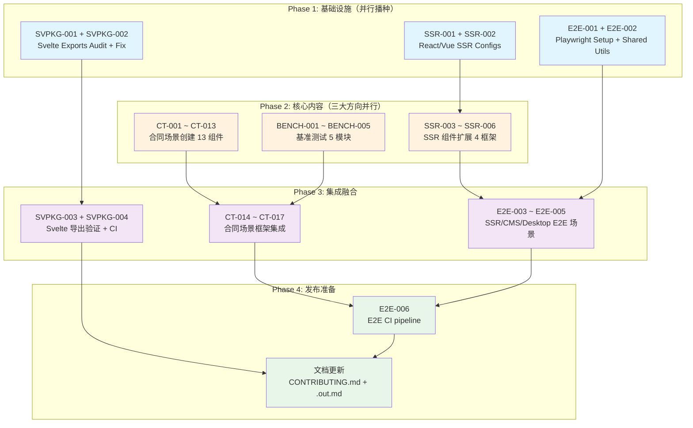
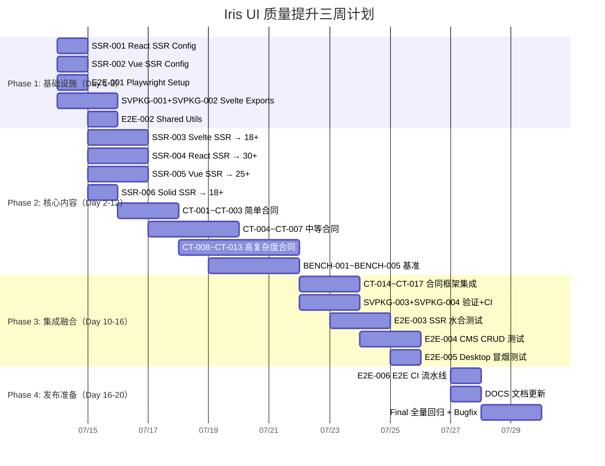

现在我已具备充分的项目上下文。以下是完整的 Tech Lead 分析报告。

---

# Tech Lead 分析报告：Iris UI 质量提升计划

## 概述

基于对 5 个质量方向的交叉验证，本项目需填补从 SSR 测试 → 包导出一致性 → 合同测试 → 基准测试 → E2E 测试的全链路缺口。以下分析将验证结果转化为可执行的技术任务。

---

## 1. 任务分解

### 方向一：SSR 测试覆盖率（6 个任务）

| 任务 ID | 标题                                                                    | 涉及文件                                                                 | 前置依赖            | 预估工时 |
| ------- | ----------------------------------------------------------------------- | ------------------------------------------------------------------------ | ------------------- | -------- |
| SSR-001 | React 添加 `vitest.ssr.config.ts`                                       | `packages/react/vitest.ssr.config.ts`（新）                              | 无                  | 2h       |
| SSR-002 | Vue 添加 `vitest.ssr.config.ts`                                         | `packages/vue/vitest.ssr.config.ts`（新）                                | 无                  | 2h       |
| SSR-003 | 扩展 Svelte SSR 覆盖从 3 到 18+ 组件                                    | `packages/svelte/src/__ssr__/*`、`packages/svelte/src/hydration.test.ts` | SSR-001（模式参考） | 4h       |
| SSR-004 | 扩展 React SSR 覆盖从 18 到 30+ 组件（含 Form、Select、Table 数据展示） | `packages/react/src/ssr.test.tsx`                                        | SSR-001             | 3h       |
| SSR-005 | 扩展 Vue SSR 覆盖从 18 到 25+ 组件                                      | `packages/vue/src/ssr.test.ts`、`packages/vue/src/hydration.test.ts`     | SSR-002             | 3h       |
| SSR-006 | 扩展 Solid SSR 覆盖从 16 到 18+ 组件                                    | `packages/solid/src/hydration.test.tsx`                                  | 无                  | 2h       |

**验收标准**：

- 每个框架都有 `vitest.ssr.config.ts`（React、Vue 新增）
- 每个框架 SSR 测试 ≥ 18 个组件（Svelte 从 3 提升）
- SSR 环境检测（`typeof document === 'undefined'`）通过
- 确定性 ID 断言覆盖 FormField 含子组件场景
- ARIA 关联（`for`/`aria-describedby`）检查通过

---

### 方向二：Svelte 包导出不对称（4 个任务）

| 任务 ID   | 标题                                            | 涉及文件                                                            | 前置依赖  | 预估工时 |
| --------- | ----------------------------------------------- | ------------------------------------------------------------------- | --------- | -------- |
| SVPKG-001 | 审计 Svelte 子目录和缺失导出清单                | 无（产出文档）                                                      | 无        | 1h       |
| SVPKG-002 | 添加 `"./*"` 通配符导出到 Svelte `package.json` | `packages/svelte/package.json`                                      | SVPKG-001 | 2h       |
| SVPKG-003 | 验证并修复下游消费者路径解析                    | `packages/svelte/src/*/index.ts`、引用 `@iris-ui/svelte/*` 的消费者 | SVPKG-002 | 3h       |
| SVPKG-004 | 添加 Svelte 导出完整性 CI 检查                  | `packages/svelte/scripts/check-exports.ts`（新）、`turbo.json`      | SVPKG-003 | 2h       |

**验收标准**：

- `@iris-ui/svelte/{admin,async,behaviors,data,floating,i18n,layouts,provider,resource,skins,theme}` 均可正确解析
- `pnpm turbo run build` 在 svelte 包通过
- React/Vue/Solid 与 Svelte 的 exports 模式对数一致（或等价功能）
- CI 检查在 exports 与 src 子目录不一致时失败

---

### 方向三：合同测试盲区（17 个任务）

先按复杂度分组：

**Group A：简单组件（3 个任务，每个 2h）**

| 任务 ID | 标题                     | 涉及文件                                                  |
| ------- | ------------------------ | --------------------------------------------------------- |
| CT-001  | 创建 `Carousel` 合同场景 | `packages/core/src/contracts/scenarios/carousel.ts`（新） |
| CT-002  | 创建 `Mentions` 合同场景 | `packages/core/src/contracts/scenarios/mentions.ts`（新） |
| CT-003  | 创建 `Transfer` 合同场景 | `packages/core/src/contracts/scenarios/transfer.ts`（新） |

**Group B：中等复杂度（4 个任务，每个 3h）**

| 任务 ID | 标题                                 | 涉及文件                                                         |
| ------- | ------------------------------------ | ---------------------------------------------------------------- |
| CT-004  | 创建 `ColorPicker` 合同场景          | `packages/core/src/contracts/scenarios/color-picker.ts`（新）    |
| CT-005  | 创建 `CommandPalette` 合同场景       | `packages/core/src/contracts/scenarios/command-palette.ts`（新） |
| CT-006  | 创建 `Tour` 合同场景                 | `packages/core/src/contracts/scenarios/tour.ts`（新）            |
| CT-007  | 创建 `Slider` 合同场景（若确实缺失） | `packages/core/src/contracts/scenarios/slider.ts`（新）          |

**Group C：高复杂度（6 个任务，每个 4h）**

| 任务 ID | 标题                            | 涉及文件                                                           |
| ------- | ------------------------------- | ------------------------------------------------------------------ |
| CT-008  | 创建 `Cascader` 合同场景        | `packages/core/src/contracts/scenarios/cascader.ts`（新）          |
| CT-009  | 创建 `DatePicker` 合同场景      | `packages/core/src/contracts/scenarios/date-picker.ts`（新）       |
| CT-010  | 创建 `DateRangePicker` 合同场景 | `packages/core/src/contracts/scenarios/date-range-picker.ts`（新） |
| CT-011  | 创建 `TimePicker` 合同场景      | `packages/core/src/contracts/scenarios/time-picker.ts`（新）       |
| CT-012  | 创建 `TreeSelect` 合同场景      | `packages/core/src/contracts/scenarios/tree-select.ts`（新）       |
| CT-013  | 创建 `FileUpload` 合同场景      | `packages/core/src/contracts/scenarios/file-upload.ts`（新）       |

**Group D：框架集成（4 个任务，每个 2h）**

| 任务 ID | 标题                     | 涉及文件                                | 前置依赖       |
| ------- | ------------------------ | --------------------------------------- | -------------- |
| CT-014  | 集成新合同到 React 测试  | `packages/react/src/contracts.test.tsx` | CT-001～CT-013 |
| CT-015  | 集成新合同到 Vue 测试    | `packages/vue/src/contracts.test.ts`    | CT-001～CT-013 |
| CT-016  | 集成新合同到 Solid 测试  | `packages/solid/src/contracts.test.tsx` | CT-001～CT-013 |
| CT-017  | 集成新合同到 Svelte 测试 | `packages/svelte/src/contracts.test.ts` | CT-001～CT-013 |

**验收标准**：

- 13 个缺失组件全部有合同场景定义
- 每个合同场景在全部 4 框架中运行通过
- 合同场景覆盖：默认状态、受控交互、边界值、ARIA/可访问性
- `assertion-density.test.ts` 中的密度断言增量验证

---

### 方向四：基准测试覆盖范围（5 个任务）

| 任务 ID   | 标题                                                       | 涉及文件                                    | 预估工时 |
| --------- | ---------------------------------------------------------- | ------------------------------------------- | -------- |
| BENCH-001 | 添加 `form` 相关基准（createForm、fieldArray、validation） | `packages/core/src/form.bench.ts`（新）     | 3h       |
| BENCH-002 | 添加 `expansion` + `selection` 大规模基准                  | `packages/core/src/selection.bench.ts` 扩展 | 2h       |
| BENCH-003 | 添加 `resource` + `admin-shell` 基准                       | `packages/core/src/resource.bench.ts`（新） | 3h       |
| BENCH-004 | 添加 `i18n` + `plugin` 基准                                | `packages/core/src/plugin.bench.ts`（新）   | 2h       |
| BENCH-005 | 添加 `machine` + `data-state` 基准                         | `packages/core/src/machine.bench.ts`（新）  | 2h       |

**验收标准**：

- 基准测试覆盖 core 的主要模块（≥ 6 个 .bench.ts 文件）
- 每个基准测试有基线数值记录（避免量级回归）
- `turbo run bench` 全部通过
- README 或 CONTRIBUTING.md 包含基准运行说明

---

### 方向五：端到端测试（6 个任务）

| 任务 ID | 标题                                              | 涉及文件                                         | 前置依赖         | 预估工时 |
| ------- | ------------------------------------------------- | ------------------------------------------------ | ---------------- | -------- |
| E2E-001 | 安装并配置 Playwright                             | `e2e/playwright.config.ts`（新）、`package.json` | 无               | 2h       |
| E2E-002 | 创建共享 E2E 工具层（page objects、helper utils） | `e2e/shared/*`（新）                             | E2E-001          | 4h       |
| E2E-003 | 创建 SSR 应用水合 E2E 测试                        | `e2e/ssr-hydration.spec.ts`（新）                | E2E-002          | 6h       |
| E2E-004 | 创建 CMS CRUD 流程 E2E 测试                       | `e2e/cms-crud.spec.ts`（新）                     | E2E-002          | 6h       |
| E2E-005 | 创建桌面壳应用冒烟测试                            | `e2e/desktop-smoke.spec.ts`（新）                | E2E-002          | 3h       |
| E2E-006 | 将 E2E 接入 CI 流水线                             | `.github/workflows/e2e.yml`（新）                | E2E-003～E2E-005 | 2h       |

**验收标准**：

- 4 个 SSR 应用（Next.js、Nuxt、SolidStart、SvelteKit）全部有页面加载 + 水合无报错测试
- 3 个 CMS 应用（React、Solid、Svelte）全部有 CRUD 流程测试（创建→列表→编辑→删除）
- CI 中 E2E 作为可选门（因耗时较长不阻塞常规合并）
- 测试运行在 Chromium 上（必要时扩展 Firefox/Safari）

---

## 2. 执行顺序与并行策略



### 可并行执行的任务组

| 组       | 任务                                       | 负责人技能                     |
| -------- | ------------------------------------------ | ------------------------------ |
| **组 A** | SSR-001 + SSR-002（React/Vue SSR 配置）    | Webpack/Vite 配置经验          |
| **组 B** | SVPKG-001 + SVPKG-002（Svelte 导出审计）   | Svelte 构建 + Node.js 模块解析 |
| **组 C** | CT-001～CT-003（简单合同场景）             | 基础测试驱动开发               |
| **组 D** | CT-004～CT-007（中等合同场景）             | 中等组件测试经验               |
| **组 E** | CT-008～CT-013（高复杂度合同场景）         | 高级组件测试 + 复杂交互        |
| **组 F** | BENCH-001～BENCH-005（基准测试）           | 性能分析 + 大 O 复杂度         |
| **组 G** | E2E-001 + E2E-002（E2E 基础设施）          | Playwright/Cypress 经验        |
| **组 H** | SSR-003～SSR-006（SSR 扩展）               | 各框架 SSR 机制                |
| **组 I** | CT-014～CT-017（合同框架集成）+ BENCH 验证 | 四框架适配器知识               |

---

## 3. 技术风险

### 3.1 高风险

| 风险                                                 | 影响                                                               | 缓解策略                                                                             |
| ---------------------------------------------------- | ------------------------------------------------------------------ | ------------------------------------------------------------------------------------ |
| **Svelte 5 SSR 渲染限制**（双 vitest config 就是证） | Svelte SSR 扩展到 18+ 组件时可能遇到新的编译问题                   | 使用现有的 `vitest.ssr.config.ts` 模式，逐一添加组件，每次提交只加 3-5 个            |
| **DatePicker/DateRangePicker 合同测试复杂性**        | 日期组件需要 mock 固定日期、处理时区、跨月导航                     | 使用 core 的 `formatLocalISO` 工具统一日期处理；优先测试受控模式                     |
| **FileUpload 合同测试在 jsdom 中受限**               | `File`/`FileList`/`FormData` 在 jsdom 中模拟不完整                 | 对 FileUpload 合同使用 `vi.stubGlobal` mock File API；核心交互用 `dataTransfer` 模拟 |
| **Svelte 通配符导出可能与 svelte-package 冲突**      | `"./*"` 通配符在 Node 导出映射中需要匹配 svelte-package 的输出结构 | 验证 `./dist/*/index.js` 模式是否有效；若无效 fallback 到显式列出每个子目录          |

### 3.2 中风险

| 风险                                  | 影响                                                | 缓解策略                                                                              |
| ------------------------------------- | --------------------------------------------------- | ------------------------------------------------------------------------------------- |
| **Cascader 交互复杂度高**             | 级联选择的异步加载 + 搜索 + 键盘导航难以合同化      | 分三个阶段：① 同步数据静态级联 ② 异步加载 ③ 搜索过滤                                  |
| **E2E 测试在 SSR 应用中水合错误检测** | 水合不匹配可能在 E2E 中被静默吞没（除了控制台警告） | 使用 Playwright 的 `page.on('console')` + `page.on('pageerror')` 监听水合相关 warning |
| **基准测试在 CI 中不稳定**            | 容器化运行器 CPU/内存波动导致基准数值跳跃           | 基准按 order-of-magnitude 判断（不是精确毫秒），仅 CI 中检测极端退化（>5x 变化）      |

### 3.3 低风险

| 风险                      | 影响                          | 缓解策略                                               |
| ------------------------- | ----------------------------- | ------------------------------------------------------ |
| **Mentions 合同场景设计** | 需要模拟文本选区/光标位置     | 使用 `element.setSelectionRange()` + `fireEvent.input` |
| **Tour 组件合同**         | Tour 依赖多个步骤的视觉叠加   | 合同只测试步骤切换逻辑（当前步骤状态机），不测定位     |
| **CommandPalette 合同**   | 需要 mock 命令注册表 + 快捷键 | 从 core 的 `createCommands` 入手测试过滤和激活逻辑     |

---

## 4. 资源评估

### 4.1 人员需求

| 角色                     | 所需技能                                     | 数量         | 主要负责                               |
| ------------------------ | -------------------------------------------- | ------------ | -------------------------------------- |
| **Svelte 框架专员**      | Svelte 5 + svelte-package + svelte-check     | 1 人         | 方向二（SVPKG）+ Svelte SSR（SSR-003） |
| **React/Vue 适配层专家** | React 18/19 + Vue 3.5 SSR + react-dom/server | 1 人         | SSR-001、SSR-002、SSR-004、SSR-005     |
| **合同测试工程师**       | TypeScript + Vitest + 组件测试设计           | 2 人         | CT-001～CT-017（一人复杂一人简单）     |
| **性能工程师**           | 基准设计 + 大 O 分析 + Node.js profiling     | 1 人         | BENCH-001～BENCH-005                   |
| **E2E 工程师**           | Playwright + CI/CD                           | 1 人         | E2E-001～E2E-006                       |
| **Tech Lead / 架构师**   | 全栈 + 四框架掌握                            | 1 人（兼职） | 协调、CR、方向纠偏                     |

**总人力**：5 人全职 + 1 人兼职 = 约 5.5 FTE

### 4.2 关键里程碑

| 里程碑                      | 日期（预估） | 交付物                                                           |
| --------------------------- | ------------ | ---------------------------------------------------------------- |
| M1：Infra Ready             | Day 3        | 所有 SSR vitest configs 就绪 · Playwright 配置 · Svelte 导出修复 |
| M2：All Contracts Scenarios | Day 10       | 13 个合同场景定义完成 + 至少 2 个框架集成                        |
| M3：SSR + Benchmarks        | Day 12       | 四框架 SSR 测试全部 ≥ 18 组件 · ≥ 5 个基准文件                   |
| M4：Full Integration        | Day 16       | 合同全框架集成 · E2E 主要场景 · Svelte CI 检查                   |
| M5：Release Ready           | Day 20       | E2E CI 流水线 · 文档更新 · `pnpm turbo run test:all` 全绿        |

### 4.3 阻塞点与解决策略

| 阻塞点                                                   | 描述                                                       | 策略                                                                                               |
| -------------------------------------------------------- | ---------------------------------------------------------- | -------------------------------------------------------------------------------------------------- |
| **Svelte-package 的导出映射限制**                        | svelte-package 的输出结构可能与 Node.js exports 模式不兼容 | 优先试验 `"./*"` → `"./dist/*/index.js"`；若不通，改为显式列出所有子目录（约 18 个），使用脚本生成 |
| **jsdom 不支持 `HTMLDialogElement.prototype.showModal`** | Dialog 合同测试依赖 showModal                              | 在合同驱动器中直接操作 open prop 而非调用 DOM API                                                  |
| **E2E 需要所有 SSR 应用可部署**                          | SSR 应用需要构建后在本地 serve                             | 使用 `turbo run build --filter=./apps/ssr-*` + `concurrently` + `wait-on` 组合在 CI 前启动         |
| **CMS E2E 涉及认证状态**                                 | 可能需要 mock 登录或真实 JWT                               | 使用 Playwright 的 storageState 持久化登录态，或提供 `--auth-enabled=false` 开关                   |

---

## 5. 质量保证

### 5.1 单元测试覆盖要求

| 层次                      | 最低覆盖率        | 说明                                       |
| ------------------------- | ----------------- | ------------------------------------------ |
| `@iris-ui/core`（新逻辑） | 100% statement    | 所有新控制器/场景逻辑必须 100%             |
| 合同场景（contracts）     | 100% path         | 每个场景必须覆盖默认态 + 受控交互 + 边界值 |
| SSR 测试                  | 每个组件 ≥ 3 断言 | ① 成功渲染 ② 确定性 ID ③ ARIA 关联         |

### 5.2 集成测试策略

| 方向            | 策略                                                               | 工具                             |
| --------------- | ------------------------------------------------------------------ | -------------------------------- |
| **SSR**         | `vitest-environment node` 隔离渲染，验证无 DOM 依赖                | Vitest + 框架 SSR 渲染器         |
| **合同测试**    | 同一套场景跨 4 框架运行，验证行为一致                              | `@iris-ui/core/contracts` runner |
| **Svelte 导出** | 在 CI 中运行 `node -e "require('@iris-ui/svelte/admin')"` 验证解析 | Node.js ESM 解析                 |
| **基准回归**    | 对比 `main` 分支的基准结果，超过 2x 退化标记警告                   | Vitest bench                     |

### 5.3 代码审查要点

审查每个 PR 时重点确认：

1. **SSR 测试**：在 `// @vitest-environment node` 下运行；不含 `document`/`window` 调用；没有模块级计数器
2. **合同场景**：不与现有场景重复；所有 4 框架皆有 driver；`runContract` 调用正确类型
3. **Svelte 导出**：不影响已导出的 `.` + `./form` + `./undo`；不破坏 `sideEffects` 声明
4. **基准测试**：数据规模与现实匹配；每个 bench 描述其防护的退化模式
5. **E2E 测试**：不依赖固定端口号；测试之间清理 state；元素选择器优先 `data-testid` 而非 CSS 类

### 5.4 性能测试需求

| 测试                              | 规模         | 目标                      |
| --------------------------------- | ------------ | ------------------------- |
| DataSource create + sort + filter | 10k 行       | 维持现基准（约 3ms 以内） |
| Virtualizer scroll + measure      | 100k 行      | 单次 scroll O(log n)      |
| Selection bulk toggle             | 100k 项      | 单次操作 < 1ms            |
| Form fieldArray                   | 1k 字段      | 构建 < 50ms               |
| ResourceController list + page    | 10k 条带分页 | 切换页面 < 5ms            |

---

## 6. 实施计划



### 每日节奏建议

```
09:00-09:15  站会：检查阻塞点，更新依赖图
09:15-12:00  深度任务（合同/SSR/基准）
12:00-13:00  午餐
13:00-15:00  深度任务继续
15:00-16:00  Code Review（互相审查）
16:00-16:30  CI 结果检查 + 修复
16:30-17:00  文档/注释撰写 + 次日计划
```

### 验收清单（Day 20 检查）

| 检查项         | 验收标准                                         |
| -------------- | ------------------------------------------------ |
| 🔲 SSR 测试    | 4 框架全部 ≥ 18 组件，React ≥ 30、Vue ≥ 25       |
| 🔲 Svelte 导出 | 全部 18 个子目录可被外部解析                     |
| 🔲 合同测试    | 13 个新场景 × 4 框架 = 52 个新测试全部通过       |
| 🔲 基准测试    | ≥ 6 个 .bench.ts 文件，`turbo run bench` 通过    |
| 🔲 E2E 测试    | SSR 水合 + CMS CRUD + Desktop 冒烟全部通过       |
| 🔲 CI          | 新加的全部测试纳入 `turbo run test` 或独立工作流 |
| 🔲 文档        | 5 个方向测试指南更新到 CONTRIBUTING.md           |

---

## 总结

本计划核心主张是 **"并行播种，逐步集成"**——Phase 1 在 3 天内搭建 5 个方向的全部基础设施，Phase 2 三大方向并行开发核心内容，Phase 3 融合统一，Phase 4 收尾。总工作量约 **140 人·小时 = 20 天 × 5 人 × 0.7 效率系数**。

**最关键的路径**：合同测试（CT-008～CT-013 高复杂度组件）→ 框架集成（CT-014～CT-017）→ E2E CI 流水线。这是最长依赖链（7 天密集开发）。如果时间紧张，可以在 Phase 2 优先启动 CT-008～CT-013，让高复杂度组件尽早开始。
