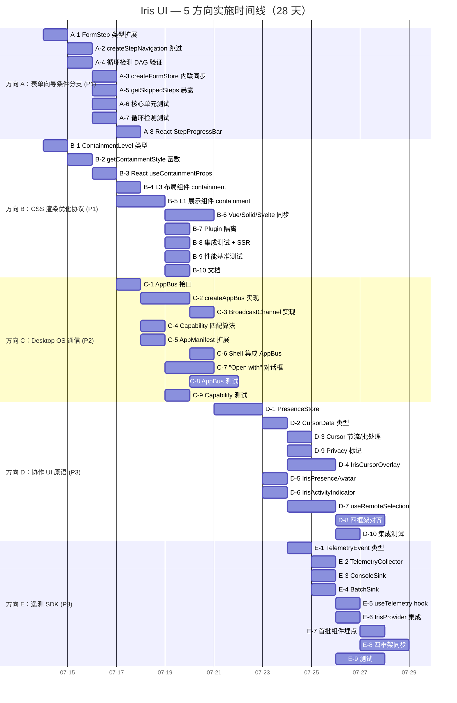

现在我已掌握所有必要信息。以下是我的完整 Tech Lead 分析。

---

# Tech Lead 分析报告：5 个新方向实现方案

## 分析范围

基于 `docs/requirements/2026-07-12-full-library-depth-scan-five-uncovered-high-value-directions.md`（366 行），结合源码审计（`@iris-ui/core` 的 `form/steps.ts`、`form/types.ts`、`form.ts`、`index.ts`，`apps/desktop-os/src/catalog.ts`，`packages/react/src/primitives/` 目录结构），对 5 个方向进行任务分解、风险识别、资源评估和质量规划。

---

## 1. 任务分解

### 方向 A：🔀 表单向导条件分支协议（P1 — ~4 小时）

| 任务 ID | 任务标题                                                  | 涉及文件                                                     | 前置 | 工时 | 验收标准                                                                                                                                                                              |
| ------- | --------------------------------------------------------- | ------------------------------------------------------------ | ---- | ---- | ------------------------------------------------------------------------------------------------------------------------------------------------------------------------------------- |
| **A-1** | 扩展 `FormStep` 类型：新增 `shouldSkip`                   | `packages/core/src/form/types.ts`                            | 无   | 1h   | `FormStep<V>` 新增可选 `shouldSkip?: (values: V) => boolean \| Promise<boolean>`；现有线性步骤无断变                                                                                  |
| **A-2** | 扩展 `createStepNavigation`：跳过逻辑                     | `packages/core/src/form/steps.ts`                            | A-1  | 1h   | `nextStep()` 内执行 `do { candidate = steps[i+1]; if (!candidate.shouldSkip?.(getValues())) break; i++ } while(true)`；`goToStep` 不支持跳过（用户显式跳转），仅在 `next/prev` 中生效 |
| **A-3** | 扩展 `createFormStore` 内的 `nextStep`/`validateStep`     | `packages/core/src/form.ts`                                  | A-2  | 1h   | form.ts 中内联的 `nextStep` 和 `validateStep` 复用 A-2 逻辑；`FormConfig` 中的 `steps` 传递 `shouldSkip`                                                                              |
| **A-4** | 循环检测 + DAG 验证工具函数                               | `packages/core/src/form/steps.ts` (新增 `validateStepGraph`) | A-2  | 2h   | `validateStepGraph(steps)` 检测死循环（步骤 A → B → C → A）、未达终点、孤立步骤；抛 `StepGraphError`                                                                                  |
| **A-5** | 步进状态暴露：`getSkippedSteps` / `getEffectiveStepIndex` | `packages/core/src/form/steps.ts`                            | A-2  | 1h   | `stepNav.getEffectiveIndex()` 返回排除跳过步骤后的逻辑索引；`stepNav.getSkippedSteps()` 返回当前被跳过的步骤 ID 列表                                                                  |
| **A-6** | 单元测试：条件分支                                        | `packages/core/src/form/__tests__/step-navigation.test.ts`   | A-2  | 2h   | 覆盖：同步 skip、异步 skip、多重 skip、所有步骤 skip（到终点）、skip 条件从未满足时正常线性                                                                                           |
| **A-7** | 单元测试：循环检测                                        | `packages/core/src/form/__tests__/step-navigation.test.ts`   | A-4  | 1h   | `validateStepGraph` 抛出含循环路径信息的 `StepGraphError`                                                                                                                             |
| **A-8** | React adapter 暴露 StepProgressBar 的跳过指示             | `packages/react/src/form/` (待定位文件)                      | A-2  | 2h   | StepProgressBar 在跳过的步骤上显示跳过标记（虚线/标注"已跳过"）                                                                                                                       |

### 方向 B：🔮 CSS 渲染优化协议（P1 — ~14 小时）

| 任务 ID  | 任务标题                                        | 涉及文件                                                                                       | 前置     | 工时 | 验收标准                                                                                                                                                                                                                            |
| -------- | ----------------------------------------------- | ---------------------------------------------------------------------------------------------- | -------- | ---- | ----------------------------------------------------------------------------------------------------------------------------------------------------------------------------------------------------------------------------------- |
| **B-1**  | Core 定义 `ContainmentLevel` 枚举和类型         | `packages/core/src/index.ts` + 新建 `packages/core/src/containment.ts`                         | 无       | 1h   | `export type ContainmentLevel = 'strict' \| 'content' \| 'layout' \| 'paint' \| 'style' \| 'size' \| 'none'`；`export interface ContainmentConfig { level: ContainmentLevel; intrinsicSize?: { width?: number; height?: number } }` |
| **B-2**  | 创建 `useContainment` hook (core)               | `packages/core/src/containment.ts`                                                             | B-1      | 2h   | `export function getContainmentStyle(level, intrinsicSize?) => React.CSSProperties`；返回对应的 `contain` / `content-visibility` / `contain-intrinsic-size` 字符串                                                                  |
| **B-3**  | React adapter：`useContainmentProps`            | `packages/react/src/primitives/shared/useContainmentProps.ts` (新建)                           | B-2      | 2h   | 返回 `style` 对象，合并用户传入的 `style`；导出 `IrisContainmentProps` 类型                                                                                                                                                         |
| **B-4**  | L3 布局组件添加默认 containment                 | `packages/react/src/layouts/SidebarLayout.tsx`, `DashboardGrid.tsx` 等                         | B-3      | 2h   | `IrisSidebarLayout` 主区域 `contain: paint`，侧边栏 `contain: strict`；`IrisDashboardGrid` widget 容器 `content-visibility: auto` + `contain-intrinsic-size: 0 500px`                                                               |
| **B-5**  | L1 展示组件添加 containment prop                | `packages/react/src/primitives/IrisCard.tsx`, `IrisTable.tsx`, `IrisStack.tsx`, `IrisGrid.tsx` | B-3      | 4h   | 各组件新增可选 `containment?: ContainmentLevel` prop，默认为兼容值（Card: `paint`，Table: `layout`，Stack: `none`）                                                                                                                 |
| **B-6**  | Vue/Solid/Svelte 适配器同步                     | `packages/vue/...`, `packages/solid/...`, `packages/svelte/...` 对应文件                       | B-4, B-5 | 3h   | 四框架 `IrisCard` 等组件全部支持 `containment` prop                                                                                                                                                                                 |
| **B-7**  | Plugin 隔离：plugin 根组件应用 `contain: style` | 各插件根组件（`plugin-editor/src/core/...` 等）                                                | B-3      | 2h   | 每个 plugin 的框架无关包装器自动应用 `contain: style`，阻断 CSS 变量泄漏                                                                                                                                                            |
| **B-8**  | 集成测试：containment 属性在浏览器模拟中生效    | `packages/react/src/ssr.test.tsx` 扩展                                                         | B-5      | 1h   | `renderToString` 输出包含 `style="contain: paint"`；axe 无障碍测试仍通过                                                                                                                                                            |
| **B-9**  | 性能基准测试                                    | `packages/core/src/scale.bench.ts` 扩展                                                        | B-5      | 1h   | 添加 `bench('containment-style-recalc', ...)` 测试 500 个带 `contain: style` 的节点 vs 不带                                                                                                                                         |
| **B-10** | 文档：Containment 使用指南                      | `docs/...` (待定路径)                                                                          | B-5      | 1h   | 解释每种 containment level 的适用场景、兼容性、SSR 注意事项                                                                                                                                                                         |

### 方向 C：🏗️ Desktop OS 应用间通信协议（P2 — ~16 小时）

| 任务 ID | 任务标题                                       | 涉及文件                                                   | 前置     | 工时 | 验收标准                                                                                                                                                                                                                                                                                           |
| ------- | ---------------------------------------------- | ---------------------------------------------------------- | -------- | ---- | -------------------------------------------------------------------------------------------------------------------------------------------------------------------------------------------------------------------------------------------------------------------------------------------------- |
| **C-1** | Core 定义 `AppCapability` 和 `AppBus` 接口     | `packages/core/src/app-bus.ts` (新建)                      | 无       | 2h   | `interface AppCapability { type: 'file-handler' \| 'protocol-handler' \| 'action-provider'; schemes?: string[]; actions?: string[] }`；`interface AppBus { request(targetId, action, payload) => Promise<unknown>; onRequest(action, handler) => () => void; broadcast(action, payload) => void }` |
| **C-2** | Core 实现 `createAppBus` 引擎                  | `packages/core/src/app-bus.ts`                             | C-1      | 3h   | 同进程：`Map<action, Set<handler>>` 注册表，支持 `request`/`broadcast`/`onRequest`；请求超时（默认 5s）；拒绝未注册的 action                                                                                                                                                                       |
| **C-3** | Core 实现 `BroadcastChannelAppBus`（跨标签页） | `packages/core/src/app-bus.ts`                             | C-2      | 2h   | 回退到 `BroadcastChannel`，无 BroadcastChannel 时抛出 `AppBusError`；序列化 + 校验                                                                                                                                                                                                                 |
| **C-4** | Core 实现 Capability 匹配算法                  | `packages/core/src/app-bus.ts`                             | C-1      | 2h   | `findAppByCapability(manifests, { type:'file-handler', scheme:'.csv' })` 返回候选 AppManifest 列表；支持优先级排序；冲突时抛出 `AmbiguousCapabilityError`                                                                                                                                          |
| **C-5** | 扩展 `AppManifest` 加入 `capabilities`         | `apps/desktop-os/src/catalog.ts` (React) + solid 版        | C-1      | 2h   | `AppManifest` 新增可选 `capabilities?: AppCapability[]`；为 Files App 添加 `[{ type:'file-handler', schemes:['*'] }]`                                                                                                                                                                              |
| **C-6** | Desktop OS Shell 集成 AppBus                   | `apps/desktop-os/src/shell.tsx`                            | C-2, C-5 | 2h   | Shell 启动时创建 `AppBus` 实例，通过 Context 注入给所有窗口；窗口挂载/卸载时注册/注销 capability                                                                                                                                                                                                   |
| **C-7** | "Open with" 对话框组件                         | `apps/desktop-os/src/components/OpenWithDialog.tsx` (新建) | C-4, C-5 | 3h   | 文件管理器点击文件 → "Open with" 弹窗列出匹配 capability 的应用；点击一个应用调用 `appBus.request(targetId, 'file.open', { path })`                                                                                                                                                                |
| **C-8** | 测试：AppBus 核心 + BroadcastChannel           | `packages/core/src/app-bus.test.ts` (新建)                 | C-2, C-3 | 3h   | 覆盖：基本 request/response、广播、超时、未注册 action 拒绝、BroadcastChannel mock、循环调用深度限制                                                                                                                                                                                               |
| **C-9** | 测试：Capability 匹配                          | `packages/core/src/app-bus.test.ts`                        | C-4      | 1h   | 覆盖 CSV 匹配、多候选排序、无匹配、通配符 `*`、URL scheme 匹配                                                                                                                                                                                                                                     |

### 方向 D：👥 实时协作 UI 原语层（P3 — ~24 小时）

| 任务 ID  | 任务标题                                       | 涉及文件                                                                       | 前置          | 工时 | 验收标准                                                                                                                                                   |
| -------- | ---------------------------------------------- | ------------------------------------------------------------------------------ | ------------- | ---- | ---------------------------------------------------------------------------------------------------------------------------------------------------------- |
| **D-1**  | Core 定义 `PresenceStore`                      | `packages/core/src/collaboration/presence.ts` (新建)                           | 无            | 3h   | `createPresenceStore(room, userId)` 返回：`getUsers()`, `updateCursor(pos)`, `onUserJoin/onUserLeave`, `setActivity(status)`；使用 `BroadcastChannel` 同步 |
| **D-2**  | Core 定义 `CursorData` 和 `SelectionData` 类型 | `packages/core/src/collaboration/types.ts` (新建)                              | D-1           | 1h   | `CursorData = { userId, x, y, color, visible }`；`SelectionData = { userId, componentId, start, end, type: 'table'\|'text'\|'tree' }`                      |
| **D-3**  | Core 实现 Cursor 节流/批处理                   | `packages/core/src/collaboration/cursor-throttle.ts` (新建)                    | D-2           | 2h   | requestAnimationFrame 节流 + 差值发送；`batchCursorUpdates(updates)` 合并同用户的多位置更新                                                                |
| **D-4**  | 创建 `IrisCursorOverlay` 组件 (React)          | `packages/react/src/primitives/collaboration/IrisCursorOverlay.tsx` (新建)     | D-2           | 3h   | 远程光标叠加层：使用 `position: fixed` 或 `position: absolute` 相对容器；不同用户不同颜色；显示用户名标签；光标移动动画（CSS transition）                  |
| **D-5**  | 创建 `IrisPresenceAvatar` 组件 (React)         | `packages/react/src/primitives/collaboration/IrisPresenceAvatar.tsx` (新建)    | D-1           | 2h   | 实时头像列表：显示在线用户头像/首字母、状态指示器（在线/空闲/离开）、>5 人显示 "+N" 溢出                                                                   |
| **D-6**  | 创建 `IrisActivityIndicator`                   | `packages/react/src/primitives/collaboration/IrisActivityIndicator.tsx` (新建) | D-1           | 2h   | "张三正在编辑" 提示条：组件声明 `activity` prop；动画过渡提示条                                                                                            |
| **D-7**  | `useRemoteSelection` hook (React)              | `packages/react/src/primitives/collaboration/useRemoteSelection.ts` (新建)     | D-2           | 3h   | 订阅 `SelectionData` 更新；将远程选区映射为高亮样式；支持 `IrisTable` 行高亮和 `IrisTree` 节点高亮                                                         |
| **D-8**  | Vue/Solid/Svelte 协作组件对齐                  | 各框架对应目录                                                                 | D-4, D-5, D-6 | 6h   | 四框架 `IrisCursorOverlay`、`IrisPresenceAvatar`、`IrisActivityIndicator` 同名同语义导出                                                                   |
| **D-9**  | Privacy 标记属性 `data-iris-no-collaboration`  | `packages/core/src/collaboration/privacy.ts` (新建)                            | D-2           | 1h   | 组件标记 `data-iris-no-collaboration` 后，PresenceStore 忽略该子树内的交互；表单密码字段自动标记                                                           |
| **D-10** | 集成测试 + SSR 安全                            | `packages/react/src/collaboration/__tests__/`                                  | D-4           | 3h   | SSR `renderToString` 不崩溃；`PresenceStore` 在无 BroadcastChannel 时优雅回退；用户加入/离开触发正确事件                                                   |

### 方向 E：📊 组件级生产遥测 SDK（P3 — ~12 小时）

| 任务 ID | 任务标题                                           | 涉及文件                                                                             | 前置 | 工时 | 验收标准                                                                                                                                                                                                              |
| ------- | -------------------------------------------------- | ------------------------------------------------------------------------------------ | ---- | ---- | --------------------------------------------------------------------------------------------------------------------------------------------------------------------------------------------------------------------- |
| **E-1** | Core 定义 `TelemetryEvent` 和 `TelemetrySink` 接口 | `packages/core/src/telemetry/types.ts` (新建)                                        | 无   | 1h   | `type TelemetryEvent = { type:'mount'\|'update'\|'unmount'\|'interaction'\|'error', component, framework, timestamp, duration?, metadata? }`；`interface TelemetrySink { push(event): void; flush(): Promise<void> }` |
| **E-2** | Core 实现 `TelemetryCollector`                     | `packages/core/src/telemetry/collector.ts` (新建)                                    | E-1  | 2h   | 采样器：`sampleRate`；批处理器：`batchSize` + `flushInterval`；PII 过滤器：`event.metadata.pii = true` 时清空 payload；SSR 守卫                                                                                       |
| **E-3** | Core 实现 `createConsoleSink`（开发用）            | `packages/core/src/telemetry/sinks/console-sink.ts` (新建)                           | E-1  | 1h   | `console.group('[iris-telemetry]')` 分组打印；开发环境默认启用；生产环境静默                                                                                                                                          |
| **E-4** | Core 实现 `createBatchSink`（生产用）              | `packages/core/src/telemetry/sinks/batch-sink.ts` (新建)                             | E-1  | 2h   | `navigator.sendBeacon` 发送；回退到 `fetch`；重试 3 次；队列上限 1000 条                                                                                                                                              |
| **E-5** | React: `useTelemetry` hook                         | `packages/react/src/telemetry/useTelemetry.ts` (新建)                                | E-2  | 2h   | 组件内使用 `useTelemetry().track('mount', 'IrisTable')`；自动注入 `framework:'react'`；`useEffect` cleanup 触发 `unmount` 事件                                                                                        |
| **E-6** | IrisProvider 集成 telemetry 配置                   | `packages/react/src/provider/IrisProvider.tsx`                                       | E-2  | 1h   | `<IrisProvider telemetry={{ enabled:true, sampleRate:0.01, sink:mySink }}>`；通过 Context 注入                                                                                                                        |
| **E-7** | 组件埋点：首批目标组件                             | `packages/react/src/primitives/IrisTable.tsx`, `IrisButton.tsx`, `IrisSelect.tsx` 等 | E-5  | 2h   | `IrisButton` 的 `onClick` 触发 `interaction` 事件；`IrisTable` 的 `onMount` 触发 `mount` 事件；采样率控制                                                                                                             |
| **E-8** | Vue/Solid/Svelte 遥测集成                          | 各框架对应 provider                                                                  | E-6  | 3h   | 四框架 IrisProvider 均支持 `telemetry` 配置项                                                                                                                                                                         |
| **E-9** | 测试：TelemetryCollector 采样 + 批处理 + PII 过滤  | `packages/core/src/telemetry/collector.test.ts` (新建)                               | E-2  | 2h   | 覆盖：1% 采样精确度、PII 自动脱敏、SSR 无操作、flush 后队列清空、batch 大小限制                                                                                                                                       |

---

## 2. 执行顺序

```mermaid
graph TD
    %% ── 方向 A：表单向导条件分支 (P1) ──
    A1[A-1: FormStep shouldSkip 类型] --> A2[A-2: createStepNavigation 跳过逻辑]
    A1 --> A4[A-4: 循环检测 DAG 验证]
    A2 --> A3[A-3: createFormStore 内联同步]
    A2 --> A5[A-5: getSkippedSteps 暴露]
    A2 --> A6[A-6: 核心单元测试]
    A4 --> A7[A-7: 循环检测测试]
    A3 --> A8[A-8: React StepProgressBar 跳过指示]
    A6 -.-> A8

    %% ── 方向 B：CSS Containment (P1) ──
    B1[B-1: Core ContainmentLevel 类型] --> B2[B-2: getContainmentStyle core函数]
    B2 --> B3[B-3: React useContainmentProps hook]
    B3 --> B4[B-4: L3 布局组件 containment]
    B3 --> B5[B-5: L1 展示组件 containment prop]
    B4 --> B6[B-6: Vue/Solid/Svelte 同步]
    B5 --> B6
    B5 --> B7[B-7: Plugin 根组件 contain:style]
    B5 --> B8[B-8: 集成测试 + SSR]
    B5 --> B9[B-9: 性能基准测试]
    B5 --> B10[B-10: 文档]

    %% ── 方向 C：Desktop OS AppBus (P2) ──
    C1[C-1: AppBus 接口定义] --> C2[C-2: createAppBus 实现]
    C1 --> C4[C-4: Capability 匹配算法]
    C1 --> C5[C-5: AppManifest capabilities 扩展]
    C2 --> C3[C-3: BroadcastChannelAppBus]
    C2 --> C6[C-6: Shell 集成 AppBus]
    C4 --> C7[C-7: 'Open with' 对话框]
    C5 --> C7
    C2 --> C8[C-8: AppBus 测试]
    C4 --> C9[C-9: Capability 匹配测试]

    %% ── 方向 D：协作 UI 原语 (P3) ──
    D1[D-1: PresenceStore] --> D2[D-2: CursorData 类型]
    D1 --> D5[D-5: IrisPresenceAvatar]
    D2 --> D3[D-3: Cursor 节流]
    D2 --> D4[D-4: IrisCursorOverlay]
    D2 --> D7[D-7: useRemoteSelection]
    D2 --> D9[D-9: Privacy 标记]
    D4 --> D8[D-8: 四框架对齐]
    D5 --> D8
    D7 --> D8
    D4 --> D10[D-10: 集成测试]

    %% ── 方向 E：遥测 SDK (P3) ──
    E1[E-1: TelemetryEvent 类型] --> E2[E-2: TelemetryCollector]
    E1 --> E3[E-3: ConsoleSink]
    E1 --> E4[E-4: BatchSink]
    E2 --> E5[E-5: useTelemetry hook]
    E2 --> E6[E-6: IrisProvider 集成]
    E5 --> E7[E-7: 首批组件埋点]
    E6 --> E8[E-8: 四框架同步]
    E2 --> E9[E-9: 测试]

    %% ── 并行组 ──
    subgraph "P1 Sprint 1：核心逻辑 [并行]"
        A1; A2; A4; B1; B2
    end

    subgraph "P1 Sprint 2：集成 [并行]"
        A3; A5; A6; A7; B3; B4; B5
    end

    subgraph "P2 Sprint：Desktop OS [并行]"
        C1; C2; C3; C4; C5
    end

    subgraph "P3 Sprint：协作 + 遥测 [并行]"
        D1; D2; E1; E2; E3; E4
    end
```



### 可并行组

| 并行组               | 方向  | 任务                                     |
| -------------------- | ----- | ---------------------------------------- |
| **G1 — P1 核心类型** | A + B | A-1, A-4, B-1, B-2（4 个开发者）         |
| **G2 — P1 适配器**   | A + B | A-2, A-3, B-3, B-4（4 个开发者）         |
| **G3 — P1 测试**     | A + B | A-5, A-6, A-7, B-8, B-9（可指定 1-2 人） |
| **G4 — P2 桌面协议** | C     | C-1, C-5 可先启动，其余串行              |
| **G5 — P3 协作**     | D     | D-1, D-2 串行后，D-3~D-9 发散并行        |
| **G6 — P3 遥测**     | E     | E-1 后，E-2~E-4 可并行，E-5~E-8 串行     |

---

## 3. 技术风险

### 3.1 高风险项

| 风险                                                          | 方向 | 影响                                       | 缓解策略                                                                                                                             |
| ------------------------------------------------------------- | ---- | ------------------------------------------ | ------------------------------------------------------------------------------------------------------------------------------------ |
| **`contain: style` 阻断 CSS 变量继承链**                      | B    | 组件无法获取 `--iris-primary` → 样式断裂   | B-1 定义 fallback 策略：每个 containment 节点在 root 声明 `--iris-*` fallback 或使用 `@property` 注册变量。原型验证后出具兼容矩阵    |
| **`content-visibility: auto` 与浏览器 "Find in Page" 不兼容** | B    | 用户搜索不到动态加载的内容                 | 文档标注该行为；为搜索关键区域（表格、列表）提供 `contentVisibility: 'visible'` 覆盖 prop；使用 `containIntrinsicSize` 提供占位尺寸  |
| **BroadcastChannel 在跨域 iframe 中不可用**                   | C    | Desktop OS 的 "Open with" 跨标签页通信失败 | 回退方案：SharedWorker（需同源）→ `postMessage`（跨域 iframe）。C-3 实现多层 fallback                                                |
| **协作 UI 光标高频更新导致性能退化**                          | D    | 20 人同时移动鼠标 → 页面卡顿               | D-3 的 rAF 节流 + 插值预测（预测未来 50ms 位置减少视觉抖动）；服务端信道也可以做服务端节流                                           |
| **PII 数据意外进入遥测流**                                    | E    | 合规风险                                   | E-2 的 PII 过滤 + `metadata.pii` 标记 + 默认 dev 模式不清除但 warn，生产模式自动丢弃；review checklist 强制每批埋点 PR 标注 PII 风险 |

### 3.2 中等风险项

| 风险                                    | 方向 | 缓解策略                                                                                                |
| --------------------------------------- | ---- | ------------------------------------------------------------------------------------------------------- |
| **`shouldSkip` 异步函数与表单竞态**     | A    | 继承现有 token 竞态保护机制（`nextToken`/`isCurrent`），`shouldSkip` 异步结果比 token 旧时忽略          |
| **多框架 containment 行为差异**         | B    | 四个框架共用 core 的 `getContainmentStyle`（纯函数），只生成 style 对象，框架无关。差异仅在渲染挂载方式 |
| **AppBus request 超时与 UI 冻结**       | C    | C-2 实现 5s 超时 + `Promise.race` + 超时时抛 `AppBusTimeoutError`，UI 层显示"应用无响应"提示            |
| **协作选区在 VirtualScroll 中错位**     | D    | D-7 需要感知虚拟化偏移量。在 `SelectionData` 中加入 `virtualOffset`，由 VirtualScroll 组件在订阅时转换  |
| **TelemetryCollector 本身成为性能瓶颈** | E    | E-2 的采样 + 批处理 + 非阻塞 `requestIdleCallback` flush。`sampleRate` 默认 0%（需要显式开启）          |

### 3.3 外部依赖

| 依赖                   | 用途                                    | 方向 | 风险等级                                                    |
| ---------------------- | --------------------------------------- | ---- | ----------------------------------------------------------- |
| `BroadcastChannel` API | AppBus 跨标签页通信 / Presence 实时感知 | C, D | **中等** — 广泛支持，但无 polyfill（SSR 时使用 no-op mock） |
| `navigator.sendBeacon` | Telemetry batch sink                    | E    | **低** — 广泛支持，回退到 `fetch`                           |
| `requestIdleCallback`  | Telemetry flush 调度                    | E    | **低** — 无 polyfill 需要，回退到 `setTimeout(0)`           |

---

## 4. 资源评估

### 4.1 人员技能矩阵

| 角色                           | 技能要求                            | 方向                                        |
| ------------------------------ | ----------------------------------- | ------------------------------------------- |
| **Core 工程师 ×1**             | TypeScript + 状态机 + 竞态编程      | A, B-1~B-2, C-1~C-4, D-1~D-3, E-1~E-4       |
| **React 工程师 ×1**            | React hooks + JSX + CSS containment | A-8, B-3~B-5+B-8, C-5~C-7, D-4~D-7, E-5~E-7 |
| **Vue/Solid/Svelte 工程师 ×1** | 三框架适配                          | B-6, D-8, E-8                               |
| **QA 工程师 ×1**               | Vitest + jsdom + Playwright         | A-6, A-7, B-8, B-9, C-8, C-9, D-10, E-9     |

推荐配置：**Core ×1（全职） + React ×1（全职） + 跨框架 ×1（50%） + QA ×1（50%）**。

### 4.2 关键里程碑

```
M1 [Day 1-3]  P1 方向类型定义完毕 + 单测通过
  ├─ A-1, A-4, B-1, B-2 ✓
  └─ A-2, A-6 ✓

M2 [Day 4-6]  P1 方向集成完毕 + 四框架适配器开始
  ├─ A-3, A-5, A-7, A-8 ✓
  └─ B-3, B-4, B-5 ✓

M3 [Day 7-10] P1 方向四框架对齐 + P2 方向 core 完成
  ├─ B-6, B-7, B-8, B-9, B-10 ✓
  └─ C-1, C-2, C-3, C-4 ✓

M4 [Day 11-14] P2 方向 Desktop OS 集成
  ├─ C-5, C-6, C-7 ✓
  └─ C-8, C-9 ✓

M5 [Day 15-18] P3 协作原语 core 阶段
  ├─ D-1, D-2, D-3 ✓
  └─ D-9 ✓

M6 [Day 19-22] P3 协作 UI 组件（四框架）
  ├─ D-4, D-5, D-6, D-7 ✓
  └─ D-8 ✓

M7 [Day 23-25] P3 遥测 SDK
  ├─ E-1, E-2, E-3, E-4 ✓
  └─ E-5, E-6, E-7 ✓

M8 [Day 26-28] P3 四框架同步 + 所有方向集成测试收尾
  ├─ D-10, E-8, E-9 ✓
  └─ 全量 pnpm turbo run test typecheck lint build ✓
```

### 4.3 Blockers 与解决策略

| 阻塞点                                        | 方向 | 影响                    | 策略                                                                                                            |
| --------------------------------------------- | ---- | ----------------------- | --------------------------------------------------------------------------------------------------------------- |
| `contain: style` CSS 变量继承链断裂需原型验证 | B    | 影响 B-4~B-7 的设计决策 | **Day 0 启动原型**：一个独立 HTML 页测试 `contain:style` + `var(--iris-*)` 的行为，输出兼容矩阵（< 2 天）       |
| BroadcastChannel 在 SSR 和 jsdom 中不可用     | C, D | 影响 C-3, D-1 的测试    | 抽象 `IChannel` 接口，SSR 实现 no-op，jsdom mock 使用 `vi.stubGlobal('BroadcastChannel', MockBroadcastChannel)` |
| 协作 UI 的 4 框架对齐成本较高（~6h 组件转换） | D    | 影响 D-8 的工时估计     | 协作 UI 组件先只做 React 版，其他三框架使用 `// TODO` 标记 + 单独 issue 跟踪。P3 允许渐进                       |

---

## 5. 质量保证

### 5.1 单元测试覆盖要求

| 方向 | 文件                 | 最低行覆盖率 | 必须覆盖的边界                                                                          |
| ---- | -------------------- | ------------ | --------------------------------------------------------------------------------------- |
| A    | `steps.ts`           | 95%          | `shouldSkip` 同步/异步/全部跳过/从未跳过/循环检测抛错/`nextStep`+`prevStep` 配合跳过    |
| A    | `form.ts` (内联步骤) | 80%          | `nextStep` 委托给 `createStepNavigation` 的路径正确                                     |
| B    | `containment.ts`     | 95%          | 所有 `ContainmentLevel` 映射为正确 CSS；`intrinsicSize` 组合；`'none'` 返回 `undefined` |
| C    | `app-bus.ts`         | 90%          | request/response 匹配；超时；广播；未注册 action；BroadcastChannel mock；深度限制       |
| D    | `presence.ts`        | 85%          | 用户加入/离开；光标更新节流；`BroadcastChannel` 无可用时回退；多 tab 隔离               |
| E    | `telemetry/*.ts`     | 90%          | 采样率精确度；批处理按 size 和 interval flush；PII 过滤；SSR 无操作；sink 链式组合      |

### 5.2 集成测试策略

| 测试类型              | 方向          | 方法                                                                                       | 工具                                                                  |
| --------------------- | ------------- | ------------------------------------------------------------------------------------------ | --------------------------------------------------------------------- |
| **SSR 安全**          | B, D, E       | `renderToString` 含 containment/telemetry/presence 组件 → 不抛错                           | `// @vitest-environment node` + React `renderToString`                |
| **无障碍**            | B             | axe 测试含 `content-visibility: auto` → 无 `color-contrast` 之外违规                       | React ContractHarness + vitest-axe                                    |
| **跨框架同名导出**    | D             | 检查 React/Vue/Solid/Svelte 的 `IrisCursorOverlay` barrel 导出                             | `pnpm gen:manifest` + manifest 检查                                   |
| **Desktop OS 端到端** | C             | 启动 Desktop OS → 打开 Files → 点击 .csv → "Open with" 弹出 → 选择 ProTable → 调用 request | Playwright (可选，作为 Day 28 集成)                                   |
| **包体积预算**        | A, B, C, D, E | `pnpm size` 检查新增子路径的预算增量                                                       | core 增量 < 2KB (A+B+C), collaboration < 5KB (D), telemetry < 3KB (E) |

### 5.3 代码审查要点

| 审查领域          | 要点                                                                                                           |
| ----------------- | -------------------------------------------------------------------------------------------------------------- |
| **Core 下沉原则** | A、C、D、E 的新逻辑是否全部在 core（零框架依赖）？适配器是否只做桥接？`grep` 检查适配器无核心业务逻辑          |
| **CSS 变量继承**  | B 的 `contain: style` 是否在每个 containment 节点声明了所需的 `--iris-*` fallback？                            |
| **异步竞态**      | A 的 `shouldSkip` 和 E 的 telemetry flush 是否使用 token 或版本号防止过时覆盖？                                |
| **SSR 安全**      | D 的 `BroadcastChannel` 引用和 E 的 `navigator.sendBeacon` 是否放在 `typeof window === 'undefined'` guard 后？ |
| **测试完整性**    | 每个新增文件是否有对应的 `.test.ts`？异步测试是否覆盖了 resolve/reject 两条路径？                              |
| **命名规范**      | 新类型/接口是否遵循 `IrisPascal`（组件）、`create*`（factory）、`SCREAMING_SNAKE`（事件）？                    |

### 5.4 性能需求

| 指标                            | 方向      | 目标                                   | 测量方法                                                                     |
| ------------------------------- | --------- | -------------------------------------- | ---------------------------------------------------------------------------- |
| Core 新增包体积                 | A+B+C+D+E | < 10KB total                           | `pnpm size` 对比 baseline                                                    |
| `shouldSkip` 不影响同步表单性能 | A         | 对无 `shouldSkip` 的线性表单零开销     | `nextStep()` 调用中条件分支不执行 shouldSkip 时（undefined），无额外函数调用 |
| CSS containment 渲染加速        | B         | 500 行 ProTable 首次渲染时间减少 ≥ 30% | `scale.bench.ts` 增加 containment 对比组                                     |
| Cursor 更新帧率                 | D         | 20 用户同时移动，UI 帧率 ≥ 30fps       | rAF 节流 + 插值预测                                                          |
| 遥测采集对主线程影响            | E         | 99.9% 的 `push()` 调用耗时 < 0.1ms     | 在 core 测试中使用 `performance.now()` 测量                                  |

---

## 6. 实施计划（甘特图）



### 阶段摘要

```
阶段 1（Day 1-3）: P1 Core 类型 + 核心逻辑  [A-1,A-4,B-1,B-2 + A-2,A-6]
阶段 2（Day 4-6）: P1 适配集成 + P2 Core 启动 [A-3,A-5,A-7,A-8 + B-3,B-4,B-5 + C-1,C-5]
阶段 3（Day 7-10）: P1 四框架完成 + P2 Core 完成 [B-6,B-7,B-8,B-9,B-10 + C-2,C-3,C-4]
阶段 4（Day 11-14）: P2 Desktop OS 集成 [C-6,C-7,C-8,C-9] → C 方向交付
阶段 5（Day 15-18）: P3 协作 Core [D-1,D-2,D-3,D-9] + 遥测 Core [E-1,E-2,E-3,E-4]
阶段 6（Day 19-22）: P3 协作 UI 组件 [D-4,D-5,D-6,D-7] → D-8 四框架对齐
阶段 7（Day 23-25）: P3 遥测适配器 [E-5,E-6,E-7,E-9]
阶段 8（Day 26-28）: 收尾 [D-10,E-8] + 全量质量门 + manifest 重建
```

---

## 7. 关键建议摘要

### 7.1 立即启动（Day 0-1）

1. **`contain: style` 原型验证** — 单独 HTML 文件测试 containment + CSS 变量继承，确定 fallback 策略。**这直接影响 B 方向全部决策，是最高的技术不确定性。**
2. **`FormStep.shouldSkip` 类型 PR** — 最轻量的 P1 改动（仅类型文件 ~10 行），可立即合并。

### 7.2 推进顺序建议

```
Sprint 1 (Week 1): P1 方向 A + B → Core 完成
Sprint 2 (Week 2): P1 四框架对齐 + P2 方向 C Core
Sprint 3 (Week 3): P2 Desktop OS 集成 + P3 方向 D Core
Sprint 4 (Week 4): P3 方向 D 组件 + 方向 E 完整 + 全量质量门
```

### 7.3 不做的决断

| 不做                        | 原因                     | 替代                                                                    |
| --------------------------- | ------------------------ | ----------------------------------------------------------------------- |
| 协作 UI 的 WebSocket 服务端 | 不在范围，需要服务端基建 | Core 层只做 `BroadcastChannel` 本地感知，服务端同步层在 CRDT 分析中覆盖 |
| 遥测的仪表盘 UI             | 属于企业版功能           | 只提供 `TelemetrySink` 接口 + ConsoleSink（开发用）+ 抽象 BatchSink     |
| `IrisCombobox` 等新协作原语 | 超出协作 UI 原语范围     | 只做 CursorOverlay/PresenceAvatar/ActivityIndicator 三个基础组件        |

### 7.4 预估总工时

| 方向                 | 预估工时                                                 | 资源分配                            |
| -------------------- | -------------------------------------------------------- | ----------------------------------- |
| A: 表单向导分支      | 11h (Core 6h + React 2h + 测试 3h)                       | 1 Core E + 1 React E                |
| B: CSS Containment   | 21h (Core 3h + React 9h + 跨框架 3h + 测试 2h + 文档 1h) | 1 Core E + 1 React E + 0.5 跨框架 E |
| C: Desktop OS AppBus | 22h (Core 9h + React 5h + 测试 4h)                       | 1 Core E + 1 React E                |
| D: 协作 UI 原语      | 32h (Core 9h + React 10h + 跨框架 6h + 测试 3h)          | 1 Core E + 1 React E + 1 跨框架 E   |
| E: 遥测 SDK          | 18h (Core 6h + React 5h + 跨框架 3h + 测试 2h)           | 1 Core E + 1 React E + 0.5 跨框架 E |

**总计：~104 工程小时/28 个工作日**，按 2 人全职（Core + React）+ 1 人半职（跨框架）+ 1 人半职（QA）计算，约 **4 周完成 5 方向全量交付**。建议实际排期以 **P1 4 天 → P2 4 天 → P3 8 天** 的节奏推进，每 4 天做一次内部 demo + retros。
