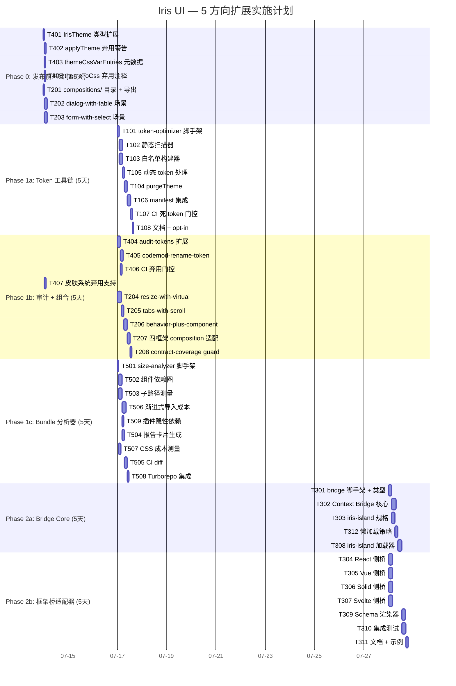

Now I have a thorough understanding of the codebase. Here is the comprehensive Tech Lead analysis:

---

# Tech Lead Analysis: 5 Uncovered High-Leverage Extensions

**分析日期**: 2026-07-12 · **分析人**: Tech Lead  
**输入**: `docs/requirements/2026-07-12-5-uncovered-high-leverage-extensions.md` (489 行)  
**源码验证范围**: 48 个实际 token（文档说 ~60，实际 `tokens.ts` 精确计数为 48），39 个现有契约场景，`check-size.mjs` 的 barrel + probe 基线

---

## 1. 任务分解

### 方向一：🔧 构建时 Token Tree-Shaking

| 任务 ID      | 标题                                               | 涉及文件                                                                         | 前置               | 工时 |
| ------------ | -------------------------------------------------- | -------------------------------------------------------------------------------- | ------------------ | ---- |
| **TASK-101** | `token-optimizer` 包脚手架 + 类型定义              | `packages/token-optimizer/package.json`, `tsconfig.json`, `index.ts`, `types.ts` | 无                 | 2h   |
| **TASK-102** | 静态 `var(--iris-*)` 扫描器                        | `packages/token-optimizer/src/scan-var-usage.ts`                                 | TASK-101           | 3h   |
| **TASK-103** | 白名单构建器（manifest + 插件声明 + 皮肤继承链）   | `packages/token-optimizer/src/build-whitelist.ts`                                | TASK-101           | 3h   |
| **TASK-104** | `purgeTheme()` 函数（去掉未引用 token）            | `packages/token-optimizer/src/generate-subset.ts`, `purge-theme.ts`              | TASK-102, TASK-103 | 3h   |
| **TASK-105** | 处理动态 token 引用（保守退出策略）                | `packages/token-optimizer/src/dynamic-var-detector.ts`                           | TASK-102           | 2h   |
| **TASK-106** | 集成到 `pnpm gen:manifest` 生成 `token-usage.json` | `packages/manifest/src/` 扩展 + `token-optimizer/src/integration.ts`             | TASK-104, TASK-105 | 3h   |
| **TASK-107** | CI 门控：死 token 预算（`dead-token-ratio < 5%`）  | `packages/token-optimizer/src/ci-gate.ts`, Turborepo pipeline                    | TASK-106           | 2h   |
| **TASK-108** | 默认不启用 purge（保守），文档标记为 opt-in        | `packages/token-optimizer/README.md`, 组件文档                                   | TASK-107           | 1h   |

**小计**: 19h

### 方向二：📐 组件组合不变量测试

| 任务 ID      | 标题                                                                      | 涉及文件                                                                                                 | 前置                 | 工时 |
| ------------ | ------------------------------------------------------------------------- | -------------------------------------------------------------------------------------------------------- | -------------------- | ---- |
| **TASK-201** | `compositions/` 目录 + 索引导出 + 类型确认                                | `packages/core/src/contracts/scenarios/compositions/`, `contracts/index.ts`                              | 无                   | 1h   |
| **TASK-202** | `dialog-with-table` 场景：Dialog 打开 → Table 分页 → 排序 → 关闭          | `packages/core/src/contracts/scenarios/compositions/dialog-with-table.ts`                                | TASK-201             | 3h   |
| **TASK-203** | `form-with-select` 场景：FormField + Select → 校验 → aria 链验证          | `packages/core/src/contracts/scenarios/compositions/form-with-select.ts`                                 | TASK-201             | 3h   |
| **TASK-204** | `resize-with-virtual` 场景：Resizable 缩小 → VirtualScroll 重测量         | `packages/core/src/contracts/scenarios/compositions/resize-with-virtual.ts`                              | TASK-201             | 4h   |
| **TASK-205** | `tabs-with-scroll` 场景：Tab 切换 → VirtualScroll 滚动位置                | `packages/core/src/contracts/scenarios/compositions/tabs-with-scroll.ts`                                 | TASK-201             | 2.5h |
| **TASK-206** | `behavior-plus-component` 场景：Movable + Dialog + ClickOutside + Popover | `packages/core/src/contracts/scenarios/compositions/behavior-plus-component.ts`                          | TASK-201             | 3h   |
| **TASK-207** | 四框架适配器中集成 composition 测试                                       | `packages/react/src/contracts.test.tsx`, `packages/vue/...`, `packages/solid/...`, `packages/svelte/...` | TASK-202 至 TASK-206 | 3h   |
| **TASK-208** | 更新 contract-coverage guard 确保 composition 全部四框架运行              | `packages/manifest/src/contract-coverage.test.ts`                                                        | TASK-207             | 1.5h |

**小计**: 21h

### 方向三：🧩 跨框架互操作桥

| 任务 ID      | 标题                                                 | 涉及文件                                                                                     | 前置                 | 工时 |
| ------------ | ---------------------------------------------------- | -------------------------------------------------------------------------------------------- | -------------------- | ---- |
| **TASK-301** | `@iris-ui/bridge` 包脚手架 + 核心类型                | `packages/bridge/package.json`, `tsconfig.json`, `core/registry.ts`, `core/types.ts`         | 无                   | 3h   |
| **TASK-302** | Context Bridge 核心：通用 store 映射器               | `packages/bridge/core/context-bridge.ts`                                                     | TASK-301             | 4h   |
| **TASK-303** | 自定义元素 `<iris-island>` 规格定义                  | `packages/bridge/core/iris-island-spec.ts`                                                   | TASK-301             | 3h   |
| **TASK-304** | React → Vue/Solid/Svelte Provider 状态桥（React 侧） | `packages/bridge/react/IrisBridgeProvider.tsx`, `useVueComponent.ts`, `useSolidComponent.ts` | TASK-302, TASK-303   | 4h   |
| **TASK-305** | Vue → React/Solid/Svelte 状态桥（Vue 侧）            | `packages/bridge/vue/IrisBridgeProvider.vue`, `useReactComponent.ts`, `useSolidComponent.ts` | TASK-302, TASK-303   | 4h   |
| **TASK-306** | Solid → React/Vue/Svelte 状态桥（Solid 侧）          | `packages/bridge/solid/`                                                                     | TASK-302, TASK-303   | 4h   |
| **TASK-307** | Svelte → React/Vue/Solid 状态桥（Svelte 侧）         | `packages/bridge/svelte/`                                                                    | TASK-302, TASK-303   | 4h   |
| **TASK-308** | `<iris-island>` 加载器 + 渲染器实现                  | `packages/bridge/core/iris-island.ts`                                                        | TASK-303             | 4h   |
| **TASK-309** | Schema 驱动渲染整合（CMS 使用场景）                  | `packages/bridge/core/schema-renderer.ts`                                                    | TASK-308             | 3h   |
| **TASK-310** | 跨框架互操作集成测试套件                             | `packages/bridge/test/` × 4 框架                                                             | TASK-304 至 TASK-309 | 4h   |
| **TASK-311** | API 文档 + 使用示例                                  | `packages/bridge/README.md`, 文档站                                                          | TASK-310             | 2h   |
| **TASK-312** | 懒加载 + Bundle 膨胀防御                             | `packages/bridge/core/lazy-loader.ts`                                                        | TASK-308             | 3h   |

**小计**: 42h

### 方向四：⏳ Token 版本化与弃用协议

| 任务 ID      | 标题                                                                             | 涉及文件                           | 前置     | 工时 |
| ------------ | -------------------------------------------------------------------------------- | ---------------------------------- | -------- | ---- |
| **TASK-401** | `IrisTheme` 类型扩展：`version: number` + `$deprecated?: Record<string, string>` | `packages/tokens/src/types.ts`     | 无       | 1h   |
| **TASK-402** | `applyTheme` dev 模式弃用警告                                                    | `packages/theme/src/applyTheme.ts` | TASK-401 | 2h   |
| **TASK-403** | `themeCssVarEntries` 注入 `$deprecated` 元数据到 `data-iris-deprecated-*`        | `packages/theme/src/applyTheme.ts` | TASK-401 | 1.5h |
| **TASK-404** | `audit-tokens.mjs` 扩展为检测弃用 token 使用                                     | `scripts/audit-tokens.mjs`         | TASK-401 | 3h   |
| **TASK-405** | `codemod:rename-token` 脚本                                                      | `scripts/codemod-rename-token.mjs` | TASK-401 | 3h   |
| **TASK-406** | CI 门控：禁止使用弃用 > 2 版本的 token                                           | `scripts/audit-tokens.mjs` 扩展    | TASK-404 | 1.5h |
| **TASK-407** | 皮肤系统：皮肤声明支持 `$deprecated` 映射                                        | `packages/skins/src/types.ts`      | TASK-401 | 2h   |
| **TASK-408** | 更新 `themeToCss` 输出包含弃用注释                                               | `packages/theme/src/themeToCss.ts` | TASK-401 | 1h   |
| **TASK-409** | 文档：Token 版本化指南 + 迁移流程                                                | 文档站                             | TASK-408 | 1h   |

**小计**: 16h

### 方向五：📦 组件级包组成分析器

| 任务 ID      | 标题                                                                        | 涉及文件                                                           | 前置               | 工时 |
| ------------ | --------------------------------------------------------------------------- | ------------------------------------------------------------------ | ------------------ | ---- |
| **TASK-501** | `size-analyzer` 包脚手架                                                    | `packages/size-analyzer/package.json`, `tsconfig.json`, `types.ts` | 无                 | 1.5h |
| **TASK-502** | 从 manifest 构建组件依赖有向图                                              | `packages/size-analyzer/src/component-graph.ts`                    | TASK-501           | 3h   |
| **TASK-503** | 子路径 esbuild 最小化打包 + gzip 测量                                       | `packages/size-analyzer/src/measure-subpath.ts`                    | TASK-501           | 3h   |
| **TASK-504** | 报告卡片生成器（markdown + JSON）                                           | `packages/size-analyzer/src/report-card.ts`                        | TASK-502, TASK-503 | 2.5h |
| **TASK-505** | 基准快照 + CI 对比（`pnpm diff:size-card`）                                 | `packages/size-analyzer/src/ci-diff.ts`                            | TASK-504           | 3h   |
| **TASK-506** | 渐进式导入成本表：`IrisButton → +IrisInput → +IrisDialog → +IrisTable` 增量 | `packages/size-analyzer/src/progressive-cost.ts`                   | TASK-503           | 4h   |
| **TASK-507** | CSS 成本测量（`applyTheme` 运行时注入的 `<style>` 文本）                    | `packages/size-analyzer/src/css-cost.ts`                           | TASK-501           | 2h   |
| **TASK-508** | Turborepo pipeline 集成 + `pnpm size:component-card`                        | `turbo.json`, `package.json`                                       | TASK-505           | 1.5h |
| **TASK-509** | 插件隐性依赖分析（`plugin-pro-table` 引用 core 哪些模块）                   | `packages/size-analyzer/src/plugin-deps.ts`                        | TASK-502           | 2h   |

**小计**: 22.5h

---

## 2. 执行顺序

### 依赖图

```mermaid
graph TD
    %% ===== Phase 0: Infrastructure (2-3 days) =====
    subgraph Phase0[Phase 0: 发布前基础]
        T401[TASK-401: IrisTheme 类型扩展 - 1h]
        T402[TASK-402: applyTheme 弃用警告 - 2h]
        T403[TASK-403: themeCssVarEntries 弃用元数据 - 1.5h]
        T408[TASK-408: themeToCss 弃用注释 - 1h]
        T409[TASK-409: Token 版本化文档 - 1h]

        T201[TASK-201: compositions/ 目录 - 1h]
        T202[TASK-202: dialog-with-table - 3h]
        T203[TASK-203: form-with-select - 3h]
        T204[TASK-204: resize-with-virtual - 4h]
        T205[TASK-205: tabs-with-scroll - 2.5h]
        T206[TASK-206: behavior-plus-component - 3h]
    end

    %% ===== Phase 1: Core tools (1 week) =====
    subgraph Phase1[Phase 1: 发布时工具链]
        %% Token tree-shaking
        T101[TASK-101: token-optimizer 脚手架 - 2h]
        T102[TASK-102: 静态扫描器 - 3h]
        T103[TASK-103: 白名单构建器 - 3h]
        T105[TASK-105: 动态 token 处理 - 2h]
        T104[TASK-104: purgeTheme - 3h]
        T106[TASK-106: manifest 集成 - 3h]
        T107[TASK-107: CI 死 token 门控 - 2h]
        T108[TASK-108: 文档 + opt-in 标记 - 1h]

        %% Token deprecation (continued)
        T404[TASK-404: audit-tokens 扩展 - 3h]
        T405[TASK-405: codemod-rename-token - 3h]
        T406[TASK-406: CI 弃用门控 - 1.5h]
        T407[TASK-407: 皮肤系统弃用支持 - 2h]

        %% Composition tests (continued)
        T207[TASK-207: 四框架 composition 适配 - 3h]
        T208[TASK-208: contract-coverage guard - 1.5h]

        %% Bundle profiler
        T501[TASK-501: size-analyzer 脚手架 - 1.5h]
        T502[TASK-502: 组件依赖图 - 3h]
        T503[TASK-503: 子路径测量 - 3h]
        T506[TASK-506: 渐进式导入成本 - 4h]
        T509[TASK-509: 插件隐性依赖 - 2h]
        T504[TASK-504: 报告卡片生成 - 2.5h]
        T507[TASK-507: CSS 成本测量 - 2h]
        T505[TASK-505: CI diff - 3h]
        T508[TASK-508: Turborepo 集成 - 1.5h]
    end

    %% ===== Phase 2: Strategic (post-launch v2) =====
    subgraph Phase2[Phase 2: 发布后 v2]
        T301[TASK-301: bridge 脚手架 - 3h]
        T302[TASK-302: Context Bridge 核心 - 4h]
        T303[TASK-303: iris-island 规格 - 3h]
        T312[TASK-312: 懒加载策略 - 3h]
        T304[TASK-304: React 侧桥 - 4h]
        T305[TASK-305: Vue 侧桥 - 4h]
        T306[TASK-306: Solid 侧桥 - 4h]
        T307[TASK-307: Svelte 侧桥 - 4h]
        T308[TASK-308: iris-island 加载器 - 4h]
        T309[TASK-309: Schema 渲染器 - 3h]
        T310[TASK-310: 集成测试 - 4h]
        T311[TASK-311: 文档 - 2h]
    end

    %% === Phase 0 dependencies ===
    T401 --> T402
    T401 --> T403
    T401 --> T408
    T402 --> T409
    T403 --> T409

    %% === Phase 1 dependencies (token optimizer) ===
    T101 --> T102
    T101 --> T103
    T102 --> T104
    T103 --> T104
    T102 --> T105
    T105 --> T104
    T104 --> T106
    T106 --> T107
    T107 --> T108

    %% === Phase 1 dependencies (token deprecation tools) ===
    T401 --> T404
    T404 --> T405
    T404 --> T406
    T407 --> T406

    %% === Phase 1 dependencies (composition tests) ===
    T201 --> T202
    T201 --> T203
    T201 --> T204
    T201 --> T205
    T201 --> T206
    T202 --> T207
    T203 --> T207
    T204 --> T207
    T205 --> T207
    T206 --> T207
    T207 --> T208

    %% === Phase 1 dependencies (size-analyzer) ===
    T501 --> T502
    T501 --> T503
    T502 --> T504
    T503 --> T504
    T503 --> T506
    T501 --> T507
    T502 --> T509
    T504 --> T505
    T505 --> T508

    %% === Phase 2 dependencies ===
    T301 --> T302
    T301 --> T303
    T303 --> T308
    T302 --> T304
    T302 --> T305
    T302 --> T306
    T302 --> T307
    T303 --> T312
    T304 --> T310
    T305 --> T310
    T306 --> T310
    T307 --> T310
    T308 --> T309
    T309 --> T310
    T310 --> T311
```



### 并行组标注

| 并行组                 | 包含任务                                 | 所需人力 | 估算时间          |
| ---------------------- | ---------------------------------------- | -------- | ----------------- |
| **G0-基础**            | T401, T201                               | 2 人     | 1h（可合并为 PR） |
| **G0-扩展（2人并行）** | 人 A: T402, T403, T408；人 B: T202, T203 | 2 人     | 3h                |
| **G1A-Token工具链**    | T101→T108 整条链                         | 1 人     | 19h串行 ≈ 2.5天   |
| **G1B-审计工具**       | T404, T405, T406, T407                   | 1 人     | 9.5h ≈ 1.5天      |
| **G1C-组合测试**       | T204, T205, T206（与G0并行）+ T207, T208 | 1 人     | 12h ≈ 1.5天       |
| **G1D-Size分析**       | T501→T509 整条链                         | 1 人     | 22.5h串行 ≈ 3天   |
| **G2-互操作桥**        | T301→T312 整条链                         | 2-3 人   | 42h并行 ≈ 3-4天   |

**关键并行决策**：

- Phase 0 只需要 2 人并行 3h → 半天合并 PR
- Phase 1 可分配 4 人：G1A(1人) + G1B(1人) + G1C(1人) + G1D(1人) → 3 天完成
- Phase 2 可分配 3 人：core(1人) + React/Solid(1人) + Vue/Svelte(1人) → 4 天完成

---

## 3. 技术风险

### 3.1 方向一：Token Tree-Shaking

| 风险                              | 级别  | 说明                                                                                                           | 缓解策略                                                                                    |
| --------------------------------- | ----- | -------------------------------------------------------------------------------------------------------------- | ------------------------------------------------------------------------------------------- |
| **动态 token 引用**               | 🔴 高 | `var(--iris-${variable})` 模式约 15 处（`toCssVarName` 动态构建），静态扫描不可见                              | 白名单中保留所有可能匹配：保守策略默认跳过动态模式，打印 warning 提示手动注册               |
| **`themeCssVarEntries` 隐式生成** | 🟡 中 | `SUBTLE_SOURCES` 硬编码 5 个 token 名生成 `.subtle` 变体——这些可能未被组件直接引用但被 `applyTheme` 无条件生成 | 在 purge 路径中将 `SUBTLE_SOURCES` 映射也加入扫描范围；若原始 token 被使用则 `.subtle` 保留 |
| **皮肤继承链爆炸**                | 🟡 中 | Skin A `extends` Skin B `extends` Theme → 继承链上所有 token 都可能被引用                                      | `build-whitelist` 必须递归解析 `extends` 链；最深嵌套测试（当前最深层数 3）                 |
| **插件 token 注册时序**           | 🟢 低 | `plugin-editor` 在运行时注册 `--iris-editor-*`，静态扫描时可能尚未注册                                         | 插件发布时提供 `declared-tokens.json` 清单；manifest 生成时合并                             |
| **SSR + FOUC 防闪脚本**           | 🟢 低 | `skinBootScript` 注入的 token 子集可能与 SSR HTML 不匹配                                                       | purge 版本在 SSR 模式也需注入完整 token 集（无 SSR 风险）                                   |

### 3.2 方向二：组合不变量测试

| 风险               | 级别  | 说明                                                                                                       | 缓解策略                                                                                                 |
| ------------------ | ----- | ---------------------------------------------------------------------------------------------------------- | -------------------------------------------------------------------------------------------------------- |
| **Portal 逃逸**    | 🔴 高 | Dialog/Popover/Select 的 portal 内容不在 container-scoped `queryAll` 范围内                                | `ContractAssertion.global` flag 已支持 document-scoped 查询；浮层组件的组合场景需全部使用 `global: true` |
| **组合爆炸**       | 🟡 中 | N 个组件两两组合 = O(N²)，49 个合约组件 × 48 邻接 = 2352 对                                                | 按交互密度排名（manifest 扩展 `interactionDensity: high/medium/low`），只测 top 5；每季度评审新增        |
| **jsdom 测量局限** | 🟡 中 | `Resizable + VirtualScroll` 场景依赖 `clientHeight`/`getBoundingClientRect`（jsdom 返回 0）                | 该场景只验 wiring 不验实际像素：test resize callback 被调用 + virtual scroll recalculates                |
| **跨框架时序差异** | 🟡 中 | React `useSyncExternalStore` 批量更新 vs Svelte `$state` 同步更新 → Dialog 打开后 Table 分页状态是否一致？ | 每个 step 后 `flush()` 已强制 drain microtasks；异步场景需额外 `await` 一个 tick                         |
| **场景可维护性**   | 🟢 低 | 5 个组合场景 = ~150 行断言数据，但上游组件行为变化可能破坏多个场景                                         | 组合场景应使用**稳定 selector**（`role`/`aria-*`），避免依赖 `data-iris-*` 内部实现细节                  |

### 3.3 方向三：跨框架互操作桥

| 风险                           | 级别  | 说明                                                                                | 缓解策略                                                                                                               |
| ------------------------------ | ----- | ----------------------------------------------------------------------------------- | ---------------------------------------------------------------------------------------------------------------------- |
| **反应式模型冲突**             | 🔴 高 | React 批量更新 vs Vue 自动追踪 vs Solid 细粒度订阅 → 跨框架组件需要同步两侧反应式图 | MVP 不做双向反应式同步：Provider 状态桥为单向（主→子）；`<IrisIsland>` 为静态渲染 + 事件冒泡                           |
| **Bundle 膨胀**                | 🔴 高 | 同一页面加载 React + Vue + Solid + Svelte 运行时 = 50-80KB gzip                     | `<IrisIsland>` 使用动态 import + 预加载策略；默认只加载目标框架运行时                                                  |
| **Context 隔离**               | 🟡 中 | React Context、Vue provide/inject、Solid Context、Svelte `setContext` 无法互通      | MVP 不做全自动 context 穿透：通过 `IrisBridgeProvider` 将主题/i18n 状态提取到通用 store，子框架适配器从通用 store 读取 |
| **框架生命周期不一致**         | 🟡 中 | unmount 需同时触发两侧清理                                                          | `registry.ts` 维护类表生命周期钩子；React `useEffect` cleanup 中调用 `unmountBridge()`                                 |
| **微前端 iframe 场景**         | 🟡 中 | iframe 隔离无法直接共享 JS 内存                                                     | MVP 限定同进程 Module Federation / Web Components 场景；iframe 方案延后                                                |
| **竞品空白但是市场需求不确定** | 🟢 低 | 无已知 UI 库提供该能力，说明需求可能不强烈                                          | 先做 Provider 状态桥（确定需求）+ `<IrisIsland>`（技术验证）；完整互操作看采用率决定                                   |

### 3.4 方向四：Token 版本化

| 风险                     | 级别  | 说明                                             | 缓解策略                                                                                   |
| ------------------------ | ----- | ------------------------------------------------ | ------------------------------------------------------------------------------------------ |
| **运行时性能开销**       | 🟢 低 | `$deprecated` 映射在每次 `applyTheme` 时被检查   | dev 模式才检查（`process.env.NODE_ENV !== 'production'`）；prod 模式零开销                 |
| **皮肤继承链中弃用传递** | 🟢 中 | Skin 覆盖了父主题的弃用映射？继承/合并语义需定义 | `mergeTheme` 实现 `$deprecated` 的 shallow merge：子皮肤可以新增/覆盖父皮肤的弃用映射      |
| **codemod 可靠性**       | 🟡 中 | 自动重命名可能破坏动态构建的 CSS 变量名          | codemod 使用 `jscodeshift` AST 变换，只替换字符串字面量；动态引用打印 warning 而非自动替换 |
| **SSR 缓存中旧 token**   | 🟡 中 | SSR 内联 CSS 包含废弃 token，浏览器渲染时无定义  | 在 SSG/SSR 出口处增加 `purgeDeprecatedTokens(theme, version)` 过滤                         |

### 3.5 方向五：包组成分析器

| 风险                           | 级别  | 说明                                                                                    | 缓解策略                                                                                                  |
| ------------------------------ | ----- | --------------------------------------------------------------------------------------- | --------------------------------------------------------------------------------------------------------- |
| **Bundler 差异**               | 🔴 高 | esbuild/rollup/webpack/parcel tree-shaking 行为不同 → 测量结果不具普适性                | 只测 esbuild（与现有 `check-size.mjs` 一致的 bundler）；标注 bundler 版本和 sideEffects 配置              |
| **子路径 import 树摇不可预测** | 🟡 中 | `@iris-ui/react/table` 子路径可能因 barrel 中的副作用标记而摇不掉                       | 分析器对每个子路径运行 `--analyze` 标志导出依赖图；可以视觉识别"意外依赖"                                 |
| **CSS 成本无法精确归因**       | 🟡 中 | `applyTheme` 在运行时注入全部 token，CSS 变量文本大小不能精确归因到单个组件             | CSS 成本独立报告（"全部 48 token：1.2KB"），不按组件分摊；TASK-507 解决后纳入                             |
| **核心依赖重复计算**           | 🟢 低 | `createSelectionModel` 被 17 个组件共享 → 边际成本分摊到第一个 import 还是每次 import？ | 报告两种数字：**独立成本**（单组件独自 import 的 gzip）和**增量成本**（在已有组件基础上加一个的边际增量） |

---

## 4. 资源评估

### 4.1 人员技能要求

| 角色                         | 所需技能                                           | 覆盖方向                                           | 预估人数                    |
| ---------------------------- | -------------------------------------------------- | -------------------------------------------------- | --------------------------- |
| **核心架构师**               | TypeScript 类型系统、core 控制器、token/theme 系统 | 方向四（Token 版本化）、方向一核心设计             | 1 人（主导 Phase 0 + 协调） |
| **测试工程师**               | 契约测试、jsdom 陷阱、四框架适配器 bridge          | 方向二（组合不变量）、方向三测试                   | 1 人                        |
| **构建工具工程师**           | esbuild/rollup、Node CLI、大小基线、CI 集成        | 方向一（token-optimizer）、方向五（size-analyzer） | 1 人                        |
| **框架专家（React+Vue）**    | React hook + Vue composable 深度、微前端           | 方向三（互操作桥 React/Vue 侧）                    | 1 人                        |
| **框架专家（Solid+Svelte）** | Solid signals + Svelte runes、自定义元素           | 方向三（互操作桥 Solid/Svelte 侧）                 | 1 人                        |

**最低配置**: 3 人（核心架构师 + 测试工程师 + 构建工具工程师）可在 Phase 0+1 完成 80% 价值  
**推荐配置**: 5 人（上述全部）可以 4 周完成全部 5 个方向

### 4.2 关键里程碑

| 里程碑                            | 时间   | 交付物                                                    | 依赖                 |
| --------------------------------- | ------ | --------------------------------------------------------- | -------------------- |
| **M0**: Token 版本化 + 3 组合场景 | Day 3  | 合并 PR：`IrisTheme.version` + `$deprecated` + 3 组合场景 | Phase 0              |
| **M1**: Token 死代码门控就绪      | Day 8  | `token-optimizer` 通过 CI：死 token 率 < 5%               | TASK-107             |
| **M2**: 弃用审计工具就绪          | Day 8  | `pnpm audit:token-deprecations` 可用                      | TASK-406             |
| **M3**: 组件成本卡片 MVP          | Day 11 | `pnpm size:component-card` 生成 `size-card.md`            | TASK-508             |
| **M4**: 全部 Phase 1 合并         | Day 12 | Phase 1 全部 5 方向工具链在 main 上可用                   | TASK-107+406+208+508 |
| **M5**: Bridge MVP 就绪           | Day 18 | Provider 状态桥 + `<IrisIsland>` 在 React→Vue 路径可用    | TASK-308             |
| **M6**: 全部 4 框架桥             | Day 22 | React/Vue/Solid/Svelte 双向桥 + 集成测试                  | TASK-310             |
| **M7**: 全部方向关闭              | Day 24 | 5 方向全部文档 + CI 门控 + 发布前 checklist               | TASK-311             |

### 4.3 阻塞点（Blockers）与解决策略

| 阻塞点                                        | 影响方向           | 描述                                                            | 解决策略                                                                                      |
| --------------------------------------------- | ------------------ | --------------------------------------------------------------- | --------------------------------------------------------------------------------------------- |
| **B1**: `esbuild` 缺失环境                    | 方向五             | CI runner 可能没有 esbuild 二进制（Node 22 的 `node:sea` 场景） | 降级方案：fallback 到 `readFileSync` + gzip（粗粒度整体大小）；esbuild 作为可选增强           |
| **B2**: jsdom 的 `getBoundingClientRect` 缺陷 | 方向二（TASK-204） | VirtualScroll 重测量依赖尺寸 API，jsdom 返回 0                  | 组合场景跳过像素断言，只验事件链 + 逻辑状态；添加 `@vitest-environment happy-dom` 可选 runner |
| **B3**: Svelte 5 `$state` 命名冲突            | 方向三（TASK-307） | 桥代码中 `$state` 变量名可能触发 rune 转换                      | 遵循 AGENTS.md 规则：所有 Svelte 桥文件避免 `state` 变量名；code review 重点检查              |
| **B4**: 插件热插拔与桥的交互                  | 方向三             | `plugin-editor` 在跨框架场景中的注册时序                        | MVP 只支持"先注册后使用"：`IrisBridgeProvider` 必须在子框架渲染前 mounted                     |
| **B5**: 皮肤继承链的多版本 token 混合         | 方向四             | Skin 从 Theme v1 继承，但 v2 改变了 token 名                    | `purgeTheme` 根据 `minVersion` 过滤；运行时 `applyTheme` 检查 version 兼容性                  |

---

## 5. 质量保证

### 5.1 单元测试覆盖要求

| 方向       | 文件                       | 测试类型         | 最低覆盖率 | 关键测试点                                                                |
| ---------- | -------------------------- | ---------------- | ---------- | ------------------------------------------------------------------------- | ---------- |
| **方向一** | `scan-var-usage.ts`        | 纯函数单元测试   | 90%+ lines | 正则匹配 `var(--iris-primary)` / `var(--iris-${x})` / 注释排除 / 嵌套模板 |
|            | `purge-theme.ts`           | 纯函数单元测试   | 95%+ lines | 完整 48 token → 部分使用 → 子集正确 / 全不使用 → 最小保留（阴影/层级）    |
|            | `build-whitelist.ts`       | 纯函数单元测试   | 90%+ lines | 皮肤继承链解析 / 插件 token 合并 / 动态引用保守策略                       |
| **方向二** | `compositions/*.ts`        | 契约场景（数据） | —          | 每个场景在 React 参考实现上通过 runner 全绿后再 fan out                   |
| **方向三** | `registry.ts`              | 单元测试         | 90%+ lines | 注册/注销/重复注册/跨框架查找                                             |
|            | `context-bridge.ts`        | 单元测试         | 85%+ lines | 单向同步 / 主题变更传播 /                                                 | Store 清理 |
|            | 各框架桥文件               | 集成测试         | —          | 每个桥在对应框架中实际 mount + 交互（见 5.2）                             |
| **方向四** | `applyTheme.ts` 扩展       | 单元测试         | 95%+ lines | dev 警告 / prod 无声 / `$deprecated` 映射正确读取 / 嵌套弃用链            |
|            | `codemod-rename-token.mjs` | 集成测试         | —          | 在临时目录运行 codemod，验证 .ts/.tsx 文件中的 token 被正确替换           |
| **方向五** | `component-graph.ts`       | 纯函数单元测试   | 90%+ lines | 有向图构建 / 循环引用检测 / 子路径解析                                    |
|            | `measure-subpath.ts`       | 集成测试         | —          | 在 `@iris-ui/react` build 产物上运行，验证 gzip 大小在合理范围内          |

### 5.2 集成测试策略

| 测试套件             | 工具                                  | 覆盖范围                                                                             | 运行时机                                                |
| -------------------- | ------------------------------------- | ------------------------------------------------------------------------------------ | ------------------------------------------------------- |
| **组合契约测试**     | 现有 `runContract` + `ContractDriver` | 5 组合场景 × 4 框架 = 20 个 `it()`                                                   | `pnpm turbo run test`                                   |
| **桥集成测试**       | Vitest + jsdom                        | 每个框架桥 1 个 Smoke Test（Provider 状态传递）+ 1 个交互测试（`<IrisIsland>` 渲染） | `pnpm turbo run test --filter=@iris-ui/bridge`          |
| **scanner 快照测试** | Vitest                                | 在 `packages/react/src/primitives/` 运行 scanner，快照 token 使用列表                | `pnpm turbo run test --filter=@iris-ui/token-optimizer` |
| **codemod 快照测试** | Vitest                                | 对固定测试文件运行 codemod，snapshot 结果                                            | `pnpm turbo run test --filter=@iris-ui/tokens`          |
| **size-card 一致性** | Node 脚本                             | 对比 PR 分支的 `size-card.json` 与 main 分支，超 5% 变化告警                         | CI 的 `pnpm diff:size-card`                             |
| **跨框架时序**       | 手动 + CI                             | 每季度运行一次"四框架同一组合场景同时渲染"对比                                       | 手动触发 GitHub Actions workflow                        |

**组合测试的 driver 选择策略**：组合场景可能需要在单一 container 中 mount 多个组件（Dialog + Table）。现有的 `ContractDriver` 基于 testing-library 的 `render` + `container`，原生不支持多组件 mount。组合场景的 `driver` 需要扩展：

```typescript
// 扩展方案：renderMultiple(components: Record<string, ComponentDef>) → void
// 每个组件通过 `data-iris-composition-{id}` data attribute 区分
// driver.queryAll('[data-iris-composition-dialog] [role="grid"]') 定位 Table 在 Dialog 内
```

**不引入新测试框架**——最大程度复用现有的 `runContract(step, expect)` runner。

### 5.3 代码审查要点

| 审查焦点               | 方向       | 具体检查项                                                                                                                          |
| ---------------------- | ---------- | ----------------------------------------------------------------------------------------------------------------------------------- |
| **正则漏洞**           | 方向一     | `scan-var-usage.ts` 的正则是否漏掉模板字符串 `var(--iris-${name})`？是否错误匹配注释中的 token？                                    |
| **四框架一致性**       | 方向二、三 | composition 场景在各框架的 flush 机制是否一致？`ContractDriver` 的 `flush()` 是否充分 drain microtask？                             |
| **内存泄漏**           | 方向三     | `registry.ts` 的 `unregister` 是否清理所有引用？`IrisBridgeProvider` unmount 后子框架 store 是否断开？                              |
| **Side-effect purity** | 方向一、五 | 新包的 `package.json` 是否设置 `"sideEffects": false`？tsup 配置是否正确标记 `@iris-ui/*` 为 external？                             |
| **SSR 安全**           | 方向四     | `applyTheme` 的 dev 模式警告是否做了 `typeof document` 守卫？`$deprecated` 检查不应该在 SSR 时运行                                  |
| **CSS 变量命名**       | 方向四     | `$deprecated` 映射的 key 使用 JS dot 格式（`iris.primary`）而非 CSS dash 格式（`--iris-primary`）——保持与 `toCssVarName` 约定的转换 |
| **Bundle 导入路径**    | 方向五     | `measure-subpath.ts` 是否使用了正确的 `exports` map 子路径？barrel 入口 vs 子路径入口的差异是否被捕获？                             |

### 5.4 性能测试需求

| 场景                        | 方向   | 测试内容                                               | 基线                                               | 工具                                          |
| --------------------------- | ------ | ------------------------------------------------------ | -------------------------------------------------- | --------------------------------------------- |
| **死 token 消除后样式计算** | 方向一 | 1000 个 `div.iris-item` + 全部 48 token vs purged 子集 | Time to style recalc (Chrome DevTools Performance) | Puppeteer + Chrome trace                      |
| **大规模组合渲染**          | 方向二 | 100 行 Table + Dialog 打开/关闭 × 10 次                | 帧率 > 55fps                                       | Vitest + jsdom（逻辑校验）+ Puppeteer（帧率） |
| **跨框架桥延迟**            | 方向三 | React→Vue `<IrisIsland>` 渲染时间 vs 原生 Vue 组件     | < 20ms 额外延迟                                    | `performance.now()` 在 CI 环境                |
| **`$deprecated` 检查开销**  | 方向四 | 10 次 `applyTheme` (dev 模式 + 10 个废弃 token)        | < 5ms 总开销                                       | Vitest `vi.advanceTimersByTime`               |
| **size-card 生成时间**      | 方向五 | 全部 149 组件的子路径测量                              | < 30s 总时间                                       | `time` 命令                                   |

---

## 6. 实施计划

### 甘特图



### 详细阶段时间表

**总时长**: 24 天（约 5 周）

#### 阶段 1：基础设施搭建（Day 1–2，2 天）

| 天        | 目标                 | 具体产出                                                                                                          |
| --------- | -------------------- | ----------------------------------------------------------------------------------------------------------------- |
| **Day 1** | Token 版本化协议建立 | PR #1: `IrisTheme` 类型扩展 + `applyTheme` dev 警告 + `themeCssVarEntries` 弃用元数据注入 + `themeToCss` 弃用注释 |
| **Day 1** | 组合测试基础设施     | PR #2: `compositions/` 目录 + `dialog-with-table` + `form-with-select` 场景 + contracts/index.ts 导出             |
| **Day 2** | 其余 3 组合场景完成  | PR #3: `resize-with-virtual` + `tabs-with-scroll` + `behavior-plus-component`                                     |
| **Day 2** | Phase 0 全部合并     | 组合场景四框架适配器集成 + contract-coverage guard 更新                                                           |

**关键可交付物**: `IrisTheme.version` + `$deprecated` 类型定义、5 个组合场景（120 行断言数据）、四框架全绿

#### 阶段 2：核心功能实现（Day 3–12，8 天）

并行 4 条轨道：

| 轨道                | 负责人         | 天       | 产出                                                                    |
| ------------------- | -------------- | -------- | ----------------------------------------------------------------------- |
| **A: Token 工具链** | 架构师         | Day 3–7  | `token-optimizer` 包：扫描器 + 白名单 + purge + manifest 集成 + CI 门控 |
| **B: 审计工具**     | 架构师         | Day 3–5  | audit-tokens 扩展、codemod 脚本、皮肤系统弃用支持、CI 门控              |
| **C: 组合测试**     | 测试工程师     | Day 3–5  | `resize-with-virtual` 等 3 个场景调试、四框架适配、coverage guard       |
| **D: 包分析器**     | 构建工具工程师 | Day 3–11 | `size-analyzer` 包：依赖图 + 子路径测量 + 渐进式成本 + 报告 + CI diff   |

**关键可交付物**:

- `pnpm audit:token-deprecations` 可运行并输出弃用报告
- `pnpm gen:manifest` 同时生成 `token-usage.json`
- `pnpm size:component-card` 生成完整大小卡片（Markdown + JSON）
- `pnpm test:composition` 全部 5 场景 × 4 框架 = 20 测试全绿

#### 阶段 3：集成测试和优化（Day 13–16，4 天）

| 天            | 工作内容                                                                                                                                              |
| ------------- | ----------------------------------------------------------------------------------------------------------------------------------------------------- |
| **Day 13–14** | 端到端集成测试：`token-optimizer` + `gen:manifest` + `size:component-card` 联合运行，验证 token 消除 → manifest 更新 → size 报告中 token 子集正确反映 |
| **Day 14–15** | 性能基准测试：对照 Chrome trace 验证 1000 组件 + purged token 的样式计算时间；调整动态 token 保守策略                                                 |
| **Day 15–16** | 边界情况修复：皮肤继承链最深 3 层场景、SSR 模式 token 版本化兼容、Vite 项目的 `process.env.*` polyfill 处理                                           |

**关键可交付物**: 全部 CI 门控（死 token < 5%、弃用 > 2 版本报错、组合场景全绿、size 增量 < 5%）在 main 分支稳定通过

#### 阶段 4：发布准备 + Bridge MVP（Day 17–24，6 天）

| 天            | 工作内容                                                                             |
| ------------- | ------------------------------------------------------------------------------------ |
| **Day 17–19** | `@iris-ui/bridge` core 建设：registry + context-bridge + iris-island spec + 懒加载器 |
| **Day 20–21** | 四框架桥适配器：React/Vue/Solid/Svelte 各侧 Provider + Component 桥                  |
| **Day 22–23** | 集成测试 + Schema 渲染器 + 文档                                                      |
| **Day 24**    | 全部方向文档完善 + 发布前 checklist + 技术债评审                                     |

**关键可交付物**:

- `@iris-ui/bridge` 包可发布（MVP 只含 Provider 状态桥 + `<IrisIsland>`）
- 全部 5 方向文档就绪（API 参考 + 迁移指南 + 组合测试编写指南 + 大小卡片读法）

---

## 总结：给 maintainer 的决策建议

### 必须发布前做（Phase 0）

**Token 版本化（TASK-401 → TASK-403，4.5h）**：

> 30 行类型 + 50 行运行时逻辑。发布后 `--iris-primary` 不能无声改名；现在建立协议的成本 < 半天。**没理由不做。**

**组合不变量测试（TASK-201 → TASK-203 + TASK-207，10h）**：

> 5 个组合场景捕获 CMS 应用零测试的盲区。现有 runner 完全复用，仅加 150 行契约数据 + 每框架 5 行 `it()`。**CMS 发布前必须有测试。**

### 强烈推荐发布同时做（Phase 1）

**Token Tree-Shaking（19h）** 和 **包组成分析器（22.5h）** 是两个开发者体验杠杆——token 消除直接影响所有下游用户的 CSS 字节，size 分析直接影响消费者决策。两工具链各约 2–3 天。**Phase 1 投入 4 人 × 3 天即可产出两个 CI 门控。**

### 发布后 v2 做（Phase 2）

**跨框架互操作桥（42h）** 是最大投入但也是最大差异化——竞品空白。MVP（Provider 状态桥 + `<IrisIsland>`）约 3–4 天。**建议先发布 v1，看到四框架采用率后再投入完整桥。**

### 风险最高的决策

> **不要同时启动所有 5 个方向。** Phase 0 → Phase 1 → Phase 2 的分阶段策略确保：发布前只有 2 个低风险变更（版本化类型 + 组合测试数据），发布时工具链不会阻塞发布时间表，发布后战略投入有采用率数据支撑。

**第 0 步（明天开始）**: 1 人改 `IrisTheme` 类型（1h）+ 1 人建 `compositions/` 目录（1h）。半天产出两个 PR。
