Now I have a thorough understanding of the codebase and the five architectural directions. Here is the comprehensive Tech Lead analysis.

---

# Tech Lead 分析报告：5 个架构级扩展方向

> **分析日期**：2026-07-12  
> **基线文档**：`docs/requirements/2026-07-12-global-source-scan-five-uncovered-architectural-extension-directions.md`  
> **源码交叉验证**：`docs/requirements/2026-07-12-global-source-scan-five-uncovered-architectural-extension-directions.out.md`  
> **项目状态**：149 组件 × 4 框架对齐，~894 测试文件，12 插件，25+ `createStore` 实例

---

## 1. 任务分解

按方向将工作拆分为 2-4 小时可完成的任务。每个任务附带文件路径、前置依赖、预估工时和验收标准。

### 方向 ①：浮层协调层管理器（P0）

| 任务 ID | 标题                                                             | 涉及文件                                                                             | 前置依赖       | 工时 | 验收标准                                                                                                                                    |
| ------- | ---------------------------------------------------------------- | ------------------------------------------------------------------------------------ | -------------- | ---- | ------------------------------------------------------------------------------------------------------------------------------------------- |
| F-001   | 设计 LayerManager 协议（类型定义 + API 接口）                    | `packages/core/src/layer-manager.ts`（新建）                                         | 无             | 4h   | `LayerManager`、`LayerType`、`PortalTarget` 类型定稿，API 含 `register`/`unregister`/`raise`/`resolveZIndex`/`onEscape`；设计文档经团队评审 |
| F-002   | 实现 `createLayerManager`（core 层）                             | `packages/core/src/layer-manager.ts`                                                 | F-001          | 4h   | 单测覆盖：3 层嵌套 z-index 分配、Escape 传播仲裁（内层优先消费）、层注册/注销、z-index 冲突检测                                             |
| F-003   | 实现 `<IrisLayerProvider>`（React 适配器）                       | `packages/react/src/layer/LayerProvider.tsx`（新建）                                 | F-002          | 3h   | Provider 接受 `defaultPortalTarget`、`baseZIndex`、`scrollLockBehavior` 参数；嵌套 Provider 隔离不冲突                                      |
| F-004   | 创建 `useFloatingLayer` hook（React）                            | `packages/react/src/layer/useFloatingLayer.ts`（新建）                               | F-003          | 3h   | 返回 `{ zIndex, portalTarget, onEscape, onPointerDownOutside }`；SSR 安全；自动跟随 LayerProvider                                           |
| F-005   | Vue/Solid/Svelte 适配器实现 `LayerProvider` + `useFloatingLayer` | `packages/vue/src/layer/`、`packages/solid/src/layer/`、`packages/svelte/src/layer/` | F-003, F-004   | 6h   | 三框架均通过同一套集成测试                                                                                                                  |
| F-006   | Dialog 迁移至 LayerManager                                       | `packages/react/src/primitives/dialog/DialogContent.tsx` + 其余 3 框架对应文件       | F-004          | 3h   | Dialog backdrop z-index 来自 LayerManager；Escape 走仲裁链；portal 目标可配置                                                               |
| F-007   | Drawer 迁移至 LayerManager                                       | `packages/react/src/primitives/drawer/DrawerContent.tsx` + 其余 3 框架               | F-004          | 2h   | Drawer 使用 LayerManager 分配层级，Escape 使用 `preventDefault`（保持现有行为）                                                             |
| F-008   | Popover/Menu/Tooltip/Dropdown 迁移至 LayerManager                | 对应 content/根组件文件（4 框架 × 4 组件 = 16 文件）                                 | F-004          | 8h   | 所有浮层 z-index 通过 LayerManager 分配，MenuSub 不再硬编码 1001                                                                            |
| F-009   | Toast 迁移至 LayerManager                                        | `ToastViewport.tsx` × 4 框架                                                         | F-004          | 2h   | Toast z-index 通过 LayerManager 分配，确保在 Dialog/Drawer 之上                                                                             |
| F-010   | Focus trap 栈管理集成                                            | `packages/react/src/modal-utils/useFocusTrap.ts` + 其余框架                          | F-004          | 4h   | 嵌套浮层 focus trap 按层序转移（关闭内层 → focus 回到外层）                                                                                 |
| F-011   | Scroll lock 协调重构（替换模块级单例）                           | `packages/react/src/modal-utils/useBodyScrollLock.ts`                                | F-003          | 3h   | Scroll lock 计数每个 IrisProvider 实例隔离；嵌套 Provider 互不干扰                                                                          |
| F-012   | 嵌套场景集成测试                                                 | `packages/react/src/layer/__tests__/`（新建）                                        | F-006 至 F-011 | 4h   | 测试覆盖：Dialog 内嵌 Drawer、Drawer 内嵌 Popover、3 层嵌套 Dialog、Escape 逐层关闭、focus 链传递                                           |

### 方向 ②：组件不变式测试（P0）

| 任务 ID | 标题                                  | 涉及文件                                                | 前置依赖       | 工时 | 验收标准                                                                                                      |
| ------- | ------------------------------------- | ------------------------------------------------------- | -------------- | ---- | ------------------------------------------------------------------------------------------------------------- |
| I-001   | 定义不变式类型和注册机制              | `packages/core/src/invariants/types.ts`（新建）         | 无             | 3h   | `InvariantDef` 类型定稿（含 `name`、`framework`、`describe`、`test` 字段）；四框架共享                        |
| I-002   | 实现不变式运行器和报告器              | `packages/core/src/invariants/runner.ts`（新建）        | I-001          | 3h   | `runInvariants(invariants, renderFn)` 返回 `{ passed, failed, skipped }`；支持按框架/标签筛选                 |
| I-003   | WAI-ARIA 不变式：Dialog/Drawer 模态   | `packages/core/src/invariants/aria-modal.ts`（新建）    | I-002          | 3h   | 10+ 不变式：`aria-modal="true"`、role="dialog"、body scroll lock、focus trap active                           |
| I-004   | WAI-ARIA 不变式：Popover/Menu/Tooltip | `packages/core/src/invariants/aria-floating.ts`（新建） | I-002          | 3h   | 8+ 不变式：`aria-expanded` 同步、`aria-controls` 关联、focus return on close、`aria-activedescendant`         |
| I-005   | WAI-ARIA 不变式：表单组件             | `packages/core/src/invariants/aria-form.ts`（新建）     | I-002          | 3h   | 6+ 不变式：`aria-describedby` 错误关联、`aria-invalid` 同步、`aria-required` 映射                             |
| I-006   | SSR 安全不变式                        | `packages/core/src/invariants/ssr.ts`（新建）           | I-002          | 2h   | 5+ 不变式：portaled 组件 SSR 返回 null、`useId` 稳定、无 `window`/`document` 直接引用                         |
| I-007   | 组合约束不变式（Context 依赖检测）    | `packages/core/src/invariants/composition.ts`（新建）   | I-002          | 4h   | 10+ 组合规则：PopoverContent 必须在 Popover 内、MenuCheckboxItem 必须在 Menu 内等；dev 模式下运行时报 warning |
| I-008   | 四框架适配器接入 invariant runner     | 各框架 `contracts.test.ts` 或新建 `invariants.test.ts`  | I-003 至 I-007 | 6h   | 每框架通过 vitest 运行相同的不变式集，结果一致                                                                |
| I-009   | CI 集成 `check:invariants`            | `turbo.json`、`package.json` 脚本                       | I-008          | 2h   | `pnpm check:invariants` 输出报告；PR 门禁要求全部通过                                                         |

### 方向 ③：跨插件类型安全通信（P1）

| 任务 ID | 标题                                               | 涉及文件                                                                                       | 前置依赖       | 工时 | 验收标准                                                                                            |
| ------- | -------------------------------------------------- | ---------------------------------------------------------------------------------------------- | -------------- | ---- | --------------------------------------------------------------------------------------------------- |
| C-001   | 设计插件通信协议（事件通道 + 能力声明 + 版本契约） | 设计文档                                                                                       | 无             | 4h   | 协议文档经团队评审明确通信模型、边界（循环依赖、版本冲突）                                          |
| C-002   | 实现 `registerChannel` API                         | `packages/core/src/plugin.ts`                                                                  | C-001          | 4h   | `PluginRegistry.registerChannel(name)` 返回 `{ emit, on, off }`；通道生命周期绑定插件寿命；单测覆盖 |
| C-003   | 实现 `registerCapability` API                      | `packages/core/src/plugin.ts` + `packages/core/src/types.ts`                                   | C-001          | 3h   | `registerCapability(spec)` 声明提供/依赖的能力 + 版本范围；`runPlugins` 收集 capability registry    |
| C-004   | 版本冲突检测（dependsOn 扩展 + 范围解析）          | `packages/core/src/plugin.ts`（`orderPlugins`/`runPlugins`）                                   | C-003          | 4h   | `dependsOn` 支持 `{ plugin, minVersion?, maxVersion? }`；冲突时 dev warning + 降级策略              |
| C-005   | 类型安全 Store 访问（schema 验证）                 | `packages/core/src/plugin.ts`（`registerStore` 扩展）                                          | C-003          | 4h   | `registerStore(key, factory, schema?)` 在 dev 模式下用 JSON Schema/validator 校验 store shape       |
| C-006   | 异步 Store 工厂支持                                | `packages/core/src/plugin.ts` + `PluginStoreMap`                                               | C-005          | 3h   | `registerAsyncStore(key, factory: () => Promise<unknown>)`；SSR 返回 undefined 而非抛错             |
| C-007   | 演示集成：plugin-editor + plugin-notifications     | `packages/plugin-editor/src/core/index.ts` + `packages/plugin-notifications/src/core/index.ts` | C-002 至 C-006 | 4h   | "文档保存"事件通过通道传递，plugin-notifications 收到后弹出 toast                                   |

### 方向 ④：Store 状态版本化与迁移（P1）

| 任务 ID | 标题                                         | 涉及文件                                                                                                  | 前置依赖 | 工时 | 验收标准                                                                                             |
| ------- | -------------------------------------------- | --------------------------------------------------------------------------------------------------------- | -------- | ---- | ---------------------------------------------------------------------------------------------------- |
| S-001   | 设计迁移协议（`createStoreWithVersion` API） | 设计文档                                                                                                  | 无       | 3h   | 协议文档定稿：`{ version, current, migrations: [{ from, to, fn }] }`、嵌套 store 策略                |
| S-002   | 实现 `createStoreWithVersion` 和自动迁移链   | `packages/core/src/store.ts` 或新建 `packages/core/src/store-versioned.ts`                                | S-001    | 5h   | 单测：迁移链 0→1→2 自动执行、版本跳过/回退检测、旧版本数据自动升级                                   |
| S-003   | 实现 profile v1→v2 迁移样例                  | `packages/core/src/profile.ts`                                                                            | S-002    | 3h   | 编写从 v1→v2 的迁移函数（如字段重命名）；单测覆盖迁移后数据完整性；当前 `PROFILE_VERSION=1` 保持不变 |
| S-004   | Dev-only state shape 突变检测                | `packages/core/src/store.ts`（扩展 `createStore`）                                                        | S-002    | 3h   | `__IRIS_STORE_SCHEMA_CHECK__` 在 dev 模式下深度比较 state key 集合，新 key 发出 warning              |
| S-005   | 持久化 store 加入版本保护                    | `packages/core/src/fs.ts`、`packages/core/src/clipboard-history.ts`、`packages/core/src/notifications.ts` | S-002    | 4h   | 各 store 添加 `version` 字段 + 初始 migration（v1→v1 恒等）；单测覆盖反序列化兼容性                  |
| S-006   | 嵌套 store 迁移策略实现                      | `packages/core/src/data-source.ts`（内含 selection store）                                                | S-002    | 4h   | `createDataSource` 迁移时递归迁移内嵌 store；单测覆盖嵌套迁移场景                                    |

### 方向 ⑤：渲染性能调度基础设施（P2）

| 任务 ID | 标题                                                | 涉及文件                                                                       | 前置依赖       | 工时 | 验收标准                                                                                             |
| ------- | --------------------------------------------------- | ------------------------------------------------------------------------------ | -------------- | ---- | ---------------------------------------------------------------------------------------------------- |
| R-001   | 设计 Scheduler API（`createScheduler`）             | 设计文档                                                                       | 无             | 2h   | API 定稿：`{ raf, idle, debounce, throttle }`；SSR 安全（返回 no-op）；scheduler 可注入（测试 mock） |
| R-002   | 实现 `createScheduler`（core 层）                   | `packages/core/src/scheduler.ts`（新建）                                       | R-001          | 4h   | 4 个调度原语基础实现；单测覆盖：raf 回调执行、debounce 合并、throttle 频率限制、SSR no-op            |
| R-003   | React hooks：`useRaf`、`useDebounce`、`useThrottle` | `packages/react/src/scheduler/`（新建）                                        | R-002          | 4h   | 自动清理（组件卸载取消）、SSR 安全、返回值类型正确；单测覆盖                                         |
| R-004   | Vue/Solid/Svelte 适配器桥接                         | 各框架 `src/scheduler/`                                                        | R-002          | 6h   | Vue 桥接到 `nextTick`、Solid 桥接到 `createEffect`、Svelte 桥接到 `tick`；四框架基准一致性           |
| R-005   | Combobox 过滤接入 debounce                          | `packages/react/src/primitives/combobox/Combobox.tsx` + 其余 3 框架            | R-003          | 3h   | 快速输入（5 keydown in 100ms）只执行 1 次过滤；5000 options 基准 ≤4ms                                |
| R-006   | Slider 拖拽接入 raf                                 | `packages/react/src/primitives/slider/Slider.tsx` + 其余框架                   | R-003          | 3h   | `onValueChange` 在 `pointermove` 中经 raf 去重；连续拖拽不掉帧                                       |
| R-007   | Table resize 接入 raf                               | `packages/react/src/primitives/table/Table.tsx`（列 resize handler）+ 其余框架 | R-003          | 3h   | 列宽拖拽 resize 经 raf 合并更新；benchmark 连续 resize 不丢帧                                        |
| R-008   | 基准测试（scale.bench.ts 扩展）                     | `packages/core/src/scale.bench.ts`                                             | R-005 至 R-007 | 3h   | 增加 5000 options typeahead + 1000 rows table resize 基准；对比接入前后延迟                          |

---

## 2. 执行顺序

```mermaid
graph TD
    subgraph "Phase 0: Design（2 天）"
        F001["F-001 LayerManager 设计"] --> F002["F-002 createLayerManager 实现"]
        I001["I-001 不变式类型定义"] --> I002["I-002 不变式运行器实现"]
        C001["C-001 插件通信协议设计"]
        S001["S-001 迁移协议设计"]
        R001["R-001 Scheduler API 设计"]
    end

    subgraph "Phase 1a: P0 浮层协调层（10 天）"
        F002 --> F003["F-003 LayerProvider React"]
        F002 --> F011["F-011 Scroll lock 协调"]
        F003 --> F004["F-004 useFloatingLayer hook"]
        F004 --> F005["F-005 三框架适配器"]
        F004 --> F006["F-006 Dialog 迁移"]
        F004 --> F007["F-007 Drawer 迁移"]
        F004 --> F008["F-008 Popover/Menu/Tooltip/Dropdown 迁移"]
        F004 --> F009["F-009 Toast 迁移"]
        F006 --> F010["F-010 Focus trap 栈集成"]
        F007 --> F010
        F008 --> F010
        F010 --> F012["F-012 嵌套场景集成测试"]
        F009 --> F012
    end

    subgraph "Phase 1b: P0 不变式测试（8 天）"
        I002 --> I003["I-003 Aria 模态不变式"]
        I002 --> I004["I-004 Aria 浮层不变式"]
        I002 --> I005["I-005 Aria 表单不变式"]
        I002 --> I006["I-006 SSR 安全不变式"]
        I002 --> I007["I-007 组合约束不变式"]
        I003 --> I008["I-008 四框架适配器接入"]
        I004 --> I008
        I005 --> I008
        I006 --> I008
        I007 --> I008
        I008 --> I009["I-009 CI check:invariants"]
    end

    subgraph "Phase 2a: P1 插件通信（7 天）"
        C001 --> C002["C-002 registerChannel"]
        C001 --> C003["C-003 registerCapability"]
        C002 --> C004["C-004 版本冲突检测"]
        C003 --> C004
        C003 --> C005["C-005 类型安全 Store"]
        C005 --> C006["C-006 异步 Store 工厂"]
        C002 --> C007["C-007 演示集成"]
        C004 --> C007
        C006 --> C007
    end

    subgraph "Phase 2b: P1 Store 版本化（6 天）"
        S001 --> S002["S-002 createStoreWithVersion"]
        S002 --> S003["S-003 Profile v1→v2 迁移"]
        S002 --> S004["S-004 Dev shape 检测"]
        S002 --> S005["S-005 持久化 store 版本保护"]
        S002 --> S006["S-006 嵌套 store 迁移"]
    end

    subgraph "Phase 3: P2 渲染调度（8 天）"
        R001 --> R002["R-002 createScheduler 实现"]
        R002 --> R003["R-003 React hooks"]
        R002 --> R004["R-004 三框架桥接"]
        R003 --> R005["R-005 Combobox debounce"]
        R003 --> R006["R-006 Slider raf"]
        R003 --> R007["R-007 Table resize raf"]
        R005 --> R008["R-008 基准测试"]
    end
```



### 可并行执行的任务组

| 组     | 任务                              | 并行条件                  | 接口契约                                                 |
| ------ | --------------------------------- | ------------------------- | -------------------------------------------------------- |
| **G1** | F-001, I-001, C-001, S-001, R-001 | 全独立（设计阶段）        | 只需阅读项目 AGENTS.md 和对应组件源码                    |
| **G2** | F-003 ↔ I-002                     | 方向不同无依赖            | 无共享接口                                               |
| **G3** | F-006 至 F-009                    | 各组件迁移独立            | 共享 F-004 的 `useFloatingLayer` 接口；可并行改 4 个组件 |
| **G4** | I-003 至 I-007                    | 不变式按领域独立编写      | 共享 I-002 的运行器接口；每个不变式文件独立              |
| **G5** | C-002 与 C-003                    | 两 API 设计耦合但实现独立 | 需代码层面的接口对齐（`PluginRegistry` 扩展）            |
| **G6** | R-005 至 R-007                    | 各组件独立接入调度原语    | 共享 R-003 的 hook 接口                                  |

### 关键依赖链

- **阻塞链 1**：F-004 是 F-005 至 F-009 的前置条件 → 此阶段 F-004 应为最高优先级
- **阻塞链 2**：C-002 和 C-003 → C-004 和 C-005 → C-007（演示集成必须所有 API 就绪）
- **阻塞链 3**：S-002 → S-003 至 S-006（核心协议实现后，各 store 独立迁移）

---

## 3. 技术风险

### 3.1 方向 ① 浮层协调层

| 风险                             | 等级  | 说明                                                                                                                                                                                                                                         | 缓解策略                                                                                    |
| -------------------------------- | ----- | -------------------------------------------------------------------------------------------------------------------------------------------------------------------------------------------------------------------------------------------- | ------------------------------------------------------------------------------------------- | ------ | ----------------------------------------------- |
| **Escape 传播兼容性**            | 🔴 高 | Drawer 当前使用 `preventDefault`，Dialog 使用 `stopPropagation`，MenuSub 使用 `stopPropagation`。统一仲裁链时需区分"消费"和"阻止"两种语义，Drawer 的 `preventDefault` 是防止浏览器自带退出（如视频全屏退出），**不能改为 `stopPropagation`** | 在 LayerManager 中增加 `eventBehavior: 'prevent'                                            | 'stop' | 'both'` 配置，允许各组件保留各自的 DOM 事件策略 |
| **Focus trap 跨层转移**          | 🔴 高 | 嵌套 Dialog（内层关闭后 focus 回到外层 trigger）需要 focus trap 栈管理。但 React/Vue/Solid/Svelte 的 focus trap 实现不同——React 用 ref + useEffect，Vue 用 `nextTick` + ref                                                                  | focus trap 逻辑下沉至 core（`createFocusTrapStack`），各框架只调用 push/pop 和 `focus(el)`  |
| **Scroll lock 跨 Provider 隔离** | 🟡 中 | 当前 `useBodyScrollLock` 使用模块级全局变量 `let lockCount = 0`。多个 IrisProvider 实例共存时（微前端/嵌套 Provider），一个 unlock 会错误地解锁所有实例                                                                                      | 将 lock count 移入 `IrisLayerProvider` 的实例作用域；模块级只保留 fallback                  |
| **SSR 水合不匹配**               | 🟡 中 | Portal 内容 SSR 不渲染，但水合时 LayerManager 可能分配不同 z-index                                                                                                                                                                           | 所有 z-index 在 SSR 时分配默认值，水合后不改变（使用 `useId` 保证一致性）                   |
| **Shadow DOM 兼容性**            | 🟡 中 | `createPortal` 到 `document.body` 在 Shadow DOM 中可能跨边界                                                                                                                                                                                 | `LayerProvider` 允许传入 `portalTarget`，FloatingLayer 使用 `portalTarget ?? document.body` |

### 3.2 方向 ② 不变式测试

| 风险                      | 等级  | 说明                                                                                                                                                                                                    | 缓解策略                                                                                                     |
| ------------------------- | ----- | ------------------------------------------------------------------------------------------------------------------------------------------------------------------------------------------------------- | ------------------------------------------------------------------------------------------------------------ |
| **四框架渲染 API 不一致** | 🔴 高 | React 用 `render(<Comp />, container)`，Vue 用 `mount(Comp, container)`，Solid 用 `render(() => <Comp />, container)`，Svelte 用 `new Comp({ target: container })`。不变式运行器需支持所有 4 种渲染签名 | 运行器接受 `(framework) => renderFn` 映射；各框架适配器提供 `createInvariantRender()` 工厂统一签名           |
| **jsdom 限制**            | 🟡 中 | `getComputedStyle`/`focus`/`scroll` 在 jsdom 中行为与真实浏览器不同，某些不变式（如 focus return）无法在 jsdom 中验证                                                                                   | 标记为 `@environment: real-browser` 的测试跳过 jsdom；使用 Playwright 进行关键焦点不变式的 E2E 验证          |
| **测试覆盖膨胀**          | 🟡 中 | 894 测试文件基础上增加 ~30 个不变式文件 → CI 时间增加                                                                                                                                                   | 不变式测试使用 `--pool=forks` 并行；`check:invariants` 与 `check:desktop-parity` 同等级运行而非阻塞全部 test |
| **组合约束的假阳性**      | 🟢 低 | `IrisPopoverContent` 在 Popover 外部使用可能是合法的（用户自定义使用场景）                                                                                                                              | 组合约束默认 dev warning 而非 error；提供 `suppressCompositionWarning` escape hatch                          |

### 3.3 方向 ③ 跨插件通信

| 风险                          | 等级  | 说明                                                                                                    | 缓解策略                                                                                                                              |
| ----------------------------- | ----- | ------------------------------------------------------------------------------------------------------- | ------------------------------------------------------------------------------------------------------------------------------------- |
| **TypeScript 运行时类型缺失** | 🔴 高 | `usePluginStore<T>('key')` 的 `T` 是编译时幻影，运行时无法验证。没有像 Serde/io-ts 那样的运行时类型系统 | 使用 JSON Schema 做运行时验证（dev 模式）；插件作者必须提供 `@iris-ui/plugin-editor/schemas` 导出，包含 `editorStoreSchema`           |
| **版本冲突 NP-hard**          | 🔴 高 | 插件 A v2 要求 editor >=2.0，插件 B v1 要求 editor <2.0，两插件同时活跃时无法满足                       | 不做通用版本求解器。简单策略：dev warning 标明冲突；插件加载失败时 isolate 该插件（不影响其他插件运行）；提供 `forceVersion` override |
| **异步 Store 工厂时序**       | 🟡 中 | `registerAsyncStore` 如果 store 在 `usePluginStore` 访问时尚未 resolve                                  | `get()` 返回 `Promise<T>` 而非 `T`；消费方使用 `useAsyncPluginStore(key)` hook 处理 loading/success/error 状态                        |
| **插件卸载时通道生命周期**    | 🟡 中 | 事件通道绑定插件寿命；如果插件 A 卸载了但插件 B 还在监听通道                                            | `channel.on` 返回取消订阅函数；`onTeardown` 中自动清理所有该插件的通道监听；监听中插件卸载时自动清理                                  |
| **循环依赖检测**              | 🟢 低 | 插件 A 注册 store，插件 B 在 `dependsOn: ['A']` 中读取；如果 A 异步加载 → B 在 install 时 store 未就绪  | 只在 hydrate 阶段检测 store 可用性（`onTeardown` 后置检查），install 阶段不做依赖检查                                                 |

### 3.4 方向 ④ Store 版本化

| 风险                       | 等级  | 说明                                                                                                                                      | 缓解策略                                                                                                                    |
| -------------------------- | ----- | ----------------------------------------------------------------------------------------------------------------------------------------- | --------------------------------------------------------------------------------------------------------------------------- |
| **迁移函数不可逆**         | 🔴 高 | v1→v2 迁移可能是破坏性的（字段重命名/合并），一旦保存无法回退                                                                             | 每个迁移步骤保存 `migrationLog`（`{ from, to, timestamp }`）；支持 `previewMigration(data, from, to)` 预览变更              |
| **嵌套 store 的复合迁移**  | 🟡 中 | `createDataSource` 内嵌 `selection` store、`admin-shell` 包含 `tabsNav`。如果内嵌 store 独立迁移，外层 store 的快照可能包含旧版本内嵌数据 | 内嵌 store 的序列化输出包含其 version；外层迁移时递归检查内嵌 store 版本并执行对应迁移                                      |
| **profile 迁移的首次冲击** | 🟡 中 | 当前 `PROFILE_VERSION=1` 但从未使用。首次接入迁移协议后，所有现有用户数据会被认为 version 0（无版本号）→ 执行 0→1 迁移可能改变数据        | 兼容策略：`load()` 返回无 version 字段 => 认为 version 0；0→1 迁移函数为恒等函数（不改变任何数据），后续 v1→v2 才是真实迁移 |
| **异步迁移**               | 🟢 低 | 某些迁移可能需要异步操作（从 IndexedDB/云端拉取旧数据）                                                                                   | 迁移函数支持同步和异步签名；`createStoreWithVersion` 的 `hydrate` 方法 async                                                |

### 3.5 方向 ⑤ 渲染调度

| 风险                                      | 等级  | 说明                                                                                                                         | 缓解策略                                                                                                                     |
| ----------------------------------------- | ----- | ---------------------------------------------------------------------------------------------------------------------------- | ---------------------------------------------------------------------------------------------------------------------------- |
| **React 并发模式与 raf 时序冲突**         | 🔴 高 | `requestAnimationFrame` callback 在 React 并发模式下可能在一个过期 render 中执行，导致 setState 被 React 丢弃                | 使用 `useEffect` + raf（而非 `useLayoutEffect`）；raf callback 中使用 `flushSync` 确保更新被提交（仅限高优场景）             |
| **Svelte 5 $state + $effect 与 raf 互斥** | 🔴 高 | Svelte 5 的 `$state` 在 `$effect` 中跟踪依赖后，外部 raf 回调修改 `$state` 可能不在 Svelte 的 reactivity tick 中             | Svelte 适配器将 raf 桥接到 `$effect.root` 或使用 `tick()` 确保 Svelte 感知到变更                                             |
| **jsdom 中 raf 模拟不准确**               | 🟡 中 | `requestAnimationFrame` 在 jsdom 中等于 `setTimeout(fn, 0)`，无法测试帧合并效果                                              | 调度基准使用 Playwright 在真实浏览器中运行；单元测试只需验证 wiring（callback 被调用）而非性能效果                           |
| **Vue nextTick 与 raf 差异**              | 🟡 中 | Vue 的 `nextTick` 是 microtask（Promise），`requestAnimationFrame` 是 macrotask（渲染前）。将 raf 桥接到 nextTick 改变了时序 | 保留 raf 的 macrotask 语义；Vue 适配器使用 `requestAnimationFrame` 而非 `nextTick`，仅在 SSR 时 fallback                     |
| **过度抽象**                              | 🟢 低 | 为 3-4 个高频场景创建完整调度基础设施，但对于数据量小的项目完全不必要                                                        | Scheduler API 的核心 4 个原语（raf/debounce/throttle/idle）精简；benchmark 仅考核产生实际问题的场景（Combobox 5000 options） |

---

## 4. 资源评估

### 4.1 人员需求

| 角色                  | 所需人数               | 关键技能                                                | 主要负责方向                                                           |
| --------------------- | ---------------------- | ------------------------------------------------------- | ---------------------------------------------------------------------- |
| **Core 架构师**       | 1人                    | TypeScript 类型系统精通、状态管理设计经验、SSR 安全模式 | F-001, F-002, I-001, I-002, C-001 至 C-006, S-001, S-002, R-001, R-002 |
| **React 框架开发者**  | 1-2人                  | React hooks、Context、portal、SSR、hydration            | F-003, F-004, F-006 至 F-010, R-003, R-005 至 R-007                    |
| **Vue 框架开发者**    | 1人                    | Vue 3 Composition API、Teleport、SSR                    | F-005（Vue 部分）, R-004（Vue 部分）, F-006 至 F-009（Vue 部分）       |
| **Solid 框架开发者**  | 1人（可与 Vue 同一人） | SolidJS 渲染、Portal、SSR                               | F-005（Solid 部分）, R-004（Solid 部分）                               |
| **Svelte 框架开发者** | 1人（可与 Vue 同一人） | Svelte 5 runes、SvelteKit SSR                           | F-005（Svelte 部分）, R-004（Svelte 部分）                             |
| **QA 工程师**         | 1人                    | vitest、Playwright、aria 无障碍测试、性能基准           | I-003 至 I-009, F-012, R-008                                           |

**总计最低团队**：3-4 人（1 core + 1 React + 1 多框架 + 1 QA）  
**理想团队**：5-6 人（1 core + 2 React + 1 Vue/Solid + 1 Svelte + 1 QA）

### 4.2 关键里程碑

| 里程碑                    | 日期（预计） | 交付物                                                        | 验证方式                                             |
| ------------------------- | ------------ | ------------------------------------------------------------- | ---------------------------------------------------- |
| **M1: 设计冻结**          | Day 5        | 5 个设计文档全部定稿                                          | 团队评审通过                                         |
| **M2: LayerManager 可用** | Day 12       | `createLayerManager` + `useFloatingLayer` + 基础迁移完成      | Dialog 内嵌 Drawer 场景通过集成测试                  |
| **M3: 不变式门就绪**      | Day 15       | 30+ 不变式 + CI 门禁                                          | `check:invariants` 全绿                              |
| **M4: 浮层全量迁移**      | Day 22       | 11 个浮层组件全部使用 LayerManager                            | 嵌套场景集成测试全绿 + 现有 test suite 不退化        |
| **M5: 插件通信就绪**      | Day 30       | 事件通道 + 能力声明 + 版本检测 API 完成                       | plugin-editor + plugin-notifications 集成测试通过    |
| **M6: Store 迁移就绪**    | Day 35       | `createStoreWithVersion` + profile/fs/clipboard 迁移          | 迁移链 0→1→2 单测全绿                                |
| **M7: 渲染调度就绪**      | Day 45       | `createScheduler` + 四框架 hooks + Combobox/Slider/Table 接入 | 5000 options typeahead 基准 ≤4ms                     |
| **M8: 全面集成**          | Day 52       | 全部 5 方向完成 + 回归测试全绿 + 文档                         | 全量 `pnpm turbo run test typecheck lint build` 通过 |

### 4.3 阻塞点与解决策略

| Blockers                             | 影响方向         | 策略                                                                                                                                                                        |
| ------------------------------------ | ---------------- | --------------------------------------------------------------------------------------------------------------------------------------------------------------------------- |
| **缺少 Vue/Solid/Svelte 专精开发者** | ① ⑤ 的跨框架适配 | ① 当前 4 框架已对齐 → 适配器模式成熟，每个框架适配器约 50-100 行桥接代码，熟悉该框架的开发者可参考 React 实现移植；② 外包给社区或使用 pnpm filter 分阶段（先 React 再扩展） |
| **react-virtual 的 Portal 策略冲突** | ①                | VirtualScroll 使用自己的 raf 循环，可能与 LayerManager 的 portal 冲突 → 在 VirtualScroll 中注入可选的 `portalTarget` prop，默认使用 LayerProvider 的 portal                 |
| **CI 时长膨胀**                      | ②                | 894 测试文件 + ~30 不变式文件 → `test` 可能超过 10 分钟 → ① 使用 `--pool=forks --shard` 分片；② `check:invariants` 作为独立 job 运行，不阻塞 test                           |
| **插件作者不遵循契约**               | ③                | 类型安全 Store Schema 是可选 API → 插件作者可能不提供 schema → 在 `registerStore` 中强制要求 `schema` 参数（类型推导）或 strick 模式下 throw                                |
| **存量用户数据迁移失真**             | ④                | npm 发布后，用户安装 v2 时可能携带 v1 未版本化的持久化数据 → 详细的迁移指南 + `migrate` 函数 `try/catch` + 失败时回退到默认值                                               |

---

## 5. 质量保证

### 5.1 单元测试覆盖要求

| 方向 | 核心模块                   | 目标覆盖率    | 特殊要求                                                               |
| ---- | -------------------------- | ------------- | ---------------------------------------------------------------------- |
| ①    | `createLayerManager`       | 100% 分支覆盖 | 测试 3 层嵌套 z-index 分配、Escape 仲裁（stop/prevent/both）、插拔时序 |
| ①    | `useBodyScrollLock` 重构版 | 100%          | 跨实例隔离、嵌套 Provider、SSR noop                                    |
| ②    | invariant runner           | 100%          | 框架筛选、tag 筛选、失败报告格式                                       |
| ②    | 每个不变式                 | —             | 至少 1 个 passing 用例 + 1 个 failing 用例（验证不变式能检测到违规）   |
| ③    | `registerChannel`          | 100%          | emit/on/off 生命周期、卸载自动清理、SSR 安全                           |
| ③    | 版本冲突检测               | 100%          | 范围互斥检测、无冲突通过、缺失依赖降级                                 |
| ④    | `createStoreWithVersion`   | 100%          | 迁移链执行、版本跳过/回退、async 迁移、嵌套迁移                        |
| ④    | dev shape 检测             | —             | 验证 key 集合变更时 dev warning 触发且 production 不触发               |
| ⑤    | `createScheduler`          | 100%          | raf 时序、debounce 合并窗口、throttle 频率、SSR noop、可注入 scheduler |

### 5.2 集成测试策略

| 测试套件               | 覆盖场景                                                                          | 工具                             | 运行频率                          |
| ---------------------- | --------------------------------------------------------------------------------- | -------------------------------- | --------------------------------- |
| **浮层嵌套集成测试**   | Dialog 内嵌 Drawer 内嵌 Popover、3 层 Dialog、Drawer 内嵌 Select、Escape 逐层关闭 | vitest + jsdom                   | PR 门禁                           |
| **不变式跨框架一致性** | 30+ 不变式在 React/Vue/Solid/Svelte 四端结果一致                                  | vitest + 各框架 test utils       | nightly（或 PR 修改框架适配器时） |
| **插件通信集成测试**   | plugin-editor emit "save" → plugin-notifications receive toast                    | vitest + jsdom                   | PR 修改 plugin.ts 时              |
| **Store 迁移链测试**   | v0→v1→v2 完整迁移、部分迁移、异步迁移                                             | vitest                           | PR 修改 store.ts 时               |
| **渲染调度基准测试**   | 5000 options typeahead、1000 rows resize、连续 slider 拖拽                        | Playwright + `performance.now()` | nightly（CI 单独 job）            |

### 5.3 代码审查要点

| 审查维度       | 方向 | 重点关注                                                                                                                       |
| -------------- | ---- | ------------------------------------------------------------------------------------------------------------------------------ |
| **API 设计**   | 全部 | 新 API 是否与现有模式一致（`createXxx` 工厂模式、IrisProvider 注入）；是否遵循"A/B/C 下沉分类"原则；是否暴露出不必要的内部状态 |
| **SSR 安全**   | ① ⑤  | 所有 `document`/`window` 引用是否加 `typeof check`；portal 组件 SSR 是否渲染 null；`useId` 是否替代模块级计数器                |
| **测试质量**   | ②    | 不变式是否为"在任何状态下必须为真"而非"在某个操作后为真"；不变式是否与框架无关（验证 core 共享）                               |
| **类型安全**   | ③    | `usePluginStore` 的无类型 `as T` 是否被运行时验证替代；`registerChannel` 的 `emit` 参数类型是否可推导                          |
| **迁移兼容性** | ④    | 迁移函数是否可逆/可预览；0→1 迁移是否破坏现有数据；嵌套 store 迁移是否递归执行                                                 |
| **性能基线**   | ⑤    | 基准测试是否在接入调度原语前后有显著改善（≥4x）；基准是否在 CI 中自动运行                                                      |

### 5.4 性能测试需求

| 场景                                              | 当前基线                           | 目标基线                        | 测试工具                             | 环境                   |
| ------------------------------------------------- | ---------------------------------- | ------------------------------- | ------------------------------------ | ---------------------- |
| Combobox 5000 options typeahead（5 字符连续输入） | >16ms（无 debounce，5 次过滤）     | <4ms（1 次 debounce 过滤）      | Playwright + `performance.now()`     | 真实浏览器             |
| Slider 拖拽（pointermove 100 帧）                 | 每帧 setState → 全组件重渲染       | 经 raf 合并为 60fps             | Playwright + fps 计数                | 真实浏览器             |
| Table 1000 行 resize（列宽连续调整 50 帧）        | 每帧重排 → 可感知卡顿              | 经 raf + 虚拟渲染合并           | Playwright + Long Tasks API          | 真实浏览器             |
| 3 层嵌套 Dialog 打开/关闭                         | 多个 raf 叠加、focus trap 链式切换 | 3 层打开 <50ms、逐层关闭 <100ms | Playwright + `performance.measure()` | 真实浏览器             |
| 插件通道 emit（100 次/秒）                        | 无                                 | 100 次/秒不掉帧                 | vitest + 计时                        | jsdom（仅验证 wiring） |

---

## 6. 实施计划

### 总体时间线

```
Week 1   Week 2   Week 3   Week 4   Week 5   Week 6   Week 7   Week 8
├───────┼───────┼───────┼───────┼───────┼───────┼───────┼───────┤
Phase 0 │ Phase 1a (① Layer)  │ Phase 2a (③ Plugin)    │ Phase 3│
Design  ├─────────────────────┼────────────────────────┤ (⑤ Rend)│
        │ Phase 1b (② Invariant)  │ Phase 2b (④ Store)  │         │
        └─────────────────────┴────────────────────────┴─────────┘
```

### 阶段 1：基础设施搭建（Day 1-5）

| 日  | 活动                                                        | 产出                                                 | 负责人                                              |
| --- | ----------------------------------------------------------- | ---------------------------------------------------- | --------------------------------------------------- |
| 1-2 | **G1 设计并行**：F-001, I-001, C-001, S-001, R-001 设计文档 | 5 份设计文档                                         | Core 架构师提前完成 F-001/I-001/C-001；其余设计并行 |
| 3   | F-001 评审 + I-001 评审 + 定稿                              | LayerManager 类型定义 + Invariant 类型定义           | 全部                                                |
| 4   | C-001 评审 + S-001 评审 + R-001 评审                        | 插件通信协议定稿 + 迁移协议定稿 + Scheduler API 定稿 | 全部                                                |
| 5   | **设计冻结 (M1)**；F-002 开始编码                           | `createLayerManager` 开始实现                        | Core 架构师                                         |

**关键交付件**：

- `packages/core/src/layer-manager.ts` — 类型定义（F-002 代码产出）
- `packages/core/src/invariants/types.ts` — 类型定义（I-001 代码产出）
- `docs/architecture/layer-manager.md` — 设计文档
- `docs/architecture/plugin-communication.md` — 设计文档
- `docs/architecture/store-versioning.md` — 设计文档
- `docs/architecture/scheduler.md` — 设计文档

### 阶段 2：P0 核心 — 浮层协调 + 不变式测试（Day 6-22）

**子阶段 2a：F-002 至 F-005（Day 6-12）**

| 日    | 活动                                                             | 负责人       |
| ----- | ---------------------------------------------------------------- | ------------ |
| 6-7   | F-002 `createLayerManager` 实现 + 单元测试                       | Core 架构师  |
| 8     | F-003 `<IrisLayerProvider>` React 实现 + 测试                    | React 开发者 |
| 9     | F-004 `useFloatingLayer` hook 实现 + 测试                        | React 开发者 |
| 10-11 | F-005 三框架适配器（Vue/Solid/Svelte）+ 测试                     | 多框架开发者 |
| 12    | **检查点 M2**：LayerManager 可用 → Demo Dialog 内嵌 Popover 通过 | 全部         |

**子阶段 2b：F-006 至 F-011（Day 13-19）**

| 日    | 活动                                                        | 负责人                   |
| ----- | ----------------------------------------------------------- | ------------------------ |
| 13-14 | F-006 Dialog 迁移（4 框架）                                 | React + 多框架开发者并行 |
| 14    | F-007 Drawer 迁移                                           | React 开发者             |
| 15    | F-010 Focus trap 栈集成                                     | Core 架构师              |
| 15-16 | F-011 Scroll lock 协调重构                                  | Core 架构师              |
| 16-18 | F-008 Popover/Menu/Tooltip/Dropdown 迁移（4 框架 × 4 组件） | React + 多框架开发者并行 |
| 18    | F-009 Toast 迁移                                            | React 开发者             |
| 19    | 全部迁移完成 + 初步回归测试                                 | 全部                     |

**子阶段 2c：F-012 + I-001 至 I-009（Day 6-22，与 2a/2b 并行）**

| 日    | 活动                                                | 负责人                        |
| ----- | --------------------------------------------------- | ----------------------------- |
| 6-8   | I-002 Invariant runner 实现 + I-001 类型定稿        | Core 架构师（可并行于 F-002） |
| 9-11  | I-003 至 I-007 不变式编写（5 个领域 × 1 人/领域）   | QA + 各框架开发者             |
| 12-15 | I-008 四框架适配器接入不变式运行器                  | 多框架开发者                  |
| 15-17 | F-012 嵌套场景集成测试                              | QA 工程师                     |
| 18-20 | I-009 `check:invariants` CI 集成                    | QA 工程师                     |
| 18-20 | 修复不变式发现的现有 bug（预期 3-5 个无障碍回归）   | 各组件负责人                  |
| 21-22 | **里程碑 M3 + M4**：不变式门绿 + 浮层全量迁移回归绿 | 全部                          |

### 阶段 3：P1 核心 — 插件通信 + Store 版本化（Day 23-38）

**子阶段 3a：C-001 至 C-007（Day 23-30）**

| 日    | 活动                                         | 负责人       |
| ----- | -------------------------------------------- | ------------ |
| 23-24 | C-002 `registerChannel` 实现 + 单测          | Core 架构师  |
| 24-25 | C-003 `registerCapability` 实现 + 单测       | Core 架构师  |
| 26-27 | C-004 版本冲突检测实现 + 单测                | Core 架构师  |
| 27-28 | C-005 类型安全 Store（schema 校验）+ 单测    | Core 架构师  |
| 28-29 | C-006 异步 Store 工厂 + 单测                 | Core 架构师  |
| 29-30 | C-007 演示集成 + 文档                        | 多框架开发者 |
| 30    | **检查点 M5**：插件通信 API 完成 + demo 通过 | 全部         |

**子阶段 3b：S-001 至 S-006（Day 31-38）**

| 日    | 活动                                                      | 负责人                |
| ----- | --------------------------------------------------------- | --------------------- |
| 31-33 | S-002 `createStoreWithVersion` 实现 + 单测                | Core 架构师           |
| 33-34 | S-003 Profile v1→v2 迁移样例 + 单测                       | Core 架构师           |
| 34-35 | S-004 Dev-only shape 突变检测                             | Core 架构师           |
| 35-36 | S-005 持久化 store 版本保护（fs/clipboard/notifications） | Core 架构师（可并行） |
| 36-37 | S-006 嵌套 store 迁移策略（data-source）                  | Core 架构师           |
| 37-38 | 回归测试 + 修复                                           | 全部                  |
| 38    | **检查点 M6**：Store 迁移就绪                             | 全部                  |

### 阶段 4：P2 渲染调度 + 集成优化（Day 39-52）

**子阶段：R-001 至 R-008（Day 39-49）**

| 日    | 活动                                                      | 负责人       |
| ----- | --------------------------------------------------------- | ------------ |
| 39-40 | R-002 `createScheduler` 实现 + 单测                       | Core 架构师  |
| 41-42 | R-003 React hooks（useRaf/useDebounce/useThrottle）+ 单测 | React 开发者 |
| 43-44 | R-004 三框架桥接 + 测试                                   | 多框架开发者 |
| 44-45 | R-005 Combobox debounce 接入 + 基准                       | React 开发者 |
| 45-46 | R-006 Slider raf 接入 + 基准                              | React 开发者 |
| 46-47 | R-007 Table resize raf 接入 + 基准                        | React 开发者 |
| 47-48 | R-008 基准测试扩展 + CI 集成                              | QA 工程师    |
| 48-49 | 修复接入后边际 case（SSR、卸载、时序）                    | 各组件负责人 |
| 49    | **检查点 M7**：渲染调度 + 基准达标                        | 全部         |

### 阶段 5：全面集成与发布准备（Day 50-56）

| 日    | 活动                                                              | 负责人      |
| ----- | ----------------------------------------------------------------- | ----------- |
| 50-51 | 全量回归测试（`pnpm turbo run test typecheck lint build`）        | 全部        |
| 51-52 | 文档更新（组件 API 变更、新 export 入口、迁移指南）               | 各负责人    |
| 52-53 | **里程碑 M8**：全面集成通过                                       | 全部        |
| 53-54 | Changesets 准备 + 版本号策略评审                                  | Core 架构师 |
| 54-56 | 发布候选 RC 版本 + 测试应用集成验证（apps/playground / apps/cms） | 全部        |
| 56    | **发布准备完成**                                                  | 全部        |

---

## 总结：成本收益分析

| 方向           | 总工时                                          | 收益类型                                 | 投入产出比评估                                         |
| -------------- | ----------------------------------------------- | ---------------------------------------- | ------------------------------------------------------ |
| ① 浮层协调层   | ~42h（含设计 + 8 组件迁移 + 4 框架适配）        | 直接减少嵌套浮层 bug、提升复合组件可用性 | **高**：直接影响 10+ 组件的日常使用场景                |
| ② 不变式测试   | ~33h（含 30+ 不变式 + 运行器 + CI）             | 防止无障碍回归、提升 AI 生成代码可靠性   | **高**：测试基础设施一次性投入，持续受益               |
| ③ 插件通信     | ~26h（含设计 + 4 个新 API + 演示）              | 生态扩展基础、消除全局变量 hack 模式     | **中**：当前 12 插件零交叉，价值在生态增长后体现       |
| ④ Store 版本化 | ~22h（含协议 + 迁移 + 5 store 改造）            | 数据持久性保障、架构演进自由度           | **中高**：25+ store 的 schema 一旦发布 v1.0 就难以变更 |
| ⑤ 渲染调度     | ~28h（含调度原语 + 框架桥 + 3 组件接入 + 基准） | 大数据量场景性能提升                     | **中**：对多数用户透明，大数据场景受益                 |
| **总计**       | **~151h**（≈ 4 人 × 4 周）                      | —                                        | —                                                      |

### 风险调整后建议

1. **Phase 1（P0）实际投入**：③ 的设计文档可提前产出但实现延迟到 Phase 2（核心架构师瓶颈）
2. **MVP 裁剪**：如果资源不足（3 人团队），方向 ① 中的 Popover/Menu/Tooltip 可保留传统 z-index（只迁移 Dialog/Drawer/Toast），方向 ② 中不变式先覆盖 15 个最高价值项而非 30+
3. **提前释放价值**：方向 ⑤ 的 `useDebounce` hook 可以在 Day 42 独立发布（不依赖其他调度原语），Combobox 先受益
4. **并行上限**：Day 6-18 是资源峰值期（需要 Core + React + 多框架 + QA 同时投入）。如果只有 3 人，F-008（Popover/Menu/Tooltip/Dropdown 迁移）放入 Phase 2，与插件通信并行
