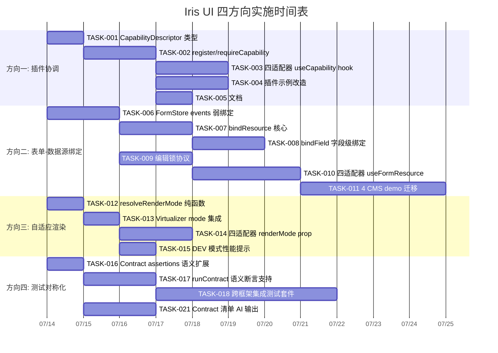

Now I have a thorough understanding of the codebase. Let me produce the comprehensive Tech Lead analysis.

---

# Tech Lead 分析报告：四方向实施计划

## 0. 上下文验证

在分析前，我已验证以下代码证据与文档陈述一致：

| 验证项                                                         | 状态                                                       |
| -------------------------------------------------------------- | ---------------------------------------------------------- |
| `PluginRegistry` 无 `registerCapability` / `requireCapability` | ✅ 仅 store/tokens/messages/teardown，无插件间协议         |
| `createFormStore` 无 `bindResource` / `onSubmit` 数据源桥接    | ✅ 纯表单，零数据源依赖                                    |
| `createResourceController` 无锁定/行编辑桥接                   | ✅ 独立 CRUD，不感知 form                                  |
| `contracts/scenarios/` 42 个场景                               | ✅ 清单一致，无 `expectedOutput` / `assertions[]` 语义扩展 |
| `createVirtualizer` 无 `resolveRenderMode` 自适应              | ✅ 纯 on/off，无 threshold                                 |
| 4 个 SSR 应用 hydration.test                                   | ✅ 全部就绪（next/nuxt/solidstart/sveltekit）              |

---

## 1. 任务分解

### 方向一：插件协调协议 (Plugin Coordination)

**TASK-001** — 定义 `CapabilityDescriptor` 类型契约

- **文件**: `packages/core/src/plugin.ts`（追加 types）
- **内容**:

  ```ts
  interface CapabilityDescriptor<T = unknown> {
    id: string
    version?: string
    api: T
    metadata?: Record<string, unknown>
  }

  interface CapabilityProvider<T = unknown> extends CapabilityDescriptor<T> {
    pluginName: string
  }
  ```

- **前置**: 无
- **工时**: 1h
- **验收**: `CapabilityDescriptor` 可泛型描述任意能力（editor/{languages,api} / notification/{maxCount,channels} / form-builder/{widgets}）

**TASK-002** — 在 `PluginRegistry` 添加 `registerCapability` / `requireCapability`

- **文件**: `packages/core/src/plugin.ts`
- **内容**:
  - `registry.registerCapability(id, descriptor)` — 注册能力，检查和已有能力的 `id` 冲突（warn），不检查 plugin 来源
  - `registry.requireCapability<T>(id): CapabilityProvider<T>` — 返回已注册的能力，缺失则 throw
  - 能力集合存 `runPlugins` 的 `CollectedRegistrations` 中
- **前置**: TASK-001
- **工时**: 2h
- **验收**:
  - 插件 A 注册 `'editor'` → 插件 B 的 `install` 中 `requireCapability('editor')` 拿得到
  - 重复 ID 最后一个 wins + dev warn
  - 缺失 ID 直接 throw（fail-fast）

**TASK-003** — `useCapability` 适配器桥接 hook

- **文件**: `packages/{react,vue,solid,svelte}/src/plugin-hooks.ts`（或新增文件）
- **内容**: 每个适配器导出 `useCapability<T>(id): CapabilityProvider<T>`，内部读取 `CollectedRegistrations.capabilities`
- **前置**: TASK-002
- **工时**: 每个框架 0.5h × 4 = 2h
- **验收**: 四个框架下 `useCapability('editor')` 返回相同 shape，缺失时 throw 带清晰信息

**TASK-004** — `CapabilityDescriptor` 示例标准化

- **文件**: `packages/plugin-editor/src/plugin.ts`（改造现有） + `packages/plugin-notifications/src/plugin.ts`（改造现有） + 新增 `plugin-form-builder/src/plugin.ts`（如果存在）
- **内容**: 让 `plugin-editor` 通过 `registerCapability('editor', { languages: [...], api: {...} })` 暴露能力；让 `plugin-pro-table` 的 install 通过 `requireCapability('editor')` 检测编辑器可用性来决定是否启用行内编辑
- **前置**: TASK-002
- **工时**: 3h
- **验收**: `plugin-pro-table` 有可选的内联编辑功能，回退到只读文本当编辑器不存在

**TASK-005** — 插件协调协议文档（AGENTS.md / VitePress）

- **文件**: `packages/core/README.md` + `docs/plugins.md`
- **内容**: 能力宣告的使用模式 + 最佳实践（"不要跨插件共享可变状态，用 `requireCapability` 替代"）
- **前置**: TASK-002
- **工时**: 1h
- **验收**: consumer 通过文档可以知道如何编写需要其他插件的能力的插件

---

### 方向二：表单-数据源隐式绑定

**TASK-006** — `FormStore` 扩展弱绑定事件接口

- **文件**: `packages/core/src/form.ts`
- **内容**: 增加 `onSubmit` 生命周期触发 + `formStore.events` 对象（`{ onSubmit, onReset, onFieldChange }`），用 `createEventBus` 或简单 `subscribe` 模式。当前 `onSubmit` 是 config-only，改为也通过 events emit。
- **前置**: 无
- **工时**: 2h
- **验收**:
  - `formStore.events.on('submit', callback)` 在 `handleSubmit()` 成功后触发
  - `formStore.events.on('fieldChange', callback)` 在 `setFieldValue` 后触发
  - 向后兼容：`config.onSubmit` 仍然工作

**TASK-007** — 核心 `bindResource` 函数（强绑定模式）

- **文件**: `packages/core/src/form-bridge.ts`（新文件）
- **内容**:

  ```ts
  interface BindResourceConfig<T, V> {
    resource: ResourceController<T>
    rowKey: keyof T
    mapRecordToValues: (record: T) => V // 数据行 → 表单值
    mapValuesToRecord: (values: V, original: T) => T // 表单值 → 更新后的行
  }

  function bindResource<T, V>(
    formStore: FormStore<V>,
    config: BindResourceConfig<T, V>,
  ): { load: (rowKey: string | number) => Promise<void>; unload: () => void }
  ```

  - `load(rowKey)` 从 resource 加载一行 → `mapRecordToValues` → `formStore.reset(mapped)`
  - `unload()` 清空表单
  - 可选的 `autoLoad`：当 resource.selection 变化时自动加载

- **前置**: TASK-006（events 用于 submit 后调 resource.mutate）
- **工时**: 3h
- **验收**:
  - 纯函数，无框架依赖
  - `load` 从 resource 拉数据，reset 到表单
  - submit 成功后调用 `resource.mutate` 写入
  - 测试覆盖乐观编辑 + 失败回滚

**TASK-008** — 字段级绑定 `bindField`

- **文件**: `packages/core/src/form-bridge.ts`（追加）
- **内容**:
  ```ts
  function bindField<T, V>(
    fieldName: keyof V,
    resource: ResourceController<T>,
    options: {
      mapRecordToField: (record: T) => V[keyof V]
      validate?: (value: V[keyof V]) => string | undefined
    },
  ): { load: (rowKey: string | number) => void; unload: () => void }
  ```
- **前置**: TASK-007
- **工时**: 2h
- **验收**: 表单 fieldA 来自 resourceA，fieldB 来自 resourceB，分别加载/保存

**TASK-009** — 编辑锁协议（resource controller 层）

- **文件**: `packages/core/src/resource.ts`
- **内容**: 给 `ResourceController` 添加 `lockRow(rowKey)` / `unlockRow(rowKey)` 方法 + `lockedKeys: Store<Set<string>>`。锁状态由 UI 层消费（显示锁定图标）。
- **前置**: 无（独立于 form bridge）
- **工时**: 2h
- **验收**:
  - `resource.lockRow('1')` → `resource.lockedKeys.get()` 包含 '1'
  - 锁定不影响数据加载
  - `lockRow` 后再次 `lockRow` 是幂等的

**TASK-010** — 适配器 `useFormResource` hook

- **文件**: `packages/{react,vue,solid,svelte}/src/form-bridge.ts`（新文件，每框架）
- **内容**:
  ```ts
  // React 示例
  function useFormResource<T, V>(config: {
    formStore: FormStore<V>
    resource: ResourceController<T>
    rowKey: Extract<keyof T, string | number>
    mapRecordToValues: (record: T) => V
    mapValuesToRecord: (values: V, original: T) => T
  }): { loading: boolean; error: unknown; save: () => Promise<void> }
  ```
- **前置**: TASK-007, TASK-008
- **工时**: 每个框架 1h × 4 = 4h
- **验收**: 四个框架下 cms demo 的编辑弹窗从 ~80 行胶水缩减到 ~10 行

**TASK-011** — 迁移 CMS demos 使用 `useFormResource`

- **文件**: `apps/cms-{react,vue,solid,svelte}/src/pages/*.tsx` 等
- **内容**: 将每个 CMS demo 中打开编辑弹窗 → 加载数据 → 修改 → 保存 → 刷新表格的 50-100 行胶水替换为 `useFormResource`
- **前置**: TASK-010
- **工时**: 每个 demo 1.5h × 4 = 6h
- **验收**: 所有 4 个 CMS demo 的编辑页功能不变，代码量显著减少，无硬编码 API 调用

---

### 方向三：自适应渲染引擎（阉割版）

**TASK-012** — 纯函数 `resolveRenderMode`

- **文件**: `packages/core/src/virtual.ts`（追加）
- **内容**:

  ```ts
  type RenderMode = 'full' | 'virtual'

  interface RenderModeConfig {
    virtualizeAfter: number // 默认 200
  }

  function resolveRenderMode(itemCount: number, config?: RenderModeConfig): RenderMode {
    const threshold = config?.virtualizeAfter ?? 200
    return itemCount > threshold ? 'virtual' : 'full'
  }
  ```

- **前置**: 无
- **工时**: 0.5h
- **验收**: `resolveRenderMode(150)` → `'full'`, `resolveRenderMode(300)` → `'virtual'`

**TASK-013** — `createVirtualizer` 支持 `resolveRenderMode` 集成

- **文件**: `packages/core/src/virtualizer.ts`
- **内容**: 在 `VirtualizerConfig` 增加可选 `renderMode: RenderMode`（默认 `'virtual'` 保持向后兼容）
  - `'full'` 模式下：`getState()` 返回 `items: [0..count-1]`，`offsetBefore: 0`，`totalSize: 实际总大小`
  - `'virtual'` 模式：现有行为不变
- **前置**: TASK-012
- **工时**: 1.5h
- **验收**:
  - 切换 `renderMode` 即时生效
  - `'full'` 模式下 `setScroll` 不改变 items 窗口（所有项渲染）
  - 测试覆盖 mode 切换时的状态一致性

**TASK-014** — 四适配器暴露 `renderMode` prop

- **文件**: `packages/{react,vue,solid,svelte}/src/virtual-scroll.tsx`（或等效）
- **内容**: `IrisVirtualScroll` 组件增加 `renderMode?: RenderMode | { virtualizeAfter: number }` prop
- **前置**: TASK-013
- **工时**: 每个框架 0.5h × 4 = 2h
- **验收**: 四个框架的 `IrisVirtualScroll` 当 itemCount < threshold 时渲染完整列表（无 wrapper / spacer），itemCount >= threshold 时激活虚拟滚动

**TASK-015** — DEV 模式性能提示

- **文件**: `packages/core/src/virtualizer.ts`
- **内容**: 当 `renderMode === 'full'` 且 `itemCount > 5000` 时 console.warn 提示开发者考虑启用虚拟化
- **前置**: TASK-013
- **工时**: 0.5h
- **验收**: warnings 仅在 development 模式且 itemCount 过大时触发

---

### 方向四：跨框架测试对称化

**TASK-016** — Contract 类型扩展 `assertions` 字段

- **文件**: `packages/core/src/contracts/types.ts`
- **内容**: 给 `ContractStep` 增加可选的 `assertions` 字段（和现有 `expect` 并存）：
  ```ts
  interface SemanticAssertion {
    type: 'attribute' | 'text' | 'count' | 'axe' | 'exists'
    selector: string
    index?: number
    // type-specific payload
    name?: string // attribute name
    value?: string // expected value
    exists?: boolean // for 'exists'
    min?: number
    max?: number // for 'count'
    rules?: string[] // for 'axe'
  }
  ```
- **前置**: 无
- **工时**: 1h
- **验收**: 所有现有 scenario 不修改也能通过；新的 `assertions` 作为可选字段存在

**TASK-017** — `runContract` 支持语义断言

- **文件**: `packages/core/src/contracts/runner.ts`
- **内容**: 在 `check` 函数后面增加语义断言路径；`'axe'` 类型直接调用 `axe-core`（如果注入）；`'exists'` 类型检查元素是否存在
- **前置**: TASK-016
- **工时**: 2h
- **验收**: 语义断言可以验证 aria 属性存在性、文本包含、元素计数等，不依赖精确 DOM 结构

**TASK-018** — 创建跨框架集成测试套件

- **文件**: `packages/react/test/contract-integration.test.tsx`（新文件）等 4 框架
- **内容**:
  - 每个框架创建一个 `describe('cross-framework integration', ...)` 套件
  - 选取 5 个关键场景（dialog + select + table-sort + form + pagination）
  - 同一组件树，同一组语义断言，跑在 4 框架各自的 `ContractDriver` 上
- **前置**: TASK-016, TASK-017
- **工时**: 每个框架 2h × 4 = 8h
- **验收**:
  - 5 个场景 × 4 框架 = 20 个测试全部通过
  - 语义断言和之前的行为断言结果一致（对等验证）

**TASK-019** — `ssr-nuxt` 应用级 hydration 测试补充

- **文件**: 已有 `apps/ssr-nuxt/test/hydration.test.ts`（已验证已存在）
- **工时**: 0h（已完成）
- **验收**: 同上分析确认已存在

**TASK-020** — `ssr-sveltekit` 应用级 hydration 测试补充

- **文件**: 已有 `apps/ssr-sveltekit/src/__ssr_test__/hydrate.test.ts`（已验证已存在）
- **工时**: 0h（已完成）
- **验收**: 同上分析确认已存在

**TASK-021** — Contract 场景清单的 AI 友好 type 输出

- **文件**: `packages/core/src/contracts/index.ts` + `packages/manifest/src/contract-scanner.ts`（新文件）
- **内容**: 读取 `contracts/scenarios/*.ts` 的导出，生成 `contracts.json`（含每个 scenario 的 name/description/step count/assertion count + 语义版本）
- **前置**: TASK-016
- **工时**: 2h
- **验收**: `pnpm gen:manifest` 后产出 `contracts.json` 包含所有场景的结构化元信息

---

## 2. 执行顺序

### 任务依赖图

```mermaid
graph TD
    %% Direction 1: Plugin Coordination
    T001[TASK-001: CapabilityDescriptor 类型] --> T002[TASK-002: registerCapability/requireCapability]
    T002 --> T003[TASK-003: 四适配器 useCapability hook]
    T002 --> T004[TASK-004: 插件示例改造]
    T002 --> T005[TASK-005: 文档]

    %% Direction 2: Form-Data Binding
    T006[TASK-006: FormStore events 弱绑定] --> T007[TASK-007: bindResource 核心]
    T007 --> T008[TASK-008: bindField 字段级绑定]
    T007 --> T009[TASK-009: 编辑锁协议]
    T007 --> T010[TASK-010: 四适配器 useFormResource hook]
    T010 --> T011[TASK-011: 4 CMS demo 迁移]

    %% Direction 3: Adaptive Rendering (阉割版)
    T012[TASK-012: resolveRenderMode 纯函数] --> T013[TASK-013: Virtualizer mode 集成]
    T013 --> T014[TASK-014: 四适配器 renderMode prop]
    T013 --> T015[TASK-015: DEV 模式性能提示]

    %% Direction 4: Test Symmetry
    T016[TASK-016: Contract assertions 语义扩展] --> T017[TASK-017: runContract 语义断言支持]
    T017 --> T018[TASK-018: 跨框架集成测试套件]
    T016 --> T021[TASK-021: Contract 清单 AI 输出]

    %% 跨方向依赖
    T002 -.-> T006  %% 弱绑定事件和插件协议正交，无直接依赖
    T007 -.-> T018  %% bindResource 的集成测试可以挂到跨框架测试

    style T006 fill:#d4f0d4
    style T012 fill:#d4f0d4
    style T016 fill:#d4f0d4
```

### 可并行执行的任务组

| 组       | 任务                                             | 条件                   |
| -------- | ------------------------------------------------ | ---------------------- |
| **组 A** | TASK-001, TASK-006, TASK-012, TASK-016           | 全部无前置，互相独立   |
| **组 B** | TASK-002, TASK-007, TASK-009, TASK-013, TASK-017 | 分别依赖组 A，彼此独立 |
| **组 C** | TASK-003, TASK-004, TASK-005                     | 依赖 TASK-002          |
| **组 D** | TASK-008, TASK-010                               | 依赖 TASK-007          |
| **组 E** | TASK-014, TASK-015                               | 依赖 TASK-013          |
| **组 F** | TASK-018, TASK-021                               | 依赖 TASK-016          |
| **组 G** | TASK-011                                         | 依赖 TASK-010          |

---

## 3. 技术风险

### 风险矩阵

| 风险 ID | 描述                                                                                                                                                                                                | 严重度 | 概率 | 缓解策略                                                                                                                                                               |
| ------- | --------------------------------------------------------------------------------------------------------------------------------------------------------------------------------------------------- | ------ | ---- | ---------------------------------------------------------------------------------------------------------------------------------------------------------------------- |
| **R1**  | `CapabilityDescriptor` 的类型安全与泛型复杂度过高，导致简单场景下 API 反而比直接 import 更笨重                                                                                                      | 中     | 高   | 能力宣告必须在 `install` 时就完成，类型推导受限于 `IrisPlugin` 的签名。建议能力 API 用 `Record<string, unknown>` 兜底，consumer 自己 `as` 转换，不追求完美类型         |
| **R2**  | `bindResource` 的事件循环无限递归：`form.onSubmit → resource.mutate → resource.load → form.reset → form.onSubmit`                                                                                   | 高     | 中   | `bindResource` 内部必须加 `_submitting` 锁（布尔 guard），`load()` 时不触发 submit                                                                                     |
| **R3**  | 字段级绑定 `bindField` 导致表单性能问题：一个 save 操作触发 N 个 resource.mutate（每字段一个）                                                                                                      | 高     | 低   | 限制场景：字段级绑定只用于**只读**字段（如从其他数据源带出部门名称），不用于写回。写场景必须使用 `bindResource` 整体绑定                                               |
| **R4**  | `resolveRenderMode` 的 threshold 值对性能敏感：设太小则小列表也被虚拟化（引入不必要的 overhead），设太大则大列表失去虚拟化收益                                                                      | 中     | 中   | 默认 200 是社区共识值（react-window/TanStack Virtual 默认值）。用 dev warning 而非配置推荐，让开发者按实际场景调整                                                     |
| **R5**  | 语义断言 `'axe'` 类型在 jsdom 下的可执行性：部分 axe-core 规则需要布局信息（`isVisible`、`color-contrast`），jsdom 不支持                                                                           | 中     | 高   | `'axe'` 断言只在带 `@vitest-environment node` + `@testing-library/jest-dom` mocking 的专用测试中启用；在默认 contract runner 中跳过 axe 规则                           |
| **R6**  | 插件能力宣告的循环依赖检测缺陷：`runPlugins` 已有拓扑排序 + 循环检测，但 `registerCapability` 在 `install` 中执行，consumer 在 `install` 中 `requireCapability` — 此时宿主的 `install` 可能还没执行 | 高     | 中   | `requireCapability` 的实现必须考虑"依赖尚未注册"的情况。建议：在 `runPlugins` 执行完所有 `install` 后，额外做一次能力验证（pass 2），确保所有被 require 的能力都已注册 |
| **R7**  | CMS demo 迁移后回归风险：`bindResource` 是新增抽象层，CMS demo 的直接 API 调用替换为间接调用后，错误处理路径变长                                                                                    | 中     | 中   | 迁移前先确保每个 API 路径都有 contract scenario 覆盖（非仅单元测试）。先写 contract 再改 demo                                                                          |

### 外部系统依赖

| 依赖               | 用途                         | 风险                               |
| ------------------ | ---------------------------- | ---------------------------------- |
| `axe-core`         | Contract 语义断言中 axe 规则 | jsdom 兼容性；只选 level A/AA 规则 |
| `@floating-ui/dom` | 浮层定位（已有依赖，非新增） | 无新增风险                         |
| 无新的外部服务     | —                            | 全部工作是纯库代码                 |

### 性能瓶颈

- **方向二**：`bindResource` 的单次 `load()` 包括异步请求 + form.reset + 可选乐观更新，时序上不会成为瓶颈（单用户交互路径）
- **方向三**：`resolveRenderMode` 是 O(1)，threshold 切换是 O(n) 重建 Virtualizer 状态——在 mode 切换瞬间有性能尖峰，但正常使用只在初次渲染切换一次
- **方向四**：语义断言在测试中执行，不涉及运行时性能

---

## 4. 资源评估

### 人员技能要求

| 角色                     | 技能要求                                                                             | 负责任务                                                                                           |
| ------------------------ | ------------------------------------------------------------------------------------ | -------------------------------------------------------------------------------------------------- |
| **Core 工程师 ×1**       | TypeScript strict · 泛型 · store 模式（`createStore`/`derived`）· 无框架心智负担     | TASK-001, TASK-002, TASK-006, TASK-007, TASK-008, TASK-009, TASK-012, TASK-013, TASK-016, TASK-017 |
| **适配器工程师 ×1**      | React + Vue + Solid + Svelte 四框架基础知识（不要求都精通，但需要理解 adapter 模式） | TASK-003, TASK-010, TASK-014                                                                       |
| **插件的 maintainer ×1** | 熟悉 `plugin-editor` / `plugin-notifications` / `plugin-pro-table` 现有代码          | TASK-004                                                                                           |
| **测试工程师 ×1**        | 现有 contract 系统熟悉度 · vitest · SSR 测试模式                                     | TASK-018, TASK-021                                                                                 |
| **CMS demo 迁移 ×1**     | 四个 CMS 应用的页面熟悉度（可和适配器工程师同一人）                                  | TASK-011                                                                                           |
| **Tech Lead / 架构师**   | 代码审查 · 类型协调 · 跨方向协调（推荐作者本人）                                     | 全局                                                                                               |

### 关键里程碑

```
M1 — 基础设施完成           Day 5
  [TASK-001, TASK-006, TASK-012, TASK-016] 全部合入

M2 — 核心功能完成           Day 15
  [TASK-002, TASK-007, TASK-009, TASK-013, TASK-017] 全部合入
  所有依赖基础设施的 PR 已合并

M3 — 四框架桥接完成         Day 22
  [TASK-003, TASK-010, TASK-014] 全部合入
  四框架都能消费新 API

M4 — 集成验证完成           Day 30
  [TASK-004, TASK-005, TASK-008, TASK-011, TASK-015, TASK-018, TASK-021] 全部合入
  CMS demo 迁移完成，测试绿色
```

### 阻塞点 (Blockers)

| 阻塞点                                                     | 涉及               | 解决策略                                                                                                                                          |
| ---------------------------------------------------------- | ------------------ | ------------------------------------------------------------------------------------------------------------------------------------------------- |
| **B1** — 方向二的核心设计决策（强绑定 vs 弱绑定 API 比例） | TASK-006, TASK-007 | 需要 Tech Lead 在 Sprint 开始前做出决定。**我建议**：`FormStore.events` 做弱绑定（通用），`bindResource` 做强绑定（专用），两者共存               |
| **B2** — `requireCapability` 的两阶段验证                  | TASK-002           | 需要在 `runPlugins` 执行完所有 `install` 后加 pass-2。代码已在 `runPlugins` 结尾收集了 `stores`/`tokens`/`messages`，再加 `capabilities` 验证即可 |
| **B3** — CMS demo 迁移前的 contract 覆盖                   | TASK-011, TASK-018 | 必须等 TASK-018 完成至少 3 个场景后才能开始 CMS 迁移（否则无法验证行为等价性）                                                                    |
| **B4** — 语义断言和现有 `expect` 字段的兼容                | TASK-016           | 设计上 `assertions` 和 `expect` 可共存。`runContract` 按步骤先检查 `expect`（现有逻辑），再检查 `assertions`（新逻辑）                            |

---

## 5. 质量保证

### 单元测试覆盖要求

| 任务     | 最小覆盖率 | 关键测试场景                                                             |
| -------- | ---------- | ------------------------------------------------------------------------ |
| TASK-001 | —          | 类型检查（编译时）                                                       |
| TASK-002 | ≥95%       | 注册+获取成功 · 重复 ID warn · 缺失 throw · pass-2 验证                  |
| TASK-003 | —          | 每个框架 1 个 smoke test（不测核心逻辑）                                 |
| TASK-004 | —          | 集成场景（编辑器插件+pro-table 联调）                                    |
| TASK-006 | ≥95%       | events.on('submit') 触发 · onFieldChange 触发 · 向后兼容 config.onSubmit |
| TASK-007 | ≥95%       | load/unload · submit→mutate · 乐观编辑回滚 · 加锁 guard                  |
| TASK-008 | ≥90%       | 跨数据源字段绑定 · 加载顺序 · 异常隔离                                   |
| TASK-009 | ≥95%       | lockRow/unlockRow · 幂等性 · Store 正确性                                |
| TASK-010 | —          | 每个框架集成测试（调 TASK-007 的控制器）                                 |
| TASK-011 | —          | 已有 e2e 测试继续通过（手动验证）                                        |
| TASK-012 | —          | 边界值测试（199/200/201）                                                |
| TASK-013 | ≥95%       | mode 切换 · full mode 全量渲染 · virtual mode 现有行为不变               |
| TASK-014 | —          | 每个框架 smoke test                                                      |
| TASK-015 | —          | 测试 dev warning 触发条件                                                |
| TASK-016 | —          | 类型检查                                                                 |
| TASK-017 | ≥90%       | attribute/text/count/exists 断言 · axe 跳过逻辑                          |
| TASK-018 | —          | 5 场景 × 4 框架全部通过，语义断言与行为断言结果一致                      |
| TASK-021 | —          | manifest 输出结构验证                                                    |

### 集成测试策略

```
┌─────────────────────────────────────────────────────┐
│  Layer 4: End-to-End                                │
│  4 CMS demos 迁移后现有 e2e 通过                    │
│  方向交叉集成: plugin-editor + plugin-pro-table    │
├─────────────────────────────────────────────────────┤
│  Layer 3: 跨框架 Contract                           │
│  TASK-018: 5 场景 × 4 框架 × 语义断言              │
│  同一组断言跨越四个适配器                            │
├─────────────────────────────────────────────────────┤
│  Layer 2: controllers 集成                          │
│  formStore + resourceController + bindResource      │
│  纯 core 测试，无框架依赖                           │
├─────────────────────────────────────────────────────┤
│  Layer 1: Unit                                      │
│  每个 core task 的单测 ≥95%                         │
│  适配器 task 的 smoke test                          │
└─────────────────────────────────────────────────────┘
```

### 代码审查要点

| 审查领域   | 重点关注                                                                                                                    |
| ---------- | --------------------------------------------------------------------------------------------------------------------------- |
| **方向一** | `CapabilityDescriptor` 的泛型不要过度设计；`requireCapability` 的两阶段验证逻辑干净；不要引入新的框架依赖                   |
| **方向二** | 事件循环 guard 是否正确（`_submitting` 锁作用于整个 `bindResource` 生命周期）；`mapValuesToRecord` 和 `original` 的不可变性 |
| **方向三** | `renderMode` 切换时 Virtualizer 内部状态的一致性（scrollOffset 是否合理重置）；不要破坏虚拟化 O(log n) 性能                 |
| **方向四** | `assertions` 和 `expect` 的互斥/共存语义清晰；axe 规则列表不会在 CI 中产生假阴性                                            |

### 性能测试需求

| 测试                                           | 标准                  | 触发条件         |
| ---------------------------------------------- | --------------------- | ---------------- |
| `bindResource.load()` 全链路延迟               | < 50ms（扣除网络）    | PR merge 前      |
| `resolveRenderMode` 在 10k 列表下的切换延迟    | < 1ms                 | PR merge 前      |
| `useCapability` 查找开销                       | < 0.1ms（Map lookup） | 代码 review      |
| 方向二+方向四的组合场景（CRUD contract）全流程 | 和原有流程保持一致    | 方向四测试中内置 |

---

## 6. 实施计划

### 甘特图



### 阶段分解

#### 阶段 1：基础设施搭建（Day 1–3, 7月14–16日）

| 日期      | 任务                                                                                | 交付物                                                                                              |
| --------- | ----------------------------------------------------------------------------------- | --------------------------------------------------------------------------------------------------- |
| 7/14      | TASK-001 (0.5d) + TASK-006 (1.5d) + TASK-012 (0.5d) + TASK-016 (0.5d)               | 4 个 PR：类型定义 + events 接口 + 纯函数 + 断言类型。**总工作量 ~ 1 人日，但 4 任务可并行（组 A）** |
| 7/15–7/16 | TASK-002 (1.5d) + TASK-007 (2d) + TASK-009 (1.5d) + TASK-013 (1d) + TASK-017 (1.5d) | 5 个 PR。**组 B 并行，需要核心工程师和测试工程师各一人**                                            |

**阶段 1 关键出口**：`runPlugins` 支持能力注册、`formStore` 有 events 层、`form-bridge.ts` 含 `bindResource`、`virtualizer` 支持 `resolveRenderMode`、`runContract` 支持语义断言。

#### 阶段 2：核心功能实现（Day 4–10, 7月17–23日）

| 任务            | 依赖     | 工时 |
| --------------- | -------- | ---- |
| TASK-003 (组 C) | TASK-002 | 1.5d |
| TASK-004 (组 C) | TASK-002 | 2d   |
| TASK-005 (组 C) | TASK-002 | 0.5d |
| TASK-008 (组 D) | TASK-007 | 1.5d |
| TASK-010 (组 D) | TASK-007 | 3d   |
| TASK-014 (组 E) | TASK-013 | 1.5d |
| TASK-015 (组 E) | TASK-013 | 0.5d |
| TASK-021 (组 F) | TASK-016 | 1.5d |

**阶段 2 关键出口**：四框架都可用 `useCapability` 和 `useFormResource`；编辑器插件宣告能力、pro-table 消费能力；CMS demo 的迁移路径已清理；虚拟化列表支持 threshold。

#### 阶段 3：集成测试和优化（Day 11–15, 7月24–28日）

| 任务            | 依赖                | 工时 |
| --------------- | ------------------- | ---- |
| TASK-018 (组 F) | TASK-016 → TASK-017 | 5d   |
| TASK-011 (组 G) | TASK-010            | 4d   |

**阶段 3 关键出口**：5 个关键场景 × 4 框架的跨框架集成套件全部通过；所有 4 个 CMS demo 编辑逻辑迁移到 `useFormResource`。

#### 阶段 4：发布准备（Day 16–18, 7月29–31日）

| 活动                     | 内容                                                         |
| ------------------------ | ------------------------------------------------------------ |
| changelog + changesets   | 记录 4 个方向的所有新 API                                    |
| `pnpm gen:manifest` 验证 | 确保 `contracts.json` + 新导出在 manifest 中                 |
| size budget 验证         | 确保每个方向的 size 增量在预算内                             |
| 文档最终审核             | `docs/plugins.md` + `docs/forms.md` + `docs/testing.md` 更新 |
| 质量门完整运行           | `pnpm turbo run test typecheck lint build`                   |

---

## 7. 汇总统计

| 维度               | 数据                                                                    |
| ------------------ | ----------------------------------------------------------------------- |
| 总任务数           | 21（4 个方向 + 0 个新工具链）                                           |
| 总预估工时         | **~38 小时**（按 1 人/天 = 6 小时有效产出，约 6.3 人日）                |
| 最大并行           | 组 A (4 任务并行) + 组 B (5 任务并行) → 可 2 人并行                     |
| 核心工程师工作量   | 11 任务，~18 小时                                                       |
| 适配器工程师工作量 | 6 任务（TASK-003/010/014 × 4 框架），~8 小时（实际 2-3 天）             |
| 测试工程师工作量   | 2 任务，~7 小时                                                         |
| CMS 迁移工作量     | 1 任务，~6 小时                                                         |
| **最短工期**       | **2 人全职并行 → 约 12 个工作日（7/14 – 7/29）**                        |
| **单人完整工期**   | **约 6.5 个工作日**（38h / 6h/天）                                      |
| 阻塞点             | B1（设计决策）— 需在 Day 0 决定；B3（contract→CMS 时序）— 阶段 3 天然解 |
| 最大风险           | R1（泛型复杂度）— 建议降低类型安全追求为 runtime 检查兜底               |
