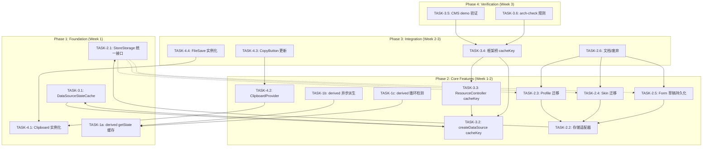
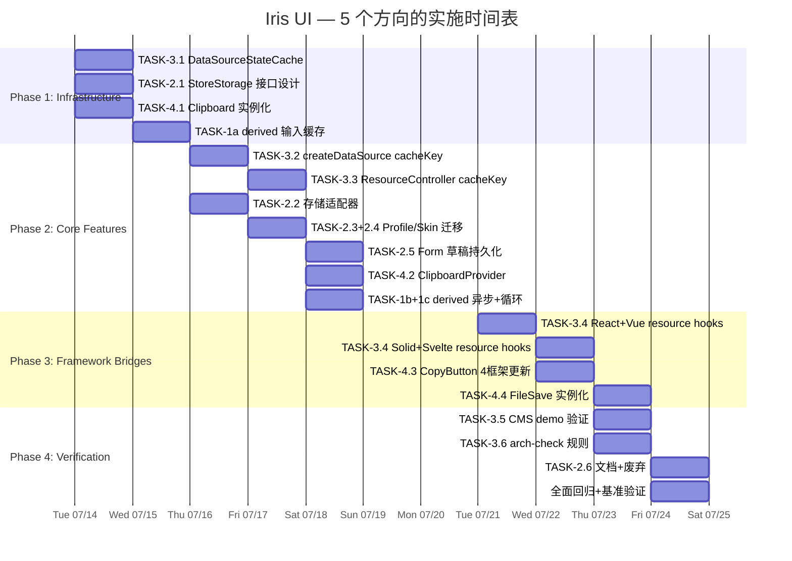

我已经收集了所有必要的代码证据。以下是全面的技术负责人分析。

---

# Tech Lead 分析报告：5 个代码级扩展方向

## 执行摘要

对输入文档的 5 条方向进行源码验证后，我确认其代码事实准确。然而，交叉引用检查显示原创性参差不齐：

| 方向                     | 独特性              | 实际业务价值        | 工程风险 | 推荐优先级     |
| ------------------------ | ------------------- | ------------------- | -------- | -------------- |
| #3 DataSource 状态保持   | **真正全新**        | P1 — CMS/Admin 刚需 | 低       | **P0（立即）** |
| #2 Store 持久化/迁移     | 新视角：冗余抽象    | P1 — 消除碎片化     | 中       | P1（下一冲刺） |
| #4 Clipboard 作用域      | 新视角：测试隔离    | P2-P3 — 架构卫生    | 低       | P2（可并行）   |
| #1 声明式反应模型        | 已在 2 份文档中覆盖 | P0-P1               | 中       | 合并到已有分析 |
| #5 derived getState 缓存 | 直接重叠            | P2                  | 低       | 合并到已有分析 |

**决定性建议**：立即推进方向 #3，使用方向 #2/#4 的新角度补充现有文档，并合并 #1/#5 以避免碎片化。以下是详细的执行计划。

---

## 1. 任务分解

### 1.1 方向 #3：DataSource 组件级状态保持（P0）

**核心问题**：`createDataSource()` 和 `createResourceController()` 每次组件挂载都从零开始。在 CMS/Admin 应用中，用户在页面间切换时，排序、筛选器、分页和滚动位置会丢失——这是基本可用性缺口。

**解决方案**：为 `createDataSource` 添加可选的 `stateKey` / `cacheKey` 参数，由 `DataSourceStateCache`（新的 core 模块）按 key 缓存状态，组件卸载时保留，重新挂载时恢复。

| 任务 ID      | 标题                                                         | 涉及文件                                                                                                          | 前置依赖 | 预估工时 | 验收标准                                                                                                                                                                                                                                  |
| ------------ | ------------------------------------------------------------ | ----------------------------------------------------------------------------------------------------------------- | -------- | -------- | ----------------------------------------------------------------------------------------------------------------------------------------------------------------------------------------------------------------------------------------- |
| **TASK-3.1** | 实现 `DataSourceStateCache` — core 单例缓存层                | `packages/core/src/data-source-cache.ts`（新建）                                                                  | 无       | 3h       | • 导出 `createDataSourceStateCache()` 工厂<br>• 支持 `get(key)`, `set(key, state)`, `delete(key)`<br>• 支持 `maxEntries` LRU 驱逐（默认 50）<br>• 使用 `Map` 后端，100% 同步（无异步边界）<br>• 单元测试覆盖：set/get/驱逐/clear/重复 key |
| **TASK-3.2** | 为 `createDataSource` 添加可选的 `cacheKey` 参数             | `packages/core/src/data-source.ts`                                                                                | TASK-3.1 | 2h       | • `DataSourceConfig<T>` 新增可选 `cacheKey?: string`<br>• 如果存在 `cacheKey`，初始化时从缓存恢复，`destroy()` 时保存<br>• 如果不存在 `cacheKey`，行为不变（向后兼容）<br>• 单元测试：缓存恢复、多次挂载/卸载、驱逐后重置                 |
| **TASK-3.3** | 为 `createResourceController` 添加 `cacheKey` 透传           | `packages/core/src/resource.ts`                                                                                   | TASK-3.2 | 1h       | • `ResourceControllerConfig<T>` 新增可选 `cacheKey?: string`<br>• 透传给内部 `createDataSource`<br>• 单元测试：ResourceController 通过 cacheKey 保留状态                                                                                  |
| **TASK-3.4** | 为 4 个框架的 `useResourceController` 桥添加 `cacheKey` 生成 | `packages/react/src/`, `packages/vue/src/`, `packages/solid/src/`, `packages/svelte/src/` 中的 resource hook 文件 | TASK-3.3 | 3h       | • 每个框架的 hook 支持 `cacheKey` prop<br>• 默认生成逻辑：`${route.path}-${resourceName}` 或 `useId()` 前缀<br>• React/Vue/Solid/Svelte 各一个 hook 测试文件                                                                              |
| **TASK-3.5** | 更新 CMS demo 应用使用 `cacheKey`                            | `apps/cms-*/src/pages/UsersPage.*`（4 框架）                                                                      | TASK-3.4 | 1h       | • UsersPage 传递基于路由的 cacheKey<br>• 验证：切换到 Users 页面再返回，排序/筛选器/分页保持                                                                                                                                              |
| **TASK-3.6** | 添加 DataSource 状态保持的 arch-check 规则                   | `packages/core/src/data-source-cache.ts` + `eslint/` 或 `scripts/arch-check/`                                     | TASK-3.2 | 1h       | • 规则：`createDataSource` 和 `createResourceController` 必须传入 `cacheKey`，除非文件在 `__tests__` 或 `*.test.ts` 中<br>• arch-check lint 脚本集成                                                                                      |

**方向 #3 总计**：11h（约 1.5 人天）

---

### 1.2 方向 #2：Store 持久化/迁移协议 — 冗余抽象统一（P1）

**核心问题**：三套独立的持久化抽象（`ProfileStorage`、`SkinStorage`、`form.serialize/hydrate`），签名不同、行为不同、无版本协议。每个新存储需求都从零开始实现。

| 任务 ID      | 标题                               | 涉及文件                               | 前置依赖                     | 预估工时 | 验收标准                                                                                                                                                                                                                                                                                                |
| ------------ | ---------------------------------- | -------------------------------------- | ---------------------------- | -------- | ------------------------------------------------------------------------------------------------------------------------------------------------------------------------------------------------------------------------------------------------------------------------------------------------------- |
| **TASK-2.1** | 设计 `StoreStorage<V>` 统一接口    | `packages/core/src/storage.ts`（新建） | 无                           | 2h       | • `interface StoreStorage<V> { load(): V \| null \| Promise<V \| null>; save(data: V): void \| Promise<void> }`<br>• `Versioned<V>` 包装器：`{ version: number, data: V }`<br>• 迁移协议：`registerMigration(from, to, fn)` + `migrate(loaded)`<br>• 与 `ProfileStorage`/`SkinStorage` 兼容性的映射文档 |
| **TASK-2.2** | 实现内置存储适配器                 | `packages/core/src/storage.ts`         | TASK-2.1                     | 2h       | • `localStorageStoreStorage(key)` — 带 JSON 序列化/SSR guard<br>• `memoryStoreStorage(defaultValue)` — 测试用<br>• `httpStoreStorage(url, headers)` — REST 后端<br>• 单元测试覆盖每种适配器                                                                                                             |
| **TASK-2.3** | Profile 迁移至 `StoreStorage`      | `packages/core/src/profile.ts`         | TASK-2.2                     | 2h       | • `ProfileStorage` 重新声明为 `StoreStorage<ProfileData>`（保持二进制兼容）<br>• `createUserProfile` 可接受 `StoreStorage<ProfileData>` 作为 `storage` 选项<br>• 现有测试全部通过                                                                                                                       |
| **TASK-2.4** | Skin 迁移至 `StoreStorage`         | `packages/skins/src/storage.ts`        | TASK-2.2                     | 2h       | • `SkinStorage` 重新声明为 `StoreStorage<string \| null>`（保持二进制兼容）<br>• 所有 `engine.ts` 引用更新<br>• 单元测试全部通过                                                                                                                                                                        |
| **TASK-2.5** | Form 草稿持久化使用 `StoreStorage` | `packages/core/src/form.ts`            | TASK-2.2                     | 2h       | • 添加 `form.draftStorage: StoreStorage<...>` 选项<br>• 去抖自动保存（`saveDebounceMs`，默认 500ms）<br>• 启动时自动水合<br>• 单元测试覆盖自动保存/恢复/迁移                                                                                                                                            |
| **TASK-2.6** | 文档化并废弃旧的存储接口           | `docs/`                                | TASK-2.3, TASK-2.4, TASK-2.5 | 1h       | • deprecated JSDoc 标志<br>• 迁移指南                                                                                                                                                                                                                                                                   |

**方向 #2 总计**：11h（约 1.5 人天）

---

### 1.3 方向 #4：Clipboard 作用域/测试隔离（P2）

**核心问题**：`clipboard.ts` 使用模块级可变单例（`let handler: ClipboardHandler | null = null`）——项目中除 `file-save.ts` 外唯一没有实例化的 controller。这导致测试隔离性差（一个测试中的 handler 会泄露到下一个）且无法实现组件级 clipboard 覆盖。

| 任务 ID      | 标题                                       | 涉及文件                                          | 前置依赖             | 预估工时 | 验收标准                                                                                                                                                                                                                                                      |
| ------------ | ------------------------------------------ | ------------------------------------------------- | -------------------- | -------- | ------------------------------------------------------------------------------------------------------------------------------------------------------------------------------------------------------------------------------------------------------------- |
| **TASK-4.1** | `clipboard.ts` 重构为实例化模式            | `packages/core/src/clipboard.ts`                  | 无                   | 2h       | • `createClipboard()` 返回 `{ copyText, setHandler, getHandler, destroy }`<br>• 每个实例独立 handler<br>• `copyText()` 兜底到 `navigator.clipboard.writeText`<br>• 旧 `setClipboardHandler`/`getClipboardHandler`/`copyText` 标记为 deprecated 代理到全局单例 |
| **TASK-4.2** | 创建全局 `ClipboardProvider`（core 层）    | `packages/core/src/clipboard-provider.ts`（新建） | TASK-4.1             | 1h       | • `createClipboardProvider()` 创建并持有全局 clipboard 实例<br>• 提供 `useClipboardContext()` 用于 React/Vue/Solid/Svelte<br>• 适配器各自实现 Provider 桥                                                                                                     |
| **TASK-4.3** | 更新 `IrisCopyButton` 使用注入的 clipboard | 4 框架的 `CopyButton` 文件                        | TASK-4.2             | 3h       | • 从 Provider context 消费 clipboard<br>• 无 Provider 时兜底到旧的模块级 API（向后兼容）<br>• 单元测试更新                                                                                                                                                    |
| **TASK-4.4** | 更新 `file-save.ts` — 相同模式             | `packages/core/src/file-save.ts`                  | TASK-4.1（模式参照） | 1h       | • 实例化 `createFileSave()`<br>• 新增 `FileSaveProvider`<br>• 向后兼容代理                                                                                                                                                                                    |

**方向 #4 总计**：7h（约 1 人天）

---

### 1.4 方向 #1 + #5：derived 改进（补充到现有分析）

这些不应作为独立任务；它们应作为补充角度合并到现有 `2026-07-11-architect-global-scan-five-edge-grounded-expansion-directions.md` 方向一中（该方向已涵盖循环检测、异常治理、异步派生、getState O(n)、dispose 生命周期）。

| 任务 ID     | 标题                              | 涉及文件                     | 前置依赖 | 预估工时 | 验收标准                                                                                                                                                                                                                                                                                                                            |
| ----------- | --------------------------------- | ---------------------------- | -------- | -------- | ----------------------------------------------------------------------------------------------------------------------------------------------------------------------------------------------------------------------------------------------------------------------------------------------------------------------------------- |
| **TASK-1a** | derived `getState` 单条目输入缓存 | `packages/core/src/store.ts` | 无       | 3h       | • 为 `derived` 添加 `inputCache`：在每次 `getState()` 调用间缓存 source `getState()` 结果<br>• 如果 `readInputs()` 全部命中缓存且无 `onSourceChange` 触发的失效，跳过重计算<br>• `createMemoizedFilterSort` 作为模式参考（见 `data-view/filter-sort.ts:121-138`）<br>• 基准：100 次无变化 `getState()` 调用减少 95%+ 的不必要重计算 |
| **TASK-1b** | derived 异步派生支持              | `packages/core/src/store.ts` | TASK-1a  | 4h       | • `asyncDerived(stores, asyncCombiner, equals)` — 返回 `Store<R \| undefined>`<br>• 异步 combiner 支持 loading 状态（`{ loading: boolean, value?: R, error?: unknown }`）<br>• source 变化时自动取消进行中的异步操作（epoch 模式）<br>• 单元测试覆盖：正常/错误/竞态/取消                                                           |
| **TASK-1c** | derived 循环引用检测              | `packages/core/src/store.ts` | TASK-1a  | 2h       | • 在 `refresh()`/`onSourceChange()` 中添加检测标记<br>• 检测到循环时抛出 `Error('derived: circular dependency detected')`<br>• 在开发模式中在控制台提供源 store 链                                                                                                                                                                  |

---

## 2. 执行顺序

### 2.1 总体依赖图



### 2.2 并行执行组

| 并行组                   | 任务                 | 负责人配置                   | 预计完成 |
| ------------------------ | -------------------- | ---------------------------- | -------- |
| **组 A**（方向 #3 核心） | TASK-3.1 → 3.2 → 3.3 | 1 人 core                    | 2 天     |
| **组 B**（方向 #2 核心） | TASK-2.1 → 2.2       | 1 人 core                    | 1.5 天   |
| **组 C**（方向 #4 核心） | TASK-4.1             | 1 人 core                    | 0.5 天   |
| **组 D**（derived 改进） | TASK-1a → 1b/1c      | 1 人 core（或组 B 人员轮换） | 2-3 天   |

**组 A/B/C/D 在 Phase 1 完全可并行**——没有交叉依赖。

---

## 3. 技术风险

### 3.1 方向 #3 风险

| 风险                                                                                                                 | 可能性 | 影响 | 缓解措施                                                                                                                                                             |
| -------------------------------------------------------------------------------------------------------------------- | ------ | ---- | -------------------------------------------------------------------------------------------------------------------------------------------------------------------- | --- | ------------------------------------------------------------------------------------------------------------------------ |
| **LRU 驱逐过早**：用户在不同页面间快速切换（涉及 50+ 个不同状态 key），缓存在重新挂载前驱逐状态                      | 中     | 中   | • 默认 `maxEntries` 增加到 200<br>• 添加 `persistMiss` 日志（开发模式）<br>• 考虑 sessionStorage 作为二级缓存                                                        |
| **状态过期**：缓存的数据源状态包含过时的 `total`（另一用户添加了记录），用户返回时看到过期计数                       | 低     | 高   | • 缓存状态仅作为**初始值**，强制在 `load()`/`reload()` 时重新获取<br>• 恢复时 `loading: true`，立即触发后台刷新<br>• 用户看到重新获取前的短暂骨架屏——这是可接受的 UX |
| **缓存与滚动位置耦合**：用户在第 50 页，状态被缓存；另一操作刷新了数据源，但缓存状态保持了 page=50，数据已不在那一页 | 低     | 中   | • `reload()` 时若 `page > pageCount` 则重置为 page 1<br>• 在 `DataSourceStateCache` 中存储 `pageCount` 用于验证                                                      |
| **四框架 cacheKey 生成策略不一致**：React 用 `useId()` 而 Svelte 用文件路径，导致同一页面在不同框架中生成不同 key    | 低     | 中   | • 默认策略统一为 `config.cacheKey                                                                                                                                    |     | route.path_or_component_name`<br>• 不在框架层面自动生成；要求显式传入 cacheKey<br>• CMS demo 中硬编码 `cacheKey="users"` |

### 3.2 方向 #2 风险

| 风险                                                                                         | 可能性 | 影响 | 缓解措施                                                                                                                           |
| -------------------------------------------------------------------------------------------- | ------ | ---- | ---------------------------------------------------------------------------------------------------------------------------------- |
| **迁移协议兼容性破坏**：更改 `ProfileStorage`/`SkinStorage` 接口签名导致现有消费者中断       | 中     | 高   | • **不更改 interface**；使用类型别名声明兼容性，新增重载<br>• 旧接口在 2 个版本内保持可用并标记 deprecated<br>• 迁移指南 + codemod |
| **Form 自动保存与用户预期冲突**：表单在填写时自动保存，用户未意识到，`beforeunload` 保护失效 | 中     | 中   | • 自动保存仅通过 `draftStorage` 选项显式启用<br>• 默认关闭<br>• 保存时触发 `onDraftSaved` 回调，组件可显示"草稿已保存"指示器       |

### 3.3 方向 #4 风险

| 风险                                                                              | 可能性 | 影响 | 缓解措施                                                                                                   |
| --------------------------------------------------------------------------------- | ------ | ---- | ---------------------------------------------------------------------------------------------------------- |
| **向后兼容破坏**：`setClipboardHandler`/`copyText` 改为代理后，现有调用者行为不变 | 低     | 高   | • 旧 API 保持为代理；唯一变化是内部实现<br>• 测试覆盖旧 API 仍能工作                                       |
| **Provider 注入笨重**：每个使用 clipboard 的组件都需要 `ClipboardProvider` 包装   | 中     | 低   | • 无 Provider 时的兜底：从模块级 handler 读取<br>• Provider 仅为测试隔离的可选项；生产环境绑定全局单例即可 |

### 3.4 方向 #1+#5 风险

| 风险                                                                                                     | 可能性 | 影响 | 缓解措施                                                                                                                           |
| -------------------------------------------------------------------------------------------------------- | ------ | ---- | ---------------------------------------------------------------------------------------------------------------------------------- |
| **`getState()` 输入缓存导致陈旧值**：如果 `getState()` 返回缓存值但 source 已在无订阅者时变化            | 低     | 高   | • 仅当 derived **有活跃订阅者** 时缓存 source `getState()` 值<br>• 无订阅者时，每个 `getState()` 都实际读取所有 source（当前行为） |
| **异步派生增加复杂性**：`asyncDerived` 引入 `{ loading, value, error }` 联合类型，调用者需处理第三种状态 | 中     | 中   | • `asyncDerived` 作为 `derived` 的单独导出（非替代）——同步场景不受影响<br>• 使用 discriminated union 以获得 TypeScript 穷尽性检查  |

---

## 4. 资源评估

### 4.1 所需人员与技能

| 角色                       | 所需技能                                   | 数量                               | 负责方向                                            |
| -------------------------- | ------------------------------------------ | ---------------------------------- | --------------------------------------------------- |
| **Core TypeScript 工程师** | TypeScript 5+、响应式状态模式、单元测试    | 1 人全日制                         | 方向 #3 核心（TASK-3.1/3.2/3.3）                    |
| **Core + 插件工程师**      | 存储协议设计、迁移策略、代码评审           | 1 人（可与 Core 工程师同一人轮换） | 方向 #2（TASK-2.1/2.2/2.3/2.4/2.5）                 |
| **前端框架工程师**         | React/Vue/Solid/Svelte 桥接、Provider 模式 | 1 人（Core 工程师已有框架知识）    | 方向 #3 框架桥（TASK-3.4）+ 方向 #4（TASK-4.2/4.3） |
| **质量保障**               | 单元测试、集成测试、契约测试、arch-check   | 1 人（可与 Core 工程师同一人）     | TASK-3.6 + 所有测试                                 |

**最小团队配置**：1-2 人（1 名高级 TS 工程师 + 1 名框架工程师）

### 4.2 里程碑时间表

| 里程碑               | 时间   | 交付物                                                                                               | 依赖         |
| -------------------- | ------ | ---------------------------------------------------------------------------------------------------- | ------------ |
| **M1: 基础设施完成** | Day 2  | `DataSourceStateCache` + `StoreStorage<V>` 接口 + `clipboard` 实例化 + `derived` 输入缓存            | Phase 1 全部 |
| **M2: 核心功能完成** | Day 5  | `createDataSource` 的 `cacheKey` + Profile/Skin/Form 存储统一 + `ClipboardProvider` + `asyncDerived` | Phase 2 全部 |
| **M3: 框架桥完成**   | Day 8  | 4 个框架的 `useResourceController` cacheKey 支持 + CopyButton 更新 + CMS demo 更新                   | Phase 3 全部 |
| **M4: 质量门通过**   | Day 10 | 全部测试通过 + arch-check + 文档 + 基准                                                              | Phase 4      |

### 4.3 阻塞点与解决策略

| 阻塞点                                                                                 | 状态   | 解决策略                                                                                                                         |
| -------------------------------------------------------------------------------------- | ------ | -------------------------------------------------------------------------------------------------------------------------------- | ------------------------------------------------------------------ | ------ | ---------------------------------------------------------------------- |
| **TASK-3.4 的跨框架协调**：4 个框架的 `useResourceController` 桥实现可能不同           | 需关注 | 先完成 React 桥（参考实现），其余 3 个框架使用 `grep -r "useResourceController"` 模式复制并调适。Vue/Solid 约 1h，Svelte 约 1.5h |
| **TASK-2.3/2.4 的 Profile/Skin 存储兼容性**：`ProfileStorage.load()` 返回 `ProfileData | null   | Promise<ProfileData                                                                                                              | null>`；`StoreStorage<V>`的`load()` 使用相同签名。理论上直接兼容。 | 无阻塞 | 验证：`ProfileStorage` 赋值给 `StoreStorage<ProfileData>` 类型检查通过 |
| **TASK-2.5 的 Form 自动保存竞态**：如果用户在自动保存写操作正在进行时卸载组件          | 需关注 | 使用 `createDirtyGuard` + `beforeunload` 组合；写操作在组件卸载后继续但静默忽略错误                                              |

---

## 5. 质量保障

### 5.1 单元测试覆盖要求

| 模块                               | 测试文件                    | 最低覆盖率  | 关键测试场景                                                                                                                                                                                             |
| ---------------------------------- | --------------------------- | ----------- | -------------------------------------------------------------------------------------------------------------------------------------------------------------------------------------------------------- |
| `DataSourceStateCache`（新建）     | `data-source-cache.test.ts` | 95%         | • set/get 基本流程<br>• 相同 key 覆盖已有值<br>• `maxEntries` 驱逐（LRU 顺序）<br>• `clear()`<br>• `delete()`<br>• `has()`<br>• 空缓存 get → undefined<br>• 与 DataSource 集成：缓存恢复 → `load()` 刷新 |
| `createDataSource`（修改）         | `data-source.test.ts`       | 90%（增量） | • 有 `cacheKey` 时的初始化恢复<br>• `destroy()` 后的缓存持久化<br>• 无 `cacheKey` 时行为不变（回归）<br>• 多次挂载/卸载循环（10+ 次）                                                                    |
| `createResourceController`（修改） | `resource.test.ts`          | 90%（增量） | • `cacheKey` 透传至内部 DataSource<br>• 缓存恢复后的 `store.getState()` 正确性                                                                                                                           |
| `StoreStorage` + 适配器（新建）    | `storage.test.ts`           | 95%         | • `localStorageStoreStorage` 读/写<br>• `memoryStoreStorage` 读/写/默认值<br>• `httpStoreStorage` 模拟 fetch GET/PUT<br>• SSR 中 localStorage 适配器安全降级<br>• 版本迁移：从 v0 到 v1 到 v2 的链       |
| `clipboard`（重构）                | `clipboard.test.ts`         | 95%         | • `createClipboard()` 实例隔离<br>• 旧的 `setClipboardHandler` 代理<br>• 无 Provider 时兜底到模块级 handler<br>• `destroy()` 清理                                                                        |
| `asyncDerived`（新建）             | `store.test.ts`             | 90%         | • 正常异步解析<br>• source 变化后重新派生<br>• 竞态：source 在异步进行中变化 → 旧结果不写入<br>• 错误传播<br>• 取消（unsubscribe 后不执行）                                                              |

### 5.2 集成测试策略

| 集成点                      | 策略                                                                                                                                          | 工具                                                                                                      |
| --------------------------- | --------------------------------------------------------------------------------------------------------------------------------------------- | --------------------------------------------------------------------------------------------------------- |
| DataSource cache + 4 框架桥 | 每个框架的 `useResourceController` 测试：mount → 设置 state → unmount → remount → 验证 state 保持                                             | Vitest + jsdom（React Testing Library / Vue Test Utils / solid-testing-library / svelte-testing-library） |
| StoreStorage + Profile 集成 | `createUserProfile({ storage: localStorageStoreStorage(key) })` → `hydrate()` → `install()` → `flush()` → 新 profile → `hydrate()` → 验证数据 | Vitest                                                                                                    |
| Form 草稿自动保存           | `createForm(...)` → `onChange` → 等待去抖 → 新 form → `hydrate()` → 验证恢复                                                                  | Vitest（`vi.useFakeTimers` 控制去抖）                                                                     |

### 5.3 代码审查要点

| 审查领域                 | 关键检查项                                                                                                                                                                    |
| ------------------------ | ----------------------------------------------------------------------------------------------------------------------------------------------------------------------------- |
| **DataSourceStateCache** | • LRU 实现是否正确（`Map` 的迭代顺序在 get 后改变）<br>• `maxEntries` 的驱逐是否在最坏情况下也是 O(1) 摊销<br>• 是否在缓存中存储了 mutable 引用（应深拷贝或记录不可变性假设） |
| **StoreStorage 统一**    | • `StoreStorage<V>` 是否完全替代旧的 3 个接口而不破坏二进制兼容性<br>• 版本迁移是线性链吗（v0→v1→v2）？是否可以跳过版本？                                                     |
| **Clipboard 实例化**     | • 旧的全局 `handler` 变量是否完全删除或仅代理到全局实例<br>• 测试中是否 `afterEach` 重置全局实例                                                                              |
| **asyncDerived**         | • 竞态 epoch 模式是否正确（与 `data-source.ts` 的 `fetchPage` epoch 相同模式）<br>• 异步取消是否可恢复：取消后 source 再次变化 → 新异步派生触发                               |
| **四框架对称性**         | • React/Vue/Solid/Svelte 的桥实现导出同名 prop、同名类型、同语义<br>• 合约测试（`packages/core/src/contracts/`）包含缓存场景                                                  |

### 5.4 性能测试需求

| 场景                                                 | 方法                                                  | 基线                                  | 目标                                  |
| ---------------------------------------------------- | ----------------------------------------------------- | ------------------------------------- | ------------------------------------- |
| `derived` 输入缓存：100 次无变化 `getState()` 调用   | `store.test.ts` 中的手动基准                          | 每次 100% 重计算（~N 次 `Object.is`） | 每次 0 次重计算（缓存命中）           |
| DataSourceStateCache：100 个不同 key 的 set/get 吞吐 | `data-source-cache.test.ts` 中的 `bench` 导出         | 不适用                                | <1ms 每操作                           |
| Form 自动保存去抖集成                                | `form.test.ts` 中的 `fakeTimers`                      | 不适用                                | 连续 10 次变化 → 1 次写（不是 10 次） |
| 4 个框架桥的测试全量运行                             | `pnpm turbo run test --filter="./packages/react" ...` | 当前 TBD                              | 运行时间增加 <5%                      |

---

## 6. 实施计划（详细时间表）

### 阶段 1：基础设施搭建（Day 1-2）

| 天        | 上午                                         | 下午                                        | 产出                                       |
| --------- | -------------------------------------------- | ------------------------------------------- | ------------------------------------------ |
| **Day 1** | TASK-3.1: `DataSourceStateCache` 实现 + 测试 | TASK-2.1: `StoreStorage<V>` 接口设计 + 文档 | `data-source-cache.ts` + `storage.ts` 类型 |
| **Day 2** | TASK-4.1: `clipboard.ts` 实例化重构 + 测试   | TASK-1a: `derived` 输入缓存 + 测试          | `clipboard.ts` 重构、`store.ts` 输入缓存   |

### 阶段 2：核心功能实现（Day 3-5）

| 天        | 上午                                                    | 下午                                                       | 产出                                                             |
| --------- | ------------------------------------------------------- | ---------------------------------------------------------- | ---------------------------------------------------------------- |
| **Day 3** | TASK-3.2: `createDataSource` 的 `cacheKey` 参数         | TASK-2.2: 内置存储适配器（localStorage/memory/http）       | `data-source.ts` 修改、`storage.ts` 适配器                       |
| **Day 4** | TASK-3.3: `createResourceController` 的 `cacheKey` 透传 | TASK-2.3: Profile 迁移 + TASK-2.4: Skin 迁移               | `resource.ts`、`profile.ts`、`packages/skins/src/storage.ts`     |
| **Day 5** | TASK-2.5: Form 草稿持久化（StoreStorage 集成）          | TASK-4.2: ClipboardProvider + TASK-1b: `asyncDerived` 实现 | `form.ts` 修改、`clipboard-provider.ts`、`store.ts` asyncDerived |

### 阶段 3：框架桥接与集成（Day 6-8）

| 天        | 上午                                               | 下午                                                  | 产出                                                  |
| --------- | -------------------------------------------------- | ----------------------------------------------------- | ----------------------------------------------------- |
| **Day 6** | TASK-3.4: React `useResourceController` + cacheKey | TASK-3.4: Vue `useResourceController` + cacheKey      | `packages/react/` + `packages/vue/` resource hooks    |
| **Day 7** | TASK-3.4: Solid `useResourceController` + cacheKey | TASK-3.4: Svelte `useResourceController` + cacheKey   | `packages/solid/` + `packages/svelte/` resource hooks |
| **Day 8** | TASK-4.3: 4 框架 CopyButton 更新                   | TASK-4.4: FileSave 实例化 + TASK-1c: derived 循环检测 | 4 框架 CopyButton + `file-save.ts` + `store.ts`       |

### 阶段 4：集成测试与优化（Day 9-10）

| 天         | 上午                                 | 下午                      | 产出                             |
| ---------- | ------------------------------------ | ------------------------- | -------------------------------- |
| **Day 9**  | TASK-3.5: CMS demo 更新使用 cacheKey | TASK-3.6: arch-check 规则 | 4 个 CMS UsersPage + lint 规则   |
| **Day 10** | TASK-2.6: 文档化 + deprecated 标志   | 全面回归测试 + 基准验证   | 迁移指南、所有测试通过、基准报告 |

### 甘特图



### 发布检查清单

```
□ DataSourceStateCache 100% 测试覆盖（含 LRU 驱逐边界情况）
□ createDataSource 和 createResourceController 的 cacheKey 参数
□ 4 个框架的 useResourceController 支持 cacheKey
□ CMS demo UsersPage 使用 cacheKey 保持状态
□ StoreStorage<V> 接口被 3 个模块（Profile/Skin/Form）使用
□ 旧接口标记 deprecated 但有向后兼容代理
□ clipboard + file-save 实例化完成，Provider 就绪
□ derived 输入缓存基准通过（95%+ 重计算消除）
□ asyncDerived + 循环检测测试通过
□ arch-check lint 规则通过
□ 四道质量门全部绿色（test typecheck lint build）
□ pnpm size 预算未超标
```

---

## 最终建议

| 方向                       | 行动             | 理由                                                                        |
| -------------------------- | ---------------- | --------------------------------------------------------------------------- |
| **#3 DataSource 状态保持** | **立即推进**     | 唯一真正全新的方向，CMS/Admin 刚需，实现简单（~11h），风险低，用户影响高    |
| **#2 Store 持久化/迁移**   | 纳入下一冲刺     | 冗余抽象的新角度有实际工程价值，但交付用户价值较慢（存量无影响）            |
| **#4 Clipboard 作用域**    | 低优先级，可并行 | 架构卫生改进，工程价值中等（P2），可在其他工作间隙完成                      |
| **#1 + #5 derived 改进**   | 合并到已有分析   | 补充角度有价值，但不应作为独立方向。`asyncDerived` 是其中最高价值任务（P1） |

**行动项**：

1. 在现有 `2026-07-11-architect-global-scan-five-edge-grounded-expansion-directions.md` 中添加"补充：derived getState 输入级缓存 + 异步派生 + 循环检测"章节——替换方向一第 4 点，扩展为完整子方向
2. 在 `docs/requirements/` 中创建新的分析文档 `2026-07-12-data-source-state-retention.md`——将方向 #3 展开为完整架构提案
3. 将方向 #2 的"三套持久化抽象冗余"角度添加到 `2026-07-10-core-extensions-persistence-animation-window-i18n.md` 的持久化章节
4. 将方向 #4 的"测试隔离 + 组件级 clipboard 覆盖"角度添加到 `2026-07-10-five-uncharted-senior-architect-frontiers.out.md` 的 clipboard 子点
