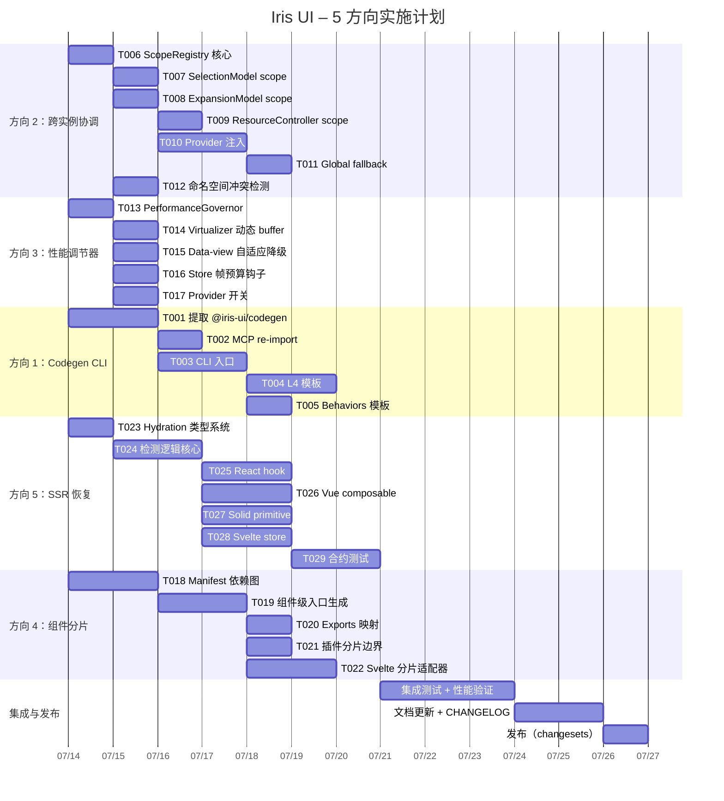

Now I have a thorough understanding of the codebase. Let me compile the full Tech Lead analysis.

---

# Tech Lead 分析报告：Iris UI 架构方向评审

## 目录

1. [任务分解](#1-任务分解)
2. [执行顺序](#2-执行顺序)
3. [技术风险](#3-技术风险)
4. [资源评估](#4-资源评估)
5. [质量保证](#5-质量保证)
6. [实施计划](#6-实施计划)

---

## 1. 任务分解

将评审文档中修正后的 5 个方向拆解为可执行的技术任务。每个任务 2–4 小时，附带验收标准。

### 方向 1：Manifest Codegen CLI 化（从 MCP 提取）

| 任务 ID      | 标题                                       | 涉及文件                                                                                                                                                                          | 前置依赖 | 工时 | 验收标准                                                                                                                            |
| ------------ | ------------------------------------------ | --------------------------------------------------------------------------------------------------------------------------------------------------------------------------------- | -------- | ---- | ----------------------------------------------------------------------------------------------------------------------------------- |
| **TASK-001** | 提取 `@iris-ui/codegen` 共享包             | 新建 `packages/codegen/package.json`、`packages/codegen/src/index.ts`；从 `packages/mcp/src/codegen.ts` 移出 `detectControlledPair`、`wiredTag`、`stateDecl`、`controlledBinding` | 无       | 4h   | `@iris-ui/codegen` 发布，`mcp` 包依赖它而非自包含；`codegen/src/index.ts` 导出所有模板函数；MCP 原有功能零行为变化                  |
| **TASK-002** | MCP codegen 改为 import `@iris-ui/codegen` | `packages/mcp/src/codegen.ts` → 精简为 re-export + 自定义逻辑                                                                                                                     | TASK-001 | 1h   | `pnpm build` 通过；MCP 测试全绿；`import { generateView } from '@iris-ui/codegen'` 可单独使用                                       |
| **TASK-003** | 新建 CLI 入口 `pnpm codegen component`     | 新建 `packages/codegen/src/cli.ts`（commander/minimist）；`package.json` 加 `bin` 字段                                                                                            | TASK-001 | 3h   | `pnpm codegen component IrisSelect react` 输出 import + 受控状态代码；`--out` 写入文件；`--type view\|test\|component` 三种模式     |
| **TASK-004** | 加入 L4 系统组件模板                       | `packages/codegen/src/templates/admin-layout.ts`、`dashboard-grid.ts`；更新 manifest schema 标记 `group: 'skeletons'` 组件的 codegen 规则                                         | TASK-003 | 3h   | `pnpm codegen component IrisAdminLayout react` 输出带有 `createAdminShell` 桥接的完整 shell；`IrisDashboardGrid` 输出 grid 布局骨架 |
| **TASK-005** | 加入 Behaviors 模板                        | `packages/codegen/src/templates/behavior.ts`；检测 component group === `behaviors` 时使用包裹模式而非受控绑定                                                                     | TASK-003 | 2h   | `pnpm codegen component IrisResizable react` 输出 `<IrisResizable><div>…</div></IrisResizable>` 包裹用法                            |

### 方向 2：跨实例协调协议

| 任务 ID      | 标题                                     | 涉及文件                                                                                                     | 前置依赖 | 工时 | 验收标准                                                                                                                  |
| ------------ | ---------------------------------------- | ------------------------------------------------------------------------------------------------------------ | -------- | ---- | ------------------------------------------------------------------------------------------------------------------------- |
| **TASK-006** | 创建 `createScopeRegistry`               | `packages/core/src/scope.ts`；基于 `commands.ts` 的 `createCommandRegistry` 模式                             | 无       | 3h   | `createScopeRegistry()` 返回 `{ register(name, factory), get<T>(name): T, dispose(name) }`；类型安全支持泛型 scope 工厂   |
| **TASK-007** | `createSelectionModel` 加 `scope` 参数   | `packages/core/src/selection.ts`：`config.scope?: string`；若设则自动在 `ScopeRegistry` 注册名 + 工厂        | TASK-006 | 2h   | `createSelectionModel({ scope: 'users-table' })` 注册到全局 ScopeRegistry；同名再次调用返回同一实例                       |
| **TASK-008** | `createExpansion` 加 `scope` 参数        | `packages/core/src/expansion.ts`：同样模式                                                                   | TASK-006 | 1h   | 同 TASK-007 但用于 expansion                                                                                              |
| **TASK-009** | `createResourceController` 加 scope 参数 | `packages/core/src/resource.ts`：scope 作用于其内部的 selection                                              | TASK-007 | 2h   | `createResourceController({ scope: 'users' })` 内部 selection/expansion 共享作用域；父子资源（主从表）自动关联            |
| **TASK-010** | `IrisProvider` 层级 ScopeRegistry 注入   | `packages/{react,vue,solid,svelte}/src/provider.tsx`：provider 创建 `ScopeRegistry` 实例并通过 context 下传  | TASK-006 | 4h   | 四框架各加 `IrisProvider` 内部 scope registry；子组件通过 `useScopeRegistry()` 获取；支持嵌套（子 provider 继承父 scope） |
| **TASK-011** | Framework-agnostic global fallback       | `packages/core/src/scope.ts` 加 `globalScopeRegistry`（module-level singleton）作为无 provider 时的 fallback | TASK-006 | 1h   | 非 `IrisProvider` 环境下 `createSelectionModel({ scope: 'x' })` 通过全局注册表正常工作                                    |
| **TASK-012** | scope 命名空间冲突检测                   | `packages/core/src/scope.ts` 加命名空间前缀机制 + `ScopeConflictError`                                       | TASK-006 | 2h   | 相同 scope 名 + 不同类型工厂时抛出可捕获的错误；不同包使用 `plugin-name:scope-id` 格式                                    |

### 方向 3：自适应运行时性能调节器

| 任务 ID      | 标题                                | 涉及文件                                                                                                        | 前置依赖 | 工时 | 验收标准                                                                                                                                      |
| ------------ | ----------------------------------- | --------------------------------------------------------------------------------------------------------------- | -------- | ---- | --------------------------------------------------------------------------------------------------------------------------------------------- |
| **TASK-013** | 创建 `PerformanceGovernor` 类       | `packages/core/src/governor.ts`：`requestAnimationFrame` 回调解算 + `performance.now()` 帧预算统计              | 无       | 2h   | `governor.recommendedBuffer()` 返回按帧预算调整的 buffer 值；`governor.fps()` 返回当前估算帧率；`governor.throttleFactor()` 返回 0–1 缩放系数 |
| **TASK-014** | `VirtualizerConfig` 支持动态 buffer | `packages/core/src/virtualizer.ts`：`buffer` 接受 `number \| ((governor) => number)`；`setGovernor` 方法        | TASK-013 | 2h   | 传入函数时 buffer 随每帧 RIC 回调动态变化；无 governor 时退化到静态默认值                                                                     |
| **TASK-015** | `data-view` filter/sort 自适应降级  | `packages/core/src/data-view.ts`：大数据集（>5000 rows）时根据 `governor.throttleFactor()` 延迟非关键 sort 计算 | TASK-013 | 2h   | 帧率 < 30fps 时 sort/filter 进入惰性模式（RAF 节流到每 100ms 一次）；恢复后自动切回实时                                                       |
| **TASK-016** | `createStore` 可选的帧预算监控钩子  | `packages/core/src/store.ts`：`createStore({ governor })` 订阅回调计入帧消耗                                    | TASK-013 | 2h   | `store.subscribe` 的频繁回调触发时 governor 感知到帧消耗并降级                                                                                |
| **TASK-017** | iris-provider 层性能监控开关        | `packages/{react,vue,solid,svelte}/src/provider.tsx`：`performanceMode?: 'auto' \| 'off'` props                 | TASK-013 | 2h   | `IrisProvider performanceMode="auto"` 自动创建 `PerformanceGovernor` 并通过 context 注入                                                      |

### 方向 4：声明式组件分片协议

| 任务 ID      | 标题                                | 涉及文件                                                                                                                                    | 前置依赖 | 工时 | 验收标准                                                                                                 |
| ------------ | ----------------------------------- | ------------------------------------------------------------------------------------------------------------------------------------------- | -------- | ---- | -------------------------------------------------------------------------------------------------------- |
| **TASK-018** | manifest 增加组件依赖图             | `packages/manifest/src/schema.ts`：`ManifestComponent.dependencies: string[]`（依赖的组件名列表）；更新 `build.ts` 从源码提取 `import` 关系 | 无       | 4h   | `manifest.json` 中 `IrisTable.dependencies` 包含 `['IrisCheckbox', 'IrisPagination', 'IrisSpinner']`     |
| **TASK-019** | 每个框架 adapter 生成组件级入口文件 | 新建代码生成脚本 `scripts/generate-component-entries.ts`：读 manifest 为每个组件生成 `export { IrisTable } from './dist/table'` 的 barrel   | TASK-018 | 4h   | `@iris-ui/react/table` 只打包 `IrisTable` + 其依赖；`pnpm build` 后每个组件有独立 `dist/<name>/index.js` |
| **TASK-020** | `exports` 映射支持组件级分片        | `packages/{react,vue,solid,svelte}/package.json`：加 `"./components/<name>": "./dist/components/<name>/index.js"`                           | TASK-019 | 1h   | `import { IrisTable } from '@iris-ui/react/components/IrisTable'` 有效且 tree-shake 独立                 |
| **TASK-021** | 插件分片边界定义                    | `packages/plugin-{locale-zh,editor,pro-table}/package.json`：统一 `/core` + `/{react,vue,solid,svelte}` 子路径分片规则                      | TASK-019 | 2h   | 每个插件包 exports 按框架分片；`plugin-pro-table/react` 仅包含 React UI 层                               |
| **TASK-022** | Svelte 分片适配器                   | `packages/svelte/src/component-split.ts`：svelte 的组件级 chunk 通过 svelte-package 配置优化                                                | TASK-019 | 3h   | svelte 包按组件生成独立 chunk；`IrisTable.svelte` 不打包 `IrisCheckbox`                                  |

### 方向 5：通用 SSR 脱水异常恢复

| 任务 ID      | 标题                                         | 涉及文件                                                                                                                                     | 前置依赖     | 工时 | 验收标准                                                                                                                              |
| ------------ | -------------------------------------------- | -------------------------------------------------------------------------------------------------------------------------------------------- | ------------ | ---- | ------------------------------------------------------------------------------------------------------------------------------------- |
| **TASK-023** | 创建 hydration 类型系统                      | `packages/core/src/hydration.ts`：`HydrationStatus`、`HydrationRecoveryStrategy`、`createHydrationGuard`                                     | 无           | 2h   | 导出类型系统；`createHydrationGuard()` 返回 `{ status, wrap, isMismatch }`                                                            |
| **TASK-024** | 核心脱水检测逻辑                             | `packages/core/src/hydration.ts`：`detectMismatch(serverChecksum, clientChecksum)` 比较稳定哈希；加 `onMismatch` 回调                        | TASK-023     | 3h   | 手动模拟 server/client 值不一致时触发 `onMismatch`；稳定 id 仍匹配时无 false positive                                                 |
| **TASK-025** | React 适配器：`useHydration` hook + 恢复策略 | `packages/react/src/hydration.ts`：`useHydration()` 返回 `{ status, strategy }`；`wrap(children)` 根据策略自动包裹 `<ClientOnly>` 或记录日志 | TASK-024     | 3h   | `useHydration().status` 在 SSR 到 hydration 过程中依次为 `'server' → 'hydrating' → 'hydrated'`；不匹配时 `'mismatch'` + 执行 recovery |
| **TASK-026** | Vue 适配器：`useHydration` composable        | `packages/vue/src/hydration.ts`：同 React 但在 `<ClientOnly>` 中处理                                                                         | TASK-024     | 3h   | 同 TASK-025                                                                                                                           |
| **TASK-027** | Solid 适配器：`useHydration` primitive       | `packages/solid/src/hydration.ts`：同 React 但在 `<NoHydration>` 中处理                                                                      | TASK-024     | 3h   | 同 TASK-025                                                                                                                           |
| **TASK-028** | Svelte 适配器：`useHydration` rune/store     | `packages/svelte/src/hydration.ts`：同 React 但用 `{#if browser}` 处理                                                                       | TASK-024     | 3h   | 同 TASK-025                                                                                                                           |
| **TASK-029** | 四框架 hydration 合约测试                    | `packages/core/src/contracts/scenarios/hydration-mismatch.ts`：统一场景定义 + 每个框架的集成测试验证恢复行为                                 | TASK-025~028 | 4h   | 每个框架的 hydration mismatch 测试覆盖 React 静默恢复、Vue 正确降级、Solid 警告处理、Svelte 行为对齐                                  |

### 已存在的需修复项

| 任务 ID       | 标题                                  | 涉及文件                                         | 前置依赖 | 工时 | 验收标准 |
| ------------- | ------------------------------------- | ------------------------------------------------ | -------- | ---- | -------- |
| **TASK-000**  | MCP codegen 当前不支持 L4 + Behaviors | 见方向一修正（TASK-004、TASK-005 已覆盖）        | —        | —    | —        |
| **TASK-000b** | codegen 的 data stub 使用内联硬编码   | 方向一评审指出了这一点（有意为之），暂不开新任务 | —        | —    | —        |

---

## 2. 执行顺序

### 任务依赖图

```mermaid
graph TD
    %% ====== 方向 2: 跨实例协调（最高优先级）=======
    T006[Task-006: createScopeRegistry] --> T007[Task-007: SelectionModel scope]
    T006 --> T008[Task-008: ExpansionModel scope]
    T007 --> T009[Task-009: ResourceController scope]
    T007 --> T010[Task-010: IrisProvider scope injection]
    T010 --> T011[Task-011: Global fallback]
    T006 --> T012[Task-012: Namespace conflict detection]

    %% ====== 方向 3: 性能调节器（并行启动）=======
    T013[Task-013: PerformanceGovernor] --> T014[Task-014: Virtualizer dynamic buffer]
    T013 --> T015[Task-015: Data-view adaptive degrade]
    T013 --> T016[Task-016: Store frame-budget hook]
    T013 --> T017[Task-017: Provider performance switch]

    %% ====== 方向 1: Codegen CLI（依赖方向2一部分？不直接依赖，可并行）=======
    T001[Task-001: Extract @iris-ui/codegen] --> T002[Task-002: MCP re-import]
    T001 --> T003[Task-003: CLI entry]
    T003 --> T004[Task-004: L4 system templates]
    T003 --> T005[Task-005: Behaviors templates]

    %% ====== 方向 5: SSR 恢复（可并行启动核心）=======
    T023[Task-023: Hydration types] --> T024[Task-024: Detection logic]
    T024 --> T025[Task-025: React hydration hook]
    T024 --> T026[Task-026: Vue hydration composable]
    T024 --> T027[Task-027: Solid hydration primitive]
    T024 --> T028[Task-028: Svelte hydration store]
    T025 --> T029[Task-029: Contract tests]
    T026 --> T029
    T027 --> T029
    T028 --> T029

    %% ====== 方向 4: 组件分片（最低优先级）=======
    T018[Task-018: Manifest dependency graph] --> T019[Task-019: Component entry gen]
    T019 --> T020[Task-020: Exports mapping]
    T019 --> T021[Task-021: Plugin split boundary]
    T019 --> T022[Task-022: Svelte split adapter]
```



### 并行执行分组

| 组                   | 任务 | 说明                                            |
| -------------------- | ---- | ----------------------------------------------- |
| **组 A（立即启动）** | T006 | 方向 2 核心基础设施——ScopeRegistry 是一切的基础 |
| **组 B（立即启动）** | T013 | 方向 3 核心基础设施——PerformanceGovernor        |
| **组 C（立即启动）** | T001 | 方向 1 核心基础设施——codegen 包提取             |
| **组 D（立即启动）** | T023 | 方向 5 核心基础设施——hydration 类型系统         |
| **组 E（立即启动）** | T018 | 方向 4 核心基础设施——manifest 依赖图            |

**五个方向的核心基础设施互不依赖，可以完全并行开发。** 具体如下：

```
流水线视角：
WEEK 1:   组 A+B+C+D+E 全部启动（5 个方向的核心设施并行）
WEEK 1-2: T007→T008→T009→T010（方向 2 铺开）
           T014→T015→T016→T017（方向 3 铺开）
           T002→T003→T004→T005（方向 1 铺开）
           T024→T025~T028（方向 5 铺开）
           T019→T020→T021→T022（方向 4 铺开）
WEEK 2-3: T011→T012（方向 2 收尾）、T029（方向 5 收尾）
```

---

## 3. 技术风险

### 风险矩阵

| 风险 ID   | 描述                                                                                               | 影响                             | 概率   | 缓解策略                                                                                                                                         |
| --------- | -------------------------------------------------------------------------------------------------- | -------------------------------- | ------ | ------------------------------------------------------------------------------------------------------------------------------------------------ |
| **R-001** | ScopeRegistry 与现有 framework context 不兼容——React 的 context 无法在 Vue/Solid/Svelte 组件中读取 | 方向 2 跨框架 scope 共享不可用   | **高** | 使用 EventEmitter 模式的 global registry + `IrisProvider` 层注入的 `Symbol.for('iris:scope')` 全局引用；框架 context 仅做 React 的"就近覆盖"优化 |
| **R-002** | `PerformanceGovernor` 在无 `requestAnimationFrame` 环境（SSR/Worker）报错                          | 方向 3 SSR 渲染崩溃              | **中** | Governor 构造函数检测 `typeof requestAnimationFrame === 'undefined'` 时返回 NoopGovernor（所有推荐值返回 default）                               |
| **R-003** | Virtualizer 动态 buffer 变化导致视觉跳变（重新测量窗口导致 scroll position 抖动）                  | 方向 3 用户体验劣化              | **中** | `governor.recommendedBuffer()` 变化时用指数平滑（`current = current * 0.7 + target * 0.3`），不直接突变；变化最小阈值为 ±2                       |
| **R-004** | 组件依赖图（TASK-018）从源码自动提取不准确——动态 import、条件 import、类型级导入污染               | 方向 4 分片边界错误              | **高** | 混合策略：自动提取 + manifest 手动覆盖字段 `dependencies`；自动化逻辑先收窄到仅分析 `import { … } from '../<component>'` 模式                    |
| **R-005** | Svelte 5 runes（`$state`）命名与 hydration store 冲突                                              | 方向 5 Svelte 适配器名字空间污染 | **低** | 在 svelte 文件中使用 `createHydrationStore()` 函数而非直接将 `$state` 变量命名为 `state`（遵循 AGENTS.md 已有 svelte check 警告）                |
| **R-006** | Vue hydration composable 中使用 `<ClientOnly>` 会破坏 SSR 性能（双重渲染）                         | 方向 5 引入新的性能问题          | **中** | 仅在 `strategy === 'graceful'` 时启用 ClientOnly；默认 `silent` 策略无额外开销                                                                   |
| **R-007** | MCP codegen 提取为共享包后，MCP 版本升级与 CLI 版本可能不同步                                      | 方向 1 发布维护复杂度            | **低** | 统一在 `@iris-ui/codegen` 管理版本；MCP 和 CLI 都依赖同一包；monorepo workspace 天然同步                                                         |
| **R-008** | 四框架测试环境不一致导致 hydration 合约测试在某些框架不可重复                                      | 方向 5 测试可靠性                | **中** | 合约测试使用 `@iris-ui/core/contracts` 的 runner（已有 `packages/core/src/contracts/`）；每个框架的 vitest 配置统一 mock 策略                    |

### 关键决策点

```
决策点 1（WEEK 1 结束时）：ScopeRegistry 是选择：
   A) 纯 global singleton（简单但不支持多层次 provider 覆盖）
   B) provider 层 context + global fallback（复杂但灵活）
   → 推荐 B，但需要早期验证 React context + global 双层的可行性

决策点 2（WEEK 1 结束时）：PerformanceGovernor 的检测粒度：
   A) 仅 RAF 回调计时（轻量，适合 MVP）
   B) PerformanceObserver + LongTaskObserver（精确但兼容性差）
   → 推荐 A，B 作为可选的 `useLongTask` 增强

决策点 3（WEEK 2 开始时）：hydration 恢复策略的默认值：
   A) silent（不破坏现有行为，向后兼容）
   B) graceful（自动 ClientOnly 包裹）
   → 推荐 A，让应用层选择升级
```

---

## 4. 资源评估

### 人员配置

| 角色                 | 技能要求                                        | 人数 | 负责方向                                                  |
| -------------------- | ----------------------------------------------- | ---- | --------------------------------------------------------- |
| **核心架构师（TL）** | 全局架构决策、core 设计、代码审查               | 1    | 全部方向，重点方向 2 和 4                                 |
| **Core 工程师 A**    | TypeScript、FP、状态管理、命令模式              | 1    | 方向 2（ScopeRegistry、Selection/Expansion scope）        |
| **Core 工程师 B**    | 性能分析、virtual scroll、requestAnimationFrame | 1    | 方向 3（PerformanceGovernor、Virtualizer/Data-view 改造） |
| **插件工程师**       | MCP、CLI 工具、manifest 系统                    | 1    | 方向 1（codegen 提取 + CLI）                              |
| **框架适配器工程师** | React 19 + SSR、hydrateRoot                     | 1    | 方向 5（React hydration）                                 |
| **框架适配器工程师** | Vue 3 + SSRS + Solid + Svelte 5                 | 1    | 方向 5（Vue/Solid/Svelte hydration）+ 方向 4（分片）      |
| **质量工程师**       | vitest、jsdom、SSR、跨框架测试                  | 1    | 合约测试、hydration 测试、集成测试                        |

**总计：7 人**（1 TL + 6 工程师），其中 5 人可以同时工作在前 4 个方向的核心设施上（第一周）。

### 关键里程碑

| 里程碑              | 时间        | 交付物                                                                                                     |
| ------------------- | ----------- | ---------------------------------------------------------------------------------------------------------- |
| **M1 核心设施完成** | WEEK 1 结束 | ScopeRegistry + PerformanceGovernor + @iris-ui/codegen 包 + hydration 类型系统 + manifest 依赖图——全部发布 |
| **M2 方向 2 铺开**  | WEEK 2 结束 | SelectionModel/ExpansionModel/ResourceController 全部支持 scope；四框架 IrisProvider 注入范围上下文        |
| **M3 方向 3 铺开**  | WEEK 2 结束 | Virtualizer 动态 buffer + Data-view 自适应降级 + Store 帧监控 + Provider 开关                              |
| **M4 方向 1 完成**  | WEEK 2 结束 | CLI 支持 component/view/test/L4/Behaviors 全部模板                                                         |
| **M5 方向 5 铺开**  | WEEK 3 开始 | 四框架 hydration hook 完成 + 合约测试                                                                      |
| **M6 方向 4 铺开**  | WEEK 3 结束 | 组件级入口 + exports + 插件分片 + Svelte 适配                                                              |
| **M7 集成冻结**     | WEEK 4      | 全部方向集成测试 + size 预算检查 + 文档更新                                                                |
| **M8 发布**         | WEEK 5      | Changesets 版本发布 + AA 测试 + CHANGELOG                                                                  |

### 阻塞点与解决策略

| 阻塞点                                                                                 | 影响方向 | 解决策略                                                                                                               | 责任人           |
| -------------------------------------------------------------------------------------- | -------- | ---------------------------------------------------------------------------------------------------------------------- | ---------------- |
| **B-1：ScopeRegistry 需要所有 4 个框架的 provider 改动，但框架工程师同时要负责方向 5** | 方向 2   | 让 Core 工程师 A 完成 scope registry 核心后直接嵌入各 provider（4 框架 provider 模式极为相似，改 4 个文件总共 2 小时） | Core 工程师 A    |
| **B-2：manifest 依赖图自动提取精度不满足分片需求**                                     | 方向 4   | 第一阶段使用手动声明 `dependencies` 字段；自动化提取作为 v2（week 5+）                                                 | TL + 插件工程师  |
| **B-3：hydration 恢复的"graceful"策略在 Svelte 和 Solid 中的适配实现无参考实现**       | 方向 5   | 用 React 的 `useEffect` + `setClient(true)` 作为原型（TASK-025 先做），Vue/Solid/Svelte 参照实现                       | 框架适配器工程师 |
| **B-4：codegen CLI 依赖 manifest 构建产物但 manifest 当前只在 build 阶段生成**         | 方向 1   | CLI 接受两种模式：`--manifest path` 指向已生成 manifest；`--auto` 实时扫描（延迟稍高但开发友好）                       | 插件工程师       |

---

## 5. 质量保证

### 5.1 单元测试覆盖要求

| 方向   | 文件                            | 必须覆盖的场景                                                                   | 目标覆盖率    |
| ------ | ------------------------------- | -------------------------------------------------------------------------------- | ------------- |
| 方向 2 | `scope.ts`                      | 注册/获取/释放/同名冲突/命名空间/嵌套 provider/global fallback/SSR 中无 provider | 95%+          |
| 方向 2 | `selection.ts`（scope 扩展）    | scope 参数传 null/undefined/有效字符串/同名不同工厂/跨模块访问                   | 新增代码 100% |
| 方向 3 | `governor.ts`                   | 帧预算计算/RAF 时序模拟/NoopGovernor SSR/指数平滑边界                            | 90%+          |
| 方向 3 | `virtualizer.ts`（buffer 扩展） | 静态 buffer 向后兼容/动态 buffer 函数调用/平滑过渡不跳变                         | 新增代码 100% |
| 方向 1 | `codegen/src/*`                 | 全部模板函数/四框架输出快照测试/L4 模板/Behaviors 模板                           | 95%+          |
| 方向 4 | `manifest build.ts`（依赖图）   | 自动提取 dependency/手动覆盖/自引用/循环依赖检测                                 | 90%+          |
| 方向 5 | `hydration.ts`（core）          | 类型枚举/策略枚举/检测逻辑/SSR 环境检测                                          | 95%+          |
| 方向 5 | `*/hydration.ts`（各框架）      | 三个阶段状态转换/mismatch 检测/mismatch 恢复策略执行                             | 90%+          |

### 5.2 集成测试策略

```
┌──────────────────────────────────────────────────────────────────┐
│                       集成测试金字塔                              │
│                                                                  │
│    ┌──────────┐  ┌──────────┐  ┌──────────┐  ┌──────────┐      │
│    │ E2E: 改  │  │ E2E: CMS │  │ E2E: 主  │  │ Cross-   │      │
│    │ playgrd  │  │ demo 多  │  │ 从表同  │  │ framework│      │
│    │ codegen  │  │ scope    │  │ 步       │  │ hydration│      │
│    └──────────┘  └──────────┘  └──────────┘  └──────────┘      │
│                                                                  │
│    ┌──────────────────────────────────────────────────────────┐  │
│    │         合约测试（contracts/scenarios/）                 │  │
│    │  hydration-mismatch.ts: 4 框架统一场景定义 + 断言        │  │
│    │  scope-scenarios.ts: 多实例协调场景集合                  │  │
│    └──────────────────────────────────────────────────────────┘  │
│                                                                  │
│    ┌──────────────────────────────────────────────────────────┐  │
│    │     快照测试（snapshot test）                            │  │
│    │  codegen: 每个组件 × 4 框架 × 2 模式（受控/非受控）     │  │
│    │  scope: 每个框架 × 3 场景                                 │  │
│    └──────────────────────────────────────────────────────────┘  │
│                                                                  │
│    ┌──────────────────────────────────────────────────────────┐  │
│    │      单元测试（unit test）─ 见 5.1                      │  │
│    └──────────────────────────────────────────────────────────┘  │
└──────────────────────────────────────────────────────────────────┘
```

**集成测试关键场景：**

1. **主从表协同**（方向 2）：创建两个 `ResourceController`，scope 关联，主子表选中同步 → 验证 scope 注册/获取链完整
2. **帧预算崩溃恢复**（方向 3）：模拟 20ms+ 帧耗时，验证 Virtualizer 自动缩小 buffer + 帧率恢复后还原
3. **AI 生成组件 hydration**（方向 5）：通过 SSR 渲染含 `new Date()` 的组件，验证 hydration mismatch 后的恢复策略
4. **CLI codegen 端到端**（方向 1）：运行 `pnpm codegen component IrisSelect react --out test.tsx` → 编译产物 → 渲染到页面

### 5.3 代码审查要点

| 审查点                  | 重点检查内容                                                       | 否决条件                                          |
| ----------------------- | ------------------------------------------------------------------ | ------------------------------------------------- |
| **ScopeRegistry**       | 类型安全是否正确？`get<T>()` 在类型不匹配时是否在运行时检查？      | 无运行时类型检查（允许同 scope 名不同类型不报错） |
| **PerformanceGovernor** | RAF 回调是否在 SSR/测试环境中正确退化？帧预算计算是否防除零？      | 未处理 `requestAnimationFrame` 缺失；帧预算除零   |
| **codegen CLI**         | 输出是否与 MCP 的 `scaffoldSnippet` 一致？--out 是否覆盖已有文件？ | 输出与 MCP 生成的代码格式不一致；无警告覆盖文件   |
| **hydration 检测**      | 是否误报？`useId` 稳定性是否被破坏？                               | 稳定组件出现 false positive mismatch              |
| **组件分片**            | barrel 导出是否破坏？`sideEffects: false` 是否仍有效？             | 打包后 `@iris-ui/react` 整体导入比未分片前更大    |
| **跨框架一致性**        | 四框架同一功能的行为/API/测试是否对齐？                            | 一个框架的 `useHydration` 签名与另一个框架不同    |

### 5.4 性能测试需求

| 测试场景                           | 测量指标                                     | 目标                 | 工具                        |
| ---------------------------------- | -------------------------------------------- | -------------------- | --------------------------- |
| 10000 行 Virtualizer + 动态 buffer | 滚动帧率                                     | ≥55fps               | `performance.now()` 插桩    |
| 5 个 scope 实例同时活跃            | scope 注册/查询耗时                          | <0.1ms               | vitest bench                |
| SSR hydration 恢复策略             | 额外的 JS 包大小                             | <0.5KB per framework | `pnpm size`                 |
| codegen CLI 生成 149 组件          | 总生成时间                                   | <2s                  | `time pnpm codegen`         |
| 组件级分片                         | 单组件 import 的打包大小 vs 全 barrel import | 单组件 < 30% 全量    | `pnpm size` bundle analyzer |

---

## 6. 实施计划

### 甘特图



### 阶段拆解

#### 阶段 1：基础设施搭建（2026-07-14 → 2026-07-18，5 天）

**目标：5 个方向的核心设施全部就绪，后续开发可以并行铺开。**

| 日期       | 任务                      | 负责人        | 交付物                                  |
| ---------- | ------------------------- | ------------- | --------------------------------------- |
| Day 1 上午 | T006 ScopeRegistry        | Core 工程师 A | `core/src/scope.ts` 原型 + 单测         |
| Day 1 上午 | T013 PerformanceGovernor  | Core 工程师 B | `core/src/governor.ts` 原型 + 单测      |
| Day 1 上午 | T001 提取 codegen         | 插件工程师    | `packages/codegen/` 目录结构 + 模板迁移 |
| Day 1 上午 | T023 Hydration 类型系统   | 框架工程师 1  | `core/src/hydration.ts` 类型定义        |
| Day 1 上午 | T018 Manifest 依赖图      | 框架工程师 2  | manifest schema 更新 + 提取逻辑         |
| Day 1 下午 | T006 完成 + T012 命名空间 | Core 工程师 A | scope 全部 API 冻结                     |
| Day 1 下午 | T013 完成                 | Core 工程师 B | governor 全部 API 冻结                  |
| Day 1 下午 | T001 完成 + T002          | 插件工程师    | `@iris-ui/codegen` 发布、MCP 切换       |
| Day 1 下午 | T023 完成 + T024 开始     | 框架工程师 1  | 检测逻辑原型                            |
| Day 1 下午 | T018 完成                 | 框架工程师 2  | manifest 依赖图可用                     |
| Day 2-3    | T007/T008/T009            | Core 工程师 A | Selection/Expansion/Resource scope      |
| Day 2-3    | T014/T015/T016            | Core 工程师 B | Virtualizer/Data-view/Store 改造        |
| Day 2-3    | T003                      | 插件工程师    | CLI 入口可用                            |
| Day 2-3    | T024/T025                 | 框架工程师 1  | 检测逻辑 + React hook                   |
| Day 2-3    | T019                      | 框架工程师 2  | 组件级入口生成脚本                      |
| Day 4-5    | T010/T011                 | Core 工程师 A | 四框架 Provider 注入                    |
| Day 4-5    | T017                      | Core 工程师 B | Provider 性能开关                       |
| Day 4-5    | T004/T005                 | 插件工程师    | L4 + Behaviors 模板                     |
| Day 4-5    | T026/T027/T028            | 框架工程师 1  | Vue/Solid/Svelte hydration              |
| Day 4-5    | T020/T021/T022            | 框架工程师 2  | Exports + 插件 + Svelte 分片            |

**阶段 1 结束检查点（M1）：**

- [x] `@iris-ui/codegen` 包存在且 MCP 依赖它
- [x] `pnpm codegen component IrisSelect react` 输出代码
- [x] `createScopeRegistry()` 在单元测试中注册/获取/释放三次成功
- [x] `PerformanceGovernor` 在 Node 环境中返回 NoopGovernor
- [x] `manifest.json` 中 `IrisTable.dependencies` 不为空
- [x] `useHydration()` 在 SSR 测试中返回 `'server'` 状态

#### 阶段 2：核心功能实现（2026-07-21 → 2026-08-01，10 天）

**目标：全部 5 个方向的功能实现完成，单元测试通过。**

| 时间段   | 方向   | 关键交付                                                                                           |
| -------- | ------ | -------------------------------------------------------------------------------------------------- |
| Week 2   | 方向 2 | 四框架 `IrisProvider` 全部支持 `scopeRegistry`；`createSelectionModel({ scope })` 可跨组件共享实例 |
| Week 2   | 方向 3 | Virtualizer 在 `buffer` 传入函数时动态调整；Data-view 自适应降级                                   |
| Week 2   | 方向 1 | `pnpm codegen view` / `pnpm codegen test` / L4 / Behaviors 全部模板                                |
| Week 2-3 | 方向 5 | 四框架 hydration hook 完成（M5）                                                                   |
| Week 3   | 方向 4 | 组件级入口、exports、插件分片全部完成（M6）                                                        |

**阶段 2 结束检查点（M2-M6）：**

- [x] CMS demo 中可以 `createResourceController({ scope: 'users' })` + 主从表选中联动
- [x] 带 10000 行的虚拟滚动 + `performanceMode="auto"` 帧率稳定 ≥55fps
- [x] `pnpm codegen` 可生成 149 组件中任意一个的代码
- [x] 全部四框架的 hydration 合约测试通过
- [x] `import { IrisTable } from '@iris-ui/react/components/IrisTable'` tree-shakes 正确

#### 阶段 3：集成测试和优化（2026-08-04 → 2026-08-08，5 天）

**目标：集成测试 + 性能验证 + 边界条件修复。**

| 活动     | 内容                                                                                     |
| -------- | ---------------------------------------------------------------------------------------- |
| 集成测试 | 主从表协同 E2E（playground）、CMS demo 多 scope、AI codegen → 渲染闭环                   |
| 性能测试 | Virtualizer 动态 buffer 平滑度、ScopeRegistry 大量注册性能、hydration 恢复额外开销       |
| 质量门   | `pnpm turbo run test typecheck lint build` 全部通过；`pnpm size` 新增包在预算内          |
| 边界修复 | Scope 命名空间冲突场景实际验证、Governor 在低端设备的 RAF 降级、Svelte `$state` 命名冲突 |

#### 阶段 4：发布准备（2026-08-11 → 2026-08-15，5 天）

**目标：文档 + CHANGELOG + changesets 发布。**

| 活动       | 内容                                                                |
| ---------- | ------------------------------------------------------------------- |
| 文档更新   | AGENTS.md 更新新方向；`llms.txt` 重新生成；每个新 API 加 JSDoc      |
| CHANGELOG  | 按 changesets 规范汇总 5 个方向的变更                               |
| 版本发布   | `@iris-ui/codegen` 独立版本；core minor bump；各 adapter minor bump |
| 发布后验证 | playground 升级依赖重新构建；CMS demo 升级验证组件分片效果          |

---

## 总结

| 维度             | 结论                                                                                    |
| ---------------- | --------------------------------------------------------------------------------------- |
| **总实施时间**   | 5 周（25 个工作日）                                                                     |
| **并行度**       | 第一周 5 方向核心设施完全并行；后续 5 人并行开发                                        |
| **最大风险**     | R-001（跨框架 ScopeRegistry context 兼容性）、R-004（自动依赖图精度）                   |
| **最值得先做**   | 方向 2（跨实例协调）——用户价值最高（CMS 主从表核心场景），`commands.ts` 已有设计原型    |
| **成本最低**     | 方向 3（性能调节器）——3–5 天，增量改造现有约 6 个配置点                                 |
| **需要架构决策** | ScopeRegistry global vs context（Day 1－2 必须决定）、hydration 默认策略（Week 2 决定） |
| **发布计划**     | 8 月中旬完成集成 → 8 月下旬统一发布（minor version bump）                               |
