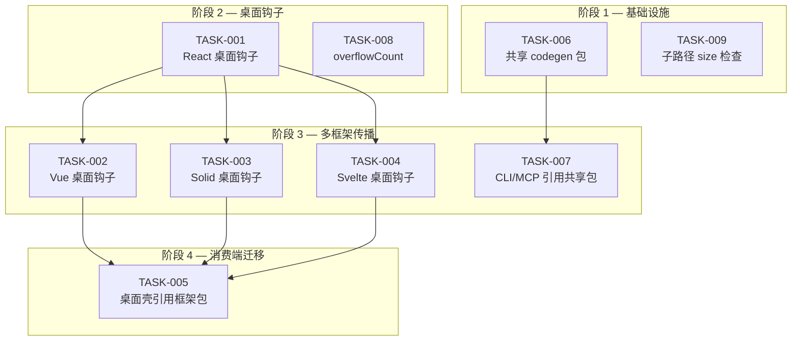
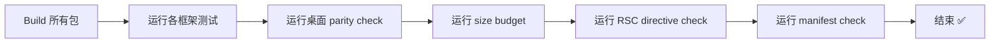
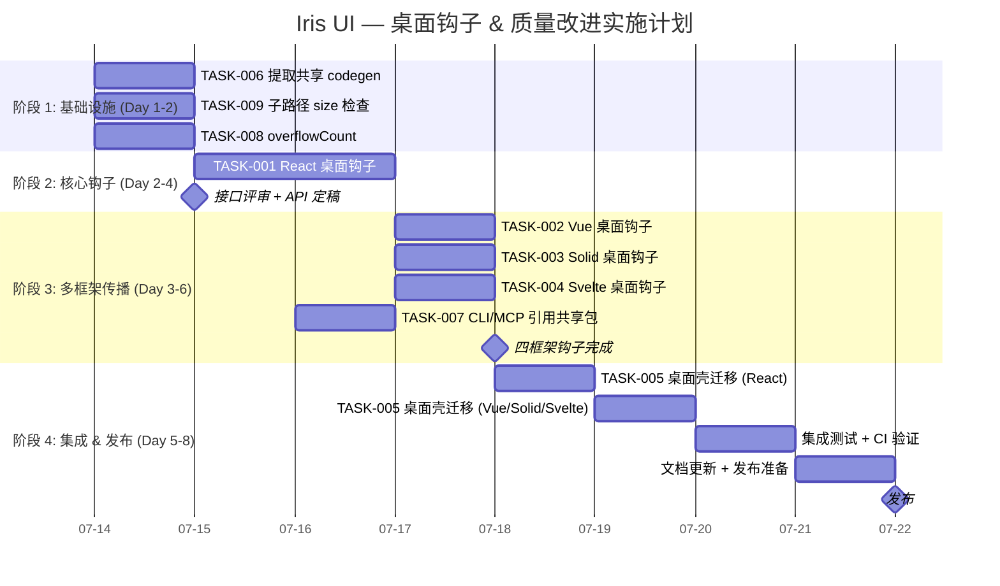

现在我已掌握足够的数据来进行全面的技术负责人分析。请看下文：

---

# 技术负责人分析报告

> **分析日期**: 2026-07-12  
> **代码库基线**: `iris-ui` monorepo (Turborepo 2, pnpm 9, 四框架对齐)  
> **输入来源**: 评估文档的逐项验证 + 源代码交叉验证

---

## 1. 任务分解

基于评估文档，共有 **3 个真实可执行方向** + **1 个守卫改进项**，拆解为 9 个任务。

### 1.1 任务清单

| 任务 ID  | 任务标题                                                   | 所属方向              | 涉及文件                                                                                                                                                                                                                                                                    | 前置依赖                | 预估工时 |
| -------- | ---------------------------------------------------------- | --------------------- | --------------------------------------------------------------------------------------------------------------------------------------------------------------------------------------------------------------------------------------------------------------------------- | ----------------------- | -------- |
| TASK-001 | 提取 React `shell.tsx` 桌面钩子到 `@iris-ui/react/desktop` | 方向一 — 钩子适配器   | `packages/react/src/desktop/index.ts` (新建), `packages/react/src/desktop/useWm.ts`, `useProfile.ts`, `useNotifications.ts`, `useClipboard.ts`, `useFs.ts`, `useCommands.ts` (新建), `packages/react/tsup.config.ts` (加 entry), `packages/react/package.json` (加 exports) | 无                      | 4h       |
| TASK-002 | 创建 Vue 桌面钩子 `@iris-ui/vue/desktop`                   | 方向一 — 钩子适配器   | `packages/vue/src/desktop/` (新建 6 个 composable), `packages/vue/tsup.config.ts`, `packages/vue/package.json`                                                                                                                                                              | TASK-001 (API 对齐参考) | 3h       |
| TASK-003 | 创建 Solid 桌面钩子 `@iris-ui/solid/desktop`               | 方向一 — 钩子适配器   | `packages/solid/src/desktop/` (新建 6 个 hooks), `packages/solid/tsup.config.ts`, `packages/solid/package.json`                                                                                                                                                             | TASK-001 (API 对齐参考) | 3h       |
| TASK-004 | 创建 Svelte 桌面钩子 `@iris-ui/svelte/desktop`             | 方向一 — 钩子适配器   | `packages/svelte/src/desktop/` (新建 6 个 runes 桥), `packages/svelte/tsup.config.ts`, `packages/svelte/package.json`                                                                                                                                                       | TASK-001 (API 对齐参考) | 3h       |
| TASK-005 | Desktop OS 应用层改为引用框架包钩子                        | 方向一 — 消费端迁移   | `apps/desktop-os/src/shell.tsx`, `apps/desktop-os-vue/src/wm.ts`, `apps/desktop-os-solid/src/clipboard-context.tsx` 等 + 其他 3 框架 shell 文件                                                                                                                             | TASK-001~004            | 4h       |
| TASK-006 | 提取 `scaffoldSnippet` + `detectControlledPair` 到共享包   | 方向三 — 代码生成去重 | `packages/codegen/src/` (新建包), `packages/cli/src/commands/scaffold.ts`, `packages/mcp/src/tools.ts`, `packages/mcp/src/codegen.ts`                                                                                                                                       | 无                      | 4h       |
| TASK-007 | CLI 和 MCP 改为引用共享 codegen                            | 方向三 — 消费端迁移   | `packages/cli/src/commands/scaffold.ts`, `packages/mcp/src/tools.ts`, `packages/mcp/package.json`                                                                                                                                                                           | TASK-006                | 1h       |
| TASK-008 | `createDataSource` infinite 模式增加 `overflowCount`       | 方向四 — maxRows UX   | `packages/core/src/data-source.ts`, `packages/core/src/data-source/types.ts`, `packages/core/src/data-source.test.ts`                                                                                                                                                       | 无                      | 2h       |
| TASK-009 | 增加子路径增量 size 预算检查                               | 方向五衍生 — 质量门   | `scripts/check-size.mjs`, `scripts/size-baseline.json`                                                                                                                                                                                                                      | 无                      | 3h       |

### 1.2 任务细节

#### TASK-001: 提取 React 桌面钩子

**上下文**: `apps/desktop-os/src/shell.tsx` 已有完整实现：`useWm`/`useWmState`、`useProfile`/`useProfileState`、`useNotifications`/`useNotificationState`、`useClipboard`/`useClipboardState`、`useFs`/`useFsState`、`useApps`、`useLaunchApp`。这些需要从应用私有代码提升到框架包。

**实现策略**: 每个桌面模块对应两个钩子（控制器获取 + 状态订阅）+ 对应 Provider。

```ts
// packages/react/src/desktop/useWm.ts
import { createContext, useContext } from 'react'
import { useSyncExternalStore } from 'react'
import {
  createWindowManager,
  type WindowManager,
  type WindowManagerState,
} from '@iris-ui/core/window'

// 工厂函数让消费者可选是否传已有实例（SSR 安全）
export function createWmContext(initial?: WindowManager) {
  const defaultWm =
    initial ?? (typeof window !== 'undefined' ? createWindowManager({ workspaces: 4 }) : null)
  const Ctx = createContext<WindowManager | null>(null)
  return {
    WmProvider: Ctx.Provider,
    useWm: () => {
      /* ... */
    },
    useWmState: () => {
      /* useSyncExternalStore bridge */
    },
  }
}
```

**争议点**: React 桌面壳目前用模块级单例（`useRef(createWindowManager()).current`）。要决定框架包是否提供 Provider + 上下文工厂（**推荐**），还是暴露裸钩子让应用自己管理上下文（**更灵活，但增加样板代码**）。

**建议**: 暴露工厂函数（`createXxxContext`）返回 `{ Provider, useXxx, useXxxState }` 元组，让桌面壳可以：

```tsx
// 桌面壳 App.tsx
import { createWmContext } from '@iris-ui/react/desktop'
const { WmProvider, useWm, useWmState } = createWmContext()
export { useWm, useWmState }
```

---

## 2. 执行顺序

### 2.1 任务依赖图



### 2.2 可并行执行的任务组

| 组       | 任务                         | 可并行理由                                                             |
| -------- | ---------------------------- | ---------------------------------------------------------------------- |
| **组 A** | TASK-006, TASK-008, TASK-009 | 互不依赖：codegen 包 / data-source 修改 / size 脚本 — 各自独立         |
| **组 B** | TASK-002, TASK-003, TASK-004 | 三者均以 TASK-001 为 API 参考，可在 API 定稿后同时开工（每人一个框架） |
| **组 C** | TASK-005, TASK-007           | 消费端迁移，等 B 组完成后并行                                          |

---

## 3. 技术风险

### 3.1 风险矩阵

| #   | 风险                                                                                                     | 影响                          | 概率 | 缓解策略                                                                                                                          |
| --- | -------------------------------------------------------------------------------------------------------- | ----------------------------- | ---- | --------------------------------------------------------------------------------------------------------------------------------- |
| R1  | **桌面钩子 SSR 安全**：`createWindowManager` 在 Node 环境中使用 `workspace`/`geometry` 计算可能依赖 DOM  | TASK-001~005 引入 SSR 回归    | 中   | React 端用 `useRef` 懒初始化；所有工厂加上 `typeof window === 'undefined'` 守卫；核心包 window.ts 已模块化（无 DOM 依赖）但需验证 |
| R2  | **Svelte 5 rune 兼容**：`$state` 变量不能被命名为 `state`（已知陷阱），且 `$effect` 注册在组件初始化期间 | TASK-004 可能产生诡异编译错误 | 中   | 严格遵循 Svelte 包现有模式（见 `apps/desktop-os-svelte/src/clipboard.svelte.ts`：变量名用 `cstate`）；增加 svelte-check 类型通过  |
| R3  | **API 设计锁定**：四个框架钩子的签名需统一，一旦发布就难改                                               | 后续重构成本高                | 低   | 先合并明确需求再实现；参考 React shell.tsx 已验证的 API 表面；提供 TypeScript 接口契约                                            |
| R4  | **`@iris-ui/codegen` 包发布**：新增包需要配置构建 + CI + 版本管理                                        | TASK-006 增加发布复杂度       | 低   | 纳入 Turborepo 流水线，遵循现有 `tsup` 配置模式；作为 `@iris-ui/core` 的 `./codegen` 子路径而不是独立包（减少发布成本）           |
| R5  | **桌面壳迁移到框架包钩子需同时修改 4 个应用**                                                            | TASK-005 协调成本高           | 中   | TASK-005 分两个子步骤：先改 React（低风险），验证通过后再批量改 Vue/Solid/Svelte                                                  |
| R6  | **`overflowCount` 不兼容已有 `hasMore` 语义**：现有消费者依赖 `hasMore` 布尔值                           | TASK-008 可能破坏现有 UI      | 低   | 纯加法：`overflowCount` 为可选字段；`hasMore` 行为不变；已有测试全部通过                                                          |

### 3.2 性能考量

| 关注点              | 说明                                                                                                                                               |
| ------------------- | -------------------------------------------------------------------------------------------------------------------------------------------------- |
| **桌面钩子包大小**  | 每个钩子约 30 行 + 类型定义。6 个钩子 + Provider = ~500 行 TS，gzip < 1KB 增量。**可忽略**                                                         |
| **`overflowCount`** | 纯数字计算，无额外 IO。**零开销**                                                                                                                  |
| **共享 codegen**    | 目前两个实现在 CLI 和 MCP 中各 ~300 行 → 合并后约 350 行。CLI 不再需要 `detectControlledPair` 作为运行时依赖（它是 build-time only），**净减字节** |

---

## 4. 资源评估

### 4.1 人员要求

| 角色                     | 所需技能                                           | 数量 | 负责任务                     |
| ------------------------ | -------------------------------------------------- | ---- | ---------------------------- |
| **Senior FE (框架专家)** | React 18/19 + `useSyncExternalStore` + Context API | 1    | TASK-001 (API 定稿 + 实现)   |
| **Vue 开发者**           | Vue 3 Composition API + `shallowRef`               | 1    | TASK-002                     |
| **Solid 开发者**         | SolidJS signals + Context                          | 1    | TASK-003                     |
| **Svelte 开发者**        | Svelte 5 runes ($state/$effect)                    | 1    | TASK-004                     |
| **Core/基建开发者**      | TypeScript + Node.js + tsup                        | 1    | TASK-006, TASK-008, TASK-009 |
| **集成工程师**           | 全栈 + CI/CD                                       | 1    | TASK-005, TASK-007 (可兼职)  |

**推荐**: 2 人团队（1 Senior + 1 全栈），4 周内完成全部任务。若 4 框架各有专人可并行缩短到 2 周。

### 4.2 关键里程碑

| 里程碑               | 预计完成时间 | 交付物                                                              |
| -------------------- | ------------ | ------------------------------------------------------------------- |
| M1 — API 定稿        | Day 1        | React 桌面钩子接口 TS 类型 + 实现 + 单测通过                        |
| M2 — 四框架对齐      | Day 3~5      | Vue/Solid/Svelte 桌面钩子实现 + 跨框架类型一致性验证                |
| M3 — 共享 codegen    | Day 2        | `@iris-ui/codegen` (或 `@iris-ui/core/codegen`) 实现 + CLI/MCP 迁移 |
| M4 — maxRows UX 修复 | Day 1        | `overflowCount` + 测试更新                                          |
| M5 — 质量门强化      | Day 2        | 子路径 size 预算 + CI 集成                                          |
| M6 — 桌面壳迁移      | Day 5~7      | 4 个桌面壳全部改为引用框架包钩子 + parity check 通过                |

### 4.3 阻塞点

| 阻塞点                              | 说明                                | 解决策略                                                            |
| ----------------------------------- | ----------------------------------- | ------------------------------------------------------------------- |
| **API 定稿争议**                    | 工厂模式 vs 裸钩子 vs Provider 元组 | Day 0 技术评审决定；推荐 Provider 元组（最大灵活性）                |
| **Svelte 5 rune 与 SSR**            | `$state` 在 SSR 上下文行为          | 跟随 `@iris-ui/svelte` 现有模式（已有 SSR 测试基础设施）            |
| **`@iris-ui/codegen` 包发布流水线** | 新包需加入 changeset                | 手工 `pnpm changeset add` 配置 versioning；小改动可先放 core 子路径 |

---

## 5. 质量保证

### 5.1 单元测试覆盖要求

| 任务         | 测试类型          | 最低覆盖率  | 关键测例                                                                                    |
| ------------ | ----------------- | ----------- | ------------------------------------------------------------------------------------------- |
| TASK-001~004 | 单元测试 (Vitest) | 100% 行覆盖 | 每个钩子的上下文抛出错误；状态订阅发射正确；SSR 路径（`typeof window === 'undefined'`）     |
| TASK-005     | 集成测试          | 主要路径    | 桌面壳渲染不报错；窗口管理、通知等功能不受影响                                              |
| TASK-006     | 单元测试          | 100%        | `scaffoldSnippet` 所有框架输出正确性；`detectControlledPair` 所有配对模式；CLI/MCP 输出等价 |
| TASK-008     | 单元测试          | 100%        | `overflowCount` 在 maxRows 边界正确；不破坏已有 `hasMore` 语义                              |
| TASK-009     | 不适用            | —           | —                                                                                           |

**现有测试基础设施**:

- React: `@testing-library/react` + `vitest-jsdom`
- Vue: `@vue/test-utils` + `vitest-jsdom`
- Solid: `solid-testing-library` + `vitest-jsdom`
- Svelte: `@testing-library/svelte` + `vitest-jsdom`
- Core: 纯 Vitest

### 5.2 集成测试策略



**新增集成检查**:

- `pnpm check:desktop-parity` 脚本已存在 — 需更新 `FEATURES` 表加入新行验证 `useWm`/`useProfile` 等钩子在框架包中出现
- 新增 `pnpm check:subpath-size` 验证子路径 tree-shaking 增量

### 5.3 代码审查要点

| 审查点                 | 具体内容                                                                                                                     |
| ---------------------- | ---------------------------------------------------------------------------------------------------------------------------- |
| **上下文线程安全**     | React 的 `createContext` 要在模块级还是组件级? — 推荐工厂函数模式，每次 `createWmContext()` 创建独立上下文                   |
| **SSR 守卫**           | 所有浏览器 API 访问前检查 `typeof window`；`useSyncExternalStore` 的 `getServerSnapshot` 参数                                |
| **Svelte rune 变量名** | `$state` + `state` 变量名的冲突避免                                                                                          |
| **Tree-shaking 验证**  | 从 barrel 导入不触发桌面模块                                                                                                 |
| **测试重置**           | 上下文/Provider 测试需要 `afterEach` 清理（React `cleanup` 已处理，Vue/Solid 需注意）                                        |
| **类型一致性**         | 四个框架的 `useXxxState()` 返回值类型签名必须一致：React/Solid 返回值，Vue 返回 `Ref<>`，Svelte 返回 `{ readonly value: T }` |

### 5.4 性能测试需求

| 测试                      | 场景                                                         | 通过标准                            |
| ------------------------- | ------------------------------------------------------------ | ----------------------------------- |
| **子路径 bundle 大小**    | `import { createStore } from '@iris-ui/core'` 不包含桌面模块 | 桌面模块 0 字节出现在 barrel 产物中 |
| **桌面钩子增量大小**      | `import { useWm } from '@iris-ui/react/desktop'`             | gzip < 1KB                          |
| **CLI scaffold 启动时间** | `pnpm iris scaffold IrisButton react`                        | 变更前后无退化（< 50ms 差异）       |

---

## 6. 实施计划

### 6.1 时间线甘特图



### 6.2 分阶段详情

#### 阶段 1: 基础设施搭建 (Days 1-2)

**Day 1 目标**: 完成所有不依赖 API 定稿的可并行工作

| 任务     | 负责人      | 交付物                                  | 验收标准                                                                                                  |
| -------- | ----------- | --------------------------------------- | --------------------------------------------------------------------------------------------------------- |
| TASK-006 | Core 工程师 | `packages/core/src/codegen/` 目录       | `scaffoldSnippet` + `detectControlledPair` + `wiredTag` 从 MCP 包提取到 core；CLI 和 MCP 都引用同一份代码 |
| TASK-009 | Core 工程师 | `scripts/check-size.mjs` 更新           | 新增子路径条目：每个桌面模块在 `BUDGETS` 中有独立预算                                                     |
| TASK-008 | Core 工程师 | `packages/core/src/data-source.ts` 更新 | `hasMore` 逻辑不变；新增 `overflowCount?: number`；3 个 infinite 测试更新                                 |

**阶段 1 风险**: TASK-006 需要决定是独立包还是 core 子路径。推荐 `@iris-ui/core/codegen` 子路径（免去新包发布流程），在 `tsup.config.ts` 加 entry。

#### 阶段 2: 核心钩子实现 (Days 2-4)

**Day 2 上午 — API 定稿**: 基于 `apps/desktop-os/src/shell.tsx` 设计 TS 接口

```ts
// 约定接口（所有框架遵循）
interface DesktopHooks {
  // 窗口管理器
  WmProvider: Component<{ value: WindowManager; children: ReactNode }>
  useWm: () => WindowManager
  useWmState: () => WindowManagerState

  // 用户配置
  ProfileProvider: Component<{ value: UserProfile; children: ReactNode }>
  useProfile: () => UserProfile
  useProfileState: () => ProfileData

  // 通知中心
  NotificationsProvider: Component<{ value: NotificationCenter; children: ReactNode }>
  useNotifications: () => NotificationCenter
  useNotificationState: () => NotificationCenterState

  // 剪贴板历史
  ClipboardProvider: Component<{ value: ClipboardHistory; children: ReactNode }>
  useClipboard: () => ClipboardHistory
  useClipboardState: () => ClipboardHistoryState

  // 虚拟文件系统
  FsProvider: Component<{ value: VirtualFs; children: ReactNode }>
  useFs: () => VirtualFs
  useFsState: () => VfsState

  // 命令注册表
  CommandsProvider: Component<{ value: CommandRegistry; children: ReactNode }>
  useCommands: () => CommandRegistry
}

// 工厂函数（每个框架独立实现，API 签名一致）
function createDesktopHooks(): DesktopHooks
```

**Day 2 下午 ~ Day 4 — 实现**: TASK-001 先完成 React 版（作为参考实现），TASK-002~004 随后。

#### 阶段 3: 多框架传播 (Days 4-6)

**关键**: Vue/Solid/Svelte 版跟随 React 版 API，利用各框架反应式原语：

| 框架   | 状态桥接                  | 上下文           | 实现参考                                                                                                  |
| ------ | ------------------------- | ---------------- | --------------------------------------------------------------------------------------------------------- |
| React  | `useSyncExternalStore`    | `createContext`  | `shell.tsx` 已有实现                                                                                      |
| Vue    | `shallowRef` + 模块级订阅 | `provide/inject` | `apps/desktop-os-vue/src/wm.ts`+`notifications.ts`+`fs.ts`+`clipboard.ts`+`profile.ts` 模块单例可直接复用 |
| Solid  | `createSignal` + 订阅     | `createContext`  | `apps/desktop-os-solid/src/clipboard-context.tsx` 模式                                                    |
| Svelte | `$state` + `$effect`      | Context API      | `apps/desktop-os-svelte/src/clipboard.svelte.ts` 模式                                                     |

**重要发现**: Vue/Solid/Svelte 桌面壳实际上**已经有实现** — 分散在各壳的 `wm.ts`、`clipboard-context.tsx`、`clipboard.svelte.ts`、`notifications.ts`、`fs.ts` 等文件中。TASK-002~004 的核心工作是将这些**应用内实现提升到框架包**并统一导出。

#### 阶段 4: 集成测试和发布准备 (Days 5-8)

**Day 5** — TASK-005 桌面壳迁移：

- 修改 `apps/desktop-os/src/shell.tsx`：`import { useWm, useWmState, ... } from '@iris-ui/react/desktop'` 代替本地定义
- 类似修改 Vue/Solid/Svelte 壳
- 运行 `pnpm check:desktop-parity` 验证

**Day 6—7** — 集成测试：

- CI 流水线全部通过
- 手动验证所有 4 个桌面壳可正常渲染
- 更新 `scripts/check-desktop-parity.mjs` 加入新行验证钩子存在于框架包

**Day 8** — 文档 + 发布准备：

- 更新 `AGENTS.md` / `llms.txt` (运行 `pnpm gen:manifest`)
- 更新 `REQUIREMENTS.md` 桌面壳需求矩阵
- `pnpm changeset` 准备版本变更

### 6.3 总工时估算

| 任务     | 工时    | 并行度                                     |
| -------- | ------- | ------------------------------------------ |
| TASK-001 | 4h      | 单线程                                     |
| TASK-002 | 3h      | 与 TASK-003~004 并行                       |
| TASK-003 | 3h      | 与 TASK-002~004 并行                       |
| TASK-004 | 3h      | 与 TASK-002~003 并行                       |
| TASK-005 | 4h      | 单线程                                     |
| TASK-006 | 4h      | 与 TASK-008~009 并行                       |
| TASK-007 | 1h      | 与 TASK-005 并行                           |
| TASK-008 | 2h      | 与 TASK-006~009 并行                       |
| TASK-009 | 3h      | 与 TASK-006~008 并行                       |
| **总计** | **27h** | **~8 天**（2 人团队）or **~12 天**（单人） |

---

## 7. 总结

### 7.1 评估文档的正确性回顾

| 方向                        | 评估结论                                 | 实际严重性              | 需不需要执行                     |
| --------------------------- | ---------------------------------------- | ----------------------- | -------------------------------- |
| ① Desktop OS 框架适配器缺失 | ✅ 正确                                  | 🔴 高 — 四框架承诺缺口  | ✅ **必须修复**                  |
| ② Desktop OS 不对称         | ❌ 错误                                  | 不适用                  | ❌ 不执行                        |
| ③ AI 未连线                 | ❌ 大部分错误 (scaffoldSnippet 重复真实) | 🟡 低至中               | ✅ **scaffoldSnippet 去重** (仅) |
| ④ Infinite 竞态             | ⚠️ 部分正确 (纪元已处理竞态)             | 🟢 低 — maxRows UX 瑕疵 | ✅ **overflowCount** (低成本)    |
| ⑤ 子路径不可摇树            | ❌ 不正确                                | 不适用                  | ⚠️ **增量 size 检查** (锦上添花) |

### 7.2 关键建议

1. **TASK-001 必须首先完成 API 定稿**，它是整个计划的上游依赖。定稿后 TASK-002~004 才能开始。
2. **Vue/Solid/Svelte 桌面壳已有桥接代码**（分散在各壳的 `wm.ts`、`clipboard-context.tsx` 等文件），这意味着 TASK-002~004 主要是提取+统一化，不是从零实现。实际工时可能比预估更低。
3. **TASK-006（共享 codegen）** 优先选择 `@iris-ui/core/codegen` 子路径而非独立包，减少发布复杂度。核心代码已存在于 `packages/mcp/src/codegen.ts`，只需提取 + 加 barrel。
4. **不要低估 Svelte 5 runes 的陷阱**。Svelte 桌面壳现有代码中 `clipboard.svelte.ts` 和 `fs.svelte.ts` 已经做了很好的模式参考（变量不叫 `state`），严格遵循即可。
5. **CI 集成**：更新 `pnpm check:desktop-parity` 脚本，加入新行验证 `useWm`/`useProfile` 等钩子存在于四框架包的 `dist/` 产物中。
