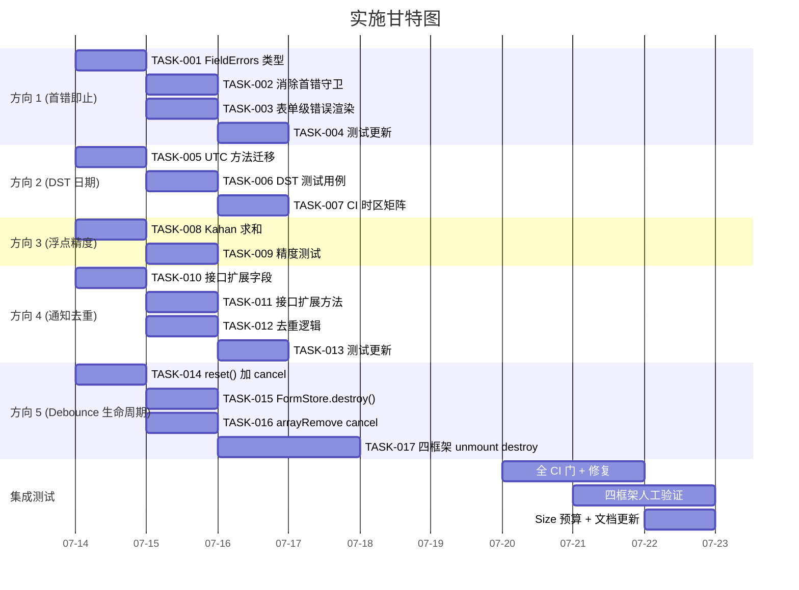

好，分析文档已完整确认。作为 Tech Lead，以下是我的完整分析报告。

---

# Tech Lead 分析报告：5 条代码级边界面优化方向

> **文档来源**：`docs/requirements/analysis-5-edge-directions.md`  
> **分析日期**：2026-07-12  
> **角色**：Tech Lead  
> **范围**：方向 1–5 的落地执行评估

---

## 1. 任务分解——17 个可执行任务

| 任务 ID      | 任务标题                                                              | 所属方向 | 涉及文件                                                                                                                            | 前置依赖           | 工时 | 验收标准                                                                                                                                     |
| ------------ | --------------------------------------------------------------------- | -------- | ----------------------------------------------------------------------------------------------------------------------------------- | ------------------ | ---- | -------------------------------------------------------------------------------------------------------------------------------------------- |
| **TASK-001** | `FieldErrors<V>` 值类型改为 `string[]`                                | 方向 1   | `packages/core/src/form.ts`, `standard-schema.ts`, 全库消费方（`grep -r "FieldErrors" src/`）                                       | 无                 | 3h   | 类型变更后 `pnpm typecheck` 全绿；`FieldErrors` 在各适配器中的消费同步更新                                                                   |
| **TASK-002** | 消除 `!(key in errors)` 守卫，聚合同字段多条错误                      | 方向 1   | `packages/core/src/standard-schema.ts`                                                                                              | TASK-001           | 2h   | 同一字段的 3 条 Zod 错误全部出现在 `errors[key]` 数组中                                                                                      |
| **TASK-003** | 表单级（无路径）错误渲染支持                                          | 方向 1   | `packages/core/src/standard-schema.ts` + 四个适配器的 `FormErrors`/`FormSummary` 组件                                               | TASK-001           | 4h   | `refine()` 错误出现在 `errors._form` 且四个框架均能渲染                                                                                      |
| **TASK-004** | 更新方向 1 已有测试 + 新增表单级错误测试                              | 方向 1   | `packages/core/src/standard-schema.test.ts` + 四框架表单测试                                                                        | TASK-002, TASK-003 | 2h   | 删除 `keeps the first issue per field` 断言；新增多错误聚合断言 + 表单级错误断言                                                             |
| **TASK-005** | `date.ts` 全部函数迁移到 UTC 方法                                     | 方向 2   | `packages/core/src/date.ts`                                                                                                         | 无                 | 3h   | 所有 `getHours`/`setHours`/`getDate`/`setDate`/`getMonth`/`setMonth` → `getUTC*`/`setUTC*`；`formatLocalISO` 保持本地（已确认安全）          |
| **TASK-006** | 添加 DST 边界测试用例                                                 | 方向 2   | `packages/core/src/date.test.ts`                                                                                                    | TASK-005           | 2h   | 测试覆盖：春季调快日（2024-03-10 EDT）、秋季回退日（2024-11-03 EDT）、非 DST 区域对照、跨 3 月 `addMonths`                                   |
| **TASK-007** | CI 添加 DST 时区矩阵测试                                              | 方向 2   | `.github/workflows/ci.yml` + `vitest.config.ts`（`TZ` 环境变量）                                                                    | TASK-006           | 1h   | CI 在 `America/New_York`、`Europe/London`、`Asia/Shanghai` 三个时区各跑一次 date 测试                                                        |
| **TASK-008** | 实现 Kahan-Babushka 补偿求和                                          | 方向 3   | `packages/core/src/data-view/aggregate.ts`                                                                                          | 无                 | 1h   | `sum` 和 `avg` 使用 Kahan 算法；grep 确认 `reduce((a,b)=>a+b,0)` 被替换                                                                      |
| **TASK-009** | 添加 aggregate 精度压力测试                                           | 方向 3   | `packages/core/src/data-view.test.ts`                                                                                               | TASK-008           | 2h   | 测试覆盖：10 万条 `16777216`（验证大数精度）、1 万条 `0.1`（验证小数精度）、1 万条随机两位小数值与 Kahan 对照                                |
| **TASK-010** | 扩展 `DesktopNotification` 接口：`group`/`count`/`timestamp`          | 方向 4   | `packages/core/src/notifications.ts`                                                                                                | 无                 | 1.5h | 新增字段非破坏性（可选）；`DesktopNotification` 现有消费者不需要修改                                                                         |
| **TASK-011** | 扩展 `NotificationCenter` 接口：`update`/`dismissGroup`/`dismissApp`  | 方向 4   | `packages/core/src/notifications.ts`                                                                                                | TASK-010           | 2h   | 三个新方法完整实现；`post()` 返回 id 可被 `update()` 消费                                                                                    |
| **TASK-012** | 实现 `post()` 可选去重逻辑                                            | 方向 4   | `packages/core/src/notifications.ts`                                                                                                | TASK-010           | 2h   | 当 `title+body+appId` 相同时，`post()` 更新已有通知而非追加新条目（通过可选参数 `dedupKey` 控制）                                            |
| **TASK-013** | 更新方向 4 测试                                                       | 方向 4   | `packages/core/src/notifications.test.ts`                                                                                           | TASK-011, TASK-012 | 2h   | 新增测试：`update()` 修改通知内容、`dismissGroup()` 批量关闭、`dismissApp()` 按应用关闭、去重逻辑验证                                        |
| **TASK-014** | 在 `reset()` 中遍历 `fieldDebouncers`/`fieldFlushers` 调用 `cancel()` | 方向 5   | `packages/core/src/form.ts`                                                                                                         | 无                 | 1.5h | `reset()` 后无 pending setTimeout；`jest.useFakeTimers()` 验证残留                                                                           |
| **TASK-015** | 添加 `FormStore.destroy()` 方法                                       | 方向 5   | `packages/core/src/form.ts` + 接口定义处                                                                                            | TASK-014           | 1.5h | `destroy()` 清理所有 debounce + 清空 `valueBuffer` + `fieldDebouncers`/`fieldFlushers` Map；调用后再调用 `post()` 等方法应抛出定义良好的错误 |
| **TASK-016** | 字段级 `arrayRemove` 操作前 cancel 该字段 pending debounce            | 方向 5   | `packages/core/src/form.ts`（`removeItem` 方法）                                                                                    | TASK-014           | 1h   | 删除数组项时，该索引对应字段的 pending debounce 被 cancel                                                                                    |
| **TASK-017** | 四框架适配器在 unmount 时调用 `destroy()`                             | 方向 5   | `packages/react/src/form/*.tsx`, `packages/vue/src/form/*.ts`, `packages/solid/src/form/*.tsx`, `packages/svelte/src/form/*.svelte` | TASK-015           | 3h   | 各框架的 `IrisForm`/`useForm` 在生命周期结束/cleanup 中调用 `destroy()`；`onUnmounted`/`cleanup`/`onDestroy` 等框架原生机制                  |

---

## 2. 执行顺序与依赖图

```mermaid
graph TB
    %% 方向 1
    subgraph D1 [方向 1：首错即止]
        T001[TASK-001<br/>FieldErrors 类型 string[]] --> T002[TASK-002<br/>消除首错守卫]
        T001 --> T003[TASK-003<br/>表单级错误渲染]
        T002 --> T004[TASK-004<br/>测试更新]
        T003 --> T004
    end

    %% 方向 2
    subgraph D2 [方向 2：DST 日期偏移]
        T005[TASK-005<br/>UTC 方法迁移]
        T005 --> T006[TASK-006<br/>DST 测试用例]
        T006 --> T007[TASK-007<br/>CI 时区矩阵]
    end

    %% 方向 3
    subgraph D3 [方向 3：浮点精度]
        T008[TASK-008<br/>Kahan 求和]
        T008 --> T009[TASK-009<br/>精度压力测试]
    end

    %% 方向 4
    subgraph D4 [方向 4：通知去重]
        T010[TASK-010<br/>接口扩展字段]
        T010 --> T011[TASK-011<br/>接口扩展方法]
        T010 --> T012[TASK-012<br/>去重逻辑]
        T011 --> T013[TASK-013<br/>测试更新]
        T012 --> T013
    end

    %% 方向 5
    subgraph D5 [方向 5：Debounce 生命周期]
        T014[TASK-014<br/>reset() 加 cancel]
        T014 --> T015[TASK-015<br/>FormStore.destroy()]
        T014 --> T016[TASK-016<br/>arrayRemove cancel]
        T015 --> T017[TASK-017<br/>四框架 unmount 调用 destroy]
    end

    %% 跨方向弱依赖
    T001 -.->|注意：类型变更波及<br/>适配器 Barrier| T017
```

### 可并行执行的任务组

| 并行组             | 任务                                      | 估计总工时 |
| ------------------ | ----------------------------------------- | ---------- |
| **组 A**（方向 1） | TASK-001 → TASK-002 / TASK-003 → TASK-004 | 11h        |
| **组 B**（方向 2） | TASK-005 → TASK-006 → TASK-007            | 6h         |
| **组 C**（方向 3） | TASK-008 → TASK-009                       | 3h         |
| **组 D**（方向 4） | TASK-010 → TASK-011 / TASK-012 → TASK-013 | 7.5h       |
| **组 E**（方向 5） | TASK-014 → TASK-015 / TASK-016 → TASK-017 | 7h         |

**说明**：A/B/C/D/E 五组之间**互不阻塞**，可并行推进。  
**跨组依赖**：方向 5 的四框架适配器修改（TASK-017）需要方向 1 的 `FieldErrors` 类型变更（TASK-001）先合并——因为适配器表单组件消费 `FieldErrors` 类型。这是一个 **soft dependency**（TASK-017 可先写代码，等 TASK-001 合并后最后调整类型）。

---

## 3. 技术风险分析

### 3.1 高风险项目

| 风险                               | 涉及方向 | 等级      | 详情                                                                                                                                                      | 缓解策略                                                                                                 |
| ---------------------------------- | -------- | --------- | --------------------------------------------------------------------------------------------------------------------------------------------------------- | -------------------------------------------------------------------------------------------------------- | ---------------- |
| **`FieldErrors` 类型变更的波及面** | 方向 1   | 🔴 **高** | `string` → `string[]` 影响全库 30+ 文件：四框架适配器的表单组件、`useField` hook、验证错误渲染、插件。类型不兼容会导致 CI 阻碍。                          | 分两步：(1) 先改 core 类型 + 发布 `@iris-ui/core` 预发布版本；(2) 逐个适配器升级。或者走联合类型 `string | string[]` 过渡。 |
| **DST 迁移的隐蔽回归**             | 方向 2   | 🔴 **高** | UTC 方法改变了 `date.ts` 全部函数行为。当前非 DST 日期的测试可能通过，但边缘场景（跨年、闰日、时区偏置为 30 分钟的地区如印度）可能出错。                  | DST 测试覆盖四个关键场景 + CI 三时区矩阵 + Code Review 逐行核对每个 UTC 替代是否语义等价。               |
| **四框架 unmount 行为差异**        | 方向 5   | 🟡 **中** | React `useEffect` cleanup、Vue `onUnmounted`、Solid `onCleanup`、Svelte `onDestroy` 执行时机和行为有微妙差异。React StrictMode 会 double-invoke cleanup。 | 每个适配器写框架独有的 unmount 测试；StrictMode 下验证 destroy 幂等性。                                  |

### 3.2 中等风险项目

| 风险                           | 涉及方向 | 等级      | 详情                                                                                                             | 缓解策略                                                                                                                        |
| ------------------------------ | -------- | --------- | ---------------------------------------------------------------------------------------------------------------- | ------------------------------------------------------------------------------------------------------------------------------- |
| **通知接口扩展的向后兼容**     | 方向 4   | 🟡 **中** | 新增可选字段和方法的接口扩展。已有代码调用 `post()` 时不传新参数应不影响。但桌面 OS 壳和插件可能依赖接口 Shape。 | 全部新增字段 Optional；全部新增方法有默认实现（空操作或 fallback）；不可直接改 `DesktopNotification` 为 `interface`（已定义）。 |
| **Kahan 求和性能影响**         | 方向 3   | 🟢 **低** | Kahan 比朴素 `reduce` 多 ~5 次运算/元素。100 万条数据差异 < 5ms。                                                | 可忽略。如有顾虑，对非数值（`null`/`undefined`/`NaN`）过滤预处理避免分支预测惩罚。                                              |
| **`FieldErrors` 桥接到各框架** | 方向 1   | 🟡 **中** | 四个适配器的表单错误渲染组件（`IrisFormItem` 的 `error` prop）当前消费 `string`，需要升级消费 `string[]`。       | 先 grep 全库找到所有消费点，统一处理。适配器层做 `error` → `errors[0]` 回退保持显示兼容。                                       |

### 3.3 技术难点明细

**难点 1：方向 5 的 `destroy()` 幂等性设计**

- `destroy()` 被调用后，`createFormStore` 返回的对象需要优雅失效——后续 `setFieldValue`、`submit`、`validate` 等调用不应抛出 crash，而应 no-op 或返回 rejected `Promise`。
- **方案**：内部设 `_destroyed` 标记，所有公共方法入口检查后跳过。

**难点 2：方向 1 的表单级错误存储键**

- 无路径的 form-level refine 错误存储在 `errors` 对象的什么键下？
- **方案**：使用保留键 `_form`（与 React Hook Form 惯例一致），四个框架适配器的 `IrisForm`/`FormErrors` 组件读取此键渲染到表单顶部。

**难点 3：方向 2 的 `buildMonthMatrix` 跨月逻辑**

- `addDays(first, -offset)` 在 DST 边界日调用时，修改 UTC 方法可能改变跨月填充的视觉效果。
- **方案**：定位为 "日期天数的概念"——使用时间戳截断到日级别：`new Date(Math.floor(d.getTime() / 86400000) * 86400000)` 代替 `setHours(0,0,0,0)`。

---

## 4. 资源评估

### 4.1 人员需求

| 角色                 | 技能要求                                                | 数量                       | 负责方向                                                                         |
| -------------------- | ------------------------------------------------------- | -------------------------- | -------------------------------------------------------------------------------- |
| **Core 工程师**      | 精通 TypeScript、form/validator 生态、日期时间处理      | 1–2 人                     | 方向 1（core 类型）、方向 2（date.ts）、方向 3（aggregate）、方向 5（FormStore） |
| **框架适配器工程师** | 精通 React/Vue/Solid/Svelte 之一，熟悉跨框架 UI library | 1 人（可串行处理四个框架） | 方向 1（四框架消费 `FieldErrors`）、方向 5（四框架 unmount hook）                |
| **测试工程师**       | 熟悉 Vitest/jsdom、时间 mock 技巧、CI pipeline          | 1 人（可与其他角色重叠）   | 方向 2（DST 测试套件）、方向 3（精度测试）、CI 时区矩阵配置                      |

**最小团队**：2 人（1 Core + 1 适配器/测试）可覆盖全部 5 个方向。  
**最优团队**：3 人并行推进 A/B/C/D/E 组。

### 4.2 关键里程碑

| 里程碑                       | 预计日期 | 交付物                                                                                    |
| ---------------------------- | -------- | ----------------------------------------------------------------------------------------- |
| **M1：类型层稳定**           | Day 3    | TASK-001 合并，`FieldErrors` 新类型在 core 中生效，`pnpm typecheck` 全绿                  |
| **M2：三个 P1 方向代码就绪** | Day 5    | TASK-002~007 + TASK-014~016 全部合并**至少通过单框架验证**                                |
| **M3：四框架对齐**           | Day 7    | TASK-017 全部四个框架适配器合并；TASK-003 的四框架错误渲染就绪                            |
| **M4：P2 方向就绪**          | Day 8    | TASK-008~013（方向 3+4）合并                                                              |
| **M5：全面测试门**           | Day 10   | 全部 5 方向测试覆盖通过、CI 时区矩阵稳定、`pnpm turbo run test typecheck lint build` 全绿 |

### 4.3 阻塞点与解决策略

| 阻塞点                                            | 涉及   | 解决策略                                                                                                              | Plan B                                                                                                |
| ------------------------------------------------- | ------ | --------------------------------------------------------------------------------------------------------------------- | ----------------------------------------------------------------------------------------------------- |
| **`FieldErrors` 类型变更的第三方插件影响**        | 方向 1 | 评估 `@iris-ui/plugin-*` 中是否有内部 `FieldErrors` 消费；有则一并升级。                                              | 如插件过多，先发 `@iris-ui/core` minor 版本，插件逐版本跟进。                                         |
| **方向 2 UTC 迁移破坏 `formatLocalISO`**          | 方向 2 | `formatLocalISO` 已确认使用本地 getter，仅迁移 `startOfDay`/`addDays`/`addMonths`/`buildMonthMatrix`/`isOutOfRange`。 | 如出现回归，逐函数回滚 + 单独加测试再合并。                                                           |
| **Svelte 5 rune 的 `$state()` 与 `destroy` 交互** | 方向 5 | Svelte 适配器中 `destroy()` 可能触发 `$state` 响应式更新已销毁组件。                                                  | `destroy()` 内部先 `_destroyed = true`，然后清理——响应式更新在已标记为 destroyed 的组件中变为 no-op。 |

---

## 5. 质量保证

### 5.1 单元测试覆盖要求

| 方向       | 最低覆盖率目标                             | 关键测试场景                                                                                                            | 测试策略                                                                          |
| ---------- | ------------------------------------------ | ----------------------------------------------------------------------------------------------------------------------- | --------------------------------------------------------------------------------- |
| **方向 1** | 100% 分支覆盖 `standard-schema.ts`         | 单字段多条错误聚合、混合字段路径/无路径错误、表单级 refine 错误                                                         | 删除原 `keeps the first issue per field` 测试，替换为两个新测试                   |
| **方向 2** | 手动构造 4 个 DST 场景 + CI 3 时区全部通过 | 春季调快日 `startOfDay`、秋季回退日 `startOfDay`、跨 3 月 `addMonths`、DST 边界 `isOutOfRange`、跨月 `buildMonthMatrix` | 使用 `new Date(2024, 2, 10, 2, 0)`（美东 DST）静态日期 + `getTimezoneOffset` 断言 |
| **方向 3** | 3 个新的精度专项测试                       | 10 万条大数累加误差 < 1e-6、0.1 累加 1 万次 vs `toFixed(2)` 对照、随机两位小数 vs 数据库精确和                          | 使用已知精度的对照值（如 Python `Decimal` 计算的理论值）断言                      |
| **方向 4** | 4 个新测试函数                             | `update()` 通知内容修改确认、`dismissGroup()` 批量关闭确认、`dismissApp()` 按应用关闭确认、去重 `post()` 不增加条目数   | 每个测试独立 `createNotificationCenter()` 实例                                    |
| **方向 5** | 新增 ~5 个测试                             | `reset()` 后 debounce 不触发、`destroy()` 后调用 no-op、`arrayRemove` cancel pending、四框架 unmount 后无残留写入       | `jest.useFakeTimers()` 配合 `vi.advanceTimersByTime()`                            |

### 5.2 集成测试策略

| 测试级别           | 覆盖范围                                       | 工具                                                      | 注意事项                                                       |
| ------------------ | ---------------------------------------------- | --------------------------------------------------------- | -------------------------------------------------------------- |
| **Core 单元测试**  | 方向 1–5 所有 core 逻辑                        | Vitest                                                    | 隔离测试，不依赖框架                                           |
| **适配器集成测试** | 方向 1（表单错误渲染）+ 方向 5（unmount 行为） | @testing-library/react/vue/solid + svelte testing library | 每个适配器各一套，验证框架特定行为                             |
| **E2E 验证**       | 方向 2（DatePicker DST 场景）                  | Playwright/Cypress                                        | 可选——设置浏览器时区为 `America/New_York`，验证 DST 日日期选择 |
| **CI 矩阵**        | 方向 2                                         | GitHub Actions                                            | `TZ` 环境变量矩阵（UTC / America/New_York / Asia/Shanghai）    |

### 5.3 代码审查要点

| 审查点           | 重点关注方向 | 具体检查内容                                                                                               |
| ---------------- | ------------ | ---------------------------------------------------------------------------------------------------------- |
| **类型安全**     | 方向 1       | `FieldErrors<V>` 变更后全库 `pnpm typecheck`；`errors[key]` 消费处是否改为数组迭代                         |
| **UTC 语义等价** | 方向 2       | 每个 UTC 替换是否 1:1 语义等价；`getUTCMonth()` 的 0-index 与 `getMonth()` 一致，无需额外调整              |
| **幂等调用**     | 方向 5       | `reset()` 被连续调用时 `cancel()` 不会抛出；`destroy()` 后再次调用不崩溃                                   |
| **向后兼容**     | 方向 4       | 新增字段为 Optional；`post()` 不要求 `dedupKey`；`dismissGroup()`/`dismissApp()` 对不存在 group/app 不抛出 |

### 5.4 性能测试需求

| 方向   | 测试                                     | 预期基准                         | 策略                                            |
| ------ | ---------------------------------------- | -------------------------------- | ----------------------------------------------- |
| 方向 3 | 100 万条随机数的 `sum`/`avg` 执行时间    | Kahan < 朴素 `reduce` 的 2x 时间 | 性能要求不严格，仅做告警基准（>100ms 告警）     |
| 方向 5 | 表单 100 个字段快速输入后的 unmount 时间 | cleanup < 10ms                   | 确保 debounce cancel + destroy 的累积开销不过大 |

---

## 6. 实施计划

### 6.1 阶段概览

```
Day 1     Day 3     Day 5     Day 7     Day 10
│          │          │          │          │
├──────────┤          │          │          │
│  Phase 1 │          │          │          │
│  基础设施 │          │          │          │
└──────────┴──────────┤          │          │
         Phase 1.5    │          │          │
         (Day 1-3)    │          │          │
        方向 3 速胜  │          │          │
        方向 4 启动  │          │          │
└─────────────────────┴──────────┤          │
                     Phase 2    │          │
                     核心实现    │          │
                     D1+D2+D5   │          │
                     (Day 3-7)  │          │
└────────────────────────────────┴──────────┤
                                      Phase 3
                                      集成测试
                                      四框架对齐
                                      (Day 7-10)
```

### 6.2 详细时间表

#### **阶段 1：基础建设 + 速胜（Day 1–3）**

| 时间段       | 负责人       | 任务                                                                        |
| ------------ | ------------ | --------------------------------------------------------------------------- |
| **Day 1 AM** | Core 工程师  | TASK-008（Kahan 求和）——方向 3 是修复成本最低、收益直接的速胜。1h。         |
| **Day 1 AM** | Core 工程师  | TASK-009（精度测试）——配合 TASK-008 一起提交。2h。                          |
| **Day 1 PM** | Core 工程师  | TASK-010（通知接口字段扩展）——1.5h。                                        |
| **Day 1 PM** | 适配器工程师 | TASK-014（reset() cancel debounce）——1.5h。                                 |
| **Day 1–2**  | 适配器工程师 | TASK-015（FormStore.destroy()）——1.5h。TASK-016（arrayRemove cancel）——1h。 |
| **Day 2 PM** | 适配器工程师 | TASK-005（date.ts UTC 迁移）——3h。                                          |
| **Day 3**    | 测试工程师   | TASK-006（DST 测试用例）+ TASK-007（CI 时区矩阵）——3h。                     |
| **Day 3**    | Core 工程师  | TASK-011（通知中心方法扩展）——2h。                                          |

**阶段 1 交付物**：

- 方向 3 完全就绪（已测试、已合并）——**速胜，增强团队信心**
- 方向 4 接口层已扩展（可以逐步在后续 PR 中实现逻辑）
- 方向 5 的 core 层就绪（reset + destroy + arrayRemove cancel）
- 方向 2 的 core 层 UTC 迁移 + 测试覆盖

#### **阶段 2：核心功能实现（Day 3–7）**

| 时间段      | 负责人       | 任务                                                                                |
| ----------- | ------------ | ----------------------------------------------------------------------------------- |
| **Day 3–4** | Core 工程师  | TASK-001（FieldErrors 类型变更）——3h。这一步是方向 1 的阻塞点，优先完成。           |
| **Day 4**   | Core 工程师  | TASK-002（消除首错守卫）+ TASK-003（表单级错误）——6h。                              |
| **Day 4–5** | 适配器工程师 | TASK-004（更新方向 1 测试）——2h。                                                   |
| **Day 4–5** | 适配器工程师 | TASK-012（通知去重逻辑）——2h。                                                      |
| **Day 5–6** | 适配器工程师 | TASK-013（通知测试更新）——2h。                                                      |
| **Day 5–7** | 适配器工程师 | TASK-017（四框架 unmount destroy 调用）——3h，但需要在 TASK-001 合并后最后确认类型。 |
| **Day 6–7** | Core 工程师  | 方向 1 全链路验证 + 四框架表单错误渲染对齐验证。                                    |

**阶段 2 交付物**：

- 方向 1 完整（类型变更 + 多错误聚合 + 表单级错误 + 测试覆盖 + 四框架渲染）
- 方向 4 完整（去重 + 分组 + 更新 + 测试覆盖）
- 方向 5 完整（四框架 unmount 清理 + 测试覆盖）

#### **阶段 3：集成测试 + 四框架对齐（Day 7–10）**

| 时间段       | 负责人       | 任务                                                                              |
| ------------ | ------------ | --------------------------------------------------------------------------------- |
| **Day 7–8**  | 全团队       | 全库 `pnpm turbo run test typecheck lint build`——修复所有 CI 失败。               |
| **Day 8**    | 测试工程师   | CI 时区矩阵稳定运行验证；确认 `package.json` 中 jest/vitest 配置的 `TZ` 变量。    |
| **Day 8–9**  | 适配器工程师 | 四框架人工验证：方向 1 表单错误渲染、方向 5 unmount 后无残余。                    |
| **Day 9**    | Core 工程师  | `pnpm size` 预算验证：确认方向 1 类型变更和方向 3 Kahan 不增加 bundle size 超出。 |
| **Day 9–10** | 全团队       | Code Review 收尾、文档更新、Changelog 写入 `@iris-ui/core`。                      |

**阶段 3 交付物**：

- `pnpm turbo run test typecheck lint build` 全绿
- 四框架各有一个验证通过的 demo 场景
- CI 时区矩阵稳定运行

#### **阶段 4：发布准备（Day 10 后——可选，按维护者授权）**

- 生成 changeset
- 发布 `@iris-ui/core` minor 版本（`0.x.y` 或按项目版本策略）
- 发布适配器同步 minor 版本

### 6.3 甘特图（Mermaid）



---

## 7. 关键决策记录（ADR 提议）

以下是我建议作为 ADR 记录的技术决策：

| ADR         | 决策                    | 选项                                                     | 建议理由                                                                                                                                        |
| ----------- | ----------------------- | -------------------------------------------------------- | ----------------------------------------------------------------------------------------------------------------------------------------------- |
| **ADR-001** | `FieldErrors<V>` 值类型 | `string \| string[]`（联合类型） vs `string[]`（纯数组） | 建议**联合类型**——向后兼容，旧代码 `string` 消费方不报错。代价是适配器需要处理两种类型的分支。                                                  |
| **ADR-002** | 表单级错误存储键        | `_form` 保留键                                           | 对齐 React Hook Form 生态，开发者直觉易理解。                                                                                                   |
| **ADR-003** | 日期数学基准            | 基于 UTC getter/setter vs 时间戳截断                     | 建议**UTC getter/setter**——语义清晰，与 `@internationalized/date` 方向一致。`startOfDay` 特例用时间戳截断避免 `setHours(0,0,0,0)` 的 DST 偏置。 |
| **ADR-004** | `destroy()` 后行为      | 静默 no-op vs 抛出错误                                   | 建议 **no-op + console.warn**（开发环境）——生产环境不崩溃，开发环境有迹可查。                                                                   |

---

## 8. 工程师执行速查

```
# 开始工作前，从 main 分支 checkout 新分支
git checkout -b feat/edge-directions-<name>

# 每个方向作为独立 PR，按以下顺序创建
PR-1: 方向 3 (Kahan)          → 最小变更，最快合并，建立节奏
PR-2: 方向 4 (通知接口)        → 接口扩展，无逻辑变更，安全合并
PR-3: 方向 5 (core 层)         → reset + destroy + arrayRemove cancel
PR-4: 方向 2 (UTC 日期)        → 需仔细 code review
PR-5: 方向 1 (首错即止)        → 需要 FieldErrors 类型变更 TASK-001 先行
PR-6: 方向 4 (去重逻辑实现)     → 独立于 PR-2
PR-7: 方向 5 (四框架适配器)     → 最后一个 PR，依赖 PR-3

# 每次合并后运行
pnpm gen:manifest    # 如果有组件清单级变更
```

---

## 9. 总结

| 维度                | 结论                                                                                                                           |
| ------------------- | ------------------------------------------------------------------------------------------------------------------------------ |
| **总工作量**        | 17 个任务，总计 ~34 人·时，3–4 人团队约 10 天                                                                                  |
| **最优路径**        | 方向 3（速胜）→ 方向 4（接口扩展）→ 方向 5（core 层）→ 方向 2 → 方向 1（类型变更最难）→ 方向 5（适配器层）→ 方向 4（去重实现） |
| **最大风险**        | 方向 1 的 `FieldErrors` 类型变更是唯一可能触及全库类型检查的变更                                                               |
| **最大收益/成本比** | 方向 3（Kahan 求和）：~3 人·时修复，消除所有大数据集精度问题                                                                   |
| **最容易忽略**      | 方向 2 的 CI 时区矩阵——没有它，DST 测试在 UTC CI 永远通过、永远在生产复现                                                      |
| **四框架开销**      | 方向 1 和方向 5 涉及四个适配器层，占总工时的 ~30%（~10 人·时）——这是 Iris UI 架构的正常成本                                    |
