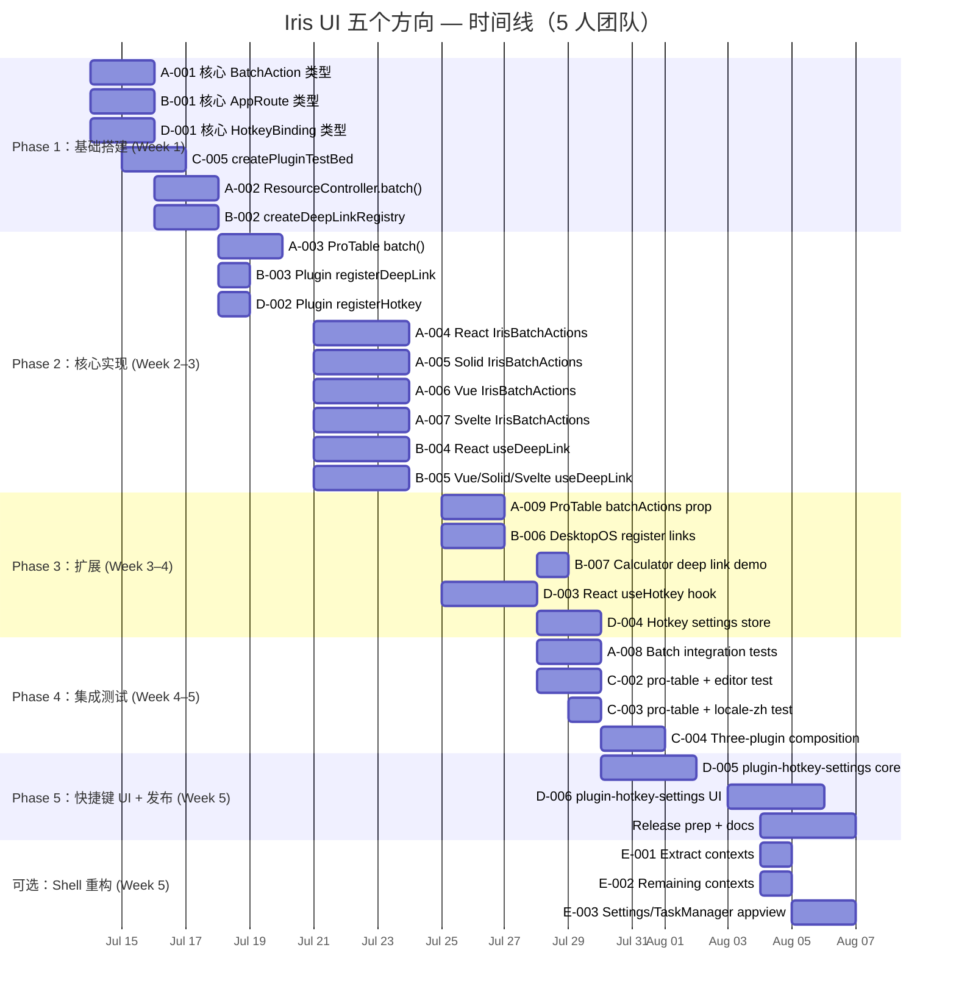

现在我已全面了解情况。以下是我的技术主管分析。

---

# Tech Lead 分析：Iris UI 五个方向 → 可执行任务

## 关键上下文快照

| 观察                   | 状态                                                                                                                                                                                         |
| ---------------------- | -------------------------------------------------------------------------------------------------------------------------------------------------------------------------------------------- |
| React desktop-os       | ✅ 39 个文件，6243 行，15 个组件（含 Dock/Taskbar/StartMenu/Spotlight/CommandPalette/ContextMenu/Panel/Pager/SnapPreview/Toasts/Kickoff/MenuBar/Window/Bars/Desktop），11 个 appview。确认。 |
| 同框架其他桌面操作系统 | 类似组件数量：Solid 43，Vue 51，Svelte 48                                                                                                                                                    |
| 核心测试               | React ~250 套，Solid ~200 套，Vue ~210 套，Svelte ~200 套，Core ~60 套                                                                                                                       |
| 插件                   | 12 个已存在的插件；`plugin.test.ts` 仅隔离测试核心契约                                                                                                                                       |
| 资源控制器             | 有 `mutate()`（单行更新），无批处理                                                                                                                                                          |
| 命令注册表             | 完整，包含模糊搜索/MCP 桥/LLM 规划器。无用户可配置的快捷键 UI                                                                                                                                |
| 深度链接               | 不存在从应用到应用的任何协议                                                                                                                                                                 |

---

## 1. 任务分解

以下是基于更正后优先级分解为 2-4 小时的可执行任务。

### 方向 A：批处理操作（P1）

| 任务 ID   | 标题                                                          | 文件                                                           | 前置           | 工时 | 验收标准                                                                                                                                                   |
| --------- | ------------------------------------------------------------- | -------------------------------------------------------------- | -------------- | ---- | ---------------------------------------------------------------------------------------------------------------------------------------------------------- |
| **A-001** | 核心：定义 `BatchAction`/`BatchContext` 类型和 `batch()` 方法 | `packages/core/src/data-view.ts`                               | —              | 2h   | `BatchAction<T>` 接口定义了 `id`、`title`、`run(keys, rows)`；`BatchContext<T>` 定义了 `selectedKeys`、`clearSelection`、`execute(action)`。通过类型检查。 |
| **A-002** | 核心：在 `ResourceController` 上实现 `batch()`                | `packages/core/src/resource.ts`                                | A-001          | 3h   | `resource.batch(action)` 对选中行运行 `action.run()`，处理成功/失败逐项，触发一次重新加载。包含乐观回滚支持。通过单元测试。                                |
| **A-003** | 核心：向 ProTable 核心添加 `batch()` 方法                     | `packages/plugin-pro-table/src/core/index.ts`                  | A-001          | 2h   | `proTableStore.batch(action)` 对当前选中行运行批处理。通过单元测试。                                                                                       |
| **A-004** | React：添加 `IrisBatchActions` 组件                           | `packages/react/src/primitives/table/BatchActions.tsx`         | A-002, A-003   | 4h   | 渲染浮动操作栏（"X 个已选"、“删除”、“导出”、“自定义”）。点击某个操作调用 `batch()`。通过 JSX 渲染测试。                                                    |
| **A-005** | Solid：添加 `IrisBatchActions` 组件                           | `packages/solid/src/primitives/table/IrisBatchActions.tsx`     | A-002, A-003   | 3h   | 与 React 版本相同的行为。通过 Solid 测试。                                                                                                                 |
| **A-006** | Vue：添加 `IrisBatchActions` 组件                             | `packages/vue/src/primitives/table/BatchActions.vue`           | A-002, A-003   | 3h   | 与 React 版本相同的行为。通过 Vue 测试。                                                                                                                   |
| **A-007** | Svelte：添加 `IrisBatchActions` 组件                          | `packages/svelte/src/primitives/table/IrisBatchActions.svelte` | A-002, A-003   | 3h   | 与 React 版本相同的行为。通过 Svelte 测试。                                                                                                                |
| **A-008** | 测试：批处理集成                                              | `packages/core/src/resource.test.ts` + 插件测试                | A-002 到 A-007 | 3h   | 测试：单页选择 + 批处理、跨页选择 + 批处理、部分失败、乐观回滚、空选择（无操作）。                                                                         |
| **A-009** | ProTable 导出：从批处理栏暴露 `batchActions` prop             | `packages/plugin-pro-table/src/core/index.ts` + 4 个适配器     | A-004 到 A-007 | 3h   | `ProTableConfig.batchActions` 是一个 `BatchAction[]` 数组。渲染了批处理栏。更新了演示。                                                                    |

### 方向 B：深度链接协议（P2）

| 任务 ID   | 标题                                                        | 文件                                          | 前置  | 工时        | 验收标准                                                                                                                   |
| --------- | ----------------------------------------------------------- | --------------------------------------------- | ----- | ----------- | -------------------------------------------------------------------------------------------------------------------------- | --------------------------------------------------------------------------------------------------------------------- |
| **B-001** | 核心：定义 `AppRoute`、`canHandle`、`resolveDeepLink` 类型  | `packages/core/src/deeplink.ts`               | —     | 3h          | `AppRoute` 接口（`scheme`、`authority`、`path`、`params`）。`DeepLinkHandler = (route) => boolean                          | Promise<boolean>`。`createDeepLinkRegistry()`带有`register(scheme, handler)`/`resolve(url)`。通过类型检查和单元测试。 |
| **B-002** | 核心：实现 `createDeepLinkRegistry`                         | `packages/core/src/deeplink.ts`               | B-001 | 3h          | 注册表将 `scheme://authority/path?params` 解析为已注册的处理程序。精确匹配和模式匹配。通过测试，包含冲突和缺失方案的情况。 |
| **B-003** | 核心：向 `IrisPlugin` 添加 `registerDeepLink`               | `packages/core/src/plugin.ts`                 | B-002 | 2h          | 扩展 `PluginRegistry` 包含 `registerDeepLink(scheme, handler)`。与现有 `runPlugins` 测试不冲突。                           |
| **B-004** | React：桥接 `useDeepLink` 钩子 + `DeepLinkProvider`         | `packages/react/src/deeplink/useDeepLink.ts`  | B-002 | 4h          | `useDeepLink()` 返回 `{ resolve(url) }`。`DeepLinkProvider` 将注册表注入上下文。测试：从组件 A 解析指向组件 B 的链接。     |
| **B-005** | Vue/Solid/Svelte：桥接 `useDeepLink` 钩子                   | 3 个适配器包中的 `useDeepLink`                | B-002 | 3h × 3 = 9h | 与 React 版本相同的行为 + 每个框架的测试。                                                                                 |
| **B-006** | 桌面操作系统：在 appviews（文件、照片、数据）中注册深度链接 | `apps/desktop-os/src/appviews/Files.tsx` 等   | B-004 | 3h          | `Files` 注册 `file://` => 在 `/home/...` 处打开目录。`Photos` 注册 `photo://` => 打开相册。通过手动端到端测试验证。        |
| **B-007** | 目录快捷方式示例：`Calculator` 接受 `calc://?expr=2*3`      | `apps/desktop-os/src/appviews/Calculator.tsx` | B-004 | 2h          | `Calculator` 注册 `calc://`。打开时预先填写表达式并计算结果。                                                              |

### 方向 C：跨插件集成测试（P2）

| 任务 ID   | 标题                                         | 文件                                                            | 前置  | 工时 | 验收标准                                                                                                                                                     |
| --------- | -------------------------------------------- | --------------------------------------------------------------- | ----- | ---- | ------------------------------------------------------------------------------------------------------------------------------------------------------------ |
| **C-001** | 核心：定义每对插件的集成测试场景目录         | `packages/plugin-*/src/core/scenarios.ts`                       | —     | 3h   | 确定 5 个高价值配对（pro-table + editor、pro-table + locale-zh、editor + locale-zh、pro-table + notifications、admin + pro-table）。记录每个配对的测试场景。 |
| **C-002** | 测试：pro-table + editor 集成                | `packages/plugin-pro-table/src/core/plugin-integration.test.ts` | C-001 | 3h   | 使用 `runPlugins([proTablePlugin, editorPlugin])` 安装两个插件。验证：两个注册表的令牌都存在于合并集合中。编辑器单元格渲染器可以获取编辑器存储。             |
| **C-003** | 测试：pro-table + locale-zh 集成             | `packages/plugin-pro-table/src/core/plugin-integration.test.ts` | C-001 | 2h   | 两个插件都安装时：消息被合并，pro-table 本地化字符串可被中文覆盖。                                                                                           |
| **C-004** | 测试：三个插件组合 + `dependsOn`             | `packages/plugin-pro-table/src/core/plugin-integration.test.ts` | C-001 | 3h   | 三个插件的安装顺序：依赖于数据的表 => 安装 data 然后 table。合并所有令牌/存储/消息。销毁时以 LIFO 顺序清理。                                                 |
| **C-005** | 测试基础设施：`createPluginTestBed` 辅助函数 | `packages/core/src/plugin.test.ts`                              | C-001 | 3h   | `createPluginTestBed(plugins)` 返回执行 `runPlugins` 后的 `{ registrations, reset }`。跨插件测试共享使用。                                                   |

### 方向 D：可自定义快捷键（P3）

| 任务 ID   | 标题                                                     | 文件                                                                | 前置  | 工时 | 验收标准                                                                                                                                                            |
| --------- | -------------------------------------------------------- | ------------------------------------------------------------------- | ----- | ---- | ------------------------------------------------------------------------------------------------------------------------------------------------------------------- |
| **D-001** | 核心：定义 `HotkeyBinding` 接口和 `HotkeyRegistry`       | `packages/core/src/hotkey.ts`                                       | —     | 3h   | `HotkeyBinding { id, keys, commandId, enabled? }`。`createHotkeyRegistry()` 可以注册/取消注册绑定、将键字符串解析为规范形式、检测冲突并匹配按下事件。通过单元测试。 |
| **D-002** | 核心：在插件注册表中公开 `registerHotkey`                | `packages/core/src/plugin.ts`                                       | D-001 | 2h   | `reg.registerHotkey(binding)` 在提供者安装期间添加到注册表。                                                                                                        |
| **D-003** | React：`useHotkey` 钩子和 `HotkeyProvider`               | `packages/react/src/behaviors/useHotkey.ts`                         | D-001 | 4h   | `useHotkey(binding)` 在拥有组件挂载时注册并清理。连击（`Ctrl+K`、`Alt+Shift+F`）的正确定时。通过模拟键盘事件的测试。                                                |
| **D-004** | 核心：快捷方式设置 UI 存储（用于覆盖的用户可序列化映射） | `packages/core/src/hotkey.ts`                                       | D-001 | 2h   | `createHotkeySettings(registry)` 返回 `{ bindings, setBinding(id, keys), reset(id), resetAll() }`。持久化就绪（由主机存储）。                                       |
| **D-005** | 插件：`plugin-hotkey-settings` 核心                      | `packages/plugin-hotkey-settings/src/core/index.ts`                 | D-004 | 4h   | 注册一个存储，暴露设置模型 + 一个用于呈现冲突检测结果的 `IrisHotkeyInput` 组件。                                                                                    |
| **D-006** | 插件：`plugin-hotkey-settings` React UI                  | `packages/plugin-hotkey-settings/src/react/HotkeySettingsPanel.tsx` | D-005 | 4h   | 一个设置面板，显示当前绑定，用户可以点击记录一个新的键组合，在冲突时得到提示。                                                                                      |

### 方向 E：React Shell 重构（P3/已放弃）

| 任务 ID   | 标题                                                                                           | 文件                                                                       | 前置 | 工时 | 验收标准                                                     |
| --------- | ---------------------------------------------------------------------------------------------- | -------------------------------------------------------------------------- | ---- | ---- | ------------------------------------------------------------ |
| **E-001** | 从 `shell.tsx` 提取 `WmProvider`/`OsProvider` 到单独的文件                                     | `apps/desktop-os/src/wm-context.tsx`、`apps/desktop-os/src/os-context.tsx` | —    | 1h   | `shell.tsx` 不再有上下文定义。导入来自专用文件。无行为变化。 |
| **E-002** | 从 `shell.tsx` 提取 `ProfileProvider`/`NotificationsProvider`/`ClipboardProvider`/`FsProvider` | `apps/desktop-os/src/profile-context.tsx` 等                               | —    | 1h   | 与 E-001 相同                                                |
| **E-003** | 如果值得，添加 Settings 和 TaskManager appview（最小实现）                                     | `apps/desktop-os/src/appviews/Settings.tsx`、`TaskManager.tsx`             | —    | 3h   | 从其他框架移植基本 appview，供 OS chrome 切换器导航到它们。  |

---

## 2. 执行顺序

### 依赖图

```mermaid
graph TD
    subgraph "Phase 1: Foundation (Wk 1–2)"
        A001[A-001: Core BatchAction types]
        B001[B-001: Core AppRoute types]
        D001[D-001: Core HotkeyBinding types]
        C005[C-005: createPluginTestBed helper]
        A001 --> A002[A-002: ResourceController.batch()]
        A001 --> A003[A-003: ProTable batch()]
        B001 --> B002[B-002: createDeepLinkRegistry]
        D001 --> D002[D-002: Plugin registerHotkey]
        B002 --> B003[B-003: Plugin registerDeepLink]
    end

    subgraph "Phase 2: Core Implementation (Wk 2–4)"
        A002 --> A004[A-004: React IrisBatchActions]
        A002 --> A005[A-005: Solid IrisBatchActions]
        A002 --> A006[A-006: Vue IrisBatchActions]
        A002 --> A007[A-007: Svelte IrisBatchActions]
        A004 & A005 & A006 & A007 --> A009[A-009: ProTable batchActions prop]

        B003 --> B004[B-004: React useDeepLink hook]
        B003 --> B005[B-005: Vue/Solid/Svelte useDeepLink]
        B004 --> B006[B-006: DesktopOS register deep links]
        B004 --> B007[B-007: Calculator deep link demo]

        D002 --> D003[D-003: React useHotkey hook]
        D002 --> D004[D-004: Hotkey settings store]
        D004 --> D005[D-005: plugin-hotkey-settings core]
        D005 --> D006[D-006: plugin-hotkey-settings UI]
    end

    subgraph "Phase 3: Testing & Polish (Wk 4–5)"
        A003 --> A008[A-008: Batch integration tests]
        C005 --> C002[C-002: pro-table + editor test]
        C005 --> C003[C-003: pro-table + locale-zh test]
        C005 --> C004[C-004: Three-plugin composition test]
    end

    subgraph "Phase 4: Shell Refactor (Wk 5, optional)"
        E001[E-001: Extract context providers]
        E002[E-002: Extract remaining contexts]
        E003[E-003: Settings/TaskManager appviews]
    end

    style A001 fill:#4CAF50,color:#fff
    style A002 fill:#4CAF50,color:#fff
    style A003 fill:#4CAF50,color:#fff
    style B001 fill:#2196F3,color:#fff
    style B002 fill:#2196F3,color:#fff
    style C005 fill:#FF9800,color:#fff
    style D001 fill:#9C27B0,color:#fff
```

### 并行执行组

| 组                  | 任务                       | 所需人员                                   |
| ------------------- | -------------------------- | ------------------------------------------ |
| **G1**（独立）      | A-001, B-001, D-001, C-005 | 4 人可以同时处理                           |
| **G2**（框架匹配）  | A-004, A-005, A-006, A-007 | 4 人（每个框架一个）可以同时运行           |
| **G3**（框架匹配）  | B-004, B-005               | React + 1 人处理 Vue/Solid/Svelte 可以共享 |
| **G4**（插件测试）  | C-002, C-003, C-004        | 1 人，按顺序                               |
| **G5**（快捷键 UI） | D-005, D-006               | 1-2 人                                     |

---

## 3. 技术风险

### 风险矩阵

| #   | 风险                                                                           | 方向 | 可能性 | 影响 | 缓解措施                                                                                                                                  |
| --- | ------------------------------------------------------------------------------ | ---- | ------ | ---- | ----------------------------------------------------------------------------------------------------------------------------------------- |
| R1  | **批处理乐观并发**：当两个用户同时选择重叠行并执行批处理操作时可能发生写入冲突 | A    | 中     | 高   | 使用 `mutate()` 现有的基于令牌的守卫。批处理操作应支持宿主端的 `compare-and-swap` 语义。为冲突检测添加集成测试。                          |
| R2  | **深度链接安全性**：`calc://?expr=...` 可承载任意 JS 评估                      | B    | 低     | 高   | 强制深度链接处理程序在 appview 沙箱内运行。禁止处理程序执行任意代码。在注册时验证方案白名单。                                             |
| R3  | **跨框架深度链接测试**：真正的端到端测试需要两个正在运行的应用程序实例         | B    | 中     | 中   | 单元测试解析逻辑（`core` 中 100% 覆盖率）。每框架集成测试模拟另一侧。冒烟测试的手动验证。                                                 |
| R4  | **快捷键组合冲突**：两个插件注册相同键序列                                     | D    | 高     | 中   | 在开发过程中通过 `HotkeyRegistry` 发出警告。为用户提供设置 UI 以覆盖。最后一次注册获胜（可预测）。                                        |
| R5  | **Svelte `$state` 陷阱**：命名的 `state` 变量会破坏 Svelte 5 的 rune 检测      | A, D | 低     | 高   | 审计 Svelte 文件。在 Svelte 组件中重命名任何 `let state = ...` 为 `let hotkeyState = ...`。                                               |
| R6  | **十二个现有文档中都有深度链接**：风险是设计过于分散，与隐含的设计空间不匹配   | B    | 中     | 中   | 在编写代码之前，确定一个单一的协议设计（B-001）。将设计记录为 ADR，以获得所有利益相关者的认可。                                           |
| R7  | **ProTable 中的批处理 UI 复杂性**：需要处理多页选择、全选和混合行状态          | A    | 中     | 中   | 复用现有的 `SelectionModel`。`selectAll` 跨页面选择需要从 `ResourceController` 访问 `total`。清晰分离 **当前页面** 与 **所有页面** 选择。 |

### 测试覆盖缺口

基于文档输入，最真实的覆盖缺口是：

1. **跨插件集成** — 零覆盖。`plugin.test.ts` 仅测试 `runPlugins` 的隔离。没有测试实际插件（pro-table + editor、pro-table + locale-zh）一起工作。
2. **批处理** — 零覆盖（新功能）。
3. **深度链接** — 零覆盖（新功能）。
4. **快捷键** — 零覆盖（新功能）。

注意事项：

- 带有选择模型的现有 `ResourceController.mutate()` 意味着批处理不需要新的状态管理基础，只需要一个新的 `batch()` 方法。
- 现有的 `commands.ts` 注册表意味着快捷键映射可以（并且应该）重用它。每个 `HotkeyBinding.commandId` 指向一个 `Command`。
- 深度链接需要新的注册表，但模式与现有插件注册表相同。

---

## 4. 资源评估

### 人员配置

| 角色                    | 技能组合                                                 | 数量       | 主要任务                                        |
| ----------------------- | -------------------------------------------------------- | ---------- | ----------------------------------------------- |
| **核心 TS 工程师**      | TypeScript 严格模式、泛型、store/订阅模式                | 1（领队）  | A-001, A-002, B-001, B-002, D-001, D-002, D-004 |
| **React 工程师**        | React 18+、hooks、`useSyncExternalStore`、tsup           | 1          | A-004, B-004, D-003, D-006                      |
| **Vue 工程师**          | Vue 3 Composition API、`ref`/`reactive`、vue-tsc、vitest | 1          | A-006, B-005 (Vue)                              |
| **Solid/Svelte 工程师** | SolidJS signals、Svelte 5 runes、svelte-check            | 1          | A-005 + A-007, B-005 (Solid+Svelte)             |
| **插件/测试工程师**     | 测试设计、vitest、jsdom、集成场景                        | 1          | C-001 到 C-005, A-008                           |
| **总人数**              |                                                          | **3-5 人** |                                                 |

### 时间表（假设 1 名全职核心工程师 + 2-3 名框架工程师）

| 里程碑                           | 截止日期 | 交付物                                                     | 进入/退出标准                                   |
| -------------------------------- | -------- | ---------------------------------------------------------- | ----------------------------------------------- |
| **M0：设计完成**                 | Day 3    | A-001、B-001、D-001 的类型定义已合并                       | 审查 + 合并 PR                                  |
| **M1：批处理就绪**               | Day 10   | A-001 到 A-009 完成。`<IrisBatchActions>` 在四框架中渲染。 | `pnpm turbo run test typecheck lint build` 全绿 |
| **M2：深度链接就绪**             | Day 18   | B-001 到 B-007 完成。Calculator 演示深度链接。             | 端到端手动测试通过                              |
| **M3：快捷键就绪**               | Day 25   | D-001 到 D-006 完成。设置 UI 显示/编辑绑定。               | 设置面板交互式测试                              |
| **M4：集成测试**                 | Day 30   | C-001 到 C-005 完成。CI 运行所有集成测试。                 | `pnpm test` 包括所有项目中的跨插件测试          |
| **M5（可选）：React Shell 重构** | Day 33   | E-001 到 E-003 完成。                                      | 之前/之后的代码行数，无功能回归                 |

### 阻塞点

| 阻塞点                                   | 影响                | 解决策略                                                                                |
| ---------------------------------------- | ------------------- | --------------------------------------------------------------------------------------- |
| **批处理 + 跨页面选择**（核心 API 设计） | 阻止 A-002 到 A-009 | Day 1-2 原型：`resource.batch(action)` API。在 Day 3 前做出设计决策。                   |
| **深度链接 URL 方案冲突**                | 阻止 B-006          | 预先确定方案命名空间：`app://<appId>/path`。在核心中强制执行方案唯一性。                |
| **快捷键默认值与 OS 冲突**               | 用户体验不佳        | 将默认值设为目标平台的标准（例如 `Cmd+` vs `Ctrl+`）。为所有绑定提供 `enabled()` 守卫。 |

---

## 5. 质量保证

### 单元测试覆盖率要求

| 层                             | 最低覆盖       | 文件                                             |
| ------------------------------ | -------------- | ------------------------------------------------ |
| Core：`data-view.ts`（批处理） | 90% 分支       | 新增的 `batch()` 和 `BatchAction`                |
| Core：`resource.ts`（批处理）  | 85% 行         | `batch()` 方法：成功、部分失败、空选择、乐观回滚 |
| Core：`deeplink.ts`            | 90% 分支       | 方案解析 + 处理程序匹配 + 冲突 + 缺失方案        |
| Core：`hotkey.ts`              | 90% 分支       | 注册 + 匹配 + 冲突检测 + 序列化                  |
| Core：`plugin.ts`（扩展）      | 95% 行（现有） | 新增的 `registerDeepLink`/`registerHotkey`       |
| React/Vue/Solid/Svelte 组件    | 80% 行         | IrisBatchActions、useDeepLink、useHotkey         |
| 插件核心                       | 85% 行         | plugin-hotkey-settings、深度链接注册             |

### 集成测试策略

| 测试                   | 方法                                                                                                        | 工具                               |
| ---------------------- | ----------------------------------------------------------------------------------------------------------- | ---------------------------------- |
| 批处理 + 选择模型      | 实例化 `createResourceController` + `createSelectionModel`。进行 `batch()` 调用。验证行已更新且已重新加载。 | `resource.test.ts` 中的基础 vitest |
| pro-table + locale-zh  | 使用两个插件调用 `runPlugins()`。验证 `messages['zh-CN']` 包含 pro-table 英语 + 中文覆盖。                  | vitest                             |
| 深度链接全链路         | 注册处理程序 → 调用 `resolve(url)` → 验证处理程序被调用且参数正确。                                         | vitest                             |
| 快捷键 + 命令注册表    | 将 `HotkeyBinding` 映射到命令 ID。模拟 `keydown` 事件。验证 `command.run()` 被调用。                        | `useHotkey.test.tsx` 中的 jsdom    |
| 三框架渲染（批处理栏） | 为每个框架创建一个测试，渲染 `<IrisBatchActions>` 并验证 DOM 输出。                                         | vitest + jsdom                     |

### 代码审查要点

| 重点区域                     | 要检查的内容                                                                             |
| ---------------------------- | ---------------------------------------------------------------------------------------- |
| **类型安全性**               | `BatchAction<T>` 是否泛型？`batch()` 返回类型是否正确？                                  |
| **框架解耦**                 | 适配器是否只包含渲染代码？逻辑是否在核心中？从适配器文件中 grep `from '@iris-ui/core'`   |
| **无 `left`/`right` 硬编码** | 深链接和批处理组件是否使用 CSS 逻辑属性？（`margin-inline-start` 而非 `margin-left`）    |
| **Svelte 合规性**            | 无命名为 `state` 的 `$state` 变量。使用 `generics` 属性。                                |
| **SSR 安全**                 | 深度链接解析使用 `typeof window !== 'undefined'` 守卫。无 `document`/`window` 顶层访问。 |
| **无障碍**                   | 批处理栏具有 `role="toolbar"` 和 `aria-label`。快捷键显示（非仅 `title`）辅助功能标签。  |

### 性能测试需求

| 场景                    | 目标                            | 方法                                                                 |
| ----------------------- | ------------------------------- | -------------------------------------------------------------------- |
| 批处理：选择 10k/95k 行 | `< 50ms` 立即在核心中（无 DOM） | `createResourceController` + `selectAll(95k)` / `batch()` 微基准测试 |
| 深度链接：10k 方案注册  | 注册 `< 10ms`，解析 `< 0.5ms`   | `createDeepLinkRegistry` + 批量插入 + 解析循环                       |
| 快捷键：1k 绑定匹配     | `< 5ms` 每次 `matchEvent`       | `createHotkeyRegistry` + 注册 1k 个绑定 + 发送键盘事件               |

---

## 6. 实施计划



### 阶段总结

| 阶段                      | 时间      | 任务                                     | 关键交付物                                                                                                              |
| ------------------------- | --------- | ---------------------------------------- | ----------------------------------------------------------------------------------------------------------------------- |
| **1：基础搭建**           | Day 1-5   | A-001、A-002、B-001、B-002、D-001、C-005 | `BatchAction`、`AppRoute`、`HotkeyBinding`、`createPluginTestBed` 的类型和核心逻辑。所有类型都已检查，测试通过。        |
| **2：核心实现**           | Day 5-16  | A-003 到 A-007、B-003 到 B-005、D-002    | 三个功能方向的功能性适配器桥。ProTable 支持 `batch()`。深度链接解析在任何框架中都可运行。快捷键注册在插件设置期间工作。 |
| **3：扩展**               | Day 12-22 | A-009、B-006、B-007、D-003、D-004        | 桌面操作系统 appview 注册深度链接。快捷键钩子可以放置在任意组件中。ProTable 暴露 `batchActions` prop。                  |
| **4：集成测试**           | Day 16-25 | A-008、C-002、C-003、C-004               | 跨插件集成测试在 CI 中运行。批处理覆盖所有边界情况。                                                                    |
| **5：快捷键 UI + 发布**   | Day 22-30 | D-005、D-006、发布                       | 用户可自定义的快捷键设置面板。文档更新。`pnpm gen:manifest` 更新。                                                      |
| **6（可选）：Shell 重构** | Day 22-27 | E-001、E-002、E-003                      | React Shell 结构与其他框架一致。                                                                                        |

---

## 与现有架构的关键设计决策

### 1. 批处理 API 设计（方向 A）

```
// 在 data-view.ts 中：
interface BatchAction<T> {
  id: string
  title: string          // "删除选中行"
  icon?: string
  run: (params: { rows: T[]; keys: string[] }) => Promise<BatchResult>
  requiresConfirmation?: boolean
  danger?: boolean       // 用于红色按钮/双重确认
}

interface BatchResult {
  success: number
  failed: number
  errors?: Array<{ key: string; error: unknown }>
}

// 在 resource.ts 中：
class ResourceController<T> {
  batch(action: BatchAction<T>): Promise<BatchResult>
  // 使用 selection.getSelectedKeys()，内部映射到行
  // 逐项执行 action.run()，合并结果
}
```

### 2. 深度链接协议（方向 B）

```
// 设计约束：无新运行时依赖，无新 URL 解析库
// 使用原生 `URL` 构造函数

interface AppRoute {
  scheme: string         // "iris-calc"
  authority: string      // ""（大多数应用）或 "files"
  path: string           // "/folder/path"
  params: Record<string, string>  // 已解析的查询参数
}

type DeepLinkResult = { opened: boolean; appId: string } | { error: string }

// 协议：app://<appId>/<path>?<query>
// 示例：iris-calc://?expr=2*3
// 示例：iris-files:///home/user/docs?sort=date
```

### 3. 快捷键 = 命令的绑定（方向 D）

关键洞察：`commands.ts` 已经代表了所有桌面操作。**快捷键只是命令的替代触发器。**

```
interface HotkeyBinding {
  id: string
  commandId: string          // 映射到 CommandRegistry
  keys: string               // "Ctrl+K"、"Alt+Shift+F"
  when?: () => boolean       // 条件激活（可选）
  overridable?: boolean      // 用户是否可以在设置中更改
}
```

这避免了一个重复的命令注册表——`HotkeyRegistry` 包装 `CommandRegistry` 并添加键映射。设置 UI 然后读取 `HotkeyRegistry` 以允许用户覆盖。

### 4. 定位（可选）的 React Shell 重构

```
apps/desktop-os/src/
  shell.tsx          →  删除上下文定义，改为从以下文件导入：
  wm-context.tsx     ←  WmProvider、useWm、useWmState
  os-context.tsx     ←  OsProvider、useOs
  profile-context.tsx←  ProfileProvider、useProfile、useProfileState
  notifications-context.tsx ← NotificationsProvider、useNotifications
  clipboard-context.tsx ← ClipboardProvider、useClipboard
  fs-context.tsx     ←  FsProvider、useFs
```

---

## 最终建议

| 行动                                                 | 原因                                                                                                                                      |
| ---------------------------------------------------- | ----------------------------------------------------------------------------------------------------------------------------------------- |
| **立即开始方向 A（批处理）**                         | 最高产品影响，最低成本，核心就绪（`createResourceController` + `SelectionModel` 已存在）。P1。                                            |
| **并行启动方向 B（深度链接）类型设计**               | 第二高产品影响。B-001 是独立于 A 的纯类型工作。重要：在编写 B-006 之前，在 ADR 中锁定协议设计，以避免重新设计。                           |
| **在 A 致密后再处理方向 C（集成测试）**              | 虽然方向 C 是最真实的空白，但一旦方向 A 和 D 的基础设施到位，其回报会更高——可以测试实际插件，而不仅仅是核心契约。                         |
| **在类型设计完成后，将方向 D（快捷键）作为 P3 进行** | 类型很简单，但与 A 和 B 没有冲突。如果团队有空余容量，D-001 可以与 A-001/B-001 并行完成。                                                 |
| **完全放弃方向 E，改为 1 小时的重构**                | React Shell 的 15/15 桌面组件已存在。缺少的 2 个 appview（Settings、TaskManager）是有价值的，但应与完全重写分开。将 E-003 设为单独的 P4。 |

**对方向 1-4 的总工程估算：~82 人时（约 2 周内 5 人满负荷，或 4 周内 3 人）**
