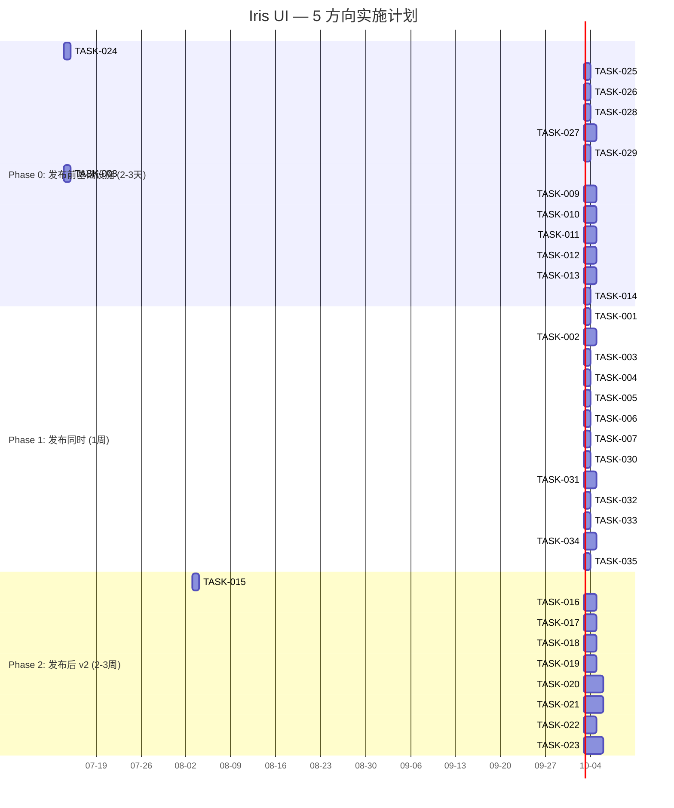

# Tech Lead 分析：5 个高杠杆扩展方向

## 1. 任务分解

以下将 5 个方向拆解为 33 个可执行任务。每个任务 2-4 小时可完成，附验收标准。

### 方向一：🔧 构建时 Token Tree-Shaking

| 任务 ID  | 标题                                                                  | 涉及文件                                                                       | 前置依赖           | 预估(h) | 验收标准                                                                                                 |
| -------- | --------------------------------------------------------------------- | ------------------------------------------------------------------------------ | ------------------ | ------- | -------------------------------------------------------------------------------------------------------- | ---------------------------- |
| TASK-001 | 创建 `token-optimizer` 包结构                                         | `packages/token-optimizer/package.json`, `tsconfig.json`, `index.ts`           | 无                 | 2       | `pnpm ls --filter @iris-ui/token-optimizer` 成功；ESM + CJS 双入口                                       |
| TASK-002 | 实现 `scanVarUsage` — 静态扫描所有 `var(--iris-*)`                    | `packages/token-optimizer/src/scan.ts`, `src/types.ts`                         | TASK-001           | 4       | 对 `packages/react/src/` 扫描返回 >=80 条 token 引用；支持 `*` glob 模式；输出 `Set<string>`             |
| TASK-003 | 处理动态 token 引用模式                                               | `packages/token-optimizer/src/scan.ts`（扩展）                                 | TASK-002           | 3       | `var(--iris-${x})` 被标记为 `dynamic`，归入保守白名单；输出携带 `{type: 'static'                         | 'dynamic', token: string}[]` |
| TASK-004 | 实现 `buildWhitelist` — 从 manifest + 插件声明 + 皮肤继承链构建白名单 | `packages/token-optimizer/src/whitelist.ts`                                    | TASK-002, TASK-003 | 4       | 输入 `manifest.json` + 3 个 plugin 声明 → 输出完整 token 白名单；皮肤 `extends: 'dark'` 的继承链正确展开 |
| TASK-005 | 实现 `generateSubset` — 生成仅含使用 token 的 light/dark 主题子集     | `packages/token-optimizer/src/subset.ts`                                       | TASK-004           | 3       | `generateSubset(lightTheme, ['--iris-primary', '--iris-bg'])` 返回仅含 2 属性的 `IrisTheme`；类型安全    |
| TASK-006 | 集成到 `pnpm gen:manifest` — 同时输出 `token-usage.json`              | `scripts/gen-manifest.ts` 扩展 + `packages/token-optimizer/src/integration.ts` | TASK-004, TASK-005 | 4       | `pnpm gen:manifest` 产生 `token-usage.json`（`{used: string[], dynamic: string[], dead: string[]}`）     |
| TASK-007 | 添加 CI 门控：死 token 比率不准超过阈值                               | `scripts/check-size.mjs` 扩展或新文件 `scripts/check-tokens.mjs`               | TASK-006           | 2       | CI 检测死 token 比率 > 10% 则 fail；`dead` 列表默认允许插件/patch 场景豁免                               |

**方向一小计：7 个任务 / 22 小时**

### 方向二：📐 组件组合不变量测试

| 任务 ID  | 标题                                                | 涉及文件                                                                                 | 前置依赖     | 预估(h) | 验收标准                                                                             |
| -------- | --------------------------------------------------- | ---------------------------------------------------------------------------------------- | ------------ | ------- | ------------------------------------------------------------------------------------ |
| TASK-008 | 创建 `scenarios/compositions/` 目录 + 组合场景类型  | `packages/core/src/contracts/scenarios/compositions/index.ts`，扩展 `contracts/types.ts` | 无           | 2       | 组合场景实现 `ContractScenario` 接口；支持 `setup: {components: string[]}` 字段      |
| TASK-009 | 实现 `dialog-with-table` 组合场景                   | `packages/core/src/contracts/scenarios/compositions/dialog-with-table.ts`                | TASK-008     | 3       | 场景：打开 Dialog → 点击 Table 分页按钮 → 断言行数据变化 → 关闭 Dialog；四框架均通过 |
| TASK-010 | 实现 `form-with-select` 组合场景                    | `packages/core/src/contracts/scenarios/compositions/form-with-select.ts`                 | TASK-008     | 3       | 场景：Form + Select → 选择值 → 校验 → 弹出层 aria 链完整；跨框架                     |
| TASK-011 | 实现 `resizable-with-virtual-scroll` 组合场景       | `packages/core/src/contracts/scenarios/compositions/resizable-with-virtual.ts`           | TASK-008     | 4       | 场景：Resizable 缩小 50% → VirtualScroll 自动重测量 → 无空白区域；测试通过           |
| TASK-012 | 实现 `tabs-with-virtual-scroll` 组合场景            | `packages/core/src/contracts/scenarios/compositions/tabs-with-scroll.ts`                 | TASK-008     | 3       | 场景：Tab 切换 → VirtualScroll 重置滚动位置 → 无空白                                 |
| TASK-013 | 实现 `behavior-plus-component` 组合场景（可选 MVP） | `packages/core/src/contracts/scenarios/compositions/behavior-plus.ts`                    | TASK-008     | 3       | 场景：Movable + Dialog → 拖拽不冲突 → 位置正确                                       |
| TASK-014 | 跨框架适配 — 各框架 driver 确认支持多组件查找       | 各框架 driver 文件（`packages/{react,vue,solid,svelte}/src/contracts/driver.ts`）        | TASK-009~013 | 2       | 修复 driver 中 query 范围限制（如有）；组合场景在四框架 CI 均绿                      |

**方向二小计：7 个任务 / 20 小时**

### 方向三：🧩 跨框架互操作桥

| 任务 ID  | 标题                                       | 涉及文件                                                     | 前置依赖           | 预估(h) | 验收标准                                                                                                                                         |
| -------- | ------------------------------------------ | ------------------------------------------------------------ | ------------------ | ------- | ------------------------------------------------------------------------------------------------------------------------------------------------ |
| TASK-015 | 创建 `@iris-ui/bridge` 包 + 核心类型       | `packages/bridge/package.json`, `src/types.ts`               | 无                 | 2       | 零框架依赖（`peerDependencies`）; `BridgeComponent`, `BridgeProvider` 类型定义                                                                   |
| TASK-016 | 实现跨框架组件注册表                       | `packages/bridge/core/registry.ts`                           | TASK-015           | 3       | `register('IrisButton', {react: ..., vue: ...})` → `resolve('IrisButton', 'vue')` 返回对应组件                                                   |
| TASK-017 | 实现 Context Bridge 核心 (Provider 状态桥) | `packages/bridge/core/context-bridge.ts`                     | TASK-015           | 4       | 定义 `SyncStore<T>` 类型；实现 `createBridgeStore()`—主 Provider 写，子 Provider 订阅                                                            |
| TASK-018 | 实现 React `IrisBridgeProvider`            | `packages/bridge/react/BridgeProvider.tsx`, `react/index.ts` | TASK-017           | 3       | React 侧将 Theme / I18n / Skin Provider 状态同步到 bridge store；子组件可跨框架读取                                                              |
| TASK-019 | 实现 Vue `IrisBridgeProvider`              | `packages/bridge/vue/BridgeProvider.vue`, `vue/index.ts`     | TASK-017           | 3       | Vue 侧从 bridge store 读取 Theme/Skin 状态；Teleport 出口统一                                                                                    |
| TASK-020 | 实现 `<IrisIsland>` 自定义元素             | `packages/bridge/custom-element/island.ts`                   | TASK-016           | 4       | `<iris-island component="IrisButton" framework="vue" props='{"variant":"primary"}'></iris-island>` 在 React 页面内渲染 Vue 组件；shadow DOM 隔离 |
| TASK-021 | 实现 React → Vue 组件桥                    | `packages/bridge/react/useVueComponent.ts`                   | TASK-016, TASK-018 | 4       | `useVueComponent('IrisSelect', {value, onChange})` 在 React 组件内挂载 Vue 组件实例；事件双向传递                                                |
| TASK-022 | 实现 Context → 子框架同步中间层            | `packages/bridge/core/sync-layer.ts`                         | TASK-017           | 3       | Theme 变化时，bridge store 通知所有订阅的框架 Provider 更新 CSS 变量；防止循环更新                                                               |
| TASK-023 | 文档 + 微前端示例                          | `packages/bridge/README.md`, `apps/bridge-demo/`             | TASK-018~022       | 4       | 可运行的微前端 demo：React Shell → Vue 子应用中的 IrisButton                                                                                     |

**方向三小计：9 个任务 / 30 小时**

### 方向四：⏳ Token 版本化与弃用协议

| 任务 ID  | 标题                                                   | 涉及文件                                                         | 前置依赖 | 预估(h) | 验收标准                                                                                                                               |
| -------- | ------------------------------------------------------ | ---------------------------------------------------------------- | -------- | ------- | -------------------------------------------------------------------------------------------------------------------------------------- |
| TASK-024 | 扩展 `IrisTheme` 类型 — 添加 `version` + `$deprecated` | `packages/tokens/src/types.ts`                                   | 无       | 2       | `IrisTheme` 新增 `version: number` 和 `$deprecated?: Record<string, string>`；所有现存主题类型因默认值兼容                             |
| TASK-025 | 实现 `applyTheme` dev 模式弃用警告                     | `packages/theme/src/applyTheme.ts`                               | TASK-024 | 3       | dev 模式下 `applyTheme({version:2, ..., $deprecated:{'iris.primary':'iris.accent'}})` 调用 `console.warn`；pro d 模式下静默            |
| TASK-026 | 实现 `audit:token-deprecations` 脚本                   | `scripts/audit-token-deprecations.mjs`                           | TASK-024 | 3       | 扫描所有 `var(--iris-*)` → 匹配 `$deprecated` 列表 → 输出报告（文件:行号:旧名→新名）                                                   |
| TASK-027 | 实现 `codemod:rename-token`                            | `scripts/codemod-rename-token.mjs`                               | TASK-026 | 4       | `node scripts/codemod-rename-token.mjs --old=iris.primary --new=iris.accent` 自动替换所有 `var(--iris-primary)` → `var(--iris-accent)` |
| TASK-028 | 皮肤继承链的弃用传递                                   | `packages/skins/src/engine.ts`                                   | TASK-024 | 3       | Skin `extends: 'dark'` 继承父主题的 `$deprecated`；自定义 token 不在系统弃用范围内                                                     |
| TASK-029 | CI 门控：禁止使用已弃用 >2 版本的 token                | `scripts/check-size.mjs` 或新 `scripts/check-token-versions.mjs` | TASK-026 | 2       | CI 中如果有文件使用 v1 token 而当前版本为 v3 则 fail；提供豁免注释机制                                                                 |

**方向四小计：6 个任务 / 17 小时**

### 方向五：📦 组件级包组成分析器

| 任务 ID  | 标题                                              | 涉及文件                                                        | 前置依赖 | 预估(h) | 验收标准                                                                                          |
| -------- | ------------------------------------------------- | --------------------------------------------------------------- | -------- | ------- | ------------------------------------------------------------------------------------------------- |
| TASK-030 | 创建 `size-analyzer` 包 + 依赖图构建              | `packages/size-analyzer/package.json`, `src/component-graph.ts` | 无       | 4       | 解析 `packages/manifest/manifest.json` → 输出组件依赖有向图（`Map<ComponentName, Dependency[]>`） |
| TASK-031 | 实现 `measureSubpath` — esbuild 最小化打包 + gzip | `packages/size-analyzer/src/measure.ts`                         | TASK-030 | 4       | 对每个子路径入口（`@iris-ui/react/table`）执行 esbuild 打包 → gzip 输出字节数；包含 tree-shaking  |
| TASK-032 | 实现报告生成（Markdown + JSON）                   | `packages/size-analyzer/src/report-card.ts`                     | TASK-031 | 3       | 输出 `size-card.md`（表格: 单组件成本、渐进式增量成本）+ `size-card.json`（机器可读）             |
| TASK-033 | 实现增量 / 边际成本计算                           | `packages/size-analyzer/src/incremental.ts`                     | TASK-031 | 3       | `incrementalCost('IrisButton', ['IrisInput', 'IrisDialog'])` 输出每个加项的边际 gzip 增量         |
| TASK-034 | CI 集成 + PR size diff                            | `packages/size-analyzer/src/ci-diff.ts`, CI 配置                | TASK-032 | 4       | PR 中 `pnpm diff:size-card` 输出与 main 分支的组件大小差异；自动 comment                          |
| TASK-035 | CSS 变量成本纳入测量                              | `packages/size-analyzer/src/css-cost.ts`                        | TASK-031 | 2       | `measureCssCost('--iris-primary', '--iris-bg', ...)` → 各变量在 `:root` 的字节数 + 样式计算开销   |

**方向五小计：6 个任务 / 20 小时**

---

### 总任务摘要

| 方向                  | 任务数 | 总工时   | 并行组 |
| --------------------- | ------ | -------- | ------ |
| 🔧 Token Tree-Shaking | 7      | 22h      | P2     |
| 📐 组合不变量测试     | 7      | 20h      | P0     |
| 🧩 跨框架互操作桥     | 9      | 30h      | P3     |
| ⏳ Token 版本化       | 6      | 17h      | P0     |
| 📦 包组成分析器       | 6      | 20h      | P2     |
| **总计**              | **35** | **109h** |        |

---

## 2. 执行顺序与依赖图

```mermaid
graph TD
    %% 方向四：Token 版本化（P0 — 发布前）
    subgraph "Phase 0: 发布前基础设施"
        T024["TASK-024: IrisTheme version + $deprecated 类型"]
        T025["TASK-025: applyTheme dev 弃用警告"]
        T026["TASK-026: audit:token-deprecations 脚本"]
        T028["TASK-028: 皮肤继承链弃用传递"]
        T029["TASK-029: CI 门控 弃用 token"]
        T027["TASK-027: codemod:rename-token"]

        T024 --> T025
        T024 --> T026
        T024 --> T028
        T026 --> T027
        T026 --> T029
    end

    subgraph "Phase 0: 组合测试（发布前）"
        T008["TASK-008: compositions 目录 + 类型"]
        T009["TASK-009: dialog+table 场景"]
        T010["TASK-010: form+select 场景"]
        T011["TASK-011: resizable+virtual 场景"]
        T012["TASK-012: tabs+virtual 场景"]
        T013["TASK-013: behavior+component 场景"]
        T014["TASK-014: 跨框架 driver 适配"]

        T008 --> T009
        T008 --> T010
        T008 --> T011
        T008 --> T012
        T008 --> T013
        T009 --> T014
        T010 --> T014
        T011 --> T014
        T012 --> T014
        T013 --> T014
    end

    %% 方向一 + 方向五（P1 — 发布同时）
    subgraph "Phase 1: 发布同时"
        T001["TASK-001: token-optimizer 包"]
        T002["TASK-002: scanVarUsage"]
        T003["TASK-003: 动态 token 处理"]
        T004["TASK-004: buildWhitelist"]
        T005["TASK-005: generateSubset"]
        T006["TASK-006: gen:manifest 集成"]
        T007["TASK-007: CI 门控 死 token"]

        T001 --> T002 --> T003 --> T004 --> T005 --> T006
        T006 --> T007

        T030["TASK-030: size-analyzer 包 + 依赖图"]
        T031["TASK-031: measureSubpath"]
        T032["TASK-032: 报告生成"]
        T033["TASK-033: 边际成本计算"]
        T034["TASK-034: CI 集成 + PR diff"]
        T035["TASK-035: CSS 成本"]

        T030 --> T031 --> T032 --> T034
        T031 --> T033
        T032 --> T035
    end

    %% 方向三（P2 — 发布后 v2）
    subgraph "Phase 2: 发布后 v2"
        T015["TASK-015: @iris-ui/bridge 包 + 类型"]
        T016["TASK-016: 组件注册表"]
        T017["TASK-017: Context Bridge 核心"]
        T018["TASK-018: React IrisBridgeProvider"]
        T019["TASK-019: Vue IrisBridgeProvider"]
        T020["TASK-020: IrisIsland 自定义元素"]
        T021["TASK-021: React→Vue 组件桥"]
        T022["TASK-022: 同步层"]
        T023["TASK-023: 文档 + 示例"]

        T015 --> T016
        T015 --> T017
        T016 --> T018
        T016 --> T019
        T016 --> T020
        T017 --> T018
        T017 --> T019
        T017 --> T022
        T018 --> T021
        T019 --> T021
        T020 --> T023
        T021 --> T023
        T022 --> T023
    end

    %% 高亮可并行组
    style T024 fill:#4CAF50,color:#fff
    style T008 fill:#4CAF50,color:#fff
    style T001 fill:#FF9800,color:#fff
    style T030 fill:#FF9800,color:#fff
    style T015 fill:#9C27B0,color:#fff
```

### 可并行执行的任务组

| 并行组             | 任务                              | 条件                       |
| ------------------ | --------------------------------- | -------------------------- |
| **组 A** (Phase 0) | T024 + T008                       | 无前置依赖，完全独立       |
| **组 B** (Phase 0) | T025, T026, T028                  | 依赖 T024，无交叉依赖      |
| **组 C** (Phase 0) | T009~T013（5 个组合场景）         | 依赖 T008，互不依赖        |
| **组 D** (Phase 1) | T001 + T030                       | 方向一和五的包初始化，独立 |
| **组 E** (Phase 1) | T007 + T034                       | CI 门控集成，各自独立      |
| **组 F** (Phase 2) | T018 + T019（React/Vue Provider） | 依赖 T016/T017，互不依赖   |

---

## 3. 技术风险

### 3.1 方向一：Token Tree-Shaking

| 风险                                | 级别  | 说明                                                          | 缓解策略                                                              |
| ----------------------------------- | ----- | ------------------------------------------------------------- | --------------------------------------------------------------------- |
| **动态 token 引用误删**             | 🟡 中 | `var(--iris-${variable})` 静态不可见                          | 保守策略：所有动态模式保留；运行时白名单注解 `/* @iris-token-keep */` |
| **皮肤继承链爆炸**                  | 🟢 低 | Skin → Skin → Theme，每层都可能引用不同 token                 | 白名单计算时合并整条继承链；实现 `depth` 参数防止递归过深             |
| **patch 运行时覆盖**                | 🟡 中 | `skins/engine.ts` 的 patch() 动态添加 token 引用              | 扫锚标记：patch 覆盖的 token 视为 `dynamic`，加入运行时白名单         |
| **CSS 变量 vs JS token 映射不一致** | 🟡 中 | `iris.spacing.md` 转 `--iris-spacing-md` 的映射规则散在代码中 | 抽离 `toCssVarName()` 为核心函数，scanner 复用同一映射                |
| **测试难写**                        | 🟢 低 | scanner 依赖文件系统全局搜索                                  | 用 `memfs` mock 文件系统；测试用例维护一个"伪 token 使用"的 fixture   |

### 3.2 方向二：组合不变量测试

| 风险                            | 级别  | 说明                                                        | 缓解策略                                                                                   |
| ------------------------------- | ----- | ----------------------------------------------------------- | ------------------------------------------------------------------------------------------ |
| **组合爆炸**                    | 🔴 高 | N 组件两两组合 = O(N²)，149 组件不可全测                    | 只测高优先级标记者（`manifest.json` 新增 `compositionPriority: 'high'` 字段）；首批 5 场景 |
| **Portal 逃逸的跨 scope 查询**  | 🟡 中 | Dialog 弹出层在 `<body>` 下，driver 需要 `global` 检索      | 已有 `ContractDriver.queryAll` 支持 `{global: true}`；确认各框架实现一致                   |
| **跨框架时序差异**              | 🟡 中 | React batch vs Svelte sync → Dialog 打开后 Table 状态不同步 | 组合场景加入 `waitForNextTick` / `flushMicrotasks` 步骤；不对齐精确时序，只对齐最终状态    |
| **行为 + 组件的组合不可预测性** | 🟡 中 | Movable + Dialog 内部拖拽手柄→不确定哪方劫持事件            | 场景定义明确"谁控制什么"的语义边界；失败时输出事件流日志                                   |
| **jsdom 限制**                  | 🟢 低 | `document.elementFromPoint` 不支持                          | 组合场景避免依赖 hit-testing；使用数据属性选择器和 dispatchEvent                           |

### 3.3 方向三：跨框架互操作桥

| 风险                   | 级别  | 说明                                                 | 缓解策略                                                                                                      |
| ---------------------- | ----- | ---------------------------------------------------- | ------------------------------------------------------------------------------------------------------------- |
| **框架反应式模型冲突** | 🔴 高 | React 不可变状态 vs Vue 可变 ref vs Solid 细粒度信号 | 同步层使用 **不可变快照**（Immutable snapshot）模式：主 Provider 发出 `{version, state}` 快照，子框架只读消费 |
| **Bundle 膨胀**        | 🔴 高 | 同时加载 React + Vue 运行时 = 2-3x JS 体积           | IrisIsland 使用 **动态 import + 懒加载**：`import('vue')` 仅在渲染 Vue 组件时加载；设置 `loading` 回退        |
| **Portal 冲突**        | 🟡 中 | React createPortal vs Vue Teleport vs Shadow DOM     | 统一目标容器命名约定 `<iris-portal-host>`；每个框架的 portal 出口映射同一 DOM 节点                            |
| **生命周期未对齐**     | 🔴 高 | useEffect vs onMounted vs onMount 的时序不同         | 定义 `BridgeLifecycle` 接口：`onAttach`/`onDetach`/`onPropsChange`，套接各框架生命周期                        |
| **微前端加载器冲突**   | 🟡 中 | Module Federation 的共享模块作用域                   | 组件注册表使用 `globalThis.__IRIS_BRIDGE_REGISTRY__` 单例，避免多实例冲突                                     |
| **测试难度极高**       | 🔴 高 | 需要同时加载两个框架的运行时到同一 jsdom             | 初期只测试 Provider 状态桥（轻量，单框架）；组件桥测试放 v2.1                                                 |

### 3.4 方向四：Token 版本化

| 风险                           | 级别  | 说明                                               | 缓解策略                                                                                                        |
| ------------------------------ | ----- | -------------------------------------------------- | --------------------------------------------------------------------------------------------------------------- |
| **$deprecated 映射的语义冲突** | 🟢 低 | 一个旧 token 映射到多个新 token                    | 类型定义强制 `$deprecated` 为 `Record<string, string>`（一对一）；多映射场景再降级为 `Record<string, string[]>` |
| **SSR 缓存污染**               | 🟡 中 | 缓存 HTML 包含废弃 CSS 变量                        | SSR 渲染时注入 `data-theme-version` 属性；缓存键包含 `themeVersion`；版本升级时缓存自动失效                     |
| **第三方皮肤不跟随弃用**       | 🟢 低 | 市场皮肤使用 v1 token 且不更新                     | `applyTheme` 合并皮肤时自动应用 `$deprecated` 映射（兼容模式）；记录警告                                        |
| **codemod 误改**               | 🟡 中 | 字符串内 `var(--iris-primary)` 被误当 CSS 引用替换 | codemod 只替换 CSS 上下文（`:root {}`, `var(--`）；包含 `--dry-run` 预览模式                                    |

### 3.5 方向五：包组成分析器

| 风险                       | 级别  | 说明                                                   | 缓解策略                                                                                           |
| -------------------------- | ----- | ------------------------------------------------------ | -------------------------------------------------------------------------------------------------- |
| **Bundler 差异**           | 🟡 中 | esbuild vs webpack vs rollup tree-shaking 行为不同     | 使用 esbuild 作为标准化测量引擎（与 tsup 一致）；文档标注"esbuild 测量值，实际可能因 bundler ±10%" |
| **side-effect 标记不一致** | 🟡 中 | `package.json#sideEffects` 配置影响 tree-shaking       | 分析器读取 `sideEffects` 字段并标注入报告                                                          |
| **CSS 成本难以归因到组件** | 🟢 低 | applyTheme 注入全局 CSS，不确定哪个 token 来自哪个组件 | 新增 `CssTokenUsage` 类型：标注每个 token 的来源组件列表                                           |
| **动态 import 不可测量**   | 🟡 中 | 插件 `type: 'lazy'` 动态导入                           | 分析器额外输出"动态路径"报告（不纳入静态 size 预算）                                               |
| **基准漂移**               | 🟢 低 | 依赖版本升级改变 size                                  | CI 中 `pnpm diff:size-card` 对比 baseline，超过阈值则标注 `⚠️`                                     |

---

## 4. 资源评估

### 4.1 人员技能矩阵

| 角色               | 所需技能                                                 | 对应方向                             | 建议人数 |
| ------------------ | -------------------------------------------------------- | ------------------------------------ | -------- |
| **构建工具工程师** | TypeScript, AST 遍历, esbuild/rollup plugin API, glob    | 🔧 Token Tree-Shaking (TASK-001~007) | 1        |
| **测试架构师**     | Vitest, jsdom, 契约测试, 跨框架 driver 模式              | 📐 组合不变量测试 (TASK-008~014)     | 1        |
| **系统架构师**     | 微前端, Web Components, 多框架运行时, Shadow DOM         | 🧩 互操作桥 (TASK-015~023)           | 2        |
| **类型系统工程师** | TypeScript 高级类型, codemod (jscodeshift/ts-morph), AST | ⏳ Token 版本化 (TASK-024~029)       | 1        |
| **性能工程师**     | esbuild API, gzip/brotli, 依赖图分析, 报告可视化         | 📦 包组成分析器 (TASK-030~035)       | 1        |

**建议团队配置**：4-6 人（核心 3 人 + 按阶段扩展）

| 阶段            | 核心人员                               | 可扩展                   |
| --------------- | -------------------------------------- | ------------------------ |
| Phase 0 (2-3天) | 测试架构师 + 类型工程师 = **2 人**     | —                        |
| Phase 1 (1周)   | 构建工具工程师 + 性能工程师 = **2 人** | Phase 0 人员可支援       |
| Phase 2 (2-3周) | 系统架构师 × 2 = **2 人**              | Phase 1 人员如有空可参与 |

### 4.2 关键里程碑

| 里程碑                           | 交付物                                                                     | 截止时间（相对） |
| -------------------------------- | -------------------------------------------------------------------------- | ---------------- |
| **M0** Token 版本化完成          | `IrisTheme` 含 `version`/`$deprecated` + `pnpm audit:token-deprecations`   | Phase 0 第 2 天  |
| **M1** 组合场景 3 个通过         | `dialog-with-table`, `form-with-select`, `resizable-with-virtual` 四框架绿 | Phase 0 第 3 天  |
| **M2** Token tree-shaking 工具链 | `pnpm gen:manifest` 产出 `token-usage.json`                                | Phase 1 第 4 天  |
| **M3** 包组成分析器就绪          | `pnpm size:component-card` 产出 `size-card.md`                             | Phase 1 第 6 天  |
| **M4** CI 门控全部就位           | 死 token 门控 + token 弃用门控 + size diff                                 | Phase 1 第 7 天  |
| **M5** Bridge Provider MVP       | React Shell → Vue IrisButton 可渲染                                        | Phase 2 第 10 天 |
| **M6** IrisIsland 自定义元素     | Shadow DOM 隔离 + 懒加载                                                   | Phase 2 第 15 天 |

### 4.3 阻塞点与解决策略

| 阻塞点                                     | 影响方向          | 级别 | 解决策略                                                                                   |
| ------------------------------------------ | ----------------- | ---- | ------------------------------------------------------------------------------------------ |
| **多框架运行时同时加载**                   | 🧩 (TASK-021)     | 🔴   | 初期规避：只做 Provider 状态桥 + IrisIsland 自定义元素；不做"在 React 中同步渲染 Vue 组件" |
| **jsdom 不支持 Custom Elements**           | 🧩 (TASK-020)     | 🟡   | IrisIsland 测试使用 `playwright`（浏览器环境）+ `vitest.config.e2e.ts`                     |
| **manifest.json 缺少组件组合优先级标签**   | 📐 (TASK-009~013) | 🟢   | 在 TASK-008 中同步扩展 manifest schema，不需要正式审批                                     |
| **Svelte runes 与 bridge sync store 冲突** | 🧩 (Phase 2)      | 🟡   | 使用 `$state()` 快照而非响应式代理；代理层通过 `onMount` 单向写入                          |
| **pnpm workspace 多框架安装冲突**          | 🧩 (TASK-015)     | 🟢   | bridge 包的 `peerDependencies` 框架用 `>=` 范围；CI 中 `--filter` 作用域测试               |

---

## 5. 质量保证

### 5.1 单元测试覆盖要求

| 方向 | 模块                       | 最低覆盖目标             | 关键测试点                                                    |
| ---- | -------------------------- | ------------------------ | ------------------------------------------------------------- |
| 🔧   | `scan.ts`                  | 100%                     | 静态 token 提取、动态 token 标记、glob 模式、嵌套目录、空目录 |
| 🔧   | `whitelist.ts`             | 100%                     | manifest 解析、插件 token 白名单、皮肤继承链展平、合并去重    |
| 🔧   | `subset.ts`                | 100%                     | 子集生成、类型安全验证、`missing token` 错误                  |
| 📐   | Compositions               | 不适用（场景本身是测试） | 每个组合场景 = 1 个参数化测试 × 4 框架                        |
| 🧩   | `registry.ts`              | 95%                      | 注册/解析/覆盖/缺失/错误处理                                  |
| 🧩   | `context-bridge.ts`        | 90%                      | 多订阅者、更新通知、去重通知、cleanup                         |
| 🧩   | `sync-layer.ts`            | 85%                      | 循环更新检测、批量批次、版本戳                                |
| ⏳   | `applyTheme.ts`            | 100%                     | dev warn、prod 静默、皮肤合并、嵌套 $deprecated               |
| ⏳   | `codemod-rename-token.mjs` | 90%                      | dry-run、实际替换、边界情况（JS 字符串内的 var）              |
| 📦   | `component-graph.ts`       | 95%                      | DAG 构建、循环依赖检测、外部依赖标记                          |
| 📦   | `measure.ts`               | 85%                      | esbuild 打包、gzip 压缩、tree-shaking 验证                    |

### 5.2 集成测试策略

| 集成场景                 | 涉及方向 | 工具           | 策略                                                                                   |
| ------------------------ | -------- | -------------- | -------------------------------------------------------------------------------------- |
| `pnpm gen:manifest` 扩展 | 🔧 + 📦  | Vitest         | mock 文件系统 → 运行 manifest 生成 → 验证 `token-usage.json` 和 manifest.json 一致性   |
| 组合场景 × 4 框架        | 📐       | Vitest + jsdom | 每个组合场景在 4 框架各跑一次；使用 `describe.each(['react','vue','solid','svelte'])`  |
| Provider 状态桥          | 🧩       | Vitest + jsdom | 创建 React Provider → 通过 bridge store 读取状态 → 启动 Vue 子实例验证同步             |
| Token 弃用审计           | ⏳       | Vitest         | mock `var(--iris-primary)` 在 fixture 文件中 → 运行 audit → 验证报告正确               |
| Size 基线对比            | 📦       | bash + esbuild | 对已知组件的子路径（`@iris-ui/react/button`）运行测量 → 验证数值在 expected ±5% 范围内 |

### 5.3 代码审查要点

| #   | 审查维度                  | 具体检查项                                                                                      |
| --- | ------------------------- | ----------------------------------------------------------------------------------------------- |
| 1   | **Token 命名一致性**      | 新引入的 token 名是否通过 `toCssVarName()` 转换？是否存在于 `tokens/src/types.ts` 的类型中？    |
| 2   | **框架依赖隔离**          | `packages/bridge/core/` 是否引入任何框架运行时？`package.json` 的 `peerDependencies` 是否正确？ |
| 3   | **组合场景可复用性**      | 场景是否只依赖契约 driver API？是否有框架特定的条件分支在场景文件中？                           |
| 4   | **$deprecated 映射单向**  | 确保 `$deprecated` 仅记录"老→新"，无循环引用、无反向映射                                        |
| 5   | **size 测量捆绑无副作用** | esbuild 打包时是否启用了 `--tree-shaking` + `--platform=browser`？side-effect 标记是否正确？    |
| 6   | **SSR 安全**              | 新增代码中是否有 `useEffect`/`onMounted` 之外的不安全浏览器 API？`'use client'` 标签是否正确？  |
| 7   | **CSS 变量未硬编码**      | 所有样式属性是否使用 `var(--iris-*)` 而非 hex/rgb 字面量？                                      |
| 8   | **组合测试超时**          | 组合测试设置了 `test.setTimeout(10000)`？包含 `waitForNextTick` 的异步步骤？                    |

### 5.4 性能测试需求

| 测试                      | 方向 | 工具                           | 基准目标                                                      |
| ------------------------- | ---- | ------------------------------ | ------------------------------------------------------------- |
| **Token 注入性能**        | 🔧   | `performance.mark` / `measure` | `applyTheme` 对 60 token 主题的注入时间 `< 5ms`               |
| **CSS 变量查询性能**      | 🔧   | Chrome DevTools Performance    | 10000 DOM 节点 + 60 CSS 变量 → 样式重新计算 `< 50ms`          |
| **组合测试执行时间**      | 📐   | Vitest 计时器                  | 单个组合场景在 4 框架总执行时间 `< 30s`                       |
| **Bridge 状态同步延迟**   | 🧩   | `performance.now()`            | Provider 状态变化 → 子框架 Provider 收到通知 `< 16ms`（1 帧） |
| **IrisIsland 懒加载延迟** | 🧩   | Navigation Timing API          | 首次 `<iris-island>` 渲染 Vue 组件 ≤ 500ms（Fast 3G）         |
| **Size 测量完成时间**     | 📦   | `time` 命令                    | 全组件图谱测量 ≤ 60s                                          |

---

## 6. 实施计划

### 甘特图

### 详细时间表

#### 阶段 1：基础设施搭建（Day 1-3，Phase 0）

**目标**：在首次 npm publish 前，建立 Token 版本化协议 + 组合不变量测试框架。

| 天       | 活动                                         | 负责人     | 交付物                                              |
| -------- | -------------------------------------------- | ---------- | --------------------------------------------------- |
| Day 1 AM | TASK-024: IrisTheme 类型扩展                 | 类型工程师 | `IrisTheme` 含 `version`/`$deprecated`              |
| Day 1 AM | TASK-008: compositions 目录 + 类型           | 测试架构师 | `compositions/` 目录 + 可用的 ContractScenario 扩展 |
| Day 1 PM | TASK-025: applyTheme dev 弃用警告            | 类型工程师 | dev 模式 `console.warn('Token deprecated: ...')`    |
| Day 1 PM | TASK-009: dialog+table 场景草稿              | 测试架构师 | 场景 JSON 首版                                      |
| Day 2 AM | TASK-026: audit 脚本                         | 类型工程师 | `pnpm audit:token-deprecations` 可用                |
| Day 2 AM | TASK-010/011: form+select, resizable+virtual | 测试架构师 | 2 个场景完成                                        |
| Day 2 PM | TASK-028: 皮肤继承链传递                     | 类型工程师 | 皮肤继承正确传递 `$deprecated`                      |
| Day 2 PM | TASK-012/013: 剩余场景                       | 测试架构师 | 5 个场景全完成                                      |
| Day 3 AM | TASK-027: codemod 工具                       | 类型工程师 | `pnpm codemod:rename-token --dry-run` 预览模式      |
| Day 3 AM | TASK-014: 跨框架 driver 适配                 | 测试架构师 | 4 框架 driver 均支持组合场景                        |
| Day 3 PM | TASK-029: CI 门控                            | 类型工程师 | CI 门控 + 组合场景 CI 集成                          |

**阶段 1 里程碑检查**：

- ✅ `pnpm audit:token-deprecations` 输出空报告（无弃用 token）
- ✅ `pnpm test:compositions` 在 4 框架均通过
- ✅ CI 禁止使用已弃用 >2 版本的 token

#### 阶段 2：核心功能实现（Day 4-10，Phase 1）

**目标**：实现 Token Tree-Shaking 工具链 + 包组成分析器，与发布同步完成。

| 天      | 活动                                | 负责人                  | 交付物                                                      |
| ------- | ----------------------------------- | ----------------------- | ----------------------------------------------------------- |
| Day 4   | TASK-001 + TASK-030: 两个新包初始化 | 构建工程师 + 性能工程师 | `token-optimizer` + `size-analyzer` 包结构                  |
| Day 5-6 | TASK-002: 扫描器实现                | 构建工程师              | `scanVarUsage()` 对 4 框架 adapter 返回准确 token 列表      |
| Day 5-6 | TASK-031: esbuild 打包测量          | 性能工程师              | `measureSubpath()` 对 `@iris-ui/react/table` 返回 gzip 大小 |
| Day 7   | TASK-003: 动态 token                | 构建工程师              | 动态引用被标记；白名单包含它们                              |
| Day 7   | TASK-032: 报告生成                  | 性能工程师              | `size-card.md` 表格可读；`size-card.json` 结构清晰          |
| Day 8   | TASK-004: buildWhitelist            | 构建工程师              | 白名单包含 plugin token、动态 token、继承链                 |
| Day 8   | TASK-033: 边际成本计算              | 性能工程师              | `incrementalCost()` 返回每个附加组件的边际成本              |
| Day 9   | TASK-005: generateSubset            | 构建工程师              | 生成仅含 used token 的 `IrisTheme` 子集                     |
| Day 9   | TASK-035: CSS 成本                  | 性能工程师              | 报告包含 CSS 成本估计                                       |
| Day 10  | TASK-006: gen:manifest 集成         | 构建工程师              | `pnpm gen:manifest` 产出 `token-usage.json`                 |
| Day 10  | TASK-034: CI 集成                   | 性能工程师              | PR 评论显示 size diff                                       |

**阶段 2 里程碑检查**：

- ✅ `pnpm gen:manifest && cat token-usage.json` 显示死 token 列表
- ✅ `pnpm size:component-card` 输出完整的组件边际成本表格
- ✅ PR CI 中 size change > 5% 自动标注

#### 阶段 3：跨框架互操作桥（Day 11-25，Phase 2）

**目标**：实现 Bridge MVP——Provider 状态桥 + IrisIsland 自定义元素。

| 天        | 活动                            | 负责人       | 交付物                           |
| --------- | ------------------------------- | ------------ | -------------------------------- |
| Day 11    | TASK-015: bridge 包 + 类型      | 架构师 A     | `@iris-ui/bridge` 的结构         |
| Day 12-13 | TASK-016: 组件注册表            | 架构师 A     | 多框架注册 + 解析                |
| Day 12-13 | TASK-017: Context Bridge 核心   | 架构师 B     | `createBridgeStore()` + 订阅机制 |
| Day 14-15 | TASK-018: React Provider        | 架构师 A     | React Theme/Skin → bridge store  |
| Day 14-15 | TASK-019: Vue Provider          | 架构师 B     | Vue 从 bridge store 读取         |
| Day 16-18 | TASK-020: IrisIsland 自定义元素 | 架构师 A     | Shadow DOM + 动态 import         |
| Day 17-19 | TASK-021: React→Vue 组件桥      | 架构师 B     | 事件双向传递                     |
| Day 18-19 | TASK-022: 同步层                | 架构师 A     | 循环更新检测                     |
| Day 20-22 | TASK-023: 文档 + 示例           | 架构师 A + B | 微前端 demo 可运行               |
| Day 23-25 | **缓冲期**：Bug 修复 + 文档完善 | 全员         | —                                |

**阶段 3 里程碑检查**：

- ✅ React Shell 中 `<iris-island component="IrisButton" framework="vue">` 渲染 Vue 组件
- ✅ Theme 变化跨框架传播（React Provider → Vue consume）
- ✅ `pnpm --filter @iris-ui/bridge test` 全部通过

#### 阶段 4：发布准备（Day 26-28）

| 天     | 活动                  | 交付物                                        |
| ------ | --------------------- | --------------------------------------------- |
| Day 26 | 端到端集成测试        | 5 个方向都在 `main` CI 中绿                   |
| Day 27 | 文档审查 + 更新       | AGENTS.md 更新方向概述；`llms.txt` 包含新工具 |
| Day 28 | 发布前 checklist 执行 | 所有门控通过；`release.yml` 就绪              |

### 总资源投入

| 阶段     | 日历天数 | 实际人天 | 并行人员 |
| -------- | -------- | -------- | -------- |
| Phase 0  | 3        | 9        | 2-3      |
| Phase 1  | 7        | 14       | 2-3      |
| Phase 2  | 15       | 30       | 2        |
| Phase 3  | 3        | 3        | 2        |
| **总计** | **28**   | **56**   | **2-3**  |

### 依赖外部资源

| 资源                        | 用途                                      | 需要时间点        | 风险等级          |
| --------------------------- | ----------------------------------------- | ----------------- | ----------------- |
| `@floating-ui/dom` 无变动   | IrisIsland 浮层定位依赖                   | Phase 2 第 2 周   | 🟢 低             |
| esbuild 更新                | size-analyzer 测量可能受 esbuild 版本影响 | Phase 1 全程      | 🟢 低             |
| Chrome DevTools Performance | Token 性能基准测试                        | Phase 0 + Phase 1 | 🟢 低             |
| 多框架构建可用              | bridge 需要同时构建 4 框架                | Phase 2           | 🟢 低（已有配置） |

---

## 附加建议

### 1. 风险报酬优化

如果资源受限，我建议按以下优先级调整：

| 优先级 | 方向                  | 保留                              | 裁剪                              | 理由                               |
| ------ | --------------------- | --------------------------------- | --------------------------------- | ---------------------------------- |
| **P0** | ⏳ Token 版本化       | 全量 6 任务                       | —                                 | 最低成本最高回报，发布后不可逆     |
| **P0** | 📐 组合测试           | 4 个场景（裁 behavior+component） | TASK-013 延迟                     | 组合爆炸控制，3 场景已覆盖核心风险 |
| **P1** | 🔧 Token tree-shaking | 扫描 + 白名单 + CI 门控           | TASK-005/006（生产子集）延迟到 v2 | 死 token 检测就绪，裁剪延迟到 v1.x |
| **P1** | 📦 包组成分析器       | 依赖图 + 测量 + CI diff           | TASK-035（CSS 成本）延迟          | MVP 无 CSS 成本不影响决策          |
| **P2** | 🧩 互操作桥           | Provider 状态桥 + IrisIsland      | TASK-021（React→Vue 桥）放 v2.1   | 核心差异化能力 MVP 够用            |

**如果只有 2 人 2 周（Phase 0 + Phase 1 裁剪版）**：做 P0 全量 + P1 门控部分，放弃 P2 到发布后。

### 2. 先失败后成功原型策略

对于方向三（最高风险）：

1. **Day 1-2**：写 50 行 PoC — 在 React 应用中使用 `document.createElement('div')` 手动挂载 Vue 3 组件
2. **评估**：如果 PoC 成功（事件双向传递 + props 更新），继续完整实现
3. **如果失败**：裁剪为"仅 Provider 状态桥 + `<iframe>` 回退方案"

### 3. 文档与知识传递

每个任务完成后必须更新：

- `docs/requirements/` — 发布为 `2026-07-11-tech-lead-implementation-plan.md`
- 新包的 `README.md` — 包含 API 参考、示例、CI 徽章
- 方向一的扫描结果作为 `token-usage.json` 注释文档

---

_分析日期：2026-07-12 · 角色：Tech Lead · 基于 `2026-07-11-architect-product-global-scan-five-uncovered-high-leverage-extension-directions.md`_
