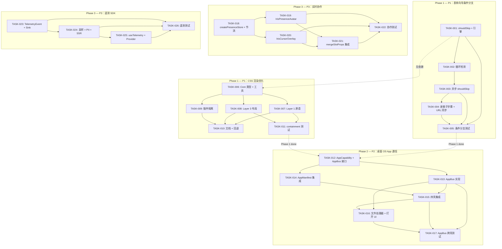

现在我已全面掌握现有代码库（`steps.ts`、`FormStep` 类型、`AppManifest`、core 模块结构）以及需求文档。以下是完整的 Tech Lead 深入分析。

---

# Tech Lead 分析：5 个高价值扩展方向

## 1. 任务分解

所有任务遵循 **2–4 小时** 原则，按方向组织。共有 **24 个任务**，P1（方向 1 + 2）11 个任务，P2（方向 3）6 个任务，P3（方向 4 + 5）7 个任务。

---

### 方向 1：🔀 表单向导条件分支协议（P1）

| 任务 ID      | 标题                                   | 涉及文件                                                                                                                                                                                                    | 前置依赖     | 预估工时 | 验收标准                                                                                                                                                                                            |
| ------------ | -------------------------------------- | ----------------------------------------------------------------------------------------------------------------------------------------------------------------------------------------------------------- | ------------ | -------- | --------------------------------------------------------------------------------------------------------------------------------------------------------------------------------------------------- |
| **TASK-001** | Core：`shouldSkip` 字段 + 条件导航引擎 | `packages/core/src/form/types.ts`（`FormStep` 添加 `shouldSkip?`）+ `packages/core/src/form/steps.ts`（`nextStep()` 跳过循环）                                                                              | 无           | 3h       | • `FormStep<V>` 新增可选 `shouldSkip?: (values: V) => boolean \| Promise<boolean>`<br>• `nextStep()` 在向前导航时循环跳过 `shouldSkip` 返回 true 的步骤<br>• 现有无 `shouldSkip` 的步骤行为完全不变 |
| **TASK-002** | Core：循环依赖（DAG）检测              | `packages/core/src/form/steps.ts`                                                                                                                                                                           | TASK-001     | 2h       | • `createStepNavigation` 在初始化时检测条件步骤间的循环依赖<br>• 检测到循环时抛出一个可读的错误信息，指明步骤 ID                                                                                    |
| **TASK-003** | Core：异步 shouldSkip + 加载状态       | `packages/core/src/form/steps.ts`                                                                                                                                                                           | TASK-002     | 2h       | • `shouldSkip` 支持 async 函数<br>• `nextStep()` 在等待异步条件时返回一个待定状态（`{ loading: true }` 或类似机制）<br>• 单元测试覆盖异步条件解析                                                   |
| **TASK-004** | Core：嵌套子步骤 + URL/hash 同步       | `packages/core/src/form/types.ts`（`FormStep` 添加 `children?: FormStep<V>[]`）+ `packages/core/src/form/steps.ts`（子步骤导航）+ `packages/core/src/form/url-sync.ts`（新文件，history.replaceState 桥接） | TASK-003     | 4h       | • `FormStep` 支持递归 `children` 字段<br>• `stepCount()` 返回展开后的总步骤数<br>• 可选的 URL hash 同步（`syncStepToHash: boolean` 配置项）<br>• 刷新页面后恢复当前步骤                             |
| **TASK-005** | 测试：条件分支引擎                     | `packages/core/src/form/__tests__/step-navigation.test.ts`（追加测试）                                                                                                                                      | TASK-001–004 | 3h       | • 测试场景覆盖：线性跳过、多重跳过、异步条件、循环检测、子步骤展开、URL 同步<br>• 所有现有测试保持绿色                                                                                              |

**方向 1 总计：5 个任务，14 小时（约 2 天）** — 其中纯 core 逻辑约 150 行，测试约 120 行。

---

### 方向 2：🔮 CSS 渲染优化协议（P1）

| 任务 ID      | 标题                                                                                   | 涉及文件                                                                                                                                                                                                                                                       | 前置依赖     | 预估工时 | 验收标准                                                                                                                                                                                                                                         |
| ------------ | -------------------------------------------------------------------------------------- | -------------------------------------------------------------------------------------------------------------------------------------------------------------------------------------------------------------------------------------------------------------- | ------------ | -------- | ------------------------------------------------------------------------------------------------------------------------------------------------------------------------------------------------------------------------------------------------ |
| **TASK-006** | Core：ContainmentLevel 枚举 + CSS 工具函数                                             | 新文件 `packages/core/src/rendering/containment.ts` + `packages/core/src/index.ts`（导出）                                                                                                                                                                     | 无           | 2h       | • 导出 `ContainmentLevel`（`none` / `layout` / `paint` / `style` / `strict` / `content`）+ `ContainmentConfig` 接口<br>• 导出 `resolveContainmentCSS(level): string` 返回对应的 CSS 值<br>• 导出 `containmentClass(level): string` 返回 CSS 类名 |
| **TASK-007** | Layer 1 原语：IrisCard / IrisGrid / IrisStack / IrisTable 添加 containment prop        | 每个组件跨 4 框架：<br>`packages/react/src/primitives/{Card,Grid,Stack,Table}`<br>`packages/vue/src/primitives/{Card,Grid,Stack,Table}`<br>`packages/solid/src/primitives/{Card,Grid,Stack,Table}`<br>`packages/svelte/src/primitives/{Card,Grid,Stack,Table}` | TASK-006     | 4h       | • 每个组件新增可选 `containment?: ContainmentLevel` prop<br>• 组件根元素根据 prop 值应用对应的 CSS containment 类<br>• 未传 prop 时行为不变（向后兼容）                                                                                          |
| **TASK-008** | Layer 3 布局：IrisSidebarLayout / IrisDashboardGrid / IrisAdminLayout 添加 containment | 跨 4 框架布局组件：<br>`packages/{react,vue,solid,svelte}/src/layout/*`                                                                                                                                                                                        | TASK-006     | 3h       | • 布局组件添加 `containment` prop<br>• `IrisSidebarLayout` 默认 `contain: layout paint`（侧边栏固定 + 主区域滚动）<br>• `IrisDashboardGrid` 默认 widget 级 `contain: layout style`                                                               |
| **TASK-009** | 插件根容器 containment 隔离                                                            | 跨框架 provider 中的插件容器（`packages/{react,vue,solid,svelte}/src/provider`）+ `packages/core/src/plugin.ts`                                                                                                                                                | TASK-006     | 2h       | • 每个插件的根容器默认应用 `contain: style`（样式隔离）<br>• 插件可以通过 `pluginMeta` 覆盖 containment 级别<br>• CSS 变量在 contain: style 下的回退机制有文档说明                                                                               |
| **TASK-010** | 文档 + 回退策略 + 行为组件冲突检测                                                     | `docs/guides/css-containment.md`（新文件）<br>+ `packages/core/src/rendering/containment.ts`（`UncontainableBehavior` 接口）                                                                                                                                   | TASK-007–009 | 2h       | • 文档说明：每个组件推荐 containment 级别、CSS 变量回退指南、`content-visibility: auto` 与 `contain-intrinsic-size` 配置<br>• Behavior 组件可以声明 `requireUncontainedLayout: true` 以自动移除 containment                                      |
| **TASK-011** | 测试：CSS containment 集成 + 渲染基准                                                  | `packages/core/src/rendering/__tests__/containment.test.ts` + 各组件测试追加                                                                                                                                                                                   | TASK-007–009 | 3h       | • 验证每个组件在 DOM 中渲染出正确的 `contain:` 样式<br>• 验证 `contain: style` 下 CSS 变量继承链的切断<br>• `scale.bench.ts` 增加带/不带 containment 的渲染时间对比                                                                              |

**方向 2 总计：6 个任务，16 小时（约 2.5 天）** — 核心逻辑约 80 行，四框架组件修改约 40 个文件，测试约 100 行。

---

### 方向 3：🏗️ 桌面 OS 应用间通信与能力宣告（P2）

| 任务 ID      | 标题                                           | 涉及文件                                                                                                                                                      | 前置依赖     | 预估工时 | 验收标准                                                                                                                                                                                                                             |
| ------------ | ---------------------------------------------- | ------------------------------------------------------------------------------------------------------------------------------------------------------------- | ------------ | -------- | ------------------------------------------------------------------------------------------------------------------------------------------------------------------------------------------------------------------------------------ |
| **TASK-012** | Core：AppCapability + AppBus 接口定义          | 新文件 `packages/core/src/desktop/app-bus.ts` + `packages/core/src/index.ts`（导出）                                                                          | 无           | 2h       | • 导出 `AppCapability`（`type: 'file-handler' \| 'protocol-handler' \| 'action-provider'`, `schemes: string[]`, `actions: string[]`）<br>• 导出 `AppBus` 接口（`request()`, `onRequest()`, `broadcast()`, `registerCapabilities()`） |
| **TASK-013** | Core：AppBus 实现（BroadcastChannel + 懒启动） | `packages/core/src/desktop/app-bus.ts`（实现）+ 新文件 `packages/core/src/desktop/app-registry.ts`                                                            | TASK-012     | 4h       | • BroadcastChannel 同源跨标签页通信<br>• `request()` 返回 `Promise<unknown>`（支持超时 5s）<br>• `onRequest()` 返回取消函数<br>• 调用栈深度限制（最大 10 层）防止死循环<br>• 完整的单元测试                                          |
| **TASK-014** | Core：集成 AppManifest + 能力声明              | `packages/core/src/desktop/manifest.ts`（扩展 `AppManifest` 通用类型）                                                                                        | TASK-013     | 2h       | • `AppManifest` 添加可选 `capabilities?: AppCapability[]`<br>• `app-registry.ts` 中的 `registerApp(manifest)` 自动注册能力<br>• 冲突检测：两个 app 注册相同 scheme 时记录 warn                                                       |
| **TASK-015** | Desktop Shell：集成 AppBus 到四壳              | `apps/desktop-os/src/App.tsx`（React）<br>`apps/desktop-os-vue/src/App.vue`<br>`apps/desktop-os-solid/src/App.tsx`<br>`apps/desktop-os-svelte/src/App.svelte` | TASK-014     | 4h       | • 每个壳在 `App` 初始化时创建 `AppBus` 单例<br>• 每个壳注入 `catalog.ts` 注册能力<br>• 每个壳的窗口系统响应 `broadcast('app:focus', id)` 等系统消息                                                                                  |
| **TASK-016** | Desktop：文件处理器 +「用…打开」UI             | 新组件：`apps/desktop-os/src/components/OpenWithDialog.tsx`（及对应四壳实现）                                                                                 | TASK-015     | 4h       | • 双击文件时查询注册了该扩展的 app<br>• 多个 app 时弹出选择器对话框<br>•「始终使用此应用」选项持久化到 profile<br>• 无匹配 app 时显示「没有可打开此文件的应用」                                                                      |
| **TASK-017** | 测试：跨壳 AppBus 集成测试                     | `packages/core/src/desktop/__tests__/app-bus.test.ts`（现有追加）<br>+ `apps/desktop-os/src/__tests__/app-comm.test.ts`                                       | TASK-013–016 | 3h       | • 模拟 A→B 请求/响应<br>• 多接收器广播<br>• 超时测试（5s）<br>• 循环依赖阻断测试<br>• 能力冲突注册测试                                                                                                                               |

**方向 3 总计：6 个任务，19 小时（约 3 天）** — 核心约 300 行，四壳集成约 200 行，UI 组件约 150 行。

---

### 方向 4：👥 实时协作 UI 原语（P3）

| 任务 ID      | 标题                                 | 涉及文件                                                                                            | 前置依赖     | 预估工时 | 验收标准                                                                                                                                                                                                                                                 |
| ------------ | ------------------------------------ | --------------------------------------------------------------------------------------------------- | ------------ | -------- | -------------------------------------------------------------------------------------------------------------------------------------------------------------------------------------------------------------------------------------------------------- |
| **TASK-018** | Core：createPresenceStore + 光标节流 | 新文件 `packages/core/src/collaboration/presence.ts` 和 `packages/core/src/collaboration/cursor.ts` | 无           | 4h       | • `createPresenceStore(room, userId)` 返回感知状态（在线用户列表 + 状态）<br>• `createCursorStream()` 在 BroadcastChannel 上发送/接收光标位置更新<br>• 光标更新默认 50ms 节流（`requestAnimationFrame` 节流化）<br>• 单元测试覆盖添加/删除用户、状态变化 |
| **TASK-019** | 组件：IrisPresenceAvatar（四框架）   | 跨四框架新组件文件：<br>`packages/{react,vue,solid,svelte}/src/collaboration/PresenceAvatar/`       | TASK-018     | 4h       | • 显示在线用户圆头像 + 状态点（在线/空闲/离开）<br>• 支持 `maxVisible` prop（超出时显示 "+N" 溢出气泡）<br>• 点击 overflow 区域展开完整列表<br>• 支持 `data-iris-no-collaboration` 属性排除区域                                                          |
| **TASK-020** | 组件：IrisCursorOverlay（四框架）    | 跨四框架新组件文件：<br>`packages/{react,vue,solid,svelte}/src/collaboration/CursorOverlay/`        | TASK-018     | 4h       | • 渲染远程用户的光标位置（用户名标签 + 颜色指示）<br>• 选区高亮标记<br>• 光标颜色基于 userId 哈希分配（预定义 8 色调色板）<br>• 关闭协作时不产生 DOM 开销                                                                                                |
| **TASK-021** | Core：远程光标 mergeSlotProps 集成   | `packages/core/src/collaboration/integration.ts`（useRemoteCursor 逻辑）+ 各框架桥接                | TASK-020     | 3h       | • 导出 `withRemoteCursor<T>(slotProps, remoteCursors)` → 向已有组件 props 注入光标叠加层<br>• 适用于 `IrisTable`/`IrisTree`/`IrisCodeEditor` 等组件<br>• 在组件根元素上设置 `data-iris-remote-active` 属性                                               |
| **TASK-022** | 测试：协作原语                       | `packages/core/src/collaboration/__tests__/` + 各框架组件测试                                       | TASK-018–021 | 3h       | • 模拟 2 个 BroadcastChannel 客户端<br>• 验证光标节流在 30fps 内<br>• 验证离线恢复后用户列表同步<br>• 验证冲突可视化状态                                                                                                                                 |

**方向 4 总计：5 个任务，18 小时（约 3 天原型）** — P3 阶段只做原型 + 测试。

---

### 方向 5：📊 组件级生产遥测 SDK（P3）

| 任务 ID      | 标题                                                 | 涉及文件                                                                                                                                                                                                 | 前置依赖     | 预估工时 | 验收标准                                                                                                                                                                                                         |
| ------------ | ---------------------------------------------------- | -------------------------------------------------------------------------------------------------------------------------------------------------------------------------------------------------------- | ------------ | -------- | ---------------------------------------------------------------------------------------------------------------------------------------------------------------------------------------------------------------- | -------- | --------- | ------------- | ------------------------------------------------------------------------------------------------------------------------------------------------------------------------------------------------------------------- |
| **TASK-023** | Core：TelemetryEvent 类型 + TelemetrySink 接口       | 新文件 `packages/core/src/telemetry/types.ts` + `packages/core/src/index.ts`（导出）                                                                                                                     | 无           | 2h       | • 导出 `TelemetryEvent`（`type: 'mount'                                                                                                                                                                          | 'update' | 'unmount' | 'interaction' | 'error'`, `component`, `framework`, `timestamp`, `duration?`, `metadata?`）<br>• 导出 `TelemetrySink` 接口（`push(event)`, `flush()`）<br>• 导出 `TelemetryConfig`（`enabled`, `sampleRate`, `sink`, `piiFilter?`） |
| **TASK-024** | Core：采样器 + PII 处理 + SSR 守卫                   | 新文件 `packages/core/src/telemetry/sampler.ts`                                                                                                                                                          | TASK-023     | 2h       | • 采样率支持（`sampleRate: 0.01` → 1% 采样）<br>• 事件 PII 标记 → 自动脱敏 payload<br>• SSR 守卫：`typeof window === 'undefined'` 时不触发<br>• 单元测试覆盖采样分布、PII 标记、SSR 静默                         |
| **TASK-025** | Core + 框架桥：useTelemetry hook + IrisProvider 集成 | 跨四框架 Provider 修改：<br>`packages/{react,vue,solid,svelte}/src/provider/IrisProvider.tsx`（新增 `telemetry` 配置项）<br>+ 各框架 `useTelemetryMount`/`useTelemetryUpdate`/`useTelemetryUnmount` hook | TASK-024     | 4h       | • IrisProvider 接受 `telemetry?: TelemetryConfig`<br>• 每个 Iris 组件在挂载/更新/卸载时通过上下文推送事件<br>• hook 使用 `startRenderTimer()`/`endRenderTimer()` 测量渲染耗时<br>• Provider 卸载时自动 `flush()` |
| **TASK-026** | 测试：遥测集成                                       | `packages/core/src/telemetry/__tests__/` + 各框架组件测试                                                                                                                                                | TASK-023–025 | 3h       | • 验证 mount/unmount 事件发射<br>• 验证采样率正确（统计测试）<br>• 验证 SSR 模式下无事件<br>• 验证自定义 sink 接收器被正确调用                                                                                   |

**方向 5 总计：4 个任务，11 小时（约 1.5 天原型）** — P3 阶段只做原型。

---

### 任务汇总

| 优先级   | 方向                      | 任务数 | 总工时  | 日历估算  |
| -------- | ------------------------- | ------ | ------- | --------- |
| **P1**   | 方向 1（表单分支）        | 5      | 14h     | 2 天      |
| **P1**   | 方向 2（CSS containment） | 6      | 16h     | 2.5 天    |
| **P2**   | 方向 3（App 通信）        | 6      | 19h     | 3 天      |
| **P3**   | 方向 4（协作原语）        | 5      | 18h     | 3 天      |
| **P3**   | 方向 5（遥测 SDK）        | 4      | 11h     | 1.5 天    |
| **合计** |                           | **26** | **78h** | **12 天** |

---

## 2. 执行顺序

### 依赖图



### 并行执行组

| 并行组   | 任务                                            | 说明                                     |
| -------- | ----------------------------------------------- | ---------------------------------------- |
| **组 A** | TASK-001（方向 1 起点）                         | 方向 1 的依赖链起点                      |
| **组 B** | TASK-006（方向 2 起点）                         | 方向 2 的依赖链起点，与组 A **完全并行** |
| **组 C** | TASK-002 → TASK-003 → TASK-004（方向 1 串行链） | 方向 1 核心逻辑，必须串行                |
| **组 D** | TASK-007 ∥ TASK-008 ∥ TASK-009（方向 2 并行）   | Layer 1/3/插件可以同时分配不同开发       |
| **组 E** | TASK-012（方向 3 起点）                         | 依赖 Phase 1 完成，与方向 1/2 串行       |
| **组 F** | TASK-013 ∥ TASK-014（方向 3 Core）              | 实现与 Manifest 集成可并行               |
| **组 G** | TASK-015 ∥ TASK-016（方向 3 Shell）             | 四壳集成与文件 UI 可并行                 |
| **组 H** | TASK-018（方向 4 起点）                         | 独立，与方向 5 完全并行                  |
| **组 I** | TASK-023（方向 5 起点）                         | 独立，与方向 4 完全并行                  |

---

## 3. 技术风险

### 3.1 高风险项

| #      | 风险                                                                          | 影响方向 | 概率   | 影响程度 | 缓解策略                                                                                                                                                                                       |
| ------ | ----------------------------------------------------------------------------- | -------- | ------ | -------- | ---------------------------------------------------------------------------------------------------------------------------------------------------------------------------------------------- |
| **R1** | `contain: style` 切断 CSS 变量继承链，破坏换肤                                | 方向 2   | **中** | **高**   | • Core 工具函数自动为 containment 节点注入所需 `--iris-*` fallback<br>• 在 TASK-010 中提供严格文档说明回退策略<br>• 使用 `style` 属性而非 CSS 类注入 containment（可同时声明 `--iris-*` 变量） |
| **R2** | 四壳 `AppBus` 行为不一致（Solid 响应式 vs React useEffect vs Svelte $effect） | 方向 3   | **高** | **中**   | • 所有壳共享同一 Core `AppBus` 实现（无框架依赖）<br>• 壳集成只负责在正确生命周期创建/销毁实例<br>• 集成测试必须覆盖所有四壳                                                                   |
| **R3** | BroadcastChannel 在 localStorage 第三方 cookie 限制环境失效                   | 方向 3/4 | **低** | **高**   | • 提供可注入的 `ChannelFactory`（默认 `BroadcastChannel`，可替换为 `SharedWorker` 或 `MessageChannel`）<br>• 在 `app-bus.ts` 中回退到 `window.postMessage` 跨 iframe 通信                      |
| **R4** | 高频率协作光标更新导致页面卡顿（30+ 次/秒）                                   | 方向 4   | **中** | **中**   | • TASK-018 内置 requestAnimationFrame 节流（16ms 窗口）<br>• BroadcastChannel 端做批量发送（累积多个事件后统一发送）<br>• 可选 WebSocket 回退（通过可配置 ChannelAdapter）                     |
| **R5** | 遥测 hook 记录渲染耗时本身成为性能问题（观察者悖论）                          | 方向 5   | **高** | **中**   | • 默认采样率 0%（完全关闭）<br>• 生产建议采样率 ≤ 1%<br>• 使用 `performance.now()` 而非 `Date.now()`（零 GC 压力）<br>• 渲染耗时测量使用 `requestIdleCallback` 降优先级                        |
| **R6** | 条件分支中用户刷新页面导致步骤状态丢失                                        | 方向 1   | **中** | **低**   | • URL hash 同步自动恢复（TASK-004）<br>• `createStepNavigation` 支持可选的 `restoreFromHash()` 方法                                                                                            |

### 3.2 外部依赖

| 依赖                                 | 用途                            | 替代方案                              | 确定度                                                               |
| ------------------------------------ | ------------------------------- | ------------------------------------- | -------------------------------------------------------------------- |
| `BroadcastChannel` API               | AppBus 跨标签页通信（方向 3/4） | `SharedWorker` / `window.postMessage` | 高（现代浏览器 >95% 支持）                                           |
| `performance.now()`                  | 遥测渲染耗时测量（方向 5）      | `Date.now()`（精度低但可用）          | 高                                                                   |
| `history.replaceState`               | URL hash 同步（方向 1）         | `location.hash` 直接读写              | 高                                                                   |
| `CSS.contain` / `content-visibility` | 渲染优化（方向 2）              | 无替代（fallback = 无 containment）   | 高（Chrome 52+/Safari 15.4+/Firefox 69+）——对 Safari < 15.4 静默降级 |

### 3.3 性能瓶颈

| 场景                         | 瓶颈                      | 阈值               | 优化策略                                                          |
| ---------------------------- | ------------------------- | ------------------ | ----------------------------------------------------------------- |
| 表单向导嵌套 20+ 层          | `nextStep()` 循环过长     | 20+ 连续跳过的步骤 | 维护一个 `skipChain: number[]` 缓存，每次 `shouldSkip` 变化时重建 |
| AppBus 广播给 50+ app        | BroadcastChannel 发射次数 | 50+ 接收器         | 使用 Set 过滤重复，批量发送，异步不阻塞主线程                     |
| 20+ 用户同时协作光标         | 光标组件 DOM 节点数       | 20+ 光标叠加层     | 只渲染视口内光标；对 20+ 用户聚合为「N 人在此处」气泡             |
| 遥测 1% 采样 = 10,000 次事件 | `push()` 调用频率         | 万级/秒            | 内部队列每 1s flush 一次；sink 实现方自行决定上传策略             |

### 3.4 测试覆盖难点

| 测试目标                  | 难点                         | 策略                                                                                                        |
| ------------------------- | ---------------------------- | ----------------------------------------------------------------------------------------------------------- |
| CSS containment 实际效果  | jsdom 不实现 CSS containment | • 验证 DOM 属性（`element.style.contain`）存在且值正确<br>• 性能基准测试在真实浏览器中使用 Playwright       |
| BroadcastChannel 跨标签页 | jsdom 无 BroadcastChannel    | • `vi.stubGlobal('BroadcastChannel', MockBroadcastChannel)`<br>• 使用共享受控 `MessagePort` 模拟            |
| 协作多用户                | 需要模拟多个客户端           | • 在单个 test 中创建 2+ `PresenceStore` 实例，使用内存通道代替 BroadcastChannel<br>• 验证状态同步而非网络层 |
| 条件分支的 `shouldSkip`   | 异步条件时序                 | • 所有异步条件使用可控 `Promise` + `vi.useFakeTimers()`<br>• 测试加载状态、成功、失败三种路径               |

---

## 4. 资源评估

### 4.1 人员需求

| 角色                          | 技能要求                                                       | 数量      | 分配方向                                                                                                              |
| ----------------------------- | -------------------------------------------------------------- | --------- | --------------------------------------------------------------------------------------------------------------------- |
| **Senior Frontend Architect** | TypeScript 5+、core 设计模式、store/state 管理、四框架基础知识 | 1         | **方向 1**（core 表单逻辑）+ **方向 2**（Rendering API 设计）+ **方向 3**（core 通信协议设计）+ **方向 4/5** 架构决策 |
| **Frontend Engineer A**       | React + Vue（跨框架适配器经验）                                | 1         | **方向 2** Layer 1/3 组件修改（React/Vue）+ **方向 3** 壳集成（desktop-os, desktop-os-vue）                           |
| **Frontend Engineer B**       | Solid + Svelte + 组件开发                                      | 1         | **方向 2** Layer 1/3 组件修改（Solid/Svelte）+ **方向 3** 壳集成（desktop-os-solid, desktop-os-svelte）               |
| **QA Engineer**               | Vitest + Playwright + 性能基准测试                             | 1（兼职） | **所有方向** 测试覆盖 + 集成测试 + 渲染基准                                                                           |

**最低配置（2 人团队）**：Senior + 1 Frontend（四框架全栈）。时间线拉长 1.5×。

### 4.2 关键里程碑

| 里程碑                             | 日期（自起始日） | 交付物                          | 验收条件                                                            |
| ---------------------------------- | ---------------- | ------------------------------- | ------------------------------------------------------------------- |
| **M1: 表单分支功能完成**           | Day 2 EOD        | TASK-001~005 全部合并           | 所有单元测试绿色 + CMS demo 向导集成验证                            |
| **M2: CSS containment 全组件覆盖** | Day 5 EOD        | TASK-006~011 全部合并           | 40+ 组件文件修改 + 渲染基准对比数据（containment 开/关）            |
| **M3: Phase 1 质量门**             | Day 6            | 完整测试跑通 + `pnpm size` 通过 | 无回归，core 大小增加 ≤500B                                         |
| **M4: AppBus 协议 + 壳集成**       | Day 9 EOD        | TASK-012~017 全部合并           | 跨壳通信集成演示（文件管理器→ProTable 打开 CSV）                    |
| **M5: 协作 UI 原型**               | Day 12 EOD       | TASK-018~022 全部合并           | 两浏览器标签页互现光标 + 感知头像（P3, 可选）                       |
| **M6: 遥测 SDK 原型**              | Day 12 EOD       | TASK-023~026 全部合并           | demo 页面中 Provider 配置 telemetry 后 console 看到事件（P3, 可选） |

### 4.3 阻塞点与解决策略

| 阻塞点                                     | 影响            | 解阻塞动作                                                            | 责任方           | 最迟决策日 |
| ------------------------------------------ | --------------- | --------------------------------------------------------------------- | ---------------- | ---------- |
| `contain: style` 与 token 系统的兼容性验证 | 方向 2 全部     | 2 小时 spike：在 IrisCard 上实验 `contain: style` + CSS 变量 fallback | Senior Architect | Day 1      |
| 四壳 AppBus 集成的测试环境                 | 方向 3 测试     | 搭建单壳 Playwright 测试骨架（React 壳优先，其他壳复用模式）          | QA Engineer      | Day 6      |
| CRDT 同步层未就绪 → 协作 UI 无后端         | 方向 4 原型     | 短期：用 BroadcastChannel + 内存状态模拟多用户；不等待 CRDT           | Senior Architect | Day 10     |
| 遥测 SDK 的隐私合规（GDPR）                | 方向 5 生产就绪 | **P3 原型不做**；生产发布前由法务审计                                 | 产品经理         | 发布前     |

---

## 5. 质量保证

### 5.1 单元测试覆盖要求

| 方向   | 模块                      | 必须覆盖的测试场景                                                                                                                                                  | 目标覆盖率                  |
| ------ | ------------------------- | ------------------------------------------------------------------------------------------------------------------------------------------------------------------- | --------------------------- |
| 方向 1 | `steps.ts` 条件引擎       | • 线性跳过（2→4）<br>• 多重跳过（2→3→4）<br>• 全部跳过（1→终点）<br>• 无跳过（向后兼容）<br>• 异步 shouldSkip <br>• 循环检测（A→B→A）<br>• 子步骤展开计数           | 100% 条件行                 |
| 方向 2 | `containment.ts` + 各组件 | • resolveContainmentCSS 函数返回正确值<br>• 每个组件渲染出正确的 contain 属性<br>• 未传 prop 时无 contain 属性<br>• `requireUncontainedLayout` 标志移除 containment | 100% core 函数行 + 组件冒烟 |
| 方向 3 | `app-bus.ts` AppBus       | • 请求/响应往返 <br>• 广播 N 接收器<br>• 超时（5s）<br>• 循环栈溢出（10 层）<br>• 能力冲突告警<br>• 未注册目标优雅拒绝                                              | 100% 逻辑行                 |
| 方向 4 | `presence.ts` + 组件      | • 添加/移除用户<br>• 用户状态变化<br>• 光标节流（≤30 次/秒）<br>• 20 用户同时在线 <br>• 离线/恢复同步                                                               | 100% 逻辑行 + 组件 80%      |
| 方向 5 | `sampler.ts` + 事件       | • 采样率 0% → 无事件<br>• 采样率 50% → ~50% 事件<br>• PII 标记 → payload 脱敏<br>• SSR → 无事件<br>• 自定义 sink 被正确回调                                         | 100% 逻辑行                 |

### 5.2 集成测试策略

| 测试场景                      | 方式                       | 工具                                      | 运行时机        |
| ----------------------------- | -------------------------- | ----------------------------------------- | --------------- |
| CMS 向导页面——条件分支流程    | 组件渲染 + 交互            | Vitest + jsdom + @testing-library         | `pnpm test`     |
| ProTable 500 行 + containment | 渲染基准 + Playwright 截图 | Playwright + `perf_hooks`                 | `pnpm bench`    |
| 桌面 OS 跨壳 AppBus 通信      | Playwright 多标签页        | Playwright `context.waitForEvent('page')` | `pnpm test:e2e` |
| 协作光标——双标签页同步        | Playwright 多标签页        | Playwright BroadcastChannel mock          | `pnpm test:e2e` |
| 遥测事件发射验证              | jsdom + mock sink          | Vitest + 自定义 TelemetrySink             | `pnpm test`     |

**SSR 测试**（方向 2/5）：所有新组件添加 `// @vitest-environment node` 测试文件，验证 `renderToString` 不报错。

**无障碍测试**（方向 2/4）：`IrisPresenceAvatar` 和 containment 组件添加 `axe` 断言（跳过 `color-contrast`）。

### 5.3 代码审查要点

| 审查关注点          | 检查项                                                                                             | 重要度       |
| ------------------- | -------------------------------------------------------------------------------------------------- | ------------ |
| **Core 零框架依赖** | `grep -rn "from '(react\|vue\|solid\|svelte)'" packages/core/src/` 为空                            | **CRITICAL** |
| **向后兼容**        | 现有 `FormStep` 无 `shouldSkip` → 行为不变；现有组件无 `containment` prop → 不渲染 containment CSS | **CRITICAL** |
| **四框架对称**      | 每个新组件/修改在 react/vue/solid/svelte 中同名同语义导出                                          | **HIGH**     |
| **子路径导出**      | 新模块需在对应包的 `package.json` `exports` 中添加子路径                                           | **HIGH**     |
| **SSR 安全**        | 新组件/ hook 使用 `typeof window === 'undefined'` 守卫                                             | **MEDIUM**   |
| **CSS 变量回退**    | `contain: style` 节点内须声明所需 `--iris-*` fallback                                              | **MEDIUM**   |
| **性能基准**        | 方向 2 修改后运行 `pnpm bench`，对比 containment 对渲染时间的影响                                  | **MEDIUM**   |

### 5.4 性能测试需求

| 测试                     | 工具                               | 标准                   | 验收条件                                                 |
| ------------------------ | ---------------------------------- | ---------------------- | -------------------------------------------------------- |
| CSS containment 渲染基准 | `scale.bench.ts` 扩展 + Playwright | 全组件渲染时间对比     | containment 开启后全组件渲染时间 ≤ 无 containment 的 80% |
| AppBus 广播延迟          | 自定义 bench                       | 100 个接收器的广播延迟 | 中位数延迟 < 1ms, P99 < 5ms                              |
| 协作光标 20 用户         | Playwright + 模拟 20 光标流        | FPS 下降               | 20 光标叠加时 FPS ≥ 50                                   |
| 遥测 hook 开销           | 渲染 100 次 + 遥测开 vs 关         | 平均渲染耗时差异       | 遥测开启后渲染耗时增加 < 0.5ms                           |

---

## 6. 实施计划

### 阶段甘特图

```mermaid
gantt
    title Iris UI — 5 方向实施路线图（26 任务 × 12 天）
    dateFormat  YYYY-MM-DD
    axisFormat  %m-%d

    section Phase 1: P1 核心 (6天)
    TASK-001: shouldSkip+引擎          :d1, 2026-07-14, 1d
    TASK-002: 循环检测                  :d1, 1d
    TASK-003: 异步 shouldSkip          :d1, 1d
    TASK-004: 子步骤+URL同步           :d1, 1d
    TASK-005: 表单分支测试              :d1, 1d
    TASK-006: Core containment类型     :d2, 1d
    TASK-007: Layer 1 原语 containment :d2, 1d
    TASK-008: Layer 3 布局 containment :d2, 1d
    TASK-009: 插件 containment 隔离     :d2, 1d
    TASK-010: 文档+回退策略            :d2, 1d
    TASK-011: containment 测试+基准     :d2, 1d

    section Phase 2: P2 桌面OS通信 (3天)
    TASK-012: AppBus 接口定义          :d3, 2026-07-22, 1d
    TASK-013: AppBus 实现              :d3, 1d
    TASK-014: AppManifest 集成         :d3, 1d
    TASK-015: 四壳集成                 :d3, 1d
    TASK-016: 文件处理器+打开UI        :d3, 1d
    TASK-017: 跨壳测试                 :d3, 1d

    section Phase 3: P3 原型 (3天, 可选)
    TASK-018: createPresenceStore      :d4, 2026-07-29, 1d
    TASK-019: IrisPresenceAvatar       :d4, 1d
    TASK-020: IrisCursorOverlay        :d4, 1d
    TASK-021: mergeSlotProps 集成      :d4, 1d
    TASK-022: 协作测试                  :d4, 1d
    TASK-023: 遥测类型+Sink            :d5, 1d
    TASK-024: 采样器+PII+SSR           :d5, 1d
    TASK-025: useTelemetry+Provider    :d5, 1d
    TASK-026: 遥测测试                 :d5, 1d
```

### 阶段详情

#### 阶段 1：P1 核心功能（Day 1–6，必要时 2 人并行）

| 天        | 工作内容                                                                                                                                                                   | 人员安排             |
| --------- | -------------------------------------------------------------------------------------------------------------------------------------------------------------------------- | -------------------- |
| **Day 1** | • **TASK-001**（条件引擎核心）— Senior<br>• **TASK-006**（containment 类型定义）— Senior（下午）<br>• **Spike**：contain: style + CSS 变量 fallback 验证                   | Senior（全栈）       |
| **Day 2** | • **TASK-002**（循环检测）— Senior<br>• **TASK-007**（Layer 1 原语 containment，React/Vue）— FE A<br>• **TASK-007**（Layer 1 原语 containment，Solid/Svelte）— FE B        | Senior + FE A + FE B |
| **Day 3** | • **TASK-003**（异步 shouldSkip）— Senior<br>• **TASK-008**（Layer 3 布局 containment，React/Vue）— FE A<br>• **TASK-008**（Layer 3 布局 containment，Solid/Svelte）— FE B | Senior + FE A + FE B |
| **Day 4** | • **TASK-004**（嵌套子步骤 + URL 同步）— Senior<br>• **TASK-009**（插件隔离）— FE A<br>• **TASK-010**（文档 + 回退策略）— FE B                                             | Senior + FE A + FE B |
| **Day 5** | • **TASK-005**（表单分支测试）— Senior<br>• **TASK-011**（containment 测试 + 基准）— FE A                                                                                  | Senior + FE A        |
| **Day 6** | • **质量门**：全测试跑通、size 预算、lint、typecheck、bench<br>• 修复 CI 失败<br>• 合并 Phase 1                                                                            | 全体                 |

**阶段 1 交付物**：

- 条件分支引擎（~150 行 core + 测试）
- 40+ 组件 containment prop 修改
- 渲染基准对比报告

#### 阶段 2：P2 桌面 OS 通信（Day 7–9，3 天）

| 天        | 工作内容                                                                                                                                                                          | 人员安排      |
| --------- | --------------------------------------------------------------------------------------------------------------------------------------------------------------------------------- | ------------- |
| **Day 7** | • **TASK-012**（AppBus 接口）— Senior<br>• **TASK-014**（AppManifest 能力宣告）— FE A<br>• 阅读四壳代码结构 + 理解 catalog.ts 差异                                                | Senior + FE A |
| **Day 8** | • **TASK-013**（AppBus 实现：BroadcastChannel + 懒启动 + 超时 + 循环检测）— Senior<br>• **TASK-015**（React + Vue 壳集成）— FE A<br>• **TASK-015**（Solid + Svelte 壳集成）— FE B | 全体          |
| **Day 9** | • **TASK-016**（「用…打开」对话框 UI + 文件处理器）— FE A<br>• **TASK-017**（跨壳 AppBus 集成测试）— Senior + FE B                                                                | 全体          |

**阶段 2 交付物**：

- AppBus core（~300 行 + 测试）
- 四壳 AppBus 集成
- 文件类型处理器 + UI 选择器

#### 阶段 3：P3 原型（Day 10–12，3 天，可选——仅在 P1/P2 完成后启动）

| 天         | 工作内容                                                                                                                                                                                          | 人员安排      |
| ---------- | ------------------------------------------------------------------------------------------------------------------------------------------------------------------------------------------------- | ------------- |
| **Day 10** | • **TASK-018**（createPresenceStore + 光标节流）— Senior<br>• **TASK-023**（遥测类型 + Sink 接口）— FE A                                                                                          | Senior + FE A |
| **Day 11** | • **TASK-019**（IrisPresenceAvatar，React/Vue）— FE A<br>• **TASK-019**（IrisPresenceAvatar，Solid/Svelte）— FE B<br>• **TASK-024**（采样器 + PII + SSR 守卫）— Senior                            | 全体          |
| **Day 12** | • **TASK-020**（IrisCursorOverlay）— FE A + FE B<br>• **TASK-021**（mergeSlotProps 集成）— Senior<br>• **TASK-025**（useTelemetry + Provider 集成）— Senior<br>• **TASK-022 + 026**（测试）— 全体 | 全体          |

**阶段 3 交付物**：

- 协作 UI 原型（两标签页互现光标 + 感知头像）
- 遥测 SDK 原型（IrisProvider + telemetry hook → console 事件）

---

## 总结与建议

### 执行优先级推荐

```
Phase 1 (Day 1-6) ████████████████████████████████  50% 工作量 — 方向 1 + 2
     ↓ 价值最高、成本最低、零外部依赖、立即可为
Phase 2 (Day 7-9) ████████████████                  25% 工作量 — 方向 3
     ↓ Desktop OS 从「窗口管理器集合」→「真正操作系统」的必要一跳
Phase 3 (Day 10-12) ████████████████                25% 工作量 — 方向 4 + 5
     ↓ 生态级投入，建议 P1/P2 稳定后启动原型，产品决定是否推进
```

### 关键风险——管理层的 3 个决策点

1. **Day 1（Spike 结果）**：`contain: style` 与 CSS 变量的兼容性——如果 fallback 方案在 IE/旧版 Safari 上问题严重，方向 2 缩小范围至仅 `contain: layout paint`（不含 `style`）。

2. **Day 6（Phase 1 质量门结果）**：如果 `pnpm bench` 显示 containment 带来的性能提升 < 5%，方向 2 降级为 P2（不阻碍 Phase 2 启动）。

3. **Day 9（方向 3 测试结果）**：如果四壳 AppBus 集成测试中发现跨框架行为不一致（如 Solid 响应式导致事件重复处理），方向 3 需 1 天额外修复时间。

### 如果只有 2 人团队

- 去掉 FE B 角色（Solid/Svelte 工程师）
- Senior 承担方向 1 + 方向 2 核心 + 方向 3 core
- FE A 承担方向 2 四框架组件修改 + 方向 3 壳集成
- 方向 4/5 延期至下一迭代
- 时间线从 12 天 → 16 天
