现在我已经全面了解了项目代码库。下面呈上综合技术负责人的分析。

---

# Tech Lead 分析：Iris UI 五个高价值发展方向

## 执行摘要

验证报告确认了五个方向中有三个（方向三、五和大部分方向一）具有**极高的新颖性**，且 grep 准确度无可争议。剩余两个方向（二和四）存在一些与现有分析文档的重叠或低估现有测试覆盖范围的问题，但这非但不会削弱其价值，反而为更精确的范围界定提供了依据。

**关键背景**：该项目有 25+ 个包、149 个组件、4 个框架适配器和一个全面的主题引擎，但处于 `v0.0.0` 状态。这意味着我们有一个**独特的机会窗口**，可以在破坏性变更发布给消费者之前，引入必要的治理工具、构建优化和基础设施。这五个方向共同代表了从"完善但孤立"的 UI 库向"平台级、生产就绪"的 UI 系统工程套件的演进。

---

## 1. 任务分解

### 方向一：🎨 Design Token → 设计工具桥接层

| 任务 ID  | 标题                                                      | 文件                                                                                          | 前置依赖               | 预估工时 |
| -------- | --------------------------------------------------------- | --------------------------------------------------------------------------------------------- | ---------------------- | -------- |
| TASK-001 | 将 Figma Code Connect 模板扩展到所有 React 组件（149 个） | `packages/tokens/figma/*.figma.tsx` <br> `packages/tokens/figma.config.json`                  | 无                     | 24h      |
| TASK-002 | 创建 Figma Code Connect 自动生成脚本                      | `packages/tokens/scripts/generate-code-connect.mjs`                                           | TASK-001（验证源格式） | 6h       |
| TASK-003 | 实现 DTCG → Figma Variables API 推送脚本                  | `packages/tokens/scripts/push-tokens-to-figma.mjs`                                            | TASK-001               | 8h       |
| TASK-004 | 创建从 Tokens Studio JSON 拉取回传的 CI 管道              | `.github/workflows/token-sync.yml` <br> `packages/tokens/scripts/pull-tokens.mjs`             | TASK-003               | 6h       |
| TASK-005 | 添加从主题源自动生成 `*.tokens.json`（DTCG）的构建步骤    | `packages/tokens/package.json`（脚本）<br> `packages/tokens/scripts/build-tokens.mjs`（改进） | 无（DTCG 导出已存在）  | 4h       |
| TASK-006 | 为 Vue/Solid/Svelte 组件添加 Code Connect 模板            | `packages/tokens/figma/*.figma.{vue,tsx,svelte}`（各框架）                                    | TASK-002               | 12h      |
| TASK-007 | 创建设计令牌 diff/审计 CLI（检测损坏性令牌更改）          | `packages/cli/src/commands/token-diff.ts`                                                     | TASK-005               | 6h       |

### 方向二：🧩 组件 API 版本化与迁移治理体系

| 任务 ID  | 标题                                                             | 文件                                                                                                    | 前置依赖           | 预估工时 |
| -------- | ---------------------------------------------------------------- | ------------------------------------------------------------------------------------------------------- | ------------------ | -------- |
| TASK-008 | 向 manifest schema 添加 `@deprecated`、`@since`、`@version` 字段 | `packages/manifest/src/schema.ts`（ManifestProp）<br> `packages/manifest/src/discover.ts`（解析逻辑）   | 无                 | 4h       |
| TASK-009 | 在 manifest 发现器中实现 JSDoc 标记解析器                        | `packages/manifest/src/discover.ts`（追加逻辑）                                                         | TASK-008           | 6h       |
| TASK-010 | 创建 `pnpm gen:manifest` diff-check 模式                         | `packages/manifest/src/generate.ts`（可选 diff-check）                                                  | TASK-009           | 4h       |
| TASK-011 | 构建 codemod 基础设施（解析器 + 转换器运行器）                   | `packages/codemod/`（新包）<br> `packages/codemod/src/runner.ts`<br> `packages/codemod/src/transforms/` | 无                 | 12h      |
| TASK-012 | 为子路径导出重构编写第一个 codemod 转换                          | `packages/codemod/src/transforms/subpath-migration.ts`                                                  | TASK-011           | 6h       |
| TASK-013 | 实现破坏性变更 API 兼容性检测（CI 门禁）                         | `.github/workflows/api-compat.yml`<br> `packages/cli/src/commands/api-diff.ts`                          | TASK-008, TASK-010 | 8h       |
| TASK-014 | 发布前治理：版本锁定 + 变更日志自动化                            | `packages/cli/src/commands/preflight.ts`<br> 增强 `changesets` config                                   | TASK-013           | 6h       |

### 方向三：⚡ 构建时优化架构

| 任务 ID  | 标题                                                                                        | 文件                                                                                           | 前置依赖                     | 预估工时 |
| -------- | ------------------------------------------------------------------------------------------- | ---------------------------------------------------------------------------------------------- | ---------------------------- | -------- |
| TASK-015 | 构建时 i18n 消息提取工具（从 `defaultMessages` 和插件中提取）                               | `packages/cli/src/commands/extract-i18n.ts`                                                    | 无                           | 8h       |
| TASK-016 | 实现 i18n 消息编译（每个语言一个 JSON 文件 + ICU 编译）                                     | `packages/core/src/i18n-compiler.ts`（新模块）<br> `packages/cli/src/commands/compile-i18n.ts` | TASK-015                     | 10h      |
| TASK-017 | 修改 `createI18n` 以支持编译/懒加载消息（运行时 + 构建时双模式）                            | `packages/core/src/i18n.ts`（增强）                                                            | TASK-016                     | 6h       |
| TASK-018 | 创建构建时令牌扫描器（按需摇树 CSS var 声明）                                               | `packages/cli/src/commands/scan-tokens.ts`<br> `packages/theme/src/token-scanner.ts`           | 无                           | 8h       |
| TASK-019 | 实现 `applyTheme` 按需令牌注入（而非全量注入）                                              | `packages/theme/src/applyTheme.ts`（重构）                                                     | TASK-018                     | 6h       |
| TASK-020 | 创建构建时代码生成管道（组件注册表 + 工厂生成）                                             | `packages/cli/src/commands/codegen.ts`                                                         | TASK-008（manifest schema）  | 10h      |
| TASK-021 | 在框架适配器中添加懒加载支持（React.lazy/Vue defineAsync/Solid lazy/Svelte dynamic import） | `packages/react/src/primitives/index.ts`（元注册表）<br> 所有框架适配器                        | TASK-020                     | 8h       |
| TASK-022 | 集成到 Turborepo 构建管道（`turbo.json` 添加 `codegen`、`compile-i18n`、`token-scan` 任务） | `turbo.json`（更新）                                                                           | TASK-016, TASK-019, TASK-020 | 4h       |

### 方向四：♿ 无障碍合规自动化基础设施

| 任务 ID  | 标题                                                                      | 文件                                                                                                                                                                                 | 前置依赖           | 预估工时 |
| -------- | ------------------------------------------------------------------------- | ------------------------------------------------------------------------------------------------------------------------------------------------------------------------------------ | ------------------ | -------- |
| TASK-023 | 创建跨框架 a11y 测试合约（共享测试场景）                                  | `packages/core/src/contracts/scenarios/a11y/`（新目录）<br> `packages/core/src/contracts/types.ts`（扩展）                                                                           | 无                 | 8h       |
| TASK-024 | 为所有四个框架实现 axe 测试运行器（统一可访问性测试）                     | `packages/react/src/a11y.test.tsx`（扩展）<br> `packages/vue/src/a11y.test.ts`（新增）<br> `packages/solid/src/a11y.test.tsx`（新增）<br> `packages/svelte/src/a11y.test.ts`（新增） | TASK-023           | 16h      |
| TASK-025 | 实现 WCAG 合规声明生成器（从 manifest 和 axe 结果生成机器可读的合规矩阵） | `packages/cli/src/commands/wcag-declaration.ts`                                                                                                                                      | TASK-024           | 6h       |
| TASK-026 | 创建色对比度 CI 门禁（使用 Puppeteer 截图 + 像素级对比度分析）            | `.github/workflows/color-contrast.yml`<br> `packages/tests/contrast.ts`（新包或工具）                                                                                                | 无                 | 8h       |
| TASK-027 | 实现键盘导航端到端测试（Tab 链、箭头键、Escape）                          | `packages/tests/e2e/keyboard-nav/`（新目录）                                                                                                                                         | TASK-024           | 10h      |
| TASK-028 | 将 a11y 合约集成到 CI 质量门中                                            | `turbo.json`（添加 `a11y` 任务）<br> `.github/workflows/quality.yml`（更新）                                                                                                         | TASK-024, TASK-026 | 4h       |

### 方向五：🧪 E2E 与视觉回归框架

| 任务 ID  | 标题                                                                               | 文件                                                                               | 前置依赖           | 预估工时 |
| -------- | ---------------------------------------------------------------------------------- | ---------------------------------------------------------------------------------- | ------------------ | -------- |
| TASK-029 | 搭建 Playwright 测试基础设施（配置 + 基础 fixtures）                               | `e2e/`（仓库根目录新目录）<br> `e2e/playwright.config.ts`<br> `e2e/fixtures/`      | 无                 | 6h       |
| TASK-030 | 为核心交互组件（Dialog、Popover、Menu、Select、Combobox）编写关键用户旅程 E2E 测试 | `e2e/specs/overlay-interactions.spec.ts`<br> `e2e/specs/form-interactions.spec.ts` | TASK-029           | 16h      |
| TASK-031 | 实现视觉回归基础设施（Percy 或 Chromatic 或本地像素比较）                          | `e2e/visual/`（新目录）<br> `e2e/visual/config.ts`                                 | TASK-029           | 8h       |
| TASK-032 | 为所有 149 个组件生成基准截图                                                      | `e2e/visual/baselines/`                                                            | TASK-031           | 12h      |
| TASK-033 | 为 CMS 演示及其 4 个框架变体编写跨框架 E2E 测试                                    | `e2e/specs/cms/*.spec.ts`                                                          | TASK-029           | 12h      |
| TASK-034 | 将 E2E + 视觉回归集成到 CI                                                         | `.github/workflows/e2e.yml`                                                        | TASK-030, TASK-032 | 4h       |
| TASK-035 | 为 18 个应用添加 Playwright 配置                                                   | `apps/*/playwright.config.ts`（18 个配置文件）                                     | TASK-029           | 4h       |

---

## 2. 执行顺序（依赖图）

```mermaid
graph TD
    subgraph "Phase 1: Foundation (Week 1-2)"
        T005["TASK-005: DTCG auto-build"]
        T008["TASK-008: Manifest schema @deprecated/@since"]
        T015["TASK-015: i18n extraction tool"]
        T018["TASK-018: Build-time token scanner"]
        T023["TASK-023: Cross-framework a11y contracts"]
        T029["TASK-029: Playwright infrastructure"]
    end

    subgraph "Phase 2: Core Implementation (Week 3-5)"
        T001["TASK-001: Figma Code Connect (React 149)"]
        T009["TASK-009: JSDoc tag parser"]
        T016["TASK-016: i18n message compilation"]
        T019["TASK-019: On-demand token injection"]
        T024["TASK-024: Axe runners (all 4 frameworks)"]
        T030["TASK-030: Core E2E user journeys"]
        T031["TASK-031: Visual regression infra"]
        T026["TASK-026: Color contrast CI gate"]
        T011["TASK-011: Codemod infrastructure"]
    end

    subgraph "Phase 3: Integration & CI (Week 6-8)"
        T002["TASK-002: Code Connect auto-gen script"]
        T003["TASK-003: DTCG→Figma push script"]
        T010["TASK-010: Manifest diff-check mode"]
        T017["TASK-017: Dual-mode i18n runtime"]
        T020["TASK-020: Build-time codegen"]
        T021["TASK-021: Lazy loading framework adapters"]
        T013["TASK-013: API compatibility CI gate"]
        T025["TASK-025: WCAG declaration generator"]
        T027["TASK-027: Keyboard nav E2E tests"]
        T032["TASK-032: Baseline screenshots (149)"]
        T033["TASK-033: Cross-framework CMS E2E"]
        T006["TASK-006: Figma Code Connect (Vue/Solid/Svelte)"]
        T012["TASK-012: First codemod transform"]
    end

    subgraph "Phase 4: Hardening & Release (Week 9-10)"
        T004["TASK-004: Token sync CI pipeline"]
        T007["TASK-007: Token diff CLI"]
        T014["TASK-014: Pre-release governance"]
        T022["TASK-022: Turbo pipeline integration"]
        T028["TASK-028: A11y CI quality gate"]
        T034["TASK-034: E2E+VR CI integration"]
        T035["TASK-035: 18 app Playwright configs"]
    end

    %% Phase 1 → Phase 2
    T005 --> T001
    T005 --> T003
    T008 --> T009
    T008 --> T010
    T015 --> T016
    T015 --> T017
    T018 --> T019
    T018 --> T020
    T023 --> T024
    T023 --> T025
    T029 --> T030
    T029 --> T031
    T029 --> T033

    %% Phase 2 → Phase 3
    T001 --> T002
    T002 --> T006
    T009 --> T011
    T011 --> T012
    T016 --> T017
    T020 --> T021
    T024 --> T027
    T031 --> T032
    T030 --> T033
    T013 --> T014

    %% Phase 3 → Phase 4
    T003 --> T004
    T010 --> T013
    T017 --> T022
    T021 --> T022
    T025 --> T028
    T027 --> T028
    T032 --> T034
    T033 --> T034
    T006 --> T004
    T012 --> T014
```



### 并行执行组

| 并行组                        | 任务                                             | 所需人力                |
| ----------------------------- | ------------------------------------------------ | ----------------------- |
| **Group A**（设计基础设施）   | TASK-001, TASK-005, TASK-002                     | 1 人（前端/设计工程）   |
| **Group B**（版本化基础设施） | TASK-008, TASK-009, TASK-010, TASK-011           | 1 人（工具/CLI）        |
| **Group C**（构建优化）       | TASK-015, TASK-016, TASK-018, TASK-019, TASK-020 | 1-2 人（核心/性能）     |
| **Group D**（无障碍）         | TASK-023, TASK-024, TASK-026                     | 1 人（可访问性/测试）   |
| **Group E**（E2E 与回归）     | TASK-029, TASK-030, TASK-031                     | 1 人（QA/测试基础设施） |

**关键洞察**：任务可以组织成 5 个并行工作流，每个工作流在 Phase 1 期间同时启动，每个工作流最多只需要 1-2 名开发人员。这 5 个组的构建时间都相对较短（4-8 小时），具有显著的早期可见性。

---

## 3. 技术风险

### 高风险因素

| #   | 风险                                                                                        | 方向  | 概率 | 影响 | 缓解措施                                                                                                                                                       |
| --- | ------------------------------------------------------------------------------------------- | ----- | ---- | ---- | -------------------------------------------------------------------------------------------------------------------------------------------------------------- |
| R1  | **Figma API 稳定性与速率限制** — Token Studio/Variables API 不是为 CI 高频率推送设计的      | 🎨 D1 | 中   | 高   | 实现批处理 + 指数退避；添加手动审查门控；维护备用"导出到 JSON + PR"回退模式                                                                                    |
| R2  | **跨框架 a11y 测试发散** — 各框架渲染生命周期不同，可能导致一个框架测试通过而另一个失败     | ♿ D4 | 高   | 中   | 使用共享的 `ContractScenario` 定义（已在 `core/src/contracts/scenarios/` 中建立模式）；每个框架适配器测试相同场景；将框架特定问题记录到 `a11y-exceptions.json` |
| R3  | **视觉回归基线波动** — 字体渲染、抗锯齿和操作系统差异导致假阳性                             | 🧪 D5 | 中   | 中   | 使用 Docker 容器化 Playwright（一致的环境）；设置 0.1% 像素容差；维护 `unstable-screenshots/` 排除列表                                                         |
| R4  | **i18n 编译改变行为** — ICU 消息编译可能引入难以调试的运行时差异                            | ⚡ D3 | 中   | 高   | 编译消息必须用专有端到端测试覆盖原始运行时；编译 + 运行时模式在 Turbo 任务中并行运行，确保输出一致                                                             |
| R5  | **Codemod 需要维护持续成本** — 每个破坏性变更都需要新的转换，没有提交提示很容易被跳过       | 🧩 D2 | 高   | 中   | 将 codemod 生成集成到 `changesets` 工作流中；为 `@deprecated` JSDoc 标记添加 lint 规则；为缺失的迁移路径发出 CI 失败                                           |
| R6  | **懒加载破坏 SSR** — `React.lazy` 和 `defineAsyncComponent` 在 SSR 下不能无额外封装正常工作 | ⚡ D3 | 中   | 高   | 确保懒加载包装器有同步回退；添加 `// @vitest-environment node` SSR 测试；维护 `ssr-safe.ts` 注册表                                                             |
| R7  | **令牌扫描器准确率** — 静态分析可能漏掉令牌使用（动态类名、二次引用）                       | ⚡ D3 | 中   | 低   | 使用"最佳推断"模式，不作破坏性承诺；在 `scan-tokens --strict` 模式下添加运行时验证钩子                                                                         |

### 外部依赖

| 依赖                    | 用途                    | 风险                                        | 备选方案                               |
| ----------------------- | ----------------------- | ------------------------------------------- | -------------------------------------- |
| `@figma/code-connect`   | Figma Code Connect 发布 | 活跃维护，即使 Figma 未来弃用，模板也能工作 | 将模板渲染为 JSON 并通过 REST API 推送 |
| Figma REST API（OAuth） | DTCG → Variables 同步   | 需要 Figma 团队令牌；组织策略可能限制       | Tokens Studio JSON 导入/导出           |
| Tokens Studio           | 设计端令牌编辑          | 第三方 Figma 插件，API 可能变化             | Figma 原生 Variables（原生）           |
| `axe-core`              | 可访问性审计            | 无风险（已在使用）                          | —                                      |
| `@playwright/test`      | E2E + 视觉回归          | 无风险（成熟）                              | Cypress（如果需要更好的调试 UI）       |
| `style-dictionary`      | 令牌导出                | 无风险（已在使用，DTCG 模式）               | —                                      |

---

## 4. 资源评估

### 人员配置建议

| 角色                      | 技能要求                                         | 数量              | 主要职责                                 |
| ------------------------- | ------------------------------------------------ | ----------------- | ---------------------------------------- |
| **前端基础设施工程师**    | TypeScript、Node.js CLI、Turborepo、bundler 工具 | 1                 | 方向三（构建优化）+ 方向二（版本化工具） |
| **设计系统工程师**        | Figma API、设计令牌、DTCG、CSS 变量、主题        | 1                 | 方向一（设计工具桥接）                   |
| **QA/测试基础设施工程师** | Playwright、axe-core、CI/CD、视觉回归            | 1                 | 方向五（E2E）+ 方向四（无障碍基础设施）  |
| **可访问性专家**          | WCAG、axe-core、屏幕阅读器、键盘导航             | 0.5（与 QA 共用） | 方向四（测试场景、色对比度分析）         |
| **技术负责人/架构师**     | 跨框架知识、API 设计、治理                       | 1（兼职）         | 方向二（治理设计）、代码审查、整体协调   |

**总人力**：3-4 名全职工程师 + 1 名兼职技术负责人 = **3.5-4.5 FTE**

### 关键里程碑

| 里程碑               | 截止日期   | 可交付物                                                                      | 退出标准                                      |
| -------------------- | ---------- | ----------------------------------------------------------------------------- | --------------------------------------------- |
| **M1：基础设施就绪** | 第 2 周末  | Playwright 配置、Code Connect 模板、Manifest 模式扩展、i18n 提取器、a11y 合约 | 所有 5 个方向的构建/测试工具通过 `pnpm build` |
| **M2：核心实现完成** | 第 5 周末  | 149 个 Figma 组件、所有框架的 axe 测试、核心 E2E 套件、i18n 编译、令牌扫描器  | 所有 5 个方向的测试通过，覆盖率 > 80%         |
| **M3：CI 集成**      | 第 8 周末  | token-sync CI、api-compat CI、a11y CI、e2e CI、Turbo 任务集成                 | 所有门禁阻止破坏性变更合并                    |
| **M4：验证发布**     | 第 10 周末 | 首次 `0.1.0` 发布，附完整的变更日志、codemod、WCAG 声明                       | 外部消费者无需手动迁移                        |

### 阻塞点与解决策略

| 阻塞点                              | 影响                                    | 解决策略                                                                  |
| ----------------------------------- | --------------------------------------- | ------------------------------------------------------------------------- |
| **Figma 团队令牌不可用**            | TASK-003、TASK-004 阻塞，其余方向可继续 | 将 DTCG → Figma 管道降级为手动 JSON 导入；优先处理方向二至五              |
| **Svelte 运行时代码分割尚未准备好** | TASK-021 的 Svelte 部分                 | 推迟 Svelte 懒加载至 `@iris-ui/svelte` 打包器升级；先实现 React/Vue/Solid |
| **无专用 a11y 专家**                | TASK-023、TASK-024 质量风险             | 使用自动化 audit（axe）作为基础层；从无障碍社区招募兼职专家               |
| **移动端测试被放弃**                | TASK-030 范围缩小                       | 声明移动端 E2E 为 M4+ 范围；桌面端 Playwright 已足够通过 M3               |

---

## 5. 质量保证

### 单元测试覆盖要求

| 层                 | 最低覆盖率         | 关键模块                                             | 测试框架                  |
| ------------------ | ------------------ | ---------------------------------------------------- | ------------------------- |
| **Core（新逻辑）** | 95%+               | `i18n-compiler.ts`、`token-scanner.ts`、codemod 转换 | Vitest + 分支覆盖         |
| **CLI 命令**       | 90%+               | 所有新 `commands/`                                   | Vitest + 临时文件系统模拟 |
| **Manifest 发现**  | 95%+               | JSDoc 解析器、deprecated/since 提取                  | Vitest + 纯函数           |
| **框架桥接**       | 85%+               | 懒加载包装器、a11y 测试桥                            | Vitest + jsdom            |
| **E2E 测试**       | 涵盖 30 个核心组件 | 浮层交互、表单、键盘导航、CMS 工作流                 | Playwright + 无头 Chrome  |

### 集成测试策略

```
┌─────────────────────────────────────────────────────────────┐
│                    E2E (Playwright)                          │
│   ┌────────────┐  ┌────────────┐  ┌────────────┐           │
│   │  CMS E2E   │  │  Overlay   │  │   Form     │           │
│   │ (4 fr.)    │  │   E2E      │  │   E2E      │           │
│   └────────────┘  └────────────┘  └────────────┘           │
├─────────────────────────────────────────────────────────────┤
│              Integration Test Rings                           │
│   ┌─────────────────────────────────────────────────────┐   │
│   │  Ring 3: Cross-framework a11y (axe + contract)       │   │
│   │  ┌───────────────────────────────────────────────┐   │   │
│   │  │  Ring 2: Build pipeline (codegen + i18n+token)│   │   │
│   │  │  ┌─────────────────────────────────────────┐   │   │   │
│   │  │  │  Ring 1: Unit (Vitest)                  │   │   │   │
│   │  │  │  - Pure functions                        │   │   │   │
│   │  │  │  - CLI commands (mocked fs)              │   │   │   │
│   │  │  │  - Codemod transforms                    │   │   │   │
│   │  │  └─────────────────────────────────────────┘   │   │   │
│   │  └───────────────────────────────────────────────┘   │   │
│   └─────────────────────────────────────────────────────┘   │
└─────────────────────────────────────────────────────────────┘
```

### 代码审查要点

| 类别                   | 审查重点                                                                                                                                                   |
| ---------------------- | ---------------------------------------------------------------------------------------------------------------------------------------------------------- |
| **方向一（桥接）**     | Figma API 令牌安全性不过关？Code Connect 模板是否能在无运行时依赖的情况下解析？DTCG JSON 输出是否与 W3C 规范匹配？                                         |
| **方向二（版本化）**   | `@deprecated` 标记是否准确触发了 manifest 中的 `deprecated` 标志？Codemod 转换是否保留了无关代码格式？Breaking change 检测是否覆盖了类型级别和运行时级别？ |
| **方向三（构建优化）** | 懒加载包装器是否泄露了框架导入？i18n 编译后的消息是否与原始运行时端到端一致？按需令牌注入是否与现有 `applyTheme` 调用向后兼容？                            |
| **方向四（无障碍）**   | Axe 测试结果在不同框架之间是否一致？色对比度检测是否考虑了 CSS 自定义属性和运行时主题切换？键盘导航测试是否覆盖了焦点陷阱和 roving tabindex？              |
| **方向五（E2E）**      | Playwright 测试是否不依赖无限期挂起的特定外部服务？基线截图是否在 CI Docker 环境中生成？视觉容差策略是否记录了假阳性模式？                                 |

**通用规则**：

- 每个 `@deprecated` 标记必须附带 `@since` 和 `@see`（迁移路径）
- 每个破坏性变更必须附带对应的 codemod（由 lint 强制执行）
- 每个新的 `Iris<Name>` 组件必须有一个配套的 Code Connect 模板和一个 a11y 测试场景
- E2E 测试必须包含成功和失败路径（Loading、Empty、Error 状态）

### 性能测试需求

| 测试              | 工具                           | 目标                                                           | 频率     |
| ----------------- | ------------------------------ | -------------------------------------------------------------- | -------- |
| **构建时间基准**  | Turborepo `--output-logs` 时序 | 增量 codegen < 500ms，全量构建 < 30s                           | 每次提交 |
| **打包体积预算**  | `pnpm size`（现有）            | 核心 < 12KB（+2KB i18n 编译器）、适配器 < 15KB（+ 懒加载存根） | 每次提交 |
| **E2E 时间预算**  | Playwright 报告                | 关键路径 < 3s，全套 < 5min                                     | CI       |
| **A11y 扫描时间** | axe-core                       | 每个组件 < 200ms，全套 < 30s                                   | CI       |
| **令牌扫描时间**  | 自定义 CLI                     | 全库扫描 < 2s                                                  | 每次提交 |

---

## 6. 实施计划

### 阶段 1：基础搭建（第 1-2 周）

重点：建立所有 5 个方向的基础工具和基础设施字节码，以实现并行化。

```
Week 1           Week 2
┌──────────────────────────────────────────────────────────┐
│  Group A  TASK-005 ████████░░                              │
│           TASK-001 ░░░░░░░░░░                              │
│  Group B  TASK-008 ████████░░                              │
│           TASK-009 ░░░░░░░░░░                              │
│  Group C  TASK-015 ████████░░                              │
│           TASK-018 ░░░░░░░░░░                              │
│  Group D  TASK-023 ████████░░                              │
│  Group E  TASK-029 ████████░░                              │
└──────────────────────────────────────────────────────────┘

M1 checkpoint: End of Week 2
```

**验收标准**：

- `pnpm build` 通过新增的 DTCG 自动构建步骤
- Manifest schema 包括 `deprecated`、`since`、`version` 字段
- `pnpm extract-i18n` 可以运行并提取消息
- `pnpm scan-tokens` 可以运行并报告令牌使用情况
- a11y 合约类型定义已发布
- Playwright `e2e/` 目录结构已就绪，顶级配置已创建

### 阶段 2：核心功能实现（第 3-5 周）

重点：构建所有 5 个方向的核心交付物。

```
Week 3           Week 4           Week 5
┌────────────────────────────────────────────────────────────────┐
│GA TASK-001 ████████░░░░░░░░░░░░░░                              │
│   TASK-002 ░░░░░░████████░░░░░░░░                              │
│GB TASK-009 ████████░░░░░░░░░░░░░░                              │
│   TASK-010 ░░░░░░████████░░░░░░░░                              │
│   TASK-011 ░░░░░░░░░░░░████████░░                              │
│GC TASK-016 ████████░░░░░░░░░░░░░░                              │
│   TASK-019 ░░░░░░████████░░░░░░░░                              │
│   TASK-020 ░░░░░░░░░░░░████████░░                              │
│GD TASK-024 ████████████████████░░                              │
│   TASK-026 ░░░░░░░░░░░░░░░░██████                              │
│GE TASK-030 ██████████████████████                              │
│   TASK-031 ░░░░░░░░████████░░░░░░                              │
└────────────────────────────────────────────────────────────────┘

M2 checkpoint: End of Week 5
```

**验收标准**：

- 149 个 Figma Code Connect 模板就绪并可通过 CLI 发布
- Axe 测试为 React（16+）、Vue（16）、Svelte（12）、Solid（选定的）运行
- 核心 E2E 套件覆盖 Dialog、Popover、Menu、Select、Form 交互
- i18n 消息在构建时编译，运行时支持双模式
- 令牌扫描器报告完整的令牌使用情况
- 按需令牌注入与现有 `applyTheme` 兼容

### 阶段 3：集成与 CI（第 6-8 周）

重点：将一切与 CI 管道、自动化门禁和跨框架的一致性绑定。

```
Week 6           Week 7           Week 8
┌────────────────────────────────────────────────────────────────┐
│GA TASK-003 ██████████░░░░░░░░░░░░                              │
│   TASK-006 ░░░░░░████████████████                              │
│GB TASK-013 ████████████████░░░░░░                              │
│   TASK-012 ░░░░░░░░░░░░██████████                              │
│GC TASK-017 ████████████████░░░░░░                              │
│   TASK-021 ░░░░░░░░░░░░██████████                              │
│GD TASK-025 ████████░░░░░░░░░░░░░░                              │
│   TASK-027 ░░░░░░░░████████░░░░░░                              │
│GE TASK-032 ████████████████████░░                              │
│   TASK-033 ░░░░░░████████████████                              │
└────────────────────────────────────────────────────────────────┘

M3 checkpoint: End of Week 8
```

**验收标准**：

- `token-sync.yml` 将 DTCG 令牌推送到 Figma（或报错并显示 JSON 人工审核）
- `api-compat.yml` 阻止引入破坏性变更但缺少迁移路径的 PR
- `a11y.yml` 报告 WCAG A/AA 合规矩阵并阻止退化
- `e2e.yml` 对所有 18 个应用运行 Playwright 套件（无头）
- 视觉回归基准已捕获并提交
- Codemod 转换作为 `@iris-ui/codemod` 发布

### 阶段 4：发布准备（第 9-10 周）

重点：为首次非零发布打磨、文档、稳定性加固。

```
Week 9           Week 10
┌──────────────────────────────────────────────────┐
│GA TASK-004 ██████████████████████                  │
│   TASK-007 ░░░░░░████████░░░░░░░░                  │
│GB TASK-014 ██████████████████████                  │
│GC TASK-022 ██████████████████████                  │
│GD TASK-028 ██████████████████████                  │
│GE TASK-034 ██████████████████████                  │
│   TASK-035 ░░░░░░░░████████░░░░░░                  │
└──────────────────────────────────────────────────┘

M4 checkpoint: End of Week 10
```

**验收标准**：

- 令牌同步 CI 管道在生产中端到端运行（或手动审批模式）
- `pnpm preflight` 命令在发布前验证一切：版本是否已锁定、变更日志是否正确、所有 codemod 是否已创建
- 所有 4 个框架均满足 Turborepo `a11y` 门禁要求
- 所有 4 个框架的 Playwright + 视觉回归均作为 CI 门禁运行
- `iris-ui manifest@1` 模式包含版本/废弃标记并生成 `llms.txt`
- `0.1.0` 候选版本标记、变更日志签入，已准备好发布

---

## 风险调整后的时间线总结

| 场景                                                                     | 持续时间 | 概率 | 说明                                                        |
| ------------------------------------------------------------------------ | -------- | ---- | ----------------------------------------------------------- |
| **乐观**（无外部阻塞，Figma API 按预期工作）                             | 8 周     | 30%  | M4 在第 8 周末达到                                          |
| **预期**（Figma API 少量速率限制，Svelte 编码分割陷阱）                  | 10 周    | 50%  | 如上所述，第 10 周末达到 M4                                 |
| **悲观**（Figma 令牌延迟 + 一个框架的 a11y 测试严重发散 + SSO 令牌治理） | 14 周    | 20%  | 减少到 3 个并行组，将 Svelte 和 Figma 工作流推迟到第 8 周后 |

## 建议

1. **首先攻克方向三和方向五**：它们不依赖外部方，具有最大的新颖性，并且立即带来切实的质量提升。方向三（构建优化）是在膨胀发生之前解决问题的机会；方向五（E2E）填补了目前最明显的能力空白。

2. **方向二（版本化）应严格按阶段进行**：不要试图一次性构建完整的治理体系。先获取 manifest schema（TASK-008→009），获取 diff-check（TASK-010），获得早期采用者的反馈，然后再投入 codemod 基础设施这样的高成本任务（TASK-011）。

3. **方向一（设计工具桥接）需业务负责人**：Figma API 令牌、组织审批和 Tokens Studio 订阅通常需要设计组织负责人发起。应由团队外人员尽早启动这一流程，同时工程师处理方向三至五。

4. **方向四（无障碍）应以 React 为起点**：React 已经拥有最大的 axe 测试套件（16 个组件）。先在 React 上使其系统化（TASK-024），然后将模式移植到 Vue/Solid/Svelte，而不是试图同时覆盖所有 4 个框架。

5. **在阶段 1 设置预算限制**：方向三（构建优化）如果被视为永无止境的性能工程任务，可能会无限期拖延。设置明确的退出标准（"在按需模式下，i18n 编译 + 令牌扫描减少了 30% 的运行时开销"），而不是追求理论上的完美。
