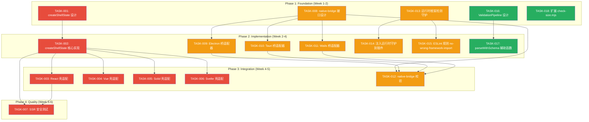

现在我对代码库的五个方向有了完整的理解，可以给出分析。下面是结构化的 Tech Lead 分析：

---

# Tech Lead 分析：五个架构方向

## 1. 任务分解

五个方向共拆解为 **18 个可执行任务**，每个 2-6 小时，并按逻辑分组。

### 方向一：Shell 状态管理统一（P1）

| 任务 ID  | 标题                                    | 涉及文件                                                            | 前置依赖 | 工时 |
| -------- | --------------------------------------- | ------------------------------------------------------------------- | -------- | ---- |
| TASK-001 | 设计 `createShellState()` 工厂接口      | `packages/core/src/shell.ts` (新)                                   | 无       | 3h   |
| TASK-002 | 实现 `createShellState()` 核心          | `packages/core/src/shell.ts`                                        | TASK-001 | 4h   |
| TASK-003 | React 壳适配 `createShellState()`       | `apps/desktop-os/src/App.tsx`, `apps/desktop-os/src/shell.tsx`      | TASK-002 | 3h   |
| TASK-004 | Vue 壳适配 `createShellState()`         | `apps/desktop-os-vue/src/wm.ts`, `apps/desktop-os-vue/src/shell.ts` | TASK-002 | 2h   |
| TASK-005 | Solid 壳适配 `createShellState()`       | `apps/desktop-os-solid/src/wm.tsx`                                  | TASK-002 | 2h   |
| TASK-006 | Svelte 壳适配 `createShellState()`      | `apps/desktop-os-svelte/src/wm.svelte.ts`                           | TASK-002 | 2h   |
| TASK-007 | 为 `createShellState` 添加 SSR 安全测试 | `packages/core/src/shell.test.ts` (新)                              | TASK-002 | 2h   |

### 方向二：原生桥共享协议（P1-P2）

| 任务 ID  | 标题                                                 | 涉及文件                                                                                 | 前置依赖                               | 工时 |
| -------- | ---------------------------------------------------- | ---------------------------------------------------------------------------------------- | -------------------------------------- | ---- |
| TASK-008 | 设计 `@iris-ui/native-bridge` 接口 + TypeScript 类型 | `packages/native-bridge/src/index.ts` (新), `packages/native-bridge/package.json` (新)   | 无                                     | 4h   |
| TASK-009 | 为 Electron 实现桥适配器                             | `packages/native-bridge/src/electron.ts`, `apps/desktop/preload.js` (修改)               | TASK-008                               | 3h   |
| TASK-010 | 为 Tauri 实现桥适配器                                | `packages/native-bridge/src/tauri.ts`, `apps/desktop-tauri/src-tauri/src/main.rs` (修改) | TASK-008                               | 4h   |
| TASK-011 | 为 Wails 实现桥适配器                                | `packages/native-bridge/src/wails.ts`, `apps/desktop-wails/app.go` (修改)                | TASK-008                               | 3h   |
| TASK-012 | 添加 `check-desktop-parity.mjs` 原生桥 API 校验      | `scripts/check-desktop-parity.mjs`                                                       | TASK-008, TASK-009, TASK-010, TASK-011 | 2h   |

### 方向三：插件跨框架校验（P2）

| 任务 ID  | 标题                                                   | 涉及文件                                                                    | 前置依赖 | 工时 |
| -------- | ------------------------------------------------------ | --------------------------------------------------------------------------- | -------- | ---- |
| TASK-013 | 添加运行时框架检测守护（`import-meta-check` 辅助函数） | `packages/core/src/plugin/guards.ts` (新)                                   | 无       | 2h   |
| TASK-014 | 为所有 12 个插件注入运行时守护                         | 每个插件的 `src/react/index.ts`, `src/vue/index.ts` 等（共 ~48 个入口文件） | TASK-013 | 4h   |
| TASK-015 | 添加 ESLint 规则 `no-wrong-framework-import`           | `packages/eslint-plugin/src/rules/no-wrong-framework-import.ts`             | 无       | 3h   |

### 方向四：表单验证统一（P2-P3）

| 任务 ID  | 标题                                                                         | 涉及文件                                                                               | 前置依赖 | 工时 |
| -------- | ---------------------------------------------------------------------------- | -------------------------------------------------------------------------------------- | -------- | ---- |
| TASK-016 | 设计并实现 `ValidationPipeline` API，统一 `validators` + `validate` + schema | `packages/core/src/form/validation-pipeline.ts` (新)，重构 `packages/core/src/form.ts` | 无       | 6h   |
| TASK-017 | 添加 `parseWithSchema` 辅助函数，保留 transform 值                           | `packages/core/src/standard-schema.ts`                                                 | TASK-016 | 3h   |

### 方向五：插件 Size Budget（P3）

| 任务 ID  | 标题                               | 涉及文件                                               | 前置依赖 | 工时 |
| -------- | ---------------------------------- | ------------------------------------------------------ | -------- | ---- |
| TASK-018 | 扩展 `check-size.mjs` 以包含插件包 | `scripts/check-size.mjs`, `scripts/size-baseline.json` | 无       | 3h   |

---

## 2. 执行顺序



**并行执行组：**

| 组                 | 任务                                             | 理由                                                         |
| ------------------ | ------------------------------------------------ | ------------------------------------------------------------ |
| **A**（独立发现）  | TASK-001, TASK-008, TASK-013, TASK-016, TASK-018 | 五个方向互不依赖；设计与初步实现并行。                       |
| **B**（Core 实现） | TASK-002, TASK-009, TASK-010, TASK-011           | `createShellState` core 与三个原生桥适配器互不依赖，可并行。 |
| **C**（轻量守护）  | TASK-014, TASK-015                               | 运行时守护与 ESLint 规则不同工具链，互不依赖。               |
| **D**（壳适配）    | TASK-003, TASK-004, TASK-005, TASK-006           | 四个框架壳改造完全独立，可并行分配给不同开发者。             |

---

## 3. 技术风险

### 3.1 高风险项

| 风险                                                                                                                                                                | 影响方向 | 可能性 | 影响 | 缓解策略                                                                                                                                   |
| ------------------------------------------------------------------------------------------------------------------------------------------------------------------- | -------- | ------ | ---- | ------------------------------------------------------------------------------------------------------------------------------------------ |
| **`createShellState` 统一工厂泄漏抽象**——四个壳有不同的生命周期钩子（React effects vs Solid cleanup vs Svelte `$effect`），一个共享工厂可能迫使所有壳接受非惯用模式 | 方向一   | 中     | 高   | 工厂只返回普通 store + 生命周期无关的 API；壳将订阅/清理留在适配器侧。在 TASK-001 中，将精确映射每个壳的惯用用法，确保工厂不规定生命周期。 |
| **Tauri `inject_bridge()` 安全模型不兼容**——Tauri v2 的 CSP 可能阻止内联 `<script>` 注入，需要改为 IPC 前置加载方法                                                 | 方向二   | 中     | 高   | TASK-010 将首先验证 Tauri v2 约束；若 CSP 阻塞，则回退至 `withGlobalTauri` IPC 包装器。                                                    |
| **Svelte 插件包运行时守护被编译器剥离**——`if (typeof React === 'undefined')` 检查在 Svelte 构建中可能被摇掉                                                         | 方向三   | 低     | 中   | 守卫必须产生副作用（如 `console.warn`），且入口为 side-effectful import。在 TASK-013 中，对 Svelte 入口进行 esbuild 输出检查。             |
| **`ValidationPipeline` 向后兼容性破坏**——任何 `FormConfig` 或 `FormStore` 签名更改都属于破坏性变更                                                                  | 方向四   | 低     | 高   | TASK-016 严格保持 `FormConfig` 接口不变；`ValidationPipeline` 是可选加法，而非替代。`validators` + `validate` 路径仍按原样工作。           |

### 3.2 低风险项

| 风险                                                                    | 影响方向 | 缓解                                                                                                   |
| ----------------------------------------------------------------------- | -------- | ------------------------------------------------------------------------------------------------------ |
| **插件大小超预算**，因为 CodeMirror 语言支持被错误地包含在内            | 方向五   | `check-size.mjs` 在大小检查前已经 `external` CodeMirror（已确认）。                                    |
| **SSR 测试失败**，因为 `createShellState` 工厂引用了 `localStorage`     | 方向一   | 工厂接受可选的 `storage` 参数（类似 `UserProfile`）；SSR 测试注入内存存储。                            |
| **ESLint 规则无法解析所有导入路径**，因为 monorepo 中使用了 TS 路径映射 | 方向三   | ESLint 规则仅校验 `from '@iris-ui/plugin-*/{react,vue,solid,svelte}'` 字面量，不与 tsconfig 解析交互。 |

### 3.3 性能与规模

- `createShellState` 对性能影响为零：它只是当前 5 个独立工厂调用的组合，加上一个轻量级 store 对象。
- `native-bridge` 包大小必须紧凑（≤ 2KB gzip）：它只包含接口 + 每个适配器一个薄封装。
- `ValidationPipeline` 仅在表单创建时构建一次，无运行时开销。

---

## 4. 资源评估

### 4.1 人员

| 角色               | 所需技能                               | 所需数量 | 主要任务                                         |
| ------------------ | -------------------------------------- | -------- | ------------------------------------------------ |
| **Core 工程师**    | TypeScript, 状态机/ store 设计, SSR    | 1        | TASK-001, TASK-002, TASK-007, TASK-016, TASK-017 |
| **Web 壳工程师**   | React, Vue, Solid, Svelte（至少 2 个） | 2        | TASK-003, TASK-004, TASK-005, TASK-006           |
| **原生桌面工程师** | Electron, Tauri (Rust), Wails (Go)     | 1-2      | TASK-008, TASK-009, TASK-010, TASK-011, TASK-012 |
| **DevEx 工程师**   | ESLint 插件开发, 构建工具              | 1        | TASK-013, TASK-014, TASK-015, TASK-018           |

**最佳配置**：3 名工程师全职，工期 6 周。或者 2 名工程师全职 + 1 名兼职原生桌面工程师。

### 4.2 里程碑

| 里程碑             | 截止日期  | 可交付物                                                                                 | 验收标准                                                                           |
| ------------------ | --------- | ---------------------------------------------------------------------------------------- | ---------------------------------------------------------------------------------- |
| **M1** (设计冻结)  | 第 1 周末 | 所有五个方向的接口/类型设计文档已审查并合并                                              | core 工程师、原生工程师、壳工程师均签署同意。                                      |
| **M2** (Core 冻结) | 第 3 周末 | `createShellState`, `native-bridge` 类型, `ValidationPipeline`, 运行时守卫均已实现并测试 | 核心测试覆盖 > 90%；构建通过。                                                     |
| **M3** (壳冻结)    | 第 5 周末 | 所有四个框架壳均已改造；所有三个原生桥均已适配；ESLint 规则已添加                        | `pnpm turbo run test typecheck lint build` 全绿；`check-desktop-parity.mjs` 通过。 |
| **M4** (发布就绪)  | 第 6 周末 | 所有质量门禁通过；`pnpm size` 包含插件；changesets 已生成                                | 无回归；演示应用在所有四个壳 + 三个原生目标上运行。                                |

### 4.3 阻塞点

| 阻塞点                                              | 方向   | 关键截止日期 | 解决策略                                                                                          |
| --------------------------------------------------- | ------ | ------------ | ------------------------------------------------------------------------------------------------- |
| Tauri v2 的 `inject_bridge()` CSP 冲突              | 方向二 | 第 2 周末    | 替代方案：IPC 包装器 + Rust 端 `#[tauri::command]`，无需 HTML 注入。                              |
| Svelte 5 rune 编译器中 `$state` 变量名冲突          | 方向一 | 第 3 周末    | 已在 AGENTS.md 中记录：不在 Svelte 中命名 `$state` 变量为 `state`。在 TASK-006 的代码审查中执行。 |
| `ValidationPipeline` 与现有 `FormConfig` 接口的交互 | 方向四 | 第 2 周末    | 不更改 `FormConfig`；仅新增可选的 `ValidationPipeline` 配置键。                                   |

---

## 5. 质量保证

### 5.1 单元测试覆盖要求

| 方向       | 需要新测试的文件                                                     | 最低覆盖率 | 关键测试场景                                                                                    |
| ---------- | -------------------------------------------------------------------- | ---------- | ----------------------------------------------------------------------------------------------- |
| **方向一** | `packages/core/src/shell.test.ts`                                    | 95%        | 创建 + getState + subscribe + SSR (`// @vitest-environment node`) + 多个实例隔离 + 测试间重置。 |
| **方向二** | `packages/native-bridge/src/*.test.ts`                               | 90%        | 每个适配器测试 `saveFile` + `writeClipboard` + `platform` 检测 + 缺失桥时的降级。               |
| **方向三** | `packages/eslint-plugin/src/rules/no-wrong-framework-import.test.ts` | 95%        | 正确/错误用例 + Svelte 特例 + 自动修复。                                                        |
| **方向四** | `packages/core/src/form/validation-pipeline.test.ts`                 | 90%        | 管道组合 + 与 `validators` map 交互 + 与 `validate` 函数交互 + 异步 + transform 保留。          |

### 5.2 集成测试策略

| 测试类型       | 目标                                  | 工具                                        | 触发时机          |
| -------------- | ------------------------------------- | ------------------------------------------- | ----------------- |
| **壳集成**     | 四个 Desktop-OS 壳 + 原生桥均正确渲染 | `pnpm turbo run test --filter=*desktop-os*` | 每个 PR           |
| **桌面奇偶性** | 四个壳在目录/功能/原生桥 API 方面一致 | `node scripts/check-desktop-parity.mjs`     | 每个 PR + CI      |
| **插件跨框架** | 跨框架间接导入包含运行时守卫警告      | 在每个插件目录中创建手动 Smoke 测试         | 每个 PR           |
| **SSR 安全性** | 所有新 core 功能在 Node 环境中不崩溃  | `// @vitest-environment node`               | 每个 PR           |
| **大小预算**   | 所有包（包括插件）在 gzip 限制内      | `pnpm size`                                 | 每个 PR + nightly |

### 5.3 代码审查要点

| 审查重点     | 方向       | 需要检查的具体内容                                                                                                                 |
| ------------ | ---------- | ---------------------------------------------------------------------------------------------------------------------------------- |
| **SSR 安全** | 方向一, 四 | 所有入口文件必须包含 `'use client'`；无模块级 `window/document` 引用；`useId` 而非计数器。                                         |
| **框架桥接** | 方向一     | `createShellState().subscribe` 必须与 `useSyncExternalStore` / Vue `watch` / Solid `createSignal` / Svelte `$effect` 正确连接。    |
| **安全模型** | 方向二     | Tauri 桥不得使用 `innerHTML` 注入；Electron `contextBridge` 必须保持有限 API。Wails binding 必须清理文件名。                       |
| **构建产物** | 方向三, 五 | 检查 `tsup.config.ts` 输出正确数量的入口（每个框架 1 个）；`package.json` `exports` 映射所有子路径；`sideEffects` 标记确保可摇树。 |
| **向后兼容** | 方向四     | `FormConfig` 未经修改；`validators` + `validate` 路径行为 100% 不变。                                                              |

### 5.4 性能测试需求

| 测试                          | 方向   | 关注点                                                      | 基准         |
| ----------------------------- | ------ | ----------------------------------------------------------- | ------------ |
| `createShellState` 初始化时间 | 方向一 | 5 个引擎工厂 + store 合并                                   | < 1ms        |
| 原生桥延迟                    | 方向二 | 从 `window.irisNative.saveFile()` 到原生对话框的往返        | < 50ms       |
| 验证管道构建开销              | 方向四 | 包含 3 个步骤的管道构建 vs 单独的 `validators` + `validate` | < 0.5ms 差异 |
| 插件包 gzip 大小              | 方向五 | 每个插件的 `dist/react/index.js` 等                         | 参阅预算表   |

---

## 6. 实施计划

### 阶段 1：基础设施搭建（第 1 周）

```
周一   周二   周三   周四   周五
──────────────────────────────────────────────
T1设计  T8设计  T13    T16    T18
                 守卫    管道    size
                 原型    设计   budget
```

**第 1 周交付物：**

- `createShellState` 接口签署完成
- `@iris-ui/native-bridge` 类型签署完成
- `packages/core/src/plugin/guards.ts` 初版
- `ValidationPipeline` API 设计文档
- `check-size.mjs` 插件块扩展

**依赖项：** 无。所有设计任务并行。

### 阶段 2：Core 功能实现（第 2-3 周）

```
周一-周二    周三-周四    周四-周五    周一-周三    周四-周五
──────────────────────────────────────────────────────────────────
T2           T9           T10          T11          T14+T15
createShell  Electron桥    Tauri桥      Wails桥      守护+
State core                                           ESLint规则
```

**第 2-3 周交付物：**

- `createShellState` 已实现并测试（SSR 安全测试通过）
- 三个原生桥适配器全部实现
- 运行时框架守卫注入所有 12 个插件（48 个入口）
- ESLint 规则 `no-wrong-framework-import` 已实现并测试

**关键整合点：** 第 2 周末的设计评审，确保 TASK-008 接口与三适配器实现一致。

### 阶段 3：壳改造与集成（第 4-5 周）

```
周一    周二    周三    周四    周五
──────────────────────────────────────────────
T3      T4      T5      T6      T12+T17
React   Vue     Solid   Svelte  原生桥校验+
壳       壳       壳       壳       parseWithSchema
```

**第 4-5 周交付物：**

- 四个 Desktop-OS 壳全部参照 React 参考实现
- 所有四个壳上 `pnpm turbo run dev` 均可正常运行
- `check-desktop-parity.mjs` 现在也验证原生桥 API
- `parseWithSchema` 辅助函数可用

**关键整合点：** 第 4 周末的跨框架回归测试——运行 `pnpm turbo run test typecheck lint build`，所有四个壳通过。

### 阶段 4：质量门禁与发布准备（第 6 周）

```
周一-周二          周三-周四          周五
──────────────────────────────────────────────────
T7                回归测试            发布准备
SSR 安全测试      size budget         changesets
                  端到端 smoke
```

**第 6 周交付物：**

- 所有新 core 功能的 SSR 安全测试
- `pnpm size` 包含插件，预算已提交
- Changesets 已生成（5 个方向全部为次要版本——非破坏性加法）
- 最终 PR 审查 + 合并

**"完成"的定义：**

- ✅ `pnpm turbo run test typecheck lint build` 通过
- ✅ `pnpm size` 通过（含插件）
- ✅ `node scripts/check-desktop-parity.mjs` 通过
- ✅ 四个壳上 Desktop-OS 演示正常运行
- ✅ 无破坏性 API 变更（已验证）
- ✅ Venia 批准的 changesets

---

## 总结：执行建议

### 优先级执行路线图

| 阶段                    | 方向                                               | 合理性                                                   | 投入                         |
| ----------------------- | -------------------------------------------------- | -------------------------------------------------------- | ---------------------------- |
| **立即启动（第 1 周）** | 方向一 (`createShellState`) + 方向五 (size budget) | 方向一风险最低、影响最大；方向五耗时最少、无风险。       | 1 人 × 1 周                  |
| **并行（第 2-3 周）**   | 方向二 (native-bridge) + 方向三 (插件守卫)         | 方向二需要原生专业知识但影响隔离；方向三是轻量级安全网。 | 2 人 × 2 周                  |
| **完善（第 4-6 周）**   | 方向四 (ValidationPipeline)                        | API 设计最复杂；风险最低，因为向后兼容可以 100% 保持。   | 1 人 × 2 周（第 4-5 周插空） |

### 成本估算

| 方向                | 总工时  | 复杂度 | 风险调整                  |
| ------------------- | ------- | ------ | ------------------------- |
| 方向一：Shell 状态  | 18h     | 中     | +4h SSR 安全              |
| 方向二：原生桥      | 16h     | 高     | +4h Tauri v2 兼容性       |
| 方向三：插件守卫    | 9h      | 低     | +2h Svelte 构建验证       |
| 方向四：验证管道    | 9h      | 中     | +3h 向后兼容测试          |
| 方向五：Size Budget | 3h      | 低     | +1h 基线设置              |
| **总计**            | **55h** |        | **+14h 风险缓冲区 = 69h** |

假设每人每周 30h 有效产出，**概算 = 2.3 人周 ≈ 1 名全职工程师 2.5 周，或 3 名工程师 1 周**。

### 最终建议

1. **立即开始 TASK-018**（size budget）——3 小时，无风险，立即可用。
2. **将 TASK-001（设计）+ TASK-002（实现）作为第 1 周的冲刺目标**——方向一影响最大，且设计已基本明确。
3. **将方向二（原生桥）安排在第 2-3 周**，并安排具有 Rust/Go 经验的开发人员。Tauri v2 CSP 是最重大的未知因素——第 2 天进行技术实测。
4. **将方向三（守卫）安排为备用任务**——可由初级开发人员在指导下完成。
5. **将方向四（管道）延后至第 4-5 周**——最复杂的设计；需要最多审查迭代。在阶段 3 可以轻松由核心工程师插空完成。
