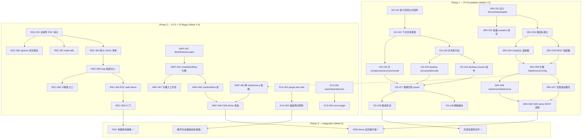
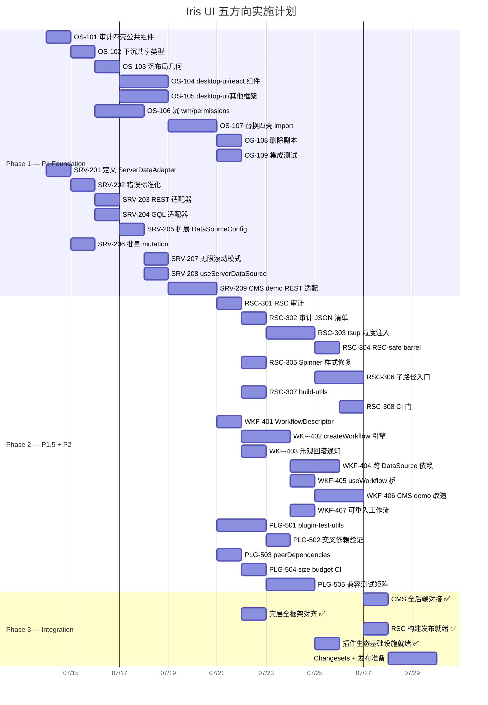

现在我已有足够的信息。以下是完整的 Tech Lead 分析报告。

---

# Tech Lead 分析：五方向执行计划

> **文档基于**: `docs/requirements/2026-07-11-full-library-source-scan-five-high-value-extension-directions.out.md`  
> **日期**: 2026-07-12  
> **角色**: Tech Lead  
> **范围**: 分解 → 依赖图 → 风险 → 资源 → 质量 → 时间线

---

## 1. 任务分解

按审核修正后的优先级组织（P1 → P1.5 → P2）。每个任务 2–4 小时。

### 1.1 方向 ①：OS 壳层下沉（P1）

| ID     | 标题                                                                                               | 文件                                                                          | 前置                   | 工时      |
| ------ | -------------------------------------------------------------------------------------------------- | ----------------------------------------------------------------------------- | ---------------------- | --------- |
| OS-101 | **审计四壳的公共组件清单 + 精确交集**                                                              | `apps/desktop-os-{react,solid,svelte,vue}/src/`                               | —                      | 3h        |
| OS-102 | **下沉共享类型到 `@iris-ui/desktop-ui/core`**                                                      | `packages/desktop-ui/core/src/{os,snap,bar}.ts`                               | OS-101                 | 4h        |
| OS-103 | **下沉壳布局几何（snapRect, barInsets, snapZones）**                                               | `packages/desktop-ui/core/src/layout.ts`                                      | OS-102                 | 3h        |
| OS-104 | **创建 `@iris-ui/desktop-ui/react` 桥接（WindowFrame, Taskbar, Dock, SnapPreview, Pager）**        | `packages/desktop-ui/react/src/{WindowFrame,Taskbar,Dock,SnapPreview,Pager}/` | OS-103                 | 4h        |
| OS-105 | **创建 `@iris-ui/desktop-ui/{vue,solid,svelte}` 桥接**                                             | 对应框架适配器目录                                                            | OS-103                 | 3h×3 = 9h |
| OS-106 | **将 `wm.ts`/`permissions.ts`/`commands.ts`/`remoteApp.ts`/`planner.ts` 下沉到 `desktop-ui/core`** | `packages/desktop-ui/core/src/{wm,permissions,commands,remoteApp,planner}.ts` | OS-102                 | 4h        |
| OS-107 | **替换四壳 import 路径指向 `@iris-ui/desktop-ui`**                                                 | 四壳组件文件                                                                  | OS-104, OS-105, OS-106 | 4h        |
| OS-108 | **删除壳层副本（验证 CI 全绿后）**                                                                 | 四壳重复组件文件                                                              | OS-107                 | 2h        |
| OS-109 | **四壳集成测试 + 回归基线**                                                                        | `packages/desktop-ui/{core,react}/__tests__/`                                 | OS-107                 | 4h        |

### 1.2 方向 ③：服务端数据协议（P1）

| ID      | 标题                                                                     | 文件                                                     | 前置             | 工时 |
| ------- | ------------------------------------------------------------------------ | -------------------------------------------------------- | ---------------- | ---- |
| SRV-201 | **定义 `ServerDataAdapter` 接口**                                        | `packages/core/src/data-source/server-adapter.ts`        | —                | 3h   |
| SRV-202 | **定义错误标准化 `DataSourceError`（网络/业务/校验/认证）**              | `packages/core/src/data-source/server-adapter.ts`        | SRV-201          | 2h   |
| SRV-203 | **实现 REST 适配器**                                                     | `packages/core/src/data-source/adapters/rest-adapter.ts` | SRV-202          | 4h   |
| SRV-204 | **实现 GraphQL 适配器**                                                  | `packages/core/src/data-source/adapters/gql-adapter.ts`  | SRV-202          | 4h   |
| SRV-205 | **扩展 `DataSourceConfig` 接受 `ServerDataAdapter`**                     | `packages/core/src/data-source/types.ts`                 | SRV-201          | 2h   |
| SRV-206 | **添加批量 mutation 端点协议（batchDelete, batchUpdate, batchCreate）**  | `packages/core/src/data-source/server-adapter.ts`        | SRV-201          | 3h   |
| SRV-207 | **无限滚动模式（total=-1）+ 对应 demo**                                  | `packages/core/src/data-source.ts` + `apps/cms*/`        | SRV-205          | 3h   |
| SRV-208 | **React 桥 `useServerDataSource` + 测试**                                | `packages/react/src/data/useServerDataSource.ts`         | SRV-205          | 3h   |
| SRV-209 | **CMS demo REST 适配（替换内存 `createClientFetcher` 为实际 API 调用）** | `apps/cms-*/src/data/users.ts` 等                        | SRV-203, SRV-208 | 4h   |

### 1.3 方向 ⑤：RSC 构建策略（P1.5）

| ID      | 标题                                                               | 文件                                           | 前置    | 工时 |
| ------- | ------------------------------------------------------------------ | ---------------------------------------------- | ------- | ---- |
| RSC-301 | **RSC 审计：遍历四框架 barrel，分类所有组件为 client/server/stub** | `packages/{react,vue,solid,svelte}/src/`       | —       | 4h   |
| RSC-302 | **创建 RSC 审计 JSON 清单（CI 可读 + 可断言）**                    | `packages/react/rsc-audit.json`                | RSC-301 | 2h   |
| RSC-303 | **按入口粒度拆分 tsup `'use client'` 注入**                        | `packages/react/tsup.config.ts`                | RSC-301 | 4h   |
| RSC-304 | **为纯展示组件创建 RSC-safe barrel（无 `'use client'`）**          | `packages/react/src/rsc/`                      | RSC-303 | 3h   |
| RSC-305 | **修复 `IrisSpinner` 样式注入用 CSS module 替换 `useEffect`**      | `packages/react/src/primitives/spinner/`       | RSC-301 | 2h   |
| RSC-306 | **子路径入口改造（layouts/container, layouts/stack, ...）**        | `packages/react/tsup.config.ts` + 组件目录调整 | RSC-303 | 4h   |
| RSC-307 | **创建 `@iris-ui/build-utils`（跨框架 RSC 标记工具）**             | `packages/build-utils/src/rsc.ts`              | RSC-301 | 3h   |
| RSC-308 | **RSC CI 门：验证纯组件不引入 `'use client'`**                     | `scripts/check-rsc-directive.mjs` 增强         | RSC-302 | 2h   |

### 1.4 方向 ④：跨组件编排（P2）

| ID      | 标题                                                               | 文件                                                                  | 前置             | 工时 |
| ------- | ------------------------------------------------------------------ | --------------------------------------------------------------------- | ---------------- | ---- |
| WKF-401 | **定义 `WorkflowDescriptor` 类型 + 步骤 DSL**                      | `packages/core/src/workflow/types.ts`                                 | —                | 3h   |
| WKF-402 | **实现 `createWorkflow` 引擎（线性步骤 + 条件步骤 + 上下文传递）** | `packages/core/src/workflow/engine.ts`                                | WKF-401          | 4h   |
| WKF-403 | **乐观更新回滚通告机制（`onRollback` 回调）**                      | `packages/core/src/data-source.ts`                                    | —                | 3h   |
| WKF-404 | **跨 DataSource 依赖协议 + 级联回滚**                              | `packages/core/src/data-source/dependency.ts`                         | SRV-205          | 4h   |
| WKF-405 | **React 桥 `useWorkflow` + `WorkflowProvider`**                    | `packages/react/src/workflow/useWorkflow.ts` + `WorkflowProvider.tsx` | WKF-402          | 3h   |
| WKF-406 | **CMS demo 改造：用 `WorkflowDescriptor` 替换手写创建→通知→跳转**  | `apps/cms-*/src/pages/UsersPage.tsx`                                  | WKF-405, SRV-209 | 4h   |
| WKF-407 | **可重入工作流（取消→回退上一步）**                                | `packages/core/src/workflow/engine.ts`                                | WKF-402          | 3h   |

### 1.5 方向 ②：插件基础设施（P2）

| ID      | 标题                                                              | 文件                                                                | 前置    | 工时 |
| ------- | ----------------------------------------------------------------- | ------------------------------------------------------------------- | ------- | ---- |
| PLG-501 | **创建 `@iris-ui/plugin-test-utils` + `createPluginTestHarness`** | `packages/plugin-test-utils/src/index.ts`                           | —       | 4h   |
| PLG-502 | **验证插件交叉依赖（form-builder + editor 组合）**                | `packages/plugin-form-builder/src/` + `packages/plugin-editor/src/` | —       | 3h   |
| PLG-503 | **为所有插件添加 `peerDependencies` 版本范围**                    | 全部 12 个 `packages/plugin-*/package.json`                         | —       | 2h   |
| PLG-504 | **插件 size budget CI 门（core 5KB, 每框架适配器 3KB）**          | `scripts/size-budget.mjs` + 各 plugin `package.json`                | —       | 3h   |
| PLG-505 | **插件版本兼容性测试矩阵（core v0.1.x vs v0.2.x）**               | `packages/plugin-test-utils/src/compatibility.ts`                   | PLG-501 | 4h   |

---

## 2. 执行顺序与依赖图



### 可并行执行组

| 并行组               | 任务                                               | 需人力                                |
| -------------------- | -------------------------------------------------- | ------------------------------------- |
| **G1 壳层骨架**      | OS-101 → OS-102 → OS-103                           | 1 人                                  |
| **G2 数据协议**      | SRV-201 → SRV-202 → SRV-203\|SRV-204               | 1 人（或 2 人并行 REST/GQL）          |
| **G3 壳层适配器**    | OS-104 + OS-105 + OS-106（G1 完成后）              | 2–3 人（react/vue/solid/svelte 分人） |
| **G4 RSC 审计**      | RSC-301 → RSC-302 + RSC-307                        | 1 人                                  |
| **G5 插件工具**      | PLG-501 + PLG-503                                  | 1 人                                  |
| **G6 Workflow 设计** | WKF-401 → WKF-402（依赖 SRV-205 必须先于 WKF-404） | 1 人                                  |

---

## 3. 技术风险

### 3.1 高风险（需早期缓解）

| 风险                                    | 方向 | 描述                                                                                                               | 缓解策略                                                                                                                                    |
| --------------------------------------- | ---- | ------------------------------------------------------------------------------------------------------------------ | ------------------------------------------------------------------------------------------------------------------------------------------- |
| **壳层解耦导致 4× 回归**                | ①    | 四壳各有独特 app（Calculator/Terminal/Settings），下沉后可能破坏壳独有功能。Solid 壳多 6 个内置 app 不在其他壳存在 | 1) PHASED 下沉——先沉共享类型 + 布局，再沉公共组件，最后逐个置换 import<br>2) 每个壳独立 CI 门<br>3) 独有 app 不沉——只沉公共组件             |
| **RSC 拆分后的 barrel 破坏现有 import** | ⑤    | 如果 barrels 改子路径，所有 `@iris-ui/react` 内部 import 链断裂                                                    | 1) 保持现有 barrel 不变（全 client）<br>2) 仅新加 `@iris-ui/react/rsc/` 子路径<br>3) 提供 codemod 脚本                                      |
| **服务端数据协议版本化**                | ③    | REST/GraphQL 适配器刚发布时，实际后端协议五花八门，可能适配器写太多                                                | 1) 先发布接口 `ServerDataAdapter` 让用户自实现<br>2) 内置 REST 适配器只 handle 80% case<br>3) 文档 + 示例                                   |
| **Workflow 引擎过度设计**               | ④    | `WorkflowDescriptor` 与 `createResourceController` 功能边界模糊——可能导致两种写法做同一件事                        | 1) 先写 **使用场景文档**（3 个真实场景：创建→通知→跳转、选中→批量删除→确认、表格→编辑抽屉→同步）<br>2) 仅覆盖这 3 场景<br>3) 不做通用状态机 |
| **插件 peerDependencies 范围准确性**    | ②    | 如果设 `^0.1.0` 而 core 实际不兼容 0.2.x，用户会在 npm install 时看到错误                                          | 1) 暂设 `>=0.1.0 <0.3.0`<br>2) 在 CI 中跑版本兼容矩阵（PLG-505）                                                                            |

### 3.2 低风险（需注意）

| 风险                                                                                   | 影响                    | 策略                                                                         |
| -------------------------------------------------------------------------------------- | ----------------------- | ---------------------------------------------------------------------------- |
| `IrisSpinner` 的 `useEffect` 样式注入替换为 CSS module 后，SSR 可能看不到动画 keyframe | 动画 SSR 不可见         | `CSS.supports('animation', '')` 降级——客户端 hydration 后自动生效            |
| Svelte 壳层下沉后重新构建路由                                                          | 无影响                  | Svelte 壳当前 `src/` 目录最少（15 .ts 文件 vs React 壳 12 文件），适配器最轻 |
| 四框架 RSC 语义差异                                                                    | 方向⑤ 仅在 React 有意义 | `build-utils` 仅处理 React 的 `'use client'`；Vue/Solid/Svelte 标记为空壳    |

### 3.3 性能瓶颈

| 场景                                        | 瓶颈                 | 策略                                                                     |
| ------------------------------------------- | -------------------- | ------------------------------------------------------------------------ |
| 壳层下沉后 `@iris-ui/desktop-ui` 额外包体积 | 预期 30-50KB 压缩    | 1) 基准 size budget<br>2) tree-shakable 入口<br>3) 大窗口管理器已 481 行 |
| RSC barrel 拆分后，import 路径变长          | 构建无明显影响       | 仅影响 DX——子路径用 `package.json exports` 保持短别名                    |
| REST 适配器串行请求                         | 批量操作时 waterfall | 1) 批量 mutation 端点协议支持并发<br>2) `AbortSignal` 已有               |

### 3.4 测试覆盖难点

| 难点                                                 | 方向 | 原因                      | 策略                                                                                        |
| ---------------------------------------------------- | ---- | ------------------------- | ------------------------------------------------------------------------------------------- |
| 壳层几何（snapRect）jsdom 无 `getBoundingClientRect` | ①    | 几何计算无法在 jsdom 验证 | 1) 纯数学函数抽到 core → 不依赖 DOM<br>2) 单元测输入→输出<br>3) 集成测试用 Playwright       |
| 服务端适配器需要真实后端                             | ③    | 单元测试不能依赖网络      | 1) 依赖注入 `fetch` → mock<br>2) MSW（Mock Service Worker）拦截<br>3) e2e 测试用测试 server |
| Workflow 可重入 + 乐观回滚                           | ④    | 多步骤状态回滚时序复杂    | 1) core 逻辑深度单元测<br>2) 用 `vi.useFakeTimers` 控制时序                                 |

---

## 4. 资源评估

### 4.1 开发人员需求

| 角色                   | 数量   | 技能要求                        | 负责方向                                                 |
| ---------------------- | ------ | ------------------------------- | -------------------------------------------------------- |
| **Senior Core 工程师** | 1 人   | TS 泛型、状态机、数据结构设计   | ③ 服务端数据协议 + ④ Workflow 引擎 + ② plugin-test-utils |
| **React 框架工程师**   | 1 人   | React hooks、RSC、tsup 构建     | ⑤ RSC 构建 + ① desktop-ui/react 适配器                   |
| **多框架工程师**       | 1 人   | Vue/Solid/Svelte 各框架适配经验 | ① desktop-ui/{vue,solid,svelte} 适配器 + 回归四壳        |
| **QA / 集成工程师**    | 0.5 人 | Vitest, Playwright, CI/pipeline | 集成测试、e2e、CI 门、size budget 自动化                 |

**最优团队**: 2.5 人（1 senior core + 1 senior frontend + 0.5 QA）

### 4.2 关键里程碑

| 里程碑             | 时间            | 交付物                                                   | 验收标准                                                    |
| ------------------ | --------------- | -------------------------------------------------------- | ----------------------------------------------------------- |
| M1 — 壳层基础      | Week 1 (Day 5)  | `@iris-ui/desktop-ui/core` + React 适配器 5 组件         | 共享类型/布局/窗口管理器已下沉，一个壳（React）全部指向新包 |
| M2 — 数据协议就绪  | Week 2 (Day 10) | `ServerDataAdapter` + REST/GraphQL 适配器                | 一个 CMS demo 成功替换 `createClientFetcher` 为 REST 调用   |
| M3 — 四壳对齐      | Week 3 (Day 15) | 四壳全部指向 `@iris-ui/desktop-ui`                       | 四壳 `dev` 全正常，test/lint/build 全绿                     |
| M4 — RSC 拆分      | Week 4 (Day 20) | RSC-safe barrel + 子路径入口 + CI 门                     | `pnpm check:rsc` 通过，纯组件无 `'use client'`              |
| M5 — Workflow 原型 | Week 4 (Day 22) | `createWorkflow` + CMS demo 1 个场景                     | UsersPage 的 create→notify→navigate 替换为声明式            |
| M6 — 插件生态      | Week 5 (Day 25) | plugin-test-utils + peerDependencies + size budget 全 CI | `pnpm test` 涵盖所有 12 插件 + CI size check                |
| M7 — 发布准备      | Week 5 (Day 28) | 全部 PR 合并，changesets，文档更新                       | 可 `pnpm publish` 全部包                                    |

### 4.3 阻塞点与解决策略

| Blockers                                             | 依赖  | 影响         | 策略                                                          |
| ---------------------------------------------------- | ----- | ------------ | ------------------------------------------------------------- |
| `@iris-ui/desktop-ui` 包名是否已注册                 | npm   | M1 发布      | 暂用 `@iris-ui/experimental-desktop-ui`                       |
| SSR 的 `useId` 与窗口管理器状态不兼容                | ① + ⑤ | SSR 渲染窗口 | 窗口管理器只在客户端 mount（`useEffect` guard）               |
| Svelte 的 svelte-package 构建与其他 3 框架 tsup 异构 | ①     | 构建统一     | 保持现有异构（tsup 数组配置 + svelte-package），document 清晰 |
| RSC 审计后 `IrisSpinner` 样式必须改                  | ⑤     | 否则 CI 红   | 提前一周（RSC-305）就修复                                     |

---

## 5. 质量保证

### 5.1 单元测试覆盖要求

| 类别        | 要求                        | 说明                                                                      |
| ----------- | --------------------------- | ------------------------------------------------------------------------- |
| core 新逻辑 | **100% 语句 + 分支**        | `data-source/server-adapter.ts`, `workflow/`、`desktop-ui/core/layout.ts` |
| 框架适配器  | **80%+ 语句**               | 渲染组件、事件绑定、store 订阅                                            |
| 插件        | 维持现有（每插件已有 test） | 新增 plugin-test-utils 应有 90%+                                          |

**必须测的边界：**

- `ServerDataAdapter` 的每个错误类型映射（网络异常→`DataSourceError.network`, 400→validation 等）
- 乐观更新回滚 + `onRollback` 回调
- 壳层 `snapRect`：所有 10 种 snap zone（left/right/top/bottom/4 角/maximize/center）
- 工作流步骤条件执行 + 上下文传递 + 取消→回退

### 5.2 集成测试策略

| 测试套件                              | 范围                                                         | 工具                              | CI 阶段            |
| ------------------------------------- | ------------------------------------------------------------ | --------------------------------- | ------------------ |
| **CIS (Component Integration Suite)** | 每框架 5 个关键组件（Desktop-UI 壳组件 + 数据表格 + 弹出层） | Vitest + jsdom                    | `test:integration` |
| **E2E (Playwright)**                  | 四壳的窗口打开/关闭/拖拽/snap + CMS 的 CRUD 流程             | Playwright                        | `test:e2e`         |
| **RSC 审计 CI**                       | 验证纯展示组件的 barrel 不包含 `'use client'`                | `scripts/check-rsc-directive.mjs` | `check:rsc`        |
| **Size Budget CI**                    | 每个包都在预算内                                             | `scripts/size-budget.mjs`         | `size`             |

### 5.3 代码审查要点

| 方向 | 审查重点                                                                |
| ---- | ----------------------------------------------------------------------- |
| ①    | 四壳是否**真的**指向了新包——而不是 copy/paste 时漏了某个文件            |
| ③    | `ServerDataAdapter` 接口是否太紧（不带 fetch 参数而是传 `AbortSignal`） |
| ⑤    | 纯组件是否**真的**不含 hooks——用 `grep` 确认                            |
| ④    | `WorkflowDescriptor` 是否独立于 `createResourceController`（不是替代）  |
| ②    | peerDependencies 范围是否合理                                           |

### 5.4 性能测试需求

| 关注点                             | 方向 | 指标                                          | 方法                   |
| ---------------------------------- | ---- | --------------------------------------------- | ---------------------- |
| 壳层 bundle 增量                   | ①    | `@iris-ui/desktop-ui/react` ≤ 35KB gzip       | `size` CI 门           |
| REST 适配器首屏时间                | ③    | 首个 CMS 页面 ≤ 200ms TTFB（mock）            | Playwright 性能追踪    |
| RSC 纯组件 bundle 不含 client code | ⑤    | `@iris-ui/react/rsc/container` 无 react hooks | bundle 分析 + CI check |

---

## 6. 实施计划

### 时间线总览（5 周，2.5 人）



### 详细实施阶段

#### 阶段 1：基础设施搭建（第 1 周，7 月 14–18 日）

**目标**: 方向① 壳层基础 + 方向③ 数据协议接口

| 天  | Senior Core (1人)                                         | Senior Frontend (1人)                  | QA (0.5人)       |
| --- | --------------------------------------------------------- | -------------------------------------- | ---------------- |
| D1  | SRV-201 定义 ServerDataAdapter                            | OS-101 审计四壳                        | —                |
| D2  | SRV-202 错误标准化 → SRV-203 REST + SRV-206 批量 mutation | OS-102 下沉共享类型                    | —                |
| D3  | SRV-204 GraphQL + SRV-205 扩展 DataSourceConfig           | OS-103 沉布局几何                      | 审计 CI 准备     |
| D4  | SRV-207 无限滚动模式 + SRV-208                            | OS-104 desktop-ui/react                | 壳层回归测试框架 |
| D5  | SRV-208 完成 → 开始 SRV-209                               | OS-105 desktop-ui/vue + solid + svelte | OS-109 集成测试  |

**里程碑 D5**: `@iris-ui/desktop-ui/core` + React 适配器可用；`ServerDataAdapter` 完成

#### 阶段 2：核心功能实现（第 2–3 周，7 月 21 日–8 月 1 日）

**目标**: 方向⑤ RSC 拆分 + 方向④ 工作流原型 + 方向② 插件生态

| 周  | Senior Core                 | Senior Frontend                       | QA                          |
| --- | --------------------------- | ------------------------------------- | --------------------------- |
| W2  | WKF-401 → WKF-402 → WKF-403 | RSC-301 → RSC-302 → RSC-303 → RSC-305 | PLG-501 + PLG-503           |
| W3  | WKF-404 → WKF-405 → WKF-407 | RSC-304 → RSC-306 → RSC-307 → RSC-308 | PLG-502 + PLG-504 + PLG-505 |

**里程碑 W3 末**: RSC audit CI 门通过；`createWorkflow` 引擎原型；plugin-test-utils 可用

#### 阶段 3：集成测试和优化（第 4 周，8 月 4–8 日）

**目标**: 四壳全部对齐、CMS 对接真实后端、工作流整合到 CMS demo

| 天    | 任务                                                       |
| ----- | ---------------------------------------------------------- |
| D1-D2 | OS-107 替换四壳 import + OS-108 删除副本 + OS-109 完整回归 |
| D2-D3 | WKF-406 CMS demo 工作流改造 + 全后端联调                   |
| D3-D4 | RSC 构建最终验证（release 构建模拟）                       |
| D4-D5 | 全包 size budget + peerDependencies 最终检查 + CI 全绿     |

#### 阶段 4：发布准备（第 5 周，8 月 11–15 日）

| 天  | 任务                                       |
| --- | ------------------------------------------ |
| D1  | Changesets 准备（5 方向各自 change entry） |
| D2  | 文档更新（AGENTS.md, README, VitePress）   |
| D3  | 发布候选包构建 + 两个 demo 环境验证        |
| D4  | 全量 publish（`pnpm publish -r`）          |
| D5  | 缓冲区 / 问题热修复                        |

---

## 总结关键决策点

```
✅ 立即启动（P1）：
  ├─方向① OS 壳层下沉 → 2 人并行（1 core + 1 multi-framework）
  └─方向③ 服务端数据协议 → 1 人（senior core）

⚠️ 下周启动（P1.5）：
  └─方向⑤ RSC 构建策略 → 1 人（senior frontend）

📋 第三周启动（P2）：
  ├─方向④ 跨组件编排 → 依赖方向③ 完成
  └─方向② 插件基础设施 → 独立可并行
```

**不可逆决策点**：

1. `@iris-ui/desktop-ui` 包名的版本锁定 → 决定后不再改名（第 1 周）
2. `ServerDataAdapter` 接口的 `AbortSignal` → 已经在 `DataSourceConfig` 中存在，向后兼容（第 1 周）
3. RSC barrel 改造是保持全 client 还是拆 barrel → 建议保持全 client + 新增 RSC-safe 子路径，这样现有项目无 Breaking Change（第 2 周）
