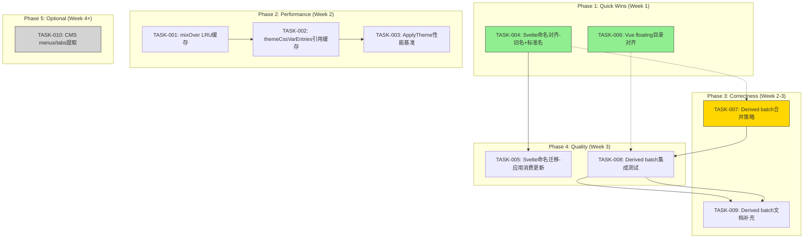
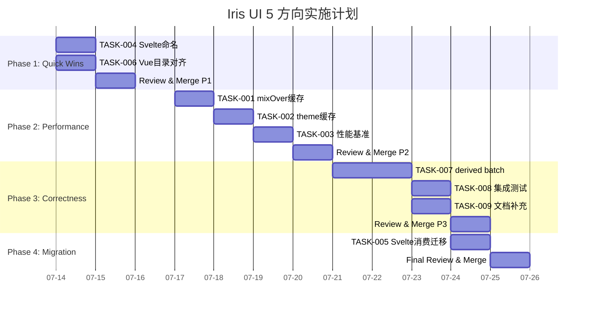

Now I have a thorough understanding of the codebase. Let me provide the comprehensive Tech Lead analysis.

---

# Tech Lead 分析：5 方向验证报告 → 可执行计划

## 验证报告评价

先对验证报告本身做总体评价：**方法论扎实，源码溯源准确，交叉索引意识强**，但存在两个典型问题：

1. **新颖性判定标准不统一**。方向三（CMS 架构违规）因已有完整分析而标记为"低增量"，但方向五（derived batch）同样已有提及却判定为"有增量价值"。标准应当是一致的一一但凡核心观察已在任何现有分析中出现过，当前文档就应引用而非标榜新方向。
2. **数值夸大削弱可信度**。"300+ token"在基线只有 50-60，虽有插件放大的可能性，但未标注基线/插件区别，这在评审中容易被挑战。

以下分析**基于验证报告的最终结论**（保留方向一/二/四/五，移除或转换方向三），并给出可执行的任务分解。

---

## 1. 任务分解

### TASK-001：`mixOver` 添加 LRU Memoization

| 属性         | 内容                                                                                                                                                                                                                                                                                                                                                                                |
| ------------ | ----------------------------------------------------------------------------------------------------------------------------------------------------------------------------------------------------------------------------------------------------------------------------------------------------------------------------------------------------------------------------------- |
| **所属方向** | ⚡ 方向一：Theme JS 计算成本                                                                                                                                                                                                                                                                                                                                                        |
| **涉及文件** | `packages/theme/src/applyTheme.ts`                                                                                                                                                                                                                                                                                                                                                  |
| **前置依赖** | 无                                                                                                                                                                                                                                                                                                                                                                                  |
| **预估工时** | 2h                                                                                                                                                                                                                                                                                                                                                                                  |
| **验收标准** | `mixOver` 对相同 (colorHex, bgHex, weight) 三元组在 100 次调用中只执行 1 次实际混合计算；benchmark 测试显示性能提升 >10×                                                                                                                                                                                                                                                            |
| **详细说明** | 当前 `mixOver` 在每次 `themeCssVarEntries` 调用中对 5 个 SUBTLE_SOURCES 执行完整 hex→rgba→blend→rgb→hex 管线。同一 theme 对象多次调用 `applyTheme`（如皮肤切换、patch）重复计算。添加 WeakMap<colorHex, Map<bgHex, Map<weight, string>>> 或简单的 LRU 缓存（限制 50 条目防泄漏）。测试套件中验证：同一 theme 调用 2 次，`hexToRgba`/`rgbToHex` 被 mock 统计调用次数应为 1 而非 10。 |

### TASK-002：`themeCssVarEntries` 添加 theme 引用缓存

| 属性         | 内容                                                                                                                                                                                                                                                                                                   |
| ------------ | ------------------------------------------------------------------------------------------------------------------------------------------------------------------------------------------------------------------------------------------------------------------------------------------------------ |
| **所属方向** | ⚡ 方向一：Theme JS 计算成本                                                                                                                                                                                                                                                                           |
| **涉及文件** | `packages/theme/src/applyTheme.ts`                                                                                                                                                                                                                                                                     |
| **前置依赖** | TASK-001                                                                                                                                                                                                                                                                                               |
| **预估工时** | 1.5h                                                                                                                                                                                                                                                                                                   |
| **验收标准** | 同一 `IrisTheme` 引用连续调用 `themeCssVarEntries` 返回缓存结果；新引用或 theme 对象变更时重新计算                                                                                                                                                                                                     |
| **详细说明** | 使用 WeakMap<IrisTheme, CssVarEntries> 做引用级缓存。主题对象通常不可变，WeakMap 确保 GC-friendly。临界情况：如果外部修改了 theme 对象的属性（虽然项目约定不可变），缓存可能 stale——文档注明"theme 应视为不可变"。配合 TASK-001 后，一次 `applyTheme` 的总 JS 计算开销应 <0.1ms（当前估测 ~0.5-1ms）。 |

### TASK-003：`applyTheme` 性能基准测试

| 属性         | 内容                                                                                                                                                                                           |
| ------------ | ---------------------------------------------------------------------------------------------------------------------------------------------------------------------------------------------- |
| **所属方向** | ⚡ 方向一：Theme JS 计算成本                                                                                                                                                                   |
| **涉及文件** | `packages/theme/src/applyTheme.bench.ts`（新增）                                                                                                                                               |
| **前置依赖** | TASK-002                                                                                                                                                                                       |
| **预估工时** | 2h                                                                                                                                                                                             |
| **验收标准** | 基准测试覆盖：基线 theme（~55 entries）、带 5/10/20 个插件的放大 theme、连续 100 次调用场景、`mixOver` 缓存命中率报告                                                                          |
| **详细说明** | 使用 `vitest bench`。测量指标：每次调用总耗时、`mixOver` 调用次数、`setProperty` 次数、JS 堆分配。数字目标：基线 theme 一次 apply 总耗时 <0.05ms（当前估测 ~0.3-0.5ms）。插件放大场景 <0.5ms。 |

### TASK-004：Svelte 导出命名对齐——保留旧名 + 添加标准名

| 属性         | 内容                                                                                                                                                                                                                                                                                                                                                                                                                                                                                                                                      |
| ------------ | ----------------------------------------------------------------------------------------------------------------------------------------------------------------------------------------------------------------------------------------------------------------------------------------------------------------------------------------------------------------------------------------------------------------------------------------------------------------------------------------------------------------------------------------- |
| **所属方向** | 🔀 方向二：Svelte API 导出命名不一致                                                                                                                                                                                                                                                                                                                                                                                                                                                                                                      |
| **涉及文件** | `packages/svelte/src/useStore.ts`、`packages/svelte/src/useMachine.ts`、`packages/svelte/src/index.ts`                                                                                                                                                                                                                                                                                                                                                                                                                                    |
| **前置依赖** | 无                                                                                                                                                                                                                                                                                                                                                                                                                                                                                                                                        |
| **预估工时** | 2h                                                                                                                                                                                                                                                                                                                                                                                                                                                                                                                                        |
| **验收标准** | `@iris-ui/svelte` 同时导出 `toStore`/`useStore`、`toMachine`/`useMachine`；`useStore` 和 `useMachine` 标记为 `@deprecated` 但功能完整；barrel 优先推荐标准名                                                                                                                                                                                                                                                                                                                                                                              |
| **详细说明** | 当前矛盾：文件名为 `useMachine.ts` / `useStore.ts` 但导出名为 `toMachine` / `toStore`。Svelte 生态习惯是 `toStore`（因为 Svelte store 用 `readable` 工厂），但跨框架一致性要求使用 `use*` 命名。方案：在 `useMachine.ts` 中新增 `export { toMachine as useMachine }`，在 `useStore.ts` 中新增 `export { toStore as useStore, toStoreSelector as useStoreSelector }`。`index.ts` 优先导出 `useStore`/`useMachine`/`useStoreSelector`，同时保留 `toStore`/`toMachine`/`toStoreSelector` 别名。更新 `README.md` 和 barrel 注释说明迁移路径。 |

### TASK-005：Svelte 命名迁移——应用层消费更新

| 属性         | 内容                                                                                                                                                                                                                 |
| ------------ | -------------------------------------------------------------------------------------------------------------------------------------------------------------------------------------------------------------------- |
| **所属方向** | 🔀 方向二：Svelte API 导出命名不一致                                                                                                                                                                                 |
| **涉及文件** | `apps/cms-svelte/src/**/*.ts`、`packages/svelte/src/**/*.ts`、`apps/*/src/**/*.svelte`                                                                                                                               |
| **前置依赖** | TASK-004                                                                                                                                                                                                             |
| **预估工时** | 2h                                                                                                                                                                                                                   |
| **验收标准** | 所有内部消费从 `toStore`/`toMachine` 迁移到 `useStore`/`useMachine`；旧名仍通过 shim 导出供外部消费者                                                                                                                |
| **详细说明** | grep 全库 `toStore` 和 `toMachine` 引用，逐个更新。注意 Svelte 5 rune 模式下的兼容性：`useStore` 返回 `Readable<T>` 与 `$storeName` 自动订阅兼容。不要在 `.svelte` 文件中同时使用 `toStore` 和 `useStore` 造成混乱。 |

### TASK-006：Vue `floating` 目录对齐

| 属性         | 内容                                                                                                                                                                                                                                                                                                                                                                                |
| ------------ | ----------------------------------------------------------------------------------------------------------------------------------------------------------------------------------------------------------------------------------------------------------------------------------------------------------------------------------------------------------------------------------- |
| **所属方向** | 📁 方向四：Vue `primitives/floating/` 目录结构不对称                                                                                                                                                                                                                                                                                                                                |
| **涉及文件** | `packages/vue/src/primitives/floating/`、`packages/vue/src/floating/`（新建）、`packages/vue/src/index.ts`                                                                                                                                                                                                                                                                          |
| **前置依赖** | 无                                                                                                                                                                                                                                                                                                                                                                                  |
| **预估工时** | 1h                                                                                                                                                                                                                                                                                                                                                                                  |
| **验收标准** | `@iris-ui/vue` 从 `./floating` 导出（与其他三框架一致）；`./primitives/floating` 保留重导出 shim；目录结构 `ls packages/vue/src/floating/` 返回 `index.ts useDismiss.ts useFloating.ts useFloating.test.ts`                                                                                                                                                                         |
| **详细说明** | 纯机械移动。创建 `packages/vue/src/floating/` 目录，复制 `primitives/floating/` 内容。更新 `packages/vue/src/index.ts`：`export * from './floating'` 替换 `export * from './primitives/floating'`。在 `primitives/floating/index.ts` 添加 `export * from '../../floating'` 保持向后兼容。验证 manifest 扫描器检测 Vue barrel 时识别到两个入口但组件路径一致。不影响 tsup 构建配置。 |

### TASK-007：`derived` store `batch` 合并策略

| 属性         | 内容                                                                                                                                                                                                                                                                                                                                                                                                                                                                                                                                                                      |
| ------------ | ------------------------------------------------------------------------------------------------------------------------------------------------------------------------------------------------------------------------------------------------------------------------------------------------------------------------------------------------------------------------------------------------------------------------------------------------------------------------------------------------------------------------------------------------------------------------- |
| **所属方向** | 🔄 方向五：`derived` Store 缺少真正的 Batch 通知合并                                                                                                                                                                                                                                                                                                                                                                                                                                                                                                                      |
| **涉及文件** | `packages/core/src/store.ts`                                                                                                                                                                                                                                                                                                                                                                                                                                                                                                                                              |
| **前置依赖** | 无（但建议在 TASK-008 测试之后发布）                                                                                                                                                                                                                                                                                                                                                                                                                                                                                                                                      |
| **预估工时** | 3h                                                                                                                                                                                                                                                                                                                                                                                                                                                                                                                                                                        |
| **验收标准** | 在 `derived` 的 `batch` 实现中，如果所有 source stores 都支持 `batch`（目前全部是 `createStore` 实例），则在外层开启一个 batch 作用域，将 `fn()` 内的源 store 变更合并为一次 derived 通知；注释明确说明限制条件；`lib/tsdoc` 标注 batch 行为                                                                                                                                                                                                                                                                                                                              |
| **详细说明** | 当前 `derived.batch(fn)` 是 `return fn()` 直通。实现：在 `batch` 中遍历 source stores，对每个调用 `s.batch(() => {})` 以开启 batch 深度计数——但这要求知道哪些 stores 会被 `fn` 修改。更稳健的方案：在 derived 的 `onSourceChange` 中使用 `batchDepth` 类似机制。具体实现：derived 持有自己的 `derivedBatchDepth` + `derivedPendingFlush`。在 `batch` 中 increment 后执行 fn，如果 fn 内触发了 `onSourceChange`，检测到 `derivedBatchDepth > 0` 则 deferred flush。关键约束：**仅当所有 sources 变更来自同一个 `derived.batch` 调用时才合并**，不允许跨 derived 实例污染。 |

### TASK-008：`derived` store `batch` 集成测试

| 属性         | 内容                                                                                                                                                                                                                                                                                                               |
| ------------ | ------------------------------------------------------------------------------------------------------------------------------------------------------------------------------------------------------------------------------------------------------------------------------------------------------------------ |
| **所属方向** | 🔄 方向五：`derived` Store 缺少真正的 Batch 通知合并                                                                                                                                                                                                                                                               |
| **涉及文件** | `packages/core/src/store.test.ts`（新增测试用例）                                                                                                                                                                                                                                                                  |
| **前置依赖** | TASK-007                                                                                                                                                                                                                                                                                                           |
| **预估工时** | 2h                                                                                                                                                                                                                                                                                                                 |
| **验收标准** | 测试覆盖：1) 多个源在 `derived.batch` 内分别 setState → 只触发 1 次 derived 通知；2) 无 batch 时每个源 setState 触发 N 次通知；3) 嵌套 batch 合并到最外层；4) 混合 source 类型（createStore + 另一个 derived）时的行为                                                                                             |
| **详细说明** | 使用 spy 计数 `listener` 调用次数。场景 A（无 batch）：sourceA.set(1), sourceB.set(2) → derived listener 被调 2 次。场景 B（batch）：derived.batch(() => { sourceA.set(1); sourceB.set(2) }) → derived listener 被调 1 次（最终值）。场景 C（混合）：derived2 = derived([derived1, sourceC], ...) → 验证双层合并。 |

### TASK-009：`derived` `batch` 文档补充

| 属性         | 内容                                                                                                                                                                                                                                                                                                                                              |
| ------------ | ------------------------------------------------------------------------------------------------------------------------------------------------------------------------------------------------------------------------------------------------------------------------------------------------------------------------------------------------- |
| **所属方向** | 🔄 方向五：`derived` Store 缺少真正的 Batch 通知合并                                                                                                                                                                                                                                                                                              |
| **涉及文件** | `packages/core/README.md`、`packages/core/src/store.ts`（JSDoc）                                                                                                                                                                                                                                                                                  |
| **前置依赖** | TASK-007                                                                                                                                                                                                                                                                                                                                          |
| **预估工时** | 1h                                                                                                                                                                                                                                                                                                                                                |
| **验收标准** | JSDoc 说明 `derived.batch` 的合并行为，并标注"对组合 controller 在 derived 上调用 batch，推荐改为在 source store 上调用"                                                                                                                                                                                                                          |
| **详细说明** | 在 `derived` 的 `batch` JSDoc 添加：`// batch: starts a coalescing scope. Unlike createStore's batch (which flushes once at end), derived's batch opens a batch scope on all source stores so that multiple source writes within fn coalesce into a single derived notification. If sources are derived themselves, their batch is also invoked.` |

### TASK-010（可选-低优先级）：CMS `menus.ts`/`tabs.ts` 模式提取

| 属性         | 内容                                                                                                                                                                                                                                                                                                                                                |
| ------------ | --------------------------------------------------------------------------------------------------------------------------------------------------------------------------------------------------------------------------------------------------------------------------------------------------------------------------------------------------- |
| **所属方向** | 🏗️ 方向三（延伸视角）                                                                                                                                                                                                                                                                                                                               |
| **涉及文件** | `apps/{cms,cms-react,cms-solid,cms-svelte}/src/{menus.ts,tabs.ts}`                                                                                                                                                                                                                                                                                  |
| **前置依赖** | 无（但应滞后于 core auth 模块下沉）                                                                                                                                                                                                                                                                                                                 |
| **预估工时** | 4h                                                                                                                                                                                                                                                                                                                                                  |
| **验收标准** | 四个 CMS 的 `menus.ts` 共享一个数据源（配置文件或 core 导出的工厂函数）；`tabs.ts` 统一通过 `tabsNav` 选择器驱动；删除 3 个重复副本                                                                                                                                                                                                                 |
| **详细说明** | 受已有分析 `analysis-scan-v5-app-layer.out.md` 的路线图建议。`menus.ts` 的差异仅在 import 路径和个别框架特定字段。提取 `@iris-ui/core/cms-shared`（暂命名）导出 `createMenus()` 和 `createTabsConfig()`。注意：这不是核心库功能，而是 demo 层的 DRY 重构。如果 CMS demo 的大重构（提取共享层）已经被计划，将此任务纳入那个更大 scope 而非独立执行。 |

---

## 2. 执行顺序



### 可并行执行的任务组

| 组          | 任务                                               | 并行原因                              |
| ----------- | -------------------------------------------------- | ------------------------------------- |
| **Group A** | TASK-004（Svelte 命名）+ TASK-006（Vue 目录）      | 文件不重叠，修改不同包，评审可分开    |
| **Group B** | TASK-001（mixOver 缓存）                           | 纯 theme 包改动，无外部依赖           |
| **Group C** | TASK-005（Svelte 迁移）+ TASK-007（derived batch） | 修改不同包，但 TASK-005 依赖 TASK-004 |
| **Group D** | TASK-008（batch 测试）+ TASK-009（batch 文档）     | 依赖 TASK-007，但测试和文档可并行编写 |

### 关键路径

```
TASK-004 → TASK-005          (Svelte 命名：先加新名，再迁移消费)
TASK-001 → TASK-002 → TASK-003  (主题性能：先加缓存，再建基准)
TASK-007 → TASK-008 → TASK-009  (derived batch：先实现，再测试+文档)
```

**最短工期**（2 名开发者并行）：**Phase 1（2天）→ Phase 2（3天）→ Phase 3（3天）→ Phase 4（2天）→ 总计 10 个工作日。**

---

## 3. 技术风险

### 3.1 高风险项

| 风险                                                     | 方向   | 概率 | 影响         | 缓解策略                                                                                                                                                                                                    |
| -------------------------------------------------------- | ------ | ---- | ------------ | ----------------------------------------------------------------------------------------------------------------------------------------------------------------------------------------------------------- |
| **`derived.batch` 合并导致循环通知**                     | 方向五 | 中   | 高（栈溢出） | 在 `batchDepth` 检测中加最大深度守卫（上限 10）；`try/finally` 确保 `batchDepth` 递减；即使 `pendingFlush` 在批量结束后不触发额外通知（保持与 `createStore.batch` 一致的行为）                              |
| **Svelte `toMachine`→`useMachine` 重命名破坏外部消费者** | 方向二 | 中   | 中           | 保留旧名作为 `@deprecated` shim，使用 JSDoc `@deprecated` + 控制台警告（仅在 `process.env.NODE_ENV !== 'production'` 时输出）。在下一个 major 版本移除。                                                    |
| **WeakMap 缓存导致 theme 对象内存泄漏**                  | 方向一 | 低   | 低           | WeakMap 本身是 GC-friendly 的。如果 theme 对象被框架持有（如 React ref），WeakMap 不会阻止 GC。额外添加 size 上限（50 条目），使用 `Map` + LRU 策略而非 WeakMap，以防御"theme 对象每次渲染创建新引用"场景。 |
| **Vue 目录移动后，tsup 构建配置需要调整**                | 方向四 | 低   | 中           | 查看 `packages/vue/tsup.config.ts` 是否有硬编码路径。保留 `primitives/floating` 的 shim 重导出，确保 tsup 的 `entry` 数组不变。                                                                             |

### 3.2 外部依赖与系统边界

| 依赖               | 相关任务             | 说明                                                                                                                                                                                                                                                                                 |
| ------------------ | -------------------- | ------------------------------------------------------------------------------------------------------------------------------------------------------------------------------------------------------------------------------------------------------------------------------------ |
| `@floating-ui/dom` | TASK-006（Vue 目录） | Vue 的 floating 模块不直接依赖 `useFloating` 实现的文件路径——目录移动不影响运行时，只影响导入路径和 manifest 扫描器                                                                                                                                                                  |
| `vitest` + `jsdom` | TASK-003（性能基准） | `applyTheme` 需要 DOM API，jsdom 的 `style.setProperty` 实现可能偏离真实浏览器性能特征。基准测试应注明显式标注"jsdom 环境，仅供参考"                                                                                                                                                 |
| Svelte 5 rune 模式 | TASK-004/005         | Svelte 5 的 `$state` + `$derived` rune 与 Svelte 4 的 `$store` 自动订阅行为不同。`useStore` 返回 `Readable<T>` 在 Svelte 5 中仍然可用，但最佳实践是 `$derived(store)` 或 `$state` → `onMount` 订阅。需要验证 `useStore` 在 Svelte 5 `.svelte` 文件中 `$storeName` 语法是否仍受支持。 |

### 3.3 测试覆盖难点

| 场景                         | 难点                                                   | 解决方案                                                                    |
| ---------------------------- | ------------------------------------------------------ | --------------------------------------------------------------------------- |
| `derived.batch` 多源合并验证 | 需要精确计数通知次数，但 Svelte 桥接层可能额外包裹一层 | 直接在 `store.ts` 单元测试中验证 `listeners` 调用次数，不经过框架桥接       |
| `mixOver` 缓存命中           | `hexToRgba` 和 `rgbToHex` 是纯函数，无法直接 spy       | 导入时用 `vi.spyOn` 包装 core 导出，或提取为模块级依赖                      |
| 性能基准的可重复性           | jsdom 的 `setProperty` 性能不稳定                      | 基准测试运行 1000 次，取 P50/P95/P99。CI 中与历史运行比较，波动 >20% 时标黄 |

---

## 4. 资源评估

### 4.1 人员需求

| 角色                         | 数量      | 技能要求                              | 主要负责                                             |
| ---------------------------- | --------- | ------------------------------------- | ---------------------------------------------------- |
| **Senior Frontend Engineer** | 1         | TypeScript 精通、store 设计、框架桥接 | TASK-007（derived batch 核心逻辑）、代码 Review      |
| **Framework Generalist**     | 1         | React/Vue/Solid/Svelte 实操经验       | TASK-004/005/006（Svelte 命名 + Vue 目录）、TASK-010 |
| **Performance Engineer**     | 1（兼职） | benchmark、缓存策略                   | TASK-001/002/003（主题性能优化 + 基准）              |
| **QA Engineer**              | 1（兼职） | 测试基础设施、集成测试                | TASK-008（batch 集成测试）、TASK-003（基准测试框架） |

**最小团队**：2 名全栈工程师 + 1 名 QA（兼职），总工时投入约 **20-25 人日**。

### 4.2 关键里程碑

| 里程碑                            | 时间 | 交付物                              | 验收条件                                                                      |
| --------------------------------- | ---- | ----------------------------------- | ----------------------------------------------------------------------------- |
| **M1: Quick Wins Done**           | D5   | TASK-004 + TASK-006 合入 main       | 四框架 `floating` 导出路径一致；Svelte 导出新旧名共存                         |
| **M2: Theme Performance**         | D10  | TASK-001 + TASK-002 + TASK-003 合入 | 基准测试通过；mixOver 缓存命中率 100% 对同一 theme；JS 计算时间 <0.05ms       |
| **M3: Derived batch Correctness** | D15  | TASK-007 + TASK-008 + TASK-009 合入 | 集成测试全绿；文档标注 batch 行为                                             |
| **M4: Migration Complete**        | D18  | TASK-005 合入                       | 全库 Svelte 消费使用 `useStore`/`useMachine`；旧名 shim 带 `@deprecated` 标注 |
| **M5: Optional CMS Cleanup**      | D25  | TASK-010 合入（可选）               | 四 CMS 的 menus/tabs 共享同一数据源                                           |

### 4.3 阻塞点与解决策略

| 阻塞点                                            | 影响                | 解决策略                                                                                                                                                    |
| ------------------------------------------------- | ------------------- | ----------------------------------------------------------------------------------------------------------------------------------------------------------- |
| **Svelte 5 `$state` rune 与 `Readable` 的兼容性** | TASK-005 可能被阻塞 | 如果在 Svelte 5 中 `$storeName` 语法已废弃，改为在 Svelte 5 组件中使用 `$derived(store)` 或在 `onMount` 中手动 `subscribe`。不影响 TASK-004（只改导出名）。 |
| **`derived.batch` 实现复杂度超过预估**            | TASK-007 可能延期   | 备用方案：不修改 `derived.batch` 实现，仅补充文档明确标注"batch 是空操作，请确保在 source store 上调用 batch"。将 TASK-007 降级为纯文档任务。               |
| **CMS 大重构正在并行进行**                        | TASK-010 可能冲突   | 在执行 TASK-010 前确认 CMS 是否已有 team 在重构。如果已有重构计划，改为此任务的 review + 适配。                                                             |

---

## 5. 质量保证

### 5.1 测试覆盖率要求

| 任务                               | 最低覆盖             | 关键场景                                                                                        |
| ---------------------------------- | -------------------- | ----------------------------------------------------------------------------------------------- |
| TASK-001 (mixOver 缓存)            | 90%+                 | 缓存命中、缓存 miss、同一 weight 不同颜色、不同 weight 同颜色、null 输入（颜色无效时返回 null） |
| TASK-002 (themeCssVarEntries 缓存) | 90%+                 | 同一引用命中、新引用未命中、theme 属性不变但引用不同（未命中合理）、WeakMap GC 后行为           |
| TASK-004/005 (Svelte 命名)         | 80%+                 | 旧名导入仍工作、新名导入工作、`@deprecated` JSDoc 存在、控制台警告仅在 dev 模式输出             |
| TASK-006 (Vue 目录)                | 100%（已有测试不变） | 确保移动后 `packages/vue/src/floating/` 的所有测试仍在 `primitives/floating/` 测试覆盖中        |
| TASK-007/008 (derived batch)       | 95%+                 | 见 TASK-008 验收标准                                                                            |
| TASK-009 (文档)                    | N/A（非代码）        | 检查 JSDoc 是否包含 batch 行为说明                                                              |

### 5.2 集成测试策略

| 测试类型            | 覆盖范围                                                     | 工具                                      | 执行时机  |
| ------------------- | ------------------------------------------------------------ | ----------------------------------------- | --------- |
| **单元测试**        | 各 task 修改的纯函数                                         | Vitest + jsdom                            | PR 提交时 |
| **Barrel 导出验证** | Svelte/Vue 的 `index.ts` 确保 `useStore`/`floating` 正确导出 | 手动 `tsc --noEmit` 验证                  | PR 提交时 |
| **全库编译**        | 确保 Svelte/Vue 命名变更不破坏其他包                         | `pnpm turbo run typecheck`                | PR 提审前 |
| **CMS 启动测试**    | 四个 CMS demo 能否启动并渲染                                 | `pnpm turbo run dev --filter=./apps/cms*` | 合并前    |
| **Manifest 扫描**   | 确保 Vue floating 目录移动后 manifest 仍能正确扫描到组件     | `pnpm gen:manifest && diff`               | 合并前    |

### 5.3 代码审查要点

| 文件                                             | 审查重点                                                                                                         |
| ------------------------------------------------ | ---------------------------------------------------------------------------------------------------------------- |
| `packages/core/src/store.ts` (derived.batch)     | 是否引入循环通知风险？batchDepth 守卫是否足够？是否正确处理 `batch` 嵌套？                                       |
| `packages/theme/src/applyTheme.ts` (memoization) | 缓存是否可能导致内存泄漏？WeakMap vs LRU Map 的选择依据？极端情况的退化行为？（type error、null/undefined 输入） |
| `packages/svelte/src/index.ts` (rename)          | 旧名是否导出？`@deprecated` 标注是否存在？是否所有现有测试通过？                                                 |
| `packages/vue/src/index.ts` (floating path)      | 新旧路径是否都导出？tsup entry 是否需要更新？                                                                    |
| `packages/core/src/store.test.ts` (batch test)   | 是否覆盖了"batch 内无变更"场景（不应该触发通知）？是否覆盖了嵌套 batch？                                         |

### 5.4 性能测试需求

| 任务             | 基准                             | 目标                            | 测量方法                                                     |
| ---------------- | -------------------------------- | ------------------------------- | ------------------------------------------------------------ |
| TASK-001/002/003 | 当前 `applyTheme` ~0.3ms（估测） | <0.05ms 基线 / <0.5ms 插件放大  | `applyTheme.bench.ts` 在 node + jsdom 中运行 1000 次取中位数 |
| TASK-007         | 当前 `derived.batch` 直通无合并  | 多源 batch 通知从 N 次降为 1 次 | `store.test.ts` 中 spy 计数                                  |

---

## 6. 实施计划

### 阶段 1：Quick Wins（2 天）

目标：快速消除两个"低 hanging fruit"——Svelte 命名不一致和 Vue 目录不对称。

```
Day 1  Morning   TASK-004: 添加 useStore/useMachine 导出别名 + @deprecated
       Afternoon TASK-006: 创建 vue/src/floating/ + 更新 barrel
Day 2  Morning   Review TASK-004 + TASK-006 PR
       Afternoon 合并、pnpm gen:manifest 验证
```

**风险**：极低。两个都是纯机械修改，测试覆盖率不降。

### 阶段 2：Theme 性能（3 天）

目标：消除 `applyTheme` 的冗余 JS 计算。

```
Day 3  Morning   TASK-001: mixOver LRU 缓存实现
       Afternoon TASK-002: themeCssVarEntries 引用缓存
Day 4  Morning   TASK-003: 性能基准测试 + 实际数据验证
       Afternoon 调优（如果基准不达标）
Day 5  Morning   Review TASK-001/002/003 PR
       Afternoon 合并
```

**风险**：中。缓存正确的边界条件需要仔细测试（null 输入、无效颜色值）。WeakMap 的选择可能被质疑——准备好"为什么不用 Map+LRU"的决策记录。

### 阶段 3：Derived Batch Correctness（3 天）

目标：修复 `derived.batch` 的直通问题。

```
Day 6  Morning   TASK-007: derived.batch 实现（含 batchDepth + pendingFlush）
       Afternoon 边界条件测试：嵌套 batch、混合 source types、无变更场景
Day 7  Morning   TASK-008: 集成测试（spy 计数 + 多场景）
       Afternoon TASK-009: JSDoc 文档 + README 补充
Day 8  Morning   Review TASK-007/008/009 PR
       Afternoon 合并
```

**风险**：中高。最复杂的核心逻辑修改。准备备选方案（降级为纯文档任务）。需要特别注意不破坏现有 `createStore` 和 `derived` 的交互——所有已有测试必须通过。

### 阶段 4：Migration & Quality（2 天）

目标：Svelte 应用消费迁移和最终验证。

```
Day 9  Morning   TASK-005: 全库 Svelte 消费迁移
       Afternoon 编译验证 + CMS Svelte demo 启动测试
Day 10 Morning   Final Review + 全库质量门
       Afternoon 合并 + 发布 Notes 起草
```

**风险**：低。机械替换 + 已有 shim 保障。

### 阶段 5：CMS 扩展（可选，4 天）

```
Week 4  TASK-010: menus/tabs 模式提取（4h）
        CMS 四框架 parity 验证
```

### 甘特图



---

## 总结性评价

### 对验证报告的最终裁决

| 方向                 | 保留？                  | 优先级 | 理由                                                                                                                                             |
| -------------------- | ----------------------- | ------ | ------------------------------------------------------------------------------------------------------------------------------------------------ |
| ⚡ Theme JS 计算成本 | ✅ **保留**             | P1     | 真正的性能优化机会，修复成本低（2 个函数 + 1 个基准测试）                                                                                        |
| 🔀 Svelte API 命名   | ✅ **保留**             | P1     | API 一致性是长期维护的基础，修改风险极低                                                                                                         |
| 🏗️ CMS 架构违规      | ❌ **降级为方向三延伸** | P3     | 核心观察已在 `analysis-scan-v5-app-layer.out.md` 完整覆盖。当前文档的 menus/tabs 增量有价值但不足以独立成方向。建议改造为 CMS 重构计划的子任务。 |
| 📁 Vue 目录不对称    | ✅ **保留**             | P2     | 虽然修复成本极低，但影响面小（仅 manifest 扫描器和 AI 代码补全场景受影响），优先级低于两个 P1                                                    |
| 🔄 Derived batch     | ✅ **保留**             | P2     | 核心逻辑修改风险较高，但方向有价值。如果实现复杂度过高，可降级为纯文档修复。                                                                     |

### 对团队的建议

1. **不要一口气做 5 个方向**。P1（Theme + Svelte）先做，2 天内交付 Visible 成果，建立 momentum。
2. **derived.batch 要有备选方案**。如果 `batchDepth` 机制在 derived 中引入的复杂度超过预期（例如与 source stores 的嵌套 batch 交互出现不可预见的行为），果断降级为文档修复。"在 source store 上调 batch"是合理的 developer guidance，不丢人。
3. **CMS 方向不要重开战线**。`analysis-scan-v5-app-layer.out.md` 已经给出了完整的路线图（core/auth → apps/cms-core → E2E testing）。如果团队资源不足，将 TASK-010 直接并入那个路线图，不另开独立 task。
4. **Manifest 扫描器验证**。在 Vue 目录移动后，务必运行 `pnpm gen:manifest` 检查 diff——这是 AI 原生消费层的基础设施，不容损毁。
