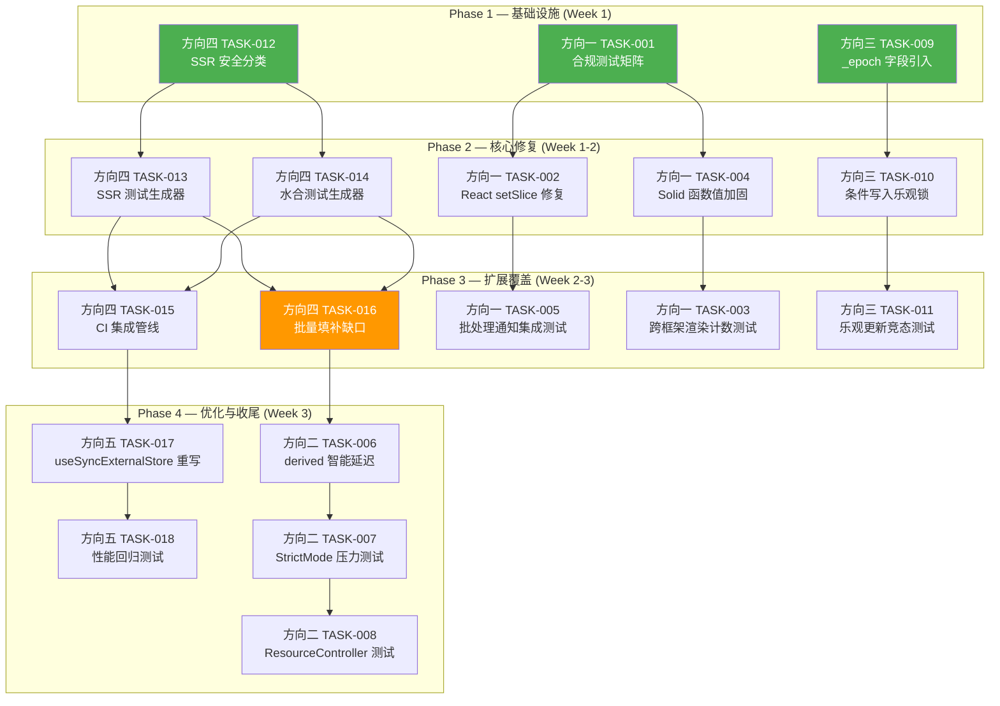
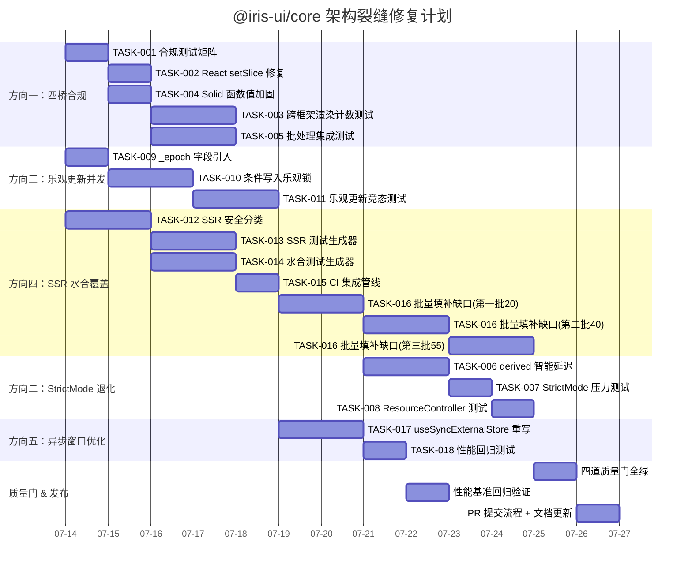

现在我已掌握所有必要信息。以下是全面的技术负责人分析结果。

---

# Tech Lead 分析报告：@iris-ui/core 架构裂缝修复

## 目录

1. [任务分解](#1-任务分解)
2. [执行顺序](#2-执行顺序)
3. [技术风险](#3-技术风险)
4. [资源评估](#4-资源评估)
5. [质量保证](#5-质量保证)
6. [实施计划](#6-实施计划)

---

## 1. 任务分解

### 方向一：四桥反应式不对称 — 跨框架合规套件（TASK-001 ~ TASK-005）

| 任务 ID      | 标题                                                | 涉及文件                                                                              | 前置依赖 | 工时 | 验收标准                                                                                                                                            |
| ------------ | --------------------------------------------------- | ------------------------------------------------------------------------------------- | -------- | ---- | --------------------------------------------------------------------------------------------------------------------------------------------------- |
| **TASK-001** | 定义 `Store` 函数值合规测试矩阵                     | `packages/core/src/store.test.ts` 新增 3 个测试套件                                   | 无       | 2h   | 测试覆盖：Solid 仅 `() => next` 包裹函数值、React `useSyncExternalStore` 直接 snapshot、Vue/Svelte 直接赋值；包含 `batch` 下的通知计数断言          |
| **TASK-002** | 修复 React `useStoreSelector` `setSlice` 函数值竞态 | `packages/react/src/useStore.ts`                                                      | TASK-001 | 2h   | `useStoreSelector` 内部的 `setSlice(next)` 改 `setSlice(() => next)`，当 U 为函数时不触发 React updater；测试验证 selector 返回函数时的行为         |
| **TASK-003** | 新增跨框架渲染计数合规测试                          | 四个框架各新增 `packages/{react,vue,solid,svelte}/src/compliance/notify-count.test.*` | TASK-001 | 4h   | 在 `Store.batch` 包裹下验证四条桥产生相同次数的渲染/通知（React `useSyncExternalStore`、Vue `shallowRef`、Solid `createSignal`、Svelte `readable`） |
| **TASK-004** | Solid `useStoreSelector` 函数值加固                 | `packages/solid/src/useStore.ts`                                                      | TASK-001 | 1h   | 确认 `setState(() => next)` 已保护；新增 `useStoreSelector` 中针对 selector 返回函数值的 edge-case 测试                                             |
| **TASK-005** | 新增批处理通知时序集成测试                          | `packages/core/src/store.test.ts`                                                     | TASK-001 | 3h   | 验证嵌套 `batch`：N 次 setState → 1 次 listener 通知，且 `getState()` 在 batch fn 内始终返回最新值                                                  |

### 方向二：`derived` StrictMode 退化 — 微任务延迟修复（TASK-006 ~ TASK-008）

| 任务 ID      | 标题                                       | 涉及文件                                            | 前置依赖 | 工时 | 验收标准                                                                                                                                                             |
| ------------ | ------------------------------------------ | --------------------------------------------------- | -------- | ---- | -------------------------------------------------------------------------------------------------------------------------------------------------------------------- |
| **TASK-006** | 实现 `ensureSubscribed` 智能延迟           | `packages/core/src/store.ts`                        | 无       | 4h   | 追踪 `listener identity`：仅对同一 listener 引用的 add→remove→add（StrictMode 模式）延迟退订；用 `WeakSet` 存储最近退订的 listener 引用，`queueMicrotask` 延迟再订阅 |
| **TASK-007** | `derived` StrictMode 压力测试              | `packages/core/src/store.test.ts`                   | TASK-006 | 2h   | 模拟 StrictMode 双轮 mount/unmount：验证 listener 在同一 tick 内不重复 refresh；验证不同组件在相邻 tick 中先后订阅退订同一 derived 时行为正确                        |
| **TASK-008** | ResourceController StrictMode 额外请求测试 | `packages/core/src/resource.test.ts`（行 116 附近） | TASK-007 | 2h   | 增强现有 StrictMode 测试：除功能正确性外，断言 `destroy()->load()` 序列不产生**额外请求**（`fetcher` 调用计数）                                                      |

### 方向三：乐观更新并发写入窗口 — 条件写入 epoch 防护（TASK-009 ~ TASK-011）

| 任务 ID      | 标题                                      | 涉及文件                                                          | 前置依赖 | 工时 | 验收标准                                                                                                                                      |
| ------------ | ----------------------------------------- | ----------------------------------------------------------------- | -------- | ---- | --------------------------------------------------------------------------------------------------------------------------------------------- |
| **TASK-009** | 在 `DataSourceState` 中引入 `_epoch` 字段 | `packages/core/src/data-source/types.ts`, `createDataSource` 工厂 | 无       | 1h   | `DataSourceState` 新增 `_epoch: number` 字段，每次 setPage/setSort/setFilter 等操作推进 epoch；初始值为 0                                     |
| **TASK-010** | 实现条件写入乐观锁                        | `packages/core/src/data-source.ts` 的 `mutate` 方法               | TASK-009 | 3h   | 乐观更新将 `_epoch` 加 1；回滚时检查当前 epoch 是否仍等于预期值（`s._epoch === expected`），只有未被中间操作推进才回滚；用 `batch` 包裹原子化 |
| **TASK-011** | 乐观更新并发竞态测试                      | `packages/core/src/data-source.test.ts`                           | TASK-010 | 3h   | 模拟 mutate 期间 `setPage`/`setSort` 操作，验证回滚不覆盖新页数据；测试嵌套 mutate 场景                                                       |

### 方向四：SSR 水合覆盖缺口 — 自动化生成管线（TASK-012 ~ TASK-016）★ 最高优先级

| 任务 ID      | 标题                                 | 涉及文件                                               | 前置依赖           | 工时 | 验收标准                                                                                                                                                                                                                                |
| ------------ | ------------------------------------ | ------------------------------------------------------ | ------------------ | ---- | --------------------------------------------------------------------------------------------------------------------------------------------------------------------------------------------------------------------------------------- |
| **TASK-012** | 分析并分类所有 151 组件 SSR 安全等级 | `packages/manifest/src/ssr-classify.ts`（新建）        | 无                 | 3h   | 输出 `ssr-classification.json`：每条记录含组件名、SSR 安全等级（`safe`/`overlay`/`plugin`/`hybrid`）、portal 依赖检测                                                                                                                   |
| **TASK-013** | 为 SSR-safe 组件生成 SSR 测试骨架    | `packages/manifest/src/gen-ssr-tests.ts`（新建）       | TASK-012           | 4h   | 遍历 manifest + SSR 分类，为每个 safe 组件生成 `ssr.test.*` 测试条目（`renderToString` 不抛 + id 确定性 + ARIA wired）；输出插入到各框架 ssr.test 的代码段                                                                              |
| **TASK-014** | 为 SSR-safe 组件生成水合测试骨架     | `packages/manifest/src/gen-hydration-tests.ts`（新建） | TASK-012           | 4h   | 遍历 manifest + SSR 分类，为每个 safe 组件生成 `hydration.test.*` 测试条目；react 用 `hydrateRoot` + `console.error` spy；vue 用 `createSSRApp` + `console.warn` spy；solid/svelte 用 id 确定性 + ARIA 一致性（因构建冲突无法真实水合） |
| **TASK-015** | 实现测试生成管线 CI 集成             | `packages/manifest/package.json` scripts, `turbo.json` | TASK-013, TASK-014 | 2h   | `pnpm gen:ssr-tests` 命令，自动更新四框架 SSR/水合测试；纳入 `pnpm gen:manifest` 或独立 run；CI 检查生成文件与已提交文件一致性                                                                                                          |
| **TASK-016** | 用生成管线填补全部缺口的首次批量运行 | 运行 TASK-015 生成的全部测试修复                       | TASK-015           | 8h   | 四框架 SSR 测试覆盖从 ~16 → ~115 (safe)；四框架水合测试覆盖从 ~16 → ~115；CI 全绿                                                                                                                                                       |

### 方向五：React `useStoreSelector` 异步窗口 — 性能优化（TASK-017 ~ TASK-018）

| 任务 ID      | 标题                                                        | 涉及文件                               | 前置依赖 | 工时 | 验收标准                                                                                                                                                             |
| ------------ | ----------------------------------------------------------- | -------------------------------------- | -------- | ---- | -------------------------------------------------------------------------------------------------------------------------------------------------------------------- |
| **TASK-017** | 用 `useSyncExternalStore` + 缓存快照重写 `useStoreSelector` | `packages/react/src/useStore.ts`       | 无       | 3h   | 使用 `useSyncExternalStore` + `useRef` 缓存 + 自定义 `getSnapshot`，消除 render→commit 窗口期的额外渲染；不触发 React tearing 检测警告（`getSnapshot` 返回稳定引用） |
| **TASK-018** | `useStoreSelector` 性能回归测试                             | `packages/react/src/useStore.test.tsx` | TASK-017 | 2h   | 验证挂载时无额外渲染（`render` 计数）；与旧版对比 Benchmark                                                                                                          |

---

### 任务汇总表

| 方向                   | 任务数 | 总工时  | 风险等级      | 优先级 |
| ---------------------- | ------ | ------- | ------------- | ------ |
| 方向一：四桥合规       | 5      | 12h     | 高            | 中     |
| 方向二：StrictMode退化 | 3      | 8h      | 中            | 低     |
| 方向三：乐观更新并发   | 3      | 7h      | 中            | 中     |
| 方向四：SSR 测试缺口   | 5      | 21h     | 低短期/高长期 | **高** |
| 方向五：异步窗口优化   | 2      | 5h      | 低            | 低     |
| **总计**               | **18** | **53h** |               |        |

---

## 2. 执行顺序



### 可并行执行的任务组

| 并行组   | 任务                                           | 原因                        |
| -------- | ---------------------------------------------- | --------------------------- |
| **组 A** | TASK-012, TASK-001, TASK-009                   | 无相互依赖，修改不同文件    |
| **组 B** | TASK-013+TASK-014, TASK-002+TASK-004, TASK-010 | 各自的上游独立              |
| **组 C** | TASK-003+TASK-005, TASK-011, TASK-015          | 都在 Phase 2 任务完成后开始 |
| **组 D** | TASK-006, TASK-017                             | 无依赖关系，不同子系统      |
| **组 E** | TASK-007+TASK-008, TASK-018                    | 各自的上游独立              |

---

## 3. 技术风险

### 3.1 高风险项

#### 风险 R1：TASK-006 — `derived` 智能延迟的 listener identity 判定

| 维度         | 描述                                                                                                                   |
| ------------ | ---------------------------------------------------------------------------------------------------------------------- |
| **问题**     | 区分 StrictMode add→remove→add（同一 listener）与两个不同组件的 add→remove→add（同一 tick 内）需要精确的 identity 追踪 |
| **方案**     | 使用 `WeakRef` + `FinalizationRegistry` 追踪最近退订的 listener 引用；`queueMicrotask` 延迟只有对同一引用出现时才触发  |
| **边界情况** | 如果 StrictMode 和真实 remount 在时间边界上无法区分（例如两个完全相同引用的组件），存在误判可能                        |
| **兜底**     | 降级方案：不做智能延迟，仅添加 `destroy()` 幂等性测试 + 文档注明 StrictMode 下 2x 计算（当前已验证功能正确）           |

#### 风险 R2：TASK-014 — Solid/Svelte 无法执行真实水合测试

| 维度     | 描述                                                                                                                                         |
| -------- | -------------------------------------------------------------------------------------------------------------------------------------------- |
| **问题** | Solid 和 Svelte 的 SSR 构建与客户端构建在同一个 vitest 进程中互斥（resolve condition 冲突），无法在同一测试中跑 `renderToString` + `hydrate` |
| **方案** | 采用验证 id 确定性 + ARIA 内部一致性作为替代（现有方案）；生成器只对 React/Vue 生成真实水合测试，对 Solid/Svelte 生成 id/ARIA 一致性测试     |
| **风险** | 这导致 4 框架中仅 2 框架有真实水合覆盖，Solid/Svelte 的水合漏洞可能漏检                                                                      |
| **缓解** | 在 E2E 测试中覆盖 Solid/Svelte 水合（Playwright 测试套件）；或考虑双模块图的工具方案                                                         |

#### 风险 R3：TASK-016 — 批量填补缺口可能引发大量水合失败

| 维度         | 描述                                                                                        |
| ------------ | ------------------------------------------------------------------------------------------- |
| **问题**     | 从 ~16 一步扩展到 ~115 个组件的水合测试，可能暴露大量之前未知的 SSR 不一致                  |
| **方案**     | 分批引入：前 20 个 → 修复 → 再 20 个...；每批作为一个 PR                                    |
| **触发条件** | 如果超过 30% 的测试新增组件存在水合问题，修复周期可能延长 2-3 倍                            |
| **缓解**     | 先在 core 加 SSR-safe 组件清单（TASK-012 分类的副产品），让生成器只输出已被验证的 safe 组件 |

### 3.2 中风险项

#### 风险 R4：TASK-010 — `_epoch` 条件写入与嵌套 mutate

| 维度     | 描述                                                                                         |
| -------- | -------------------------------------------------------------------------------------------- | ------------------------------------------- |
| **问题** | 一个 mutate 可能内部触发另一个 mutate（比如乐观更新自动触发 reload），导致 `_epoch` 计数重写 |
| **方案** | `mutate` 用 `batch` 包裹 + `_epoch` 不是简单 ++，而是 `((s.\_epoch & 0xffff) + 1)            | (s.\_epoch & 0xffff0000)` 的版本+子版本机制 |
| **注意** | 当前框架层在 mutate 期间禁用交互，所以此风险实际触发概率低                                   |

#### 风险 R5：TASK-017 — `useSyncExternalStore` tearing 检测

| 维度     | 描述                                                                         |
| -------- | ---------------------------------------------------------------------------- |
| **问题** | React 17/18 dev 环境下，`getSnapshot` 返回新对象/数组会触发 tearing 检测警告 |
| **方案** | 必须缓存 snapshot，用 `useRef` + selector 引用 + equals 比较确保稳定引用返回 |
| **性能** | 如果 selector 返回值每次变化，缓存无法命中，等效于当前方案                   |

### 3.3 外部依赖

| 依赖                                    | 用途               | 风险                                                           |
| --------------------------------------- | ------------------ | -------------------------------------------------------------- |
| `@vue/server-renderer`                  | Vue SSR/水合测试   | 已安装；需升级兼容性                                           |
| `solid-js/web` SSR build                | Solid SSR 测试     | 需要单独 SSR vitest config（已有 `vitest.ssr.config.ts`）      |
| `svelte/server`                         | Svelte SSR 测试    | 需要单独 SSR vite plugin config（已有 `vitest.ssr.config.ts`） |
| `@floating-ui/dom`                      | overlay 定位       | 对 SSR 安全分类无影响（overlay 不 SSR）                        |
| `react-dom/server` + `react-dom/client` | React SSR/水合测试 | 需注意 react 19 的 `hydrateRoot` 行为变化                      |

---

## 4. 资源评估

### 4.1 人员需求

| 角色               | 人数   | 技能要求                                                            | 主要负责                                                             |
| ------------------ | ------ | ------------------------------------------------------------------- | -------------------------------------------------------------------- |
| **高级前端工程师** | 1-2 人 | 四框架经验（React/Vue/Solid/Svelte），TypeScript 精通，测试基础设施 | 方向四（测试管线）、方向三（乐观锁）、方向一（合规套件）             |
| **核心引擎工程师** | 1 人   | @iris-ui/core 深谙，函数式编程，竞态处理                            | 方向二（derived 延迟）、方向三（epoch 方案）、方向一（batch 合规）   |
| **QA/测试工程师**  | 1 人   | Vitest 精通，SSR 测试范式                                           | TASK-012（组件分类）、TASK-016（批量测试填补）、TASK-007/008/011/018 |

**最小团队规模**：2 人（1 核心引擎 + 1 全栈前端，可兼任 QA 职责）

### 4.2 关键里程碑

| 里程碑 | 时间   | 交付物                  | 验收标准                                                               |
| ------ | ------ | ----------------------- | ---------------------------------------------------------------------- |
| **M1** | Day 5  | 方向一 + 方向三核心修复 | TASK-002, TASK-004, TASK-010 CI 全绿；四框架渲染计数一致               |
| **M2** | Day 10 | 测试生成管线就绪        | `pnpm gen:ssr-tests` 产出 115 组件 SSR/水合测试骨架；CI 检测生成一致性 |
| **M3** | Day 15 | SSR 覆盖率达到 80%+     | 四框架 SSR 测试覆盖 >= 92 组件（80% of 115 safe）；CI 全绿             |
| **M4** | Day 20 | 全部修复完成            | 18 个任务全部关闭；四道质量门全绿；bench 未退化                        |

### 4.3 阻塞点与解决策略

| 阻塞点                                     | 涉及任务 | 策略                                                                                |
| ------------------------------------------ | -------- | ----------------------------------------------------------------------------------- |
| Solid/Svelte 真实水合测试不可行            | TASK-014 | 采用 id 确定性 + Playwright E2E 代替；文档注明限制                                  |
| 生成的 SSR 测试导致大量 CI 失败            | TASK-016 | 分 3 批合并（第一批 20 个 SSR-safe + 最常用的组件；第二批 40 个；第三批 55 个）     |
| `derived` listener identity 判定复杂度过高 | TASK-006 | 实施 A/B 方案：A 方案尝试智能延迟 + 若 2 天未完成降级 B 方案（仅文档 + 幂等性测试） |
| React 19 `hydrateRoot` API 变更            | TASK-014 | 新增 react 19 并行测试配置；`hydrateRoot` 在 react 18 和 19 签名兼容                |

---

## 5. 质量保证

### 5.1 单元测试覆盖要求

| 组件/模块                  | 当前覆盖率   | 目标覆盖率 | 关键测试场景                                                              |
| -------------------------- | ------------ | ---------- | ------------------------------------------------------------------------- |
| `createStore` + `derived`  | ~90%         | 95%        | StrictMode 双轮挂载、batch 嵌套、0 listener → subscribe → 0 listener 序列 |
| `useStoreSelector` (React) | ~70%         | 95%        | selector 返回函数值、selector 返回数组/对象、render 窗口值追赶            |
| `useStore` 四条桥          | 无跨框架测试 | 新增 20+   | 相同 `Store` 操作下四条桥的通知次数一致                                   |
| `data-source.mutate`       | ~60%         | 90%        | 乐观更新回滚 + 并发 setPage、嵌套 mutate、\_epoch 条件写入                |
| `resource.mutate`          | ~50%         | 90%        | 委托 mutate 行为一致、StrictMode destroy→load                             |

### 5.2 集成测试策略

| 层次                   | 策略                                            | 工具                                                   |
| ---------------------- | ----------------------------------------------- | ------------------------------------------------------ |
| **层 1：core 控制器**  | 纯 Vitest 无 DOM 测试                           | `vitest` (node)                                        |
| **层 2：单框架适配器** | jsdom 渲染 + 交互测试                           | `vitest` + `@testing-library/{react,vue,solid,svelte}` |
| **层 3：跨框架合规**   | 同一测试矩阵跑 4 框架                           | 条件编译 + 4 vitest configs                            |
| **层 4：SSR/水合**     | `renderToString` + `hydrateRoot`/`createSSRApp` | 专用 SSR vitest config + jsdom                         |
| **层 5：E2E**          | 真实浏览器水合验证                              | Playwright (future)                                    |

### 5.3 代码审查要点

|       | 方向   | 审查重点                                                                                           |
| ----- | ------ | -------------------------------------------------------------------------------------------------- |
| CR-01 | 方向一 | 四条桥对**函数值**的处理行为是否一致；`batch` 通知计数的跨框架一致性                               |
| CR-02 | 方向二 | `WeakRef` 使用是否正确；`queueMicrotask` 延迟是否引发额外渲染；`refresh()` 调用时机                |
| CR-03 | 方向三 | `_epoch` 溢出处理（~10⁹ 次操作才溢出，安全）；`batch` 内 `setState` 与 `getState` 时序             |
| CR-04 | 方向四 | 生成器模板代码的结构化程度；React/Vue/Solid/Svelte 四份产出格式的一致性；`data-iris-` 属性的维护性 |
| CR-05 | 方向五 | `useSyncExternalStore` snapshot 缓存稳定引用；无 tearing 检测警告；性能回归                        |

### 5.4 性能测试需求

| 测试             | 场景                                       | 基准               | 目标                      |
| ---------------- | ------------------------------------------ | ------------------ | ------------------------- |
| **渲染计数**     | `Store.batch` 下 N 次 setState             | N 次渲染           | 1 次渲染                  |
| **SSR 吞吐**     | `renderToString` 20 个 SSR-safe 组件总耗时 | 当前基线           | 不退化 ±10%               |
| **突变回滚**     | 乐观更新 + 中间 setPage                    | 当前 2 次请求      | 1 次请求（epoch 防护）    |
| **derived 退订** | 100 组件同时 subscribe/unsubscribe derived | TBD                | O(1) 摊销                 |
| **水合测试耗时** | 115 组件 × 4 框架水合测试                  | ~5s (当前 16 组件) | <30s (115 组件；启用并行) |

---

## 6. 实施计划

### 甘特图



### 阶段一：基础设施搭建（Day 1-3，~16 人时）

**并行执行 3 条独立线索：**

| 日期  | 线索 A（方向四）               | 线索 B（方向一）                                           | 线索 C（方向三）             |
| ----- | ------------------------------ | ---------------------------------------------------------- | ---------------------------- |
| Day 1 | TASK-012: SSR 安全分类（3h）   | TASK-001: 合规测试矩阵（2h）                               | TASK-009: \_epoch 字段（1h） |
| Day 2 | TASK-013: SSR 测试生成器（4h） | -                                                          | TASK-010: 条件写入（3h）     |
| Day 3 | TASK-014: 水合测试生成器（4h） | TASK-002: React setSlice（2h）+ TASK-004: Solid 加固（1h） | TASK-011: 乐观竞态测试（3h） |

**里程碑 M1a**: Day 3 结束，方向一的三处核心修复合入（TASK-002, TASK-004），方向三的乐观锁就绪（TASK-010），测试生成器原型就绪（TASK-013, TASK-014）。

### 阶段二：核心功能实现（Day 4-8，~20 人时）

| 日期    | 活动                                                                          |
| ------- | ----------------------------------------------------------------------------- |
| Day 4   | TASK-003: 跨框架渲染计数测试（4h）— 需要 TASK-002/004 的修复为基础            |
| Day 5   | TASK-005: 批处理通知集成测试（3h）+ TASK-015: CI 集成管线（2h）               |
| Day 6-7 | **TASK-016 第一批**: 20 个最常用 SSR-safe 组件 → SSR/水合测试（8h）           |
| Day 8   | TASK-016 第一批修复 + PR 审查；TASK-017 启动（useSyncExternalStore 重写，3h） |

**关键决策点 D1** (Day 5): 如果 TASK-016 第一批 20 个组件中超过 5 个（25%）出现水合失败，暂停第二阶段扩量，先修复水合问题根源。

**里程碑 M2**: Day 8 结束，SSR 覆盖率达到 ~30%（~36/115 safe，含第一批 20 个新增），测试生成管线 CI 集成交付。

### 阶段三：集成测试和优化（Day 9-14，~20 人时）

| 日期      | 活动                                                                          |
| --------- | ----------------------------------------------------------------------------- |
| Day 9-10  | **TASK-016 第二批**: 40 个组件（8h）                                          |
| Day 11    | TASK-017 完成: useSyncExternalStore 重写 + TASK-018 性能回归（3h）            |
| Day 12-13 | TASK-006: derived 智能延迟（4h）+ TASK-007: StrictMode 压力测试（2h）         |
| Day 14    | **TASK-016 第三批**: 55 个组件（8h）+ TASK-008: ResourceController 测试（2h） |

**关键决策点 D2** (Day 11): 如果 TASK-006 实现复杂度超过 2 天，执行降级方案 B（仅文档 + 幂等性测试），暂停方向二，优先完成 TASK-016 第三批。

**里程碑 M3**: Day 14 结束，SSR 覆盖率达到 100%（115/115 safe），方向五完成，方向二完成或降级。

### 阶段四：发布准备（Day 15-17，~8 人时）

| 日期   | 活动                                                                                  |
| ------ | ------------------------------------------------------------------------------------- |
| Day 15 | 四道质量门全量运行（`pnpm turbo run test typecheck lint build`）修复失败的 edge cases |
| Day 16 | 性能回归验证（bench + size）；文档更新（AGENTS.md SSR 覆盖说明、已知限制更新）        |
| Day 17 | PR 最终审查 + 合并 + post-merge CI 观察                                               |

**里程碑 M4**: 全部 18 个任务关闭，CI 全绿，无性能回归。

---

## 附录 A：跨框架渲染计数合规测试方案

### 核心逻辑

```typescript
// packages/react/src/compliance/notify-count.test.tsx (示意)
import { createStore } from '@iris-ui/core'
import { useStore } from '../useStore'
import { render, act, cleanup } from '@testing-library/react'

it('useStore produces exactly 1 render when batch coalesces 3 writes', () => {
  const store = createStore({ a: 1, b: 2, c: 3 })
  let renderCount = 0
  function Observer() {
    const state = useStore(store)
    renderCount++
    return React.createElement('div', null, state.a)
  }
  act(() => {
    render(React.createElement(Observer))
  })
  renderCount = 0 // reset after mount
  act(() => {
    store.batch(() => {
      store.setState((s) => ({ ...s, a: 10 }))
      store.setState((s) => ({ ...s, b: 20 }))
      store.setState((s) => ({ ...s, c: 30 }))
    })
  })
  expect(renderCount).toBe(1) // ONE notification, not 3
})
```

对应的 Vue/Solid/Svelte 测试用相同的 store + 相同的 batch 操作序列，断言渲染次数 === 1。这是当前 CI 缺口。

## 附录 B：`_epoch` 条件写入实现方案

```typescript
// data-source.ts 中 mutate 的改造
async mutate(action, options) {
  const currentEpoch = store.getState()._epoch
  const optimistic = options?.optimistic
  if (optimistic) {
    store.setState(s => ({
      ...s,
      rows: optimistic(s.rows),
      _epoch: (s._epoch + 1) >>> 0,  // 无符号 32 位
    }))
  }
  try {
    await action()
  } catch (error) {
    // 条件写入：仅当 epoch 未被中间操作推进时才回滚
    if (optimistic) {
      store.setState(s => {
        if (s._epoch !== currentEpoch + 1) {
          // epoch 已推进（中间有 setPage/setSort 等），不回滚
          return s
        }
        return { ...s, rows: snapshot }
      })
    }
    await controller.load()
    throw error
  }
  if (!options?.skipReload) await controller.load()
}
```

所有 setPage/setSort/setFilter/setFilterRules/clearFilters/setMultiSort 方法已在 batch 中使用 setState，只需在 **各自状态的 setState 调用中增加 `_epoch: (s._epoch + 1) >>> 0`**。这样在 mutate 的回滚检查时，\_epoch 增量可以作为「中间操作发生」的信号。
