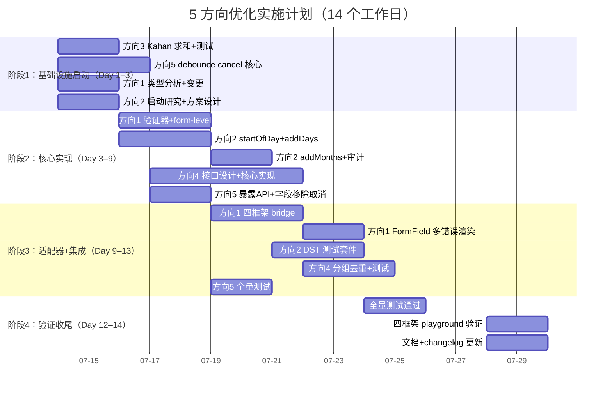

现在我已完整阅读了所有相关源码文件，掌握了各方向的全貌。以下是 Tech Lead 分析。

---

# Tech Lead 分析报告：5 个边界面优化方向

> **基于**：`docs/requirements/2026-07-11-full-source-scan-five-code-level-edge-optimization-directions.md`  
> **日期**：2026-07-12  
> **角色**：Tech Lead — 关注可执行性、风险、资源与工程质量

---

## 1. 任务分解

以下将 5 个方向拆解为 25 个技术任务，每个 2–4 小时。任务按「方向.序号」编码。

### 方向 1 — Standard Schema 首错即止

| 任务 ID | 标题                                              | 涉及文件                                                                                                   | 前置     | 预估 | 验收标准                                                                                               |
| ------- | ------------------------------------------------- | ---------------------------------------------------------------------------------------------------------- | -------- | ---- | ------------------------------------------------------------------------------------------------------ |
| **1.1** | 修改 `FieldErrors` 类型支持多错误聚合             | `packages/core/src/form/types.ts`（`FieldErrors`）<br>`packages/core/src/form.ts`（同名类型）              | 无       | 2h   | `FieldErrors<V>` 值类型变为 `string \| string[]`，旧消费者仍兼容 `string`                              |
| **1.2** | 重写 `standardSchemaValidator` 聚合同字段所有错误 | `packages/core/src/standard-schema.ts`                                                                     | 1.1      | 3h   | 同字段多条 issue 全部保留在 `string[]` 中；`key in errors` 守卫改为 `key in errors` + append           |
| **1.3** | 处理 form-level 无路径错误                        | `packages/core/src/standard-schema.ts`                                                                     | 1.1      | 2h   | `issueKey` 返回 `undefined` 的 issue（如 `z.refine`）被收集到保留 key（如 `$form` 或 `_root`），不丢弃 |
| **1.4** | 更新四框架 `useField` bridge 处理 `string[]`      | 4 适配器：`packages/{react,vue,solid,svelte}/src/useField.ts`                                              | 1.1      | 4h   | 各框架 `field.error` 属性变为 `string \| string[] \| undefined`，向后兼容单字符串                      |
| **1.5** | 更新 `FormField` 组件渲染多错误                   | 4 适配器：`packages/{react,vue,solid,svelte}/src/FormField.tsx` 等                                         | 1.4      | 3h   | `string[]` 时渲染为 `<ul><li>err1</li><li>err2</li></ul>` 或类似结构，单字符串保持原样                 |
| **1.6** | 方向 1 完整测试套件                               | `packages/core/src/standard-schema.test.ts`<br>新增 `packages/core/src/form/__tests__/multi-error.test.ts` | 1.2, 1.3 | 3h   | 覆盖：同字段多条（Zod 链式）、form-level refine、array nested、`superRefine` 多路径                    |

### 方向 2 — Date math DST 边界

| 任务 ID | 标题                                          | 涉及文件                                                                                                     | 前置          | 预估 | 验收标准                                                                                         |
| ------- | --------------------------------------------- | ------------------------------------------------------------------------------------------------------------ | ------------- | ---- | ------------------------------------------------------------------------------------------------ |
| **2.1** | 用 UTC 方法重写 `startOfDay`                  | `packages/core/src/date.ts`                                                                                  | 无            | 3h   | `startOfDay('2024-11-03T01:30:00-04:00')` 在 DST 回退日返回正确的当天 00:00:00，而非前一天 23:00 |
| **2.2** | 用 UTC 方法重写 `addDays`                     | `packages/core/src/date.ts`                                                                                  | 无            | 2h   | 跨越 DST 边界的天数加减返回正确日历日期；UTC 时间戳计算方法 `setTime(time + days * 86400000)`    |
| **2.3** | 用 UTC 方法重写 `addMonths` + 修改 clamp 逻辑 | `packages/core/src/date.ts`                                                                                  | 无            | 4h   | 跨 DST 转换日的月加减保持日期正确；`lastDay` 计算使用 UTC 方法                                   |
| **2.4** | 审计/修复其余日期工具函数                     | `packages/core/src/date.ts`（`buildMonthMatrix`, `isOutOfRange`, `isSameDay`, `startOfMonth`, `endOfMonth`） | 2.1, 2.2, 2.3 | 3h   | 所有日期函数使用 UTC 或时间戳运算，通过统一参数化审计矩阵（附录 A）                              |
| **2.5** | DST 边界测试套件                              | `packages/core/src/date.test.ts`                                                                             | 2.4           | 4h   | 覆盖全部 6 个 DST 场景：美东/欧洲/澳新的 spring-forward 和 fall-back 转换日，含午夜前后          |
| **2.6** | DatePicker/Calendar 集成验证                  | `apps/playground*/` 手动测试脚本                                                                             | 2.5           | 2h   | 四个框架的日期选择器在 DST 转换日选择正确日期并提交正确值                                        |

### 方向 3 — Aggregate 浮点精度

| 任务 ID | 标题                         | 涉及文件                                                                                      | 前置 | 预估 | 验收标准                                                                        |
| ------- | ---------------------------- | --------------------------------------------------------------------------------------------- | ---- | ---- | ------------------------------------------------------------------------------- |
| **3.1** | 实现 Kahan-Babushka 补偿求和 | `packages/core/src/data-view/aggregate.ts`                                                    | 无   | 2h   | `sum` 和 `avg` 使用 Kahan 求和；100 万条 `0.1` 累加相对误差 < 1e-12             |
| **3.2** | 精度回归测试 + benchmark     | `packages/core/src/data-view/aggregate.test.ts`（新建）<br>`packages/core/src/scale.bench.ts` | 3.1  | 3h   | 测试覆盖：10 万条财务金额、100 万条小数值、混合数量级；benchmark 报告精度与性能 |

### 方向 4 — 通知去重/分组/更新

| 任务 ID | 标题                                                    | 涉及文件                                                            | 前置          | 预估 | 验收标准                                                                                                   |
| ------- | ------------------------------------------------------- | ------------------------------------------------------------------- | ------------- | ---- | ---------------------------------------------------------------------------------------------------------- |
| **4.1** | 扩展 `DesktopNotification` 和 `NotificationCenter` 接口 | `packages/core/src/notifications.ts`                                | 无            | 2h   | 新增 `group`, `count`, `timestamp`, `windowId` 字段；`update()`, `dismissGroup()`, `dismissApp()` 方法签名 |
| **4.2** | 实现 `update(id, input)` 方法                           | `packages/core/src/notifications.ts`                                | 4.1           | 2h   | 可原地更新通知的 body/count/icon；若 id 不存在则静默无操作                                                 |
| **4.3** | 实现自动分组去重逻辑                                    | `packages/core/src/notifications.ts`                                | 4.1           | 4h   | `post()` 时检测 appId+group 相同 → 累加 count 并替换而非 append；去重键可通过 input 控制                   |
| **4.4** | 实现 `dismissGroup` / `dismissApp`                      | `packages/core/src/notifications.ts`                                | 4.1           | 2h   | 按 group 或 appId 批量 dismiss                                                                             |
| **4.5** | 更新通知测试                                            | `packages/core/src/notifications.test.ts`（可能有现有测试，需检查） | 4.2, 4.3, 4.4 | 3h   | 覆盖：group 去重、update、dismissGroup、批量清除                                                           |

### 方向 5 — Debounce cancel 生命周期

| 任务 ID | 标题                                        | 涉及文件                                                                   | 前置    | 预估 | 验收标准                                                                                               |
| ------- | ------------------------------------------- | -------------------------------------------------------------------------- | ------- | ---- | ------------------------------------------------------------------------------------------------------ |
| **5.1** | `destroy()` 中 cancel 所有 pending debounce | `packages/core/src/form.ts`<br>`packages/core/src/form/validation.ts`      | 无      | 2h   | `destroy()` 调用所有 `fieldFlushers` 和 `fieldDebouncers` 的 `cancel()`，然后清空 Map                  |
| **5.2** | `reset()` 中先 cancel 再重置                | `packages/core/src/form.ts`                                                | 无      | 2h   | `reset()` 先 cancel 所有 pending，再清空 store，消除 cancel→reset→debounce_write 时序竞争              |
| **5.3** | 暴露 `cancelPendingWrites()`                | `packages/core/src/form.ts`（`FormStore` 接口 + 实现）                     | 5.1     | 2h   | 新增 `cancelPendingWrites(): void` 方法，供适配器在 `useEffect` 清理函数或 `onUnmount` 中调用          |
| **5.4** | 字段移除时 cancel 该字段 debounce           | `packages/core/src/form.ts`（`arrayRemove`, `setFieldValue` 对已移除路径） | 5.1     | 2h   | `arrayRemove` 在移除元素前 cancel 该字段路径的 pending debounce；`setFieldValue` 到 `undefined` 时同理 |
| **5.5** | 方向 5 完整测试套件                         | `packages/core/src/form/__tests__/debounce-cancel.test.ts`（新建）         | 5.1–5.4 | 3h   | 覆盖：unmount → cancel、reset → cancel→reset 时序、StrictMode 双重渲染、动态字段删除后 debounce 不写入 |

---

## 2. 执行顺序

依赖图展示方向间独立（无跨方向依赖），方向内部有链式依赖。

```mermaid
graph TD
    subgraph "方向 1 — Standard Schema"
        1.1[1.1 FieldErrors 类型] --> 1.2[1.2 聚合所有错误]
        1.1 --> 1.4[1.4 四框架 bridge]
        1.2 --> 1.3[1.3 Form-level 错误]
        1.3 --> 1.6[1.6 测试]
        1.4 --> 1.5[1.5 FormField 渲染]
        1.5 --> 1.6
    end

    subgraph "方向 2 — Date DST"
        2.1[startOfDay UTC] --> 2.4[2.4 审计其余工具]
        2.2[addDays UTC] --> 2.4
        2.3[addMonths UTC] --> 2.4
        2.4 --> 2.5[2.5 DST 测试]
        2.5 --> 2.6[2.6 集成验证]
    end

    subgraph "方向 3 — Aggregate"
        3.1[Kahan 求和] --> 3.2[精度测试+bench]
    end

    subgraph "方向 4 — Notifications"
        4.1[接口扩展] --> 4.2[update 实现]
        4.1 --> 4.3[分组去重]
        4.1 --> 4.4[dismissGroup]
        4.2 --> 4.5[测试]
        4.3 --> 4.5
        4.4 --> 4.5
    end

    subgraph "方向 5 — Debounce Cancel"
        5.1[destroy cancel] --> 5.3[暴露 cancelPendingWrites]
        5.2[reset 先 cancel] --> 5.5[测试]
        5.1 --> 5.4[字段移除 cancel]
        5.3 --> 5.5
        5.4 --> 5.5
    end

    %% 串行分组标记
    classDef p1 fill:#ff6b6b,color:#fff
    classDef p2 fill:#ffa94d,color:#fff

    class 1.1,1.2,1.3,1.4,1.5,1.6,2.1,2.2,2.3,2.4,2.5,2.6,5.1,5.2,5.3,5.4,5.5 p1
    class 3.1,3.2,4.1,4.2,4.3,4.4,4.5 p2
```



**可并行执行的任务组**（无共享前置依赖）：

| 并行组 | 任务                                        | 说明                                                                        |
| ------ | ------------------------------------------- | --------------------------------------------------------------------------- |
| **G1** | 1.1, 2.1, 2.2, 2.3, 3.1, 4.1, 5.1, 5.2      | 8 个根任务，各方向独立无交叉依赖。可分配给 3–4 人                           |
| **G2** | 1.2, 1.4, 2.4, 3.2, 4.2, 4.3, 4.4, 5.3, 5.4 | 依赖 G1 的继续任务，可部分并行（1.2 和 1.4 可并行，3.2 独立，5.3/5.4 并行） |
| **G3** | 1.3, 1.5, 2.5, 4.5, 5.5                     | 测试和集成任务                                                              |
| **G4** | 1.6, 2.6                                    | 最终验证                                                                    |

---

## 3. 技术风险

### 3.1 方向 1 — Standard Schema 类型兼容性风险

| 风险                                                                | 等级      | 说明                                                                                                                                                        | 缓解策略                                                                                                                                                                                                                                                                                                                                     |
| ------------------------------------------------------------------- | --------- | ----------------------------------------------------------------------------------------------------------------------------------------------------------- | -------------------------------------------------------------------------------------------------------------------------------------------------------------------------------------------------------------------------------------------------------------------------------------------------------------------------------------------- |
| `FieldErrors` 类型变更触发大范围编译错误                            | 🔴 **高** | `FieldErrors` 被 `FormState`、`FormStore` 接⼝、4 个框架适配器、plugin 代码直接引用。`string \| string[]` 变更后，所有读取 `errors[key]` 的调用需要检查类型 | 1) 先发布类型兼容层：`type FieldErrorValue = string \| string[]`，保留 `FieldErrors<V> = Record<string, FieldErrorValue \| undefined>`；2) 提供工具函数 `getFieldError(error: FieldErrorValue): string`（取第一条）和 `getFieldErrors(error: FieldErrorValue): string[]`（取全部）；3) 四框架 bridge 的 `field.error` 统一包装为兼容单字符串 |
| Zod 的 `z.string().min(3).max(100).email()` 返回的 issue 顺序不可控 | 🟡 **中** | Standard Schema 规范不保证 issue 顺序。若用户期望按 `min→max→email` 顺序显示但 Zod 返回其他顺序，UI 表现不一致                                              | 实现可选 `maxErrorsPerField` 配置（默认全部保留）；不做排序保证，文档说明 "order is schema-implementation-defined"                                                                                                                                                                                                                           |
| 四框架 FormField 组件对 `string[]` 的渲染有设计分歧                 | 🟡 **中** | React 版可能想用 `<Tooltip>` 折叠，Vue 版可能想用列表，Svelte 版可能想用轮播。四端若实现不一致 → manifest 对齐检测失败                                      | 在 core 中定义渲染策略（如 `concatErrors(errors, separator)`），适配器只调用它；或统一为 `<ul>` 列表，每个框架的 tui 提案留到后续迭代                                                                                                                                                                                                        |

### 3.2 方向 2 — DST 的 UTC 重写风险

| 风险                                                                                             | 等级      | 说明                                                                                                                                                                                                       | 缓解策略                                                                                                                                                                                                                                                                                    |
| ------------------------------------------------------------------------------------------------ | --------- | ---------------------------------------------------------------------------------------------------------------------------------------------------------------------------------------------------------- | ------------------------------------------------------------------------------------------------------------------------------------------------------------------------------------------------------------------------------------------------------------------------------------------- |
| UTC 重写后现有非 DST 场景的时间戳语义偏移                                                        | 🟡 **中** | 当前 `setHours(0,0,0,0)` 在非 DST 日工作正常。UTC 方法 `setUTCHours(0,0,0,0)` 在日常也返回相同结果——但 `Date` 的时区偏移量被归零。若下游代码（`DatePicker` 等）用 `getTime()` 比较，UTC 重写后差值可能变化 | 确保所有日期运算 —— `addDays` / `addMonths` / `startOfDay` / `isSameDay` —— 用 UTC 时间戳作为统一中介，且返回的 `Date` 对调用方透明。`startOfDay(d).getTime()` 在 UTC 重写后 = `Math.floor(d.getTime() / 86400000) * 86400000`，这是正确的                                                  |
| `buildMonthMatrix` 日期网格的 UI 渲染可能出现一天偏移                                            | 🔴 **高** | `buildMonthMatrix` 使用 `addDays(first, -offset)` 来填充前一月尾部。若 `first` 和 `addDays` 使用不同的时区参考（一个 local 一个 UTC），填充可能产生一小时错位，导致日历网格显示前一天的日期                | 统一全部 date.ts 函数为 UTC 方式；`buildMonthMatrix` 的内部循环使用 `new Date(Date.UTC(year, month, day))` 构建纯日期；验证每个网格单元格的 `getDate()` 与预期的日历日期匹配                                                                                                                |
| `Intl.DateTimeFormat`（`formatMonthYear`, `getWeekdayNames`）的输入 Date 在 UTC 重写后是否仍正确 | 🟢 **低** | `Intl.DateTimeFormat` 使用本地时区渲染，传入 UTC 日期不影响其输出（`2000-01-01T00:00:00Z` 和 `2000-01-01T00:00:00-05:00` 都渲染为 "January 1, 2000"）                                                      | 不需要修改。但建议添加注释说明                                                                                                                                                                                                                                                              |
| 测试环境（CI）运行在 UTC 时区，DST 测试无法触发                                                  | 🔴 **高** | `vi.useFakeTimers()` 不模拟时区。`TZ=America/New_York` 环境变量在 jsdom 中不工作。**DST 测试在 CI 上可能永远 green 但在用户机器上 fail**                                                                   | 方案 A（推荐）：用 `Date.UTC` 构造明确日期 + 模拟时区偏移：`const d = new Date('2024-11-03T01:30:00-04:00')` 然后用 `d.getTimezoneOffset()` 验证 mock。方案 B：用 `vi.setSystemTime` + `process.env.TZ` 覆盖，但需确认 jsdom 支持。方案 C：抽离时区敏感操作为可注入模块，测试时注入模拟时区 |

### 3.3 方向 3 — Kahan 求和的性能风险

| 风险                                     | 等级      | 说明                                                                                                                           | 缓解策略                                                                                                                                                                                                   |
| ---------------------------------------- | --------- | ------------------------------------------------------------------------------------------------------------------------------ | ---------------------------------------------------------------------------------------------------------------------------------------------------------------------------------------------------------- |
| Kahan 求和比朴素 `reduce` 慢约 3–5x      | 🟡 **中** | 朴素累加：1 次加法 + 1 次赋值 / 元素。Kahan：3 次加减 + 2 次赋值 / 元素。在 10 万行数据上，从 ~0.3ms 变为 ~1.5ms——仍是亚毫秒级 | 1) benchmark 验证实际性能（`scale.bench.ts`）；2) 若 10 万行 > 5ms，则使用自适应策略：小数组（<1000）朴素累加，大数组 Kahan；3) 纯 `sum` 操作是 O(n)，不在 UI 主线程瓶颈路径上（虚拟滚动确保可见行数 ~50） |
| Kahan 求和无法处理 `NaN`/`Infinity` 输入 | 🟢 **低** | 现有代码已有 `Number.isFinite(v)` 过滤，Kahan 不变                                                                             | 保持过滤逻辑                                                                                                                                                                                               |

### 3.4 方向 4 — 通知中心 API 兼容风险

| 风险                                                      | 等级      | 说明                                                                                                                                       | 缓解策略                                                                                             |
| --------------------------------------------------------- | --------- | ------------------------------------------------------------------------------------------------------------------------------------------ | ---------------------------------------------------------------------------------------------------- |
| 现有 `createNotificationCenter()` 调用方未传递新参数      | 🟡 **中** | 若新增字段为可选（`group?`, `count?`, `timestamp?`），向后兼容。但若去重是默认行为，现有 `post()` 调用可能预期多条相同通知而实际只显示一条 | 去重默认关闭（新增 `behavior: 'append' \| 'group'` 配置，默认 `'append'`），迁移到分组行为需显式开启 |
| `plugin-notifications` 的 WebSocket 消费者需要新 API 支持 | 🟢 **低** | `plugin-notifications` 作为独立插件，可以渐进式采用新能力                                                                                  | 插件的 `core` 层升级到新 `createNotificationCenter`，适配器不变                                      |

### 3.5 方向 5 — Debounce cancel 的时序竞争风险

| 风险                                                                       | 等级      | 说明                                                                                                                                                          | 缓解策略                                                                                                                                                            |
| -------------------------------------------------------------------------- | --------- | ------------------------------------------------------------------------------------------------------------------------------------------------------------- | ------------------------------------------------------------------------------------------------------------------------------------------------------------------- |
| `reset()` 中先 cancel 再清空 store 不能完全消除竞争                        | 🟡 **中** | 考虑时序：`cancel()` 清除 timer → 但此时 `setTimeout` 已在事件循环中排队但尚未执行 → `reset()` 清空 store → debounce 回调执行，读取的空值或陈旧值被写入 store | 使用 `cancelled` 标志位：`cancel()` 设置 `cancelled = true`，回调在写入前检查标志位。`reset()` 先 `cancel()`，然后原子地设置新状态 + 递增一个全局 generation 计数器 |
| `React.StrictMode` 下双重 mount 产生的两个 debounce 实例交叉竞争           | 🟡 **中** | StrictMode mount → unmount → remount。第一个实例的 cancel 被调用但第二个实例和第一个残留的计时器可能交叉                                                      | `cancelPendingWrites()` 在 `useEffect` 清理函数中调用。适配器 bridge 的 `useStore`/`useField` 在 `setup` 时用 generation 计数器绑定到当前实例                       |
| `createValidationEngine`（提取的 validation.ts）已内建 cancel 但外面调不到 | 🟢 **低** | `ValidationEngine` 接口已有 `fieldDebouncers` 且每个 entry 有 `.cancel()`，但未暴露到外部                                                                     | 在 `ValidationEngine` 接口新增 `cancelPending(): void`                                                                                                              |

---

## 4. 资源评估

### 4.1 人员技能需求

| 角色                              | 人数 | 所需技能                                                  | 负责方向                                                 |
| --------------------------------- | ---- | --------------------------------------------------------- | -------------------------------------------------------- |
| **Senior 前端工程师**（框架通才） | 1    | TS 类型系统、跨框架 bridge 开发、表单引擎                 | 方向 1（类型 + 四框架适配）、方向 5（debounce 生命周期） |
| **日期/时区专家**                 | 1    | `Date`/`Intl` API、DST 规则、UTC 最佳实践、测试 mock 策略 | 方向 2（全部）                                           |
| **数据/算法工程师**               | 1    | IEEE 754 浮点算术、算法复杂度、benchmark 编写             | 方向 3（全部）                                           |
| **全栈工程师**                    | 1    | 通知系统设计、Store 模式、桌面 OS UX 模式                 | 方向 4（全部）；方向 2 的集成验证（2.6）                 |

> **实际建议**：2 名 Senior 全栈（各负责 2–3 个方向）+ 1 名 Junior（负责测试 + 文档）。方向 3 可由任一 Senior 在半天内完成。

### 4.2 关键里程碑

```
M0 [Day 0]  START — 代码冻结路径确认，方向分析对齐
M1 [Day 3]  ✅ 方向 3 交付（Kahan 求和 + 测试）——最轻量，快速建立 momentum
M2 [Day 5]  ✅ 方向 5 交付（debounce cancel + 测试）——阻断数据竞争
M3 [Day 7]  ✅ 方向 1 core 层交付（类型变更 + 验证器 + form-level 错误）
M4 [Day 9]  ✅ 方向 2 core 层交付（UTC 重写 + 审计 + DST 测试）
M5 [Day 11] ✅ 方向 1 四框架适配 + FormField 渲染
M6 [Day 13] ✅ 方向 4 交付（通知扩展 + 分组 + 测试）
M7 [Day 14] ✅ 全量测试通过 + 集成验证（playground 四框架验证）
```

### 4.3 阻塞点（Blockers）与解决策略

| Blocker                                                   | 影响方向 | 描述                                                       | 解决策略                                                                                                                                        |
| --------------------------------------------------------- | -------- | ---------------------------------------------------------- | ----------------------------------------------------------------------------------------------------------------------------------------------- |
| **B1** `FieldErrors` 类型变更的传播影响不可预估           | 1        | 类型变更触发 4 框架 × ~20 个文件编译错误                   | 先 grep 所有 `errors[key]` 用法，评估影响范围。采用类型兼容方案（`string \| string[]` 加工具函数），分两步合并：先加类型兼容层，再改 validator  |
| **B2** jsdom 无法模拟 DST 时区                            | 2        | CI 运行在 UTC，无法验证 DST 场景                           | 使用 `Intl.DateTimeFormat` + 构造带时区偏移的日期字符串 mock。编写一个 `assertDstIndependent(fn)` 测试工具，传入跨越已知 DST 转换日的时间戳列表 |
| **B3** 通知分组需要对 `plugin-notifications` 的适配器更新 | 4        | 插件包的 `core` 是框架无关的，但 UI 框架适配器可能需要更新 | 将分组逻辑完全放在 core 层（`createNotificationCenter`），适配器只消费 `store.getState()` 中的已分组数据。插件包仅在 `v1.x` 版本发布后更新      |

---

## 5. 质量保证

### 5.1 单元测试覆盖要求

每个方向的测试矩阵，按优先级从 P0（必须）到 P2（可选）：

| 方向 | P0（必须）                                                                                                  | P1（应该）                                                                                                  | P2（可选）                                   |
| ---- | ----------------------------------------------------------------------------------------------------------- | ----------------------------------------------------------------------------------------------------------- | -------------------------------------------- |
| 1    | 同字段 2+ 条错误保留；form-level refine 错误不丢失；嵌套路径错误聚合                                        | `string[]` 向后兼容 `string` 消费者                                                                         | 超大数据集的性能                             |
| 2    | 美东 `2024-03-10` spring-forward；美东 `2024-11-03` fall-back；欧洲 `2024-03-31`；澳新 `2024-04-07`         | 每个函数 `startOfDay`, `addDays`, `addMonths`, `buildMonthMatrix` 各至少一个 DST 场景；`isSameDay` 午夜前后 | 巴西、以色列等非标准 DST 规则                |
| 3    | 10 万条 `0.1` 累加误差 < 1e-10；10 万条财务金额（1234.56）累加误差 < 0.01；`avg` 精度                       | 1000 万条整数的 Kahan vs 朴素对比 benchmark                                                                 | 混合数量级 + NaN/Infinity 输入               |
| 4    | `post` 相同 group 去重；`update` 原地修改；`dismissGroup` 批量清除；无 group 时保持原有 append 行为         | `dismissApp`；`count` 递增                                                                                  | 多 tab/windowId 场景                         |
| 5    | `destroy()` 后 debounce 不写入 store；`reset()` 后 pending 不写入；`arrayRemove` 移除字段的 debounce 不写入 | StrictMode 双重 mount；`cancelPendingWrites` 在 unmount 后不残留                                            | 并发验证 + debounce 交叉竞争（时序 fuzzing） |

### 5.2 集成测试策略

| 策略            | 说明                                                                                                                                                                 |
| --------------- | -------------------------------------------------------------------------------------------------------------------------------------------------------------------- |
| **框架矩阵**    | 每个方向的核心逻辑只在 core 层测试（单框架 vitest）。四框架集成通过 `packages/{react,vue,solid,svelte}/__tests__/` 中各一个 smoke test 验证 bridge 正确传导          |
| **方向 2 DST**  | 不使用 `vi.useFakeTimers()`（不模拟时区）。用 `Date.UTC` 构建已知 DST 转换日的时间戳数组，作为参数化测试输入。每个场景一个 `it.each` 条目                            |
| **方向 5 时序** | 使用 `vi.useFakeTimers()` + `Promise` 微任务控制调度顺序。`cancel()` → `advanceTimersByTime` → 验证 store 未被写入。对于 StrictMode 场景，手动模拟两次 mount/unmount |
| **方向 3 基准** | 在 `scale.bench.ts` 中添加 aggregate benchmark，报告 `ops/sec` 和 `relative error`。门限：10 万行 < 5ms                                                              |

### 5.3 代码审查要点

| 审查焦点         | 方向 | 具体检查项                                                                                                                                                               |
| ---------------- | ---- | ------------------------------------------------------------------------------------------------------------------------------------------------------------------------ |
| **类型设计**     | 1    | `FieldErrors` 是否使用联合类型而非全量 breaking change；工具函数 `getFieldError` 是否处理 `undefined`                                                                    |
| **UTC 纯度**     | 2    | 所有日期函数 `startOfDay`, `addDays`, `addMonths` 等是否完全不调用 `setHours`/`setMinutes`/`setSeconds`/`setMilliseconds` 本地方法；返回值是否为新 `Date` 实例（无突变） |
| **Kahan 正确性** | 3    | 补偿项 `c = (t - sum) - y` 的顺序和语义是否正确（参考 Knuth TAOCP vol 2）；`avg` 是否使用 Kahan 累加后再除法                                                             |
| **API 兼容**     | 4    | 所有新增字段和方法参数为可选；无破坏性默认行为变更                                                                                                                       |
| **生命周期**     | 5    | `destroy()` 和 `reset()` 是否在所有提前 return 路径中都调用了 cancel；`cancelPendingWrites` 的幂等性                                                                     |

### 5.4 性能测试需求

| 方向 | 测试                                             | 门限                                       | 工具                                                |
| ---- | ------------------------------------------------ | ------------------------------------------ | --------------------------------------------------- |
| 3    | Kahan sum vs 朴素 sum 的 ops/sec 对比            | Kahan 在 10 万行数据上 < 5ms（目标 < 2ms） | `vitest bench` + `packages/core/src/scale.bench.ts` |
| 1    | `standardSchemaValidator` 在多错误场景下的吞吐量 | 100 字段 × 5 错误/字段 < 2ms               | 手动计时                                            |
| 2    | 日期函数在批量创建 42 个网格日期时               | `buildMonthMatrix` < 0.1ms                 | 微基准                                              |
| 5    | debounce cancel 开销                             | `cancelPendingWrites` < 0.01ms             | ~                                                   |

---

## 6. 实施计划

### 甘特图



### 各阶段详细计划

#### 阶段 1：基础设施启动（Day 1–3，2026-07-14 → 2026-07-16）

**目标**：锁定基础，快速交付最小阻力的方向 3，消除阻塞点 B1 的不确定性。

| 日  | 活动                                                                    | 负责人   | 产出物                                       |
| --- | ----------------------------------------------------------------------- | -------- | -------------------------------------------- |
| D1  | **方向 3 交付**：实现 Kahan 求和 + 测试                                 | Senior A | `aggregate.ts` PR；精度测试全绿              |
| D1  | **方向 1 影响面分析**：grep 全部 `errors[key]` 用法，列出所有受影响文件 | Senior B | 影响面清单；类型兼容方案决策文档             |
| D1  | **方向 2 方案设计**：确认每个 date.ts 函数的 UTC 重写方案               | Senior A | 方案设计文档（含 DST 转换日时间戳列表）      |
| D2  | **方向 5 destroy/reset cancel 核心实现**                                | Senior B | `form.ts` PR；`cancelPendingWrites` 接口定义 |
| D2  | **方向 1 类型变更**：`FieldErrors` → `string \| string[]` + 工具函数    | Senior B | 类型 PR，不影响现有消费者                    |
| D3  | **方向 5 测试 + 字段移除 cancel**                                       | Senior B | 测试覆盖 `destroy`/StrictMode/时序竞争       |
| D3  | **方向 3 benchmark 门限确认**                                           | Senior A | `scale.bench.ts` aggregate benchmark 报告    |

#### 阶段 2：核心实现（Day 3–9，2026-07-16 → 2026-07-24）

**目标**：交付各方向的 core 层逻辑，四套核心 date 函数重写 + notification 核心扩展。

| 日   | 活动                                                                             | 负责人   | 产出物                                             |
| ---- | -------------------------------------------------------------------------------- | -------- | -------------------------------------------------- |
| D3–5 | **方向 1 验证器重写**：`standardSchemaValidator` 聚合 + form-level 错误          | Senior B | `standard-schema.ts` PR；`$form` 或 `_root` 保留键 |
| D4–6 | **方向 2 UTC 重写**：`startOfDay` / `addDays` / `addMonths` / audit 全部 date.ts | Senior A | `date.ts` PR；所有函数 UTC 化                      |
| D5–9 | **方向 4 通知扩展**：接口、分组去重、update、dismissGroup                        | Senior B | `notifications.ts` PR；向后兼容                    |
| D6–7 | **方向 2 日期审计 + 剩余函数修复**                                               | Senior A | `buildMonthMatrix` / `isOutOfRange` 等修复 PR      |
| D7   | **方向 5 暴露 `cancelPendingWrites` 到 FormStore 接口**                          | Senior B | `form.ts` 接口 + 实现 PR                           |

#### 阶段 3：适配器 + 测试 + 集成（Day 9–13，2026-07-24 → 2026-07-30）

**目标**：四框架适配完成，DST 测试套件就绪，通知和 debounce 测试覆盖。

| 日     | 活动                            | 负责人   | 产出物                                              |
| ------ | ------------------------------- | -------- | --------------------------------------------------- |
| D9–11  | **方向 1 四框架 bridge 更新**   | Senior B | 4 个 `useField.ts` PR；`FieldErrorValue` 类型对齐   |
| D9–11  | **方向 2 DST 测试套件**         | Senior A | 参数化测试矩阵（美东/欧洲/澳新）                    |
| D10–11 | **方向 1 FormField 多错误渲染** | Senior B | 4 个 `FormField.tsx`/`IrisFormField` PR             |
| D11–13 | **方向 4 分组去重 + 测试**      | Senior B | 去重逻辑 PR；`update`/`dismissGroup` 测试           |
| D12–13 | **方向 5 全量测试**             | Senior A | `debounce-cancel.test.ts` PR                        |
| D13    | **方向 2 集成验证脚本**         | Senior A | playground 手动测试步骤文档 + `DatePicker` DST 验证 |

#### 阶段 4：验证 + 发布准备（Day 12–14，2026-07-28 → 2026-07-31）

**目标**：全量测试通过，四框架 playground 验证，文档更新。

| 日     | 活动                         | 负责人       | 产出物                                                       |
| ------ | ---------------------------- | ------------ | ------------------------------------------------------------ |
| D12–14 | **全量测试通过**             | 全员         | `pnpm turbo run test typecheck lint build` 全绿              |
| D13–14 | **四框架 playground 验证**   | Senior A + B | 所有 5 个方向在 react/vue/solid/svelte playground 中手工验证 |
| D14    | **文档 + changelog**         | Junior       | `AGENTS.md` 更新（5 个方向作为已知优化记录）；changelog 条目 |
| D14    | **`pnpm gen:manifest` 验证** | Junior       | manifest 无变化（仅 core 内部修改，无新增组件导出）          |

---

## 附录 A：DST 测试时间戳矩阵

所有测试使用 `Date.UTC` 构造或时区显式字符串（`-05:00`/`-04:00`）。参考场景覆盖全球主要 DST 地区。

| 场景              | 时区               | 日期       | 本地时间      | 事件           | 测试的 date.ts 函数                                      |
| ----------------- | ------------------ | ---------- | ------------- | -------------- | -------------------------------------------------------- |
| US Spring-forward | `America/New_York` | 2024-03-10 | 02:00 → 03:00 | 时钟调快 1h    | `startOfDay`, `addDays`, `addMonths`, `buildMonthMatrix` |
| US Fall-back      | `America/New_York` | 2024-11-03 | 02:00 → 01:00 | 时钟调回 1h    | `startOfDay`, `isSameDay`, `isOutOfRange`                |
| EU Spring-forward | `Europe/Paris`     | 2024-03-31 | 02:00 → 03:00 | 时钟调快 1h    | `addMonths`, `startOfMonth`                              |
| EU Fall-back      | `Europe/Paris`     | 2024-10-27 | 03:00 → 02:00 | 时钟调回 1h    | `startOfDay`, `isSameDay`                                |
| AU Spring-forward | `Australia/Sydney` | 2024-10-06 | 02:00 → 03:00 | 时钟调快 1h    | `addDays`                                                |
| AU Fall-back      | `Australia/Sydney` | 2024-04-07 | 03:00 → 02:00 | 时钟调回 1h    | `endOfMonth`                                             |
| NZ 极端           | `Pacific/Auckland` | 2024-09-29 | 02:00 → 03:00 | 南半球春季调整 | `addMonths`（跨 3 月→4 月）                              |

---

## 附录 B：`FieldErrors` 类型兼容路径

```
当前：
  FieldErrors<V> = Record<string, string | undefined>

过渡（步骤 1——只加类型，不改逻辑）：
  type FieldErrorValue = string | string[]
  type FieldErrors<V> = Record<string, FieldErrorValue | undefined>

  // 工具函数
  function getFieldError(err: FieldErrorValue | undefined): string | undefined
  function getFieldErrors(err: FieldErrorValue | undefined): string[]

目标（步骤 2——修改验证器）：
  standardSchemaValidator 产出 FieldErrorValue（string[] 当多条）

  // 四框架 bridge 中：
  field.error = getFieldError(errors[key])          // 单字符串，向后兼容
  field.errors = getFieldErrors(errors[key])         // 新属性，数组
```

---

## 最后建议：合并策略

1. **方向 3 作为热身 PR**（Day 1 提交，Day 2 合并）——最小风险，快速证明流水线。
2. **方向 5 紧随其后**（Day 3 提交，Day 4 合并）——消除数据竞争，是表单稳定性的关键修复。
3. **方向 1 拆为两个 PR**：PR1（Day 2 提交）仅改类型 + 工具函数 + `standardSchemaValidator`；PR2（Day 9–11）四框架适配 + FormField 渲染。PR1 可提前合并，PR2 稍后。
4. **方向 2 合为一个大 PR**（Day 7–8 提交）——所有 date.ts 函数统一 UTC 化，因为部分函数互相调用（`buildMonthMatrix` 调用 `addDays`，`addDays` 调用 `startOfDay` 用于 `isOutOfRange`），拆分引入中间状态不可行。
5. **方向 4 作为最后一个 PR**（Day 12 提交）——API 扩展不影响现有消费者，分组去重是纯加法。
