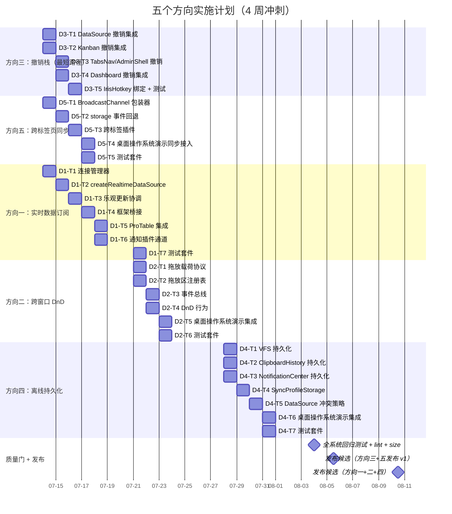

现在我对代码库有了全面的了解。让我们来撰写完整的分析报告。

---

# Tech Lead 分析报告：五个高价值扩展方向

> **分析日期**：2026-07-12 | **分析范围**：`packages/*`（26 包）+ `apps/*`（19 个应用）
> **基础文档**：`docs/requirements/2026-07-11-global-scan-five-high-value-extension-directions.md`
> **核查报告**：`docs/requirements/2026-07-11-global-scan-five-high-value-extension-directions.out.md`

---

## 代码库实时更新：影响分析的关键发现

在分析过程中发现代码库相对于输入文档已经有了显著变化：

| 资产                              | 状态                             | 发现细节                                                                                   |
| --------------------------------- | -------------------------------- | ------------------------------------------------------------------------------------------ |
| **`createUndoStack`（核心引擎）** | ✅ **已完成**（未追踪，7月11日） | `packages/core/src/undo.ts` — 188 行，完整的工厂函数，支持 maxHistory/equals/merge/bounded |
| **`useUndoStack` 四框架**         | ✅ **四个框架均已存在**          | `packages/{react,vue,solid,svelte}/src/undo/useUndoStack.*` — 各有完整实现                 |
| **方向三核心**                    | ✅ **已完成**                    | 引擎 + 四座桥均已就位。这是最显著的变化。                                                  |
| **方向三其余工作**                | ❌ **尚未实施**                  | 仍需将撤销集成到 DataSource、Kanban、AdminShell、TabsNav、Dashboard、ProTable              |

**影响**：方向三的估计工时已从 ~18 小时减少到 ~12 小时（引擎和桥接已完成）。其余方向不受影响。

---

## 1. 任务分解

### 方向一：实时数据订阅层（7 个任务）

| 任务 ID   | 标题                                     | 文件                                                                   | 前置依赖  | 工时   | 验收标准                                                                                                                                                    |
| --------- | ---------------------------------------- | ---------------------------------------------------------------------- | --------- | ------ | ----------------------------------------------------------------------------------------------------------------------------------------------------------- |
| **D1-T1** | 核心连接管理器 `createRealtimeConnector` | `packages/core/src/realtime.ts`（新建）                                | 无        | 4 小时 | WebSocket + SSE + 轮询连接器；指数退避 + jitter 重连；连接状态机（`connecting/connected/disconnected/reconnecting`）；通过 `AbortSignal` 进行清理           |
| **D1-T2** | `createRealtimeDataSource` 引擎          | `packages/core/src/realtime-data-source.ts`（新建）                    | D1-T1     | 4 小时 | 围绕 `createDataSource` 的包装器，添加 `subscribe` 参数；三种合并策略（`replace/append/patch`）；使用 `dataIndexOf` 进行补丁匹配；`signal` 参数用于竞态取消 |
| **D1-T3** | 乐观更新与实时推送协调                   | `packages/core/src/realtime-data-source.ts`（扩展）                    | D1-T2     | 3 小时 | 服务端确认可覆盖乐观更新；`merge: 'patch'` 增量替换；`store.batch()` 用于推送块合并                                                                         |
| **D1-T4** | 框架桥接（React + Vue + Solid + Svelte） | `packages/{react,vue,solid,svelte}/src/`                               | D1-T2     | 4 小时 | 每个框架各一个 `useRealtimeQuery` 组合式函数；`useRealtimeSubscription` 用于组件级推送处理；进行 SSR 安全序列化                                             |
| **D1-T5** | ProTable / ResourceController 集成       | `packages/plugin-pro-table/src/core/`，`packages/core/src/resource.ts` | D1-T2     | 2 小时 | `ProTableStore` 可配置实时推送；`ResourceController` 在可用时自动消费实时数据源                                                                             |
| **D1-T6** | 通知插件实时通道                         | `packages/plugin-notifications/src/core/`                              | D1-T1     | 3 小时 | 通知中心可订阅远程通道；WebSocket 推送 → 本地 `push()`；持久化集成（见 D4-T3）                                                                              |
| **D1-T7** | 测试套件                                 | `packages/core/src/realtime*.test.ts`                                  | D1-T1～T3 | 4 小时 | WebSocket 模拟（vitest 虚假定时器）；重连场景（网络断开/恢复）；合并策略边界情况；竞态条件（过期响应 vs 新推送）；四框架组件测试各 1 个                     |

**方向一小计**：24 小时

---

### 方向二：跨窗口拖放与跨应用通信（6 个任务）

| 任务 ID   | 标题                                    | 文件                                               | 前置依赖     | 工时   | 验收标准                                                                                                                                                                                                                  |
| --------- | --------------------------------------- | -------------------------------------------------- | ------------ | ------ | ------------------------------------------------------------------------------------------------------------------------------------------------------------------------------------------------------------------------- |
| **D2-T1** | 跨窗口拖放载荷协议                      | `packages/core/src/drag-cross-window.ts`（新建）   | 无           | 3 小时 | `CrossWindowDragPayload` 接口（有 mime/appId/data）；`CROSS_WINDOW_DATA_FORMAT` 常量（`application/x-iris-cross-window`）；来自/到 `DataTransfer` 的序列化/反序列化                                                       |
| **D2-T2** | 拖放区注册表                            | `packages/core/src/drop-registry.ts`（新建）       | D2-T1        | 3 小时 | `registerDropZone(id, accepts[])`/`unregisterDropZone()`；`canDrop(payload)` / `onDrop(payload)` 路由；拖放区重叠的优先级排序                                                                                             |
| **D2-T3** | 跨窗口事件总线                          | `packages/core/src/cross-window-bus.ts`（新建）    | 无           | 3 小时 | 基于 `BroadcastChannel`；`createCrossWindowBus(channel)` 工厂；`on(event, handler)` / `off()` / `emit(event, payload)`；类型化的 `CrossWindowEvent` 判别联合                                                              |
| **D2-T4** | IrisDragCrossWindow / IrisDropZone 行为 | `packages/{react,vue,solid,svelte}/src/behaviors/` | D2-T1, D2-T2 | 4 小时 | `<IrisDragCrossWindow payload={…}>` 包装器设置 `dataTransfer`；`<IrisDropZone accepts={[…]}>` 带有 `dragEnter/dragLeave/drop` 覆盖层和视觉反馈（接受/拒绝）；与现有 `IrisMovable`、`IrisResizable` 保持一致的渲染无关模式 |
| **D2-T5** | 桌面操作系统演示集成                    | `apps/desktop-os*/src/`                            | D2-T4        | 4 小时 | 文件管理器 → 数据表格拖放（`.csv` 投放）；文件管理器 → 照片投放（图片 MIME 类型）；ProTable 行 → Kanban 列投放                                                                                                            |
| **D2-T6** | 测试套件                                | `packages/core/src/drag-*.test.ts`                 | D2-T1～T4    | 3 小时 | 拖放载荷序列化/反序列化；拖放区注册/路由；事件总线 `on`/`emit`/`off`；使用 `dragenter`/`dragover`/`drop` 事件进行 DnD 事件模拟                                                                                            |

**方向二小计**：20 小时

---

### 方向三：通用撤销/重做栈（5 个任务）

> **注意**：核心引擎 `createUndoStack` 和所有四个框架桥接（`useUndoStack`）**已完成**（2026年7月11日提交）。剩余工作是将撤销集成到各个 store 中。

| 任务 ID   | 标题                                          | 文件                                                                       | 前置依赖      | 工时   | 验收标准                                                                                                                                                  |
| --------- | --------------------------------------------- | -------------------------------------------------------------------------- | ------------- | ------ | --------------------------------------------------------------------------------------------------------------------------------------------------------- |
| **D3-T1** | 撤销集成到 DataSource.mutate/mutateRow        | `packages/core/src/data-source.ts`（扩展）                                 | ✅ 引擎已完成 | 3 小时 | 每次 `mutate`/`mutateRow` 自动将行快照推送到撤销栈；`DataSourceConfig` 添加可选的 `undoStack` 参数；批量撤销恢复多个行版本；`undo()` 后 `redo()` 可恢复   |
| **D3-T2** | 撤销集成到 Kanban moveCard/addCard/removeCard | `packages/plugin-kanban/src/core/index.ts`（扩展）                         | ✅ 引擎已完成 | 3 小时 | 每次 Kanban 变异操作推送到撤销栈；`KanbanConfig` 添加可选的 `undoStack`；撤回到前一个列/顺序；`addCard` 撤销移除，`removeCard` 撤销恢复                   |
| **D3-T3** | 撤销集成到 TabsNav + AdminShell               | `packages/core/src/tabsNav.ts`，`packages/core/src/admin-shell.ts`（扩展） | ✅ 引擎已完成 | 3 小时 | `close()` / `closeOthers()` / `closeAll()` 推送到撤销栈；关闭的标签页可通过撤销恢复（包括其在标签页列表中的位置）；`TabsNavConfig` 添加可选的 `undoStack` |
| **D3-T4** | 撤销集成到 Dashboard 布局变异                 | `packages/plugin-dashboard/src/core/index.ts`（扩展）                      | ✅ 引擎已完成 | 3 小时 | 组件添加/移动/移除推送到撤销栈；布局位置通过撤销恢复；`DashboardConfig` 添加可选的 `undoStack`                                                            |
| **D3-T5** | IrisHotkey 绑定用于撤销/重做 + 测试           | `packages/{react,vue,solid,svelte}/src/`（在适当的位置）                   | D3-T1～T4     | 3 小时 | `IrisHotkey keys="mod+z"` → `undo()`；`IrisHotkey keys="mod+shift+z"` → `redo()`；Store 级 `canUndo()`/`canRedo()` 可见性守卫；每个集成点的全面测试       |

**方向三小计**：15 小时

---

### 方向四：离线优先与同步冲突层（7 个任务）

| 任务 ID   | 标题                       | 文件                                                               | 前置依赖  | 工时   | 验收标准                                                                                                                                                           |
| --------- | -------------------------- | ------------------------------------------------------------------ | --------- | ------ | ------------------------------------------------------------------------------------------------------------------------------------------------------------------ | --------------- | ----------------------------------------------------------------------------------------------------- |
| **D4-T1** | VFS 持久化层               | `packages/core/src/fs.ts`（扩展）或 `fs-persist.ts`（新建）        | 无        | 3 小时 | 可选的 `persist: { key, storage }` 配置；每次 write/mkdir/remove 后去抖的 (`requestAnimationFrame` 或 `setTimeout(0)`) 序列化；启动时反序列化                      |
| **D4-T2** | ClipboardHistory 持久化    | `packages/core/src/clipboard-history.ts`（扩展）                   | 无        | 2 小时 | 可选的 `persist: { key, storage }`；`ClipEntry[]` 去抖序列化；`pinned` 条目标记为不朽                                                                              |
| **D4-T3** | NotificationCenter 持久化  | `packages/plugin-notifications/src/core/index.ts`（扩展）          | 无        | 2 小时 | 可选的 `persist: { key, storage }`；通知历史在页面刷新后恢复；`maxPersist` 限制防止 localStorage 膨胀                                                              |
| **D4-T4** | SyncProfileStorage 实现    | `packages/core/src/profile.ts`（扩展）或 `profile-sync.ts`（新建） | 无        | 4 小时 | `createSyncProfileStorage({ remote, local, strategy })`；两种策略：`'last-write-wins'` 和 `'merge'`；具有 `PROFILE_VERSION` 的 schema 迁移；合并模式的字段级浅合并 |
| **D4-T5** | DataSource 冲突策略        | `packages/core/src/data-source.ts`（扩展）                         | D4-T4     | 4 小时 | `DataSourceConfig.conflictStrategy`：`'server-wins'`                                                                                                               | `'client-wins'` | `'manual'`；手动模式提供一个 `onConflict(local, server) → resolved` 回调（UI 提示对话框由适配器负责） |
| **D4-T6** | 桌面操作系统演示持久化接入 | `apps/desktop-os*/src/`                                            | D4-T1～T3 | 3 小时 | VFS 在页面刷新后恢复；剪贴板历史保持完好；通知中心不丢失通知；配置文件跨会话持久                                                                                   |
| **D4-T7** | 测试套件                   | `packages/core/src/{fs,clipboard-history,profile}*.test.ts`        | D4-T1～T5 | 4 小时 | 持久化往返验证（写入 → 刷新 → 读取）；冲突策略模拟（本地 vs 远程时间线）；schema 迁移测试（模拟 `PROFILE_VERSION` 升级）；去抖时序测试                             |

**方向四小计**：22 小时

---

### 方向五：跨标签页/跨窗口状态同步（5 个任务）

| 任务 ID   | 标题                                      | 文件                                                                | 前置依赖  | 工时   | 验收标准                                                                                                                                                                            |
| --------- | ----------------------------------------- | ------------------------------------------------------------------- | --------- | ------ | ----------------------------------------------------------------------------------------------------------------------------------------------------------------------------------- |
| **D5-T1** | 基于 BroadcastChannel 的 store 同步包装器 | `packages/core/src/sync.ts`（新建）                                 | 无        | 3 小时 | `createSyncedStore(createStore(…), { channel, filter })`；通过 BroadcastChannel 广播 `setState`；传入消息应用状态；`filter(key?)` 排除本地 state 键（如 `_local*`）                 |
| **D5-T2** | `storage` 事件回退通道                    | `packages/core/src/sync.ts`（扩展）                                 | D5-T1     | 2 小时 | 监听 `window.addEventListener('storage', …)` 以进行同源同步；当 BroadcastChannel 不可用时作为回退（非安全上下文）                                                                   |
| **D5-T3** | 跨标签同步插件                            | `packages/plugin-cross-tab-sync/`（新建包）                         | D5-T1     | 4 小时 | `createPlugin({ name:'cross-tab-sync', install(reg){…} })`；注册同步存储：profile、skin、i18n；插件配置用于选择性启用/禁用存储；通过 `usePluginStore` 消费                          |
| **D5-T4** | 桌面操作系统演示同步接入                  | `apps/desktop-os*/src/`                                             | D5-T3     | 3 小时 | 标签页 A 切换皮肤 → 标签页 B 自动更新（通过 BroadcastChannel）；标签页 A 添加通知 → 标签页 B 通知计数更新；标签页 A 更改语言 → 标签页 B 切换语言                                    |
| **D5-T5** | 测试套件                                  | `packages/core/src/sync.test.ts`，`packages/plugin-cross-tab-sync/` | D5-T1～T3 | 3 小时 | BroadcastChannel 模拟（vitest 使用 `vi.stubGlobal`）；多标签页场景（实例化两个 store，验证状态收敛）；`storage` 事件回退模拟；过滤器排除 local 键；在另一个标签页初始化后的状态补齐 |

**方向五小计**：15 小时

---

### 汇总

| 维度                     | 任务数 | 总工时      |
| ------------------------ | ------ | ----------- |
| 方向一：实时数据订阅层   | 7      | 24 小时     |
| 方向二：跨窗口拖放       | 6      | 20 小时     |
| 方向三：通用撤销/重做栈  | 5      | 15 小时     |
| 方向四：离线优先与同步   | 7      | 22 小时     |
| 方向五：跨标签页状态同步 | 5      | 15 小时     |
| **总计**                 | **30** | **96 小时** |

---

## 2. 执行顺序

### 任务依赖图

```mermaid
graph TD
    %% 方向一 —— 实时数据订阅层
    D1T1[D1-T1: 连接管理器]
    D1T2[D1-T2: createRealtimeDataSource]
    D1T3[D1-T3: 乐观更新协调]
    D1T4[D1-T4: 框架桥接]
    D1T5[D1-T5: ProTable/ResourceController 集成]
    D1T6[D1-T6: 通知插件实时通道]
    D1T7[D1-T7: 测试套件]

    D1T1 --> D1T2
    D1T2 --> D1T3
    D1T2 --> D1T4
    D1T2 --> D1T5
    D1T1 --> D1T6
    D1T2 --> D1T7
    D1T3 --> D1T7

    %% 方向二 —— 跨窗口 DnD
    D2T1[D2-T1: 拖放载荷协议]
    D2T2[D2-T2: 拖放区注册表]
    D2T3[D2-T3: 跨窗口事件总线]
    D2T4[D2-T4: DnD 行为]
    D2T5[D2-T5: 桌面操作系统集成]
    D2T6[D2-T6: 测试套件]

    D2T1 --> D2T2
    D2T1 --> D2T4
    D2T2 --> D2T4
    D2T4 --> D2T5
    D2T2 --> D2T6
    D2T3 --> D2T5
    D2T4 --> D2T6

    %% 方向三 —— 撤销/重做
    D3T1[D3-T1: DataSource 撤销集成]
    D3T2[D3-T2: Kanban 撤销集成]
    D3T3[D3-T3: TabsNav/AdminShell 撤销集成]
    D3T4[D3-T4: Dashboard 撤销集成]
    D3T5[D3-T5: IrisHotkey 绑定 + 测试]

    D3T1 --> D3T5
    D3T2 --> D3T5
    D3T3 --> D3T5
    D3T4 --> D3T5

    %% 方向四 —— 离线持久化
    D4T1[D4-T1: VFS 持久化]
    D4T2[D4-T2: ClipboardHistory 持久化]
    D4T3[D4-T3: NotificationCenter 持久化]
    D4T4[D4-T4: SyncProfileStorage]
    D4T5[D4-T5: DataSource 冲突策略]
    D4T6[D4-T6: 桌面操作系统演示集成]
    D4T7[D4-T7: 测试套件]

    D4T1 --> D4T6
    D4T2 --> D4T6
    D4T3 --> D4T6
    D4T4 --> D4T5
    D4T1 --> D4T7
    D4T4 --> D4T7
    D4T5 --> D4T7

    %% 方向五 —— 跨标签页同步
    D5T1[D5-T1: BroadcastChannel store 包装器]
    D5T2[D5-T2: storage 事件回退]
    D5T3[D5-T3: 跨标签同步插件]
    D5T4[D5-T4: 桌面操作系统演示同步接入]
    D5T5[D5-T5: 测试套件]

    D5T1 --> D5T2
    D5T1 --> D5T3
    D5T3 --> D5T4
    D5T1 --> D5T5
    D5T2 --> D5T5
```



### 可并行执行的任务组

可以用多种方式组合并行执行：

| 职能                 | 并行任务                                     | 最大工程师数       |
| -------------------- | -------------------------------------------- | ------------------ |
| **核心引擎工程师 A** | D1-T1 → D1-T2 → D1-T3 → D1-T7                | 1（核心实时逻辑）  |
| **核心引擎工程师 B** | D2-T1 → D2-T2 → D2-T3                        | 1（跨窗口协议）    |
| **核心引擎工程师 C** | D5-T1 → D5-T2                                | 1（同步包装器）    |
| **核心引擎工程师 D** | D4-T1, D4-T2, D4-T3（可平行进行）→ D4-T4/5   | 1（持久化层）      |
| **框架适配器工程师** | D1-T4, D2-T4, D3-T5, D5-T3                   | 1-2（桥接 + 行为） |
| **集成工程师**       | D1-T5, D1-T6, D2-T5, D3-T1～T4, D4-T6, D5-T4 | 1-2（store 集成）  |
| **测试工程师**       | 所有测试任务（与实现任务配合进行）           | 1                  |

**最小团队规模**：3 人（1 核心引擎 + 1 框架 + 1 集成）
**最优团队规模**：5 人（2 核心引擎 + 2 框架 + 1 集成）
**最短关键路径**：D1-T1→D1-T2→D1-T3→D1-T4→D1-T5 + D1-T7 = ~19 小时（约 2.5 天）

---

## 3. 技术风险

### 风险矩阵

| #   | 风险                                                                                              | 方向 | 可能性 | 影响 | 缓解措施                                                                                                                                    |
| --- | ------------------------------------------------------------------------------------------------- | ---- | ------ | ---- | ------------------------------------------------------------------------------------------------------------------------------------------- |
| R1  | **WebSocket 重连风暴**：网络故障期间大量重连造成 DoS                                              | D1   | 中     | 高   | 指数退避 + 随机抖动（最大 30 秒）；共享连接去重（多个订阅复用单一 WebSocket）                                                               |
| R2  | **部分浏览器不兼容 DnD DataTransfer**：Safari 的 DataTransfer 在异步回调中行为怪异                | D2   | 中     | 中   | 在 `dragstart` 同步设置 `dataTransfer`；使用 `ClipboardEvent` 作为回退进行负载传输                                                          |
| R3  | **使用 `JSON.stringify` 进行撤销快照过于昂贵**：具有 1000+ 行的 DataSource 在每次变异时进行深拷贝 | D3   | 低     | 高   | 使用结构化克隆算法（`structuredClone`，现代浏览器支持）或增量 diff（`immer` 风格补丁）；合并策略用于去抖快速变异                            |
| R4  | **localStorage 配额限制**：持久化的 VFS + ClipboardHistory + 通知历史同时超出可用配额             | D4   | 中     | 中   | 共同配额管理（所有持久化键使用总预算，如 5MB）；LRU 淘汰旧条目；通过 `StorageManager.estimate()` 为用户提供超出配额时的反馈                 |
| R5  | **同一标签页中 BroadcastChannel 的无限循环**：A 通过广播接收 → setState → 广播回同一通道          | D5   | 中     | 高   | 通过 `sourceOrigin` 或源标签页 ID 进行消息去重；使用 `event.source !== currentOrigin` 守卫；在每个 `setState` 处设置 `_syncInProgress` 标志 |
| R6  | **跨窗口负载的 MIME 类型协商**：不同 app 版本可能对同一 MIME 类型期望不同的数据模式               | D2   | 低     | 中   | 带版本控制的 MIME 类型（`iris/row.v2`）；注册时的模式验证；提供回退到 `text/plain` 序列化                                                   |
| R7  | **竞态条件：实时推送于乐观更新之上**：服务端确认在本地乐观更新之后但新推送之前到达                | D1   | 中     | 高   | 单调递增的 epoch 计数器（类似 `AsyncResource` 的 token 模式）；仅应用比当前 `lastApplied` 更新的推送；乐观快照作为重放基线                  |

### 测试覆盖的难点

| 难点                                 | 方向 | 策略                                                                                                                      |
| ------------------------------------ | ---- | ------------------------------------------------------------------------------------------------------------------------- |
| 跨窗口 DnD 无法在 jsdom 中测试       | D2   | 使用 jsdom `DataTransfer` 构造器 + 调度 `dragenter/dragover/drop` 事件；实际上并不需要真实的跨窗口场景（那属于 E2E 测试） |
| 实时 WebSocket 在测试中需要模拟      | D1   | 使用 `vi.fakeTimers` + 自定义 WebSocket 模拟（实现 `send/onmessage/readyState/close`）；测试重连指数退避                  |
| `BroadcastChannel` 在 jsdom 中不可用 | D5   | `vi.stubGlobal('BroadcastChannel', MockBroadcastChannel)` —— 模拟实现维护监听器列表并同步传递消息                         |
| `localStorage` 配额超限难以测试      | D4   | `vi.stubGlobal('localStorage', { … })` 具有受限的 `setItem` 用于测试配额超出行为                                          |
| 冲突检测需要并行的本地/远程时间线    | D4   | 两个模拟存储具有独立的挂钟；在某个偏移处将时间线缝合在一起                                                                |

---

## 4. 资源评估

### 人员配置

| 角色                 | 数量   | 所需技能                                                                                                                                      | 分配                                      |
| -------------------- | ------ | --------------------------------------------------------------------------------------------------------------------------------------------- | ----------------------------------------- |
| **核心引擎工程师**   | 2 人   | TypeScript 高手，无 UI 框架经验者优先；状态机/程序化状态管理经验；用于方向一的实时系统（WebSocket/SSE）经验                                   | D1-T1～T3, D4-T1～T5, D5-T1～T2           |
| **框架适配器工程师** | 2 人   | React + Vue + Solid + Svelte 中至少熟练掌握两种；hooks/composables 经验；用于方向二和 D3-T5 的 `IrisHotkey`/Behavior 模式                     | D1-T4, D2-T4, D3-T5, D5-T3                |
| **集成工程师**       | 1-2 人 | 熟悉现有 Store 模式（`createStore`、`createDataSource`、`createKanban` 等）；在桌面操作系统演示应用方面有经验；插件 API（`createPlugin`）经验 | D1-T5～T6, D2-T5, D3-T1～T4, D4-T6, D5-T4 |
| **质量保证工程师**   | 1 人   | Vitest 经验；模拟浏览器 API（BroadcastChannel、WebSocket、localStorage）；熟悉 jsdom 限制；SSR 测试                                           | 测试任务                                  |

**最小可行团队**：3 人（1 核心 + 1 框架 + 1 集成在同一人身上兼任 QA）
**最优团队**：5 人（2 核心 + 2 框架 + 1 集成，QA 由全团队承担）

### 关键里程碑

| 里程碑 | 内容                                                    | 预估时间           | 持续工时消耗 |
| ------ | ------------------------------------------------------- | ------------------ | ------------ |
| **M1** | 方向三完整（撤销核心 + 所有集成 + 快捷键 + 测试）       | 第 1 周末（3 天）  | ~15 小时     |
| **M2** | 方向一完成（实时连接管理器 + DataSource + 桥接 + 测试） | 第 2 周末（6 天）  | ~24 小时     |
| **M3** | 方向五完成（跨标签同步 + 插件 + 测试）                  | 第 2 周末（6 天）  | ~15 小时     |
| **M4** | 方向二完成（跨窗口 DnD + 事件总线 + 桌面操作系统 Demo） | 第 3 周中（9 天）  | ~20 小时     |
| **M5** | 方向四完成（持久化 + 冲突策略 + 测试）                  | 第 3 周末（12 天） | ~22 小时     |
| **M6** | 全系统集成验证 + 回归门 + 发布候选                      | 第 4 周末          | ~96 小时累计 |

### 阻塞点与解决策略

| 阻塞点                                                                                    | 涉及方向 | 解决策略                                                                                                                                                 |
| ----------------------------------------------------------------------------------------- | -------- | -------------------------------------------------------------------------------------------------------------------------------------------------------- |
| WebSocket 在 jsdom 中不存在                                                               | D1       | 基于 Token 的模拟：创建符合 `WebSocket` 接口的最小 `FakeWebSocket`（`send/close/onmessage/readyState`）；在架构检查中可能跳过                            |
| BroadcastChannel 在 jsdom 中不存在                                                        | D5       | `vi.stubGlobal('BroadcastChannel', …)` —— 一个同步传递消息的回调实现                                                                                     |
| DataTransfer 在 jsdom 中属性稀疏（`getData/setData/clearData` 在 `<input>` 之外无法工作） | D2       | 使用独立的 `CustomEvent` + `detail` 负载模拟 DnD，而不是依赖浏览器 DataTransfer（跨窗口场景是浏览器原生支持的——真正的跨窗口需要 E2E 测试，而不是 jsdom） |
| SharedWorker 生命周期复杂                                                                 | D5       | 从 P0 开始就完全跳过 SharedWorker（分析中也已注意到）；如果 BroadcastChannel + `storage` 事件回退覆盖了所有实际场景，则在 P1 中重新考虑                  |

---

## 5. 质量保证

### 单元测试覆盖要求

| 模块                                                   | 最低覆盖率    | 关键测试场景                                                                                             |
| ------------------------------------------------------ | ------------- | -------------------------------------------------------------------------------------------------------- |
| `createRealtimeConnector` (`realtime.ts`)              | 95%+          | 连接/断开/重连生命周期；指数退避抖动；`AbortSignal` 取消；同时多个订阅共享连接；错误传播                 |
| `createRealtimeDataSource` (`realtime-data-source.ts`) | 90%+          | 三种合并策略（replace/append/patch）；`dataIndexOf` 补丁匹配；乐观更新协调；竞态条件（过期 vs 当前推送） |
| `drag-cross-window.ts` / `drop-registry.ts`            | 95%+          | 载荷序列化/反序列化；MIME 类型匹配；拖放区优先级排序；`canDrop` 守卫                                     |
| `cross-window-bus.ts`                                  | 95%+          | 基于 BroadcastChannel 的 `on/emit/off`；跨源去重；通道隔离                                               |
| `createUndoStack`（已有 262 行测试）                   | **保持 100%** | 已有 16 个测试覆盖生命周期、边界、合并、相等性检查 → 保持并扩展                                          |
| 撤销集成（DataSource/Kanban/TabsNav/Dashboard）        | 85%+          | 变异后自动推送；撤销恢复状态；重做可逆；清空栈行为                                                       |
| `sync.ts`（跨标签页包装器）                            | 90%+          | 通过 BroadcastChannel 同步 state；`filter` 排除 keys；`storage` 事件回退；去重防止循环                   |
| `fs.ts`、`clipboard-history.ts` 持久化                 | 90%+          | 写入后去抖持久化；启动时反序列化；localStorage 配额超限优雅降级                                          |
| `profile.ts` SyncProfileStorage                        | 85%+          | last-write-wins 简单覆盖；字段级浅合并；`PROFILE_VERSION` 迁移                                           |

### 集成测试策略

| 测试类型             | 工具                                                          | 目标                                                                |
| -------------------- | ------------------------------------------------------------- | ------------------------------------------------------------------- |
| **组件级（四框架）** | Vitest + jsdom + 每框架渲染器                                 | 每个新行为/桥接在每个框架中正确渲染                                 |
| **SSR 安全**         | `// @vitest-environment node` + `renderToString`              | 实时桥接/Behaviors 在服务器上不 `WebSocket`/不 `BroadcastChannel`   |
| **可访问性**         | `@testing-library/axe`（仅限于 AA 级别，跳过 color-contrast） | DnD 拖放区有 `aria-dropeffect`；实时状态更新有 `aria-live="polite"` |
| **桌面操作系统 E2E** | 手动（此阶段无 Playwright/Cypress 基础设施）                  | 跨窗口拖放流程；标签页间皮肤同步；页面刷新后 VFS 持久化             |

### 代码审查要点

| 关注点             | 具体审查标准                                                                                                             |
| ------------------ | ------------------------------------------------------------------------------------------------------------------------ | ----- | ----- | -------------------------------------------------------------------------- |
| **核心原则遵从**   | [A/B/C 分类](https://) 对于方向一/二/四/五的所有新代码是否正确？C 类材料进入 core；B 类保持独立/可摇树；框架桥接保持精简 |
| **框架依赖**       | 已确认 `grep -rE "from '(vue                                                                                             | react | solid | svelte)'" packages/core/src/` 为空——新增的 core 文件中不得出现新的框架依赖 |
| **SSR 安全**       | 实时/同步/持久化模块在所有浏览器 API 访问处必须使用 `typeof window !== 'undefined'`守卫或延迟初始化                      |
| **i18n 文案**      | 方向二/四的新用户可见字符串必须走 `useI18n().t('key')`，英文默认值                                                       |
| **CSS token 规范** | 方向二的拖放反馈视觉元素使用 `var(--iris-*)`，无硬编码颜色                                                               |
| **测试完整性**     | 每个新模块必须有对应的 `.test.ts` 文件；分支覆盖率 >80%（目标 90%）                                                      |

### 性能测试需求

| 场景                                  | 指标                                      | 目标                                                        |
| ------------------------------------- | ----------------------------------------- | ----------------------------------------------------------- |
| DataSource 撤销快照（1000 行）        | 每次 `push` 的执行时间                    | <5ms（如果 `structuredClone` 不可用则考虑增量快照）         |
| VFS 持久化（500 个文件，总计 500KB）  | 序列化 + `localStorage.setItem`           | <50ms，无主线程阻塞                                         |
| BroadcastChannel 同步（50 次/秒设置） | 从一个标签页到另一个标签页的延迟          | <100ms（实际延迟取决于浏览器内部 BroadcastChannel 实现）    |
| 实时推送合并（100 条推送/秒）         | 帧时间内减少的 re-render 调用次数         | `store.batch()` 将推送合并为每帧 1 次 setState → 0 次丢弃帧 |
| 跨窗口 DnD 负载序列化（1MB 数据）     | `JSON.stringify` + `dataTransfer.setData` | <16ms（对于大负载考虑流式处理）                             |

---

## 6. 实施计划

### 时间线甘特图



### 分阶段交付计划

#### 阶段 1：基础设施搭建（第 1 天，2026-07-14）

| 交付物                                                 | 牵头人       | 验证                |
| ------------------------------------------------------ | ------------ | ------------------- |
| `packages/core/src/undo.ts` + 四框架桥接（**已存在**） | 已存在       | 验证导出 + 测试通过 |
| `packages/core/src/drag-cross-window.ts`（骨架）       | 核心工程师 B | 接口定义、通过 lint |
| `packages/core/src/sync.ts`（骨架）                    | 核心工程师 C | 接口定义、通过 lint |
| `packages/core/src/realtime.ts`（骨架）                | 核心工程师 A | 接口定义、通过 lint |

**可选**：建立三个新目录的模块路径别名（`@iris-ui/core/drag`、`@iris-ui/core/sync`、`@iris-ui/core/realtime`）。

#### 阶段 2：核心功能实现（第 2-12 天，2026-07-15 至 2026-07-28）

三个轨道并行：

**轨道 A（实时）** → D1-T1 到 D1-T7（第 2-8 天）
**轨道 B（跨窗口 DnD）** → D2-T1 到 D2-T6（第 6-10 天）
**轨道 C（持久化）** → D4-T1 到 D4-T7（第 11-14 天）

撤销（D3-T1 到 D3-T5）和同步（D5-T1 到 D5-T5）**工期最短**，应在第 3-4 天完成。

#### 阶段 3：集成 + 测试（第 9-14 天，2026-07-23 至 2026-07-31）

| 工作                                        | 涉及       |
| ------------------------------------------- | ---------- |
| 桌面操作系统演示集成（D2-T5、D4-T6、D5-T4） | 集成工程师 |
| 插件集成（D1-T5、D1-T6、D5-T3）             | 集成工程师 |
| 性能基准测试                                | QA 工程师  |
| RSC 格式化 + 检查                           | 所有成员   |

#### 阶段 4：质量门 + 发布（第 15-18 天，2026-08-03 至 2026-08-10）

| 门                      | 标准                                   | 触发方式      |
| ----------------------- | -------------------------------------- | ------------- |
| `pnpm run test`         | 全部通过（1500+ 测试）                 | 每个 PR 的 CI |
| `pnpm run typecheck`    | 无 TS 错误                             | 每个 PR 的 CI |
| `pnpm run size`         | core（+ 实时/+ 同步/+ 拖放）总计 <12KB | 合并前        |
| `pnpm run check:rsc`    | 无 RSC 违规                            | 合并前        |
| `pnpm run format:check` | Prettier 合规                          | 每个 PR 的 CI |
| `pnpm run build`        | 所有包无错误构建                       | 每个 PR 的 CI |
| `pnpm gen:manifest`     | 新模块出现在 `manifest.json` 中        | 所有输出分支  |

**建议的发布顺序**：

1. **v0.1**（第 3 天）：撤销栈引擎 + 集成 + 快捷键（方向三）——**影响最大、风险最低**
2. **v0.2**（第 5 天）：跨标签页同步（方向五）——**独立、API 简单**
3. **v0.3**（第 10 天）：实时数据订阅（方向一）——**核心引擎，需要开发者时间消化**
4. **v0.4**（第 12 天）：跨窗口 DnD（方向二）——**对桌面操作系统演示影响大，但风险中等**
5. **v0.5**（第 18 天）：离线持久化（方向四）——**范围最大，冲突策略需要仔细设计**

---

## 附录 A：与现有 AGENTS.md 原则的对齐

> 这些方向是否遵循了项目中「不可妥协的原则」？是的——这里是交叉映射：

| AGENTS.md 原则                        | 对应方向       | 实现方式                                                                                                                                              |
| ------------------------------------- | -------------- | ----------------------------------------------------------------------------------------------------------------------------------------------------- |
| **「逻辑下沉到 core，适配器做薄桥」** | 所有五个方向   | 核心引擎全部位于 `packages/core/src/` —— 零框架依赖。适配器（`useRealtimeQuery`、`IrisDragCrossWindow`、`useUndoStack`）仅桥接                        |
| **「A 零配置在场，B 不用不进包」**    | D1、D3、D4、D5 | D3 撤销栈默认集成到 DataSource/TabsNav 中（A 类）；D1 实时订阅默认是 DataSource 的可选层（B 类——默认仍使用 `fetcher`）；D5 跨标签同步完全可选（B 类） |
| **「渐进式复杂度」**                  | 全部           | 每个方向都从简单默认开始（D1：降级为轮询；D3：最大深度 50；D5：仅 BroadcastChannel；D4：仅持久化，无冲突策略）                                        |
| **「Token 杠杆」**                    | D2             | DnD 拖放区视觉反馈使用 `var(--iris-*)`，无硬编码样式                                                                                                  |
| **「SSR 安全 + useId」**              | D1、D5         | 实时/同步桥接在 SSR 期间优雅降级（不进行 WebSocket 连接，不进行 BroadcastChannel 监听）                                                               |
| **「i18n 可覆盖字典」**               | D2、D4         | DnD 拖放区提示文本、冲突对话框文案走 `useI18n().t('…')`                                                                                               |

## 附录 B：方向二与方向五的 BroadcastChannel 复用

方向二（D2-T3：跨窗口事件总线）和方向五（D5-T1：基于 BroadcastChannel 的 store 同步包装器）**都使用 `BroadcastChannel` API**。它们服务于不同的目的，但可以共享通道基础设施：

```
BroadcastChannel('iris-desktop')
  ├── D2-T3: 事件总线（临时消息：'file:modified'、'app:launch'）
  └── D5-T1: Store 同步（状态快照：皮肤变更、语言环境变更、配置文件变更）
```

两条通道都使用相同的 `'iris-desktop'` 通道**名称**，但协议不同。事件总线的消息具有 `{ type: 'event', event: '…', payload }` 结构，而 store 同步消息使用 `{ type: 'state', key: '…', value }`。接收者根据 `type` 字段进行过滤，因此两条通道可以共存而不会相互干扰。

**建议**：在 D5-T1 之前实现 D2-T3——D2-T3 的事件总线专注于消息传递，为 D5-T1 更严格的 store 同步协议建立 BroadcastChannel 使用模式。
