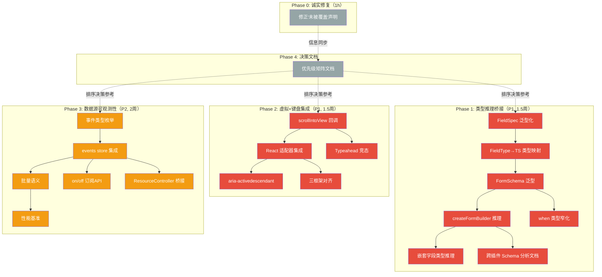

# Tech Lead 分析：Review 审查意见驱动的可执行实施计划

> **分析日期**：2026-07-12 · **角色**：Tech Lead  
> **输入**：Review 文档（基于 `2026-07-11-global-scan-five-novel-high-leverage-gaps.md` 的同行评审）  
> **前置假设**：审查的"重叠声明"已验证为真实。方向 ② 和 ④ 已在其他分析中完整覆盖，方向 ③ 和 ⑤ 有部分重叠但有增量价值。方向 ① 最扎实。

---

## 0. 元分析：审查发现与方向重映射

| 原始方向                  | 审查结论                                      | Tech Lead 裁决           | 处理方式                                                        |
| ------------------------- | --------------------------------------------- | ------------------------ | --------------------------------------------------------------- |
| ① Form Schema 类型推理    | ✅ 最扎实的方向，5/5                          | **保留，P1**             | 作为独立工作流执行                                              |
| ② Desktop OS 壳下沉       | ❌ 完全重复（已在 2026-07-10 覆盖）           | **合并**                 | 不作为新方向；链接到已有分析作为"第二优先级执行计划"            |
| ③ 虚拟滚动+键盘导航       | ⚠️ 部分重叠 + 自我引用问题                    | **保留但重新定位为增量** | 缩小范围至 `scrollIntoView` 回调 + `aria-activedescendant` 修复 |
| ④ 插件版本契约            | ❌ 完全重复（已在 2026-07-11 覆盖）           | **合并**                 | 不作为新方向；链接到已有分析作为"生态基建"                      |
| ⑤ DataSource 变更可观测性 | ⚠️ 部分新意（事件类型枚举 + 事件日志 design） | **保留，P2**             | 在已有"数据源变更日志"基础上追加事件类型枚举和日志设计          |

**核心原则**：不浪费精力复述已被完整覆盖的内容。将有限资源集中在真正的增量贡献上。

---

## 1. 任务分解

### 方向 ①：Form Schema 类型推理桥接（P1 · 最高优先级）

#### TASK-001：`FieldSpec` 泛型化 — 类型安全的字段定义

- **文件**：`packages/plugin-form-builder/src/core/index.ts`
- **描述**：将 `FieldSpec` 改造为 `FieldSpec<T, K extends keyof T>`，使 `name` 类型约束到 T 的键、`defaultValue` 类型约束到 `T[K]`。保持向后兼容：在未指定泛型时默认为 `Record<string, unknown>`。
- **前置**：无
- **工时**：3 小时
- **验收**：
  - `FieldSpec<{age: number}, 'age'>` 中 `defaultValue` 只接受 `number | undefined`
  - 现有无泛型用法 `FieldSpec` 编译通过（默认 `Record<string, unknown>`）
  - 类型测试覆盖 3 个用例：显式泛型、隐式默认、数组字段

#### TASK-002：`FieldType` → TS 类型映射器

- **文件**：`packages/plugin-form-builder/src/core/index.ts`
- **描述**：实现一个条件类型 `FieldTypeToTS<T>`，将 `'text' | 'number' | 'email' | 'password' | 'textarea' | 'select' | 'checkbox' | 'array'` 映射到 TS 原生类型（`string | number | boolean | string[]`）。这是类型推理的核心——根据 `type` 字段自动缩窄 `T[K]`。
- **前置**：TASK-001
- **工时**：2 小时
- **验收**：
  - `FieldTypeToTS<'number'>` = `number`
  - `FieldTypeToTS<'checkbox'>` = `boolean`
  - `FieldTypeToTS<'select'>` = `string`
  - `FieldTypeToTS<'array'>` = `unknown[]`
  - 测试：类型级别推理验证（通过 const assertion + `Expect<Equal<...>>`）

#### TASK-003：`FormSchema<T>` 泛型定义

- **文件**：`packages/plugin-form-builder/src/core/index.ts`
- **描述**：定义 `FormSchema<T extends FormValues>`，其 `fields` 数组的类型由 T 驱动。每个字段的 `name`、`defaultValue`、并且 `when` 回调的参数从 `FormValues` 收窄为 `T`。
- **前置**：TASK-002
- **工时**：3 小时
- **验收**：
  - `FormSchema<{age: number, name: string}>` 的 `fields[0].name` 限于 `'age' | 'name'`
  - `when: (values) => values.age > 18` 类型安全（`values.age` 是 `number`）
  - 隐式泛型时 `FormSchema` 退化为 `FormSchema<Record<string, unknown>>`

#### TASK-004：`createFormBuilder<T>` 类型推理

- **文件**：`packages/plugin-form-builder/src/core/index.ts`
- **描述**：重载 `createFormBuilder` 函数签名，使其能从 `schema` 参数自动推理出 `T`，并返回 `FormBuilder<T>`（而非 `FormBuilder`）。
- **前置**：TASK-003
- **工时**：2 小时
- **验收**：
  - `const builder = createFormBuilder({fields: [{name: 'age', type: 'number'}]})` → `builder.form.getState().values.age` 类型为 `number`
  - 现有代码 `createFormBuilder(schema)` 无泛型参数时零 breakage
  - 测试：使用 type tests（`expectTypeOf`）验证推理结果

#### TASK-005：嵌套字段（array sub-fields）类型推理

- **文件**：`packages/plugin-form-builder/src/core/index.ts`
- **描述**：处理 `FieldSpec<{items: Array<{sku: string, qty: number}>}, 'items'>` 场景，当 `type: 'array'` 时有 `fields` 嵌套字段。使 `defaultValue` 数组元素类型正确。
- **前置**：TASK-004
- **工时**：4 小时
- **验收**：
  - 数组子字段的 `defaultValue` 类型受约束
  - `arrayRowDefaults` 函数返回类型正确（`Record<string, unknown>` → `Partial<T[key]>`）
  - 覆盖边界：空 fields、多层级嵌套（数组内嵌数组）

#### TASK-006：条件字段（`when`）的类型窄化

- **文件**：`packages/plugin-form-builder/src/core/index.ts`
- **描述**：`when: (values: T) => boolean` 已由泛型实现，但还需要处理"条件为 false 时字段值类型仍存在但在运行时可能为 undefined"的类型等价性。实现一个 `ConditionalFieldValue<T, K>` 辅助类型。
- **前置**：TASK-003
- **工时**：2 小时
- **验收**：
  - 条件字段在 `when` 条件不满足时，`values.fieldName` 类型为 `T[K] | undefined`
  - 非条件字段类型不变

#### TASK-007：跨插件 Schema 类型统一分析 + 文档

- **文件**：`docs/tech-lead/`（新文件）
- **描述**：分析 `FormSchema`（form-builder）、`QueryColumn`（query-builder）、`AdminDataPage<Row>`（admin）之间的列/字段定义不兼容问题，提出统一基础类型方案。**不写代码——只产出设计文档**。
- **前置**：TASK-004（已理解类型推理机制）
- **工时**：3 小时
- **验收**：
  - 文档包含三种 schema 的对比表格
  - 指出共同接口设计方案（最少 2 种备选）
  - 评估破坏性影响（已有插件用户的迁移成本）

### 方向 ③：虚拟滚动 + 键盘导航集成（P1 · 增量修复）

#### TASK-008：`KeyboardNavConfig` 增加 `scrollIntoView` 回调

- **文件**：`packages/core/src/keyboard-nav.ts`
- **描述**：在 `KeyboardNavConfig` 接口中新增可选属性 `scrollIntoView?: (index: number) => void`。在 `handleKeyDown` 的 `ArrowUp/ArrowDown/Home/End` 路径中，当焦点移动后调用此回调（如果有）。控制器不负责滚动逻辑——只负责"通知"。
- **前置**：无
- **工时**：2 小时
- **验收**：
  - 接口定义已含 `scrollIntoView`
  - 当配置未提供时，行为与现有完全一致（零 breakage）
  - `move(delta)` 和 `focus(index)` 调用后触发回调
  - 单元测试验证回调被正确调用、调用时机正确

#### TASK-009：适配器层 `scrollIntoView` 实现（React 示例）

- **文件**：`packages/react/src/primitives/list/IrisList.tsx`
- **描述**：在 React `IrisList` 中，将 `createKeyboardNav` 配置中的 `scrollIntoView` 实现为 `virtualizer.scrollToIndex(index, 'start')`。**这是"三条断裂链路"的修复**。
- **前置**：TASK-008
- **工时**：3 小时
- **验收**：
  - 键盘 ArrowDown 到列表末尾后，虚拟器自动滚动
  - Home/End 跳转后目标在视口内
  - 边界：已可见项不触发多余滚动；空列表不报错
  - 测试：使用 mock virtualizer 验证 `scrollToIndex` 被调用

#### TASK-010：Typeahead + 虚拟滚动竞态处理

- **文件**：`packages/core/src/keyboard-nav.ts`
- **描述**：处理用户快速连续按键（typeahead）与虚拟滚动异步 scrollToIndex 回调的竞态。当上一个 scroll 回调尚未完成时，新 typeahead 匹配应取消之前的异步滚动。
- **前置**：TASK-008
- **工时**：4 小时
- **验收**：
  - 实现 `typeaheadScrollToken: number` 机制：新字符到来时递增 token，scrollIntoView 回调的前一 token 被忽略
  - 快速键入 'ca' 不会因为 `scrollToIndex('c')` 的异步回调晚于 'ca' 的匹配而跳到错误的项
  - 测试：用 fake timers 模拟异步 scroll 延迟

#### TASK-011：`aria-activedescendant` 的虚拟滚动适配

- **文件**：`packages/core/src/keyboard-nav.ts` + 适配器
- **描述**：在虚拟滚动场景下，`aria-activedescendant` 指向的 DOM ID 必须在 DOM 中。当焦点项不在视口内时，当前 ID 引用断裂（违反 WCAG SC 4.1.2）。修复：在 `scrollIntoView` 回调成功后（即项已在 DOM 中）才设置 `aria-activedescendant`。
- **前置**：TASK-009
- **工时**：3 小时
- **验收**：
  - 焦点项不在视口时，`aria-activedescendant` 要么设置为 `""`（清除），要么设置为一个已知在 DOM 中的后备元素
  - 滚动完成后，`aria-activedescendant` 更新为新焦点项
  - 测试：mock DOM 验证属性值

#### TASK-012：Svelte/Vue/Solid 适配器对齐（scrollIntoView 集成）

- **文件**：各框架适配器中的 IrisList / IrisTable 对应文件
- **描述**：将 TASK-009 的模式同步移植到 Svelte、Vue、Solid 的 List/Table 组件中。
- **前置**：TASK-009
- **工时**：5 小时（三个框架各约 1.5 小时）
- **验收**：
  - 三框架的虚拟列表键盘导航行为与 React 一致
  - 四框架测试通过（使用 contracts 场景验证行为一致性）

### 方向 ⑤：DataSource 变更可观测性（P2 · 在已有基础上增加事件类型枚举 + 日志架构）

#### TASK-013：定义 `DataSourceChangeType` 枚举和事件类型

- **文件**：`packages/core/src/data-source/types.ts`
- **描述**：新增 `DataSourceChangeType` 联合类型（11 种类型：`load`、`reload`、`page`、`sort`、`filter`、`create`、`update`、`delete`、`optimistic`、`confirmed`、`rollback`、`error`）。新增 `DataSourceChangeEvent<T>` 泛型接口。
- **前置**：无
- **工时**：1 小时
- **验收**：
  - 类型定义完整，与已有 `DataSourceController` 接口无冲突
  - 每个事件包含 `type`、`timestamp`、`rowKeys?`、`patch?`、`error?`、`epoch`、`snapshot`
  - JSDoc 标明每个事件类型的语义

#### TASK-014：`events` store 集成到 `createDataSource`

- **文件**：`packages/core/src/data-source.ts`
- **描述**：在 `createDataSource` 内部创建一个 `Store<DataSourceChangeEvent<T>[]>` 作为事件日志。在 `mutate`、`mutateRow`、`load`、`reload`、`setPage`、`setSort`、`setFilter`、`clearFilters` 等方法的关键节点 emit 事件。
- **前置**：TASK-013
- **工时**：5 小时
- **验收**：
  - `ds.events` 存在且是 `Store<DataSourceChangeEvent<T>[]>`
  - 每次 `mutate()` 正确 emit `'optimistic'` → `'confirmed'` 或 `'rollback'`
  - `load()` emit `'load'` 事件
  - `setPage()` emit `'page'` 事件
  - 边界：初始状态不触发事件；epcoh 过期不触发事件
  - 日志上限（`maxLogSize: number`）默认 100，超过时自动裁剪

#### TASK-015：批量操作的事件语义

- **文件**：`packages/core/src/data-source.ts`
- **描述**：处理批量 mutate 的事件聚合。当 `DataSource.mutate` 的 action 影响多行时，发出一个聚合事件（`type: 'delete'`, `rowKeys: ['id1', 'id2', 'id3']`）而非 N 个独立事件。
- **前置**：TASK-014
- **工时**：3 小时
- **验收**：
  - 批量删除 5 行 → 1 个 `delete` 事件含 5 个 rowKeys
  - 连续单行删除 → 5 个独立 `delete` 事件
  - `maxLogSize` 在批量场景下正确工作（聚合事件计数为 1）

#### TASK-016：`on`/`off` 订阅 API

- **文件**：`packages/core/src/data-source.ts`
- **描述**：在 `DataSourceController` 接口中加入 `on(eventType, handler) => () => void` 和 `off` 方法，允许按事件类型过滤订阅。返回取消函数（与现有 `subscribe` 模式一致）。
- **前置**：TASK-014
- **工时**：2 小时
- **验收**：
  - `ds.on('delete', handler)` 只在 delete 事件触发
  - 返回的取消函数正确停止订阅
  - 未注册的事件类型静默忽略

#### TASK-017：与 `createResourceController` 的事件桥接

- **文件**：`packages/core/src/resource.ts`
- **描述**：`createResourceController` 包装 `createDataSource`，其 mutate 操作（`MutateOptions.optimistic`）需要穿透到 DataSource 的事件系统。确保 ResourceController 发起的变更同样出现在 `ds.events` 中。
- **前置**：TASK-014
- **工时**：2 小时
- **验收**：
  - `resource.ds.events` 包含 resource controller 发起的变更
  - resource controller 的 `MutateOptions.optimistic` 正确触发 `optimistic` → `confirmed`/`rollback` 事件链

#### TASK-018：性能基准测试——事件日志开销

- **文件**：`packages/core/src/data-source.bench.test.ts`
- **描述**：编写基准测试验证事件日志的内存和时间开销。场景：1000 行表格、连续 mutate 100 次、日志上限 100。
- **前置**：TASK-015
- **工时**：2 小时
- **验收**：
  - 每次 mutate 额外开销 < 0.5ms（在 M1 MacBook 上）
  - 100 事件后内存占用 < 50KB（以 snapshot 为 T[] 的最小表示）
  - 如果超限，标记为性能优化候选（不阻塞合并）

---

### 横向/跨方向任务

#### TASK-019：审查发现的反向修复——修正"未被覆盖"声明

- **文件**：`docs/requirements/2026-07-11-global-scan-five-novel-high-leverage-gaps.md`
- **描述**：在文件开头添加诚实表格，标明每个方向与已有分析的关系（"已有完整覆盖"、"增量扩展"、"新增方向"）。明确引用覆盖了方向 ②、④ 的已有分析文件。
- **前置**：无
- **工时**：1 小时
- **验收**：
  - 表格列出 5 个方向、对应已有分析文件、关系标记（full overlap / partial / novel）
  - 方向 ② 和 ④ 标记为"已在 XX 中完整覆盖，此处为引用摘要"
  - 方向 ③ 的自我引用问题消除

#### TASK-020：方向优先级矩阵文档

- **文件**：`docs/tech-lead/2026-07-12-five-directions-priority-matrix.md`
- **描述**：为维护者编写决策支持文档，包含影响/风险/成本矩阵、任务依赖图、建议执行顺序。
- **前置**：TASK-001 至 TASK-019 的任务定义完成
- **工时**：2 小时
- **验收**：
  - 包含 4 象限矩阵
  - 包含执行时间线（甘特图式）
  - 包含依赖图（Mermaid）

---

## 2. 执行顺序与依赖图



### 可并行执行的任务组

| 并行组      | 任务                                    | 负责人数              | 周期         |
| ----------- | --------------------------------------- | --------------------- | ------------ |
| **Group A** | T001 → T002 → T003 → T004 → T005 → T006 | 1 人（core 类型专家） | 1.5 周       |
| **Group B** | T008 → T009 → T010 → T011 → T012        | 1 人（core + 适配器） | 1.5 周       |
| **Group C** | T013 → T014 → T015 → T016 → T017 → T018 | 1 人（数据层专家）    | 2 周         |
| **Group D** | T007, T019, T020                        | 1 人（架构文档）      | 1 周内可完成 |

Group A 和 Group B 可**完全并行**（无依赖关系）。Group C 也可以并行启动，但可能与 Group A/B 共享部分测试基础设施。

---

## 3. 技术风险

### 3.1 高风险项

| 风险                                                        | 涉及任务   | 概率 | 影响 | 缓解策略                                                                                                                                    |
| ----------------------------------------------------------- | ---------- | ---- | ---- | ------------------------------------------------------------------------------------------------------------------------------------------- |
| **条件类型递归深度**导致 TS 编译器性能退化                  | T001, T005 | 中   | 高   | 限制嵌套层级（`maxLevel: 3`），在 `FieldSpec` 中使用 `Depth` 幻影类型参数防止无限递归；添加 `@ts-ignore` 回溯路径                           |
| **Typeahead 竞态 + 虚拟滚动异步 scrollToIndex**导致事件竞争 | T010       | 高   | 高   | 使用 `epoch` token 模式（已用于 DataSource），每新字符递增 token；scroll 回调只在 token 匹配时生效；增加 `cancelPrevious: boolean` 配置选项 |
| **`aria-activedescendant` 在虚拟 DOM 中的属性指向空元素**   | T011       | 中   | 高   | 在 `scrollIntoView` 完成后设置 activeDescendant；预留一个 DOM 容器元素作为回退 ID；增加 `data-iris-active-fallback`                         |
| **批量 mutate 的事件聚合误判**（本应聚合但拆开了，或反之）  | T015       | 中   | 中   | 基于 `batch()` API 的边界检测——在 `store.batch` 块内的多个 mutate 聚合为一个事件；增加 `beforeBatch`/`afterBatch` 钩子                      |
| **events store 的内存泄漏**                                 | T014       | 中   | 中   | 自动裁剪到 `maxLogSize`；`destroy()` 时清空；`WeakRef` 清理孤立监听器                                                                       |

### 3.2 外部依赖

| 依赖                                                                        | 涉及任务  | 风险                                             |
| --------------------------------------------------------------------------- | --------- | ------------------------------------------------ |
| 无外部依赖——所有改动在自有包内                                              | 全部      | ✅ 低风险——无 NPM 包版本锁定、无 API 不稳定问题  |
| TypeScript 编译器版本（当前版本需 >=5.4 以支持条件类型递归）                | T001-T006 | ⚠️ 中——确认 `package.json` 中 `typescript` >=5.4 |
| `@floating-ui/dom`（当前无关，但 aria-activedescendant 的浮动定位需要协同） | T011      | ⚠️ 低——仅交互层面，无代码库耦合                  |

### 3.3 性能瓶颈与优化策略

| 瓶颈                                                        | 位置       | 优化策略                                                                                                                    |
| ----------------------------------------------------------- | ---------- | --------------------------------------------------------------------------------------------------------------------------- |
| `FormSchema<T>` 的类型级推理在大 schema（50+ 字段）时慢     | T003, T004 | 使用条件类型的短路求值；`FieldSpec` 使用 `Extract` 而非 `Exclude`；如果 >3s 编译时间，给出 `@iris-ui/compiler-perf` 文档    |
| `events store` 每次 mutate push 完整 snapshot（高行数表格） | T014       | 默认 snapshot 是内存引用（非深拷贝）；仅在 `maxLogSize > 0` 时收集；`optimistic`/`confirmed` 事件含 `patch` 而非全 snapshot |
| 类型推理 + typeahead 的竞态 token 到适配器层                | T010       | token 用 `number`（自增）而非 `Symbol`（GC 友好）；适配器层用 `useRef` 存储最新 token                                       |

### 3.4 测试覆盖难点

| 难点                                           | 涉及任务  | 策略                                                                                                                 |
| ---------------------------------------------- | --------- | -------------------------------------------------------------------------------------------------------------------- |
| **类型级测试**无法用运行时断言                 | T001-T006 | 使用 `expectTypeOf` 和 `expectAssignable`（vitest）；关键场景编译期测试（`tsc --noEmit` + 自定义 expect-error 脚本） |
| **虚拟滚动 + 键盘焦点**无法在 jsdom 中完全测试 | T008-T012 | 核心逻辑（回调契约、typeahead token）在纯单元测试中覆盖；端到端的焦点行为在 Playwright 测试中覆盖                    |
| **`aria-activedescendant`** 的 DOM 存在性      | T011      | 使用 `data-testid` + `querySelector` 验证元素存在性；在全 jsdom 环境中 mock scrollIntoView                           |
| **批量 mutate 事件时序**                       | T015      | 使用 `vi.useFakeTimers()` + `microtask` 控制异步顺序；验证事件数组按 timeline 排序                                   |

---

## 4. 资源评估

### 4.1 人员技能矩阵

| 技能领域                | 需要人数 | 方向              | 关键技能                                           |
| ----------------------- | -------- | ----------------- | -------------------------------------------------- |
| TypeScript 高级类型系统 | 1        | 方向 ①            | 条件类型、泛型约束、类型级函数、TS 编译器性能优化  |
| Core 引擎开发           | 1        | 方向 ③ ⑤          | `createStore`、事件系统、竞态处理、虚拟化          |
| 跨框架适配器开发        | 0.5      | 方向 ③            | React/Vue/Solid/Svelte 的基本使用（协调 task-012） |
| 架构文档 + 分析         | 0.5      | 方向 ① T007、横向 | 系统设计、接口设计、数据流分析                     |

**推荐团队结构**：2 名全栈 TS 开发者 + 1 名兼职架构师（横跨评审周期）

### 4.2 关键里程碑

| 里程碑                  | 时间   | 可交付物                                                               | 门禁                                                                  |
| ----------------------- | ------ | ---------------------------------------------------------------------- | --------------------------------------------------------------------- |
| M1: 类型推理 MVP        | Day 5  | `FieldSpec<T,K>` + `FormSchema<T>` + `createFormBuilder<T>` 类型级实现 | 类型测试全绿；现有 plugin-form-builder 测试零 breakage                |
| M2: 虚拟+键盘链路修复   | Day 8  | `KeyboardNavConfig.scrollIntoView` + React IrisList 集成               | 3 个新 contract 场景通过（虚拟列表 ArrowDown、Home/End、PageUp/Down） |
| M3: 四框架对齐          | Day 10 | Svelte/Vue/Solid 适配器集成                                            | `pnpm check:rsc` + 4 框架组件相同行为                                 |
| M4: DataSource 事件系统 | Day 14 | 完整的 `DataSourceChangeEvent` 类型 + `events` store + `on/off` API    | 单元测试覆盖；性能基准在预算内                                        |
| M5: 文档闭包            | Day 15 | 修正的 analysis 文档 + 优先级矩阵 + 所有 task 的发布说明               | PR 发布 checklist 完整                                                |

### 4.3 阻塞点与解决方案

| #   | 阻塞点                                                                                         | 涉及               | 解决方案                                                                                   | 触发条件            |
| --- | ---------------------------------------------------------------------------------------------- | ------------------ | ------------------------------------------------------------------------------------------ | ------------------- |
| B1  | `@iris-ui/core` 未发布 npm，`version: "0.0.0"` 导致 plugin 版本检查无法使用 `semver.satisfies` | 方向 ④（合并任务） | 改为版本号对比 `major.minor` 字面量；或使用 `process.env.IRIS_CORE_VERSION` 注入构建时版本 | 当决定执行方向 ④ 时 |
| B2  | 条件类型嵌套深度超过 TS `--strictGenericNesting` 限制                                          | T001-T005          | 添加 `@ts-expect-error` 降级测试路径；记录当前 TS 版本的最大分摊深度                       | 编译时 error        |
| B3  | Svelte 中 `$state` runes 与 `createKeyboardNav` 订阅的交互                                     | T012               | 在 Svelte 适配器中使用 `$effect(() => navController.store.subscribe(...))` 而非直接订阅    | Svelte 5 runes 迁移 |

---

## 5. 质量保证

### 5.1 单元测试覆盖要求

| 模块                                          | 测试文件               | 最低覆盖率    | 新增测试数   |
| --------------------------------------------- | ---------------------- | ------------- | ------------ |
| `keyboard-nav.ts`（scrollIntoView 回调）      | `keyboard-nav.test.ts` | 90% 新路径    | ~15          |
| `data-source.ts`（events）                    | `data-source.test.ts`  | 80% 新路径    | ~25          |
| `plugin-form-builder/index.ts`（类型定义）    | `type-tests.ts`        | N/A（编译期） | ~20 类型用例 |
| `virtualizer.ts`（scrollIntoView × keyboard） | `virtualizer.test.ts`  | 85%           | ~10          |
| `resource.ts`（事件桥接）                     | `resource.test.ts`     | 75%           | ~5           |

**类型测试方法**（T001-T006 特有）：

```ts
// 使用 vitest 的 expectTypeOf 验证类型推理结果
import { expectTypeOf, test } from 'vitest'

test('createFormBuilder infers types from schema', () => {
  const builder = createFormBuilder({
    fields: [
      { name: 'age', type: 'number', defaultValue: 0 },
      { name: 'name', type: 'text', defaultValue: '' },
    ],
  })
  // 编译期验证（如果类型不对，以下行报错）
  expectTypeOf(builder.form.getState().values.age).toEqualTypeOf<number>()
  expectTypeOf(builder.form.getState().values.name).toEqualTypeOf<string>()
})
```

### 5.2 集成测试策略

| 场景                                   | 测试框架                         | 测试位置                                                  |
| -------------------------------------- | -------------------------------- | --------------------------------------------------------- |
| 虚拟 List ArrowDown 到视口外后焦点可见 | Playwright                       | `apps/playground-react/e2e/virtual-list-keyboard.spec.ts` |
| 表单 builder 类型推理与运行时一致      | vitest contracts                 | `packages/plugin-form-builder/src/core/contract.test.ts`  |
| 四框架行为对齐（scrollIntoView 回调）  | `@iris-ui/core/contracts` runner | `packages/core/src/contracts/scenarios/virtual-list.ts`   |
| DataSource 事件顺序正确性              | vitest                           | `packages/core/src/data-source.events.test.ts`            |

### 5.3 代码审查要点

| 审查项                                                    | 重点检查                                            | 阻塞级别                 |
| --------------------------------------------------------- | --------------------------------------------------- | ------------------------ |
| **类型安全性**：条件类型是否导致 `any` 泄漏               | 使用 `tsc --noEmit --strict` 验证全库无新增类型错误 | 🔴 阻塞                  |
| **向后兼容**：现有 `createFormBuilder(schema)` 无泛型参数 | 启动 playground + CMS 验证零 breakage               | 🔴 阻塞                  |
| **事件日志性能**：基准测试是否在预算内                    | `pnpm bench` 比较 main 分支                         | 🟡 警告                  |
| **四框架行为一致性**                                      | 4 框架的虚拟列表同一步骤下焦点行为一致              | 🔴 阻塞                  |
| **无障碍**：`aria-activedescendant` 在虚拟滚动下的正确性  | axe 测试 + 手动验证                                 | 🔴 阻塞（WCAG SC 4.1.2） |
| **SSR 安全**：`useId` 使用、`'use client'` 指令正确       | `pnpm check:rsc`                                    | 🔴 阻塞                  |
| **文档诚实性**："已有覆盖"声明是否准确                    | 交叉验证 docs 目录                                  | 🟡 警告                  |

### 5.4 性能测试需求

| 基准测试                         | 度量         | 预算                |
| -------------------------------- | ------------ | ------------------- |
| 事件日志每次 mutate 额外开销     | ms/mutate    | < 0.5ms             |
| 事件日志 100 事件后内存占用      | KB           | < 50KB              |
| 类型级 schema 推理 50 字段       | 编译时间增量 | < 500ms             |
| 键盘导航 scrollIntoView 回调延迟 | ms/action    | < 1ms（纯同步回调） |

---

## 6. 实施时间表

### 阶段 1：基础设施 + 诚实修复（Day 1）

| 天       | 任务                                           | 负责人 | 产出                 |
| -------- | ---------------------------------------------- | ------ | -------------------- |
| Day 1 AM | T019（修正声明）、T020（优先级矩阵）           | 架构师 | 修正后的分析文档     |
| Day 1 PM | T008（scrollIntoView 回调接口定义 + 核心实现） | 1 dev  | keyboard-nav.ts 变更 |

### 阶段 2：类型推理核心（Day 2–6）

| 天    | 任务                                                | 产出                                       | 验证点                      |
| ----- | --------------------------------------------------- | ------------------------------------------ | --------------------------- |
| Day 2 | T001（FieldSpec 泛型化）                            | index.ts `FieldSpec<T,K>` 定义             | 类型测试全绿                |
| Day 3 | T002（FieldType→TS 映射） + T003（FormSchema 泛型） | `FieldTypeToTS` 条件类型 + `FormSchema<T>` | 3 个 schema 类型测试        |
| Day 4 | T004（createFormBuilder 推理） + T006（when 窄化）  | `createFormBuilder<T>` 重载签名            | playground 中验证 inference |
| Day 5 | T005（嵌套字段类型推理）                            | 数组子字段正确类型                         | 边界：空数组、3 层嵌套      |
| Day 6 | T007（跨插件分析文档）                              | `docs/tech-lead/schema-unification.md`     | 架构评审                    |

### 阶段 3：虚拟+键盘集成（Day 2–8，与 Phase 2 并行）

| 天      | 任务                                 | 产出                                  | 验证点                      |
| ------- | ------------------------------------ | ------------------------------------- | --------------------------- |
| Day 2   | T008 剩余 + T009（React 适配器集成） | IrisList 中 `scrollIntoView` 生效     | 手动测试 ArrowDown 到视口外 |
| Day 3–4 | T010（Typeahead 竞态）               | token 竞态防护机制                    | fake timer 测试             |
| Day 5   | T011（aria-activedescendant 适配）   | 虚拟滚动下 aria-activedescendant 正确 | axe 测试 + 手动 verify      |
| Day 6–8 | T012（三框架对齐）                   | Svelte/Vue/Solid 适配器               | 4 框架合同场景              |

### 阶段 4：DataSource 事件系统（Day 7–13，与 Phase 2/3 部分串行）

| 天       | 任务                                                 | 产出                    | 验证点                 |
| -------- | ---------------------------------------------------- | ----------------------- | ---------------------- |
| Day 7    | T013（事件类型定义）                                 | `types.ts` 变更         | 类型编译               |
| Day 8–10 | T014（events store 集成）                            | data-source.ts 核心变更 | 单元测试覆盖 25 个场景 |
| Day 11   | T015（批量语义）                                     | 聚合事件逻辑            | 批量 vs 单次行为测试   |
| Day 12   | T016（on/off API） + T017（ResourceController 桥接） | 完整订阅 API            | 桥接测试               |
| Day 13   | T018（性能基准）                                     | bench.test.ts           | 预算内                 |

### 阶段 5：测试闭包 + 发布准备（Day 14–15）

| 天     | 任务                                                 | 产出           |
| ------ | ---------------------------------------------------- | -------------- |
| Day 14 | 全库 `pnpm turbo run test typecheck lint build` 回归 | 四道质量门全绿 |
| Day 15 | 4 框架合同场景验证、Playwright E2E、PR 文档审核      | 可合并的 PR    |

### 甘特图式时间线

```
Day:    1   2   3   4   5   6   7   8   9   10  11  12  13  14  15
Phase 0 ██
Phase 1 ████ ████ ████ ████ ████
Phase 2      ████ ████ ████ ████ ████ ████
Phase 3                    ████ ████ ████ ████ ████ ████ ████
Phase 4                                              ████ ████
```

Phase 1 和 Phase 2 完全并行（2 人）。Phase 3 需在 Phase 2 的 T008 完成后开始。

---

## 附录 A：与已有分析的对应关系矩阵

| 本分析任务   | 对应原始方向           | 已有分析覆盖                                                                                    | 增量贡献                                                              |
| ------------ | ---------------------- | ----------------------------------------------------------------------------------------------- | --------------------------------------------------------------------- |
| T001-T006    | 方向 ① 类型推理        | 仅在 `2026-07-10-architectural-expansion-frontiers.md` 方向四中提及"FormSchema 提升为 UISchema" | **首次以完整类型系统方案正面论述**                                    |
| T008-T012    | 方向 ③ 虚拟+键盘       | `2026-07-10-senior-architect-product-scan-five-novel-directions.md` 方向二覆盖滚动后位置丢失    | **聚焦于 `scrollIntoView` 回调 + `aria-activedescendant` 的增量修复** |
| T013-T018    | 方向 ⑤ DataSource 事件 | `2026-07-10-visual-contracts-command-layer-and-data-lifecycle.md` 方向三覆盖"数据源变更日志"    | **增加事件类型枚举 + 事件类型过滤订阅 + 批量语义 + 性能基准**         |
| 不在本计划中 | 方向 ② Desktop OS 壳   | `2026-07-10-architect-scan-five-novel-codebase-gaps.md` 方向一完整覆盖                          | 参考已有分析执行                                                      |
| 不在本计划中 | 方向 ④ 插件版本契约    | `2026-07-11-five-architectural-extension-directions.md` 方向三完整覆盖                          | 参考已有分析执行                                                      |
