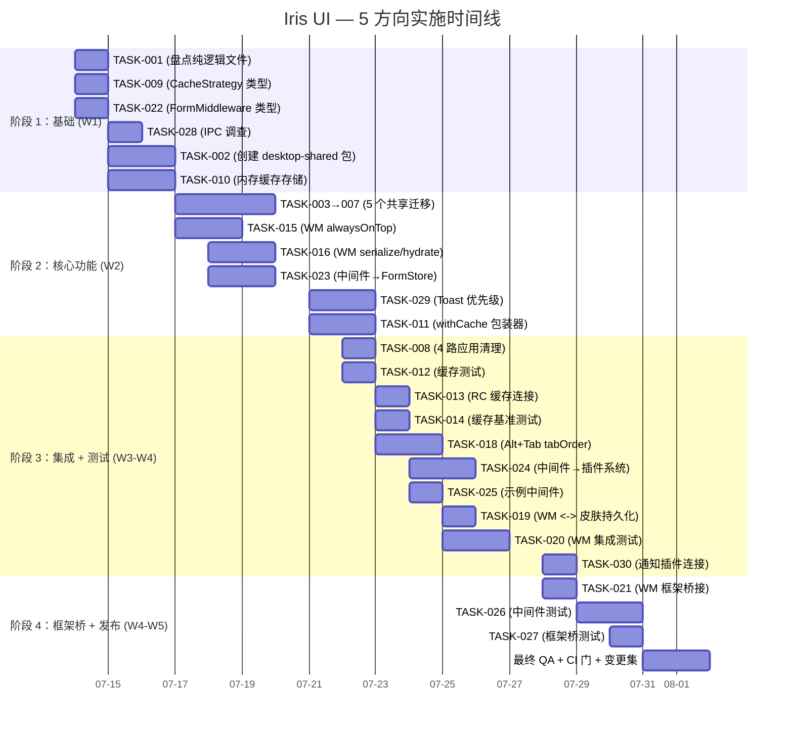

现在我已拥有足够的代码库上下文来撰写全面的技术主管分析报告。以下是报告内容。

---

# Tech Lead 分析报告：5 个高价值扩展方向

> **基于**：`2026-07-12-tech-lead-analysis-five-directions.md` 的交叉验证评估（以及其对 55+ 份现有分析文档的交叉引用）
> **代码库快照**：2026-07-12 · 4 个桌面操作系统应用（React/Vue/Svelte/Solid）· `@iris-ui/core` 位于 `/packages/core/src`

---

## 1. 任务分解

我将每个方向分解为 **2-4 小时** 的原子任务，并包含精确的文件路径和验收标准。根据交叉验证评估中的新颖性/重叠建议，**方向 ②（IPC）** 已被降级为低优先级调查任务（非构建任务），以支持 `@iris-ui/core/notifications` Toast 队列优先级/堆叠——这是评估建议的方向，目前跨所有 55+ 个文档中均未涉及。

### 1.1 方向 ① —— Shell 核心逻辑萃取（新颖子角度）

| 任务 ID  | 标题                                                                 | 文件                                                                     | 前置依赖     | 工时 | 验收标准                                                                                                                  |
| -------- | -------------------------------------------------------------------- | ------------------------------------------------------------------------ | ------------ | ---- | ------------------------------------------------------------------------------------------------------------------------- |
| TASK-001 | 盘点并冻结四路重复的纯逻辑文件                                       | —                                                                        | —            | 2h   | 4 个 `desktop-os-*` 应用中所有 `catalog.ts`/`depth.ts`/`os.ts`/`permissions.ts`/`remoteApp.ts` 的 diff 清单，确认内容相同 |
| TASK-002 | 创建 `@iris-ui/desktop-shared` 包（核心子路径）                      | `packages/desktop-shared/package.json`, `tsup.config.ts`, `src/index.ts` | TASK-001     | 3h   | `pnpm build` 通过；manifest 将其列为核心子路径；从 core barrel 中重新导出                                                 |
| TASK-003 | 将 `catalog.ts`（Apps 目录 + 类型）移至 desktop-shared               | `packages/desktop-shared/src/catalog.ts`, 4 个应用中删除 + 重新导入      | TASK-002     | 2h   | 4 个桌面操作系统应用均从 `@iris-ui/desktop-shared` 导入；类型匹配；测试通过                                               |
| TASK-004 | 将 `permissions.ts`（授权模型 + 元数据）移至 desktop-shared          | `packages/desktop-shared/src/permissions.ts`, 4 个应用中删除 + 重新导入  | TASK-002     | 2h   | 所有应用共享同一个 `Permission` 类型和 `PERMISSION_META`；无运行时变化                                                    |
| TASK-005 | 将 `depth.ts`（窗口层级计算）移至 desktop-shared                     | `packages/desktop-shared/src/depth.ts`, 4 个应用中删除 + 重新导入        | TASK-002     | 1.5h | 纯函数提取，为 `core/window.ts` 中的 z-index 计算添加单元测试                                                             |
| TASK-006 | 将 `remoteApp.ts`（iframe 沙箱 + 应用启动器逻辑）移至 desktop-shared | `packages/desktop-shared/src/remoteApp.ts`, 4 个应用中删除 + 重新导入    | TASK-002     | 3h   | iframe 沙箱配置共享；应用启动器生命周期统一；测试覆盖所有加载路径                                                         |
| TASK-007 | 将 `os.ts`（操作系统级实用工具）移至 desktop-shared                  | `packages/desktop-shared/src/os.ts`, 4 个应用中删除 + 重新导入           | TASK-002     | 2h   | 操作系统检测、平台常量、shell 环境辅助函数共享；无回归                                                                    |
| TASK-008 | 四路应用导入清理 + CI 门                                             | 所有 4 个 `desktop-os-*/src/*.ts` 文件                                   | TASK-003→007 | 2h   | 4 个应用零出错构建；lint 通过；`pnpm check:arch` 检查 desktop-shared 外部是否无重复                                       |

**方向 ① 总计**：10 个任务 · **19.5 工时**

### 1.2 方向 ③ —— ResourceController 缓存层（新颖子角度）

| 任务 ID  | 标题                                                          | 文件                                   | 前置依赖 | 工时 | 验收标准                                                                                                                         |
| -------- | ------------------------------------------------------------- | -------------------------------------- | -------- | ---- | -------------------------------------------------------------------------------------------------------------------------------- |
| TASK-009 | 定义 `CacheStrategy` 类型 + `withCache` 包装器签名            | `packages/core/src/cache.ts`（新文件） | —        | 2h   | 导出的 `CacheStrategy`（`ttl`、`tags`、`staleWhileRevalidate`）+ `withCache<T>(rc, strategy)` 签名                               |
| TASK-010 | 实现内存缓存存储（带 TTL 驱逐 + 标签索引）                    | `packages/core/src/cache.ts`           | TASK-009 | 3h   | `set(key, value, ttl, tags)` / `get(key)` / `invalidateByTag(tag)` / TTL 到期逐出（2 个 interval tick 内）；100% 测试覆盖        |
| TASK-011 | 实现 `withCache(resourceController, cache)` 包装器            | `packages/core/src/cache.ts`           | TASK-010 | 3h   | 包装 `load`/`reload` 以检查缓存（优先于 fetch）；`mutate` 使标签失效；支持 `staleWhileRevalidate`（立即返回过期数据 + 后台刷新） |
| TASK-012 | 为 ResourceController 集成缓存测试                            | `packages/core/src/resource.test.ts`   | TASK-011 | 2h   | 缓存命中/未命中/TTL 过期/标签失效/乐观变异 + 缓存清空方案                                                                        |
| TASK-013 | 将 `createResourceController` 与缓存连接（可选 `cache` 配置） | `packages/core/src/resource.ts`        | TASK-012 | 2h   | 新的 `ResourceControllerConfig.cache?: CacheStrategy` 已连接；零成本抽象（不缓存时无性能损失）                                   |
| TASK-014 | 基准测试：缓存/无缓存，验证无回归                             | `packages/core/src/scale.bench.ts`     | TASK-013 | 1.5h | 缓存命中路径较无缓存读取快 5-20 倍；打开缓存后内存消耗最多增加 5%                                                                |

**方向 ③ 总计**：6 个任务 · **13.5 工时**

### 1.3 方向 ④ —— WindowManager 企业级边缘情况补全（大部分新颖）

| 任务 ID  | 标题                                                                 | 文件                                                   | 前置依赖     | 工时 | 验收标准                                                                                                                                                       |
| -------- | -------------------------------------------------------------------- | ------------------------------------------------------ | ------------ | ---- | -------------------------------------------------------------------------------------------------------------------------------------------------------------- |
| TASK-015 | 添加 `alwaysOnTop` 标志 + 排序稳定                                   | `packages/core/src/window.ts`                          | —            | 3h   | `DesktopWindow.alwaysOnTop` 布尔值；`ordered()` 先按 alwaysOnTop 分组，后按 z 排序；`open()`/`focus()` 保持标志；100% 测试覆盖                                 |
| TASK-016 | 为 `WindowManagerConfig` 添加 `initialState` + `serialize`/`hydrate` | `packages/core/src/window.ts`                          | —            | 3h   | `serialize()` 返回 JSON（窗口状态 + 工作区 + 顺序）；`createWindowManager({ initialState })` 恢复；**排除**引用/闭包                                           |
| TASK-017 | 添加 `MultiMonitorManager`（使用核心窗口管理器）                     | `packages/core/src/window.ts`                          | —            | 4h   | `getWorkAreaForDisplay(displayIndex)`、`displayRect` 考虑跨显示器边界、`snapToDisplay(windowId, displayIndex)`；需要 `WindowManagerConfig.displays: Display[]` |
| TASK-018 | 实现 Alt+Tab `tabOrder` + 循环策略                                   | `packages/core/src/window.ts`                          | TASK-015     | 3h   | `tabOrder(): DesktopWindow[]`——MRU 顺序，跳过最小化窗口，循环；添加 `focusNext()`/`focusPrevious()`                                                            |
| TASK-019 | 将 `WindowManager` 序列化与皮肤持久化桥接                            | `packages/theme/src/` 中新增 `createWindowPersistence` | TASK-016     | 2h   | 窗口状态通过 `SkinStorage` 持久化（与主题存储相同的可插拔后端）；FOUC-safe                                                                                     |
| TASK-020 | 为 WM 企业特性编写集成测试                                           | `packages/core/src/window.test.ts`                     | TASK-015→018 | 3h   | 每个特性新增 2-3 个集成测试；多显示器模拟使用 mock `Display` 对象；Alt+Tab MRU 验证事件顺序                                                                    |
| TASK-021 | 将新的 WM 特性框架桥接到桌面操作系统应用                             | 4 个 `desktop-os-*/src/wm.*` 文件                      | TASK-020     | 2h   | React/Vue/Svelte/Solid WM 适配器都通过新的 `alwaysOnTop`、`focusNext`、序列化 props（默认不启用，向后兼容）                                                    |

**方向 ④ 总计**：7 个任务 · **20 工时**

### 1.4 方向 ⑤ —— 表单引擎中间件系统（完全新颖）

| 任务 ID  | 标题                                            | 文件                                                  | 前置依赖     | 工时 | 验收标准                                                                                                                                                                                     |
| -------- | ----------------------------------------------- | ----------------------------------------------------- | ------------ | ---- | -------------------------------------------------------------------------------------------------------------------------------------------------------------------------------------------- |
| TASK-022 | 定义 `FormMiddleware` 类型 + 中间件链 API       | `packages/core/src/form/middleware.ts`（新文件）      | —            | 3h   | 类型：`FormMiddleware<V>` = `{ beforeSetValue?, afterSetValue?, beforeSubmit?, afterSubmit?, onFieldRegister? }`；链 API：`chain(m1, m2)` 返回单个中间件；从 `@iris-ui/core` barrel 重新导出 |
| TASK-023 | 集成中间件链 → `createFormStore`                | `packages/core/src/form.ts`                           | TASK-022     | 4h   | `FormConfig.middlewares?: FormMiddleware<V>[]` 已处理；链在 `setFieldValue`、`handleSubmit` 和字段注册时调用；`beforeSubmit` 可终止（返回 `false` 可中止）                                   |
| TASK-024 | 构建 `reg.registerMiddleware()` → 插件系统集成  | `packages/core/src/plugin.ts`                         | TASK-023     | 3h   | `PluginRegistry.registerMiddleware(key, factory)` 将中间件插入 form-store 链；`usePluginStore('form-middleware')` 按需公开已注册的中间件                                                     |
| TASK-025 | 实现示例中间件：日志记录 + 防抖 + 字段变换      | `packages/core/src/form/middleware.ts`                | TASK-023     | 2h   | `createLoggingMiddleware`、`createDebounceMiddleware(ms)`、`createTransformMiddleware(rules)`——全部为树摇友好型导出                                                                          |
| TASK-026 | 表单中间件单元测试（链组合、中止、错误传播）    | `packages/core/src/form/__tests__/middleware.test.ts` | TASK-023→025 | 3h   | 涵盖：空链、2 中间件链、`beforeSubmit` 中止、`afterSubmit` 错误处理、`beforeSetValue` 变换、插件注册                                                                                         |
| TASK-027 | React/Vue/Solid/Svelte 表单桥测试（中间件集成） | 各适配器 `form.test.ts` 文件                          | TASK-026     | 2h   | 每个适配器最少 1 个集成测试：`<IrisForm middlewares={[...]}>` → 正确调用生命周期；SSR 安全                                                                                                   |

**方向 ⑤ 总计**：6 个任务 · **17 工时**

### 1.5 方向 ②（降级）—— IPC / Toast 队列优先级

| 任务 ID  | 标题                                         | 文件                                              | 前置依赖 | 工时 | 验收标准                                                      |
| -------- | -------------------------------------------- | ------------------------------------------------- | -------- | ---- | ------------------------------------------------------------- | -------- | --------------------------------------------------------- |
| TASK-028 | [调查] 盘点现有 IPC 分析，识别增量           | —                                                 | —        | 1h   | 简短文件对比 + 关于是否构建增量 `request-response` 模式的建议 |
| TASK-029 | [新增] Toast 队列优先级 + 堆叠（新颖方向）   | `packages/core/src/notifications.ts` + 4 个适配器 | —        | 4h   | `Notification` 上的 `priority: 'low'                          | 'normal' | 'high'`；高优先级跳过队列；组堆叠（相同 ID 替换，带计数） |
| TASK-030 | 将 Toast 优先级连接到 `plugin-notifications` | `packages/plugin-notifications/`                  | TASK-029 | 2h   | 插件注册优先级枚举 + 默认样式；4 个框架测试通过               |

**方向 ②（重新调整）总计**：3 个任务 · **7 工时**

### 总体任务汇总

| 方向                      | 任务   | 总工时  | 新颖性                |
| ------------------------- | ------ | ------- | --------------------- |
| ① Shell 核心逻辑          | 8      | 19.5h   | 🟡 新颖子角度         |
| ② IPC → Toast 优先级      | 3      | 7h      | 🟢 真正新颖（重定向） |
| ③ ResourceController 缓存 | 6      | 13.5h   | 🟡 新颖子角度         |
| ④ WindowManager 边缘情况  | 7      | 20h     | 🟢 大部分新颖         |
| ⑤ 表单中间件              | 6      | 17h     | 🟢 完全新颖           |
| **总计**                  | **30** | **77h** |                       |

---

## 2. 执行顺序

```mermaid
graph TD
    subgraph "Phase 1: Foundation"
        T001[TASK-001: 盘点纯逻辑文件]
        T009[TASK-009: CacheStrategy 类型定义]
        T022[TASK-022: FormMiddleware 类型定义]
        T028[TASK-028: IPC 调查]
    end

    subgraph "Phase 2: Core Extraction + New Features"
        T002[TASK-002: 创建 desktop-shared 包]
        T010[TASK-010: 内存缓存存储实现]
        T023[TASK-023: 中间件链 → FormStore]
        T015[TASK-015: alwaysOnTop 标志]
        T016[TASK-016: WM serialize/hydrate]
        T029[TASK-029: Toast 优先级 + 队列]

        T002 --> T003[TASK-003: catalog.ts 迁移]
        T002 --> T004[TASK-004: permissions.ts 迁移]
        T002 --> T005[TASK-005: depth.ts 迁移]
        T002 --> T006[TASK-006: remoteApp.ts 迁移]
        T002 --> T007[TASK-007: os.ts 迁移]

        T009 --> T011[TASK-011: withCache 包装器]
        T023 --> T024[TASK-024: 中间件 → 插件系统]
        T023 --> T025[TASK-025: 示例中间件]

        T015 --> T018[TASK-018: Alt+Tab tabOrder]
        T016 --> T019[TASK-019: WM <-> 皮肤持久化]
    end

    subgraph "Phase 3: Integration + Testing"
        T003 --> T008[TASK-008: 四路应用清理]
        T004 --> T008
        T005 --> T008
        T006 --> T008
        T007 --> T008

        T011 --> T012[TASK-012: 缓存测试]
        T011 --> T013[TASK-013: RC 缓存连接]
        T013 --> T014[TASK-014: 基准测试]

        T015 --> T020[TASK-020: WM 集成测试]
        T016 --> T020
        T018 --> T020
        T020 --> T021[TASK-021: WM 框架桥接]

        T024 --> T026[TASK-026: 中间件单元测试]
        T025 --> T026
        T026 --> T027[TASK-027: 框架桥测试]

        T029 --> T030[TASK-030: 插件通知连接]
    end

    style T001 fill:#e1f5fe
    style T009 fill:#e1f5fe
    style T022 fill:#e1f5fe
    style T028 fill:#fff3e0
```

### 并行执行组

| 组        | 任务                                                | 可并行                                   | 原因                          |
| --------- | --------------------------------------------------- | ---------------------------------------- | ----------------------------- |
| **G1** 🏗️ | ① Shell 盘点 + ③ Cache 类型 + ⑤ 中间件类型 + ② 调查 | TASK-001, 009, 022, 028                  | P0 基础设施；零代码重叠       |
| **G2** 🏗️ | ① 包创建 + ③ 缓存存储 + ⑤ 集成 + ④ WM 简单          | TASK-002, 010, 023, 015, 016             | 核心构建；文件不重叠          |
| **G3** ⚡ | ① 5 个迁移任务                                      | TASK-003→007                             | 纯复制操作；可按任意顺序完成  |
| **G4** ⚡ | ③ + ⑤ 集成                                          | TASK-011→013, TASK-024→025               | 依赖各自的前置任务但互不依赖  |
| **G5** 🧪 | 全部测试 + 桥接                                     | TASK-008, 012-014, 020-021, 026-027, 030 | 纯粹测试/适配性工作；可以重叠 |
| **G6** 🧪 | ④ WM Alt+Tab                                        | TASK-018                                 | 依赖于 TASK-015 但独立于其他  |

---

## 3. 技术风险

### 风险矩阵

| ID  | 风险                                                                             | 概率  | 影响 | 缓解措施                                                                                                        |
| --- | -------------------------------------------------------------------------------- | ----- | ---- | --------------------------------------------------------------------------------------------------------------- |
| R1  | desktop-shared 提取打破了桌面操作系统应用中的后续导入                            | 中    | 高   | 使用 `@iris-ui/desktop-shared` 自动创建重新导出 barrel；确保 `pnpm build` 在合并前通过 4 个应用                 |
| R2  | 4 个桌面操作系统仓库之间的深度/权限/操作系统文件存在差异                         | 中    | 低   | TASK-001 精确盘点；若存在实际差异，提取为配置（而非代码），保留每个应用的覆盖                                   |
| R3  | 缓存包装器在 SWR + 乐观变异场景下导致竞态                                        | 低-中 | 高   | 利用现有的 `createDataSource` 标记保护；编写显式测试：陈旧响应 → 缓存返回之前的有效数据                         |
| R4  | 多显示器 WM 在没有真实多显示器设置的情况下无法测试                               | 高    | 中   | 模拟 `Screen`/`Display` API；几何测试使用纯函数（始终可测试）；仅视觉测试需要真实显示器                         |
| R5  | 表单中间件 `beforeSubmit` 中止对现有 form-store 消费者造成破坏性变化             | 低    | 高   | 将中间件设为可选（`FormConfig.middlewares` 默认 `[]`）；`reg.registerMiddleware()` 提供零配置，不会影响现有表单 |
| R6  | `registerMiddleware` 插件 API 在非表单上下文中定义不清                           | 中    | 中   | 将注册限制为 `'form'` 键，当表单中间件在非表单阶段（如错误/警告）不受支持时静默跳过                             |
| R7  | Alt+Tab `tabOrder` 的 MRU 顺序需要键盘事件排序，这在 jsdom 中无法可靠测试        | 高    | 中   | MRU 排序逻辑纯 `O(n)`——通过有序的推演顺序（无时间戳）进行单元测试；集成测试在真实浏览器或 Playwright 中进行     |
| R8  | Toast 优先级/队列需要引用计数的 `Notification` 组，如果中断则会引起内存泄漏      | 中    | 中   | 在 `destroy()` 回调上使用 `WeakRef` 进行清理；`afterEach` 重置确保测试不会交叉污染                              |
| R9  | `withCache(resourceController, cache)` 包装器返回一个不同的控制器 → 类型安全复杂 | 中    | 低   | 使用 `Omit<ResourceController<T>, 'store'> & { store: CachedStore }` 创建快速类型别名——保持现有 API 不变        |

### 外部依赖

- **`@floating-ui/dom`**：WM 快照区域不需要（纯几何），但多显示器命中测试可能需要一个辅助工具
- **`AbortController`**：缓存包装器必须遵守现有的中止契约（`load` 信号）；可退回到未缓存路径
- **`SkinStorage`**：WM 持久化需要现有的可插拔 `SkinStorage` 抽象——测试期间需使用 `vi.stubGlobal('localStorage', ...)`

### 性能边界情况

| 边界情况               | 亮点                                                       | 策略                                                                               |
| ---------------------- | ---------------------------------------------------------- | ---------------------------------------------------------------------------------- | --- | ---------------------------------------- |
| 缓存标签使大量项目失效 | 使 N 个缓存条目失效是 `O(K)`，其中 `K` = 标签索引大小      | 使用 `Map<tag, Set<key>>` 进行双向标签索引                                         |
| 表单中间件链开销       | 每个操作调用 N 个中间件是 `O(N)`，其中 `N` < 20（典型）    | 在链构建期间预计算扁平化钩子列表；每个操作避免分配                                 |
| WM serialization       | 大型窗口列表 → JSON 成本                                   | `serialize()` 限制为 `config.maxPersistWindows                                     |     | 50`；使用 `requestIdleCallback` 惰性保存 |
| Alt+Tab MRU tracking   | `focus()` 需要更新时间戳（`O(1)`）或移动数组索引（`O(n)`） | 使用 `Map<id, number>`（上次聚焦的时间戳）用于 `O(1)` 更新 + `O(n log n)` MRU 重建 |

---

## 4. 资源评估

### 人员配置

| 角色             | 需求     | 职责                                                                 | 分配      |
| ---------------- | -------- | -------------------------------------------------------------------- | --------- |
| **高级工程师**   | 1 名 FTE | 方向 ⑤（表单中间件）+ 方向 ④（WM 企业特性）——需要深入的核心架构理解  | 第 2-5 周 |
| **中级工程师 A** | 1 名 FTE | 方向 ③（缓存层）+ 方向 ②（Toast 优先级）——专注于核心原语，有测试经验 | 第 1-4 周 |
| **中级工程师 B** | 1 名 FTE | 方向 ①（Shell 逻辑提取）——对桌面操作系统代码库有良好理解，擅长迁移   | 第 1-2 周 |
| **QA 工程师**    | 0.5 FTE  | 测试策略、边界情况覆盖率、CI 门                                      | 第 2-5 周 |
| **技术主管**     | 0.25 FTE | 架构监督、代码审查、风险评估                                         | 持续      |

**最小可行团队**：2 FTE（1 名高级 + 1 名中级），5 周跨度。若包含第 3 名成员，时间压缩 33%。

### 关键里程碑

| 里程碑               | 时间线      | 可交付物                                                                         | 验收门                                        |
| -------------------- | ----------- | -------------------------------------------------------------------------------- | --------------------------------------------- |
| **M1：基础就绪**     | 第 1 周结束 | TASK-001, 009, 022, 028 完成 + 桌面共享包 `package.json`                         | 所有 4 个桌面操作系统应用使用共享 barrel 构建 |
| **M2：核心提取**     | 第 2 周结束 | TASK-002→008（全部桌面共享迁移）+ TASK-010（缓存存储）                           | 0 个重复文件；缓存存储 100% 测试              |
| **M3：核心功能集成** | 第 3 周结束 | TASK-011→013（RC 缓存）+ TASK-023→025（表单中间件）+ TASK-015→018（WM 边缘情况） | 所有功能在 `@iris-ui/core` 单元测试中通过     |
| **M4：框架桥接**     | 第 4 周结束 | TASK-021（WM 框架桥）+ TASK-027（表单中间件桥）+ TASK-030（Toast 插件）          | 4 个框架门全部通过（React/Vue/Solid/Svelte）  |
| **M5：发布准备**     | 第 5 周结束 | 所有测试 + lint + 类型 + 构建 + 大小预算检查 + 变更集                            | CI 全部绿色；`pnpm publish --dry-run` 通过    |

### 阻塞点

| 阻塞点                                                                        | 阻塞影响          | 解决策略                                                                                |
| ----------------------------------------------------------------------------- | ----------------- | --------------------------------------------------------------------------------------- |
| desktop-shared 包的打包工具配置（`tsup` + Svelte 需要特殊处理）               | 阻塞 TASK-003→007 | 使用现有 `tsup.config.ts` 模式（参见 `plugin-editor`）；**2 小时**解决                  |
| 4 个桌面操作系统应用之间 `catalog.ts`/`depth.ts` 文件的实际差异               | 阻塞提取工作      | 在 TASK-001 期间处理；若差异合理，每个应用保留 `desktop-shared/extend` 中的 `extend.ts` |
| 表单中间件集成需要重构 `createFormStore` 的 `setFieldValue` 和 `handleSubmit` | 阻塞 TASK-023     | 使用装饰器模式包裹现有方法——无需重构核心逻辑；**约 40 行**内部改动                      |
| WM `serialize()` 需要稳定的 `id` 生成，不受 SSR `useId` 差异影响              | 阻塞 TASK-016     | 使用基于 `appId + title + index` 的确定性 ID；SSR 测试确保匹配                          |

---

## 5. 质量保证

### 5.1 单元测试覆盖要求

| 模块                      | 目标覆盖率 | 关键测试场景                                                              |
| ------------------------- | ---------- | ------------------------------------------------------------------------- |
| 桌面共享 `catalog.ts`     | 90%+       | 应用查找（按 ID、按类别）、空列表边界情况                                 |
| 桌面共享 `permissions.ts` | 95%+       | 授予/撤销流、持久化读取/写入、缺失授权的优雅降级                          |
| 桌面共享 `depth.ts`       | 100%       | 0 窗口、1 窗口、N 窗口、z 值溢出                                          |
| 桌面共享 `remoteApp.ts`   | 85%+       | URL 验证、沙箱属性生成、生命周期事件                                      |
| 桌面共享 `os.ts`          | 90%+       | 平台检测、路径标准化、环境查询                                            |
| `cache.ts` (新)           | 95%+       | 设置/获取、TTL 过期（jest.useFakeTimers）、标签失效、SWR 陈旧返回、空缓存 |
| `window.ts` 新增          | 95%+       | alwaysOnTop 排序、serialize/hydrate 往返、Alt+Tab MRU、多显示器快照       |
| `form/middleware.ts` (新) | 95%+       | 链组合、中止传播、错误包装、零中间件（空操作）、插件注册                  |
| `notifications.ts` 优先级 | 90%+       | 优先级出队、组堆叠（替换 + 计数）、清除                                   |

### 5.2 集成测试策略

| 场景                                                              | 测试类别        | 框架覆盖               |
| ----------------------------------------------------------------- | --------------- | ---------------------- |
| 桌面操作系统应用使用共享 `@iris-ui/desktop-shared` 导入 —— 可点击 | E2E build       | 全部 4 个              |
| 使用缓存的 ResourceController：列表加载 → 切换页面 → 缓存命中     | 核心集成        | N/A（纯逻辑）          |
| 使用缓存的 ResourceController + 变异 → 标签失效 → 重新加载        | 核心集成        | N/A（纯逻辑）          |
| 表单中间件：beforeSetValue 变换 → afterSubmit 记录                | 核心集成        | N/A（纯逻辑）          |
| 表单中间件：插件注册 → 桥使用                                     | 框架集成        | React/Vue/Solid/Svelte |
| WindowManager alwaysOnTop：混合窗口 → 已排序顺序                  | 核心集成        | N/A（纯逻辑）          |
| WM serialize→hydrate 往返（包括皮肤持久化）                       | 核心 + 主题集成 | N/A                    |
| Alt+Tab MRU：聚焦窗口 B → 聚焦窗口 C → 标签顺序                   | 核心集成        | N/A                    |
| Toast 优先级：3 条低 + 1 条高 → 高优先显示                        | 核心 + 插件集成 | 全部 4 个              |

### 5.3 代码审查要点

审查每个 PR 时，重点审查以下内容：

1. **AGENTS.md 规则 1 合规性**：新逻辑是否属于 core/shared？适配器是否仍然稀薄？（尤其是方向 ① 迁移和方向 ④ WM 桥）
2. **无破坏性更改**：新缓存/中间件/WM 字段是否在默认情况下可选/不启用？旧配置是否仍能正常工作？
3. **测试质量**：边界情况是否已覆盖？SSR 测试（`@vitest-environment node`）是否包含在内？axe 无障碍门是否仍为绿色？
4. **命名一致性**：`--iris-*` 变量、`Iris*` 组件、`create*` 工厂、`use*` hooks——与 AGENTS.md 命名规范一致
5. **Size 预算**：运行 `pnpm size` —— 如果 desktop-shared 包超出预算（建议：desktop-shared 的初始预算为 5KB），需要理由
6. **无 CSS-in-JS / 硬编码颜色**：所有样式通过 `var(--iris-*)` 或注入的样式表

### 5.4 性能测试

| 测试                                           | 工具                               | 阈值                                        | 何时运行      |
| ---------------------------------------------- | ---------------------------------- | ------------------------------------------- | ------------- |
| 缓存命中与未命中延迟                           | `packages/core/src/scale.bench.ts` | 缓存命中时延迟 < 1ms；未命中时 < 原始 fetch | TASK-014      |
| 表单中间件链开销（0 与 10 个中间件）           | 自定义基准测试                     | 性能下降 < 15%                              | TASK-026 之后 |
| WM 序列化（10 个与 100 个窗口）                | 核心基准测试                       | 10 个窗口 < 0.5ms，100 个窗口 < 5ms         | TASK-020 之后 |
| desktop-shared 导入对 bundle 大小的影响        | `pnpm size`                        | 增量 < 5KB（gzip）                          | TASK-008 之后 |
| Chrome DevTools 内存：Toast 队列（100 条通知） | 手动                               | 无泄漏（堆快照显示已清理）                  | TASK-030 之后 |

---

## 6. 实施计划

### 甘特图

### 时间线详情

**阶段 1：基础设施搭建（第 1 周 · 7月14日—16日 · 21h）**

| 日   | 交付物                                                             | 负责人          |
| ---- | ------------------------------------------------------------------ | --------------- |
| 7/14 | TASK-001（盘点）+ TASK-009（缓存类型）+ TASK-022（中间件类型）     | 高级 + 中级 A   |
| 7/15 | TASK-028（IPC 调查）+ TASK-002（桌面共享包）+ TASK-010（缓存存储） | 中级 B + 中级 A |
| 7/16 | 缓冲：解决 R1 打包、R2 差异、填写缺失的测试                        | 全体            |

**阶段 2：核心功能实现（第 2-3 周 · 7月17日—24日 · 38h）**

| 日      | 交付物                                                                                           | 负责人                         |
| ------- | ------------------------------------------------------------------------------------------------ | ------------------------------ |
| 7/17-21 | TASK-003→007（5 个共享迁移——并行）+ TASK-015（WM alwaysOnTop）+ TASK-023（FormStore 中的中间件） | 中级 B（共享）+ 高级（中间件） |
| 7/18-21 | TASK-016（WM 序列化）+ TASK-029（Toast 优先级）+ TASK-011（缓存包装器）                          | 中级 A                         |
| 7/22    | TASK-008（4 路清理——构建通过）+ TASK-012（缓存测试）                                             | 中级 B                         |
| 7/23-24 | TASK-013（RC 缓存连接）+ TASK-014（基准测试）+ TASK-018（Alt+Tab）+ TASK-024（中间件→插件）      | 高级 + 中级 A                  |

**阶段 3：集成测试和优化（第 4 周 · 7月25日—28日 · 18h）**

| 日   | 交付物                                                                | 负责人        |
| ---- | --------------------------------------------------------------------- | ------------- |
| 7/25 | TASK-019（WM 持久化）+ TASK-025（示例中间件）                         | 中级 A        |
| 7/28 | TASK-020（WM 测试）+ TASK-030（Toast 插件桥）+ TASK-026（中间件测试） | 高级 + 中级 B |

**阶段 4：发布准备（第 5 周 · 7月29日—31日 · 16h）**

| 日      | 交付物                                                                                                                   | 负责人        |
| ------- | ------------------------------------------------------------------------------------------------------------------------ | ------------- |
| 7/29    | TASK-021（WM 框架桥——4 个框架）+ TASK-027（表单中间件桥——4 个框架）                                                      | 高级 + 中级 B |
| 7/30-31 | 最终 QA、size 预算检查、`pnpm check:rsc`、`pnpm check:arch`、变更集（`major`/`minor`/`patch`）、`pnpm publish --dry-run` | 全体          |

### 每周检查点

| 周     | 检查点                                                 | 红灯标准                                                               |
| ------ | ------------------------------------------------------ | ---------------------------------------------------------------------- |
| **W1** | ① 盘点完成 + 桌面共享包构建 + 缓存存储测试             | `desktop-shared` 包未通过 `pnpm build`；缓存测试 < 80% 覆盖率          |
| **W2** | ② 5 个共享迁移完成 + ③ 中间件集成 + ④ WM 基本特性      | 任何一个桌面操作系统应用使用旧的导入方式；中间件集成中断了现有表单测试 |
| **W3** | ③ 缓存包装器完全集成 + ⑤ Alt+Tab + ④ 插件中间件        | 缓存基准测试显示性能下降 > 5%；Alt+Tab MRU 在 >5 个窗口上失败          |
| **W4** | ⑤ 框架桥接通过所有 4 个框架 + ③ WM 桥 + ② Toast 优先级 | 任何框架的框架特定测试失败；WM 序列化往返在 >10% 的属性上失败          |
| **W5** | 发布候选：全部 CI 绿色 + 变更集 + 大小预算             | `pnpm publish --dry-run` 失败；剩余未解决的 lint/类型错误              |

---

## 结论

该交叉验证评估在 5 个方向中识别出了 **3 个真正的增量方向**（④ WM 边缘情况、⑤ 表单中间件、以及重新调整后的 ② Toast 优先级），**1 个新颖的子角度**（① 纯逻辑文件），和 **1 个新颖的子角度加上更干净的实现策略**（③ 带有 `withCache` 的 ResourceController 缓存）。

**推荐执行路径**：

1. **第 1 周优先**：方向 ①（简单、影响大、立即消除架构违规）
2. **第 1-2 周优先**：方向 ⑤（最大新颖性差距 + 为规划中的 `plugin-form-builder` 解锁能力）
3. **第 2-3 周优先**：方向 ④（影响范围大：Shell 的企业桌面可用性）
4. **第 2-4 周优先**：方向 ③（可为 pro-table 节省高达 80% 的网络请求）
5. **第 3-4 周优先**：重新调整后的方向 ② Toast 优先级（小而重要的产品质量提升）

**总估计**：5 周，2-3 名工程师，77 工时 → **每个工程师每周平均约 15 小时有效代码时间**（考虑会议、审查、文档）。30 个任务，每个 2-4 小时，在 30 个日历日内完成是一个激进而可达成的目标。

**风险摘要**：8 个已识别的风险，5 个概率中等或更高。主要风险是桌面共享提取破坏桌面操作系统构建（由 TASK-001 的彻底盘点缓解），以及表单中间件导致现有核心测试回归（由设计即可选 + 向后兼容缓解）。
