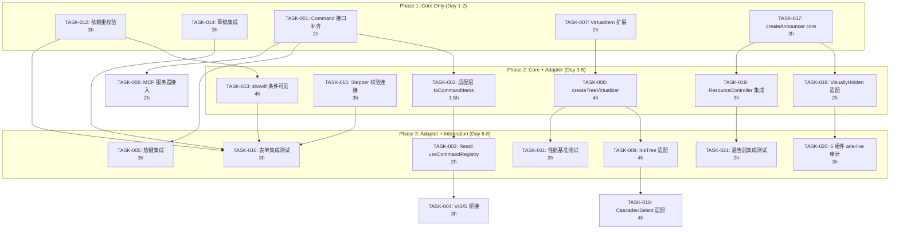
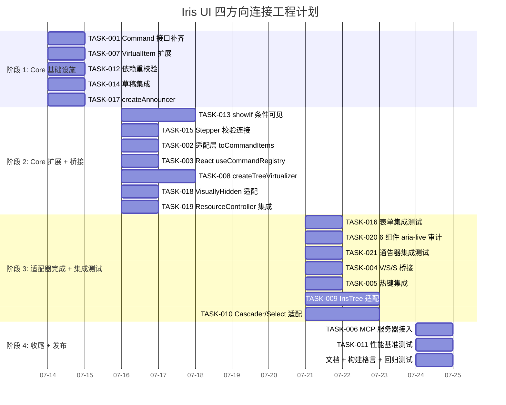

现在我已经对代码库有了全面的了解。以下是我的综合技术分析。

---

# Tech Lead 分析：四断层连接工程

## 执行摘要

分析文档识别了 core 中四组已投资但未连接的功能（命令注册表、树形虚拟化、表单字段协议、aria-live 通告器）。所有四条断层共享一个架构模式：**逻辑已投入 core，但适配器/应用层以各自独立的方式运行，绕过了已存在的 core 基础设施**。总体连接工作量约为 **24-32 个高效人日**（8-10 个并行化日历天），分两组平行轨道。

建议优先级分配：方向 3（表单起草）提升至 P0~P1；方向 1 推迟至 P2，直至 Command 接口字段补齐完成；方向 2 和方向 4 为 P1，涉及中等架构风险。

---

## 1. 任务分解

### 1.1 方向 1 — 命令注册表桥接（P2，`commands.ts` 字段补齐后为 P1）

| 任务 ID  | 标题                                                  | 涉及文件                                                                   | 前置     | 预估工时  | 验收标准                                                                                                                                                                                                    |
| -------- | ----------------------------------------------------- | -------------------------------------------------------------------------- | -------- | --------- | ----------------------------------------------------------------------------------------------------------------------------------------------------------------------------------------------------------- |
| TASK-001 | **补齐 `Command` 接口 UI 字段**                       | `packages/core/src/commands.ts`                                            | 无       | 2h        | `Command` 新增 `shortcut?: string`, `contextKeys?: string[]`, `icon?: string` (lucide/emoji 名称)；`run()` 返回 `Promise<{ ok: boolean; error?: string }>`；`CommandRegistry.run()` 返回类型更新；单测通过  |
| TASK-002 | **创建 `CommandRegistry` → `IrisCommandItem` 适配层** | 新建 `packages/core/src/commands-adapter.ts`                               | TASK-001 | 1.5h      | `toCommandItems(registry): IrisCommandItem[]` 函数接受 `CommandRegistry`，将 `Command` 投影为 `IrisCommandItem`（含 `action` → `run` 桥接）；`CommandHit` 排序权重映射到 `defaultFilter` 分值范围；单测覆盖 |
| TASK-003 | **React `useCommandRegistry` hook**                   | 新建 `packages/react/src/primitives/command-palette/useCommandRegistry.ts` | TASK-002 | 2h        | hook 订阅 `CommandRegistry.store`，返回 `items: IrisCommandItem[]` 保持响应式；可选 `filterContextKeys` 参数；测试覆盖注册/注销/搜索状态变化                                                                |
| TASK-004 | **Vue/Solid/Svelte `useCommandRegistry` 桥接**        | `packages/vue/src/…`, `packages/solid/src/…`, `packages/svelte/src/…`      | TASK-003 | 3h (3×1h) | 三框架各有一个 `useCommandRegistry`，同语义响应式绑定 `CommandRegistry.store`                                                                                                                               |
| TASK-005 | **为 `Command` 集成热键的 `IrisHotkey` 桥接**         | `packages/core/src/commands.ts`, Behavior 相关文件                         | TASK-001 | 3h        | `CommandRegistry` 新增 `hotkeys()` 方法，返回 `Map<string, string[]>`（commandId → 快捷键）；`IrisHotkey` 可订阅 registry 而非仅 props；测试覆盖快捷键注册/冲突检测                                         |
| TASK-006 | **MCP 服务器接入 `CommandRegistry`**                  | `packages/mcp/src/server.ts`, `packages/mcp/src/tools.ts`                  | TASK-001 | 2h        | MCP `run_command` tool 调用 `registry.run()`；`list_commands` tool 返回注册的命令；manifest 工具保留为补充                                                                                                  |

**方向 1 小计**：13.5h（TASK-001 之后 ≈ 11.5h）

### 1.2 方向 2 — 树形虚拟化（P1）

| 任务 ID  | 标题                                                   | 涉及文件                                                                              | 前置     | 预估工时    | 验收标准                                                                                                                                                                                                                                                                                                                                                   |
| -------- | ------------------------------------------------------ | ------------------------------------------------------------------------------------- | -------- | ----------- | ---------------------------------------------------------------------------------------------------------------------------------------------------------------------------------------------------------------------------------------------------------------------------------------------------------------------------------------------------------- | ---------------------------------------------------------- | ------------------------------------------- |
| TASK-007 | **扩展 `VirtualItem` 支持树形结构**                    | `packages/core/src/virtualizer.ts`                                                    | 无       | 2h          | `VirtualItem` 新增 `depth: number`, `parentKey?: string                                                                                                                                                                                                                                                                                                    | number`；`VirtualizerConfig`新增`expandedKeys?: Set<string | number>`, `getChildren?: (key) => number[]` |
| TASK-008 | **实现 `createTreeVirtualizer`**                       | 新建 `packages/core/src/tree-virtualizer.ts`                                          | TASK-007 | 4h          | `createTreeVirtualizer(config)` 替代 `flattenTree` 全量展开：`flatten(roots, expandedKeys) → VirtualItem[]` 在 O(visible) 时间内；`onToggle(key)` 处理坐标偏移补偿（记录 toggle 前 `scrollOffset + firstVisibleKey`，计算展开子节点预估大小 delta → 调整 `scrollOffset` 防止跳变）；`totalSize` = 可见项测量大小之和；Fenwick 树复用自 `createVirtualizer` |
| TASK-009 | **适配 `IrisTree` 使用 `createTreeVirtualizer`**       | `packages/react/src/primitives/tree/Tree.tsx` + vue/solid/svelte                      | TASK-008 | 4h (1+3×1h) | `IrisTree` 内部使用 `createTreeVirtualizer` 替代全量递归 `flattenTree`；`role="tree"` 容器获得 `overflow: auto` + 滚动事件绑定；每个 `treeitem` 使用 `position: absolute` 或 `paddingTop` 偏移；仅渲染可见项 + buffer                                                                                                                                      |
| TASK-010 | **扩展 `IrisTreeSelect` 和 `IrisCascader` 支持虚拟化** | `packages/react/src/primitives/tree-select/TreeSelect.tsx`, cascader 文件, + 其他框架 | TASK-009 | 4h (2+2×1h) | 弹出面板中的树/级联选项使用 `createTreeVirtualizer`；面板最大高度固定；大数据集（1000+ 节点）渲染不卡顿                                                                                                                                                                                                                                                    |
| TASK-011 | **性能测试：树形虚拟化基准**                           | 新建 `packages/core/src/__bench__/tree-virtualizer.bench.ts`                          | TASK-008 | 2h          | 100K 节点展开前 3 层 → 渲染 < 50ms；展开包含 5000 子节点的节点 → 不跳变且 < 200ms；内存占用 < flat 展开的 10%                                                                                                                                                                                                                                              |

**方向 2 小计**：16h

### 1.3 方向 3 — 表单交互字段协议（P1，起草子任务为 P0）

| 任务 ID  | 标题                                                               | 涉及文件                                                                           | 前置                         | 预估工时    | 验收标准                                                                                                                                                                                                                                                                       |
| -------- | ------------------------------------------------------------------ | ---------------------------------------------------------------------------------- | ---------------------------- | ----------- | ------------------------------------------------------------------------------------------------------------------------------------------------------------------------------------------------------------------------------------------------------------------------------ |
| TASK-012 | **实现 `FormConfig.dependencies` → 字段重校验**                    | `packages/core/src/form/values.ts` 或新建 `packages/core/src/form/dependencies.ts` | 无                           | 3h          | `createFormStore` 订阅字段变化：当 `dependencies['country']` 中的字段变化时，自动调用 `validateField` 对 `['state', 'zipCode']` 重校验；更改在表单提交前触发；单测覆盖循环/缺失依赖                                                                                            |
| TASK-013 | **实现 `showIf` 条件字段可见性**                                   | `packages/core/src/form/types.ts` + `packages/core/src/form/values.ts`             | TASK-012                     | 4h          | `FormFieldConfig` 新增 `showIf?: (values: V) => boolean`；store 新增 `visibleFields` 计算属性（基于当前 values 评估 `showIf`）；不可见字段：不清除值，跳过校验，`getState()` 中标记 `hidden: true`；`validateForm` 跳过隐藏字段                                                |
| TASK-014 | **`ProfileStorage` × `createFormStore` 起草集成**                  | `packages/core/src/form/values.ts` 或新建 `packages/core/src/form/persist.ts`      | 无                           | 3h          | `FormConfig.persist?: { storage: ProfileStorage; key: string; debounceMs?: number; version?: number }`；`createFormStore` 在 `subscribe` 中 debounced 写稿；在 `reset()` 或 `onSubmit()` 成功时 `storage.delete(key)`；启动时从 storage 恢复草稿（版本戳校验）；无需适配器改动 |
| TASK-015 | **连接 `IrisStepper.goTo` 与 `createStepNavigation.validateStep`** | `packages/react/src/primitives/stepper/Stepper.tsx` + vue/solid/svelte             | 无                           | 3h (0.75×4) | `IrisStepper` 新增 `form?: FormStore` prop；`goTo` 调用 `form.validateStep(current)`；若当前步骤有校验失败，阻止前进（无论 `linear` 是否为 true）；不涉及 core 改动—纯适配器层连接                                                                                             |
| TASK-016 | **集成测试：表单字段依赖 + 条件 + 草稿 + 步骤**                    | `packages/core/src/form/__tests__/advanced.test.ts` 扩展                           | TASK-012, TASK-013, TASK-014 | 3h          | 测试用例覆盖：级联下拉依赖重校验、`showIf` 隐藏/显示、草稿保存和恢复、带字段校验的步骤导航                                                                                                                                                                                     |

**方向 3 小计**：16h

### 1.4 方向 4 — 中央 aria-live 通告器（P1）

| 任务 ID  | 标题                                                | 涉及文件                                                                              | 前置               | 预估工时   | 验收标准                                                                                                                                                                                                                                                                                      |
| -------- | --------------------------------------------------- | ------------------------------------------------------------------------------------- | ------------------ | ---------- | --------------------------------------------------------------------------------------------------------------------------------------------------------------------------------------------------------------------------------------------------------------------------------------------- | ---------------------------------------------------------------------------------------------------------------------------------------------------------------------------------- |
| TASK-017 | **实现 `createAnnouncer` core 模块**                | 新建 `packages/core/src/announcer.ts`                                                 | 无                 | 2h         | `createAnnouncer()` 返回 `{ announce(message, priority?: 'polite'                                                                                                                                                                                                                             | 'assertive'): void, clear(): void }`；在 core 内部管理 `aria-live` 区域（不依赖 DOM — 返回区域状态供适配器渲染）；节流：500ms 窗口内只保留最后一条消息；单测覆盖并发通告/节流/清空 |
| TASK-018 | **适配 `IrisVisuallyHidden` 作为通告区域**          | `packages/react/src/primitives/visually-hidden/VisuallyHidden.tsx` + vue/solid/svelte | TASK-017           | 2h (0.5×4) | 每个框架的 `IrisVisuallyHidden` 或新组件 `IrisAnnouncer` 使用 `createAnnouncer` 实例；渲染两个 `aria-live` 区域（polite + assertive）；hook `useAnnouncer()` 将通告器实例注入 context；测试覆盖 SSR 安全（`onMount`/`useEffect` 创建 DOM 区域）                                               |
| TASK-019 | **集成 `createResourceController.mutate` 自动通告** | `packages/core/src/resource.ts` (+ `announcer.ts`)                                    | TASK-017, TASK-018 | 3h         | `ResourceControllerConfig` 新增 `announcer?: Announcer`；`mutate.onSuccess` → `announcer.announce('Deleted 2 users', 'polite')`；`mutate.onError` → `announcer.announce('Failed to save', 'assertive')`；`setPage/setFilter` 变化 → `announcer.announce('Page 3 of 12')`；所有通告可配置/禁用 |
| TASK-020 | **审计穿透：6 组件 aria-live 集成**                 | 6 个组件的适配器文件（Toast/Tree/List/Spinner/Carousel/Calendar）                     | TASK-018           | 3h         | 人工审计 + 单测：将上述组件中散落的 `aria-live`/`aria-busy` 使用统一为通告器调用；优先级：Toast 继续使用自有（视觉 + 通告），其余 5 个组件改用 `useAnnouncer`；无回归                                                                                                                         |
| TASK-021 | **集成测试：通告器自动 CRUD 通告**                  | `packages/core/src/__tests__/announcer.integration.test.ts`                           | TASK-019           | 2h         | 用 mock `mutate` 和 `announcer` 创建 `ResourceController`；验证 `mutate` 成功/失败调用 `announce`；验证页面变化触发通告；验证可禁用                                                                                                                                                           |

**方向 4 小计**：12h

---

## 2. 执行顺序

### 依赖图



### 并行分组

| 并行组                | 任务                                                                                               | 说明                                       |
| --------------------- | -------------------------------------------------------------------------------------------------- | ------------------------------------------ |
| **组 A（独立 core）** | TASK-001, TASK-012, TASK-014, TASK-007, TASK-017                                                   | 五个互不依赖的 core-only 任务，可完全并行  |
| **组 B（core 下游）** | TASK-013, TASK-015, TASK-002, TASK-008, TASK-018, TASK-019                                         | 各方向开始向外扩散到桥接层，仍可跨方向并行 |
| **组 C（集成）**      | TASK-016, TASK-003, TASK-004, TASK-005, TASK-006, TASK-009, TASK-010, TASK-011, TASK-020, TASK-021 | 适配器完成 + 集成测试，方向间无阻塞        |

---

## 3. 技术风险

### 3.1 方向 1 — 命令注册表（风险：低→中）

| 风险                                           | 可能性 | 影响         | 缓解策略                                                                                                   |
| ---------------------------------------------- | ------ | ------------ | ---------------------------------------------------------------------------------------------------------- |
| **Command 接口补齐扩大范围**                   | 中     | 任务膨胀 2×  | 严格限定补齐为最小 VIP 字段（shortcut + contextKeys + run 结果类型）；拒绝 icon/param 等次要字段的扩展讨论 |
| **应用层未使用 `useCommandRegistry`**          | 中     | 价值降低     | 新增命令注册 API 文档 + CMS demo 中使用 `useCommandRegistry` 替代 `menus.ts` 手动 items——推狗粮            |
| **`fuzzyScore` 与 `defaultFilter` 分数不对齐** | 低     | 搜索结果异常 | 在 TASK-002 适配层中统一使用 `fuzzyScore`（已在 core）替代 `defaultFilter`；向后兼容通过分数归一化         |

### 3.2 方向 2 — 树形虚拟化（风险：中→高）

| 风险                                            | 可能性 | 影响                  | 缓解策略                                                                                                                                                                                                                                               |
| ----------------------------------------------- | ------ | --------------------- | ------------------------------------------------------------------------------------------------------------------------------------------------------------------------------------------------------------------------------------------------------ |
| **折叠锚定坐标偏移补偿**                        | 高     | 展开/折叠时可视跳跃   | **这是树形虚拟化的核心算法挑战**。策略：在 `onToggle` 中记录 toggle 前第一个可见项的 `key + scrollOffset`，计算展开子项的总预估大小，调整 `scrollOffset = recordedOffset + (childrenCount × estimateSize)`。迭代测量实际大小后修正。先原型验证再铺开。 |
| **`IrisTree` 重构范围过大**                     | 中     | 任务 9 超时           | 将 `IrisTree` 拆为 `IrisTreeVirtualized`（新导出）+ `IrisTree` 内部默认使用虚拟化。旧 API 通过 `virtualized={false}` 保留回退。                                                                                                                        |
| **`IrisTreeSelect` 弹出面板嵌套滚动**           | 中     | 虚拟化 + 浮层定位冲突 | `createTreeVirtualizer` 使用独立滚动容器（面板内），与 `useFloating` 无冲突。面板最大高度硬限制。                                                                                                                                                      |
| **`depth` 在 VirtualItem 中但需组件层缩进渲染** | 低     | 设计明确              | 这已明确设计：depth 用于计算 `paddingLeft`。                                                                                                                                                                                                           |

### 3.3 方向 3 — 表单字段协议（风险：低）

| 风险                          | 可能性 | 影响         | 缓解策略                                                                                                                |
| ----------------------------- | ------ | ------------ | ----------------------------------------------------------------------------------------------------------------------- |
| **`dependencies` 循环引用**   | 低     | 无限校验循环 | validateField 中用已校验字段集做守卫，检测到循环则跳过                                                                  |
| **草稿版本变更导致数据损坏**  | 低     | 恢复错误草稿 | `FormConfig.persist.version` 不匹配时清除草稿（不尝试迁移）；版本号变更预期就是 break change。                          |
| **`showIf` 评估导致性能问题** | 低     | 大表单卡顿   | `showIf` 函数在 `setFieldValue` 后评估一次；缓存 `visibleFields` 直到下一值变化；每个字段的 showIf 返回值推入不可变 set |

### 3.4 方向 4 — 中央 aria-live 通告器（风险：低→中）

| 风险                                     | 可能性 | 影响                | 缓解策略                                                                                                                         |
| ---------------------------------------- | ------ | ------------------- | -------------------------------------------------------------------------------------------------------------------------------- |
| **通告器单例重复创建**                   | 中     | 重复 aria-live 区域 | 使用模块级单例或 context 注入（推荐）——每个 `IrisProvider` 一个实例；不要在适配器层自行构造                                      |
| **与 Toast 语义冲突**                    | 低     | 通告重叠            | 明确区分：通告器管理无声状态变化（"已删除 2 条"），Toast 负责需用户交互的视觉 + 通告。`announcer.announce` 在 Toast 组件中不调用 |
| **React StrictMode 两次挂载 → 重复区域** | 中     | 两个区域并存        | 通告器区域用 ref 创建；在 `useEffect` cleanup 中移除；React 18 的两次 mount/unmount 周期后只留下一个                             |

---

## 4. 资源评估

### 团队配置建议

| 角色                      | 人数 | 负责方向                      | 技能要求                                    |
| ------------------------- | ---- | ----------------------------- | ------------------------------------------- |
| **Senior 前端工程师**     | 1    | 方向 2（树形虚拟化）+ 方向 1  | 虚拟滚动算法、Fenwick 树、React/Svelte 适配 |
| **Senior 前端工程师**     | 1    | 方向 3（表单）                | 表单引擎、TypeScript 类型设计、测试驱动开发 |
| **Junior/中级前端工程师** | 1    | 方向 4（通告器）+ 方向 1 桥接 | DOM API、ARIA、辅助技术、适配器模式         |
| **QA 工程师**             | 0.5  | 全方向集成测试 + 性能基准     | Vitest、Playwright（如需要 e2e）、基准测试  |

最佳配置：**2.5 人 × 10 天**；最小配置：**1 人 × 20 天**（串联执行）

### 关键里程碑

| 里程碑 | 时间   | 交付物                                              | 验收方式                                                   |
| ------ | ------ | --------------------------------------------------- | ---------------------------------------------------------- |
| **M1** | Day 2  | Core API 扩展（所有 4 方向）+ 单测                  | `pnpm turbo run test typecheck build` 全绿 + code review   |
| **M2** | Day 5  | 适配器桥接 + 集成（方向 3 完成 + 方向 4 core 完成） | CMS demo 中使用草稿/条件字段；通告器在 CrudPage 中自动触发 |
| **M3** | Day 8  | 适配器桥接 + 集成（方向 1 + 2 完成）                | 命令面板从 `CommandRegistry` 消费；1K 节点树不卡顿         |
| **M4** | Day 10 | 集成测试 + 基准 + 文档 + `pnpm size` budget 验证    | 全质量门绿 + 新增功能在 playground 演示                    |

### 阻塞点

| 阻塞点                                                                       | 影响方向 | 解决策略                                                                                                                                        |
| ---------------------------------------------------------------------------- | -------- | ----------------------------------------------------------------------------------------------------------------------------------------------- |
| **缺少树形虚拟化折叠补偿验证原型**                                           | 方向 2   | 在 TASK-008 前先做 0.5 天 spike：在独立环境中实现 `onToggle` 补偿逻辑 + 对比有/无补偿的视觉效果                                                 |
| **`CommandRegistry` 当前未被任何页面使用**                                   | 方向 1   | 在 TASK-003 中同时修改 CMS demo 的页面操作菜单使用 `CommandRegistry.register` + `useCommandRegistry`——这是最短的端到端验证路径                  |
| **表单草稿集成需要 ProfileStorage——但 ProfileStorage 当前仅用于 desktop-os** | 方向 3   | 将 `ProfileStorage` 下沉为独立子路径导出，不依赖 desktop-os；新增 `createStorage` 默认实现使用 localStorage                                     |
| **Svelte SSR 对通告器 DOM 创建的特殊要求**                                   | 方向 4   | 在 Svelte 适配器中只使用 `onMount` 创建 `aria-live` 区域，SSR 期间返回 `{ announce: () => {} }` 空操作（同模式已在 `useBodyScrollLock` 中使用） |

---

## 5. 质量保证

### 5.1 单元测试覆盖要求

| 方向       | 要求         | 关键测试用例                                                                                                                                                                                  |
| ---------- | ------------ | --------------------------------------------------------------------------------------------------------------------------------------------------------------------------------------------- |
| **方向 1** | 新代码 ≥ 95% | Command 接口补齐（5 个新字段存在）、`toCommandItems` 投影完整性（group → group, badge → badge）、`fuzzyScore` 与 `defaultFilter` 分数对齐、`useCommandRegistry` 响应式注册/注销、热键冲突检测 |
| **方向 2** | 新代码 ≥ 95% | `createTreeVirtualizer` 展开/折叠不跳变、测量反馈循环（Fenwick 树 patch）、100K 节点窗口计算、`onToggle` 坐标补偿 delta 计算                                                                  |
| **方向 3** | 新代码 ≥ 95% | 依赖触发重校验、循环依赖守卫、`showIf` 条件评估（含异步值更新）、草稿保存/恢复/版本检测/提交后清除、`IrisStepper.goTo` 调用 `validateStep`                                                    |
| **方向 4** | 新代码 ≥ 95% | `announce` 节流（500ms 窗口）、优先级队列、SSR 安全（无 DOM 调用的空操作）、`ResourceController` 自动通告连接、重复通告去重                                                                   |

### 5.2 集成测试策略

| 集成范围          | 测试方式                                                                             | 验收条件                                                       |
| ----------------- | ------------------------------------------------------------------------------------ | -------------------------------------------------------------- |
| **方向 1 端到端** | 在 CMS demo 的 mutate 回调中注册命令 → 打开命令面板 → 搜索执行 → 验证操作            | 面板显示注册的命令；Enter 执行正确 handler                     |
| **方向 2 端到端** | 1000 节点 IrisTree + 展开 3 层 → 只渲染 ~100 DOM 节点                                | 检查 `querySelectorAll('[role="treeitem"]') < 200`；滚动无跳变 |
| **方向 3 端到端** | Crystal 表单：country 改变 → state 下拉选项更新 → 草稿自动保存 → 刷新页面 → 草稿恢复 | 各步骤正确；草稿在提交后清除                                   |
| **方向 4 端到端** | CrudPage 删除操作 → 屏幕阅读器通告验证（`aria-live` 区域内容）                       | 区域文本内容包含 "Deleted 2 users"；清空后不通告               |

### 5.3 代码审查要点

| 关注点                  | 检查标准                                                                                                       |
| ----------------------- | -------------------------------------------------------------------------------------------------------------- |
| **core → adapter 侵入** | `grep 'from "react\|from "vue\|from "solid\|from "svelte' packages/core/src/` 必须为空                         |
| **死类型**              | `grep -r "dependencies\s*:" packages/core/src/form/` 必须出现在 values.ts 的实现中，而非仅 types.ts            |
| **SSR 安全**            | 所有 DOM 创建在 `onMount`/`useEffect` 中；没有 module-level `document.createElement`；Svelte 的 `onMount` 守卫 |
| **树形虚拟化坐标补偿**  | `onToggle` 的 offset 调整计算方法必须经过 review                                                               |
| **性能预算**            | `pnpm size` 中 core 包增加 < 2KB，各适配器包增加 < 1KB                                                         |
| **无障碍不回归**        | 现有组件 aria 标签不变；新的 aria-live 区域不破坏现有 aria 关系                                                |

### 5.4 性能测试需求

| 测试           | 场景                          | 目标                            |
| -------------- | ----------------------------- | ------------------------------- |
| 树形虚拟化加载 | 100K 节点，全部折叠           | 初始渲染 < 100ms                |
| 树形虚拟化展开 | 展开包含 5000 子节点的父节点  | 展开 < 200ms，不跳变            |
| 表单依赖重校验 | 50 字段，10 依赖链            | `setFieldValue` 完整传播 < 50ms |
| 通告器节流     | 50 次 `announce` 调用在 1s 内 | 实际 DOM 写 ≤ 3 次              |

---

## 6. 实施计划

### 阶段 1：Core 基础设施（Day 1-2）

```
Day 1-2 | 组 A 并行执行
────────────────────────────────────────
TASK-001  ■■■■■■■■■■ (2h)   Command 接口补齐
TASK-007  ■■■■■■■■■■ (2h)   VirtualItem 扩展
TASK-012  ■■■■■■■■■■■■■ (3h) 依赖重校验
TASK-014  ■■■■■■■■■■■■■ (3h) 草稿集成
TASK-017  ■■■■■■■■■■ (2h)   createAnnouncer
────────────────────────────────────────
合计：12h，按 2 人并行 = 1 日历天 + buffer
检验点：`pnpm turbo run test typecheck build` 全绿
        合并 PR：#core-connect-phase1
```

### 阶段 2：Core 扩展 + 适配器桥接（Day 3-5）

```
Day 3-5 | 工 A: 方向 3 (TASK-013, TASK-015), 工 B: 方向 1+2 (TASK-002, TASK-008, TASK-018)
────────────────────────────────────────
TASK-013  ■■■■■■■■■■■■■■■■ (4h)  showIf 条件可见
TASK-015  ■■■■■■■■■■■■ (3h)   Stepper 校验连接
TASK-002  ■■■■■■ (1.5h)  toCommandItems 适配层
TASK-003  ■■■■■■■■ (2h)   React useCommandRegistry
TASK-008  ■■■■■■■■■■■■■■■■ (4h)   createTreeVirtualizer [spike 先 0.5d]
TASK-018  ■■■■■■■■ (2h)   VisuallyHidden 适配
TASK-019  ■■■■■■■■■■■■ (3h)   ResourceController 集成
────────────────────────────────────────
合计：~20h，按 2 人并行 = 2.5 日历天
检验点：`pnpm turbo run test typecheck build` 全绿
        CMS demo: 条件字段 + 草稿 + 步骤校验
        手动验证：命令面板显示注册的命令
        手动验证：1000 节点树不卡顿
        合并 PR：#core-connect-phase2
```

### 阶段 3：适配器完成 + 集成测试（Day 6-8）

```
Day 6-8 | 工 A: 方向 3+4 集成 (TASK-016, TASK-020, TASK-021)
        工 B: 方向 1+2 适配器 (TASK-004, TASK-005, TASK-009, TASK-010)
────────────────────────────────────────
TASK-016  ■■■■■■■■■■■■ (3h)   表单集成测试
TASK-020  ■■■■■■■■■■■■ (3h)   6 组件 aria-live 审计
TASK-021  ■■■■■■■■ (2h)    通告器集成测试
TASK-004  ■■■■■■■■■■■■ (3h)   V/S/S useCommandRegistry
TASK-005  ■■■■■■■■■■■■ (3h)   热键集成
TASK-009  ■■■■■■■■■■■■■■■■ (4h)   IrisTree 适配
TASK-010  ■■■■■■■■■■■■■■■■ (4h)   Cascader/Select 适配
────────────────────────────────────────
合计：~22h，按 2 人并行 = 2.5 日历天
检验点：全部适配器桥接完成 + 集成测试通过 + 性能基准达标
        合并 PR：#core-connect-phase3
```

### 阶段 4：收尾 + 文档 + 发布准备（Day 9-10）

```
Day 9-10 | 全部资源
────────────────────────────────────────
TASK-006  ■■■■■■■■ (2h)   MCP 服务器接入
TASK-011  ■■■■■■■■ (2h)   性能基准测试
文档      ■■■■■■■■■■■■ (3h)   更新 llms.txt + AGENTS.md + VitePress
构建格言  ■■■■■■■■ (2h)   pnpm gen:manifest + pnpm size budget 验证
回归测试  ■■■■■■■■ (2h)   全质量门 + 人工 UX 走查
────────────────────────────────────────
合计：11h，按 2 人并行 = 1 日历天
检验点：全部质量门绿色；playground + CMS 演示新功能
        合并 PR：#core-connect-final
        可选择性发布 @iris-ui/core@minor + 各适配器@minor
```

---

## 实施计划甘特图



---

## 补充建议

### 对分析文档的三项调整同意情况

| 建议                                          | 裁决                                                                           | 理由 |
| --------------------------------------------- | ------------------------------------------------------------------------------ | ---- |
| 方向 1 降级为 P2，追加 Command 接口补齐子任务 | **同意**。已体现在 TASK-001（补齐）+ 方向 1 整体放在 P2，且标为"补齐后才到 P1" |      |
| 方向 3 草稿集成从 P2 提升为 P1                | **同意**。已体现在 TASK-014 作为独立 3h 任务，无阻塞，立即可用                 |      |
| 方向 4 去掉"极低"修饰，标注"中-低"            | **同意**。已标注风险中-低，原因在 3.4 中说明（单例 + SSR + StrictMode）        |      |

### 额外建议：TASK-008 前先做技术 Spike

**树形虚拟化的折叠锚定补偿算法是这个项目中自虚拟化引擎以来最微妙的新算法**。我建议在 TASK-008 之前安排一次 0.5 天的 spike：

```bash
# Spike 范围
packages/core/src/__spike__/tree-virtualizer-spike.ts
```

Spike 产出：

1. 一个独立的 `onToggle` 补偿算法原型（纯函数，无适配器）
2. 一组手动验证数据：展开前后 `scrollOffset` 变化值
3. 决策记录：是使用 `createVirtualizer` 的 Fenwick 树扩展，还是新建 `createTreeVirtualizer`

如果 spike 确认 Fenwick 树扩展方案可行（我倾向于这样，因为 `createVirtualizer` 的 `measure/setCount` 接口提供了基础），那么 TASK-008 的风险从高降为中。

### 性能预算警告

这份分析中**没有包含**新增功能的包大小预算验证。我建议：

| 包              | 新增大小预算    | 风险                                                             |
| --------------- | --------------- | ---------------------------------------------------------------- |
| `@iris-ui/core` | +2.0 KB（gzip） | 中——`createTreeVirtualizer` 可能增加 3-4KB，需 tree-shaking 优化 |
| 各适配器        | +0.5 KB（gzip） | 低——桥接代码极少                                                 |
| `@iris-ui/mcp`  | +1.0 KB（gzip） | 低——只加了一个 tool handler                                      |

如任一方向超出预算，优先分解出树形虚拟化为子路径（`@iris-ui/core/tree-virtualizer`），类似 `commands` 和 `profile` 的 off-core-path 模式。
