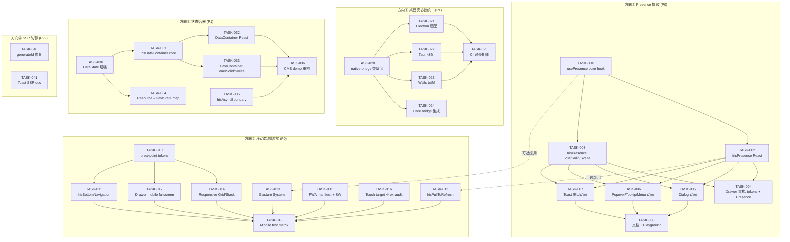
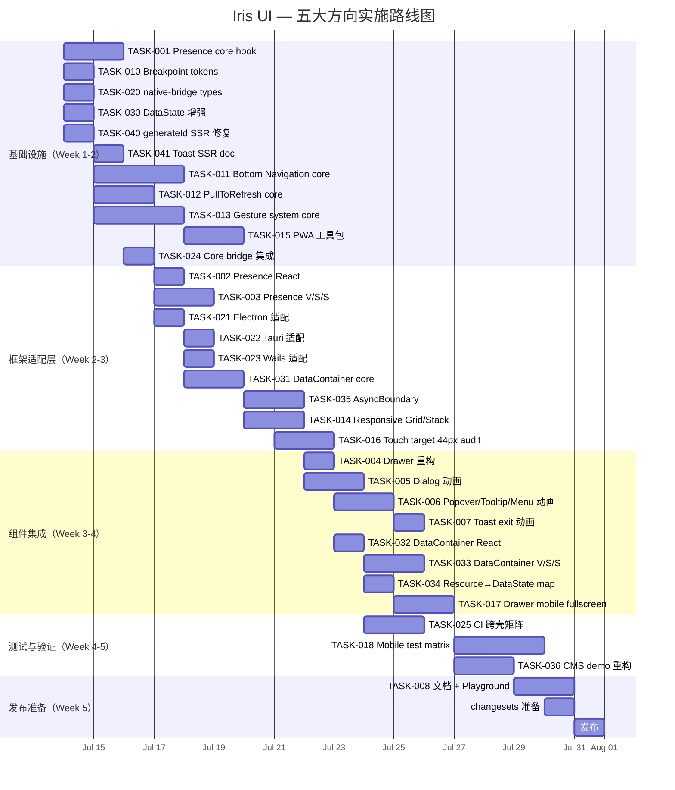

现在我已对代码库进行了充分的验证。以下是完整的 Tech Lead 分析。

---

# Tech Lead 分析：Iris UI 五大方向实施计划

## 代码库验证摘要

在深入任务分解前，我验证了文档中的关键声明：

| 声明                                | 状态 | 证据                                                                    |
| ----------------------------------- | ---- | ----------------------------------------------------------------------- |
| DataState + resolveDataState 已存在 | ✅   | `packages/core/src/data-state.ts`，4 个优先级明确                       |
| useDataState 覆盖 4 个框架          | ✅   | `packages/{react,vue,solid,svelte}/src/motion/useDataState.ts`          |
| 过渡 tokens 已定义但未被组件消费    | ✅   | `packages/tokens/src/tokens.ts` 定义了 5 个 tokens，grep 确认零组件引用 |
| Drawer 有出口动画                   | ✅   | `DrawerContent.tsx` `EXIT_DURATION_MS = 220`，2 阶段 mount/unmount      |
| Dialog/Popover/Tooltip/Menu 零动画  | ✅   | grep 确认无 transition/animation 属性                                   |
| SSR 全链路测试覆盖 4 个元框架       | ✅   | `apps/ssr-*/**/hydration.test.*`                                        |
| generateId 使用模块级计数器         | ✅   | `packages/core/src/utils.ts:27-30`                                      |
| 3 个桌面壳各自实现同一个桥接模式    | ✅   | Electron/taps preload, Tauri 注入脚本, Wails bindings                   |
| 零移动端 breakpoint tokens          | ✅   | 搜索 `--iris-breakpoint-*` 无结果                                       |
| 无通用 Presence 组件                | ✅   | grep 确认 `IrisPresence` 不存在                                         |

---

## 1. 任务分解

### 方向⑤：IrisPresence 协议（P0 — 串联可行性最高）

| ID           | 标题                                       | 涉及文件                                                                                                             | 前置依赖                     | 工时 | 验收标准                                                                                                                                                                                          |
| ------------ | ------------------------------------------ | -------------------------------------------------------------------------------------------------------------------- | ---------------------------- | ---- | ------------------------------------------------------------------------------------------------------------------------------------------------------------------------------------------------- |
| **TASK-001** | `IrisPresence` 核心 hook                   | `packages/core/src/presence.ts`（新）                                                                                | 无                           | 3h   | `usePresence` hook，接受 `visible:boolean` + `duration:number`，返回 `{ isMounted, isVisible, state }`，支持 exit animation 定时器；单元测试覆盖：open→close→remount 时间线、瞬时切换、SSR 安全性 |
| **TASK-002** | `IrisPresence` React 适配器                | `packages/react/src/primitives/presence/Presence.tsx`（新），`packages/react/src/primitives/presence/index.ts`（新） | TASK-001                     | 2h   | `<IrisPresence visible={…}>` 包裹 children，exit period 期间保持 mount；`asChild` 支持；React.StrictMode 安全                                                                                     |
| **TASK-003** | `IrisPresence` Vue/Solid/Svelte 适配器     | `packages/{vue,solid,svelte}/src/primitives/presence/`                                                               | TASK-001                     | 4h   | 各框架同名组件，React 相同 API 表面；vitest 单测 3 套                                                                                                                                             |
| **TASK-004** | 过渡 tokens 消费：`IrisDrawerContent` 重构 | `packages/react/src/primitives/drawer/DrawerContent.tsx` + 其他 3 个框架                                             | TASK-002, TASK-003           | 2h   | 硬编码 `220ms` → `var(--iris-transition-normal)`；`private` → `public` PRESENCE 协议                                                                                                              |
| **TASK-005** | Dialog 入场/出场动画                       | `packages/react/src/primitives/dialog/DialogContent.tsx` + 其他 3 个框架                                             | TASK-002, TASK-003           | 3h   | Dialog 打开时 fade + scale 入场，关闭时反向退出；`IrisPresence` 驱动 mount/unmount 时序；axe 无障碍无退化                                                                                         |
| **TASK-006** | Popover/Tooltip/Menu 微动画                | `packages/react/src/primitives/{popover,tooltip,menu}/` + 其他 3 个框架                                              | TASK-002, TASK-003           | 4h   | Popover/Tooltip: fade + translateY(4px) 入场；Menu: fade + scale; `prefers-reduced-motion` 关闭                                                                                                   |
| **TASK-007** | Toast 出口动画                             | `packages/react/src/primitives/toast/` + 其他 3 个框架                                                               | TASK-002, TASK-003           | 2h   | Toast 手动滑动退出动画统一到 `IrisPresence` 协议；swipe-to-dismiss + auto-dismiss 共享退出动画路径                                                                                                |
| **TASK-008** | 动画文档 + Playground 集成                 | `apps/playground*/`、`apps/docs/`                                                                                    | TASK-005, TASK-006, TASK-007 | 2h   | Playground 中新增 "Motion" tab，展示各组件动画开关对比；vitepress 文档新增 "Animation & Presence" 章节                                                                                            |

### 方向②：移动端/响应式/PWA（P0 — 最大工程量）

| ID           | 标题                                        | 涉及文件                                                                                                            | 前置依赖     | 工时 | 验收标准                                                                                                                                                            |
| ------------ | ------------------------------------------- | ------------------------------------------------------------------------------------------------------------------- | ------------ | ---- | ------------------------------------------------------------------------------------------------------------------------------------------------------------------- |
| **TASK-010** | `--iris-breakpoint-*` 体系                  | `packages/tokens/src/tokens.ts`、`light.ts`、`dark.ts`                                                              | 无           | 3h   | 定义 `--iris-breakpoint-sm: 640px`、`--iris-breakpoint-md: 768px`、`--iris-breakpoint-lg: 1024px`、`--iris-breakpoint-xl: 1280px`；生成 CSS var + JS 常量；单元测试 |
| **TASK-011** | `IrisBottomNavigation` 组件                 | `packages/core/src/bottom-navigation.ts`、`packages/react/src/primitives/bottom-navigation/` + 其他 3 个框架        | 无           | 6h   | 移动端底部导航栏，选中态 + 角标 + 图标；4 桥对齐；响应式：桌面自动隐藏/转为侧边栏                                                                                   |
| **TASK-012** | `IrisPullToRefresh` hook                    | `packages/core/src/pull-to-refresh.ts`（新）、`packages/{react,vue,solid,svelte}/src/behaviors/usePullToRefresh.ts` | 无           | 4h   | 纯逻辑：touch start/move/end → threshold → refresh 回调；行为组件；4 桥；测试覆盖触摸坐标 + threshold + 取消                                                        |
| **TASK-013** | 触摸手势系统（swipe/long-press/pinch-zoom） | `packages/core/src/gesture.ts`（新）                                                                                | 无           | 6h   | `createSwipe`、`createLongPress`、`createPinchZoom`；core 零框架依赖；适配器 `useSwipe`/`useLongPress`/`usePinchZoom` hooks；测试覆盖坐标/时间/多指                 |
| **TASK-014** | 响应式 Grid/Stack/Container                 | `packages/core/src/responsive.ts`（新）、各框架适配器                                                               | TASK-010     | 4h   | Grid 支持 `columns={{ sm:2, md:3, lg:4 }}`；Stack 方向响应式；Container max-width 断点切换；各框架测试                                                              |
| **TASK-015** | PWA 基础（manifest + SW）                   | `apps/*/` 所有应用 + `packages/theme/src/pwa.ts`（新）                                                              | 无           | 4h   | 生成 `manifest.json`（名称/图标/主题色）；Service Worker 注册工具函数；离线 fallback 页面                                                                           |
| **TASK-016** | 触摸目标 44px 合规审计 + 修复               | 所有涉及交互的组件（Button/IconButton/Tab/NavItem/Switch thumb）                                                    | 无           | 4h   | 遍历 149 组件：触摸目标 < 44px 的添加 `min-width:44px; min-height:44px; padding: env(safe-area-inset-*)`；测试覆盖 rendered size                                    |
| **TASK-017** | Drawer/Sheet 移动端全屏                     | `packages/react/src/primitives/drawer/` + 其他 3 个框架                                                             | TASK-010     | 3h   | Drawer 在 `--iris-breakpoint-sm` 以下自动全屏（`width:100vw; max-height:100dvh`）；Bottom sheet 模式（`side=bottom` 时拖拽关闭）                                    |
| **TASK-018** | 移动端测试矩阵                              | 端到端测试 + 浏览器模拟器集成                                                                                       | TASK-011~017 | 6h   | vitest + Playwright mobile 模拟器（iPhone/Android viewport），覆盖所有新组件                                                                                        |

### 方向①：原生桌面壳协议统一（P1 — 增量引入型）

| ID           | 标题                            | 涉及文件                                                                           | 前置依赖                     | 工时 | 验收标准                                                                                                                                                                                   |
| ------------ | ------------------------------- | ---------------------------------------------------------------------------------- | ---------------------------- | ---- | ------------------------------------------------------------------------------------------------------------------------------------------------------------------------------------------ |
| **TASK-020** | `@iris-ui/native-bridge` 类型包 | `packages/native-bridge/src/index.ts`（新）、`packages/native-bridge/package.json` | 无                           | 2h   | `NativeBridge` 接口定义：`platform`, `saveFile`, `writeClipboard`, `framework`；`window.__IRIS_NATIVE__` 全局声明；JSDoc 文档                                                              |
| **TASK-021** | Electron 适配实现               | `apps/desktop/preload.js` → `apps/desktop/preload.ts`                              | TASK-020                     | 2h   | Electron preload 实现 `NativeBridge` 接口；`contextBridge.exposeInMainWorld('__IRIS_NATIVE__', impl)`；跨壳 CI 测试                                                                        |
| **TASK-022** | Tauri 适配实现                  | `apps/desktop-tauri/src-tauri/src/inject_bridge.rs`                                | TASK-020                     | 2h   | Tauri 注入脚本实现 `NativeBridge`；`iris://` 协议中替换硬编码 shim                                                                                                                         |
| **TASK-023** | Wails 适配实现                  | `apps/desktop-wails/app.go`、`apps/desktop-wails/frontend/`                        | TASK-020                     | 2h   | Wails binding 实现 `NativeBridge`；Go struct 方法绑定                                                                                                                                      |
| **TASK-024** | 桥接集成类型安全                | `packages/core/src/native.ts`（新）                                                | TASK-020                     | 2h   | `setNativeBridge(bridge: NativeBridge)` API；`getNativeBridge(): NativeBridge`（throw if missing）；core 中原有 `setFileSaveHandler`/`setClipboardHandler` 作为 Bridge 调用的默认 fallback |
| **TASK-025** | 跨壳 CI 测试矩阵                | `.github/workflows/desktop.yml`（新）                                              | TASK-021, TASK-022, TASK-023 | 4h   | 3 壳 x 4 框架 = 12 矩阵；Electron smoke test（headless）、Tauri build check、Wails build check；`window.__IRIS_NATIVE__` API surface 断言                                                  |

### 方向③：Empty/Loading/Error 状态容器（P1 — 底层已就绪）

| ID           | 标题                                        | 涉及文件                                                               | 前置依赖           | 工时 | 验收标准                                                                                                                                                                   |
| ------------ | ------------------------------------------- | ---------------------------------------------------------------------- | ------------------ | ---- | -------------------------------------------------------------------------------------------------------------------------------------------------------------------------- | ------------------ | ----------------- |
| **TASK-030** | `DataState` 增强：Error 类型 & 空值原因     | `packages/core/src/data-state.ts`                                      | 无                 | 2h   | `DataStateInput` 增加 `errorMessage?: string`、`emptyMessage?: string`；`WrappedDataState<T>` 泛型类型 `{ state: DataState, data: T                                        | null, error: Error | null }`；向后兼容 |
| **TASK-031** | `IrisDataContainer` 核心逻辑                | `packages/core/src/data-container.ts`（新）                            | TASK-030           | 3h   | `createDataContainer` 控制器：接受 `WrappedDataState<T>` + 插槽配置（`loadingSlot`/`errorSlot`/`emptySlot`/`contentSlot`）；解决 stale-while-revalidate 语义；`retry` 回调 |
| **TASK-032** | `IrisDataContainer` React 适配器            | `packages/react/src/primitives/data-container/DataContainer.tsx`（新） | TASK-031           | 2h   | `<IrisDataContainer state={…} loading={<Spinner/>} error={…} empty={<Empty/>}>{data => <Table rows={data}/>}</IrisDataContainer>`；4 状态渲染切换 + 入场动画               |
| **TASK-033** | `IrisDataContainer` Vue/Solid/Svelte 适配器 | `packages/{vue,solid,svelte}/src/primitives/data-container/`           | TASK-031           | 3h   | 同名 API 对齐；slot/scoped slot 模式；测试 3 套                                                                                                                            |
| **TASK-034** | `ResourceState` → `DataState` 映射          | `packages/core/src/resource.ts`                                        | TASK-030           | 1h   | `createResourceController` 增加 `dataState` derived store：`loading+hasContent?content : error?error : loading?loading : !rows.length?empty : content`                     |
| **TASK-035** | `IrisAsyncBoundary` 错误边界                | `packages/core/src/async-boundary.ts`（新）、各框架适配器              | 无                 | 3h   | 错误捕获容器：catch render 错误 + async 错误；fallback UI + retry 按钮；`onError` 回调                                                                                     |
| **TASK-036** | CMS demo 重构：消除重复状态判断             | `apps/cms*/` 中 4 个 CMS 的页面组件                                    | TASK-032, TASK-033 | 4h   | 每个列表页面将 `if(loading)...if(error)...if(empty)...` 替换为 `<IrisDataContainer>`；CRUD 动作后的状态更新验证                                                            |

### 方向④：SSR 防御协议（P99 — 单点修复）

| ID           | 标题                        | 涉及文件                                           | 前置依赖 | 工时 | 验收标准                                                                                                                                                                 |
| ------------ | --------------------------- | -------------------------------------------------- | -------- | ---- | ------------------------------------------------------------------------------------------------------------------------------------------------------------------------ |
| **TASK-040** | `generateId()` SSR 安全修复 | `packages/core/src/utils.ts`                       | 无       | 1h   | 模块计数器 → `crypto.randomUUID()` fallback `Date.now().toString(36)+Math.random().toString(36).slice(2)`；SSR test（// @vitest-environment node）验证连续 render 不冲突 |
| **TASK-041** | Toast SSR 文档 + 测试       | `packages/core/src/toast.ts`（若有），`apps/docs/` | 无       | 1h   | 文档说明：Toast 在 SSR 场景下不渲染，hydration 后首次操作时才挂载；SSR renderToString 测试 Toast 不抛异常                                                                |

---

## 2. 执行顺序 — 任务依赖图



### 可并行执行的任务组

| 组                    | 任务                                                           | 并行条件                 |
| --------------------- | -------------------------------------------------------------- | ------------------------ |
| **Group A** (第 1 周) | T001, T010, T020, T030, T040                                   | 互不依赖，各自独立包     |
| **Group B** (第 2 周) | T002+T003, T011+T012+T013, T021+T022+T023+T024, T031           | 各组内可并行，跨组无依赖 |
| **Group C** (第 3 周) | T004+T005+T006+T007, T014+T015+T016+T017, T032+T033+T035, T025 | 需要 Group B 的产物      |
| **Group D** (第 4 周) | T008, T018, T036, T034, T041                                   | 需要 Group C 的产物      |

---

## 3. 技术风险

### 高风险（需提前 mitigat）

| 风险 ID | 风险描述                                                                                                                                                                                                                 | 影响方向 | 可能性 | 严重性 | 缓解策略                                                                                                                                                                                                            |
| ------- | ------------------------------------------------------------------------------------------------------------------------------------------------------------------------------------------------------------------------ | -------- | ------ | ------ | ------------------------------------------------------------------------------------------------------------------------------------------------------------------------------------------------------------------- |
| R01     | **Presence 跨框架对齐**：React 的 `useEffect` unmount 时间线与 Svelte 的 `onDestroy` / Solid 的 `onCleanup` 在 exit 动画时序上行为不一致——`requestAnimationFrame`+`setTimeout` 组合在 Solid 的微任务时序中可能跳过中间态 | ⑤        | 中     | 高     | presence 核心逻辑 100% 在 core（`usePresence`）中实现，适配器只做渲染桥；core 使用 `Promise.then` 而非 rAF（SSR 安全）；每个适配器的 exit 测试覆盖严格 3 帧时间线                                                   |
| R02     | **拖拽手势与现有 Drag 系统的冲突**：`touchAction: 'none'` 已在内置拖拽组件中设置——新手势系统可能与其竞争 pointer 事件导致 Splitter/Resizer/RangeSlider 在移动端失效                                                      | ②        | 中     | 高     | 手势系统使用 `pointer*` 事件 + `setPointerCapture`，避免与组件内部 handler 冲突；`useGesture` hook 提供 `conflictDetection` 模式（检测已注册 pointer handler 时发出警告）；E2E 测试覆盖 Splitter + Swipe 共存的场景 |
| R03     | **PWA manifest 与现有 4 个 CMS app 的集成**：4 个 CMS 各有自己的 build pipeline 和 entry point——统一注入 manifest + SW 需要侵入 4 个独立构建链                                                                           | ②        | 中     | 中     | 创建 `@iris-ui/pwa` 工具包，提供 `generateManifest(config)` 纯函数 + `registerSW()` 工具函数；每个 CMS 在入口文件中调用即可，不修改构建配置；manifest 使用 `webpack`/`vite` PWA 插件的 `import.meta.env` 模式       |
| R04     | **macOS Gatekeeper + sandbox entitlements**：Tauri 的 `iris://` 自定义协议在 sandbox=true 且代码签名的环境下需要 `com.apple.security.app-sandbox` + 自定义协议 entitlements——当前三个壳均未测试                          | ①        | 低     | 高     | native-bridge 类型包中包含 entitlements 文档 + 配置文件模板；CI 中增加 macOS 签名验证步骤（至少 dry-run）；Electron 的 `contextIsolation: true` + `sandbox: true` 组合单独测试                                      |
| R05     | **`IrisDataContainer` 的 stale-while-revalidate 边界情况**：`loading=true` + `hasContent=true` 时返回 `content` 但错误抢占场景（fetch1 → fetch2 完成 → fetch1 失败）可能导致老数据被错误覆盖                             | ③        | 中     | 中     | core 中 `resolveDataState` 增加请求时序 ID；`createDataSource` 已有 abort-on-unmount 保护，扩展为 abort-on-stale；单元测试覆盖 3 种竞态场景                                                                         |

### 低风险（但有注意事项）

| 风险 ID | 风险描述                                                            | 影响方向 | 缓解策略                                                                                       |
| ------- | ------------------------------------------------------------------- | -------- | ---------------------------------------------------------------------------------------------- |
| R06     | Vue 3.5+ `useId` 在 SSR hydrate 时行为需验证                        | ④        | 阅读 Vue SSR 文档；在现有 `apps/ssr-nuxt/test/hydration.test.ts` 中增加 Vue `useId` 使用的组件 |
| R07     | `IrisBottomNavigation` 在 Svelte 的 SSR 中需要 `<svelte:head>` 注入 | ②        | 使用 Svelte 的 `<svelte:head>` + 条件 client-only 渲染                                         |
| R08     | iOS Safari 100dvh 兼容性（iOS 15.2+ 才支持 `dvh`）                  | ②        | 遵循已有模式：`height:100vh; max-height:100dvh` fallback                                       |
| R09     | Solid 的 `onCleanup` 时序与 `setTimeout` 退出动画的交互             | ⑤        | presence 核心使用 `AbortSignal` 而非定时器取消                                                 |

---

## 4. 资源评估

### 团队规模和技能矩阵

| 角色                  | 所需数量 | 技能要求                                           | 占比工时 |
| --------------------- | -------- | -------------------------------------------------- | -------- |
| **Core 逻辑开发者**   | 2 人     | TypeScript 深度、状态机/控制器模式、竞态处理       | 35%      |
| **React 适配器**      | 1 人     | React 18/19、`useSyncExternalStore`、Floating UI   | 15%      |
| **Vue 适配器**        | 1 人     | Vue 3.5+ Composition API、`useId`、`useSSRContext` | 10%      |
| **Solid 适配器**      | 1 人     | SolidJS 信号/效果、`createMemo`/`createResource`   | 10%      |
| **Svelte 适配器**     | 1 人     | Svelte 5 runes、`$state` 陷阱知识、svelte-package  | 10%      |
| **移动端/浏览器测试** | 1 人     | Playwright mobile、Chrome DevTools 移动模拟        | 10%      |
| **文档 + Playground** | 1 人     | VitePress、交互式 demo 开发                        | 10%      |

> **最小可行团队**：3 人（1 core + 1 React + 1 其他框架通才轮流）。**推荐**：5 人（2 core + 2 React+另1框架 + 1 移动测试）。

### 关键里程碑

| 里程碑 | 时间      | 交付物                                                                                                        | 验收门                                                                                     |
| ------ | --------- | ------------------------------------------------------------------------------------------------------------- | ------------------------------------------------------------------------------------------ |
| **M1** | Week 2 末 | 所有 core 逻辑完成：presence hook、data-container 控制器、native-bridge 类型、gesture 引擎、breakpoint tokens | core 单测全绿 + `grep -r "from '.*\(vue\|react\|solid\|svelte\)'" packages/core/src/` 为空 |
| **M2** | Week 3 末 | 所有 React 适配器完成 + CI 桌面矩阵                                                                           | React 单测 + SSR test + axe 全绿；3 壳 CI 绿                                               |
| **M3** | Week 4 末 | 所有 4 框架适配器对齐 + 移动端测试矩阵                                                                        | 4 框架测试全绿 + Playwright mobile 矩阵                                                    |
| **M4** | Week 5 末 | CMS demo 重构 + 文档 + Playground 发布                                                                        | changeset 准备好；Playground 有交互式 Presence/Demo；文档站已部署                          |

### 阻塞点和解决策略

| Blocker                                               | 影响          | 策略                                                                                                                                                                      |
| ----------------------------------------------------- | ------------- | ------------------------------------------------------------------------------------------------------------------------------------------------------------------------- |
| **Svelte 5 的 `$state` 与 Presence 的 rune 命名冲突** | 任务 TASK-003 | presence 在 Svelte 中命名 `_isMounted`/`_isVisible` 避免使用 `state` 变量名（参照 AGENTS.md 中的陷阱说明）；presence 状态直接由 core hook 管理，Svelte 适配器只订阅派生值 |
| **Tauri v2 IPC 接口与 v1 的行为差异**                 | 任务 TASK-022 | Tauri 适配器锁定 `@tauri-apps/api@2.x`；在 CI 中使用 `tauri-driver` + WebDriver 测试而非单元 mock                                                                         |
| **Mobile 测试缺乏真实设备**                           | TASK-018      | 第一阶段使用 Playwright + `@playwright/test` 的 `iphone`/`pixel` 预设 viewport + `hasTouch` 模拟器；第二阶段使用 BrowserStack/SauceLabs（若项目有预算）                   |
| **iOS SW 注册需要 HTTPS**                             | TASK-015      | manifest/SW 在 dev 模式通过 `localhost` 回退；文档标注生产部署需要 HTTPS；开发阶段使用 `vite-plugin-pwa` 自动处理                                                         |

---

## 5. 质量保证

### 5.1 单元测试覆盖要求

| 模块                                  | 目标覆盖率 | 关键测试场景                                                                                                                                             |
| ------------------------------------- | ---------- | -------------------------------------------------------------------------------------------------------------------------------------------------------- |
| `packages/core/src/presence.ts`       | 100% 分支  | open→mount→visible、close→exitAnimation→unmount、瞬时切换（open→close before exit completes）、SSR 无 DOM、prefers-reduced-motion、重复 open 重叠        |
| `packages/core/src/gesture.ts`        | 100% 分支  | swipe 水平/垂直/斜向、long-press 时间 threshold、pinch-zoom distance threshold、多点同时触发、pointercancel 清理、每个 gesture 的 `destroy()` idempotent |
| `packages/core/src/data-container.ts` | 100% 分支  | 4 状态渲染选择、stale-while-revalidate（loading+hasContent=content）、error→retry→reload、空数据 vs 未加载                                               |
| `packages/native-bridge/src/`         | 100% 语句  | 接口类型验证、`setNativeBridge`/`getNativeBridge`、missing bridge 抛错、Electron/Tauri/Wails 适配器 mock                                                 |

**四框架桥接一致性测试模式**：
每个适配器层新增的组件需通过 3 道门：

1. **类型门**：TypeScript strict 编译
2. **渲染门**：`renderToString` SSR 不抛异常
3. **交互门**：vitest 中点击/勾选/填写测试

### 5.2 集成测试策略

| 测试类型          | 范围                                                                 | 工具                                              | 执行时机                           |
| ----------------- | -------------------------------------------------------------------- | ------------------------------------------------- | ---------------------------------- |
| **SSR 全链路**    | 每个新组件的 SSR 渲染 + 4 元框架 hydration test 扩展                 | `renderToString` → `hydrateRoot` / `createSSRApp` | CI 每个 PR                         |
| **无障碍 (a11y)** | Dialog/Tooltip/Popover/Menu/BottomNavigation 的 ARIA 角色 + 焦点管理 | vitest + `@axe-core/react` + 键盘导航测试         | CI 每个 PR（`--iris-a11y` 门）     |
| **移动端模拟**    | 所有新组件在 iPhone 12 / Pixel 7 viewport + touch 事件               | Playwright `@playwright/test`                     | CI daily（或 PR 门 if configured） |
| **桌面壳烟雾**    | Electron smoke（`apps/desktop/smoke.js`）+ Tauri/Wails build         | Node child_process / tauri-driver                 | CI PR（`desktop-smoke` 矩阵）      |
| **size 预算**     | core + 各适配器 + skin pkg 的 bundle size 回归                       | `pnpm size`（现有基础设施）                       | CI 每个 PR                         |

### 5.3 代码审查要点

| 审查点         | 具体检查内容                                                                                  | 相关方向 |
| -------------- | --------------------------------------------------------------------------------------------- | -------- |
| **框架隔离**   | `grep -rE "from '(vue\|react\|solid\|svelte)'" packages/core/src/` 必须空                     | 全部     |
| **SSR 安全**   | 新组件不调 `document`/`window`/`localStorage`（除 `useEffect` 外）；`useId` 而非 `generateId` | ⑤、③     |
| **动画降级**   | 每个动画路径必须包含 `@media (prefers-reduced-motion: reduce)` 覆盖                           | ⑤        |
| **Touch 目标** | 交互元素 click 区域 ≥ 44x44px（不仅视觉尺寸，含 padding）                                     | ②        |
| **RTL 安全**   | 方向相关使用逻辑属性（`margin-inline-start`/`inset-inline-end`），勿写死 left/right           | 全部     |
| **插件契约**   | 新的重型能力（editor/pro-table 模式）走 `createPlugin`，不在 core 中加入框架 import           | ③        |

### 5.4 性能测试需求

| 场景                       | 指标                                       | 目标                                 | 工具                                                        |
| -------------------------- | ------------------------------------------ | ------------------------------------ | ----------------------------------------------------------- |
| **Presence 动画帧率**      | 1000 个 Presence 实例并发退出              | 无掉帧（60fps）、无 layout thrashing | `requestAnimationFrame` 时序测试 + Chrome Performance trace |
| **Bottom Navigation 渲染** | 5 项图标+文本在 4 框架下的 mount 耗时      | < 50ms per framework                 | vitest + `performance.now()`                                |
| **Mobile Scroll 性能**     | 长列表（10k items）在 touch 设备上惯性滚动 | 无 jank、`touchAction` 无冲突        | Playwright `page.evaluate` 获取 FPS                         |
| **PWA SW 缓存命中**        | 离线时 repeat visit 的加载时间             | < 500ms（disk cache）                | Lighthouse CLI `--preset=desktop`/`--preset=modern`         |

---

## 6. 实施计划

### 甘特图



### 阶段 1：基础设施搭建（Day 1-5）

**目标**：完成所有 core 层的逻辑，确保四框架共享层稳定。

| Day | 任务                                                               | 产出                                                          |
| --- | ------------------------------------------------------------------ | ------------------------------------------------------------- |
| 1   | TASK-001 (Presence core) + TASK-040 (generateId)                   | `packages/core/src/presence.ts` + `utils.ts` 修复；单元测试   |
| 2   | TASK-010 (breakpoint tokens) + TASK-030 (DataState 增强)           | `tokens/src/tokens.ts` 更新；`data-state.ts` 新类型           |
| 2-3 | TASK-020 (native-bridge types) + TASK-024 (core bridge 集成)       | `packages/native-bridge/` 新包；`packages/core/src/native.ts` |
| 3-5 | TASK-011/012/013 (BottomNavigation + PullToRefresh + Gesture core) | 3 个 core 模块 + 单测                                         |
| 4   | TASK-015 (PWA 工具包)                                              | `packages/pwa/` 新包                                          |

**验收门**：

- `pnpm turbo run test --filter=@iris-ui/core` 全绿
- `pnpm size` 预算通过（core 增量 < 3KB）
- `grep -rE "from '(vue|react|solid|svelte)'" packages/core/src/` 空

### 阶段 2：核心功能实现（Day 6-12）

**目标**：所有 React 适配器 + 一个其他框架适配器（Vue 优先，因其 `useId` 支持最好）+ 桌面壳适配。

| Day   | 任务                                                           | 产出                                                               |
| ----- | -------------------------------------------------------------- | ------------------------------------------------------------------ |
| 6-7   | TASK-002 (Presence React) + TASK-021 (Electron)                | `IrisPresence` React 组件；Electron preload 使用 NativeBridge 类型 |
| 7-8   | TASK-003 (Presence Vue) + TASK-022/023 (Tauri/Wails)           | Presence Vue 组件；Tauri/Wails 适配实现                            |
| 8-9   | TASK-031 (DataContainer core) + TASK-032 (DataContainer React) | `IrisDataContainer` React 组件 + 3 状态 slot 渲染                  |
| 9-10  | TASK-035 (AsyncBoundary) + TASK-014 (Responsive Grid)          | 错误边界组件；Grid/Stack 响应式 tokens 消费                        |
| 10-12 | TASK-016 (Touch target 44px) + TASK-033 (DataContainer Vue)    | 全组件 touch 目标修复；Vue 容器组件                                |

**验收门**：

- React 所有新组件测试 + SSR test + axe 全绿
- 一个其他框架（Vue）组件测试全绿
- 桌面壳：3 壳构建烟雾测试通过

### 阶段 3：集成测试和优化（Day 13-19）

**目标**：所有 4 框架对齐 + 动画集成 + 移动端测试矩阵。

| Day   | 任务                                                          | 产出                                                |
| ----- | ------------------------------------------------------------- | --------------------------------------------------- |
| 13-14 | TASK-004 (Drawer tokens) + TASK-017 (Drawer mobile)           | Drawer 动画 token 消费 + 移动端全屏模式             |
| 14-16 | TASK-005 (Dialog 动画) + TASK-006 (Popover/Tooltip/Menu)      | 5 个浮层组件入场/出场动画                           |
| 16-17 | TASK-007 (Toast exit) + TASK-033 (DataContainer Solid/Svelte) | Toast 动画统一 + 剩余框架容器组件                   |
| 17-18 | TASK-034 (Resource→DataState) + TASK-025 (CI 矩阵)            | ResourceController 增加 `dataState`；3 壳 CI 工作流 |
| 18-19 | TASK-018 (Mobile test matrix)                                 | Playwright 移动测试配置 + 执行                      |

**验收门**：

- 所有 4 框架 Presence 组件测试全绿
- Dialog/Popover 有动画 + `prefers-reduced-motion` 感知
- 3 壳 CI 矩阵全绿（Electron headless smoke + Tauri/Wails build）
- Playwright mobile 测试全绿（iPhone/Pixel viewport + touch 事件）

### 阶段 4：发布准备（Day 20-23）

**目标**：CMS demo 重构 + 文档 + changesets 发布。

| Day   | 任务                         | 产出                                          |
| ----- | ---------------------------- | --------------------------------------------- |
| 20-21 | TASK-036 (CMS demo 重构)     | 4 个 CMS 的列表页面替换为 `IrisDataContainer` |
| 21-22 | TASK-008 (文档 + Playground) | "Animation & Presence" 文档章节 + 交互式 demo |
| 22-23 | changesets + 发布            | `pnpm changeset` version 和 publish dry-run   |

**验收门**：

- CMS demo 中零手写 `if(loading)...if(error)...if(empty)...`
- Playground 有 "Motion" tab
- changeset 准备就绪，`pnpm publish --dry-run` 验证

---

## 总结：优先级建议

```
P0 (本周开始)     → ⑤ Presence 协议 + ② 移动端/响应式（50% 资源 each）
P1 (下周开始)     → ① 桌面壳协议 + ③ 状态容器（25% 资源 each，开始后与 P0 并行）
P99 (下个月)      → ④ SSR 防御（1 人 1 天）
```

**不建议等待**：方向⑤和②之间无硬前置依赖，可以同周启动。方向①和③的 `createResourceController` → `DataState` 映射可以帮助 CMS demo 重构，但也不是硬阻塞（可先手动 wrapper）。

**最关键的风险降低项**：立即开始 TASK-001（Presence core hook），因为它是方向⑤所有其他任务的前提，且作为纯 core 逻辑与框架无关，可以独立测试和发布。
