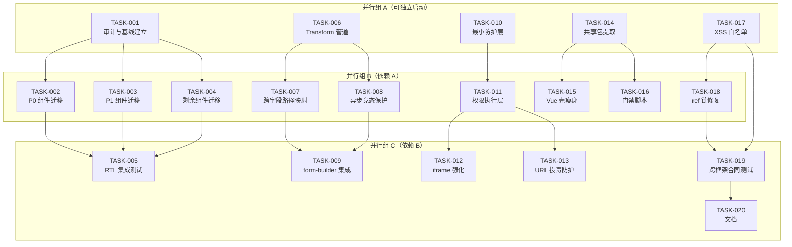
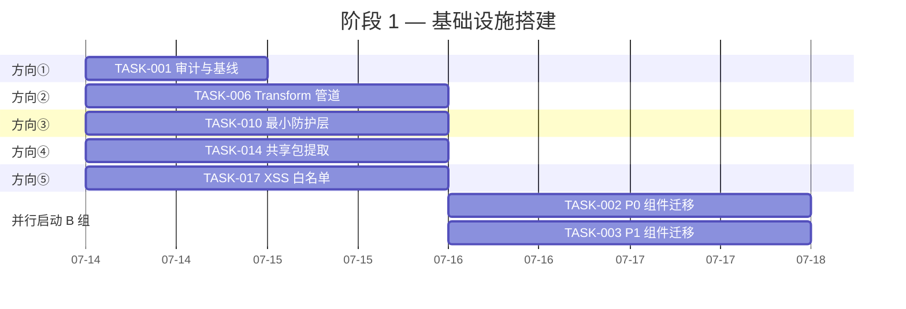
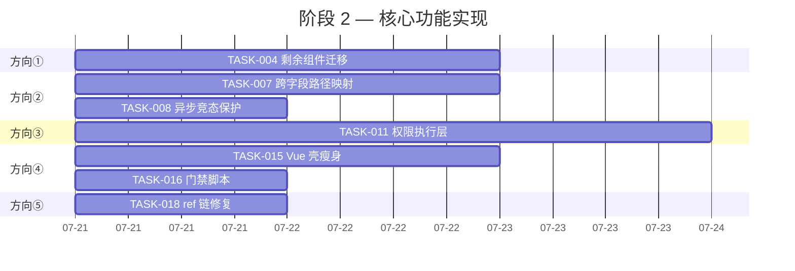
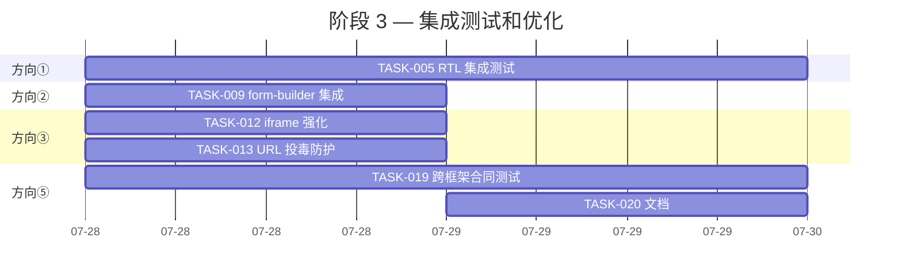

Now I have a thorough understanding of the codebase state. Let me compile the full Tech Lead analysis.

---

# Tech Lead 分析：5 个高价值扩展方向

> **分析日期**：2026-07-12 · **角色**：Tech Lead  
> **范围**：基于 2026-07-11 全局源码扫描分析文档，结合代码库实际验证（IrisSlot/mergeSlotProps/Vue Slot/standardSchemaValidator/remoteApp/permissions）

---

## 1. 任务分解

### TASK-001：CSS 逻辑属性审计与基线建立

- **方向**：① CSS 逻辑属性迁移
- **涉及文件**：
  - 新增：`docs/architecture/css-logical-properties-audit.md`（审计清单 + 迁移决策树）
  - 修改：N/A（纯文档产出）
- **前置依赖**：无
- **预估工时**：2h
- **验收标准**：
  - 列出所有 ~33 处物理属性的精确位置（文件:行号），标注每处应迁移为逻辑属性还是保持物理（附 RTL 推理）
  - 输出每 keyframe 的替代方案（`transform: translateX()` 或 `@property`）

### TASK-002：Toast / Progress / FloatButton 逻辑属性迁移（P0 组件）

- **方向**：① CSS 逻辑属性迁移
- **涉及文件**：
  - `packages/react/src/primitives/toast/ToastViewport.tsx`
  - `packages/react/src/primitives/progress/styles.ts`
  - `packages/react/src/primitives/float-button/FloatButton.tsx`
- **前置依赖**：TASK-001
- **预估工时**：3h
- **验收标准**：
  - `paddingRight`/`paddingLeft` → `paddingInlineEnd`/`paddingInlineStart`
  - `left`/`right` 在 toast viewport 中 → `inset-inline-start`/`inset-inline-end`
  - keyframes 中 `left`/`right` 已用 `transform: translateX()` 替代或标注为保持物理
  - 四框架同步修改（React/Vue/Solid/Svelte 对应文件）

### TASK-003：Slider / Switch / Select 逻辑属性迁移（P1 组件）

- **方向**：① CSS 逻辑属性迁移
- **涉及文件**：
  - `packages/react/src/primitives/slider/Slider.tsx`
  - `packages/react/src/primitives/switch/Switch.tsx`
  - `packages/react/src/primitives/select/Select.tsx`
- **前置依赖**：TASK-001
- **预估工时**：3h
- **验收标准**：
  - `left: 50%` 在 Slider 中 → `inset-inline-start: 50%` 加 `translateX(-50%)`
  - `Switch` 的 `left: thumbOffset` → `insetInlineStart: thumbOffset`
  - `Select` 的 `right: 8` → `insetInlineEnd: 8`
  - RTL 单元测试追加（每个组件至少一个 RTL 断言）

### TASK-004：剩余组件逻辑属性迁移（Table / Tour / Dragger / Resizer / Rating / Drawer / Affix / ColorPicker / RangeSlider）

- **方向**：① CSS 逻辑属性迁移
- **涉及文件**：~10 个组件文件，分散在 `packages/*/src/primitives/`
- **前置依赖**：TASK-001
- **预估工时**：4h
- **验收标准**：
  - 全库 `grep -rn "left:\|right:\|marginLeft\|marginRight\|paddingLeft\|paddingRight\|borderLeft\|borderRight"` 清零（排除 0/50%/100% 等对称值及合理物理用例）
  - 每个组件至少一个 RTL 测试用例

### TASK-005：RTL 集成测试与跨框架对齐验证

- **方向**：① CSS 逻辑属性迁移
- **涉及文件**：
  - 新增：`packages/react/src/primitives/direction.test.tsx`（扩展）
  - 新增跨框架 RTL 测试矩阵
- **前置依赖**：TASK-002, TASK-003, TASK-004
- **预估工时**：3h
- **验收标准**：
  - 每个迁移组件在 LTR/RTL 下渲染快照不同
  - 四框架 RTL 渲染一致（接入 `IrisI18nProvider direction` prop）
  - axe 无障碍测试在 RTL 语言下通过

### TASK-006：standardSchemaValidator transform 管道与值返回

- **方向**：② Standard Schema 验证桥
- **涉及文件**：
  - `packages/core/src/standard-schema.ts`
  - `packages/core/src/index.ts`（导出更新）
- **前置依赖**：无
- **预估工时**：3h
- **验收标准**：
  - `standardSchemaValidator` 返回 `{ errors: FieldErrors, transformed?: FormValues }`
  - Zod `.transform()` / `.pipe()` / `.catch()` 的转换值被回填到表单 store
  - 兼容现有消费方（`errors` 字段向后兼容）

### TASK-007：跨字段校验路径映射与 vendor 差异归一化

- **方向**：② Standard Schema 验证桥
- **涉及文件**：
  - `packages/core/src/standard-schema.ts`
  - 新增：`packages/core/src/standard-schema.test.ts`
- **前置依赖**：TASK-006
- **预估工时**：3h
- **验收标准**：
  - `z.refine(data => ..., { path: ["confirm"] })` → 错误正确映射到 `errors.confirm`
  - Zod 3.24 / Valibot 1.x / ArkType 2.x 的 path 格式差异被 `segmentOf` 覆盖
  - 测试覆盖 union/discriminatedUnion/intersection 组合 schema

### TASK-008：异步验证竞态保护与超时

- **方向**：② Standard Schema 验证桥
- **涉及文件**：
  - `packages/core/src/standard-schema.ts`
  - `packages/core/src/standard-schema.test.ts`
- **前置依赖**：TASK-006
- **预估工时**：2h
- **验收标准**：
  - 与 `createValidationEngine` 的 token/abort 机制集成
  - 验证超时（默认 5s）后回退到「验证中」状态
  - 竞态场景：快速输入 → 旧 token 的 validate 结果被丢弃

### TASK-009：plugin-form-builder 集成 standardSchemaValidator

- **方向**：② Standard Schema 验证桥
- **涉及文件**：
  - `packages/plugin-form-builder/src/*.ts`（待确认具体路径）
- **前置依赖**：TASK-006, TASK-007, TASK-008
- **预估工时**：2h
- **验收标准**：
  - `plugin-form-builder` 中可用 `standardSchemaValidator(z.object({...}))` 替换内联 validate
  - 示例/文档中提供 Zod/Valibot/ArkType 各一个集成示例
  - 所有已有表单测试继续通过

### TASK-010：Remote App 加载安全审计与最小防护层

- **方向**：③ Remote App 安全沙箱
- **涉及文件**：
  - `apps/desktop-os/src/remoteApp.ts`（以及 Vue/Solid/Svelte 对应文件）
  - 新增：`apps/desktop-os/src/remoteApp.test.ts`
- **前置依赖**：无
- **预估工时**：4h
- **验收标准**：
  - URL 白名单校验：拒绝非 HTTPS/非受信 origin 的 `remote` app URL
  - 超时保护：`Promise.race([import(url), timeout(10s)])` → 超时后抛错，触发 `<ErrorBoundary>`
  - 错误边界：`loadRemoteApp` 失败 → 友好 fallback UI（非全白崩溃）
  - 跨框架统一：四框架 `remoteApp.ts` 共享同一个 core 校验函数

### TASK-011：权限执行层 —— mount() 作用域削减

- **方向**：③ Remote App 安全沙箱
- **涉及文件**：
  - `apps/desktop-os/src/remoteApp.ts`
  - `apps/desktop-os/src/catalog.ts`
  - 新增：`packages/desktop-shared/src/remote-app-sandbox.ts`
- **前置依赖**：TASK-010
- **预估工时**：5h
- **验收标准**：
  - `mount(el, ctx)` 的 `ctx` 中只注入声明过的权限对应 API
  - 未声明 `'storage'` 的 remote app 调用 `profile.getPref()` → 返回 `undefined`/throw
  - 未声明 `'clipboard'` 的 app 调用 `navigator.clipboard` → 被拦截
  - 使用 `Proxy` 包装 `ctx` 对象：读取未授权的属性返回 `undefined`

### TASK-012：iframe sandbox 强化与权限声明同步

- **方向**：③ Remote App 安全沙箱
- **涉及文件**：
  - `apps/desktop-os/src/appviews/AppStore.tsx`（具体 iframe 渲染处）
  - `packages/desktop-shared/src/iframe-sandbox.ts`
- **前置依赖**：TASK-011
- **预估工时**：3h
- **验收标准**：
  - iframe 渲染时根据 `manifest.permissions` 动态设置 `sandbox` 属性：
    - 有 `'network'` → 不加 `allow-same-origin`（或根据策略加 `allow-forms`）
    - 有 `'clipboard'` → 加 `allow-clipboard-{read,write}`
    - 未声明 → 最小集 `allow-scripts allow-same-origin`（或按安全策略）
  - `kind: 'link'` 应用使用 `noopener noreferrer` + `rel` 验证

### TASK-013：App Store 恶意 URL 防护与持久化投毒防护

- **方向**：③ Remote App 安全沙箱
- **涉及文件**：
  - `apps/desktop-os/src/permissions.ts`
  - `apps/desktop-os/src/appviews/AppStore.tsx`
- **前置依赖**：TASK-012
- **预估工时**：3h
- **验收标准**：
  - 用户添加自定义 app URL 时进行 URL 合法性校验（`new URL()` + 拒绝 `javascript:/data:` 协议）
  - localStorage 中存储的自定义 app URL 在加载时有校验（即使被篡改，也只是加载失败而非 XSS）
  - 测试覆盖 URL 注入场景

### TASK-014：应用层代码共享治理 —— 共享包提取（tabs / desktopBridge）

- **方向**：④ 跨框架代码重复治理
- **涉及文件**：
  - 新增：`packages/cms-shared/src/tabs.ts`
  - 新增：`packages/desktop-shared/src/desktopBridge.ts`
  - 修改：四框架 CMS 和 Desktop OS 的 `tabs.ts` / `desktopBridge.ts` 改为 re-export
- **前置依赖**：无
- **预估工时**：4h
- **验收标准**：
  - `tabs.ts` 在 4 个 CMS 框架中全部 `export { tabsNav } from '@iris-ui/cms-shared'`
  - `desktopBridge.ts` 在 4 个 Desktop OS 框架中全部 `export { createBridge } from '@iris-ui/desktop-shared'`
  - 所有 API 签名完全一致（类型导出兼容）

### TASK-015：Desktop OS Vue 壳瘦身 —— 消除 core 子路径重复包装

- **方向**：④ 跨框架代码重复治理
- **涉及文件**：
  - `apps/desktop-os-vue/src/wm.ts` → 改为 re-export from core
  - `apps/desktop-os-vue/src/fs.ts` → 同上
  - `apps/desktop-os-vue/src/clipboard.ts` → 同上
  - `apps/desktop-os-vue/src/notifications.ts` → 同上
  - `apps/desktop-os-vue/src/profile.ts` → 同上
- **前置依赖**：TASK-014
- **预估工时**：3h
- **验收标准**：
  - Vue Desktop OS 文件数减少 ~5-6 个独立包装文件
  - 功能零回归（对应测试全部通过）
  - 确认 core 子路径确实已提供完全框架无关的实现

### TASK-016：应用层新增文件门禁脚本

- **方向**：④ 跨框架代码重复治理
- **涉及文件**：
  - 新增：`scripts/check-app-layer-duplication.ts`
  - 修改：`package.json`（新增 `lint:duplication` script）
- **前置依赖**：TASK-014
- **预估工时**：3h
- **验收标准**：
  - CI 中 `pnpm lint:duplication` 运行
  - 检测规则：如果在两个以上框架的应用层发现 >70% 内容相同的文件，标记为候选下沉
  - 豁免机制：物理文件可以标注 `// lint:duplication-exempt` + 理由

### TASK-017：mergeSlotProps 安全白名单 —— 阻断 XSS 向量

- **方向**：⑤ Slot 协议安全
- **涉及文件**：
  - `packages/react/src/primitives/slot/Slot.tsx`（React）
  - `packages/vue/src/primitives/slot/Slot.ts`（Vue）
- **前置依赖**：无
- **预估工时**：3h
- **验收标准**：
  - `dangerouslySetInnerHTML` / `suppressHydrationWarning` / `key` / `ref` 列入保护白名单 → slot 的版本不被子元素覆盖
  - `children` prop slot 的版本如果存在且子元素也提供 → merge 时发出 console.warn（非破坏）
  - ARIA 属性（`role` / `aria-*`）slot 的版本不被子元素覆盖（但子元素可新增）
  - 单元测试覆盖 XSS 注入场景

### TASK-018：mergeSlotProps ref 链修复

- **方向**：⑤ Slot 协议安全
- **涉及文件**：
  - `packages/react/src/primitives/slot/Slot.tsx`（React）
  - `packages/vue/src/primitives/slot/Slot.ts`（Vue）
- **前置依赖**：TASK-017
- **预估工时**：2h
- **验收标准**：
  - slot + child 都提供 `ref` 时 → `composeRefs`/`mergeRefs` 而非 child 覆盖
  - 嵌套 IrisSlot（二层）的 ref 链全部保留
  - Vue 的 `composeRefs` 已存在但需要确认 React 的 `mergeRefs` 是否正确处理了 `forwardedRef + childRef`

### TASK-019：Slot 跨框架合同测试

- **方向**：⑤ Slot 协议安全
- **涉及文件**：
  - 新增：`packages/react/src/primitives/slot/Slot.contract.test.tsx`
  - 新增：`packages/vue/src/primitives/slot/Slot.contract.test.ts`
  - 新增：`packages/solid/src/primitives/slot/IrisSlot.contract.test.tsx`
  - 新增：`packages/svelte/src/primitives/slot/IrisSlot.contract.test.ts`
- **前置依赖**：TASK-017, TASK-018
- **预估工时**：4h
- **验收标准**：
  - 四框架共享同一份合同测试清单（behavior specs as comments）
  - 测试覆盖：style 合并 / className 拼接 / 事件组合 / ref 转发 / XSS 阻断 / ARIA 保护 / 嵌套 slot
  - 四框架全部通过

### TASK-020：Slot 文档与使用指引

- **方向**：⑤ Slot 协议安全
- **涉及文件**：
  - 新增/修改：VitePress 文档中 `primitives/slot.md`
  - 修改：`llms.txt`
- **前置依赖**：TASK-019
- **预估工时**：2h
- **验收标准**：
  - 文档描述哪些 prop 被合并、哪些被覆盖、哪些被保护
  - 包含 XSS 预防指南
  - 包含嵌套 Slot 的使用说明和注意事项

---

## 2. 执行顺序

**并行执行策略**：

| 并行组         | 包含任务                                    | 建议人手   | 预估周期（人·日） |
| -------------- | ------------------------------------------- | ---------- | ----------------- |
| A（基础设施）  | 001, 006, 010, 014, 017                     | 3-4 人并行 | 0.5-1 日          |
| B（核心实现）  | 002, 003, 004, 007, 008, 011, 015, 016, 018 | 4-5 人并行 | 1-2 日            |
| C（集成+文档） | 005, 009, 012, 013, 019, 020                | 3-4 人并行 | 1-1.5 日          |

---

## 3. 技术风险

### 3.1 高影响风险

| 风险                                                              | 方向 | 可能性 | 影响     | 缓解策略                                                                                                              |
| ----------------------------------------------------------------- | ---- | ------ | -------- | --------------------------------------------------------------------------------------------------------------------- |
| `mergeSlotProps` 行为变更造成 ~30+ 组件回归                       | ⑤    | **高** | **严重** | 白名单只加不删，不改现有合并语义；先加 `console.warn` 走一个迭代观察                                                  |
| 四框架 slot 语义本就不一致——合同测试可能暴露深层差异              | ⑤    | **中** | **中**   | 合同测试作为文档先用，不强制四框架完全对齐（Solid slot 用 span wrapper, Svelte slot 用 `{@render}`）                  |
| `dangerouslySetInnerHTML` 注入在 Vue/Solid/Svelte 中路径不同      | ⑤    | **中** | **严重** | Vue 中 `v-html`、Solid 中 `innerHTML` 需分别检查；不要只修 React                                                      |
| Remote App 权限执行层——Proxy 拦截无法防御所有 DOM API 调用        | ③    | **高** | **严重** | 承认 Proxy 是妥协方案；文档标注「非完全沙箱，适合非敏感场景」；长期路线指向 Web Worker + `SES`（Hardened JavaScript） |
| iframe `sandbox` 属性与已有功能冲突（如 files app 需要存储）      | ③    | **中** | **中**   | 每个 iframe 应用单独评估 sandbox 策略；提供 sandbox 属性配置覆盖                                                      |
| Zod `.transform()` 返回值与 Iris 表单 store 的受控/非受控模型衔接 | ②    | **中** | **中**   | 明确 transform 只在非受控模式下生效；受控模式下 consumer 自行管理转换                                                 |
| CSS `left: 0` / `right: 0` 在绝对定位覆盖层中的语义判断           | ①    | **低** | **低**   | TASK-001 的审计文档中逐条判断；多数 `left: 0` / `right: 0` 是 `inset: 0` 可替代的                                     |
| 应用层共享包提取导致包体积增大（core 中混入应用级逻辑）           | ④    | **中** | **低**   | 单独 `@iris-ui/cms-shared` / `@iris-ui/desktop-shared` 包，不增量 core                                                |

### 3.2 依赖与阻塞点

| 阻塞点                                                         | 涉及任务 | 描述                                                                              | 解决策略                                                   |
| -------------------------------------------------------------- | -------- | --------------------------------------------------------------------------------- | ---------------------------------------------------------- |
| 无 `core/src/composeRefs.ts` 导出                              | TASK-018 | `composeRefs` 只存在于 Vue slot.ts，React 用 `mergeRefs`（局部），core 无统一导出 | 下沉 `composeRefs` 到 core/utils.ts，四框架统一 import     |
| Zod 3.24 的 `~standard` 接口与 Standard Schema v1 的完整兼容性 | TASK-007 | Zod 3.24+ 才支持 Standard Schema 协议，旧版本用户需回退                           | 支持同时探测 `~standard` 和 Zod 原生 `.parse()` 模式       |
| Svelte slot 的 `{@render children?.()}` 无法做属性合并         | TASK-019 | Svelte 的 slot 实现只是一个 caller，没有属性合并逻辑                              | Svelte 的 `IrisSlot` asChild 模式需用 snippet 参数传 props |
| Desktop OS Vue 的 `wm.ts` 等文件是否已全部有 core 等价物       | TASK-015 | 需要逐一验证 core 子路径的 API 完备性                                             | TASK-014 阶段先完成审计，再执行删除                        |

### 3.3 测试覆盖难点

| 难点                                                            | 方向 | 说明                                                                        |
| --------------------------------------------------------------- | ---- | --------------------------------------------------------------------------- |
| RTL 渲染测试——jsdom 中 `direction` 不改变布局计算               | ①    | 只能做快照测试、aria 属性检查；实际视觉验证需要 E2E（Playwright）           |
| 权限执行层——Proxy 拦截的单元测试                                | ③    | 需要模拟 `navigator.clipboard` / `Notification` / `localStorage` 并验证拦截 |
| XSS 注入测试——`dangerouslySetInnerHTML` 无法在 jsdom 中执行脚本 | ⑤    | 主要验证 `mergeSlotProps` 的输出不包含 `__html` 属性；附加 DOM 检查         |
| 跨框架合同测试——四框架的 Slot 渲染结果需等价                    | ⑤    | 使用行为验证而非 DOM 结构验证（Solid 用 span wrapper，Svelte 无 wrapper）   |

---

## 4. 资源评估

### 4.1 人员需求

| 角色             | 技能                                            | 数量         | 负责方向                            |
| ---------------- | ----------------------------------------------- | ------------ | ----------------------------------- |
| **核心架构师**   | 熟悉全库模块、core 契约、跨框架对齐             | 1 人（兼）   | TASK-001, 014, 016（审计+治理策略） |
| **前端工程师 A** | React + Vue 精通，RTL/i18n 经验                 | 1 人         | 方向① CSS 逻辑属性                  |
| **前端工程师 B** | TypeScript 类型系统、表单引擎理解               | 1 人         | 方向② Standard Schema 桥            |
| **安全工程师**   | 沙箱/Proxy/iframe 安全/CSP，理解 micro-frontend | 1 人         | 方向③ Remote App 沙箱               |
| **前端工程师 C** | 跨框架经验（Solid/Svelte 至少了解）             | 1 人         | 方向⑤ Slot 安全 + 方向④ 共享包提取  |
| **QA 工程师**    | 跨框架测试、安全测试                            | 0.5 人（兼） | 合同测试、XSS 测试、RTL 测试        |

**建议**：最小团队 3 人（A 工程师 + B 工程师 + C 工程师）+ 部分架构师 QA 兼职。方向③ 安全沙箱如果需要深度的 Web Worker/SES 方案，需外聘安全顾问。

### 4.2 时间线（初步估算）

| 阶段         | 内容                | 涉及任务                                     | 人·日  | 日历日（3人并行）         |
| ------------ | ------------------- | -------------------------------------------- | ------ | ------------------------- |
| **Sprint 1** | A 组并行 + B 组启动 | 001, 006, 010, 014, 017 + 002, 003           | 21     | **5 工作日**              |
| **Sprint 2** | B 组完成 + C 组启动 | 004, 007, 008, 011, 015, 016, 018 + 005, 009 | 25     | **5 工作日**              |
| **Sprint 3** | C 组完成 + 回归测试 | 012, 013, 019, 020 + 全量回归                | 14     | **3-4 工作日**            |
| **预留**     | Bug 修复 + 文档完善 | 不固定                                       | 5      | 穿插                      |
| **总计**     |                     |                                              | **65** | **13-14 工作日（~3 周）** |

### 4.3 关键里程碑

| 里程碑           | 时间          | 交付物                                                 |
| ---------------- | ------------- | ------------------------------------------------------ |
| M1: 安全基线就绪 | Sprint 1 结束 | Slot XSS 白名单 + Remote App 最小防护层 + 审计文档完成 |
| M2: 核心功能就绪 | Sprint 2 结束 | 所有方向的核心实现可工作                               |
| M3: 集成完成     | Sprint 3 结束 | 四框架通过率一致，CI 门禁就绪                          |

### 4.4 阻塞点与解决策略

| 阻塞点                                     | 解决策略                                                            | 退出条件 |
| ------------------------------------------ | ------------------------------------------------------------------- | -------- |
| 安全沙箱的 Proxy 方案被判定为不够安全      | Web Worker + comm 通道路径作为 P0.5 备选；先交付 Proxy 方案标注风险 |
| 方向④ 的共享包命名和放置位置决策慢         | 先定原则：`@iris-ui/{cms,desktop}-shared` 作为独立包，不走 core     |
| Solid/Svelte slot 实现差异过大无法合同对齐 | 合同测试降低为「行为指南」而非强制等价；先对齐 React/Vue            |

---

## 5. 质量保证

### 5.1 单元测试覆盖要求

| 方向              | 要求                                                                             | 最低覆盖率            |
| ----------------- | -------------------------------------------------------------------------------- | --------------------- |
| ① CSS 逻辑属性    | 每个迁移组件新增至少 1 个 RTL 测试                                               | N/A（视觉回归）       |
| ② Standard Schema | `standardSchemaValidator` 全路径测试：sync/async/transform/竞态/超时/vendor 差异 | **100%** 函数级       |
| ③ 远程沙箱        | `loadRemoteApp` 超时/错误/白名单/权限拦截                                        | **95%+**              |
| ④ 重复治理        | 共享包提取后回归测试全部通过                                                     | 原测试覆盖率          |
| ⑤ Slot 安全       | 白名单/XSS/ref 链/嵌套 slot                                                      | **100%** 安全相关场景 |

### 5.2 集成测试策略

| 测试类型               | 覆盖范围                                    | 工具                |
| ---------------------- | ------------------------------------------- | ------------------- |
| RTL 渲染快照           | 每个逻辑属性迁移组件 × LTR/RTL              | Vitest + jsdom      |
| 权限执行集成           | Remote App → mount → 权限拦截链路           | Vitest + jsdom mock |
| Standard Schema 全生态 | Zod 3.24 / Valibot 1.x / ArkType 2.x 各一套 | Vitest              |
| 合同测试               | 四框架 slot 行为一致性                      | 各框架 vitest 配置  |
| 跨框架表单             | form-builder + standardSchemaValidator      | Vitest              |

### 5.3 代码审查要点

| 方向 | 审查重点                                                                              |
| ---- | ------------------------------------------------------------------------------------- |
| ①    | 每条 `left`/`right` 替换是否做了 RTL 语义判断；keyframe 替代方案是否合理              |
| ②    | transform 返回值是否向后兼容；竞态 token 是否正确传递；vendor 差异是否全覆盖          |
| ③    | Proxy 拦截是否真能阻止所有越权访问；iframe sandbox 策略是否过严导致功能损坏           |
| ④    | 共享包提取后是否引入循环依赖；类型导出是否完整                                        |
| ⑤    | 白名单是否遗漏了 React 内部 props；`mergeRefs`/`composeRefs` 是否处理了所有 edge case |

### 5.4 性能测试需求

| 场景                                   | 方向 | 方法                                           |
| -------------------------------------- | ---- | ---------------------------------------------- |
| Zod schema 大对象验证（100+ 字段）     | ②    | `standardSchemaValidator` 执行时间 vs 原生 Zod |
| 多层 Slot 嵌套渲染（10 层）            | ⑤    | 渲染时间增长曲线                               |
| Remote App 加载（大量 `mount()` 调用） | ③    | 启动瀑布图                                     |

---

## 6. 实施计划

### 阶段 1：基础设施搭建（Sprint 1, 第 1-5 工作日）

**交付物**：

- 审计文档（`docs/architecture/css-logical-properties-audit.md`）
- `standardSchemaValidator` 返回值包含 `transformed`
- `loadRemoteApp` URL 白名单 + 超时 + 错误边界
- `@iris-ui/cms-shared` / `@iris-ui/desktop-shared` 骨架
- `mergeSlotProps` XSS 白名单就绪
- Toast / Progress / FloatButton / Slider / Switch / Select 逻辑属性迁移完成

**退出标准**：

- 安全基线（Slot XSS 白名单 + Remote App 最小防护层）通过 code review
- 审计文档通过架构师审阅

### 阶段 2：核心功能实现（Sprint 2, 第 6-10 工作日）

**交付物**：

- 全库 CSS 逻辑属性迁移完成（物理属性零容忍）
- `standardSchemaValidator` 跨字段路径 + 竞态保护完成
- 权限 Proxy 执行层就绪
- Vue Desktop OS 瘦身完成 + 门禁脚本 CI 就绪
- `mergeSlotProps` ref 链修复完成

**退出标准**：

- `pnpm run test` 全库通过，无回归
- 物理属性 `grep` 命令返回零（白名单除外）
- 权限执行层测试通过

### 阶段 3：集成测试和优化（Sprint 3, 第 11-14 工作日）

**交付物**：

- 四框架 RTL 渲染一致
- `plugin-form-builder` 集成示例
- iframe sandbox + URL 投毒防护
- 四框架 Slot 合同测试通过
- VitePress + llms.txt 文档

**退出标准**：

- 全量回归测试通过（四框架各跑一次 `pnpm turbo run test typecheck lint build`）
- `pnpm size` 预算通过（core 增量 < 1KB）
- `pnpm check:rsc` 通过（SSR 安全）
- 合同测试四框架全部通过

### 阶段 4：发布准备（第 15-16 工作日）

**内容**：

- 回归全量测试套件
- `pnpm gen:manifest` 更新
- Changesets 审核与合并
- 文档站更新（VitePress + llms.txt 同步）
- 发布 to npm（按维护者授权）

**交付物**：

- 五个方向的所有 PR 已合并到 `main`
- Changeset 文件就绪
- CI 全绿 + size 预算通过

---

## 汇总：资源分配建议

| 人员                           | 负责                      | Sprint 1           | Sprint 2           | Sprint 3                      | Sprint 4 |
| ------------------------------ | ------------------------- | ------------------ | ------------------ | ----------------------------- | -------- |
| **工程师 A**（React/Vue 精通） | 方向① + 方向⑤ React       | TASK-001, 002, 003 | TASK-004, 018      | TASK-005, 019, 020            | 回归     |
| **工程师 B**（TS/表单专家）    | 方向② + 方向③ Proxy       | TASK-006, 010      | TASK-007, 008, 011 | TASK-009, 012, 013            | 回归     |
| **工程师 C**（跨框架通才）     | 方向④ + 方向⑤ 其他框架    | TASK-014, 017      | TASK-015, 016      | TASK-019（Solid/Svelte）, 020 | 回归     |
| **架构师（兼）**               | 审计 + 门禁 + Code Review | TASK-001（参与）   | TASK-016（参与）   | Review                        | Merge    |

**总成本估算**：3 工程师 × 3-4 周 ≈ **9-12 人·周**

**ROI 评估**（按影响面 × 紧迫性）：

| 方向              | 投入            | 风险降低          | 产品价值          | ROI 评级        |
| ----------------- | --------------- | ----------------- | ----------------- | --------------- |
| ⑤ Slot 安全       | 2 人·日         | 🔴 XSS 攻击面消除 | 🟠 基础安全可信度 | **P0 ★★★★★**    |
| ③ 远程沙箱        | 5 人·日         | 🔴 安全漏洞封堵   | 🟠 旗舰特性可信度 | **P0 ★★★★**     |
| ② Standard Schema | 3 人·日         | 🟢 生态锁定的风险 | 🟠 企业采纳率     | **P1 ★★★★**     |
| ① 逻辑属性        | 3-4 人·日       | 🟢 RTL 市场缺失   | 🟡 产品差异化     | **P2 ★★★**      |
| ④ 重复治理        | 3 人·日（持续） | 🟡 长期维护成本   | 🟡 开发者效率     | **P2→持续 ★★★** |

**建议立即启动顺序**：TASK-017（Slot XSS 白名单）+ TASK-010（Remote App 最小防护层）——这两个是 **P0 安全修复**，应作为热修复独立合并，不等其他方向。
