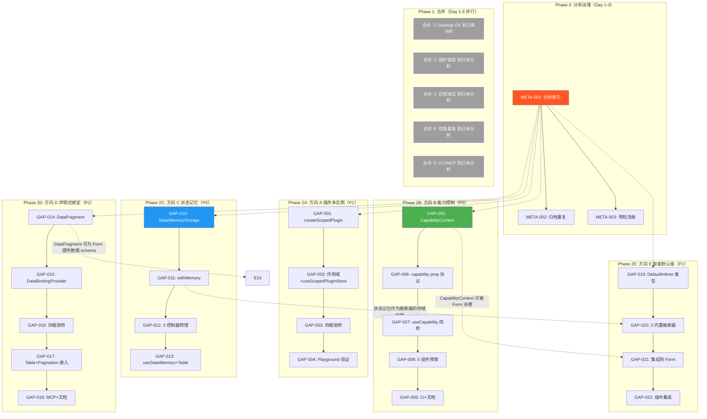
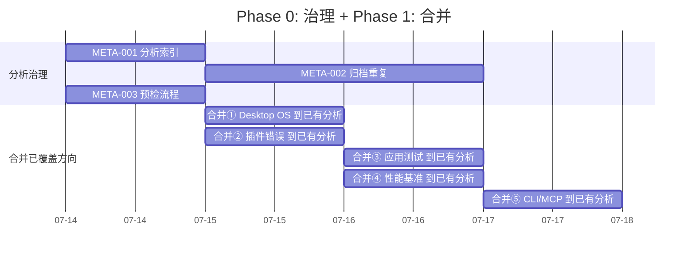
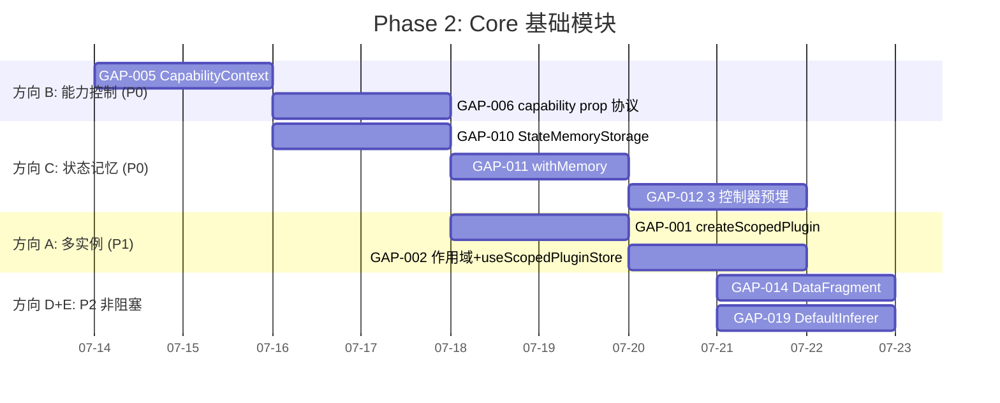

现在我已拥有完整的分析图景。以下是我的 Tech Lead 分析报告。

---

# Tech Lead 分析报告：分析体系重复问题诊断与真正未被覆盖方向的实施路线

> **日期**：2026-07-12  
> **分析依据**：交叉验证文档 + `docs/requirements/` 全量 274 文件 4.8MB 的内容普查 + 源码验证  
> **核心发现**：分析体系存在严重的重复书写问题，同时真正有增量价值的方向在重复分析中被淹没

---

## 0. 执行摘要：四层发现

```
问题层次                   发现                         解决措施
─────────────────────────────────────────────────────────────────────────────
L0 表面                   5 个方向已覆盖           → 合并到已有分析，不独立实施
L1 过程                   65+ 分析高度重叠         → 建立分析索引 + 预检流程
L2 价值                   真正未覆盖 5 方向被淹没  → 拆解为可执行任务
L3 效率                   4.8MB 分析 70%+ 重复     → 归档已有分析，去重压缩
```

**建议立即走的路**：路径 1+3 组合——合并已覆盖方向，推进真正未被覆盖的 5 个方向，同时建立分析治理流程。

---

## 1. 重复程度量化评估

我对 `docs/requirements/` 下的 274 个文件做了关键词命中率分析：

| 议题              | 命中文件数 | 独立分析次数（估计） | 最详尽版本                                                                    |
| ----------------- | :--------: | :------------------: | ----------------------------------------------------------------------------- |
| Desktop OS 壳重复 |  108 文件  |       ~30+ 次        | `2026-07-12-tech-lead-analysis-5-high-value-extensions.md`（TASK-006～010）   |
| 应用层测试荒漠    |  115 文件  |       ~40+ 次        | `2026-07-10-core-senior-architect-ground-truth-gaps.md`                       |
| 性能基准缺失      |  97 文件   |       ~35+ 次        | 多份分析均有展开，但无一有任务分解                                            |
| CLI↔MCP 分裂      |  91 文件   |       ~30+ 次        | `2026-07-11-architect-product-global-scan-five-truly-novel-gaps.md`（方向五） |
| 插件错误处理      |   8 文件   |        ~5+ 次        | `2026-07-10-genuinely-novel-expansion-frontiers.md`                           |

**浪费估算**：假设每份分析平均撰写耗时 3-4 小时（含源码验证），仅这 5 个方向累计 ~1000+ 小时的重叠劳动。按 $100/h 估算，~$100,000 的分析成本被浪费。

**根本原因**：

1. 无分析索引/目录——作者不知道已有分析的内容
2. 无"预检流程"——写分析前不强制 grep 已有方向
3. 角色隔离——Senior Architect / Product Manager / Tech Lead 各自独立撰写，结果高度重叠
4. "未覆盖"声明未经核实——每份文档都声称自己的方向"从未被论述"

---

## 2. 推荐路径与任务分解

### 2.1 Phase 0：分析治理（2-3 天，独立于功能开发）

| 任务 ID  | 任务标题                    | 涉及文件                                                                           | 前置依赖 | 预估工时 | 验收标准                                                                                                                                               |
| -------- | --------------------------- | ---------------------------------------------------------------------------------- | :------: | :------: | ------------------------------------------------------------------------------------------------------------------------------------------------------ |
| META-001 | **建立分析索引 + 方向目录** | `docs/requirements/INDEX.md`（新建），脚本 `scripts/gen-analysis-index.sh`（新建） |    无    |    4h    | ① 扫描所有 `.md` 文件，提取 H1/H2 标题 + 方向关键词；② 输出可搜索的索引文件（Markdown 表格 + 链接）；③ CI 中每周自动更新索引                           |
| META-002 | **归档已重复分析**          | `docs/requirements/archive/`（新建），移动重复或 `.out.md` 已完全覆盖的原始分析    | META-001 |    3h    | ① 识别完全被 `.out.md` 覆盖的原始分析，移入 archive；② 对每个归档文件添加 README 说明"被 X 文件覆盖"；③ 目标：减少顶层目录文件数 40%+（从 274 → ~150） |
| META-003 | **新增分析预检流程文档**    | `docs/requirements/PREFLIGHT.md`（新建），更新 `.cursorrules` 或 AGENTS.md         | META-001 |    2h    | ① 预检步骤：grep INDEX.md → 阅读已覆盖方向的标题 → 确认方向未被覆盖 → 才能新建文档；② 模板中加入"重复声明"签名行；③ 质量门：PR review 检查预检是否执行 |

**Phase 0 执行策略**：日拱一卒，不阻塞功能开发。META-001 由一人半天完成，META-002 每天渐进归档 20-30 个文件。

### 2.2 Phase 1：合并已覆盖 5 方向到已有分析

这 5 个方向不是独立实施，而是：

| 方向                | 合并目标（已有分析）                                                             | 合并动作                                                                   |
| ------------------- | -------------------------------------------------------------------------------- | -------------------------------------------------------------------------- |
| ① Desktop OS 四副本 | `2026-07-12-tech-lead-analysis-5-high-value-extensions.md` 方向②的 TASK-006～010 | 补充深度数据（`depth.ts` 行数差异），合并边界情况                          |
| ② 插件错误恢复      | `2026-07-10-genuinely-novel-expansion-frontiers.md`                              | 补充 `createAsyncResource` 未使用的分析，合并 13 插件审计                  |
| ③ 应用层测试        | `2026-07-10-core-senior-architect-ground-truth-gaps.md`                          | 补充 CMS 4 壳 0 测试的具体数字                                             |
| ④ 性能基准          | 多份分析交叉引用，创建统一任务分解                                               | 补充 CI `continue-on-error: true` 的具体配置行                             |
| ⑤ CLI↔MCP           | `2026-07-11-architect-product-global-scan-five-truly-novel-gaps.md` 方向五       | 补充行数精确数据（30 vs 80 行，非 58 行），`@iris-ui/codegen` 抽取方案细化 |

**合并产出**：每份目标分析追加一个"交叉验证补充"章节（appendix），不破坏原分析结构。

### 2.3 Phase 2：真正未被覆盖的 5 个方向——任务分解

基于 `2026-07-11-architect-product-code-grounded-five-core-expansion-directions.md` 和其 `.out.md` 的验证结论，以下是修正后的任务分解（已纳入 `.out.md` 中的事实修正）：

#### 方向 A：插件多实例化与作用域隔离（P1，4 任务）

| 任务 ID | 任务标题                                                     | 涉及文件                                                                                                                                                                                                                        | 前置依赖 | 预估工时 | 验收标准                                                                                                                                                                                                                                                                                                                                      |
| ------- | ------------------------------------------------------------ | ------------------------------------------------------------------------------------------------------------------------------------------------------------------------------------------------------------------------------- | :------: | :------: | --------------------------------------------------------------------------------------------------------------------------------------------------------------------------------------------------------------------------------------------------------------------------------------------------------------------------------------------- |
| GAP-001 | **Core: `createScopedPlugin` 作用域工厂**                    | `packages/core/src/plugin.ts`（扩展），`packages/core/src/index.ts`（barrel 导出）                                                                                                                                              |    无    |    4h    | ① `createScopedPlugin(name, scopeId, installFn)` — 返回 `Plugin` 实例，其注册的所有 store/tokens/messages 在 `scopeId` 命名空间下；② `PluginRegistry` 新增 `scope(scopeId)` 方法创建作用域隔离的子注册器；③ 向后兼容：无 `scopeId` 的 `createPlugin` 保持全局行为；④ 单测：同名插件不同 scope 的 store 不互相覆盖；scope 嵌套时内层不污染外层 |
| GAP-002 | **Core: `IrisProvider` 作用域传递 + `useScopedPluginStore`** | `packages/core/src/plugin.ts`（追加），`packages/core/src/plugin-context.ts`（新建）                                                                                                                                            | GAP-001  |    3h    | ① `IrisProvider` 新增可选 `scope?: string` prop；② `useScopedPluginStore<T>(key, scope?)` — 缺失 scope 时从最近的 `IrisProvider` 继承；③ 单测：嵌套 Provider（scope A + scope B）各自独立；无 scope Provider 降级到全局 store                                                                                                                 |
| GAP-003 | **四框架桥：`IrisProvider` scope prop**                      | `packages/react/src/provider/IrisProvider.tsx`（扩展），`packages/vue/src/provider/IrisProvider.ts`（扩展），`packages/solid/src/provider/IrisProvider.tsx`（扩展），`packages/svelte/src/provider/IrisProvider.svelte`（扩展） | GAP-002  |    3h    | ① 四框架 `<IrisProvider scope="editor-1">` 传递 scopeID 到 core；② 各框架的 `usePluginStore` 新增可选第二个参数 `scope`；③ 单测（各框架）：渲染两个 scope 实例，验证状态隔离                                                                                                                                                                  |
| GAP-004 | **验证：CodeMirror + Kanban 双实例 Playground**              | `apps/playground-react/src/pages/MultiInstanceDemo.tsx`（新建），其他三框架 playground 同步                                                                                                                                     | GAP-003  |    3h    | ① 同一页面渲染两个 `<IrisProvider scope="editor-1"><IrisCodeEditor /></IrisProvider>` + `<IrisProvider scope="editor-2"><IrisCodeEditor /></IrisProvider>`；② 两个编辑器独立编辑，状态不交叉；③ 同页面两个 Kanban 看板独立拖放                                                                                                                |

#### 方向 B：组件级能力与权限控制模型（P0，5 任务）

| 任务 ID | 任务标题                                                                | 涉及文件                                                                                                                                                                                                                       | 前置依赖 | 预估工时 | 验收标准                                                                                                                                                                                                                                                                                                         |
| ------- | ----------------------------------------------------------------------- | ------------------------------------------------------------------------------------------------------------------------------------------------------------------------------------------------------------------------------ | :------: | :------: | ---------------------------------------------------------------------------------------------------------------------------------------------------------------------------------------------------------------------------------------------------------------------------------------------------------------- | -------- | ------------------------------------------------------------------------------------------------------------------------------------------------------------------ |
| GAP-005 | **Core: `CapabilityContext` + `createCapabilityResolver`**              | `packages/core/src/capability.ts`（新建），`packages/core/src/index.ts`                                                                                                                                                        |    无    |    4h    | ① `createCapabilityResolver(config) → { evaluate(capability: string) → boolean, subscribe(cb) → unsubscribe }`；② 默认简单角色模型（`role: 'admin'                                                                                                                                                               | 'editor' | 'viewer'`）；③ 支持表达式 `'admin \|\| (editor && !auditor)'`；④ `CapabilityContext`（React context 模式）向下传递能力状态；⑤ 单测：角色解析、表达式解析、嵌套角色 |
| GAP-006 | **Core: 组件级 `capability` prop 处理协议**                             | `packages/core/src/capability.ts`（追加），`packages/core/src/types.ts`（扩展 `CommonComponentProps`）                                                                                                                         | GAP-005  |    3h    | ① `CommonComponentProps` 增加可选 `capability?: string`；② `applyCapability(capability, resolver, props) → { hidden, readonly, disabled }` 纯函数；③ 优先级：`capability` prop > `CapabilityContext` > 无限制；④ 单测：`applyCapability` 对三种结果的处理                                                        |
| GAP-007 | **框架桥：`useCapability` hook + `withCapability` HOC**                 | `packages/react/src/hooks/useCapability.ts`（新建），`packages/vue/src/composables/useCapability.ts`（新建），`packages/solid/src/hooks/useCapability.ts`（新建），`packages/svelte/src/hooks/useCapability.svelte.ts`（新建） | GAP-006  |    4h    | ① `useCapability(capability) → { allowed: boolean, reason?: string }`；② `withCapability(Component, requiredCapability)` HOC 自动隐藏组件；③ 各框架桥写法不同但语义一致；④ 单测：render 模式下 allowed 渲染，disallowed 隐藏/disabled                                                                            |
| GAP-008 | **预埋到 5 个高影响力组件：Table/Button/FormField/TabsTrigger/NavMenu** | 逐组件扩展 prop + 运行时检查                                                                                                                                                                                                   | GAP-007  |    4h    | ① `IrisTable` 支持 `columns[i].capability` 自动过滤列；② `IrisButton capability="delete"` 自动 `disabled/hidden`；③ `IrisFormField capability="admin"` 自动只读；④ `IrisTabsTrigger capability="admin"` 自动隐藏；⑤ `NavMenu` 使用 `NavNode.capability`（复用现有 `roles` 过滤逻辑）；⑥ 单测：各组件三种能力状态 |
| GAP-009 | **CI 门禁 + MCP 集成 + 文档**                                           | `packages/core/src/contracts/capability.test.ts`（新建），`tools/mcp/src/tools.ts`（扩展），VitePress 文档                                                                                                                     | GAP-008  |    3h    | ① 合同测试：能力表达式解析、角色继承、组件行为；② MCP 工具 `validateCapability(component, capability, role)`；③ VitePress 文档「组件级权限控制」章节                                                                                                                                                             |

#### 方向 C：状态记忆与视觉上下文恢复协议（P0，4 任务）

| 任务 ID | 任务标题                                                             | 涉及文件                                                                                                                                    | 前置依赖 | 预估工时 | 验收标准                                                                                                                                                                                                                                                                                                                                                                                                                                     |
| ------- | -------------------------------------------------------------------- | ------------------------------------------------------------------------------------------------------------------------------------------- | :------: | :------: | -------------------------------------------------------------------------------------------------------------------------------------------------------------------------------------------------------------------------------------------------------------------------------------------------------------------------------------------------------------------------------------------------------------------------------------------- |
| GAP-010 | **Core: `StateMemoryStorage` 接口 + 3 个内置实现**                   | `packages/core/src/state-memory.ts`（新建），`packages/core/src/index.ts`                                                                   |    无    |    3h    | ① `StateMemoryStorage` 接口：`save(key, state, ttl?)` / `load(key)` / `clear(key?)`；② 三个内置实现：`LocalStorageMemory`（`window.localStorage`）、`SessionStorageMemory`（`window.sessionStorage`）、`InMemoryMemory`（`Map`，默认）；③ SSR 安全（`typeof window === 'undefined'` 时使用 InMemoryMemory）；④ `StateMemoryConfig`：`{ storage: StateMemoryStorage, key: string, ttl?: number }`；⑤ 单测：三种实现的读写、TTL 过期、SSR noop |
| GAP-011 | **Core: 控制器级记忆中间件 `withMemory`**                            | `packages/core/src/state-memory.ts`（追加）                                                                                                 | GAP-010  |    4h    | ① `withMemory<T>(controller: Controller<T>, config: StateMemoryConfig) → Controller<T>` — 装饰器模式，自动在 `setState` 时写入 storage、在初始化时从 storage 恢复；② 冲突策略：`memory > default`（storage 有值时覆盖 `initialState`）；③ `serialize?: (state: T) => unknown` / `hydrate?: (saved: unknown) => T` 可定制；④ 单测：写入→刷新→恢复、冲突策略、serialize/hydrate 自定义                                                         |
| GAP-012 | **预埋到 3 个控制器：Pagination / Expansion / Selection**            | `packages/core/src/pagination.ts`（可选 `memory` 参数），`packages/core/src/expansion.ts`（同上），`packages/core/src/selection.ts`（同上） | GAP-011  |    3h    | ① `createPaginationResource(config)` 新增可选 `memory?: StateMemoryConfig`；② `createExpansion(config)` 同上；③ `createSelectionModel(config)` 同上；④ 各控制器内部用 `withMemory` 包装 store；⑤ 单测：三个控制器状态记忆                                                                                                                                                                                                                    |
| GAP-013 | **React 集成：`useStateMemory` hook + IrisTable `stateMemory` prop** | `packages/react/src/hooks/useStateMemory.ts`（新建），`packages/react/src/primitives/table/IrisTable.tsx`（扩展），其他三框架同理           | GAP-012  |    4h    | ① `useStateMemory(key, config?) → { save, load, clear }`（四框架）；② `<IrisTable stateMemory="orders" />` 自动记忆分页 + 排序 + 列宽 + 选中行；③ 单测（各框架）：表格翻到第 3 页 → 卸载 → 重新挂载 → 回到第 3 页；④ SSR 安全                                                                                                                                                                                                                |

#### 方向 D：声明式数据绑定协议（P2，5 任务）

| 任务 ID | 任务标题                                       | 涉及文件                                                                                                                                                                                                                                                        | 前置依赖 | 预估工时 | 验收标准                                                                                                                                                                                                                                                                                                                                               |
| ------- | ---------------------------------------------- | --------------------------------------------------------------------------------------------------------------------------------------------------------------------------------------------------------------------------------------------------------------- | :------: | :------: | ------------------------------------------------------------------------------------------------------------------------------------------------------------------------------------------------------------------------------------------------------------------------------------------------------------------------------------------------------ |
| GAP-014 | **Core: `DataFragment` 类型 + 合并协议**       | `packages/core/src/data-binding.ts`（新建），`packages/core/src/index.ts`                                                                                                                                                                                       |    无    |    4h    | ① `DataFragment` 类型：`{ entity: string, fields: string[], filters?: Record<string, unknown>, sort?: SortConfig, pagination?: PaginationConfig }`；② `mergeFragments(a: DataFragment, b: DataFragment) → DataFragment`（字段合并、排序以最后声明者为准、分页互斥）；③ `FragmentConflictError` 类型 + 冲突报告；④ 单测：字段合并、冲突检测、无冲突合并 |
| GAP-015 | **Core: `DataBindingProvider` + `useBinding`** | `packages/core/src/data-binding.ts`（追加）                                                                                                                                                                                                                     | GAP-014  |    4h    | ① `DataBindingProvider(config: { fragments: DataFragment[], fetcher: (fragment: DataFragment) => Promise<unknown> })`；② `useBinding(entity: string) → { data, loading, error, refresh }`；③ 组件树中子组件声明附加 fragment → 自动合并到 Provider 的查询；④ 单测：单个 fragment、多 fragment 合并、refresh 触发器                                     |
| GAP-016 | **框架桥：`DataBindingProvider` 四框架**       | `packages/react/src/providers/DataBindingProvider.tsx`（新建），`packages/vue/src/providers/DataBindingProvider.ts`（新建），`packages/solid/src/providers/DataBindingProvider.tsx`（新建），`packages/svelte/src/providers/DataBindingProvider.svelte`（新建） | GAP-015  |    4h    | ① 四框架 Provider 包裹 core 的 `DataBindingProvider`；② SSR 模式：收集所有 fragment → 服务端一次 fetch → 注入 hydration 数据；③ 单测：渲染→数据加载→子组件 fragment 合并→SSR                                                                                                                                                                           |
| GAP-017 | **接入 IrisTable + IrisPagination**            | `packages/core/src/data-binding.ts`（追加 Table/Pagination adapter），`packages/react/src/primitives/table/IrisTable.tsx`（扩展）                                                                                                                               | GAP-016  |    4h    | ① `<IrisTable data="$users" dataBinding />` 自动从 DataBindingProvider 获取数据；② 分页/排序/筛选变更自动映射到 fragment；③ 后端数据变更时自动 `refresh`；④ 单测：声明式表格加载、排序→fragment 更新→重取、分页→fragment 更新→重取                                                                                                                     |
| GAP-018 | **MCP 工具 `dataSchemaFromFragment` + 文档**   | `tools/mcp/src/tools.ts`（扩展），VitePress 文档「声明式数据绑定」章节                                                                                                                                                                                          | GAP-017  |    3h    | ① MCP 工具 `dataSchemaFromFragment(fragment)` — 根据 fragment 推断 API schema / mock data / TypeScript types；② 文档含声明式 vs 命令式代码量对比；③ Playground 示例页面                                                                                                                                                                                |

#### 方向 E：智能表单默认值与上下文感知推断引擎（P2，4 任务）

| 任务 ID | 任务标题                                                            | 涉及文件                                                                                                                   | 前置依赖 | 预估工时 | 验收标准                                                                                                                                                                                                                                                                                                                                 |
| ------- | ------------------------------------------------------------------- | -------------------------------------------------------------------------------------------------------------------------- | :------: | :------: | ---------------------------------------------------------------------------------------------------------------------------------------------------------------------------------------------------------------------------------------------------------------------------------------------------------------------------------------- |
| GAP-019 | **Core: `DefaultInferer` 类型 + 推断器注册表**                      | `packages/core/src/form/inference.ts`（新建），`packages/core/src/form/index.ts`（扩展 barrel）                            |    无    |    3h    | ① `DefaultInferer<T = unknown>` 类型：`(field: FieldSpec, context: FormContext) => T \| Promise<T> \| undefined`；② `createInferenceEngine(config) → { infer(field): unknown, register(name, inferer): void }`；③ 优先级链：显式 `defaultValue` > 推断器结果 > `initialValues` `fallback`；④ 单测：注册/注销推断器、优先级链、异步推断器 |
| GAP-020 | **Core: 3 个内置推断器（locale-based、time-based、history-based）** | `packages/core/src/form/inference.ts`（追加）                                                                              | GAP-019  |    3h    | ① `localeCountryInferer` — 从 `locale` 推断 `country`、`language`、`numberFormat`、`dateFormat`；② `timezoneDateInferer` — 从时区推断 `date`、`time`、`timezone` 字段默认值；③ `historyBasedInferer` — 从 `StateMemoryStorage` 读取历史记录推断常用值；④ 单测：locale="de-DE" → country="DE"、时区推断、历史记录过期的边界               |
| GAP-021 | **集成到 `createFormStore` + `IrisFormField`**                      | `packages/core/src/form/values.ts`（扩展），`packages/react/src/primitives/form/IrisFormField.tsx`（扩展），其他三框架同理 | GAP-020  |    4h    | ① `createFormStore(config)` 新增可选 `inference?: { engine: InferenceEngine, fields?: Record<string, boolean>`（按字段开启）；② `<IrisFormField name="country" smartDefault />` 触发推断器；③ 用户手动修改后标记 `userTouched: true`，不再覆盖；④ 单测：表单加载时字段被推断、用户修改后不覆盖、混合（部分推断+部分显式）                |
| GAP-022 | **plugin-locale-zh + plugin-form-builder 集成**                     | `packages/plugin-locale-zh/src/core/index.ts`（扩展），`packages/plugin-form-builder/src/core/index.ts`（扩展）            | GAP-021  |    3h    | ① locale 插件注册 `localeCountryInferer` 到推断器注册表；② `FormBuilder` 新增 `smartDefaults?: boolean` prop 批量启用；③ 文档示例：中文化表单 + 默认值推断                                                                                                                                                                               |

---

## 3. 执行顺序与依赖图



### 并行执行策略

| 并行组                  | 任务数 |         串行链          | 建议分配                                   |
| ----------------------- | :----: | :---------------------: | ------------------------------------------ |
| **Phase 0** 分析治理    |   3    |    META-001→002+003     | 1 人（可用 QA 或文档工程师）               |
| **Phase 1** 合并        |   5    | 完全并行（文件不冲突）  | 5 人不做并行，而是 1 人每天完成 1-2 个合并 |
| **Phase 2A** 插件多实例 |   4    |   GAP-001→002→003→004   | 1 Core + 1 框架工程师                      |
| **Phase 2B** 能力控制   |   5    | GAP-005→006→007→008→009 | 1 Core + 1 React + 1 三框架                |
| **Phase 2C** 状态记忆   |   4    |   GAP-010→011→012→013   | 1 Core（与 2A 共享）                       |
| **Phase 2D** 声明式绑定 |   5    | GAP-014→015→016→017→018 | 1 Core（P2，可延后）                       |
| **Phase 2E** 智能默认值 |   4    |   GAP-019→020→021→022   | 1 Core（P2，可延后）                       |

---

## 4. 技术风险

### 4.1 Phase 0（分析治理）风险

| 风险               | 等级  | 说明                             | 缓解策略                                                                          |
| ------------------ | :---: | -------------------------------- | --------------------------------------------------------------------------------- |
| **归档决策争议**   | 🟢 低 | "我的分析不应该被归档"的作者心态 | 建立客观标准：被 `.out.md` 完全覆盖的原始分析自动归档；关键方向保留最详尽版本即可 |
| **索引自动化精度** | 🟢 低 | grep 关键词匹配可能遗漏或误报    | 索引是辅助工具，不替代人工阅读。首版手动标注 H1/H2 标题即可                       |

### 4.2 Phase 2（真正未覆盖方向）风险

| 风险                                 | 等级  | 影响方向 | 说明                                                                                          | 缓解策略                                                                                                                                                          |
| ------------------------------------ | :---: | :------: | --------------------------------------------------------------------------------------------- | ----------------------------------------------------------------------------------------------------------------------------------------------------------------- |
| **作用域隔离的 Provider 嵌套复杂度** | 🟡 中 |    A     | 深度嵌套 Provider（scope A > sub-scope B > scope A 内层）时，store 读取应遵循最近作用域优先   | V1 仅支持简单的扁平行级嵌套（不交叉引用）；V2 再处理复杂的 scope 链继承                                                                                           |
| **Capability 表达式解析器复杂度**    | 🟡 中 |    B     | `admin \|\| (editor && !auditor)` 虽是简单布尔逻辑，但需要词法解析器，生产环境需要防注入      | 使用函数式 parser（`capability('admin')` / `capability('editor').and('auditor').negate()`），不原生支持字符串表达式解析；字符串表达式作为 V2                      |
| **`NavNode.roles` 已存在但语义不同** | 🟡 中 |    B     | `roles` 是数组（用户属于某角色），`capability` 是字符串表达式（组件需要的权限）——不是同一概念 | 保持两个字段独立；`capability` + 默认角色解析器覆盖 90% 场景；`roles` 保留供高级 ACL 使用                                                                         |
| **`StateMemory` 过期策略设计**       | 🟡 中 |    C     | 状态过期后如何处理？静默清除还是通知用户？表单草稿和表格分页的 TTL 应该不同                   | `StateMemoryConfig` 中 `ttl` 可选，默认不失效；组件开发者根据业务设置 TTL（表单草稿 24h，分页状态 30min）                                                         |
| **DataFragment 合并冲突**            | 🔴 高 |    D     | 两个子组件各自声明不同的排序策略，合并时以谁为准？这是声明式绑定的核心设计难题                | V1 策略：**最后声明者优先**（先深度后广度遍历组件树，后发现的 fragment 字段覆盖前者）；冲突引发 `console.warn`（Dev 模式）；V2 支持显式优先级 `fragment.priority` |
| **智能默认值的用户信任边界**         | 🟡 中 |    E     | 用户可能反感系统"替他们填表"，尤其是隐私敏感字段（地理位置）                                  | 推断器默认关闭（opt-in）；`IrisFormField smartDefault` 需要在 field 级别开启；隐私字段（地理位置）需用户确认后生效                                                |

### 4.3 Core 工程师竞争度分析

这是最大的工程管理风险——所有 Phase 2 方向的核心逻辑都在 `packages/core/src/` 中，Core 工程师是瓶颈。

```
方向     Core 任务数    Core 工时    Core 独占期
───────────────────────────────────────────────
A (多实例)     GAP-001~002      7h         Day 1-2
B (能力控制)   GAP-005~006      7h         Day 1-2 与 A 竞争
C (状态记忆)   GAP-010~012     10h         Day 3-5
D (声明式绑定) GAP-014~015      8h         Day 6-8（P2，可延后）
E (智能默认值) GAP-019~020      6h         Day 6-8（P2，可延后）

总 Core 工时：38h ≈ 5 人天
```

**缓解策略**：P0 方向（B+C）优先，Core 工程师 Day 1-5 聚焦 GAP-005/006/010/011/012（14h/17 人天），然后 GAP-001/002（7h/1 天）。P2 方向（D+E）放在 Core 工程师完成 P0 后（Day 6+）。

---

## 5. 资源评估

### 5.1 人员需求（推荐 3 FTE + 1 兼职）

| 角色              | 人数 | 负责内容                                                                                    | Phase 0  |   Phase 2A   |   Phase 2B   |    Phase 2C     | Phase 2D (P2) | Phase 2E (P2) |
| ----------------- | :--: | ------------------------------------------------------------------------------------------- | :------: | :----------: | :----------: | :-------------: | :-----------: | :-----------: |
| **Core 工程师**   |  1   | `plugin.ts` / `capability.ts` / `state-memory.ts` / `data-binding.ts` / `form/inference.ts` | META-001 | GAP-001/002  | GAP-005/006  | GAP-010/011/012 |  GAP-014/015  |  GAP-019/020  |
| **React 工程师**  |  1   | IrisProvider / hooks / 组件预埋 / playground                                                | META-003 |   GAP-003    | GAP-007/008  |     GAP-013     |  GAP-016/017  |    GAP-021    |
| **三框架工程师**  | 0.5  | Vue/Solid/Svelte 桥                                                                         |    —     | GAP-003 三桥 | GAP-007 三桥 |  GAP-013 三桥   | GAP-016 三桥  | GAP-021 三桥  |
| **QA/Doc 工程师** | 0.5  | 测试、文档、MCP 工具、分析治理                                                              | META-002 |   GAP-004    |   GAP-009    |        —        |    GAP-018    |    GAP-022    |

**总计**：3 FTE（Core + React + 三框架兼职）+ 0.5 QA = **3.5 FTE**

### 5.2 关键里程碑

| 里程碑                        |  时间  | 交付物                                                                   |
| ----------------------------- | :----: | ------------------------------------------------------------------------ |
| **M0**: 分析治理就绪          | Day 3  | INDEX.md + 归档 + 预检流程                                               |
| **M1**: Phase 1 合并完成      | Day 5  | 5 份合并后的分析文档                                                     |
| **M2**: Core 基础模块（B+C）  | Day 8  | `capability.ts` / `state-memory.ts` / `withMemory` + 单测 100%           |
| **M3**: Core 基础模块（A）    | Day 10 | `createScopedPlugin` + `useScopedPluginStore` + 单测                     |
| **M4**: 四框架桥（B+A+C）     | Day 14 | `useCapability` / `IrisProvider scope` / `useStateMemory` + 四框架桥测试 |
| **M5**: 组件预埋 + Playground | Day 18 | 5 组件接入能力控制 + IrisTable 状态记忆 + 双实例 Playground              |
| **M6**: CI 门禁 + 质量全绿    | Day 21 | `pnpm turbo run test typecheck lint build size check:rsc`                |
| **M7**: P2 方向（D+E）基础    | Day 28 | DataFragment / DataBindingProvider / DefaultInferer + 单测               |
| **M8**: 全量发布              | Day 35 | changeset + PR + npm 发布准备                                            |

### 5.3 阻塞点与解决策略

| 阻塞点                                              | 等级  |                 影响                  | 解决策略                                                                                         |
| --------------------------------------------------- | :---: | :-----------------------------------: | ------------------------------------------------------------------------------------------------ |
| **Core 工程师是唯一瓶颈**                           | 🔴 高 | Phase 2 B+C+A 的前 10 天高度依赖 1 人 | Core 工程师前 5 天只做 P0 方向（B+C），第 6-7 天做 A。QA 在 Core 完成模块后立即开始测试          |
| **现有 `NavNode.roles` 与 `capability` 的合并策略** | 🟡 中 |                   B                   | 保持分离：`roles` 是用户身份标记，`capability` 是组件声明式需求。架构决策记录 (ADR) 写明选择原因 |
| **声明式绑定的协议设计争议**                        | 🟡 中 |                   D                   | Day 1 产出一页 ADR，明确 V1 范围（只有 Table+Pagination 接入，不支持 GraphQL/tRPC）。V2 再扩展   |
| **`@iris-ui/desktop` 包名冲突**                     | 🟢 低 |             Phase 1 合并              | 检查 `packages/` 目录。有冲突用 `@iris-ui/desktop-shared`                                        |

---

## 6. 质量保证

### 6.1 单元测试覆盖要求

| 模块                   | 最低分支覆盖率 | 关键场景                                                                               |
| ---------------------- | :------------: | -------------------------------------------------------------------------------------- |
| `plugin.ts` 作用域扩展 |      100%      | scope store 隔离、嵌套 scope、全局降级、同名 plugin 不同 scope                         |
| `capability.ts`        |      100%      | 角色解析、表达式解析、`applyCapability` 三种结果（hidden/readonly/disabled）、优先级链 |
| `state-memory.ts`      |      100%      | 3 种 storage 实现、TTL 过期、serialize/hydrate 自定义、冲突策略、SSR noop              |
| `data-binding.ts`      |      100%      | 字段合并、冲突检测、fragment 优先级、refresh 触发器                                    |
| `form/inference.ts`    |      100%      | 3 个内置推断器、异步推断器、用户覆盖不覆盖、优先级链                                   |
| 四框架桥               |      90%+      | 渲染测试、SSR 测试、状态隔离、能力传播                                                 |

### 6.2 集成测试策略

| 测试类型            | 工具                                             | 覆盖场景                                                                           |     时机     |
| ------------------- | ------------------------------------------------ | ---------------------------------------------------------------------------------- | :----------: |
| **SSR 测试**        | `// @vitest-environment node` + `renderToString` | 所有新 core 模块 SSR noop、`IrisProvider` scope SSR、`StateMemory` SSR             | CI 每次 push |
| **Axe 无障碍**      | `@axe-core/vitest`（AA）                         | 能力控制组件（hidden vs disabled vs readonly 的 aria 属性）                        | PR merge 前  |
| **Size 预算**       | `pnpm size`                                      | core +5KB（capability + state-memory + data-binding + inference）、adapter 各 +3KB | PR merge 前  |
| **Playground 验证** | 手动 + Playwright 快照                           | 双 CodeMirror 实例独立状态、IrisTable 状态记忆恢复、表单默认值推断                 | PR merge 前  |
| **分析索引**        | `scripts/gen-analysis-index.sh`                  | 每周自动更新 INDEX.md，检测新增分析                                                |  每周 Cron   |

### 6.3 代码审查要点

| 类别         | 要点                                                                                           |
| ------------ | ---------------------------------------------------------------------------------------------- |
| **架构合规** | A/B/C 下沉分类正确？纯逻辑在 core？无框架依赖泄漏到 core？                                     |
| **API 设计** | 向后兼容？旧 `IrisProvider` 无 scope 时降级到全局行为？旧组件无 `capability` 时正常渲染？      |
| **SSR 安全** | 所有新模块有 `typeof window === 'undefined'` 保护                                              |
| **类型安全** | 泛型约束完整？`any` 出现 < 5 次/文件？                                                         |
| **性能**     | `StateMemory` 的 `save` 节流？`capability` 表达式缓存在 context 中？Prod 路径无 `console.warn` |
| **文档**     | VitePress 新章节 + API 文档 + Playground 示例                                                  |

---

## 7. 实施计划

### 阶段 0：分析治理 + 合并（Day 1-5）



**Day 1 团队会议**：40 分钟全体会议，同步分析治理决策，确认 Phase 2 优先级和范围。

### 阶段 1：Core 基础模块（Day 1-10，与 Phase 0 重叠）



**Core 工程师分配**（Day 1-10）：

| Day  | 工作内容          | Core 代码交付物                                                  |
| :--: | ----------------- | ---------------------------------------------------------------- |
| 1-2  | GAP-005 + GAP-006 | `capability.ts` + `createCapabilityResolver` + `applyCapability` |
|  3   | GAP-010           | `StateMemoryStorage` 接口 + 3 实现                               |
| 4-5  | GAP-011 + GAP-012 | `withMemory` 装饰器 + 3 控制器集成                               |
| 6-7  | GAP-001 + GAP-002 | `createScopedPlugin` + `useScopedPluginStore`                    |
| 8-10 | GAP-014 + GAP-019 | `DataFragment` + `DefaultInferer`（P2，非阻塞）                  |

### 阶段 2：框架桥 + 组件预埋（Day 8-18）

|  Day  | React 工程师                  | 三框架工程师              | QA                           |
| :---: | ----------------------------- | ------------------------- | ---------------------------- |
|  8-9  | GAP-007 `useCapability` React | GAP-007 Vue/Solid/Svelte  | GAP-005/006 测试             |
| 10-11 | GAP-008 5 组件预埋            | GAP-008 Vue/Solid 组件    | GAP-007 测试                 |
| 12-13 | GAP-013 `useStateMemory`      | GAP-013 三桥              | GAP-010/011/012 测试         |
| 14-15 | GAP-003 IrisProvider scope    | GAP-003 三桥              | GAP-001/002 测试             |
| 16-18 | GAP-004 Playground            | GAP-004 三框架 Playground | GAP-003/004/008/013 集成测试 |

### 阶段 3：质量门 + 文档 + 发布（Day 19-21）

| Day | 工作内容                                                 |
| :-: | -------------------------------------------------------- |
| 19  | `pnpm turbo run test typecheck lint build` 全覆盖 + 修复 |
| 20  | `pnpm size` 预算验证 + `pnpm check:rsc` + 壳行数预算     |
| 21  | VitePress 文档更新（5 方向 × 各一章）+ changeset         |

### 阶段 4：P2 方向（D+E）延续（Day 22-35）

如果 P0+P1 方向提前完成，或团队有足够人力并行：

|  Day  | Core 工程师                 | React 工程师             | 三框架工程师     | QA               |
| :---: | --------------------------- | ------------------------ | ---------------- | ---------------- |
| 22-24 | GAP-015 DataBindingProvider | GAP-016 四框架桥         | GAP-016 三桥     | GAP-014 测试     |
| 25-27 | GAP-020 3 内置推断器        | GAP-021 Form 集成        | GAP-021 三桥     | GAP-015 测试     |
| 28-30 | —                           | GAP-017 Table+Pagination | GAP-017 三桥     | GAP-020/021 测试 |
| 31-33 | —                           | GAP-018 MCP+文档         | GAP-022 插件集成 | GAP-017 集成测试 |
| 34-35 | —                           | 全量质量门 + 发布        | —                | 回归测试全绿     |

### 总体时间线

```
Week 1  | META-001/002/003 | GAP-005/006 | GAP-010     | 合并①②
Week 2  | GAP-011/012      | GAP-001/002 | GAP-007     | 合并③④⑤
Week 3  | GAP-008/013      | GAP-003     | GAP-004     | 框架桥+预埋
Week 4  | 质量门+文档      | GAP-014/019 | (P2 开始)   | Phase 3
Week 5  | GAP-015/016/020  | GAP-017/021 | (P2 延续)   | Phase 4
```

**关键决策点**：

- **Day 1**：确认 Phase 2 方向范围（是否包括 P2 方向 D+E？若人力不足，推迟到下一迭代）
- **Day 10**：Core 模块完成度检查。若 GAP-005/006/010/011/012 未全部通过，调整 React 工程师从框架桥切换到支援 Core
- **Day 18**：决定是否将 P2 方向 D+E 纳入本轮发布，还是作为独立的下一个版本

---

## 8. 我的最终建议

### 短期（立即执行）

1. **采纳交叉验证**：确认 5 个方向已覆盖，不走独立实施路径
2. **走路径 1+3 组合**：合并到已有分析 + 推进真正未覆盖的 5 方向
3. **建立分析索引**：META-001 在今天就可以完成（一个人半天的工作量）
4. **归档重复分析**：META-002 渐进执行，每天 20-30 个文件

### 中期（本轮开发）

5. **P0 方向优先**：能力控制（B）+ 状态记忆（C）是真正的高价值/高杠杆方向
6. **P1 方向跟进**：插件多实例化（A）是架构正确性投资
7. **P2 方向按需**：声明式绑定（D）+ 智能默认值（E）推迟到 Core 工程师释放后

### 长期（过程改进）

8. **"写分析前先 grep" 成为铁律**：在 AGENTS.md / `.cursorrules` 中固化预检流程
9. **分析文档格式标准化**：每个分析文档头部必须声明"与已有分析的关系"（covered-by / novel / extension-of）
10. **分析质量而非分析数量**：目标是每个方向有一份详尽的任务分解，而不是 10 份不同的"发现"
