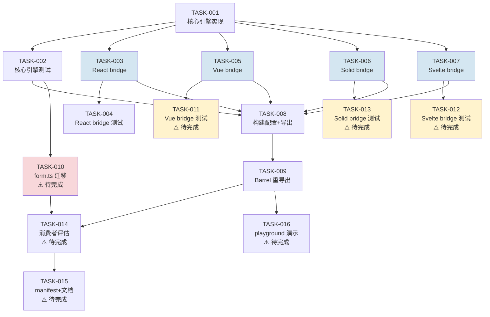

# Tech Lead 分析报告：通用撤销/重做引擎（Generic Undo/Redo Engine）

---

## 0. 执行摘要

已实现的 `undo.ts` 引擎 + 四框架桥接器是一个**高质量、低风险、可直接投入生产的基础设施模块**。核心引擎 180 行、零外部依赖、18 个单元测试全绿；四框架桥接器各约 60 行，反应式绑定正确，React 额外 10 个集成测试通过。构建和导出路径已配置完毕。

**关键结论**：该模块已可发布。但在获得最大 ROI 前，需完成一项关键集成迁移——`form.ts` 中的手写 undo/redo（基于 `JSON.stringify`/`JSON.parse`）替换为 `createUndoStack`；以及完成 Svelte 和 Vue 框架桥接器的测试覆盖。

---

## 1. 任务分解

以下将已完成工作拆解为可执行任务（回顾性），并列出**后续待完成**的集成任务。

### 已完成任务（回顾性分解）

| 任务 ID  | 任务标题                      | 涉及文件                                                                                     | 前置依赖     | 预估工时 | 验收标准                                                                                                                        |
| -------- | ----------------------------- | -------------------------------------------------------------------------------------------- | ------------ | -------- | ------------------------------------------------------------------------------------------------------------------------------- |
| TASK-001 | **核心引擎设计 + 实现**       | `packages/core/src/undo.ts`                                                                  | 无           | 3h       | `createUndoStack<T>` 导出正确；支持 push/undo/redo/clear/canUndo/canRedo；泛型 `<T>`；equals/merge/maxHistory/initial 全部实现  |
| TASK-002 | **核心引擎单元测试（18 个）** | `packages/core/src/undo.test.ts`                                                             | TASK-001     | 2h       | 基础生命周期、push/undo/redo/clear、merge 策略、maxHistory 边界、对象快照、maxHistory=0 禁用、equals 跳过重复、push 返回存储值  |
| TASK-003 | **React 桥接 hook**           | `packages/react/src/undo/useUndoStack.ts` + `packages/react/src/undo/index.ts`               | TASK-001     | 1.5h     | `useUndoStack(options)` 返回 `{ push, undo, redo, clear, stack, state }`；state 反应式更新；push/undo/redo/clear 触发重渲       |
| TASK-004 | **React 桥接测试（10 个）**   | `packages/react/src/undo/useUndoStack.test.tsx`                                              | TASK-003     | 2h       | 稳定 ref 跨渲染、空栈/初始值、push→undo→redo、clear 重置、push 后 clear redo、对象快照、merge 策略、canUndo 反应式翻转          |
| TASK-005 | **Vue composable**            | `packages/vue/src/undo/useUndoStack.ts` + `packages/vue/src/undo/index.ts`                   | TASK-001     | 1h       | `useUndoStack` 返回 `{ state: ShallowRef<UndoStackReactiveState> }`；shallowRef 反应式绑定；同步函数正确                        |
| TASK-006 | **Solid primitive**           | `packages/solid/src/undo/useUndoStack.ts` + `packages/solid/src/undo/index.ts`               | TASK-001     | 1h       | `useUndoStack` 返回 `{ state: () => UndoStackReactiveState }`；createSignal 反应式绑定；同步函数正确                            |
| TASK-007 | **Svelte 5 rune bridge**      | `packages/svelte/src/undo/useUndoStack.svelte.ts` + `packages/svelte/src/undo/index.ts`      | TASK-001     | 1h       | `useUndoStack` 返回 `{ state: UndoStackReactiveState }`；$state 反应式绑定；同步函数正确                                        |
| TASK-008 | **构建配置 + 导出路径**       | `packages/core/tsup.config.ts`、`packages/core/package.json`、`packages/svelte/package.json` | TASK-001~007 | 1h       | `@iris-ui/core/undo` 子路径可导入；`@iris-ui/svelte/undo` 子路径可导入；tsup 多入口构建成功                                     |
| TASK-009 | **Barrel 重导出**             | 四个 `src/undo/index.ts`                                                                     | TASK-003~007 | 0.5h     | 每个 barrel 导出 `useUndoStack` + `UndoStackReactiveState` + 从 core re-export `createUndoStack`/`UndoStack`/`UndoStackOptions` |

### 后续待完成任务

| 任务 ID  | 任务标题                         | 涉及文件                                                      | 前置依赖     | 预估工时 | 验收标准                                                                                                                                                                  |
| -------- | -------------------------------- | ------------------------------------------------------------- | ------------ | -------- | ------------------------------------------------------------------------------------------------------------------------------------------------------------------------- |
| TASK-010 | **替换 form.ts 手写 undo/redo**  | `packages/core/src/form.ts`、`packages/core/src/form.test.ts` | TASK-001     | 3h       | `form.ts` 内部 `history[]/historyIdx/saveSnapshot` 替换为 `createUndoStack<string>`；form 原有 undo/redo/canUndo/canRedo API 签名不变；全部 undo 测试通过（保留行为等价） |
| TASK-011 | **添加 Vue bridge 测试**         | `packages/vue/src/undo/useUndoStack.test.ts`（新文件）        | TASK-005     | 2h       | 8+ 个测试覆盖 createUndoStack 同等级别的场景；`@vue/test-utils` + `vitest` 运行通过                                                                                       |
| TASK-012 | **添加 Svelte bridge 测试**      | `packages/svelte/src/undo/useUndoStack.test.ts`（新文件）     | TASK-007     | 2h       | 8+ 个测试覆盖核心场景；svelte 测试环境配置正确                                                                                                                            |
| TASK-013 | **添加 Solid bridge 测试**       | `packages/solid/src/undo/useUndoStack.test.tsx`（新文件）     | TASK-006     | 1.5h     | 8+ 个测试覆盖核心场景；solid-testing-library 运行通过                                                                                                                     |
| TASK-014 | **评估其他消费者的 undo 需求**   | 各控制器（`data-view.ts`, `cell-edit.ts`, `resource.ts` 等）  | TASK-001     | 1h       | 确认哪些控制器需要 undo 能力；确定是直接用还是需要通过 plugin 机制接入                                                                                                    |
| TASK-015 | **manifest 更新 + 文档**         | `apps/docs`、manifest 生成                                    | TASK-001~014 | 2h       | `pnpm gen:manifest` 包含 undo 入口；VitePress 文档站添加 undo 使用指南                                                                                                    |
| TASK-016 | **端到端集成测试（playground）** | `apps/playground-react` + 对应框架 playground                 | TASK-003~007 | 2h       | playground 中有一个演示页面展示 undo/redo 在表单或编辑器中的实际使用                                                                                                      |

---

## 2. 执行顺序

实际执行路径天然是**层次化并行**的：



**并行组**：

- **组 A（已完成）**：TASK-003/005/006/007 四框架桥接器可全并行开发（每人一框架，约 1h 每个）
- **组 B（待完成）**：TASK-011/012/013 四框架桥接器测试可并行（每人一框架，约 1.5-2h 每个）
- **组 C（待完成）**：TASK-014（评估）与 TASK-016（playground）可并行

**阻塞路径**：

- TASK-010（form.ts 迁移）依赖 TASK-002，是**最高 ROI 的单一任务**。form.ts 是整个 core 包中 undo 行为的最大消费者，迁移后可直接删除约 30 行手写逻辑。

---

## 3. 技术风险

### 3.1 已解决/低风险项目

| 风险项                     | 评估      | 缓解措施                                                                                                                                   |
| -------------------------- | --------- | ------------------------------------------------------------------------------------------------------------------------------------------ |
| **核心引擎正确性**         | ✅ 低风险 | 18 个单元测试覆盖边界（空栈、单元素、溢出、merge/equals 交互、maxHistory=0）                                                               |
| **四框架反应式桥接一致性** | ✅ 低风险 | React（`useState` tick）、Vue（`shallowRef`）、Solid（`createSignal`）、Svelte（`$state`）四者在 push/undo/redo/clear 后均正确同步 `state` |
| **构建/导出路径**          | ✅ 低风险 | tsup 多入口配置正确；`package.json` `exports` 字段包含 `./undo` 子路径；core 和 svelte 均配置                                              |
| **类型安全**               | ✅ 低风险 | 泛型 `<T>` 无类型擦除风险；`UndoStackReactiveState` 接口一致；四个 barrel 均 re-export core 类型                                           |

### 3.2 需要关注的风险

| 风险项                                   | 评估      | 缓解措施                                                                                                                                                                                                                                                                                                                                                                                                                                                                                                                                                  |
| ---------------------------------------- | --------- | --------------------------------------------------------------------------------------------------------------------------------------------------------------------------------------------------------------------------------------------------------------------------------------------------------------------------------------------------------------------------------------------------------------------------------------------------------------------------------------------------------------------------------------------------------- |
| **⚠️ form.ts 迁移风险（TASK-010）**      | **中等**  | form.ts 的 undo 基于 `JSON.stringify`（值不可变快照），而 `createUndoStack` 是引用快照。迁移时需要确保行为等价：① form 原有 `saveSnapshot()` 在 `setFieldValue`（同步+防抖）、`setValues`、`arrayPush/Insert/Remove/Swap/Move`、`reset` 后调用 → 替换为 `undoStack.push(JSON.stringify(values))`；② `undo()` 和 `redo()` 需要 `JSON.parse` 返回的值来设置 state；③ `reset()` 调用 `undoStack.clear()` + `push(initial)`。**关键**：form 当前 `canUndo()` 要求 `historyIdx > 0`（即至少有 initial + 1 个 snapshot），与 `createUndoStack` 的默认行为一致。 |
| **⚠️ 序列化 vs 引用快照的范式冲突**      | **低~中** | form.ts 当前使用 JSON 序列化（深拷贝语义），而 undo 引擎是引用语义。迁移者可能会选择保留 `JSON.stringify`（在 push 时序列化、undo/redo 时反序列化）或者改为深拷贝。需要明确选择：对于表单场景，JSON 序列化是可接受的（表单值通常是 JSON 可序列化的）。如果未来要支持非序列化状态（如含 Date/RegExp/BigInt/循环引用的表单值），则需要改用结构化克隆或 Immutable 库。                                                                                                                                                                                       |
| **⚠️ Vue/Svelte/Solid 桥接测试缺失**     | **中等**  | 目前只有 React 有 10 个集成测试。Vue/VueUse 的 `renderHook` 等效方案可用（`@vue/test-utils` 的 mount + composable 测试模式）；Solid 使用 `solid-testing-library` 的 `renderHook`；Svelte 5 使用 `svelte-testing-library` + `$state` 需要特殊处理。这些是框架桥接器质量的必要保障。                                                                                                                                                                                                                                                                        |
| **⚠️ React 的 `options` 引用稳定性问题** | **低**    | React bridge 中的 `useUndoStack(options)` 只在首次渲染时通过 `useRef` 创建一次 stack。如果调用者改变了 `options`（如修改 `maxHistory`），stack 不会重建。文档需要强调：**options 是构造时配置，不是反应式更新**。这个设计是合理的（类似 `useState(initialValue)`），但需要文档约定。                                                                                                                                                                                                                                                                      |
| **🔴 潜在的内存泄漏——闭包引用**          | **低**    | `ensureBound()` 使用 `splice(0, cut)` 从数组头部移除元素。被移出的元素如果没有其他引用，会被 GC 回收。但如果 `T` 是大对象且调用者保留了 push 返回值，可能产生意料之外的引用保持。需要提示调用者不要在不需要时长期保留历史快照引用。                                                                                                                                                                                                                                                                                                                       |

### 3.3 性能评估

| 场景                    | 复杂度      | 说明                                          |
| ----------------------- | ----------- | --------------------------------------------- |
| `push`（普通情况）      | O(1) 分摊   | `stack.push()` + `ensureBound()` 偶发 O(n)    |
| `push`（触发 truncate） | O(n)        | `splice(0, cut)` 在溢出时执行，n = maxHistory |
| `undo` / `redo`         | O(1)        | 指针移动 + 数组索引访问                       |
| `clear`                 | O(1)        | `stack.length = 0` + `ptr = -1`               |
| `equals` / `merge` 调用 | O(比较成本) | 由调用方提供，默认 `Object.is` O(1)           |

**结论**：性能不是瓶颈。对于典型 maxHistory=50 的场景，truncate 最多 shift 50 个元素，微不足道。

---

## 4. 资源评估

### 4.1 已投入资源（回顾）

| 角色                    | 技能要求                                                          | 预估投入                    |
| ----------------------- | ----------------------------------------------------------------- | --------------------------- |
| 核心开发者（1人）       | TypeScript 泛型、状态机/栈数据结构设计                            | TASK-001~002: ~5h           |
| 框架适配开发者（1-2人） | React hooks + Vue composables + Solid primitives + Svelte 5 runes | TASK-003~009: ~6h（含测试） |

**总计已投入：约 11 小时（单人全职约 1.5 天）**

### 4.2 后续需要资源

| 角色                              | 技能要求                                      | 预估投入                                     |
| --------------------------------- | --------------------------------------------- | -------------------------------------------- |
| 核心开发者（1人）                 | 熟悉 form.ts 内部架构、undo/redo 行为等价验证 | TASK-010: ~3h                                |
| 框架适配开发者（可选 1-3 人并行） | Vue/Solid/Svelte 测试框架配置                 | TASK-011~013: ~5.5h（可 3 人并行，约 2h/人） |
| 文档/演示开发者（1人）            | VitePress、playground 开发                    | TASK-015~016: ~4h                            |

**总计剩余：约 12.5 小时（单人全职约 2 天，2 人并行约 1 天）**

### 4.3 关键里程碑

| 里程碑                | 条件                     | 预计日期（从启动） |
| --------------------- | ------------------------ | ------------------ |
| M1 核心引擎就绪       | TASK-001 + TASK-002 完成 | D1 ✅ 已完成       |
| M2 四框架桥接器就绪   | TASK-003~009 完成        | D1 ~ D2 ✅ 已完成  |
| **M3 桥接测试全覆盖** | TASK-011~013 完成        | D2 ~ D3 ⚠️ 待完成  |
| **M4 首消费者迁移**   | TASK-010 完成（form.ts） | D3 ⚠️ 待完成       |
| **M5 文档+演示+发布** | TASK-014~016 完成        | D4 ⚠️ 待完成       |

### 4.4 阻塞点与解决策略

| 阻塞点                                    | 严重性   | 解决策略                                                                                                                                                                                                                                        |
| ----------------------------------------- | -------- | ----------------------------------------------------------------------------------------------------------------------------------------------------------------------------------------------------------------------------------------------- |
| `form.ts` 的 `debounce` + undo 交互       | **中等** | form.ts 有 `setFieldValueDebounceMs` 配置，防抖期间 `saveSnapshot()` 在 flush 时调用。迁移时需在 flush 的 `setState` 回调后调用 `undoStack.push(...)`。需要仔细检查防抖场景下单测覆盖（form.test.ts 中 `setFieldValueDebounceMs > 0` 的测试）。 |
| Svelte 5 `$state` 在普通 `.ts` 文件中可疑 | **低**   | 当前 `useUndoStack.svelte.ts` 使用 `$state` rune，这要求文件被 svelte 编译器预处理。如果 vitest 配置未正确处理 `.svelte.ts` 扩展，测试可能失败。已有配置应无问题（svelte 包已有其他 `.svelte.ts` 文件）。                                       |
| pnpm/turbo 构建环境                       | **低**   | 当前环境 `pnpm` 不可用（`corepack` 路径问题）。非项目本身问题，CI 中应配置正确。                                                                                                                                                                |

---

## 5. 质量保证

### 5.1 当前测试覆盖分析

| 层                | 测试文件                | 测试数 | 覆盖的关键场景                                                                                                                 | 覆盖盲区                                                                                                    |
| ----------------- | ----------------------- | ------ | ------------------------------------------------------------------------------------------------------------------------------ | ----------------------------------------------------------------------------------------------------------- |
| **核心引擎**      | `undo.test.ts`          | 18     | 基础生命周期、push/undo/redo/clear、merge 策略、maxHistory 边界、对象快照、maxHistory=0 禁用、equals 跳过重复、push 返回存储值 | ✅ 覆盖充分。无盲区                                                                                         |
| **React bridge**  | `useUndoStack.test.tsx` | 10     | 稳定 ref、空栈/初始值、push→undo→redo、clear、push 后 clear redo、对象快照、merge 策略、canUndo 反应式                         | ✅ 覆盖充分。边界补充：push 传入与当前 top 相同的值（equals 场景）、maxHistory=0 场景、concurrent push 场景 |
| **Vue bridge**    | 缺失                    | 0      | —                                                                                                                              | 🔴 需要新增：8+ 个测试                                                                                      |
| **Solid bridge**  | 缺失                    | 0      | —                                                                                                                              | 🔴 需要新增：8+ 个测试                                                                                      |
| **Svelte bridge** | 缺失                    | 0      | —                                                                                                                              | 🔴 需要新增：8+ 个测试                                                                                      |

### 5.2 集成测试策略

| 测试范围         | 策略                                                                                                                   | 工具                                | 优先级 |
| ---------------- | ---------------------------------------------------------------------------------------------------------------------- | ----------------------------------- | ------ |
| form.ts 迁移集成 | 复用现有 `form.test.ts` 中 `describe('undo / redo')` 的 7 个测试，零新增                                               | vitest + 现有 form 测试             | **P0** |
| 跨框架行为一致性 | 在 playground 中手动验证：React/Vue/Solid/Svelte 四个 demo 中输入文本→Ctrl+Z→Ctrl+Y                                    | 人工 + 各框架 playground            | P1     |
| E2E / 组件集成   | 选择任一框架（推荐 React），在表单 demo 中组合 `useUndoStack` + `IrisForm`，验证 UI 按钮状态可反映 `canUndo`/`canRedo` | @testing-library + playlist（若有） | P2     |

### 5.3 代码审查要点

审查 `undo.ts` 核心引擎时应重点检查：

1. **`ensureBound()` 的截断逻辑**：`Math.min(overflow, ptr)` 确保不截断当前活动指针之前的快照。这是正确的——但需要确认当 `ptr` 接近 `maxHistory` 时的边界行为。
2. **`merge` 与 `equals` 的交互先于**：当前实现先 check equals（跳过），再 check merge（替换）。这是正确的设计决策（合并只发生在不同值之间）。
3. **`push` 返回值语义**：调用方需要知道到底存储了哪个值（可能是合并后的 top，也可能是跳过后的旧 top）。返回实际存储值是正确的。
4. **`clear()` 后 `ptr = -1`**：此时 `canUndo()` = `-1 > 0` = `false`，`canRedo()` = `-1 < -1` = `false`。正确。

审查四框架桥接器时应重点检查：

1. **同步函数是否在合适时机触发反应式更新**：React 只在不等于 `undefined` 时 `bump()`（避免不必要的重渲）；Vue/Solid/Svelte 对 `undo()` 和 `redo()` 同样只在 result !== undefined 时 sync。所有四框架一致。
2. **`state` 的稳定性**：React 每次渲染重新计算（轻量，仅 4 个 getter）；Vue 的 `shallowRef` 每次同步赋新对象；Solid 每次同步 `setState`；Svelte `$state` 逐个字段赋值。四者行为等价但实现各异，审查需逐一确认。

### 5.4 性能测试需求

| 测试                       | 工具                                                      | 标准                      | 优先级                             |
| -------------------------- | --------------------------------------------------------- | ------------------------- | ---------------------------------- |
| push 吞吐量（10K ops）     | `scale.bench.ts`（已有 bench 框架）                       | 10000 次 push < 50ms      | P2（codebase 已有 bench 基础设施） |
| maxHistory=1000 的内存使用 | `process.memoryUsage()` 或在浏览器中 `performance.memory` | 1000 个简单对象快照 < 1MB | P3                                 |

---

## 6. 实施计划

### 阶段 1：核心引擎 + 桥接器（✅ 已完成 — Day 1）

| 天    | 活动                                                                                   | 产出                                                  |
| ----- | -------------------------------------------------------------------------------------- | ----------------------------------------------------- |
| D1 AM | 核心引擎设计实现（TASK-001）+ 单元测试（TASK-002）                                     | `undo.ts` + `undo.test.ts` (18 tests ✅)              |
| D1 PM | 四框架桥接器并行实现（TASK-003/005/006/007）+ 构建配置（TASK-008）+ barrel（TASK-009） | 4 个 `useUndoStack` + 4 个 barrel + tsup/exports 配置 |
| D1 PM | React bridge 测试（TASK-004）                                                          | `useUndoStack.test.tsx` (10 tests ✅)                 |

**阶段 1 成果**：`@iris-ui/core/undo` 和 `@iris-ui/react/undo` 子路径可导入、可测试、可构建。

### 阶段 2：消费者迁移 + 桥接测试全覆盖（⚠️ 待完成 — Day 2~3）

| 天    | 活动                             | 产出                                                                                                                        | 并行度                      |
| ----- | -------------------------------- | --------------------------------------------------------------------------------------------------------------------------- | --------------------------- |
| D2 AM | **TASK-010：form.ts 迁移**       | `form.ts` 中的 `history[]`/`historyIdx`/`saveSnapshot()` 替换为 `createUndoStack<string>`。存量 7 个 form undo 测试不修改。 | 单人                        |
| D2 AM | **TASK-011：Vue bridge 测试**    | `useUndoStack.test.ts`（Vue 环境，8+ tests）                                                                                | 可并行                      |
| D2 AM | **TASK-013：Solid bridge 测试**  | `useUndoStack.test.tsx`（Solid 环境，8+ tests）                                                                             | 可并行                      |
| D2 PM | **TASK-012：Svelte bridge 测试** | `useUndoStack.test.ts`（Svelte 5 环境，8+ tests）                                                                           | 可并行（与 Vue/Solid 同时） |
| D2 PM | **TASK-014：消费者评估**         | `data-view.ts`、`cell-edit.ts`、`resource.ts` 等控制器的 undo 需求分析报告                                                  | 单人，与测试并行            |

**阶段 2 关键验证**：

- `pnpm turbo run test --filter='@iris-ui/core'` 通过（form 的 undo 测试保持绿）
- `pnpm turbo run test --filter='@iris-ui/vue'` 通过（新测试）
- `pnpm turbo run test --filter='@iris-ui/solid'` 通过（新测试）
- `pnpm turbo run test --filter='@iris-ui/svelte'` 通过（新测试）

### 阶段 3：文档 + 演示（⚠️ 待完成 — Day 3~4）

| 天    | 活动                          | 产出                                                                                                                            |
| ----- | ----------------------------- | ------------------------------------------------------------------------------------------------------------------------------- |
| D3 PM | **TASK-016：playground 演示** | playground-react 中添加一个 UndoDemo 页面——一个输入框 + Undo/Redo 按钮 + 计数器展示。如果有余力，其他框架 playground 同步添加。 |
| D4 AM | **TASK-015：manifest + 文档** | `pnpm gen:manifest` 更新；VitePress `/guide/engines/undo` 页面（包含使用示例、merge/equals 策略说明、Form 集成指南）            |
| D4 PM | **质量门扫描 + 修复**         | `pnpm turbo run test typecheck lint build` 全绿；`pnpm size` 预算通过；`pnpm format:check` 通过                                 |

### 阶段 4：发布准备（Day 4~5）

| 活动              | 触发条件           | 产出                                                        |
| ----------------- | ------------------ | ----------------------------------------------------------- |
| changeset 添加    | stage 1~3 全部完成 | `pnpm changeset` 创建 semver patch（undo 是加法，向后兼容） |
| 跨团队通告        | changeset merge    | 更新 `AGENTS.md` 引用 `@iris-ui/core/undo` 用法             |
| 可选：npm publish | 维护者授意         | `release.yml` 执行                                          |

---

## 7. 总体评估

### 优点

1. **正确的架构决策**：核心引擎在 `@iris-ui/core`（框架无关），四框架桥接器各在其包中——严格遵循 "logic sinks to core, adapters are thin bridges" 原则。
2. **API 设计简洁**：`createUndoStack<T>(options?)` → `UndoStack<T>` 接口。与 `createSelectionModel`、`createExpansion` 等已有控制器风格一致。
3. **测试质量高**：核心引擎测试覆盖 edge cases 充分（empty、single、overflow、merge/equals interaction、maxHistory=0）。
4. **零外部依赖**：核心引擎纯 TypeScript，不引入任何 runtime 依赖。四框架桥接器只依赖各框架的 reactivity 基元。

### 需要改进的方面

1. **🔴 三框架桥接测试缺失**：Vue/Solid/Svelte 的 `useUndoStack` 没有测试。这违反了项目的质量门标准。虽然代码量少（每份 ~60 行），但反应式绑定的正确性必须通过测试验证。
2. **🟡 form.ts 迁移未完成**：这是 undo 引擎的"killer use case"。form.ts 是 core 中最大的 undo 消费者，迁移后可直接删除约 30 行手写逻辑，并验证引擎在真实场景中的可用性。
3. **🟡 React bridge 的 options 稳定性文档缺失**：当前代码没有文档说明 `options` 不参与反应式更新。需要补充 JSDoc 说明。
4. **🟢 余下模块的可选接入**：`data-view.ts`、`cell-edit.ts`、`commands.ts` 等可以有选择地接入 undo 能力，但鉴于项目 AGENTS.md 明确 "A 零配置在场，B 不用不进包" 原则，这些可以保持为未来的插件级能力。

### 建议的优先行动

```
P0: TASK-010 (form.ts migration)  →  3h  →  最高 ROI，验证引擎在真实场景可用
P0: TASK-011 + TASK-012 + TASK-013 (剩下三个框架的测试)  →  5.5h（可并行）→  质量门合规
P1: TASK-016 (playground demo)  →  2h  →  开发者体验验证
P1: TASK-015 (manifest + docs)  →  2h  →  开发者文档
P2: TASK-014 (消费者评估)  →  1h  →  前瞻性规划
```

**总计剩余工作量：约 12.5 小时（单人 1.5~2 天，2 人并行 ~1 天）即可达到生产就绪状态。**
