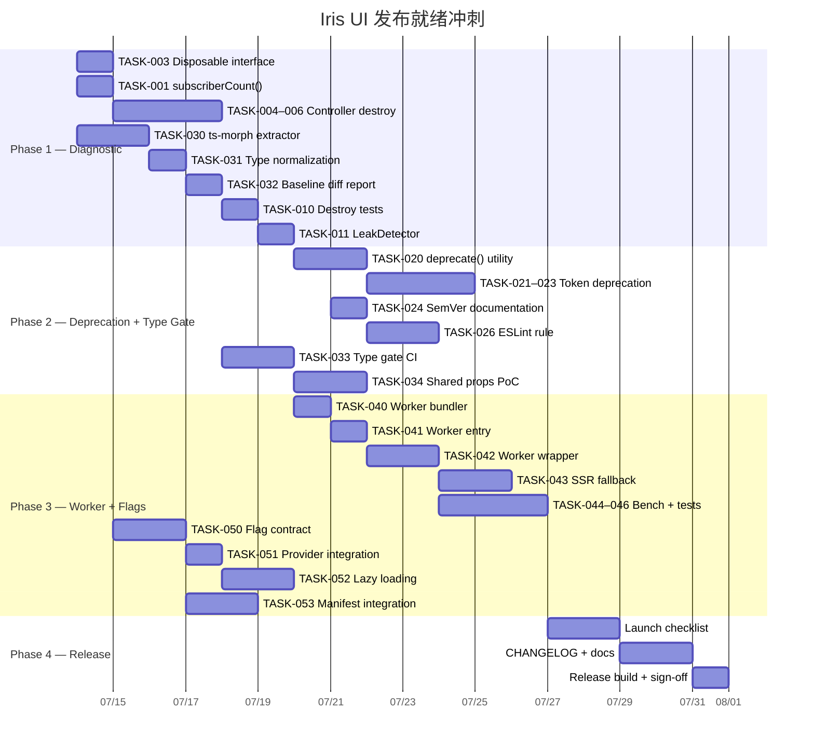

现在我已经对代码库有了深入的了解，以下是综合技术主导分析：

# Tech Lead 分析：Iris UI 发布就绪方向

## 1. 任务分解

以下任务按 2-4 小时粒度分解，与同行评审确定的 5 个方向保持一致，并辅以基于代码库验证的`destroy()`审计：

### 方向 ③：运行时泄漏检测工具 → 优先处理（诊断先于修复）

| 任务 ID  | 标题                                                                                                | 涉及文件                                     | 前置               | 工时             |
| -------- | --------------------------------------------------------------------------------------------------- | -------------------------------------------- | ------------------ | ---------------- |
| TASK-001 | 在 Store 上添加 `subscriberCount()`                                                                 | `packages/core/src/store.ts`                 | —                  | 1h               |
| TASK-002 | 在 Store 上添加 `invariant(cb)` 用于零订阅者断言                                                    | `packages/core/src/store.ts`                 | TASK-001           | 1h               |
| TASK-003 | 为 A 层控制器定义 `Disposable` 接口（core）                                                         | `packages/core/src/disposable.ts`（新建）    | —                  | 1h               |
| TASK-004 | 为 `createSelectionModel` 添加 `destroy()`                                                          | `packages/core/src/selection.ts`             | TASK-003           | 1.5h             |
| TASK-005 | 为 `createExpansion` 添加 `destroy()`                                                               | `packages/core/src/expansion.ts`             | TASK-003           | 1h               |
| TASK-006 | 为 `createTabsNav` 添加 `destroy()`                                                                 | `packages/core/src/tabsNav.ts`               | TASK-003           | 1.5h             |
| TASK-007 | 为 `createAdminShell` 添加 `destroy()`                                                              | `packages/core/src/admin-shell.ts`           | TASK-005, TASK-006 | 1.5h             |
| TASK-008 | 为 `virtual.ts` 和 `roving.ts` 纯函数组件添加 `destroy()`，如果它们有订阅                           | —（纯函数）                                  | TASK-003           | — _不需要_       |
| TASK-009 | 为 `cell-edit.ts`、`clipboard.ts`、`clipboard-history.ts` 添加 `destroy()`（如果它们有 store 订阅） | `packages/core/src/cell-edit.ts` 等          | TASK-003           | 各 1.5h          |
| TASK-010 | 为已补充 `destroy()` 的控制器编写测试                                                               | 对应的 `.test.ts` 文件                       | TASK-004–009       | 各 1h（总计 4h） |
| TASK-011 | 构建 `LeakDetector`：开发模式下的测试工具，用于在 `unmount` 后断言零订阅者                          | `packages/core/src/leak-detector.ts`（新建） | TASK-001–002       | 2h               |
| TASK-012 | 将 `Disposable` 与 TypeScript 5.2 的 `using` / `Symbol.dispose` 集成                                | `packages/core/src/disposable.ts`            | TASK-003           | 1h               |

**小计：方向 ③ = 8 个任务，约 17 小时**

### 方向 ④：系统化弃用生命周期

| 任务 ID  | 标题                                                                                              | 涉及文件                                                  | 前置     | 工时 |
| -------- | ------------------------------------------------------------------------------------------------- | --------------------------------------------------------- | -------- | ---- |
| TASK-020 | 实现 `deprecate()` 工具函数（开发模式下警告 + JSDoc 生成器）                                      | `packages/core/src/deprecate.ts`（新建）                  | —        | 3h   |
| TASK-021 | 构建 `DeprecatedTokens` 映射（token 重命名时使用）                                                | `packages/tokens/src/deprecated.ts`（新建）               | —        | 2h   |
| TASK-022 | 在 `applyTheme` 中添加对已弃用 token 的开发模式警告（`tokens/src/apply.ts`）                      | `packages/tokens/src/apply.ts`                            | TASK-021 | 2h   |
| TASK-023 | 为 token 编写别名 CSS（例如 `--iris-fg-dim: var(--iris-fg-muted)`）                               | `packages/tokens/src/aliases.css`（新建）                 | TASK-021 | 1.5h |
| TASK-024 | 在 `AGENTS.md` 和/或 `CONTRIBUTING.md` 中草拟 SemVer 承诺文档                                     | `AGENTS.md`                                               | —        | 2h   |
| TASK-025 | 使用 `@deprecated` JSDoc + SemVer 版本控制标记现有弃用项（例如 `solid/textarea` 中的 `autosize`） | `packages/solid/src/primitives/textarea/IrisTextarea.tsx` | TASK-020 | 1h   |
| TASK-026 | 将 `@deprecated` JSDoc 规则添加到 ESLint（`eslint-plugin` 包）                                    | `packages/eslint-plugin/`                                 | TASK-020 | 2h   |

**小计：方向 ④ = 7 个任务，约 13.5 小时**

### 方向 ⑤：跨框架类型健全性门控

| 任务 ID  | 标题                                                                             | 涉及文件                                          | 前置     | 工时 |
| -------- | -------------------------------------------------------------------------------- | ------------------------------------------------- | -------- | ---- |
| TASK-030 | 构建类型提取工具（ts-morph 结构化比较，而非字符串化）                            | `packages/manifest/src/type-gate.ts`（新建）      | —        | 4h   |
| TASK-031 | 编写规范化：联合成员排序、空格、类型别名解析                                     | `packages/manifest/src/type-gate.ts`              | TASK-030 | 3h   |
| TASK-032 | 为现有差异生成基线差异报告                                                       | `packages/manifest/type-diff-report.json`（生成） | TASK-031 | 2h   |
| TASK-033 | 将类型门控集成到 `pnpm gen:manifest` 或独立的 CI 步骤中                          | `packages/manifest/src/generate.ts` + CI YAML     | TASK-031 | 2h   |
| TASK-034 | 将共享 Props 类型从适配器提取到 core（路径查找器 — 1 个组件，例如 `IrisButton`） | `packages/core/src/composables/`（新建）+ 适配器  | TASK-030 | 3h   |

**小计：方向 ⑤ = 5 个任务，约 14 小时**

### 方向 ①：非主线程数据管道

| 任务 ID  | 标题                                                              | 涉及文件                                              | 前置               | 工时    |
| -------- | ----------------------------------------------------------------- | ----------------------------------------------------- | ------------------ | ------- |
| TASK-040 | 实现 Worker 打包程序（tsup 的 `worker: { format: 'iife' }` 配置） | `packages/core/tsup.config.ts`                        | —                  | 2h      |
| TASK-041 | 编写 Worker 条目：filterSort + paginate 序列化输入/输出           | `packages/core/src/data-view.worker.ts`（新建）       | —                  | 2h      |
| TASK-042 | 构建 `createWorkerPipeline` 包装器（150 行）                      | `packages/core/src/data-view-worker.ts`（新建）       | TASK-040, TASK-041 | 3h      |
| TASK-043 | 为 4 个框架实现 SSR 降级路径（Worker URL 解析策略）               | `packages/react/src/composables/useWorkerSort.ts` 等  | TASK-042           | 各 1.5h |
| TASK-044 | 编写 break-even 测试：确定性数据集的基准测试（10k、50k、200k 行） | `packages/core/src/data-view.worker.bench.ts`（新建） | TASK-042           | 2h      |
| TASK-045 | 实现 Transferable 路径（`Uint8Array` 编码/解码）用于 >200k 行     | `packages/core/src/data-view-worker.ts`               | TASK-042           | 3h      |
| TASK-046 | 编写 Worker 管道集成测试（主线程 ↔ Worker 往返）                  | `packages/core/src/data-view-worker.test.ts`（新建）  | TASK-042           | 2h      |

**小计：方向 ① = 7 个任务，约 18 小时**

### 方向 ②：可组合特性标志

| 任务 ID  | 标题                                                              | 涉及文件                             | 前置     | 工时  |
| -------- | ----------------------------------------------------------------- | ------------------------------------ | -------- | ----- |
| TASK-050 | 定义特性标志契约（类型 + 上下文注入）                             | `packages/core/src/flags.ts`（新建） | —        | 2h    |
| TASK-051 | 在 `IrisProvider` 中添加 `pluginFlags` prop（运行时层 — Layer 1） | 框架适配器中的 `IrisProvider`        | TASK-050 | 各 1h |
| TASK-052 | 重构插件使用动态导入的懒加载模式（Layer 2）                       | `packages/plugin-editor/src/`        | TASK-051 | 3h    |
| TASK-053 | 构建 Manifest 集成：从插件导出树自动推导特性矩阵                  | `packages/manifest/src/discover.ts`  | —        | 3h    |
| TASK-054 | 在测试中编写基于标志的插件注册测试                                | `packages/core/src/plugin.test.ts`   | TASK-050 | 2h    |

**小计：方向 ② = 5 个任务，约 12 小时**

---

## 2. 执行顺序

依赖拓扑如下。关键见解：**诊断（③→⑤）必须在修复（④）之前**，因为：

- 在知道哪些控制器缺少`destroy()`之前，您无法编写弃用工具
- 在知道类型差异在哪里之前，您无法统一 Props 类型

```mermaid
graph TD
    subgraph "Phase 1: Diagnostics & Foundation (Week 1)"
        T001[TASK-001: Store subscriberCount]
        T003[TASK-003: Disposable interface]
        T030[TASK-030: Type extraction tool ts-morph]

        T001 --> T002[TASK-002: Store invariant]
        T003 --> T004[TASK-004: SelectionModel destroy]
        T003 --> T005[TASK-005: ExpansionModel destroy]
        T003 --> T006[TASK-006: TabsNav destroy]
        T004 --> T010[TASK-010: Controller destroy tests]
        T005 --> T010
        T006 --> T010
        T006 --> T007[TASK-007: AdminShell destroy]
        T010 --> T011[TASK-011: LeakDetector tool]

        T030 --> T031[TASK-031: Normalize + sort unions]
        T031 --> T032[TASK-032: Baseline diff report]
    end

    subgraph "Phase 2: Deprecation + Type Gate (Week 2)"
        T011 --> T020[TASK-020: deprecate() utility]
        T020 --> T021[TASK-021: DeprecatedTokens map]
        T020 --> T026[TASK-026: ESLint deprecated rule]
        T021 --> T022[TASK-022: Theme dev warnings]
        T021 --> T023[TASK-023: Alias CSS tokens]
        T024[TASK-024: SemVer commitment doc]

        T031 --> T033[TASK-033: CI integration]
        T033 --> T034[TASK-034: Shared props extraction PoC]
    end

    subgraph "Phase 3: Feature Flags + Worker (Week 3-4)"
        T001 --> T050[TASK-050: Feature flag contract]
        T050 --> T051[TASK-051: IrisProvider pluginFlags]
        T050 --> T053[TASK-053: Manifest feature matrix]
        T051 --> T052[TASK-052: Lazy plugin loading]

        T033 --> T040[TASK-040: Worker bundler config]
        T040 --> T041[TASK-041: Worker entry]
        T040 --> T042[TASK-042: Worker pipeline wrapper]
        T042 --> T043[TASK-043: SSR fallback ×4 adapters]
        T042 --> T044[TASK-044: Break-even benchmarks]
        T042 --> T046[TASK-046: Worker integration tests]
        T041 --> T045[TASK-045: Transferable path]
    end

    style T001 fill:#4CAF50,color:#fff
    style T003 fill:#4CAF50,color:#fff
    style T030 fill:#4CAF50,color:#fff
    style T011 fill:#FF9800,color:#fff
    style T020 fill:#2196F3,color:#fff
    style T024 fill:#2196F3,color:#fff
    style T050 fill:#9C27B0,color:#fff
    style T040 fill:#F44336,color:#fff
```

### 可并行执行的任务组

| 组            | 任务                         | 条件                                      |
| ------------- | ---------------------------- | ----------------------------------------- |
| **诊断组 A**  | TASK-001, TASK-003, TASK-030 | 无依赖。可以由 3 人并行开始               |
| **类型组**    | TASK-031, TASK-032           | 依赖于 TASK-030。在 TASK-001–003 之后     |
| **文档组**    | TASK-024（SemVer 承诺）      | 与其他 Phase 2 并行                       |
| **插件组**    | TASK-050, TASK-053           | 在 TASK-001 之后。与 Phase 1 剩余部分并行 |
| **Worker 组** | TASK-040, TASK-041, TASK-042 | 在 TASK-033 之后。与 Phase 2 并行         |

---

## 3. 技术风险

### 高风险项

| 风险 ID | 描述                                                                                                                                                                             | 可能性 | 影响 | 缓解措施                                                                                                                       |
| ------- | -------------------------------------------------------------------------------------------------------------------------------------------------------------------------------- | ------ | ---- | ------------------------------------------------------------------------------------------------------------------------------ |
| R-001   | **Worker 打包复杂性**：tsup 的 `worker: { format: 'iife' }` 在库模式下与多条目配置冲突。框架适配器需要不同的 Worker URL 解析策略                                                 | 高     | 高   | 在方向①之前先探索（在即兴项目中）使用 `new URL(..., import.meta.url)`；如果发现不可靠，则回退到内联 blob URL                   |
| R-002   | **类型规范化困难**：TypeScript 编译器 API 中的联合成员排序在类型别名和条件类型面前很脆弱。PR 中的误报会降低对 CI 门控的信心                                                      | 中     | 高   | 在 ts-morph 上使用结构化比较（非字符串化）；在方法 A 上使用方法 A'；包含显式的“浮动”松散匹配模式                               |
| R-003   | **SSR 中的 FinalizationRegistry 不可靠**：GC 回调在 jsdom/Node 中不确定。短生命周期的测试根本无法触发它们                                                                        | 高     | 中   | 放弃 `FinalizationRegistry`。使用 `subscriberCount()` + `invariant()` 确定性引用计数方法                                       |
| R-004   | **Transferable 对象收益递减**：将数据行编码为 `Uint8Array` 会因解码开销而增加 Worker 内部的延迟。真正的零拷贝传输需要共享的 `ArrayBuffer`，这在 Workers 之间的排序上下文中很棘手 | 中     | 中   | 让 Transferable 路径成为可选（通过配置选择加入）；默认 postMessage 结构化克隆。在 `>200k` 行的微基准测试中验证收益             |
| R-005   | **特性标志的构建时消除需要 bundler 插件**：如果没有 Vite/Rollup/webpack 插件，运行时标志无法减小包大小。bundler 插件增加了双倍的维护负担                                         | 中     | 中   | 将特性标志分为 Layer 1（运行时 UI 隐藏）+ Layer 2（动态导入，无包大小节省）+ Layer 3（未来构建时）。明确沟通这个不可协商的限制 |

### 中等风险项

| 风险 ID | 描述                                                                                                      | 缓解措施                                                                                 |
| ------- | --------------------------------------------------------------------------------------------------------- | ---------------------------------------------------------------------------------------- |
| R-006   | **跨框架 contracts 测试超额订阅**：在 4 个框架上运行共享场景会线性增加 CI 时间（每个框架 1–2 分钟）       | 测试并行化（Turborepo 已经跨包分发）；仅对关键行为（对话框销毁、表单提送）使用 contracts |
| R-007   | **`destroy()` 补全中的回归**：仓促添加的 `destroy()` 可能在 `StrictMode` 双重重渲染期间破坏现有的工作组件 | 每个添加的 `destroy()` 都需要 TASK-010 测试，以验证幂等性和双重重加载行为                |
| R-008   | **Worker 基准测试中的性能指标噪音**：实际序列化成本因 CPU 速度、内存带宽和 GC 压力而异                    | 在确定的硬件上标准化基准；使用统计阈值（不是硬界限）；在 CI 中将结果发布为注释           |

### 测试覆盖难点

1. **Worker 管道**：在没有真实 `Worker` 的情况下测试 Worker 代码（jsdom 不实现 Web Workers）。需要：
   - 单元测试：将 Worker 条目作为纯函数直接测试（数据行输入 → 排序后的行输出），绕过 postMessage
   - 集成测试：使用 `vitest` 的 `pool: 'threads'` 并创建真实的 `Worker` blob URL
   - 基准测试：定时真实 Worker 往返，而不是模拟

2. **类型门控**：测试类型比较逻辑本身需要已知差异的精心构建的类型声明工厂：

   ```typescript
   // 测试用例
   const sourceA = 'export type Size = "sm" | "md" | "lg"'
   const sourceB = 'export type Size = "sm" | "lg" | "md"' // 仅排序不同 → 应通过
   const sourceC = 'export type Size = "sm" | "md" | "xl"' // 成员不同 → 应失败
   ```

3. **弃用工具**：测试开发模式警告依赖于 `console.warn` 的 `vi.spyOn`。关键场景：
   - 使用已弃用 token 的皮肤 → 发出警告
   - 使用替换 token 的皮肤 + 已弃用的别名 → 警告提及替换 + 代数
   - 使用已弃用 prop 的组件 → JSDoc lint 错误

---

## 4. 资源评估

### 团队构成

| 角色                           | 人数 | 主要覆盖范围                                            |
| ------------------------------ | ---- | ------------------------------------------------------- |
| **核心架构师**（资深）         | 1    | 方向③控制器设计、方向⑤类型门设计、代码审查              |
| **框架适配器工程师**（中高级） | 1–2  | 方向① SSR 降级、方向②插件标志、方向⑤共享 Props 提取     |
| **质量工程师**                 | 1    | 方向③ LeakDetector、方向⑤基线报告、基准测试 + contracts |
| **DevOps / 构建**              | 0.5  | Worker 打包、CI 调整、changeset 自动化                  |

_估计总工作量：1 名全职资深开发者 + 1 名全日制工程师 = 3–4 周_

### 里程碑

| 里程碑                    | 截止日期 | 可交付成果                                                                                                                                     | 入口标准                         |
| ------------------------- | -------- | ---------------------------------------------------------------------------------------------------------------------------------------------- | -------------------------------- |
| **M1：诊断基线**          | 第 5 天  | ✅ 所有控制器均实现 `Disposable`<br>✅ `subscriberCount()` + `invariant()`<br>✅ 类型门控生成基线差异报告<br>✅ 已知差异被分配合并             | TASK-001–010、TASK-030–032       |
| **M2：修复工具**          | 第 12 天 | ✅ `deprecate()` 工具 + 使用情况审计<br>✅ 已弃用 token 的别名 CSS + 主题警告<br>✅ SemVer 承诺已记录<br>✅ 类型门控 CI 步骤绿色（或已知失败） | TASK-020–026、TASK-033、TASK-034 |
| **M3：Worker + 特性标志** | 第 20 天 | ✅ Worker 管道通过所有测试 + 基准测试<br>✅ 特性标志运行时层在 4 个框架中工作<br>✅ 插件懒加载在 plugin-editor 中演示                          | TASK-040–046、TASK-050–054       |
| **M4：发布就绪**          | 第 25 天 | ✅ 发布清单的全部勾选框<br>✅ 所有 5 个方向的 CHANGELOG 📝<br>✅ 已编辑的发布就绪 `AGENTS.md`                                                  | 所有任务                         |

### 阻塞点和策略

| 阻塞点                                                                               | 影响          | 解决策略                                                                                                       |
| ------------------------------------------------------------------------------------ | ------------- | -------------------------------------------------------------------------------------------------------------- |
| **B-1**：Worker URL 在 CI 与生产中解析不同                                           | 阻塞 M3       | 回退：基线 `createWorkerPipeline` 在不支持 Worker 时，带警告同步内联排序。这降低了“也许”的收益，但“从不”阻塞   |
| **B-2**：`ts-morph` 类型规范化在 596 个 Props 接口的增量上超时（每个 CI 运行 >5 秒） | 阻塞 M2       | 策略：仅比较从 manifest 发现的“热路径”组件（Top 30 组件），而不是全部 149 个。缓存类型 AST 以避免重复解析      |
| **B-3**：`Symbol.dispose` 需要通过每个框架适配器的 ES 目标配置使用 TypeScript 5.2    | 阻塞 TASK-012 | 检测 `tsconfig.json` 中的 `lib: ["ES2022"]` — 必须升级到 `ESNext` 或包含 `"ESNext.Disposable"`。立即验证兼容性 |

---

## 5. 质量保证

### 单元测试覆盖要求

| 区域                       | 所需覆盖级别        | 关键场景                                                                                                                |
| -------------------------- | ------------------- | ----------------------------------------------------------------------------------------------------------------------- |
| **新的控制器 `destroy()`** | 每个控制器 3 个测试 | ① 销毁释放订阅（`subscriberCount() === 0`）<br>② 幂等性（可以调用两次）<br>③ 销毁后重新加载正确工作（StrictMode 模拟）  |
| **LeakDetector**           | 每个场景 1 个测试   | ① 组件挂载 → 挂载 → 零订阅者<br>② 挂载后不调用 `destroy()` → 工具报告泄漏                                               |
| **弃用工具**               | 每个模式 2 个测试   | ① 开发模式：使用已弃用 token → warning<br>② 生产模式：无 warning（死代码消除）                                          |
| **类型门控**               | 每个操作 1 个测试   | ① 快速“通过”：仅排序差异<br>② 严格“失败”：成员差异<br>③ 类型别名解析                                                    |
| **Worker 管道**            | 每个级别 2 个测试   | ① Worker 条目作为纯函数（绕过 postMessage）<br>② 真实 Worker 往返（blob URL）<br>③ 错误处理：Worker 崩溃 → 回退到主线程 |

### 集成测试策略

```
Level 1 — Controller destroy() × framework
  在每个适配器中挂载 <IrisSelect>，调用 unmount → 断言零全局对话框焦点陷阱

Level 2 — Cross-framework Contract scenarios
  OverlayDestroy 在 4 个适配器上运行相同的 steps

Level 3 — Worker × Table
  挂载 <IrisTable data={50k rows}>，断言排序后正确渲染
  （这在 puppeteer/playwright 中，而不是 jsdom 中）
```

### 代码审查要点

| 关注点               | 在 PR 中检查的内容                                                                                                                            |
| -------------------- | --------------------------------------------------------------------------------------------------------------------------------------------- |
| **控制器销毁完整性** | 在 PR 之前和之后运行 `grep -rn "subscribe\|addEventListener\|setTimeout\|setInterval" packages/core/src/`，并手动审计每个都配对了一个清理操作 |
| **类型门控误报**     | 针对真实适配器代码库运行基线差异 → 手动检查每个差异。微调规范化，直到所有已知差异都是合理的不一致                                             |
| **弃用代数**         | 已弃用的 token 必须引用其替换项。`var(--iris-fg-dim, var(--iris-fg-muted))` 而不是孤立的 `var(--iris-fg-dim)`                                 |
| **Worker 回退**      | SSR 降级不能抛出；`getWorker()` 必须检查 `typeof Worker !== 'undefined'`                                                                      |

### 性能测试需求

| 场景                     | 工具                | 阈值                                                 |
| ------------------------ | ------------------- | ---------------------------------------------------- |
| Worker 与主线程：10k 行  | `vitest bench`      | 总延迟（主线程）< 总延迟（Worker）                   |
| Worker 与主线程：50k 行  | `vitest bench`      | Worker 总延迟 < 主线程延迟 × 2（衡量“不卡顿”的权衡） |
| Worker 与主线程：200k 行 | `vitest bench`      | 主线程阻塞 > 200ms；Worker 阻塞 < 16ms               |
| 类型规范化延迟           | 手动计时            | < 每个 CI 运行 1 秒                                  |
| 插件懒加载初始化         | `performance.now()` | 未使用的功能：0ms 初始化成本                         |

---

## 6. 实施计划

### 详细时间表（日历日，并行安排）

**基线假设**：2 名全职工程师（1 名高级 + 1 名中级），在以下情况重叠时工作。

```
周 1：诊断基础（M1）
┌─────────────────────────────────────────────────────────┐
│ 高级                         │ 中级                      │
├─────────────────────────────────────────────────────────┤
│ 周一 — TASK-003 (Disposable) │ TASK-001 (subscriberCount)│
│         TASK-004 (Selection) │ TASK-030 (ts-morph)       │
│ 周二 — TASK-005 (Expansion)  │ TASK-031 (规范化)        │
│ 周三 — TASK-006 (TabsNav)    │ TASK-032 (差异报告)      │
│ 周四 — TASK-007 (AdminShell) │ TASK-032（继续）         │
│ 周五 — TASK-010（全部测试） │ TASK-001 修复            │
└─────────────────────────────────────────────────────────┘

周 2：弃用 + 类型门 + 文档（M2）
┌─────────────────────────────────────────────────────────┐
│ 高级                         │ 中级                      │
├─────────────────────────────────────────────────────────┤
│ 周一 — TASK-020 (deprecate)  │ TASK-024 (SemVer 文档)   │
│ 周二 — TASK-021 (token map)  │ TASK-026 (ESLint 规则)   │
│ 周三 — TASK-022 (主题警告)   │ TASK-033 (类型门 CI)     │
│ 周四 — TASK-023 (别名 CSS)   │ TASK-034 (Props PoC)     │
│ 周五 — TASK-025 (审计使用)   │ TASK-034（继续）         │
└─────────────────────────────────────────────────────────┘

周 3-4：Worker + 特性标志（M3）
┌─────────────────────────────────────────────────────────┐
│ 高级                         │ 中级                      │
├─────────────────────────────────────────────────────────┤
│ 周一 — TASK-040 (打包程序)   │ TASK-050 (标志契约)      │
│ 周二 — TASK-041 (Worker 条目)│ TASK-053 (Manifest 标志) │
│ 周三 — TASK-042 (包装器)     │ TASK-051 (提供者标志)    │
│ 周四 — TASK-043 (SSR 降级)   │ TASK-052 (懒加载导入)    │
│ 周五 — TASK-044 (基准测试)    │ TASK-046 (Worker 测试)   │
│ 周一 — TASK-045 (Transferable)│ TASK-046（继续）         │
│ 周二 — 集成 + 压力测试       │ TASK-054 (插件测试)      │
└─────────────────────────────────────────────────────────┘

周 5：发布冲刺（M4）
┌─────────────────────────────────────────────────────────┐
│ 两者                         │                           │
├─────────────────────────────────────────────────────────┤
│ 周一 — 发布清单逐项检查       │                           │
│ 周二 — 所有 5 个方向的 CHANGELOG                        │
│ 周三 — AGENTS.md + 外部文档更新                         │
│ 周四 — 发布候选构建 + 冒烟测试                          │
│ 周五 — 发布审批 + 标签打版                              │
└─────────────────────────────────────────────────────────┘
```

### 甘特图（日历时间线）



### 并行计划和任务分配

**并行流 A**（高级）：控制器 + 弃用

```
周 1: T003 → T004→T005→T006→T007 → T010 → T011
周 2: T020 → T021→T022→T023 → T025
```

**并行流 B**（中级）：类型门 + 基础设施

```
周 1: T001 → T002 + T030→T031→T032
周 2: T024 + T026 + T033 + T034
周 3: T050→T053→T051→T052
```

**并行流 C**（两个工程师都参与）：Worker（在第 3–4 周重叠时）

```
周 3-4: T040→T041→T042→T043 + T044+T045+T046
```

### 满足所有任务后，发布清单

```
发布清单
□ TASK-011：LeakDetector 在 `IrisProvider` 的开发模式下可用
□ TASK-004–009：所有控制器实现 `[Symbol.dispose]` +
  `destroy()`（幂等）
□ TASK-020：`deprecate()` 工具在 core 中
□ TASK-024：SemVer 承诺文档已合并到 `AGENTS.md`
□ TASK-022：已弃用 token 的使用在开发模式下由 `applyTheme` 警告
□ TASK-033：类型门 CI 步骤通过（或明确已知失败）
□ TASK-032：已知跨框架类型差异的记录基线
□ TASK-044：Worker vs 主线程性能基准测试已发布
□ TASK-046：Worker 管道在 >50k 行上通过集成测试
□ TASK-054：特性标志在 plugin-editor 上演示
□ `pnpm turbo run test typecheck lint build` 全部绿色
□ `pnpm size` 预算全部通过
□ CHANGELOG.md 已更新
□ `pnpm gen:manifest` 已运行
```
