Now I have a thorough understanding of the codebase. Here is my Tech Lead analysis:

---

# Tech Lead 分析：5 方向实施计划

## 1. 任务分解

### 方向一：虚拟滚动表格的三层架构（重新定位）

| 任务 ID  | 标题                                            | 涉及文件                                                     | 前置依赖     | 预估工时 | 验收标准                                                                                                                                |
| -------- | ----------------------------------------------- | ------------------------------------------------------------ | ------------ | -------- | --------------------------------------------------------------------------------------------------------------------------------------- |
| TASK-001 | 分离粘性表头为独立滚动层                        | `Table.tsx`, `TableHeader.tsx`, `TableBody.tsx`, `styles.ts` | —            | 6h       | 表头在垂直滚动时固定 `top: 0`，表体独立滚动不带动表头；集成测试验证 100 行数据滚动后表头始终可见                                        |
| TASK-002 | 三面板固定列架构（左固定+滚动画板+右固定）      | `Table.tsx`, `TableHeader.tsx`, `TableRow.tsx`, `styles.ts`  | TASK-001     | 8h       | 左/右固定列独立 `position: sticky` 容器，同步水平滚动；三面板间无 1px 错位                                                              |
| TASK-003 | z-index 层级策略                                | `styles.ts`, `Table.tsx`                                     | TASK-002     | 2h       | 粘性表头 `zIndex: 2`，固定列 `zIndex: 1`，交叉区域 `zIndex: 3`；写 axe 测试不报 `color-contrast`                                        |
| TASK-004 | 列虚拟化改用 `createVirtualizer`                | `Table.tsx`                                                  | —            | 3h       | 列虚拟化从 `computeVirtualRange` 升级到 `createVirtualizer` 带 Fenwick tree cache；bench 验证 200 列+固定列场景 scroll 无 O(n) 偏移重建 |
| TASK-005 | 详情行 + 虚拟滚动共存                           | `TableBody.tsx`, `TableRow.tsx`                              | TASK-001     | 4h       | 移除 `(!treeMode \|\| !hasDetail)` guard；详情行用 `'auto'` itemHeight + measured-size cache                                            |
| TASK-006 | 集成测试覆盖三层 + 粘性头 + 固定列 + 虚拟化组合 | `test/advanced.test.tsx`                                     | TASK-001~005 | 4h       | `render` + `fireEvent.scroll` 验证 5 种组合场景，每个断言不少于 3 个                                                                    |

### 方向二：DataState 统一（P0++，最高 ROI）

| 任务 ID  | 标题                                                     | 涉及文件                                               | 前置依赖 | 预估工时 | 验收标准                                                                                                             |
| -------- | -------------------------------------------------------- | ------------------------------------------------------ | -------- | -------- | -------------------------------------------------------------------------------------------------------------------- | -------- |
| TASK-007 | `useDataState` 补齐 `hasContent` 桥接                    | `useDataState.ts` (react/vue/solid)                    | —        | 2h       | `useDataState({ loading:true, hasContent:true })` 返回 `isContent: true`；core `resolveDataState` 测试已覆盖此路径   |
| TASK-008 | Table 替换手动 `if/else` 为 `useDataState`               | `TableBody.tsx`                                        | TASK-007 | 2h       | 手动 `{error ? ... : loading ? ... : empty ? ... : rows}` 替换为 `useDataState` + `IrisSkeleton` 可选；行为不变      |
| TASK-009 | Select/Combobox/Cascader 接入 DataState                  | `Select.tsx`, `Combobox.tsx`, `Cascader.tsx`           | TASK-007 | 4h       | 三种组件均支持 `loading`/`error`/`empty` prop，`data-iris-state` 动画入场一致                                        |
| TASK-010 | Transfer/DatePicker/Pagination/TreeSelect 接入 DataState | 各组件 tsx                                             | TASK-007 | 4h       | 同上；注意 Pagination 是"无数据时的空状态"不是 loading                                                               |
| TASK-011 | Skeleton 自动集成到 loading 状态                         | `useDataState.ts` 或新 hook `useDataStateWithSkeleton` | TASK-007 | 3h       | `useDataStateWithSkeleton({ loading })` 返回 `skeletonProps`；任一组件可通过 `skeletonCount` prop 控制 skeleton 数量 |
| TASK-012 | Vue/Solid/Svelte 补齐 `useDataState` 桥接 + 组件接入     | 各 framework `useDataState.ts`, 各组件                 | TASK-007 | 6h       | 四个框架同名同语义——DataState 在 `@iris-ui/core` 的定义确保四个桥接                                                  | `<`30 行 |

### 方向三：FormBuilder 条件模式增强

| 任务 ID  | 标题                                                        | 涉及文件                                             | 前置依赖     | 预估工时 | 验收标准                                                                                   |
| -------- | ----------------------------------------------------------- | ---------------------------------------------------- | ------------ | -------- | ------------------------------------------------------------------------------------------ |
| TASK-013 | 新增 `requiredWhen` / `disabledWhen` / `dependsOn` 字段属性 | `plugin-form-builder/src/core/index.ts`              | —            | 3h       | `FieldSpec` 新增三个可选属性，`createFormBuilder` 编译期注入对应的条件验证/禁用/重校验逻辑 |
| TASK-014 | 路径嵌套条件（`items[].type === 'other'`）                  | `plugin-form-builder/src/core/index.ts`              | TASK-013     | 4h       | `when` 支持嵌套路径读取：`when: (v) => getByPath(v, 'items[0].type') === 'other'`          |
| TASK-015 | 异步条件依赖                                                | `plugin-form-builder/src/core/index.ts`, plugin 契约 | TASK-013     | 4h       | `when` 支持返回 `Promise<boolean>`；form builder 在 values 变化后异步重新解析字段可见性    |
| TASK-016 | `createFormStore` 新增条件字段支持                          | `core/src/form/types.ts`, `core/src/form.ts`         | —            | 3h       | core form 引擎新增 `conditionalValidators` 概念——字段的验证器可被另一字段的变化触发重评估  |
| TASK-017 | React/Vue/Solid/Svelte 渲染器同步                           | 各 framework `plugin-form-builder/src/*/`            | TASK-013~016 | 4h       | 禁用字段收到 `disabled` prop（样式+交互），条件重校验在 UI 层触发                          |

### 方向四：拖拽排序（P0）

| 任务 ID  | 标题                                          | 涉及文件                                | 前置依赖     | 预估工时 | 验收标准                                                                                                   |
| -------- | --------------------------------------------- | --------------------------------------- | ------------ | -------- | ---------------------------------------------------------------------------------------------------------- |
| TASK-018 | Table 行拖拽排序——IrisSortable 集成           | `Table.tsx`, `TableRow.tsx`, `types.ts` | —            | 4h       | `IrisTable` 新增 `onRowsReorder` prop + `sortable` prop；拖拽行到新位置后触发回调                          |
| TASK-019 | List 拖拽排序——IrisSortable 集成              | `List.tsx`                              | —            | 2h       | `IrisList` 新增 `onReorder` prop + `sortable` prop                                                         |
| TASK-020 | Transfer 拖拽排序                             | `Transfer.tsx`                          | —            | 4h       | 两侧列表均支持内部拖拽重排序，跨列表拖拽留未来                                                             |
| TASK-021 | 树形拖拽放置语义（`before`/`inside`/`after`） | `core/src/sortable.ts`                  | —            | 6h       | `closestCenter` 新增树感知版本 `closestTreeDrop`；`DropPosition` 类型定义；`IrisSortable` 新增 `tree` mode |
| TASK-022 | 拖拽手柄 + 边缘自动滚动                       | `behaviors/Sortable.tsx`                | —            | 3h       | 每个可拖拽行默认有一个抓手图标（可选隐藏）；拖拽到容器边缘自动滚动 ±20px/s                                 |
| TASK-023 | 集成测试——Table/List/Transfer 拖拽排序        | 各组件 test 文件                        | TASK-018~022 | 4h       | pointer event 模拟拖拽 + 验证 reorder 回调                                                                 |

### 方向五：Portal SSR/Hydration 覆盖（P0，预发布安全线）

| 任务 ID  | 标题                                         | 涉及文件                                    | 前置依赖 | 预估工时 | 验收标准                                                                                                                     |
| -------- | -------------------------------------------- | ------------------------------------------- | -------- | -------- | ---------------------------------------------------------------------------------------------------------------------------- |
| TASK-024 | SSR 测试扩展到所有 149 组件                  | `ssr.test.tsx`                              | —        | 3h       | 每个组件至少一个最小渲染 case，含 portal 组件（`Dialog`/`Popover`/`Tooltip` 在关闭状态）                                     |
| TASK-025 | Hydration 测试扩展到 portal 边界场景         | `hydration.test.tsx`                        | TASK-024 | 4h       | ToastViewport/DialogContent/PopoverContent 在"服务器输出空容器，客户端注入 portal 内容"路径上无 hydration 警告               |
| TASK-026 | 新增 RSC 流式架构兼容层                      | `DialogContent.tsx`, `ToastViewport.tsx` 等 | —        | 4h       | `typeof document === 'undefined'` guard 改为 `'use client'` 标记 + 服务端占位 div；React 19 RSC 无 `document is not defined` |
| TASK-027 | 框架桥接同步——Vue/Solid/Svelte SSR hydration | 各 framework portal 组件                    | TASK-026 | 3h       | 另外三框架的 portal 组件在 SSR 环境返回占位符而非 null，hydration 后替换                                                     |
| TASK-028 | layout shift 预防——portal 容器 CSS 占位      | `ToastViewport.tsx`, `DialogContent.tsx`    | TASK-026 | 2h       | 服务端输出的空容器有固定 `position: fixed` + `inset: 0` + `pointer-events: none` 防 layout shift                             |

---

## 2. 执行顺序

```mermaid
graph TD
    %% Direction 1: Table Three-panel
    TASK-004[列虚拟化 → createVirtualizer]
    TASK-001[粘性表头层分离]
    TASK-001 --> TASK-002[三面板固定列架构]
    TASK-002 --> TASK-003[z-index 层级策略]
    TASK-001 --> TASK-005[详情行+虚拟滚动共存]
    TASK-001 & TASK-002 & TASK-003 & TASK-004 & TASK-005 --> TASK-006[集成测试]

    %% Direction 2: DataState
    TASK-007[hasContent 桥接]
    TASK-007 --> TASK-008[Table 接入 DataState]
    TASK-007 --> TASK-009[Select/Combobox/Cascader 接入]
    TASK-007 --> TASK-010[Transfer/DatePicker 等接入]
    TASK-007 --> TASK-011[Skeleton 自动集成]
    TASK-007 --> TASK-012[Vue/Solid/Svelte 补齐]

    %% Direction 3: FormBuilder
    TASK-013[requiredWhen/disabledWhen/dependsOn]
    TASK-013 --> TASK-014[路径嵌套条件]
    TASK-013 --> TASK-015[异步条件]
    TASK-013 & TASK-014 & TASK-015 --> TASK-016[core createFormStore 增强]
    TASK-016 --> TASK-017[四框架渲染器同步]

    %% Direction 4: Drag & Drop
    TASK-018[Table 行拖拽] & TASK-019[List 拖拽] & TASK-020[Transfer 拖拽]
    TASK-021[树形放置语义] --> TASK-022[拖拽手柄+自动滚动]
    TASK-018 & TASK-019 & TASK-020 & TASK-021 & TASK-022 --> TASK-023[集成测试]

    %% Direction 5: SSR/Hydration
    TASK-024[SSR 全组件覆盖] --> TASK-025[Portal hydration 测试]
    TASK-025 --> TASK-026[RSC 兼容层]
    TASK-026 --> TASK-027[三框架同步]
    TASK-026 --> TASK-028[layout shift 预防]

    %% Inter-direction dependencies
    TASK-008 -.->|复用 useDataState| TASK-011
    TASK-002 -.->|Table 重构影响| TASK-018
    TASK-026 -.->|portal 组件修改| TASK-028
```



### 并行执行组

| 组                           | 包含任务                                         | 建议人力     |
| ---------------------------- | ------------------------------------------------ | ------------ |
| **组 A（DataState 爆破组）** | TASK-007, TASK-008, TASK-009, TASK-010, TASK-011 | 1 人，3~4 天 |
| **组 B（FormBuilder）**      | TASK-013, TASK-014, TASK-015, TASK-016           | 1 人，3~4 天 |
| **组 C（拖拽排序）**         | TASK-018, TASK-019, TASK-020, TASK-021           | 1 人，4~5 天 |
| **组 D（SSR/安全线）**       | TASK-024, TASK-025, TASK-026, TASK-028           | 1 人，3~4 天 |
| **组 E（Table 三层架构）**   | TASK-001, TASK-002, TASK-003, TASK-004, TASK-005 | 2 人，4~5 天 |

> **建议**：**组 A + 组 D 先并行**（2 人，3~4 天产出全部收益），再上组 E + 组 C（需 2 人），组 B 可晚一周启动。

---

## 3. 技术风险

### 3.1 高概率 + 高风险

| 风险                                       | 方向     | 分析                                                                                                                           | 缓解策略                                                                                                                                      |
| ------------------------------------------ | -------- | ------------------------------------------------------------------------------------------------------------------------------ | --------------------------------------------------------------------------------------------------------------------------------------------- |
| **三面板同步滚动错位**                     | D1 Table | 左固定面板+中间滚动面板+右固定面板的同步滚动是 known hard problem。`onScroll` 事件循环 + `scrollLeft` 设置触发无限递归         | 用 `requestAnimationFrame` + guard flag 打破循环；中间面板用 `overflow: auto`，两侧面板用 `overflow: hidden` + `scrollLeft` 从中间面板 derive |
| **z-index 层级冲突**                       | D1 Table | 固定列 `zIndex: 1`，粘性表头 `zIndex: 2`，交叉区域需 `zIndex: 3`。这三个值必须与 Dialog(`1200`)/Toast(`1400`) 的层叠上下文兼容 | Table 自身建层叠上下文（`isolation: isolate` 或 `z-index: 0` + `position: relative`），使内部 z-index 在其上下文中生效，不污染全局            |
| **树形拖拽放置命中率**                     | D4 DnD   | `closestCenter` 对树的 `before`/`inside`/`after` 语义天然不敏感。1/3 分割算法在 jsdom 的 `getBoundingClientRect`=0 下不可测    | 用 `getBoundingClientRect` 的 y 轴相对位置做 1/3 分割；核心算法下沉到 `core/src/sortable.ts`，纯函数可测；jsdom 测试只测 controller wiring    |
| **React 19 RSC `document is not defined`** | D5 SSR   | RSC 流式架构对浏览器全局更严格。当前 `typeof document === 'undefined'` guard 在模块顶层无效                                    | 确保所有 `document` 访问在组件内部或 `useEffect`；标记 portal 组件为 `'use client'`；运行 RSC 兼容性 CI 检查                                  |

### 3.2 低概率但高影响

| 风险                                                       | 方向 | 分析                                                                                  | 缓解                                                                                                          |
| ---------------------------------------------------------- | ---- | ------------------------------------------------------------------------------------- | ------------------------------------------------------------------------------------------------------------- |
| **`createVirtualizer` 在列虚拟化场景的 Fenwick tree 开销** | D1   | 行虚拟化 O(log n) 已证明，但列数少（典型 10~30 列），Fenwick 的常数可能超过纯数组遍历 | 列数 `< 50` 时降级到数组 O(n) 偏移（bench 决策）                                                              |
| **四个框架的 `useDataState` 行为不一致**                   | D2   | 各框架的 `hasContent` 桥接可能由不同人实现                                            | core `resolveDataState` 单测覆盖所有组合 + 四框架各自一个集成测试（参数化 6 种状态）                          |
| **FormBuilder `when` 的异步模式导致渲染闪烁**              | D3   | 异步 `when` 返回前字段可见性不确定                                                    | 引入 `visibility` 的三种状态：`visible`/`hidden`/`pending`（异步解决中）；pending 时保留上一次可见性（stale） |

### 3.3 测试盲区

| 盲区                           | 方向 | 原因                                                     | 方案                                                                            |
| ------------------------------ | ---- | -------------------------------------------------------- | ------------------------------------------------------------------------------- |
| **粘性定位的视觉拼合**         | D1   | jsdom 不实现 `position: sticky`                          | 用 Cypress/Playwright E2E 测试视觉场景；单元只验 `pinnedOffsets` 计算正确       |
| **拖拽的指针坐标**             | D4   | jsdom 不实现 `setPointerCapture`/`getBoundingClientRect` | 用 `fireEvent.pointerDown/Move/Up` + 手动 clientX/Y——`useDrag` 测试已有模式可循 |
| **hydration 不匹配的浮动 DOM** | D5   | jsdom 可以检测但不报错                                   | 已有 `console.error` spy 模式（`hydration.test.tsx`），扩展即可                 |

---

## 4. 资源评估

### 人员配置

| 角色                 | 技能要求                           | 数量 | 负责方向                             |
| -------------------- | ---------------------------------- | ---- | ------------------------------------ |
| **资深前端工程师 A** | React 精通 + 虚拟化经验            | 1    | D1 Table 三层架构 + D4 拖拽排序      |
| **资深前端工程师 B** | SSR/Portal + 测试工程              | 1    | D5 SSR/Hydration + D2 DataState 统一 |
| **全栈前端工程师 C** | 表单 + 插件体系                    | 1    | D3 FormBuilder 条件增强              |
| **框架适配工程师 D** | Vue/Solid/Svelte 之一 + 跨框架移植 | 0.5  | D2/D3/D5 的跨框架桥接同步            |

> 注意：**工程师 D 是兼职**——四个框架的桥接很薄（20~40 行/桥），不需要专门投入。

### 关键里程碑

| 里程碑                         | 时间     | 交付物                                                                         |
| ------------------------------ | -------- | ------------------------------------------------------------------------------ |
| **M1: DataState 全部就绪**     | 第 5 天  | React/Vue/Solid/Svelte 共 ~12 个数据组件全部接入 DataState + Skeleton 自动集成 |
| **M2: SSR/Hydration 安全覆盖** | 第 6 天  | 149 组件 SSR + portal hydration + RSC 兼容 全部绿色                            |
| **M3: Table 三层架构 MVP**     | 第 10 天 | 粘性表头 + 三面板固定列 + `z-index` 策略 + 列虚拟化升级                        |
| **M4: 拖拽排序完成**           | 第 10 天 | Table/List/Transfer 可拖拽排序；树形拖拽 1/3 分割                              |
| **M5: FormBuilder 条件增强**   | 第 12 天 | `requiredWhen`/`disabledWhen`/`dependsOn` 全部实现，四框架同步                 |
| **M6: 集成测试 + 回归**        | 第 14 天 | 全部任务集成测试 green + size/typecheck/lint/build 四道门全过                  |

### Blockers

| Blocker                                 | 影响方向              | 解决策略                                                                                        |
| --------------------------------------- | --------------------- | ----------------------------------------------------------------------------------------------- |
| `@floating-ui/dom` 不在 jsdom 中工作    | D1 列虚拟化固定列联动 | 列固定不依赖 floating-ui——`pinnedOffsets` 是纯 CSS `position: sticky`                           |
| 无 `ResizeObserver` polyfill 在测试环境 | D1 三面板宽度测量     | `vi.stubGlobal('ResizeObserver', ...)` —— 现有 `VirtualScroll` 测试已有 mock                    |
| React 19 RSC 环境需额外依赖             | D5                    | 用 `next build` 验证（当前 CI 无 Next.js 环境）；或临时用 `react-server-dom-webpack` standalone |

---

## 5. 质量保证

### 单元测试覆盖要求

| 模块                       | 最低覆盖率 | 关键测试场景                                                                                   |
| -------------------------- | ---------- | ---------------------------------------------------------------------------------------------- |
| `core/src/sortable.ts`     | 95%+       | `press→tryStart→start→over→moveOver→end/cancel` 全生命周期；树形 `closestTreeDrop` 的 1/3 分割 |
| `core/src/data-state.ts`   | 100%       | 全部 6 种 `DataStateInput` 组合（含 `hasContent` 四种组合）                                    |
| `core/src/virtualizer.ts`  | 90%+       | Fenwick tree 的 `findOffset` 精度；`measure`+`scrollToIndex` 边界                              |
| `core/src/form/`           | 90%+       | `dependencies` 跨字段重校验；`conditionalValidators` 条件路径                                  |
| Table `pinnedOffsets` 计算 | 100%       | 左/右/无/混合固定列，含 selection+expand 列宽偏移                                              |
| useDataState               | 100%       | 四框架各 6 种状态 + 动画 class 切换                                                            |

### 集成测试策略

每一层集成测试有一个专门文件：

```txt
packages/react/src/primitives/table/test/
  sticky-header.test.tsx     // 粘性表头 + 固定列组合
  sortable-rows.test.tsx     // 行拖拽排序
  three-panel.test.tsx       // 三面板同步滚动
packages/react/src/primitives/list/
  sortable-list.test.tsx     // List 拖拽排序
packages/react/src/primitives/transfer/
  sortable-transfer.test.tsx // Transfer 拖拽排序
packages/react/src/
  data-state-integration.test.tsx  // 所有数据组件的 DataState 一致性
  ssr-full.test.tsx                // 149 组件 SSR（取代当前 16 个）
  hydration-portal.test.tsx        // portal 组件 hydration 场景
```

### 代码审查要点

| 审查重点                     | 说明                                                                        |
| ---------------------------- | --------------------------------------------------------------------------- |
| **三面板同步滚动无递归**     | `onScroll` → `scrollLeft` 设置必须用 `raf` + guard，review 时确认无无限循环 |
| **`z-index` 层叠上下文隔离** | Table 必须 `isolation: isolate`，内部 z-index 不溢出                        |
| **`hasContent` 桥接正确性**  | `useDataState` 新增 `hasContent` 参数后，core `resolveDataState` 行为不变   |
| **portal 组件 SSR guard**    | `typeof document === 'undefined'` 必须是执行时 guard，非模块顶层            |
| **拖拽 reorder 回调幂等性**  | 多次触发同一 reorder 不产生重复副作用                                       |
| **四框架同语义**             | 新增的 prop/行为在四个适配器中同名同类型                                    |

### 性能测试需求

| 场景                            | 工具                             | 指标           | 当前基线                           | 目标                         |
| ------------------------------- | -------------------------------- | -------------- | ---------------------------------- | ---------------------------- |
| Table 10,000 行虚拟滚动         | `scale.bench.ts`                 | 首次渲染时间   | ~150ms                             | `<200ms`（三层架构增加开销） |
| Table 200 列水平虚拟化          | `column-virtualization.bench.ts` | 滚动帧率       | 无数据（未用 `createVirtualizer`） | `>50fps`                     |
| FormBuilder 50 字段 + 10 条件链 | `form-condition.bench.ts`        | 条件重评估时间 | 无数据                             | `<5ms`                       |
| List 1,000 项拖拽               | `sortable.bench.ts`              | 拖拽帧率       | 无数据                             | `>45fps`                     |

---

## 6. 实施时间表

### 甘特图

```
周 1                      周 2                      周 3
┌───┬───┬───┬───┬───┬───┬───┬───┬───┬───┬───┬───┬───┬───┬───┬───┬───┬───┬───┬───┐
                                                  M6
                                                  🎯
                                              ┌────────────────────────────────────
                                              │ 集成测试 + 回归 (A+D+C+B+E)
                                              └────────────────────────────────────
                                    M5
                                    🎯
                    ┌─────────────────────────┤
                    │ FormBuilder 条件增强 (C) │ (先 core 再四框架)
                    └─────────────────────────┤
                              M3          M4
                              🎯          🎯
              ┌─────────────────┤ ├─────────────────────┤
              │ Table 三层 (E) │ │ 拖拽排序 (A)        │
              └─────────────────┤ ├─────────────────────┤
          M1          M2
          🎯          🎯
┌─────────────┤ ├──────────────┤
│ DataState   │ │ SSR/Hydration│
│ (B+A 协办)  │ │ (B)          │
└─────────────┤ ├──────────────┤
├───┬───┬───┬───┬───┬───┬───┬───┬───┬───┬───┬───┬───┬───┬───┬───┬───┬───┬───┬───┤
D1  D2  D3  D4  D5  D6  D7  D8  D9  D10 D11 D12 D13 D14 D15 D16 D17 D18 D19 D20
```

### 详细日计划

#### 阶段 1：基础设施（Day 1–2）

| Day | 工程师 A (Table+DnD)                    | 工程师 B (DataState+SSR)                              | 工程师 C (FormBuilder)                                      |
| --- | --------------------------------------- | ----------------------------------------------------- | ----------------------------------------------------------- |
| 1   | TASK-004 列虚拟化 → `createVirtualizer` | TASK-007 `hasContent` 桥接 + TASK-008 Table DataState | TASK-013 `requiredWhen`/`disabledWhen`/`dependsOn` 类型定义 |
| 2   | TASK-001 粘性表头层分离（prototype）    | TASK-009 Select/Combobox/Cascader DataState           | TASK-013 验证器注入逻辑 + 单测                              |

**阶段 1 产出**：

- `hasContent` 桥接就绪，core 4 种组合全覆盖测试
- 3 个 heavyweight 组件（Select/Combobox/Cascader）接入 DataState
- `FieldSpec` 新增三个条件属性，core 编译逻辑就绪
- 列虚拟化升级到 `createVirtualizer`

#### 阶段 2：核心功能（Day 3–8）

| Day | 工程师 A                                               | 工程师 B                                                        | 工程师 C                                |
| --- | ------------------------------------------------------ | --------------------------------------------------------------- | --------------------------------------- |
| 3   | TASK-001 完成 + TASK-002 三面板开始                    | TASK-010 Transfer/DatePicker 等 DataState + TASK-024 SSR 扩展   | TASK-014 路径嵌套条件                   |
| 4   | TASK-002 三面板完成                                    | TASK-011 Skeleton 自动集成                                      | TASK-015 异步条件                       |
| 5   | TASK-003 z-index 策略                                  | TASK-012 Vue/Solid/Svelte DataState 桥接                        | TASK-016 `createFormStore` 条件字段增强 |
| 6   | TASK-005 详情行+虚拟滚动共存 + TASK-018 Table 拖拽开始 | TASK-025 Portal hydration 测试                                  | TASK-016 完成 + TASK-017 四框架渲染器   |
| 7   | TASK-018 完成 + TASK-019 List 拖拽                     | TASK-026 RSC 兼容层                                             | TASK-017 完成                           |
| 8   | TASK-020 Transfer 拖拽 + TASK-021 树形放置语义         | TASK-027 Vue/Solid/Svelte SSR 同步 + TASK-028 layout shift 预防 | 组 B QA 修复 + 文档                     |

**阶段 2 产出**：

- Table 三层架构 MVP（粘性表头+三面板+z-index）
- Table/List/Transfer 行拖拽排序（基础版）
- 树形拖拽 1/3 分割语义
- SSR 全组件覆盖 + portal hydration 测试
- FormBuilder 条件模式完整
- DataState 全部 5+ 组件接入 + Skeleton 自动集成

#### 阶段 3：集成测试 + 优化（Day 9–11）

| Day | 工程师 A                                  | 工程师 B                       | 工程师 C                            |
| --- | ----------------------------------------- | ------------------------------ | ----------------------------------- |
| 9   | TASK-006 Table 集成测试                   | TASK-022 拖拽手柄 + 自动滚动   | 组 B 边界测试 + 性能 bench          |
| 10  | TASK-023 Table/List/Transfer 拖拽集成测试 | TASK-023 完成 + 跨框架桥接审查 | 组 B E2E 场景验证                   |
| 11  | Table 性能 bench + 修复                   | DataState + SSR 全部回归       | FormBuilder 重校验 + async 边界测试 |

#### 阶段 4：回归 + 发布准备（Day 12–14）

| Day | 所有工程师                                                                 |
| --- | -------------------------------------------------------------------------- |
| 12  | `pnpm turbo run test typecheck lint build` 全部修复 + `pnpm size` 预算检查 |
| 13  | `pnpm check:rsc` + `pnpm format:check` + `pnpm gen:manifest`               |
| 14  | PR 提审 + 代码审查 + 合并到主分支                                          |

---

## 附录：关键权衡决策

### 1. DataState vs 手动状态：为什么优先做 D2

| 方面                   | DataState（D2）                             | 手动 if/else（现状）                               |
| ---------------------- | ------------------------------------------- | -------------------------------------------------- |
| 每组件行数             | +3 行 `useDataState` + 条件渲染             | ~10 行 `error ? ... : loading ? ... : empty ? ...` |
| 动画一致性             | `data-iris-state` + `stateKey` 自动入场动画 | 每个组件自行实现，容易不一致                       |
| stale-while-revalidate | `hasContent` 原生支持                       | 手写 `loading && data.length > 0`                  |
| 跨框架行为             | core `resolveDataState` 唯一真相源          | 四框架各自实现，diff风险                           |

**结论**：D2 是 5 个方向中每行代码产出的"收益/努力比"最高的方向，应优先做。

### 2. Table 三层架构 vs 平滑升级

建议三层架构的实现方式：**不是重写 `IrisTable`，而是在当前架构上加一层"表头层分离"**。

- 当前：`<div data-iris-table>` 容纳 header + body + summary，共享 overflow
- 改为：`<div data-iris-table>` → `<div data-iris-table-header-layer>`（固定） + `<div data-iris-table-body-layer>`（可滚动） + `<div data-iris-table-summary-layer>`（可选固定）

这样 `pinnedOffsets` / `pinnedStyle` 逻辑不变。三面板只在 body-layer 内实现。

### 3. Sortable `createSortable` vs React DnD / dnd-kit

| 方案                              | 捆绑      | 树形拖拽  | 跨框架        | 测试          | 当前状态 |
| --------------------------------- | --------- | --------- | ------------- | ------------- | -------- |
| `createSortable` + `IrisSortable` | —         | ❌ 需扩展 | ✅ 四框架已有 | ✅ 纯函数     | 已就绪   |
| dnd-kit                           | 49KB gzip | ✅        | ❌ React only | ❌ jsdom 困难 | 非选项   |
| `react-beautiful-dnd`             | 已归档    | ❌        | ❌ React only | ❌            | 非选项   |

**结论**：使用现有 `createSortable` + `IrisSortable`，扩展树形放置语义。这是唯一符合"逻辑下沉 core，适配器做薄桥"原则的方案。

### 4. Portal SSR 的 React 19 RSC 策略

| 策略                  | 描述                                                                                   | 风险                                          |
| --------------------- | -------------------------------------------------------------------------------------- | --------------------------------------------- |
| 服务端渲染占位 div    | `typeof document === 'undefined' ? <div style="position:fixed" /> : createPortal(...)` | 客户端 hydration 时 React 19 会警告"额外节点" |
| `'use client'` 标记   | 整个文件标记为客户端组件                                                               | 强制 RSC 边界分割，父组件不能 SSR             |
| 条件 `useEffect` 注入 | 不服务端渲染，客户端 `useEffect` 内 `document.createElement('div')`                    | 内容出现在 `useEffect` 之后，有 layout shift  |

**建议策略**：**混合方案**——ToastViewport 服务端渲染空容器（`position: fixed; pointer-events: none;`），容器内无 toasts；Dialog/Popover 等通过 `'use client'` 标记 + 服务端占位符 div。这样 React 19 看到的是"匹配的空 div → 客户端改为 portal"，hydration 不会标记为不匹配，因为 portal 是附加而非替换。
