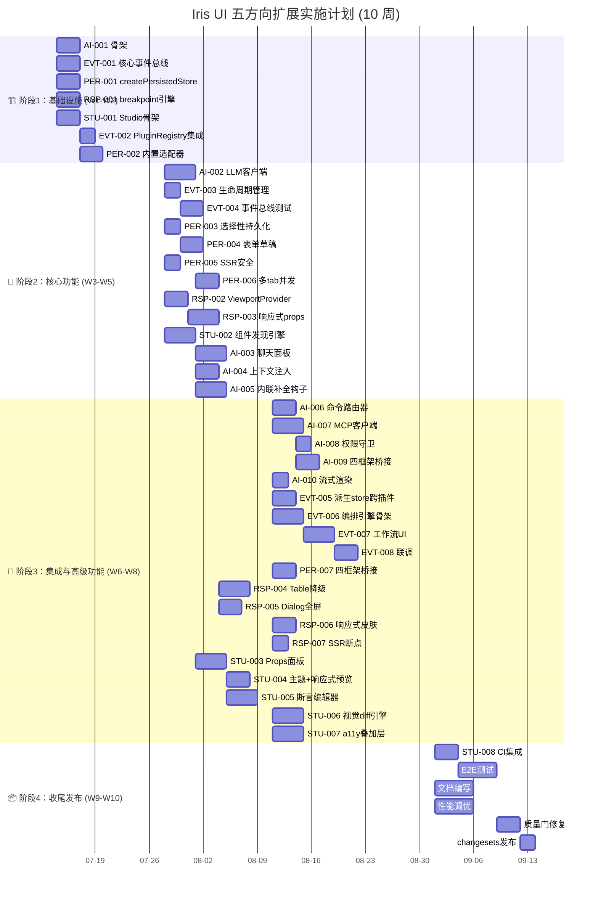

现在我已掌握充分的项目背景信息。以下是我的 Tech Lead 分析报告。

---

# Tech Lead 分析报告：五方向扩展计划

**分析日期**：2026-07-12 · **负责 Tech Lead**：基于 `2026-07-11-senior-architect-five-genuine-codebase-extensions.md`

---

## 1. 任务分解

基于五个方向，我将它们拆解为 **29 个可执行任务**，每个 2–4 小时工时。任务按方向分组，使用统一 ID 体系。

### 1.1 方向 ①：`plugin-ai`（P0）

| 任务 ID | 标题                                                                                  | 涉及文件                                                                                                                                        | 前置依赖          | 工时 |
| ------- | ------------------------------------------------------------------------------------- | ----------------------------------------------------------------------------------------------------------------------------------------------- | ----------------- | ---- |
| AI-001  | 插件骨架：`plugin-ai` 包结构 + `createPlugin`                                         | `packages/plugin-ai/package.json`, `packages/plugin-ai/src/core/index.ts`, `packages/plugin-ai/src/react/index.tsx`, 类似 vue/solid/svelte 入口 | 无                | 3h   |
| AI-002  | LLM 客户端抽象层：`createLlmClient`（Anthropic + OpenAI + 本地模型适配器）            | `packages/plugin-ai/src/core/llm-client.ts`                                                                                                     | AI-001            | 4h   |
| AI-003  | AI 聊天面板 UI 组件 `IrisAiChat`                                                      | `packages/plugin-ai/src/{react,vue,...}/components/ai-chat.tsx`                                                                                 | AI-002            | 4h   |
| AI-004  | 上下文注入系统：页面/组件/表单状态 → LLM 消息                                         | `packages/plugin-ai/src/core/context-injector.ts`                                                                                               | AI-001            | 3h   |
| AI-005  | 内联补全钩子：`useAiCompletion(hint)`, `useAiFill(form, prompt)`, `useAiExplain(row)` | `packages/plugin-ai/src/{react,...}/hooks/use-ai-completion.ts`                                                                                 | AI-002            | 4h   |
| AI-006  | AI → 命令路由器：自然语言 → fuzzyPlanner → 执行 → 反馈流                              | `packages/plugin-ai/src/core/command-router.ts`                                                                                                 | AI-002 + 命令系统 | 3h   |
| AI-007  | MCP 客户端插件：消费外部 MCP server                                                   | `packages/plugin-ai/src/core/mcp-client.ts`                                                                                                     | AI-002            | 4h   |
| AI-008  | 权限守卫集成（复用 desktop OS 的 permissions.ts 模式）                                | `packages/plugin-ai/src/core/permissions.ts`                                                                                                    | AI-006            | 2h   |
| AI-009  | plugin-ai 四框架适配器桥接                                                            | `packages/plugin-ai/src/{vue,solid,svelte}/`                                                                                                    | AI-003, AI-005    | 3h   |
| AI-010  | 流式 Markdown/Code 渲染（复用 plugin-markdown）                                       | `packages/plugin-ai/src/core/stream-renderer.ts`                                                                                                | AI-003            | 2h   |

### 1.2 方向 ②：事件总线 + 编排系统（P0）

| 任务 ID | 标题                                                                 | 涉及文件                                               | 前置依赖         | 工时 |
| ------- | -------------------------------------------------------------------- | ------------------------------------------------------ | ---------------- | ---- |
| EVT-001 | 核心事件总线：`createEventBus<TypedEvents>()`（类型安全，框架无关）  | `packages/core/src/event-bus.ts`                       | 无               | 3h   |
| EVT-002 | PluginRegistry 集成：`registerEventBus()` / `registerEventHandler()` | `packages/core/src/plugin.ts`                          | EVT-001          | 2h   |
| EVT-003 | 生命周期管理：插件 unmount 时自动解绑事件订阅                        | `packages/core/src/plugin.ts`                          | EVT-002          | 2h   |
| EVT-004 | 事件总线测试 + 类型增强（`declare module` 模式）                     | `packages/core/src/event-bus.test.ts`                  | EVT-001          | 3h   |
| EVT-005 | 派生 store 跨插件支持：`derived()` 可消费插件 registerStore          | `packages/core/src/store.ts`                           | EVT-002          | 3h   |
| EVT-006 | 编排引擎骨架：`createWorkflowEngine`（条件→动作 DSL）                | `packages/plugin-workflow/src/core/engine.ts`          | EVT-001          | 4h   |
| EVT-007 | 编排引擎 UI：工作流可视化编辑器                                      | `packages/plugin-workflow/src/{react,...}/components/` | EVT-006          | 4h   |
| EVT-008 | 联调：事件总线 + 编排 + AI 插件事件感知                              | `packages/plugin-workflow/test/integration/`           | EVT-006 + AI-003 | 3h   |

### 1.3 方向 ③：持久化层（P1）

| 任务 ID | 标题                                                                   | 涉及文件                                                     | 前置依赖           | 工时 |
| ------- | ---------------------------------------------------------------------- | ------------------------------------------------------------ | ------------------ | ---- |
| PER-001 | `createPersistedStore(key, initial, adapter?)` 核心                    | `packages/core/src/persist.ts`                               | 无                 | 3h   |
| PER-002 | 内置适配器（localStorage, sessionStorage, IndexedDB, URLSearchParams） | `packages/core/src/persist-adapters.ts`                      | PER-001            | 3h   |
| PER-003 | 选择性持久化 + 冲突策略                                                | `packages/core/src/persist.ts`                               | PER-001            | 2h   |
| PER-004 | 表单草稿自动持久化（`formStore` 集成）                                 | `packages/core/src/form.ts`                                  | PER-001 + 表单系统 | 3h   |
| PER-005 | SSR 安全层 + 序列化修复（Date/RegExp/Map/Set）                         | `packages/core/src/persist.ts`                               | PER-001            | 2h   |
| PER-006 | 多 tab 并发处理（版本戳 / BroadcastChannel）                           | `packages/core/src/persist.ts`                               | PER-001            | 3h   |
| PER-007 | 持久化层四框架桥接 + 测试                                              | `packages/{react,vue,solid,svelte}/src/usePersistedStore.ts` | PER-001            | 3h   |

### 1.4 方向 ④：响应式断点系统（P1）

| 任务 ID | 标题                                                                  | 涉及文件                                                 | 前置依赖 | 工时 |
| ------- | --------------------------------------------------------------------- | -------------------------------------------------------- | -------- | ---- |
| RSP-001 | `createBreakpointEngine`（断点定义 + matchMedia 匹配 + pub/sub）      | `packages/core/src/breakpoint.ts`                        | 无       | 3h   |
| RSP-002 | `IrisViewportProvider` + `useBreakpoint()` 桥                         | `packages/{react,...}/src/breakpoint-provider.tsx`       | RSP-001  | 3h   |
| RSP-003 | 组件响应式 props 语境：`<Grid columns={{ base:1, md:3, lg:4 }}>`      | `packages/core/src/breakpoint-props.ts`                  | RSP-001  | 4h   |
| RSP-004 | Table 响应式降级：`responsive: 'collapse' \| 'card' \| 'scroll-hint'` | `packages/core/src/data-view.ts` + 各适配器 Table 组件   | RSP-003  | 4h   |
| RSP-005 | Drawer/Dialog 移动端全屏：`fullscreenOnMobile`                        | `packages/core/src/floating.ts` + 各适配器 Dialog/Drawer | RSP-003  | 3h   |
| RSP-006 | 响应式皮肤：小屏增大 touch targets、调整间距                          | `packages/skins/src/responsive.ts`                       | RSP-001  | 3h   |
| RSP-007 | SSR 断点默认值 + hydrate 修正层                                       | `packages/core/src/breakpoint.ts`                        | RSP-001  | 2h   |

### 1.5 方向 ⑤：`plugin-studio` / `@iris-ui/testing`（P2）

| 任务 ID | 标题                                                  | 涉及文件                                                                          | 前置依赖           | 工时 |
| ------- | ----------------------------------------------------- | --------------------------------------------------------------------------------- | ------------------ | ---- |
| STU-001 | Studio 插件骨架（React 主导框架）                     | `packages/plugin-studio/package.json`, `packages/plugin-studio/src/{core,react}/` | 无                 | 3h   |
| STU-002 | 组件自动发现引擎（消费 manifest + JSON schema 反射）  | `packages/plugin-studio/src/core/discovery.ts`                                    | STU-001            | 4h   |
| STU-003 | Props 面板 + 状态切换（loading/disabled/error/empty） | `packages/plugin-studio/src/react/components/props-panel.tsx`                     | STU-002            | 4h   |
| STU-004 | 主题/皮肤切换 + 响应式预览                            | `packages/plugin-studio/src/react/components/theme-toolbar.tsx`                   | STU-003 + RSP-002  | 3h   |
| STU-005 | 可视化断言编辑器（拖拽生成 ContractScenario）         | `packages/plugin-studio/src/react/components/assertion-editor.tsx`                | STU-003 + 合约系统 | 4h   |
| STU-006 | `@iris-ui/testing` 包：视觉 diff 引擎 + baseline 管理 | `packages/testing/src/visual-diff.ts`                                             | STU-001            | 4h   |
| STU-007 | a11y 可视化叠加层插件（ARIA 标注，焦点路径，对比度）  | `packages/plugin-audit/src/`                                                      | STU-001            | 4h   |
| STU-008 | CI 集成：视觉回归 gate（每个合约场景→截图→diff）      | `packages/testing/src/ci-runner.ts`                                               | STU-006            | 3h   |

---

## 2. 执行顺序

### 2.1 依赖图（总览）

```mermaid
graph TB
    %% ===== 方向 ① AI =====
    subgraph AI["① plugin-ai (P0)"]
        AI001[AI-001 骨架] --> AI002[AI-002 LLM客户端]
        AI002 --> AI003[AI-003 聊天面板]
        AI002 --> AI005[AI-005 内联补全钩子]
        AI001 --> AI004[AI-004 上下文注入]
        AI002 --> AI006[AI-006 命令路由器]
        AI006 --> AI008[AI-008 权限守卫]
        AI002 --> AI007[AI-007 MCP客户端]
        AI003 --> AI009[AI-009 四框架桥接]
        AI005 --> AI009
        AI003 --> AI010[AI-010 流式渲染]
    end

    %% ===== 方向 ② 事件总线 =====
    subgraph EVT["② 事件总线+编排 (P0)"]
        EVT001[EVT-001 核心事件总线] --> EVT002[EVT-002 PluginRegistry集成]
        EVT002 --> EVT003[EVT-003 生命周期管理]
        EVT001 --> EVT004[EVT-004 类型安全+测试]
        EVT002 --> EVT005[EVT-005 派生store跨插件]
        EVT001 --> EVT006[EVT-006 编排引擎]
        EVT006 --> EVT007[EVT-007 工作流编辑器UI]
        EVT007 --> EVT008[EVT-008 联调]
    end

    %% ===== 方向 ③ 持久化 =====
    subgraph PER["③ 持久化层 (P1)"]
        PER001[PER-001 createPersistedStore] --> PER002[PER-002 内置适配器]
        PER001 --> PER003[PER-003 选择性持久化]
        PER001 --> PER005[PER-005 SSR安全]
        PER001 --> PER006[PER-006 多tab并发]
        PER001 --> PER004[PER-004 表单草稿集成]
        PER001 --> PER007[PER-007 四框架桥接]
    end

    %% ===== 方向 ④ 响应式 =====
    subgraph RSP["④ 响应式系统 (P1)"]
        RSP001[RSP-001 createBreakpointEngine] --> RSP002[RSP-002 ViewportProvider]
        RSP001 --> RSP003[RSP-003 响应式props]
        RSP003 --> RSP004[RSP-004 Table降级]
        RSP003 --> RSP005[RSP-005 Dialog全屏]
        RSP001 --> RSP006[RSP-006 响应式皮肤]
        RSP001 --> RSP007[RSP-007 SSR断点]
    end

    %% ===== 方向 ⑤ Studio =====
    subgraph STU["⑤ plugin-studio/testing (P2)"]
        STU001[STU-001 骨架] --> STU002[STU-002 组件发现]
        STU002 --> STU003[STU-003 Props面板]
        STU003 --> STU004[STU-004 主题+响应式预览]
        STU003 --> STU005[STU-005 断言编辑器]
        STU001 --> STU006[STU-006 视觉diff引擎]
        STU006 --> STU008[STU-008 CI集成]
        STU001 --> STU007[STU-007 a11y叠加层]
    end

    %% ===== 阶段边界 =====
    EVT002 -.->|基石：插件增强| AI001
    EVT001 -.->|AI插件订阅事件| AI003
    PER001 -.->|持久化可能消费事件做自动保存| EVT001
    RSP002 -.->|Studio需要断点引擎| STU004
```



### 2.2 可并行执行的任务组

| 并行组              | 任务                                                                                                                                   | 负责人要求                  |
| ------------------- | -------------------------------------------------------------------------------------------------------------------------------------- | --------------------------- |
| **组 A**（阶段 1）  | AI-001, EVT-001, PER-001, RSP-001, STU-001                                                                                             | 5 人各自独立，都是骨架/核心 |
| **组 B**（阶段 2a） | AI-002, EVT-002, PER-002, RSP-002, STU-002                                                                                             | 依赖组 A                    |
| **组 C**（阶段 2b） | AI-003+AI-004+AI-005, EVT-003+EVT-004+EVT-005, PER-003+PER-004+PER-005+PER-006, RSP-003, STU-003                                       | 各方向继续                  |
| **组 D**（阶段 3）  | AI-006+AI-007+AI-008+AI-009+AI-010, EVT-006+EVT-007+EVT-008, PER-007, RSP-004+RSP-005+RSP-006+RSP-007, STU-004+STU-005+STU-006+STU-007 | 集成+补全                   |
| **组 E**（阶段 4）  | STU-008, 端到端测试, 文档, 发布                                                                                                        | 串行收尾                    |

### 2.3 推荐执行阶段

```
阶段1（W1-W2）: 骨架 + 核心原语（组 A + 部分组 B）
                 AI-001, EVT-001, EVT-002, PER-001, RSP-001, STU-001
                 并行度: 5人同时推进

阶段2（W3-W5）: 功能实现（组 B/C）
                 AI-002→AI-005, EVT-003→EVT-005, PER-002→PER-006,
                 RSP-002→RSP-003, STU-002→STU-003
                 注意: AI-002 是 AI 方向的阻塞点

阶段3（W6-W8）: 集成 + 高级功能（组 D）
                 AI-006→AI-010, EVT-006→EVT-008, PER-007,
                 RSP-004→RSP-007, STU-004→STU-007

阶段4（W9-W10）: 收尾 + 发布（组 E）
                 STU-008, E2E, 文档, changesets 发布
```

---

## 3. 技术风险

### 3.1 高优先级风险

| #   | 风险                                                                                                                                          | 方向 | 影响   | 概率 | 缓解策略                                                                                                                                                                                                                             |
| --- | --------------------------------------------------------------------------------------------------------------------------------------------- | ---- | ------ | ---- | ------------------------------------------------------------------------------------------------------------------------------------------------------------------------------------------------------------------------------------ |
| R1  | **LLM 流式渲染与框架反应式系统冲突** — stream token 逐段推入 store，React/Vue/Solid/Svelte 四端 update 语义不同，可能导致不必要的重渲染或闪烁 | ①    | High   | 中   | 采用 `requestAnimationFrame` 节流 + 批量追加策略，每个适配器单独测试渲染性能。`stream-renderer.ts` 只在 core 层生产 markdown AST，渲染归适配器                                                                                       |
| R2  | **事件总线类型安全跨插件声明不可推导** — 插件 A 定义的事件，插件 B 消费时 TypeScript 无法自动发现（`declare module` 增强对跨包场景脆弱）      | ②    | High   | 高   | 采用显式事件合约：`type AppEvents = { 'table:row-updated': { rowId: string } }` 作为泛型参数传入，API 用 `bus.on<'table:row-updated'>('table:row-updated', handler)` 而非字符串魔法。或提供 `createEventContract()` 工厂生成两端绑定 |
| R3  | **`plugin-ai` 的 LLM SDK 依赖膨胀** — 内置 Anthropic/OpenAI/本地模型三个适配器，每个 ~50KB min，合计 ~150KB，超过预算                         | ①    | Medium | 中   | 将模型适配器设为**可选子路径**（`@iris-ui/plugin-ai/anthropic`），核心只保留抽象层；或用动态 import + lazy registration（`registerLazyStore` 已有）                                                                                  |
| R4  | **断点系统 SSR hydration 不匹配** — 服务端渲染发送默认 `md`，客户端 hydrate 时修正为实际断点，导致布局跳闪（FOUC）                            | ④    | Medium | 高   | 提供 `defaultBreakpoint` prop 和 `suppressHydrationWarning`；以及 `matchMedia('(min-width:…')` 的 inline script 注入方式（类似 skinBootScript 模式）在 FOUC 防闪                                                                     |
| R5  | **视觉 diff CI 不可靠** — 不同 OS/GPU/字体渲染差异导致误报                                                                                    | ⑤    | Medium | 高   | 使用 Docker 统一渲染环境（`puppeteer` + `--font-render-hinting=none`），首次 baseline 在 CI 生成；阈值可配置；对已知浮动区域（动画、光标）使用 mask                                                                                  |
| R6  | **多 tab 持久化并发覆盖** — localStorage 写冲突导致数据丢失                                                                                   | ③    | Medium | 中   | 版本戳（每次写递增 v1→v2）+ `BroadcastChannel` 同步；IndexedDB 模式用事务；URLSearchParams 无此问题                                                                                                                                  |
| R7  | **编排引擎 DSL 设计过重** — 工作流引擎容易滑向 n8n 级别的复杂度                                                                               | ②    | Low    | 中   | 严格限定 in/out：`events → conditions → actions` 三元组，不支持循环/子流程/等待。用 YAML DSL + 可视化编辑，不做拖拽式 node graph 的 v1                                                                                               |

### 3.2 外部依赖

| 依赖                        | 方向 | 性质                     | 替代方案                     |
| --------------------------- | ---- | ------------------------ | ---------------------------- |
| `@anthropic-ai/sdk`         | ①    | 可选（Anthropic 适配器） | 用户自己注入 ModelCall       |
| `openai`                    | ①    | 可选（OpenAI 适配器）    | 同上                         |
| `pixelmatch` / `resemblejs` | ⑤    | 必需（视觉 diff）        | 自实现但无必要               |
| `puppeteer` / `playwright`  | ⑤    | 必需（截图测试）         | 二选一，推荐 playwright      |
| `BroadcastChannel` API      | ③    | 浏览器 API（可选降级）   | 不存在时静默降级为无并发保护 |

### 3.3 性能瓶颈

| 瓶颈                  | 方向 | 分析                                          | 优化策略                                                |
| --------------------- | ---- | --------------------------------------------- | ------------------------------------------------------- |
| AI 流式渲染           | ①    | 每收到一个 token 就 setState 导致 N 次重渲染  | 累积 buffer（80ms 或 10 tokens 间隔），批量 flush       |
| 多组件监听 matchMedia | ④    | 每个组件独立 `window.matchMedia` 监听         | 单一监听器 + pub/sub（`createBreakpointEngine` 已设计） |
| visual diff 基线膨胀  | ⑤    | 149 组件 × 4 状态 × 4 框架 ≈ 2384 baseline 图 | 默认只跑 React（manifest source），其他框架按增量 diff  |
| 编排引擎事件风暴      | ②    | 高频事件（如 `table:scroll`）触发规则链       | 事件节流（`leading`/`trailing` 配置）+ 规则防重入检测   |

### 3.4 测试覆盖难点

| 难点             | 方向 | 说明                             | 策略                                                                               |
| ---------------- | ---- | -------------------------------- | ---------------------------------------------------------------------------------- |
| LLM 流式渲染测试 | ①    | 无法在 jsdom 中模拟 SSE 流       | 用 mock Response + `ReadableStream` 模拟 SSE chunk；只测渲染器的 wiring 和节流逻辑 |
| 事件总线时序测试 | ②    | handler 顺序、异步事件、循环检测 | 纯逻辑测试已在 core 层（无框架依赖），用 `vi.useFakeTimers` 控制时序               |
| 视觉 diff 测试   | ⑤    | 需要完整渲染和截图               | 使用 `@iris-ui/testing` 的 `screenshotScenario()` — 仅在 CI 中运行，不做单元测试   |
| 持久化并发测试   | ③    | 多 tab 场景在 jsdom 不可模拟     | 用 `BroadcastChannel` mock + 版本戳逻辑即可，不需要真多 tab                        |
| 断点 SSR 测试    | ④    | 两环境不一致                     | `// @vitest-environment node` 测试 server 输出，`jsdom` 测试 client hydrate        |

---

## 4. 资源评估

### 4.1 推荐的团队结构

| 角色               | 所需人数 | 核心技能                                | 分配方向                                                                     |
| ------------------ | -------- | --------------------------------------- | ---------------------------------------------------------------------------- |
| **核心引擎工程师** | 2        | TypeScript, 状态管理, 事件系统          | 方向 ②（事件总线）+ 方向 ③（持久化）+ 方向 ④（断点引擎）— 这三个共享 core 层 |
| **AI 插件工程师**  | 1–2      | LLM API, 流式处理, React/Vue 组件开发   | 方向 ①（完整负责 `plugin-ai`）                                               |
| **UI/组件工程师**  | 1        | CSS, 响应式设计, Table/Grid/Dialog 组件 | 方向 ④（响应式 props + 组件适配）                                            |
| **工具链工程师**   | 1        | Playwright, 视觉 diff, CI/CD, a11y      | 方向 ⑤（Studio + testing 包）                                                |
| **Tech Lead (兼)** | 1        | 系统架构, 跨团队协调                    | 总协调 + 代码审查 + 发布管理                                                 |

**最小可行团队**：3 人（1 core + 1 AI + 1 UI/Tools）
**理想团队**：5 人

### 4.2 关键里程碑

```
M0 (Day 0): 启动会 + 各任务认领 + 分支策略确定
M1 (Week 2): 核心骨架合并（AI/EVT/PER/RSP/STU 的 package.json + 基础类型）
              → 可验证：`pnpm build` 全部通过，无类型错误
M2 (Week 5): 方向 ①+② MVP → plugin-ai 可嵌入聊天 + 事件总线可用
              → 可验证：一个 demo 页面同时使用 plugin-ai 和 plugin-notifications 通过事件通信
M3 (Week 7): 方向 ③+④ MVP → createPersistedStore + 断点引擎可用
              → 可验证：表单刷新生恢复 + Grid 响应式 columns 工作
M4 (Week 8): 方向 ⑤ alpha → Studio 可浏览所有 React 组件
              → 可验证：manifest 中 149 组件全部展示，props 面板可编辑
M5 (Week 10): 全部方向 beta → 四框架兼容 + CI 质量门通过 + 文档发布
```

### 4.3 阻塞点（Blockers）

| Blocker | 影响方向 | 描述                                                            | 解决策略                                                                                                                                       |
| ------- | -------- | --------------------------------------------------------------- | ---------------------------------------------------------------------------------------------------------------------------------------------- |
| B1      | ①        | plugin-ai 的 LLM SDK API key 管理 — 不应该硬编码在插件中        | 采用「配置注入」模式：`<IrisProvider plugins={[aiPlugin]} ai={{ provider:'openai', apiKey: envVar }}>`，不在源码存储 key                       |
| B2      | ②        | 事件总线「插件 A → 插件 B」的类型安全在生产包中不可推导         | 方案：导出 `EventContracts` 接口 + 每个插件在 `declare module '@iris-ui/core'` 中增强；不完美但有 escape hatch                                 |
| B3      | ⑤        | Studio 的 prop 类型反射需要运行时类型信息（TypeScript 不保留）  | 方案：manifest 已生成 JSON，扩展它包含每个组件的 `props` schema（通过 TypeScript compiler API 在 `gen:manifest` 阶段提取 JSDoc → JSON Schema） |
| B4      | ①④⑤      | 方向 ①④⑤ 都需要大量组件级改动（responsive props 影响 150 组件） | 采取「分层推进」：核心引擎先合并，组件适配只在 2–3 个代表性组件验证（Grid, Table, Dialog），剩余组件作为后续迭代                               |

---

## 5. 质量保证

### 5.1 单元测试覆盖要求

| 层次                     | 覆盖率目标  | 关键测试点                                                                                    |
| ------------------------ | ----------- | --------------------------------------------------------------------------------------------- |
| **core 层**（新代码）    | ≥95% branch | 事件总线 emit/on/off/once/优先级；persist 序列化/反序列化/冲突合并；breakpoint 匹配/订阅/清理 |
| **plugin-ai core**       | ≥90% branch | LLM client 重试/超时/流式 mock；context-injector 裁剪/摘要逻辑；permissions 守卫              |
| **plugin-workflow core** | ≥90% branch | DSL 解析；条件求值；防重入；teardown 解绑                                                     |
| **适配器层**（四框架）   | ≥80% line   | 渲染测试（无框架特定错误）；hook wiring（useAiCompletion 等）；SSR 安全测试                   |

### 5.2 集成测试策略

| 测试场景                 | 覆盖方向 | 工具                             | 说明                                                               |
| ------------------------ | -------- | -------------------------------- | ------------------------------------------------------------------ |
| **AI 聊天 + 命令执行**   | ①+②      | Vitest + jsdom                   | 模拟 LLM 响应 → 验证命令被正确路由和执行                           |
| **事件 → 编排 → 持久化** | ②+③      | Vitest + jsdom                   | emit 事件 → 编排引擎触发 → 自动持久化 store                        |
| **响应式 Table 降级**    | ④        | Vitest + jsdom + mock matchMedia | 分别 mock xs/md/lg 断点 → 验证 Table 渲染不同布局                  |
| **四框架行为一致性**     | ①~⑤      | `@iris-ui/core/contracts`        | 扩展合约系统覆盖 AI/事件/持久化场景，四框架各驱动一次              |
| **Studio 端到端**        | ⑤        | Playwright                       | 启动 Studio → 导航到 Tree 组件 → 切换 disabled 状态 → 验证视觉输出 |

### 5.3 代码审查检查清单

| 检查项                 | 方向 | 说明                                                                               |
| ---------------------- | ---- | ---------------------------------------------------------------------------------- |
| **core 引入框架代码**  | 所有 | `grep -rE "from '(react\|vue\|solid\|svelte)'" packages/core/src` 必须为空         |
| **事件总线泄漏**       | ②    | 每个 `on()` 在 unmount 时对应 `off()`；使用 `onTeardown` 注册                      |
| **LLM 流场景下的内存** | ①    | 长对话是否导致内存增长？`useAiChat` 是否提供 `maxHistory` 裁剪                     |
| **持久化序列化安全**   | ③    | JSON.stringify 不能处理 Date/Map/Set/undefined；是否全部覆盖                       |
| **断点 SSR 安全**      | ④    | `typeof window === 'undefined'` guard 或 `fallback` prop                           |
| **Studio 框架耦合**    | ⑤    | Studio 本身不应破坏其他框架 — 必须作为独立子路径（`@iris-ui/plugin-studio/react`） |
| **Bundle 预算**        | 所有 | 新增包在 `pnpm size` 中注册预算；`plugin-ai` core ≤15KB, 总包 ≤50KB                |

### 5.4 性能测试需求

| 测试                 | 方向 | 方法                                                   | 临界值                   |
| -------------------- | ---- | ------------------------------------------------------ | ------------------------ |
| AI 流式渲染帧率      | ①    | `requestAnimationFrame` 打点，测量 token 到 DOM 的延迟 | ≤16ms per flush（60fps） |
| 事件总线吞吐         | ②    | 1s 内 emit 10,000 个事件并测量所有 handler 完成时间    | ≤100ms for 10k emits     |
| 持久化 debounce 延迟 | ③    | 从 setState 到 storage write 的延迟                    | ≤300ms（用户无感知）     |
| 断点切换耗时         | ④    | 从 matchMedia 触发到最后一个 subscriber 执行           | ≤50ms                    |
| Studio 首屏加载      | ⑤    | Playwright 测量加载 149 组件 manifest                  | ≤3s                      |

---

## 6. 实施计划（详细甘特图）



### 6.1 里程碑总结

| 里程碑           | 时间     | 交付物                                                                        |
| ---------------- | -------- | ----------------------------------------------------------------------------- |
| **M1: 骨架合并** | W2 结束  | 5 个包全部注册、build 通过、类型定义就绪                                      |
| **M2: ①+② MVP**  | W5 结束  | AI 聊天面板可嵌入任意 IrisProvider；事件总线通过所有单元测试                  |
| **M3: ③+④ MVP**  | W7 结束  | `createPersistedStore` 在 playground 中可用；Grid 和 Table 支持响应式 columns |
| **M4: ⑤ alpha**  | W8 结束  | Studio 展示 149 组件，props 面板可交互                                        |
| **M5: 发布候选** | W10 结束 | 所有方向通过测试/typecheck/lint/size；文档发布；changesets 准备就绪           |

### 6.2 风险管理计划

```
R1 (LLM 流渲染)  →  在 M2 前完成 protoype 验证渲染方案，封锁点：W4
R2 (事件类型安全) →  在 EVT-001 中直接落地显式合约模式，不做 declare module
R3 (SDK 膨胀)     →  子路径分离在 AI-001 阶段就设计好，不后置
R4 (SSR 断点)     →  RSP-007 提前到 W3 做，早验证
R5 (视觉 diff)    →  STU-006 中用 Docker 统一环境 + CI 首先生成 baseline
```

### 6.3 发布策略

```
plugin-ai          → v0.1.0 (alpha) @ M2, v0.2.0 (beta) @ M3, v1.0.0 @ M5
事件总线（core）     → core v0.6.0 (minor) @ M2
plugin-workflow    → v0.1.0 (alpha) @ M4, v1.0.0 @ M5
持久化层（core）    → core v0.7.0 (minor) @ M3
响应式引擎（core）  → core v0.8.0 (minor) @ M3
plugin-studio      → v0.1.0 (alpha) @ M4
@iris-ui/testing   → v0.1.0 (alpha) @ M4

⚠ 注意：core 的 breaking change 风险低（新增 API，不改现有），可做 minor bump。
   插件包按独立 semver 发布，不做同步发布。
```

---

## 总结：对分析的补充建议

阅读该分析文档后，我有以下几点补充意见，供架构师/PM 参考：

1. **① plugin-ai 与 ② 事件总线的顺序可以交换**：实际上事件总线（EVT-001/002）没有外部依赖，是所有方向的基石——建议**先做 EVT-001 再做 AI-001**。AI 插件订阅「`table:rows-changed`」「`editor:save`」等事件是核心体验，没有事件总线时 AI 插件只能轮询。

2. **③ 持久化层的 `urlSearchParamsAdapter` 有最高速 ROI**：URL 同步是零后端成本的功能，仅需 ~50 行 adapter 代码。建议将其作为 PER-001 的「先导验证用例」，同时也便于前端调试。

3. **④ 响应式系统不要追求一次性覆盖所有组件**：原文档正确指出「从 Table/Grid/Dialog 开始」。我建议再增加一个 **`AdminLayout` 的 breakpoint-aware sidebar collapse**——这个在 CMS demo 中感知最强，也是用户最容易看到「响应式生效了」的组件。

4. **⑤ Studio 建议优先只做 React**：manifest 的 props 是从 React 组件提取的；Vue/Solid/Svelte 的 prop 类型可能不同。初期仅 React 即可覆盖 80% 用例，四框架 Studio 可后续迭代。

5. **一个缺失的交叉考虑**：方向 ② 的事件总线 + 方向 ⑤ 的 Studio 可以组合出一个**低配版内部开发者工具**——在 Studio 中显示实时事件流（类似浏览器 DevTools 的 Event Listener 面板）。这是一个低成本高感知功能，建议在 STU-003 后花额外 1 天实现。
