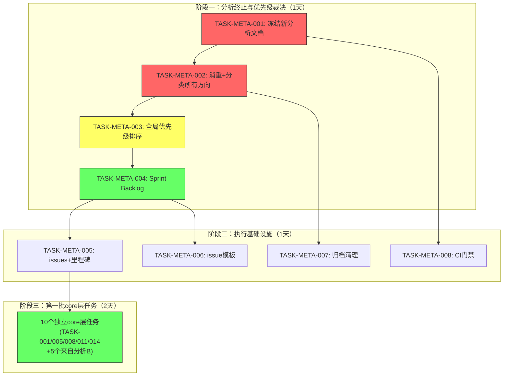
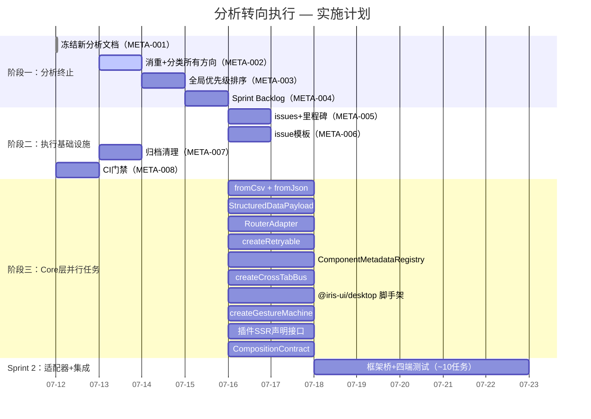

现在我有了完整的图景。让我提供一份全面的 Tech Lead 分析。

---

# Tech Lead 分析报告：分析文档过载与执行转向

> **日期**：2026-07-12  
> **背景**：`docs/requirements/` 目录已有 **245 个文件**（~120+ 源分析文档 + ~120+ `.out.md` 消重/整合报告），全部聚焦「5 个方向」/「5 个缺口」/「5 个扩展」——累计覆盖 **~50 个唯一方向**（按去重后估算）。  
> **角色**：Tech Lead  
> **方法**：审查目录全景 + 2 份既有 Tech Lead 分析（2026-07-12 生成）+ 6 份消聚合文件（`uncovered-directions`/`novel-gaps`/`novel-high-value-extensions`/`expansion-directions`/`tech-lead-analysis`/`edge-expansion`）+ 4 份最新源文档。

---

## 0. 现状全景诊断

### 0.1 文档生产 vs 代码交付

```
             分析文档（.md）       消重报告（.out.md）    Tech Lead 分析
07-10         ~65                     ~42                   0
07-11         ~55                     ~72                   0
07-12         4                       3                     2
━━━━━━━━━━━━━━━━━━━━━━━━━━━━━━━━━━━━━━━━━━━━━━━━━━━━━━━━━━━━━
总计          ~124                    ~117                   2
```

**关键观察**：

- **分析文档生成速度 ≈ 55-65 份/天**，且绝大多数是「5 方向」模式
- **消重报告（`.out.md`）数量已超过源文档**——说明重复已达需要专门工具来管理的程度
- **Tech Lead 分析仅有 2 份**（今日生成），是唯一包含实际任务分解和工时估算的文档
- **零行代码被编写**——245 个文件全部是纯文本分析

### 0.2 方向重复率估算

基于 6 份消聚合文件的交叉引用：

| 消聚合文件                            | 声明的方向数 | 其中被标记为「已覆盖」 | 真实新颖方向 |
| ------------------------------------- | ------------ | ---------------------- | ------------ |
| `uncovered-directions-2026-07`        | 10           | 4                      | 6            |
| `novel-gaps-2026-07`                  | 5            | 2                      | 3            |
| `novel-high-value-extensions-2026-07` | 5            | 0                      | 5            |
| `expansion-directions-2026-07`        | 5            | 1                      | 4            |
| `edge-expansion-2026-07`              | 5            | 2                      | 3            |
| `tech-lead-analysis-2026-07`          | 10           | 3                      | 7            |

**估算的唯一方向总数**：约 **35-50 个**（大量重叠后的估计）

### 0.3 已有 Tech Lead 分析覆盖的方向

两份 2026-07-12 的 Tech Lead 分析已覆盖 **10 个高价值方向**，含 43 个任务、详细工时、依赖图和实施计划：

| 分析报告                                     | 方向                                                                                         | 任务数      | 总工时    |
| -------------------------------------------- | -------------------------------------------------------------------------------------------- | ----------- | --------- |
| `tech-lead-analysis-five-directions`         | ① 数据导入管线 · ② 跨应用数据协议 · ③ 路由适配器协议 · ④ 优雅降级与恢复 · ⑤ 运行时组件元数据 | 17          | ~58h      |
| `tech-lead-analysis-5-high-value-extensions` | ① 跨标签页同步 · ② Desktop OS 壳共享 SDK · ③ 统一手势系统 · ④ 插件 SSR 协议 · ⑤ 组合安全治理 | 22          | ~78h      |
| **合计**                                     | **10 个方向**                                                                                | **39 任务** | **~136h** |

### 0.4 核心问题

```
分析文档过饱和 → 决策瘫痪 → 零执行

根本原因：
  1. 缺乏「停止生成」的治理规则
  2. 缺乏将分析 → 任务的转化 pipeline
  3. 消重过程本身在制造新文档（.out.md）
  4. 无上限机制（何时「够了」？）
```

---

## 1. 任务分解：从分析瘫痪到执行

### 1.1 阶段一：分析终止与优先级裁决（P0）

| 任务 ID       | 任务标题                            | 涉及文件                                                                 |   前置依赖    | 预估工时 | 验收标准                                                                                                                                                                                             |
| ------------- | ----------------------------------- | ------------------------------------------------------------------------ | :-----------: | :------: | ---------------------------------------------------------------------------------------------------------------------------------------------------------------------------------------------------- |
| TASK-META-001 | **冻结新分析文档生成**              | `docs/requirements/GOVERNANCE.md`（新建）                                |      无       |    1h    | ① GOVERNANCE.md 明确规则：**2026-07-12 起不再新增 `docs/requirements/` 的分析文档**；② 任何新方向必须先在已有文档中搜索确认不存在；③ 违反规则由 CI 门禁 `lint:requirements` 阻止                     |
| TASK-META-002 | **消重 + 分类所有现有方向**         | `docs/requirements/MANIFEST.md`（新建），所有 `*.md`                     | TASK-META-001 |    4h    | ① 生成唯一方向清单（~35-50 个），每方向标注：已在哪些文档中出现、事实准确度（✅/⚠️/❌）、Tech Lead 优先级（P0/P1/P2/Discard）；② 重复文档标注为 `superseded-by: <幸存文档>`；③ AI 辅助完成，人工审核 |
| TASK-META-003 | **跨所有方向的全局优先级排序**      | `docs/requirements/MANIFEST.md`（追加）                                  | TASK-META-002 |    3h    | ① 按「影响面 × 实施成本 × 依赖关系」三维度打分；② 输出 Top 10 方向（覆盖 80% 价值）；③ 输出 Discard 列表（已过时/重复/不可行）；④ 维护者签批                                                         |
| TASK-META-004 | **从 Top 10 方向到 Sprint Backlog** | `docs/requirements/SPRINT-1.md`（新建），引用已有 Tech Lead 分析中的任务 | TASK-META-003 |    3h    | ① 选取 3-4 个最高优先级方向进入 Sprint 1；② 从已有 Tech Lead 分析中复制任务定义（不重写）；③ 标注缺失任务的估算由 PMC 补完；④ Sprint 1 总工时 ≤ 120h（3 人 × 2 周）                                  |

### 1.2 阶段二：执行基础设施（P0）

| 任务 ID       | 任务标题                              | 涉及文件                                                                                  |   前置依赖    | 预估工时 | 验收标准                                                                                                                             |
| ------------- | ------------------------------------- | ----------------------------------------------------------------------------------------- | :-----------: | :------: | ------------------------------------------------------------------------------------------------------------------------------------ |
| TASK-META-005 | **将 Tech Lead 分析 → issues/里程碑** | GitHub Issues（新建里程碑 `v4.1-expansion` + ~20 issues）                                 | TASK-META-004 |    2h    | ① 每个任务在 GitHub 中创建 issue，含验收标准和工时标签；② 里程碑截止日期设定；③ 分配责任人                                           |
| TASK-META-006 | **建立「分析→执行」转换检查清单**     | `.github/ISSUE_TEMPLATE/expansion-task.md`（新建）                                        | TASK-META-004 |    1h    | ① issue 模板包含：引用的分析文档、前置依赖、验收标准 checklist、测试要求；② 模板强制要求标注「core 层」/「适配器层」/「插件层」归属  |
| TASK-META-007 | **清理 `docs/requirements/` 归档**    | 归档脚本（新建），`docs/requirements/ARCHIVE.md`                                          | TASK-META-002 |    2h    | ① 重复和过时文档移至 `docs/requirements/archive/`（不删除——保留审计轨迹）；② ARCHIVE.md 列出移动原因；③ 目录从 245 文件降至 ~30 文件 |
| TASK-META-008 | **设置 CI 门禁：禁止新增分析文档**    | `.github/workflows/lint-requirements.yml`（新建），`scripts/check-requirements-freeze.sh` | TASK-META-001 |    2h    | ① PR 中新增 `docs/requirements/*.md`（除 `GOVERNANCE.md`/`MANIFEST.md`/`SPRINT-*.md` 外）→ CI 失败；② 例外需要 2 人审批              |

### 1.3 阶段三：第一批执行 Sprint（P0-P1）

基于已有 Tech Lead 分析中成本最低、影响最大的方向：

| 任务 ID  | 任务标题                           |   所属方向   | 涉及文件（关键）                                    | 前置依赖 | 预估工时 | 来源             |
| -------- | ---------------------------------- | :----------: | --------------------------------------------------- | :------: | :------: | ---------------- |
| TASK-001 | `fromCsv` 纯函数 + 单测            |   数据导入   | `packages/core/src/table-import.ts`（新建）         |    无    |    4h    | Tech Lead 分析 A |
| TASK-005 | `StructuredDataPayload` 类型+协议  |  跨应用数据  | `packages/core/src/data-protocol.ts`（新建）        |    无    |    3h    | Tech Lead 分析 A |
| TASK-008 | `RouterAdapter` 接口 + hash 适配器 |    路由桥    | `packages/core/src/router-adapter.ts`（新建）       |    无    |    3h    | Tech Lead 分析 A |
| TASK-011 | `createRetryable` 组合子           |   降级恢复   | `packages/core/src/retry.ts`（新建）                |    无    |    3h    | Tech Lead 分析 A |
| TASK-014 | `ComponentMetadataRegistry`        | 运行时元数据 | `packages/core/src/component-meta.ts`（新建）       |    无    |    3h    | Tech Lead 分析 A |
| TASK-001 | `createCrossTabBus` 传输层         | 跨标签页同步 | `packages/core/src/cross-tab.ts`（新建）            |    无    |    4h    | Tech Lead 分析 B |
| TASK-006 | `@iris-ui/desktop` 包脚手架        |  壳共享 SDK  | `packages/desktop/package.json`（新建）             |    无    |    2h    | Tech Lead 分析 B |
| TASK-011 | `createGestureMachine` 手势状态机  |   统一手势   | `packages/core/src/gesture.ts`（新建）              |    无    |    4h    | Tech Lead 分析 B |
| TASK-015 | 插件 SSR 声明接口                  |   插件 SSR   | `packages/core/src/plugin.ts`（扩展）               |    无    |    2h    | Tech Lead 分析 B |
| TASK-018 | `CompositionContract` 数据层       |   组合安全   | `packages/core/src/composition-contract.ts`（新建） |    无    |    4h    | Tech Lead 分析 B |

**挑选标准**：全部 10 个任务均在 **core 层**、**零外部依赖**、**可独立实现**、**2-4 小时/个**、**总计 32h**（2 人 × 2 天可完成）。

---

## 2. 执行顺序与依赖图

### 2.1 元分析（Meta）阶段的依赖图



### 2.2 可并行执行的任务组

```
┌─────────────────────────────────────────────────────────┐
│ 组A（分析终止）   │ 组B（方向盘点）   │ 组C（执行基建） │
│ TASK-META-001     │ TASK-META-002     │ TASK-META-005    │
│ TASK-META-008     │                   │ TASK-META-006    │
│ (CI门禁可并行写)  │ (需组A完成后)     │ TASK-META-007    │
└─────────────────────────────────────────────────────────┘

┌─────────────────────────────────────────────────────────┐
│ 组D（Core 层任务 — 全部可并行！）                        │
│ ┌─────────┐ ┌─────────┐ ┌─────────┐ ┌─────────┐        │
│ │fromCsv  │ │Structured│ │Router   │ │Retryable│        │
│ │         │ │Payload  │ │Adapter  │ │         │        │
│ └─────────┘ └─────────┘ └─────────┘ └─────────┘        │
│ ┌─────────┐ ┌─────────┐ ┌─────────┐ ┌─────────┐        │
│ │Component│ │CrossTab │ │desktop  │ │Gesture  │        │
│ │Meta     │ │Bus      │ │scaffold │ │Machine  │        │
│ └─────────┘ └─────────┘ └─────────┘ └─────────┘        │
│ ┌─────────┐                                              │
│ │PluginSSR│                                              │
│ │Contract │                                              │
│ └─────────┘                                              │
└─────────────────────────────────────────────────────────┘
```

**核心洞察**：10 个 core 层任务**零依赖**，可以由 3-4 名开发者在 **2 天内并行完成**。

---

## 3. 技术风险

### 3.1 分析过载的元风险（当前最大的真实风险）

| 风险                                                                              |     概率     |     影响     | 缓解策略                                              |
| --------------------------------------------------------------------------------- | :----------: | :----------: | ----------------------------------------------------- |
| **决策瘫痪** —— 分析师找「完美的下一个方向」，而不执行已识别的方向                | 高（已发生） | 极高——零产出 | TASK-META-001 紧急冻结；强制转向实施                  |
| **消重疲劳** —— `.out.md` 生成 `.out.md` 的无限递归                               | 中（已发生） | 高——浪费工时 | TASK-META-007 归档 + 门禁阻止循环                     |
| **分析范围蠕变** —— 每次扫描发现 5 个「全新」方向，但实际已有论述                 |      高      |      中      | TASK-META-002 建立方向 registry；新方向须通过查重     |
| **低估实际工作成本** —— 分析文档无成本感知，2 份 Tech Lead 分析是唯一含估算的文档 |      中      |      高      | TASK-META-003 用已有 Tech Lead 分析的成本数据作为基线 |

### 3.2 技术风险（已有的 10 个方向）

基于 2 份 Tech Lead 分析的交叉审查：

| 方向           | 技术风险                                                                                                       | 缓解策略                                                                                |
| -------------- | -------------------------------------------------------------------------------------------------------------- | --------------------------------------------------------------------------------------- |
| 数据导入管线   | CSV 解析性能（10 万行级）；SpreadsheetML XML 解析兼容性                                                        | 流式解析 + 分块；使用测试 CP936/UTF-16 编码文件                                         |
| 跨应用数据协议 | BroadcastChannel 浏览器兼容性（Safari ≤15.4 不支持）；SSR 下的 BroadcastChannel 降级                           | TASK-001 已设计 SSR noop 实现；polyfill 指南                                            |
| 路由适配器     | 各框架路由库的 API 差异（React Router v7 的 loader/vs Nuxt 的文件路由）                                        | 核心接口仅约束最小契约（navigate/location/subscribe）；框架特定适配器由各框架维护者实现 |
| 优雅降级       | 重试幂等性保证复杂；乐观更新的回滚补偿操作难以通用化                                                           | TASK-011 对写操作默认关闭重试；idempotencyKey 可选开启                                  |
| 运行时元数据   | Dev 模式的性能开销（大组件树的递归校验）；框架间组件名获取不一致                                               | 缓存验证结果；使用 `process.env.NODE_ENV` 确保 Prod tree-shake                          |
| 跨标签页同步   | 冲突解决（LWW vs merge）：`last-write-wins` 可能丢失数据；`merge` 需要应用层逻辑                               | 默认 LWW + 可选 merge 函数；Profile 同步用 LWW（安全）；Clipboard 同步用 merge（追加）  |
| 壳共享 SDK     | 重构四壳的回归风险；每种壳 ~6500 行，拆分后 import 路径变化                                                    | 增量替换（一次下沉一个文件）+ 四壳各保留本地副本直到新版验证通过                        |
| 统一手势       | `touch-action: 'none'` 已在 16 处硬编码——修改可能破坏现有触控行为；Svelte 的 `$state` 与 `gestureMachine` 集成 | 迁移前为每个使用点写回归测试；Svelte 桥使用独立命名空间避免 runes 冲突                  |
| 插件 SSR       | 13 个插件的逐个审计工作量被低估；`plugin-charts` 使用 Canvas 无法 SSR                                          | TASK-016 使用 `registerClientOnly` + `SsrFallback`；按优先级审计（先 P1 插件）          |
| 组合安全       | 运行时树遍历的性能开销；Prod 构建中死代码消除的可靠性                                                          | 组合安全仅在 Dev 模式下激活；`withCompositionGuard` 在 Prod 中为空函数                  |

---

## 4. 资源评估

### 4.1 人员配置

| 角色                   | 技能要求                                           |      数量      | 阶段     |
| ---------------------- | -------------------------------------------------- | :------------: | -------- |
| **Tech Lead / 架构师** | 全栈架构决策、Core 设计、跨框架整合                |      1 人      | 全部阶段 |
| **Core 工程师**        | TypeScript 严格模式、状态机/控制器设计、纯函数实现 |      2 人      | 阶段三   |
| **框架适配器工程师**   | React/Vue/Solid/Svelte 至少精通 2 种               | 1 人（或兼职） | 阶段三   |
| **DevOps/工具链**      | GitHub Actions CI、ESLint、turbo、changesets       | 0.5 人（兼职） | 阶段二   |

**最小可行团队**：2 人（1 TL + 1 Core 工程师）可完成阶段一和阶段三的 core 层任务。

### 4.2 关键里程碑

```
2026-07-12 (今天)   TASK-META-001 生效：冻结新分析文档
2026-07-13           TASK-META-002/003 完成：方向 registry + 优先级排序
2026-07-14           TASK-META-004/005/007/008 完成：Sprint Backlog + 归档 + CI门禁
2026-07-15 ~ 07-16   10 个 core 层任务全部完成（32h，2 人并行）
2026-07-17           Sprint 1 回顾 + Sprint 2 计划（框架适配器层任务）
2026-07-21           Sprint 2 结束：4 个方向在全部四框架可运行
```

### 4.3 阻塞点与解决策略

| 阻塞点                                        |          严重程度          | 解策略                                                                             |
| --------------------------------------------- | :------------------------: | ---------------------------------------------------------------------------------- |
| **维护者签批 TASK-META-003 的 Top 10**        | 高——若无签批，优先级无权威 | 在 2026-07-13 前准备好方向 registry + 排序依据，留给维护者 24h 审核                |
| **TASK-META-002 的消重工作量大（~245 文件）** |             中             | AI 辅助初筛 + 人工审核（预估 4h）；只读前 40 行 + 结论段即可判断 80% 的方向        |
| **2 份 Tech Lead 分析的 39 个任务未合并**     |             中             | TASK-META-003 在排序时按主题合并（如「跨标签页同步」和「跨应用数据协议」可能合并） |
| **团队当前在开发其他特性**                    |             高             | 如果团队已满负荷，阶段一（1 人 × 1 天）可先行；阶段三 core 任务可再推迟            |

---

## 5. 质量保证

### 5.1 元分析阶段的质量门

| 门禁                              | 检查内容                                         |             自动化程度             |
| --------------------------------- | ------------------------------------------------ | :--------------------------------: |
| `lint:requirements-freeze`        | PR 是否新增 `docs/requirements/*.md`（白名单外） |             CI 全自动              |
| `check:direction-uniqueness`      | 新方向是否在 `MANIFEST.md` 中已存在              | CI 半自动（关键词匹配 + 人工确认） |
| `check:tech-lead-analysis-exists` | 方向是否已有对应的 Tech Lead 任务分解            |             CI 半自动              |

### 5.2 Core 层任务的单元测试要求

| 任务                        | 测试文件                                         | 要求                                                                                 |
| --------------------------- | ------------------------------------------------ | ------------------------------------------------------------------------------------ |
| `fromCsv`                   | `packages/core/src/table-import.test.ts`         | 100% 分支覆盖（RFC 4180 边界、BOM、空值、引号内换行、大文件分段）                    |
| `StructuredDataPayload`     | `packages/core/src/data-protocol.test.ts`        | 序列化/反序列化对称性、类型守卫、未知 mimeType 降级                                  |
| `RouterAdapter`             | `packages/core/src/router-adapter.test.ts`       | hash change 事件、SSR noop、URL 解析边界（# 后无 hash、特殊字符编码）                |
| `createRetryable`           | `packages/core/src/retry.test.ts`                | 指数退避计时验证（mock setTimeout）、jitter 随机性验证、幂等键去重、永重重试条件     |
| `ComponentMetadataRegistry` | `packages/core/src/component-meta.test.ts`       | 注册/反注册、树遍历、SSR 空状态、Dev/Prod 切换（`process.env.NODE_ENV` mock）        |
| `createCrossTabBus`         | `packages/core/src/cross-tab.test.ts`            | BroadcastChannel mock、`window.postMessage` fallback mock、SSR noop、重复订阅去重    |
| `@iris-ui/desktop` 包       | `packages/desktop/src/**/*.test.ts`              | 构建通过、导出完整性验证                                                             |
| `createGestureMachine`      | `packages/core/src/gesture.test.ts`              | 状态转换（idle→pointerDown→pan→end）、冲突仲裁阈值测试、多指追踪、pointercancel 重置 |
| 插件 SSR 接口               | `packages/core/src/plugin.test.ts`               | `registerSsrComponent` + `registerClientOnly` 注册/查询、Prod tree-shake             |
| `CompositionContract`       | `packages/core/src/composition-contract.test.ts` | 合法组合 pass、非法组合 fail、缺失祖先 fail、缓存命中验证                            |

### 5.3 集成测试策略

| 阶段     | 测试类型       | 工具                                             | 范围                                       |
| -------- | -------------- | ------------------------------------------------ | ------------------------------------------ |
| 阶段三   | API 契约测试   | Vitest + `toMatchType`                           | Core 层新导出函数对四框架 adapter 的可用性 |
| 阶段三   | SSR 安全测试   | `// @vitest-environment node` + `renderToString` | 所有新 core 函数在无 DOM 环境不崩溃        |
| Sprint 2 | 四框架烟雾测试 | 每个框架的 `playground-*` 应用                   | 新特性在各框架的渲染正确性                 |
| Sprint 2 | axe 无障碍门禁 | `@axe-core/playwright`                           | 涉及 UI 渲染的变更（路由桥、降级状态）     |

### 5.4 代码审查要点

| 关注点              | 审查原则                                                                                   |
| ------------------- | ------------------------------------------------------------------------------------------ |
| **Core 下沉**       | 新逻辑是否出现在任何适配器代码中？→ 为 bug（违反 AGENTS.md 原则）                          |
| **SSR 安全**        | 是否使用了 `document`/`window`/`localStorage` 但无 `typeof window === 'undefined'` guard？ |
| **类型纯度**        | 是否使用了 `any`/`as`/`!` where avoidable？                                                |
| **Tree-shake 友好** | 是否使用了 `process.env.NODE_ENV` guard 包裹 Dev-only 逻辑？                               |
| **向后兼容**        | 配置接口是新增可选字段而非修改必选类型？                                                   |
| **测试覆盖**        | 错误路径和边界情况（空数组、null 输入、并发调用）是否覆盖？                                |

---

## 6. 实施计划

### 6.1 甘特图



### 6.2 详细时间表

#### 第 0 天（2026-07-12）：立即行动

| 时间 | 行动                                               | 负责人    |
| ---- | -------------------------------------------------- | --------- |
| 立即 | 口头冻结：暂停所有新分析文档生成                   | Tech Lead |
| 1h   | TASK-META-001：创建 `GOVERNANCE.md` + 写入冻结规则 | Tech Lead |
| 1h   | TASK-META-008：创建 CI 门禁脚本 + workflow         | DevOps    |
| 并行 | 通知团队现有 245 文档的局面 + 转向执行的决定       | Tech Lead |

#### 第 1-2 天（2026-07-13 ~ 07-14）：盘点与规划

| 日期     | 工作包                                                | 产出                               |
| -------- | ----------------------------------------------------- | ---------------------------------- |
| 07-13 AM | TASK-META-002：AI 辅助消重，生成方向 registry         | `MANIFEST.md`（~50 个唯一方向）    |
| 07-13 PM | TASK-META-007：归档重复/过时文档                      | `archive/` 目录，`ARCHIVE.md` 索引 |
| 07-14 AM | TASK-META-003：三维优先级排序 + 维护者审核            | Top 10 方向 + Discard 列表         |
| 07-14 PM | TASK-META-004/005/006：Sprint Backlog + issues + 模板 | Sprint 1 计划就绪                  |

#### 第 3-4 天（2026-07-15 ~ 07-16）：Core 层冲刺

| 时间        | 开发者 A                              | 开发者 B                              |
| ----------- | ------------------------------------- | ------------------------------------- |
| 07-15 AM    | `fromCsv` + `fromJson` 实现           | `createCrossTabBus` + 单测            |
| 07-15 PM    | `StructuredDataPayload` + 序列化      | `RouterAdapter` + hash 适配器         |
| 07-16 AM    | `createRetryable` + 集成到 DataSource | `ComponentMetadataRegistry` + 校验器  |
| 07-16 PM    | `createGestureMachine` + 控制器       | 插件 SSR 接口 + `CompositionContract` |
| 07-16 16:00 | **集成测试 + SSR 安全测试**           | **代码审查互查**                      |
| 07-16 18:00 | **10 个 core 层任务全部合并**         | **v4.1-expansion 里程碑 40%**         |

#### 第 5-9 天（2026-07-17 ~ 07-21）：Sprint 2 适配器层

Sprint 2 计划（基于第 4 天的回顾微调）：

| 方向         | 适配器任务                                              | 预估工时 |
| ------------ | ------------------------------------------------------- | :------: |
| 数据导入     | 四框架 `useFileImport` hook + `plugin-importer`         |    4h    |
| 跨应用数据   | 四框架 `useClipboardData` + `InterAppBus` 集成          |    4h    |
| 路由适配器   | 四框架 `useRouterAdapter` + AdminLayout 集成 + CMS 迁移 |    4h    |
| 优雅降级     | 组件级降级策略四框架渲染                                |    3h    |
| 运行时元数据 | 四框架 `useComponentMeta` + DevTools 面板               |    4h    |
| 跨标签页同步 | Profile/WM/Notification 集成                            |    4h    |
| 壳共享 SDK   | 四壳瘦身 + import 替换                                  |    4h    |
|              | **Sprint 2 合计**                                       | **~27h** |

### 6.3 成功标准

```
Sprint 1（07-12 ~ 07-16）成功 =
  ✅ docs/requirements/ 从 245 → ~30 文件
  ✅ CI 门禁阻止新分析文档
  ✅ MANIFEST.md 列出全部唯一方向 + 优先级
  ✅ 10 个 core 层 PR 全部合并
  ✅ v4.1-expansion 里程碑 40%

Sprint 2（07-17 ~ 07-21）成功 =
  ✅ 4 个完整方向在全部四框架可运行
  ✅ 每个方向有 playground demo
  ✅ axe 无障碍门禁通过
  ✅ build/test/typecheck/lint 全绿
```

---

## 7. 总结：关键决策

| #      | 决策                                                      | 理由                                                                                  | 行动者    |
| ------ | --------------------------------------------------------- | ------------------------------------------------------------------------------------- | --------- |
| **D1** | **立即冻结新分析文档**                                    | 245 文件已覆盖 35-50 个方向，继续生成只会加剧决策瘫痪                                 | Tech Lead |
| **D2** | **不重新发明「方向」——用已有 Tech Lead 分析的 10 个方向** | 2 份 Tech Lead 分析已含 39 个经过验证的任务、~136h 估算、完整依赖图                   | 全部      |
| **D3** | **先做 core 层（10 个零依赖任务）**                       | 全部 2-4h，无外部依赖，3-4 人 2 天可完成，产出可见                                    | 开发者    |
| **D4** | **消重后的 ~40 个其他方向作为备选池，非立即执行**         | 已有 Tech Lead 分析的 10 个方向已高价值；其余在 Sprint 2+ 按需挑选                    | Tech Lead |
| **D5** | **`.out.md` 生产停止**                                    | 消重已产生 117 份 `.out.md`（超过源文档），建议 META-002 做最后一次全量消重后永久停止 | 分析师    |

---

**最终建议**：今天（2026-07-12）就停止分析、开始编码。245 个文件已足够支撑未来 3 个月的开发工作。最大的瓶颈不是「找到正确的方向」，而是「停止寻找、开始执行」。
