现在我已具备足够的信息来撰写全面的 Tech Lead 分析。以下是详细的技术实现与项目管理计划：

---

# Tech Lead 技术实现与项目管理计划

## 1. 任务分解

将五个方向拆解为 20 个粒度适宜（2–4 小时）的可执行任务。

### 方向五：大规模数据边界保护（最高优先级）

| 任务 ID  | 标题                                               | 涉及文件                                                                 | 前置依赖                                | 工时 | 验收标准                                                                                                                |
| -------- | -------------------------------------------------- | ------------------------------------------------------------------------ | --------------------------------------- | ---- | ----------------------------------------------------------------------------------------------------------------------- |
| TASK-001 | `createSelectionModel` 添加 `maxSelected` 硬上限   | `packages/core/src/selection.ts` + `.test.ts`                            | 无                                      | 2h   | `select`/`toggle`/`toggleAll` 在到达 `maxSelected` 后静默拒绝新 key；`maxSelected: Infinity` 保持向后兼容；单测覆盖边界 |
| TASK-002 | `createSelectionModel` 添加 `allowOversize` 逃生口 | `packages/core/src/selection.ts` + `.test.ts`                            | TASK-001                                | 1h   | 默认 `allowOversize: false` 设 5000 硬 warn + 50000 强制截断；`allowOversize: true` 取消全部限制                        |
| TASK-003 | `filterSort` 添加 `scheduler.yield()` 分片         | `packages/core/src/data-view.ts` + `packages/core/src/data-view.test.ts` | 无（需确认 `scheduler` 包装存在或新增） | 3h   | 10k+ 行上 `filterSort` 每 1000 行出让主线程；分片后结果与原同步版逐位相等                                               |
| TASK-004 | `Virtualizer` 添加卸载取消 guard                   | `packages/core/src/virtualizer.ts` + 框架适配器                          | 无                                      | 2h   | 虚拟滚动卸载时 `destroy()` 标记 epoch 并中止任何待处理的 `requestAnimationFrame`/`ResizeObserver` 回调                  |
| TASK-005 | `DataSource` 添加组件卸载时的中止链                | `packages/core/src/data-source.ts` + 各框架适配器                        | 无                                      | 3h   | 适配器在 `onUnmount`/`useEffect` 清理中调用 `destroy()`；任何之后完成的异步获取不会写回到已卸载的 store                 |
| TASK-006 | `createExpansion` 添加最大展开数硬上限             | `packages/core/src/expansion.ts` + `.test.ts`                            | 无（与 TASK-001 平行）                  | 1.5h | 同 TASK-001 但针对展开键；能防止 10k 级节点全部展开时 DOM 爆炸                                                          |

### 方向二：中央 Announcer（平行/高优先级）

| 任务 ID  | 标题                                                    | 涉及文件                                                                     | 前置依赖     | 工时              | 验收标准                                                                                                                    |
| -------- | ------------------------------------------------------- | ---------------------------------------------------------------------------- | ------------ | ----------------- | --------------------------------------------------------------------------------------------------------------------------- |
| TASK-007 | `createAnnouncer()` 纯逻辑核心                          | `packages/core/src/announcer.ts` + `packages/core/src/index.ts` + `.test.ts` | 无           | 3h                | 出队列管理、去重（相同文本 N ms 内不重复）、节流（最大 N 条/秒）、`polite` vs `assertive` 优先级；SSR 安全（无 DOM API）    |
| TASK-008 | `createAnnouncer` 添加 SSR hydrate 累积播放             | `packages/core/src/announcer.ts` + `.test.ts`                                | TASK-007     | 1.5h              | SSR 期间累积的通告在 hydrate 后一次性播放；`isHydrating` 标志控制                                                           |
| TASK-009 | React 适配器：`IrisAnnouncer` 组件                      | `packages/react/src/primitives/announcer/Announcer.tsx` + `index.ts`         | TASK-007     | 2h                | 渲染 `<IrisVisuallyHidden role="status" aria-live="polite" />`；通过 `useAnnouncer()` 消费 `createAnnouncer` 实例；SSR 安全 |
| TASK-010 | Vue/Solid/Svelte 适配器：`IrisAnnouncer` 组件           | 各适配器对应路径                                                             | TASK-007     | 3h×3=9h（可并行） | 同上，每个框架渲染全局单例 announcer                                                                                        |
| TASK-011 | 在 selection/expansion 控制器中接入可选 `announce` 回调 | `packages/core/src/selection.ts` + `expansion.ts`                            | TASK-007     | 2h                | 新增 `announce?: (text: string, priority?: 'polite'\|'assertive') => void` 回调参数；默认不导入 announcer（零依赖）         |
| TASK-012 | 迁移现有组件从硬编码 `aria-live` 到 announcer           | 各框架 Tree/List/Spinner/Carousel/Calendar                                   | TASK-009–011 | 3h                | Tree/List 的状态容器改为由 `IrisAnnouncer` 通告，删除原来的静态 `aria-live` div/li                                          |

### 方向三：变高虚拟滚动

| 任务 ID  | 标题                                              | 涉及文件                                      | 前置依赖 | 工时 | 验收标准                                                                                                                                                 |
| -------- | ------------------------------------------------- | --------------------------------------------- | -------- | ---- | -------------------------------------------------------------------------------------------------------------------------------------------------------- | ------------------- | ------------------------------------------------------------- |
| TASK-013 | 公开 RFC：变高虚拟滚动算法选型                    | `docs/rfcs/variable-height-virtual-scroll.md` | 无       | 3h   | 文档对比固定估计+动态修正 vs 二分查找偏移表；明确 Iris 选用方案及理由                                                                                    |
| TASK-014 | `buildOffsets` 新增 ResizeObserver 驱动的缓存更新 | `packages/core/src/virtual.ts` + `.test.ts`   | TASK-013 | 3h   | 提供 `createVariableSizeCache` 工厂：接收初始估计值 + ResizeObserver 回调，产出 `(index) => number` + `buildOffsets()` + `clear()`；单测模拟动态尺寸变化 |
| TASK-015 | 四框架适配器接入变高缓存                          | 各框架 `VirtualScroll.tsx`/`.vue`/`.svelte`   | TASK-014 | 3h   | 虚拟滚动组件接受 `itemSize: number                                                                                                                       | ((index) => number) | VariableSizeCache`；ResizeObserver 在 item 挂载时报告实际高度 |
| TASK-016 | 滚动条 thumb 精确映射                             | `packages/core/src/virtual.ts` + 各框架适配器 | TASK-015 | 2.5h | thumb 高度 = `viewportSize * viewportSize / totalSize`；totalSize 从偏移表精确计算（非估计）                                                             |
| TASK-017 | 基准测试：变高虚拟滚动 vs 固定                    | `packages/core/bench/virtual.bench.ts`        | TASK-014 | 2h   | 20k 行变高数据：滚动性能 & 内存对比基准，差异 < 15% 为通过                                                                                               |

### 方向一：数据组合层（Relational Layer）

| 任务 ID  | 标题                                     | 涉及文件                                                                                 | 前置依赖     | 工时 | 验收标准                                                                                                                                  |
| -------- | ---------------------------------------- | ---------------------------------------------------------------------------------------- | ------------ | ---- | ----------------------------------------------------------------------------------------------------------------------------------------- |
| TASK-018 | 公开 RFC：客户端数据组合层 API 设计      | `docs/rfcs/relational-layer.md`                                                          | 无           | 4h   | 数据类型定义：`JoinSpec`、`GroupBySpec`、`lookup` 懒加载；分页下 join 的设计选择                                                          |
| TASK-019 | `data-view.ts` 新增 `groupBy` + 聚合扩展 | `packages/core/src/data-view.ts` + `.test.ts`                                            | TASK-018     | 3h   | `groupBy(rows, keyOf, specs: AggregateSpec[])` 产出 `{key, groups[], aggregates}`；复用现有 `aggregate` 函数                              |
| TASK-020 | 新增 `joinTables` / `lookup` 原语        | `packages/core/src/data-view.ts`（或新文件 `packages/core/src/relation.ts`）+ `.test.ts` | TASK-018     | 4h   | 提供 `join(left, right, on, type: 'inner'\|'left'\|'lookup')`；lookup 模式为懒加载（返回 `{value, load?: () => Promise<...>}`）；分页安全 |
| TASK-021 | 注册核心 barrel 导出                     | `packages/core/src/index.ts`                                                             | TASK-019–020 | 0.5h | `groupBy`、`joinTables`、`lookup` 可从 `@iris-ui/core` 导入；类型正确                                                                     |

### 方向四：生产遥测（渐进式，延后）

| 任务 ID  | 标题                                     | 涉及文件                                        | 前置依赖     | 工时 | 验收标准                                                                                                       |
| -------- | ---------------------------------------- | ----------------------------------------------- | ------------ | ---- | -------------------------------------------------------------------------------------------------------------- |
| TASK-022 | `createDataSource` 添加 fetcher 耗时探针 | `packages/core/src/data-source.ts` + `.test.ts` | 无           | 2h   | `config.onFetch?: (timing: { durationMs: number; query: DataSourceQuery }) => void`；仅在 `__DEV__` 编译时包含 |
| TASK-023 | `store.ts` 添加 notify 监视探针          | `packages/core/src/store.ts` + `.test.ts`       | 无           | 2.5h | `store.subscribe` 可选回调 `onNotify: (subscriberCount: number) => void`；`__DEV__` 守卫防止生产影响           |
| TASK-024 | tsup `define` 添加 `__DEV__` 编译时常量  | `packages/core/tsup.config.ts`（可能全局）      | TASK-022–023 | 1h   | `tsup.config.ts` 中添加 `define: { __DEV__: 'process.env.NODE_ENV !== "production"' }`；所有探针被 DCE         |

---

**任务汇总**：24 个任务，预估总工时 ~62 小时（单人全职约 2 周，含交叠并行）。

---

## 2. 执行顺序与依赖图

```mermaid
graph TD
    %% ===== Phase 0: Foundation (Week 1) =====
    subgraph Phase0 ["Phase 0: Parallel Foundation (Week 1)"]
        T001[TASK-001: selection maxSelected] --> T002[TASK-002: allowOversize escape]
        T006[TASK-006: expansion maxExpanded]
        T007[TASK-007: createAnnouncer core] --> T008[TASK-008: SSR hydrate playback]
        T004[TASK-004: virtualizer unmount guard]
        T005[TASK-005: DataSource cancellation chain]
        T013[TASK-013: variable-height RFC]
        T018[TASK-018: relational-layer RFC]
        T022[TASK-022: fetcher timing probe]
        T023[TASK-023: store notify probe]
    end

    %% ===== Phase 1: Core Implementation (Week 1–2) =====
    subgraph Phase1 ["Phase 1: Core Implementation (Week 1–2)"]
        T003[TASK-003: filterSort scheduler yield]
        T009[TASK-009: React IrisAnnouncer]
        T010[TASK-010: Vue IrisAnnouncer]
        T011[TASK-010: Solid IrisAnnouncer]
        T012[TASK-010: Svelte IrisAnnouncer]
        T014[TASK-014: VariableSizeCache]
        T019[TASK-019: groupBy + aggregate ext]
        T020[TASK-020: joinTables / lookup]
        T024[TASK-024: __DEV__ define in tsup]
    end

    %% ===== Phase 2: Integration (Week 2–3) =====
    subgraph Phase2 ["Phase 2: Integration (Week 2–3)"]
        T011a[TASK-011: announce callback in selection/expansion]
        T015[TASK-015: virtual scroll adapters integration]
        T016[TASK-016: scrollbar thumb mapping]
        T003a[TASK-012: migrate existing aria-live to announcer]
        T021[TASK-021: core barrel exports]
    end

    %% ===== Phase 3: Polish (Week 3) =====
    subgraph Phase3 ["Phase 3: Polish & Benchmark (Week 3)"]
        T017[TASK-017: variable-height bench]
    end

    %% ===== Dependencies =====
    T001 --> T002
    T007 --> T008
    T007 --> T009
    T007 --> T010
    T007 --> T011
    T007 --> T012

    T013 --> T014
    T014 --> T015
    T015 --> T016
    T016 --> T017

    T018 --> T019
    T018 --> T020
    T019 --> T021
    T020 --> T021

    T022 --> T024
    T023 --> T024

    T009 --> T012
    T010 --> T012
    T011 --> T012
    T002 --> T011

    T003 --> T015
    T024 --> T022
    T024 --> T023

    %% ===== Parallel Groups =====
    T001 -.->|Parallel| T006
    T001 -.->|Parallel| T007
    T001 -.->|Parallel| T004
    T001 -.->|Parallel| T005
    T001 -.->|Parallel| T013
    T001 -.->|Parallel| T018
    T001 -.->|Parallel| T022
```



### 可并行执行的任务组

| 组        | 任务                                             | 原因                                                                                                    |
| --------- | ------------------------------------------------ | ------------------------------------------------------------------------------------------------------- |
| **G1** 🟢 | TASK-001, 006, 004, 005, 007, 013, 018, 022, 023 | 全部零依赖，影响不同模块（selection/expansion/virtualizer/data-source/announcer/virtual/rfc/telemetry） |
| **G2** 🟢 | TASK-009, 010, 011, 012（四框架 Announcer）      | 框架适配器可 4 人并行，共享同一个 core 逻辑                                                             |
| **G3** 🟢 | TASK-019, 020（Relational Layer core）           | 同文件（`data-view.ts`），建议串行但可由一人并行设计                                                    |
| **G4** 🟡 | TASK-003 + TASK-022/023                          | `filterSort` 分片与遥测探针互不影响                                                                     |

---

## 3. 技术风险

### 🔴 高风险

| 风险                                       | 所属方向 | 描述                                                                            | 缓解策略                                                                                                             |
| ------------------------------------------ | -------- | ------------------------------------------------------------------------------- | -------------------------------------------------------------------------------------------------------------------- |
| **变高虚拟滚动滚动条抖动**                 | 三       | 当用户滚动时，如果新加载行的实际高度与估计值差异大，总高度突然变化 → thumb 跳变 | 采用「渐进校准」策略：第一次估计，用 `animation: height 200ms` 平滑过渡总高度；或用最少估计值 + 逐步上修（永不下降） |
| **`filterSort` 分片与排序正确性**          | 五       | `scheduler.yield()` 分片后如果期间数据发生变化，分片结果可能不一致              | 分片期间拿快照（`rows`、`query` 冻结引用）；分片被更高 epoch 打断时丢弃结果                                          |
| **Announcer 在竞争性屏幕阅读器中产生噪音** | 二       | 多个组件同时调用 `announce()` 时，屏幕阅读器可能堆积或截断                      | 去重 + 节流（每次通告有 `id`，同 id 更新覆盖而非追加）；`assertive` 队列清空 `polite` 待发                           |
| **Relational Layer 分页下 join 爆炸**      | 一       | 左侧 100 条 joins 右侧 10k 条 → 客户端 1M 组合                                  | `lookup` 模式默认；`join` 模式设定 `maxRightRows`（默认 1000）并 warn；文档明确服务端 join 建议                      |

### 🟡 中风险

| 风险                                     | 描述                                                        | 缓解策略                                                        |
| ---------------------------------------- | ----------------------------------------------------------- | --------------------------------------------------------------- |
| **SSR Hydrate 通告时序**（方向二）       | 累积通告在 hydrate 瞬间全部播放 → 被截断                    | 将累积队列按 `assertive` 优先播放，`polite` 延迟 100ms 逐个播放 |
| **`createExpansion` 硬上限影响 NavMenu** | 菜单展开数被限制后用户无法展开全部菜单项                    | 默认 `maxExpanded: Infinity`；只在 Table/Tree 场景主动设有限值  |
| **Virtualizer 的 `ResizeObserver` 性能** | 10k 行都 attach `ResizeObserver` 会产生 10k 个观测器 → 卡顿 | 只观测可见窗口内 ±buffer 的行；行移出视口后 disconnect          |
| **Rollup/tsup tree-shaking `__DEV__`**   | `process.env.NODE_ENV` 替换为生产值但字符串字面量残留       | tsup `define: { __DEV__: JSON.stringify(false) }` 确保完全 DCE  |

### 🟢 低风险（但需注意）

| 风险                                             | 描述                                                         |
| ------------------------------------------------ | ------------------------------------------------------------ |
| **Relational Layer API 与现有 `groupRows` 重名** | `data-view.ts` 已有 `groupRows`，新增 `groupBy` 需命名不冲突 |
| **四框架 Announcer 位置不一致**                  | 全局单例需在 `IrisProvider` 中注册，确保四框架生命周期一致   |
| **遥测探针无副作用**                             | `__DEV__` 守卫确保空函数调用在生产包中被 DCE                 |

---

## 4. 资源评估

### 人员配置

| 角色                    | 数量   | 技能要求                                  | 负责任务                                                     |
| ----------------------- | ------ | ----------------------------------------- | ------------------------------------------------------------ |
| **Core 工程师**         | 1 人   | TS 深度、响应式架构、性能敏感代码         | TASK-001→006, 007-008, 013-014, 016, 018-020, 022-024        |
| **React 工程师**        | 1 人   | React SSR、`useSyncExternalStore`、无障碍 | TASK-009, 012(React), 015(React)                             |
| **Vue 工程师**          | 1 人   | Vue composition API、SSR                  | TASK-010(Vue), 012(Vue), 015(Vue)                            |
| **Solid/Svelte 工程师** | 1 人   | Solid signals / Svelte runes、SSR         | TASK-010(Solid+Svelte), 012(Solid+Svelte), 015(Solid+Svelte) |
| **测试/QA 工程师**      | 0.5 人 | Vitest、Playwright、axe 无障碍            | 验收测试、跨框架回归测试、benchmark 验证                     |

**总计**：3–4 人，其中 Core 工程师为关键路径上的瓶颈——多数并行组的阻塞依赖均由此人产出。

### 关键里程碑

| 里程碑                              | 时间   | 交付物                                     | 验证方式                                                                     |
| ----------------------------------- | ------ | ------------------------------------------ | ---------------------------------------------------------------------------- |
| **M1: 安全护栏完成**                | Day 3  | TASK-001→006 + TASK-004→005                | `pnpm test` 19 项新单测全绿；10k 行 selection 无 OOM                         |
| **M2: Announcer 核心可用**          | Day 5  | TASK-007→008 + TASK-009/010（最少 2 框架） | `IrisAnnouncer` 渲染 `aria-live` 区域；`announce("text")` 后屏幕阅读器可读出 |
| **M3: Relational Layer RFC & 原型** | Day 7  | RFC 文档 + TASK-019→020 核心函数           | `groupBy` + `joinTables` 单测覆盖 4 种 join 类型                             |
| **M4: 变高虚拟滚动可用**            | Day 10 | TASK-013→016（最少 React 框架）            | 20k 变高行滚动流畅；滚动条 thumb 准确反映总高度                              |
| **M5: 全框架集成**                  | Day 12 | 四框架全部 24 个任务完成                   | `pnpm turbo run test` 四道门全绿                                             |
| **M6: 性能基准 & 发布准备**         | Day 14 | Bench 报告 + 无回归确认                    | 变高滚动性能与固定滚动 < 15% 差异；size 预算不增                             |

### 阻塞点（Blockers）与解决策略

| Blocker                                 | 受影响的 Tasks | 解决方案                                                                                           |
| --------------------------------------- | -------------- | -------------------------------------------------------------------------------------------------- |
| **变高滚动算法选型分歧**                | TASK-013→017   | 用 1 天 spike 实现两种方案在 50k 行上的 POC 对比，数据驱动决策                                     |
| **`scheduler.yield()` 浏览器兼容性**    | TASK-003       | 使用 `@iris-ui/core` 中已有的 scheduler polyfill；不支持时回退到同步 `requestAnimationFrame` 分片  |
| **Relational Layer 与服务端分页的边界** | TASK-018→020   | RFC 中明确约定：`join` 只用于客户端全量数据集；分页场景强制用 `lookup`                             |
| **无障碍验证工具缺乏**                  | TASK-012       | 用 `vitest + jsdom` 断言 aria 属性 + axe-core（现有 CI `--no-color-contrast`）；定期人工 NVDA 验证 |

---

## 5. 质量保证

### 5.1 单元测试覆盖要求

| 模块                        | 目标覆盖率 | 关键测试场景                                                                                           |
| --------------------------- | ---------- | ------------------------------------------------------------------------------------------------------ |
| `createSelectionModel` 扩展 | 100%       | maxSelected 边界（0/1/5000/50001）、`allowOversize:true`、`toggleAll` 超过上限、`sync` 不触发上限检查  |
| `createAnnouncer`           | 95%+       | 队列去重（相同文本 200ms 内）、节流（10条/秒超出丢弃）、SSR 累积 + hydrate 播放、assertive 打断 polite |
| `createExpansion` 扩展      | 100%       | 同步 `selection` 上限场景                                                                              |
| `filterSort` 分片           | 90%+       | 1k/10k/50k 行分片结果与同步相同、epoch 中断丢弃、空数据                                                |
| `joinTables` / `groupBy`    | 90%+       | inner/left/lookup join、null 安全、分页 + lookup 懒加载                                                |
| `VariableSizeCache`         | 90%+       | 估计值初始化、ResizeObserver 校正、缓存清空、偏移表逐位正确                                            |
| Telemetry probes            | 85%+       | `__DEV__=true` 时回调触发、`__DEV__=false` 时 DCE、不影响正常执行                                      |

### 5.2 集成测试策略

| 策略               | 工具                          | 范围                                                                                                     |
| ------------------ | ----------------------------- | -------------------------------------------------------------------------------------------------------- |
| **无障碍（a11y）** | `vitest + axe-core`           | 每个新增组件（`IrisAnnouncer`）+ 迁移后组件（Tree/List）的 aria-live/role/`aria-atomic`                  |
| **SSR 安全**       | `// @vitest-environment node` | `createAnnouncer` 不调用 DOM API；`IrisAnnouncer` hydrate 无文本不匹配                                   |
| **跨框架回归**     | 单框架 `vitest` 并行          | 四个适配器 `IrisAnnouncer` 渲染结果一致；虚拟滚动 window 输出一致                                        |
| **性能基准**       | `vitest bench`                | TASK-017 + 现有 CI benchmark                                                                             |
| **规模压力**       | 自定义脚本                    | 50k 行 selection → 内存 < 5MB（现在无限制可能 10MB+）；10k 行 `filterSort` → 主线程阻塞 < 16ms（分片后） |

### 5.3 代码审查要点

| 审查层面          | 检查要点                                                                                                          |
| ----------------- | ----------------------------------------------------------------------------------------------------------------- |
| **安全/边界**     | `maxSelected`/`maxExpanded` 默认值是否 Infinity（向后兼容）；`allowOversize` 逃生口是否默认 false                 |
| **零依赖**        | 任何新增 core 模块不得 import 框架包（`react`/`vue`/`solid`/`svelte`）                                            |
| **SSR 安全**      | `createAnnouncer` 不能直接使用 `document`；`useLayoutEffect` 在 SSR 中要有 `typeof document !== 'undefined'` 守卫 |
| **Node 版本兼容** | `AbortSignal` 可选处理（参考 `data-source.ts` 的 `isThenable` 模式）                                              |
| **包体积**        | tsup `define` 确保 `__DEV__` 在生产构建中 DCE                                                                     |
| **命名一致性**    | `create*` 工厂（core）→ `Iris*` 组件（适配器）；`announce` 回调名统一                                             |

### 5.4 性能测试需求

| 场景                                  | 阈值                          | 工具                           | 归属方向 |
| ------------------------------------- | ----------------------------- | ------------------------------ | -------- |
| Selection `toggleAll(10000)`          | < 5ms                         | `vitest bench`                 | 五       |
| `filterSort` 50k 行 + 3 filter        | < 16ms（无分片前校验）        | `vitest bench`                 | 五       |
| `filterSort` 50k 行 + 3 filter + 分片 | < 50ms（但主线程出让 ≥ 2 次） | `performance.now()` + 分片计数 | 五       |
| Announcer 节流 100 条/秒              | 实际播放 ≤ 10 条/秒           | setTimeout 探测                | 二       |
| 变高虚拟滚动 20k 行                   | 滚动帧率 > 55fps              | `requestAnimationFrame` 计数   | 三       |
| `joinTables` 1k×1k 行 inner join      | < 50ms                        | `vitest bench`                 | 一       |

---

## 6. 实施计划

以下为详细的实施时间表（假设 3–4 人团队，Full-time）。

### 阶段 1：基础设施搭建（Day 1–3）

```
Day 1   Day 2   Day 3
┌───────┬───────┬───────┐
│ G1 并行组启动            │
│                        │
│ Core:  TASK-001, 006, │
│        004, 005, 007   │
│        (parallel)      │
│                        │
│ Docs:  TASK-013 RFC    │
│        TASK-018 RFC    │
│                        │
│ Tele:  TASK-022, 023   │
│        (probe design)  │
└───────┴───────┴───────┘
```

**产出**：

- `createSelectionModel` 硬上限完成（TASK-001→002）✅
- `createExpansion` 硬上限完成（TASK-006）✅
- `DataSource`/`Virtualizer` 卸载保护完成（TASK-004→005）✅
- `createAnnouncer` 纯逻辑完成（TASK-007→008）✅
- 变高滚动 RFC 草稿完成（TASK-013）✅
- Relational Layer RFC 草稿完成（TASK-018）✅

**质量门**：`pnpm test` → 新增 ≥20 个单测，现有所有测试不回归。

---

### 阶段 2：核心功能实现（Day 4–8）

```
Day 4   Day 5   Day 6   Day 7   Day 8
┌───────┬───────┬───────┬───────┬───────┐
│ G2: Announcer 4x适配器    │ G1: 剩余  │
│ TASK-009,010,011,012     │ TASK-003 │
│ (4框架并行)               │ (分片)   │
│                          │         │
│ G3: Relational Layer    │ G3 续   │
│ TASK-019 (groupBy)      │ TASK-020│
│                          │ (join)  │
│ G4: 变高滚动             │ G4 续   │
│ TASK-014 (core)         │ TASK-015│
│                          │ (适配器) │
│ Tele: TASK-024 (define)  │         │
└───────┴───────┴───────┴───────┴───────┘
```

**产出**：

- 四框架 `IrisAnnouncer` 组件可用 ✅
- `filterSort` 分片完成 ✅
- `groupBy` + `joinTables`/`lookup` 可用 ✅
- `VariableSizeCache` + 适配器接入完成 ✅
- `__DEV__` 编译时常量注入 tsup ✅

**质量门**：

- `pnpm test` 全绿
- 四框架 Announcer 渲染相同 DOM（快照测试）
- 大小预算检查（`pnpm size`）：core 增量 ≤ 2KB（tree-shaken）

---

### 阶段 3：集成测试和优化（Day 9–12）

```
Day 9   Day 10  Day 11  Day 12
┌───────┬───────┬───────┬───────┐
│ 集成与端到端               │
│                          │
│ TASK-016: 滚动条精确映射  │
│ TASK-012: 迁移现有组件    │
│ (Tree/List/Spinner/     │
│  Carousel/Calendar)      │
│                          │
│ TASK-021: core barrel    │
│ exports + 子路径导出     │
│                          │
│ 跨框架回归测试（4×vitest）│
│ 无障碍 axe 门             │
└───────┴───────┴───────┴───────┘
```

**产出**：

- 虚拟滚动滚动条精确反映总高度 ✅
- 所有现有 `aria-live` 组件迁移到 `IrisAnnouncer` ✅
- Relational Layer API 在 barrel 中可导出 ✅
- 四框架端到端渲染一致 ✅

**质量门**：

- `pnpm turbo run test typecheck lint build` 四道全绿
- `pnpm check:rsc` + `pnpm format:check`
- axe 无障碍测试无新增违规

---

### 阶段 4：发布准备（Day 13–14）

```
Day 13          Day 14
┌───────────────┬───────────────┐
│ 性能基准验证   │ 发布前检查     │
│              │               │
│ TASK-017     │ Changeset     │
│ bench: 变高  │ CHANGELOG     │
│ vs 固定       │ 文档更新      │
│              │               │
│ 压力测试：    │ CI 全貌        │
│ 50k selection│ pnpm gen:     │
│ 10k join     │ manifest      │
│ 100k filter  │               │
└───────────────┴───────────────┘
```

**产出**：

- Benchmark 报告（变高 vs 固定）✅
- `changeset` 版本号 + CHANGELOG ✅
- 文档站更新（方向一定向 → 插件开发者文档）✅
- manifest.json/llms.txt 更新 ✅

**质量门**：

- 所有 perf 阈值达标（见 5.4）
- size 预算未超界
- `pnpm gen:manifest` 通过
- 全部 CI 门绿

---

## 总结：核心建议

| 层面         | 建议                                                                                                            |
| ------------ | --------------------------------------------------------------------------------------------------------------- |
| **优先级**   | 方向五（防护）> 方向二（Announcer 核心）> 方向三（变高滚动）> 方向一（Relational）> 方向四（遥测两条探针）      |
| **并行策略** | 第 1 天启动 G1 全部并行（8 个零依赖任务），第 2 天启动 4 框架适配器（G2）平行于 Relational 核心（G3）           |
| **风险兜底** | RFC 先行（TASK-013, 018）防止算法选型失误；分片必 epoch-guard；`__DEV__` 确保遥测不污染生产                     |
| **人员瓶颈** | Core 工程师是唯一关键路径——TASK-001→008 须此人专注产出；其余任务可分流至框架工程师                              |
| **向后兼容** | 所有新增参数均默认 `Infinity`/`undefined`/`false`；无 breaking change；`maxSelected`/`maxExpanded` 默认关闭上限 |
| **验收门**   | 每个任务单测 + 集成 + axe + SSR + size 五层门，缺一不可合并                                                     |
