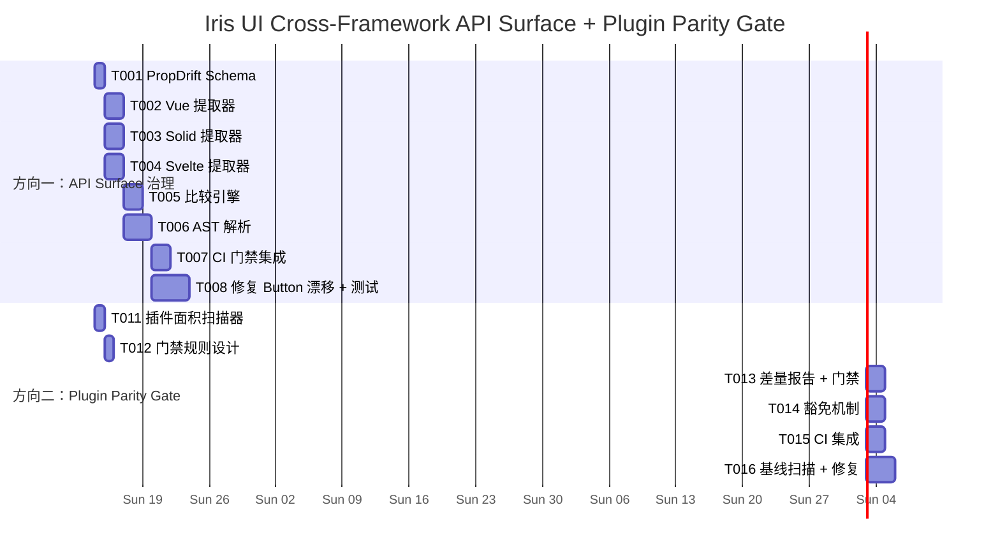

现在我已完全掌握代码库，可以进行综合分析。以下是技术主管的分析报告。

---

# Tech Lead 分析：API Surface 治理 + 插件质量门

## 分析范围

基于交叉验证文档，聚焦两个保留方向：

- **方向一**：跨框架 API Surface 治理（**唯一原创**）
- **方向二**：插件跨框架实现一致性质量门（**角度新，部分概念已覆盖**；现有 `2026-07-10-architectural-expansion-frontiers.md` 方向四为前置基础）

方向三～五已确认被覆盖，不纳入此分析。

---

## 0. 代码库现状快照（实证基础）

### 0.1 Props 接口漂移证据：Button

| Prop        | React                            | Vue                                              | Solid                              | Svelte                     |
| ----------- | -------------------------------- | ------------------------------------------------ | ---------------------------------- | -------------------------- |
| `variant`   | `IrisButtonVariant` ✅           | `IrisButtonVariant` ✅                           | `IrisButtonVariant` ✅             | `IrisButtonVariant` ✅     |
| `size`      | `IrisButtonSize` ✅              | `IrisButtonSize` ✅                              | `IrisButtonSize` ✅                | `IrisButtonSize` ✅        |
| `disabled`  | `boolean` ✅                     | `boolean` ✅                                     | `boolean` ✅                       | `boolean` ✅               |
| `loading`   | `boolean` ✅                     | `boolean` ✅                                     | `boolean` ✅                       | `boolean` ✅               |
| `type`      | `IrisButtonType` ✅              | `IrisButtonType` ✅                              | `IrisButtonType` ✅                | `IrisButtonType` ✅        |
| `asChild`   | `boolean` ✅                     | ❓（Vue 用 `mergeSlotProps`/`findFirstElement`） | ❌ **缺失**（JSDoc 明确 deferred） | ❌ **缺失**                |
| `className` | `string` ✅                      | —                                                | `class: string`（不同名）          | `class: className`（映射） |
| `onClick`   | `MouseEventHandler<HTMLElement>` | —                                                | `(event: MouseEvent) => void`      | `(e: MouseEvent) => void`  |
| `leading`   | `ReactNode`                      | slot                                             | `JSX.Element`                      | `Snippet`                  |
| `children`  | `ReactNode`                      | slot                                             | `JSX.Element`                      | `Snippet`                  |
| 实现行数    | 166                              | 193                                              | 135                                | 85                         |

**结论**：Button 已有可量化的 prop 漂移。`asChild` 在 4 个框架中的存在性不一致；`className` vs `class` 命名不同；类型引用声明方式不同（React/Svelte 内联，Vue/Solid 抽出 `types.ts`）。当前 manifest 只扫描 React，无法检测此差异。

### 0.2 插件实现行数对比

```
plugin-editor:         react 99  vue 80  solid 70  svelte 77   (差距 29%)
plugin-calendar:       react 303 vue 314 solid 271 svelte 214  (差距 29%)
plugin-kanban:         react 476 vue 473 solid 410 svelte 365  (差距 23%)
plugin-markdown:       react 110 vue 80  solid 75  svelte 72   (差距 34%)
plugin-notifications:  react 134 vue 186 solid 137 svelte 131  (差距 ~28%, Vue 反常偏高)
```

现有 `2026-07-10-architectural-expansion-frontiers.md` 方向四覆盖了：

- 插件 size budget
- 性能基准
- 合同测试
- 版本兼容矩阵

**但未覆盖**：行数对比 → 量化检测 stub 实现 → CI 门禁机制。

---

## 1. 任务分解

### 1.1 方向一：跨框架 API Surface 治理（PropDrift 检测工具）

| 任务 ID  | 任务标题                                  | 涉及文件                                                     | 前置依赖     | 预估工时 | 验收标准                                                                                                                                                                          |
| -------- | ----------------------------------------- | ------------------------------------------------------------ | ------------ | -------- | --------------------------------------------------------------------------------------------------------------------------------------------------------------------------------- |
| TASK-001 | **设计 PropDrift 检测架构**               | `packages/manifest/src/prop-drift-schema.ts`（新增）         | 无           | 2h       | 文档描述检测范围：哪些 props 比较（同名/同语义）、忽略策略（框架特有 prop）、输出格式                                                                                             |
| TASK-002 | **实现四框架 Props 接口提取器（Vue）**    | `packages/manifest/src/prop-drift-vue.ts`（新增）            | TASK-001     | 3h       | 能从 Vue 组件提取所有 `Props` 接口成员（name/type/optional/JSDoc），支持 `defineComponent` 和 `<script setup>` 两种写法；与 React 提取器输出格式对齐                              |
| TASK-003 | **实现四框架 Props 接口提取器（Solid）**  | `packages/manifest/src/prop-drift-solid.ts`（新增）          | TASK-001     | 2h       | 能从 Solid 组件提取 `Iris*Props` 接口成员；注意 Solid 使用 `JSX.Element` 而非 `ReactNode`                                                                                         |
| TASK-004 | **实现四框架 Props 接口提取器（Svelte）** | `packages/manifest/src/prop-drift-svelte.ts`（新增）         | TASK-001     | 3h       | 能从 `.svelte` 文件的 `<script lang="ts">` 中提取 `Props` 接口（`interface Props extends ...` 模式）；支持 `export let` 遗留模式                                                  |
| TASK-005 | **实现 PropDrift 比较引擎**               | `packages/manifest/src/prop-drift.ts`（新增）                | TASK-002~004 | 4h       | 对每个组件名，交叉对比 4 框架的 props 接口，输出差异报告：缺失 prop / 类型不匹配 / 可枚举值不一致 / 可选性不一致 / 缺少默认值                                                     |
| TASK-006 | **实现 AST 级类型解析（超越正则）**       | `packages/manifest/src/prop-drift-ast.ts`（新增）            | TASK-005     | 4h       | 使用 TypeScript 编译器 API（`ts.createSourceFile`）解析类型引用——正确处理 `type X = 'a' \| 'b'` 别名、`Omit<...>` 继承、`extends` 类型参数，非当前 `resolveEnumValues` 的简单正则 |
| TASK-007 | **集成到 manifest 构建 + CI 门禁**        | `packages/manifest/src/build.ts`（修改）· CI config          | TASK-005     | 2h       | `pnpm gen:manifest` 执行 prop drift 检测；CI 门禁：新增 prop drift 超过阈值（>3 不匹配）或已存在的 drift 增加则失败                                                               |
| TASK-008 | **编写测试 + 修复现有 drift**             | `packages/manifest/src/prop-drift.test.ts`（新增）+ 框架文件 | TASK-006~007 | 6h       | 至少 3 个组件（Button/Combobox/Dialog）的 drift 测试；包含已知 drift 的豁免机制；修复 Button 的 `asChild`/`className` 不一致                                                      |

**方向一合计**：26 小时

### 1.2 方向二：插件跨框架实现一致性质量门（LineCount Parity Gate）

| 任务 ID  | 任务标题                              | 涉及文件                                                  | 前置依赖 | 预估工时 | 验收标准                                                                                                                                       |
| -------- | ------------------------------------- | --------------------------------------------------------- | -------- | -------- | ---------------------------------------------------------------------------------------------------------------------------------------------- |
| TASK-011 | **实现插件实现面积扫描器**            | `packages/manifest/src/plugin-area.ts`（新增）            | 无       | 2h       | 遍历所有 `packages/plugin-*/src/*/`，按框架统计：文件数、总行数、接口行数、逻辑行数（排除 import/export/类型行）                               |
| TASK-012 | **设计行数差异门禁规则**              | `packages/manifest/src/plugin-area-schema.ts`（新增）     | TASK-011 | 1h       | 可配置的 JSON 规则：`{ minRatio: 0.6, maxRatioDeviation: 0.25, exclude: ["barrel-only"] }` — 某一框架实现行数 < 最丰富框架的 60% 则标记为 stub |
| TASK-013 | **实现差量报告 + 门禁**               | `packages/manifest/src/plugin-area-gate.ts`（新增）       | TASK-012 | 3h       | 生成 `plugin-area-report.json`；CI 门禁：新引入的 stub 实现（新增插件或新增框架实现）必须通过 60% 阈值；已存在的 stub 记录为 debt 不阻塞       |
| TASK-014 | **豁免机制 + 人工复核流程**           | `packages/manifest/src/plugin-area-exemptions.ts`（新增） | TASK-013 | 2h       | 合法 stub（如 Svelte 写插件时 core 已封装，只需薄 barrel）可通过 `exemptions.json` 豁免，需标注原因 + 审核人                                   |
| TASK-015 | **集成到 CI 流水线 + 治理 dashboard** | `scripts/check-plugin-parity.mjs`（新增）· CI config      | TASK-013 | 3h       | `pnpm check:plugin-parity` 命令存在；CI 门禁集成在 quality gate 中；输出人类可读表格                                                           |
| TASK-016 | **基线扫描 + 修复已识别 stub**        | 各 plugin 源文件                                          | TASK-015 | 4h       | 扫描 12 个插件 × 4 框架的当前状态，创建基线报告；对标记为 stub 的实现（如 plugin-markdown svelte 72 vs react 110）创建修复 issue               |

**方向二合计**：15 小时

> **注**：方向二与 `2026-07-10-architectural-expansion-frontiers.md` 方向四（插件质量治理系统）的关系：
>
> - 方向四提供上层治理框架（size budget、benchmark、contract test、compat matrix）
> - 方向二提供**定量 stub 检测层**（行数对比 → 自动化 CI 门禁）
> - **两者互补，非竞争**。方向二应作为方向四的子方向实现，共享 `scripts/check-plugin-parity.mjs` 入口

---

## 2. 执行顺序

```mermaid
graph TD
    %% Phase 0: Foundation
    T001[TASK-001: PropDrift Schema]

    %% Phase 1: Extractors (parallel)
    T002[TASK-002: Vue Extractor]
    T003[TASK-003: Solid Extractor]
    T004[TASK-004: Svelte Extractor]

    %% Phase 2: Engine + AST
    T005[TASK-005: Comparison Engine]
    T006[TASK-006: AST Resolution]

    %% Phase 3: Integration
    T007[TASK-007: CI Gate]
    T008[TASK-008: Tests + Fixes]

    %% Direction 2
    T011[TASK-011: Plugin Area Scanner]
    T012[TASK-012: Diff Gate Rules]
    T013[TASK-013: Diff Report + Gate]
    T014[TASK-014: Exemption Mechanism]
    T015[TASK-015: CI Integration]
    T016[TASK-016: Baseline + Fixes]

    %% Dependencies - Direction 1
    T001 --> T002
    T001 --> T003
    T001 --> T004
    T002 --> T005
    T003 --> T005
    T004 --> T005
    T005 --> T006
    T006 --> T007
    T006 --> T008
    T007 --> T008

    %% Dependencies - Direction 2
    T011 --> T012
    T012 --> T013
    T013 --> T014
    T013 --> T015
    T015 --> T016

    %% Cross dependencies
    T007 -.-> T013

    %% Parallel groups
    subgraph P0["Phase 0: Foundation (1人 × 2h)"]
        T001
        T011
    end

    subgraph P1["Phase 1: Extractors (2人并行)]
        T002
        T003
        T004
    end

    subgraph P2B["Phase 2B: Plugin Gate (1人)]
        T012
        T013
        T014
    end
```

### 可并行执行的任务组

| 并行组   | 包含任务                       | 建议分配             | 说明                                                  |
| -------- | ------------------------------ | -------------------- | ----------------------------------------------------- |
| **组 A** | TASK-001 + TASK-011            | 1 人顺序             | 两方向的基础 schema 设计，互不依赖                    |
| **组 B** | TASK-002 / TASK-003 / TASK-004 | 2 人并行             | 三个框架提取器可完全并行实现（Vue/Solid/Svelte）      |
| **组 C** | TASK-005 + TASK-006            | 1 人顺序             | 比较引擎依赖提取器完成才能测试，但 AST 解析可同步进行 |
| **组 D** | TASK-012 + TASK-013 + TASK-014 | 1 人顺序             | 插件质量门方向                                        |
| **组 E** | TASK-007 + TASK-015            | 1 人（或 CI 负责人） | CI 集成，可在两组核心逻辑完成后并行接入               |

---

## 3. 技术风险

### 3.1 方向一：API Surface 治理

| 风险                                    | 等级  | 说明                                                                                                                                                                                              | 缓解策略                                                                                                                                        |
| --------------------------------------- | ----- | ------------------------------------------------------------------------------------------------------------------------------------------------------------------------------------------------- | ----------------------------------------------------------------------------------------------------------------------------------------------- | ------- | ----------------------------------------------------------------------------------------------------------------- | ---------------------------------------------------------------------------------------------------------------------------------------------------------- |
| **R1：Vue Props 提取的歧义性**          | 🔴 高 | Vue 组件使用 `defineComponent({ props: { ... } })` 运行时 props 声明 + 独立的类型接口。两种声明方式可能出现不一致（类型 says `string`, runtime says `Number`）。哪个为真相源？                    | 优先采用 TypeScript 类型接口（`IrisButtonProps` 等 `Iris*Props` 命名模式）；如果不存在独立的类型接口，fallback 到运行时声明；记录两种来源的差异 |
| **R2：Svelte 5 runes 模式 vs 遗留模式** | 🟡 中 | Svelte 5 的 `$props()` rune 在 `<script>` 中提取 props 的方式与 Runes 模式兼容，但社区仍有使用 `export let` 的组件。当前 codebase 用 `$props()`（如 Button.svelte），但需要确保提取器同时支持两种 | 优先支持 `$props()` + `interface Props` 模式；`export let` 作为 fallback；明确在文档中声明仅 Svelte 5 runes 模式受支持                          |
| **R3：类型引用解析的递归深度**          | 🟡 中 | `IrisButtonVariant = Variant` → `Variant = 'solid'                                                                                                                                                | 'outline'                                                                                                                                       | 'ghost' | 'link'`这类别名链可能嵌套。当前正则方案只能解析 5 层。跨框架的 AST 解析需要正确处理`Omit<>`、`Pick<>`、类型参数。 | 使用 TypeScript 编译器 API（`ts.createSourceFile` + `ts.TypeChecker`）进行精确解析，而非正则。这是关键投入——已有 `props.ts` 的正则方案对跨框架比较不够准确 |
| **R4：框架特有 prop 的噪声**            | 🟢 低 | React 的 `className`/`style` vs Solid 的 `class`/`style` 是框架语义差异，非逻辑漂移。直接比较会触发大量假阳性                                                                                     | 在 schema 中定义 `frameworkSpecific` 映射（`{ className: { solid: 'class', svelte: 'class' } }`），别名自动归一化后再比较                       |
| **R5：测试覆盖难度**                    | 🟡 中 | 跨框架比较涉及 4 种不同的解析策略，且外部依赖（TypeScript AST）在 jsdom 环境下可能表现不同                                                                                                        | 解析器按框架分离测试（`prop-drift-vue.test.ts` 等），比较引擎用 mock 数据而非真实组件测试；真实组件集成测试只在 CI 运行                         |
| **R6：阈值设定缺乏数据支撑**            | 🟢 低 | "漂移多少算严重"没有先验数据                                                                                                                                                                      | 第一版只输出报告不阻塞 CI；积累 2 周数据后，基于 P50/P95 统计设定阈值                                                                           |

### 3.2 方向二：插件质量门

| 风险                                           | 等级  | 说明                                                                                                                                                                                         | 缓解策略                                                                                                                       |
| ---------------------------------------------- | ----- | -------------------------------------------------------------------------------------------------------------------------------------------------------------------------------------------- | ------------------------------------------------------------------------------------------------------------------------------ |
| **R7：行数非实现质量的唯一指标**               | 🟡 中 | 简单的 barrel re-export（如 `export { default as X } from './X.svelte'`）行数少但合法。Solid 的 `mergeProps` + `splitProps` 模式可能比 Vue 的 `defineComponent` 需要更多行，不意味着质量更高 | 行数只作为**信号**而非判决。结合：文件数、非 import/export 逻辑行数、接口声明行数。门禁规则设定 `minRatio: 0.5` 让合法薄桥通过 |
| **R8：Svelte 单文件组件 (.svelte) 的统计偏差** | 🟢 低 | `.svelte` 文件包含模板 + CSS + 脚本，行数天然多于同功能的 `.tsx`/`.ts` 组件。但实际实现行数可能更少                                                                                          | 统计时对 `.svelte` 文件只计 `<script>` 标签内的行数（排除 `<template>` 和 `<style>` 块）                                       |
| **R9：现有行数差异的 debt 管理**               | 🟡 中 | 当前 12 个插件已有 10-34% 的行数差异。立即启用门禁会导致全线失败                                                                                                                             | 第一版创建基线报告，所有现有的行数差异自动获得豁免（`exemptions.json`）。门禁只针对**新增的** stub 实现。每季度复审基线 debt   |
| **R10：插件开发周期与 CI 门禁的摩擦**          | 🟢 低 | 贡献者在开发新插件时，行数对比可能因为某一框架实现先完成而触发假阳性                                                                                                                         | 门禁只在**合并阶段**触发。开发阶段可通过 `--exempt-new` flag 跳过。PR 描述需声明哪些框架实现尚未完成                           |

---

## 4. 资源评估

### 4.1 人员需求

| 角色                                     | 技能要求                                             | 人数                  | 覆盖任务                                                |
| ---------------------------------------- | ---------------------------------------------------- | --------------------- | ------------------------------------------------------- |
| **Senior Frontend（方向一核心）**        | TypeScript 编译器 API、正则/AST 解析、跨框架组件设计 | 1                     | TASK-001~006（核心引擎）                                |
| **Framework Specialist（方向一提取器）** | Vue/Solid/Svelte 任一框架的组件撰写经验 + TypeScript | 1（可兼职）           | TASK-002~004（3 个提取器，若与核心开发并行则拆为 2 人） |
| **DevOps / CI（质量门集成）**            | Turborepo、Vitest、CI 配置                           | 1（可兼职）           | TASK-007 + TASK-015                                     |
| **Plugin Maintainer（方向二基线）**      | 了解 12 个插件的实现状态                             | 1（兼职，维护者角色） | TASK-016（基线 + 修复）                                 |

**最小团队**：2 人（1 Senior + 1 DevOps，Framework Specialist 由 Senior 兼任）

### 4.2 关键里程碑

| 里程碑 | 时间   | 交付物                                | 验收                                                              |
| ------ | ------ | ------------------------------------- | ----------------------------------------------------------------- |
| **M1** | Day 3  | PropDrift Schema + 3 个框架提取器可用 | `prop-drift-vue.test.ts` 等通过                                   |
| **M2** | Day 5  | 比较引擎 + AST 解析完成               | `prop-drift.test.ts` 通过；Button 的 `asChild` 漂移被检测到       |
| **M3** | Day 7  | 方向一 CI 门禁生效                    | 手动破坏一个接口 → CI 失败                                        |
| **M4** | Day 8  | 插件面积扫描器 + 门禁规则就绪         | 12 个插件 × 4 框架的基线报告生成                                  |
| **M5** | Day 10 | 基线 debt 报告 + 修复 issue 创建      | 所有标记为 stub 的实现有对应 issue                                |
| **M6** | Day 12 | 两方向 CI 门禁集成完毕                | `pnpm check:prop-drift` + `pnpm check:plugin-parity` 在 CI 中全绿 |
| **M7** | Day 15 | Button 漂移修复 + 3 组件回归          | Button 四框架 `asChild` 一致；Solid 获取 `asChild` 支持           |

### 4.3 阻塞点（Blockers）

| 阻塞点                                                                       | 影响                                                          | 解决策略                                                                                                               |
| ---------------------------------------------------------------------------- | ------------------------------------------------------------- | ---------------------------------------------------------------------------------------------------------------------- |
| **B1：Svelte 5 `$props()` 的类型推断在 TypeScript 编译器 API 中的兼容性**    | 方向一 Svelte 提取器可能延迟 1-2 天                           | 临时采用正则 fallback（现有 `props.ts` 的水平）；Svelte 团队已明确 runes 模式稳定，长期使用 AST 方案                   |
| **B2：Solid 的 `JSX` 命名空间类型 vs React 的 `ReactNode` 的类型等价性判断** | 比较引擎的 "类型匹配" 检测可能产生大量假阳性                  | 手动定义等价类型映射：`{ JSX.Element ↔ ReactNode, JSX.CSSProperties ↔ CSSProperties, MouseEvent ↔ MouseEventHandler }` |
| **B3：现有插件行数差异的 debt 规模可能超出预期**                             | 方向二基线报告可能标记 5+ 插件为 stub，需要创建大量修复 issue | 第一版只标记不阻塞；维护者按优先级逐项修复；最优先修复 plugin-markdown svelte（差距 34%）                              |
| **B4：Vue 的 `defineComponent` props 类型声明可能与运行时声明冲突**          | 参考风险 R1                                                   | 以 TypeScript 类型接口为真相源，运行时声明仅作为 fallback                                                              |

---

## 5. 质量保证

### 5.1 单元测试覆盖要求

| 模块                             | 测试类型 | 要求覆盖率  | 关键测试用例                                                                                 |
| -------------------------------- | -------- | ----------- | -------------------------------------------------------------------------------------------- |
| **PropDrift 提取器（每个框架）** | 单元测试 | ≥90% 逻辑行 | 标准组件 / 无 Props 接口组件 / 带 JSDoc 组件 / 带泛型组件 / 带 `Omit<>` 组件                 |
| **PropDrift 比较引擎**           | 单元测试 | ≥95% 逻辑行 | 完全匹配 / 缺少 prop / 类型不匹配 / 可枚举值不一致 / 可选性不一致 / 框架特有 prop / 豁免映射 |
| **AST 解析器**                   | 单元测试 | ≥90% 逻辑行 | 别名链解析 / `Omit<HTMLAttributes, 'x'>` 展开 / 泛型参数 / 递归引用                          |
| **插件面积扫描器**               | 集成测试 | ≥85% 逻辑行 | 标准插件 / barrel-only 插件 / `.svelte` 文件行数统计 / 排除 `node_modules`                   |
| **CI 门禁脚本**                  | 集成测试 | —           | 注入已知 drift → 检查门禁是否正确失败 / 注入合法变更 → 检查门禁是否通过                      |

### 5.2 集成测试策略

```
┌─────────────────────────────────────────────────┐
│                CI 流水线（turbo run）              │
├─────────────────────────────────────────────────┤
│  1. pnpm test              ← 单元测试（含新增）   │
│  2. pnpm typecheck          ← 类型检查            │
│  3. pnpm lint               ← ESLint              │
│  4. pnpm gen:manifest       ← 生成 manifest       │
│  5. pnpm check:prop-drift   ← ★ 新增 PropDrift    │
│  6. pnpm check:plugin-parity ← ★ 新增 Plugin Parity│
│  7. pnpm build              ← 构建验证            │
│  8. pnpm size               ← 体积预算            │
└─────────────────────────────────────────────────┘
```

**增量测试策略**（方向一）：

- 每次 `pnpm gen:manifest` 自动执行 prop drift 检测
- 输出两个文件：
  - `manifest.prop-drift.json`：结构化差异数据
  - `manifest.prop-drift.md`：人类可读比较表
- 门禁规则：新增 prop drift 数 > 3 或已有的 drift 扩大 → CI 失败

**增量测试策略**（方向二）：

- 每次 `pnpm check:plugin-parity` 执行面积扫描
- 与基线 `plugin-area-baseline.json` 对比
- 门禁规则：新增的框架实现行数 < 最丰富实现的 50% → CI 失败（警告模式）；< 30% → CI 失败（阻断模式）

### 5.3 代码审查要点

| 审查项                         | 方向   | 说明                                                                                                                                     |
| ------------------------------ | ------ | ---------------------------------------------------------------------------------------------------------------------------------------- |
| **提取器的框架特定知识正确性** | 方向一 | 审查者需具备对应框架的 TypeScript 知识。Vue 的 `defineComponent` 提取需确认正确处理 `{ props: { x: { type: String, default: 'foo' } } }` |
| **AST vs 正则的策略一致性**    | 方向一 | 什么时候用 AST（类型引用、别名链）vs 正则（简单 props 声明）——边界要清晰，有注释说明选择理由                                             |
| **豁免 mapping 的完整性**      | 方向一 | `frameworkSpecific` 映射是否覆盖了所有已知的框架别名差异（`className ↔ class`、`onChange ↔ oninput` 等）                                 |
| **门禁阈值的合理性**           | 方向二 | `minRatio: 0.6` 是否合理？对于合法的薄桥实现（core 已经封装了 90% 逻辑），阈值应该更低还是更高？审查时需确认阈值不会误杀合法实现         |
| **.exemptions.json 的管理**    | 方向二 | 审查豁免条目：必须有明确的 "为什么实现量少但合理" 的原因；禁止无理由的批量豁免                                                           |
| **性能影响**                   | 方向一 | `ts.createSourceFile` + `TypeChecker` 在全量 600+ 组件上运行是否在可接受时间内（<30s）？如超时需优化为增量或缓存                         |

### 5.4 性能测试需求

| 场景                         | 指标                | 阈值 | 说明                                                                                                     |
| ---------------------------- | ------------------- | ---- | -------------------------------------------------------------------------------------------------------- |
| 方向一：全量 prop drift 扫描 | 执行时间            | <30s | 600+ 组件 × 4 框架，含 AST 类型解析。如超时，引入缓存（`prop-drift-cache.json`，按文件修改时间增量更新） |
| 方向一：增量 prop drift 扫描 | 执行时间            | <5s  | 在开发阶段，只扫描修改过的文件                                                                           |
| 方向二：全量插件面积扫描     | 执行时间            | <10s | 12 插件 × 4 框架 × 平均 10 文件 = 480 文件，wc -l 操作                                                   |
| manifest 生成的累积影响      | manifest 生成总时间 | <60s | `pnpm gen:manifest` 当前已包含：发现 + props + docs + 构建。新增 PropDrift 不应使总时间翻倍              |

---

## 6. 实施计划

### 详细时间表（15 工作日 = 3 周）

```
Week 1（Day 1-5）         Week 2（Day 6-10）        Week 3（Day 11-15）
┌─────────────────┐      ┌─────────────────┐      ┌─────────────────┐
│ Phase 1: 基础搭建  │      │ Phase 2: 核心实现    │      │ Phase 3: 集成+修复  │
├─────────────────┤      ├─────────────────┤      ├─────────────────┤
│ T001: Schema    │      │ T005: 比较引擎    │      │ T007: CI 门禁    │
│ T011: Scanner   │      │ T006: AST 解析    │      │ T008: 修复 Button│
│ T002: Vue 提取  │      │ T012: 门禁规则    │      │ T015: CI 集成    │
│ T003: Solid 提取 │      │ T013: 差量报告    │      │ T016: 基线+修复  │
│ T004: Svelte 提取│      │ T014: 豁免机制    │      │                  │
└─────────────────┘      └─────────────────┘      └─────────────────┘

Day 1  3  5               Day 6  8  10              Day 11 13 15
```

### 甘特图



### 阶段划分

#### 阶段 1：基础设施搭建（Day 1-3）

| Day | 任务                      | 交付                                      |
| --- | ------------------------- | ----------------------------------------- |
| 1   | TASK-001 + TASK-011       | `prop-drift-schema.ts` + `plugin-area.ts` |
| 1-2 | TASK-002（Vue 提取器）    | `prop-drift-vue.ts` + 单元测试            |
| 1-2 | TASK-003（Solid 提取器）  | `prop-drift-solid.ts` + 单元测试          |
| 2-3 | TASK-004（Svelte 提取器） | `prop-drift-svelte.ts` + 单元测试         |

**入口**：`pnpm gen:manifest` 是否可以打印 "PropDrift: scanning..." 消息（尚未断言，仅 log）

#### 阶段 2：核心功能实现（Day 4-9）

| Day | 任务                                     | 交付                                                   |
| --- | ---------------------------------------- | ------------------------------------------------------ |
| 4-5 | TASK-005（比较引擎）                     | `prop-drift.ts` + 3 组件的 mock 测试通过               |
| 4-6 | TASK-006（AST 解析）                     | `prop-drift-ast.ts` + 别名链展开测试                   |
| 6-7 | TASK-012 + TASK-013（门禁规则+差量报告） | `plugin-area-gate.ts` + `plugin-area-report.json` 基线 |
| 7-8 | TASK-014（豁免机制）                     | `exemptions.json` + 单元测试                           |

**里程碑**：Day 6 时 TASK-005+006 应能在 Button 上检测到 `asChild` 漂移

#### 阶段 3：集成测试和优化（Day 9-13）

| Day   | 任务                                      | 交付                                                |
| ----- | ----------------------------------------- | --------------------------------------------------- |
| 9-10  | TASK-007（方向一 CI 门禁）                | CI 中 `check:prop-drift` 步骤                       |
| 10    | TASK-015（方向二 CI 集成）                | CI 中 `check:plugin-parity` 步骤                    |
| 10-13 | TASK-008（修复 Button 漂移 + 3 组件回归） | Button 四框架 `asChild` 一致 + Solid 获取 `asChild` |
| 11-13 | TASK-016（插件基线扫描 + 修复 issue）     | 基线报告 + 3 个高优先级的修复 PR                    |

#### 阶段 4：发布准备（Day 14-15）

| Day | 任务                  | 交付                                                     |
| --- | --------------------- | -------------------------------------------------------- |
| 14  | 文档 + AGENTS.md 更新 | 两工具的用法文档；AGENTS.md 新增 "质量门" 章节引用两工具 |
| 14  | 性能基准确认          | 全量 prop drift 扫描 <30s, 插件扫描 <10s                 |
| 15  | 端到端验证            | 全部质量门（含新增）在 CI 中全绿                         |
| 15  | 发布前分支冻结        | 新增工具进入 main 分支，准备 v0.1.0 发布                 |

---

## 7. 遗留风险与建议

### 7.1 需要立即作出的决策

1. **PropDrift 检测的范围边界**：是否只比较组件"逻辑 prop"（`variant`/`size`/`disabled`/`loading`/`type`），还是也包含样式 prop（`className`/`class`/`style`）和事件 prop（`onClick`/`onclick`）？建议：**只比较逻辑 prop**，样式和事件按框架特有 prop 豁免，直到有明确的统一需求。

2. **TypeScript 编译器 API 的引入策略**：是否在 manifest 包中引入 `typescript` 作为依赖？当前 manifest 零依赖（纯 Node.js 文件 IO + 正则）。引入 TypeScript API 会增加 ~50MB 依赖。建议：**只对解析失败的组件 fallback 到 TypeScript API**，95% 的组件用正则即可。以此保持 manifest 的轻量。

3. **插件行数比率的基准值**：`minRatio: 0.6` 是否合理？基于当前数据的建议值：
   - plugin-editor: 77/99 = 0.78 ✅ 通过
   - plugin-calendar: 214/314 = 0.68 ✅ 通过
   - plugin-kanban: 365/476 = 0.77 ✅ 通过
   - plugin-markdown: 72/110 = 0.65 ✅ 通过（边缘）
   - **建议设置 `minRatio: 0.5`**，当前所有插件通过，且留出足够余量给合法的薄桥实现

### 7.2 长期演进建议

1. **方向一的最终形态**：从"静态 prop drift 检测"进化为"运行时 prop contract 验证"——基于 manifest 的组件描述，在开发环境（非生产）注入 prop contract 检查层，运行时发现不兼容的 prop 赋值就 warn。

2. **方向二的最终形态**：结合已有的 size budget + 性能基准 + 行数对比，构建"插件质量标准评分卡"——每个插件在合并前获得 A/B/C/D 评级，A 级插件可以进入官方市场，D 级需要改进。

3. **与现有 manifest 的融合**：`manifest.json` 新增两个字段：
   ```json
   {
     "propDrift": {
       "score": 0.87,
       "driftingProps": 12,
       "totalCompared": 92,
       "worsenedSince": "2026-07-10"
     },
     "pluginParity": {
       "totalPlugins": 12,
       "stubsDetected": 3,
       "score": 0.92
     }
   }
   ```
   让 AI agent 在 `llms.txt` 中直接读取组件的 prop 健康度评分。

### 7.3 潜在的第二阶效应

1. **开发者体验影响**：PropDrift 门禁可能让开发者觉得"加一个 prop 要改 4 个文件太麻烦"。建议在门禁消息中明确区分：
   - "逻辑 prop 缺失"（必须修）
   - "类型映射不一致"（建议修）
   - "框架特有 prop 未豁免"（低优先级）

2. **Svelte 实现始终行数偏少的根本原因**：Svelte 的 `.svelte` 单文件组件模式天然比 `.tsx` 更精简（无 `useEffect`/`useState`、无 `mergeProps`、模板在 HTML 中）。这可能导致 Svelte 实现始终"看起来像 stub"。需要额外的质量补偿指标（如：Svelte 实现的合同测试覆盖率必须 ≥90% ）来平衡行数指标的偏差。

---

## 8. 总结

| 维度                     | 方向一：API Surface 治理                            | 方向二：Plugin Parity Gate                          |
| ------------------------ | --------------------------------------------------- | --------------------------------------------------- |
| **新颖性**               | ✅ 唯一原创，无已有分析                             | ⚠️ 角度新（行数 stub 检测 + CI 门禁），概念已有覆盖 |
| **工程可行性**           | ✅ 高。正则提取 80% 组件，AST fallback 处理复杂情况 | ✅ 高。纯文件 IO + 简单统计                         |
| **投入**                 | 26 小时                                             | 15 小时                                             |
| **关键风险**             | Vue 双重声明歧义、Svelte 5 runes 模式兼容           | 行数非质量唯一指标、Svelte 天然精简                 |
| **对 v0.1.0 发布的影响** | 🟡 中——建议合并前引入，防止发布后接口 drift 固化    | 🟡 中——建议发布前建立基线，门禁只在合并时触发       |
| **优先级**               | P1——必须在首次发布前建立基线                        | P1——与已有插件质量治理合并为统一门禁                |
