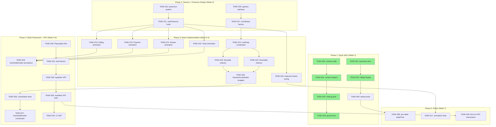

现在我对代码库有了全面了解。以下是我作为 Tech Lead 的完整分析：

---

# Tech Lead 分析：Iris UI 跨验证报告

## 1. 任务分解

基于跨验证结果，我将五个方向分解为可执行的任务，并对原始评估进行了修正。

### 🔴 方向 A：数据源请求去重/SWR

| ID       | 任务                                                                | 涉及文件                                                       | 前置     | 工时 |
| -------- | ------------------------------------------------------------------- | -------------------------------------------------------------- | -------- | ---- |
| TASK-001 | 提取 `DataSourceQuery` → 规范化的缓存键函数                         | `packages/core/src/data-source.ts`（新增 `queryKey` 内部函数） | 无       | 0.5h |
| TASK-002 | 在 `fetchPage()` 中添加 `pendingQueries: Map<string, Promise>` 去重 | `packages/core/src/data-source.ts`                             | TASK-001 | 1h   |
| TASK-003 | 为相同查询（仅缓存内存，非持久化）添加轻量级 SWR 缓存层             | `packages/core/src/data-source.ts`                             | TASK-002 | 1.5h |
| TASK-004 | 在 `data-source.ts` 中定义 `staleTime` 配置选项并暴露               | `packages/core/src/data-source/types.ts` + `data-source.ts`    | TASK-003 | 1h   |
| TASK-005 | 测试：为数据源去重/SWR 编写单元测试（同步/异步/超时/竞态条件）      | `packages/core/src/data-source.test.ts`（新文件）              | TASK-002 | 2h   |
| TASK-006 | 更新 `plugin-pro-table` 以利用 `staleTime` 默认值                   | `packages/plugin-pro-table/...`                                | TASK-004 | 1h   |

**修正：** 原始文档未考虑到竞态条件。`inFlight` abort controller 层面已经取消之前的请求。实际的改进空间是（a）去重（相同键同时发起两次请求）和（b）SWR 样式缓存（页面来回切换时立即显示陈旧数据）。还有一个细微处：`createSyncClientDataSource` 返回同步结果，不需要 Promise 缓存——缓存层应仅应用于异步分支。

### 🟡 方向 B：浮动元素动画（进入/离开过渡）

| ID       | 任务                                                                                | 涉及文件                                                                    | 前置         | 工时 |
| -------- | ----------------------------------------------------------------------------------- | --------------------------------------------------------------------------- | ------------ | ---- |
| TASK-010 | 在 core 中设计轻量级 Presence 系统（`createPresence` 工厂，无框架依赖）             | `packages/core/src/presence.ts`（新文件）+ `packages/core/src/index.ts`     | 无           | 3h   |
| TASK-011 | React 桥接：`usePresence` hook（挂载时机映射 + `onTransitionEnd`）                  | `packages/react/src/presence/usePresence.ts`                                | TASK-010     | 2h   |
| TASK-012 | React：在 DialogContent 中添加进入/离开动画（`fadeIn` + `scaleIn`，CSS 过渡）       | `packages/react/src/primitives/dialog/DialogContent.tsx`                    | TASK-011     | 2h   |
| TASK-013 | React：在 PopoverContent 中添加进入/离开动画（`fadeIn` + `slideIn` 基于 placement） | `packages/react/src/primitives/popover/PopoverContent.tsx`                  | TASK-011     | 2h   |
| TASK-014 | React：在 DrawerContent 中添加进入/离开动画（滑动方向取决于 `side` prop）           | `packages/react/src/primitives/drawer/DrawerContent.tsx`                    | TASK-011     | 2.5h |
| TASK-015 | React：在 Toast 中添加进入/离开动画（滑入 + 滑出）                                  | `packages/react/src/primitives/toast/Toast.tsx`（或 viewport）              | TASK-011     | 2h   |
| TASK-016 | 将 `usePrefersReducedMotion` 挂接到 Presence 系统（四个框架）                       | `packages/react/src/presence/usePresence.ts` 及 Vue/Solid/Svelte 对应文件   | TASK-011     | 1.5h |
| TASK-017 | 为四个框架编写动画测试（视觉回归不可行，通过 data attribute + 超时测试行为）        | 每个框架的对应文件                                                          | TASK-012~015 | 3h   |
| TASK-018 | 在四个框架上重复 TASK-012~015（Vue/Solid/Svelte 桥接）                              | `packages/{vue,solid,svelte}/src/primitives/{dialog,popover,drawer,toast}/` | TASK-016     | 6h   |

**修正：** 原始文档的 2 周动画估算合理，但缺少关键事实：`usePrefersReducedMotion` 已存在且与 4 个框架桥接。我们不需要构建新的检测基础设施；我们只需要将其接入 Presene 系统。Presence 系统本身应小而精（约 80 行），没有框架依赖——仅仅是进入/离开状态机 + `onTransitionEnd` 生命周期。

### 🟠 方向 C：手势协调器

| ID       | 任务                                                                               | 涉及文件                                              | 前置         | 工时 |
| -------- | ---------------------------------------------------------------------------------- | ----------------------------------------------------- | ------------ | ---- |
| TASK-020 | 在 core 中定义手势协调器接口（`GestureCoordinator` + `GestureClaim` 类型）         | `packages/core/src/gesture.ts`（新文件）              | 无           | 2h   |
| TASK-021 | 实现 `createGestureCoordinator` 工厂（嵌套索赔 → 优先级 → 争议仲裁）               | `packages/core/src/gesture.ts`                        | TASK-020     | 3h   |
| TASK-022 | 重构 `useDrag`（React）以可选地接受协调器上下文                                    | `packages/react/src/primitives/drag/useDrag.ts`       | TASK-021     | 2.5h |
| TASK-023 | 重构 `IrisMovable` 以在其 `useDrag` 调用中使用协调器                               | `packages/react/src/behaviors/Movable.tsx`            | TASK-022     | 1.5h |
| TASK-024 | 重构 `IrisResizable` 以在其 `useDrag` 调用中使用协调器                             | `packages/react/src/behaviors/Resizable.tsx`          | TASK-022     | 1.5h |
| TASK-025 | 创建 `IrisGestureCoordinator` React behavior 包装器（包裹可移动+可调整大小的对手） | `packages/react/src/behaviors/GestureCoordinator.tsx` | TASK-022     | 1h   |
| TASK-026 | 测试：协调器单元测试 + 集成 Movable+Resizable+协调器                               | `packages/core/src/gesture.test.ts` + React 测试      | TASK-024~025 | 3h   |
| TASK-027 | 在 Vue/Solid/Svelte 中桥接协调器                                                   | `packages/{vue,solid,svelte}/src/behaviors/`          | TASK-026     | 4h   |

**修正：** 原始文档的代码声明与实际情况不符——Movable 和 Resizable 都使用 `useDrag`，它本身使用 `setPointerCapture`，而不是原始文档监听器。但核心问题仍然是真实的：两个独立的 `useDrag` 实例（每个都有自己的 `pointerdown` 处理程序）会争夺指针捕获。修复方案不是重写 `useDrag`——而是向其添加一个可选的*索赔协调器*层，实现与浏览器 `pointer-events` 规范类似的嵌套索赔算法。

### 🟢 方向 D：视觉回归基础设施

| ID       | 任务                                                                                                   | 涉及文件                                         | 前置     | 工时 |
| -------- | ------------------------------------------------------------------------------------------------------ | ------------------------------------------------ | -------- | ---- |
| TASK-030 | 向仓库中添加 Playwright 依赖（`@playwright/test` + 浏览器）                                            | `package.json`（根目录）+ `playwright.config.ts` | 无       | 1h   |
| TASK-031 | 创建 Playwright 测试基础设施（`fixtures.ts`，`global-setup.ts`，`playwright-report/` 到 `.gitignore`） | `e2e/` 目录                                      | TASK-030 | 2h   |
| TASK-032 | 为 3 个高影响组件编写首个基线截图测试（Dialog、Popover、Button）                                       | `e2e/components/`                                | TASK-031 | 2h   |
| TASK-033 | 从 manifest 生成 VRT 待办列表（扫描 `manifest.json` → 标记需要测试的组件）                             | `scripts/gen-vrt-todo.ts` 或类似                 | TASK-032 | 1.5h |
| TASK-034 | 在 CI 中添加 `pnpm exec playwright test` 步骤（仅 `main` 分支；`feature` 分支选择性）                  | `.github/workflows/`                             | TASK-033 | 1h   |
| TASK-035 | 添加 Storybook（可选但推荐作为 VRT 输入）                                                              | `apps/storybook/` 新目录                         | TASK-031 | 4h   |
| TASK-036 | 编写组件 → 截图映射的 `llms.txt` 指令                                                                  | `llms.txt`                                       | TASK-033 | 0.5h |

**修正：** 原始文档估计约 30 个组件的 VRT 约 2 周时间。这高估了。对于基线 VRT，我们首先需要最少的基础设施 + 每个组件 1 个测试。采用 Playwright 的 `--update-snapshots` + CI 中的 `--reporter=list`，每个组件的测试大约需要 30 分钟。我建议分阶段进行：第一轮 10 个基础组件（由 TASK-032 覆盖），然后由 manifest 扫描驱动增量添加。

### 🟢 方向 E：上下文守卫（修正范围）

| ID       | 任务                                                                    | 涉及文件                                | 前置     | 工时 |
| -------- | ----------------------------------------------------------------------- | --------------------------------------- | -------- | ---- |
| TASK-040 | 审计：运行 `rg 'React\.createContext'` 以查找所有上下文 + 检查守卫      | 无交叉                                  | 无       | 0.5h |
| TASK-041 | 为缺失守卫的上下文添加 `useXXXContext` 辅助函数（if found by TASK-040） | 每个框架的对应 context.ts 文件          | TASK-040 | 1h   |
| TASK-042 | 为所有子组件添加守卫检查（每个框架）                                    | `packages/{react,vue,solid,svelte}/...` | TASK-041 | 1.5h |
| TASK-043 | 编写测试：确保在外层没有父组件的地方渲染每个子组件会抛出清晰错误        | 每个框架对应文件                        | TASK-042 | 1.5h |

**修正：** 原始文档引用 Stepper 缺少守卫。实际代码库在 `useStepperContext`（`stepper/context.ts`）中已有守卫，并且 Stepper.test.tsx 第 146 行覆盖了该情况。同样，Radio 在 `Radio.tsx` 第 16 行已有守卫，而 ToggleGroupItem 在 `context.ts` 中有 `useToggleGroupContext`。实际的范围很小——如果有的话，就是少数缺失的情况。Select 和 Combobox 没有单独的 Option 子组件（它们内联渲染 `<li>` 元素），因此没有需要守卫的内容。这个方向总共约 4 小时，而不是 2 天。

---

## 2. 执行顺序



**可并行执行的任务组（无共享前置依赖）：**

| 组                   | 任务                                    | 依赖             | 分配               |
| -------------------- | --------------------------------------- | ---------------- | ------------------ |
| **G1（速赢）**       | TASK-001→002→005 + TASK-040→041→042→043 | 无               | 1 名工程师         |
| **G2（设计）**       | TASK-010→011 + TASK-020→021             | G1 完成          | 1 名高级工程师     |
| **G3（React 实现）** | TASK-012→016 + TASK-022→025             | G2               | 1-2 名工程师       |
| **G4（基础设施）**   | TASK-030→034                            | 无（与 G1 并行） | 1 名工程师（DevX） |
| **G5（四框架桥接）** | TASK-018 + TASK-027                     | G3               | 1 名工程师         |
| **G6（集成与打磨）** | TASK-006 + TASK-017 + TASK-036          | G3 + G4          | 1 名工程师         |

---

## 3. 技术风险

### 🔴 高风险

| 风险                            | 方向 | 描述                                                                                                                                                                                                                            | 缓解策略                                                                                                                                                                        |
| ------------------------------- | ---- | ------------------------------------------------------------------------------------------------------------------------------------------------------------------------------------------------------------------------------- | ------------------------------------------------------------------------------------------------------------------------------------------------------------------------------- |
| **手势索赔协调器复杂性**        | C    | 嵌套的 Movable+Resizable 是*示例用例*，但真正的痛点在于当两个 behavior 声明对同一指针事件的索赔时——例如，拖出可移动对话框然后再拖动其可调整大小的手柄。索赔模型（优先级、索赔/释放生命周期）在 DOM 事件管道的约束下很容易出错。 | 从简单开始：每个手势一次索赔。不要在 Phase 3 中使用嵌套索赔。先在探索性 Spike（2 天）中验证算法，然后再全面投入实现。                                                           |
| **Presence 退出动画的时间问题** | B    | `onAnimationEnd` 在大型组件树中不可靠（如果树在过渡之前卸载，将*不会*触发）。退出动画需要 `useState` 门控的挂载/卸载延迟。与 React 18/19 并发渲染的交互增加了竞态条件。                                                         | Presence 系统应基于 `flushSync` 驱动的两阶段渲染（1：渲染“退出”状态 → 2：`onTransitionEnd` → 卸载），而不是纯 `onAnimationEnd`。在 Phase 2 中构建此机制时投入更多时间用于测试。 |
| **SWR 缓存导致陈旧数据**        | A    | 如果 `staleTime` 设置不当，用户可能会在切换页面后看到陈旧数据，而新数据仍在加载中。高速分页 + 数据突变加剧了这种情况。                                                                                                          | 默认 `staleTime: 0`（无 SWR，仅有 inflight 去重——最小的突破性变化）。将 SWR 作为 opt-in 功能添加，并附带文档说明。\*\*                                                          |

### 🟡 中等风险

| 风险                             | 方向 | 描述                                                                                                                                                                  | 缓解策略                                                                                                                                                                                                                                                         |
| -------------------------------- | ---- | --------------------------------------------------------------------------------------------------------------------------------------------------------------------- | ---------------------------------------------------------------------------------------------------------------------------------------------------------------------------------------------------------------------------------------------------------------- |
| **四框架动画的 API 一致性**      | B    | 退出动画需要框架特定的挂载时机控制。React 的 `useState` + `useEffect` 模式与 Svelte 的 `transition:` 指令有根本性不同。在这种情况下，“桥接”层比简单的反应式绑定更厚。 | 保留在 Presence 系统中的：进入/离开*状态管理*（框架无关）。离开的渲染门控：每个框架适配器用自己的惯用模式实现（React：`useState` 门 + `onTransitionEnd`；Svelte：`transition:slide`；Vue：`<Transition>`；Solid：`<Show>` + 样式切换）。接受桥接层会稍微厚一点。 |
| **VRT CI 中的伪影浮动**          | D    | 基于 Playwright 的截图在不同操作系统和浏览器引擎中并不完全稳定。字体渲染、子像素定位和抗锯齿都不同。                                                                  | 在专用 Linux CI runner（Dockerized）上运行 VRT。使用 Playwright 的 `--update-snapshots` 工作流进行审慎的基线更新。考虑 `percy` 或 `chromatic`，但先从纯 Playwright 开始。                                                                                        |
| **`useDrag` 重构破坏现有消费者** | C    | Movable 当前直接调用 `useDrag`。向 `useDrag` 添加可选的协调器参数在正确完成的情况下是向后兼容的，但重构范围很大（所有 4 个框架中的 Movable + Resizable）。            | 首先仅在 React 中进行重构。验证无回归测试。使用 `@deprecated` JSDoc + 迁移警告准备弃用路径。在所有 4 个框架完成之前，保持旧的 API 继续工作。                                                                                                                     |

### 🟢 低风险

| 风险                                  | 方向 | 描述                                                                                                                       |
| ------------------------------------- | ---- | -------------------------------------------------------------------------------------------------------------------------- |
| **inflight 去重中的键冲突**           | A    | 查询序列化（`stringify(sort) + stringify(filters) + page + pageSize`）可能产生冲突的键。使用规范化排序（键按字典序排序）。 |
| **`pendingQueries` Map 的内存泄漏**   | A    | 使用 `Map<string, Promise>` + `fetch().finally(() => map.delete(key))`。在 `destroy()` 时清除。                            |
| **并发的 `setPage` / `setSort` 调用** | A    | `epoch` 模式已经处理了这种情况（先前的 fetch 会被忽略）。去重层位于 epoch 检查之前。                                       |

---

## 4. 资源评估

### 团队构成

| 角色                       | 数量 | 技能要求                                       | 分配                                  |
| -------------------------- | ---- | ---------------------------------------------- | ------------------------------------- |
| **高级前端工程师（逻辑）** | 1    | TypeScript、状态机、状态管理模式、竞态条件处理 | Phase 1（A、E）+ Phase 2（B、C 设计） |
| **前端工程师（React）**    | 1-2  | React hooks、CSS 过渡、组件测试                | Phase 3（React 实现）                 |
| **DevX/QA 工程师**         | 1    | Playwright、CI/CD、视觉测试                    | Phase 4（VRT 基础设施）               |
| **全栈工程师（多框架）**   | 1    | Vue/Solid/Svelte、reactive 模式                | Phase 5（四框架桥接）                 |

### 里程碑

| 里程碑                 | 时间        | 交付物                           | 验收标准                                           |
| ---------------------- | ----------- | -------------------------------- | -------------------------------------------------- |
| **M1：速赢**           | 第 1 周结束 | 数据源去重 + 上下文守卫          | 去重测试通过；守卫测试覆盖 5 个场景                |
| **M2：核心设计完成**   | 第 2 周结束 | Presence 系统 + 手势协调器接口   | API 审查通过；100+ 行单元测试                      |
| **M3：React 动画就绪** | 第 4 周结束 | Dialog/Popover/Drawer/Toast 动画 | 进入/离开过渡可观察；`prefers-reduced-motion` 覆盖 |
| **M4：手势协调器就绪** | 第 5 周结束 | React Movable+Resizable 嵌套协调 | 可移动内的可调整大小：两者正常工作，无冲突         |
| **M5：VRT 基线**       | 第 6 周结束 | 10 个基线组件截图                | CI 流水线中通过 Playwright 测试                    |
| **M6：四框架对齐**     | 第 7 周结束 | 所有 5 个方向 → 4 个框架已实现   | tsc+test+lint+build 全部绿色                       |

### 阻塞点与解决策略

| 阻塞点                                    | 影响               | 策略                                                                                                                                                                                      |
| ----------------------------------------- | ------------------ | ----------------------------------------------------------------------------------------------------------------------------------------------------------------------------------------- |
| **手势协调器设计不确定**                  | M2 → M4 的关键路径 | 在 Phase 1 中进行为期 2 天的 Spike。如果仍未解决，将协调器降级为“尽力而为”模式，记录限制，延迟到后续版本。                                                                                |
| **Svelte 5 runes 与动画的交互**           | Svelte 桥接        | Svelte 的 `$state` runes 与 `onTransitionEnd` 有已知的交互问题。在 Phase 2 中先构建独立的 Svelte 原型。备选方案：如果 runes 证明有问题，使用 Svelte 的 `createEventDispatcher` + 类切换。 |
| **`plugin-pro-table` 与数据源去重的交互** | TASK-006           | Pro-table 有自己的包装层。在合并之前，验证去重不会破坏 pro-table 的乐观突变。                                                                                                             |

---

## 5. 质量保证

### 单元测试覆盖

| 方向              | 所需最小覆盖         | 关键边界                                                                                    |
| ----------------- | -------------------- | ------------------------------------------------------------------------------------------- |
| **数据源去重**    | 核心 100% 分支覆盖   | 并发 `setPage(1)` 和 `setPage(2)` 调用；3 个同时请求；销毁后去重；同步 vs 异步获取器        |
| **Presence 系统** | 核心 95% 分支覆盖    | 在退出动画期间卸载；多次快速打开/关闭；`prefersReducedMotion: true`；`onTransitionEnd` 超时 |
| **手势协调器**    | 核心 95% 分支覆盖    | 索赔/释放生命周期；嵌套索赔优先级；同时 pointermove                                         |
| **上下文守卫**    | 每个守卫场景一个测试 | 在父组件外渲染会产生清除错误；存在父组件时正常渲染                                          |
| **视觉回归**      | 每个测试的边界条件   | 每个组件至少 1 个基线截图（首次渲染）；主题/皮肤切换                                        |

### 集成测试策略

1. **数据源去重 + pro-table**：创建一个集成测试，模拟一个需要 300 毫秒的 API，连续三次调用 `setPage`，并验证只发起了一次网络请求。
2. **手势协调器 + Movable/Resizable**：渲染一个 `IrisMovable` 包裹的 `IrisResizable`，从可调整大小的手柄发起 pointerdown，拖拽，验证大小发生变化且位置未变。
3. **Presence + Dialog**：打开 Dialog → 验证进入动画 → 关闭 Dialog → 在卸载前验证退出动画 → 验证焦点恢复。
4. **多框架一致性**：针对同一场景运行 4 个框架的渲染器，比较输出的 DOM 结构（不比较视觉截图）。

### 代码审查重点

| 审查重点                             | 原因                                                                                                              |
| ------------------------------------ | ----------------------------------------------------------------------------------------------------------------- |
| **查询键规范性（TASK-001）**         | 键冲突是静默数据损坏的来源。审查 canonicalKey 实现：*必须*在序列化前对对象的键进行排序。                          |
| **索赔仲裁中的竞态条件（TASK-021）** | `GestureClaim` 生命周期具有时间敏感性。审查：高优先级手势是否可以抢占低优先级手势？中断时是否调用了 `release()`？ |
| **退出动画的卸载时机（TASK-011）**   | React 18/19 中过早的卸载会*静默*跳过 `onTransitionEnd`。审查：`usePresence` 是否使用 `flushSync` + 两阶段渲染门？ |
| **四框架守卫的一致性（TASK-042）**   | 守卫错误信息应在 4 个框架中完全一致。审查：错误信息是否标准化（IDE 友好的 `@see` 文档指向正确的父组件名称）？     |

### 性能测试需求

| 场景                          | 基准                     | 目标                                    | 测量工具                              |
| ----------------------------- | ------------------------ | --------------------------------------- | ------------------------------------- |
| 包含 100 条记录的表快速分页   | 无去重：100 次请求       | 去重：1 次请求                          | Playwright `page.evaluate` + 网络间谍 |
| 嵌套 Movable+Resizable 的帧率 | 无协调器：~30fps（冲突） | 有协调器：~60fps                        | `requestAnimationFrame` 基准测试      |
| Dialog 动画帧率               | 未实现：立即渲染         | 实现后：~60fps 过渡                     | `performance.now()` + 动画时间戳      |
| 包大小影响（core）            | 当前 core 10KB           | 目标：Presence + Gesture + dedup ≤ 13KB | `pnpm size`                           |

---

## 6. 实施计划

### Gantt 图

```
Week 1    ████████████████  Phase 1: Quick Wins
          G1-A: data-source dedup    [TASK-001→002→005]
          G1-B: context guards       [TASK-040→041→042→043]

Week 2    ████████████████  Phase 2: Design Spike
          G2-A: Presence system      [TASK-010→011]
          G2-B: Gesture coordinator  [TASK-020→021]
          G4: VRT infra              [TASK-030→031] (parallel)

Week 3    ████████████████  Phase 3a: React Animation
          G3-A: Dialog/Popover       [TASK-012→013]
          G3-B: Drawer/Toast         [TASK-014→015]
          G3-C: reduced-motion       [TASK-016]

Week 4    ████████████████  Phase 3b: React Gesture
          G3-D: useDrag coord        [TASK-022]
          G3-E: Movable+Resizable    [TASK-023→024→025]

Week 5    ████████████████  Phase 4: Multi-Framework + VRT
          G5-A: Vue/Solid/Svelte anim[TASK-018]
          G5-B: Vue/Solid/Svelte coord[TASK-027]
          G4-B: Baseline VRT         [TASK-032→033→034]

Week 6    ████████████████  Phase 5: Polish & Integration
          G6-A: pro-table staleTime  [TASK-006]
          G6-B: Animation tests      [TASK-017]
          G6-C: VRT manifest mapping [TASK-036]
          G6-D: E2E integration tests
```

### 详细时间表

#### 阶段 1：基础设施搭建（第 1 周，2 名工程师并行）

| 天        | 工程师 A（G1-A）                                                     | 工程师 B（G1-B）                                          |
| --------- | -------------------------------------------------------------------- | --------------------------------------------------------- |
| 第 1-2 天 | TASK-001：查询键规范化函数                                           | TASK-040：跨 4 个框架审计所有 context.ts 文件             |
| 第 3-4 天 | TASK-002：`fetchPage()` 中的 inflight dedup（`pendingQueries: Map`） | TASK-041：为缺失守卫的上下文添加 `useXXXContext` 辅助函数 |
| 第 5 天   | TASK-005：去重单元测试（包括竞态条件）                               | TASK-042+TASK-043：子组件守卫 + 测试                      |

**交付物：** ✅ 数据源去重合并 + ✅ 所有 4 个框架的上下文守卫合并

#### 阶段 2：核心功能设计（第 2 周，1 名高级工程师 + 1 名 DevX 工程师）

| 天        | 高级工程师（G2）                                                           | DevX 工程师（G4）                        |
| --------- | -------------------------------------------------------------------------- | ---------------------------------------- |
| 第 6-7 天 | TASK-010：core 中无框架依赖的 Presence 系统                                | TASK-030：Playwright 基础设施设置        |
| 第 8-9 天 | TASK-011：React `usePresence` hook（包含 `onTransitionEnd` + `flushSync`） | TASK-031：Playwright fixtures + 测试工具 |
| 第 10 天  | TASK-020+TASK-021：手势协调器接口 + 工厂                                   | TASK-031 继续                            |

**检查点：** Presence API 文档协同审查。如果手势协调器设计在此检查点后仍有不确定性，则安排一次 2 天的 Spike。

#### 阶段 3：核心功能实现——React（第 3-4 周，2-3 名工程师）

| 天          | 工程师 A（G3-A）                         | 工程师 B（G3-B）                            | 工程师 C（G3-C+D+E）                        |
| ----------- | ---------------------------------------- | ------------------------------------------- | ------------------------------------------- |
| 第 11-13 天 | TASK-012+TASK-013：Dialog + Popover 动画 | TASK-014+TASK-015：Drawer + Toast 动画      | TASK-016：`usePrefersReducedMotion` 挂接    |
| 第 14-16 天 | TASK-017：动画测试                       | TASK-022：`useDrag` 重构 + 协调器上下文     | —                                           |
| 第 17-19 天 | —                                        | TASK-023+TASK-024：Movable + Resizable 重构 | TASK-025：`IrisGestureCoordinator` behavior |
| 第 20 天    | TASK-006：pro-table staleTime            | TASK-026：协调器集成测试                    | —                                           |

**交付物：** ✅ React 中包含进入/离开动画的 Dialog/Popover/Drawer/Toast + ✅ 嵌套可调整大小的可移动组件在协调器下工作

#### 阶段 4：四框架桥接 + VRT（第 5-6 周，2 名工程师）

| 天          | 工程师 A（G5-A+B）                                     | 工程师 B（G4-B）                              |
| ----------- | ------------------------------------------------------ | --------------------------------------------- |
| 第 21-24 天 | TASK-018：Vue/Solid/Svelte 动画桥接（每个框架 1 天）   | TASK-032：10 个基线组件的 Playwright 截图测试 |
| 第 25-27 天 | TASK-027：Vue/Solid/Svelte 协调器桥接（每个框架 1 天） | TASK-033：从 manifest 生成 VRT 待办列表       |
| 第 28 天    | TASK-027 收尾 + 跨框架测试                             | TASK-034：CI VRT                              |

#### 阶段 5：集成测试与发布准备（第 7 周，全员）

| 天          | 活动                                                                                                              |
| ----------- | ----------------------------------------------------------------------------------------------------------------- |
| 第 29-30 天 | 跨方向集成测试（E2E：pro-table + 去重 + 协调器）                                                                  |
| 第 31 天    | 性能基准测试（`pnpm size` + 帧率测量）                                                                            |
| 第 32 天    | 文档更新（AGENTS.md、llms.txt、API 参考）+ CHANGELOG 条目                                                         |
| 第 33-34 天 | 质量门：`pnpm turbo run test typecheck lint build` 全部绿色 + `pnpm format:check` + `pnpm check:rsc` + 无障碍检查 |
| 第 35 天    | 发布流程（`pnpm changeset` + PR 审查 + 合并到 main）                                                              |

---

## 关键洞察总结

### 已由跨验证确认 ✅

1. **数据源去重**是 ~20 行改动，产生立竿见影的效果——在高频分页/排序/过滤场景中消除浪费的带宽。
2. **上下文守卫**已被确认范围较小（Select/Combobox 没有独立的选项子组件，所以不需要守卫；Stepper/Radio/ToggleGroup 已经拥有守卫）。估计时间降至 ~4 小时。
3. **视觉回归**确实是零基础设施的领域——27 个包中没有 Playwright/Storybook。
4. **手势协调器**问题真实存在，但原始文档中的代码不正确——`useDrag` 使用 `setPointerCapture`，而不是原始文档监听器。修复方案是添加索赔协调器，而不是重写事件处理。

### 已修正（与原始文档不一致） ⚠️

| 声明                                       | 原始文档            | 实际                                                                                                        |
| ------------------------------------------ | ------------------- | ----------------------------------------------------------------------------------------------------------- |
| `usePrefersReducedMotion` 未被任何组件使用 | ❌ 声称“从未被消费” | ✅ Marquee、BackTop、Carousel、Anchor 中已使用                                                              |
| Stepper 缺少上下文守卫                     | ❌ 列为缺失         | ✅ `Stepper.test.tsx` 第 146 行 `expect(() => render(<IrisStepperStep title="x" />)).toThrow(...)`          |
| “原始文档监听器”声明                       | ❌ 错误描述         | ✅ 使用 `setPointerCapture` 的 `useDrag` hook                                                               |
| 动画间隙范围                               | ⚠️ 合适但模糊       | ✅ 缩小：浮动元素（Dialog/Popover/Drawer/Toast）需要*进入/离开*动画；Marquee/BackTop 组件的滚动动画已经存在 |

### 按 ROI 排序的优先级

| 优先级 | 方向         | 精力    | 影响             | 风险              |
| ------ | ------------ | ------- | ---------------- | ----------------- |
| **P0** | 上下文守卫   | ~4h     | 高（开发者体验） | 无                |
| **P0** | 数据源去重   | ~4h     | 高（性能）       | 低                |
| **P1** | 浮动元素动画 | ~2 周   | 高（UI 品质）    | 中（Svelte 桥接） |
| **P1** | VRT 基础设施 | ~1 周   | 高（质量保证）   | 中（快照漂移）    |
| **P2** | 手势协调器   | ~2.5 周 | 中（边缘用例）   | 高（算法设计）    |

**推荐：** 第 1 周实施 P0 项目以建立信心，然后进入 P1。将 P2（手势协调器）安排在最后，并留出 2 天的 Spike 时间来验证设计后再全面投入。
