现在我已完全掌握代码库结构。以下是我的全面技术负责分析。

---

# Tech Lead 分析报告：5 个高价值扩展方向

## 1. 任务分解

### 方向 1：Manifest 驱动的组件代码生成管线

| 任务 ID      | 任务标题                                       | 涉及文件                                                                           | 前置依赖                               | 预估工时 | 验收标准                                                                                          |
| ------------ | ---------------------------------------------- | ---------------------------------------------------------------------------------- | -------------------------------------- | -------- | ------------------------------------------------------------------------------------------------- |
| **TASK-001** | 创建 `@iris-ui/codegen` 包脚手架               | `packages/codegen/package.json`, `tsconfig.json`, `tsup.config.ts`, `src/index.ts` | 无                                     | 2h       | `pnpm tsc --noEmit` 通过，tsup 可构建空输出，工作空间识别                                         |
| **TASK-002** | 定义模板化接口与核心生成引擎                   | `packages/codegen/src/generator.ts`, `packages/codegen/src/templates/types.ts`     | TASK-001                               | 4h       | manifest `ComponentEntry` → 框架文件列表的映射函数通过单元测试                                    |
| **TASK-003** | 实现 React TSX 模板渲染器                      | `packages/codegen/src/templates/react.ts`                                          | TASK-002                               | 4h       | 输入 `{name:"IrisButton",props:[...],group:"primitives"}` → 输出有效 TSX 骨架（含 barrel 导出）   |
| **TASK-004** | 实现 Vue SFC 模板渲染器                        | `packages/codegen/src/templates/vue.ts`                                            | TASK-002                               | 4h       | 同上，输出 `.vue` SFC + `index.ts` barrel                                                         |
| **TASK-005** | 实现 Solid + Svelte 模板渲染器                 | `packages/codegen/src/templates/{solid,svelte}.ts`                                 | TASK-002                               | 3h       | 两份适配器各输出正确文件结构                                                                      |
| **TASK-006** | 实现跨框架类型/公共 barrel 生成器              | `packages/codegen/src/templates/shared.ts`                                         | TASK-002                               | 3h       | 生成 `types.ts`（含 Props 接口桩），跨框架 barrel 一致                                            |
| **TASK-007** | 扩展 manifest 以输出组件依赖图                 | `packages/manifest/src/schema.ts`, `packages/manifest/src/build.ts`                | 无                                     | 3h       | `ManifestComponent` 新增 `dependencies: string[]` + `re-exports: string[]`，manifest 现含依赖信息 |
| **TASK-008** | 实现 codegen CLI 入口                          | `packages/codegen/src/cli.ts`, `packages/codegen/package.json` (bin)               | TASK-003, TASK-004, TASK-005, TASK-007 | 3h       | `pnpm codegen --name IrisCombobox --type primitive` 生成 4 框架骨架文件到工作空间                 |
| **TASK-009** | 实现验证控制器：生成 barrel 通过 manifest 检查 | `packages/codegen/src/controller.ts`                                               | TASK-003, TASK-004, TASK-005           | 3h       | 生成的 barrel 导入后, `typecheck` 通过 + `manifest` 重新扫描发现组件                              |
| **TASK-010** | 生成物合约测试（4 框架 × 3 组件）              | `packages/codegen/tests/templates.test.ts`                                         | TASK-003, TASK-004, TASK-005           | 4h       | 快照测试 + 类型测试覆盖 React/Vue/Solid/Svelte 模板输出                                           |

### 方向 2：同页面跨实例组件协调协议

| 任务 ID      | 任务标题                            | 涉及文件                                                                                               | 前置依赖                     | 预估工时 | 验收标准                                                                                                      |
| ------------ | ----------------------------------- | ------------------------------------------------------------------------------------------------------ | ---------------------------- | -------- | ------------------------------------------------------------------------------------------------------------- |
| **TASK-011** | 创建 `ScopeRegistry` 核心           | `packages/core/src/scope.ts`, `packages/core/src/index.ts`                                             | 无                           | 4h       | `createScopeRegistry()` 返回 `{selection, expansion, dataSource, destroy}`；单例选择模型可通过 scope 名称复用 |
| **TASK-012** | 扩展 core 控制器支持可选 scope 参数 | `packages/core/src/selection.ts`, `packages/core/src/expansion.ts`, `packages/core/src/data-source.ts` | TASK-011                     | 3h       | 控制器新增 `scope?: string` 参数；`SelectionConfig` 包含 scope；通过 registry 创建时自动注册                  |
| **TASK-013** | 实现 React Context 桥接             | `packages/react/src/scope.tsx`, `packages/react/src/index.ts`                                          | TASK-011                     | 3h       | `useScopeRegistry()` hook；`<IrisProvider>` 注入 ScopeRegistryContext                                         |
| **TASK-014** | 实现 Vue provide/inject 桥接        | `packages/vue/src/scope.ts`                                                                            | TASK-011                     | 3h       | `useScopeRegistry()` composable；`IrisProvider` 通过 `provide` 注入                                           |
| **TASK-015** | 实现 Solid + Svelte Context 桥接    | `packages/solid/src/scope.tsx`, `packages/svelte/src/scope.ts`                                         | TASK-011                     | 3h       | 两个框架各自的 `useScopeRegistry` 导出                                                                        |
| **TASK-016** | 生命周期管理（scope 销毁/孤儿检测） | `packages/core/src/scope.ts`                                                                           | TASK-012                     | 3h       | 组件卸载时销毁 scope 实例不超过引用计数；孤儿 scope 有 GC 机制                                                |
| **TASK-017** | 主从表+仪表盘多卡片协调场景测试     | `packages/core/tests/scope.test.ts`                                                                    | TASK-012                     | 4h       | 4 场景通过：主从选中同步、展开同步、级联下拉、跨组件全选联动                                                  |
| **TASK-018** | 文档：scope 协议指南                | `docs/guides/cross-instance-coordination.md`                                                           | TASK-013, TASK-014, TASK-015 | 2h       | VitePress 文档站新增页面，含 React/Vue/Solid/Svelte 四框架用例代码                                            |

### 方向 5：通用 SSR 脱水异常恢复系统

| 任务 ID      | 任务标题                                        | 涉及文件                                                                                                                                                | 前置依赖                     | 预估工时 | 验收标准                                                                                            |
| ------------ | ----------------------------------------------- | ------------------------------------------------------------------------------------------------------------------------------------------------------- | ---------------------------- | -------- | --------------------------------------------------------------------------------------------------- |
| **TASK-019** | 创建 `HydrationContext` 核心                    | `packages/core/src/hydration.ts`, `packages/core/src/index.ts`                                                                                          | 无                           | 3h       | `HydrationStatus` 4 态；`createHydrationMonitor` 返回 `{status,onStatusChange,isClientFallback}`    |
| **TASK-020** | 实现 React hydration 恢复桥接                   | `packages/react/src/hydration.tsx`, `packages/react/src/provider.tsx` (+修改)                                                                           | TASK-019                     | 3h       | `<IrisProvider hydrationRecovery="graceful">` 内部自动 `suppressHydrationWarning` + 客户端 fallback |
| **TASK-021** | 实现 Vue hydration 恢复桥接                     | `packages/vue/src/hydration.ts`                                                                                                                         | TASK-019                     | 3h       | 自动 `<ClientOnly>` 包裹不匹配子树                                                                  |
| **TASK-022** | 实现 Solid + Svelte hydration 恢复桥接          | `packages/solid/src/hydration.tsx`, `packages/svelte/src/hydration.ts`                                                                                  | TASK-019                     | 3h       | Solid `NoHydration` + Svelte `{#if browser}` 集成                                                   |
| **TASK-023** | 实现 hydration 不匹配检测 + 结构化日志          | `packages/core/src/hydration.ts`, `packages/core/src/logger.ts` (新增)                                                                                  | TASK-019                     | 3h       | 不匹配时 console 输出 `[Iris UI] Hydration mismatch detected at <IrisXxx>: regenerating on client`  |
| **TASK-024** | 扩展 IrisProvider 支持 `hydrationRecovery` prop | `packages/react/src/provider.tsx`, `packages/vue/src/provider.vue`, `packages/solid/src/provider.tsx`, `packages/svelte/src/provider.svelte`            | TASK-020, TASK-021, TASK-022 | 3h       | 4 框架 provider 测试 `hydrationRecovery="graceful"` 模式生效                                        |
| **TASK-025** | SSR hydration 恢复全框架测试                    | `packages/core/tests/hydration.test.ts`, `packages/*/src/hydration.test.ts`                                                                             | TASK-024                     | 4h       | 模拟 `Date.now()` 不同、`navigator.language` 不同、AI 硬编码值不匹配 3 场景                         |
| **TASK-026** | `<ClientOnly>` fallback 包裹器生成              | `packages/react/src/client-only.tsx`, `packages/vue/src/client-only.ts`, `packages/solid/src/client-only.tsx`, `packages/svelte/src/client-only.svelte` | TASK-020                     | 2h       | 4 框架 `ClientOnly` 组件正确区分 SSR/客户端渲染                                                     |

### 方向 4：声明式组件分片协议

| 任务 ID      | 任务标题                          | 涉及文件                                                                                                                          | 前置依赖 | 预估工时 | 验收标准                                                                  |
| ------------ | --------------------------------- | --------------------------------------------------------------------------------------------------------------------------------- | -------- | -------- | ------------------------------------------------------------------------- |
| **TASK-027** | Manifest 增加分片描述输出         | `packages/manifest/src/schema.ts`, `packages/manifest/src/build.ts`                                                               | 无       | 3h       | manifest 新增 `splits: SplitGroup[]` 字段，经 TASK-007 的依赖图驱动       |
| **TASK-028** | 实现 `pnpm gen:split` CLI         | `packages/manifest/src/split.ts`, `packages/manifest/package.json` (scripts)                                                      | TASK-027 | 4h       | 命令输出 `splits.json`，含按功能域分组（form/table/overlay/navigation/…） |
| **TASK-029** | 定义 5 组分片组 + 路由级映射      | `packages/manifest/splits.json`（生成物）                                                                                         | TASK-027 | 2h       | 分片清单覆盖全部 149 组件，无遗漏、无重叠                                 |
| **TASK-030** | 更新 4 框架 tsup 配置支持分片入口 | `packages/react/tsup.config.ts`, `packages/vue/tsup.config.ts`, `packages/solid/tsup.config.ts`, `packages/svelte/tsup.config.ts` | TASK-029 | 4h       | tsup 并行输出 `dist/splits/{form,table,overlay,navigation,admin}.js`      |
| **TASK-031** | 更新 4 框架 package.json exports  | `packages/react/package.json`, `packages/vue/package.json`, `packages/solid/package.json`, `packages/svelte/package.json`         | TASK-030 | 3h       | `@iris-ui/react/table` 可独立 import，含 Tree-Shaking 标记                |
| **TASK-032** | Bundle size 门禁集成分片          | `scripts/size-baseline.json`, `packages/manifest/tests/size.test.ts`                                                              | TASK-030 | 3h       | 每个分片导入 < 对应全量导出的 30%；CI 为每个分片单独 size baseline        |
| **TASK-033** | 文档：组件分片使用指南            | `docs/guides/component-splitting.md`                                                                                              | TASK-031 | 2h       | VitePress 页面含 MPA 场景代码 + 分片 import 对比                          |

### 方向 3：自适应运行时性能调节器

| 任务 ID      | 任务标题                               | 涉及文件                                                                                                                                     | 前置依赖                     | 预估工时 | 验收标准                                                                                                                              |
| ------------ | -------------------------------------- | -------------------------------------------------------------------------------------------------------------------------------------------- | ---------------------------- | -------- | ------------------------------------------------------------------------------------------------------------------------------------- | --- | ---------------------------------- |
| **TASK-034** | 创建 `PerformanceGovernor` 核心        | `packages/core/src/performance-governor.ts`, `packages/core/src/index.ts`                                                                    | 无                           | 4h       | `createPerformanceGovernor(config)` 返回 `{recommendedBuffer, shouldReduceMotion, isFrameOverBudget, mark, measure, getRenderCounts}` |
| **TASK-035** | 实现设备自动检测                       | `packages/core/src/performance-governor.ts` (+扩展)                                                                                          | TASK-034                     | 3h       | `navigator.hardwareConcurrency < 4                                                                                                    |     | deviceMemory < 2` 自动标记低端设备 |
| **TASK-036** | 实现帧预算追踪                         | `packages/core/src/performance-governor.ts` (+扩展)                                                                                          | TASK-034                     | 3h       | `requestAnimationFrame` 回调查帧耗时；连续 3 帧超 16ms 触发 `onDegrade('warning')`                                                    |
| **TASK-037** | IrisProvider 集成 performance governor | `packages/react/src/provider.tsx`, `packages/vue/src/provider.vue`, `packages/solid/src/provider.tsx`, `packages/svelte/src/provider.svelte` | TASK-034                     | 3h       | `<IrisProvider performanceGovernor={{frameBudget:16}}>` 注入；`usePerformanceGovernor()` hook 可消费                                  |
| **TASK-038** | Virtualizer 集成自适应 buffer          | `packages/core/src/virtualizer.ts`                                                                                                           | TASK-034                     | 3h       | `config.buffer` 为 `'auto'` 时使用 `governor.recommendedBuffer()`；低端设备 buffer=0                                                  |
| **TASK-039** | Data-view 集成自适应 debounce          | `packages/core/src/data-view.ts`                                                                                                             | TASK-034                     | 2h       | 帧超预算时 debounce 从 100ms 提升到 300ms；`shouldReduceMotion` 影响动画帧数                                                          |
| **TASK-040** | Render 计数仪表集成                    | `packages/core/src/performance-governor.ts`                                                                                                  | TASK-037                     | 3h       | 每个 IrisProvider 内的组件自动注册；`getRenderCounts()` 返回组件名→渲染次数映射                                                       |
| **TASK-041** | 低端设备模拟测试                       | `packages/core/tests/performance-governor.test.ts`                                                                                           | TASK-036                     | 3h       | `vi.stubGlobal('navigator',{hardwareConcurrency:2})` 模拟低端设备；buffer=0 验证                                                      |
| **TASK-042** | 文档：性能调节器集成指南               | `docs/guides/performance-governor.md`                                                                                                        | TASK-038, TASK-039, TASK-040 | 2h       | 含 3 场景示例（低端设备/多虚拟滚动/键盘快速操作）                                                                                     |

---

## 2. 执行顺序

```mermaid
graph TD
    %% ===== 方向 1：Manifest 驱动 Codegen =====
    T001["TASK-001<br>📦 codegen 包脚手架"]:::d1
    T002["TASK-002<br>🔧 模板引擎核心"]:::d1
    T003["TASK-003<br>⚛️ React TSX 渲染器"]:::d1
    T004["TASK-004<br>💚 Vue SFC 渲染器"]:::d1
    T005["TASK-005<br>🟦 Solid+Svelte 渲染器"]:::d1
    T006["TASK-006<br>📄 共享 barrel/类型生成"]:::d1
    T007["TASK-007<br>📊 Manifest 扩展(依赖图)"]:::d1
    T008["TASK-008<br>🖥️ Codegen CLI"]:::d1
    T009["TASK-009<br>✅ 验证控制器"]:::d1
    T010["TASK-010<br>🧪 模板合约测试"]:::d1

    %% ===== 方向 2：跨实例协调 =====
    T011["TASK-011<br>🏛️ ScopeRegistry 核心"]:::d2
    T012["TASK-012<br>🔌 控制器 scope 扩展"]:::d2
    T013["TASK-013<br>⚛️ React Context 桥"]:::d2
    T014["TASK-014<br>💚 Vue provide/inject 桥"]:::d2
    T015["TASK-015<br>🟦 Solid+Svelte 桥"]:::d2
    T016["TASK-016<br>♻️ 生命周期管理"]:::d2
    T017["TASK-017<br>🧪 协调场景测试"]:::d2
    T018["TASK-018<br>📖 协调文档"]:::d2

    %% ===== 方向 5：SSR 恢复 =====
    T019["TASK-019<br>🌊 HydrationContext 核心"]:::d5
    T020["TASK-020<br>⚛️ React SSR 恢复桥"]:::d5
    T021["TASK-021<br>💚 Vue SSR 恢复桥"]:::d5
    T022["TASK-022<br>🟦 Solid+Svelte SSR 桥"]:::d5
    T023["TASK-023<br>📣 不匹配检测+日志"]:::d5
    T024["TASK-024<br>🔌 IrisProvider 集成"]:::d5
    T025["TASK-025<br>🧪 SSR 恢复测试"]:::d5
    T026["TASK-026<br>🛡️ ClientOnly 组件"]:::d5

    %% ===== 方向 4：组件分片 =====
    T027["TASK-027<br>📊 Manifest 分片输出"]:::d4
    T028["TASK-028<br>🖥️ gen:split CLI"]:::d4
    T029["TASK-029<br>📋 分片组定义"]:::d4
    T030["TASK-030<br>📦 tsup 分片入口"]:::d4
    T031["TASK-031<br>📜 package.json exports"]:::d4
    T032["TASK-032<br>📏 Size 门禁集成"]:::d4
    T033["TASK-033<br>📖 分片文档"]:::d4

    %% ===== 方向 3：性能调节器 =====
    T034["TASK-034<br>⚡ PerformanceGovernor 核心"]:::d3
    T035["TASK-035<br>📱 设备自动检测"]:::d3
    T036["TASK-036<br>⏱️ 帧预算追踪"]:::d3
    T037["TASK-037<br>🔌 IrisProvider 集成"]:::d3
    T038["TASK-038<br>📜 Virtualizer 集成"]:::d3
    T039["TASK-039<br>📊 Data-view 集成"]:::d3
    T040["TASK-040<br>🔢 Render 计数仪表"]:::d3
    T041["TASK-041<br>🧪 低端设备测试"]:::d3
    T042["TASK-042<br>📖 性能文档"]:::d3

    %% ===== 方向 1 内部依赖 =====
    T001 --> T002
    T002 --> T003 & T004 & T005 & T006
    T007 --> T008
    T003 & T004 & T005 & T006 --> T008
    T003 & T004 & T005 & T006 --> T009
    T003 & T004 & T005 & T006 --> T010

    %% ===== 方向 2 内部依赖 =====
    T011 --> T012
    T011 --> T013 & T014 & T015
    T012 --> T016
    T012 & T016 --> T017
    T013 & T014 & T015 --> T018

    %% ===== 方向 5 内部依赖 =====
    T019 --> T020 & T021 & T022
    T019 --> T023
    T020 & T021 & T022 --> T024
    T024 --> T025
    T020 --> T026

    %% ===== 方向 4 内部依赖 =====
    T007 --> T027
    T027 --> T028 & T029
    T029 --> T030
    T030 --> T031
    T031 --> T032
    T032 --> T033

    %% ===== 方向 3 内部依赖 =====
    T034 --> T035 & T036
    T034 & T035 & T036 --> T037
    T037 --> T038 & T039 & T040
    T038 & T039 & T040 --> T041
    T041 --> T042

    %% ===== 跨方向依赖 =====
    T011 -->|"ScopeRegistry 消费 codegen 生成的组件"| T008
    T009 -->|"验证控制器需 manifest 依赖图"| T007
    T027 -->|"分片清单复用 manifest 依赖图"| T007
    T038 & T039 -->|"Virtualizer/Data-view 降低核心文件"| T009

    %% ===== 可并行组 =====
    subgraph Parallel_Group_A["⚡ 并行组 A (周 1)"]
        T001
        T007
        T011
        T019
        T034
    end

    subgraph Parallel_Group_B["⚡ 并行组 B (周 2-3)"]
        T002
        T012
        T020
        T021
        T022
        T035
        T036
    end

    subgraph Parallel_Group_C["⚡ 并行组 C (周 3-4)"]
        T003
        T004
        T005
        T006
        T013
        T014
        T015
    end

    subgraph Parallel_Group_D["⚡ 并行组 D (周 4-5)"]
        T008
        T009
        T016
        T023
        T026
        T027
        T037
    end

    subgraph Parallel_Group_E["⚡ 并行组 E (周 5-6)"]
        T010
        T017
        T024
        T025
        T028
        T029
        T038
        T039
        T040
    end

    subgraph Parallel_Group_F["⚡ 并行组 F (周 6-7)"]
        T018
        T030
        T031
        T041
        T042
        T033
        T032
    end

    %% 样式
    classDef d1 fill:#4a90d9,color:#fff,stroke:#2171c7
    classDef d2 fill:#50b86c,color:#fff,stroke:#2d8a4e
    classDef d3 fill:#e67e22,color:#fff,stroke:#c0651a
    classDef d4 fill:#9b59b6,color:#fff,stroke:#7d3c98
    classDef d5 fill:#e74c3c,color:#fff,stroke:#c0392b
```



**并行组说明（可安全并行执行的 task 集群）：**

| 并行组         | 包含方向                                                                   | 说明                                          |
| -------------- | -------------------------------------------------------------------------- | --------------------------------------------- |
| **A** (周 1)   | 全部 5 方向的基础设施                                                      | 脚手架、manifest 扩展、核心类型定义可同时启动 |
| **B** (周 2-3) | 方向 1 引擎 + 方向 2 核心 + 方向 5 桥接 + 方向 3 检测                      | 各方向核心逻辑相互独立，4 人并行              |
| **C** (周 3-4) | 方向 1 模板 + 方向 2 框架桥接                                              | 无跨方向依赖                                  |
| **D** (周 4-5) | 方向 1 CLI + 方向 2 生命周期 + 方向 5 日志 + 方向 4 分片 + 方向 3 Provider | 部分依赖前置组                                |
| **E** (周 5-6) | 测试 + 集成                                                                | 需要前置组成品                                |
| **F** (周 6-7) | 文档 + 构建配置                                                            | 所有实现完成后                                |

---

## 3. 技术风险

### 3.1 高风险项

| 风险编号 | 描述                                                                                                                                                                                             | 方向 | 影响                                          | 缓解策略                                                                                                                                                |
| -------- | ------------------------------------------------------------------------------------------------------------------------------------------------------------------------------------------------ | ---- | --------------------------------------------- | ------------------------------------------------------------------------------------------------------------------------------------------------------- |
| **R-01** | **模板生成的代码语义正确但类型不安全**。codegen 输出的 TSX/Vue/Solid/Svelte 文件虽语法正确，但可能不符合各框架的严格类型规则（如 Svelte `generics` + `$state()` 组合导致 `svelte-check` 失败）。 | 1    | 生成代码不可被 manifest 验证通过，丧失信任。  | TASK-009 验证控制器必须在 CI 中做完整 typecheck；codegen 模板应对每个框架使用 `tsc --noEmit` 校验后再输出。                                             |
| **R-02** | **Scope 注册中心与现有控制器实例化的兼容冲突**。现有 `createSelectionModel` 被 17 个组件调用，全部为独立实例。改造成本：需要确保所有现有调用不感知 scope 参数，不加 break change。               | 2    | 现有 149 组件行为退化。                       | TASK-012 使用可选参数 `scope?: string`，默认 undefined 保持现有行为；所有现有调用 zero diff。Scope 工厂是**加法**，不改现有签名。                       |
| **R-03** | **四框架 hydration 恢复策略的语义差异不可统一抽象**。React 自动丢弃子树重渲染，Vue 需 `<ClientOnly>`，Solid 需 `<NoHydration>`，SvelteKit 几乎无内置——各自恢复路径完全不同。                     | 5    | 一个统一契约无法同时适配四个框架。            | TASK-019 的 `HydrationStatus` 仅定义核心状态机；每个框架适配器独立实现恢复逻辑。不强制四框架恢复策略行为完全一致，只保证同一套检测+日志+fallback 协议。 |
| **R-04** | **分片后 barrel 文件数暴涨 5×，影响构建时间和开发 DX**。当前每个 adapter 一个 `dist/index.js`；分片后 5 个分片 × 4 框架 = 20 个输出 + 子路径映射。                                               | 4    | CI 构建时间翻倍；开发时 tsup watch 可能变慢。 | 分片并入现有 build 矩阵（`tsup` 数组配置），不新增构建命令。所有分片入口共享相同 transform cache。预算增加 ≤30%。                                       |
| **R-05** | **PerformanceGovernor 的帧预算检测在测试环境中不可用**。jsdom 不实现 `requestAnimationFrame`；`navigator.hardwareConcurrency` 在 jsdom 中为 undefined。                                          | 3    | 核心逻辑无法在现有测试框架中验证。            | TASK-041 使用 `vi.stubGlobal` mock；提供 `SimulatedGovernor` 用于测试。核心逻辑（buffer 决策、debounce 调整）抽离为纯函数，不依赖真实时钟。             |
| **R-06** | **ScopeRegistry 与插件系统的 Store 注册冲突**。插件通过 `reg.registerStore('key', ...)` 注册 store；scope 机制也注册命名实例。两者 namespace 可能冲突。                                          | 2    | 命名空间碰撞导致不可预测的行为。              | `createScopeRegistry` 的命名空间以 `scope:` 为前缀（如 `scope:selection:master-detail`），与插件 store 的 `plugin:` 前缀隔离。                          |
| **R-07** | **AI 代码生成的质量门槛**。codegen 输出骨架而非完整逻辑。如果开发者期望"一键生成可用组件"，差距认知会导致采用率低。                                                                              | 1    | 功能被低估或误用。                            | TASK-008 CLI 输出时明确声明"骨架生成"；文档注明后续需填充：框架特异 JSX、反应式桥接、样式、测试。配合 AGENTS.md 说明 + llms.txt 引用。                  |

### 3.2 外部依赖风险

| 依赖                                                                                                                         | 风险                                                                                 | 方向 |
| ---------------------------------------------------------------------------------------------------------------------------- | ------------------------------------------------------------------------------------ | ---- |
| **TypeScript 类型提取**（manifest 目前从源码正则/ast 解析 props）。codegen 需要反向从类型定义生成代码。                      | `ts-morph` / `TypeScript Compiler API` 版本兼容；`@iris-ui/codegen` 需锁定对应版本。 | 1    |
| **Floating UI**（`@floating-ui/dom`）。ScopeRegistry 理论上可共享浮层定位上下文，但这需要与 Floating UI 的 autoUpdate 交互。 | 超出 ScopeRegistry 当前 v1 作用域；推迟到 v2 或标记为已知局限。                      | 2    |
| **SvelteKit / SolidStart / Nuxt SSR 环境差异**。hydration 恢复与每个元框架的 SSR 实现绑定。                                  | 无法在所有元框架上统一测试；建议聚焦 generic 框架层（不耦合 meta-framework）。       | 5    |
| **Nitro / Vercel / Netlify serverless 环境**。PerformanceGovernor 的 `hardwareConcurrency` 在 serverless 环境中不可靠。      | 文档注明 governor 仅在浏览器环境生效；SSR 端不做帧预算检测。                         | 3    |

### 3.3 性能与规模考量

| 考量                                    | 分析                                                                                                                                                                                |
| --------------------------------------- | ----------------------------------------------------------------------------------------------------------------------------------------------------------------------------------- |
| **codegen 模板渲染速度**                | 预期数百组件 × 4 框架 ≈ 1,500+ 文件同时生成。模板渲染应 stream 写入而非一次全在内存，避免 OOM。                                                                                     |
| **ScopeRegistry 查找开销**              | `scope.get('master-detail')` 是 O(1) Map 查找，不考虑性能瓶颈。但多个 scope 实例（100+）同时订阅可能产生 GC 压力；文档建议每页不超过 50 个命名 scope。                              |
| **分片入口的 Tree-Shaking 相互作用**    | 分片是物理分隔，Tree-Shaking 是逻辑去除。两者共存时，同一组件可能被多个分片重复打包（如 `IrisButton` 被 form 和 overlay 都引用）。需要 `splits.json` 的依赖图分析给出共享分片建议。 |
| **PerformanceGovernor 自身的 CPU 开销** | 帧预算检测本身不可消耗超过 0.5ms/帧。`measure`/`mark` 使用 `performance.now()` 而非复杂 profiler；render 计数使用 `finalizationRegistry` 而非引用持有。                             |

---

## 4. 资源评估

### 4.1 团队技能矩阵

| 角色                      | 必需技能                                  | 数量        | 主要负责方向                              |
| ------------------------- | ----------------------------------------- | ----------- | ----------------------------------------- |
| **核心引擎开发**          | TypeScript 深度、泛型、函数式             | 1           | 方向 1 / 2 / 3 / 5 的 core 层             |
| **React 适配器专家**      | React hooks、React SSR、context           | 1           | 方向 2/5 的 React 桥 + 方向 4 React 分片  |
| **Vue 适配器专家**        | Composition API、provide/inject、Nuxt     | 1           | 方向 2/5 的 Vue 桥 + 方向 4 Vue 分片      |
| **Solid + Svelte 适配器** | Solid reactivity、Svelte runes、SvelteKit | 1           | 方向 2/5 的 Solid/Svelte 桥 + 方向 4 分片 |
| **构建/工具链**           | tsup、Turborepo、package exports、CI      | 0.5（共享） | 方向 1 CLI + 方向 4 构建配置              |
| **QA / 测试**             | Vitest + jsdom、SSR 测试、perf 测试       | 0.5（共享） | 全部方向的测试覆盖                        |

**最小可行团队**：**4 人**（1 core + 1 React + 1 Vue + 1 Solid/Svelte，后三者兼部分工具链/测试）。

**最佳团队**：**5 人**（core + 3 框架适配器各 1 + 1 构建/QA）。

### 4.2 关键里程碑

| 里程碑               | 时间      | 交付物                                                                                                                                      | 依赖                |
| -------------------- | --------- | ------------------------------------------------------------------------------------------------------------------------------------------- | ------------------- |
| **M1：基础设施就绪** | 周 1 结束 | `@iris-ui/codegen` 可构建；manifest 包含依赖图；ScopeRegistry 核心测试通过；HydrationContext 类型定义完成；PerformanceGovernor 核心测试通过 | 并行组 A            |
| **M2：方向 1 可用**  | 周 3 结束 | `pnpm codegen --name IrisXxx --type primitive` 可生成 4 框架骨架文件；生成的 barrel 可通过 manifest 验证                                    | TASK-001 → TASK-009 |
| **M3：方向 2 可用**  | 周 4 结束 | `scope="master-detail"` 在 4 框架 Demo 中展示主从表选中同步                                                                                 | TASK-011 → TASK-017 |
| **M4：方向 5 可用**  | 周 5 结束 | `<IrisProvider hydrationRecovery="graceful">` 在 4 框架 SSR 环境中检测并恢复不匹配                                                          | TASK-019 → TASK-025 |
| **M5：方向 4 可用**  | 周 6 结束 | `@iris-ui/react/table` 子路径可独立 import，budget 验证通过                                                                                 | TASK-027 → TASK-032 |
| **M6：方向 3 可用**  | 周 7 结束 | 低端设备模拟下 Virtualizer buffer 自适应缩为 0；Data-view debounce 自适应提升                                                               | TASK-034 → TASK-041 |
| **M7：全量交付**     | 周 8 结束 | 所有文档、测试、CI 集成分片预算门禁                                                                                                         | 并行组 F            |

### 4.3 阻塞点与解决策略

| 阻塞点                                                                                                                                                         | 影响                     | 解策略                                                                                                                              |
| -------------------------------------------------------------------------------------------------------------------------------------------------------------- | ------------------------ | ----------------------------------------------------------------------------------------------------------------------------------- |
| **manifest 的类型提取精度不够**（当前提取 props 可能遗漏泛型参数/条件类型）。codegen 生成 Props 接口时如丢失泛型，生成代码不可用。                             | 方向 1 的生成质量。      | 初期 codegen 只生成 props 的"桩"（`interface IrisXxxProps {}`），手工填充类型。渐进式提升（v2 引入 `ts-morph` AST 重写）。          |
| **Svelte 5 runes 的 `$state()` 在 svelte-check 中的识别问题**。现有 svelte 适配器有已知限制。                                                                  | 方向 1/5 的 Svelte 桥。  | codegen 的 Svelte 模板输出 `let count = $state(0)` 格式；TASK-009 验证控制器使用 `svelte-check` 而非 `tsc`。                        |
| **`@iris-ui/{react,vue,solid,svelte}` 的 package.json exports 字段已经定义了子路径映射**（如 `"/form": "dist/form/index.js"`）。分片新入口可能与现有映射冲突。 | 方向 4 的 exports 扩展。 | 分片入口使用新前缀 `/splits/`（如 `"./splits/table": "dist/splits/table.js"`），不与现有子路径冲突。v2 再考虑合并。                 |
| **4 框架的 tsup 配置异构**（Svelte 使用 `svelte-package`，其他使用 tsup 数组配置）。分片入口需要在不同工具链上统一。                                           | 方向 4 的构建配置。      | Svelte 分片使用 `svelte-package` 的分包功能（`package.json` 的 `exports` 字段 Svelte 原生解析）；其他三框架共用 tsup 数组配置扩展。 |

---

## 5. 质量保证

### 5.1 单元测试覆盖要求

| 覆盖区域                | 文件对应                                    | 最低覆盖率 | 关键测试案例                                                           |
| ----------------------- | ------------------------------------------- | ---------- | ---------------------------------------------------------------------- |
| **模板引擎**            | `packages/codegen/src/generator.ts`         | 95%        | 空 manifest、完整组件、带 props/无 props、带 subComponents、跨框架     |
| **ScopeRegistry**       | `packages/core/src/scope.ts`                | 95%        | 同名 scope 共享实例、不同名 scope 独立、scope destroy 后清理、孤儿检测 |
| **HydrationContext**    | `packages/core/src/hydration.ts`            | 95%        | 状态机转换 (server→hydrating→hydrated)、mismatch→client fallback       |
| **PerformanceGovernor** | `packages/core/src/performance-governor.ts` | 90%        | 帧预算超限→降级、设备检测、getRenderCounts、低端→buffer=0              |
| **分片清单生成**        | `packages/manifest/src/split.ts`            | 90%        | 覆盖全部 149 组件、无重叠组、依赖图完整                                |
| **各框架桥接**          | 4 适配器的 scope/hydration/provider         | 80%+       | SSR 不抛异常、scope 注入正确、实例跨组件共享                           |

### 5.2 集成测试策略

| 测试套件             | 工具                                        | 场景数 | 说明                                                           |
| -------------------- | ------------------------------------------- | ------ | -------------------------------------------------------------- |
| **Codegen 端到端**   | Vitest + exec CLI + typecheck               | 5      | 生成→构建→manifest 验证→typecheck 全链路                       |
| **跨实例协调示教板** | Playwright (4 框架 playground)              | 4      | 主从表选中同步 → 页面 UI 断言；树展开联动 → 视觉断言           |
| **SSR 恢复**         | `@vitest-environment node` + renderToString | 6      | 3 个不匹配场景（Date/随机值/语言）× 4 框架 → 日志输出验证      |
| **分片导入**         | Size limit + import analysis                | 4      | `@iris-ui/react/table` 不包含 form 组件代码                    |
| **性能调节器集成**   | Playwright tracing + `performance.now()`    | 3      | 低端设备 mock + 大表 → buffer 降为 0；帧超预算 → debounce 提升 |

### 5.3 代码审查要点

| 审查区域                         | 审查要点                                                                                  |
| -------------------------------- | ----------------------------------------------------------------------------------------- |
| **TASK-002 模板引擎**            | 是否支持模板变量的 HTML 转义？输入为恶意组件名（`"><script>`）是否输出安全代码？          |
| **TASK-011 ScopeRegistry**       | `destroy(scope)` 后，已引用 scope 的组件是否优雅降级而不是崩溃？                          |
| **TASK-019 HydrationContext**    | 不匹配检测是否只在客户端执行（不在 SSR 端执行）？`onStatusChange` 是否可能泄漏？          |
| **TASK-034 PerformanceGovernor** | `mark`/`measure` 的 label 是否避免用户数据泄漏？帧预算检测是否影响测试稳定性？            |
| **TASK-030 分片入口**            | 同一组件是否出现在多个分片中导致重复打包？分片间共享的公共依赖（如 IrisButton）如何处理？ |
| **所有跨框架桥接**               | 4 框架的 API 签名是否一致？命名是否对齐？测试是否使用相同断言结构？                       |

### 5.4 性能测试需求

| 测试场景                                  | 工具                      | 目标                               |
| ----------------------------------------- | ------------------------- | ---------------------------------- |
| Codegen 生成 149 组件 × 4 框架 = 596 文件 | Node.js benchmark         | < 3 秒完成全部生成                 |
| ScopeRegistry 100 个 scope 并发生存       | Vitest + memory profiling | 无内存泄漏；各 scope 销毁后 GC     |
| 分片 bundle size                          | `pnpm size` + size-limit  | 各分片 ≤ 对应全量的 30%            |
| PerformanceGovernor 自身开销              | `performance.now()` 测量  | 每帧 governor 检测自身消耗 < 0.3ms |
| 4 框架 hydration 恢复性能                 | SSR + hydrate 时间对比    | Graceful 模式恢复额外开销 < 5ms    |

---

## 6. 实施计划

### 阶段 1：基础设施搭建（周 1，5 天）

```
第 1-2 天   并行组 A
  └─ TASK-001  codegen 包脚手架
  └─ TASK-007  manifest 扩展（依赖图）
  └─ TASK-011  ScopeRegistry 核心（含单测）
  └─ TASK-019  HydrationContext 核心（含单测）
  └─ TASK-034  PerformanceGovernor 核心（含单测）

第 3-5 天   并行组 B
  └─ TASK-002  模板引擎核心
  └─ TASK-012  控制器 scope 扩展
  └─ TASK-020  React SSR 恢复桥 + TASK-026 ClientOnly
  └─ TASK-021  Vue SSR 恢复桥
  └─ TASK-022  Solid + Svelte SSR 恢复桥
  └─ TASK-035  设备自动检测
  └─ TASK-036  帧预算追踪
```

**阶段 1 交付件**：

- `@iris-ui/codegen` 可构建，模板引擎核心单元测试通过
- `manifest.json` 新增 `dependencies` 字段
- `createScopeRegistry()` 核心逻辑通过 5 个场景测试
- `createHydrationMonitor()` 核心逻辑通过 4 个场景测试
- `createPerformanceGovernor()` 核心逻辑通过 3 个场景测试

### 阶段 2：核心功能实现（周 2-5，20 天）

```
第 6-10 天   并行组 C（周 2-3）
  └─ TASK-003  React TSX 渲染器
  └─ TASK-004  Vue SFC 渲染器
  └─ TASK-005  Solid + Svelte 渲染器（可 1 人）
  └─ TASK-006  共享 barrel/类型生成器
  └─ TASK-013  React Context 桥
  └─ TASK-014  Vue provide/inject 桥
  └─ TASK-015  Solid + Svelte Context 桥（可 1 人）

第 11-15 天  并行组 D（周 3-4）
  └─ TASK-008  Codegen CLI
  └─ TASK-009  验证控制器
  └─ TASK-016  生命周期管理（scope）
  └─ TASK-023  不匹配检测 + 日志
  └─ TASK-027  Manifest 分片输出
  └─ TASK-037  IrisProvider 集成 PerformanceGovernor

第 16-20 天  并行组 E（周 4-5）
  └─ TASK-010  模板合约测试（4 框架）
  └─ TASK-017  协调场景测试
  └─ TASK-024  4 框架 IrisProvider 集成 hydrationRecovery
  └─ TASK-025  SSR hydration 恢复全框架测试
  └─ TASK-028  gen:split CLI
  └─ TASK-029  分片组定义
  └─ TASK-038  Virtualizer 集成自适应 buffer
  └─ TASK-039  Data-view 集成自适应 debounce
  └─ TASK-040  Render 计数仪表
```

**阶段 2 里程碑**：

- **M2**（周 3 结束）：`pnpm codegen` 可生成 4 框架骨架
- **M3**（周 4 结束）：`scope="master-detail"` demo 可用
- **M4**（周 5 结束）：`hydrationRecovery` 在 4 框架测试通过
- **M5**（周 6 初）：`gen:split` 输出+分片定义完成

### 阶段 3：集成测试和优化（周 5-7，10 天）

```
第 21-25 天  并行组 E 延续 + 交叉集成
  └─ TASK-017  协调场景测试（Playwright 端到端）
  └─ TASK-025  SSR 恢复全框架测试（node + DOM）
  └─ TASK-032  Size 门禁集成分片

第 26-30 天  并行组 F（周 6-7）
  └─ TASK-030  tsup 分片入口
  └─ TASK-031  package.json exports 分片映射
  └─ TASK-041  低端设备模拟测试（PerformanceGovernor）
  └─ TASK-033  分片文档
  └─ TASK-042  性能调节器文档
  └─ TASK-018  跨实例协调文档
```

**阶段 3 里程碑**：

- Size budget 全量 + 分片全部通过
- 全 5 方向文档就绪
- 所有测试在 CI 中全绿

### 阶段 4：发布准备（周 8，5 天）

```
第 31-33 天  最终集成
  └─ 全量 `pnpm turbo run test typecheck lint build` 四道门
  └─ `pnpm gen:manifest` 验证 manifest 一致性
  └─ `pnpm size` 验证所有 barrier
  └─ `pnpm check:rsc` + `pnpm format:check`

第 34-35 天  Changesets + 发布
  └─ 新包 `@iris-ui/codegen` 首次发布
  └─ `@iris-ui/core` 新增 scope/hydration/performance-governor 的 minor 版本
  └─ `@iris-ui/manifest` 新增 splits/dependencies 的 minor 版本
  └─ 4 框架适配器 + provider 扩展的 minor 版本
  └─ AGENTS.md 更新引用 codegen/scope/hydration/perf gov 指令
```

### 甘特图总览

```
周 1      周 2      周 3      周 4      周 5      周 6      周 7      周 8
├─────────┼─────────┼─────────┼─────────┼─────────┼─────────┼─────────┼─────────┤
       方向 1 (Manifest Codegen)                                          │
▓▓▓▓▓▓▓▓▓▓▓▓▓▓▓▓▓▓▓▓▓▓▓▓▓▓▓▓▓▓░░░░░░░░░░░░░░░░░░░░░░░░░░░░░░░░░░░░░░░░│
│       方向 2 (跨实例协调)                                                │
▓▓▓▓▓▓▓▓▓▓▓▓▓▓▓▓▓▓▓▓▓▓▓▓▓▓▓▓▓▓▓▓▓▓░░░░░░░░░░░░░░░░░░░░░░░░░░░░░░░░░░░░│
│               方向 5 (SSR 恢复)                                         │
░░░░░░░░▓▓▓▓▓▓▓▓▓▓▓▓▓▓▓▓▓▓▓▓▓▓▓▓▓▓▓▓▓▓░░░░░░░░░░░░░░░░░░░░░░░░░░░░░░░░│
│                       方向 4 (组件分片)                                 │
░░░░░░░░░░░░░░░░░░░░░░▓▓▓▓▓▓▓▓▓▓▓▓▓▓▓▓▓▓▓▓▓▓▓▓▓▓▓▓▓▓▓▓░░░░░░░░░░░░░░░░│
│                               方向 3 (性能调节器)                       │
░░░░░░░░░░░░░░░░░░░░░░░░░░░░░░░░▓▓▓▓▓▓▓▓▓▓▓▓▓▓▓▓▓▓▓▓▓▓▓▓▓▓▓▓▓▓▓▓░░░░░░│
│                                                                         │
▓▓▓▓▓▓ = 核心实现   ▓▓▓▓ = 测试集成   ░░░░ = 依赖等待/文档             │
├─────────┼─────────┼─────────┼─────────┼─────────┼─────────┼─────────┼─────────┤
M1        M2                  M3        M4        M5        M6        M7
```

---

## 总结

### 建议分配方案（4 人团队）

| 人员                     | 主负责                                                       | 并行参与               |
| ------------------------ | ------------------------------------------------------------ | ---------------------- |
| **A（Core 引擎）**       | TASK-001→002→007→011→012→016→019→023→034→035→036             | TASK-009 验证控制器    |
| **B（React 专家+构建）** | TASK-003→006→008→010→013→017→018→020→024→026→030→031→032     | TASK-028 gen:split CLI |
| **C（Vue 专家+测试）**   | TASK-004→010→014→017→018→021→024→025→030→031→033             | TASK-029 分片组定义    |
| **D（Solid+Svelte+QA）** | TASK-005→006→010→015→017→018→022→024→025→026→030→031→041→042 | TASK-037→038→039→040   |

### 风险汇总

| 风险等级 | 数量                 | 关键措施                                                                                                    |
| -------- | -------------------- | ----------------------------------------------------------------------------------------------------------- |
| 🔴 高    | 3 (R-01, R-03, R-05) | 模板 typecheck 验证 → 避免生成不可用代码；四框架独立实现 → 避免统一抽象陷阱；jsdom mock 层 → 确保测试可行性 |
| 🟡 中    | 3 (R-02, R-04, R-06) | 可选参数 + zero diff → 避免 break change；并行分片构建 + cache → 控制构建时间膨胀；命名空间隔离 → 避免冲突  |
| 🟢 低    | 1 (R-07)             | 文档明确能力边界 → 避免期望落差                                                                             |

**推荐启动顺序确认**：方向 1 → 方向 2 → 方向 5 → 方向 4 → 方向 3。方向 1 和 2 合计交付约 60% 的架构价值（manifest 驱动 + 跨实例协调），且两者共享 manifest 依赖图基础设施（TASK-007），在第 4 周末可达 **M2 + M3** 双里程碑。方向 5（SSR 恢复）是 AI 生成内容生产化的保障线，在 direction 1/2 稳定后投入可最大化对用户可见的改进。
