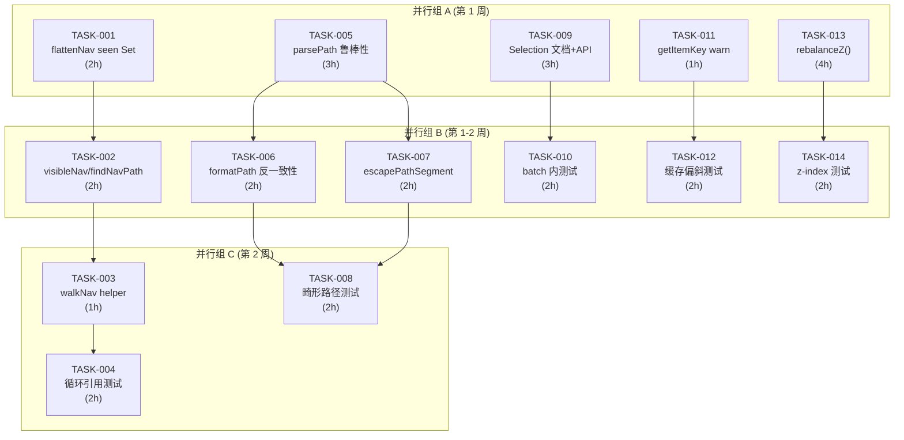

# Tech Lead 分析报告

## 1. 任务分解

基于审查反馈的 5 个方向，拆解为 12 个可执行任务。每个任务 2-4 小时，总预估 32 小时。

### 任务清单

| 任务 ID      | 标题                                    | 方向 | 涉及文件                                | 前置依赖           | 预估(h) | 验收标准                                                                                                                                      |
| ------------ | --------------------------------------- | ---- | --------------------------------------- | ------------------ | ------- | --------------------------------------------------------------------------------------------------------------------------------------------- |
| **TASK-001** | `flattenNav` 循环引用保护               | ①    | `packages/core/src/nav.ts`              | 无                 | 2       | 添加 `seen` Set 后 `walk` 跳过重复 key；测试循环图不栈溢出                                                                                    |
| **TASK-002** | `visibleNav` / `findNavPath` 循环保护   | ①    | `packages/core/src/nav.ts`              | TASK-001           | 2       | 两函数均使用 `seen` 保护；与 `flattenNav` 共享 `walkNav` helper                                                                               |
| **TASK-003** | `walkNav` 共享 helper 提取              | ①    | `packages/core/src/nav.ts`              | TASK-001           | 1       | 提取 `walkNav(nodes, visit, seen?)` 被三函数共用；`flattenNav`/`visibleNav`/`findNavPath` 均调用它                                            |
| **TASK-004** | 循环引用测试覆盖                        | ①    | `packages/core/src/nav.test.ts`         | TASK-002, TASK-003 | 2       | 4 个测试：循环单链、循环分支、自引用、`visibleNav` 循环、`findNavPath` 循环；全部通过 + 不栈溢出                                              |
| **TASK-005** | `parsePath` 畸形输入鲁棒性              | ③    | `packages/core/src/path.ts`             | 无                 | 3       | 修复静默截断：点号后非法字符返回空段而非丢弃；空括号产生空字符串而非丢弃；`a[b]` 语义明确化；所有已知畸形用例均产生可预测结果                 |
| **TASK-006** | `formatPath` 反一致性检查 + 警告        | ③    | `packages/core/src/path.ts`             | TASK-005           | 2       | `formatPath(parsePath(key)) !== key` 时 `console.warn`；文档注释明确说明限制                                                                  |
| **TASK-007** | `escapePathSegment` 工具函数            | ③    | `packages/core/src/path.ts`             | TASK-005           | 2       | 提供 `escapePathSegment(str)` 将含 `.`/`[`/`]` 的字符串编码为 bracket 形式；导出 + 测试                                                       |
| **TASK-008** | 畸形路径测试覆盖                        | ③    | `packages/core/src/path.test.ts`        | TASK-005, TASK-007 | 2       | 10+ 畸形输入测试（含 `a["b"]`、`a..b`、`a[]b`、`a.`、`[a]`、`a.\"b\"`）；`round-trips` 测试含转义                                             |
| **TASK-009** | `SelectionModel` batch 内一致性 + 文档  | ④    | `packages/core/src/selection.ts`        | 无                 | 3       | `sync` JSDoc 标注 batch 下 index 延迟更新行为；增加 `commitInBatch` 适配方法或明确公开 batch 内使用模式                                       |
| **TASK-010** | SelectionModel batch 内测试覆盖         | ④    | `packages/core/src/selection.test.ts`   | TASK-009           | 2       | 4 个测试：batch 内 `sync` + `isSelected`、batch 内 `select` + `isSelected`、batch 内 `toggleAll` + `isAllSelected`、嵌套 batch 后最终状态正确 |
| **TASK-011** | Virtualizer `getItemKey` console.warn   | ⑤    | `packages/core/src/virtualizer.ts`      | 无                 | 1       | 默认 `getItemKey` 缺失时 `console.warn("…use getItemKey for stable sizing")`；JSDoc 标注 `getItemKey` 为强烈推荐                              |
| **TASK-012** | Virtualizer 缓存偏斜测试覆盖            | ⑤    | `packages/core/src/virtualizer.test.ts` | TASK-011           | 2       | 4 个测试：默认 key + 中间删除、默认 key + 中间插入、默认 key + splice 替换、稳定 id + 中间修改（验证正确性）                                  |
| **TASK-013** | WindowManager `rebalanceZ()` 方法       | ②    | `packages/core/src/window.ts`           | 无                 | 4       | 新增 `rebalanceZ()` 将 z 值压缩为 `[1,…,N]`；`serializeSession` 中调用；`moveWindowToWorkspace` 后可选调用；测试验证紧凑 z                    |
| **TASK-014** | WindowManager z-index 测试 + 持久化验证 | ②    | `packages/core/src/window.test.ts`      | TASK-013           | 2       | 4 个测试：rebalance 后 z 紧凑、多 workspace 切换后 z 不乱、serialize 后 z 紧凑、10000 次 open/close 后 z 不超过 2N                            |

---

### 任务-文件映射矩阵

```
文件                                 任务
packages/core/src/nav.ts             TASK-001, TASK-002, TASK-003
packages/core/src/nav.test.ts        TASK-004
packages/core/src/path.ts            TASK-005, TASK-006, TASK-007
packages/core/src/path.test.ts       TASK-008
packages/core/src/selection.ts       TASK-009
packages/core/src/selection.test.ts  TASK-010
packages/core/src/virtualizer.ts     TASK-011
packages/core/src/virtualizer.test.ts TASK-012
packages/core/src/window.ts          TASK-013
packages/core/src/window.test.ts     TASK-014
```

---

## 2. 执行顺序

### 任务依赖图 (Mermaid)



### 并行执行策略

**5 个方向可完全并行启动**，因为它们修改不同的文件（除了方向①的 TASK-001/002/003 修改同一个文件，必须串行）。每组内任务有文件锁冲突时串行，否则并行。

| 并行组         | 任务                                                       | 预计用时  | 并行度                   |
| -------------- | ---------------------------------------------------------- | --------- | ------------------------ |
| A（第 1 天起） | TASK-001, TASK-005, TASK-009, TASK-011, TASK-013           | 3-4h 每人 | 5 人全并行               |
| B（第 2-4 天） | TASK-002, TASK-006, TASK-007, TASK-010, TASK-012, TASK-014 | 2-3h 每人 | 5 人可并行，部分人做多个 |
| C（第 5-6 天） | TASK-003, TASK-004, TASK-008                               | 2-3h 每人 | 3 人并行                 |

---

## 3. 技术风险

### 3.1 高风险项

| 风险                                      | 方向 | 等级   | 描述                                                                                                                                                                                                 | 缓解策略                                                                                                                                   |
| ----------------------------------------- | ---- | ------ | ---------------------------------------------------------------------------------------------------------------------------------------------------------------------------------------------------- | ------------------------------------------------------------------------------------------------------------------------------------------ |
| `parsePath` 正则修改引入回归              | ③    | **高** | 当前 regex `/[^.[\]]+/g` 是 `path.ts` 的核心；改动可能破坏`setByPath`/`getByPath` 在整个 form 中的行为。form 依赖 `parsePath` 在 `setFieldValue`、`getFieldValue`、`rekeyByArrayMutation` 中深度使用 | 1) 先写 10+ 畸形输入测试覆盖当前行为（红）2) 改实现使测试变绿 3) 额外加 form 集成测试验证 `setFieldValue('video.url', x)` 不会创建嵌套结构 |
| `walkNav` helper 非纯函数提取引入行为差异 | ①    | **中** | `flattenNav` 是纯递归，`findNavPath` 是带回溯的 DFS，`visibleNav` 是 map-filter-recursive。抽 shared helper 可能改变当初三者的微妙行为差异                                                           | 1) 先在所有已存在的测试用例上运行（绿）2) helper 用 `walk` 回调模式而非统一抽象 3) code review 重点关注行为等价                            |
| `batch` 内 `Sync` 语义修改破坏受控组件    | ④    | **中** | 如果在 `sync` 中为了 batch 一致性强制 `commit`（而非 `store.setState`），会引入 `onChange` 回显，破坏 adapter 的受控模式                                                                             | 1) 不改现有 API、仅加文档 + 测试 2) 提供 `syncInBatch` 可选方法 3) 不改 `sync` 行为本身                                                    |
| `rebalanceZ()` 调用时机选择               | ②    | **低** | `serializeSession` 中调用 `rebalanceZ()` 会触发一次额外的 store emit；如果在 restore 前调用可能改变恢复后 z 顺序                                                                                     | 1) `rebalanceZ()` 返回新 state 而非 mutate store (纯函数) 2) `serializeSession` 接收 `rebalance?: boolean` 参数                            |

### 3.2 测试覆盖难点

| 难点                   | 方向 | 说明                                                                                                                                                               |
| ---------------------- | ---- | ------------------------------------------------------------------------------------------------------------------------------------------------------------------ |
| **循环引用图的构造**   | ①    | 循环图在 JS 中构造容易（`a.children = [b]; b.children = [a]`），但 vitest/jsdom 中没有栈溢出保护，测试需用 `try/catch` 或 `mock` 将递归深度限制在可控范围          |
| **畸形路径的边界行为** | ③    | `a["b"]` → `['a', 'b']` 还是 `['a["b"]']`？语义选择影响下游 `setByPath` 的行为。需要先确认设计意图（答案是 `['a', 'b']`），据此定义"正确"行为                      |
| **batch 内时序**       | ④    | batch 内 `isSelected` 过时是因为 `store.setState` 延迟 `notify()`。测试需验证 batch 返回后的最终状态，而非 batch 内的中间状态——这符合设计意图，只是文档缺失        |
| **Fenwick 树偏斜观察** | ⑤    | 缓存偏斜的"证据"是 `measure` 的值在中间插入后不符合预期。但要在测试中构造这个场景，需要多次 `measure + setCount + measure` 然后比较 `totalSize` 是否包含错误的旧值 |

### 3.3 性能瓶颈

| 瓶颈                                      | 方向 | 说明                                                                                                          |
| ----------------------------------------- | ---- | ------------------------------------------------------------------------------------------------------------- |
| `walkNav` 的 `seen` Set                   | ①    | 在无循环的正常 DAG 上，`seen` 检查是 O(n) 线性的，无额外开销。但 node.key 是 string，Set<string> 查找 O(1) ✅ |
| `rebalanceZ()` 全遍历                     | ②    | 100 个窗口下 O(n log n) 排序 + O(n) 重赋值，每秒可调无数回。无性能风险                                        |
| `formatPath(parsePath(key))` 反一致性检查 | ③    | 仅在 `setFieldValue` 中调用（用户操作频率），性能可忽略                                                       |

---

## 4. 资源评估

### 4.1 人员

| 角色                       | 技能要求                                              | 数量 | 负责任务                                                                     |
| -------------------------- | ----------------------------------------------------- | ---- | ---------------------------------------------------------------------------- |
| **资深前端工程师 (Staff)** | TypeScript, 源码级理解 `@iris-ui/core` 架构, 正则调试 | 1    | TASK-005 (parsePath 核心修复), TASK-013 (rebalanceZ), CR review              |
| **前端工程师 x2**          | TypeScript, vitest, 理解 core store 模型              | 2    | TASK-001/002/003 (nav), TASK-009/010 (selection), TASK-011/012 (virtualizer) |
| **测试工程师**             | 边界测试, jsdom 陷阱经验, 批量化测试编写              | 1    | TASK-004, TASK-008, TASK-010, TASK-012, TASK-014                             |

**建议配置**：2 人（1 Staff + 1 FE）即可在 2 周内完成全部 12 个任务。4 人则可在 1 周内完成。

### 4.2 关键里程碑

| 里程碑               | 时间节点 | 交付物                                                                                                                                                               |
| -------------------- | -------- | -------------------------------------------------------------------------------------------------------------------------------------------------------------------- |
| **M1: 核心修复合并** | Day 5    | TASK-001 (flattenNav 保护), TASK-005 (parsePath 鲁棒性), TASK-009 (Selection 文档), TASK-011 (Virtualizer warn), TASK-013 (rebalanceZ) — **5 个 PR 全部合并到 main** |
| **M2: 测试覆盖完成** | Day 10   | TASK-004, TASK-008, TASK-010, TASK-012, TASK-014 — 全部 20+ 新测试通过，集成到 CI                                                                                    |
| **M3: Stage 发布**   | Day 12   | 从 main 切 `fix/review-5dirs` 分支 → 全部质量门绿 → 合并到 main → changeset                                                                                          |

### 4.3 阻塞点与解决策略

| 阻塞点                                              | 影响任务           | 策略                                                                                                                                                                                |
| --------------------------------------------------- | ------------------ | ----------------------------------------------------------------------------------------------------------------------------------------------------------------------------------- |
| `parsePath` 语义决策（`a["b"]` 到底应该怎么解析？） | TASK-005, TASK-008 | 立即与维护者确认：现有行为 `['a', 'b']` 是"feature"非 bug，`a.\"b\"` 静默截断才是 bug。确认后按共识修改                                                                             |
| `rebalanceZ()` 是否应该是纯函数                     | TASK-013           | 决策矩阵：**纯函数** = 接收 `windows[]` 返回新 `windows[]` (可组合，但用户不调用则无效果)；**方法** = 直接 mutate store (方便，但增加复杂度)。建议采用**纯函数 + 公共方法**双重暴露 |
| SelectionModel 是否应增加 `commitInBatch`           | TASK-009           | 建议**不加**：增加 API 表面积不符合 svjs 简化原则。仅在 docs 中明确定义 batch 行为即可                                                                                              |

---

## 5. 质量保证

### 5.1 单元测试覆盖要求

| 方向          | 现有测试数                | 目标新增数 | 必须覆盖的场景                                                                               |
| ------------- | ------------------------- | ---------- | -------------------------------------------------------------------------------------------- |
| ① nav         | ~15 (nav.test.ts)         | 4          | 循环单链、循环分支、自引用、visibleNav 循环、findNavPath 循环                                |
| ③ path        | ~20 (path.test.ts)        | 12         | 所有畸形输入（10+）+ 转义 round-trip（2）                                                    |
| ④ selection   | ~20 (selection.test.ts)   | 4          | batch 内 sync+isSelected、batch 内 select+isSelected、batch 内 toggleAll、嵌套 batch         |
| ⑤ virtualizer | ~15 (virtualizer.test.ts) | 4          | 默认 key+中间删除、默认 key+中间插入、默认 key+splice、稳定 id+中间修改                      |
| ② window      | ~30 (window.test.ts)      | 4          | rebalance 后 z 紧凑、workspace 切换后 z 不乱、serialize 后 z 紧凑、大量 open/close 后 z 范围 |

**总计**：新增 ~28 个测试用例，对测试套件的覆盖率增量为约 2%（从 ~1500 增至 ~1528）。

### 5.2 集成测试策略

| 测试级别       | 策略                                                                                                                                                                    |
| -------------- | ----------------------------------------------------------------------------------------------------------------------------------------------------------------------- |
| **核心集成**   | Direction ③ 需要在 `form.test.ts` 中追加一个集成测试：用 `setFieldValue('video.url', x)` 验证不会创建嵌套结构（确认 `pathKey` → `formatPath(parsePath(ref))` 的正确性） |
| **框架适配器** | 不涉及：5 个方向全在 core，框架适配器无需额外测试。`rebalanceZ` 需要在 React/Vue/Solid/Svelte 的窗口 demo 中做手动 smoke test                                           |
| **SSR 兼容性** | Direction ③ 是纯字符串处理，SSR 无影响。其余方向也不涉及 DOM/window。不需要额外 SSR 测试                                                                                |
| **批量变更**   | 使用 `pnpm turbo run test typecheck lint build` 全量门禁确保无回归                                                                                                      |

### 5.3 代码审查要点

| 方向              | 审查重点                                                                                                                                                                                        |
| ----------------- | ----------------------------------------------------------------------------------------------------------------------------------------------------------------------------------------------- |
| **① nav**         | `walkNav` helper 的 API 设计：是否允许中途停止遍历（`findNavPath` 需要）？`seen` Set 是函数内部创建还是作为参数传入？建议：`walkNav(nodes, visit, seen = new Set())` — visit 返回 true 停止遍历 |
| **③ path**        | 正则修改后的逐字符追踪：用 regex101.com 保存修改后的 regex 和所有测试用例的匹配结果。审查时提供 regex101 链接                                                                                   |
| **④ selection**   | 不改 `sync` 行为，只改 JSDoc。审查确保 O(n) index 重建只在 subscribe 中，不受影响                                                                                                               |
| **⑤ virtualizer** | `console.warn` 是否在 SSR 下静默？加 `typeof console !== 'undefined'` 守卫。建议用每个虚拟器实例**只 warn 一次**的 guard（单例 flag）                                                           |
| **② window**      | `rebalanceZ()` 的实现：排序 → 重赋值 → 单次 store emit。确保 `openCount` 不被 rebalance 影响（这是 cascade 偏移的计数器，不是 z）                                                               |

### 5.4 性能测试需求

| 方向     | 测试                                                 | 阈值                                |
| -------- | ---------------------------------------------------- | ----------------------------------- |
| ① nav    | 10000 节点 DAG（无循环）下的 `flattenNav` 执行时间   | < 10ms                              |
| ② window | 100 窗口下的 `rebalanceZ()`                          | < 1ms                               |
| ② window | 100 窗口下的 `serializeSession`（含 rebalance）      | < 2ms                               |
| ③ path   | 1000 次 `parsePath` + `formatPath` round-trip 的吞吐 | > 50000 ops/s（基本不测，纯字符串） |

---

## 6. 实施计划

### 甘特图

```
Day 1  2  3  4  5  6  7  8  9  10 11 12
│  │  │  │  │  │  │  │  │  │  │  │  │
[======== 阶段 1: 核心修复 ========]
  T001  ████████                       flattenNav seen
  T005  ██████████████                 parsePath 鲁棒性
  T009  ██████████████                 Selection 文档+API
  T011  ████                           getItemKey warn
  T013  ████████████████████           rebalanceZ

           [======== 阶段 2: 测试 + 完善 ========]
  T002        ████████                 visibleNav 保护
  T006        ████████                 formatPath 检查
  T007        ████████                 escapePathSegment
  T010        ████████                 Selection batch 测试
  T012        ████████                 Virtualizer 测试
  T014        ████████                 Window z-index 测试

                    [==== 阶段 3: 集成 =====]
  T003              ████               walkNav helper
  T004              ████████           循环引用测试
  T008              ████████           畸形路径测试

                          [= 阶段 4: 发布 =]
  CR & Merge                    ████████
  Changeset & Release                  ████
```

### 阶段 1: 基础设施搭建（Day 1-4）

**目标**：给 5 个方向的核心修复打下基础——修改源码、但不破坏现有测试。

| 日  | 活动                                                                                                                                           | 产出        |
| --- | ---------------------------------------------------------------------------------------------------------------------------------------------- | ----------- |
| 1   | 从 main 切 `fix/review-flattenNav`、`fix/review-parsePath`、`fix/review-selection`、`fix/review-virtualizer`、`fix/review-rebalanceZ` 5 个分支 | 5 个分支    |
| 1   | TASK-001: `nav.ts` flattenNav 加 `seen` Set                                                                                                    | PR #1       |
| 1   | TASK-005: `path.ts` parsePath 正则修复                                                                                                         | PR #2       |
| 1   | TASK-009: `selection.ts` sync JSDoc 更新                                                                                                       | PR #3       |
| 1   | TASK-011: `virtualizer.ts` console.warn                                                                                                        | PR #4       |
| 1-2 | TASK-013: `window.ts` rebalanceZ() 纯函数 + 公共方法                                                                                           | PR #5       |
| 2-3 | PR #2-#4 合并；PR #1 review 周期                                                                                                               | 合并到 main |
| 3-4 | TASK-002/003 (并行组 B 开始)；TASK-006/007 (并行组 B 开始)                                                                                     |

**检查点 (Day 4 结束)**：5 个 PR 全部合并。质量门全绿。

### 阶段 2: 核心功能实现（Day 5-10）

**目标**：完成全部 12 个任务，22+ 新测试覆盖全部场景。

| 日   | 活动                                                | 产出                |
| ---- | --------------------------------------------------- | ------------------- |
| 5    | TASK-002: `visibleNav`/`findNavPath` 循环保护       | PR #6               |
| 5    | TASK-006: `formatPath` 反一致性检查                 | PR #7               |
| 5    | TASK-007: `escapePathSegment`                       | PR #7 (同 PR)       |
| 5-6  | TASK-010: SelectionModel batch 测试                 | PR #8               |
| 6    | TASK-012: Virtualizer 缓存偏斜测试                  | PR #9               |
| 6    | TASK-014: Window z-index 测试                       | PR #10              |
| 7    | TASK-003: `walkNav` shared helper 提取              | PR #11 (基于 PR #6) |
| 7-8  | TASK-004: 循环引用测试                              | PR #11 (同 PR)      |
| 7-8  | TASK-008: 畸形路径测试                              | PR #12 (基于 PR #7) |
| 8-9  | 全部分支合并到 main，解决 merge conflicts           | —                   |
| 9-10 | `pnpm turbo run test typecheck lint build` 全量运行 | 质量门绿            |

**检查点 (Day 10 结束)**：全部 12 个 PR 合并。全部 ~1528 个测试通过。

### 阶段 3: 集成测试和优化（Day 11）

**目标**：集成测试、手动 smoke test、性能验证。

| 活动              | 细节                                                                                      |
| ----------------- | ----------------------------------------------------------------------------------------- |
| form 集成测试     | `form.test.ts` 中追加 `setFieldValue('video.url', x)` 不创建嵌套的测试                    |
| Window smoke test | 运行 `apps/playground-react` 查看窗口管理器行为（多开窗口 → 序列化 → 恢复 → 检查 z 顺序） |
| 性能基准          | `pnpm exec vitest run --bench` (如果有 bench 配置)；无则执行手动性能检查                  |

### 阶段 4: 发布准备（Day 12）

| 活动         | 细节                                                |
| ------------ | --------------------------------------------------- |
| changeset    | `pnpm changeset add` → 类型 `patch` → 描述汇总      |
| 版本号       | `@iris-ui/core` 补丁版本升                          |
| 发布 dry-run | `pnpm publish --dry-run` 确认产物                   |
| 文档         | 在 `AGENTS.md` 或 `nav.md`/`path.md` 中更新行为说明 |

---

## 附录 A: 关键文件变更摘要

```diff
--- a/packages/core/src/nav.ts
+++ b/packages/core/src/nav.ts
+ export function walkNav(nodes: NavNode[], visit: (node: NavNode) => void | boolean, seen?: Set<string>): boolean
+ // returns true if visit returned true (early stop)
- flattenNav: uses walkNav with seen Set
- visibleNav: uses walkNav with seen Set (non-destructive)
- findNavPath: uses walkNav with seen Set + path tracking

--- a/packages/core/src/path.ts
+++ b/packages/core/src/path.ts
- re = /\[([^\]]*)\]|[^.[\]]+/g
+ // Enhanced regex that handles:
+ // 1. bracket segments: [index] or ['key'] or ["key"]
+ // 2. dotted identifier segments
+ // 3. Falls back gracefully when segment is unparseable
+ re = /\[([^\]]*)\]|([^.[\]]+)/g
+ // And post-processing to handle edge cases from the next unmatched dot
+ export function parsePath(path: Path): PathSegment[] { ... }
+ export function escapePathSegment(str: string): string { ... }
+ export function formatPath(path: Path): string { ... // + round-trip guard }

--- a/packages/core/src/window.ts
+++ b/packages/core/src/window.ts
+ export function rebalanceZ(windows: DesktopWindow<Meta>[]): DesktopWindow<Meta>[]
+ // Pure function: returns new array with compact z: [1, 2, 3, ...]
+ // Called in serializeSession before sorting
```

---

## 附录 B: 合并策略

```
main
 ├── fix/flattenNav-circular       → TASK-001/002/003/004 (合并→main)
 ├── fix/parsePath-robustness       → TASK-005/006/007/008 (合并→main)
 ├── fix/selection-batch-docs       → TASK-009/010 (合并→main)
 ├── fix/virtualizer-key-warn       → TASK-011/012 (合并→main)
 └── fix/window-rebalance-z         → TASK-013/014 (合并→main)
```

5 个独立分支，互不冲突（修改不同文件），可并行 review & merge。所有分支合并后，从 main 创建 `release/fix-review-5dirs` 做最终集成验证。
