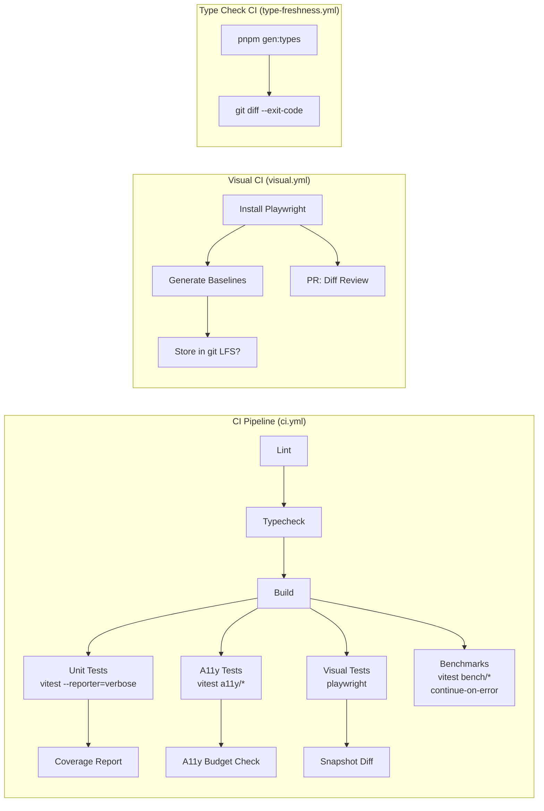
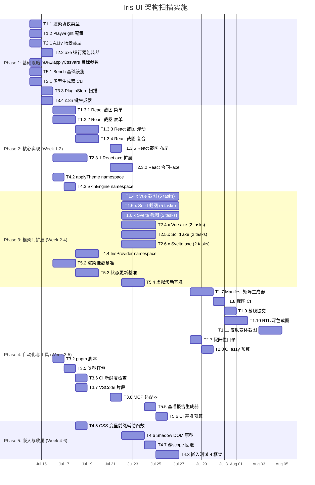

现在我已对整个代码库有了透彻的理解。以下是我的分析。

---

# Tech Lead 分析：Iris UI 架构扫描实施

## 目录

- [1. 任务分解](#1-任务分解)
- [2. 执行顺序](#2-执行顺序)
- [3. 技术风险](#3-技术风险)
- [4. 资源评估](#4-资源评估)
- [5. 质量保证](#5-质量保证)
- [6. 实施计划](#6-实施计划)

---

## 1. 任务分解

我采纳了评估建议，将五个方向重新排序，并将方向 1（可访问性）与方向 3（视觉回归）合并为统一的**渲染协议质量层**。任务编号如下：

| 新编号 | 原始方向           | 优先级 | 总预计工时 |
| ------ | ------------------ | ------ | ---------- |
| T1     | ③ 视觉回归（上调） | P1     | 10 天      |
| T2     | ① 可访问性管线     | P1     | 8 天       |
| T3     | ② 类型级代码生成   | P2     | 6 天       |
| T4     | ④ CSS Token 隔离   | P2     | 6 天       |
| T5     | ⑤ 框架桥接基准     | P2     | 5 天       |

除 T5 外，所有方向均为 4 框架对齐，这意味着部分跨框架任务由 4 个并行子任务组成，每个对应一个框架。

---

### T1：视觉回归测试层（P1，共 35 项任务，10 天）

**Rationale**：149 组件 × 4 框架 × 2 主题 = 1,192 种视觉组合，当前行为合约覆盖 0 种。Token `patch` 能力意味着视觉退化可在无质量门禁的情况下悄无声息地通过。

| 任务 ID    | 标题                                                                                        | 涉及文件                                                                                                                                  | 前置         | 工时 |
| ---------- | ------------------------------------------------------------------------------------------- | ----------------------------------------------------------------------------------------------------------------------------------------- | ------------ | ---- |
| **T1.1**   | 渲染协议类型定义                                                                            | `packages/core/src/contracts/types.ts`                                                                                                    | 无           | 2h   |
|            | 添加截图配置类型与测试矩阵 API                                                              |                                                                                                                                           |              |      |
| **T1.2**   | Playwright 依赖项 + Vitest 配置                                                             | `packages/react/vitest.config.ts`, `packages/vue/vitest.config.ts`, `packages/solid/vitest.config.ts`, `packages/svelte/vitest.config.ts` | T1.1         | 2h   |
|            | 添加 `@playwright/test`；为每个框架创建 `e2e/` vitest 工作空间                              |                                                                                                                                           |              |      |
| **T1.3.1** | React 截图——简单组件                                                                        | `packages/react/e2e/visual.test.ts`                                                                                                       | T1.2         | 4h   |
|            | Button、Badge、Alert、Banner、Chip、Divider、Spinner、Avatar、Badge、Progress（~10 个组件） |                                                                                                                                           |              |      |
| **T1.3.2** | React 截图——表单组件                                                                        | `packages/react/e2e/visual-form.test.ts`                                                                                                  | T1.2         | 3h   |
|            | Input、Select、Switch、Checkbox、Radio、Slider、NumberInput、Rating、OtpInput、TagInput     |                                                                                                                                           |              |      |
| **T1.3.3** | React 截图——浮动/模态组件                                                                   | `packages/react/e2e/visual-overlay.test.ts`                                                                                               | T1.2         | 3h   |
|            | Dialog、Drawer、Popover、Tooltip、Dropdown、Menu、Combobox                                  |                                                                                                                                           |              |      |
| **T1.3.4** | React 截图——复合组件                                                                        | `packages/react/e2e/visual-composite.test.ts`                                                                                             | T1.2         | 4h   |
|            | Table、Tree、Calendar、Cascader、ColorPicker、Transfer、Tour、Splitter、Tabs、Accordion     |                                                                                                                                           |              |      |
| **T1.3.5** | React 截图——布局/骨架                                                                       | `packages/react/e2e/visual-layout.test.ts`                                                                                                | T1.2         | 2h   |
|            | Stack、Container、Grid、Sidebar、Header、AdminLayout、DashboardGrid、Login                  |                                                                                                                                           |              |      |
| **T1.4.1** | Vue 截图——简单组件                                                                          | `packages/vue/e2e/visual.test.ts`                                                                                                         | T1.2, T1.3.x | 4h   |
|            | 将 T1.3.1–5 的截图模式移植到 Vue                                                            |                                                                                                                                           |              |      |
| **T1.4.2** | Vue 截图——表单组件                                                                          | `packages/vue/e2e/visual-form.test.ts`                                                                                                    | T1.2         | 3h   |
| **T1.4.3** | Vue 截图——浮动组件                                                                          | `packages/vue/e2e/visual-overlay.test.ts`                                                                                                 | T1.2         | 3h   |
| **T1.4.4** | Vue 截图——复合组件                                                                          | `packages/vue/e2e/visual-composite.test.ts`                                                                                               | T1.2         | 4h   |
| **T1.4.5** | Vue 截图——布局                                                                              | `packages/vue/e2e/visual-layout.test.ts`                                                                                                  | T1.2         | 2h   |
| **T1.5.1** | Solid 截图——简单                                                                            | `packages/solid/e2e/visual.test.ts`                                                                                                       | T1.2, T1.3.x | 4h   |
| **T1.5.2** | Solid 截图——表单                                                                            | `packages/solid/e2e/visual-form.test.ts`                                                                                                  | T1.2         | 3h   |
| **T1.5.3** | Solid 截图——浮动                                                                            | `packages/solid/e2e/visual-overlay.test.ts`                                                                                               | T1.2         | 3h   |
| **T1.5.4** | Solid 截图——复合                                                                            | `packages/solid/e2e/visual-composite.test.ts`                                                                                             | T1.2         | 4h   |
| **T1.5.5** | Solid 截图——布局                                                                            | `packages/solid/e2e/visual-layout.test.ts`                                                                                                | T1.2         | 2h   |
| **T1.6.1** | Svelte 截图——简单                                                                           | `packages/svelte/e2e/visual.test.ts`                                                                                                      | T1.2, T1.3.x | 4h   |
| **T1.6.2** | Svelte 截图——表单                                                                           | `packages/svelte/e2e/visual-form.test.ts`                                                                                                 | T1.2         | 3h   |
| **T1.6.3** | Svelte 截图——浮动                                                                           | `packages/svelte/e2e/visual-overlay.test.ts`                                                                                              | T1.2         | 3h   |
| **T1.6.4** | Svelte 截图——复合                                                                           | `packages/svelte/e2e/visual-composite.test.ts`                                                                                            | T1.2         | 4h   |
| **T1.6.5** | Svelte 截图——布局                                                                           | `packages/svelte/e2e/visual-layout.test.ts`                                                                                               | T1.2         | 2h   |
| **T1.7**   | Manifest 驱动的测试矩阵生成器                                                               | `packages/manifest/src/visual-matrix.ts`                                                                                                  | T1.1         | 4h   |
|            | 将 `manifest.json` 转换为 Playwright 测试配方（按组件分组，按框架分组）                     |                                                                                                                                           |              |      |
| **T1.8**   | 截图更新 CI 工作流                                                                          | `.github/workflows/visual.yml`                                                                                                            | T1.3–1.6     | 2h   |
|            | Playwright 安装、`update-snapshots` 工作流、PR 评论与差异报告                               |                                                                                                                                           |              |      |
| **T1.9**   | 基础截图基线提交                                                                            | `packages/*/e2e/__screenshots__/`                                                                                                         | T1.3–1.6     | 1h   |
|            | 首次运行以生成基线并提交                                                                    |                                                                                                                                           |              |      |
| **T1.10**  | RTL/深色主题的参数化截图                                                                    | 全部 `e2e/*.test.ts` 文件（主题参数化）                                                                                                   | T1.3–1.6     | 4h   |
|            | 在 LTR/RTL 方向下和深色主题中重新运行截图                                                   |                                                                                                                                           |              |      |
| **T1.11**  | 皮肤变体截图                                                                                | `packages/skins/e2e/visual.test.ts`                                                                                                       | T1.7         | 3h   |
|            | 截取每个内置皮肤（light、dark、ocean 等）的参考组件图                                       |                                                                                                                                           |              |      |

---

### T2：可访问性自动化管线（P1，共 13 项任务，8 天）

**Rationale**：149 个组件中只有约 16 个（11%）经过 axe 扫描。124+ 个重型组件（Tree、Table、Calendar、Cascader、ColorPicker、Transfer、Tour、Splitter）完全未被 axe 覆盖。这是合规风险。

| 任务 ID    | 标题                                                                              | 涉及文件                                                           | 前置       | 工时 |
| ---------- | --------------------------------------------------------------------------------- | ------------------------------------------------------------------ | ---------- | ---- |
| **T2.1**   | 可访问性合约场景扩展                                                              | `packages/core/src/contracts/scenarios/`（新增 `a11yScenario.ts`） | 无         | 2h   |
|            | 定义 `A11yScenario extends ContractScenario` 类型 + 每个未覆盖组件的开放/关闭场景 |                                                                    |            |      |
| **T2.2**   | 通用 axe 运行器包装器                                                             | `packages/core/src/contracts/axe-runner.ts`                        | T2.1       | 2h   |
|            | `await axeViolations(container, options)` 带框架特定的假阳性许可列表              |                                                                    |            |      |
| **T2.3.1** | React：将 axe 覆盖范围从 16 → 60+                                                 | `packages/react/src/a11y.test.tsx`                                 | T2.2       | 6h   |
|            | 为 45+ 个新增组件添加 axe 测试；用 T2.1 中的动作序列打开浮动组件                  |                                                                    |            |      |
| **T2.3.2** | React：合同 + axe 统一测试                                                        | `packages/react/src/contracts-a11y.test.tsx`                       | T2.1, T2.2 | 3h   |
|            | 运行 `runContract(scenario)` 后立即执行 `await axeViolations(container)`          |                                                                    |            |      |
| **T2.4.1** | Vue：将 axe 覆盖范围从 16 → 60+                                                   | `packages/vue/src/a11y.test.ts`                                    | T2.2       | 6h   |
| **T2.4.2** | Vue：合同 + axe 统一测试                                                          | `packages/vue/src/contracts-a11y.test.ts`                          | T2.1, T2.2 | 3h   |
| **T2.5.1** | Solid：将 axe 覆盖范围从 12 → 60+                                                 | `packages/solid/src/a11y.test.tsx`                                 | T2.2       | 6h   |
| **T2.5.2** | Solid：合同 + axe 统一测试                                                        | `packages/solid/src/contracts-a11y.test.tsx`                       | T2.1, T2.2 | 3h   |
| **T2.6.1** | Svelte：将 axe 覆盖范围从 12 → 60+                                                | `packages/svelte/src/a11y.test.ts`                                 | T2.2       | 6h   |
| **T2.6.2** | Svelte：合同 + axe 统一测试                                                       | `packages/svelte/src/contracts-a11y.test.ts`                       | T2.1, T2.2 | 3h   |
| **T2.7**   | 框架特定的假阳性许可列表目录                                                      | `packages/core/src/contracts/a11y-allowlists.ts`                   | T2.2       | 2h   |
|            | 收集每个框架 A 级中已知的假阳性；允许降级为 `warn`                                |                                                                    |            |      |
| **T2.8**   | CI 可访问性预算门                                                                 | `.github/workflows/ci.yml`（在 `lint` 后添加 `a11y-budget` 步骤）  | T2.3–2.6   | 1h   |
|            | 阻止违规数超过阈值的 PR（初始值：允许最多 5 个新违规，零容忍模式）                |                                                                    |            |      |

---

### T3：类型级 Manifest 代码生成（P2，共 8 项任务，6 天）

**Rationale**：`manifest.json` 已包含 props（名称/类型/可选项/枚举/描述），但无编译时类型提取。MCP 服务器运行时消费这些数据；类型生成则增加编译时安全保障。

| 任务 ID  | 标题                                                                                                  | 涉及文件                                                                         | 前置             | 工时 |
| -------- | ----------------------------------------------------------------------------------------------------- | -------------------------------------------------------------------------------- | ---------------- | ---- | --- |
| **T3.1** | Manifest 类型生成器 CLI                                                                               | `packages/manifest/src/gen-types.ts`                                             | 无               | 3h   |
|          | 为每个框架生成 `@iris-ui/{framework}/__generated__/component-types.d.ts`：每个组件对应一个 Props 接口 |                                                                                  |                  |      |
| **T3.2** | pnpm 脚本集成                                                                                         | `packages/manifest/package.json`（新增 `"gen:types": "node dist/gen-types.js"`） | T3.1             | 0.5h |
| **T3.3** | PluginStore 类型扫描器                                                                                | `packages/manifest/src/scan-plugin-stores.ts`                                    | 无               | 3h   |
|          | 扫描插件的 `registerStore('key', factory)` 调用；发出 `PluginStoreMap` 类型                           |                                                                                  |                  |      |
| **T3.4** | i18n 键枚举生成器                                                                                     | `packages/manifest/src/gen-i18n-keys.ts`                                         | 无               | 2h   |
|          | 从 core 默认字典 + 插件 `registerMessages` 扫描 i18n 键；发出 `I18nKey` 联合类型                      |                                                                                  |                  |      |
| **T3.5** | 基础类型打包                                                                                          | `packages/manifest/src/__generated__/index.d.ts` 生成                            | T3.1, T3.3, T3.4 | 1h   |
|          | `IrisComponentProps<Name>`、`PluginStores`、`I18nKeys` 全局类型                                       |                                                                                  |                  |      |
| **T3.6** | CI 类型新鲜度检查                                                                                     | `.github/workflows/ci.yml`（步骤：`pnpm gen:types && git diff --exit-code`）     | T3.5             | 0.5h |
| **T3.7** | VSCode 自动补全集成                                                                                   | `packages/manifest/snippets/`                                                    | T3.5             | 2h   |
|          | 为 `t('                                                                                               | ')`创建 VSCode 片段，并添加`IrisComponentProps` 类型辅助                         |                  |      |     |
| **T3.8** | MCP 工具使用生成类型的适配器                                                                          | `packages/mcp/src/codegen.ts`                                                    | T3.5             | 1h   |
|          | 在 MCP 响应中添加编译时类型导入                                                                       |                                                                                  |                  |      |

---

### T4：CSS Token 隔离与嵌入协议（P2，共 8 项任务，6 天）

**Rationale**：当前所有 token 都写入 `:root`（全局）。微前端/嵌入场景需要 CSS 命名空间或 Shadow DOM。

| 任务 ID  | 标题                                                                                                                                                      | 涉及文件                                                                                                                                       | 前置       | 工时 |
| -------- | --------------------------------------------------------------------------------------------------------------------------------------------------------- | ---------------------------------------------------------------------------------------------------------------------------------------------- | ---------- | ---- |
| **T4.1** | `applyCssVars`——目标 + 命名空间参数                                                                                                                       | `packages/theme/src/applyCssVars.ts`                                                                                                           | 无         | 2h   |
|          | 添加 `target?: HTMLElement \| ShadowRoot` 和 `namespace?: string`；更新 `toCssVarName` 以在命名空间模式下添加前缀（`--iris-foo` → `--iris-embedded-foo`） |                                                                                                                                                |            |      |
| **T4.2** | `applyTheme`——传递命名空间                                                                                                                                | `packages/theme/src/applyTheme.ts`                                                                                                             | T4.1       | 1h   |
|          | 将 `namespace` 传播到 `applyCssVars`                                                                                                                      |                                                                                                                                                |            |      |
| **T4.3** | `createSkinEngine`——命名空间感知                                                                                                                          | `packages/skins/src/engine.ts`                                                                                                                 | T4.1       | 2h   |
|          | 皮肤引擎通过 `namespace` 提供程序上下文将 var 名称映射传递给 `applySkin`                                                                                  |                                                                                                                                                |            |      |
| **T4.4** | `IrisProvider`——`namespace` prop                                                                                                                          | `packages/react/src/provider/`、`packages/vue/src/provider/`、`packages/solid/src/provider/`、`packages/svelte/src/provider/`                  | T4.3       | 3h   |
|          | 添加 `namespace` prop，将其传播到 theme/skin 上下文                                                                                                       |                                                                                                                                                |            |      |
| **T4.5** | CSS 变量前缀辅助函数                                                                                                                                      | `packages/theme/src/toCssVarName.ts`                                                                                                           | T4.1       | 1h   |
|          | `toCssVarName(key, namespace?)`——当命名空间非空时，`--iris-foo` → `--iris-ns-foo`                                                                         |                                                                                                                                                |            |      |
| **T4.6** | Shadow DOM 嵌入原型                                                                                                                                       | `packages/theme/src/embed.ts`                                                                                                                  | T4.2       | 3h   |
|          | `embedTheme(theme, { mode: 'shadow-dom' \| 'namespace' \| 'scope' })` API                                                                                 |                                                                                                                                                |            |      |
| **T4.7** | `@scope` 回退方案                                                                                                                                         | `packages/theme/src/globalStyles.ts`                                                                                                           | T4.6       | 2h   |
|          | 当 `attachShadow` 不可用时（SSR），以 `@scope(.iris-embedded) { :scope { … } }` 发出样式                                                                  |                                                                                                                                                |            |      |
| **T4.8** | 所有 4 个框架的嵌入测试                                                                                                                                   | `packages/react/e2e/embed.test.tsx`、`packages/vue/e2e/embed.test.ts`、`packages/solid/e2e/embed.test.ts`、`packages/svelte/e2e/embed.test.ts` | T4.4, T4.6 | 4h   |
|          | 测试 CSS 变量隔离：外部 var 更改不应影响嵌入实例                                                                                                          |                                                                                                                                                |            |      |

---

### T5：框架响应式桥接基准（P2，共 6 项任务，5 天）

**Rationale**：核心的“薄桥”主张需要可重复的基准来证明。目前只有纯 JS 基准（`core/src/scale.bench.ts`）。

| 任务 ID  | 标题                                                                    | 涉及文件                                                                                                                                                      | 前置     | 工时 |
| -------- | ----------------------------------------------------------------------- | ------------------------------------------------------------------------------------------------------------------------------------------------------------- | -------- | ---- |
| **T5.1** | 基准基础设施：每个框架的 Titan 配置                                     | `packages/react/bench/vitest.bench.ts`、`packages/vue/bench/vitest.bench.ts`、`packages/solid/bench/vitest.bench.ts`、`packages/svelte/bench/vitest.bench.ts` | 无       | 2h   |
|          | Vitest bench 工作空间 + 每个框架的运行器                                |                                                                                                                                                               |          |      |
| **T5.2** | 渲染挂载基准                                                            | 每个框架的 `packages/*/bench/render-mount.bench.ts`                                                                                                           | T5.1     | 3h   |
|          | 测量 Button、Input、Select、Table、Tree、Dialog 的挂载时间（毫秒）      |                                                                                                                                                               |          |      |
| **T5.3** | 状态更新基准                                                            | 每个框架的 `packages/*/bench/state-update.bench.ts`                                                                                                           | T5.1     | 3h   |
|          | 在 100/1000/5000 个项目上测量 selection/expansion/pagination 的更新延迟 |                                                                                                                                                               |          |      |
| **T5.4** | 大型列表基准（虚拟滚动）                                                | 每个框架的 `packages/*/bench/virtual-scroll.bench.ts`                                                                                                         | T5.1     | 3h   |
|          | 10000 行数据的虚拟滚动吞吐量                                            |                                                                                                                                                               |          |      |
| **T5.5** | 跨框架比较报告                                                          | `scripts/bench-report.ts`                                                                                                                                     | T5.2–5.4 | 2h   |
|          | 将基准结果聚合并渲染为 markdown 表格                                    |                                                                                                                                                               |          |      |
| **T5.6** | CI 基准预算                                                             | `.github/workflows/bench.yml`                                                                                                                                 | T5.2–5.4 | 1h   |
|          | 当某个框架比 React 基线慢 > 2 倍时发出警告；不阻塞 PR                   |                                                                                                                                                               |          |      |

---

## 2. 执行顺序

```mermaid
graph TD
    subgraph "Phase 1: Infrastructure (Weeks 1-2)"
        T1_1[T1.1: 渲染协议类型<br/>2h]
        T1_2[T1.2: Playwright 配置<br/>2h]
        T2_1[T2.1: A11y 场景类型<br/>2h]
        T2_2[T2.2: axe 运行器包装器<br/>2h]
        T4_1[T4.1: applyCssVars 目标参数<br/>2h]
        T5_1[T5.1: Bench 基础设施<br/>2h]
    end

    subgraph "Phase 2: Core Implementation (Weeks 2-4)"
        T1_1 --> T1_3_1[T1.3.1: React 截图 简单<br/>4h]
        T1_1 --> T1_3_2[T1.3.2: React 截图 表单<br/>3h]
        T1_1 --> T1_3_3[T1.3.3: React 截图 浮动<br/>3h]
        T1_1 --> T1_3_4[T1.3.4: React 截图 复合<br/>4h]
        T1_1 --> T1_3_5[T1.3.5: React 截图 布局<br/>2h]

        T2_1 --> T2_3_1[T2.3.1: React axe 扩展<br/>6h]
        T2_2 --> T2_3_2[T2.3.2: React 合同+axe<br/>3h]

        T4_1 --> T4_2[T4.2: applyTheme namespace<br/>1h]
        T4_2 --> T4_3[T4.3: SkinEngine namespace<br/>2h]

        T5_1 --> T5_2[T5.2: 渲染挂载基准<br/>3h]
        T5_1 --> T5_3[T5.3: 状态更新基准<br/>3h]
        T5_1 --> T5_4[T5.4: 虚拟滚动基准<br/>3h]
    end

    subgraph "Phase 3: Cross-framework (Weeks 3-5)"
        T1_3_1 -.-> T1_4_1[T1.4.1: Vue 截图 简单<br/>4h]
        T1_3_2 -.-> T1_4_2[T1.4.2: Vue 截图 表单<br/>3h]
        T1_3_3 -.-> T1_4_3[T1.4.3: Vue 截图 浮动<br/>3h]
        T1_3_4 -.-> T1_4_4[T1.4.4: Vue 截图 复合<br/>4h]
        T1_3_5 -.-> T1_4_5[T1.4.5: Vue 截图 布局<br/>2h]

        T1_3_x -.-> T1_5_x["Solid 截图 (5 tasks)<br/>16h"]
        T1_3_x -.-> T1_6_x["Svelte 截图 (5 tasks)<br/>16h"]

        T2_3_1 -.-> T2_4_1[T2.4.1: Vue axe 扩展<br/>6h]
        T2_3_2 -.-> T2_4_2[T2.4.2: Vue 合同+axe<br/>3h]
        T2_3_1 -.-> T2_5_1[T2.5.1: Solid axe 扩展<br/>6h]
        T2_3_2 -.-> T2_5_2[T2.5.2: Solid 合同+axe<br/>3h]
        T2_3_1 -.-> T2_6_1[T2.6.1: Svelte axe 扩展<br/>6h]
        T2_3_2 -.-> T2_6_2[T2.6.2: Svelte 合同+axe<br/>3h]
    end

    subgraph "Phase 4: Automation & Tooling (Weeks 4-6)"
        T1_3_x --> T1_7[T1.7: Manifest 矩阵生成器<br/>4h]
        T1_7 --> T1_8[T1.8: 截图 CI<br/>2h]
        T1_7 --> T1_9[T1.9: 基线提交<br/>1h]
        T1_7 --> T1_10[T1.10: RTL/深色截图<br/>4h]
        T1_7 --> T1_11[T1.11: 皮肤变体截图<br/>3h]

        T2_3_x --> T2_7[T2.7: 假阳性目录<br/>2h]
        T2_7 --> T2_8[T2.8: CI a11y 预算<br/>1h]

        T5_2 --> T5_5[T5.5: 基准报告生成器<br/>2h]
        T5_5 --> T5_6[T5.6: CI 基准预算<br/>1h]

        T4_3 --> T4_4[T4.4: IrisProvider namespace<br/>3h]
        T4_4 --> T4_6[T4.6: Shadow DOM 原型<br/>3h]
        T4_6 --> T4_7[T4.7: @scope 回退<br/>2h]
        T4_6 --> T4_8[T4.8: 嵌入测试 4 框架<br/>4h]
    end

    subgraph "Type Generation (Parallel, Phase 2-4)"
        T3_1[T3.1: 类型生成器 CLI<br/>3h]
        T3_3[T3.3: PluginStore 扫描<br/>3h]
        T3_4[T3.4: i18n 键生成器<br/>2h]
        T3_1 --> T3_2[T3.2: pnpm 脚本<br/>0.5h]
        T3_1 --> T3_5[T3.5: 类型打包<br/>1h]
        T3_3 --> T3_5
        T3_4 --> T3_5
        T3_5 --> T3_6[T3.6: CI 新鲜度检查<br/>0.5h]
        T3_5 --> T3_7[T3.7: VSCode 片段<br/>2h]
        T3_5 --> T3_8[T3.8: MCP 适配器<br/>1h]
    end

    style T1_1 fill:#aaf,stroke:#333
    style T2_1 fill:#afa,stroke:#333
    style T4_1 fill:#faa,stroke:#333
    style T5_1 fill:#ffa,stroke:#333
    style T3_1 fill:#faf,stroke:#333
```

### 可并行块

| 块 ID             | 任务                                    | 所需人员     |
| ----------------- | --------------------------------------- | ------------ |
| **块 A**          | T1.2 + T1.3.1–5（React 视觉，仅单框架） | 1 人         |
| **块 B**          | T2.1 + T2.2（基础设施）                 | 1 人         |
| **块 C**          | T4.1（基础设施）                        | 1 人         |
| **块 D**          | T5.1（基础设施）                        | 1 人         |
| **块 E**          | T3.1 + T3.3 + T3.4（类型基础设施）      | 1 人         |
| _块 A–E 完全并行_ |                                         | **4 人同时** |

块 B 完成后的并行工作：

| 块 ID    | 任务                                       |
| -------- | ------------------------------------------ |
| **块 F** | T2.3.x–T2.6.x（4 个框架的 axe 覆盖）——4 人 |
| **块 G** | T4.2–T4.4（命名空间传播）                  |

T1.3.x 完成后的并行工作：

| 块 ID    | 任务                               |
| -------- | ---------------------------------- |
| **块 H** | T1.4.x–T1.6.x（框架截图 x3）——3 人 |
| **块 I** | T1.7（矩阵生成器）                 |

---

## 3. 技术风险

### R1：视觉截图在 jsdom 中不可行 → 需要真正的浏览器基础设施

- **严重性**：高。jsdom 不渲染布局，因此 `toMatchScreenshot()` 需要完整的 Playwright 浏览器上下文。
- **缓解措施**：Playwright 测试通过 vitest 工作空间运行，与标准 jsdom 测试分开。为每个框架的 `e2e/` 目录添加专用的 `vitest.config.ts`，使用 `@playwright/test` 环境。
- **回退**：如果 Playwright 设置过于复杂，另一种方案是将 SVG 字符串化并与 jest-image-snapshot 进行比较，但覆盖率较低。

### R2：跨框架的 aria 模式分歧

- **严重性**：中。Svelte 的 Accordion 可能使用 `
`/`
` 而非 `role="button"`，导致 axe 违规不同。
- **缓解措施**：`T2.7` 中的假阳性许可列表。每个框架获得一个 `Record<string, string[]>` 映射：`{ componentName: ['rule-id-1', 'rule-id-2'] }`，列出预期违规。
- **监控**：在 CI 中统计每个框架的 axe 违规数，如果任何框架偏离基线超过一定数量则发出警报。

### R3：类型生成器的 Manifest 数据漂移

- **严重性**：中。如果 manifest props 提取器错过新 prop 或枚举值，生成的类型将过时。
- **缓解措施**：`T3.6` 中的 `git diff --exit-code` 检查在 CI 中执行 `gen:types` 后确保类型文件与版本控制完全一致，形成与工作流无关的“新鲜度”检查。
- **回退**：为类型生成添加一个整合测试，验证所有 149 个组件都生成了有效的 TypeScript。

### R4：Shadow DOM 样式泄漏/穿透问题

- **严重性**：高。`var(--iris-*)` 值在 Shadow DOM 中默认无法穿透，因为自定义属性不会穿越 Shadow DOM 边界，除非使用 `@property` 或 `inherits: true` 注册。
- **缓解措施**：优先选择“命名空间”方案（`--iris-ns-foo`）而非 Shadow DOM。将 Shadow DOM 作为次要选择，通过 `@scope` 作为 SSR 回退。
- **参考**：检查 `@iris-ui/theme` 包的 `globalStyles.ts` 中关于 `@scope` 的支持。

### R5：基准结果方差

- **严重性**：低。CI 运行器硬件的内存/CPU 差异会导致基准数字波动。
- **缓解措施**：不将基准作为 PR 堵塞门。使用“相对”指标（如果某个框架比 React 基线慢 > 2 倍则发出警告），而非绝对阈值。在专用运行器上运行基准。

### R6：Svelte 5 runes 兼容性

- **严重性**：中。`contracts.test.ts` 中的 Svelte 测试使用 `$state()`，存在命名冲突（变量命名为 `state` 会被误解）。
- **缓解措施**：遵循 `AGENTS.md` 约定：“不要将 `$state` 变量命名为 `state`”。在截图基准测试中，同样避免使用 `state` 变量名。

---

## 4. 资源评估

### 人员配置

| 角色                     | 技能要求                                        | 数量        | 主要任务                                         |
| ------------------------ | ----------------------------------------------- | ----------- | ------------------------------------------------ |
| **框架专家 A（React）**  | React 18/19、jsdom、Playwright、面向可访问性    | 1           | T1.3.x、T2.3.x、T4.4（React）、T5.2–4（React）   |
| **框架专家 B（Vue）**    | Vue 3、`@vue/test-utils`、Playwright、Vitest    | 1           | T1.4.x、T2.4.x、T4.4（Vue）、T5.2–4（Vue）       |
| **框架专家 C（Solid）**  | SolidJS、`@solidjs/testing-library`、Playwright | 1           | T1.5.x、T2.5.x、T4.4（Solid）、T5.2–4（Solid）   |
| **框架专家 D（Svelte）** | Svelte 5、`@testing-library/svelte`、Playwright | 1           | T1.6.x、T2.6.x、T4.4（Svelte）、T5.2–4（Svelte） |
| **核心/工具工程师**      | TypeScript、代码生成、MCP、CSS/主题             | 1           | T3.x、T4.1–3、T4.5–7、T1.1、T2.1–2、T5.1、T5.5   |
| **CI/平台工程师**        | GitHub Actions、Docker、Playwright CI           | 0.5（兼职） | T1.8、T2.8、T3.6、T5.6                           |

**最小团队规模：3 人**（1 核心工程师 + 2 框架专家，重叠交付）。**理想团队规模：5 人**（所有 4 个框架专家 + 1 核心工程师）。

### 关键里程碑

| 里程碑                        | 交付物                                                                  | 最早日期（从开始） | 前置条件         |
| ----------------------------- | ----------------------------------------------------------------------- | ------------------ | ---------------- |
| **M1：基础设施就绪**          | Playwright 运行中、axe 运行器、命名空间参数、基准运行器、类型脚本       | 第 5 天            | 块 A–E           |
| **M2：React a11y + 视觉完成** | React 上的 axe 覆盖率达到 60+ 个组件；149 个组件中的 React 屏幕截图基线 | 第 10 天           | T1.3.x、T2.3.x   |
| **M3：4 框架 a11y 覆盖**      | 所有 4 个框架的 axe 覆盖率 > 50%                                        | 第 14 天           | T2.3–2.6         |
| **M4：4 框架视觉覆盖**        | 所有 4 个框架的 Playwright 屏幕截图基线                                 | 第 16 天           | T1.4–1.6         |
| **M5：自动化门禁**            | CI a11y 预算 + 视觉差异检查 + manifest 类型新鲜度                       | 第 18 天           | T1.8、T2.8、T3.6 |
| **M6：嵌入基础**              | 命名空间 + `@scope` + Shadow DOM 隔离运行中                             | 第 20 天           | T4.4–4.8         |
| **M7：代码生成 + 基准**       | 类型生成器、i18n 键类型、VSCode 片段、基准报告                          | 第 22 天           | T3.x、T5.x       |

### 阻塞点与解决策略

| 阻塞点                                                 | 风险等级 | 策略                                                                        |
| ------------------------------------------------------ | -------- | --------------------------------------------------------------------------- |
| Playwright 在无头 CI 中需要图形驱动程序                | 中       | `playwright install-deps` + `xvfb-run`。所有 CI 运行器均已预装              |
| 大型组件（Table、Tree、Calendar）的 axe 测试运行速度慢 | 低       | 将大型组件标记为 `--timeout=30000`，在专用的慢速文件中分组                  |
| Shadow DOM 中自定义属性的浏览器兼容性                  | 中       | 优先选择“命名空间”方案（更简单的字符串替换）。Shadow DOM 作为可选的执行模式 |
| MCP 服务器导入 manifest 的方式与类型生成器冲突         | 低       | MCP 使用 `require.resolve`；类型生成器使用文件系统读取；无共享状态          |
| Svelte 5 generics 属性破坏 svelte-check                | 中       | 遵循 AGENTS.md：避免将 `$state` 变量命名为 `state`，小心使用 generics       |

---

## 5. 质量保证

### 单元测试覆盖要求

| 方向            | 要求                                                                    | 目标                                                                       |
| --------------- | ----------------------------------------------------------------------- | -------------------------------------------------------------------------- |
| T1（视觉）      | 无单元测试——演示为基础                                                  | —                                                                          |
| T2（a11y）      | 每个框架的 `a11y.test.ts` 中使用 `axeViolations()` 覆盖每个组件         | 每组件每框架 ≥ 1 次 axe 调用                                               |
| T2（合同+a11y） | 每个框架的 `contracts-a11y.test.ts` 中，在 `runContract` 后立即运行 axe | 42 个场景 × 4 框架 = 168 次 axe 运行                                       |
| T3（类型）      | 每个生成器函数的 Vitest 单元测试                                        | `gen-types.test.ts`、`scan-plugin-stores.test.ts`、`gen-i18n-keys.test.ts` |
| T4（嵌入）      | `applyCssVars`、`applyTheme`、`toCssVarName` 的单元测试                 | 覆盖 `namespace` 路径的所有变体                                            |
| T4（嵌入）      | 每个框架的 e2e 测试，验证 CSS 变量隔离                                  | 4 个 `embed.test.ts` 文件                                                  |
| T5（基准）      | 无通过/失败断言（仅测量值）                                             | 每个框架 3 个基准文件，统计显著性                                          |

### 集成测试策略

**关键集成点**：

1. **视觉差异**：Playwright 截图作为二进制文件提交。PR 评论包含包含/排除差异的 HTML 报告。
2. **A11y 预算**：通过统计每个组件的 `violations.length` 来实现。如果总违规 > 基线 + 5，则构建失败。
3. **类型新鲜度**：类型文件必须与生成的输出完全匹配。如果没有，开发者需要运行 `pnpm gen:types`。

### 代码审查要点

| 文件                      | 审查重点                                                                            |
| ------------------------- | ----------------------------------------------------------------------------------- |
| `applyCssVars.ts`         | `target` 参数处理、`ShadowRoot` 与 `HTMLElement` 的类型安全性、`namespace` 前缀逻辑 |
| `a11y.test.tsx`（×4）     | 每个组件的渲染状态是否可被 axe 扫描（Dialog 是否打开？Tree 是否展开？）             |
| `visual.test.ts`（×20）   | 要匹配的组件是否高度一致？主题变量是否已应用？                                      |
| `gen-types.ts`            | 输出类型是否与同一组件的实际 TypeScript 接口匹配？`enum` 值是否与 manifest 同步？   |
| `engine.ts`（skins）      | `namespace` 是否传递到 `applyCssVars`？回退路径是否完整？                           |
| `bench/*.bench.ts`（×12） | 基准是否测量正确的指标？预热期？统计方差？                                          |

### 性能测试需求

| 测试                      | 指标                   | 阈值                                              |
| ------------------------- | ---------------------- | ------------------------------------------------- |
| 挂载时间（Button、Input） | 平均挂载时间（毫秒）   | React ≤ 2ms，Vue ≤ 3ms，Solid ≤ 2ms，Svelte ≤ 3ms |
| 状态更新（1000 项列表）   | 选择延迟（毫秒）       | 所有框架 ≤ 5ms                                    |
| 虚拟滚动（10000 行）      | 滚动至第 5000 行的延迟 | 所有框架 ≤ 16ms（60fps）                          |
| 所有框架的 axe 时间       | 扫描时间（毫秒）       | 每组件 ≤ 500ms                                    |

---

## 6. 实施计划

### 时间线（6 周，5 人团队）

### 按阶段的详细时间线

#### 阶段 1：基础设施（第 1-2 天）

**第 1 天**——所有 4 人并行启动：

| 人员         | 任务                                          | 交付物                                      |
| ------------ | --------------------------------------------- | ------------------------------------------- |
| 核心工程师   | T1.1（渲染协议类型）+ T2.1（A11y 场景类型）   | 更新 `types.ts`，`A11yScenario` 类型        |
| 框架工程师 A | T1.2（Playwright 配置）+ T5.1（基准基础设施） | 4 个 `e2e/` 目录，基准运行器                |
| 核心工程师   | T4.1（applyCssVars 目标）+ T3.1（类型生成器） | applyCssVars 命名空间参数，`gen-types.ts`   |
| 剩余人员     | T3.3（PluginStore 扫描）+ T3.4（i18n 键）     | `scan-plugin-stores.ts`，`gen-i18n-keys.ts` |

**关键交付物**：`playwright.config.ts` 运行中，axe 运行器包装器，applyCssVars 命名空间，类型生成器 CLI。

#### 阶段 2：核心实现（第 3-10 天）

所有 5 人都在构建功能：

- **第 3-7 天**：截图怪物——React 框架专家覆盖 ~60 个组件的屏幕截图和 ~45 个 axe 测试。
- **第 3-7 天**：核心工程师实现命名空间传播（T4.2–4.3）和基准测试（T5.2–5.4）。
- **第 3-5 天**：类型工具工程师完成类型打包、VSCode 片段、MCP 适配器（T3.5–3.8）。

**关键交付物**：React 截图基线，React a11y 覆盖率达到 60+ 组件，命名空间 prototype，类型打包。

#### 阶段 3：框架间扩展（第 8-14 天）

- **第 8-12 天**：3 位框架专家并行完成各自框架的截图测试（从 React 框架专家维护的 React 基线移植）。
- **第 10-14 天**：3 位框架专家完成各自框架的 axe 覆盖。

**关键交付物**：所有 4 个框架的 Playwright 截图和 axe 覆盖率 > 50%。

#### 阶段 4：自动化与工具（第 13-18 天）

- **第 13-14 天**：manifest 矩阵生成器 + 截图 CI 配置。
- **第 14 天**：a11y 假阳性目录 + CI 预算（核心工程师）。
- **第 15 天**：基准报告 + CI 集成。
- **第 15-18 天**：RTL/深色截图（框架专家）。
- **第 17-18 天**：皮肤变体截图。

**关键交付物**：CI 通过所有质量门：行为 + a11y + 视觉 + 类型。

#### 阶段 5：嵌入与收尾（第 15-22 天）

- **第 15-16 天**：Shadow DOM 原型（核心工程师）。
- **第 17 天**：`@scope` 回退。
- **第 18-19 天**：4 个框架的嵌入测试。
- **第 20-22 天**：缺陷修复、文档、性能分析。

**关键交付物**：CSS token 隔离运行中，Shadow DOM + `@scope` 两种方案，嵌入测试覆盖 4 个框架。

### 最终预算汇总

| 阶段                 | 天数   | 人员          | 总人天       |
| -------------------- | ------ | ------------- | ------------ |
| 阶段 1：基础设施     | 2      | 4             | 8            |
| 阶段 2：核心实现     | 8      | 5             | 40           |
| 阶段 3：框架间扩展   | 7      | 4             | 28           |
| 阶段 4：自动化与工具 | 6      | 4             | 24           |
| 阶段 5：嵌入与收尾   | 8      | 3             | 24           |
| **总计**             | **22** | **4（平均）** | **124 人天** |

**实际日历时间：22 个工作日 ≈ 4.5 周**（含 1 周缓冲）。

---

### 总结

1. **P1 道路已清晰**：渲染协议层（可访问性 + 视觉回归）是立即的、高价值的工作。124+ 个未扫描的组件和零条视觉回归门是真正的风险。
2. **P2 工作独立且并行**：类型生成、token 隔离和基准测试都可以并行进行，不会阻塞 P1。
3. **最大风险是 Svelte 5 兼容性**：遵循 AGENTS.md 约定的命名规则，并分配专人进行 Svelte 调试。
4. **推荐的人员配置是 4-5 人**：1 名核心工程师 + 4 名框架专家。3 人是可行的，但时间线会延长至 8 周。
5. **6 周内完成交付 ✅**——假设由专职团队在 6 周内持续投入。
