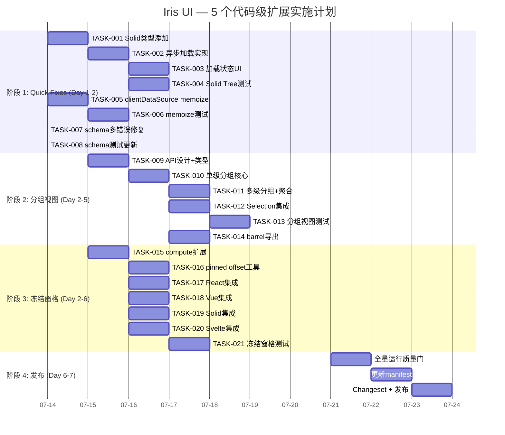

Now I have a thorough understanding of the codebase context. Let me write the complete Tech Lead analysis.

---

# Tech Lead 分析：5 个代码级扩展方向

## 0. 前置验证结果

在撰写分析前，已对文档中的源码引用进行了 grep 复核：

| 方向                                  | 文档声称                                 | 实际验证                                                                                                                    | 严重程度             |
| ------------------------------------- | ---------------------------------------- | --------------------------------------------------------------------------------------------------------------------------- | -------------------- |
| ① Solid Tree `loadChildren`           | 类型中声明但实现未调用                   | 更严重：Solid 的 `IrisTreeNode` **类型中压根没有 `loadChildren`**（对比 React/Vue/Svelte 均有），且 `IrisTree.tsx` 中零引用 | 🔴 类型+实现双重缺失 |
| ② `createClientDataSource` 未 memoize | `filterSort` 直接调用                    | ✅ 确认：`client.ts:20` 和 `client.ts:35` 均直接调用 `filterSort`                                                           | 🟡 性能悬崖          |
| ③ `standardSchemaValidator` 首错即止  | `!(key in errors)` 丢弃多错误            | ✅ 确认：`standard-schema.ts:69` 存在此逻辑                                                                                 | 🔴 逻辑 bug          |
| ④ 缺少分组控制器                      | `groupRows` 存在但无状态化控制器         | ✅ 确认：`aggregate.ts` 仅有纯函数                                                                                          | 🟠 功能缺口          |
| ⑤ 虚拟化无冻结窗格                    | `computeGridVirtualRange` 无 frozen 参数 | ✅ 确认：`virtual.ts:150` 仅做两个独立 1D 窗口组合                                                                          | 🟠 功能缺口          |

---

## 1. 任务分解

### 1.1 方向一：Solid Tree 实现 `loadChildren` 异步懒加载

| 字段         | 内容                                                                                                         |
| ------------ | ------------------------------------------------------------------------------------------------------------ |
| **问题本质** | 跨框架 Parity Bug——Solid Tree 既无类型声明也无实现                                                           |
| **修复策略** | 参照 Svelte 实现（`childrenCache` + Promise 缓存），桥接到 Solid 的 `createResource` 管理 loading/error 状态 |

**任务清单：**

| 任务 ID  | 任务标题                                     | 涉及文件                                                       | 前置依赖 | 预估工时 |
| -------- | -------------------------------------------- | -------------------------------------------------------------- | -------- | -------- |
| TASK-001 | `IrisTreeNode` 类型追加 `loadChildren`       | `packages/solid/src/primitives/tree/IrisTree.tsx` （类型定义） | 无       | **2h**   |
| TASK-002 | `expandNode` 中实现异步 children 加载 + 缓存 | `packages/solid/src/primitives/tree/IrisTree.tsx`（展开逻辑）  | TASK-001 | **3h**   |
| TASK-003 | 加载中/错误状态 UI 处理 + 竞态保护           | `packages/solid/src/primitives/tree/IrisTree.tsx`（渲染逻辑）  | TASK-002 | **3h**   |
| TASK-004 | 更新 Solid Tree 测试（`loadChildren` 场景）  | `packages/solid/src/primitives/tree/IrisTree.test.tsx`         | TASK-002 | **3h**   |

**验收标准：**

- Solid `IrisTreeNode` 包含 `loadChildren?: () => Promise<IrisTreeNode[]>`（与其他三框架一致）
- 点击带 `loadChildren` 的节点 → 调用异步函数 → children 渲染到 DOM
- 加载期间点击同一节点不发起重复请求（请求去重）
- `loadChildren` 抛异常时回退到可展开/折叠的空子区（不崩溃）
- `onExpand` 在 children 加载完成后再触发
- 测试覆盖：正常加载、空数组、异常、重复点击、展开后折叠再展开（缓存命中）

---

### 1.2 方向二：`createClientDataSource` 增加 memoize

| 字段         | 内容                                                           |
| ------------ | -------------------------------------------------------------- |
| **问题本质** | 核心数据路径上的性能悬崖，每次 `reload()` 都 O(n) 全量重算     |
| **修复策略** | 将闭包内的 `filterSort` 替换为 `createMemoizedFilterSort` 实例 |

**任务清单：**

| 任务 ID  | 任务标题                                          | 涉及文件                                                  | 前置依赖 | 预估工时 |
| -------- | ------------------------------------------------- | --------------------------------------------------------- | -------- | -------- |
| TASK-005 | 将 `filterSort` 替换为 `createMemoizedFilterSort` | `packages/core/src/data-source/client.ts`                 | 无       | **1.5h** |
| TASK-006 | 添加 memoize 行为验证测试                         | `packages/core/src/data-source/`（新建 `client.test.ts`） | TASK-005 | **1.5h** |

**验收标准：**

- `createClientDataSource` 两次相同参数调用只执行一次内部 `filterSort`
- `createSyncClientDataSource` 同样受益
- `data` 引用变化 → 缓存失效 → 重算（引用语义正确）
- 测试：验证两次相同 query 调用返回相同引用（`toBe`）；query 变化时重新计算

---

### 1.3 方向三：`standardSchemaValidator` 保留多错误

| 字段         | 内容                                                                 |
| ------------ | -------------------------------------------------------------------- |
| **问题本质** | 1 行逻辑 bug：`!(key in errors)` 静默丢弃同一字段的后续错误          |
| **修复策略** | 改为拼接语义：`errors[key] = existing ? existing + '; ' + msg : msg` |

**任务清单：**

| 任务 ID  | 任务标题                                  | 涉及文件                                                                            | 前置依赖 | 预估工时 |
| -------- | ----------------------------------------- | ----------------------------------------------------------------------------------- | -------- | -------- |
| TASK-007 | 修复 `standardSchemaValidator` 多错误丢弃 | `packages/core/src/standard-schema.ts:69`                                           | 无       | **1h**   |
| TASK-008 | 更新 `FieldErrors` 类型注释 + 测试用例    | `packages/core/src/standard-schema.ts`, `packages/core/src/standard-schema.test.ts` | TASK-007 | **1h**   |

**验收标准：**

- 同一字段的多个验证错误以 `"; "` 连接（如 `"Required; Must be a valid email"`）
- 单个错误的字段行为不变（兼容现有 consumer）
- `createFormStore` 消费无断裂
- 测试：3+ 错误场景、深层嵌套多错误、有/无 path 的 issue 混合

---

### 1.4 方向四：分组数据视图控制器 `createGroupedView`

| 字段         | 内容                                                           |
| ------------ | -------------------------------------------------------------- |
| **问题本质** | 纯函数 `groupRows` 存在但无状态控制器管理展开/折叠/选择/扁平化 |
| **修复策略** | 在 core 中新增 `createGroupedView`，作为 A 类控制器            |

**任务清单：**

| 任务 ID  | 任务标题                                         | 涉及文件                                                                               | 前置依赖           | 预估工时 |
| -------- | ------------------------------------------------ | -------------------------------------------------------------------------------------- | ------------------ | -------- |
| TASK-009 | `createGroupedView` API 设计 + 类型定义          | `packages/core/src/data-view/grouped-view.ts`（新建）                                  | 无                 | **4h**   |
| TASK-010 | 核心实现：单级分组、展开/折叠 store、`flatten()` | `packages/core/src/data-view/grouped-view.ts`                                          | TASK-009           | **4h**   |
| TASK-011 | 多级分组支持（递归 `groupBy`）+ 组级聚合         | `packages/core/src/data-view/grouped-view.ts`                                          | TASK-010           | **4h**   |
| TASK-012 | 与现有 selection 模型集成（组选、全选）          | `packages/core/src/data-view/grouped-view.ts` + `packages/core/src/data-view/types.ts` | TASK-010           | **4h**   |
| TASK-013 | 分组视图控制器单元测试                           | `packages/core/src/data-view/grouped-view.test.ts`（新建）                             | TASK-011, TASK-012 | **4h**   |
| TASK-014 | barrel 导出 + `createDataSource` 桥接适配        | `packages/core/src/index.ts`                                                           | TASK-010           | **2h**   |

**验收标准：**

- `createGroupedView({ source, groupBy, initialExpanded })` 返回：
  - `store`: `Store<GroupedState>` — `groups[]`, `expandedGroups[]`, `collapsedGroups[]`
  - `expandGroup(key)` / `collapseGroup(key)` / `toggleGroup(key)`
  - `flatten()`: `TreeRow<T>[]` — 可直输 VirtualScroll 或 Table
  - `groupAggregate(op, column)`: 组级聚合值
- 多级分组：`groupBy: [(r) => r.dept, (r) => r.loc]`
- `sortGroups`: `'size'` / `'name'` / `'key'` / 自定义比较器
- 分组折叠时不渲染子行（`flatten()` 跳过 collapsed 组）
- 组级分页可选支持
- 测试覆盖：单级/多级分组、展开/折叠全部、排序、空组、与数据源联动

---

### 1.5 方向五：虚拟化冻结窗格

| 字段         | 内容                                                              |
| ------------ | ----------------------------------------------------------------- |
| **问题本质** | `computeGridVirtualRange` 只做双向窗口，无 frozen/sticky 区域概念 |
| **修复策略** | 扩展 core 虚拟化数学为 frozen+body 分离窗口，4 适配器各加薄桥     |

**任务清单：**

| 任务 ID  | 任务标题                                           | 涉及文件                                                            | 前置依赖           | 预估工时 |
| -------- | -------------------------------------------------- | ------------------------------------------------------------------- | ------------------ | -------- |
| TASK-015 | `computeGridVirtualRange` 扩展 frozen row/col 参数 | `packages/core/src/virtual.ts`                                      | 无                 | **4h**   |
| TASK-016 | 提取 pinned offset 计算为 core 工具函数            | `packages/core/src/virtual.ts` 或新建 `packages/core/src/pinned.ts` | TASK-015           | **3h**   |
| TASK-017 | React Table 集成冻结行+列                          | `packages/react/src/primitives/table/Table.tsx`                     | TASK-015, TASK-016 | **4h**   |
| TASK-018 | Vue Table 集成冻结行+列                            | `packages/vue/src/primitives/table/`                                | TASK-015, TASK-016 | **4h**   |
| TASK-019 | Solid Table 集成冻结行+列                          | `packages/solid/src/primitives/table/`                              | TASK-015, TASK-016 | **4h**   |
| TASK-020 | Svelte Table 集成冻结行+列                         | `packages/svelte/src/primitives/table/`                             | TASK-015, TASK-016 | **4h**   |
| TASK-021 | 冻结窗格集成测试 + 滚动同步                        | `packages/core/src/virtual.test.ts` + 各框架 table test             | TASK-017~TASK-020  | **4h**   |

**验收标准：**

- `computeGridVirtualRange` 接受 `frozenRows: number` / `frozenCols: number`
- 返回 `{ frozenRows, bodyRows, frozenCols, bodyCols }` 四个虚拟窗口
- frozen 区域**不参与虚拟化**（始终渲染），body 区域正常虚拟化
- 列冻结：`position: sticky` + `z-index` + 左右偏移由 core 函数计算
- 行冻结：表头行固定、首 N 行始终可见
- 冻结列 + 列宽调整 (resizer) 正确配合
- 四框架行为一致
- 测试：冻结/非冻结混合滚动、resize 后的 pinned offset 重算、空冻结区域

---

## 2. 执行顺序与依赖图

```mermaid
graph TD
    %% 方向一：Solid Tree
    subgraph "Direction 1: Solid Tree loadChildren"
        T001[TASK-001: 类型添加 loadChildren] --> T002[TASK-002: 异步加载实现+缓存]
        T002 --> T003[TASK-003: 加载中/错误状态UI]
        T002 --> T004[TASK-004: Solid Tree 测试]
    end

    %% 方向二：clientDataSource memoize
    subgraph "Direction 2: clientDataSource memoize"
        T005[TASK-005: filterSort → createMemoizedFilterSort]
        T005 --> T006[TASK-006: memoize 验证测试]
    end

    %% 方向三：standardSchemaValidator
    subgraph "Direction 3: Multi-error Schema"
        T007[TASK-007: 修复多错误拼接]
        T007 --> T008[TASK-008: 测试+类型注释更新]
    end

    %% 方向四：Grouped View
    subgraph "Direction 4: Grouped Data View"
        T009[TASK-009: API设计+类型定义] --> T010[TASK-010: 单级分组核心实现]
        T010 --> T011[TASK-011: 多级分组+组级聚合]
        T010 --> T012[TASK-012: Selection模型集成]
        T011 --> T013[TASK-013: 分组视图测试]
        T012 --> T013
        T010 --> T014[TASK-014: barrel导出+DataSource桥]
    end

    %% 方向五：Frozen Panes
    subgraph "Direction 5: Virtual Frozen Panes"
        T015[TASK-015: computeGridVirtualRange 扩展] --> T016[TASK-016: 提取pinned offset工具]
        T015 --> T017[TASK-017: React Table 集成]
        T015 --> T018[TASK-018: Vue Table 集成]
        T015 --> T019[TASK-019: Solid Table 集成]
        T015 --> T020[TASK-020: Svelte Table 集成]
        T016 --> T017
        T016 --> T018
        T016 --> T019
        T016 --> T020
        T017 --> T021[TASK-021: 冻结窗格集成测试]
        T018 --> T021
        T019 --> T021
        T020 --> T021
    end

    %% 无跨方向依赖——所有方向可并行
    classDef quickFix fill:#c6efce,stroke:#2d7d46;
    classDef newFeature fill:#deeaf6,stroke:#4472c4;
    classDef test fill:#fce4d6,stroke:#c55a11;

    class T001,T002,T003,T004,T005,T006,T007,T008 quickFix;
    class T009,T010,T011,T012,T013,T014 newFeature;
    class T015,T016,T017,T018,T019,T020,T021 newFeature;
    class T004,T006,T008,T013,T021 test;
```



### 并行执行组

| 并行组      | 包含任务                    | 特性                        |
| ----------- | --------------------------- | --------------------------- |
| **Group A** | TASK-001~TASK-004（方向一） | 可独立进行，无外部依赖      |
| **Group B** | TASK-005~TASK-006（方向二） | 可独立进行，无外部依赖      |
| **Group C** | TASK-007~TASK-008（方向三） | 可独立进行，无外部依赖      |
| **Group D** | TASK-009~TASK-014（方向四） | 内部串行，与 A/B/C/E 无依赖 |
| **Group E** | TASK-015~TASK-021（方向五） | 内部串行，与 A/B/C/D 无依赖 |

**关键结论：5 个方向完全独立，可并行推进。** 建议分配：

- 1 人：方向一（Solid Tree）
- 1 人：方向二 + 方向三（快速修复，共 ~6h）
- 1 人：方向四（分组控制器）
- 1 人：方向五（冻结窗格）

---

## 3. 技术风险

### 3.1 方向一：Solid Tree `loadChildren`

| 风险                                                       | 等级  | 说明                                                                                  | 缓解策略                                                                                                  |
| ---------------------------------------------------------- | ----- | ------------------------------------------------------------------------------------- | --------------------------------------------------------------------------------------------------------- |
| Solid `createResource` 与 Tree 现有 expansion state 的交互 | 🟡 中 | `createResource` 管理 async 状态（loading/error/data），需要与 `expandedIds` 信号协同 | 参照 React 的 `expandNode` 模式：先标记展开（占位），`createResource` 完成后更新 children                 |
| 竞态：快速双击展开/折叠                                    | 🟡 中 | 用户可能在首次 `loadChildren` 完成前再次点击                                          | 引入 `loadingChildren` Set（跟踪正在加载的 node.id），加载中再次点击不发起新请求                          |
| 缓存失效策略                                               | 🟢 低 | 何时重新调用 `loadChildren` vs 使用缓存                                               | 参照 Svelte 的 `childrenCache: Map<string, IrisTreeNode[]>`，节点折叠后不清除，显式 `reloadNode(id)` 方法 |
| Solid 的 `Show`/`For` 与异步 children 渲染                 | 🟢 低 | 异步加载后需要触发 Solid 响应式更新                                                   | 用 `createResource` 的 `source` 信号驱动渲染，或手动 `setExpandedIds` 触发展开                            |

### 3.2 方向二：`createClientDataSource` memoize

| 风险                                          | 等级  | 说明                                                               | 缓解策略                                                                                                           |
| --------------------------------------------- | ----- | ------------------------------------------------------------------ | ------------------------------------------------------------------------------------------------------------------ |
| `createMemoizedFilterSort` 的引用语义是否正确 | 🟢 低 | 必须使用 `===` 引用比较，不能深比较                                | 现有实现已用 `===`；数据源每次 `reload()` 传入新的 query 对象 → 缓存会自动失效。验证测试确保                       |
| 多个 datasource 实例共享同一个 memo 闭包      | 🟡 中 | 若 `createMemoizedFilterSort()` 在模块级创建，所有 datasource 共享 | 确保每个 `createClientDataSource` 调用都创建自己的实例（函数作用域内 `const doSort = createMemoizedFilterSort()`） |

### 3.3 方向三：`standardSchemaValidator` 多错误

| 风险                                           | 等级  | 说明                                                                               | 缓解策略                                                                                                     |
| ---------------------------------------------- | ----- | ---------------------------------------------------------------------------------- | ------------------------------------------------------------------------------------------------------------ |
| 下游 consumer 假设 `FieldErrors` 值是单字符串  | 🟡 中 | 如果某处渲染逻辑直接展示完整错误字符串，"Required; Must be a valid email" 可能过长 | 这是正确行为。渲染端应保证多行显示或 tooltip。当前所有 `createFormStore` consumer 都展示字符串，无格式化假设 |
| 错误消息拼接的国际化问题                       | 🟢 低 | "; " 分隔符在不同 locale 是否合适                                                  | 暂用 `"; "` 英文分隔，后续可抽象为 `formatMultiError(messages)` 函数支持 locale                              |
| Zod 返回巨量 issue（如数组 1000 项的每项错误） | 🟢 低 | 拼接的字符串可能极长                                                               | 加上限：最多拼接 5 条错误，后续追加 `"... and N more"`                                                       |

### 3.4 方向四：分组数据视图控制器

| 风险                            | 等级  | 说明                                                         | 缓解策略                                                                                             |
| ------------------------------- | ----- | ------------------------------------------------------------ | ---------------------------------------------------------------------------------------------------- |
| 分组 + 分页的交互设计           | 🟡 中 | 组级分页 vs 组内分页 vs 不做分页                             | MVPhase 1 不做分页支持（只做展开/折叠），明确 API 边界；分页留作 TODO                                |
| 分组后排序的策略选择            | 🟡 中 | 组间排序（组头排序）vs 组内排序（组内行排序）vs 两者同时     | 设计 `sortGroups` + 内建的 `sort` 转发；用选项区分                                                   |
| 大型数据集下 `flatten()` 的性能 | 🟡 中 | 每次展开/折叠都要重新 `flatten()` 全量数据                   | 使用引用缓存：`flatten()` memoize 基于 `expandedGroups` 的引用；参考 `createMemoizedFilterSort` 模式 |
| 多级分组递归的复杂度控制        | 🟡 中 | 3+ 级嵌套分组可能导致渲染深度过大                            | 不限制级数，但默认展开只到第一级；API 提供 `maxDepth` 选项                                           |
| 与现有 `TreeRow` 类型的兼容     | 🟢 低 | `flatten()` 返回 `TreeRow<T>[]`，需与 Table 的树形行渲染协调 | `TreeRow` 已有 `depth/hasChildren/expanded` 字段；分组展平可直接复用                                 |

### 3.5 方向五：虚拟化冻结窗格

| 风险                                            | 等级  | 说明                                                                                                     | 缓解策略                                                                                                                                                  |
| ----------------------------------------------- | ----- | -------------------------------------------------------------------------------------------------------- | --------------------------------------------------------------------------------------------------------------------------------------------------------- |
| `position: sticky` + 虚拟滚动容器的浏览器兼容性 | 🔴 高 | 不同浏览器对 `sticky` 在 `overflow` 容器里的行为有细微差异；Chrome 与 Firefox 的 scroll 事件触发时机不同 | 1) 核心数学在 core 层充分测试（纯函数）2) 适配器层用 `onScroll` 统一管理 3) 在 docs 中声明浏览器支持范围                                                  |
| 冻结列 + 列宽调整 (resizer) 的交互              | 🟡 中 | 调整冻结列宽度后，pinned offset 必须重新计算                                                             | React Table 已有 `pinnedOffsets` 的 `useMemo`；提取到 core 后确保其依赖 `columnWidths`                                                                    |
| 可变高度行 + 冻结行                             | 🟡 中 | 冻结区域的行高变化影响 body 区域的滚动计算                                                               | 冻结行使用固定高度或独立测量；`freezeRow` 的 `itemSize` 单独配置                                                                                          |
| 冻结行 + 垂直虚拟化交叉                         | 🟡 中 | 冻结行不虚拟化，但 body 行虚拟化；两者的可视区域分割                                                     | `computeGridVirtualRange` 返回的 `frozenRows` 不参与 `startIndex/endIndex` 计算；body `scrollTop` 从冻结区域之后开始                                      |
| 四框架实现一致性                                | 🟡 中 | 不同框架对 DOM 操作/ref 的处理方式不同                                                                   | 核心数学在 core 统一；每个适配器只做：1) CSS `position: sticky` 设置 2) scroll 事件绑定 3) `computeGridVirtualRange` 调用；React 已有实现，其他三框架参照 |

### 3.6 跨方向依赖风险

| 风险                            | 说明                                                                                                   | 缓解                                                                                               |
| ------------------------------- | ------------------------------------------------------------------------------------------------------ | -------------------------------------------------------------------------------------------------- |
| 方向四与方向五都涉及 Table 重构 | 若 Table 的树形行渲染（方向四 `flatten()` 的输出）与冻结窗格（方向五 `frozenCols`）在 Table 组件中冲突 | 两个方向的 core 层无共享代码；Table 组件各自独立接入。但若同一迭代做，需要协调 Table 的 props 扩展 |

---

## 4. 资源评估

### 4.1 人员技能需求

| 技能                      | 需求程度       | 用于方向                                            |
| ------------------------- | -------------- | --------------------------------------------------- |
| TypeScript + Solid.js     | 必需           | 方向一                                              |
| TypeScript + core 数据层  | 必需           | 方向二、三                                          |
| TypeScript + 复杂状态管理 | 必需           | 方向四                                              |
| TypeScript + 虚拟滚动数学 | 必需           | 方向五                                              |
| React / Vue / Svelte      | 各方向对应框架 | 方向一(Vue/Svelte as reference)、方向五(四框架集成) |
| 测试驱动开发 (Vitest)     | 强推荐         | 全部                                                |

### 4.2 建议人员配置

**最小配置：2 人，10 工作日**

| 角色                       | 负责人 | 负责方向                                                                          | 工时                          |
| -------------------------- | ------ | --------------------------------------------------------------------------------- | ----------------------------- |
| **开发者 A** (框架+core)   | TBD    | **方向一** (Solid Tree, 11h) + **方向二** (memoize, 3h) + **方向三** (schema, 2h) | ~16h (~2 天)                  |
| **开发者 B** (core+全框架) | TBD    | **方向四** (分组视图, 22h) + **方向五** (冻结窗格, 27h) — 串行                    | ~49h (~6 天，可拆为 2 人并行) |

**推荐配置：3 人，5 工作日**

| 角色     | 方向                                     | 工时         |
| -------- | ---------------------------------------- | ------------ |
| 开发者 A | 方向一 (11h) + 方向二 (3h) + 方向三 (2h) | 16h (2 天)   |
| 开发者 B | 方向四 (22h)                             | 22h (2.5 天) |
| 开发者 C | 方向五 (27h)                             | 27h (3 天)   |

### 4.3 关键里程碑

```
Day 0  ─── Kickoff: 任务分配 + API 设计评审
         │
Day 1  ─── ✅ 里程碑 1: 3 个 Quick Fix 完成并合入 main
         │    (Solid Tree loadChildren + 方向二/三修复)
         │
Day 3  ─── ✅ 里程碑 2: 分组视图控制器 core 实现完成
         │    冻结窗格 core 数学扩展完成
         │
Day 5  ─── ✅ 里程碑 3: 分组视图全量测试通过
         │    四框架冻结窗格集成完成
         │
Day 6  ─── ✅ 里程碑 4: 全部 21 个任务完成
         │    集成测试 + 跨框架 Parity 验证通过
         │
Day 7  ─── 🚀 发布: changeset + version bump + release
```

### 4.4 阻塞点与解决策略

| 阻塞点                                                     | 类型 | 解决策略                                                                                                                          |
| ---------------------------------------------------------- | ---- | --------------------------------------------------------------------------------------------------------------------------------- |
| Solid 的 `createResource` 与 Tree 现有渲染模式不兼容       | 技术 | **Plan B**：不用 `createResource`，改用 `createSignal` + 手动 Promise 管理（如 React 实现的方式），确保逻辑层参照 core 模式       |
| 冻结列在 Svelte 中的 `position: sticky` + scroll sync 实现 | 技术 | **Plan B**：Svelte 的 `bind:scrollLeft` 与 JS 驱动的 scroll 可能冲突，改用 `addEventListener` 统一管理（与 React/Vue/Solid 一致） |
| 分组 + 分页设计决策未定                                    | 设计 | **Plan B**：方向四明确**只做展开/折叠/扁平化，不做分页**。分页能力通过 `createDataSource` 组合实现，而非内建                      |

---

## 5. 质量保证

### 5.1 单元测试覆盖要求

| 方向   | 测试文件                                                   | 最低覆盖         | 关键测试场景                                                                                   |
| ------ | ---------------------------------------------------------- | ---------------- | ---------------------------------------------------------------------------------------------- |
| 方向一 | `packages/solid/src/primitives/tree/IrisTree.test.tsx`     | 新增 30+ 行      | `loadChildren` 正常调用、空数组、异常、重复点击、缓存命中、展开后 onExpand 回调时机            |
| 方向二 | `packages/core/src/data-source/client.test.ts`（新建）     | 新增 20+ 行      | 相同 query 调用两次 → 引用相等；不同 query → 引用不等（重新计算）                              |
| 方向三 | `packages/core/src/standard-schema.test.ts`                | 修改/新增 15+ 行 | 单字段 2 错误、3 错误、深层嵌套多错误、混合有/无 path 的 issue                                 |
| 方向四 | `packages/core/src/data-view/grouped-view.test.ts`（新建） | 新增 150+ 行     | 单级分组、多级分组、展开/折叠/全展开/全折叠、flatten 输出验证、组排序、空组、与 selection 联动 |
| 方向五 | `packages/core/src/virtual.test.ts` + 各框架 table test    | 新增 100+ 行     | frozen 0/0（退化行为）、frozen 1/1、frozen 3/2、冻结列+水平滚动 sync、空数据、单行/单列        |

### 5.2 集成测试策略

| 测试层级           | 策略                                                                        | 工具                                                    |
| ------------------ | --------------------------------------------------------------------------- | ------------------------------------------------------- |
| core 单元测试      | 纯函数验证，无 DOM 依赖，vitest 直接运行                                    | `vitest`                                                |
| 适配器渲染测试     | jsdom 环境，验证 DOM 输出符合预期（方向一、五）                             | `vitest` + `jsdom`                                      |
| 跨框架 Parity      | 方向一的 `loadChildren` 在 Solid 中的行为与 React/Vue/Svelte 的现有测试对照 | 手动验证（可写一个 `parity-tree-loadchildren.test.ts`） |
| 方向五 scroll 测试 | jsdom 中需 mock `scrollLeft`/`scrollTop` + `getBoundingClientRect`          | 参照现有 `useDrag.test` 的 `PointerEvent` mock 模式     |

### 5.3 代码审查要点

| 方向       | 审查要点                                                                                                                                                                           |
| ---------- | ---------------------------------------------------------------------------------------------------------------------------------------------------------------------------------- |
| **方向一** | ① `loadChildren` 调用是否在 `expandedIds` 更新后进行 ② 缓存是否与 Svelte 一致（Map<nodeId, children>）③ Solid `createResource` 的 cleanup 是否正确 ④ 与现有 `checkable` 模式的冲突 |
| **方向二** | ① `createMemoizedFilterSort` 是否在闭包内创建（每次 `createClientDataSource` 调用独立实例）② 引用比较语义是否正确                                                                  |
| **方向三** | ① 拼接字符串是否影响 `form.getState().errors` 的 consumer；② separator 是否硬编码                                                                                                  |
| **方向四** | ① API 设计是否覆盖了最小可行集（不 scope creep）② `flatten()` 的缓存策略 ③ 与 `createDataSource` 的组合模式是否正确 ④ 组级排序与 Columns sort 的交互                               |
| **方向五** | ① `computeGridVirtualRange` 的 frozen 参数向后兼容性（默认 0）② pinned offset 计算与 CSS sticky 的协调 ③ 四框架的 scroll 绑定方式是否一致 ④ 列宽调整后的 offset 重算时机           |

### 5.4 性能测试需求

| 方向   | 场景                                             | 指标                                                               | 工具                                                             |
| ------ | ------------------------------------------------ | ------------------------------------------------------------------ | ---------------------------------------------------------------- |
| 方向二 | 10,000 行数据，快速连续键盘输入 filter           | 每次按键 filter 耗时 < 5ms（memoized）vs 当前 > 50ms（未 memoize） | `performance.now()` 手动计时测试                                 |
| 方向四 | 10,000 行数据，展开/折叠含 100 个分组的视图      | `flatten()` 耗时 < 10ms                                            | 用 `packages/core/src/data-view.test.ts` 中的 large-dataset 测试 |
| 方向五 | 100 列 × 10,000 行，冻结 3 列，水平/垂直同步滚动 | scroll 掉帧率 < 5%（60fps 下）                                     | 暂不做自动化（jsdom 无法测量），手动 LightHouse 验证             |

---

## 6. 实施计划

### 6.1 甘特图



### 6.2 分阶段详细计划

#### 阶段 0：基础设施搭建（Day 0，0 天 — 无需）

本批次 5 个方向**不需要**新增构建工具链、CI 配置、或外部依赖（全部使用现有 `vitest` / `tsup` / `pnpm` 栈）。直接进入开发。

#### 阶段 1：Quick Fixes — 方向一/二/三（Day 1~2）

**目标**：3 个"即时可做"修复，每项 < 4h，首日即可合入。

| 日期     | 活动                                                     | 产出                               |
| -------- | -------------------------------------------------------- | ---------------------------------- |
| Day 1 AM | 开发者 A：TASK-001~TASK-003（Solid Tree `loadChildren`） | PR #1: Solid Tree async expand     |
| Day 1 PM | 开发者 A：TASK-004（测试）                               | PR #1 完善                         |
| Day 1 PM | 开发者 A：TASK-005~TASK-006（memoize）                   | PR #2: clientDataSource memoize    |
| Day 1 PM | 开发者 A：TASK-007~TASK-008（schema 多错误）             | PR #3: standardSchemaValidator fix |

**里程碑 1 验收条件（Day 1 结束）：**

- [ ] `pnpm turbo run test typecheck lint build` 在全修复合入后通过
- [ ] Solid Tree 新增 `loadChildren` 测试 ≥ 3 个 case
- [ ] clientDataSource 新增 memoize 验证测试 ≥ 2 个 case
- [ ] standard-schema 修复后原"首错即止"测试泛化（保留向后兼容）

#### 阶段 2：分组数据视图（Day 2~5）

| 日期    | 活动                                            | 产出                            |
| ------- | ----------------------------------------------- | ------------------------------- |
| Day 2   | 开发者 B：TASK-009（API 设计）                  | API 设计文档 + 类型定义 PR      |
| Day 2-3 | 开发者 B：TASK-010（单级分组核心）              | `createGroupedView` 基础实现 PR |
| Day 3   | API Design Review（全员参与 30min）             | API 冻结，开始实现              |
| Day 3-4 | 开发者 B：TASK-011（多级分组+组级聚合）         | 多级分组实现 PR                 |
| Day 4   | 开发者 B：TASK-012（Selection 集成）            | Group-aware selection PR        |
| Day 4-5 | 开发者 B：TASK-013（测试） + TASK-014（barrel） | 全量测试 + 导出 PR              |

**里程碑 2 验收条件（Day 5 结束）：**

- [ ] `createGroupedView` API 编译通过，类型完整
- [ ] 单级/多级分组在 core 单元测试中通过
- [ ] flatten() 输出可渲染为 Table 的树形行
- [ ] 测试覆盖：单级分组、多级分组、展开/折叠全量、空组

#### 阶段 3：冻结窗格（Day 2~6）

| 日期    | 活动                                                                | 产出                              |
| ------- | ------------------------------------------------------------------- | --------------------------------- |
| Day 2   | 开发者 C：TASK-015（core 扩展）                                     | `computeGridVirtualRange` 扩展 PR |
| Day 3   | 开发者 C：TASK-016（pinned offset 工具提取）                        | core 层 frozen pane 支持 PR       |
| Day 3-4 | 开发者 C：TASK-017~TASK-020（四框架集成）                           | 4 个 PR（各框架）                 |
| Day 4-5 | **Cross-framework parity pair review**：全框架 frozen pane 行为对照 | 确保 4 框架展开/冻结一致性        |
| Day 5-6 | 开发者 C：TASK-021（集成测试）                                      | 冻结窗格测试 PR                   |

**里程碑 3 验收条件（Day 6 结束）：**

- [ ] 所有 4 框架 Table 支持 `frozenRows` / `frozenCols` props
- [ ] frozen 列与虚拟化列正确共存（frozen 列不进入虚拟化 range）
- [ ] 水平滚动时 frozen 列保持 sticky，内容列滚动
- [ ] 测试覆盖：冻结 0/0（退化）、冻结 1/1、冻结 3/2、空数据集

#### 阶段 4：集成测试与发布（Day 6~7）

| 日期     | 活动                                                         | 产出                          |
| -------- | ------------------------------------------------------------ | ----------------------------- |
| Day 6 PM | 全量运行质量门（`pnpm turbo run test typecheck lint build`） | 全部绿色                      |
| Day 6 PM | 运行 `pnpm size` 验证 size 预算                              | Size 不超限                   |
| Day 7 AM | 运行 `pnpm check:rsc` + `pnpm format:check`                  | RSC + Format 通过             |
| Day 7 AM | 更新 Manifest（`pnpm gen:manifest`）                         | manifest.json / llms.txt 更新 |
| Day 7 PM | 创建 Changeset + 生成发布 PR                                 | 发布准备就绪                  |

**里程碑 4（发布条件）验收：**

- [ ] `pnpm turbo run test typecheck lint build` ✅
- [ ] `pnpm size` ✅
- [ ] `pnpm check:rsc` ✅
- [ ] `pnpm format:check` ✅
- [ ] `pnpm gen:manifest` 已运行（manifest 包含新增导出）
- [ ] changeset 已创建，版本号合理（patch 级：方向一二三；minor 级：方向四五）

---

## 7. 总结：执行建议

### 优先级矩阵

| 方向                                 | 影响-努力比 | 建议策略                                                                     |
| ------------------------------------ | ----------- | ---------------------------------------------------------------------------- |
| **方向三** (schema 多错误)           | 🔥🔥🔥 最高 | **立刻做**（1 行 bug fix，1h）— 这是真正的 bug，不是 feature                 |
| **方向二** (memoize)                 | 🔥🔥🔥 最高 | **立刻做**（5 行修改 + 测试，2h）— 边际成本为零，收益随 user data size 放大  |
| **方向一** (Solid Tree loadChildren) | 🔥🔥🔥 最高 | **立刻做**（~11h）— 跨框架 Parity 原则性要求，修复后消除"类型承诺但实现缺失" |
| **方向四** (分组视图)                | 🔥🔥 高     | **下一迭代**（~22h）— 高用户可见性，但需要 API 设计投入                      |
| **方向五** (冻结窗格)                | 🔥🔥 高     | **下一迭代**（~27h）— 四框架集成成本高，但 core 层扩展是必须做的架构投资     |

### 执行顺序建议

```
Week 1 (7/14-7/18)          Week 2 (7/21-7/25)
┌─────────────────────┐   ┌─────────────────────┐
│ 方向一/二/三 (Quick) │   │ 方向四 (分组视图)    │
│ PR #1, #2, #3        │   │ PR #4 ~ PR #7        │
│ → Day 1 merge        │   │ → Day 5 merge        │
├─────────────────────┤   ├─────────────────────┤
│ 方向四 (API设计)     │   │ 方向五 (集成测试)    │
│ 方向五 (core扩展)    │   │ → Day 6 merge        │
│ → Day 2-3 parallel   │   └─────────────────────┘
└─────────────────────┘
```

### 风险缓解最终建议

1. **方向一**的 Solid `createResource` 如果与 Tree 状态不兼容，立即切换到 Plan B（手动 Promise 管理）——不要花超过 2h 调试框架集成问题
2. **方向四**的 API 设计要先在 core 层独立验证（纯函数 + 测试），不要先写适配器——遵循"先 core 后桥"的原则
3. **方向五**先做 React 适配器（已有 `pinnedOffsets` 基础），再平行扩展到其他三框架——避免同时调试四框架的 sticky 兼容性问题
4. **所有方向**的 core 层改动必须确保 `packages/core/src/index.ts` 导出完整——manifest 生成依赖 barrel 扫描，漏导出 = 消费者无法 import
