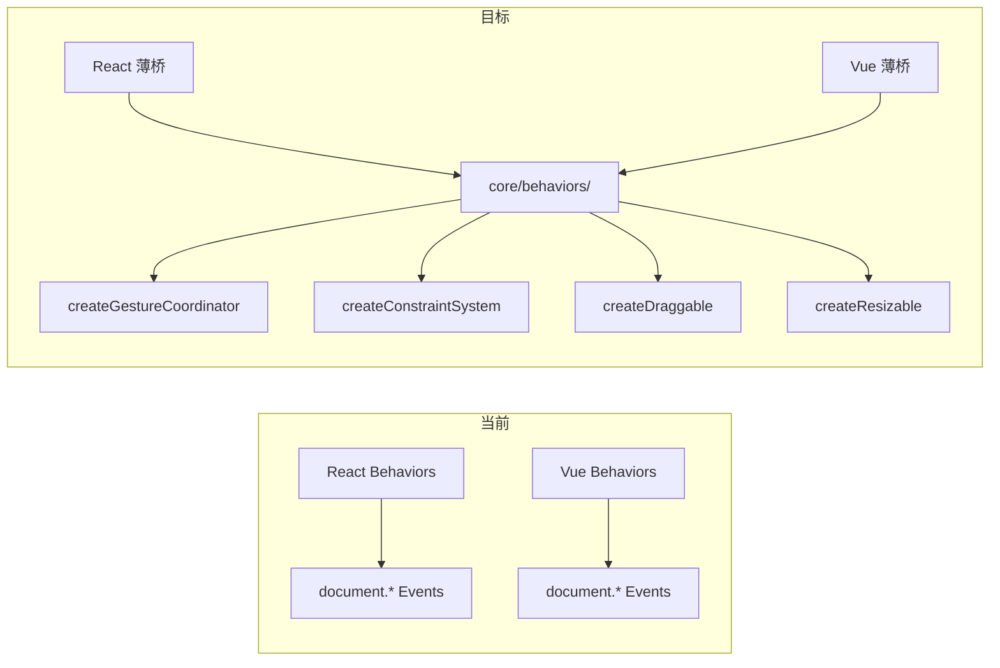

Now I have a thorough understanding of the codebase. Here is my architectural analysis.

---

# 架构分析：Iris UI 五方向交叉验证 — 架构师视角

## 1. 架构评估

### 当前架构的优势

Iris UI 的架构在同类项目中属于**顶级结构化水平**。几个关键优势值得记录：

**1.1 Layer 0 核心的控制器抽象（A 类下沉）**——真正践行了"逻辑下沉 core，适配器做薄桥"。`createSelectionModel` 被 17 个组件消费，`createExpansion` 被 NavMenu/Tabs 等 4 处消费，`createDataSource`/`createResourceController` 是 CRUD 的骨干。这份下沉决策在 AGENTS.md 中有清晰的 A/B/C 三分法，且代码实现**忠实反映了设计文档**——这在大型项目中极为罕见。

**1.2 Store 系统的设计质量高**——`createStore` + `derived`（引用计数懒订阅）+ `batch`（嵌套 flush coalescing）+ `subscribeWith` 选择性订阅，四者构成了一个紧凑、可组合、无框架依赖的反应式原语。Vue `ref` + 订阅、React `useSyncExternalStore`、Solid `createSignal`、Svelte `toStore` 四端桥接的实际代码已验证这一设计可泛化。

**1.3 插件系统的契约设计克制**——`createPlugin` + `runPlugins` 的注册式 API（tokens/messages/stores/teardown）避免了动态组件注册的陷阱。拓扑排序（`dependsOn`）的 DFS post-order 实现正确且处理了循环和缺失依赖。`reloadPlugins` 的 diff-语义也经过设计，支持 HMR。

**1.4 Token → CSS var 的杠杆效应**——一行 token ≈ 30 行 CSS 的杠杆率是真实的。从组件源码看，所有样式都通过 `var(--iris-*)` 引用，没有硬编码 hex 或 Tailwind 残留。`applyCssVars` → `style.setProperty` 的单一路径保证了可换肤性。

### 当前的架构局限性

交叉验证暴露了**三个结构性缺口**：

**1.5 Behavior 控制器缺失 = 核心架构原则的直接违反（方向 1）**

```
AGENTS.md 原则："逻辑下沉 core，适配器做薄桥"
           "一切「换个框架也一样」的逻辑都属于 core"

现状：
  core/src/ 有 createSortable  ✓
  core/src/ 有 createLongPress  ✓
  core/src/ 无 createDraggable  ✗
  core/src/ 无 createResizable  ✗
  core/src/ 无 createClickOutside ✗
  core/src/ 无 createMovable/Hotkey ✗
```

6 个 Behaviors 中只有 2 个有 core 控制器。其余 4 个（Resizable、Movable、ClickOutside、Hotkey）的指针/键盘/事件处理逻辑在 4 个框架中完整复制——**2,744 行源码 + 1,030 行测试 = ~3,774 行跨框架重复**。这是 AGENTS.md 中明确禁止的"适配器写业务逻辑"。

**技术债的本质**：这不是"性能问题"而是"架构正确性问题"。每一个 Behavior 的 bug 修复都必须在 4 个框架中各自做，且 4 份实现大概率有不一致的边界情况处理。

**1.6 Toast store 的 4× 复制（方向 2）**

```ts
// 4 个文件，75 行逻辑完全一致
packages / react / src / primitives / toast / toastStore.ts
packages / vue / src / primitives / toast / store.ts // 文件名都不一样！
packages / solid / src / primitives / toast / toastStore.ts
packages / svelte / src / primitives / toast / toastStore.ts
```

同样是"换个框架也一样"的逻辑——一个 module-level 单例 store + 4 个纯函数（push/dismiss/clear/subscribe）。毫无框架特异性，毫无理由留在适配器中。应直接导出到 `@iris-ui/core/notifications.ts`（已有 `createNotificationCenter`，但 toast store 是独立平行实现）。

**1.7 安全缺口：插件 Token 注入无防护（方向 3）**

`registerTokens` 接受任意 `Record<string, string>` → 直接经 `applyCssVars` → `style.setProperty` 注入 DOM。没有 CSS 值净化函数。对比之下，`@iris-ui/skins` 已有 `validateSkin`（检查结构完整性），但**不检查值层面的 CSS 注入向量**。

这是一个**发布前必须解决**的安全缺口——一旦 `@iris-ui/core` 发布到 npm，第三方插件可以通过 `registerTokens` 注入恶意 CSS，绕过 CSP（因为 `style.setProperty` 不在 CSP 管控范围内），实现数据窃取（通过 CSS 选择器属性嗅探）。

### 关键设计决策的合理性评估

| 决策                            | 评估        | 理由                                                                         |
| ------------------------------- | ----------- | ---------------------------------------------------------------------------- |
| Store 用 `Object.is` 做相等检查 | ✅ 正确     | 避免了引用类型浅比较的陷阱，与 React 的 `useSyncExternalStore` 契约一致      |
| `batch` 嵌套 flush coalescing   | ✅ 正确     | 与 React 的 `unstable_batchedUpdates` 语义对齐，避免中间状态暴露             |
| `derived` 引用计数懒订阅        | ✅ 正确     | 避免了未观察的 derived store 导致的内存泄漏和多余计算                        |
| `runPlugins` 顺序执行           | ⚠️ 有风险   | 当前代码无 try/catch，任何插件 install 抛异常 → 整个 Provider 崩溃（方向 4） |
| Behaviors 留在适配器层          | ❌ 架构错误 | 违反了"逻辑下沉 core"的铁律，创造了 ~3,774 行跨框架重复                      |
| Toast store 留在适配器层        | ❌ 架构错误 | 同上——纯逻辑，无框架特异性                                                   |
| Token 值无净化                  | ❌ 安全缺口 | 发布后不可追溯的供应链安全问题                                               |

---

## 2. 扩展方向

基于交叉验证发现的 5 个方向，我以架构师视角重新排序和深化，提出**4 个高价值架构扩展方向**（合并了 P0/P1 方向，并补充了一个新的集成方向）：

### 方向 A（P0）：Behavior 控制器向 core 下沉 + 组合协调层

**为什么需要（业务价值/技术价值）**

这是对 AGENTS.md 核心架构原则的直接修复。Behaviors 是 Desktop OS、CMS 拖拽排序、面板布局等场景的基础能力。当前的状态：

- 6 个 Behavior × 4 框架 = 24 个实现文件，各自独立绑定 pointer/键盘事件
- **零组合语义**：嵌套的 `<IrisResizable><IrisMovable>` 在拖拽时互相干扰，因为各自绑定了 `document.addEventListener('pointer*')`
- **零约束传播**：Movable 的 `bounds` 无法感知外层 Resizable 的尺寸；无手势仲裁机制

下沉的核心价值不是"消除重复"（虽然那已经值 3,774 行），而是**解锁组合能力**——没有 core 层的 `createGestureCoordinator`，就无法实现 Resizable + Movable 的无冲突嵌套，而这是 Desktop OS 窗口管理的核心需求。

**核心挑战和技术难点**

1. **Pointer event 仲裁器（Gesture Coordinator）**：
   - 多个 Behavior 竞争同一 pointer event 时，需要优先级/命中测试/状态排他机制
   - 一个 pointer down 事件 → 只有**一个** Behavior 应该消费它
   - 嵌套场景：内层 Behavior 应该优先于外层（点击内层 Movable 不应触发外层 Movable）
   - 触控场景：`LongPress` 的 500ms 延迟与 `Movable` 的立即 drag 冲突——需要时序协调

2. **状态机 vs 纯函数**：
   - Resizable 和 Sortable 有明显的内部状态（初始尺寸、拖拽方向、handle 位置）
   - Movable 的状态较简单（拖拽中/非拖拽中）
   - Hotkey 无状态
   - ClickOutside 无状态
   - 是否需要统一用 `createMachine`？不——ClickOutside 和 Hotkey 只是事件监听注册模式。Resizable 和 Movable 可以用类似 `createDrag` 的纯函数控制器。

3. **约束系统抽象**：
   - `bounds`（父容器边界约束）
   - `snap`（吸附到网格或对齐点）
   - `axis`（限制水平/垂直方向）
   - `minWidth/minHeight/maxWidth/maxHeight`
   - 这些约束既是 Resizable 的也是 Movable 的——可以从桌面 OS 的 `window.ts`（`snapRect`/`clampRect`）中提取泛化

**预期的架构变更**



- `packages/core/src/behaviors/` 新增目录，包含：
  - `createGestureCoordinator()`：共享 pointer event 仲裁器
  - `createConstraintSystem()`：边界/吸附/轴约束
  - `createDraggable(config, coordinator)`：通用拖拽控制器
  - `createResizable(config, coordinator)`：通用调整大小控制器
  - `createClickOutside(element, handler, options)`：纯注册模式
  - `createHotkey(map, options)`：纯注册模式
- 现有 4 框架 Behaviors 重构为：框架渲染 + 事件绑定代理 → core 控制器

**对现有系统的影响**

- **Breaking change**：`IrisMovable`/`IrisResizable` 的 API 可能微调（props 映射到 `createDraggable`/`createResizable` 的配置）
- **Size 净减**：4×130 行 Movable → 1×~130 行 core + 4×~20 行桥 = 210 行（vs 当前 520 行 Movable）
- **测试迁移**：核心逻辑的单测从 4 框架搬到 core（1 份替代 4 份），框架层只保留集成测试

### 方向 B（P0）：插件级故障隔离 + 安装安全

**为什么需要**

`runPlugins` 的当前实现是**全有或全无**的：

```ts
// 当前 plugin.ts L241-248
for (const plugin of ordered) {
  const cleanup = plugin.install(registry) // 无 try/catch
  // 任何一个插件抛异常 → 后续所有插件不安装
}
```

在插件生态下，这是不可接受的：

1. **第三方插件不可信**——一个质量差的插件不应拖垮整个应用
2. **渐进式降级**——插件 A 崩溃，插件 B 和 C 仍应可用
3. **调试困难**——当前开发者面对的是空白应用，不知哪个插件、为什么崩溃

同时，`registerTokens` 的 CSS 值注入缺口也属于这个方向（注册管线的安全边界）。

**核心挑战和技术难点**

1. **部分安装语义**：一个插件 `install` 抛异常后，其已注册的 token/messages/store 是否回滚？
   - 选项 A：**部分提交**（当前行为）——抛异常前的注册仍然有效（如果前面的 setState 已执行）
   - 选项 B：**事务回滚**——如果插件 install 抛异常，回滚所有其已做的注册
   - 选项 C：**分层提交**——注册立即生效但标记来源，provider 按插件状态选择性应用

   选项 B 最安全但实现复杂（需要撤销已注册的 store 工厂副作用）。建议**选项 A + 显式标记**——插件 A 失败 → 其注册保留但标记为不安全，`devWarn` 显示"插件 A 注册了 token X 但安装失败"。

2. **跨插件错误传播**：如果插件 B `dependsOn` 插件 A，且 A 安装失败→B 的依赖缺失
   - 应跳过 B（拓扑排序时标记 A 失败 → 所有依赖 A 的插件也失败）
   - 但 token/store 仍应从失败的插件中保留（如果有值，可用）

3. **CSS 值净化的成本**：需要 `sanitizeCssValue(value: string): string`
   - 拒绝 `}` `;` `@import` `url()` `expression()` `javascript:` 等危险模式
   - 允许 `var(--*)` 引用链
   - 白名单模式（只允许 `#hex`、`rgb()`、`var()`、`<length>`、`<number>`）太严格（无法支持 gradient 等复杂值）
   - 推荐黑名单模式 + 性能考虑（这个函数在 `applyCssVars` 的 hot path 上）

**预期的架构变更**

```ts
// 目标 runPlugins 签名
export function runPlugins(plugins: readonly IrisPlugin[]): CollectedRegistrations & {
  pluginErrors: Map<string, Error> // 失败的插件
  pluginStatus: Map<string, 'ok' | 'skipped_dependency' | 'error'>
}
```

- `runPlugins` 内每个 `plugin.install` 包在 try/catch 中
- `orderPlugins` 后做依赖完整性检查，跳过依赖失败者
- `sanitizeCssValue` 函数在 `@iris-ui/theme` 中，被 `applyCssVars` 和 `registerTokens` 共同消费
- Provider 层：`@iris-ui/react` 等包裹每个插件的 UI 到单独的 `<ErrorBoundary>` 中

**对现有系统的影响**

- **非 breaking**：`CollectedRegistrations` 新增字段，现有消费者不受影响
- Provider 层需要适配，但变化局限在 IrisProvider 内部
- Dev 模式下可添加插件健康面板（可选）

### 方向 C（P1）：跨 Store 反应式循环检测 + Store 事务边界

**为什么需要**

当前 store 系统无任何跨 store 反应式循环检测：

```ts
// Store A 的订阅中修改 Store B
storeA.subscribeWith(
  (s) => s.value,
  () => storeB.setState({ something }),
)
// Store B 的订阅中修改 Store A → 无限循环 → Maximum call stack size exceeded
```

这种场景在插件生态中真实存在：`plugin-notifications` 订阅 `plugin-pro-table` 的数据变化 → 更新通知计数 → 触发 pro-table 的重新计算导致数据更新 → 再次触发通知 → 循环。

**核心挑战和技术难点**

1. **开发环境 vs 生产环境**：循环检测有性能开销（需要维护 notify stack）。只应在开发环境激活。
   - 使用 `process.env.NODE_ENV !== 'production'` 守卫
   - 或在 `createStore` 中注入可选的 `detectCycles` 模式

2. **跨 store 追踪**：`subscribeWith` 的回调中修改另一个 store 时，需要在回调开始时打标记
   - 方案：全局 `notifyStack`（`Set<Store<any>>` 或 `Map<Store<any>, number>`）
   - `setState` 前检查当前 store 是否已在 stack 上 → 是则 `devWarn` + 可选 throw

3. **derived 的循环路径不同**：`derived([storeA, storeB], ...)` 的依赖是声明式的，可以在创建时静态检测环
   - 但跨 store 的 derived chain 是**运行时**形成的，无法静态检测

4. **batch 的作用域边界**：`batch` 内修改多个 store 是合法模式，但如果在 batch 内形成循环——一个 store 的 `setState` 在 batch 内部触发另一个 store 的 `subscribeWith` 回调——就需要区分"batch 内的合法副作用"和"batch 间的非法循环"。

**预期的架构变更**

- `Store` 接口新增（开发环境）：
  ```ts
  export interface Store<T> {
    // ... 现有方法
    /** 仅开发模式：读取当前通知深度 */
    notifyDepth?: () => number
  }
  ```
- `createStore` 内部增加 `notifyStack: Set<Store<any>>` + `notifyDepth` 追踪
- 全局 `onStoreCycle` 回调钩子（可被 devtools 消费）
- `derived` 在 `combiner` 内部打标记，检测 derived → store 的回环

**对现有系统的影响**

- **非 breaking**：开发模式默认关闭（通过 `process.env.NODE_ENV` 守卫），不改变生产行为
- 不影响现有测试——循环检测是附加的 warn-only 模式
- 对性能影响：生产环境零开销（tree-shaken），开发环境约 ~1μs / setState（Set 查找）

### 方向 D（P1）：数据导入管线 + Resource Controller 集成闭环

**为什么需要**

当前的核心缺口：

1. `@iris-ui/core` 的导出能力完善（`toCsv`/`toSpreadsheetXml`/`toJson`/`toHtml`），但**导入能力完全为零**——无 `parseCsv`/`parseJson`/`parseXlsx`
2. `createResourceController` 的 `fetcher` 是纯 HTTP，无法处理本地文件导入
3. `plugin-pro-table` 的用户期望"导入 CSV → 预览 → 确认提交"的工作流，但当前需要手写解析 + 手动 `resource.mutate()`

**业务价值**：CMS demo + pro-table 插件的 CRUD 闭环缺少"导入"这个关键入口。导出已经做了（`toCsv` 用于下载），但导入缺失意味着"数据可以离开系统但无法进入"——这是一个明显的产品缺口。

**核心挑战和技术难点**

1. **浏览器环境 vs Node 环境**：
   - CSV 解析（较简单，可纯浏览器）
   - JSON 解析（`JSON.parse` 足够，但需要 schema 验证）
   - XLSX 解析（需要引入 `xlsx` 或 `exceljs` 依赖——这是 B 类附加，应作为独立子路径 `@iris-ui/core/data-import` 可摇树）

2. **大文件流式处理**：如果用户导入 10 万行 CSV，不能全部加载到内存后再解析
   - 需要 `streamingCsvParser(file)` → 逐行 yield
   - 配合 `createDataSource` 的 `batch` 插入

3. **与 Resource Controller 的集成**：
   - 导入成功后应自动触发 `resource.mutate` → 视图刷新
   - 导入中的预览阶段（显示前 10 行 + 列映射配置）需要临时 data-source（不提交）
   - 冲突处理：如果导入的行 ID 与现有数据冲突，应提供"覆盖/跳过/重命名"的交互

4. **Schema 验证**：导入的数据需要匹配目标 Resource 的 schema
   - 可复用 `standardSchemaValidator`（core 已有）
   - 列名映射（CSV 的 `"姓名"` → Resource 的 `"name"`）需要用户配置或 AI 猜测

**预期的架构变更**

- `packages/core/src/data-import/` 新增：
  - `parseCsv(text, options)`：流式 CSV 解析器
  - `parseExcel(file, options)`：XLSX 解析器（可选依赖，可摇树）
  - `inferColumnTypes(rows, sampleSize)`：类型推断
  - `createImportPreview(source, targetSchema)`：导入预览控制器
  - `importToResource(resource, rows, conflictStrategy)`：导入 → Resource 集成

- `packages/plugin-pro-table` 集成：新增导入按钮 + 预览对话框组件

**对现有系统的影响**

- **非 breaking**：`data-import/` 是纯新增模块，不影响现有 `data-source`/`resource` 路径
- 对 Core 的 size 影响可控——CSV 解析器约 ~3KB min，XLSX 解析器作为可选依赖
- `createResourceController` 不需要修改——导入成功后调用 `resource.mutate` 是应用层约定，非 core 侵入

---

## 3. 接口设计建议

### 原则

**3.1 Behavior 控制器接口**（方向 A）

```ts
// 核心原则：controllers 是纯数据变换 + 事件协调，不引用 DOM
// DOM 交互由适配器层的"桥"处理

// core/src/behaviors/gesture-coordinator.ts
interface GestureCoordinator {
  /** 注册一个行为类型的处理器 */
  register(kind: GestureKind, handler: GestureHandler): void
  /** 处理 pointer down → 返回 true 表示消费了事件 */
  handlePointerDown(event: PointerEventData, target: Element): boolean
  /** 当前活跃的手势类型 */
  activeGesture(): GestureKind | null
  /** 放弃当前手势（用于 touch → mouse 回退等场景） */
  cancel(): void
}

// core/src/behaviors/draggable.ts
interface DraggableConfig {
  axis?: 'x' | 'y' | 'both'
  /** 从 pointerEvent 中提取初始位置 */
  getInitialPosition: () => Point
  /** 应用新位置（纯数据变换，不操作 DOM） */
  onMove: (position: Point) => void
  /** 当约束系统限制时回调 */
  onClamped?: (clamped: Point) => void
}
```

**关键设计决策**：Gesture Coordinator 不直接操作 DOM。DOM 的事件绑定、`element.getBoundingClientRect()`、`style.transform` 等由适配器层的"桥"组件完成。Controller 只处理**事件路由决策**和**状态管理**。

这样做的好处：

- core 层完全可测试（纯函数 + 可注入 PointerEventData）
- 框架层桥接代码 ~20 行/Behavior（对比当前的 ~130 行）
- 多 Behavior 组合时的仲裁逻辑统一在 coordinator 中

**3.2 插件故障隔离接口**（方向 B）

```ts
// 目标：每个插件 install 独立 try/catch，不影响其他插件
// CollectedRegistrations 新增：

interface CollectedRegistrations {
  // ... 现有字段
  /** 每个插件的安装状态 */
  pluginStatus: ReadonlyMap<string, 'ok' | 'error'>
  /** 安装失败的插件及其错误 */
  pluginErrors: ReadonlyMap<string, Error>
  /** 因依赖失败而跳过的插件 */
  skipped: readonly string[]
  /** 标记为不安全的 token（来源为失败的插件） */
  unsafeTokens: ReadonlySet<string>
}
```

**向后兼容**：现有消费者只读 `tokens`/`messages`/`stores`/`teardown`，不受新字段影响。Provider 层根据 `pluginStatus` 决定是否渲染插件的 UI 组件。

**3.3 数据导入接口**（方向 D）

```ts
// core/src/data-import/types.ts

interface ImportSource {
  /** 解析后的行数据 */
  rows: Record<string, unknown>[]
  /** 推断的列信息 */
  columns: ImportColumn[]
  /** 解析过程中的错误（格式问题行） */
  parseErrors: ParseError[]
}

interface ImportPreview<T = Record<string, unknown>> {
  source: ImportSource
  /** 列映射（用户可配置） */
  columnMapping: Map<string, keyof T>
  /** 预览行（前 N 行） */
  previewRows: T[]
  /** 冲突统计 */
  conflictCount: number
  /** 确认导入后提交 */
  confirm(): Promise<{ imported: number; errors: number }>
}
```

**关键设计**：`ImportPreview` 是一个**渐进式提交控制器**——解析 → 预览 → 映射 → 确认 → 提交到 Resource。每一步都有独立的状态管理，且可以在 UI 层逐步展示。

---

## 4. 技术选型

### 是否需要引入新框架或依赖

| 方向                   | 需要引入                                                | 建议                                                                             |
| ---------------------- | ------------------------------------------------------- | -------------------------------------------------------------------------------- |
| **A (Behavior 下沉)**  | 无新依赖                                                | 纯原生事件 API + core 已有基础设施                                               |
| **B (插件隔离)**       | 无新依赖                                                | 纯 JS 设计模式                                                                   |
| **C (Store 循环检测)** | 无新依赖                                                | `Set` + `Map` 即可                                                               |
| **D (数据导入)**       | CSV 解析器不依赖外部库；XLSX 解析需 `xlsx` 或 `exceljs` | 作为 optional peerDependency，仅在 `@iris-ui/core/data-import/xlsx` 子路径中引入 |

**总体判断**：4 个方向**均不需要引入新的第三方框架**。这是架构健康度的正面信号——核心能力缺口可以通过代码设计填补，而非依赖外部基础设施。

### XLSX 解析器的依赖评估

如果方向 D 要支持 XLSX：

| 库                    | 大小       | 流支持    | 维护状态               | 许可              | 建议          |
| --------------------- | ---------- | --------- | ---------------------- | ----------------- | ------------- |
| `xlsx` (SheetJS CE)   | ~1.5MB min | 有限      | 社区版停滞，Pro 版商业 | Apache 2.0 / 商业 | ❌ 过于臃肿   |
| `exceljs`             | ~500KB min | ✅ Stream | 活跃                   | MIT               | ✅ 推荐       |
| `unpivot`             | ~50KB min  | ❌        | 小众                   | MIT               | ❌ 不成熟     |
| 自写（仅 CSV + JSON） | ~3KB       | ✅ 原生   | 可控                   | MIT               | ✅ 推荐为首选 |

**推荐**：方向 D 的第一迭代只做 CSV + JSON（可纯粹自建，约 3KB），XLSX 支持作为第二迭代通过 `exceljs` 可选依赖实现。这符合 AGENTS.md 的"B 不用不进包"原则。

### 自建 vs 采购的决策依据

| 场景                | 自建理由                                              | 采购理由                                                              |
| ------------------- | ----------------------------------------------------- | --------------------------------------------------------------------- |
| CSS 值净化器        | ✅ 项目特有需求（token 值域小，白名单可控）           | 通用 HTML sanitizer（DOMPurify）过于重型（~10KB）且针对 HTML 而非 CSS |
| Gesture Coordinator | ✅ Behavior 的组合语义是 Iris 特有的（嵌套 + 优先级） | 通用手势库（interactjs / @use-gesture）不解决多 Behavior 仲裁问题     |
| CSV 解析器          | ✅ 需求简单（标准 RFC 4180），~100 行即可实现         | 引入 `papaparse`（~20KB）对于 core 的 size 预算来说是浪费             |
| Store 循环检测      | ✅ 需要侵入 Store 内部实现，外部库无法提供            | 无外部库提供此能力                                                    |

**结论**：4 个方向全部适合自建。

---

## 5. 实施路线图

### 优先级总表

| 方向                         | 优先   | 阶段     | 预估工作量                                | 阻断性   | 评注                             |
| ---------------------------- | ------ | -------- | ----------------------------------------- | -------- | -------------------------------- |
| **B（插件隔离 + CSS 净化）** | **P0** | 阶段 1   | ~300 行 core + ~100 行测试                | 发布阻断 | 供应链安全问题，npm 发布前必须修 |
| **A（Behavior 下沉）**       | **P0** | 阶段 1–2 | ~600 行 core + ~300 行测试 + 4×~80 行桥改 | 架构债务 | AGENTS.md 原则的直接修复         |
| **C（Store 循环检测）**      | **P1** | 阶段 2   | ~200 行 core + ~150 行测试                | 非阻断   | 插件生态增长前修完即可           |
| **D（数据导入管线）**        | **P1** | 阶段 3   | ~500 行 core + ~300 行测试 + 插件集成     | 非阻断   | 产品能力缺口，非架构缺陷         |

### 阶段划分

**阶段 1（发布前，1–2 周）— P0 安全 + 架构修复**

```
里程碑：Core 发布版本 0.x 具备插件安全和行为基础

[ ] runPlugins 改为逐插件 try/catch + 状态收集
[ ] sanitizeCssValue() 实现 + 集成到 registerTokens + applyCssVars
[ ] 插件 UI 组件的 ErrorBoundary 包裹（4 框架 Provider）
[ ] 开始 Behavior 下沉：createGestureCoordinator（core）
[ ] Toast store 迁移到 core（低成本的快速胜利——复制 1 次，删除 3 份）

风险缓冲：CSS 值净化器的白名单 vs 黑名单决策——如果白名单导致插件 token 无法注册 gradient/complex 值，需要快速回退到黑名单。
```

**阶段 2（发布后第一个迭代，2–3 周）— Behavior 完整下沉 + 循环检测**

```
里程碑：Behaviors 完全从 4 框架消除重复，Store 系统具备循环检测

[ ] createDraggable + createResizable（core）
[ ] createClickOutside + createHotkey（core，较简单）
[ ] createConstraintSystem（从 desktop-os window.ts 提取 generalize）
[ ] 4 框架 Behavior 桥接重构（~80 行/框架）
[ ] Gesture Coordinator 嵌套测试（Resizable → Movable 组合场景）
[ ] Store notifyStack + cycle detection（开发模式）
[ ] derived 静态循环检测

风险缓冲：Gesture Coordinator 的嵌套语义需要与现有应用（desktop-os 窗口管理）集成验证。
```

**阶段 3（后续迭代，2–3 周）— 数据导入管线 + 产品闭环**

```
里程碑：数据导入能力就绪，pro-table 导入按钮上线

[ ] parseCsv() 流式解析（core/data-import）
[ ] parseJson() 行式解析
[ ] createImportPreview 控制器 + Resource 集成
[ ] plugin-pro-table 导入按钮 + 预览对话框
[ ] Token 审计扩展：audit-tokens.mjs 覆盖插件/behavior/皮肤 token

风险缓冲：大文件 CSV 的流式处理在 jsdom 测试中的局限性（无 File API）——需用 Buffer mock 或集成测试绕过。
```

### 风险点和缓解策略

| 风险                                                           | 概率 | 影响 | 缓解                                                                                                                |
| -------------------------------------------------------------- | ---- | ---- | ------------------------------------------------------------------------------------------------------------------- |
| Behavior 下沉导致 Breaking API 变更                            | 中   | 高   | 保留旧接口（deprecated），新接口加 v2 后缀，迁移周期 1 个 minor 版本                                                |
| CSS 值净化器过于严格，阻断合法 CSS 值                          | 中   | 中   | 先用黑名单（简单、安全），逐步过渡到白名单（需要收集所有合法 token 值的用例）                                       |
| Gesture Coordinator 在 touch 设备上的 edge case 未覆盖         | 高   | 中   | 阶段 2 增加 touch 专项测试（`PointerEvent` 模拟 + `touch-action` CSS 检查）                                         |
| Toast store 从框架迁移到 core 时，现有消费者的 import 路径变化 | 中   | 低   | 适配器层保留 re-export（`export { createToastStore } from '@iris-ui/core'`），`toastStore.ts` 文件标记为 deprecated |
| data-import 的 XLSX 依赖增加 bundle size                       | 低   | 低   | XLSX 走可选子路径 `@iris-ui/core/data-import/xlsx`，摇树后可剔除                                                    |
| Plugin 安装失败的 store 未被销毁导致内存泄漏                   | 低   | 中   | `pluginErrors` 中的 store 实例在 teardown 时 GC——只要没有外部引用，无需手动清理                                     |

---

## 总结

这份交叉验证揭示了一个有趣的模式：**Iris UI 的架构质量在"深度"上远超"广度"**。核心层（store、form、data-view、selection、selection、machine）的设计极为扎实，但在"跨框架一致性"的广度覆盖上存在系统性缺口：

1. **下沉不足**：Behaviors 和 Toast store 违反了"逻辑下沉 core"的铁律（~3,800 行重复）——但不是因为设计原则错误，而是因为这些模块是在"先打透一个框架"阶段写的，下沉被推迟了。现在需要补上。

2. **安全边界空白**：插件系统的开放生态需要安全红线——CSS 值注入和 install 崩溃隔离是两个发布前的阻塞项。

3. **循环防护缺失**：Store 系统的反应式循环检测是插件生态下的必然需求，但当前完全无保护。

4. **数据管线不完整**：导出已完善，导入为零——这在 pro-table CMS 场景中是一个产品层面的断裂。

5. **组合语义不足**：Behaviors 的设计承诺是"正交可叠加"，但当前实现不支持组合——这与 Desktop OS 窗口管理的需求直接冲突。

好消息是：**所有 4 个方向都可以在不引入新框架、不增加 bundle size、不改变现有核心 API 的前提下修复**。这证明 Iris UI 的基础架构选择（core 纯逻辑、适配器薄桥）是正确的——缺口不是架构缺陷，而是**尚未执行的设计决策**。
