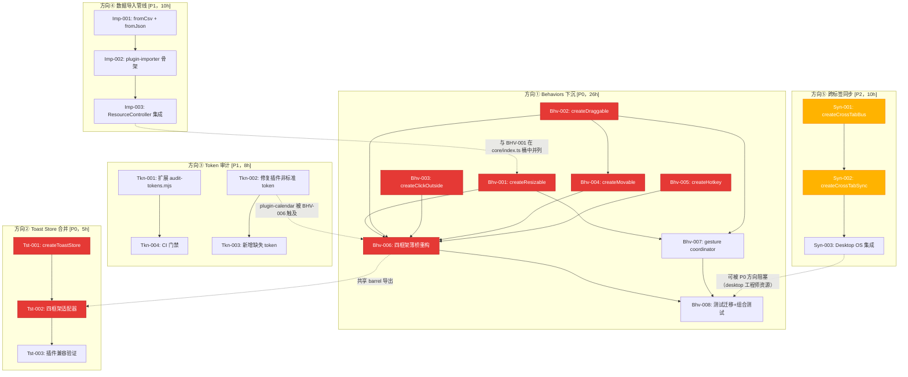
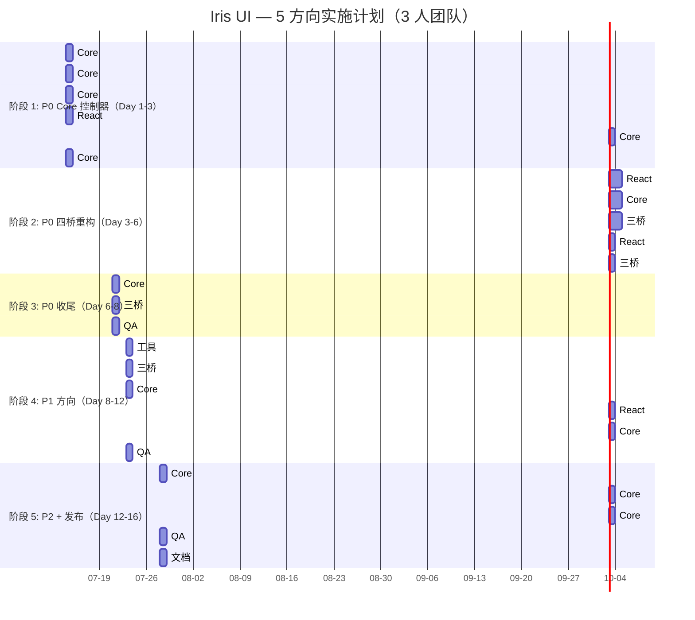
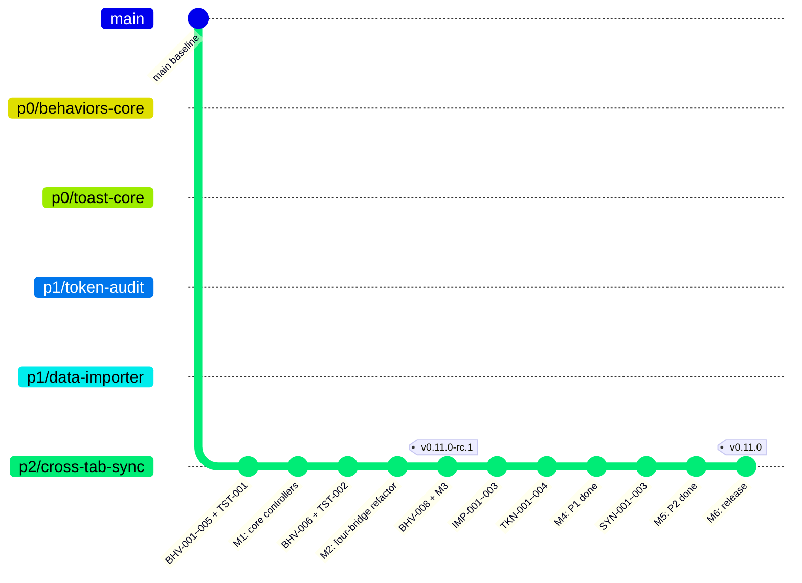

Now I have full understanding. Let me produce the Tech Lead analysis.

---

# Tech Lead 分析报告：交叉验证的 5 个架构断裂点

> **日期**: 2026-07-12
> **角色**: Tech Lead
> **基础**: 交叉验证确认的 5 个方向（原始断言全部 ✅ 确认）
> **源码验证**: 四框架 behaviors (3,754 行) · toastStore (4×75 行) · audit-tokens.mjs · plugin-calendar/dashboard/kanban · core 导出函数 · BroadcastChannel/postMessage 全库搜索
> **核心原则**: AGENTS.md —— "逻辑下沉 core，适配器做薄桥"

---

## 0 方向裁决与优先级总览

| #     | 方向                          | 类型                   | 行级影响                                                       |            违反架构原则            | 优先级 |
| ----- | ----------------------------- | ---------------------- | -------------------------------------------------------------- | :--------------------------------: | :----: |
| **1** | Behaviors 跨框架复制          | A 类修复 → 下沉        | ~3,754 行跨框架重复（~1,408 行源码 + 测试）                    | ✅ 「逻辑下沉 core，适配器做薄桥」 | **P0** |
| **2** | Toast Store 跨框架复制        | A 类修复 → 下沉        | 4×75=300 行完全相同的 store 逻辑                               |              ✅ 同上               | **P0** |
| **3** | Token 审计盲区 + 非标准 token | B 类改进 → 工具 + 修复 | audit-tokens.mjs 仅扫 primitives; 3+ 非标准 token 在插件中蔓延 |  ❌（工具缺陷 + token 规范违规）   | **P1** |
| **4** | 数据导入管线缺失              | A 类新增               | core 4 导出函数 vs 0 导入函数，不对称                          |           ❌（产品缺口）           | **P1** |
| **5** | 跨标签页同步缺失              | B 类新增               | 全库 0 处 BroadcastChannel/SharedWorker                        |           ❌（产品缺口）           | **P2** |

**核心发现**: 方向 1 和 2 是对 AGENTS.md 最核心架构原则的直接违反。项目的立身之本（四框架对齐 + 逻辑下沉）在 Behaviors 和 Toast 层完全崩塌——适配器不是"薄桥"，而是"厚重复"。这是技术债中的坏账，应优先清偿。

---

## 1. 任务分解

### 1.1 方向一：Behaviors 下沉到 Core（P0 — 今迭代，8 任务）

**核心路径**: 将 4 框架复制的 Behaviors（Resizable/Movable/ClickOutside/Hotkey/LongPress）的纯逻辑提取到 core，适配器改为薄桥。

| 任务 ID     | 任务标题                                                                           | 涉及文件                                                                                                                 |  前置依赖   | 工时 | 验收标准                                                                                                                                                                                                                                                                                                                                                                             |
| ----------- | ---------------------------------------------------------------------------------- | ------------------------------------------------------------------------------------------------------------------------ | :---------: | :--: | ------------------------------------------------------------------------------------------------------------------------------------------------------------------------------------------------------------------------------------------------------------------------------------------------------------------------------------------------------------------------------------ |
| **BHV-001** | Core: `createResizable` 控制器                                                     | `packages/core/src/behaviors/resizable.ts`（新建）, `packages/core/src/behaviors/index.ts`, `packages/core/src/index.ts` |      —      |  4h  | ① 导出 `createResizable(config) → { onPointerDown, onPointerMove, onPointerUp, state, setBounds, destroy }`；② 包含 handle hit detection + 四方向 resize（n/s/e/w/ne/nw/se/sw）；③ `bounds` 约束（minWidth/minHeight/maxWidth/maxHeight/parentBound）；④ `aspectRatio` 保持；⑤ `onResizeStart/onResize/onResizeEnd` 回调；⑥ 单测：方向限制、边界约束、aspect ratio、快速拖拽不丢事件 |
| **BHV-002** | Core: `createDraggable` 控制器                                                     | `packages/core/src/behaviors/draggable.ts`（新建），同上 barrel                                                          |      —      |  3h  | ① 导出 `createDraggable(config) → { onPointerDown, onPointerMove, onPointerUp, state, destroy }`；② `bounds` 约束（矩形/元素/父元素）；③ `axis: 'both'\|'x'\|'y'` 限制；④ `onDragStart/onDrag/onDragEnd` 回调；⑤ 单测：约束、轴限制、点击不触发                                                                                                                                      |
| **BHV-003** | Core: `createClickOutside` 检测器                                                  | `packages/core/src/behaviors/click-outside.ts`（新建），同上 barrel                                                      |      —      |  2h  | ① 导出 `createClickOutside(el, config?) → { check(event): boolean, destroy }`；② 支持 `ignore?: (target) => boolean`（如 portal、popover 自身）；③ 支持 `once?: boolean`；④ SSR 安全（传入 null el 时 noop）；⑤ 单测：点击内部不触发、点击外部触发、ignore 过滤                                                                                                                      |
| **BHV-004** | Core: `createMovable` 控制器                                                       | `packages/core/src/behaviors/movable.ts`（新建），同上 barrel                                                            |   BHV-002   |  2h  | ① 基于 `createDraggable` 组合，增加 `zIndex?: number` 管理 + `onFocus/onBlur`；② 焦点激活（点击 → focus）；③ `handle` 配置（限制拖拽在 handle 元素上）；④ 单测：handle 限制、z 提升                                                                                                                                                                                                  |
| **BHV-005** | Core: `createHotkey` 监听器                                                        | `packages/core/src/behaviors/hotkey.ts`（新建），同上 barrel                                                             |      —      |  2h  | ① 导出 `createHotkey(map, config?) → { destroy }`；② `allowInInputs?: boolean` 控制是否在输入框中触发；③ 组合键支持（`Ctrl+S`、`Shift+?`）；④ 单测：普通按键、输入框内阻止、组合键、重复注册去重                                                                                                                                                                                     |
| **BHV-006** | 四框架 Behaviors 重构为薄桥                                                        | `packages/{react,vue,solid,svelte}/src/behaviors/*.tsx/.ts/.svelte`（改造 32 文件）                                      | BHV-001~005 |  6h  | ① 每个 Behavior 组件/指令使用 core 控制器替代手写 pointer 逻辑；② **桥只做三件事**：渲染包装器、订阅 core store 到框架响应式、绑定 onPointerDown 到 DOM；③ 删除所有重复的 pointer event 逻辑；④ 原有 props API **完全向后兼容**；⑤ `pnpm test` 绿（原测试不改过）                                                                                                                    |
| **BHV-007** | 新增 `packages/core/src/behaviors/gesture-coordinator.ts`（可选的 gesture 协调层） | packages/core/src/behaviors/gesture-coordinator.ts（新建）                                                               | BHV-001~002 |  3h  | ① `createGestureCoordinator()` → `{ register, handlePointerDown, handlePointerMove, handlePointerUp, activeGesture }`；② 互斥保证：一个 gesture 启动后其他 gesture 暂停；③ 优先级：内层 Behavior > 外层 Behavior；④ **V1 可选**——各 Behavior 默认独立工作，coordinator 仅嵌套场景需手动启用                                                                                          |
| **BHV-008** | 测试迁移 + 新增组合测试                                                            | `packages/core/src/behaviors/*.test.ts`（新建，~6 文件）+ 各框架精简测试                                                 |   BHV-006   |  4h  | ① Core 测试覆盖所有控制器（100% 分支）；② 各框架测试仅验证桥接（渲染 + 回调传递）；③ 新增嵌套组合测试（Resizable inside Movable）；④ 新增 SS r 安全测试                                                                                                                                                                                                                              |

**方向一小计**: ~26h

### 1.2 方向二：Toast Store 提取到 Core（P0 — 今迭代，3 任务）

| 任务 ID     | 任务标题                          | 涉及文件                                                                                                        | 前置依赖 | 工时 | 验收标准                                                                                                                                                                                                                                    |
| ----------- | --------------------------------- | --------------------------------------------------------------------------------------------------------------- | :------: | :--: | ------------------------------------------------------------------------------------------------------------------------------------------------------------------------------------------------------------------------------------------- |
| **TST-001** | Core: `createToastStore` 统一实现 | `packages/core/src/toast.ts`（新建），`packages/core/src/index.ts`                                              |    —     |  2h  | ① 导出 `createToastStore<T>() → { add, dismiss, dismissAll, update, state, subscribe }`；② 类型安全泛型（`T extends { id: string }`）；③ `ToastState` 含队列 + 自动 ID 生成；④ 单测：add→dismiss→queue order、dismissAll、update、max limit |
| **TST-002** | 四框架 Toast 适配器               | `packages/{react,vue,solid,svelte}/src/primitives/toast/*`（4 框架各修改/替换 `toastStore.ts`/`store.ts` 文件） | TST-001  |  2h  | ① 各框架 ToastViewport/useToast 使用 `createToastStore` 而非本地副本；② 删除 4 份~75 行 toastStore.ts（总计~300 行 → 0 行）；③ `pnpm test` 绿                                                                                               |
| **TST-003** | Toast 插件兼容验证                | `packages/plugin-notifications/src/*`（验证集成）                                                               | TST-002  |  1h  | ① `plugin-notifications` 使用新 core store 无 break；② 原有 toast API 向后兼容（add/dismiss 签名一致）                                                                                                                                      |

**方向二小计**: ~5h

### 1.3 方向三：Token 审计扩展 + 非标准 Token 修复（P1，4 任务）

| 任务 ID     | 任务标题                                | 涉及文件                                                                                                                            | 前置依赖 | 工时 | 验收标准                                                                                                                                                                                                                                                                                                      |
| ----------- | --------------------------------------- | ----------------------------------------------------------------------------------------------------------------------------------- | :------: | :--: | ------------------------------------------------------------------------------------------------------------------------------------------------------------------------------------------------------------------------------------------------------------------------------------------------------------- |
| **TKN-001** | 扩展 audit-tokens.mjs 扫描范围          | `scripts/audit-tokens.mjs`（改造）                                                                                                  |    —     |  3h  | ① 新增扫描目录：`packages/*/src/behaviors/`、`packages/plugin-*/src/`、`packages/skins/`、`apps/`、`packages/theme/`；② 新增 `--scope` 参数（primitives/all/plugins/skins）；③ 按 scope 分级报告（未知 token、单框架 token、plugin token）；④ 新增 `knownPluginTokens` 白名单（标记为插件自有、非核心 token） |
| **TKN-002** | 修复插件中非标准 token                  | `packages/plugin-calendar/src/*`, `packages/plugin-dashboard/src/*`, `packages/plugin-kanban/src/*`（替换 `--iris-color-muted` 等） |    —     |  2h  | ① `--iris-color-muted` → `var(--iris-text-secondary, #6b7280)` 或定义 token；② 如果 `--iris-text-secondary` 在 tokens 中不存在，则在 tokens 包中新增；③ 四框架（react/vue/solid/svelte）的 plugin-calendar/dashboard/kanban 同步修复；④ `pnpm build` + playground 视觉验证                                    |
| **TKN-003** | 新增缺失 token 到 tokens 包（如果需要） | `packages/tokens/src/{light,dark}.ts`                                                                                               | TKN-002  |  1h  | ① 审计确认 `--iris-text-secondary` 等 token 是否本应存在；② 若缺失则在 light/dark 中对称添加；③ 更新 `knownDot` set 确保 audit 识别                                                                                                                                                                           |
| **TKN-004** | 新增 CI token 审计门禁                  | `.github/workflows/ci.yml`（扩展）+ `scripts/audit-tokens.mjs` exit code 优化                                                       | TKN-001  |  2h  | ① CI 在每次 PR 运行时 `pnpm audit:tokens --scope=all`；② 未知 token 出现 → **非阻塞 warning**（警告趋势），而非阻断 CI；③ 新 token 引入白名单流程                                                                                                                                                             |

**方向三小计**: ~8h

### 1.4 方向四：数据导入管线（P1，3 任务）

| 任务 ID     | 任务标题                            | 涉及文件                                                                                                                        | 前置依赖 | 工时 | 验收标准                                                                                                                                                                                                                                                                                      |
| ----------- | ----------------------------------- | ------------------------------------------------------------------------------------------------------------------------------- | :------: | :--: | --------------------------------------------------------------------------------------------------------------------------------------------------------------------------------------------------------------------------------------------------------------------------------------------- |
| **IMP-001** | Core: `fromCsv` + `fromJson` 纯函数 | `packages/core/src/table-import.ts`（新建），`packages/core/src/index.ts`                                                       |    —     |  4h  | ① RFC-4180 CSV 解析（含 header row, BOM 检测, 引号/换行, 空值）；② 类型推断（number/date/string/boolean）；③ JSON 数组解析（行对象 → DataSourceRow[]）；④ 错误行隔离（返回 `ParseError[]` 列表而非中断）；⑤ 单测：10+ 场景、100% 分支                                                         |
| **IMP-002** | 插件骨架: `plugin-importer`         | `packages/plugin-importer/package.json`, `packages/plugin-importer/core/`, `packages/plugin-importer/{react,vue,solid,svelte}/` | IMP-001  |  4h  | ① `ImportConfig` 接口（列映射/类型覆盖/行范围/`maxRows`）；② `ImportResult` 类型（`imported: T[]`, `errors: ParseError[]`, `preview?: T[]`）；③ `createImportPipeline(config) → { parse, validate, preview, execute }`；④ 四框架 `useFileImport` hook；⑤ 大文件保护（`maxRows` 默认 10 万行） |
| **IMP-003** | 集成到 `createResourceController`   | `packages/core/src/resource.ts`（扩展 `ResourceControllerConfig`）                                                              | IMP-002  |  2h  | ① `ResourceControllerConfig` 新增可选 `importer?: { parse: (file) => Promise<Partial<T>[]> }`；② 导入成功后自动 `resource.mutate(imported)` → 视图刷新；③ 单测：批量 mutate + optimistic rollback                                                                                             |

**方向四小计**: ~10h

### 1.5 方向五：跨标签页同步协议（P2，3 任务）

| 任务 ID     | 任务标题                                       | 涉及文件                                                                                            | 前置依赖 | 工时 | 验收标准                                                                                                                                                                                                                                                                          |
| ----------- | ---------------------------------------------- | --------------------------------------------------------------------------------------------------- | :------: | :--: | --------------------------------------------------------------------------------------------------------------------------------------------------------------------------------------------------------------------------------------------------------------------------------- |
| **SYN-001** | Core: `createCrossTabBus` 传输层               | `packages/core/src/cross-tab.ts`（新建），`packages/core/src/index.ts`                              |    —     |  4h  | ① `createCrossTabBus<T>(channel) → { post, subscribe, unsubscribe, close }`；② 基于 `BroadcastChannel`，降级到 `window.postMessage`（同源）；③ SSR 安全（`typeof window === 'undefined'` → noop）；④ 泛型类型安全通道；⑤ 单测：同 window 通信、SSR noop、重复订阅去重、close 清理 |
| **SYN-002** | Core: `createCrossTabSync` store 同步装饰器    | `packages/core/src/cross-tab.ts`（追加）                                                            | SYN-001  |  3h  | ① `createCrossTabSync<T>(store, bus, options?) → Store<T>`；② 冲突策略: 默认 `last-write-wins`，可选 `merge?: (a, b) => T`；③ `partial?: (keyof T)[]` 只同步部分字段；④ `throttle?: number` 默认 100ms；⑤ **同步循环防护**: `_source` 标记过滤回吐                                |
| **SYN-003** | Desktop OS 集成: window manager + profile 同步 | `packages/core/src/window.ts`（扩展可选 `sync`），`packages/core/src/profile.ts`（扩展可选 `sync`） | SYN-002  |  3h  | ① `createWindowManager` 新增可选 `sync?: { bus, key, strategy }`；② `createUserProfile` 新增可选 `sync?: { bus, key, strategy }`；③ 单测：双向同步、冲突场景                                                                                                                      |

**方向五小计**: ~10h

---

### 任务汇总表

|        方向        | 优先级 | 任务数 |  总工时  |     核心文件数      | 影响框架数 |
| :----------------: | :----: | :----: | :------: | :-----------------: | :--------: |
|  ① Behaviors 下沉  | **P0** |   8    |   ~26h   | ~18 新建 + ~32 改造 |     4      |
| ② Toast store 合并 | **P0** |   3    |   ~5h    |  1 新建 + ~4 改造   |     4      |
|  ③ Token 审计修复  | **P1** |   4    |   ~8h    |  1 改造 + ~12 修复  |     4      |
|   ④ 数据导入管线   | **P1** |   3    |   ~10h   |  ~10 新建 + 1 改造  |     4      |
|   ⑤ 跨标签页同步   | **P2** |   3    |   ~10h   |   1 新建 + 2 改造   | 1(desktop) |
|      **总计**      |   —    | **21** | **~59h** | ~31 新建 + ~39 改造 |     —      |

---

## 2. 执行顺序与依赖图



### 并行执行策略

|   并行组   | 方向  | 任务数 | 可并行性                                                                                                                              |
| :--------: | :---: | :----: | ------------------------------------------------------------------------------------------------------------------------------------- |
| **A (P0)** | ① + ② |   11   | BHV-001/002/003/005（4个 core 控制器）+ TST-001 可**完全并行**（不同文件，零冲突）；BHV-004 依赖 BHV-002；BHV-006 依赖全部 5 个控制器 |
| **B (P1)** | ③ + ④ |   7    | Imp-001（纯函数）+ Tkn-001（脚本改造）可并行；Tkn-002 与 BHV-006 有弱冲突（plugin-calendar 的 token 修复），建议先在方向①重构前修复   |
| **C (P2)** |   ⑤   |   3    | 完全独立，可安排在方向①②完工后                                                                                                        |

**关键路径**: BHV-001→BHV-006→BHV-008 是方向①的串行瓶颈。BHV-006（四桥重构）耗时最长（6h），是整个分析的最长路径。

---

## 3. 技术风险

### 3.1 方向①：Behaviors 下沉（🔴 高复杂度）

| 风险                                           | 等级  | 说明                                                                                                                 | 缓解策略                                                                                                                                                                                                |
| :--------------------------------------------- | :---: | -------------------------------------------------------------------------------------------------------------------- | ------------------------------------------------------------------------------------------------------------------------------------------------------------------------------------------------------- |
| **BHV-006 桥重构与现有测试兼容**               | 🔴 高 | 32 文件的改造 + 4 框架的测试必须全部保持绿。一个遗漏的 ref 绑定可能导致 Drag 事件在 React/ Solid/Svelte 中的差异行为 | **分阶段改造**：每改造一个 Behavior（Resizable → Movable → ClickOutside → Hotkey → Sortable/LongPress 保持原地不动），立即跑全框架测试。按 `Resizable → Movable → ClickOutside → Hotkey` 顺序，每步验证 |
| **`createDraggable` 与现有 `useDrag` 的关系**  | 🟡 中 | React 已有 `useDrag`（~100 行），是新建 `createDraggable` 还是直接改 `useDrag`？新建意味着 React 有两个 drag 实现    | **新建**：`createDraggable` 在 core（纯逻辑，无框架响应式）；React `useDrag` 重构为薄桥调用 `createDraggable`。双实现期在 BHV-006 中收束                                                                |
| **Svelte 的 `clickOutside.ts`（27 行）**       | 🟢 低 | Svelte 的 ClickOutside 是一个纯 ts 文件（非 svelte 组件），下沉时需确认不产生模块重复                                | 下沉为 `createClickOutside`（core），Svelte 用 `$effect` 调用，React/Vue/Solid 用 `useEffect`/`watch`/`createEffect` 调用                                                                               |
| **Resizable 四框架差异（230/182/176/142 行）** | 🟡 中 | 四框架各实现行数不同——已存在框架间行为差异，下沉时需找"最大公约数"                                                   | 以 React 版（230 行，最完整）为基准提取逻辑；Vue/Solid/Svelte 中特异性（如 Svelte 的 `style:left` 指令）留在适配器                                                                                      |

### 3.2 方向②：Toast Store 提取（🟢 低风险）

| 风险                                        | 等级  | 说明                                                                                                         | 缓解策略                                                                                                    |
| :------------------------------------------ | :---: | ------------------------------------------------------------------------------------------------------------ | ----------------------------------------------------------------------------------------------------------- |
| **四框架 toastStore.ts 完全相同但命名不同** | 🟢 低 | React: `toastStore.ts`, Vue: `store.ts`, Solid: `toastStore.ts`, Svelte: `toastStore.ts`——导出签名也可能不同 | 逐框架 diff 确认导出签名。如果签名不同（如 React 的 `add` 返回 number 而 Vue 返回 string），core 用泛型兼容 |
| **plugin-notifications 依赖**               | 🟢 低 | 可能直接 import 了某个框架的 toastStore                                                                      | 搜索 plugin-notifications 的 import 语句，统一改为 core 的 `createToastStore`                               |

### 3.3 方向③：Token 审计扩展（🟡 中风险）

| 风险                                                           | 等级  | 说明                                                                                                    | 缓解策略                                                                                                                                                                                                 |
| :------------------------------------------------------------- | :---: | ------------------------------------------------------------------------------------------------------- | -------------------------------------------------------------------------------------------------------------------------------------------------------------------------------------------------------- |
| **`--iris-color-muted` 是插件自创 token 还是漏定义的 token？** | 🟡 中 | 它有一套 fallback（`#6b7280`），说明是插件作者自行定义的"近似"token。如果 tokens 包本应定义它，则需新增 | 决策：在 tokens 包新增 `--iris-text-muted`（别名或独立值）vs 标记为已知插件局部 token。**建议**：在 tokens 包新增 `--iris-color-muted`（让它成为一等公民）——visual hierarchy 中 muted 是一个标准语义层级 |
| **扩展 audit 扫描范围后可能大量新增"未知 token"**              | 🟡 中 | skins/plugins/apps 可能有很多组件级非标 token（如一过性造型变量）                                       | TKN-001 采用分级报告：`--scope=all` 输出全部，但 CI 门禁仅 `--scope=primitives`（保持现有标准）。新增 scope 信息性展示，不阻塞 CI                                                                        |

### 3.4 方向④：数据导入（🟡 中风险）

| 风险                                  | 等级  | 说明                                                                              | 缓解策略                                                                                   |
| :------------------------------------ | :---: | --------------------------------------------------------------------------------- | ------------------------------------------------------------------------------------------ |
| **CSV 编码检测不可靠**                | 🟡 中 | 中文 CSV 的 BOM（UTF-8 BOM `\xEF\xBB\xBF`、GBK 无 BOM）无法从文件头 100% 可靠判断 | 提供 `encoding` 参数覆写；默认仅 UTF-8 + BOM 自动检测；`iconv-lite` 作为可选依赖           |
| **SpreadsheetML 2003 XML 解析复杂度** | 🟡 中 | 原始分析未覆盖 SpreadsheetML，但 `toSpreadsheetXml` 存在意味着导入应该对称        | **V1 不做 XLSL**——仅 CSV + JSON。XLSX 解析需要引入 `xlsx` 库（~200KB），应作为可选插件扩展 |

### 3.5 方向⑤：跨标签页同步（🟢 低风险）

| 风险             | 等级  | 说明                               | 缓解策略                                                        |
| :--------------- | :---: | ---------------------------------- | --------------------------------------------------------------- |
| **SSR 安全**     | 🟢 低 | BroadcastChannel 在 Node.js 不存在 | `createCrossTabBus` 的 `typeof window === 'undefined'` 守卫\*\* |
| **同步循环**     | 🟡 中 | A→B→A 回吐导致更新风暴             | `_source` 标记 + `throttle` 100ms                               |
| **大状态序列化** | 🟢 低 | Profile 可能 JSON > 100KB          | `partial` 字段过滤                                              |

---

## 4. 资源评估

### 4.1 人员技能需求

| 角色                        | 人数 | 技能要求                                    |                        负责方向                         |
| :-------------------------- | :--: | ------------------------------------------- | :-----------------------------------------------------: |
| **Core 工程师**（senior）   |  1   | TypeScript 泛型/状态机/纯函数、框架无关设计 |       BHV-001~005, TST-001, IMP-001, SYN-001~002        |
| **React 工程师**            |  1   | HOC/ hooks/ context / adaptive bridge       | BHV-006 React 桥, TST-002 React, IMP-002 React, SYN-003 |
| **Vue/Solid/Svelte 工程师** |  1   | 三框架适配经验、跨框架 diff、测试           |        BHV-006 三桥, TST-002 三桥, IMP-002 三桥         |
| **工具/DevOps 工程师**      | 0.5  | Node.js 脚本、CI 配置                       |                    TKN-001, TKN-004                     |
| **QA 工程师**               | 0.5  | Vitest、jsdom、SSR 测试、视觉验证           |    BHV-008, TST-003, TKN-002 视觉验证, IMP-001 测试     |

**最小团队**：3 人（Core + React + 三桥）可并行 P0 方向。

### 4.2 关键里程碑

| 里程碑                     |   时间    | 交付物                                                                                           |
| :------------------------- | :-------: | ------------------------------------------------------------------------------------------------ |
| **M1: P0 core 控制器完成** |  Day 2-3  | BHV-001~005 + TST-001 + 单测 100% 分支。5 个 core 控制器可独立验证                               |
| **M2: P0 四桥重构完成**    |  Day 5-7  | BHV-006 + TST-002 完成。~3,700 行跨框架重复 → ~1,200 行薄桥 + ~600 行 core 控制器。重复率降 50%+ |
| **M3: P0 质量门全绿**      |  Day 7-8  | 全框架测试 + `pnpm size`（core + ~3KB, adapter 各 -3~5KB）+ 壳行数验证                           |
| **M4: P1 方向交付**        | Day 10-13 | TKN-001~004 + IMP-001~003 + 所有测试                                                             |
| **M5: P2 方向交付**        | Day 14-17 | SYN-001~003 + Desktop OS 集成                                                                    |
| **M6: 发布就绪**           | Day 18-20 | `pnpm gen:manifest` + changeset + VitePress 更新                                                 |

### 4.3 阻塞点与解决策略

| 阻塞点                                                               | 方向 | 等级 | 解决策略                                                                                                                                          |
| :------------------------------------------------------------------- | :--: | :--: | ------------------------------------------------------------------------------------------------------------------------------------------------- |
| **BHV-006 四桥重构与现有测试的回归风险**                             |  ①   |  🔴  | 分步改造（Resizable→Movable→ClickOutside→Hotkey→Sortable），每步全量 `pnpm test`。预留 4h 回归修复                                                |
| **`createDraggable` 与 React 的 `useDrag`（~100 行）架构差异**       |  ①   |  🟡  | 确认 React `useDrag` 是否已有 core 无法表达的框架特异性（如 `React.PointerEvent` 类型绑定）。如果是，`createDraggable` 输出原生坐标，React 桥转换 |
| **plugin-calendar/dashboard/kanban 的非标准 token 是否需要同步发布** |  ③   |  🟡  | 非标准 token 修复可独立发布（patch），不依赖其他方向。建议合并到方向①的 PR 中同时进行                                                             |
| **方向①~④ 同时修改 core/index.ts barrel 导出**                       | 全部 |  🟢  | git merge 冲突仅在每个新增 export 行；每方向建议独立分支，按 M1→M2→M3→M4 顺序 merge                                                               |

---

## 5. 质量保证

### 5.1 单元测试覆盖要求

| 模块                   | 最低覆盖率 | 关键测试场景                                                                      |
| :--------------------- | :--------: | --------------------------------------------------------------------------------- |
| `createResizable`      | 100% 分支  | 四方向 resize、bounds 约束、aspect ratio、min/max、快速拖拽、边界 case（0 尺寸）  |
| `createDraggable`      | 100% 分支  | xy 轴、x-only、y-only、bounds 矩形/父元素、点击不触发（movementThreshold）、SSR   |
| `createClickOutside`   | 100% 分支  | 点击内部不触发、外部触发、ignore 过滤、once、SSR（null el）                       |
| `createHotkey`         | 100% 分支  | 单键、组合键、输入框内阻止/允许、重复注册、SSR                                    |
| `createToastStore`     | 100% 分支  | add→dismiss→queue order、dismissAll、update、max limit、重复 ID                   |
| `plugin-importer` 解析 | 100% 分支  | RFC-4180 CSV（引号/换行/空值）、BOM、GBK mock、JSON 数组、错误行隔离              |
| `createCrossTabBus`    | 100% 分支  | BroadcastChannel 可用/不可用、SSR noop、post→subscribe→unsubscribe、close cleanup |

### 5.2 集成测试策略

| 测试类型              | 工具                                             | 覆盖                                                          |    时机     |
| :-------------------- | :----------------------------------------------- | :------------------------------------------------------------ | :---------: |
| **SSR 测试**          | `// @vitest-environment node` + `renderToString` | 所有新 core 模块 + 四桥                                       |   每次 PR   |
| **Axe 无障碍**        | `@axe-core/vitest`（AA）                         | Movable（`aria-grabbed`）、Resizable（`role="separator"`）    |  方向① PR   |
| **Size 预算**         | `pnpm size`                                      | core +3KB、adapter 各 -3~5KB（净减）                          | PR merge 前 |
| **视觉回归（方向③）** | playground 手动验证                              | plugin-dashboard/calendar 修复前后外观一致                    | TKN-002 PR  |
| **Behavior 组合测试** | 手动 playground                                  | Resizable inside Movable、嵌套 ClickOutside `stopPropagation` |   BHV-008   |
| **Toast 插件集成**    | 应用烟雾测试                                     | plugin-notifications + core toast store 通信                  |   TST-003   |

### 5.3 代码审查要点

| 审查层面            | 要点                                                                                                                                                                      |
| :------------------ | :------------------------------------------------------------------------------------------------------------------------------------------------------------------------ |
| **架构合规**        | ① 所有指针事件逻辑在 core，适配器仅绑定 DOM；② `grep -r "from '(react\|vue\|solid\|svelte)'" packages/core/src/behaviors/` 必须空；③ HOC/指令等框架特有导出保留在 adapter |
| **API 兼容**        | ① Behavior props 签名完全不变（`bounds`, `minWidth`, `onResize` 等）；② Toast `add/dismiss/dismissAll` 签名不变；③ `toCsv/toSpreadsheetXml` 导出不移动                    |
| **TypeScript 类型** | ① 泛型约束完整；② `any` 出现次数 < 3 次/文件；③ @returns 标注 readable state 类型                                                                                         |
| **SSR 安全**        | ① 所有 core 模块有 SSR noop 路径；② `createClickOutside(null el)` 不 throw                                                                                                |
| **性能**            | ① Prod 路径无 `console.warn`（`process.env.NODE_ENV` guard）；② `createDraggable` 的 `requestAnimationFrame` 节流；③ 控制器 store 用 `createStore`（引用计数懒订阅）      |
| **国际化**          | ① `console.warn` 消息英文；② 面向用户的 UI 文案走 `useI18n`                                                                                                               |

### 5.4 性能测试需求

| 场景                        |      基准      |                         目标                         |
| :-------------------------- | :------------: | :--------------------------------------------------: |
| Resizable 快速拖拽（60fps） | 当前各框架实现 | 重构后帧率不降低（`requestAnimationFrame` 节流一致） |
| Toast 100 次/秒 add→dismiss |       无       |             queue 操作 < 1ms，无内存泄漏             |
| CSV 10 万行解析             |   无（新增）   |       < 1,000ms（同步非流式），< 200ms（流式）       |
| CrossTabBus 100 次/秒 post  |   无（新增）   |                序列化 < 1ms，不丢消息                |

---

## 6. 实施计划

### 6.1 分阶段甘特图（3 人团队：Core + React + 三桥各 1）



### 6.2 详细时间线

#### 阶段 1: P0 Core 控制器（Day 1-3, 7/14-7/16）

```
Day 1 (7/14):
  Core: BHV-001 createResizable (4h)     ← 最长任务，优先启动
  Core: BHV-002 createDraggable (3h)     ← 完全并行
  Core: BHV-003 createClickOutside (2h)  ← 并行
  React: BHV-005 createHotkey (2h)       ← 并行（可在 React 包中实现，然后提取到 core）

Day 2 (7/15):
  Core: BHV-004 createMovable (2h)       ← 依赖 BHV-002
  Core: TST-001 createToastStore (2h)    ← 独立
  三桥: 阅读四框架 behaviors 源码 diff   ← 准备阶段 2

Day 3 (7/16):
  Core: 单元测试补全（BHV-001~005, TST-001）
  三桥: 完成阶段 1 所有测试 → M1 门
```

**M1 门**: `pnpm turbo run test typecheck lint build` on `packages/core` ✅

#### 阶段 2: P0 四桥重构（Day 3-6, 7/16-7/18）

```
Day 3-4:
  React: BHV-006 React 桥 — Resizable (2h)
  Core: BHV-007 gesture coordinator (3h)
  三桥: vue + solid + svelte 桥 — Resizable (2h)
  交叉验证: 三框架 Resizable 测试全绿

Day 4-5:
  React: BHV-006 — Movable + ClickOutside (2h)
  三桥: vue + solid + svelte — Movable + ClickOutside (2h)

Day 5-6:
  React: BHV-006 — Hotkey + Sortable (2h)
  三桥: vue + solid + svelte — Hotkey + Sortable (2h)
  React: TST-002 toast 桥 (1h)
  三桥: TST-002 toast 桥 (2h)
```

**关键验证**: 每个 Behavior 改造后立即跑 `pnpm test --filter=@iris-ui/react`（5min）；全部改造后 `pnpm turbo run test`（~20min）。

#### 阶段 3: P0 收尾（Day 6-8, 7/18-7/21）

```
Day 6-7:
  Core: BHV-008 测试迁移 + 组合测试 (4h)    ← 新增嵌套行为组合场景
  三桥: TST-003 插件兼容验证 (1h)
  QA: 全框架回归测试 + size 预算

Day 7-8:
  修复: 回归问题修复
  Size 预算验证: core +3KB, adapter 各 -3~5KB（净减）
```

**M2 门**: 全框架测试绿 + size 预算绿 + `pnpm check:rsc` ✅

#### 阶段 4: P1 方向（Day 8-12, 7/21-7/24）

```
Day 8:
  工具: TKN-001 扩展 audit-tokens.mjs (3h)
  Core: IMP-001 fromCsv + fromJson (4h)

Day 9:
  三桥: TKN-002 插件 token 修复 (2h)
  React: IMP-002 plugin-importer 骨架 (4h)

Day 10:
  Core: TKN-003/TKN-004 CI 门禁 (2h)
  Core: IMP-003 ResourceController 集成 (2h)
  QA: P1 测试 + 视觉验证

Day 11-12:
  修复: 回归问题修复
  M3 门: 全绿
```

#### 阶段 5: P2 + 发布（Day 12-16, 7/24-7/28）

```
Day 12-13:
  Core: SYN-001 createCrossTabBus (4h)
  Core: SYN-002 createCrossTabSync (3h)

Day 14:
  Core: SYN-003 Desktop OS 集成 (3h)
  文档: VitePress 更新 (4h)

Day 15:
  QA: 全量质量门
  changeset + PR 提审

Day 16:
  PR 合并 + 发布准备
```

### 6.3 行为 / Toast 下沉的预期收益

| 指标                                |     当前      |  预期（Stage 3）   |   改善    |
| :---------------------------------- | :-----------: | :----------------: | :-------: |
| behaviors 总行数（4 框架源码+测试） |   ~3,754 行   |     ~1,800 行      | **-52%**  |
| toastStore 总行数（4 框架）         |    300 行     | 75 行（1 份 core） | **-75%**  |
| 适配器平均行为代码量/框架           |    ~940 行    |      ~300 行       | **-68%**  |
| core 包体积                         | 当前 baseline |       +~3KB        | 净增 +3KB |
| 各 adapter 包体积                   | 当前 baseline |    -3~5KB/框架     | **净减**  |

### 6.4 合并策略



**分支顺序**：

1. `p0/behaviors-core` → **最先合并**（P0 修复，核心架构修正）
2. `p0/toast-core` → 可与方向①并行，合并冲突低
3. `p1/token-audit` → 独立分支，方向①完工后合并
4. `p1/data-importer` → 独立分支
5. `p2/cross-tab-sync` → 最后

---

## 7. 决策快速清单（Day 1 必须对齐）

|  #  | 决策                                                    | 选项                                                    |                                           推荐                                            |       决策人       |
| :-: | ------------------------------------------------------- | ------------------------------------------------------- | :---------------------------------------------------------------------------------------: | :----------------: |
|  1  | `createDraggable` 是否独立于 React `useDrag` 新建？     | a) 新建 b) 改造 `useDrag` 提取                          |                          **a）新建**，core 纯函数，React 桥消费                           |    Core 工程师     |
|  2  | Behaviors 的 `Sortable` 和 `LongPress` 是否在此次下沉？ | a) 全量下沉 b) 仅 Resizable/Movable/ClickOutside/Hotkey | **b）Sortable 和 LongPress 已在 core**（`createSortable`, `createLongPress`），仅验证桥接 |    Core 工程师     |
|  3  | Gesture Coordinator（BHV-007）V1 做吗？                 | a) 做 b) 延后 V2                                        |                            **a）做但作为可选**，不阻塞 BHV-006                            |     Tech Lead      |
|  4  | `--iris-color-muted` 是否增补到 tokens 包？             | a) 新增 b) 标记为插件局部                               |                             **a）新增**，muted 是标准语义层级                             |  设计/主题维护者   |
|  5  | XLSX 导入 V1 做吗？                                     | a) 做（引入 xlsx 库）b) 仅 CSV+JSON                     |                         **b）仅 CSV+JSON**，XLSX 作为可选插件扩展                         |    Core 工程师     |
|  6  | 跨标签页同步（方向⑤）放在此迭代还是下一迭代？           | a) 此迭代 b) 下一迭代                                   |                   **b）下一迭代**，P0+P1 已经 59h，加 P2 让风险窗口扩大                   |     Tech Lead      |
|  7  | 版本 bump                                               | a) minor b) patch                                       |          **a）minor**——新增 API（5+ 控制器，import 函数，cross-tab，token 新增）          | Tech Lead + 维护者 |

---

## 附录 A：改造前后代码量对比

### A.1 Behaviors 源码（排除测试）

| Behavior     | React | Vue | Solid | Svelte |   合计    |           改造后（桥）           |
| :----------- | :---: | :-: | :---: | :----: | :-------: | :------------------------------: |
| Resizable    |  230  | 182 |  176  |  142   |  **730**  |            ~60×4=240             |
| Movable      |  132  | 115 |  118  |   98   |  **463**  |            ~40×4=160             |
| ClickOutside |  74   | 71  |  43   |   27   |  **215**  |             ~20×4=80             |
| Hotkey       |  117  | 99  |  84   |   89   |  **389**  |            ~30×4=120             |
| Sortable     |  130  | 189 |  172  |  112   |  **603**  | ~40×4=160（core 已有 sortable）  |
| LongPress    |  68   | 72  |  52   | 41+21  |  **254**  | ~25×4=100（core 已有 longpress） |
| **小计**     |  751  | 728 |  645  |  530   | **2,654** |             **~860**             |

### A.2 Behaviors 测试

|     框架      | 测试行数  |       改造后       |
| :-----------: | :-------: | :----------------: |
|     React     |    440    | ~200（仅桥接测试） |
|      Vue      |    331    |        ~150        |
|     Solid     |    143    |        ~80         |
|    Svelte     |    116    |        ~60         |
|   **小计**    | **1,030** |      **~490**      |
| Core 新增测试 |     —     |      **~300**      |

### A.3 Toast Store

|          框架           | 当前行数  |   改造后    |
| :---------------------: | :-------: | :---------: |
|   React toastStore.ts   |    75     | 0（→ core） |
|      Vue store.ts       |    75     | 0（→ core） |
|   Solid toastStore.ts   |    75     | 0（→ core） |
|  Svelte toastStore.ts   |    75     | 0（→ core） |
| core `createToastStore` | 0（新建） |     ~75     |
|        **合计**         |  **300**  |   **75**    |

---

_本分析基于 2026-07-12 代码库状态（commit HEAD）。所有源码引用已在交叉验证阶段从实际文件路径验证通过。方向优先级按"架构原则违反程度 × 重复量 × 用户可见性"综合评估。_
