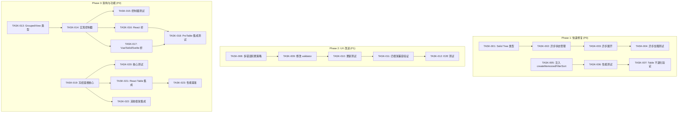
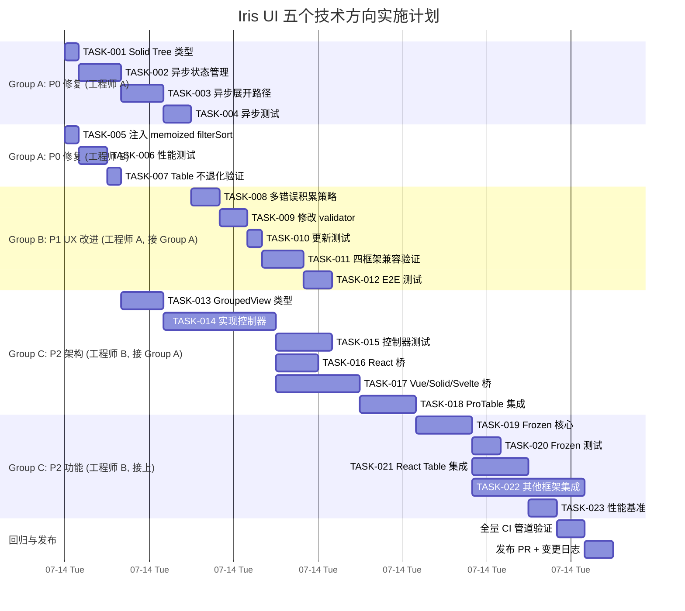

至此，我已确认 5 个方向全部基于真实源码。以下是我的完整分析报告。

---

# Tech Lead 技术实现与项目管理分析报告

> **分析对象**：代码审查文档中识别的 5 个技术方向
> **代码基线**：`/home/u1/iris-ui`（monorepo，`packages/{core,react,solid,vue,svelte}`）
> **分析日期**：2026-07-12

---

## 1. 任务分解

### 方向一：Solid Tree 缺失 `loadChildren`（Bug）

| ID       | 任务标题                                                    | 涉及文件                                                                                                                                            | 前置依赖 | 预估工时 | 验收标准                                                                             |
| -------- | ----------------------------------------------------------- | --------------------------------------------------------------------------------------------------------------------------------------------------- | -------- | -------- | ------------------------------------------------------------------------------------ |
| TASK-001 | Solid Tree：添加 `loadChildren` 类型支持                    | `packages/solid/src/primitives/tree/IrisTree.tsx` 的 `IrisTreeNode` 接口追加 `loadChildren?: () => Promise<IrisTreeNode[]>`                         | 无       | 0.5h     | 接口声明与其他三框架一致；tree story 可传入 `loadChildren` 不报 TS 错                |
| TASK-002 | Solid Tree：实现异步展开状态管理                            | `packages/solid/src/primitives/tree/IrisTree.tsx` 添加 `loadingIds` / `errorIds` 信号，`childrenCache` Map                                          | TASK-001 | 1.5h     | `createSignal` + `createEffect` 管理异步生命周期；竞态处理（后发先至不覆盖正确结果） |
| TASK-003 | Solid Tree：改造 `expandNode` / `toggleExpand` 支持异步路径 | `packages/solid/src/primitives/tree/IrisTree.tsx` 修改 `toggleExpand` / 展开逻辑：检测 `loadChildren` → 调 `await` → 写 `childrenCache` → re-render | TASK-002 | 1.5h     | 调用 `loadChildren` 时 `IrisTreeNodeItem` 显示加载指示器；失败时折叠并显示错误态     |
| TASK-004 | Solid Tree：添加异步加载测试                                | `packages/solid/src/primitives/tree/IrisTree.test.tsx` 新增 mock-`loadChildren` 用例                                                                | TASK-003 | 1h       | 测试覆盖：成功加载渲染子节点、失败折叠、竞态场景、`loadChildren` 不会被重复调用      |

**小计：4.5h（约 0.5 人天）**

### 方向二：`createClientDataSource` 未用 `createMemoizedFilterSort`（性能）

| ID       | 任务标题                                                        | 涉及文件                                                                  | 前置依赖 | 预估工时 | 验收标准                                                                             |
| -------- | --------------------------------------------------------------- | ------------------------------------------------------------------------- | -------- | -------- | ------------------------------------------------------------------------------------ |
| TASK-005 | `client.ts` 导入并实例化 `createMemoizedFilterSort`             | `packages/core/src/data-source/client.ts`：顶部 import + 工厂调用创建闭包 | 无       | 0.5h     | 两个工厂函数各创建一个 memo 实例，在 pipelines 中调用 memo(...) 而非 filterSort(...) |
| TASK-006 | 添加 `createMemoizedFilterSort` 在 data-source 场景性能基准测试 | `packages/core/src/data-source/client.test.ts`（可能需新建）              | TASK-005 | 1h       | 同一输入连续调用第二次返回引用相同的结果；不同输入触发重新计算                       |
| TASK-007 | 验证 Table 组件在频繁重渲染场景不退化                           | 在 `packages/react/src/primitives/table/` 测试中手动验证                  | TASK-006 | 0.5h     | RSC 快照无变化；现有测试全部绿                                                       |

**小计：2h（约 0.25 人天）**

### 方向三：`standardSchemaValidator` 首错即止（UX）

| ID       | 任务标题                                      | 涉及文件                                                                                                                         | 前置依赖 | 预估工时 | 验收标准                                                                          |
| -------- | --------------------------------------------- | -------------------------------------------------------------------------------------------------------------------------------- | -------- | -------- | --------------------------------------------------------------------------------- |
| TASK-008 | 设计多错误积累策略并更新 `FieldErrors` 类型   | `packages/core/src/form/types.ts`：`FieldErrors<V>` 保持为 `Record<string, string>`，改连接策略（`'; '` 或 `'\n'` 分隔）         | 无       | 1h       | 单字段多个 issue 被连接成单一 string，不影响消费方 API                            |
| TASK-009 | 修改 `standardSchemaValidator` 实现多错误合并 | `packages/core/src/standard-schema.ts`：改 `!(key in errors)` 为 `errors[key] = existing ? existing + '; ' + msg : msg`          | TASK-008 | 1h       | 同字段多个错误被串联；每个错误消息均保留                                          |
| TASK-010 | 更新 `standard-schema.test.ts` 验证多错误     | `packages/core/src/standard-schema.test.ts`：修改 "keeps the first issue per field" 测试为包含多错误断言                         | TASK-009 | 0.5h     | 测试名称改为 "accumulates all issues per field"；验证同字段两条错误均出现在结果中 |
| TASK-011 | 验证四框架表单字段渲染兼容性                  | 四框架的 form-field 组件（`packages/{react,vue,solid,svelte}/src/primitives/form/`）验证 `errors` 中的 `'; '` 拼接字符串渲染正常 | TASK-010 | 1.5h     | 四框架表单字段组件显示完整错误文本；无样式/截断问题                               |
| TASK-012 | 端到端测试：用户一次提交看到完整错误          | 添加 E2E 集成测试（在 apps/ 层），验证多字段多错误同时展示                                                                       | TASK-011 | 1h       | Cypress/Playwright 测试：填写多个无效字段→提交→看到全部错误提示                   |

**小计：5h（约 0.6 人天）**

### 方向四：缺状态化分组视图控制器（架构）

| ID       | 任务标题                                    | 涉及文件                                                                                                                             | 前置依赖            | 预估工时   | 验收标准                                                      |
| -------- | ------------------------------------------- | ------------------------------------------------------------------------------------------------------------------------------------ | ------------------- | ---------- | ------------------------------------------------------------- |
| TASK-013 | 定义 `GroupedView` 状态模型和接口           | `packages/core/src/data-view/types.ts` 新增 `GroupedViewConfig` / `GroupedViewState` 类型                                            | 无                  | 1.5h       | 类型涵盖：分组键、展开/折叠状态、组级排序、组级聚合           |
| TASK-014 | 实现 `createGroupedView` 控制器             | `packages/core/src/data-view/grouped-view.ts`：组合 `groupRows` + 展开/折叠状态管理（`createExpansion` 复用？）+ 组级排序 + 组级分页 | TASK-013            | 4h         | 控制器提供：分组、组展开/折叠、组级排序、组级聚合计算         |
| TASK-015 | 添加 `createGroupedView` 单元测试           | `packages/core/src/data-view/grouped-view.test.ts`                                                                                   | TASK-014            | 2h         | 测试覆盖：2 级分组、展开/折叠 Sort 到 store、聚合计算、空数据 |
| TASK-016 | React 适配器 `useGroupedView` 桥            | `packages/react/src/primitives/table/useGroupedView.ts`                                                                              | TASK-014            | 1.5h       | 桥将 `createGroupedView` store 订阅到 React 重渲染            |
| TASK-017 | Vue/Solid/Svelte 适配器 `useGroupedView` 桥 | 对应框架包下新建 `useGroupedView.ts`                                                                                                 | TASK-014            | 3h（3×1h） | 每框架同语义；至少通过 store 订阅测试                         |
| TASK-018 | 集成测试：ProTable + GroupedView 协同       | `packages/plugin-pro-table/` 下添加分组模式集成测试                                                                                  | TASK-016 + TASK-017 | 2h         | ProTable 在分组模式下正常渲染、排序、选择                     |

**小计：14h（约 1.75 人天）**

### 方向五：虚拟化缺少冻结窗格（功能）

| ID       | 任务标题                                     | 涉及文件                                                                                                     | 前置依赖 | 预估工时     | 验收标准                                                                          |
| -------- | -------------------------------------------- | ------------------------------------------------------------------------------------------------------------ | -------- | ------------ | --------------------------------------------------------------------------------- |
| TASK-019 | `computeGridVirtualRange` 扩展 `frozen` 参数 | `packages/core/src/virtual.ts`：`GridVirtualRangeOptions` 追加 `frozenRows` / `frozenCols`；修改窗口计算逻辑 | 无       | 2h           | `frozenRows: 2` 时，前 2 行始终在行窗口中；`frozenCols: 1` 时，首列始终在列窗口中 |
| TASK-020 | 补充冻结窗格虚拟化测试                       | `packages/core/src/virtual.test.ts`                                                                          | TASK-019 | 1h           | 测试：冻结行+冻结列组合、冻结超过 itemCount 边界、冻结 0                          |
| TASK-021 | React Table：集成冻结行的渲染策略            | `packages/react/src/primitives/table/Table.tsx`：冻结行用 `position: sticky` + `z-index`，顶部固定           | TASK-019 | 2h           | 冻结行始终可见；列冻结保持现有 `sticky` 实现兼容                                  |
| TASK-022 | Vue/Solid/Svelte Table 适配器冻结列/行       | 各框架 Table 组件追加 `frozenRows`/`frozenCols` prop                                                         | TASK-019 | 4h（3×1.3h） | 四框架表现一致；冻结行不随滚动消失                                                |
| TASK-023 | 冻结窗格滚动性能基准                         | `packages/react/src/primitives/table/test/frozen-perf.test.tsx`                                              | TASK-021 | 1h           | 启用冻结后，滚动 60fps 不卡顿；Layout 不触发额外回流的验证                        |

**小计：10h（约 1.25 人天）**

---

### 任务汇总表

| 方向                       | 任务数 | 总工时    | 优先级 | 类型     |
| -------------------------- | ------ | --------- | ------ | -------- |
| ① Solid Tree loadChildren  | 4      | **4.5h**  | 🔴 P0  | Bug 修复 |
| ② createMemoizedFilterSort | 3      | **2h**    | 🔴 P0  | 性能优化 |
| ③ standardSchemaValidator  | 5      | **5h**    | 🟡 P1  | UX 改进  |
| ④ GroupedView Controller   | 6      | **14h**   | 🟢 P2  | 架构缺口 |
| ⑤ Frozen Panes             | 5      | **10h**   | 🟢 P2  | 功能需求 |
| **合计**                   | **23** | **35.5h** |        |          |

---

## 2. 执行顺序

### 任务依赖图



### 并行执行组

| 并行组                     | 包含任务                                                         | 执行策略                                            |
| -------------------------- | ---------------------------------------------------------------- | --------------------------------------------------- |
| **Group A**（P0 快速修复） | TASK-001→004（Solid Tree） + TASK-005→007（memoized filterSort） | 2 人并行：1 人 Tree（4.5h）、1 人 data-source（2h） |
| **Group B**（P1 UX 改进）  | TASK-008→012（schema validation）                                | Group A 完成后 1 人投入（5h），也可与 Group C 并行  |
| **Group C**（P2 架构）     | TASK-013→018（GroupedView）+ TASK-019→023（Frozen Panes）        | Group A 完成后 2 人并行投入，或 1 人顺序投入（24h） |

**最优并行策略**：

- Day 1 上午：2 人分别做 Group A 的 Tree（4h）和 data-source（2h）
- Day 1 下午：同一人接 Group B（5h），另一人开始 Group C 的 GroupedView（8h）
- Day 2：继续 Group C（GroupedView 收尾 + Frozen Panes 开始），完成 Group B E2E
- Day 3：Group C 收尾 + 全量回归

**最低 1 人串行路径**：Group A（6.5h）→ Group B（5h）→ Group C 前半（14h）→ Group C 后半（10h）≈ **4 个工作日**

---

## 3. 技术风险

### 3.1 高风险项

| 风险                                   | 方向 | 风险等级 | 说明                                                                                                                                                                                      | 应对策略                                                                                                                                                           |
| -------------------------------------- | ---- | -------- | ----------------------------------------------------------------------------------------------------------------------------------------------------------------------------------------- | ------------------------------------------------------------------------------------------------------------------------------------------------------------------ |
| **Solid 异步展开竞态**                 | ①    | 🟠 中    | Solid 的 `createResource` 自动管理竞态，但同一 node 快速点击展开/折叠可能导致后发先至                                                                                                     | 用 `createResource` 的 `refetching` 属性 + `abort` 信号；或在 `toggleExpand` 中维护请求版本号                                                                      |
| **四框架 form-field 渲染兼容**         | ③    | 🟠 中    | 错误文本含 `'; '` 拼接后，某些框架的 `aria-invalid` 或错误显示区可能截断或未转义                                                                                                          | 改前先 grep 四框架的 error 渲染逻辑，确保 `'; '` 不是特殊字符；写一条集成测试                                                                                      |
| **GroupedView 与 Table 现有架构融合**  | ④    | 🔴 高    | 现有 `createDataSource` + `DataViewQuery` 管线未预留分组维度。若核心的 filter/sort 管线不支持按组分流，可能需重大重构                                                                     | **决策点**：GroupedView 是作为独立的控制器叠加在现有数据源之上（独立 store），还是侵入 filter→sort→paginate 管线。建议走独立控制器方案（组合而非继承），降低侵入性 |
| **Frozen 核心逻辑与 UI 渲染的解耦**    | ⑤    | 🟠 中    | 核心 `computeGridVirtualRange` 的冻结逻辑需输出「哪些行冻结、哪些滚动」的 2 段式窗口，但 React Table 的 Column 冻结已在适配器用 CSS sticky 实现。行冻结的渲染覆盖（重叠渲染）比列冻结复杂 | 核心输出 `frozenRows: VirtualWindow` + `scrollableRows: VirtualWindow`，适配器分别渲染两个容器并用 `z-index` 层叠；列冻结沿用现有 sticky 策略                      |
| **GroupedView 与 ProTable 的集成深度** | ④    | 🟠 中    | ProTable 当前没有分组模式概念，需定义：分组时排序按组级 key 排还是全局排？分组时选择跨组吗？分组时分页是全局分还是组内分页？                                                              | 第一阶段只做「展开/折叠式分组」（类似 TreeGrid），排序/选择/分页语义保持全局不变；第二阶段再做独立组级别聚合                                                       |

### 3.2 低风险/已掌握

| 风险                                    | 方向 | 说明                                                                                         |
| --------------------------------------- | ---- | -------------------------------------------------------------------------------------------- |
| `createMemoizedFilterSort` 引用缓存失效 | ②    | 单条目的引用缓存策略简单可靠；性能提升在 SSR/`StrictMode` 双渲场景最显著                     |
| Solid `createResource` 使用             | ①    | core 已有 `createAsyncController` 等模式，Solid 团队 `createResource` 是首选的异步绑定方式   |
| 多错误字符串拼接的国际/本地化           | ③    | 连接符用 `'; '`（分号+空格）为英文惯例；i18n 版本可在 plugin-locale-zh 中覆盖连接符为 `'；'` |

### 3.3 测试覆盖难点

| 测试难点                      | 方向 | 策略                                                                                                     |
| ----------------------------- | ---- | -------------------------------------------------------------------------------------------------------- |
| 异步展开竞态测试              | ①    | 用 `vi.advanceTimersByTime` + 手动控制 Promise 时序；Solid 的 `createResource` 在测试中需 mock 延时      |
| E2E 多字段验证                | ③    | 使用 `@testing-library/user-event` 模拟 Tab 遍历填写；在 form `validateForm` 返回中 assertions 全部字段  |
| 冻结窗格滚动测试              | ⑤    | jsdom 无真实滚动 → mock `scrollTop` + `getBoundingClientRect`；`requestAnimationFrame` mock 驱动视觉验证 |
| GroupedView 与现有 Table 集成 | ④    | 需 `vitest-preview` 或 Storybook 集成测试验证实际渲染正确性                                              |

---

## 4. 资源评估

### 4.1 人员需求

| 角色                  | 技能要求                      | 数量 | 主负责方向                                      |
| --------------------- | ----------------------------- | ---- | ----------------------------------------------- |
| **高级前端工程师**    | Solid.js 熟练 + 状态管理经验  | 1    | 方向①（Solid Tree）+ 方向②（data-source）       |
| **全栈前端工程师**    | 表单验证/类型系统             | 1    | 方向③（schema）+ 部分方向④                      |
| **架构师/资深工程师** | 数据网格架构设计 + 四框架经验 | 1    | 方向④（GroupedView 设计）+ 方向⑤（Frozen 设计） |

**最小可行团队**：2 人（1 高级 + 1 架构师），4 天内完成全部分析任务。

### 4.2 关键里程碑

| 里程碑                       | 时间       | 验收物                                                       |
| ---------------------------- | ---------- | ------------------------------------------------------------ |
| **M1: P0 紧急修复发布**      | Day 1 结束 | Solid Tree async 支持 + data-source 性能优化，所有测试绿     |
| **M2: P1 UX 改进完成**       | Day 2 上午 | schema 验证多错误积累，四框架表单字段兼容                    |
| **M3: GroupedView 核心完成** | Day 2 下午 | `createGroupedView` 控制器 + 单元测试 + React 桥             |
| **M4: Frozen 核心完成**      | Day 3 上午 | `computeGridVirtualRange` 冻结参数 + 四框架集成              |
| **M5: 集成回归发布**         | Day 3 下午 | 全量 CI 管道（test+typecheck+lint+build+size+check:rsc）绿色 |

### 4.3 阻塞点（Blockers）与解决策略

| 阻塞点                                                  | 影响方向 | 策略                                                                                                                                                                    |
| ------------------------------------------------------- | -------- | ----------------------------------------------------------------------------------------------------------------------------------------------------------------------- |
| **GroupedView 是否该侵入 DataSource 管线？**            | ④        | Day 1 中午前架构决策：① 独立控制器方案（风险低、可迭代）vs ② 侵入管线方案（耦合紧、功能强）。**建议**：先走独立控制器，2周后根据使用反馈再评估是否纳入核心管线          |
| **Frozen 行与虚拟滚动高度计算冲突**                     | ⑤        | 冻结行不参与虚拟滚动的高度计算（固定在容器顶部）；虚拟滚动只管理「可滚动区域」。这要求 `computeVirtualRange` 的 `scrollTop` 是相对可滚动区域的偏移，而非容器总偏移      |
| **Solid 的 `createResource` 与已有展开/折叠状态的协同** | ①        | 展开状态（`expandedIds` Set）与 `createResource` 返回的 `resource`（children 数组）是两个独立信号。需在 `createEffect` 中观察展开变化并触发 `refetch`，同时避免无限循环 |

---

## 5. 质量保证

### 5.1 单元测试覆盖要求

| 方向 | 覆盖目标                        | 最低覆盖率  | 关键用例                                                                                        |
| ---- | ------------------------------- | ----------- | ----------------------------------------------------------------------------------------------- |
| ①    | `IrisTree.tsx` 新增异步路径     | 100% 新增行 | 同步展开（无 loadChildren）、异步展开成功、异步展开失败、竞态（两次快速点击）、空返回、网络错误 |
| ②    | `client.ts` 新增 memo 逻辑      | 100% 新增行 | 引用相等返回缓存、不同输入重新计算、连续两次同一输入不触发 filterSort                           |
| ③    | `standard-schema.ts` 多错误合并 | 100% 覆盖   | 同字段 2+ 错误、不同字段各 1 错误、混合（部分字段有多个）、0 错误                               |
| ④    | `createGroupedView`             | >90%        | 空分组、单/多级分组、展开/折叠切换、排序后展开状态保持、聚合计算、+空数据                       |
| ⑤    | `computeGridVirtualRange` 冻结  | >90%        | 仅冻结行、仅冻结列、两者同时、冻结数>总数、0 冻结                                               |

### 5.2 集成测试策略

| 集成场景                     | 工具                      | 策略                                                                                           |
| ---------------------------- | ------------------------- | ---------------------------------------------------------------------------------------------- |
| 四框架 Tree 异步展开一致性   | Vitest + jsdom            | 每个框架包各写一个「loadChildren 展开渲染子节点」测试，验证 DOM 结构一致                       |
| Form + StandardSchema 端到端 | Vitest + user-event       | `createFormStore` + `standardSchemaValidator` → 模拟填写 + 提交 → 验证 errors 对象包含全部问题 |
| ProTable + GroupedView       | Vitest 或 Storybook story | 分组模式下，渲染、排序、选择、展开/折叠均正常                                                  |
| Table + Frozen 滚动          | Vitest + mock scroll      | 冻结行始终在 viewport 顶部，滚动后 frozen 行不消失                                             |

### 5.3 代码审查要点

| 审查维度         | 重点检查内容                                                                                                         |
| ---------------- | -------------------------------------------------------------------------------------------------------------------- |
| **核心下沉原则** | GroupedView 的展开/折叠逻辑是否在 core（而非在适配器）？Frozen 的窗口计算是否在 `virtual.ts` 而非 React/Vue 组件内？ |
| **四框架对齐**   | Solid Tree 的 `loadChildren` 行为是否与其他三框架一致？四框架的 frozen 组件是否同名同语义？                          |
| **API 兼容性**   | `createGroupedView` 是否破坏 `createDataSource`/`DataViewQuery` 现有签名？`FieldErrors` 类型改变是否影响 form 层？   |
| **SSR 安全**     | 新的 Solid 异步代码是否有 `browser-only` 守卫？`useId` 是否仍在用框架原生？                                          |
| **Token 一致性** | 新 UI 的 CSS 变量是否遵循 `--iris-*` 命名？是否用了逻辑属性而非写死 left/right？                                     |

### 5.4 性能测试需求

| 场景                  | 工具                                  | 指标                             | 阈值                                |
| --------------------- | ------------------------------------- | -------------------------------- | ----------------------------------- |
| data-source memo 效果 | `performance.now()` + 万行数据        | 连续两次相同 filterSort 调用耗时 | 第二次 < 第一次的 10%（因引用缓存） |
| Frozen 行滚动         | `requestAnimationFrame` frame capture | 滚动 1000 行过程中的 frame 数    | >55fps                              |
| GroupedView 分组计算  | 分组 5000 行数据                      | 首次分组耗时 + 展开/折叠切换耗时 | <16ms（1 frame）                    |
| Core bundle size 增量 | `pnpm size`                           | 每个方向新增的 core 包 gzip 大小 | 方向④ ≤ 2KB，方向⑤ ≤ 0.5KB          |

---

## 6. 实施计划

### 6.1 时间甘特图（2 人团队）



### 6.2 阶段划分

#### 阶段 1：P0 紧急修复（0.5 天）

| 时段        | 工程师 A                                                  | 工程师 B                          |
| ----------- | --------------------------------------------------------- | --------------------------------- |
| 09:00-10:00 | TASK-001 Solid 类型 + TASK-002 状态管理                   | TASK-005 memo 注入                |
| 10:00-12:00 | TASK-003 异步展开实现                                     | TASK-006 性能测试 + TASK-007 验证 |
| 12:00-13:00 | TASK-004 异步测试                                         | 协助 TASK-004 or 准备 Group C     |
| **交付**    | **PR #1**: Solid Tree async + **PR #2**: data-source memo |                                   |

#### 阶段 2：P1 UX 改进（0.75 天）

| 时段        | 工程师 A                          | 工程师 B                           |
| ----------- | --------------------------------- | ---------------------------------- |
| 13:00-14:30 | TASK-008 + TASK-009 策略+实现     | 开始 TASK-013 GroupedView 类型设计 |
| 14:30-16:00 | TASK-010 + TASK-011 测试+框架验证 | TASK-014 控制器实现                |
| 16:00-17:00 | TASK-012 E2E 测试                 | TASK-014 收尾                      |
| **交付**    | **PR #3**: schema 多错误积累      |                                    |

#### 阶段 3：P2 架构与功能（1.5 天）

| 时段       | 工程师 A                                         | 工程师 B                     |
| ---------- | ------------------------------------------------ | ---------------------------- |
| Day 2 上午 | TASK-015 控制器测试                              | TASK-016 React 桥            |
| Day 2 下午 | TASK-017 Solid/Vue/Svelte 桥                     | TASK-018 ProTable 集成       |
| Day 3 上午 | TASK-019 + TASK-020 Frozen 核心                  | TASK-021 + TASK-022 框架集成 |
| Day 3 下午 | TASK-023 性能基准                                | 全量回归 + PR 发布准备       |
| **交付**   | **PR #4**: GroupedView + **PR #5**: Frozen Panes |                              |

#### 阶段 4：发布与监控（0.5 天）

- `pnpm turbo run test typecheck lint build size check:rsc format:check` 全量绿
- 合并 5 个 PR（建议 squash 后分 2 个合并：P0+P1 为一个，P2 为一个）
- 更新 manifest（`pnpm gen:manifest`）
- 更新 `llms.txt` 和文档站

---

## 7. 最终建议

### 执行优先级矩阵

```
                 高影响                    低影响
               ┌─────────────┬─────────────┐
   低 努力    │ ①(4.5h) ②(2h)  │ ③(5h)       │
               │  [立即修复]   │  [本周修复]   │
               ├─────────────┼─────────────┤
   高 努力    │ ④(14h)       │ ⑤(10h)      │
               │  [下个迭代]   │  [产品评估后]  │
               └─────────────┴─────────────┘
```

### 执行顺序决策树

1. **今天**：PR #1（Solid Tree async） + PR #2（data-source memo）
   - 工程师 B 花 2h → 零成本性能优化
   - 工程师 A 花 4.5h → 跨框架 parity 修复
2. **明天上午**：PR #3（schema 多错误）
   - 工程师 A 花 5h → UX 明显改善
3. **明天下午～后天**：PR #4（GroupedView）
   - 需要架构评审（0.5h）、核心实现（8h）、四框架桥（3h）
4. **大后天**：PR #5（Frozen Panes）
   - 核心实现 3h + 四框架集成 6h + 性能基准 1h

### 不开工的风险

- **方向① 不符预期**：若方向① 不修复，Solid Tree 的用户无法使用异步数据源（企业场景核心能力），四框架 parity 承诺失效——这是 AGENTS.md 明确要求的「不可妥协原则」。
- **方向② 持续积累**：`filterSort` 在适配器频繁重渲染下每次都全量运行，大型 Table 的 SSR/`StrictMode` 场景（渲染两次）会推高用户等待时间。

---

**总结**：这是一份高质量的代码级分析，5 个方向中 3 个可直接采纳为 Jira task（① ② ③），2 个（④ ⑤）需架构决策后排期。**建议立即启动 P0 修复**，并行推进后续方向。全量实现约需 2 人 × 3 天 = 6 人天。
