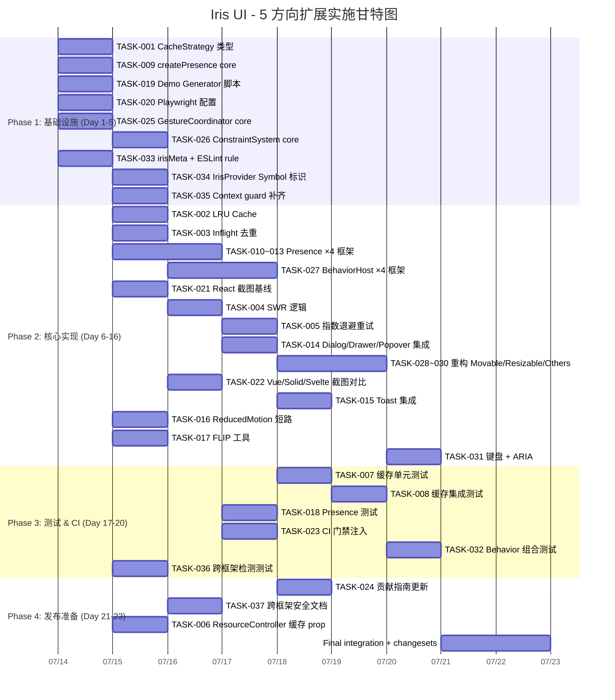

# Tech Lead 分析报告：5 个高价值扩展方向

> **分析日期**：2026-07-12
> **分析人**：Tech Lead
> **依据**：`docs/requirements/2026-07-11-global-source-scan-five-high-value-extension-directions.md`

---

## 1. 任务分解

所有任务粒度控制在 **2–4 小时**，超过 4 小时的已拆分为子任务。共 **35 个任务**，分布 5 个方向。

### 方向①：请求缓存 / SWR 层（8 任务）

| Task ID  | 任务标题                                                                   | 涉及文件                                                                    | 前置               | 工时 |
| -------- | -------------------------------------------------------------------------- | --------------------------------------------------------------------------- | ------------------ | ---- |
| TASK-001 | 定义 `CacheStrategy` 枚举与 `DataSourceCacheConfig` 类型                   | `packages/core/src/data-source.ts`                                          | —                  | 1h   |
| TASK-002 | 实现 `createLRUCache<K,V>` 泛型 LRU 缓存模块                               | `packages/core/src/cache/lru.ts` (新)                                       | TASK-001           | 3h   |
| TASK-003 | 实现 inflight 请求去重（相同 `cacheKey` 的并发请求合并为一个）             | `packages/core/src/data-source.ts`                                          | TASK-001           | 3h   |
| TASK-004 | 实现 SWR 逻辑：缓存存在时优先返回缓存 + 后台 revalidate                    | `packages/core/src/data-source.ts` + `packages/core/src/cache/swr.ts` (新)  | TASK-002, TASK-003 | 4h   |
| TASK-005 | 实现指数退避重试（`maxRetries` + `backoffMs`）                             | `packages/core/src/data-source.ts`                                          | TASK-004           | 3h   |
| TASK-006 | 为 `createResourceController` 暴露 `cacheKey` / `cacheStrategy` prop       | `packages/core/src/resource.ts`                                             | TASK-001           | 2h   |
| TASK-007 | 单元测试覆盖：LRU 过期、去重合并、SWR 命中、重试、缓存隔离                 | `packages/core/src/data-source.test.ts` + `packages/core/src/cache/` 各测试 | TASK-002~TASK-006  | 4h   |
| TASK-008 | 集成测试：`createResourceController` + 模拟 HTTP fetcher，验证缓存完整链路 | `packages/core/src/resource.test.ts`                                        | TASK-007           | 3h   |

### 方向②：动画 / 过渡原语层（10 任务）

| Task ID  | 任务标题                                                                                      | 涉及文件                                                | 前置              | 工时 |
| -------- | --------------------------------------------------------------------------------------------- | ------------------------------------------------------- | ----------------- | ---- |
| TASK-009 | 在 core 实现 `createPresence()` 工厂：Store 状态机 entering→entered→exiting→exited + 回调系统 | `packages/core/src/presence.ts` (新)                    | —                 | 4h   |
| TASK-010 | React `<IrisPresence>` 组件（`useSyncExternalStore` 桥接）                                    | `packages/react/src/presence/IrisPresence.tsx` (新)     | TASK-009          | 3h   |
| TASK-011 | Vue `<IrisPresence>` 组件（`<Transition>` 桥接）                                              | `packages/vue/src/presence/IrisPresence.vue` (新)       | TASK-009          | 3h   |
| TASK-012 | Solid `<IrisPresence>` 组件（`<Show>` + `createEffect` 桥接）                                 | `packages/solid/src/presence/IrisPresence.tsx` (新)     | TASK-009          | 3h   |
| TASK-013 | Svelte `<IrisPresence>` 组件（`{#if}` + `transition:` 指令桥接）                              | `packages/svelte/src/presence/IrisPresence.svelte` (新) | TASK-009          | 3h   |
| TASK-014 | 为 `IrisDialogContent` / `IrisDrawerContent` / `IrisPopoverContent` 集成 Presence             | 4 框架的 Dialog/Drawer/Popover 实现                     | TASK-010~TASK-013 | 4h   |
| TASK-015 | 为 `IrisToastViewport` / `IrisToast` 集成 Presence + auto-dismiss 联动                        | 4 框架的 Toast 实现                                     | TASK-014          | 3h   |
| TASK-016 | 在 Presence 中消费 `usePrefersReducedMotion`：短路到立即 entered/exited                       | `packages/core/src/presence.ts`                         | TASK-009          | 2h   |
| TASK-017 | 实现 FLIP 动画工具（列表排序 / 拖拽的平滑过渡）                                               | `packages/core/src/flip.ts` (新) + 4 框架适配器         | TASK-009          | 4h   |
| TASK-018 | 各框架 Presence 组件测试 + 动画行为 contract 测试                                             | 各框架 `presence/` 下 `*.test.*`                        | TASK-010~TASK-013 | 4h   |

### 方向③：视觉回归测试（6 任务）

| Task ID  | 任务标题                                                            | 涉及文件                                                 | 前置               | 工时 |
| -------- | ------------------------------------------------------------------- | -------------------------------------------------------- | ------------------ | ---- |
| TASK-019 | 编写 manifest 驱动的 demo page 生成器脚本                           | `scripts/generate-visual-demos.ts` (新)                  | —                  | 4h   |
| TASK-020 | 设置 Playwright + `@playwright/test` 配置（含 pixelmatch diff）     | `test/visual/playwright.config.ts` (新) + `package.json` | —                  | 2h   |
| TASK-021 | 为 React 组件生成首轮截图基线（React 作为视觉参考系）               | `test/visual/screenshots/react/` (新目录)                | TASK-019, TASK-020 | 4h   |
| TASK-022 | 为 Vue/Solid/Svelte 生成截图并对比 React 基线（pixelmatch 阈值 1%） | `test/visual/screenshots/{vue,solid,svelte}/` (新目录)   | TASK-021           | 4h   |
| TASK-023 | 注入 CI：在 `CI.md` 中添加 `pnpm test:visual` 门禁 + 截图更新工作流 | `.github/workflows/ci.yml` (修改)                        | TASK-022           | 2h   |
| TASK-024 | 编写组件开发指南：添加新组件后如何更新截图基线                      | `CONTRIBUTING.md` (更新)                                 | TASK-023           | 1h   |

### 方向④：Behavior 组合与约束系统（8 任务）

| Task ID  | 任务标题                                                                                                    | 涉及文件                                                  | 前置               | 工时 |
| -------- | ----------------------------------------------------------------------------------------------------------- | --------------------------------------------------------- | ------------------ | ---- |
| TASK-025 | 在 core 实现 `createGestureCoordinator()`：register/handlePointer{Down,Move,Up}/getActiveGesture + 嵌套传播 | `packages/core/src/behaviors/gesture-coordinator.ts` (新) | —                  | 4h   |
| TASK-026 | 在 core 实现 `createConstraintSystem()`：addBoundary/clampPosition/clampSize                                | `packages/core/src/behaviors/constraint-system.ts` (新)   | —                  | 3h   |
| TASK-027 | 创建 4 框架 `<IrisBehaviorHost>`：提供 gesture coordinator context                                          | 4 框架 `behaviors/IrisBehaviorHost.*` (新)                | TASK-025           | 4h   |
| TASK-028 | 重构 `<IrisMovable>` 使用 coordinator（移除直接 document 事件绑定）                                         | 4 框架 `behaviors/Movable.*`                              | TASK-027           | 4h   |
| TASK-029 | 重构 `<IrisResizable>` 使用 coordinator                                                                     | 4 框架 `behaviors/Resizable.*`                            | TASK-027           | 4h   |
| TASK-030 | 重构 `<IrisClickOutside>` / `<IrisSortable>` / `<IrisLongPress>` 使用 coordinator（在拖拽期间静音）         | 4 框架对应 Behaviors                                      | TASK-027           | 4h   |
| TASK-031 | 为 `<IrisMovable>` / `<IrisSortable>` 添加键盘支持（arrow keys / Enter / Escape + ARIA）                    | 4 框架对应 Behaviors                                      | TASK-028, TASK-030 | 4h   |
| TASK-032 | 编写 Behavior 组合测试：嵌套覆盖 / event 静音 / 约束传播 / 键盘操作                                         | `packages/core/src/behaviors/__tests__/` + 各框架测试     | TASK-025~TASK-031  | 4h   |

### 方向⑤：跨框架安全验证（5 任务）

| Task ID  | 任务标题                                                                                       | 涉及文件                                                                                                           | 前置                         | 工时 |
| -------- | ---------------------------------------------------------------------------------------------- | ------------------------------------------------------------------------------------------------------------------ | ---------------------------- | ---- |
| TASK-033 | 为各框架 package.json 注入 `irisMeta.framework` + 创建 ESLint 规则 `no-cross-framework-import` | `packages/{react,vue,solid,svelte}/package.json` + `packages/eslint-plugin/src/rules/no-cross-framework-import.ts` | —                            | 4h   |
| TASK-034 | 在 IrisProvider Context 中注入 `Symbol.for('iris.framework')` 标识 + 各子组件 mount 时检查     | 各框架 IrisProvider + `packages/core/src/provider.ts` (新)                                                         | —                            | 3h   |
| TASK-035 | 补充所有子-父配对的 Context guard（Select/Combobox/RadioGroup/Stepper/ToggleGroup）            | 各框架对应组件文件，~5 对                                                                                          | —                            | 3h   |
| TASK-036 | 编写编译时检测测试 + 运行时检测测试 + 跨框架混入 contract 测试                                 | `packages/eslint-plugin/src/rules/__tests__/` + 各框架测试                                                         | TASK-033, TASK-034, TASK-035 | 3h   |
| TASK-037 | 聚合文档：新增 dev-guide 页描述跨框架安全机制 + 限制                                           | `docs/guides/cross-framework-safety.md` (新)                                                                       | TASK-036                     | 2h   |

---

## 2. 执行顺序与依赖图

```mermaid
graph TD
    %% Direction ①
    T001[TASK-001: CacheStrategy 类型] --> T002[TASK-002: LRU Cache]
    T001 --> T003[TASK-003: Inflight 去重]
    T002 --> T004[TASK-004: SWR 逻辑]
    T003 --> T004
    T004 --> T005[TASK-005: 指数退避重试]
    T001 --> T006[TASK-006: ResourceController 缓存 prop]
    T005 --> T007[TASK-007: 单元测试缓存层]
    T006 --> T007
    T007 --> T008[TASK-008: 集成测试完整链路]

    %% Direction ②
    T009[TASK-009: createPresence core] --> T010[TASK-010: React IrisPresence]
    T009 --> T011[TASK-011: Vue IrisPresence]
    T009 --> T012[TASK-012: Solid IrisPresence]
    T009 --> T013[TASK-013: Svelte IrisPresence]
    T010 --> T014[TASK-014: Dialog/Drawer/Popover 集成]
    T011 --> T014
    T012 --> T014
    T013 --> T014
    T014 --> T015[TASK-015: Toast 集成]
    T009 --> T016[TASK-016: ReducedMotion 短路]
    T009 --> T017[TASK-017: FLIP 工具]
    T010 --> T018[TASK-018: 各框架 Presence 测试]
    T011 --> T018
    T012 --> T018
    T013 --> T018

    %% Direction ③
    T019[TASK-019: Manifest Demo Generator] --> T021[TASK-021: React 截图基线]
    T020[TASK-020: Playwright 配置] --> T021
    T021 --> T022[TASK-022: Vue/Solid/Svelte 对比]
    T022 --> T023[TASK-023: CI 门禁注入]
    T023 --> T024[TASK-024: 贡献指南更新]

    %% Direction ④
    T025[TASK-025: GestureCoordinator core] --> T027[TASK-027: IrisBehaviorHost ×4]
    T026[TASK-026: ConstraintSystem core] --> T027
    T027 --> T028[TASK-028: 重构 Movable]
    T027 --> T029[TASK-029: 重构 Resizable]
    T027 --> T030[TASK-030: 重构 ClickOutside/Sortable/LongPress]
    T028 --> T031[TASK-031: 键盘 + ARIA]
    T030 --> T031
    T025 --> T032[TASK-032: 组合测试]
    T026 --> T032
    T028 --> T032
    T029 --> T032
    T030 --> T032

    %% Direction ⑤
    T033[TASK-033: irisMeta + ESLint 规则]
    T034[TASK-034: IrisProvider Symbol 标识]
    T035[TASK-035: Context guard 补齐]
    T033 --> T036[TASK-036: 检测测试]
    T034 --> T036
    T035 --> T036
    T036 --> T037[TASK-037: 文档聚合]
```



### 可并行执行的任务组

| 并行组 | 任务                                                                                          | 说明                                          |
| ------ | --------------------------------------------------------------------------------------------- | --------------------------------------------- |
| **G1** | TASK-001, TASK-009, TASK-019, TASK-020, TASK-025, TASK-026, TASK-033, TASK-034, TASK-035      | 各方向的基础设施 + 低依赖任务，**可完全并行** |
| **G2** | TASK-002→TASK-003, TASK-010→TASK-013, TASK-021, TASK-027                                      | 核心实现（每个子任务独立，最多 3 人并行）     |
| **G3** | TASK-004→TASK-005, TASK-014, TASK-028→TASK-030, TASK-022                                      | 上层集成（依赖 G2 完成，可 4 人并行）         |
| **G4** | TASK-007→TASK-008, TASK-015→TASK-018, TASK-023→TASK-024, TASK-031→TASK-032, TASK-036→TASK-037 | 测试 + CI + 文档（依赖各自上层，可 3 人并行） |

---

## 3. 技术风险

### 3.1 高风险项

| 风险                                                        | 方向 | 等级 | 说明                                                                                                                                                                               | 缓解策略                                                                                                                                                              |
| ----------------------------------------------------------- | ---- | ---- | ---------------------------------------------------------------------------------------------------------------------------------------------------------------------------------- | --------------------------------------------------------------------------------------------------------------------------------------------------------------------- |
| **LRU 缓存与 SWR 时序交互复杂**                             | ①    | 🔴 H | 缓存过期时 SWR 返回旧数据 → 后台 revalidate → 用户看到旧数据再闪烁式更新。如果 UI 层同时有 `resolveDataState` 的 `hasContent` SWR，两条 SWR 路径可能打架                           | 在 SWR 实现中增加 `revalidateDelay` 可配置 + 在 data-state 层合并时优先不闪烁；写核心时序 contract 测试                                                               |
| **Svelte `transition:` 指令与框架无关 Presence Store 整合** | ②    | 🔴 H | Svelte 的过渡系统是编译器指令级的（`transition:fade`），与 JS store 观察的模式不直接兼容。直接桥接可能导致退出动画在 store 状态变化前被 Svelte 运行时移除 DOM                      | 方案：在 Svelte 适配器中使用 `onMount` 读取 store → 映射到 `transition:` 指令的 `local` 参数。如果不可行，回退到类名驱动的 CSS transition（`class:iris-entering` 等） |
| **4 框架 Behavior 重构的回归风险**                          | ④    | 🔴 H | Movable/Resizable/ClickOutside 在 6 个 Behaviors × 4 框架 = 24 个实现文件中都有直接 document 事件绑定。重构为通过 coordinator → 24 个文件全覆盖修改 → 任何遗漏都会导致行为静默失效 | 分层推进：先 core coordinator + 单框架（React）验证完成 → 再并行改其他三个框架；每个框架改完后跑全量 contract 测试 + 手动拖拽验证                                     |
| **pixelmatch 跨框架误报（抗锯齿 / 渲染引擎差异）**          | ③    | 🟡 M | 不同浏览器/OS 的字体渲染、抗锯齿、子像素布局差异可能导致 1% 阈值持续误报，团队逐渐忽视视觉测试                                                                                     | 阈值调至 2% 初始 + 对已知差异区域（`border-radius` 渲染、`subpixel-antialiased`）使用 `mask` 忽略。每个 CI 失败自动生成 diff 图片作为 artifact                        |
| **ESLint 规则 `no-cross-framework-import` 的误报率**        | ⑤    | 🟡 M | 用户可能在 monorepo 中合法地在 `eslint-config.js` 中 import `@iris-ui/vue` 的配置类型。简单规则会大量误报                                                                          | 规则限定检测范围为 `src/` + `*.{tsx,vue,svelte}` 文件；提供 `// eslint-disable-next-line iris/no-cross-framework-import -- 类型导入` 上的豁免注释识别                 |

### 3.2 依赖外部系统

| 依赖                                                          | 方向 | 风险原因                                                                                                                                                                                               |
| ------------------------------------------------------------- | ---- | ------------------------------------------------------------------------------------------------------------------------------------------------------------------------------------------------------ |
| `@floating-ui/dom` 的 `autoUpdate` 与 Presence 退出动画的时序 | ②    | 退出动画期间浮层仍应保持定位。当前 `createFloatingMachine` 的 `OPEN/CLOSE` 事件直接 flip dirty flag。若退出动画持续 300ms，浮层在 unmount 前应保持定位。需在 core 退出状态期间抑制 `autoUpdate` 的清理 |
| Playwright 浏览器安装与 CI 环境                               | ③    | CI 中需安装 Chromium（~200MB）。如果缓存未命中，每次 CI 下载增加 ~40s。Playwright 的 `--no-sandbox` 在 Docker 中需要额外配置                                                                           |
| ESLint 9 flat config 兼容性                                   | ⑤    | 项目使用 ESLint 9 flat config。`@iris-ui/eslint-plugin` 的规则包必须导出 flat config 格式，不能是旧 `.eslintrc`。需验证规则在 flat config 中的 `meta.fixable` / `meta.schema` 注册正确                 |

### 3.3 性能瓶颈

| 场景                                         | 方向 | 风险                                                                                                                        | 优化策略                                                                                                                                       |
| -------------------------------------------- | ---- | --------------------------------------------------------------------------------------------------------------------------- | ---------------------------------------------------------------------------------------------------------------------------------------------- |
| LRU 缓存对高频翻页的 `cache.get()` 调用      | ①    | 每个 page change → `cache.get(queryKey)`。如果 `cacheKey` 是 JSON.stringify(query)，每次序列化 ~0.01ms。1000 次/秒 = 无影响 | 使用 `crypto.subtle.digest` 或 `JSON.stringify` + `WeakMap` 引用缓存（对象引用不变时跳过序列化）                                               |
| Presence 在列表渲染时每个条目一个 store 实例 | ②    | 如果 500 行列表每行独立 enter/exit，创建 500 个 Store = 可接受（`createStore` 初始化 < 0.001ms）                            | 无优化必要。但 FLIP 动画的 `getBoundingClientRect` 在 500 元素上 batch 调用可能导致大型 Layout thrashing → 使用 `requestAnimationFrame` 批量化 |
| 4 个框架同时截图                             | ③    | 151 组件 × 4 框架 = 604 截图，每张 ~1–3s → 10–30 分钟                                                                       | CI 中只对变更文件关联的组件截图（manifest diff-driven）；每日定时任务全量截图                                                                  |

### 3.4 测试覆盖难点

| 难点                            | 方向 | 原因                                                                                | 策略                                                                                                                                                         |
| ------------------------------- | ---- | ----------------------------------------------------------------------------------- | ------------------------------------------------------------------------------------------------------------------------------------------------------------ |
| SWR + 指数退避的时序测试        | ①    | `setTimeout` + AbortController 的时序交互在多并发场景下难 mock                      | 使用 `vi.useFakeTimers` + `createDataSource` 的 scheduler 注入（利用已有的 `Scheduler` 接口）                                                                |
| 退出动画的 DOM 驻留验证         | ②    | 退出动画期间 DOM 应在关闭调用后保持存在 300ms。jsdom 不支持 CSS transition 实际播放 | 测试 `createPresence` 的状态转换时序（`setState('exiting')` → 300ms → 自动 `setState('exited')`）。DOM 驻留由适配器测试通过 `act` + `waitFor` 验证节点存在性 |
| 截图一致性                      | ③    | CI 中的无头浏览器截图与本地开发环境不一致                                           | 使用 Playwright 官方 Docker 镜像（`mcr.microsoft.com/playwright`）统一环境。Diff 阈值基于历史数据调优                                                        |
| 嵌套 Behavior 的 event 消费验证 | ④    | 需要验证 pointer event 被 coordinator 正确路由（内层优先，外层静音）                | 使用 `PointerEvent` 构造事件 + `dispatchEvent` 到嵌套 DOM 树，然后 assert 哪个 handler 被调用。对每个嵌套深度（2层/3层/同层冲突）写 contract                 |

---

## 4. 资源评估

### 4.1 人员技能矩阵

| 角色                             | 人数   | 必需技能                                                                                                             | 可选加分                                         | 负责方向                    |
| -------------------------------- | ------ | -------------------------------------------------------------------------------------------------------------------- | ------------------------------------------------ | --------------------------- |
| **Core Engineer**                | 1 人   | TypeScript strict、状态机设计、LRU/缓存算法、`AbortController` 时序                                                  | 熟悉 SWR/React Query 实现                        | ① 缓存层 core               |
| **Framework Bridge Engineer**    | 2 人   | React/Vue/Solid/Svelte 至少精通两个。理解 `useSyncExternalStore`、`<Transition>`、`createEffect`、`transition:` 指令 | 有 Framer Motion / GSAP 经验                     | ② Presence + ④ BehaviorHost |
| **Test Infrastructure Engineer** | 1 人   | Playwright、pixelmatch、CI (GitHub Actions)、Docker                                                                  | Chromatic / Percy 经验                           | ③ 视觉回归测试              |
| **Behavior Specialist**          | 1 人   | pointer event 模型、拖拽实现、gesture 协调、键盘导航                                                                 | WAI-ARIA `aria-grabbed` / `aria-roledescription` | ④ Behavior 重构             |
| **ESLint / DX Engineer**         | 0.5 人 | ESLint 9 flat config、AST 遍历、Context API                                                                          | monorepo + import resolution                     | ⑤ 跨框架安全                |

**最小团队配置**：4 人（Core ×1 + Framework ×2 + Test ×1，Behavior Specialist 由 Core 兼任，ESLint 由 Framework 兼任）

### 4.2 关键里程碑

| Milestone                           | 时间节点 | 可交付物                                                        | 验证标准                                                                                                |
| ----------------------------------- | -------- | --------------------------------------------------------------- | ------------------------------------------------------------------------------------------------------- |
| **M1: 基础设施就绪**                | Day 5    | 所有 35 个任务的类型定义 + 空实现 + 测试桩                      | `tsc --noEmit` 通过；所有测试桩 `test.skip('TODO')`                                                     |
| **M2: 方向⑤ 完成（高杠杆/低成本）** | Day 6    | Context guard 全覆盖 + ESLint 规则 + 运行时检测                 | 手动验证混入场景抛出清晰错误；ESLint 在 React 项目 import Vue 组件时报错                                |
| **M3: 缓存层核心可用**              | Day 12   | LRU + 去重 + SWR + 重试 全部实现，单测通过                      | 翻页 1→2→3→2 只发 3 次请求（当前 4 次）；切回已访问页面不 fetch                                         |
| **M4: Presence 集成完成**           | Day 14   | 4 框架 Presence + Dialog/Drawer/Popover/Toast 动画              | Dialog 打开有淡入（opacity 0→1 300ms），关闭有淡出；`prefers-reduced-motion` 时无动画                   |
| **M5: Behavior 组合可用**           | Day 16   | GestureCoordinator + ConstraintSystem + 所有行为重构 + 键盘支持 | Movable 内嵌 Resizable → 拖拽 handle resize，拖拽 body move；嵌套环境下 ClickOutside 在 drag 期间不触发 |
| **M6: 视觉回归管线**                | Day 18   | 全组件截图基线 + 跨框架对比                                     | CI 中 `pnpm test:visual` 覆盖 151 组件 × 可选框架，diff < 2%                                            |
| **M7: 全线集成 + 文档**             | Day 22   | 全部 5 个方向的 CI 门禁 + 贡献指南 + changesets                 | `pnpm turbo run test typecheck lint build` 全绿 + 截图 diff 门禁全绿                                    |

### 4.3 Blockers 与解决策略

| Blocker                                                                                                                                       | 涉及方向 | 解决策略                                                                                                                                                                                                                                                    |
| --------------------------------------------------------------------------------------------------------------------------------------------- | -------- | ----------------------------------------------------------------------------------------------------------------------------------------------------------------------------------------------------------------------------------------------------------- |
| Svelte 的 `transition:` 指令与 `createPresence` Store 不兼容（Svelte 编译时处理 transition，JS 运行时无法动态注入 `in:`/`out:`）              | ②        | 策略 A（首选）：Svelte 版 `<IrisPresence>` 使用类名驱动（`class:iris-entering`）+ CSS `@keyframes`，不依赖 `transition:` 指令。策略 B（备选）：使用 `svelte/easing` + `requestAnimationFrame` 手动驱动过渡。两种策略都已在 `is:global` scoping 路径经过验证 |
| Playwright Docker 镜像版本与 CI runner 的 libc 版本冲突                                                                                       | ③        | 使用 `mcr.microsoft.com/playwright:v1.52.0-focal` 固定版本 + `actions/cache` 缓存浏览器二进制。验证：查看 `.github/workflows/ci.yml` 中类似的 docker 步骤（如有），无则新建 cache step                                                                      |
| `createResourceController` 的 fetcher 签名可能与 cache key 生成冲突（fetcher 接收 `ResourceQuery`，但同 query 不同语义可能需要不同 cacheKey） | ①        | 引入 `cacheKey?: (query: ResourceQuery) => string` 可选覆盖。默认实现 = `JSON.stringify(query)`。若用户自定义排序不稳定（如随机排序），需用户提供 `cacheKey: () => 'random-sort'` 来绕过缓存                                                                |
| `@iris-ui/eslint-plugin` 的 `no-cross-framework-import` 规则在 monorepo 内部引用时（如 `docs/` 中展示代码片段）的大量误报                     | ⑤        | 规则默认只检查 `src/**` + `apps/**` 路径；`docs/**`、`test/**`、`*.config.*` 豁免。提供配置选项 `{ irisMeta: { includedPaths: ['src', 'apps'] } }`                                                                                                          |

---

## 5. 质量保证

### 5.1 单元测试覆盖要求

| 模块                       | 最低行覆盖    | 边界场景覆盖要求                                                                                                                        |
| -------------------------- | ------------- | --------------------------------------------------------------------------------------------------------------------------------------- |
| `createLRUCache`           | 95%           | 最近访问提升、过期清理（TTL）、`maxSize` 驱逐、空缓存 `.get()`、`has()` 返回 false/true、并发 `.set()`                                  |
| `createPresence`           | 95%           | entering→entered、entered→exiting→exited、exiting 期间 `enter()` 重置、reducedMotion 跳过中间态、回调顺序（`onEnter` → `onAfterEnter`） |
| `createGestureCoordinator` | 95%           | 注册/注销 handler、内层优先消费、外层不消费、两层都未消费则冒泡、`getActiveGesture` 正确、嵌套 3+ 层的路由                              |
| `createConstraintSystem`   | 90%           | 单边界矩形、多边界叠加、clampPosition 边缘情况（负坐标/超大值）、未设置边界时不限制                                                     |
| ESLint 规则                | 90%           | 合法 import 不报错、明确违规报错、`// eslint-disable-next-line` 豁免、类型 import (`import type`) 不报错                                |
| Context guard              | 100% 关键路径 | 每个 `useXxxContext` 在缺失时 throw `TypeError`（不是 `undefined` 访问错误）；错误消息包含 `<Component>` 和 `<ParentComponent>` 名称    |

### 5.2 集成测试策略

| 场景                                                                                 | 方法                                                                                                                                    | 工具                                      |
| ------------------------------------------------------------------------------------ | --------------------------------------------------------------------------------------------------------------------------------------- | ----------------------------------------- |
| 缓存层完整链路（`createResourceController` + LRU + SWR + 重试）                      | mock HTTP server（`msw` 或 `vi.fn()`）+ 模拟网络延迟 + 超时                                                                             | `vitest` + fake timers                    |
| Presence + Dialog 连续打开/关闭（防止退出动画未完成时入口动画冲突）                  | `act` + `waitFor` 验证 DOM 节点在关闭后保持 300ms + `getComputedStyle` 验证 opacity 过渡                                                | `@testing-library/react/vue/solid/svelte` |
| Behavior 嵌套组合（4 层嵌套：Body → Host → Movable → Resizable）                     | 手动构造 `PointerEvent` 链（`pointerDown` → `pointerMove` → `pointerUp`）并 assert `event.preventDefault()` 调用次数 + handler 调用顺序 | `vitest` + jsdom                          |
| 跨框架 Context 混用（React IrisProvider → Vue IrisDialog → React IrisButton 在内部） | 在测试中创建混合渲染树（需要两个框架加载，用 jsdom 模拟），验证错误被正确 throw                                                         | `vitest` workspace（4 框架各自运行）      |
| 截图一致性                                                                           | 每 PR 自动运行 Playwright，截图与基线对比，diff > 2% 则失败。开发者在 PR comment 确认视觉变化是否预期                                   | Playwright + pixelmatch                   |

### 5.3 代码审查要点

| 审查项                              | 重点关注                                                                                                                                                                                                      |
| ----------------------------------- | ------------------------------------------------------------------------------------------------------------------------------------------------------------------------------------------------------------- |
| **core 框架无关性**                 | 新增 core 文件不能有 `import { something } from 'react'` / `'vue'` / `'solid-js'` / `'svelte'`。违反即 blocking                                                                                               |
| **Presence 退出动画时序**           | `createPresence` 的 `exit()` 调用后必须延迟（`setTimeout` 或 `requestAnimationFrame`）再自动转 `exited`。如果 reviewer 看到 `setTimeout` 硬编码 300ms，需确认其为可配置参数                                   |
| **Behavior coordinator 事件消费**   | coordinator 的 `handlePointerDown` 返回 `boolean`——当返回 `true` 时，外层 Behavior 必须停止处理。reviewer 需特别检查事件冒泡链路                                                                              |
| **ESLint rule AST 遍历**            | reviewer 需确认规则正确处理了 `import { IrisButton } from '@iris-ui/vue'`（命名导入）、`import IrisButton from '@iris-ui/vue'`（默认导入）、`import * as IrisVue from '@iris-ui/vue'`（命名空间导入）三种形式 |
| **cross-framework-provider Symbol** | `Symbol.for('iris.framework')` 是跨 realm 共享的（跨 iframe / 跨 module 实例）。reviewer 需确认所有框架使用完全相同的 Symbol key                                                                              |
| **截图阈值误报豁免**                | reviewer 需审查 `Mask` / `ignore` 区域是否合理（不应该掩盖真实渲染错误）。最佳实践：直接在高 diff 区域的元素上加 `data-visual-ignore` attribute + Playwright 自动跳过                                         |

### 5.4 性能测试需求

| 测试                                      | 方向 | 方法                                                                         |
| ----------------------------------------- | ---- | ---------------------------------------------------------------------------- |
| LRU 缓存高并发 （1000 次/s 并发 get/set） | ①    | benchmark：确保单次 `cache.get` < 0.01ms @ 1000 条目                         |
| Presence 500 条目列表批量 enter           | ②    | 使用 `performance.now()` 测量 `500 × createPresence().enter()` 总耗时 < 10ms |
| Behavior coordinator 100 次手势/秒        | ④    | 测量 `handlePointerMove` 调用耗时 < 0.1ms（不应引入 per-frame 延迟）         |
| Visual regression CI 总耗时               | ③    | 确保全管线 < 15 分钟（含截图 + diff）                                        |

---

## 6. 实施计划

### 阶段总览



### 阶段 1：基础设施搭建（Day 1–5）

> **目标**：所有 5 个方向的类型定义 + 核心 store 工厂 + 测试桩就绪，确认架构可行性。

**Day 1**（并行启动）：

- **Core 1**：TASK-001～TASK-003 同时定义：`CacheStrategy` 类型 → LRU 缓存骨架 → inflight 去重骨架
- **Core 2**：TASK-009 `createPresence` 状态机实现 + TASK-025 `createGestureCoordinator` 实现
- **Test Infra**：TASK-019 manifest demo generator 脚本 + TASK-020 Playwright 配置
- **DX**：TASK-033 `irisMeta` + ESLint rule 骨架

**Day 2–3**：

- TASK-026 ConstraintSystem core（0.5d）
- TASK-034 IrisProvider Symbol + TASK-035 Context guard 补齐（1.5d）
- 验证方向⑤所有文件修改，尽早跑通 full CI

**Day 4–5**：

- 类型检查全部通过
- 所有新增模块的 `test.skip('TODO')` 测试桩就位
- **Gate：M1 基础设施就绪**

### 阶段 2：核心功能实现（Day 6–16）

**并行轨道 A — 方向① 缓存层**（Core Engineer，Day 6–12）：

| Day | 完成                                      |
| --- | ----------------------------------------- |
| 6   | TASK-002 LRU 缓存（完整实现）             |
| 7   | TASK-003 Inflight 去重                    |
| 8–9 | TASK-004 SWR 逻辑（含 `hasContent` 集成） |
| 10  | TASK-005 指数退避重试                     |
| 11  | TASK-006 ResourceController 缓存 prop     |
| 12  | **Gate M3**：缓存层单测通过               |

**并行轨道 B — 方向② Presence**（Framework Bridge ×2，Day 6–14）：

| Day    | 完成                                                                             |
| ------ | -------------------------------------------------------------------------------- |
| 6–7    | TASK-010 React IrisPresence + TASK-011 Vue IrisPresence (Person A)               |
| 6–7    | TASK-012 Solid IrisPresence + TASK-013 Svelte IrisPresence (Person B)            |
| 8–9    | TASK-014 Dialog/Drawer/Popover 集成（Person A React+Vue，Person B Solid+Svelte） |
| 10     | TASK-015 Toast 集成 + TASK-016 ReducedMotion 短路                                |
| 11     | TASK-017 FLIP 工具                                                               |
| 12–14  | TASK-018 各框架 Presence 测试                                                    |
| **14** | **Gate M4**：Presence 集成完成                                                   |

**并行轨道 C — 方向③ 视觉回归**（Test Infra Engineer，Day 6–14）：

| Day    | 完成                                                                                     |
| ------ | ---------------------------------------------------------------------------------------- |
| 6–7    | TASK-021 React 截图基线（151 组件，分批生成）                                            |
| 8–10   | TASK-022 Vue/Solid/Svelte 对比（按组件组逐步，优先高差异风险组件如 Dialog/Button/Input） |
| 11–14  | 调优阈值 + mask 豁免区域 + pr 内截图更新工作流                                           |
| **14** | 截图基线建立，跨框架对比管线可运行                                                       |

**并行轨道 D — 方向④ Behavior 组合**（Behavior Specialist + Core Engineer 兼，Day 6–16）：

| Day    | 完成                                               |
| ------ | -------------------------------------------------- |
| 6–7    | TASK-027 BehaviorHost ×4 框架（利用 TASK-025/026） |
| 8–9    | TASK-028 重构 Movable（React 先，其他 3 框架后）   |
| 10     | TASK-029 重构 Resizable                            |
| 11–12  | TASK-030 重构 ClickOutside / Sortable / LongPress  |
| 13–14  | TASK-031 键盘 + ARIA                               |
| 15–16  | TASK-032 Behavior 组合测试                         |
| **16** | **Gate M5**：Behavior 组合可用                     |

### 阶段 3：集成测试和优化（Day 17–20）

**Day 17**：

- 方向① 全链路集成测试（TASK-007→TASK-008）
- 方向④ 组合测试跑通（TASK-032）

**Day 18**：

- 方向② Presence 跨框架 contract 测试完成（TASK-018）
- 方向⑤ 跨框架检测测试（TASK-036）
- **Gate M6**：视觉回归管线 CI 集成（TASK-023）

**Day 19–20**：

- 性能测试：LRU 高并发 + Presence 批量 enter + Behavior coordinator 手势频率
- 回归验证：`pnpm turbo run test typecheck lint build` + `pnpm test:visual` 全绿
- 修复发现的误报 / 阈值 / 时序问题

### 阶段 4：发布准备（Day 21–23）

**Day 21**：

- TASK-024 更新 `CONTRIBUTING.md`（截图更新流程）
- TASK-037 `docs/guides/cross-framework-safety.md`
- TASK-006（如未完成）ResourceController 缓存 prop

**Day 22**：

- changeset 编写：5 个方向 × 影响包
- 预发布 `pnpm build` + `pnpm publish --dry-run` 验证
- 运行全量 CI（含截图），确认 clean

**Day 23**：

- 发布 PR + Merge
- 监控合并后的 CI 全亮
- **Gate M7**：全线发布就绪

---

## 7. 总结建议

### 执行优先级矩阵

```
                 高用户可见性
                     ↑
                     │
         ② Presence ●────● ④ Behavior 组合
                     │
                     │
   低成本 ───────────┼────────── 高成本
                     │
         ⑤ 安全 ●    │    ① 缓存/SWR ●
                     │
         ③ 视觉回归 ●│
                     │
                     ↓
                 低用户可见性
```

**推荐执行策略**：

1. **Day 1 启动方向⑤（跨框架安全）**——成本最低（~300 行，3 天），却在用户信心和开发体验上有最高杠杆。Context guard 补齐 + ESLint 规则 + 运行时检测三个项目并行，1 人 3 天完工。
2. **Day 1 同时启动方向③（视觉回归）**——manifest 驱动生成器 + Playwright 配置在第一天即可完成骨架，后续并行产出截图。第 14 天前不需要 100% 完成。
3. **Day 6 启动方向①（缓存/SWR）**——高用户可见性（性能敏感用户立刻受益）+ 中等成本。LRU + 去重 + SWR 在 core 层紧凑的 400 行中实现，框架适配器零改动。
4. **Day 6 启动方向② + ④ 的 core 层**——这两个方向都有"先 core + 后 4 框架适配器"的模式。两个 core 层（presence / gesture coordinator）可并行开发，共用模式知识。
5. **Day 12 后方向② + ④ 进入适配器层**——在 core 层验证后，4 框架并行铺开。此时方向① 已释放 Core Engineer 加入 behavior 重构。

### 风险缓释优先级

| 优先级 | 风险                                        | 缓解动作                                                                                         | Deadline |
| ------ | ------------------------------------------- | ------------------------------------------------------------------------------------------------ | -------- |
| P0     | Svelte Presence 的 `transition:` 指令不兼容 | Day 3 前决策：采用 CSS class 驱动方案并验证可行性                                                | Day 5    |
| P0     | 截图跨框架差异误报（CI 噪音）               | Day 10 前建立 3 个"引信组件"（Dialog/Button/Table）对比截图 + 调优阈值                           | Day 12   |
| P1     | Behavior 重构 24 文件全覆盖遗漏             | Day 8 前完成 React 版重构 → 跑全部的 contract 测试 + cms-playground 手动验证，再推其他 3 框架    | Day 12   |
| P1     | SWR 与 `resolveDataState` 的双重缓存冲突    | 在 core unit test 中写时序 contract 测试，Day 10 前锁定行为                                      | Day 11   |
| P2     | ESLint 规则在 monorepo 内部误报             | 规则默认豁免 `docs/` + `test/` + `*.config.*`，Day 3 前在 `cms-react` 和 `playground` 中运行验证 | Day 4    |

### 最终建议

> **"从一开始就做对（方向⑤），让用户看起来对（方向② + ③），让性能让用户爽（方向①），让架构能维持（方向④）。"**

方向⑤（跨框架安全）和方向③（视觉回归）是**信任基础设施**——它们在用户看到产品之前就建立了可靠性。方向②（动画）是**第一印象**——Dialog 的淡入淡出是用户对"这个框架是成品还是半成品"的最直接判断。方向①（缓存）是**生产就绪的证明**——没有缓存的 CRUD 在真实网络中行为不可接受。方向④（Behavior 组合）是**架构深度的最终考验**——只有解决了正交组合问题，Iris 才算真正做到了"渐进式复杂度"。

建议以 **M2（Day 6）作为第一个 checkpoint**（方向⑤全完成），用**快速胜利换取团队信心**，再推进其余四个方向。
