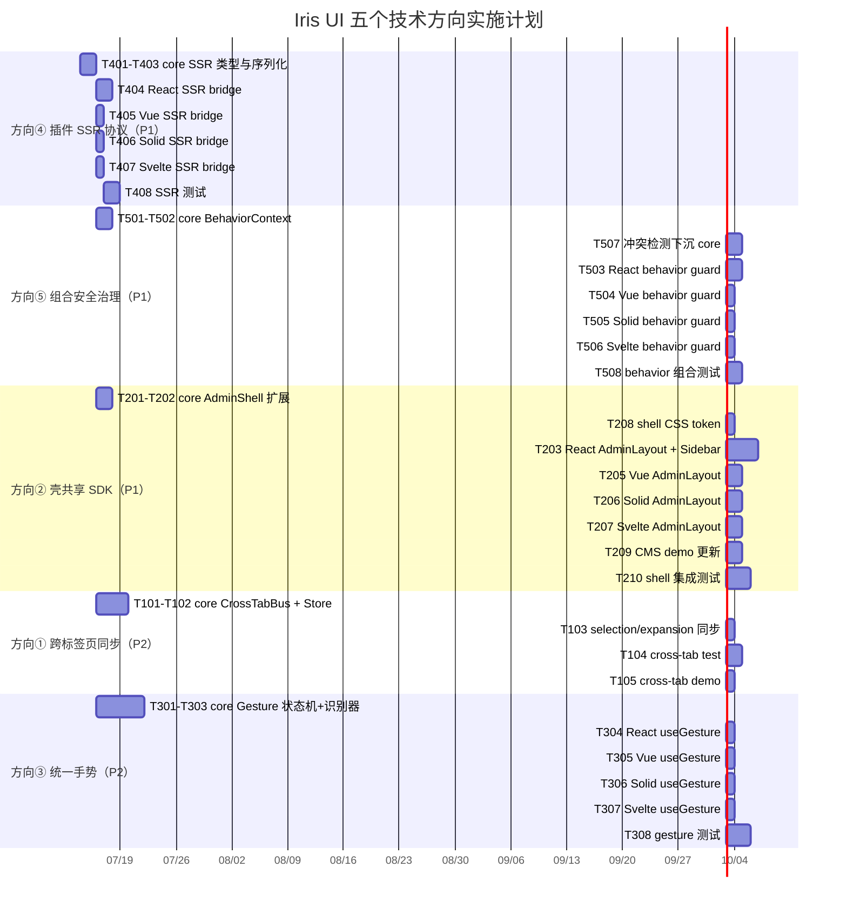

现在我已经对代码库有了全面了解。以下是 Tech Lead 分析报告。

---

# Tech Lead 分析报告：Iris UI 五个技术方向

## 0. 代码库现状快照

| 维度                  | 当前状态                                                                                                                                                                |
| --------------------- | ----------------------------------------------------------------------------------------------------------------------------------------------------------------------- |
| **插件系统**          | 完整：`createPlugin`/`runPlugins` + 四框架 `IrisProvider`，支持 tokens/messages/stores/teardown。但 SSR 协议隐式（只是 `typeof document` guard），无正式 hydration 契约 |
| **Behaviors**         | 四框架各有一组（ClickOutside/Hotkey/Resizable/Movable/LongPress/Sortable），但**逻辑未下沉 core**——每个框架重复实现。无嵌套组合的安全保证                               |
| **壳（Admin Shell）** | core 有 `createAdminShell` + `createResourceController`，但 Layout/Sidebar/NavMenu/Tabs 的渲染和桥接代码在四框架间重复                                                  |
| **跨标签页同步**      | 不存在。`Store` 无 `BroadcastChannel` 桥，`derived` 无跨窗口合并                                                                                                        |
| **手势系统**          | 只有 `useDrag` hook（React 专用）+ core `createLongPress`。无统一手势抽象（pan/pinch/rotate/swipe）                                                                     |

---

## 1. 任务分解

### 方向④ 插件 SSR 协议（P1 · 阻塞 npm 发布）

> **问题**：当前 `IrisProvider` 用 `typeof document === 'undefined'` 做 SSR guard，但插件 store 在 SSR 端被 eager 创建但在 hydrate 时需与客户端 reconcile。无正式协议导致 hydrate mismatch / 内存泄漏 / 水合失败。

| 任务 ID  | 标题                                                          | 涉及文件                                           | 前置         | 预估(h) |
| -------- | ------------------------------------------------------------- | -------------------------------------------------- | ------------ | ------- |
| TASK-401 | 定义 `PluginSSRProtocol` 类型契约                             | `packages/core/src/plugin.ts`                      | 无           | 2       |
| TASK-402 | 在 `CollectedRegistrations` 中加入 `ssrState` 序列化/反序列化 | `packages/core/src/plugin.ts`                      | TASK-401     | 3       |
| TASK-403 | `runPlugins` 返回 `ssrPayload` 用于服务端注入                 | `packages/core/src/plugin.ts`                      | TASK-402     | 2       |
| TASK-404 | React `IrisProvider` 集成 SSR hydration bridge                | `packages/react/src/provider/IrisProvider.tsx`     | TASK-403     | 3       |
| TASK-405 | Vue `IrisProvider` SSR bridge                                 | `packages/vue/src/provider/IrisProvider.ts`        | TASK-403     | 2       |
| TASK-406 | Solid `IrisProvider` SSR bridge                               | `packages/solid/src/provider/IrisProvider.tsx`     | TASK-403     | 2       |
| TASK-407 | Svelte `IrisProvider` SSR bridge                              | `packages/svelte/src/provider/IrisProvider.svelte` | TASK-403     | 2       |
| TASK-408 | 测试：SSR → hydrate 场景（含 lazy store）                     | `packages/core/src/plugin.test.ts` + 各框架 test   | TASK-401~407 | 4       |

**合计：~20h（2.5 人天）**

### 方向⑤ 组合安全治理（P1 · AI 原生差异化）

> **问题**：Behaviors 可以任意嵌套（`<IrisResizable><IrisMovable>…</IrisMovable></IrisResizable>`），但无类型/运行时保护防止冲突（如两个 `Hotkey` 绑定相同 shortcut、`Resizable` + `Movable` 嵌套丢失坐标）。

| 任务 ID  | 标题                                                           | 涉及文件                                 | 前置         | 预估(h) |
| -------- | -------------------------------------------------------------- | ---------------------------------------- | ------------ | ------- |
| TASK-501 | core：`createBehaviorContext` + `CompositionGuard` 类型        | `packages/core/src/behavior.ts`（新建）  | 无           | 3       |
| TASK-502 | core：`useBehavior` hook 定义（跨框架共享的嵌套检测逻辑）      | `packages/core/src/behavior.ts`          | TASK-501     | 2       |
| TASK-503 | React：`IrisBehaviorProvider` + 每个 behavior 接入 guard       | `packages/react/src/behaviors/*.tsx`     | TASK-502     | 3       |
| TASK-504 | Vue：behavior composition guard integration                    | `packages/vue/src/behaviors/*.ts`        | TASK-502     | 2       |
| TASK-505 | Solid：behavior composition guard integration                  | `packages/solid/src/behaviors/*.tsx`     | TASK-502     | 2       |
| TASK-506 | Svelte：behavior composition guard integration                 | `packages/svelte/src/behaviors/*.svelte` | TASK-502     | 2       |
| TASK-507 | 下沉冲突检测逻辑到 core（hotkey 重绑定 warning、资源竞争检测） | `packages/core/src/behavior.ts`          | TASK-501     | 3       |
| TASK-508 | 测试：嵌套组合场景 + 冲突检测                                  | 各框架 `<framework>/src/behaviors/`      | TASK-503~507 | 4       |

**合计：~21h（2.6 人天）**

### 方向② 壳共享 SDK（P1 · 消除 ×4 代码重复）

> **问题**：`AdminLayout`、`Sidebar`、`NavMenu`、`Tabs` 的 shell 级别组件在四框架中独立实现。虽然 core 有 `createAdminShell` + `createResourceController`，但渲染层（如 Sidebar 的 toggle 动画、NavMenu 的展开/折叠、Tabs 的关闭动画）每框架重复。

| 任务 ID  | 标题                                                                              | 涉及文件                                                 | 前置         | 预估(h) |
| -------- | --------------------------------------------------------------------------------- | -------------------------------------------------------- | ------------ | ------- |
| TASK-201 | core：扩展 `createAdminShell` 加入 layout state（sidebar collapsed、mobile mode） | `packages/core/src/admin-shell.ts`                       | 无           | 2       |
| TASK-202 | core：定义 `ShellLayoutConfig` + `SidebarConfig` + `HeaderConfig` 类型            | `packages/core/src/admin-shell.ts`                       | TASK-201     | 2       |
| TASK-203 | React：`AdminLayout` 无状态渲染组件（取 store 数据）                              | `packages/react/src/layouts/AdminLayout.tsx`（新建）     | TASK-202     | 3       |
| TASK-204 | React：`Sidebar` + `NavMenu` 纯渲染组件                                           | `packages/react/src/layouts/Sidebar.tsx` + `NavMenu.tsx` | TASK-203     | 4       |
| TASK-205 | Vue：`AdminLayout` + `Sidebar` + `NavMenu`                                        | `packages/vue/src/layouts/`（新建）                      | TASK-202     | 3       |
| TASK-206 | Solid：`AdminLayout` + `Sidebar` + `NavMenu`                                      | `packages/solid/src/layouts/`（新建）                    | TASK-202     | 3       |
| TASK-207 | Svelte：`AdminLayout` + `Sidebar` + `NavMenu`                                     | `packages/svelte/src/layouts/`（新建）                   | TASK-202     | 3       |
| TASK-208 | core：提取共享 shell CSS token（sidebar width/header height/z-index）             | `packages/core/src/admin-shell.ts`                       | TASK-202     | 1       |
| TASK-209 | CMS demo 更新使用新共享 Shell                                                     | `apps/cms-*`                                             | TASK-203~207 | 4       |
| TASK-210 | 测试：shell 集成测试（4 框架）                                                    | 各框架 test 目录                                         | TASK-203~208 | 5       |

**合计：~30h（3.75 人天）**

### 方向① 跨标签页同步（P2）

> **问题**：多标签页下各 tab 各自有独立 store 状态。无 BuiltChannel/SharedWorker 桥来同步 selection/expansion/theme 等状态。

| 任务 ID  | 标题                                                                            | 涉及文件                                          | 前置         | 预估(h) |
| -------- | ------------------------------------------------------------------------------- | ------------------------------------------------- | ------------ | ------- |
| TASK-101 | core：`createCrossTabBus` 抽象（基于 BroadcastChannel + fallback localStorage） | `packages/core/src/cross-tab.ts`（新建）          | 无           | 4       |
| TASK-102 | core：`CrossTabStore` wrapper——把 `Store<T>` 桥接到 bus                         | `packages/core/src/cross-tab.ts`                  | TASK-101     | 3       |
| TASK-103 | core：selection/expansion 的跨标签同步选项                                      | `packages/core/src/selection.ts` + `expansion.ts` | TASK-102     | 2       |
| TASK-104 | 测试：多标签 sync（vitest mock BroadcastChannel）                               | `packages/core/src/cross-tab.test.ts`             | TASK-101~103 | 4       |
| TASK-105 | demo：playground 展示跨标签同步                                                 | `apps/playground-*`                               | TASK-104     | 2       |

**合计：~15h（1.9 人天）**

### 方向③ 统一手势（P2）

> **问题**：手势系统碎片化——`useDrag` 在 React、`createLongPress` 在 core。无统一抽象（类似 `@use-gesture` 但框架无关）处理 pan/pinch/rotate/swipe。

| 任务 ID  | 标题                                                                                  | 涉及文件                                                   | 前置         | 预估(h) |
| -------- | ------------------------------------------------------------------------------------- | ---------------------------------------------------------- | ------------ | ------- |
| TASK-301 | core：`createGestureMachine`——统一手势状态机（IDLE→POINTER_DOWN→DRAGGING/PINCHING/…） | `packages/core/src/gesture.ts`（新建）                     | 无           | 4       |
| TASK-302 | core：PointerEvent 到 gesture 的解释器（`recognizeGesture`）                          | `packages/core/src/gesture.ts`                             | TASK-301     | 3       |
| TASK-303 | core：`createSwipeDetector` + `createPinchDetector` + `createRotateDetector`          | `packages/core/src/gesture.ts`                             | TASK-302     | 4       |
| TASK-304 | React：`useGesture` hook（桥接 core gesture → React）                                 | `packages/react/src/primitives/drag/useGesture.ts`（新建） | TASK-303     | 2       |
| TASK-305 | Vue：`useGesture` composable                                                          | `packages/vue/src/composables/useGesture.ts`（新建）       | TASK-303     | 2       |
| TASK-306 | Solid：`useGesture` primitive                                                         | `packages/solid/src/primitives/useGesture.ts`（新建）      | TASK-303     | 2       |
| TASK-307 | Svelte：`useGesture` action                                                           | `packages/svelte/src/actions/useGesture.ts`（新建）        | TASK-303     | 2       |
| TASK-308 | 测试：手势识别+边界（jsdom pointer event mock）                                       | `packages/core/src/gesture.test.ts`                        | TASK-301~304 | 5       |

**合计：~24h（3 人天）**

---

## 2. 执行顺序与依赖图

```mermaid
graph TD
    subgraph "Phase 1: Foundation (Week 1-2)"
        T401[TSK-401: SSR 类型契约] --> T402[TSK-402: ssrState 序列化]
        T501[TSK-501: BehaviorContext 类型] --> T502[TSK-502: useBehavior hook]
        T101[TSK-101: createCrossTabBus] --> T102[TSK-102: CrossTabStore]
        T301[TSK-301: createGestureMachine] --> T302[TSK-302: recognizeGesture]
    end

    subgraph "Phase 2: Core Logic (Week 2-3)"
        T402 --> T403[TSK-403: runPlugins ssrPayload]
        T502 --> T507[TSK-507: 冲突检测下沉 core]
        T102 --> T103[TSK-103: selection/expansion sync]
        T302 --> T303[TSK-303: swipe/pinch/rotate detector]

        T201[TSK-201: 扩展 AdminShell] --> T202[TSK-202: ShellLayoutConfig]
    end

    subgraph "Phase 3: Framework Bridges (Week 3-5)"
        T403 --> T404[TSK-404: React SSR]
        T403 --> T405[TSK-405: Vue SSR]
        T403 --> T406[TSK-406: Solid SSR]
        T403 --> T407[TSK-407: Svelte SSR]

        T507 --> T503[TSK-503: React behavior guard]
        T507 --> T504[TSK-504: Vue behavior guard]
        T507 --> T505[TSK-505: Solid behavior guard]
        T507 --> T506[TSK-506: Svelte behavior guard]

        T202 --> T203[TSK-203: React AdminLayout]
        T202 --> T205[TSK-205: Vue AdminLayout]
        T202 --> T206[TSK-206: Solid AdminLayout]
        T202 --> T207[TSK-207: Svelte AdminLayout]

        T303 --> T304[TSK-304: React useGesture]
        T303 --> T305[TSK-305: Vue useGesture]
        T303 --> T306[TSK-306: Solid useGesture]
        T303 --> T307[TSK-307: Svelte useGesture]

        T103 --> T105[TSK-105: cross-tab demo]
    end

    subgraph "Phase 4: Testing & Polish (Week 5-6)"
        T404 --> T408[TSK-408: SSR test]
        T503 --> T508[TSK-508: behavior composition test]
        T203 --> T210[TSK-210: shell integration test]
        T203 --> T209[TSK-209: CMS demo update]
        T304 --> T308[TSK-308: gesture test]
        T303 --> T308
        T103 --> T104[TSK-104: cross-tab test]
        T202 --> T208[TSK-208: shell CSS token]
    end

    %% 并行组标识
    style T401 fill:#e1f5fe
    style T501 fill:#e1f5fe
    style T101 fill:#e1f5fe
    style T301 fill:#e1f5fe
    style T201 fill:#e1f5fe
```



### 并行执行组

| 并行组                      | 任务                                                                                                       | 条件                   |
| --------------------------- | ---------------------------------------------------------------------------------------------------------- | ---------------------- |
| **G1 （独立基础）**         | T401（SSR 契约）+ T501（Behavior 类型）+ T101（CrossTab 抽象）+ T301（Gesture 状态机）+ T201（Shell 扩展） | 无前置依赖，可同时开工 |
| **G2 （core 逻辑）**        | T402 + T502 + T102 + T302 + T202                                                                           | 依赖 G1                |
| **G3a （四框架 SSR）**      | T404 + T405 + T406 + T407                                                                                  | 依赖 T403              |
| **G3b （四框架 Behavior）** | T503 + T504 + T505 + T506                                                                                  | 依赖 T507              |
| **G3c （四框架 Shell）**    | T203 + T205 + T206 + T207                                                                                  | 依赖 T202              |
| **G3d （四框架 Gesture）**  | T304 + T305 + T306 + T307                                                                                  | 依赖 T303              |
| **G4 （测试）**             | 各方向测试任务                                                                                             | 依赖对应实现           |

---

## 3. 技术风险

### 3.1 插件 SSR 协议（方向④）

| 风险                                              | 概率   | 影响       | 缓解策略                                                                                                                                                                                                                  |
| ------------------------------------------------- | ------ | ---------- | ------------------------------------------------------------------------------------------------------------------------------------------------------------------------------------------------------------------------- |
| **lazy store 在 SSR 端不执行但在 hydrate 时需要** | High   | 水合不一致 | TASK-401 必须定义 `shouldHydrate` 标记：SSR 端必须 serialize 所有 store state（不仅 eager），lazy store 在 SSR 端应标记 hydration 需求，客户端跳过 factory 直接用 SSR state。参考 TanStack Query 的 `dehydrate`/`hydrate` |
| **插件 token 在 SSR 端无意义**                    | Low    | 低         | token 只影响 CSS var——SSR 端直接 skip，由客户端 `$effect`/`useEffect` 应用                                                                                                                                                |
| **多框架 SSR API 不一致**                         | Medium | 阻塞       | React 的 `useId` 与 Svelte 的 `svelte-ssr-stores` 不同。方案：core 层不感知框架，`ssrPayload` 是纯 JSON，每框架负责 inject/read                                                                                           |

### 3.2 组合安全治理（方向⑤）

| 风险                                  | 概率   | 影响     | 缓解策略                                                                                                   |
| ------------------------------------- | ------ | -------- | ---------------------------------------------------------------------------------------------------------- |
| **Behavior 嵌套无限递归**             | Low    | 崩溃     | `CompositionGuard` 必须检测循环引用 + 深度限制（默认 16 层）                                               |
| **Hotkey 冲突用户感知**               | Medium | UX 问题  | TASK-507 需在 dev 环境 console.warn + 运行时用优先级（`priority` prop）裁决                                |
| **跨框架 behavior 下沉导致 API 破碎** | Medium | 重构成本 | 必须先在 core 定义纯数据 `BehaviorRegistration`，各框架 adapter 映射到自己的范式。参考 `createPlugin` 模式 |

### 3.3 壳共享 SDK（方向②）

| 风险                              | 概率   | 影响       | 缓解策略                                                                                                                                                             |
| --------------------------------- | ------ | ---------- | -------------------------------------------------------------------------------------------------------------------------------------------------------------------- |
| **四框架动画系统差异大**          | High   | 实现成本高 | Shell 组件应**不做动画**——动画由 CSS transition 驱动（`var(--iris-sidebar-width)` + `transition: width 0.2s`），各框架只控制 class/state。参考 Material UI 的 Drawer |
| **CMS demo 各有定制逻辑**         | Medium | 重复工作   | TASK-209 应提取公共 CMS pages（UsersPage/RolesPage）成 core controller，demo 只渲染                                                                                  |
| **Responsive mobile layout 复杂** | Medium | 测试难     | `ShellLayoutConfig` 必须包含 `breakpoint` + `mobileMode` state，mobile 下 Sidebar 变成 overlay                                                                       |

### 3.4 跨标签页同步（方向①）

| 风险                                  | 概率   | 影响          | 缓解策略                                                                                         |
| ------------------------------------- | ------ | ------------- | ------------------------------------------------------------------------------------------------ |
| **BroadcastChannel 在部分环境不可用** | Low    | fallback 必要 | TASK-101 必须有 `localStorage` + `storage` event 作为 fallback（SharedWorker 作为最后 fallback） |
| **同步环路（A→B→A 无限循环）**        | Medium | 状态损坏      | `CrossTabStore` 必须带 `source` 标记，收到自己发出的消息不处理                                   |
| **竞态（同时修改同一 selection）**    | Low    | 数据不一致    | 设计上不做 CRDT 合并——`CrossTabStore` 是 last-write-wins，可以接受                               |

### 3.5 统一手势（方向③）

| 风险                                | 概率   | 影响    | 缓解策略                                                                                                                                                                           |
| ----------------------------------- | ------ | ------- | ---------------------------------------------------------------------------------------------------------------------------------------------------------------------------------- |
| **jsdom 无 PointerEvent**           | High   | 测试难  | TASK-308 需要用 jsdom 模拟 PointerEvent（已有 `useDrag.test` 的先例），但 pinch/rotate 需要多指——jsdom 不支持 `TouchEvent`。策略：core 逻辑纯数据（坐标序列→事件类型），不依赖 DOM |
| **Svelte 手势 action 无法阻止滚动** | Medium | UX 问题 | Svelte action 需要 `passive: false` 监听器来 `preventDefault()`——已在 `clickOutside.ts` 有先例                                                                                     |
| **与 `useDrag` 共存迁移**           | Medium | 重构    | `useDrag` 应成为 `useGesture` 的 backward-compatible 别名，不破坏现有组件                                                                                                          |

---

## 4. 资源评估

### 开发人员

| 角色            | 技能要求                              | 数量   | 负责方向                                |
| --------------- | ------------------------------------- | ------ | --------------------------------------- |
| **Core 工程师** | TypeScript 高阶、状态机设计、SSR 原理 | 1      | 方向④ SSR 协议 + 方向① 跨标签 + core 层 |
| **框架工程师**  | React/Vue/Solid/Svelte 至少两项       | 1-2    | 方向⑤ 组合安全 + 方向③ 手势的框架桥     |
| **壳工程师**    | 四框架布局组件                        | 1      | 方向② 壳共享 SDK + CMS demo             |
| **QA 工程师**   | Vitest、jsdom、各框架测试             | 1 (兼) | 跨方向测试                              |

**最优团队配置：2 名 senior + 1 名 mid-level，6 周完成全部 5 方向**

### 关键里程碑

| 里程碑 | 时间      | 交付物                                       |
| ------ | --------- | -------------------------------------------- |
| **M1** | Week 2 末 | 所有 core 逻辑完成（G1+G2）                  |
| **M2** | Week 4 末 | React 前三方向可用（SSR + Behavior + Shell） |
| **M3** | Week 5 末 | 四框架全对齐                                 |
| **M4** | Week 6 末 | 全部测试通过 + CMS demo 更新                 |

### 阻塞点

| Blocker                          | 影响方向       | 解决策略                                                                        |
| -------------------------------- | -------------- | ------------------------------------------------------------------------------- |
| **npm publish 日期未定**         | 方向④ 的紧迫性 | 若 2 周内发布，方向④ 提到 Phase 1，其余推迟                                     |
| **Svelte 5 runes 的 SSR 兼容性** | 方向④ Svelte   | svelte 5 的 `$state` 在 SSR 端行为需验证——先做 React/Vue，Solid/Svelte 并行探索 |
| **TouchEvent 在 jsdom 的缺失**   | 方向③ 测试     | core 逻辑用纯坐标（`dx/dy/distance/angle`），框架层 mock 多指序列               |

---

## 5. 质量保证

### 5.1 单元测试覆盖要求

| 方向       | 测试目标                                                                   | 最低覆盖率     |
| ---------- | -------------------------------------------------------------------------- | -------------- |
| ④ SSR 协议 | `ssrPayload` 序列化/反序列化、hydrate 匹配、lazy store SSR 行为            | 100% core 逻辑 |
| ⑤ 组合安全 | 冲突检测（hotkey 重绑定、resizable+movable 嵌套）、循环检测、深度限制      | 100% core 逻辑 |
| ② 壳共享   | `AdminShell` 状态机、`SidebarConfig` 默认值、`NavMenu` 展开/折叠逻辑       | 100% core 逻辑 |
| ① 跨标签   | BroadcastChannel mock、环路检测、fallback localStorage、竞态合并           | 100% core 逻辑 |
| ③ 手势     | 坐标序列→gesture 识别（swipe/pinch/rotate）、边界条件（0 距离、undefined） | 100% core 逻辑 |

### 5.2 集成测试策略

- **方向④**：`// @vitest-environment node` 跑 `renderToString` + 客户端 hydrate 验证（React 用 `act` + `hydrateRoot`）
- **方向⑤**：每个框架的 behavior 测试 - 渲染嵌套组合 → 触发事件 → 验证 callback 调用 + 冲突 warning
- **方向②**：四框架 CMS demo 端到端——打开页面 → 点击菜单 → 验证 tab 打开 → 关闭 tab
- **方向①**：同进程模拟两个 BroadcastChannel 实例，验证状态同步
- **方向③**：core 用纯坐标模拟多指序列；框架层只验证 bridge wiring（同 `useDrag.test`）

### 5.3 代码审查要点

1. **SSR hydrate path 不能有 `window`/`document` 引用** → grep for `typeof document` 确保 SSR guard
2. **Behavior 下沉的 logic 不能引用框架 API** → `grep -rE "from '(react|vue|solid|svelte)'" packages/core/src/behavior.ts` 必须为空
3. **CrossTabBus 的 BroadcastChannel fallback 必须在所有浏览器环境测试** → 不能用 `BroadcastChannel` constructor 不存在的环境
4. **SSR payload 不可包含函数/class/Map** → JSON.stringify 安全

### 5.4 性能测试需求

| 场景                                             | 目标             | 工具                                      |
| ------------------------------------------------ | ---------------- | ----------------------------------------- |
| 插件 SSR payload 大小（100 个 lazy store）       | < 50KB           | `measure` + `tsc`                         |
| Behavior 嵌套 16 层的 mount 时间                 | < 5ms            | `vitest bench`                            |
| CrossTab 同步延迟（模拟 10 tabs）                | < 100ms          | `performance.now()`                       |
| Gesture 识别延迟（从 pointer event 到 callback） | < 1 frame (16ms) | `vitest bench`（已存在 `scale.bench.ts`） |

---

## 6. 实施计划

### 甘特图（6 周 · 2 人核心 + 1 人辅助）



### 详细阶段计划

#### 阶段 1 基础设施（Day 1-3 · 并行）

| Day | 人员 A（Core）                                     | 人员 B（框架）                             | 人员 C（辅助）                         |
| --- | -------------------------------------------------- | ------------------------------------------ | -------------------------------------- |
| 1   | T401 SSR 类型契约 + T101 CrossTabBus 接口          | T501 BehaviorContext 类型                  | 代码库熟悉 + 方向② AdminShell 扩展预研 |
| 2   | T402 ssrState 序列化 + T301 Gesture 状态机         | T502 useBehavior hook + T102 CrossTabStore | T201 AdminShell layout state           |
| 3   | T403 runPlugins ssrPayload + T302 recognizeGesture | T507 冲突检测 + T202 ShellLayoutConfig     | T208 shell CSS token                   |

#### 阶段 2 core 完成（Day 4-5 · 并行）

| Day | 人员 A                           | 人员 B                        | 人员 C                |
| --- | -------------------------------- | ----------------------------- | --------------------- |
| 4   | T303 swipe/pinch/rotate detector | T103 selection/expansion sync | 辅助 B 做 shell 类型  |
| 5   | core SSR 自测 + 文档             | core Behavior 自测 + 文档     | core Gesture 测试辅助 |

#### 阶段 3 框架桥（Day 6-15 · 三路并行）

**轨道 A（方向④+①）**：T404→T405→T406→T407→T104→T105
**轨道 B（方向⑤+③）**：T503→T504→T505→T506→T304→T305→T306→T307
**轨道 C（方向②）**：T203→T205→T206→T207

#### 阶段 4 集成测试与优化（Day 16-20）

- T408（SSR 测试）+ T508（Behavior 测试）+ T210（Shell 测试）+ T308（Gesture 测试）+ T104（CrossTab 测试）+ T209（CMS demo）
- 性能 benchmark
- 跨框架 diff 检查（四框架同名组件接口一致性）

#### 阶段 5 发布就绪（Day 21-22）

- `pnpm gen:manifest` 更新
- changeset 准备
- 文档：VitePress 各方向使用指南

---

## 7. 推荐执行顺序

基于 P1 优先级和技术依赖：

### 🥇 第一优先级：同时启动方向④ + 方向⑤ + 方向②

这三个方向互不阻塞 core 层，且都是 P1。最佳策略：

```
Week 1-2:  T401+T501+T201 (core 层并行) → T402+T502+T202
Week 3-4:  四框架桥 (T404-T407 || T503-T506 || T203/T205-T207)
Week 5-6:  测试 + CMS demo 更新
```

### 🥈 第二优先级：方向① + 方向③（P2）

在核心人员完成 core 层后可以作为 "创新周" 任务安排：

```
Week 2-3:  T101+T301 (core 层)
Week 4-5:  四框架桥
Week 6:    测试 + demo
```

### 立即启动建议

**如果您希望立刻开工，我建议从以下三个独立的 TASK 开始**（人员充裕时可全开，否则选一个）：

1. **`TASK-401`（SSR 类型契约）** — 核心阻塞项，2h 可完成类型定义，为后续 SSR 打好基础
2. **`TASK-501`（BehaviorContext 类型 + CompositionGuard）** — 2h 完成类型骨架，组合安全的基础
3. **`TASK-201`（扩展 AdminShell layout state）** — 2h 完成，壳共享的第一个垫脚石

这三个任务**互不依赖**，可并行开工。请告诉我您的选择，我可以立即开始编码。
