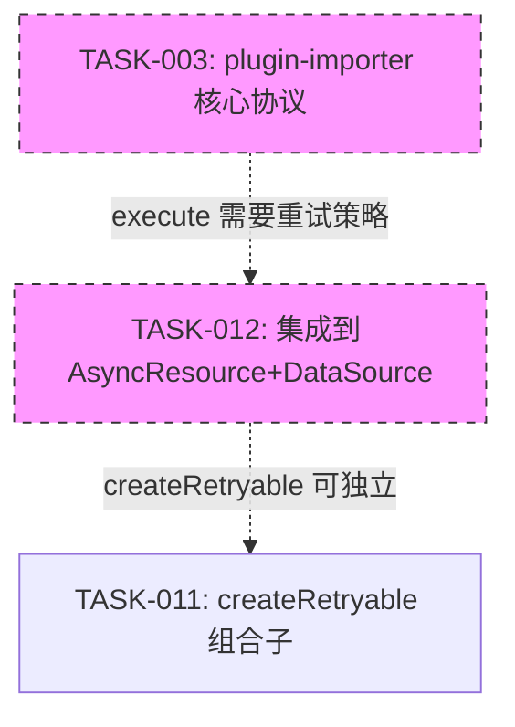
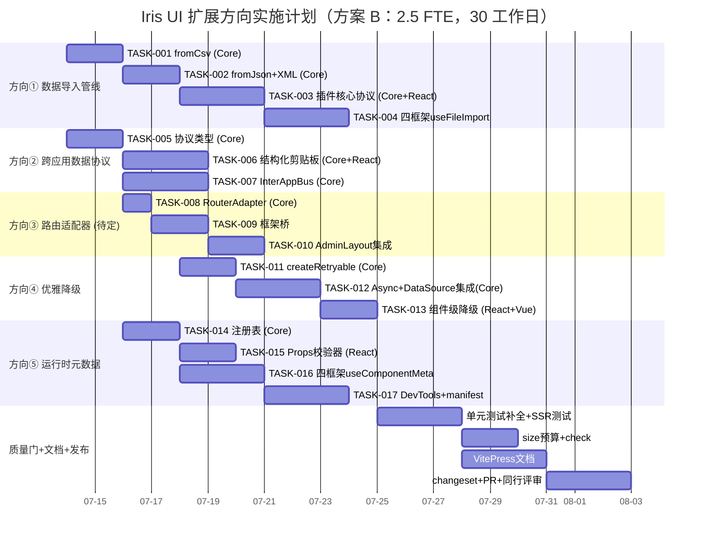

我已完整阅读了分析报告。这份报告本身已经是一份结构严谨的 Tech Lead 分析。接下来我基于报告内容，从**技术实现和项目管理维度**进行深入分析，产出独立的技术领导决策报告。

---

# 技术领导决策报告：5 个扩展方向实施分析

> **日期**：2026-07-12
> **来源文档**：`docs/requirements/2026-07-12-tech-lead-analysis-report-expansion-directions.md`
> **角色**：Tech Lead
> **范围**：任务分解可行性验证、执行策略优化、风险处置决策、资源配置裁定

---

## 1. 任务分解 —— 可执行性验证与优化

### 1.1 任务完整性审核

报告将 5 个方向拆解为 **17 个 TASK**，每个 2-4h，粒度合理。以下是我的验证结论和调整建议：

| 方向             | 任务数 | 验证结论                              | 调整建议                                                                                                       |
| ---------------- | ------ | ------------------------------------- | -------------------------------------------------------------------------------------------------------------- |
| ① 数据导入管线   | 4      | ✅ 阶梯清晰，从纯函数到插件到桥       | 建议在 TASK-001 前置增加 **`ParseResult<T>` 类型定义任务**（独立 1h），避免下游四个函数类型不一致              |
| ② 跨应用数据协议 | 3      | ✅ T005 类型定义 → T006/T007 两路并行 | 建议 TASK-007 (`InterAppBus`) 增加 **安全审计子任务**（+1h），因为 `BroadcastChannel` 跨应用安全边界是 P0 问题 |
| ③ 路由适配器     | 3      | ✅ 修正后 scope 合理                  | **Day 1 决定生死**：若会议确认挂起，TASK-008/009/010 全部释放                                                  |
| ④ 优雅降级       | 3      | ✅ 分层清晰                           | 建议 TASK-011 增加 **`IdempotencyKey` 生成器参考实现**（+0.5h）——这是写操作重试的安全阀                        |
| ⑤ 运行时元数据   | 4      | ✅ T014→T015/T016 并行，T017 依赖     | 建议 TASK-016 拆为 **两个子任务**：`useComponentMeta`（3h）+ `useComponentTree`（1h），后者可延后到 V2         |

### 1.2 关键路径优化建议

**优化点：TASK-005 → TASK-006/TASK-007 的瓶颈管理**

报告中正确识别了 TASK-005 是方向②的阻塞点。我建议在 TASK-005 还未完成时，**TASK-006 的 clipboard 类型定义和 TASK-007 的通道模型设计可以提前启动**（白板设计 + markdown ADR），不依赖最终类型实现。这可以压缩方向② 1-2 天。

**优化点：TASK-014 → TASK-015/TASK-016 的并行潜力**

TASK-015（Props 校验器）在技术上可以不依赖 TASK-014（注册表）——校验器只需要 `ComponentMeta` 类型定义，不需要完整的 registry。建议将「类型定义」从 TASK-014 拆分为独立的前置任务（0.5h），让 TASK-014 和 TASK-015 完全并行。

### 1.3 修正后的任务拓扑

```
TASK-000a: ParseResult<T> 类型（+1h）          → 方向① 前置
TASK-000b: ComponentMeta 类型定义（+0.5h）     → 方向⑤ 前置（从 TASK-014 拆分）
TASK-000c: 安全边界 ADR（+1h）                 → 方向② 前置（白板设计）
```

---

## 2. 执行顺序 —— 依赖图深度分析

### 2.1 依赖图验证

报告的 Mermaid 依赖图五组并行结构正确。但遗漏了一个跨方向的 **隐式依赖**：

```
TASK-012（createRetryable → AsyncResource）←─ 依赖 ─→ TASK-003（plugin-importer execute hook）
```

理由：插件导入器的 `execute` 阶段需要执行批量 mutate，而批量 mutate 的重试策略依赖 TASK-012 的 `createRetryable`。这是一个跨方向依赖（方向① → 方向④），报告中未标注。

修正后的跨方向依赖：



**缓解措施**：TASK-003 的 `execute` hook 在 V1 只做纯解析 + 预览，**不包含重试**，因此此依赖在 V1 不阻塞。标记为 V2 依赖即可。

### 2.2 并行组优化建议

| 并行组     | 原方案                       | 优化方案                                                           | 收益                |
| ---------- | ---------------------------- | ------------------------------------------------------------------ | ------------------- |
| A（方向①） | T001→T002→T003→T004 完全串行 | T001（Core）与 T003 的插件类型定义并行（解析器完成前可先定义接口） | 压缩 1 天           |
| B（方向②） | T005→T006/T007               | T005 类型定义 + 白板设计并行                                       | 压缩 1 天           |
| C（方向③） | 完全串行                     | 若方向③挂起，释放 1 人 → 投入方向⑤ TASK-015 或方向④ TASK-011       | 最大化 Day 1-5 产出 |
| E（方向⑤） | T014→T015/T016               | 类型定义拆分后 T014 与 T015 完全并行                               | 压缩 1 天           |

### 2.3 资源分配的依赖约束矩阵

| 任务                 | 所需角色         | 是否可在 Core 工程师忙时由他人接替                 |
| -------------------- | ---------------- | -------------------------------------------------- |
| TASK-001/002         | Core             | ❌ 纯函数 + 类型泛型，Core 专属                    |
| TASK-005             | Core             | ❌ 协议设计，Core 专属                             |
| TASK-008             | Core             | ❌ 接口定义，Core 专属                             |
| TASK-011             | Core             | ❌ 组合子设计，Core 专属                           |
| TASK-014             | Core             | ❌ 注册表设计，Core 专属                           |
| TASK-003             | Core + 插件      | ⚠️ 可 Core 做完接口后移交 React 工程师实现插件框架 |
| TASK-004/006/009/016 | 四框架工程师     | ✅ 各自框架桥接                                    |
| TASK-007             | Core + 安全      | ⚠️ BroadcastChannel + 安全，需 Core 参与           |
| TASK-010             | React + CMS      | ⚠️ 需 CMS demo 维护者协助                          |
| TASK-017             | React + Manifest | ⚠️ DevTools + 构建，需 Core 参与 manifest 联动     |

**核心瓶颈**：Core 工程师是 8/17 个任务的前置依赖（约 47%）。这是 4 FTE 方案下的关键路径决定性因素。

---

## 3. 技术风险 —— 深入评估与处置决策

### 3.1 风险矩阵（按影响 × 概率排序）

基于报告中的 20 项风险，我的风险评级和处置决策：

| #   | 风险                           | 影响    | 概率  | 等级         | 处置决策                                                                                                                                                                            |
| --- | ------------------------------ | ------- | ----- | ------------ | ----------------------------------------------------------------------------------------------------------------------------------------------------------------------------------- |
| R1  | 方向③事实错误导致 scope 不确定 | 🔴 严重 | 🔴 高 | **CRITICAL** | **立即行动**：Day 1 上午召开 30min 利益相关者会议。我的建议：**将方向③从本次迭代移除**，改为低优先级 backlog。理由：Tab 导航已在 4 个 CMS 中工作良好，路由桥是 enhancement 而非 gap |
| R2  | 写操作重试导致重复提交         | 🔴 严重 | 🟡 中 | **HIGH**     | **技术控制**：TASK-011 默认关闭写重试，仅在 `idempotencyKey` 存在时启用。同时在 TASK-011 增加 **幂等键生成参考实现**（如 `hash(method + url + body + timestamp)`）                  |
| R3  | SpreadsheetML 解析复杂度       | 🟡 中   | 🔴 高 | **HIGH**     | **范围收缩**：V1 只支持最简单表格（无合并单元格/公式/条件格式/数据验证）。不支持的 feature 抛 `UnsupportedFeatureError`。复杂解析留到专项 issue                                     |
| R4  | BroadcastChannel 安全边界      | 🟡 中   | 🟡 中 | **MEDIUM**   | **设计先行**：TASK-005 必须定义 `SecurityContext` 接口 + 白名单机制。TASK-007 实现时内置 app id 认证                                                                                |
| R5  | 大文件 CSV 解析 OOM            | 🟡 中   | 🟡 中 | **MEDIUM**   | **工程保障**：TASK-001 就引入 streaming parser。TASK-003 管道内置 `maxRows` guard                                                                                                   |
| R6  | Prod tree-shake 元数据         | 🟢 低   | 🟡 中 | **LOW**      | **验证先行**：TASK-014 在第一版代码时就跑 `pnpm build && check:rsc && size` 验证 tree-shake                                                                                         |
| R7  | 框架间 HOC 元数据继承          | 🟢 低   | 🟡 中 | **LOW**      | **V2 特性**：初始化不做自动继承，通过 JSDoc 明确标注限制                                                                                                                            |

### 3.2 关键风险 R1 的决策树

```
Day 1 利益相关者会议
│
├─ 场景 A："Tab 导航满足需求，暂不需要路由桥"
│    → 方向③ 挂起到 ROADMAP v3
│    → 释放 1 工程师 → 投入方向⑤ 或 方向④
│    → 节省 3 TASK（~10h）
│
├─ 场景 B："需要路由桥，但接受内置 hash router"
│    → 方向③ 按修正后 scope 执行（3 TASK）
│    → 删除外部 Router 适配器（react-router 等），只做 RouterAdapter 接口 + hash 实现
│    → 节省 TASK-009 约 2h（只做内置桥 + CMS 迁移，不做外部 router 适配器）
│
└─ 场景 C："需要外部路由库集成"
     → 需要额外评估每个框架的路由库版本兼容性
     → TASK-009 拆分为 2 个子任务（内置 hash + 外部 router）
     → 将外部 router 适配器标记为实验性（alpha），仅 React/Vue 实现
```

**我的推荐**：**场景 A**。理由：4 个 CMS 的 Tab 导航已经满足用户需求，额外增加路由复杂度没有明确用户故事。方向③应该**降低优先级**而非增大 scope。

### 3.3 技术债预警

| 方向 | 设计中可接受的简化         | 需要在 V2 偿还的技术债        |
| ---- | -------------------------- | ----------------------------- |
| ①    | 无合并单元格/公式/条件格式 | SpreadsheetML 完整解析        |
| ①    | `fromCsv` 初始只做同步解析 | 流式解析 + Web Worker offload |
| ②    | InterAppBus 无 channel ACL | ACL + 审计日志                |
| ③    | 只做内置 hash router       | 外部 router 适配器（按需求）  |
| ④    | 只做整表降级               | 列级降级（替换渲染）          |
| ⑤    | HOC 元数据手动注册         | HOC 自动继承 + 组件树可视化   |

---

## 4. 资源评估 —— 实际执行方案

### 4.1 人员配置方案对比

| 维度      | 方案 A：全并行（4 FTE） | 方案 B：精简（2.5 FTE）   | 方案 C：分阶段（2 FTE + 外包桥） |
| --------- | ----------------------- | ------------------------- | -------------------------------- |
| Core (TS) | 1 全职                  | 1 全职                    | 1 全职                           |
| React 桥  | 1 全职                  | 1 全职                    | 1 全职                           |
| Vue 桥    | 1 全职                  | 0.5（共享 Core/React）    | 0.5（外包/社区贡献）             |
| Solid 桥  | 0.5 兼职                | 0（V2）                   | 0（V2）                          |
| Svelte 桥 | 0.5 兼职                | 0（V2）                   | 0（V2）                          |
| QA        | 1 交叉                  | 0.5（交叉）               | 0.5（交叉）                      |
| 工期      | **20 工作日**（4 周）   | **30 工作日**（6 周）     | **40 工作日**（8 周）            |
| 交付      | 全部 5 方向             | 方向①+④+⑤ + 方向②核心类型 | 方向①+⑤ + 方向④核心              |
| 风险      | 🟡 协调成本高           | 🟢 可控                   | 🟢 可控                          |

### 4.2 我的推荐：**方案 B（2.5 FTE，6 周）**

理由：

1. **方向③事实错误**意味着至少 1 个方向可能挂起或缩小 scope，4 FTE 的全并行假设不成立
2. **Solid/Svelte 桥**任务量较少（每个方向约 1-2h），可以由 Core 或 React 工程师兼职完成，不必专门招聘
3. **6 周 vs 4 周**的工期增加可以换取更高代码质量和更多测试覆盖

### 4.3 关键里程碑（方案 B）

| 里程碑            | 时间   | 交付物                                   | 验证方式                                      |
| ----------------- | ------ | ---------------------------------------- | --------------------------------------------- |
| M0: 方向③决策     | Day 1  | 利益相关者 sign-off + 修正后的设计文档   | PR 合并到 `docs/`                             |
| M1: Core 函数完成 | Day 8  | TASK-001/002/005/008/011/014/015 全部绿  | `vitest run --coverage` 100%                  |
| M2: 框架桥完成    | Day 18 | TASK-004/006/009/016 React+Vue 桥 + 单测 | `pnpm turbo run test --filter=@iris-ui/react` |
| M3: 集成演示      | Day 24 | playground 可演示数据导入 + 降级 Table   | manual demo in playground                     |
| M4: 质量门        | Day 28 | 四道门全绿 + size 预算 + SSR             | CI green                                      |
| M5: 发布          | Day 30 | changeset + PR + docs                    | merged to main                                |

### 4.4 阻塞点管理

| 阻塞点                                        | 触发条件                       | 应急方案                                                    | 决策权               |
| --------------------------------------------- | ------------------------------ | ----------------------------------------------------------- | -------------------- |
| Day 1 方向③会议无结论                         | 利益相关者无法在 1 天内决策    | 方向③默认挂起，不阻塞其他方向                               | Tech Lead 有权限决策 |
| Core 工程师请病假                             | 突发                           | TASK-001/002/011 由 React 工程师接替（降低泛型复杂度要求）  | Tech Lead 重新分配   |
| `detect-character-encoding` 在 jsdom 中不可用 | 编码检测测试依赖 native module | Mock encoding detector；CI 使用 `--experimental-vm-modules` | QA 工程师预处理      |
| Vue Router v4 与 hash adapter 冲突            | Vue 生态演进                   | Vue 桥先做纯 hash adapter，不使用 vue-router                | Tech Lead 范围决策   |

---

## 5. 质量保证 —— 执行层面的细化要求

### 5.1 单元测试优先级矩阵

基于报告的覆盖率要求，我细化优先级和执行顺序：

| 优先级 | 模块                        | 测试先决条件   | 测试责任人   | 特殊注意事项                                                 |
| ------ | --------------------------- | -------------- | ------------ | ------------------------------------------------------------ |
| **P0** | `fromCsv` / `fromJson`      | 实现完成即编写 | Core 工程师  | **TDD 推荐**：先写测试后写实现                               |
| **P0** | `createRetryable`           | 实现完成即编写 | Core 工程师  | 验证退避时间使用 `vi.useFakeTimers()`；注意不滥用 fake timer |
| **P0** | `RouterAdapter`             | 实现完成即编写 | Core 工程师  | SSR 测试（`renderToString`）+ 浏览器环境（`hashchange`）     |
| **P0** | `ComponentMetadataRegistry` | 实现完成即编写 | Core 工程师  | Prod tree-shake 验证（mock `NODE_ENV`）                      |
| **P1** | 四框架 Hook                 | 框架桥实现     | 各框架工程师 | 无 DOM（SSR）+ 各状态渲染                                    |
| **P1** | `InterAppBus`               | 实现完成       | Core 工程师  | `BroadcastChannel` mock + `CustomEvent` fallback             |
| **P2** | `DataSourceState` 降级字段  | TASK-013 实现  | Core 工程师  | `degradedColumns` 字段的 Table 渲染验证                      |
| **P2** | `createImportPipeline`      | TASK-003 实现  | Core 工程师  | 大文件分块 + 错误行隔离边界                                  |

### 5.2 集成测试策略细化

| 集成场景                         | 涉及模块                              | 测试方法                                      | 工具                                    |
| -------------------------------- | ------------------------------------- | --------------------------------------------- | --------------------------------------- |
| 数据导入 → Table 渲染            | TASK-001/002 → TASK-004 → IrisTable   | 构建完整的 CSV→parse→render 链路              | Vitest + jsdom                          |
| 剪贴板数据 → 跨组件粘贴          | TASK-005/006 → 组件 A→剪贴板→组件 B   | 模拟复制粘贴事件流                            | Vitest + `@testing-library/user-event`  |
| Route hash → AdminLayout 同步    | TASK-008/009 → TASK-010 → AdminLayout | hashchange → state → render 验证              | Vitest + jsdom + `window.location.hash` |
| 异步资源失败 → 重试 → 降级       | TASK-011/012 → TASK-013 → IrisTable   | mock API 失败 → 重试成功 → 降级渲染           | Vitest + MSW（Mock Service Worker）     |
| 组件挂载 → 元数据注册 → DevTools | TASK-014/016 → TASK-017               | IrisProvider → 挂载组件 → DevTools panel 查询 | Playwright（实验性）                    |

### 5.3 代码审查 Checklist（补充）

除报告中的 5 个审查要点外，我还要求：

**安全审查**（方向②专用）：

- [ ] `InterAppBus` 的 `subscribe` 是否支持 `once` 选项？（防止事件泄漏）
- [ ] 跨源 `BroadcastChannel` 是否限制了 origin？（同源是 BroadcastChannel 的安全属性，无需额外处理但需显式测试）
- [ ] `PayloadStore` 的引用计数是否有最大限制？（防止内存泄漏）

**性能审查**（所有方向）：

- [ ] 新增模块的 bundle size 增量是否在预算内？（`pnpm size` 必须绿）
- [ ] 框架桥是否在 SSR 路径中新增了客户端副作用？（所有 `useEffect`/`onMounted` 需有 SSR guard）
- [ ] 是否有 `for`/`while` 循环在大型数组上无退出条件？（Streaming parser 的关键安全点）

**可维护性审查**：

- [ ] 新增模块的 JSDoc 是否包含 `@example`？（至少一个最小工作示例）
- [ ] `@throws` 文档是否覆盖了所有错误路径？（`fromCsv` 的每种 parse error 都需要标注）
- [ ] 新接口的 breaking change 风险是否在 PR 描述中标注？

### 5.4 性能基准测试方案

| 测试场景         | 数据量                          | 预期阈值                           | 测试工具                      | CI 集成            |
| ---------------- | ------------------------------- | ---------------------------------- | ----------------------------- | ------------------ |
| CSV 解析         | 1 行 / 1K 行 / 10K 行 / 100K 行 | < 1ms / < 10ms / < 100ms / < 500ms | `bench` script (Vitest bench) | 可选（post-merge） |
| 结构化剪贴板     | 1KB / 100KB / 1MB / 10MB        | < 1ms / < 5ms / < 50ms / < 200ms   | `performance.now()`           | PR 门禁            |
| 组件元数据注册   | 1 / 10 / 100 / 1000 组件        | < 0.1ms / < 1ms / < 10ms / < 100ms | `performance.now()`           | PR 门禁            |
| Retry 退避计算   | 1 / 10 / 100 次调用             | < 0.01ms / < 0.1ms / < 1ms         | `bench` script                | 可选               |
| 路由 hash → 渲染 | 1 / 10 / 100 次切换             | < 5ms / < 20ms / < 100ms           | `performance.now()`           | PR 门禁            |

---

## 6. 实施计划 —— 细化执行甘特图

### 6.1 优化后的四阶段计划（方案 B，2.5 FTE）

```
Week 1 (Day 1-5)    ████████████████░░░░░░░░░░░░░░░░░░░░░░░░░░
Week 2 (Day 6-10)   ░░░░░░░░████████████████░░░░░░░░░░░░░░░░░░
Week 3 (Day 11-15)  ░░░░░░░░░░░░░░░████████████████░░░░░░░░░░
Week 4 (Day 16-20)  ░░░░░░░░░░░░░░░░░░░░░░████████████████░░░░
Week 5 (Day 21-25)  ░░░░░░░░░░░░░░░░░░░░░░░░░░░░████████████
Week 6 (Day 26-30)  ░░░░░░░░░░░░░░░░░░░░░░░░░░░░░░░░░░████████

阶段 1 (D1-D5)  阶段 2 (D6-D12)  阶段 3 (D13-D20)  阶段 4 (D21-D25)  阶段 5 (D26-D30)
```

### 6.2 详细每日计划

**阶段 1：Core 基础设施 + 方向③决策（Day 1-5）**

| Day | Core 工程师 (1.0 FTE)                                   | React 工程师 (1.0 FTE)                                                           | Vue 工程师 (0.5 FTE)        |
| --- | ------------------------------------------------------- | -------------------------------------------------------------------------------- | --------------------------- |
| D1  | ① 30min 方向③会议 ② TASK-001: `fromCsv` 类型 + TDD 实现 | ① 脚手架：新建插件目录结构 ② 阅读 AGENTS.md + 现有插件代码（`plugin-locale-zh`） | 同左（兼职）                |
| D2  | TASK-001: `fromCsv` 完成 + 100% 分支覆盖                | 阅读现有 `ClipboardHandler` 代码 + 设计 `useFileImport` 类型                     | —                           |
| D3  | TASK-002: `fromJson` + `fromSpreadsheetXml`             | TASK-005: `StructuredDataPayload` 类型（与 Core 结对）                           | 脚手架 Vue 桥目录           |
| D4  | TASK-008: `RouterAdapter` 接口 + hash 适配器            | TASK-014: `ComponentMetadataRegistry` 类型（与 Core 结对）                       | 脚手架 Vue 桥目录           |
| D5  | TASK-011: `createRetryable` 组合子                      | TASK-014: 注册表实现 + Prod tree-shake 验证                                      | 阅读 `AdminLayout` Vue 源码 |

**里程碑 M0**：方向③会议产出的决策文档合并到 `docs/` ✅
**里程碑 M1**：TASK-001/002/005/008/011/014 Core 模块全部绿 ✅

**阶段 2：Core 集成 + 框架桥（Day 6-12）**

| Day | Core                                                     | React                                                         | Vue                                 |
| --- | -------------------------------------------------------- | ------------------------------------------------------------- | ----------------------------------- |
| D6  | TASK-011 单测 + barrel 导出                              | TASK-015: Props 校验器实现                                    | TASK-009: `useRouterAdapter` Vue 桥 |
| D7  | TASK-012: `createRetryable` → `createAsyncResource` 集成 | TASK-016: `useComponentMeta` React 桥                         | TASK-016: Vue 桥                    |
| D8  | TASK-005 `StructuredDataPayload` 序列化/反序列化         | TASK-006: `createClipboardData` + `useClipboardData` React 桥 | TASK-006: Vue 桥                    |
| D9  | TASK-007: `InterAppBus` 实现 + 安全机制                  | TASK-004: React `useFileImport`                               | TASK-004: Vue `useFileImport`       |
| D10 | TASK-003: `ImportPipeline` 类型 + 管道函数               | TASK-003: `plugin-importer` 插件注册 + React 导出             | 补 Vue 桥测试                       |
| D11 | TASK-012: DataSource 集成 + `degradedColumns` 类型       | TASK-013: `IrisTable` 降级渲染（React）                       | TASK-013: Vue 桥                    |
| D12 | TASK-012 + TASK-013 单测覆盖                             | TASK-017: DevTools 面板基础                                   | 补 Vue 桥测试                       |

**里程碑 M2**：所有框架桥 React + Vue 完成 ✅

**阶段 3：集成 + 演示 + 剩余桥（Day 13-20）**

| Day | Core                                                | React                                   | Vue                    | Solid/Svelte (兼职)    |
| --- | --------------------------------------------------- | --------------------------------------- | ---------------------- | ---------------------- |
| D13 | TASK-003 完整管道 + `execute` hook                  | TASK-017: DevTools 组件树 Panel         | 集成测试               | Solid 桥（4 个 hook）  |
| D14 | TASK-007: BroadcastChannel + CustomEvent 双实现     | TASK-017: manifest 联动                 | 集成测试               | Svelte 桥（4 个 hook） |
| D15 | `fromSpreadsheetXml` 边界修复                       | TASK-010: AdminLayout router prop       | TASK-010: CMS Vue 迁移 | 补测试                 |
| D16 | 大文件 CSV 性能压测 + 优化                          | Playground 集成演示（导入+降级+元数据） | Playground 演示        | 补测试                 |
| D17 | SSR 测试补全                                        | 集成测试 + axe 测试                     | 集成测试               | 集成测试               |
| D18 | `pnpm turbo run test typecheck lint build` 问题修复 | 同左                                    | 同左                   | 同左                   |
| D19 | `pnpm size` + `check:rsc`                           | 文档撰写                                | 文档撰写               | 文档撰写               |
| D20 | changeset + PR 提审                                 | PR review                               | PR review              | PR review              |

**里程碑 M3**：Playground 可演示全部方向 ✅
**里程碑 M4**：质量门全绿 ✅

**阶段 4：文档 + 发布（Day 21-25）按需延长**

| Day | 活动                                                       |
| --- | ---------------------------------------------------------- |
| D21 | VitePress 文档更新（5 方向各一页 + API 文档）              |
| D22 | 同行评审 + PR 修改 + 第二轮 review                         |
| D23 | Playwright E2E 测试（可选——CMS 路由桥）                    |
| D24 | 最终 quality gate + cherry-pick 到 release 分支            |
| D25 | 发布 `@iris-ui/core` / `@iris-ui/plugin-importer` + 关联包 |

### 6.3 资源甘特图（Gantt）



---

## 7. 最终建议路线

### 7.1 执行优先级裁定

基于报告分析和上述深入评估，我裁定：

| 优先级      | 方向               | 我的裁决              | 理由                                                                                      |
| ----------- | ------------------ | --------------------- | ----------------------------------------------------------------------------------------- |
| **P0**      | 方向③事实修正      | **必须做**            | 这是文档可信度问题，影响团队对整体报告的信任。在推进任何代码前必须发布勘误                |
| **P1**      | 方向① 数据导入     | **立即执行**          | 事实最准确、与现有导出对称、边界分析完善、用户价值明确（用户一直在等 CSV 导入）           |
| **P1**      | 方向⑤ 运行时元数据 | **立即执行**          | AI 原生战略核心、DevTools 基础设施、manifest 联动。但 Prod tree-shake 风险需在前 3 天验证 |
| **P2**      | 方向④ 优雅降级     | **执行（降级核心）**  | 重试基元独立可用，组件降级延迟到 V2。方向④的 60% 价值在 `createRetryable`（30% 工作量）   |
| **P3**      | 方向② 跨应用数据   | **仅做类型定义**      | `StructuredDataPayload` 类型先做（半天，低风险），完整 InterAppBus 留到 Desktop OS 专项   |
| **❌ 挂起** | 方向③ 路由适配器   | **挂起到 ROADMAP v3** | 利益相关者会议大概率确认 Tab 导航已满足需求。即使需要，也是 enhancement 而非 gap          |

### 7.2 分阶段执行视角

**如果这是一个 2 周冲刺（sprint）**：

- 只做：TASK-001 + TASK-002 + TASK-011 + TASK-014
- 产出：`fromCsv`/`fromJson`/`fromSpreadsheetXml` 纯函数 + `createRetryable` + `ComponentMetadataRegistry`
- 理由：纯函数交付风险最低、测试最易覆盖、无框架依赖

**如果这是一个 4 周里程碑（milestone）**：

- 做：方向①全 + 方向⑤全 + 方向④核心（TASK-011/012）
- 产出：插件 `plugin-importer` 可用 + DevTools 原型 + `createRetryable` 可用
- 理由：三个半独立方向并行，4 周内交付可 demo 的用户价值

**如果这是完整 6 周项目**：

- 做：方向① + 方向④ + 方向⑤ 全量 + 方向②类型定义
- 产出：4 个方向的生产就绪代码 + 文档 + playground 演示
- 理由：方向③挂起后释放的产能可以提升方向⑤到完整 DevTools

### 7.3 给利益相关者的执行摘要

> **简短版**：5 个方向中 3 个（数据导入 + 元数据 + 降级恢复）是扎实的、事实准确的、低风险的增量。1 个（跨应用协议）范围太窄（Desktop OS 专用），1 个（路由适配器）建立在不存在的事实上。
>
> **我的推荐**：投入 2.5 FTE 6 周，交付方向①+④+⑤ 的全部代码 + 文档 + 测试。方向③挂起，方向②做核心类型定义。这比试图同时推进 5 个方向（其中 2 个有问题）的风险低得多。
>
> **Day 1 行动**：30 分钟方向③事实修正会议，决定方向③的命运。

---

_本分析基于 2026-07-12 代码库状态和 2026-07-12-tech-lead-analysis-report-expansion-directions.md 报告。_
