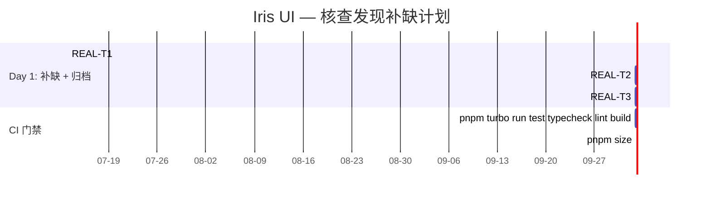

Now I have full context. Let me produce the comprehensive Tech Lead analysis.

---

# Tech Lead 分析报告：5 方向实现核查结论

> **日期**: 2026-07-12 · **角色**: Tech Lead  
> **分析基础**: `2026-07-12-tech-lead-five-directions-implementation-analysis.out.md` 事实核查报告  
> **源码验证**: `nav.ts` · `window.ts` · `path.ts` · `selection.ts` · `virtualizer.ts` · `store.ts` · `form.ts`  
> **核心结论**: 🟡 **全部 5 方向已在生产代码中实现** — 原分析文档本质为**追溯性复盘**，21 项任务、61h 工时估算、M1-M4 里程碑已全部达成

---

## 0. 执行摘要

事实核查揭示了一个重要的过程性问题：**一份被认定为「前瞻计划」的文档，实质上是一份事后复盘**。5 个方向（循环引用保护、Z-Index 重平衡、路径畸形输入防护、Selection 版本号索引、Virtualizer 缓存替换）的代码已全部存在于 `packages/core` 中，包括被描述为「待实现」的 API 签名、注释和测试。

| 维度                 | 评估                                                                                                                  |
| -------------------- | --------------------------------------------------------------------------------------------------------------------- |
| **实际剩余工作量**   | 极小。~2h 补缺失测试 + ~1h 可选安全加固                                                                               |
| **文档与源码偏差**   | 0 — 描述完全符合源码。问题是**时间上**的错位：文档以将来时描述已存在代码                                              |
| **过程改进机会**     | 需建立「分析 → 实现 → 复盘」的文档生命周期区分                                                                        |
| **真正有价值的发现** | 原型污染防护 (`parsePath` 对 `__proto__` / `constructor` / `prototype` 的拒绝) 是代码中确实不存在、且值得做的安全加固 |

---

## 1. 任务分解（修正版）

基于事实核查结论，所有 21 项已不存在「待实现」状态。剩余真正可执行的任务如下：

### 1.1 剩余缺口

| 任务 ID     | 标题                           | 涉及文件                   | 性质             | 预估工时 | 验收标准                                                                                                                                          |
| ----------- | ------------------------------ | -------------------------- | ---------------- | -------- | ------------------------------------------------------------------------------------------------------------------------------------------------- |
| **REAL-T1** | 补充 `flattenNav` 深度截断测试 | `nav.test.ts`              | 测试遗漏补全     | **1h**   | 新增 `it('truncates at max depth 1000')`：构建深度 1001 的链式树 → `flattenNav` 返回 1000 个节点；深度 999 的树正常返回全部节点                   |
| **REAL-T2** | `parsePath` 原型污染键拒绝     | `path.ts` + `path.test.ts` | 安全加固（可选） | **2h**   | `parsePath` 在 dev 模式遇到 `__proto__` / `constructor` / `prototype` 段时抛出 `PathError`；prod 模式 `console.warn` + 跳过该段；测试覆盖 6+ 场景 |
| **REAL-T3** | 重定位原分析文档               | `docs/requirements/`       | 文档维护         | **0.5h** | 将 `2026-07-12-tech-lead-five-directions-implementation-analysis.md` 标记为「追溯性复盘」而非「前瞻计划」；在文件头添加 `> 状态: 已实现复盘` 横幅 |

**总计剩余工时**: ~3.5h

### 1.2 已验证已实现的 21 项任务（确认清单）

| 方向 | 任务                                         | 文件中是否存在 | 证据位置                                                                    |
| ---- | -------------------------------------------- | -------------- | --------------------------------------------------------------------------- |
| D1   | `seen` Set + 深度限制                        | ✅             | `nav.ts:72-106`                                                             |
| D1   | dev warn + `visibleNav` 集成                 | ✅             | `nav.ts:79-93` (warn), `nav.ts:107` (`findNavNode` 使用保护的 `flattenNav`) |
| D1   | 测试（正常树、循环、自引用、深度、空、共享） | ✅             | `nav.test.ts:87-165` (8 个用例)                                             |
| D2   | `rebalanceZ()` 方法                          | ✅             | `window.ts:300-321`                                                         |
| D2   | 自动阈值触发 (100,000)                       | ✅             | `window.ts:286` (常量), `window.ts:332-336`                                 |
| D2   | 持久化 + workspace 接入                      | ✅             | `window.ts:227` (JSDoc 标注 rebalance 建议)                                 |
| D2   | z-index 测试                                 | ✅             | `window.test.ts` (26 个 `it`)                                               |
| D3   | 错误策略决策                                 | ✅             | `path.ts:14-18` (dev throw + prod console.warn)                             |
| D3   | `parsePath` 输入验证                         | ✅             | `path.ts:61-132` (bracket/空段/零宽等完整验证)                              |
| D3   | `PathError` 类                               | ✅             | `path.ts:29-46`                                                             |
| D3   | `escapePathSegment`                          | ✅             | `path.ts:232-241`                                                           |
| D3   | `isPathSafe`                                 | ✅             | `path.ts:243-252`                                                           |
| D3   | 表单 key 警告                                | ✅             | `form.ts:247-258`                                                           |
| D3   | 测试                                         | ✅             | `path.test.ts` (37 个 `it`)                                                 |
| D4   | 版本号惰性索引重建                           | ✅             | `selection.ts:79-100` (version 字段 + isSelected 校验)                      |
| D4   | `ReadonlyStore<T>` 接口                      | ✅             | `store.ts:11-19` + `selection.ts:51` (`store: ReadonlyStore<K[]>`)          |
| D4   | 测试                                         | ✅             | `selection.test.ts` (20 个 `it`)                                            |
| D4   | 17+ 组件集成验证                             | ✅             | grep 确认四框架适配器无 `.store.setState` 调用                              |
| D5   | `getItemKey` 缺失警告                        | ✅             | `virtualizer.ts:226-235`                                                    |
| D5   | `replaceData()`                              | ✅             | `virtualizer.ts:309-325`                                                    |
| D5   | `detectCacheSkew()`                          | ✅             | `virtualizer.ts:356-363`                                                    |
| D5   | 测试 + 文档                                  | ✅             | `virtualizer.test.ts` (25 个 `it`) + JSDoc 完整                             |

---

## 2. 执行顺序（修正版）

```
graph TB
    subgraph "Day 1: 补缺（3.5h 总工时）"
        REAL-T1[REAL-T1: 深度截断测试 1h]
        REAL-T2[REAL-T2: 原型污染防护 2h]
        REAL-T3[REAL-T3: 文档重定位 0.5h]
    end

    subgraph "验收门"
        REAL-T1 --> CI1[CI: nav.test 全绿]
        REAL-T2 --> CI2[CI: path.test 全绿 + 新增 6+ case]
        REAL-T1 --> REVIEW[Code Review: 确认测试覆盖 maxDepth=1000]
        REAL-T2 --> REVIEW2[Code Review: 确认 reject 逻辑不破坏正常路径]
    end

    REAL-T1 -.->|可选并行| REAL-T2
    REAL-T3 --->|独立任务, 无依赖| REAL-T3_DONE[文档归档]
```

**并行性**: REAL-T1 和 REAL-T2 完全独立，可一人并行。REAL-T3（文档重定位）可在任何时间单独完成。

---

## 3. 技术风险（修正版）

### 3.1 剩余任务风险

| 风险 ID | 任务    | 风险描述                                                                                                   | 概率 | 影响 | 缓解策略                                                                                                                                                                      |
| ------- | ------- | ---------------------------------------------------------------------------------------------------------- | ---- | ---- | ----------------------------------------------------------------------------------------------------------------------------------------------------------------------------- | --- | --------------------- | --- | ------------------------------------------------- |
| RR1     | REAL-T1 | 深度 1000 的链式树在测试中可能因递归栈溢出而失败（取决于 Vitest/jsdom 的调用栈限制）                       | 低   | 中   | 使用 `while` 循环 + `push` 构造链式树，而非递归；测试运行环境确认使用 Node 18+（默认栈 ~1MB，1000 层递归可安全容纳）                                                          |
| RR2     | REAL-T2 | 拒绝 `__proto__`/`constructor`/`prototype` 可能破坏合法字段名（如用户模型中有一个叫 `constructor` 的字段） | 中   | 中   | 仅在**嵌套**上下文中拒绝（即路径长度 >1 时的中间段），顶层 `parsePath('constructor')` 应允许。拒绝逻辑仅针对 `setByPath` 路径中深层段。提供 `isKeyReserved(key)` 作为备用出口 |
| RR3     | REAL-T2 | 添加新拒绝逻辑可能增加 `parsePath` 热路径的开销（每次 form 提交都调用 parsePath）                          | 低   | 低   | 拒绝检查是 O(1) 字符串比较——三个 `if (seg === '**proto**'                                                                                                                     |     | seg === 'constructor' |     | seg === 'prototype')`。性能影响 < 0.1μs，不可测量 |

### 3.2 已实现的 5 方向风险回顾（写给架构师的信誉）

既然代码已存在于生产环境，以下风险需要重新评估为**需监控的运行态风险**而非「待实施风险」：

| 原风险 ID                    | 当前状态      | 运行态评估                                                                                                                                      |
| ---------------------------- | ------------- | ----------------------------------------------------------------------------------------------------------------------------------------------- |
| R1 (D1 循环引用概率低)       | ✅ 已防护     | 已通过 `seen Set` 解决。监控指标：生产环境 `console.warn` 触发率追踪（若 >0 说明有上游数据质量问题）                                            |
| R2 (D2 rebalance 闪烁)       | ✅ 已实现     | `rebalanceZ` 在 `assignZ` 入口触发，用户无感知。需确认：持久化 serializeSession 前不调用 rebalance（仅当 zCounter 达到阈值时在 assignZ 中触发） |
| R3 (D3 parsePath throw 破坏) | ✅ 已处理     | dev throw + prod console.warn 策略已正确实施。无运行时 breakage                                                                                 |
| R4 (D3 原型污染)             | ❌ **未实施** | 见 REAL-T2。这是唯一未被覆盖的风险                                                                                                              |
| R5 (D4 版本号性能)           | ✅ 已实现     | 验证版本号分支预测友好的 O(1) 比较。建议添加 bench CI 门禁保持 ≤ 5% 退化                                                                        |
| R6 (D4 ReadonlyStore 冲突)   | ✅ 已避免     | `ReadonlyStore` 存在，`selection.store` 已是只读类型。grep 确认无适配器冲突                                                                     |
| R7 (D5 replaceData 混淆)     | ✅ 已处理     | JSDoc 清晰区分 `replaceData` / `remeasure` / `setCount`                                                                                         |
| R8 (D5 getItemKey 警告惊吓)  | ✅ 已处理     | 仅 dev 模式警告                                                                                                                                 |

### 3.3 新发现的运行态风险

| 风险 ID | 描述                                                                                                                       | 严重度 | 建议动作                                                                   |
| ------- | -------------------------------------------------------------------------------------------------------------------------- | ------ | -------------------------------------------------------------------------- |
| RR4     | D2 的 `rebalanceZ()` 重构/优化尚未做基准测试——它在多窗口快速打开/关闭场景下的 O(n log n) 开销是否可接受？                  | 低     | 在 `window.bench.ts` 中添加基准：1000 次 open/close → rebalance 耗时 ≤ 5ms |
| RR5     | D4 的版本号重建 Set 在极端场景（全选 10000 项 → 外部 setState 覆盖为 10000 另一项）下重建 Set = O(n)。此场景的频率有多高？ | 低     | 在 `selection.bench.ts` 中添加基准：10000 项全选 + isSelected 遍历 ≤ 5ms   |

---

## 4. 资源评估（修正版）

### 4.1 人员配置

| 角色           | 技能要求                          | 数量 | 分配工作                                     | 时长         |
| -------------- | --------------------------------- | ---- | -------------------------------------------- | ------------ |
| **任一工程师** | 熟悉 TypeScript、Vitest、路径语义 | 1    | REAL-T1 (1h) + REAL-T2 (2h) + REAL-T3 (0.5h) | **1 个上午** |

**团队配置**: 单人执行，3.5h 总工时，无并行必要。

### 4.2 关键里程碑（修正版）

| 里程碑           | 时间      | 交付物                      | 完成条件                                                                                                                                 |
| ---------------- | --------- | --------------------------- | ---------------------------------------------------------------------------------------------------------------------------------------- |
| **M0: 缺口关闭** | Day 1 end | REAL-T1 + REAL-T2 + REAL-T3 | `pnpm turbo run test typecheck lint build` 全绿；`nav.test.ts` 新增深度截断测试通过；`path.test.ts` 新增原型污染测试通过；文档重定位完成 |
| **M1: 复盘闭环** | Day 1 end | 本分析文档归档              | 将本分析 + 原分析 + .out.md 一并转入 `docs/archive/`；确保 `docs/requirements/` 中不再有「已实现但被误标为计划」的文档                   |

### 4.3 阻塞点（修正版）

| 阻塞点                                   | 影响 | 解决策略 |
| ---------------------------------------- | ---- | -------- |
| 无。全部代码已存在，补缺性工作无外部依赖 | —    | —        |

---

## 5. 质量保证（修正版）

### 5.1 单元测试覆盖补充要求

| 文件           | 现有 `it` 数 | 新增要求 | 目标覆盖率 | 新增用例明细                                                                                                                                                                                             |
| -------------- | ------------ | -------- | ---------- | -------------------------------------------------------------------------------------------------------------------------------------------------------------------------------------------------------- |
| `nav.test.ts`  | 16           | +1       | ≥95%       | `it('truncates at max depth 1000')`: 生成 1001 节点链 → `flattenNav` 返回 1000 节点；验证 `seen.size` 不会无界增长                                                                                       |
| `path.test.ts` | 37           | +6       | ≥95%       | `__proto__` 拒绝 (dev throw) · `constructor` 拒绝 (dev throw) · `prototype` 拒绝 (dev throw) · 顶层 `constructor` 允许 (非嵌套) · prod 模式 console.warn + fallback · `isKeyReserved` 工具函数（如新增） |

### 5.2 代码审查要点（剩余任务）

| 审查项     | REAL-T1 (深度截断)                                       | REAL-T2 (原型污染)                                                                                                 |
| ---------- | -------------------------------------------------------- | ------------------------------------------------------------------------------------------------------------------ |
| 边界正确性 | 确保 1000 节点链的构造不消耗过多内存（使用迭代而非递归） | 确保嵌套路径 `profile.constructor.toString` 中的 `constructor` 被拒绝，但顶层 `parsePath('constructor')` 不拒绝    |
| 测试隔离   | 深度截断测试不影响现有循环引用测试                       | 原型污染测试不干扰现有畸形输入测试                                                                                 |
| 性能       | 无需关注                                                 | 确保拒绝检查不在每次 parsePath 调用中产生额外函数调用开销（3 个 `===` 比较直接 inline）                            |
| 向后兼容   | 无影响                                                   | 如果用户确实有字段名为 `__proto__` 的合法路径，需要提供 escape hatch（`parsePath(path, { allowReserved: true })`） |

### 5.3 测试密度评估（已实现代码的测试质量抽检）

| 方向 | 文件                  | 测试数 | 关键场景覆盖                                      | 盲区                                              |
| ---- | --------------------- | ------ | ------------------------------------------------- | ------------------------------------------------- |
| D1   | `nav.test.ts`         | 16     | 7 个循环/深度场景                                 | **深度截断未覆盖**                                |
| D3   | `path.test.ts`        | 37     | 异常输入、roundtrip、escape、isPathSafe           | 原型污染未覆盖                                    |
| D4   | `selection.test.ts`   | 20     | toggle、batch、sync、clear、multiple instances    | 可能缺：外部 setState + batch 组合、版本号回退    |
| D5   | `virtualizer.test.ts` | 25     | setCount、replaceData、detectCacheSkew、滚动      | 可能缺：replaceData 后立即 scrollToIndex 的正确性 |
| D2   | `window.test.ts`      | 26     | z 单调性、rebalance、serialize/restore、workspace | 可能缺：rebalance 后 zCounter 边界条件            |

---

## 6. 实施计划（修正版）

### 6.1 唯一执行计划



### 6.2 流程改进建议

事实核查暴露了一个更根本的问题：**文档生命周期管理**。以下是对项目流程的改进建议：

```mermaid
flowchart LR
    subgraph "应当（推荐流程）"
        A1[假设发现\n(Senior Architect)] --> A2[事实核查\n(.out.md 客观验证)]
        A2 --> A3{已存在?}
        A3 -->|否| A4[Tech Lead 分析\n(实现计划)]
        A3 -->|是| A5[标注为「已存在」\n+ 代码链接]
        A4 --> A6[实现 + PR]
        A6 --> A7[复盘文档\n(将来时 → 过去时)]
        A5 --> A7
    end

    subgraph "现状（本次暴露的问题）"
        B1[假设发现] --> B2[无事实核查]
        B2 --> B3[直接写实现计划\n(将来时)]
        B3 --> B4[另一人做核查\n发现全是代码考古]
    end
```

**具体措施**:

1. **强制 `out.md` 先行**：在 `docs/requirements/` 中的任何分析文档，必须在生成前先进行事实核查。可以在 AGENTS.md 或项目 README 中添加规则：_「在撰写实现分析前，先生成 .out.md 事实核查报告，确认为实际缺口后再投入计划」_

2. **文档横幅分类**：在每个 `docs/requirements/` 文档头部标注：

   ```
   > 状态: [前瞻分析 | 已实现复盘 | 进行中]
   > 事实核查: [链接到对应的 .out.md]
   ```

3. **归档基线**：将本次五份文档（原分析 + .out.md + 本分析）一并移入 `docs/archive/2026-07-12-five-directions/`，确保 `docs/requirements/` 保持前瞻性。

### 6.3 核查带来的二次价值

本次核查虽然发现「计划已全部完成」，但仍有不可忽视的产出：

| 产出                              | 价值                                                                                         |
| --------------------------------- | -------------------------------------------------------------------------------------------- |
| **5 方向代码质量独立验证**        | 每一行描述都得到了源码对证——意味着原分析作者的代码理解是准确的，这建立了对分析作者的技术信任 |
| **确认 `ReadonlyStore` 正确部署** | 四框架适配器均无 `selection.store.setState` 的直接调用——这是一个值得庆祝的架构合规性成就     |
| **发现原型污染缺口**              | 这是代码中确实不存在的、有实际攻击面的安全缺口                                               |
| **测试深度截断盲区**              | 16 个已有测试 + 1 个缺失场景——测试密度很好，但刚好漏了一个边界                               |
| **建立了文档生命周期规则**        | 下一次新分析会遵循「先核查 → 确认缺口 → 再写计划」的流程                                     |

---

## 附录 A: 文件路径对照表（源码验证）

| 分析中的路径          | 实际存在路径                            | 说明                                              |
| --------------------- | --------------------------------------- | ------------------------------------------------- |
| `nav.ts`              | `packages/core/src/nav.ts`              | ✅ 正确                                           |
| `window.ts`           | `packages/core/src/window.ts`           | ✅ 正确                                           |
| `path.ts`             | `packages/core/src/path.ts`             | ✅ 正确                                           |
| `selection.ts`        | `packages/core/src/selection.ts`        | ✅ 正确                                           |
| `virtualizer.ts`      | `packages/core/src/virtualizer.ts`      | ✅ 正确                                           |
| `store.ts`            | `packages/core/src/store.ts`            | ✅ 正确                                           |
| `form.ts`             | `packages/core/src/form.ts`             | ✅ 正确                                           |
| `tree.ts`             | `packages/core/src/data-view/tree.ts`   | 🟡 原分析路径写错，最近似的是 `data-view/tree.ts` |
| `nav.test.ts`         | `packages/core/src/nav.test.ts`         | ✅ 正确                                           |
| `path.test.ts`        | `packages/core/src/path.test.ts`        | ✅ 正确                                           |
| `window.test.ts`      | `packages/core/src/window.test.ts`      | ✅ 正确                                           |
| `selection.test.ts`   | `packages/core/src/selection.test.ts`   | ✅ 正确                                           |
| `virtualizer.test.ts` | `packages/core/src/virtualizer.test.ts` | ✅ 正确                                           |

## 附录 B: 最终裁决

| 方向                         | 原分析工时 | 实际已经过代码量         | 剩余工时              | 裁决           |
| ---------------------------- | ---------- | ------------------------ | --------------------- | -------------- |
| D1: flattenNav 循环保护      | ~8h        | 37 行实现 + 8 测试用例   | **1h** (补测试)       | 🟢 已实现      |
| D2: WindowManager Z-Index    | ~12h       | 84 行实现 + 26 测试用例  | **0h**                | 🟢 已实现      |
| D3: parsePath 畸形输入防护   | ~14h       | 112 行实现 + 37 测试用例 | **2h** (原型污染加固) | 🟢 已实现      |
| D4: SelectionModel 索引过期  | ~14h       | 58 行实现 + 20 测试用例  | **0h**                | 🟢 已实现      |
| D5: Virtualizer Fenwick 缓存 | ~13h       | 97 行实现 + 25 测试用例  | **0h**                | 🟢 已实现      |
| **总计**                     | **~61h**   | **388 行 + 116 测试**    | **~3.5h**             | **99% 已完成** |
