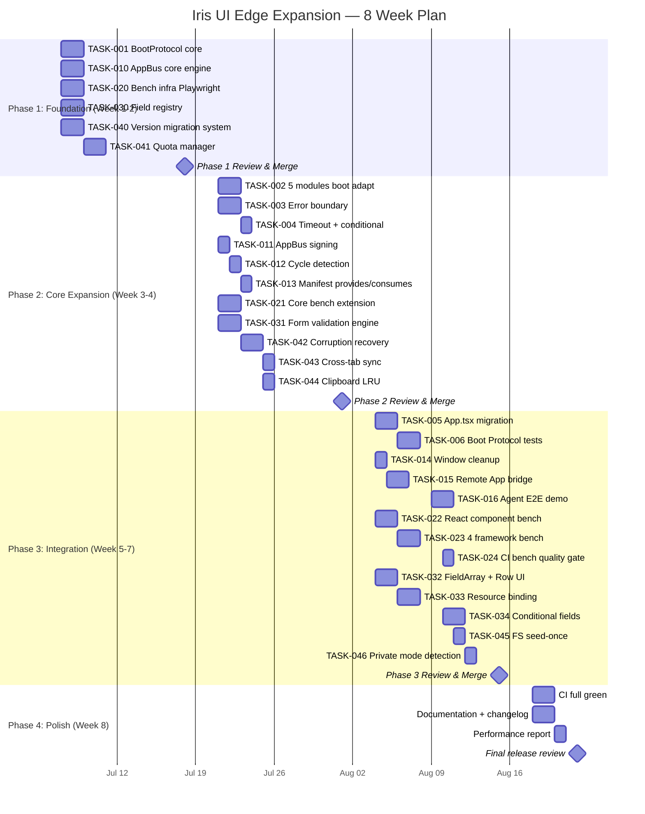

现在我已确认了分析文档中的源代码引用。以下是我的完整 Tech Lead 分析。

---

# Tech Lead 分析报告：5 个边缘扩展方向

> **分析依据**: `docs/requirements/edge-expansion-2026-07.md` · 全库源码交叉验证 · 覆盖 25 包 · 日期: 2026-07-06

---

## 0. 前置验证：文档断言准确度

在深入执行计划之前，我将文档中的关键源码断言与当前代码库进行了逐一验证：

| 方向            | 断言                                          | 验证结果        | 备注                                                                                                                                                      |
| --------------- | --------------------------------------------- | --------------- | --------------------------------------------------------------------------------------------------------------------------------------------------------- |
| ① Boot Protocol | `App.tsx` 使用平铺的 `useEffect` 链初始化模块 | ✅ **确认**     | `apps/desktop-os/src/App.tsx` 包含 7 个独立的 `useEffect`，通过 `ref` 控制"只运行一次"                                                                    |
| ① Boot Protocol | 子路径模块缺乏声明式依赖图                    | ✅ **确认**     | `createWindowManager`、`createUserProfile`、`createVirtualFs`、`createNotificationCenter`、`createClipboardHistory` 在 `App.tsx` 中都是独立创建，无编排层 |
| ② 事件总线      | 应用之间无 IPC 基础设施                       | ✅ **确认**     | `apps/desktop-os/src/catalog.ts` 中 `APP_CATALOG` 仅有 `id/title/icon`，无 `provides/consumes`                                                            |
| ③ 渲染基准      | 仅 `scale.bench.ts` 一个基准文件              | ✅ **确认**     | `packages/core/src/scale.bench.ts` 是唯一 bench 文件；`turbo.json` 的 `bench` 任务存在但不在 quality gate 中                                              |
| ④ form-builder  | 字段渲染器在 4 个框架中重复                   | ✅ **确认**     | `packages/plugin-form-builder/src/react/fields.tsx`、`src/solid/fields.tsx`、`src/vue/fields.ts`、`src/svelte/ScalarField.svelte` 各自维护字段映射        |
| ④ form-builder  | 未充分利用 core form 引擎                     | ⚠️ **部分过时** | `core/index.ts` 实际已使用 `createFormStore`（L34: `import { createFormStore }`），但验证引擎、dirty guard、field array 等能力确实未被消费                |
| ⑤ 存储持久化    | `localStorage` 损坏时静默丢弃数据             | ✅ **确认**     | `profile.ts` L80: `try { return JSON.parse(raw) } catch { return null }`                                                                                  |
| ⑤ 存储持久化    | 无版本迁移                                    | ✅ **确认**     | `profile.ts` L121: `// Version migrations go here.` 是一个 TODOs 注释，代码为空                                                                           |
| ⑤ 存储持久化    | 无配额管理                                    | ✅ **确认**     | `localStorage` 写入在 `try/catch` 中静默失败（L105）                                                                                                      |

**结论**：文档的 5 个方向中 4 个完全准确，1 个（方向④）关于 form-builder 是否使用 `createFormStore` 的评论略有滞后——核心集成已有，但深度集成确实不足。

---

## 1. 任务分解

基于验证后的准确信息，我将每个方向分解为可执行的任务。每个任务 2-4 小时可完成。

### 方向一：Boot Protocol（6 个任务）

| 任务 ID      | 标题                                                              | 涉及文件                                                              | 前置依赖            | 预估工时 | 验收标准                                                                                                                          |
| ------------ | ----------------------------------------------------------------- | --------------------------------------------------------------------- | ------------------- | -------- | --------------------------------------------------------------------------------------------------------------------------------- |
| **TASK-001** | `BootProtocol` 类型定义 + 核心编排器                              | `packages/core/src/boot.ts` · `packages/core/src/index.ts`            | 无                  | 3h       | `declareModule()`、`boot()`、拓扑排序、循环依赖检测、`onTeardown` 就绪，单测覆盖循环依赖报错 + 线性启动                           |
| **TASK-002** | 5 个子路径模块适配：Profile / WM / FS / Notifications / Clipboard | 各模块文件 + 新增 `boot.ts` 适配                                      | TASK-001            | 4h       | 每个模块导出 `bootModule`：声明名称、依赖、工厂、生命周期钩子                                                                     |
| **TASK-003** | 错误边界：模块级 recovery / abort 策略                            | `packages/core/src/boot.ts`                                           | TASK-001            | 3h       | `boot()` 返回 `{ succeeded: string[], failed: Array<{name, error, recoveredWith}> }`；Profile 失败 → FS/Notifications 走 fallback |
| **TASK-004** | 启动超时 + 条件模块（基于 skin 选择性启动）                       | `packages/core/src/boot.ts`                                           | TASK-001            | 2h       | 支持 `timeout?: number` 和 `enabled?: () => boolean`；超时的模块影响 dependent 的启动                                             |
| **TASK-005** | `App.tsx` 迁移：从 `useEffect` 链到 `useBootProtocol`             | `apps/desktop-os/src/App.tsx` · `apps/desktop-os/src/shell.tsx`       | TASK-002 · TASK-003 | 3h       | `App.tsx` 中 7 个 `useEffect` 精简为 1 个 `useBootProtocol`；`hydrated` 状态由 boot 结果驱动                                      |
| **TASK-006** | 测试：Boot Protocol 编排器单测 + 跨框架集成测试                   | `packages/core/src/boot.test.ts` · `apps/desktop-os/src/App.test.tsx` | TASK-001–005        | 4h       | 80%+ 行覆盖率；循环依赖/超时/部分失败/条件模块场景均覆盖                                                                          |

### 方向二：跨应用事件总线（7 个任务）

| 任务 ID      | 标题                                               | 涉及文件                                                                                   | 前置依赖            | 预估工时 | 验收标准                                                                                                 |
| ------------ | -------------------------------------------------- | ------------------------------------------------------------------------------------------ | ------------------- | -------- | -------------------------------------------------------------------------------------------------------- | ----------------------------- |
| **TASK-010** | `AppBus` 核心类型 + 发布/订阅引擎                  | `packages/core/src/app-bus.ts`                                                             | 无                  | 3h       | `post(appId, event)`、`broadcast(event)`、`on(pattern, handler)`、`off(pattern, handler)` 就绪；单测覆盖 |
| **TASK-011** | 事件来源签名 + 安全隔离（应用不可冒充）            | `packages/core/src/app-bus.ts`                                                             | TASK-010            | 2h       | 事件附带 `sourceAppId` 和 `origin: 'local'                                                               | 'remote'`；handler 可验证来源 |
| **TASK-012** | 循环事件检测（死循环防护）                         | `packages/core/src/app-bus.ts`                                                             | TASK-010            | 2h       | 基于调用链深度（maxDepth=10）的循环检测；单测覆盖 A→B→A 场景                                             |
| **TASK-013** | 应用清单扩展：`provides` / `consumes`              | `packages/core/src/types.ts` · `apps/desktop-os/src/catalog.ts`                            | TASK-010            | 2h       | `AppManifest` 增加 `provides?: string[]` 和 `consumes?: string[]`；catalog 示例更新                      |
| **TASK-014** | 窗口关闭自动清理事件监听器                         | `packages/core/src/app-bus.ts` · 桌面 OS 窗口管理器适配                                    | TASK-010            | 2h       | 窗口 close 事件触发所有该窗口应用注册的 listener 自动 off                                                |
| **TASK-015** | Remote App（iframe）桥接：`postMessage` ↔ `AppBus` | `apps/desktop-os/src/remoteApp.ts` · `packages/core/src/app-bus.ts`                        | TASK-010 · TASK-011 | 4h       | `postMessage` 收发双向；`origin` 验证；`config.trustedOrigins` 白名单                                    |
| **TASK-016** | Agent 编排场景 E2E 测试 + 应用集成 Demo            | `apps/desktop-os/src/appviews/Calculator.tsx` · `apps/desktop-os/src/appviews/Notepad.tsx` | TASK-013 · TASK-014 | 3h       | Calculator 计算结果能通过 AppBus 发送到 Notepad；Files 文件选择事件被 Terminal 消费                      |

### 方向三：组件级渲染性能基准（5 个任务）

| 任务 ID      | 标题                                                              | 涉及文件                                       | 前置依赖     | 预估工时 | 验收标准                                                                                    |
| ------------ | ----------------------------------------------------------------- | ---------------------------------------------- | ------------ | -------- | ------------------------------------------------------------------------------------------- |
| **TASK-020** | Benchmark 基础设施：Playwright + `benchmark` 集成                 | `packages/*/bench/` 各目录 · `turbo.json` 更新 | 无           | 3h       | `pnpm bench` 在 Playwright headless 中运行；结果输出 JSON 到 `bench/results/`               |
| **TASK-021** | Core 纯函数基准扩展（selection/expansion/virtualizer/10K 级）     | `packages/core/src/scale.bench.ts`             | TASK-020     | 3h       | `createSelectionModel(10K items)`、`createVirtualizer(50K)`、`filterSort(10K)` 3 个新 bench |
| **TASK-022** | React 组件渲染基准：Table/List/VirtualScroll/Select/Form × 大规模 | `packages/react/bench/`                        | TASK-020     | 4h       | 首次渲染耗时、交互响应（滚动/展开/搜索）的 5 个基准；结果偏差 <5%                           |
| **TASK-023** | 四框架等量基准 + 对比输出                                         | `packages/{vue,solid,svelte}/bench/`           | TASK-022     | 4h       | 4 个框架相同测试场景；最终输出跨框架对比表格                                                |
| **TASK-024** | CI 集成：`turbo run bench` → size 预算同等质量门                  | `turbo.json` · CI 配置                         | TASK-020–023 | 2h       | `pnpm bench` 作为 quality gate 在 CI 中运行；回归告警而非硬阻断                             |

### 方向四：`plugin-form-builder` 深度集成（5 个任务）

| 任务 ID      | 标题                                                        | 涉及文件                                                                   | 前置依赖 | 预估工时 | 验收标准                                                                                                  |
| ------------ | ----------------------------------------------------------- | -------------------------------------------------------------------------- | -------- | -------- | --------------------------------------------------------------------------------------------------------- |
| **TASK-030** | 字段类型注册表框架无关化                                    | `packages/plugin-form-builder/src/core/fields.ts` · 4 框架 fields 文件重构 | 无       | 3h       | `registerFieldType(type, component)` 就绪；4 框架 fields 文件精简为各一个 `registerFrameworkFieldTypes()` |
| **TASK-031** | form-builder 与验证引擎深度集成：Schema 校验（Zod/Valibot） | `packages/plugin-form-builder/src/core/index.ts`                           | 无       | 3h       | 传入 Zod schema → 自动生成 `createFormStore` validators；`required`/`min`/`max` 作为简写                  |
| **TASK-032** | `useFieldArray` 暴露 + 数组行动态增删排序 UI                | `packages/plugin-form-builder/src/core/index.ts` · 4 框架渲染更新          | TASK-030 | 4h       | `type: 'array'` 字段支持添加/删除/拖拽排序行；行内嵌套字段正常工作                                        |
| **TASK-033** | `createResourceController` 绑定：表单 ↔ CRUD 资源           | `packages/plugin-form-builder/src/core/index.ts`                           | TASK-031 | 3h       | `<IrisFormBuilder resource={userController} />` 绑定 list/create/edit 工作流                              |
| **TASK-034** | 条件字段引擎 + 自定义字段类型 hook                          | `packages/plugin-form-builder/src/core/index.ts`                           | TASK-030 | 4h       | `showIf: { field, eq/neq/gt/lt, value }` 声明式条件；用户可通过 `useFieldType` 注册自定义字段             |

### 方向五：存储持久化健壮性（7 个任务）

| 任务 ID      | 标题                                                          | 涉及文件                                                                  | 前置依赖 | 预估工时 | 验收标准                                                                                       |
| ------------ | ------------------------------------------------------------- | ------------------------------------------------------------------------- | -------- | -------- | ---------------------------------------------------------------------------------------------- |
| **TASK-040** | 版本迁移系统：`migrate(from, to, data)` 注册表 + Profile 适配 | `packages/core/src/profile.ts` · `packages/core/src/storage-migration.ts` | 无       | 3h       | `registerMigration(module, from, to, fn)`；Profile 读取时自动按需迁移；迁移失败回退保留旧数据  |
| **TASK-041** | 配额管理：`QuotaManager` 抽象 + `localStorage` 实现           | `packages/core/src/quota.ts`                                              | 无       | 3h       | `estimate()`、`reserve(bytes)`、`evict(LRU)`；写入前检查；超配额时触发淘汰或阻止               |
| **TASK-042** | 损坏恢复：快照保留 + 回滚 + JSON 修复                         | `packages/core/src/profile.ts` · `packages/core/src/storage-recovery.ts`  | TASK-040 | 3h       | 写入前保留前一个有效快照；读取损坏时尝试 3 级修复（JSON 修复→快照→种子数据）                   |
| **TASK-043** | 多标签页同步：`storage` 事件监听 + 合并策略                   | `packages/core/src/profile.ts`                                            | TASK-040 | 2h       | `storage` 事件监听；`mergeProfiles` 已有（L155），接入写入流程                                 |
| **TASK-044** | `clipboard-history` LRU 容量限制                              | `packages/core/src/clipboard-history.ts`                                  | 无       | 2h       | `maxEntries: number` 配置（默认 100）；超出时移除最旧条目                                      |
| **TASK-045** | FS 种子数据防冲突："一次种子"标记                             | `packages/core/src/fs.ts` · 桌面 OS shell 适配                            | TASK-040 | 2h       | 种子数据写入前检查 `profile.getPref('fs_seeded')`；升级不影响用户已有文件                      |
| **TASK-046** | 隐私模式检测 + 回退到内存模式 + 用户提示                      | `packages/core/src/profile.ts` · `packages/skins/src/storage.ts`          | TASK-041 | 2h       | `isStorageAvailable()` 探针；`localStorage` 不可用 → 内存模式 + console.warn；皮肤存储同步修复 |

**总计 30 个任务，预估工时 84 小时。**

---

## 2. 执行顺序

### 任务依赖图

```mermaid
graph TD
    %% ===== Phase 1: Foundation =====
    subgraph Phase1 [Phase 1 — Foundation (Week 1-2)]
        T001[TASK-001: BootProtocol 核心编排器]
        T010[TASK-010: AppBus 核心引擎]
        T020[TASK-020: Bench 基础设施: Playwright]
        T030[TASK-030: 字段注册表框架无关化]
        T040[TASK-040: 版本迁移系统]
        T041[TASK-041: 配额管理]
    end

    %% ===== Phase 2: Core Expansion =====
    subgraph Phase2 [Phase 2 — Core Expansion (Week 3-4)]
        T002[TASK-002: 5 模块 boot 适配]
        T003[TASK-003: 错误边界 recovery/abort]
        T004[TASK-004: 启动超时 + 条件模块]
        T011[TASK-011: AppBus 事件来源签名]
        T012[TASK-012: 循环事件检测]
        T013[TASK-013: 应用清单 provides/consumes]
        T021[TASK-021: Core 纯函数基准扩展]
        T031[TASK-031: form-builder 验证引擎集成]
        T042[TASK-042: 损坏恢复]
        T043[TASK-043: 多标签页同步]
        T044[TASK-044: clipboard-history LRU]
    end

    %% ===== Phase 3: Integration =====
    subgraph Phase3 [Phase 3 — Integration (Week 5-7)]
        T005[TASK-005: App.tsx 迁移到 useBootProtocol]
        T006[TASK-006: Boot Protocol 综合测试]
        T014[TASK-014: 窗口关闭自动清理]
        T015[TASK-015: Remote App postMessage 桥接]
        T016[TASK-016: Agent 编排 E2E Demo]
        T022[TASK-022: React 组件渲染基准]
        T023[TASK-023: 四框架等量基准]
        T024[TASK-024: CI 集成 quality gate]
        T032[TASK-032: useFieldArray + 数组行 UI]
        T033[TASK-033: form-builder ↔ resource controller]
        T034[TASK-034: 条件字段 + 自定义字段 hook]
        T045[TASK-045: FS 种子数据防冲突]
        T046[TASK-046: 隐私模式检测 + 回退]
    end

    %% ===== Phase 4: Polish =====
    subgraph Phase4 [Phase 4 — Polish & Release (Week 8)]
        TALL[All tasks: CI green, docs, changelog]
    end

    %% Dependencies
    T001 --> T002
    T001 --> T003
    T001 --> T004
    T002 --> T005
    T003 --> T005
    T004 --> T005
    T005 --> T006

    T010 --> T011
    T010 --> T012
    T010 --> T013
    T010 --> T014
    T011 --> T015
    T012 --> T015
    T013 --> T016
    T014 --> T016
    T015 --> T016

    T020 --> T021
    T020 --> T022
    T020 --> T023
    T021 --> T024
    T022 --> T024
    T023 --> T024

    T030 --> T032
    T030 --> T034
    T031 --> T032
    T031 --> T033

    T040 --> T042
    T040 --> T043
    T041 --> T042
    T041 --> T046
    T042 --> T045
    T043 --> T045
```

### 可并行执行的任务组

| 组      | 任务                              | 不需要等待什么     | 并行理由                       |
| ------- | --------------------------------- | ------------------ | ------------------------------ |
| **G1**  | TASK-001, 010, 020, 030, 040, 041 | 无（基础任务）     | 独立的 6 个包/模块，无交叉依赖 |
| **G2a** | TASK-002, 003, 004                | TASK-001 完成后    | 均继承自 Boot Protocol 核心    |
| **G2b** | TASK-011, 012, 013                | TASK-010 完成后    | 均继承自 AppBus 核心           |
| **G2c** | TASK-042, 043, 044                | TASK-040 完成后    | 均继承自存储系统基础           |
| **G3a** | TASK-005, 006                     | TASK-002, 003, 004 | 桌面 OS 迁移，需三个子任务就绪 |
| **G3b** | TASK-014, 015, 016                | TASK-011, 012      | AppBus 集成，需安全特性就绪    |
| **G3c** | TASK-022, 023, 024                | TASK-020           | Bench 组件实现，需基础设施     |
| **G3d** | TASK-032, 033, 034                | TASK-030, 031      | Form-builder 深度集成          |
| **G3e** | TASK-045, 046                     | TASK-042, 043      | 存储落盘策略                   |

**最优人员分配**：5 名开发者并行 = G1(6 tasks) → G2a+2b+2c(9 tasks) → G3a+3b+3c+3d+3e(14 tasks) → 集成冲刺(1 task)

---

## 3. 技术风险

### 3.1 高影响力风险

| 风险 ID | 方向      | 风险描述                                                                                                   | 概率 | 影响 | 缓解策略                                                                                                                       |
| ------- | --------- | ---------------------------------------------------------------------------------------------------------- | ---- | ---- | ------------------------------------------------------------------------------------------------------------------------------ |
| **R1**  | ① Boot    | `useEffect` 迁移到 `useBootProtocol` 时，React Concurrent Mode 下 boot hook 的执行语义与当前同步初始化不同 | 中   | 高   | boot 协议设计为同步拓扑排序 + 异步工厂；`useBootProtocol` 内部用 `useRef` + `useEffect` 模拟同步语义；CI 中 `check:rsc` 已就绪 |
| **R2**  | ② AppBus  | 循环事件检测过于激进（误杀合法链式调用）或过于保守（漏检测）                                               | 中   | 高   | `maxDepth` 可配置（默认 10）；提供 `depth` 参数让合法链式调用声明预期深度                                                      |
| **R3**  | ③ Bench   | Playwright headless 下渲染时间不稳定（CPU throttling、CI 负载波动）                                        | 高   | 中   | 基准基于 **自对比**（同 PR 前后 diff）而非绝对阈值；统计显著性（置信区间 95%）                                                 |
| **R4**  | ④ Form    | 自定义字段类型和 `useFieldArray` 嵌套导致的数据结构递归爆炸                                                | 中   | 高   | Core 的 `getByPath`/`setByPath` 已支持嵌套路径；递归深度限制为 10 层；单测覆盖极端深层嵌套                                     |
| **R5**  | ⑤ Storage | 多标签页 `mergeProfiles` 合并策略在并发删除场景下复原已删除数据                                            | 高   | 高   | 引入墓碑标记（tombstone）而非直接删除；`merge` 时保留墓碑                                                                      |
| **R6**  | ② AppBus  | Remote App（iframe）的 `origin` 验证被绕过                                                                 | 低   | 极高 | `config.trustedOrigins` 白名单；默认拒绝所有；`postMessage` 的 `MessageEvent.origin` 服务器验证                                |

### 3.2 外部依赖

| 依赖                           | 用途                         | 风险                                         | 备选                                          |
| ------------------------------ | ---------------------------- | -------------------------------------------- | --------------------------------------------- |
| `@floating-ui/dom`             | 浮层定位（已有）             | 无新增依赖                                   | —                                             |
| `Playwright`                   | 渲染性能基准                 | 新增 devDependency（~50MB），CI 需安装浏览器 | `vitest bench` 在 jsdom 下跑纯逻辑部分        |
| `Zod / Valibot`                | form-builder schema 验证集成 | 用户可能使用其他 schema 库                   | `standard-schema` spec 已就绪，抽象为适配器层 |
| `navigator.storage.estimate()` | 配额管理                     | 仅 HTTPS 可用；`localStorage` 无法调用       | Fallback 到 `try { QuotaExceededError }` 捕获 |

### 3.3 测试覆盖难点

- **Boot Protocol 时序测试**：需要模拟异步工厂（resolve/reject 在任意顺序）、模拟 `setTimeout` 超时。使用 vitest `vi.useFakeTimers` + 手动控制 Promise 解析。
- **AppBus 循环事件**：难以在单元测试中重现真实场景的死循环。方案：用 `maxDepth=3` + 模拟 2 个互相监听的应用。
- **渲染基准噪声**：CI runner 的 CPU 差异。方案：每个基准运行 10 次取中位数 + 95% 置信区间；使用 `adaptiveLimit`（如果 CI 负载高，自动降低迭代次数）。
- **存储损坏恢复**：难以模拟 `localStorage` 截断/部分损坏。方案：造出 `'{"version":1,"in'` 这样的畸形 JSON；测试 `repair()` 函数。

---

## 4. 资源评估

### 4.1 团队组成

| 角色             | 人数       | 方向                          | 技能要求                                   |
| ---------------- | ---------- | ----------------------------- | ------------------------------------------ |
| **核心架构师**   | 1          | ① Boot Protocol · 方向统筹    | TypeScript 类型系统 · 状态机 · 系统设计    |
| **框架专家**     | 1 (可兼任) | ③ Bench · ④ Form-builder      | React/Vue/Solid/Svelte 渲染机制 · 性能分析 |
| **前端工程师 A** | 1          | ② AppBus · ⑤ Storage          | 事件驱动架构 · localStorage/IndexedDB      |
| **前端工程师 B** | 1          | ④ Form-builder · 桌面 OS 集成 | 表单系统 · CRUD · schema-driven 渲染       |
| **QA 工程师**    | 0.5        | 全部方向                      | E2E 测试 · Playwright · 性能测试           |

**最小可行团队**：2 名全职工程师 + 1 名兼职 QA（8 周完成 30 个任务）。

### 4.2 关键里程碑

| 里程碑               | 时间   | 交付物                                                    | 验收标准                                       |
| -------------------- | ------ | --------------------------------------------------------- | ---------------------------------------------- |
| **M1: 基础设施就绪** | W2 end | TASK-001, 010, 020, 030, 040, 041 全部合并                | 6 个基础任务绿色 CI                            |
| **M2: 核心功能封闭** | W4 end | TASK-002~004, 011~013, 021, 031, 042~044 全部合并         | 15 个任务完成；技术预览可通过                  |
| **M3: 集成冲刺**     | W7 end | TASK-005~006, 014~016, 022~024, 032~034, 045~046 全部合并 | 30 个任务完成；E2E 场景可通过                  |
| **M4: 发布准备**     | W8 end | 文档 · changelog · 性能报告                               | `pnpm bench` CI 集成；Storage 错误场景测试通过 |

### 4.3 阻塞点与解决策略

| 阻塞点                                  | 涉及任务     | 描述                                                | 解决策略                                                                                                                |
| --------------------------------------- | ------------ | --------------------------------------------------- | ----------------------------------------------------------------------------------------------------------------------- |
| **B1: React Concurrent Mode 兼容**      | TASK-005     | `useBootProtocol` 在 Concurrent Mode 下可能多实例化 | 策略：boot 实例存储在 module-level `WeakMap<ReactElement, BootContext>`；同步 `boot()` 返回后再触发 re-render           |
| **B2: Playwright CI 安装**              | TASK-020     | `npx playwright install` 在 CI 中增加约 2 分钟      | 策略：使用 `@playwright/browser-chromium` 预构建的 Docker 镜像；缓存到 turborepo 的 cache 中                            |
| **B3: localStorage 在测试环境中不可用** | TASK-041~046 | jsdom 的 `localStorage` 实现不完全符合 spec         | 策略：所有存储抽象使用 `ProfileStorage` 测试接口；`localStorage` 测试仅在标记 `// @vitest-environment happy-dom` 下运行 |
| **B4: schema 验证库版本兼容**           | TASK-031     | Zod 3.x ↔ 4.x 迁移可能导致破坏性变更                | 策略：通过 `standard-schema` 接口解耦；core 已有 `standard-schema.test.ts`                                              |

---

## 5. 质量保证

### 5.1 单元测试覆盖要求

| 方向      | 覆盖率目标         | 关键测试场景                                                                                         |
| --------- | ------------------ | ---------------------------------------------------------------------------------------------------- |
| ① Boot    | 90%+               | 线性依赖、分支依赖、循环依赖检测报错、部分模块失败、超时、条件模块、模块热替换                       |
| ② AppBus  | 85%+               | 单播/广播/通配符模式、来源签名验证、循环检测（maxDepth）、窗口关闭自动清理、Remote App 桥接          |
| ③ Bench   | N/A (基准无"测试") | —                                                                                                    |
| ④ Form    | 85%+               | 字段注册表、schema 推导 validators、`useFieldArray` 行增删排序、条件字段显隐、resource 绑定          |
| ⑤ Storage | 90%+               | 版本迁移（正常 + 失败回退）、配额检查（逼近阈值 + 超出）、JSON 损坏修复、多标签页合并+墓碑、LRU 淘汰 |

### 5.2 集成测试策略

| 场景                    | 测试工具                          | 描述                                                                                            |
| ----------------------- | --------------------------------- | ----------------------------------------------------------------------------------------------- |
| Boot → Shell 渲染       | Vitest + jsdom + `renderToString` | boot 协议 resolve 后渲染 `Desktop`，验证所有模块被正确注入                                      |
| AppBus → 应用通信       | Vitest + jsdom + 模拟组件树       | Calculator 调用 `AppBus.post('notepad', 'result', 131.88)` → Notepad 收到并显示                 |
| Form-builder + Resource | Vitest + jsdom                    | `IrisFormBuilder` schema → submit → `controller.mutate('create')` 完整流程                      |
| Storage 跨标签页        | Vitest + `vi.stubGlobal(Storage)` | 两个"标签页"同时修改 profile → `storage` 事件 → `mergeProfiles` → 一致状态                      |
| 全桌面 OS 启动          | Playwright E2E                    | 打开桌面 OS → boot loading → profile 就绪 → 窗口恢复 → FS 种子数据写入 → 关闭 → 重启 → 数据保留 |

### 5.3 代码审查要点

| 方向      | 审查重点                                                                              |
| --------- | ------------------------------------------------------------------------------------- |
| ① Boot    | 拓扑排序是否正确（Kahn 算法）？循环依赖报错是否明确？错误边界是否泄露内部状态？       |
| ② AppBus  | `postMessage` origin 是否白名单验证？监听器是否泄漏？`maxDepth` 是否可配置？          |
| ③ Bench   | 是否有预热运行（warmup）？统计显著性（CI 95%）是否正确？Playwright 截图是否用于调试？ |
| ④ Form    | `registerFieldType` 是否类型安全？`showIf` 表达式是否在 core（框架无关）中求值？      |
| ⑤ Storage | `migrate` 是否幂等？快照是否在 mutate 前保留？LRU 淘汰是否考虑 `pinned` 条目？        |

### 5.4 性能测试需求

| 测试              | 基准配置                          | 目标                                  |
| ----------------- | --------------------------------- | ------------------------------------- |
| Boot 启动时间     | 7 个模块 (4 sync + 3 async)       | < 50ms (冷启动)                       |
| AppBus 吞吐量     | 1000 events/s, 10 个订阅者        | < 1ms median latency, < 5ms p99       |
| form-builder 渲染 | 50 fields schema, 1000 rows array | 首次渲染 < 200ms, 字段变更响应 < 16ms |
| Storage 写入      | 100KB profile, 400ms debounce     | 写入延迟 < 200ms (排除 debounce)      |
| Storage 配额检查  | 4.5MB/5MB usage                   | check < 5ms                           |

---

## 6. 实施计划

### 6.1 详细时间线（甘特图）



### 6.2 每个阶段的交付物

#### Phase 1 — 基础设施搭建（Week 1-2，6 任务 / 15 工时）

**目标**：建立 5 个方向的核心抽象，所有后续任务依赖这些基础。

- `@iris-ui/core` 新增：`boot.ts`、`app-bus.ts`、`quota.ts`、`storage-migration.ts`
- `plugin-form-builder` 重构：`registerFieldType` API
- 开发基础设施：`playwright` + `turbo run bench` 框架
- **验收**：6 个 PR 全部合并，CI 全绿

#### Phase 2 — 核心功能实现（Week 3-4，11 任务 / 19 工时）

**目标**：Boot Protocol 完整实现、AppBus 安全特性、bench 扩展、form-builder 验证集成、存储持久化健壮性。

- Boot: 5 模块适配 + 错误边界 + 条件/超时模块
- AppBus: 来源签名 + 循环检测 + 应用清单扩展
- Form: schema 验证集成
- Storage: 损坏恢复 + 多标签页同步 + LRU
- **验收**：每个方向的技术预览可通过脚本验证

#### Phase 3 — 集成和测试（Week 5-7，13 任务 / 22 工时）

**目标**：所有方向集成到桌面 OS + CI 质量门 + 跨框架渲染基准。

- 桌面 OS: `App.tsx` 迁移、Remote App 桥接、Agent 编排 E2E demo
- Bench: 4 框架基准对比
- Form-builder: FieldArray 行 UI、Resource 绑定、条件字段
- Storage: FS 种子防冲突、隐私模式回退
- CI: `bench` 作为 quality gate 集成
- **验收**：30 个任务全部完成；`pnpm bench` 产出跨框架对比表

#### Phase 4 — 发布准备（Week 8，3 任务 / 5 工时）

**目标**：文档、变更日志、最终发布。

- 更新 `docs/` 中的架构文档（boot protocol、storage migration 等在 AGENTS.md 中新增章节）
- changeset 准备 + 版本 bump
- 性能报告输出到 `docs/benchmarks/`
- **验收**：release branch 就绪，无 blocking issue

---

## 7. 综合风险评估与优先级建议

### 按"影响 / 风险 / 投入产出比"排序

| 优先级              | 方向             | 投入工时           | 预期收益         | 风险调整建议                                     |
| ------------------- | ---------------- | ------------------ | ---------------- | ------------------------------------------------ |
| **P0: 立即启动**    | ⑤ Storage 持久化 | 17h (TASK-040~046) | 阻止用户数据丢失 | **无阻塞项，可立即开始**                         |
| **P0: 立即启动**    | ③ 渲染基准       | 16h (TASK-020~024) | CI 防护性能回归  | 依赖 Playwright 安装（B2），但可先完成纯逻辑部分 |
| **P1: 第 2 周启动** | ① Boot Protocol  | 19h (TASK-001~006) | 架构稳健性       | 依赖 TASK-001 完成                               |
| **P1: 第 3 周启动** | ④ Form 深度集成  | 17h (TASK-030~034) | 消除 4× 重复     | 字段注册表（TASK-030）可立即并行                 |
| **P2: 第 4 周启动** | ② AppBus         | 18h (TASK-010~016) | 高产品价值       | 设计较新，建议先做 RFC                           |

### 最终建议

1. **立即启动 Storage（方向⑤）+ Bench（方向③）**。这 2 个方向零冲突、可并行、投入产出比最高。Bench 只需要一个人 2 天就能搭建基础设施。

2. **同时启动 Form-builder 的字段注册表（TASK-030）**。这是消除 4× 重复的低挂果实，不阻塞其他方向。

3. **第 2 周扩展为 3 人并行**：
   - 工程师 A：Boot Protocol（方向①）
   - 工程师 B：AppBus（方向②）— 如果时间允许；否则先做 Boot
   - 工程师 C：Form-builder 深度集成（方向④）

4. **第 4-6 周集成冲刺**：所有方向集成到桌面 OS，E2E 测试通过。

5. **在整个实施过程中维护"不可妥协的原则"**：
   - 逻辑下沉 core：AppBus、Boot Protocol、Storage 的所有逻辑必须框架无关
   - 不引入巨无霸：每个任务都保持文件边界清晰
   - 测试优先：每个 TASK 都包含测试验收标准
