现在我已拥有完整图景。以下是 Tech Lead 分析。

---

# Tech Lead 分析：Iris UI 深层架构缺口

> **文档**：`docs/requirements/novel-gaps-2026-07.md`
> **分析者**：Tech Lead
> **日期**：2026-07-06

---

## 执行摘要

分析文档识别了 5 个方向。关键发现之一是：**方向②（`createStore` 选择器订阅）基础设施已存在，但采用率为零**——核心 `createStore` 已有 `subscribeWith`，所有四个适配器已有 `useStoreSelector`/`toStoreSelector`，但大约有 60 个组件仍然使用盲订阅（`useStore`），仅 2 个（在 Svelte 中）使用选择器。这将该方向从功能工作转变为一次审核/重构任务。

最紧急的是**方向③（验证竞态条件）**——这是一个真实的、可重现的时序漏洞，且源码中无 `AbortSignal` 支持。方向①和②是基线质量投资，方向④和⑤是面向产品的改进。

**建议阶段安排**：P0（现在）= 方向③；P1（发布前）= 方向① + ②；P2（发布后）= 方向④ + ⑤。

---

## 1. 任务分解

### 方向①：合同系统覆盖缺口

| 任务 ID  | 标题                                                         | 涉及文件                                                                                                                          | 前置依赖                 | 预估工时 | 验收标准                                                                                                             |
| -------- | ------------------------------------------------------------ | --------------------------------------------------------------------------------------------------------------------------------- | ------------------------ | -------- | -------------------------------------------------------------------------------------------------------------------- |
| TASK-001 | 为所有浮层添加 Portal 模式合同变体                           | `packages/core/src/contracts/scenarios/{dialog,popover,drawer,...}.ts`，各框架 `contracts.test.ts`，`ContractDriver` 类型         | 无                       | 8h       | 所有浮层合同在 `portalTarget={false}` 和 `portalTarget={document.body}` 两种变体下均通过；CI 中合同运行时间 < 3 分钟 |
| TASK-002 | 创建 Focus Lifecycle 合同（Playwright）                      | `packages/core/src/contracts/scenarios/overlay-focus.ts`，`packages/core/src/contracts/runner.ts`（扩展），各框架 `e2e/*.spec.ts` | TASK-001（共享浮层设置） | 12h      | Dialog/Popover/Drawer 的焦点捕获、恢复和初始放置断言在 Playwright（headless Chrome）中运行                           |
| TASK-003 | 为高优先级组件增加错误状态合同                               | `packages/core/src/contracts/scenarios/{input,textarea,combobox,select}-error.ts`                                                 | 无                       | 6h       | Input/Select/Combobox 在 4 个框架中都有"显示错误→清除错误"合同场景                                                   |
| TASK-004 | 为 Input + Textarea 创建跨框架合同                           | `packages/core/src/contracts/scenarios/{input,textarea}.ts`，所有 `contracts.test.ts`                                             | 无                       | 6h       | 在 Input 和 Textarea 中，`aria-describedby`、`data-invalid`、`aria-errormessage` 在 4 个适配器间一致                 |
| TASK-005 | 为 Behaviors（Resizable/Movable/ClickOutside）创建跨框架合同 | `packages/core/src/contracts/scenarios/{resizable,movable,click-outside}.ts`                                                      | 无                       | 8h       | 每个 Behavior 有一个覆盖交互 + DOM 断言的场景，在 4 个框架中执行                                                     |
| TASK-006 | 为 AdminLayout + NavMenu 创建跨框架合同                      | `packages/core/src/contracts/scenarios/{admin-layout,nav-menu}.ts`                                                                | 无                       | 6h       | NavMenu 展开/折叠、选中键、管理布局结构在 4 个框架中一致                                                             |
| TASK-007 | 为子路径模块创建跨框架集成合同                               | `packages/core/src/contracts/scenarios/{profile,fs,window}.ts`                                                                    | 无                       | 10h      | Profile/FS/Window 在一个适配器中写入状态，在另一个适配器中通过共享 store 读取                                        |
| TASK-008 | 合同覆盖率门控 + 元数据成熟度模型                            | `packages/core/src/contracts/types.ts`，`packages/manifest/src/contract-coverage.ts`                                              | TASK-001 → 007           | 4h       | 每个合同场景必须标记 `happy-path`/`error-state`/`edge-case`；覆盖率按标记分组报告                                    |
| TASK-009 | 合同运行时间预算 + CI 优化                                   | `.github/workflows/ci.yml`，合同执行基础设施                                                                                      | TASK-001                 | 3h       | 全部合同在 CI 中 < 3 分钟；并行化适配器运行                                                                          |

**方向①总计：63 小时**

### 方向②：`createStore` 选择器级订阅采用

| 任务 ID  | 标题                                                                 | 涉及文件                                                                        | 前置依赖 | 预估工时 | 验收标准                                                                                       |
| -------- | -------------------------------------------------------------------- | ------------------------------------------------------------------------------- | -------- | -------- | ---------------------------------------------------------------------------------------------- |
| TASK-010 | 审核所有 `useStore` 使用点并排序以迁移到选择器                       | 所有框架的 `*-audit-report.md`                                                  | 无       | 4h       | 按性能影响（store 更新频率 × 消费者数量）列出每个使用点并排序；P0：Table、Form、Selection 模型 |
| TASK-011 | 将 React 组件从 `useStore` 迁移到 `useStoreSelector`                 | `packages/react/src/primitives/{table,form,list,accordion,segmented,radio,...}` | TASK-010 | 10h      | 28 个 `useStore()` 中至少 20 个替换为等价选择器；每个组件渲染测试通过                          |
| TASK-012 | 将 Solid 组件从 `useStore` 迁移到 `useStoreSelector`                 | `packages/solid/src/primitives/{table,form,list,accordion,...}`                 | TASK-010 | 8h       | 19 个 `useStore()` 中至少 15 个替换                                                            |
| TASK-013 | 将 Svelte 组件从 `toStore` 迁移到 `toStoreSelector`                  | `packages/svelte/src/primitives/{table,form,list,...}`                          | TASK-010 | 6h       | 13 个 `toStore()` 中至少 10 个替换                                                             |
| TASK-014 | 将 Vue 组件从 `useStore` 迁移到 `useStoreSelector`                   | `packages/vue/src/primitives/{table,form,list,...}`                             | TASK-010 | 3h       | 3 个 `useStore()` 全部迁移                                                                     |
| TASK-015 | 添加选择器采用的前端性能基准                                         | `packages/bench/src/selector-bench.ts`                                          | TASK-010 | 4h       | 基准测试：基准（JS 框架原生）+ 选择器优化后；报告通知减少百分比                                |
| TASK-016 | 添加 lint 规则，当 `useStore` 返回一个对象属性仅使用一个大子集时标记 | `eslint.config.js`                                                              | TASK-010 | 3h       | ESLint 规则警告：如果组件使用 `useStore` 但仅访问 `<0.5` 的字段，则引导使用 `useStoreSelector` |

**方向②总计：38 小时**

### 方向③：`createValidationEngine` 竞态条件

| 任务 ID  | 标题                                           | 涉及文件                                                                  | 前置依赖       | 预估工时 | 验收标准                                                                                                 |
| -------- | ---------------------------------------------- | ------------------------------------------------------------------------- | -------------- | -------- | -------------------------------------------------------------------------------------------------------- |
| TASK-017 | 为 `runFieldValidator` 添加 `AbortSignal` 支持 | `packages/core/src/form/validation.ts`，`packages/core/src/form/types.ts` | 无             | 3h       | `FieldValidator<T>` 签名扩展为 `(value, values, signal?) => ...`；验证器接收可选的 `AbortSignal`         |
| TASK-018 | 在 `validateField` 中实现请求取消              | `packages/core/src/form/validation.ts`                                    | TASK-017       | 3h       | `scheduleValidate` 在发起新请求前取消之前的验证；`AbortController.abort()` 调用                          |
| TASK-019 | 为 `validateForm` 添加独立的表单级 token       | `packages/core/src/form/validation.ts`                                    | 无             | 4h       | 表单级 token 分配 + 双重检查（表单级 + 字段级），防止 `validateForm` 和 `validateField` 之间的跨路径干扰 |
| TASK-020 | 为异步验证添加超时支持                         | `packages/core/src/form/validation.ts`，`packages/core/src/form/types.ts` | TASK-017       | 3h       | 可配置超时（默认 10s）；超时后 token 失效；可选的"验证超时"回退                                          |
| TASK-021 | 在 `useForm` 中实现提交按钮防抖 + 正在提交标志 | `packages/core/src/form/useForm.ts`，所有框架的适配器桥                   | TASK-019       | 4h       | 500ms 自动防抖；正在提交标志位阻止重复提交                                                               |
| TASK-022 | 实现表单卸载清理（取消所有进行中的验证）       | `packages/core/src/form/validation.ts`，适配器的 `useForm`/`useField` 桥  | TASK-018       | 3h       | 组件卸载时调用 `invalidateAll()` + `AbortController.abort()`；不再进行过时的回调                         |
| TASK-023 | 使用 Playwright 编写 E2E 竞态测试              | `packages/core/e2e/validation-race.spec.ts`                               | TASK-017 → 022 | 8h       | 5 个测试用例覆盖不同竞态模式：快速字段切换、快速提交、提交加字段变更、`invalidateAll` 时序、验证后卸载   |

**方向③总计：28 小时**

### 方向④：`createResourceController` 错误恢复与缓存

| 任务 ID  | 标题                                                  | 涉及文件                                                                     | 前置依赖       | 预估工时 | 验收标准                                                                                                               |
| -------- | ----------------------------------------------------- | ---------------------------------------------------------------------------- | -------------- | -------- | ---------------------------------------------------------------------------------------------------------------------- |
| TASK-024 | 在 `createDataSource` 中实现请求去重                  | `packages/core/src/data-source.ts`                                           | 无             | 4h       | 并发中相同的查询（可序列化键）不重复获取；后续调用复用第一个的 Promise                                                 |
| TASK-025 | 添加内存查询缓存                                      | `packages/core/src/data-source.ts`，`packages/core/src/data-source/types.ts` | TASK-024       | 6h       | 缓存键 = `JSON.stringify(query)`；可配置 `cacheTime`（默认 30s，0 = 禁用）；LRU 最多 5 页；`mutate` 成功后清空所有缓存 |
| TASK-026 | 实现指数退避自动重试                                  | `packages/core/src/data-source.ts`，`packages/core/src/data-source/types.ts` | 无             | 5h       | 重试策略：1s → 2s → 4s → 8s，最多 3 次；仅网络错误；组件卸载时取消                                                     |
| TASK-027 | 实现 placeholder 数据模式（在加载下一页时显示旧数据） | `packages/core/src/data-source.ts`，`packages/core/src/data-source/types.ts` | TASK-025       | 4h       | `placeholderData` 从缓存返回旧页面数据 + 加载指示器；类似 TanStack Query 的 `placeholderData`                          |
| TASK-028 | 修复乐观更新中 selection/sort 的一致性                | `packages/core/src/resource.ts`                                              | 无             | 4h       | 乐观删除最后可见行 → 自动 page-1；删除已选行 → 从 selection 中移除                                                     |
| TASK-029 | 为 DataSource 添加生产级 E2E 测试                     | `packages/core/e2e/data-source-production.spec.ts`                           | TASK-024 → 028 | 6h       | 测试：快速页面切换、快速筛选输入、网络恢复、乐观更新 + 重新加载回滚                                                    |

**方向④总计：29 小时**

### 方向⑤：虚拟文件系统内存模型限制

| 任务 ID  | 标题                                              | 涉及文件                                                    | 前置依赖           | 预估工时 | 验收标准                                                                                                 |
| -------- | ------------------------------------------------- | ----------------------------------------------------------- | ------------------ | -------- | -------------------------------------------------------------------------------------------------------- | ---- | ----------- | ---------------------------------------------------------------------------- |
| TASK-030 | 添加二进制文件支持（Blob/ArrayBuffer/Uint8Array） | `packages/core/src/fs.ts`，`packages/core/src/fs/types.ts`  | 无                 | 6h       | `VfsFile = string                                                                                        | Blob | ArrayBuffer | Uint8Array`；`fs.write(path, data, mimeType?)`；`fs.readAsBlob(path) → Blob` |
| TASK-031 | 实现文件元数据系统                                | `packages/core/src/fs.ts`                                   | TASK-030           | 4h       | `fs.write` 自动记录 `modifiedAt` + `size`；`fs.stat(path) → FileStat`；`fs.list` 返回带元数据的条目      |
| TASK-032 | 增强文件系统 Watcher 以发送带类型的事件           | `packages/core/src/fs.ts`                                   | 无                 | 3h       | `fs.subscribe(listener: (event: FsEvent) => void)`；`FsEvent = { type, path, prevPath? }`                |
| TASK-033 | 为大型文件实现 IndexedDB 后端存储                 | `packages/core/src/fs/storage.ts`                           | TASK-030，TASK-031 | 10h      | 基于大小阈值自动升级：文本 + 小文件 → localStorage，大文件 + 二进制 → IndexedDB；不崩溃 `JSON.stringify` |
| TASK-034 | 添加流式读写（ReadableStream/WritableStream）     | `packages/core/src/fs.ts`，`packages/core/src/fs/stream.ts` | TASK-033           | 8h       | `fs.createReadStream(path) → ReadableStream`；`fs.createWriteStream(path) → WritableStream`              |
| TASK-035 | 添加跨标签页同步 + 文件锁                         | `packages/core/src/fs.ts`，`packages/core/src/fs/sync.ts`   | TASK-033           | 5h       | 基于 IndexedDB 的 `onversionchange` 或 `BroadcastChannel` 的跨标签页同步；写入时乐观锁定                 |
| TASK-036 | 更新 Files 应用以显示元数据并预览二进制文件       | `apps/desktop-os/src/appviews/Files.tsx` + 其他 3 个框架    | TASK-030 → 032     | 6h       | 文件大小 + 日期列；图片通过 `URL.createObjectURL` 预览                                                   |

**方向⑤总计：42 小时**

---

## 2. 执行顺序

```mermaid
graph TD
    %% Direction 1 - Contracts
    T001[TASK-001: Portal Mode Contracts] --> T002[TASK-002: Focus Lifecycle Contracts]
    T003[TASK-003: Error State Contracts] --> T008[TASK-008: Coverage Gate + Maturity Model]
    T004[TASK-004: Input/Textarea Contracts]
    T005[TASK-005: Behavior Contracts]
    T006[TASK-006: AdminLayout Contracts]
    T007[TASK-007: Subpath Module Contracts]
    T001 --> T009[TASK-009: CI Budget + Optimization]
    T003 --> T008
    T004 --> T008
    T005 --> T008
    T006 --> T008
    T007 --> T008

    %% Direction 2 - Selector Adoption
    T010[TASK-010: Audit useStore Usage] --> T011[TASK-011: React Migration]
    T010 --> T012[TASK-012: Solid Migration]
    T010 --> T013[TASK-013: Svelte Migration]
    T010 --> T014[TASK-014: Vue Migration]
    T010 --> T015[TASK-015: Selector Benchmarks]
    T010 --> T016[TASK-016: ESLint Rule]

    %% Direction 3 - Validation Race Conditions
    T017[TASK-017: AbortSignal Support] --> T018[TASK-018: Request Cancellation]
    T017 --> T020[TASK-020: Validation Timeout]
    T019[TASK-019: Form-level Token] --> T021[TASK-021: Submit Debounce]
    T018 --> T022[TASK-022: Unmount Cleanup]
    T020 --> T022
    T021 --> T022
    T017 --> T023[TASK-023: E2E Race Tests]
    T018 --> T023
    T019 --> T023
    T020 --> T023
    T021 --> T023
    T022 --> T023

    %% Direction 4 - Resource Controller
    T024[TASK-024: Request Dedup] --> T025[TASK-025: Query Cache]
    T025 --> T027[TASK-027: Placeholder Data]
    T026[TASK-026: Auto Retry]
    T028[TASK-028: Optimistic Consistency]
    T024 --> T029[TASK-029: E2E Production Tests]
    T025 --> T029
    T026 --> T029
    T027 --> T029
    T028 --> T029

    %% Direction 5 - Virtual FS
    T030[TASK-030: Binary File Support] --> T031[TASK-031: File Metadata]
    T030 --> T033[TASK-033: IndexedDB Backend]
    T031 --> T033
    T033 --> T034[TASK-034: Stream Read/Write]
    T033 --> T035[TASK-035: Cross-tab Sync]
    T032[TASK-032: Enhanced Watcher]
    T030 --> T036[TASK-036: Files App Update]
    T031 --> T036
    T032 --> T036

    %% Cross-direction dependencies
    T019 -.->|"共享 token 基础设施"| T025
    T001 -.->|"为 TASK-023 提供 Playwright 基础设施"| T023
```



### 并行执行组

| 组                    | 任务                                                                                                                                                 | 并行依据                  |
| --------------------- | ---------------------------------------------------------------------------------------------------------------------------------------------------- | ------------------------- |
| **组 A**（立即开始）  | TASK-017, TASK-019, TASK-010, TASK-001, TASK-003, TASK-004, TASK-005, TASK-006, TASK-007                                                             | 无交叉依赖；所有独立工作  |
| **组 B**（组 A 之后） | TASK-018, TASK-020, TASK-021, TASK-011, TASK-012, TASK-013, TASK-014, TASK-015, TASK-016, TASK-002, TASK-024, TASK-026, TASK-028, TASK-030, TASK-032 | 每组 A 任务完成后即可开始 |
| **组 C**（组 B 之后） | TASK-022, TASK-023, TASK-025, TASK-027, TASK-031, TASK-033                                                                                           | 需要之前组的输出          |
| **组 D**（最后）      | TASK-008, TASK-009, TASK-029, TASK-034, TASK-035, TASK-036                                                                                           | 需要所有先前任务完成      |

---

## 3. 技术风险

### 风险矩阵

| #   | 风险                                                                                    | 方向 | 概率 | 影响 | 缓解策略                                                                                                                                                                                             |
| --- | --------------------------------------------------------------------------------------- | ---- | ---- | ---- | ---------------------------------------------------------------------------------------------------------------------------------------------------------------------------------------------------- |
| R1  | **Portal 合同在 CI 中不可靠**：`document.body` portal 在 jsdom 中可能无法始终如一地渲染 | ①    | 中   | 高   | 仅对焦点生命周期使用 Playwright；portal 存在性验证在 jsdom + 超时重试中运行                                                                                                                          |
| R2  | **选择器迁移引入回归**：`useStoreSelector` 迁移中错误的 selector 闭包导致过时渲染       | ②    | 中   | 高   | 每个迁移组件添加渲染冒烟测试；使用 `Object.is` 默认相等性；对可变数据使用 `structuredClone`                                                                                                          |
| R3  | **AbortSignal 与 schema 库不兼容**：Zod/Valibot `parseAsync` 不支持取消                 | ③    | 高   | 中   | 不在 schema 层面取消；在 Iris 的 `runFieldValidator` 包装器层面取消。验证器接收 `signal`，但将其传递给底层 API（`fetch` 等）。对于 Zod 验证器，signal 已传递，但 Zod 忽略它——我们仍然得到 token 保护 |
| R4  | **竞态测试不稳定**：时序依赖的测试在 CI 中可能间歇性失败                                | ③    | 高   | 中   | 注入可配置的延迟（不是真实计时）；使用 `vi.advanceTimersByTime` + 微任务控制                                                                                                                         |
| R5  | **缓存大小爆炸**：无限制的查询缓存消耗任意内存                                          | ④    | 低   | 中   | LRU 策略，最多 5 页 + 最大 500 行；`cacheTime` 后自动逐出                                                                                                                                            |
| R6  | **IndexedDB 在 Safari 隐私模式下的配额限制**                                            | ⑤    | 中   | 高   | 优雅降级：如果 IndexedDB 不可用，回退到内存 + localStorage                                                                                                                                           |
| R7  | **Blob URL 生命周期管理**：`URL.createObjectURL` 创建的 Blob 在组件重新挂载时泄漏       | ⑤    | 中   | 中   | 在 FS 引擎层面跟踪创建的 Blob URL；`destroy()` 时释放                                                                                                                                                |
| R8  | **跨标签页 FS 同步中的写入冲突**：两个标签页写入同一文件                                | ⑤    | 低   | 高   | 乐观锁定 + 最后写入胜出；写入冲突时向用户报告                                                                                                                                                        |

### 关键依赖

| 依赖项             | 用于                                               | 降级策略                                                           |
| ------------------ | -------------------------------------------------- | ------------------------------------------------------------------ |
| `@floating-ui/dom` | 浮层合同（TASK-001、TASK-002）                     | 无——这是必需的运行时依赖                                           |
| `@playwright/test` | 焦点生命周期合同（TASK-002）、竞态测试（TASK-023） | 作为开发依赖，在 CI 基础设施中可用                                 |
| `zod` / `valibot`  | 验证器兼容性（TASK-017）                           | 不破坏——Iris 验证器正常工作，仅 `AbortSignal` 在 schema 层面被忽略 |

---

## 4. 资源评估

### 团队组成

| 角色                       | 所需人数 | 覆盖方向             | 关键技能                                                    |
| -------------------------- | -------- | -------------------- | ----------------------------------------------------------- |
| **高级前端工程师**（核心） | 2        | ① 合同系统，③ 验证   | TypeScript、测试基础设施、Playwright、跨框架调试            |
| **高级前端工程师**（性能） | 1        | ② 选择器采用         | React/Vue/Solid/Svelte 渲染性能分析、`useSyncExternalStore` |
| **全栈工程师**             | 1        | ④ 数据源缓存/重试    | CRUD 模式、TanStack Query 思维模型、请求去重                |
| **前端工程师**（桌面 OS）  | 1        | ⑤ 虚拟 FS            | IndexedDB、Blob/File API、流                                |
| **QA 工程师**              | 1        | 所有方向（E2E 测试） | Playwright、竞态测试、合同覆盖率                            |

**最佳团队规模**：4-5 人（2 人专注于方向① + ③，1 人人专注于方向②，1 人专注于方向④ + ⑤）

### 里程碑

| 里程碑                   | 截止日期 | 交付物                                                                                                    | 依赖                                   |
| ------------------------ | -------- | --------------------------------------------------------------------------------------------------------- | -------------------------------------- |
| **M1：验证引擎安全保障** | 第 3 周  | TASK-017 → TASK-022 全部完成；E2E 竞态测试（TASK-023）通过                                                | 无                                     |
| **M2：合同基线**         | 第 5 周  | Portal + 焦点 + 错误状态合同（TASK-001 → TASK-003）；Input/Textarea/Behaviors 合同（TASK-004 → TASK-005） | M1（为 TASK-023 提供 Playwright 支持） |
| **M3：选择器采用**       | 第 6 周  | 全部 4 个框架迁移（TASK-011 → TASK-014）；基准测试 + lint（TASK-015 → TASK-016）                          | 无                                     |
| **M4：数据源生产就绪**   | 第 8 周  | 缓存 + 去重 + 重试 + placeholder（TASK-024 → TASK-028）；E2E 测试通过                                     | M1（共享 token 基础设施）              |
| **M5：虚拟 FS 升级**     | 第 10 周 | 二进制 + 元数据 + IndexedDB + 流（TASK-030 → TASK-036）；Files 应用更新                                   | 无                                     |
| **M6：全覆盖门控**       | 第 11 周 | 合同成熟度模型（TASK-008）；覆盖率门控（TASK-009）                                                        | M2 + M4 + M5                           |

### 阻塞点

| 阻塞点 | 描述                                            | 解决策略                                                                                    |
| ------ | ----------------------------------------------- | ------------------------------------------------------------------------------------------- |
| **B1** | 焦点生命周期合同需要 Playwright，但 CI 中未设置 | 如果尚未配置，添加 Playwright CI 工作流；使用 `playwright.config.ts` 来自 `apps/playground` |
| **B2** | IndexedDB 在单元测试中不可用                    | 为 `packages/core/src/fs/` 添加 `fake-indexeddb` 开发依赖；用于测试                         |
| **B3** | 跨框架合同调试需要四框架专业知识                | 记录 TASK-001 → TASK-007 的适配器特定陷阱；为最常见的故障提供调试指南                       |

---

## 5. 质量保证

### 单元测试覆盖要求

| 方向         | 代码                                     | 要求                                                                                                                    |
| ------------ | ---------------------------------------- | ----------------------------------------------------------------------------------------------------------------------- |
| ① 合同系统   | `packages/core/src/contracts/`           | 新增合同：每个必须包含 `assertion-density.test.ts`（每步 >= 1 个断言）和 `contract-coverage.test.ts` 条目（4 个适配器） |
| ② 选择器采用 | 各适配器的 `useStore`/`useStoreSelector` | 保持现有测试覆盖；为迁移组件添加渲染计数测试                                                                            |
| ③ 验证       | `packages/core/src/form/validation.ts`   | 新代码行覆盖 >= 90%；必须覆盖所有 token 边界情况（`invalidateAll` 后完成、双提交、卸载后）                              |
| ④ 数据源     | `packages/core/src/data-source.ts`       | 新代码行覆盖 >= 85%；所有 4 个新特性（缓存、去重、重试、placeholder）各自有 >= 3 个测试                                 |
| ⑤ 虚拟 FS    | `packages/core/src/fs.ts` + `storage.ts` | 新代码行覆盖 >= 85%；二进制文件、元数据、watcher 事件、IndexedDB 回退                                                   |

### 集成测试策略

| 测试层                     | 工具                              | 覆盖内容                                                                     |
| -------------------------- | --------------------------------- | ---------------------------------------------------------------------------- |
| **单元测试**（同步）       | Vitest + jsdom                    | 所有核心逻辑、控制器、引擎——无框架依赖                                       |
| **合同测试**（跨框架）     | Vitest + jsdom + ContractDriver   | 跨 4 个适配器的组件行为等价性（现有模式）                                    |
| **E2E 测试**（真实浏览器） | Playwright                        | 竞态条件（TASK-023）、焦点生命周期（TASK-002）、生产级数据源场景（TASK-029） |
| **性能基准**               | Vitest bench（`packages/bench/`） | 选择器采用（TASK-015）、合同运行时间预算（TASK-009）                         |

### 代码审查要点

| 方向      | 审查重点                                                                                                                        |
| --------- | ------------------------------------------------------------------------------------------------------------------------------- |
| ① 合同    | `expect` 断言是否有意义（不仅仅是 `toBeTruthy` 或 `not.toBeNull`）？合同是否在 4 个适配器中通过？是否向 `index.ts` 添加了导出？ |
| ② 选择器  | Selector 函数是否纯且浅？`Object.is` 相等性对数据类型是否正确？是否测试了不必要渲染的减少？                                     |
| ③ 验证    | Token 比较是否正确处理所有边界情况？`AbortSignal` 是否在所有代码路径中传递？超时后进行清理？                                    |
| ④ 数据源  | 缓存键是否包含所有查询参数？重试是否区分可重试与不可重试错误？乐观回滚是否捕获所有副作用？                                      |
| ⑤ 虚拟 FS | Blob URL 是否在组件拆卸时释放？IndexedDB 不可用时是否有优雅回退？大文件存储是否分离到 IndexedDB？                               |

### 性能测试需求

| 测试             | 场景                                                                                        |
| ---------------- | ------------------------------------------------------------------------------------------- |
| **选择器基准**   | 50 行表格 → 对 1 行进行排序操作 → 测量重新渲染次数（使用 `useStore` vs `useStoreSelector`） |
| **验证基准**     | 30 字段表单 → 以 50ms 间隔快速输入 10 个字段 → 测量验证调用次数 + 最终解决时间              |
| **数据源基准**   | 快速分页（10 次/秒转换）→ 测量发出的网络请求数量（使用去重 vs 未使用）                      |
| **合同时间预算** | 测量 CI 中全部合同运行时间 → 必须 < 3 分钟                                                  |

---

## 6. 实施计划

### 阶段 1：安全 + 基线（第 1-3 周）

```
第 1 周  第 2 周  第 3 周
│        │        │
├─ TASK-017 (AbortSignal) ──────┤
├─ TASK-019 (Form-level token) ──┤
├─ TASK-010 (Audit useStore) ────┤
├─ TASK-001 (Portal contracts) ──┤
├─ TASK-004 (Input contracts) ───┤
│        │        │
         ├─ TASK-018 (Cancel) ────┤
         ├─ TASK-020 (Timeout) ────┤
         ├─ TASK-024 (Dedup) ──────┤
         │        │        │
                  ├─ TASK-021 (Submit debounce) ──┤
                  ├─ TASK-022 (Unmount cleanup) ──┤
                  │        │        │
                           ├─ TASK-023 (E2E race) ──┤
```

**交付物**：验证引擎安全 + 合同基线 + 数据源去重

### 阶段 2：覆盖 + 采用（第 4-6 周）

```
第 4 周  第 5 周  第 6 周
│        │        │
├─ TASK-002 (Focus contracts) ───┤
├─ TASK-003 (Error contracts) ───┤
├─ TASK-005 (Behavior contracts) ─┤
├─ TASK-006 (Admin contracts) ───┤
├─ TASK-007 (Subpath contracts) ──┤
│        │        │
         ├─ TASK-011 (React selector) ──────┤
         ├─ TASK-012 (Solid selector) ──────┤
         ├─ TASK-013 (Svelte selector) ─────┤
         ├─ TASK-014 (Vue selector) ────────┤
         ├─ TASK-015 (Benchmark) ───────────┤
         ├─ TASK-016 (ESLint rule) ─────────┤
         │        │        │
                  ├─ TASK-025 (Query cache) ──────────┤
                  ├─ TASK-026 (Auto retry) ────────────┤
                  ├─ TASK-028 (Optimistic consistency) ─┤
```

**交付物**：全面合同覆盖 + 全框架选择器采用 + 数据源缓存

### 阶段 3：产品特性 + 集成（第 7-10 周）

```
第 7 周  第 8 周  第 9 周  第 10 周
│        │        │        │
├─ TASK-027 (Placeholder data) ─────────┤
├─ TASK-029 (DataSource E2E) ───────────┤
├─ TASK-030 (Binary FS) ─────────────────┤
├─ TASK-032 (Enhanced watcher) ──────────┤
│        │        │        │
         ├─ TASK-031 (File metadata) ───────────┤
         ├─ TASK-033 (IndexedDB backend) ────────┤
         │        │        │        │
                  ├─ TASK-034 (Stream) ─────────────┤
                  ├─ TASK-035 (Cross-tab sync) ─────┤
                  │        │        │        │
                           ├─ TASK-036 (Files app) ────┤
```

**交付物**：生产就绪数据源 + 虚拟 FS 升级

### 阶段 4：门控 + 发布（第 11 周）

```
第 11 周
│
├─ TASK-008 (Coverage gate + maturity model)
├─ TASK-009 (CI budget + optimization)
```

**交付物**：合同成熟度门控 + CI 优化

---

## 总结建议

1. **立即开始 P0 工作**：TASK-017（AbortSignal）和 TASK-019（表单级 token）的解耦意味着 TASK-018 和 TASK-021 可以并行进行。验证竞态修复是唯一真正的**数据完整性**问题——应该率先处理。

2. **方向②比分析的重视程度更低**：基础设施已经存在；任务完全是迁移性质的且风险低。迁移按性能影响排序（Table > Form > Selection 模型 > List > ...）。这是一个半小时的审计任务（TASK-010），之后是 1-2 天的机械性重构。

3. **方向①回报率最高**：合同系统是项目最独特的差异化特性，但 62% 的组件未被覆盖。覆盖面优先于所有其他非安全方向：一个合同今天花费 4 小时编写 → 永久防止跨框架回归。

4. **方向④ + ⑤适合发布前冲刺**：它们是面向产品的改进，在现有基础上构建（DataSource 已有 epoch token + AbortController；FS 是成熟的）。它们之后不会阻碍发布，但会大大增强生产叙事。

5. **关注 CI 时间预算**：TASK-009（合同时间预算）可能在多方向并行测试时成为阻塞点。如果方向①中的合同从 168 扩展到 500+，需要隔离并行化（每个适配器在自己的 CI 任务中运行）。
