现在我已全面掌握源码和文档。以下是完整的 Tech Lead 分析。

---

# Tech Lead 分析报告：5 个高价值扩展方向

> **基于**：`novel-high-value-extensions-2026-07.md`（全库源码扫描 25 包 · 4 框架 · ~150 组件）
> **日期**：2026-07-06 | **角色**：Tech Lead

---

## 1. 任务分解

### 方向一：⚡ 实时数据订阅引擎

| 任务 ID | 标题                                   | 涉及文件                                                             | 前置依赖       | 工时   | 验收标准                                                                                                                                     |
| ------- | -------------------------------------- | -------------------------------------------------------------------- | -------------- | ------ | -------------------------------------------------------------------------------------------------------------------------------------------- |
| DS-001  | 设计 `DataSourceConnector` 接口契约    | `packages/core/src/data-source/connector.ts`（新）                   | 无             | 3h     | TS 类型定义通过 `typecheck`；支持 `one-shot`/`polling`/`subscription` 三种模式；每个 connector 有 `connect()`/`disconnect()`/`onData()` 方法 |
| DS-002  | 实现 WebSocket connector               | `packages/core/src/data-source/connectors/ws.ts`（新）               | DS-001         | 4h     | 支持 URL+protocol 配置；指数退避重连（1s→2s→4s→8s，最多 5 次）；断线时通知 `onStatusChange`                                                  |
| DS-003  | 实现 SSE connector                     | `packages/core/src/data-source/connectors/sse.ts`（新）              | DS-001         | 2h     | 基于 `EventSource`；自动重连（浏览器原生）；单一长连接多 topic 复用                                                                          |
| DS-004  | 实现 Polling connector                 | `packages/core/src/data-source/connectors/poll.ts`（新）             | DS-001         | 2h     | 可配置 `interval`（默认 30s）；自适应间隔（TTI 反馈降频）；`requestIdleCallback` 优先                                                        |
| DS-005  | 集成 `createDataSource` 支持 connector | `packages/core/src/data-source.ts`                                   | DS-001, DS-004 | 3h     | `DataSourceConfig` 新增 `connector?` 字段；`load()` 若 connector 存在则调用 `connector.connect()`；`destroy()` 调用 `connector.disconnect()` |
| DS-006  | 乐观更新管线（乐观 UI + 回滚）         | `packages/core/src/data-source.ts`                                   | DS-005         | 4h     | `mutate()` 支持乐观 `onMutate`/`onError`/`onSettled` 生命周期；服务端冲突时基于 `_etag`/`_v` 版本号冲突检测                                  |
| DS-007  | 四框架适配器桥接                       | `packages/react/src/data-source/useDataSource.ts` + vue/solid/svelte | DS-005         | 3h × 4 | 每个框架 `useDataSource` 新增 `connector` 配置路径；`useSubscription` hook 在组件卸载时自动 `disconnect`                                     |
| DS-008  | 测试 + 文档                            | 各测试文件 + `docs/data-source.md`                                   | DS-002~007     | 4h     | WebSocket 单元测试（mock `WebSocket`）+ SSE mock + polling 时序测试；文档包含"从 REST 迁移到实时数据"指南                                    |

### 方向二：🎬 跨框架动画/动效系统

| 任务 ID | 标题                             | 涉及文件                                                                               | 前置依赖           | 工时 | 验收标准                                                                                                             |
| ------- | -------------------------------- | -------------------------------------------------------------------------------------- | ------------------ | ---- | -------------------------------------------------------------------------------------------------------------------- |
| AN-001  | 创建 `@iris-ui/motion` 包        | `packages/motion/package.json`, `src/index.ts`（新）                                   | 无                 | 2h   | 包结构就绪；tsup 配置（multi-entry）；导出 `createSpring`/`createTween`/`createEnterExit`                            |
| AN-002  | 实现 `createSpring` 纯函数       | `packages/motion/src/spring.ts`                                                        | AN-001             | 4h   | 弹簧物理参数（mass/stiffness/damping）；返回 `(t: number) => number` easing 函数；支持 `from`/`to` config            |
| AN-003  | 实现 `createTween`               | `packages/motion/src/tween.ts`                                                         | AN-001             | 2h   | 支持 ease-in/out/inOut + `cubic-bezier` 自定义；duration 参数                                                        |
| AN-004  | 实现 `createEnterExit` 控制器    | `packages/motion/src/enter-exit.ts`                                                    | AN-002, AN-003     | 3h   | `mount`/`unmount` 方法；`onStart`/`onEnd` 回调；SSR 时返回 `{duration: 0}` 的 no-op                                  |
| AN-005  | FLIP 布局动画引擎                | `packages/motion/src/flip.ts`                                                          | AN-001             | 4h   | `record()` 捕获位置快照；`play()` 计算 delta → `translate` + `opacity` transition；支持 `contain: layout style` 优化 |
| AN-006  | React motion bridge              | `packages/react/src/motion/useAnimatedValue.ts` + `useEnterExit.ts`                    | AN-004             | 3h   | `useAnimatedValue(value, config)` → 平滑过渡值；`useEnterExit(mounted, config)` → style 对象                         |
| AN-007  | Vue motion bridge                | `packages/vue/src/motion/`                                                             | AN-004             | 3h   | 同上，基于 `ref` + `watch`                                                                                           |
| AN-008  | Solid motion bridge              | `packages/solid/src/motion/`                                                           | AN-004             | 3h   | 同上，基于 `createSignal` + `createEffect`                                                                           |
| AN-009  | Svelte motion bridge             | `packages/svelte/src/motion/`                                                          | AN-004             | 3h   | 同上，基于 `$state` + `$effect`                                                                                      |
| AN-010  | 统一浮层组件动效                 | `packages/*/src/primitives/dialog/DialogContent.*` + drawer/popover/tooltip/toast/menu | AN-006~009         | 4h   | 每个浮层从硬编码 transition 迁移到 `useEnterExit`；`prefers-reduced-motion` 全局遵从                                 |
| AN-011  | `IrisList`/`IrisTable` FLIP 集成 | `packages/*/src/primitives/list/` + `table/`                                           | AN-005, AN-006~009 | 4h   | 数据变更时行位置平滑过渡；`contain: layout style` 已添加；可配置 `animate` prop                                      |

### 方向三：🏗️ CSS Token 提取管道

| 任务 ID | 标题                          | 涉及文件                                                                        | 前置依赖 | 工时 | 验收标准                                                                                                              |
| ------- | ----------------------------- | ------------------------------------------------------------------------------- | -------- | ---- | --------------------------------------------------------------------------------------------------------------------- |
| TK-001  | 创建 `pnpm build:tokens` 脚本 | `packages/tokens/package.json` + `scripts/build-tokens.mjs`（新）               | 无       | 2h   | 脚本调用 `dtcgToCss(lightTheme)` + `toDtcgJson(lightTheme)` → 输出 `build/iris.css` 和 `build/iris.tokens.json`       |
| TK-002  | 输出标准 CSS 变量文件         | `packages/tokens/build/iris.css`（构建产物）                                    | TK-001   | 1h   | `:root { --iris-background: #fff; … }` 包含所有 6 类 token；支持 light/dark 两个 `@media (prefers-color-scheme:*)` 块 |
| TK-003  | DTCG JSON 导出                | `packages/tokens/build/iris.tokens.json`（构建产物）                            | TK-001   | 1h   | W3C DTCG 标准格式；`$type`/`$value` 正确；可被 Figma/Tokens Studio 导入                                               |
| TK-004  | Style Dictionary 构建接入     | `packages/tokens/style-dictionary.config.ts` + CI `style-dictionary build` 调用 | TK-001   | 2h   | `irisStyleDictionaryConfig` 写入配置文件；`pnpm build:tokens` 自动触发 SD 构建                                        |
| TK-005  | Tailwind CSS 集成             | `packages/tokens/src/tailwind.ts`（新）+ `build/tailwind.plugin.js`             | TK-001   | 3h   | 导出 Tailwind 插件 `require('@iris-ui/tokens/tailwind')`；颜色/间距/圆角映射到 Tailwind `theme.extend`                |
| TK-006  | CI Token 合规检查             | `scripts/check-tokens.mjs`（新）+ `turbo.json` + CI config                      | TK-001   | 2h   | `pnpm check:tokens` 比较 `build/iris.css` 与 git 中版本；PR 新增未注册 token 名 → 警告；CI 中作为 qualityGate 步骤    |
| TK-007  | 多皮肤构建脚本                | `packages/tokens/scripts/build-skin.mjs`（新）                                  | TK-001   | 3h   | `pnpm build:skin <skin-id>` 输出独立 CSS；按需构建（内置皮肤 CI 构建，市场皮肤安装时构建）                            |
| TK-008  | 文档 + playground 展示        | `docs/tokens/css-output.md` + `apps/playground/src/pages/TokensPage.tsx`        | TK-002   | 2h   | playground 展示 "Download iris.css" 按钮；文档包含"非 JS 项目如何使用 Iris 主题"                                      |

### 方向四：🔌 跨插件通信总线

| 任务 ID | 标题                                   | 涉及文件                                             | 前置依赖       | 工时 | 验收标准                                                                                             |
| ------- | -------------------------------------- | ---------------------------------------------------- | -------------- | ---- | ---------------------------------------------------------------------------------------------------- |
| PB-001  | 扩展 `PluginRegistry` 添加事件 API     | `packages/core/src/plugin.ts`                        | 无             | 3h   | `reg.on(event, handler)` / `reg.emit(event, payload)` / `reg.off(event)`；向后兼容（现有插件零改动） |
| PB-002  | 事件传播引擎（深度限制 + 去重）        | `packages/core/src/plugin.ts` + `event-bus.ts`（新） | PB-001         | 4h   | 默认 10 层深度限制；循环检测（同一 event+payload 不重复传播）；`Promise.all` 异步分发                |
| PB-003  | 插件间依赖声明强化                     | `packages/core/src/plugin.ts`                        | PB-001         | 2h   | `dependsOn` 已有但未验证运行时存在；`runPlugins` 时检查所有声明的依赖已安装 → 缺失报错 (dev warn)    |
| PB-004  | 事件总线与插件生命周期集成             | `packages/core/src/plugin.ts`                        | PB-001, PB-002 | 2h   | 插件 `destroy()` 时自动取消所有订阅；`reloadPlugins` 正确清理旧订阅                                  |
| PB-005  | 跨插件共享作用域（shared state slice） | `packages/core/src/plugin.ts`                        | PB-001         | 3h   | `reg.registerSharedState(key, initial)` → 可读写的共享状态切片；`onChange` 订阅；多插件读写同一 key  |
| PB-006  | MCP 事件桥                             | `packages/mcp/src/tools/event-tools.ts`（新）        | PB-002         | 3h   | MCP 工具 `emit_event` / `subscribe_event` / `list_events`；Agent 可跨插件编排工作流                  |
| PB-007  | 测试 + 文档                            | 各测试文件 + `docs/plugins/communication.md`         | PB-001~006     | 4h   | 循环检测测试；卸载清理测试；异步事件时序测试；文档含"插件协作模式"章节                               |

### 方向五：🖥️ 统一原生桌面桥

| 任务 ID | 标题                                  | 涉及文件                                                                        | 前置依赖   | 工时 | 验收标准                                                                                                                         |
| ------- | ------------------------------------- | ------------------------------------------------------------------------------- | ---------- | ---- | -------------------------------------------------------------------------------------------------------------------------------- |
| NB-001  | 创建 `@iris-ui/native-bridge` 包      | `packages/native-bridge/package.json` + `src/index.ts`（新）                    | 无         | 2h   | 包结构就绪；tsup 配置；导出 `NativeBridge` 类型 + `createBridge` 工厂                                                            |
| NB-002  | 定义桥合约类型（`NativeBridge` 接口） | `packages/native-bridge/src/types.ts`                                           | NB-001     | 2h   | `capabilities(): string[]`；`saveFile(payload)`；`writeClipboard(text)`；`on(capability, handler)`；`version: string`            |
| NB-003  | 实现能力发现协议                      | `packages/native-bridge/src/capabilities.ts`                                    | NB-002     | 2h   | `capabilities()` 查询运行时可用能力 → 返回布尔值；JS 端根据结果 fallback                                                         |
| NB-004  | Electron adapter                      | `packages/native-bridge/src/adapters/electron.ts`                               | NB-002     | 3h   | 使用 `contextBridge.exposeInMainWorld`；实现现有 `saveFile`/`writeClipboard` + 扩展 `getClipboard`/`setBadge`/`showNotification` |
| NB-005  | Tauri adapter                         | `packages/native-bridge/src/adapters/tauri.ts`                                  | NB-002     | 3h   | 适配 Tauri V2 API（`__TAURI__.core.invoke`）；兼容 V1 fallback                                                                   |
| NB-006  | Wails adapter                         | `packages/native-bridge/src/adapters/wails.ts`                                  | NB-002     | 3h   | Go bridge 调用 `window.runtime` API                                                                                              |
| NB-007  | `mockNativeBridge()` 测试工具         | `packages/native-bridge/src/mock.ts`                                            | NB-002     | 1h   | 返回模拟 `NativeBridge`；所有 `capabilities` 默认返回 `true`；可配置覆写                                                         |
| NB-008  | 迁移三个壳使用统一包                  | `apps/desktop/preload.js` + `apps/desktop-tauri/` + `apps/desktop-wails/app.go` | NB-004~006 | 4h   | 三个壳移除内联 bridge；引入 `@iris-ui/native-bridge` 依赖；`window.irisNative` 由 bridge 包注入                                  |
| NB-009  | CI 门禁：壳构建测试                   | `.github/workflows/desktop.yml`（新）                                           | NB-008     | 2h   | CI 中运行 `gate.sh`（仅工具链存在时）；构建产物不 gitignored → 检查                                                              |
| NB-010  | Wails Go 单元测试                     | `apps/desktop-wails/main_test.go`                                               | NB-006     | 2h   | Go 端桥函数有单元测试（mock `window`）；覆盖率 >60%                                                                              |
| NB-011  | 文档                                  | `docs/native-bridge.md`                                                         | NB-004~008 | 2h   | 文档含"添加新原生能力"指南 + 版本迁移说明（V1→V2）                                                                               |

---

## 2. 执行顺序

```mermaid
graph TD
    subgraph "Phase 1: 基础设施（Sprint 1-2）"
        TK-001["TK-001: 创建 build:tokens 脚本"]
        TK-002["TK-002: 输出 iris.css"]
        TK-003["TK-003: DTCG JSON 导出"]
        TK-004["TK-004: Style Dictionary 接入"]
        TK-005["TK-005: Tailwind 集成"]
        TK-006["TK-006: CI Token 合规检查"]
        TK-007["TK-007: 多皮肤构建"]
        TK-008["TK-008: 文档 + playground"]

        TK-001 --> TK-002
        TK-001 --> TK-003
        TK-001 --> TK-004
        TK-002 --> TK-005
        TK-002 --> TK-006
        TK-003 --> TK-006
        TK-004 --> TK-007
        TK-002 --> TK-008
    end

    subgraph "Phase 2: 核心引擎（Sprint 3-5）"
        DS-001["DS-001: DataSourceConnector 接口设计"]
        DS-002["DS-002: WebSocket connector"]
        DS-003["DS-003: SSE connector"]
        DS-004["DS-004: Polling connector"]
        DS-005["DS-005: 集成 createDataSource"]
        DS-006["DS-006: 乐观更新管线"]
        DS-007["DS-007: 四框架适配器桥接"]
        DS-008["DS-008: 测试 + 文档"]

        DS-001 --> DS-002
        DS-001 --> DS-003
        DS-001 --> DS-004
        DS-002 --> DS-005
        DS-003 --> DS-005
        DS-004 --> DS-005
        DS-005 --> DS-006
        DS-006 --> DS-007
        DS-007 --> DS-008

        AN-001["AN-001: 创建 @iris-ui/motion 包"]
        AN-002["AN-002: createSpring 实现"]
        AN-003["AN-003: createTween 实现"]
        AN-004["AN-004: createEnterExit 控制器"]
        AN-005["AN-005: FLIP 布局动画引擎"]
        AN-006["AN-006: React bridge"]
        AN-007["AN-007: Vue bridge"]
        AN-008["AN-008: Solid bridge"]
        AN-009["AN-009: Svelte bridge"]
        AN-010["AN-010: 浮层组件动效统一"]
        AN-011["AN-011: List/Table FLIP"]

        AN-001 --> AN-002
        AN-001 --> AN-003
        AN-002 --> AN-004
        AN-003 --> AN-004
        AN-004 --> AN-005
        AN-004 --> AN-006
        AN-004 --> AN-007
        AN-004 --> AN-008
        AN-004 --> AN-009
        AN-006 --> AN-010
        AN-007 --> AN-010
        AN-008 --> AN-010
        AN-009 --> AN-010
        AN-005 --> AN-011
        AN-006 --> AN-011
        AN-007 --> AN-011
        AN-008 --> AN-011
        AN-009 --> AN-011
    end

    subgraph "Phase 3: 插件生态（Sprint 6-8）"
        PB-001["PB-001: 扩展 PluginRegistry 事件 API"]
        PB-002["PB-002: 事件传播引擎"]
        PB-003["PB-003: 插件依赖强化"]
        PB-004["PB-004: 生命周期集成"]
        PB-005["PB-005: 共享作用域"]
        PB-006["PB-006: MCP 事件桥"]
        PB-007["PB-007: 测试 + 文档"]

        PB-001 --> PB-002
        PB-001 --> PB-003
        PB-002 --> PB-004
        PB-002 --> PB-005
        PB-005 --> PB-006
        PB-004 --> PB-007
        PB-006 --> PB-007
    end

    subgraph "Phase 4: 桌面原生（Sprint 9+）"
        NB-001["NB-001: 创建 native-bridge 包"]
        NB-002["NB-002: 桥合约类型"]
        NB-003["NB-003: 能力发现协议"]
        NB-004["NB-004: Electron adapter"]
        NB-005["NB-005: Tauri adapter"]
        NB-006["NB-006: Wails adapter"]
        NB-007["NB-007: mockNativeBridge 测试工具"]
        NB-008["NB-008: 迁移三个壳"]
        NB-009["NB-009: CI 门禁"]
        NB-010["NB-010: Go 单元测试"]
        NB-011["NB-011: 文档"]

        NB-001 --> NB-002
        NB-002 --> NB-003
        NB-002 --> NB-004
        NB-002 --> NB-005
        NB-002 --> NB-006
        NB-003 --> NB-007
        NB-004 --> NB-008
        NB-005 --> NB-008
        NB-006 --> NB-008
        NB-008 --> NB-009
        NB-006 --> NB-010
        NB-008 --> NB-011
    end

    %% 跨阶段耦合标注
    DS-005 -.->|DS connects| TK-004
    PB-005 -.->|SharedStore 可被 DS 消费| DS-006
    NB-003 -.->|capability 查询可被 DS connector 使用| DS-002
```



### 可并行执行的任务组

| 并行组   | 任务                                            | 理由                                           |
| -------- | ----------------------------------------------- | ---------------------------------------------- |
| **组 A** | TK-001~TK-008（整个方向三）                     | 纯工具层，无适配器变更，无跨包依赖             |
| **组 B** | DS-001 + AN-001                                 | 两个方向的接口设计阶段，互不依赖               |
| **组 C** | DS-002 + DS-003 + DS-004                        | 三个 connector 可并行实现（共享 DS-001 接口）  |
| **组 D** | AN-006 + AN-007 + AN-008 + AN-009               | 四个框架 bridge 可完全并行（共享 AN-004 核心） |
| **组 E** | NB-004 + NB-005 + NB-006                        | 三个 shell adapter 可并行（共享 NB-002 合约）  |
| **组 F** | PB-001 + PB-002（顺序）+ TO-001（方向一的导出） | 可与 DS 阶段并行                               |

---

## 3. 技术风险

### 高影响风险（需提前缓解）

| #   | 风险                                                          | 所属方向 | 概率 | 影响 | 缓解策略                                                                                                  |
| --- | ------------------------------------------------------------- | -------- | ---- | ---- | --------------------------------------------------------------------------------------------------------- |
| R1  | WebSocket 重连逻辑在多个框架中行为不一致                      | DS       | 中   | 高   | connector 逻辑全部下沉 core（框架无关），适配器只调用 `connector.connect()`                               |
| R2  | SSE 与 HTTP/2 共存时浏览器连接数限制（每域名 6 个）           | DS       | 中   | 中   | 单一长连接 + 多 topic 多路复用；文档明确限制                                                              |
| R3  | 动画控制器在 SSR 中调用 `KeyframeEffect`/`Web Animations API` | AN       | 高   | 高   | `createEnterExit` 在 SSR 环境返回 `{duration: 0}` 的 no-op 实现（检测 `typeof document === 'undefined'`） |
| R4  | FLIP 动画在 500+ 行表格中导致布局风暴                         | AN       | 中   | 高   | `contain: layout style` CSS + 批量 enter（`requestAnimationFrame` 分片）+ 可选禁用                        |
| R5  | Token 构建脚本产出 2MB+ CSS 文件                              | TK       | 低   | 中   | 按颜色/间距/阴影分包输出；tree-shakable CSS；构建时 `gzip` 大小报告                                       |
| R6  | 循环事件检测漏报导致栈溢出                                    | PB       | 中   | 高   | 每个事件携带传播深度计数器（max 10）；`Set` 追踪同一 event+payload 组合                                   |
| R7  | 插件热更新时旧订阅悬挂引用                                    | PB       | 高   | 高   | `destroy()` 钩子自动取消所有订阅；`WeakRef` 记录 handler → 卸载后自动 GC                                  |
| R8  | Tauri V1→V2 API 迁移导致桥不兼容                              | NB       | 中   | 高   | 桥合约包含 `version` 字段；Tauri adapter 先检测 `__TAURI__` 版本再调用对应 API                            |
| R9  | Electron `contextIsolation` 阻止 `window.irisNative` 写入     | NB       | 高   | 高   | 必须使用 `contextBridge.exposeInMainWorld`；preload 中检查是否已暴露                                      |
| R10 | 乐观更新与多用户冲突（A 删除行 X，B 已删除）                  | DS       | 中   | 中   | 后端返回 409/版本冲突 → 自动 `reload()` 当前页 + 保留用户编辑                                             |

### 低影响但需注意的风险

| #   | 风险                                                   | 缓解                                                                  |
| --- | ------------------------------------------------------ | --------------------------------------------------------------------- |
| R11 | Polling 间隔与后端压力                                 | 自适应间隔（TTI 反馈降频）+ `requestIdleCallback` 优先                |
| R12 | `createStore` selector 计算开销 > 渲染节省             | 复杂 selector 应缓存（`weakMemoize`）；文档建议 selector 只做简单取值 |
| R13 | Wails Go 端测试环境无 `window` 对象                    | 桥逻辑接收 interface 参数，测试时注入 mock                            |
| R14 | 皮肤构建时间 > 100 个皮肤时爆炸                        | 仅内置皮肤在 CI 构建；市场皮肤在 `postinstall` 中按需构建             |
| R15 | 四个框架动效品质不一致（React 无原生 transition 指令） | `@iris-ui/motion` bridge 确保核心动画曲线一致；框架特定优化作为附加   |

---

## 4. 资源评估

### 团队技能要求

| 角色             | 人数 | 技能要求                                                                                     | 负责方向                           |
| ---------------- | ---- | -------------------------------------------------------------------------------------------- | ---------------------------------- |
| **Core 工程师**  | 1-2  | TS 强类型、异步并发模式、状态机设计、DTCG/Style Dictionary                                   | DS-001~006, PB-001~005, TK-001~007 |
| **框架桥工程师** | 2-3  | React/Vue/Solid/Svelte 适配器经验、`useSyncExternalStore`/`ref`/`createSignal`/`$state` 精通 | DS-007, AN-006~011, PB-006         |
| **桌面工程师**   | 1    | Electron/Tauri/Wails 经验、Go/Rust 基础                                                      | NB-001~011                         |
| **QA 工程师**    | 1    | Vitest/jsdom、Playwright、集成测试、bench 测试                                               | 所有方向的测试 + bench CI          |
| **技术写作**     | 0.5  | API 文档、迁移指南、教程                                                                     | 文档产出（每个方向 final task）    |

> **最小团队**：Core 1 人 + 框架桥 1 人（兼桌面）+ QA 0.5 = **2.5 FTE**
> **推荐团队**：Core 1 + 框架桥 2 + 桌面 1 + QA 1 = **5 FTE**（Phase 1-4 总 ~14 周）

### 里程碑时间表

| 里程碑 | 日期       | 交付物                                                                                             | 依赖       |
| ------ | ---------- | -------------------------------------------------------------------------------------------------- | ---------- |
| **M1** | 第 2 周末  | CSS Token 管道就绪：`pnpm build:tokens` 产出 `iris.css` + `iris.tokens.json` + Tailwind 插件       | TK-001~008 |
| **M2** | 第 4 周末  | Token CI 门禁上线：PR 新增 token 自动检查 + 构建产物 diff                                          | TK-006     |
| **M3** | 第 7 周末  | 实时数据引擎 Alpha：DS connector 接口 + WebSocket/SSE/Polling 三个 adapter + 集成 createDataSource | DS-001~006 |
| **M4** | 第 9 周末  | 实时数据引擎 RC：四框架 `useDataSource` 桥 + 乐观更新管线 + 文档                                   | DS-007~008 |
| **M5** | 第 11 周末 | 动画系统 Beta：`@iris-ui/motion` 包 + 四框架 bridge + 浮层组件动效统一                             | AN-001~010 |
| **M6** | 第 13 周末 | 插件总线 Beta：事件 API + 传播引擎 + 共享作用域 + MCP 桥                                           | PB-001~006 |
| **M7** | 第 16 周末 | 原生桥 RC：`@iris-ui/native-bridge` 包 + 三壳迁移 + CI 门禁                                        | NB-001~011 |

### 阻塞点（Blockers）

| Blocker                                                                                   | 阻碍                   | 解决策略                                                                                                 |
| ----------------------------------------------------------------------------------------- | ---------------------- | -------------------------------------------------------------------------------------------------------- |
| **B1**：`@iris-ui/core` 首次 npm publish 未完成 — 包版本号未定，无法引入 peerDependencies | DS-005, PB-001, NB-001 | 使用 workspace `*` 协议；publish 前统一协调版本（见方向三中 CI 门禁）                                    |
| **B2**：Tauri CI 环境中 Rust 工具链缺失，`gate.sh` 跳过构建                               | NB-009                 | `.github/workflows/desktop.yml` 使用 `actions-rs/toolchain`；若工具链不可用则 `cargo check` 失败而非跳过 |
| **B3**：`prefers-reduced-motion` 的浏览器 API 在 jsdom 中不可用                           | AN-004                 | 动画控制器核心逻辑可单元测试（纯函数 `createSpring`）；`matchMedia` 测试时 `vi.stubGlobal`               |
| **B4**：Svelte 的 `getContext` 无法在 render 前检查子元素类型                             | AN-010（间接）         | 使用 Svelte `onMount` 检查 context + `console.warn`；与 React/Vue/Solid 的实现策略对齐但机制不同         |
| **B5**：Electron `contextBridge` 要求 preload 在沙箱中运行                                | NB-004                 | `@iris-ui/native-bridge/adapters/electron` 作为 preload 脚本导入；测试时使用 `vi.mock('electron')`       |

---

## 5. 质量保证

### 5.1 单元测试覆盖要求

| 方向 | 文件                            | 最低覆盖率 | 关键测试场景                                                          |
| ---- | ------------------------------- | ---------- | --------------------------------------------------------------------- |
| DS   | `connectors/ws.ts`              | 90%        | 连接成功/失败/重连（mock `WebSocket`）；断线后 `onStatusChange` 事件  |
| DS   | `connectors/sse.ts`             | 85%        | `EventSource` mock；多 topic 复用；连接关闭自动清理                   |
| DS   | `connectors/poll.ts`            | 90%        | 间隔时序；`requestIdleCallback` fallback；组件卸载时 `clearInterval`  |
| DS   | `data-source.ts` connector 集成 | 85%        | connector mode 切换；`load()`/`destroy()` 生命周期                    |
| AN   | `motion/src/spring.ts`          | 95%        | `mass`/`stiffness`/`damping` 边界值；`from`=`to` 等价；输出范围 [0,1] |
| AN   | `motion/src/enter-exit.ts`      | 90%        | 快速切换（连续 mount→unmount→mount）；SSR 返回 no-op                  |
| AN   | `motion/src/flip.ts`            | 85%        | 空列表；单元素；500 元素同步 FLIP                                     |
| TK   | `build-tokens.mjs`              | 80%        | 构建输出文件存在；内容包含所有 token 类别；light/dark 双输出          |
| PB   | `plugin.ts` 事件 API            | 95%        | `on`/`emit`/`off` 基础路径；循环检测；深度限制；卸载自动清理          |
| NB   | `native-bridge/src/`            | 90%        | 能力查询；adapter 加载；mock bridge 正确覆盖                          |

### 5.2 集成测试策略

| 测试类型                           | 工具                                       | 覆盖场景                                                      | 时机        |
| ---------------------------------- | ------------------------------------------ | ------------------------------------------------------------- | ----------- |
| **Cross-framework Contract Tests** | `vitest` + 现有合同系统                    | DS-007 四框架 `useDataSource` 行为一致性（42 场景扩展）       | PR 合并前   |
| **动画视觉回归**                   | Playwright + `screenshot` 对比             | AN-010 每个浮层 enter/leave 动画截图阈值 <1% diff             | PR 合并前   |
| **WebSocket 集成**                 | Playwright + `mock-socket`                 | DS-002 真实 WebSocket 握手 + 断线重连 + 消息推送              | Sprint 验收 |
| **桌面桥端到端**                   | Electron `spectron` / Tauri `tauri-driver` | NB-008 每个壳的 `saveFile`/`writeClipboard` 调用 → 原生对话框 | 发布前 RC   |
| **CSS Token 产出完整性**           | 构建脚本 diff                              | TK-002 `iris.css` 含所有 43 个 token + dark 变体              | CI 每次提交 |
| **插件总线端到端**                 | JSDOM + 模拟插件                           | PB-006 Plugin A→B→C 链式事件；卸载后事件不泄漏                | PR 合并前   |

### 5.3 代码审查要点

| 方向   | 审查重点                                                                                                                     |
| ------ | ---------------------------------------------------------------------------------------------------------------------------- |
| **DS** | connector 的 `AbortController` 生命周期是否正确？重连逻辑是否有指数退避上限？`destroy()` 是否释放所有资源？                  |
| **AN** | `createEnterExit` 在 SSR 中是否返回 no-op？FLIP 是否在 `contain: layout style` 下运行？`prefers-reduced-motion` 是否被遵从？ |
| **TK** | 构建脚本是否幂等（两次运行产出相同）？CI diff 是否准确（避免时序 diff）？                                                    |
| **PB** | 循环检测是否覆盖所有路径？`WeakRef` handler 在 GC 后是否正常？`destroy()` 是否在 `reloadPlugins` 中被调用？                  |
| **NB** | 桥合约是否向后兼容？`version` 字段是否正确？Electron `contextIsolation` 是否被正确处理？                                     |

### 5.4 性能测试需求

| 基准              | 方向 | 场景                            | 目标                    | 工具                                    |
| ----------------- | ---- | ------------------------------- | ----------------------- | --------------------------------------- |
| WebSocket 吞吐量  | DS   | 100 msg/s 持续 60s              | 无明显丢帧、堆增长 <5MB | `ws` bench + `performance.memory`       |
| SSE 连接复用      | DS   | 10 topic 复用 1 连接            | 所有 topic 延迟 <50ms   | 自定义 benchmark                        |
| 动画帧率          | AN   | 50 个元素同时 FLIP              | FPS >55 @ 60Hz          | Playwright `requestAnimationFrame` 采样 |
| 列表 FLIP 1000 行 | AN   | IrisTable 1000 行变更数据       | 布局计算 <16ms          | `performance.measure()`                 |
| Token 构建时间    | TK   | 内置 4 皮肤 + market 8 皮肤     | <5s                     | `time` 命令                             |
| 事件分发延迟      | PB   | 10 handler / 事件，1000 事件    | 总耗时 <100ms           | `Date.now()` stamp                      |
| 插件热替换        | PB   | 10 插件同时热替换               | <50ms 不可用窗口        | `performance.mark()`                    |
| 桥适配器加载      | NB   | Electron + Tauri + Wails 冷启动 | <10ms 额外启动开销      | `performance.now()` in preload          |

---

## 6. 实施计划

### 甘特图

```mermaid
gantt
    title Iris UI — 5 高价值扩展方向实施计划
    dateFormat  YYYY-MM-DD
    axisFormat  %b %d

    section Phase 1: Token 提取管道（Sprint 1-2）
    TK-001~TK-003: 基础脚本 + CSS/DTCG 输出    :active, tk1, 2026-07-13, 3d
    TK-004~TK-005: Style Dictionary + Tailwind  :tk2, after tk1, 3d
    TK-006~TK-008: CI 门禁 + 文档               :tk3, after tk2, 4d

    section Phase 2: 实时数据引擎（Sprint 3-5）
    DS-001: 接口设计                             :ds1, 2026-08-03, 2d
    DS-002~DS-004: 三个 connector               :ds2, after ds1, 6d
    DS-005: 集成 createDataSource                :ds3, after ds2, 3d
    DS-006: 乐观更新管线                         :ds4, after ds3, 4d
    DS-007: 四框架桥接                           :ds5, after ds4, 6d
    DS-008: 测试 + 文档                          :ds6, after ds5, 3d

    section Phase 2b: 动画系统启动（Sprint 4-5）
    AN-001~AN-005: @iris-ui/motion 核心          :an1, 2026-08-17, 8d
    AN-006~AN-009: 四框架 bridge                 :an2, after an1, 6d
    AN-010: 浮层动效统一                         :an3, after an2, 4d
    AN-011: FLIP + List/Table                    :an4, after an3, 3d

    section Phase 3: 插件总线（Sprint 6-7）
    PB-001~PB-002: 事件 API + 传播引擎           :pb1, 2026-09-14, 5d
    PB-003~PB-005: 依赖强化 + 生命周期 + 共享    :pb2, after pb1, 5d
    PB-006: MCP 桥                               :pb3, after pb2, 3d
    PB-007: 测试 + 文档                          :pb4, after pb3, 3d

    section Phase 4: 原生桌面桥（Sprint 8-10）
    NB-001~NB-003: 包结构 + 类型 + 能力发现      :nb1, 2026-10-05, 5d
    NB-004~NB-006: 三个 shell adapter            :nb2, after nb1, 8d
    NB-007~NB-008: mock + 迁移三壳               :nb3, after nb2, 5d
    NB-009~NB-011: CI + Go 测试 + 文档           :nb4, after nb3, 4d
```

### 详细阶段计划

#### 阶段 1：基础设施搭建（Sprint 1-2, 2026-07-13 ~ 2026-07-24）

**目标**：方向三（CSS Token 提取管道）MVP

| 周  | 工作内容                                                                                                                    | 产出                                                  |
| --- | --------------------------------------------------------------------------------------------------------------------------- | ----------------------------------------------------- |
| W1  | TK-001~TK-003：创建 `scripts/build-tokens.mjs`；`dtcgToCss(light)` + `toDtcgJson(light)` 产出文件；双主题（light/dark）输出 | `packages/tokens/build/iris.css` + `iris.tokens.json` |
| W1  | TK-004：`irisStyleDictionaryConfig` 写入 `style-dictionary.config.ts`；在 `package.json` 添加 `build:tokens` script         | Style Dictionary 构建就绪                             |
| W2  | TK-005：创建 `@iris-ui/tokens/tailwind` 子路径导出                                                                          | Tailwind 插件可用                                     |
| W2  | TK-006：`scripts/check-tokens.mjs` + `turbo.json` qualityGate 步骤                                                          | CI Token 合规门禁                                     |
| W2  | TK-007~TK-008：多皮肤构建 + playground 展示 + 文档                                                                          | 完成 Phase 1                                          |

**质量门**：`pnpm build:tokens` 幂等运行；`pnpm check:tokens` 在 PR 中 diff；文档站 Token 页面展示"Download iris.css"

#### 阶段 2：核心功能实现（Sprint 3-7, 2026-07-27 ~ 2026-09-11）

**目标**：方向一（实时数据引擎）+ 方向二（动画系统）

**Sprint 3-5（实时数据引擎）**：

| 周    | 工作内容                                                 | 产出                                            |
| ----- | -------------------------------------------------------- | ----------------------------------------------- |
| W3    | DS-001~DS-004：接口设计 + 三个 connector 初版            | `connector.ts` + `ws.ts` + `sse.ts` + `poll.ts` |
| W4    | DS-005：`createDataSource` connector 集成 + 测试         | data-source 支持 `connector` 配置               |
| W5    | DS-006：乐观更新管线（`onMutate`/`onError`/`onSettled`） | 乐观 UI + 冲突回滚                              |
| W5-W6 | DS-007：四框架 `useDataSource` 桥扩展                    | React/Vue/Solid/Svelte 都支持 connector         |

**Sprint 4-5（动画系统，与 DS Sprint 4-5 并行）**：

| 周    | 工作内容                                         | 产出                                                               |
| ----- | ------------------------------------------------ | ------------------------------------------------------------------ |
| W4-W5 | AN-001~AN-005：创建 `@iris-ui/motion` + 核心引擎 | `createSpring`/`createTween`/`createEnterExit`/`flip`              |
| W5-W6 | AN-006~AN-009：四框架 bridge                     | `useAnimatedValue`/`useEnterExit` 在四个框架                       |
| W6-W7 | AN-010~AN-011：浮层动效统一 + FLIP               | Dialog/Drawer/Popover/Tooltip/Toast/Menu 动效一致；List/Table FLIP |

**质量门**：DS connector 单元测试覆盖 >85%；动画 SSR 安全测试通过；四框架合同测试浮层动效行为一致

#### 阶段 3：集成测试和优化（Sprint 6-8, 2026-09-14 ~ 2026-10-02）

**目标**：方向四（插件总线）+ 前面方向的集成测试

| 周    | 工作内容                                                                        | 产出                     |
| ----- | ------------------------------------------------------------------------------- | ------------------------ |
| W7-W8 | PB-001~PB-005：事件 API + 传播引擎 + 依赖 + 共享                                | Plugin 可通信            |
| W8    | PB-006~PB-007：MCP 桥 + 测试                                                    | Agent 可跨插件编排       |
| W8    | 集成测试：DS connector + PB event 组合（WebSocket 事件触发插件 A → 通知插件 B） | 端到端测试               |
| W9    | 性能基准：DS 吞吐量 / 动画帧率 / PB 分发延迟                                    | 基准报告 + CI bench 门禁 |

**质量门**：PB 循环检测测试通过；插件热替换无泄漏；性能基准 vs. 当前基线无退化

#### 阶段 4：发布准备（Sprint 9-10, 2026-10-05 ~ 2026-10-16）

**目标**：方向五（原生桌面桥）+ 文档 / 发布

| 周     | 工作内容                                           | 产出                        |
| ------ | -------------------------------------------------- | --------------------------- |
| W9     | NB-001~NB-003：包结构 + 类型 + 能力发现            | `@iris-ui/native-bridge`    |
| W9-W10 | NB-004~NB-006：三个 shell adapter                  | Electron/Tauri/Wails 适配器 |
| W10    | NB-007~NB-011：mock 工具 + 迁移三壳 + CI + Go 测试 | 三个壳统一使用 bridge 包    |
| W10    | 总体文档 + README 更新 + playground 演示           | 发布博客 / changelog        |

**质量门**：三个壳 `pnpm build` 通过；`saveFile` 端到端测试通过；Go 测试覆盖率 >60%

---

## 总结：优先级调优与跨方向协同

### 建议的调整（基于代码审查后的微调）

1. **DS-006 乐观更新管线应当提前**。`createDataSource` 中已有乐观更新的骨架（`mutate` 方法），但缺少 `onMutate`/`onError`/`onSettled` 生命周期。此任务可以从 Sprint 5 提前到 Sprint 3——它在 DS-005 后即可独立开工，且对 CMS demo 的 UX 提升立竿见影。

2. **AN-005（FLIP）可以拆分为 Post-MVP**。`createEnterExit`（AN-004）覆盖了 90% 的动画需求（浮层 enter/leave）。FLIP 布局动画是锦上添花，可推迟到 Phase 3 末尾。

3. **PB-006（MCP 桥）依赖 MCP 包就绪**。阅读 `packages/mcp/src/` 确认 MCP 服务已实现但工具列表可能不完整。在实施 PB-006 前应进行 MCP 可用性评估。

4. **NB 方向依赖桌面 OS 的版本稳定性**。`apps/desktop-os/` 有四框架实现（react/vue/solid/svelte），但三个桌面壳（Electron/Tauri/Wails）目前仅构建 React 版本。统一桥包应在桌面壳版本锁定后实施，避免"移动靶"问题。

### 跨方向协同收益

| 协同点                           | 组合                                                                                      | 收益                   |
| -------------------------------- | ----------------------------------------------------------------------------------------- | ---------------------- |
| **DS connector + PB 事件**       | WebSocket connector 收到数据变更 → emit event → 其他插件响应                              | 构建实时协作场景的基础 |
| **NB 能力发现 + DS 自适应 poll** | NB 报告"平台是 Tauri（原生能力多）"→ 启用 SSE/WebSocket；报告"浏览器无原生"→ 降级 polling | 自适应部署策略         |
| **TK Tailwind 输出 + AN motion** | Tailwind 用户可通过 `@apply` 使用 motion token                                            | 统一 token 消费体验    |
| **PB 共享作用域 + DS 乐观更新**  | 多插件共享"当前选择"状态 → 乐观更新后自动同步                                             | CMS 多用户编辑基础     |
