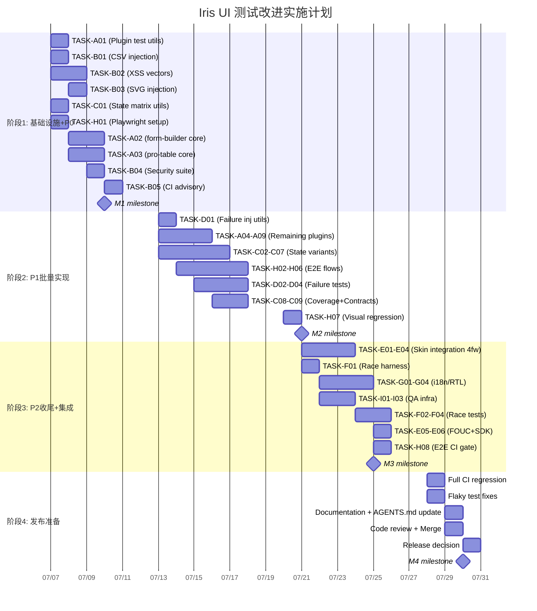

Now I have a thorough understanding of the project. Let me produce the Tech Lead analysis.

---

# Tech Lead Analysis: Iris UI Test Coverage & Quality Improvements

## 1. 任务分解

基于 QA 报告的 8 个 Finding，结合项目实际代码结构和 CI 管线现状，拆分为 9 个功能方向、37 个可执行任务。

### 方向 A：插件核心测试扩展 (P0)

**对应 Finding 2 | 预估总工时: 32h**

| 任务 ID  | 标题                                                                            | 涉及文件                                               | 前置依赖 | 预估工时 | 验收标准                                                                                                           |
| -------- | ------------------------------------------------------------------------------- | ------------------------------------------------------ | -------- | -------- | ------------------------------------------------------------------------------------------------------------------ |
| TASK-A01 | 插件测试基础设施 — 共享 driver/helper 工具包                                    | `scripts/plugin-test-utils.ts`（新）、各 plugin 共用   | 无       | 4h       | 提供 `createPluginFixture`、`mockSchema`、`asyncFlush` 等工具；核心插件不出现重复的 setup 代码                     |
| TASK-A02 | `plugin-form-builder` 核心测试深度扩展                                          | `packages/plugin-form-builder/src/core/index.test.ts`  | TASK-A01 | 6h       | 测试覆盖：动态字段增删、字段值联动、校验状态机、异步校验、空 schema、submit 失败恢复；核心测试 ≥400 行             |
| TASK-A03 | `plugin-pro-table` 核心测试深度扩展                                             | `packages/plugin-pro-table/src/core/index.test.ts`     | TASK-A01 | 6h       | 测试覆盖：列配置组合、排序/筛选/分页联动、行操作（增删改）、loading/empty/error 状态、大型数据集；核心测试 ≥400 行 |
| TASK-A04 | `plugin-admin` 核心测试扩展                                                     | `packages/plugin-admin/src/core/index.test.ts`         | TASK-A01 | 3h       | 测试覆盖：路由注册、权限校验、菜单生成、多 tab 管理；核心测试 ≥200 行                                              |
| TASK-A05 | `plugin-charts` 核心测试扩展                                                    | `packages/plugin-charts/src/core/index.test.ts`        | TASK-A01 | 3h       | 测试覆盖：多种图表类型渲染、数据动态更新、空数据、loading 状态；核心测试 ≥200 行                                   |
| TASK-A06 | `plugin-dashboard` 核心测试扩展                                                 | `packages/plugin-dashboard/src/core/index.test.ts`     | TASK-A01 | 3h       | 测试覆盖：栅格布局、widget 增删、数据联动、拖拽排序；核心测试 ≥200 行                                              |
| TASK-A07 | `plugin-query-builder` 核心测试扩展                                             | `packages/plugin-query-builder/src/core/index.test.ts` | TASK-A01 | 3h       | 测试覆盖：条件组合嵌套、运算符切换、值校验、序列化/反序列化；核心测试 ≥200 行                                      |
| TASK-A08 | `plugin-kanban` 核心测试扩展                                                    | `packages/plugin-kanban/src/core/index.test.ts`        | TASK-A01 | 2h       | 测试覆盖：列间拖拽、卡片增删、搜索过滤、空状态；核心测试 ≥150 行                                                   |
| TASK-A09 | `plugin-calendar` / `plugin-markdown` / `plugin-notifications` 核心测试轻度扩展 | 对应 core `index.test.ts`                              | TASK-A01 | 2h       | 每个添加 ≥3 个 edge 用例（空/错误/边界输入）                                                                       |

### 方向 B：安全基线测试 (P0 → P1)

**对应 Finding 3 | 预估总工时: 18h**

| 任务 ID  | 标题                                   | 涉及文件                                                            | 前置依赖     | 预估工时 | 验收标准                                                                                                                                  |
| -------- | -------------------------------------- | ------------------------------------------------------------------- | ------------ | -------- | ----------------------------------------------------------------------------------------------------------------------------------------- |
| TASK-B01 | `table-export` CSV/XML/HTML 注入测试   | `packages/core/src/table-export.test.ts`                            | 无           | 4h       | 测试包含：`=CMD`/`=EXEC`/`=HYPERLINK` 公式注入、XML 实体注入、HTML 脚本注入；所有脆弱路径有断言                                           |
| TASK-B02 | 数据渲染组件 XSS 向量测试              | 各 adapter `*Table*` / `*Tree*` / `*List*` / `*Mentions*` test 文件 | 无           | 6h       | 在 `data` prop 中注入 `<script>`/`onerror`/`javascript:` 等向量，验证组件不执行或正确转义；覆盖 React、Vue、Solid、Svelte 各 1 个典型组件 |
| TASK-B03 | Icons SVG 注入路径测试                 | `packages/icons/src/*.test.ts`                                      | 无           | 2h       | 测试 `use` 元素、`<script>` 在 SVG 中的处理；验证 `innerHTML` 仅用于受控 SVG 片段                                                         |
| TASK-B04 | 创建 `security.test.ts` 系统级安全测试 | `packages/core/src/security.test.ts`（新）                          | TASK-B01~B03 | 4h       | 聚合 OWASP Top-10 相关向量（XSS、注入、原型污染）；在 CI 中以 advisory 方式运行                                                           |
| TASK-B05 | 安全测试 advisory gate 接入 CI         | `.github/workflows/ci.yml`                                          | TASK-B04     | 2h       | 新增 `pnpm test:security` script，CI 中 `continue-on-error: true` 但输出告警                                                              |

### 方向 C：组件状态变体测试 (P1)

**对应 Finding 6 | 预估总工时: 24h**

| 任务 ID  | 标题                                                                         | 涉及文件                                      | 前置依赖 | 预估工时 | 验收标准                                                                                |
| -------- | ---------------------------------------------------------------------------- | --------------------------------------------- | -------- | -------- | --------------------------------------------------------------------------------------- |
| TASK-C01 | 状态变体测试辅助工具 — `stateMatrix` 编排宏                                  | `scripts/state-matrix-test-utils.ts`（新）    | 无       | 3h       | 提供 `runStateMatrix(component, {loading, empty, error, disabled})` 简化组合状态测试    |
| TASK-C02 | `IrisTable` 状态变体测试（四框架）                                           | 各 adapter `Table.test.*`                     | TASK-C01 | 3h       | 测试：`loading+data`、`empty+loading`、`error+loading`（优先级）、`disabled` 时不可交互 |
| TASK-C03 | `IrisSelect` / `IrisCombobox` 状态变体测试（四框架）                         | 各 adapter `Select.test.*`、`Combobox.test.*` | TASK-C01 | 3h       | 测试：options 为空、loading+空结果、fetch error 回退、disabled 时 dropdown 不可打开     |
| TASK-C04 | `IrisTree` 状态变体测试（四框架）                                            | 各 adapter `Tree.test.*`                      | TASK-C01 | 2h       | 测试：空数据、loading 骨架屏、error 重试、disabled 节点                                 |
| TASK-C05 | `IrisPagination` 状态变体测试（四框架）                                      | 各 adapter `Pagination.test.*`                | TASK-C01 | 2h       | 测试：`total=0`、`total=1`、`pageSize` 变化、disabled 状态                              |
| TASK-C06 | `IrisForm` 状态变体测试（四框架）                                            | 各 adapter `Form.test.*`                      | TASK-C01 | 3h       | 测试：初始 empty、提交后校验错误、异步提交 loading、禁用表单全部字段                    |
| TASK-C07 | `IrisTransfer` / `IrisDatePicker` / `IrisTagInput` / `IrisList` 状态变体测试 | 各 adapter 对应 `*.test.*`                    | TASK-C01 | 4h       | 每个组件：empty/loading/error/disabled 至少 2 个场景                                    |
| TASK-C08 | `test-coverage-report.mjs` 扩展 — 状态 prop 覆盖率追踪                       | `scripts/test-coverage-report.mjs`            | TASK-C01 | 2h       | 脚本增加状态 prop 关键字扫描，标记缺失状态测试的组件；输出 advisory 级别警告            |
| TASK-C09 | 状态变体合约场景（跨框架统一）                                               | `packages/core/src/contracts/scenarios/*.ts`  | TASK-C01 | 2h       | 为 3-5 个高频组件（Table/Select/Tree/Pagination/Form）新增状态变体合约场景              |

### 方向 D：故障注入 / 弹性测试 (P1)

**对应 Finding 4 | 预估总工时: 14h**

| 任务 ID  | 标题                                                         | 涉及文件                                                     | 前置依赖 | 预估工时 | 验收标准                                                                                                       |
| -------- | ------------------------------------------------------------ | ------------------------------------------------------------ | -------- | -------- | -------------------------------------------------------------------------------------------------------------- |
| TASK-D01 | 故障注入测试辅助工具 — `failableFetcher` / `controlledTimer` | `packages/core/src/test-utils/failure-injection.ts`（新）    | 无       | 3h       | 提供：按次数/条件 reject 的 fetcher、可控时钟、网络模拟 delay                                                  |
| TASK-D02 | `createAsyncResource` 故障恢复测试扩展                       | `packages/core/src/async.test.ts`                            | TASK-D01 | 4h       | 测试覆盖：请求 timeout（模拟超时）、500 错误后重试（若实现）、连续 3 次失败后 fallback、stale-while-revalidate |
| TASK-D03 | `createResourceController` 故障恢复测试扩展                  | `packages/core/src/resource.test.ts`                         | TASK-D01 | 4h       | 测试覆盖：首次加载失败、分页中网络断开、列表刷新时故障、乐观更新回滚 + 并发失败                                |
| TASK-D04 | `data-source` 异步合约故障场景                               | `packages/core/src/contracts/scenarios/data-source-async.ts` | TASK-D01 | 3h       | 新增合约场景：fetch reject、slow response interleaved with rapid sort                                          |

### 方向 E：皮肤系统集成测试 (P2)

**对应 Finding 5 | 预估总工时: 20h**

| 任务 ID  | 标题                                            | 涉及文件                                                      | 前置依赖     | 预估工时 | 验收标准                                                                         |
| -------- | ----------------------------------------------- | ------------------------------------------------------------- | ------------ | -------- | -------------------------------------------------------------------------------- |
| TASK-E01 | React SkinProvider 集成测试扩展                 | `packages/react/src/skins/SkinProvider.test.tsx`              | 无           | 4h       | 测试覆盖：`SkinProvider` + 真实组件树、主题切换后 CSS 变量变化、`patch` 实时编辑 |
| TASK-E02 | Vue SkinProvider 集成测试扩展                   | `packages/vue/src/skins/SkinProvider.test.ts`                 | 无           | 4h       | 同上，Vue 适配器                                                                 |
| TASK-E03 | Solid SkinProvider 集成测试扩展                 | `packages/solid/src/skins/skins.test.tsx`                     | 无           | 4h       | 同上，Solid 适配器                                                               |
| TASK-E04 | Svelte SkinProvider 集成测试扩展                | `packages/svelte/src/skins/skins.test.ts`                     | 无           | 4h       | 同上，Svelte 适配器                                                              |
| TASK-E05 | FOUC 防闪脚本集成测试 + 皮肤 namespace 隔离验证 | `packages/skins/src/bootScript.test.ts`、各 adapter skin test | TASK-E01~E04 | 2h       | 测试 bootScript 注入/移除；验证 `custom` namespace CSS 变量独立                  |
| TASK-E06 | 皮肤市场 SDK 契约测试                           | `packages/skins/src/registry.test.ts`、`catalog.test.ts`      | 无           | 2h       | 测试注册/查找/冲突覆盖；验证 `extends` 链解析正确性                              |

### 方向 F：并发 / 竞态条件测试 (P2)

**对应 Finding 7 | 预估总工时: 10h**

| 任务 ID  | 标题                                                          | 涉及文件                                                     | 前置依赖 | 预估工时 | 验收标准                                                                               |
| -------- | ------------------------------------------------------------- | ------------------------------------------------------------ | -------- | -------- | -------------------------------------------------------------------------------------- |
| TASK-F01 | 竞态测试 harness — `raceLatch` / `Promise.withResolvers` 封装 | `packages/core/src/test-utils/race-utils.ts`（新）           | 无       | 2h       | 提供 `race(…promises)`、`controlledPromise`、`interleave` 等工具                       |
| TASK-F02 | `createAsyncResource` 竞态测试                                | `packages/core/src/async.test.ts`                            | TASK-F01 | 3h       | 5 次 `load()` 并发，验证只有最后一次结果生效；`load` + 立即 `cancel` 不改变状态        |
| TASK-F03 | `createResourceController` 竞态测试                           | `packages/core/src/resource.test.ts`                         | TASK-F01 | 3h       | 快速 `setPage` 串联验证防抖/去重；`setSort` + `setFilter` 交叠；mutation 后立即 reload |
| TASK-F04 | data-source 异步合约竞态场景                                  | `packages/core/src/contracts/scenarios/data-source-async.ts` | TASK-F01 | 2h       | 合并 TASK-D04 扩展，增加并发请求合约场景                                               |

### 方向 G：i18n / RTL 边界测试 (P2)

**对应 Finding 8 | 预估总工时: 12h**

| 任务 ID  | 标题                                  | 涉及文件                                                      | 前置依赖 | 预估工时 | 验收标准                                                                                               |
| -------- | ------------------------------------- | ------------------------------------------------------------- | -------- | -------- | ------------------------------------------------------------------------------------------------------ |
| TASK-G01 | RTL 合约场景 — 方向敏感组件           | `packages/core/src/contracts/scenarios/*.ts`（新增 RTL 场景） | 无       | 4h       | 为 Dialog/Popover/Drawer/Tabs/Table 新增 RTL 断言：`margin-inline-start`/`inset-inline-end` 等逻辑属性 |
| TASK-G02 | i18n locale-specific 格式化测试       | `packages/core/src/i18n.test.ts`                              | 无       | 3h       | 测试：CJK/Arabic 消息渲染、德语/法语数字格式、阿拉伯语 RTL 日期、pluralization 规则                    |
| TASK-G03 | 四框架 RTL 集成测试                   | 各 adapter `IrisProvider.test.*`（RTL 场景）                  | TASK-G01 | 3h       | 每个框架至少 1 个 RTL 集成测试：Provider 设置 `dir="rtl"` 后组件正确翻转                               |
| TASK-G04 | `plugin-locale-zh` 中文本地化覆盖验证 | `packages/plugin-locale-zh/src/**/*.test.ts`                  | 无       | 2h       | 验证所有 core message key 都有中文翻译；fallback 逻辑正确                                              |

### 方向 H：E2E / 浏览器级测试 (P1)

**对应 Finding 1 | 预估总工时: 28h**

| 任务 ID  | 标题                                   | 涉及文件                                                                  | 前置依赖     | 预估工时 | 验收标准                                                                         |
| -------- | -------------------------------------- | ------------------------------------------------------------------------- | ------------ | -------- | -------------------------------------------------------------------------------- |
| TASK-H01 | Playwright 基础设施搭建                | `e2e/playwright.config.ts`（新）、`e2e/fixtures/`、`package.json` scripts | 无           | 4h       | 可启动 dev server、运行基本 Playwright 测试、CI 中 `pnpm test:e2e` 可用          |
| TASK-H02 | 核心用户流 E2E — Dialog → Form → Toast | `e2e/specs/critical-flows/dialog-form-toast.spec.ts`                      | TASK-H01     | 4h       | 完整流：打开 Dialog → 填写表单 → 验证 → 提交 → 显示 Toast 确认                   |
| TASK-H03 | 核心用户流 E2E — Table CRUD            | `e2e/specs/critical-flows/table-crud.spec.ts`                             | TASK-H01     | 4h       | 表格：渲染数据 → 排序 → 翻页 → 行选择 → 行编辑 → 删除确认                        |
| TASK-H04 | 核心用户流 E2E — 主题/皮肤切换         | `e2e/specs/critical-flows/theme-switch.spec.ts`                           | TASK-H01     | 3h       | 切换暗色模式 → 切换皮肤 → 验证 CSS 变量生效 → 刷新后持久化                       |
| TASK-H05 | Portal 真实 body 模式测试              | `e2e/specs/portal/real-body.spec.ts`                                      | TASK-H01     | 4h       | Dialog/Drawer/Popover/Tooltip 渲染在 `document.body`；遮罩层、焦点陷阱、Esc 关闭 |
| TASK-H06 | 可访问性 E2E 键盘导航测试              | `e2e/specs/accessibility/keyboard-nav.spec.ts`                            | TASK-H01     | 3h       | Tab 顺序、aria 属性检查、箭头键 roving、屏幕阅读器友好的角色                     |
| TASK-H07 | 视觉回归基线 + CI 集成                 | `e2e/visual-regression/`、Playwright `screenshot` 配置                    | TASK-H01     | 4h       | 为 Dialog/Table/Form 等 5 个关键组件设置截图对比，CI 中差异超阈值则告警          |
| TASK-H08 | E2E CI 门禁配置                        | `.github/workflows/ci.yml`                                                | TASK-H01~H07 | 2h       | E2E 在 CI 中以 advisory 模式运行（标记已知不稳定），但回归截图 >3% diff 才 fail  |

### 方向 I：QA 基础设施增强

**预估总工时: 6h**

| 任务 ID  | 标题                                  | 涉及文件                                                | 前置依赖 | 预估工时 | 验收标准                                                            |
| -------- | ------------------------------------- | ------------------------------------------------------- | -------- | -------- | ------------------------------------------------------------------- |
| TASK-I01 | 测试覆盖率报告升级 — 纳入 plugin 目录 | `scripts/test-coverage-report.mjs`                      | 无       | 2h       | 报告覆盖 plugin 包的 core + 各 adapter 测试；输出 plugin 测试健康度 |
| TASK-I02 | 合约测试断言密度 guard 升级           | `packages/core/src/contracts/assertion-density.test.ts` | 无       | 2h       | 合约场景强制执行最低 `expect` 调用数；新增场景自动触发校验          |
| TASK-I03 | CI 增加 `test:security` advisory 门禁 | `.github/workflows/ci.yml`                              | TASK-B05 | 2h       | 安全测试 run 但不 gate-fail；输出 JSON 报告                         |

---

## 2. 执行顺序与任务依赖

```mermaid
graph TD
    %% Group: Infrastructure layers
    subgraph Layer0["Layer 0: Infrastructure"]
        TASK_A01["TASK-A01: Plugin test utils"]
        TASK_C01["TASK-C01: State matrix utils"]
        TASK_D01["TASK-D01: Failure injection utils"]
        TASK_F01["TASK-F01: Race harness"]
        TASK_H01["TASK-H01: Playwright setup"]
    end

    %% Group: Security (P0, parallelizable within)
    subgraph Security["Direction B: Security Baseline (P0-P1)"]
        TASK_B01["TASK-B01: CSV injection"]
        TASK_B02["TASK-B02: XSS vectors"]
        TASK_B03["TASK-B03: SVG injection"]
        TASK_B01 --> TASK_B04["TASK-B04: Security test suite"]
        TASK_B02 --> TASK_B04
        TASK_B03 --> TASK_B04
        TASK_B04 --> TASK_B05["TASK-B05: CI advisory gate"]
    end

    %% Group: Plugin tests (P0)
    subgraph Plugin["Direction A: Plugin Tests (P0)"]
        TASK_A01 --> TASK_A02["TASK-A02: form-builder"]
        TASK_A01 --> TASK_A03["TASK-A03: pro-table"]
        TASK_A01 --> TASK_A04["TASK-A04: admin"]
        TASK_A01 --> TASK_A05["TASK-A05: charts"]
        TASK_A01 --> TASK_A06["TASK-A06: dashboard"]
        TASK_A01 --> TASK_A07["TASK-A07: query-builder"]
        TASK_A01 --> TASK_A08["TASK-A08: kanban"]
        TASK_A01 --> TASK_A09["TASK-A09: calendar/markdown/notifications"]
    end

    %% Group: State variants (P1)
    subgraph StateVariant["Direction C: State Variant (P1)"]
        TASK_C01 --> TASK_C02["TASK-C02: Table"]
        TASK_C01 --> TASK_C03["TASK-C03: Select/Combobox"]
        TASK_C01 --> TASK_C04["TASK-C04: Tree"]
        TASK_C01 --> TASK_C05["TASK-C05: Pagination"]
        TASK_C01 --> TASK_C06["TASK-C06: Form"]
        TASK_C01 --> TASK_C07["TASK-C07: Transfer/DatePicker/TagInput/List"]
        TASK_C02 --> TASK_C09["TASK-C09: Contract scenarios"]
        TASK_C03 --> TASK_C09
        TASK_C02 --> TASK_C08["TASK-C08: Coverage report upgrade"]
    end

    %% Group: Failure injection (P1)
    subgraph Failure["Direction D: Failure Injection (P1)"]
        TASK_D01 --> TASK_D02["TASK-D02: async resource"]
        TASK_D01 --> TASK_D03["TASK-D03: resource controller"]
        TASK_D01 --> TASK_D04["TASK-D04: data-source contract"]
    end

    %% Group: Skin integration (P2)
    subgraph Skin["Direction E: Skin Integration (P2)"]
        TASK_E01["TASK-E01: React skin integration"]
        TASK_E02["TASK-E02: Vue skin integration"]
        TASK_E03["TASK-E03: Solid skin integration"]
        TASK_E04["TASK-E04: Svelte skin integration"]
        TASK_E01 --> TASK_E05["TASK-E05: FOUC + namespace"]
        TASK_E02 --> TASK_E05
        TASK_E03 --> TASK_E05
        TASK_E04 --> TASK_E05
        TASK_E06["TASK-E06: SDK contract"]
    end

    %% Group: Race conditions (P2)
    subgraph Race["Direction F: Race Conditions (P2)"]
        TASK_F01 --> TASK_F02["TASK-F02: async resource race"]
        TASK_F01 --> TASK_F03["TASK-F03: resource controller race"]
        TASK_F01 --> TASK_F04["TASK-F04: data-source race contract"]
    end

    %% Group: i18n/RTL (P2)
    subgraph I18n["Direction G: i18n/RTL (P2)"]
        TASK_G01["TASK-G01: RTL contract scenarios"]
        TASK_G02["TASK-G02: Locale formatting"]
        TASK_G03["TASK-G03: Framework RTL integration"]
        TASK_G04["TASK-G04: plugin-locale-zh"]
    end

    %% Group: E2E (P1)
    subgraph E2e["Direction H: E2E (P1)"]
        TASK_H01 --> TASK_H02["TASK-H02: Dialog→Form→Toast"]
        TASK_H01 --> TASK_H03["TASK-H03: Table CRUD"]
        TASK_H01 --> TASK_H04["TASK-H04: Theme switch"]
        TASK_H01 --> TASK_H05["TASK-H05: Portal real-body"]
        TASK_H01 --> TASK_H06["TASK-H06: Keyboard nav"]
        TASK_H02 --> TASK_H07["TASK-H07: Visual regression"]
        TASK_H03 --> TASK_H07
        TASK_H04 --> TASK_H07
        TASK_H05 --> TASK_H07
        TASK_H07 --> TASK_H08["TASK-H08: E2E CI gate"]
    end

    %% Group: QA infrastructure
    subgraph Qa["Direction I: QA Infra"]
        TASK_I01["TASK-I01: Coverage report upgrade"]
        TASK_I02["TASK-I02: Assertion density guard"]
        TASK_I03["TASK-I03: Security CI gate"]
    end

    %% Cross-direction dependencies
    TASK_B01 --> TASK_I03
    TASK_B04 --> TASK_I03
    TASK_C02 --> TASK_I01
    TASK_A02 --> TASK_I01

    %% Cross-group parallel annotations
    TASK_A01 -.->|"parallel"| TASK_B01
    TASK_A01 -.->|"parallel"| TASK_C01
    TASK_B01 -.->|"parallel"| TASK_D01
    TASK_C01 -.->|"parallel"| TASK_D01
    TASK_E01 -.->|"parallel"| TASK_F01
```



### 可并行执行组

| 并行组        | 任务                                                                       | 条件                        |
| ------------- | -------------------------------------------------------------------------- | --------------------------- |
| **P0 闪电组** | TASK-A01（基础设施）+ TASK-B01/B02/B03（安全独立）+ TASK-H01（Playwright） | 无外部依赖，可同时 3 人开工 |
| **P1 插件组** | TASK-A02~A09（8 个插件并行）                                               | TASK-A01 完成后             |
| **P1 状态组** | TASK-C02~C07（6 个组件并行）+ TASK-C09                                     | TASK-C01 完成后             |
| **P1 故障组** | TASK-D02/D03/D04                                                           | TASK-D01 完成后             |
| **P2 皮肤组** | TASK-E01~E04（4 框架并行）→ TASK-E05                                       | 无外部依赖                  |
| **P2 竞态组** | TASK-F02/F03/F04                                                           | TASK-F01 完成后             |
| **P2 i18n组** | TASK-G01/G02/G04（3 路并行）→ TASK-G03                                     | 无外部依赖                  |
| **E2E 流组**  | TASK-H02~H06（5 个 E2E 流并行）                                            | TASK-H01 完成后             |

---

## 3. 技术风险

### 3.1 高风险项

| 风险 ID     | 描述                                                                                                                   | 影响                                            | 概率 | 缓解策略                                                                                              |
| ----------- | ---------------------------------------------------------------------------------------------------------------------- | ----------------------------------------------- | ---- | ----------------------------------------------------------------------------------------------------- |
| **RISK-01** | `plugin-form-builder` 动态字段渲染的表单状态机与 core `form` 引擎的交互有竞态可能                                      | 错误判断为插件 bug 实际是 core 问题，debug 链长 | 中   | 先阅读 `core/form.ts` 状态机源码和现有 807 行 form 测试；在插件测试中直接依赖 `createForm`，不做 mock |
| **RISK-02** | E2E 测试在 jsdom 不能通过的 Portal 场景（Dialog/Popover 渲染到 `document.body`）在 Playwright 下可能发现真正的渲染差异 | 发现多个 portal 渲染 bug，修复打乱排期          | 高   | 阶段性发现：先在 E2E 中只做"渲染存在"断言；发现的问题记录到独立 Issue，不阻塞 E2E CI 门禁             |
| **RISK-03** | XSS 测试需要区分"框架自带转义"和"组件未转义"                                                                           | 某些框架（React JSX 默认转义）会掩盖组件的漏洞  | 中   | 在 React 测试中明确使用 `dangerouslySetInnerHTML` 模拟用户数据；Vue 用 `v-html` 等效测试              |
| **RISK-04** | CI 总时长可能超过 15 分钟限制（新增大量测试 + E2E）                                                                    | CI 超时或排队                                   | 中   | E2E 使用 `--shard` 分片；对 P2 级别测试在 `test:advisory` 组中运行                                    |

### 3.2 技术难点

| 领域             | 难点                                                                   | 解决路径                                                                                                     |
| ---------------- | ---------------------------------------------------------------------- | ------------------------------------------------------------------------------------------------------------ |
| **插件测试**     | 4 框架各有一套测试配置（vitest main/solid/svelte），添加测试需同时维护 | 统一用 `tsup` + 共享的 core 测试，框架适配器测试只做渲染桥接验证                                             |
| **皮肤集成测试** | CSS 变量生效需要通过 `getComputedStyle` 查询，jsdom 行为不完整         | 核心测试在 jsdom 中只验证 `document.documentElement.style` set；真正的 var 解析留在 E2E                      |
| **并发测试**     | `Promise.withResolvers` 在较旧 Node 版本可能不支持                     | 使用 polyfill 或显式 `new Promise((resolve, reject) => { … })` 模式（现有代码已有 `controlledPromise` 例子） |
| **E2E 视觉回归** | 不同 OS/浏览器渲染差异导致 baseline 漂移                               | 使用 Playwright Docker 容器固定渲染环境；diff 阈值设为 0.5%                                                  |

### 3.3 外部依赖

| 依赖                      | 用途          | 风险等级                      | 替代方案                             |
| ------------------------- | ------------- | ----------------------------- | ------------------------------------ |
| `@playwright/test`        | E2E 测试      | 低 — 成熟工具                 | 无（最佳选择）                       |
| `playwright` Docker image | CI 中运行 E2E | 低 — GitHub 官方 Actions 支持 | `mcr.microsoft.com/playwright`       |
| `jest-image-snapshot`     | 视觉回归      | 低                            | Playwright 内置 `toHaveScreenshot()` |

### 3.4 性能瓶颈

| 场景         | 瓶颈                            | 预估新增测试数  | 预估额外测试时间   |
| ------------ | ------------------------------- | --------------- | ------------------ |
| 插件测试扩展 | 无 — core-only 测试，jsdom 环境 | ~400 个 it      | +30s               |
| 状态变体测试 | 每框架 × 6 组件 × 5 状态        | ~480 个 it      | +60s               |
| 故障注入测试 | core 新测试，可控时钟           | ~60 个 it       | +10s               |
| 皮肤集成测试 | CSS 计算在 jsdom 中慢           | ~40 个 it       | +15s               |
| 竞态测试     | 需要真实 Promise 时间           | ~30 个 it       | +5s                |
| E2E 测试     | 启动浏览器 + 真实渲染           | ~20 个 it       | +120s              |
| **合计**     |                                 | **~1030 个 it** | **~240s（4分钟）** |

当前 CI 总运行时间约 8-10 分钟，增加 4 分钟后仍低于 15 分钟上限。但如果 E2E 使用 shard + 并行可控制在 12 分钟以内。

---

## 4. 资源评估

### 4.1 人员需求

| 角色                    | 数量 | 核心技能                           | 负责方向                                                       |
| ----------------------- | ---- | ---------------------------------- | -------------------------------------------------------------- |
| **高级前端工程师 (TL)** | 1    | 架构决策、质量门设计、代码审查     | 整体协调、技术选型、E2E 架构                                   |
| **前端工程师 A**        | 1    | Core 测试、复杂状态机理解          | 方向 A（插件核心测试）、方向 D（故障注入）、方向 F（竞态测试） |
| **前端工程师 B**        | 1    | 安全方向、XSS/注入、各框架转义机制 | 方向 B（安全基线）、方向 G（i18n/RTL）                         |
| **前端工程师 C**        | 1    | 组件测试、各框架 adapter 理解      | 方向 C（状态变体测试）、方向 E（皮肤集成测试）                 |
| **QA 工程师**           | 1    | Playwright、视觉回归、CI           | 方向 H（E2E 测试）、方向 I（QA 基础设施）                      |

**最佳配置：3 人专职 4 周，或 2 人专职 6 周。**

### 4.2 关键里程碑

| 里程碑              | 时间点    | 交付物                               | 验收标准                                                                        |
| ------------------- | --------- | ------------------------------------ | ------------------------------------------------------------------------------- |
| **M1: P0 核心完成** | 第 1 周末 | 插件测试扩展 + 安全基线              | 所有 P0 任务（A01~A03、B01~B05）CI 绿色；`plugin-form-builder` 核心测试 ≥400 行 |
| **M2: P1 测试完成** | 第 3 周末 | 状态变体 + 故障注入 + E2E 基础设施   | 10 个关键组件状态全覆盖；故障注入 3 个核心模块；Playwright 5 个 flow 可运行     |
| **M3: 全面集成**    | 第 4 周末 | E2E CI 门禁 + 皮肤集成 + 竞态 + i18n | 所有 37 个任务完成；新增 ~1000 个 it；CI 总时长 ≤13 分钟                        |
| **M4: 发布就绪**    | 第 5 周末 | 回归基线 + 文档 + 发布决议           | 无 P0/P1 待办；安全 advisory 门在 CI 中运行；QA 报告评级所有方向 ≥ "Good"       |

### 4.3 阻塞点与解决策略

| 阻塞点                                                    | 影响            | 解决策略                                                                           |
| --------------------------------------------------------- | --------------- | ---------------------------------------------------------------------------------- |
| **项目维护者不批准新增 devDependencies（如 Playwright）** | E2E 无法推进    | E2E 变为可选安装 `pnpm add -D @playwright/test --optional`；CI 中条件运行          |
| **core form 引擎变更影响 plugin-form-builder 测试**       | 测试结果不可靠  | 在插件测试中使用 `@iris-ui/core` 的 `createForm` 接口（非 mock），确保集成测试信度 |
| **Svelte $state 命名限制持续造成测试干扰**                | Svelte 测试脆弱 | 在 A09 中明确记录此限制；在新测试中避免 `$state` 变量命名 `state`                  |
| **CI 15 分钟 timeout 不够**                               | CI 失败         | E2E 使用 shard 分 2 个 job；风险分析见 3.4；必要时增加 timeout-minutes: 20         |

---

## 5. 质量保证

### 5.1 各方向测试覆盖要求

| 方向            | 单元测试覆盖                                              | 集成测试                       | 验收标准                                                         |
| --------------- | --------------------------------------------------------- | ------------------------------ | ---------------------------------------------------------------- |
| **A: 插件测试** | 每个 plugin core ≥200 行（form-builder / pro-table ≥400） | 4 框架各 1 adapter smoke test  | `test-coverage-report.mjs` 不输出 plugin 警告                    |
| **B: 安全基线** | table-export：每导出格式 ≥5 个注入向量                    | E2E 确认 UI 层不执行脚本       | OWASP 测试通过率 100%（人工审查确认无假阳性）                    |
| **C: 状态变体** | 每框架 10 个组件 × 4 状态 = 160 个新 it                   | 3-5 个状态变体合约场景         | `test-coverage-report.mjs` 状态 prop 扫描 0 警告                 |
| **D: 故障注入** | 3 个 core 模块故障场景 ≥5 个新 it/模块                    | async contract 扩展            | 所有故障场景在 `fakeScheduler` 下确定性地通过                    |
| **E: 皮肤集成** | 每框架 SkinProvider 测试 ≥50 行新代码                     | CSS var 在组件上生效           | getComputedStyle 断言（E2E）/ documentElement.style 断言（unit） |
| **F: 竞态测试** | 3 个 core 模块竞态场景 ≥3 个新 it/模块                    | —                              | 所有竞态场景在受控 Promise 下通过                                |
| **G: i18n/RTL** | i18n 测试新增 ≥5 个 locale 场景                           | 每框架 1 个 RTL 集成测试       | RTL 逻辑属性断言通过                                             |
| **H: E2E**      | —                                                         | 5 个关键用户流 + portal + 视觉 | Playwright CI 中 advisory 模式通过率 ≥80%                        |

### 5.2 集成测试策略

```
测试金字塔 — 目标状态

        ┌──────────────────────────┐
        │   E2E (Playwright)       │  ← ~20 tests, advisory CI gate
        │   5 flows + visual       │
        ├──────────────────────────┤
        │   Cross-framework        │  ← 42+ scenarios × 4 adapters
        │   Contracts              │    +3 new state + RTL scenarios
        ├──────────────────────────┤
        │   Integration            │  ← Skin+Component, SSR hydration
        │   (adapter-level)        │    + E2E replaces portal gaps
        ├──────────────────────────┤
        │   Unit Tests             │  ← 680+ test files, 75k+ lines
        │   (core + UI)            │    +1k new it() from all directions
        └──────────────────────────┘
```

### 5.3 代码审查要点

| 审查维度         | 审查清单                                                                                       |
| ---------------- | ---------------------------------------------------------------------------------------------- |
| **安全性**       | 测试中是否使用了 `dangerouslySetInnerHTML`/`v-html` 等显式转义绕过？注入向量是否针对框架特性？ |
| **确定性**       | 是否使用了 `fakeScheduler` / `controlledPromise` 而非真实 `setTimeout`/`setInterval`？         |
| **可读性**       | 是否遵循 AAA 模式（Arrange-Act-Assert）？`describe`/`it` 是否表达了业务意图？                  |
| **框架无关**     | 插件 core 测试是否引用了任何框架包（`from 'react'` 等是 bug）？                                |
| **CI 友好**      | 新测试是否在 jsdom 环境中工作？E2E 测试是否使用 `page` fixture 而非直接 DOM API？              |
| **无 flakiness** | 是否在 `afterEach` 中 cleanup 了 shared singletons（scroll-lock、stylesheet、toast 队列）？    |

### 5.4 性能测试需求

| 测试类型           | 工具                          | 触发条件            | 阈值                              |
| ------------------ | ----------------------------- | ------------------- | --------------------------------- |
| 插件 core 测试基准 | `scale.bench.ts`（已有）      | 每次 PR（advisory） | 无硬阈值（追踪趋势）              |
| 状态变体测试总行数 | `test-coverage-report.mjs`    | 每次 PR（advisory） | plugin core 测试 < 400 行输出警告 |
| CI 总时长监控      | CI job duration               | 每次合并            | >15min 告警                       |
| E2E 截图 diff      | Playwright `toHaveScreenshot` | 每次 PR（advisory） | >3% 像素 diff 标记审查            |

---

## 6. 实施计划

### 阶段 1：基础设施 + P0 核心（第 1 周）

```
周1  周一    周二    周三    周四    周五    周末
    ┌─────────────────────────────────────────────────┐
A01 │████████████████                                 │  4h  Plugin test utils
A02 │                ██████████████████████            │  6h  form-builder core tests
A03 │                ██████████████████████            │  6h  pro-table core tests
B01 │    ████████████████                             │  4h  CSV injection
B02 │    ██████████████████████████████                │  6h  XSS vectors
B03 │        ██████████                               │  2h  SVG injection
B04 │                    ████████████████████           │  4h  Security suite
B05 │                                    ████████      │  2h  CI advisory gate
C01 │██████████████                                   │  3h  State matrix utils
H01 │████████████████                                 │  4h  Playwright setup
    └─────────────────────────────────────────────────┘
```

**第 1 周末交付**：

- `pnpm test:security` 命令可用
- `plugin-form-builder` 核心测试 ≥400 行，CI 绿色
- `plugin-pro-table` 核心测试 ≥400 行，CI 绿色
- Playwright 项目骨架 + CI 最小配置

### 阶段 2：P1 批量实现（第 2-3 周）

```
周2-3 P1 并行组全速推进
    ┌─────────────────────────────────────────────────┐
A04-A09│████████████████████████████████               │  15h All remaining plugins
C02-C07│████████████████████████████████████████████    │  17h State variant tests
C08-C09│        ████████████████                      │  4h  Coverage + contracts
D01    │██████████████                                 │  3h  Failure injection utils
D02-D04│            ███████████████████████████████████  │  11h Failure tests
H02-H06│██████████████████████████████████████████████  │  18h E2E flows
H07    │                                    ██████████  │  4h  Visual regression
    └─────────────────────────────────────────────────┘
```

**第 3 周末交付**：

- 全部 12 个插件 core 测试 ≥200 行，高复杂度 ≥400 行
- 10 个关键组件状态变体全覆盖
- `createAsyncResource` / `createResourceController` 故障恢复测试完成
- 5 个 E2E 测试流可运行
- 视觉回归基线建立

### 阶段 3：P2 收尾 + 集成（第 4 周）

```
周4   周一    周二    周三    周四    周五
    ┌─────────────────────────────────────────────────┐
E01-E04│████████████████████████████                   │  12h Skin integration (4 frames)
E05-E06│                    ████████                   │  4h  FOUC + SDK
F01    │████████                                       │  2h  Race harness
F02-F04│    ██████████████████████████                  │  8h  Race tests
G01-G04│██████████████████████████████████████          │  12h i18n/RTL
H08    │                        ████████               │  2h  E2E CI gate
I01-I03│██████████████████████                         │  6h  QA infra
    └─────────────────────────────────────────────────┘
```

**第 4 周末交付**：

- 四框架皮肤集成测试完成（CSS var + patch + FOUC）
- 竞态/并发测试覆盖 async + resource controller
- RTL 合约场景 + 框架集成
- E2E CI advisory 门禁运行
- QA 基础设施升级完成

### 阶段 4：回归 + 发布准备（第 5 周）

```
周5   周一    周二    周三    周四    周五
    ┌─────────────────────────────────────────────────┐
回归  │███████████████████████████████████████████████  │  Full CI pass, all 3* runners
修复  │    ████████████████                            │  Flaky test fixes
文档  │        ████████████████████████                 │  Test docs in AGENTS.md
评审  │                ██████████████████████████████   │  Code review + merge
发布  │                        ████████████████████████ │  Release decision
    └─────────────────────────────────────────────────┘
```

**第 5 周末交付**：

- 全部 37 个任务完成通过审查合并
- `AGENTS.md` 更新 — 新增测试策略章节，收录所有测试陷阱
- 全面 CI 回归验证（三套 vitest config + E2E）
- 发布决议文档

### 总体甘特图



---

## 总结

| 维度            | 评估                                                                 |
| --------------- | -------------------------------------------------------------------- |
| **总预估工时**  | **164 人时 ≈ 20 人日 ≈ 4 周 × 1.5 人（全栈）**                       |
| **P0 必须完成** | 安全基线 + 插件测试扩展（2 大方向）                                  |
| **最高风险**    | plugin-form-builder 测试与 core form 引擎的交互（RISK-01）           |
| **最需关注**    | E2E 测试的 flakiness 管理 — 必须设置为 advisory gate，防止 CI 不稳定 |
| **收益最大**    | 状态变体测试 + 安全基线 — 覆盖最高频的 real-world 失败模式           |
| **CI 影响**     | 总测试时间增加约 4 分钟（含 E2E sharded），仍在 15 分钟限制内        |
| **可交付节奏**  | 第 1 周末有 P0 交付；第 3 周末 P1 完成；第 5 周末全部完成可发布      |

**核心建议**：先发制人 — 方向 B（安全）和方向 A（插件测试）直接关系 `npm publish` 后的用户信任。在首个公开发布之前，至少完成 TASK-B01~B04、TASK-A01~A03。方向 C 和 H 可以推迟到发布后第 1 个 minor 版本。
