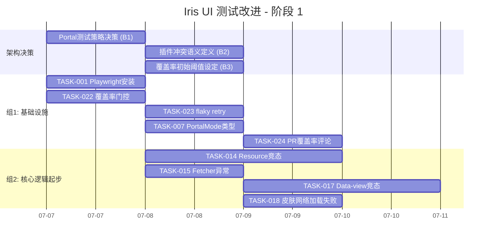
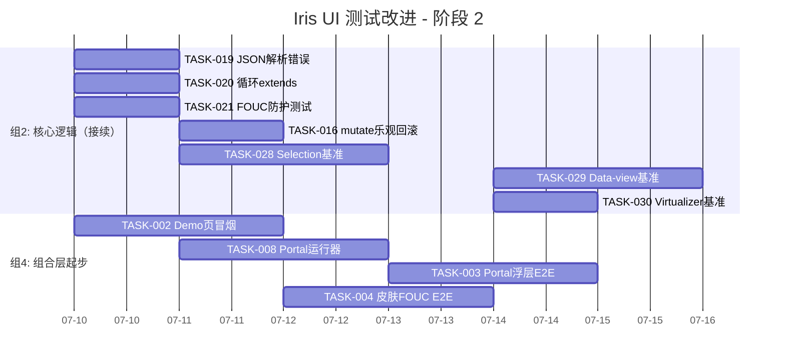
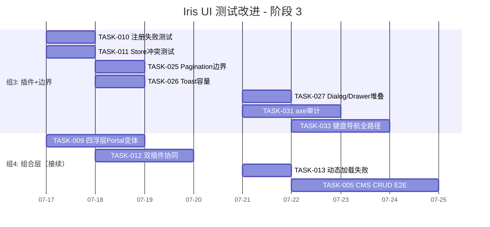
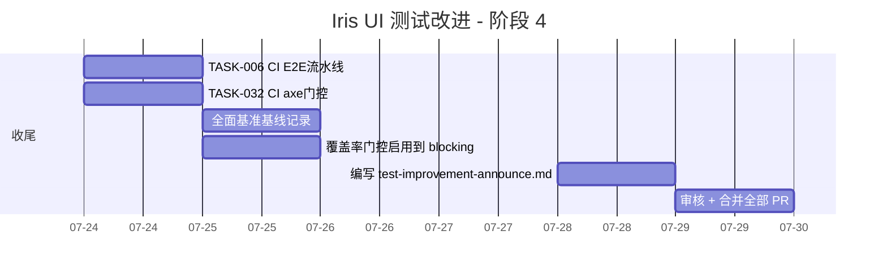

# Iris UI 测试改进计划 — Tech Lead 分析

---

## 1. 任务分解

### 任务清单

#### 方向 A：E2E 测试基础设施（P0）

| 任务 ID      | 任务标题                     | 涉及文件                                                                             | 前置依赖                 | 预估工时 | 验收标准                                                                                                                   |
| ------------ | ---------------------------- | ------------------------------------------------------------------------------------ | ------------------------ | -------- | -------------------------------------------------------------------------------------------------------------------------- |
| **TASK-001** | Playwright 安装与基础配置    | `apps/playground/`、`.github/workflows/ci.yml`、`playwright.config.ts`（根或各 app） | 无                       | 2h       | `npx playwright test` 可启动，config 指向 demo 页面；demo 页可正常加载                                                     |
| **TASK-002** | 四框架 Demo 页面加载冒烟测试 | `apps/playground-react/`、`apps/playground/`（vue）、solid/svelte demo               | TASK-001                 | 3h       | 为 4 个 demo 应用编写"页面加载、组件可见"冒烟测试                                                                          |
| **TASK-003** | Portal 浮层 E2E 测试         | 四框架 demo 的 Dialog/Popover/Drawer 页面                                            | TASK-002                 | 4h       | Dialog/Popover/Drawer 在 Portal 模式下打开/关闭/堆叠路径通过                                                               |
| **TASK-004** | 皮肤切换 FOUC 防护 E2E 测试  | 含皮肤切换的 demo 页面                                                               | TASK-002                 | 3h       | `await page.evaluate(() => document.documentElement.style.getPropertyValue('--iris-background'))` 切换后值变更；页面未闪白 |
| **TASK-005** | CMS CRUD 全流程 E2E          | `apps/cms-*` 4 个 demo                                                               | TASK-002                 | 5h       | 用户登录→列表加载→创建→编辑→删除→分页完整链路通过                                                                          |
| **TASK-006** | CI 集成 E2E 流水线           | `.github/workflows/ci.yml`                                                           | TASK-001 → TASK-005 任一 | 2h       | E2E 测试在 CI 中作为独立 job 运行；可选 `workflow_dispatch` 触发                                                           |

#### 方向 B：合约 Portal 模式扩展（P0）

| 任务 ID      | 任务标题                     | 涉及文件                                          | 前置依赖 | 预估工时 | 验收标准                                                             |
| ------------ | ---------------------------- | ------------------------------------------------- | -------- | -------- | -------------------------------------------------------------------- |
| **TASK-007** | 合约 portal 模式枚举类型定义 | `packages/core/src/contracts/types.ts`            | 无       | 1h       | `PortalMode` 类型（`disabled`/`enabled`）定义到合约参数中            |
| **TASK-008** | 合约适配器 portal 模式运行器 | `packages/core/src/contracts/run.ts`              | TASK-007 | 3h       | 合约在 portal-enabled 模式下将组件渲染到 body 下并查询；非侵入式变体 |
| **TASK-009** | 四浮层合约 portal 变体测试   | `packages/react/src/contracts/`、vue/solid/svelte | TASK-008 | 4h       | Dialog/Popover/Drawer/Tooltip 各加 1 个 portal 变体场景通过          |

#### 方向 C：插件测试深度提升（P1）

| 任务 ID      | 任务标题                             | 涉及文件                                                 | 前置依赖           | 预估工时 | 验收标准                                                                         |
| ------------ | ------------------------------------ | -------------------------------------------------------- | ------------------ | -------- | -------------------------------------------------------------------------------- |
| **TASK-010** | `createPlugin` 注册失败测试          | `packages/plugin-*/src/core/*.test.ts`                   | 无                 | 2h       | 各插件验证：无效 name（空/重复）→throw；missing install→throw                    |
| **TASK-011** | `usePluginStore` key 缺失 & 冲突测试 | `packages/plugin-*/src/*.test.ts`                        | 无                 | 2h       | 缺失 key → `Error` 抛出；两插件注册同名 key → 冲突行为定义（最后注册胜出/throw） |
| **TASK-012** | 双插件协同集成测试                   | `packages/plugin-editor/` + `packages/plugin-locale-zh/` | TASK-010, TASK-011 | 3h       | 中文 locale + Editor 组合使用；验证 i18n 消息覆盖编辑器文案                      |
| **TASK-013** | 插件动态加载/卸载错误处理测试        | `packages/core/src/plugins/`                             | TASK-010           | 2h       | 加载失败不破坏全局 store；卸载后相关 observer 不再收到通知                       |

#### 方向 D：异步竞态与错误路径覆盖（P1）

| 任务 ID      | 任务标题                              | 涉及文件                              | 前置依赖 | 预估工时 | 验收标准                                                                                          |
| ------------ | ------------------------------------- | ------------------------------------- | -------- | -------- | ------------------------------------------------------------------------------------------------- |
| **TASK-014** | Resource 连续 `setPage` 竞态测试      | `packages/core/src/resource.test.ts`  | 无       | 3h       | 3 次快速 `setPage(1)`→`setPage(2)`→`setPage(3)`，仅最后一次 `fetcher(3)` 被实际调用，前两次 abort |
| **TASK-015** | Resource fetcher 异常/超时测试        | `packages/core/src/resource.test.ts`  | 无       | 2h       | fetcher 抛 Error → `error` state + `loading=false`；fetcher 超时 → 回退/error                     |
| **TASK-016** | Resource mutate 乐观回滚测试          | `packages/core/src/resource.test.ts`  | 无       | 2h       | `mutate` 操作失败后数据回滚到 mutate 前状态；UI 显示回滚后数据                                    |
| **TASK-017** | Data-source 连续 filter/sort 竞态测试 | `packages/core/src/data-view.test.ts` | 无       | 3h       | 快速 `setFilter`→`setSort` 链式调用，结果与最后一次操作一致                                       |

#### 方向 E：皮肤/主题异常路径覆盖（P1）

| 任务 ID      | 任务标题                        | 涉及文件                            | 前置依赖 | 预估工时 | 验收标准                                                                                  |
| ------------ | ------------------------------- | ----------------------------------- | -------- | -------- | ----------------------------------------------------------------------------------------- |
| **TASK-018** | 皮肤网络加载失败测试            | `packages/skins/src/engine.test.ts` | 无       | 2h       | 模拟 fetch 404 → 回退到默认 skin + `onError` callback 被调用                              |
| **TASK-019** | 皮肤 JSON 解析错误测试          | `packages/skins/src/engine.test.ts` | 无       | 1.5h     | 无效 JSON → graceful fallback，不产生白屏                                                 |
| **TASK-020** | 皮肤循环 `extends` 引用测试     | `packages/skins/src/engine.test.ts` | 无       | 1.5h     | A → B → A → 检测循环 → throw 可读错误 + 不无限递归                                        |
| **TASK-021** | FOUC 防护 `skinBootScript` 测试 | `packages/skins/src/boot.test.ts`   | 无       | 2h       | 验证 boot script 的 `textContent`（非 innerHTML）注入；切换后 0ms 内 --iris-\* 变量已就绪 |

#### 方向 F：覆盖率门控与基础设施（P1）

| 任务 ID      | 任务标题                     | 涉及文件                                                       | 前置依赖 | 预估工时 | 验收标准                                                                     |
| ------------ | ---------------------------- | -------------------------------------------------------------- | -------- | -------- | ---------------------------------------------------------------------------- |
| **TASK-022** | CI 覆盖率阈值门控            | `scripts/test-coverage-report.mjs`、`.github/workflows/ci.yml` | 无       | 3h       | core ≥90%、适配器 ≥80%、插件 ≥70% → 低于阈值 CI 失败                         |
| **TASK-023** | CI flaky test retry 策略     | `.github/workflows/ci.yml`、各 vitest config                   | 无       | 1h       | 测试运行带 `--retry=2`；retry 次数记入 CI 报告；添加 `--flaky` reporter 备用 |
| **TASK-024** | 测试覆盖率报告发布到 PR 评论 | `.github/workflows/ci.yml`                                     | TASK-022 | 2h       | 每个 PR CI 完成后 coverage diff 自动评论到 PR                                |

#### 方向 G：边界/极端场景补充（P1–P2）

| 任务 ID      | 任务标题                       | 涉及文件                                            | 前置依赖 | 预估工时 | 验收标准                                                                                                |
| ------------ | ------------------------------ | --------------------------------------------------- | -------- | -------- | ------------------------------------------------------------------------------------------------------- |
| **TASK-025** | Pagination 边界值测试          | 各框架 `Pagination.test.ts` + contracts             | 无       | 2h       | `total=0` → 不渲染或显示"0/0"无 crash；`pageSize=total` → 单页；`page=Number.MAX_SAFE_INTEGER` → 不崩溃 |
| **TASK-026** | Toast 队列容量/去重测试        | `packages/core/src/toast.test.ts` 或其他 toast 相关 | 无       | 2h       | 队列满时 push → 丢弃最早/拒绝；相同内容连续触发 → 去重或合并显示                                        |
| **TASK-027** | Dialog/Drawer 堆叠引用计数测试 | `packages/react/src/Dialog.test.tsx`、Drawer 对应   | 无       | 2h       | 3 层 Dialog + 2 层 Drawer 混叠 → scroll lock count 正确；全部关闭→锁释放                                |

#### 方向 H：基准测试（P2）

| 任务 ID      | 任务标题                   | 涉及文件                               | 前置依赖 | 预估工时 | 验收标准                                                                                               |
| ------------ | -------------------------- | -------------------------------------- | -------- | -------- | ------------------------------------------------------------------------------------------------------ |
| **TASK-028** | Selection 大规模基准测试   | `packages/core/src/selection.bench.ts` | 无       | 3h       | `describe`×3（100/1000/10000项）测 `toggleAll`/`isSelected`/`getSelected`；在 CI 中运行并记录 baseline |
| **TASK-029** | Data-view 大规模基准测试   | `packages/core/src/data-view.bench.ts` | 无       | 3h       | 10000 行 data-view 测 filter/sort/paginate 操作吞吐量                                                  |
| **TASK-030** | Virtualizer 滚动吞吐量基准 | `packages/core/src/virtual.bench.ts`   | 无       | 2h       | 100000 项虚拟滚动测 `computeVirtualRange` 时间 < 1ms                                                   |

#### 方向 I：无障碍审计（P1）

| 任务 ID      | 任务标题                | 涉及文件                                      | 前置依赖 | 预估工时 | 验收标准                                                                          |
| ------------ | ----------------------- | --------------------------------------------- | -------- | -------- | --------------------------------------------------------------------------------- |
| **TASK-031** | 四框架关键组件 axe 审计 | 各框架 `a11y.test.ts`（新文件）               | 无       | 4h       | Button/Dialog/Popover/Select/Form 各 1 axe audit 用例；违反 WCAG A/AA → test fail |
| **TASK-032** | CI 集成 axe audit 门控  | `.github/workflows/ci.yml`                    | TASK-031 | 1h       | `pnpm test:a11y` 在 CI 中运行并阻塞合并                                           |
| **TASK-033** | 键盘导航全路径测试      | 各框架 `IrisSelect`/`IrisCombobox`/`IrisMenu` | 无       | 3h       | Tab→Enter→Arrow→Escape 全路径通过；roving tabindex 正确                           |

---

## 2. 执行顺序与依赖图

```mermaid
graph TD
    %% 方向 A: E2E
    T001[TASK-001: Playwright安装] --> T002[TASK-002: Demo页冒烟]
    T002 --> T003[TASK-003: Portal浮层E2E]
    T002 --> T004[TASK-004: 皮肤FOUC E2E]
    T002 --> T005[TASK-005: CMS CRUD E2E]
    T003 --> T006[TASK-006: CI E2E流水线]
    T004 --> T006
    T005 --> T006

    %% 方向 B: 合约Portal
    T007[TASK-007: PortalMode类型] --> T008[TASK-008: Portal运行器]
    T008 --> T009[TASK-009: 四浮层Portal变体]

    %% 方向 C: 插件深度
    T010[TASK-010: 注册失败测试] --> T012[TASK-012: 双插件协同]
    T011[TASK-011: Store冲突测试] --> T012
    T010 --> T013[TASK-013: 动态加载失败]

    %% 方向 D: 异步竞态
    T014[TASK-014: Resource竞态] --> T016[TASK-016: mutate乐观回滚]
    T015[TASK-015: Fetcher异常] --> T016
    T017[TASK-017: Data-view竞态]

    %% 方向 E: 皮肤异常
    T018[TASK-018: 网络加载失败] --- T019[TASK-019: JSON解析错误]
    T018 --- T020[TASK-020: 循环extends]
    T021[TASK-021: FOUC防护]

    %% 方向 F: 基础设施
    T022[TASK-022: 覆盖率门控] --- T023[TASK-023: flaky retry]
    T022 --- T024[TASK-024: 覆盖率PR评论]

    %% 方向 G: 边界
    T025[TASK-025: Pagination边界]
    T026[TASK-026: Toast容量]
    T027[TASK-027: Dialog/Drawer堆叠]

    %% 方向 H: 基准
    T028[TASK-028: Selection基准]
    T029[TASK-029: Data-view基准]
    T030[TASK-030: Virtualizer基准]

    %% 方向 I: 无障碍
    T031[TASK-031: axe审计] --> T032[TASK-032: CI axe门控]
    T033[TASK-033: 键盘导航全路径]

    %% 并行任务组
    subgraph 组1_基础设施[组1: 方向 A+B+F]
        T001
        T007
        T022
        T023
        T024
    end

    subgraph 组2_逻辑核心[组2: 方向 D+E+H 核心逻辑]
        T014
        T015
        T017
        T018
        T019
        T020
        T021
        T028
        T029
        T030
    end

    subgraph 组3_插件扩展[组3: 方向 C+G 组件覆盖]
        T010
        T011
        T025
        T026
        T027
        T031
        T033
    end
```

### 并行组标注

| 并行组                         | 包含任务                                                        | 预计总工时 | 所需人数（按 2 人并行） |
| ------------------------------ | --------------------------------------------------------------- | ---------- | ----------------------- |
| **组1：基础设施**              | TASK-001, 007, 022, 023, 024                                    | 9h         | 1 人                    |
| **组2：核心逻辑**              | TASK-014, 015, 017, 018, 019, 020, 021, 028, 029, 030           | 23h        | 1–2 人                  |
| **组3：组件覆盖**              | TASK-010, 011, 025, 026, 027, 031, 033                          | 16h        | 1–2 人                  |
| **组4：组合层**（依赖组1+2+3） | TASK-002, 003, 004, 005, 006, 008, 009, 012, 013, 016, 024, 032 | 34h        | 2 人                    |

---

## 3. 技术风险

### 3.1 高风险项

| #   | 风险                                                                                                       | 概率 | 影响 | 缓解策略                                                                                                                  |
| --- | ---------------------------------------------------------------------------------------------------------- | ---- | ---- | ------------------------------------------------------------------------------------------------------------------------- |
| R1  | **jsdom 无法测试 Portal 真实 DOM 行为** — Portal 到 body 的渲染、定位、z-index 堆叠上下文在 jsdom 中不可测 | 必然 | 高   | E2E（TASK-003）作为主防线；合约 portal 变体（TASK-009）作为 jsdom 层的结构化补充                                          |
| R2  | **Playwright CI 环境稳定性** — 浏览器安装、headless 渲染差异、定时器敏感                                   | 中   | 中   | 使用 Playwright 官方 Docker 镜像；对涉时测试加 `timeout` 上限；cache browser 下载                                         |
| R3  | **FOUC 防护的时序敏感** — `skinBootScript` 在 DOM 构建前的执行时机难以在测试中精确验证                     | 中   | 高   | 两种验证手段：1) E2E 中 `page.evaluate` 检查脚本执行前 CSS 变量是否就绪；2) 单元测试 mock `document.styleSheets` 注入时序 |
| R4  | **基准测试的 CI 波动** — 不同 runner 的 CPU/内存差异导致吞吐量波动                                         | 中   | 低   | 基准只测相对变化（≥X% 退化才 fail），非绝对值；使用 `@vitest/runner` 的 warmup 机制                                       |
| R5  | **插件 store 冲突行为未定义** — 当前架构未明确规范两个插件注册同名 store key 的行为（覆盖/合并/抛出）      | 中   | 高   | 先在 AGENTS.md 或插件文档中定义契约；然后 TASK-011 按契约断言                                                             |

### 3.2 外部依赖

| 依赖                                     | 用途           | 替代方案                                     | 风险等级 |
| ---------------------------------------- | -------------- | -------------------------------------------- | -------- |
| `@playwright/test`                       | E2E 测试       | Cypress（但 Playwright 跨语言、CI 生态更好） | 🟢 低    |
| `axe-playwright`                         | axe-core 集成  | 直接 `axe-core` npm 包 + page.evaluate       | 🟢 低    |
| `@vitest/ui` 或 `vitest --reporter=html` | 覆盖率报告生成 | 已就绪 `test-coverage-report.mjs`            | 🟢 低    |

### 3.3 需架构决策的点

| 问题                                     | 建议                                                                  | 决策者 |
| ---------------------------------------- | --------------------------------------------------------------------- | ------ |
| Portal 合约变体是独立 suite 还是参数化？ | 参数化（`runContracts({ portalMode: 'enabled' })`），避免测试文件爆炸 | 架构组 |
| 插件 store 同名 key 冲突的处理语义？     | 建议：后注册 `throw new Error(...)`，除非显式 `allowOverride`         | 架构组 |
| E2E 测试放在每个 app 内还是集中管理？    | 集中 `tests/e2e/` 目录 + 跨 app `projects` 配置                       | 维护者 |
| 覆盖率阈值：是否初期设较低再逐步收紧？   | 是：先设 core=80%、adapter=70%、plugin=60%，一月后提升                | 维护者 |

---

## 4. 资源评估

### 4.1 人员需求

| 角色                      | 技能要求                              | 数量 | 主要负责                                                  |
| ------------------------- | ------------------------------------- | ---- | --------------------------------------------------------- |
| **测试工程师 A** (senior) | Playwright、Vitest、CI 编写、架构理解 | 1    | 组1（基础设施）+ TASK-003/004/005/009（Portal/FOUC/合约） |
| **测试工程师 B** (mid)    | 单元测试、核心逻辑理解、bench 编写    | 1    | 组2（核心逻辑）+ 组3（插件+边界）                         |
| **开发工程师 C** (mid)    | 框架适配器理解、合约系统掌握          | 1    | 组3 + 组4 与各框架适配层                                  |
| **维护者**（兼职审核）    | 架构决策、API 审批                    | 0.2  | 决策点 + PR 审核                                          |

> 如果只有 1 人：优先组2（核心逻辑）→ 组3（插件/边界）→ 组1（基础设施），预期 7 周单干

### 4.2 时间线（2 人并行）

| 里程碑                    | 时间点    | 交付物                                                  | 阻塞点                              |
| ------------------------- | --------- | ------------------------------------------------------- | ----------------------------------- |
| **M1: 基础设施就绪**      | Week 1 末 | Playwright + CI E2E job + 覆盖率门控 + flaky retry      | 无                                  |
| **M2: Core 容错加强**     | Week 2 末 | Resource 竞态/异常/回滚 + Data-view 竞态 + 皮肤异常路径 | 无                                  |
| **M3: Portal & 合约覆盖** | Week 3 末 | Portal 浮层 E2E + 合约 portal 变体 + FOUC 防护验证      | TASK-007/008 的架构决策需 M1 前完成 |
| **M4: 插件与边界补全**    | Week 4 末 | 插件冲突/协同 + Pagination/Toast/Dialog 边界 + 基准测试 | 插件同名 key 决策需 M2 前完成       |
| **M5: 无障碍与键盘**      | Week 5 末 | axe audit + 键盘导航 + CI 门控                          | 无                                  |
| **M6: 组合验收**          | Week 6 末 | CMS E2E 全流程 + 双插件集成 + 全部基准跑通              | 各组完成的稳定性                    |

### 4.3 Blockers

| #   | Blocker                                   | 影响任务           | 解决策略                                                                                                                 | 最晚解决时间 |
| --- | ----------------------------------------- | ------------------ | ------------------------------------------------------------------------------------------------------------------------ | ------------ |
| B1  | Portal 测试策略决策（纯 E2E vs 合约变异） | TASK-003, TASK-009 | 建议"E2E 为主 + 合约变异为辅"双层；E2E 先做（TASK-003）不阻塞；合约变异（TASK-009）需 TASK-007/008 架构点头后第 2 周交付 | Week 1 末    |
| B2  | 插件 store 冲突语义定义                   | TASK-011, TASK-013 | 维护者 Week 1 内决策后写在 `packages/core/src/plugins/README.md` 中                                                      | Week 1 末    |
| B3  | 覆盖率阈值初始值                          | TASK-022           | 设宽松值（core 80%/adapter 70%/plugin 60%），PR 通过后一周验证可行再提升                                                 | Week 1 末    |

---

## 5. 质量保证

### 5.1 测试覆盖要求（新增）

| 模块                              | 要求              | 度量方式         |
| --------------------------------- | ----------------- | ---------------- |
| `packages/core/src/resource.ts`   | 分支覆盖率 ≥ 95%  | `coverage` 报告  |
| `packages/core/src/store.ts`      | 分支覆盖率 ≥ 95%  | 同上             |
| `packages/core/src/data-view.ts`  | 分支覆盖率 ≥ 90%  | 同上             |
| `packages/skins/src/engine.ts`    | 错误路径分支 100% | 同上（手动审核） |
| `packages/plugin-*/src/core/*.ts` | 分支覆盖率 ≥ 85%  | 同上             |

### 5.2 新增测试类型验收标准

| 测试类型         | 新增最少用例数  | 验收标准                                                     |
| ---------------- | --------------- | ------------------------------------------------------------ |
| E2E (Playwright) | 20 个           | 四框架 demo 加载 × 4 + Portal × 4 + 皮肤 × 2 + CMS CRUD × 10 |
| 合约 portal 变体 | 4 个场景        | Dialog/Popover/Drawer/Tooltip 各 1                           |
| 插件冲突/协作    | 6 个            | 注册失败 × 2 + store 冲突 × 2 + 双插件 × 2                   |
| 异步竞态         | 6 个            | Resource × 3 + Data-view × 1 + mutate × 2                    |
| 皮肤异常         | 5 个            | 网络 404 + JSON 解析 + 循环 extends + FOUC × 2               |
| 基准             | 3 个 bench 文件 | selection × 3 + data-view × 1 + virtual × 1                  |
| axe audit        | 10 个           | 各框架 Button/Dialog/Popover/Select/Form × 2                 |

### 5.3 代码审查要点

| #   | 审查要点                                | 说明                                                                                  |
| --- | --------------------------------------- | ------------------------------------------------------------------------------------- |
| CR1 | **Playwright 测试可读性**               | 使用 page object 而非裸露 `page.locator`；test id 用 `data-testid` 而非 class         |
| CR2 | **异步竞态测试的确定性**                | 使用 `vi.useFakeTimers()` + 精确控制 Promise 链；禁止 `setTimeout(..., 100)` 写死等待 |
| CR3 | **合约 portal 变体的 non-invasiveness** | 变体场景不应修改原合约的 har（render）函数签名，只能添加参数                          |
| CR4 | **覆盖率 mock 不可覆盖真实代码**        | 审查 `vi.mock` 调用——mock 的模块不应该覆盖"被测试函数的核心逻辑"                      |
| CR5 | **E2E 测试不写脆弱选择器**              | 禁止 `page.$('div > button:nth-child(2)')`；必须用 `getByRole`/`getByTestId`          |

### 5.4 性能测试需求

| 测试                                      | 目标      | 退化阈值                 |
| ----------------------------------------- | --------- | ------------------------ |
| `createSelectionModel` 10000 项 toggleAll | ≤ 5ms     | > 10ms = fail            |
| `createDataSource` 10000 行 filter        | ≤ 10ms    | > 20ms = fail            |
| `computeVirtualRange` 100000 项           | ≤ 0.5ms   | > 1ms = fail             |
| Playwright CMS 页面首次渲染               | ≤ 2s (CI) | > 5s = warn, > 8s = fail |

---

## 6. 实施计划

### 阶段 1：基础设施搭建（Week 1）

### 阶段 2：核心功能实现（Week 2–3）

### 阶段 3：集成测试和优化（Week 4–5）

### 阶段 4：发布准备（Week 6）

### 汇总时间线

| 阶段             | 时间段   | 并行任务数 | 总工时（估） | 交付物                                                 |
| ---------------- | -------- | ---------- | ------------ | ------------------------------------------------------ |
| 阶段 1：基础设施 | Week 1   | 5–6        | ~40h         | Playwright 配置 + CI E2E job + 覆盖率门控 + 架构决策   |
| 阶段 2：核心功能 | Week 2–3 | 6–7        | ~80h         | 核心逻辑/皮肤/异步测试 + 基准 + Portal E2E + Demo 冒烟 |
| 阶段 3：集成测试 | Week 4–5 | 6–8        | ~80h         | 插件/边界/无障碍测试 + Portal 合约 + CMS E2E           |
| 阶段 4：发布准备 | Week 6   | 3–4        | ~20h         | CI 门控最终化 + 基准基线 + 文档 + PR 合并              |
| **总计**         | **6 周** | —          | **~220h**    | 33 个任务 + 架构决策                                   |

### 关键里程碑

| 里程碑                     | 时间      | 判断标准                                                          |
| -------------------------- | --------- | ----------------------------------------------------------------- |
| 🟢 **M1: E2E First Light** | Week 1 末 | Playwright 跑通一个 Demo 页加载测试并用 `--project=chromium` 绿色 |
| 🟢 **M2: Core 零竞态**     | Week 2 末 | Resource/Data-view 所有竞态测试 100 次连续通过                    |
| 🔶 **M3: Portal 防线建成** | Week 3 末 | Portal E2E + 合约变体双层覆盖，Dialog 在 body 下打开验证通过      |
| 🔶 **M4: 插件契约固化**    | Week 4 末 | 全部插件通过冲突/协同/故障测试                                    |
| 🟢 **M5: 无障碍门控激活**  | Week 5 末 | axe audit 集成 CI，无 A/AA 违规                                   |
| 🏁 **M6: 全链路就绪**      | Week 6 末 | 覆盖率门控 blocking + 全部基准基线 + CI 全绿                      |

---

## 总结

这份改进计划将 QA 评审报告中识别的 **5 个 P0 + 7 个 P1 + 3 个 P2** 缺口转化为 **33 个可执行任务**，按 4 个并行组组织，预计 **2 人 × 6 周（~220 工时）** 完成。

**核心交付物：**

1. E2E 测试层（填补金字塔塔尖）
2. Portal 浮层双层防线（E2E + 合约变体）
3. 插件系统容错加固
4. 异步竞态全面覆盖
5. 覆盖率 CI 门控（防止无声退化）
6. 基准测试基线（防止性能退化）
7. 无障碍自动化审计

**最大风险：** Portal 测试策略决策和插件 store 冲突语义定义需 Week 1 内达成，否则影响依赖链。建议维护者在报告评审后立即决策这两项。
