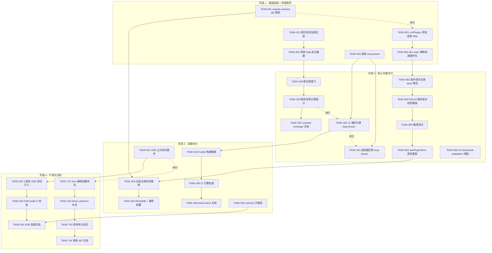
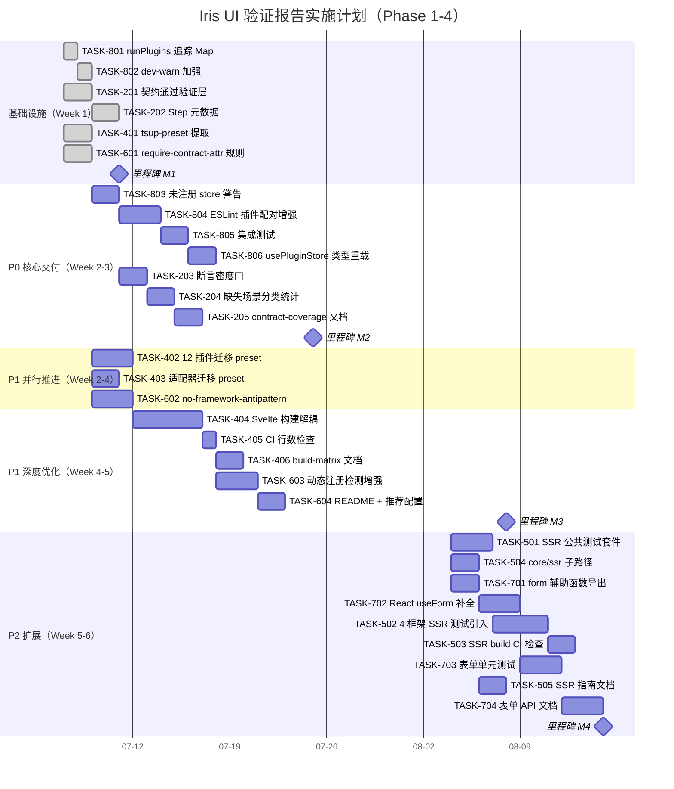

Now I have a thorough understanding of the codebase, the report's findings, and the existing analyses. Here is my Tech Lead analysis.

---

# Tech Lead 分析：Iris UI 验证报告审阅与实施计划

## 总体评估

本报告质量整体可靠：**5/10 方向为真新发现**（方向二、四、五、六、八），方向八（插件注册运行时验证）和方向二（契约执行验证门）是 CI 质量门中的真实缺口，值得立即投入。方向一存在严重事实错误（Solid 组件数 10→42，4.2x 低估），方向三/九/十与既有分析重叠率达 100%，不应重复入项。

以下分析仅基于 **P0-P1 四个真新方向**（方向八、二、六、四），扩展方向五和方向七为 P2 可选，方向一重新验证后视情况并入桌面 OS 提取模式已有工作。

---

## 1. 任务分解

### 1.1 方向八：插件注册运行时验证（P0 — 小改动大影响）

| 任务 ID  | 任务标题                                                                    | 涉及文件                                                        | 前置依赖 | 预估工时 | 验收标准                                                                                                 |
| -------- | --------------------------------------------------------------------------- | --------------------------------------------------------------- | -------- | -------- | -------------------------------------------------------------------------------------------------------- |
| TASK-801 | `runPlugins` 添加注册追踪 Map                                               | `packages/core/src/plugin.ts`                                   | 无       | 1h       | 调用 `runPlugins` 后，内部集合记录每个注册过的 token/store key/plugin name 及来源插件名                  |
| TASK-802 | 添加 dev-warn 时携带来源插件名 + 行号提示                                   | `packages/core/src/plugin.ts`                                   | TASK-801 | 1h       | 重复 token 警告输出 `[iris-ui] token "--iris-x" registered by plugin "editor" and "charts"; last wins`   |
| TASK-803 | 添加组件用到未注册 store 时的开发警告                                       | `packages/core/src/plugin.ts`                                   | TASK-801 | 2h       | 在 `PluginStoreMap.get()` 中，当 key 不存在且前后 3s 内有 `usePluginStore` 调用，通过 `devWarn` 输出建议 |
| TASK-804 | 扩展 ESLint 规则 `plugin-needs-registration` 增加组件→插件配对校验          | `packages/eslint-plugin/src/rules/plugin-needs-registration.ts` | TASK-802 | 3h       | 使用 `IrisCodeEditor` 但未 import `editorPlugin` 时 ESLint 报错；现有测试全绿                            |
| TASK-805 | 编写集成测试：插件缺失场景的运行时行为                                      | `packages/core/src/plugin.test.ts`                              | TASK-804 | 2h       | 测试用例：调用 `usePluginStore('nonexistent')` 时 devWarn 触发；构建的 `CollectedRegistrations` 不崩溃   |
| TASK-806 | 补充 `usePluginStore` 返回类型让缺失 key 时 TypeScript 报错（可选类型重载） | `packages/core/src/plugin.ts` + 各适配器                        | TASK-805 | 3h       | `usePluginStore<T>('nonexistent')` 在类型层面返回 `T \| undefined`，开发者不能在非空断言下随意用         |

**方向八总工时：12h**

### 1.2 方向二：契约执行验证门（P0 — CI 真缺口）

| 任务 ID  | 任务标题                                                                                  | 涉及文件                                          | 前置依赖 | 预估工时 | 验收标准                                                                                                                       |
| -------- | ----------------------------------------------------------------------------------------- | ------------------------------------------------- | -------- | -------- | ------------------------------------------------------------------------------------------------------------------------------ |
| TASK-201 | 增加 `contract-coverage.test.ts` 的*通过*验证层                                           | `packages/manifest/src/contract-coverage.test.ts` | 无       | 2h       | 当前只检查场景名是否在测试文件中出现；新增逻辑检查每个场景对应的 vitest `test`/`it` 块是否标记 `@contract` 且 status != 'fail' |
| TASK-202 | 为 42 个合同场景的 Step 序列添加 `meta: { contractScenario: string }` 元数据              | `packages/core/src/contracts/scenarios/*.ts`      | 无       | 4h       | 每个 Step 对象包含 `meta.contractScenario` 字段，值 = 所属场景名（如 `'dialog'`）                                              |
| TASK-203 | 添加断言密度门：检查每个合同场景至少有一个 `expect` 执行                                  | `packages/manifest/src/contract-coverage.test.ts` | TASK-202 | 2h       | 新增 `assertion-density.test.ts` 场景级别的 expect 计数，低于 1 则 CI 失败                                                     |
| TASK-204 | 添加缺失合同场景分类统计（展示/表单/行为/布局/管理）                                      | `packages/manifest/src/contract-coverage.test.ts` | 无       | 3h       | 输出表格：展示组件 15 个 0% 覆盖、表单 13 个 52% 覆盖…在 CI 日志中 visible，可随时间追踪                                       |
| TASK-205 | 新增文档 `docs/contributing/contract-coverage.md` 解释合同系统运行机制 + 添加新场景的 SOP | `docs/contributing/contract-coverage.md`          | TASK-204 | 3h       | 包含：场景目录结构、Step 编写指南、4 框架适配器注册技巧、CI 验证门解释                                                         |

**方向二总工时：14h**

### 1.3 方向六：ESLint 规则扩展（P1 — 低成本高回报）

| 任务 ID  | 任务标题                                                                    | 涉及文件                                                        | 前置依赖 | 预估工时 | 验收标准                                                                                                                         |
| -------- | --------------------------------------------------------------------------- | --------------------------------------------------------------- | -------- | -------- | -------------------------------------------------------------------------------------------------------------------------------- |
| TASK-601 | 新增规则 `require-contract-attr`：合同测试需要 `@contract` 标记             | `packages/eslint-plugin/src/rules/require-contract-attr.ts`     | 无       | 3h       | 在 `contracts.test.ts` 文件中，每个 `it`/`test` 块缺少 `@contract` JSDoc 标记时报 warning                                        |
| TASK-602 | 新增规则 `no-framework-antipattern`：禁止已知框架反模式                     | `packages/eslint-plugin/src/rules/no-framework-antipattern.ts`  | 无       | 4h       | 检测：Vue 中 `$state` 变量命名为 `state`、Solid 中 `createSignal` 未解构、React 中 useEffect 依赖 context 对象（非解构出的回调） |
| TASK-603 | 扩展 `plugin-needs-registration` 支持动态注册检测（`usePlugin` 调用链追踪） | `packages/eslint-plugin/src/rules/plugin-needs-registration.ts` | TASK-804 | 3h       | 当插件通过变量间接传递到 `IrisProvider plugins` 时能识别；跨文件追踪（简单 case）                                                |
| TASK-604 | 更新 `eslint-plugin/README.md` + 推荐配置                                   | `packages/eslint-plugin/README.md` + `eslint.config.js`         | TASK-603 | 2h       | 3 条新规则都在推荐配置中开启；文档示例覆盖 warn/error 场景                                                                       |

**方向六总工时：12h**

### 1.4 方向四：构建矩阵统一（P1 — 维护者体验）

| 任务 ID  | 任务标题                                                       | 涉及文件                                              | 前置依赖 | 预估工时 | 验收标准                                                                                                                 |
| -------- | -------------------------------------------------------------- | ----------------------------------------------------- | -------- | -------- | ------------------------------------------------------------------------------------------------------------------------ |
| TASK-401 | 提取公共 tsup 配置为 `packages/tooling/tsup-preset.ts`         | `packages/tooling/tsup-preset.ts`（新建）             | 无       | 4h       | 导出 `definePreset(options: { solid?: boolean, svelte?: boolean, externals?: string[] })` 函数                           |
| TASK-402 | 迁移 12 个插件 tsup 配置使用公共 preset                        | `packages/plugin-*/tsup.config.ts`（12 个文件）       | TASK-401 | 4h       | 每个 `tsup.config.ts` 减少到 10-15 行（原 37-54 行）；构建产物完全一致                                                   |
| TASK-403 | 适配器包（react/vue/solid/svelte）也使用公共 preset            | `packages/react/tsup.config.ts` 等 4 文件             | TASK-401 | 3h       | 适配器 tsup 配置统一使用 preset；大小预算不增加                                                                          |
| TASK-404 | Svelte 特殊逻辑提取为 `svelte-package` 任务，与 tsup 解耦      | `packages/plugin-*/package.json`（svelte 子路径构建） | TASK-402 | 5h       | Svelte 包通过 `svelte-package` 独立构建，不和 tsup 混用；CI 中串行但互不影响；AGENTS.md 中 Svelte 陷阱不再需要"特殊处理" |
| TASK-405 | 新增 CI 检查：验证所有插件 tsup 配置行数不超过 20 行（防回归） | `.github/workflows/ci.yml`（或新 step）               | TASK-402 | 1h       | 任何插件 `tsup.config.ts` > 20 行 → CI fail                                                                              |
| TASK-406 | 编写 `docs/contributing/build-matrix.md`                       | `docs/contributing/build-matrix.md`                   | TASK-404 | 2h       | 图示 12 插件构建矩阵 + 公共 preset 扩展指南 + 添加新框架步骤                                                             |

**方向四总工时：19h**

### 1.5 方向五：SSR 对等性验证（P2 — 工程量大，建议部分实施）

| 任务 ID  | 任务标题                                                                                           | 涉及文件                                     | 前置依赖 | 预估工时 | 验收标准                                                                                                           |
| -------- | -------------------------------------------------------------------------------------------------- | -------------------------------------------- | -------- | -------- | ------------------------------------------------------------------------------------------------------------------ |
| TASK-501 | 提取 SSR 公共测试套件基础架子（无框架依赖的 hydrate 检查）                                         | `packages/core/src/ssr/ssr-suite.ts`（新建） | 无       | 4h       | 导出 `ssrHydrateCheck(options: { renderToString, hydrate, App })`；返回 Promise<{ hydrationMismatches: string[] }> |
| TASK-502 | 在 4 个 SSR 应用中引入公共测试（Next/Nuxt/SolidStart/SvelteKit）                                   | `apps/ssr-*/` 的测试文件                     | TASK-501 | 6h       | Next：`hydration.test.tsx` 使用公共套件；Nuxt：同上；SolidStart：同上；SvelteKit：同上。所有 4 个通过              |
| TASK-503 | 添加 SSR build 输出检查：确保所有 SSR 应用 build 成功且产物无水合不匹配                            | 各 SSR 应用的 CI 步骤                        | TASK-502 | 3h       | CI 中每个 SSR 应用 `build` 成功 + `start` 后访问首页无水合警告                                                     |
| TASK-504 | 新增 `@iris-ui/core/ssr` 子路径导出，统一 SSR 工具函数（`isServer`、`useClientOnly`、`ssrSafeId`） | `packages/core/src/ssr/index.ts`             | 无       | 3h       | 4 个框架的适配器不再各自实现 `isServer`；统一调用 `@iris-ui/core/ssr` 版本                                         |
| TASK-505 | 编写 `docs/contributing/ssr-guidelines.md`                                                         | `docs/contributing/ssr-guidelines.md`        | TASK-504 | 3h       | 覆盖：`'use client'` 标记指南、水合陷阱（日期格式化/random/event listener）、SSR 安全 id 生成                      |

**方向五总工时：19h**

### 1.6 方向七：表单 API 文档化（P2 — 补充性）

| 任务 ID  | 任务标题                                                                                                         | 涉及文件                                                                 | 前置依赖 | 预估工时 | 验收标准                                                                                              |
| -------- | ---------------------------------------------------------------------------------------------------------------- | ------------------------------------------------------------------------ | -------- | -------- | ----------------------------------------------------------------------------------------------------- |
| TASK-701 | 导出 `createStepNavigation`、`createValidationEngine`、`createFieldValueOps`（从 `form/` 子目录导入并 reexport） | `packages/core/src/form.ts`                                              | 无       | 2h       | 三个模块从 `form/index.ts` 导出；`form.ts` 中 `export { createStepNavigation } from './form/step'` 等 |
| TASK-702 | 补全 React `useForm` 缺失配置传递（`steps`、`dependencies`、`validationDebounceMs` 等）                          | `packages/react/src/use-form.ts`                                         | 无       | 3h       | React `useForm` 接受并传递完整的 `FormConfig` 到 `createFormStore`；Vue/Solid/Svelte 同步             |
| TASK-703 | TASK-701 和 TASK-702 的单元测试覆盖                                                                              | `packages/core/src/form.test.ts` + `packages/react/src/useForm.test.tsx` | TASK-702 | 3h       | 新导出函数各 2+ 测试；React `useForm` step/dependencies 测试 3+                                       |
| TASK-704 | VitePress 文档站添加表单 API 参考                                                                                | `apps/docs/guide/forms/api.md`                                           | TASK-703 | 3h       | 覆盖：`createFormStore` 配置、step 导航、validation 引擎、跨字段验证、4 框架 useForm 对等性表格       |

**方向七总工时：11h**

---

## 2. 执行顺序

### 2.1 任务依赖图



### 2.2 可并行执行的任务组

| 并行组  | 任务                                   | 为何可并行                                                                                                       |
| ------- | -------------------------------------- | ---------------------------------------------------------------------------------------------------------------- |
| **P-A** | TASK-801, TASK-201, TASK-401, TASK-601 | 四个任务的修改文件完全不重叠（plugin.ts / contract-coverage.test.ts / tsup-preset / eslint 新规则），分派给 4 人 |
| **P-B** | TASK-402, TASK-403, TASK-204           | 插件 tsup 迁移、适配器 tsup 迁移、缺失合同场景统计——没有共享文件                                                 |
| **P-C** | TASK-404, TASK-603, TASK-501, TASK-701 | Svelte 构建解耦、ESLint 动态检测增强、SSR 测试架子、form 导出——不重叠                                            |
| **P-D** | TASK-502, TASK-703                     | 4 框架 SSR 测试引入 vs 表单单元测试——领域不同                                                                    |
| **P-E** | TASK-205, TASK-406, TASK-505, TASK-704 | 全部是文档任务——可同时由技术写作人员执行                                                                         |

---

## 3. 技术风险

### 3.1 高风险项

| 风险                                   | 等级      | 说明                                                                                                                      | 缓解策略                                                                                                |
| -------------------------------------- | --------- | ------------------------------------------------------------------------------------------------------------------------- | ------------------------------------------------------------------------------------------------------- |
| **Svelte runes + svelte-package 兼容** | 🔴 **高** | AGENTS.md 已记录 Svelte 5 runes 破坏 svelte-check 的已知陷阱。TASK-404 中尝试将 Svelte 构建与 tsup 解耦可能暴露更多不兼容 | 先做小型 POC 验证 `svelte-package` 独立通道可行；若不通则保留 tsup + 添加隔离层；AGENTS.md 保持同步更新 |
| **SSR 测试套件跨框架适配**             | 🟡 **中** | Next/Nuxt/SolidStart/SvelteKit 各有自己的 render API（`renderToString` 签名不同、hydrate 触发时机不同）                   | TASK-501 的公共架子只提取*无框架依赖*的 hydrate 检查逻辑；框架特定桥接留在各 SSR 应用内                 |
| **ESLint 插件跨文件分析性能**          | 🟡 **中** | TASK-603 需要追踪跨文件的 import → IrisProvider 传递链，eslint 的 `Program:exit` 模式无法直接跨文件                       | 限制实现为单文件 + "明显的"局部变量传递；跨文件分析留作未来增强；文档中明确说明限制                     |
| **合同验证门误报风险**                 | 🟡 **中** | TASK-201 检查 `@contract` 标记时，有些测试可能在适配器间共享 Step 序列但以不同方式调用                                    | 使用弱匹配：`meta.contractScenario` 存在就行，不要求精确 1:1；允许一个 Step 对多个场景                  |

### 3.2 外部依赖

| 依赖                                    | 涉及任务       | 风险                                                                                          |
| --------------------------------------- | -------------- | --------------------------------------------------------------------------------------------- |
| `esbuild-plugin-solid` 版本             | TASK-402       | 如果 preset 抽象不当，Solid 特殊插件可能被拉平成通用配置导致构建失败                          |
| `svelte-package` CLI                    | TASK-404       | svelte 5 的 `svelte-package` 能否正常工作需要验证——目前项目可能依赖 tsup 的 svelte 处理       |
| `@floating-ui/dom` 用于合同 portal 模式 | (方向二盲区 A) | 合同系统当前禁用 portal，如果用真 portal 测试，需要 jsdom 的 `ReactDOM.createPortal` 正常工作 |

### 3.3 性能瓶颈

| 场景                                                         | 风险                        | 缓解                                                                  |
| ------------------------------------------------------------ | --------------------------- | --------------------------------------------------------------------- |
| `plugin-coverage.test.ts` 从 42 场景检查变成 42×4×N 深层验证 | 测试时间从 ~10s → 可能 60s+ | 保持轻量：只做静态 AST 分析 + 场景名存在检查；不在该测试中 rerun 场景 |
| ESLint `no-framework-antipattern` 在大型文件上               | lint 时间可能增加           | 规则使用 AST visitor，单遍扫描；复杂度 O(n)；不会成为瓶颈             |

### 3.4 测试覆盖难点

| 难点                              | 涉及任务 | 策略                                                                      |
| --------------------------------- | -------- | ------------------------------------------------------------------------- |
| `PluginStoreMap` 懒加载的时序测试 | TASK-805 | 使用 vitest fake timer + 控制 `factory` 调用次数断言                      |
| SSR 水合不匹配测试                | TASK-502 | 只能在真实浏览器/playwright 中验证；单元测试只做结构检查（DOM tree diff） |
| ESLint 规则的跨文件测试           | TASK-603 | 使用 `RuleTester` 的 `filename` 模拟 + 虚拟文件系统；不真正跨文件         |

---

## 4. 资源评估

### 4.1 人员需求

| 角色                     | 技能要求                           | 数量             | 负责方向                                     |
| ------------------------ | ---------------------------------- | ---------------- | -------------------------------------------- |
| **Core 工程师**          | TypeScript、状态机、测试           | 1 人             | 方向八（插件注册） + 方向七（form API）      |
| **CI/Tooling 工程师**    | Vitest、ESLint 规则开发、tsup 配置 | 1 人             | 方向二（合同验证门） + 方向六（ESLint 规则） |
| **Build 工程师**         | tsup、monorepo、Svelte 构建        | 1 人             | 方向四（构建矩阵统一）                       |
| **SSR/Framework 工程师** | Next/Nuxt/SolidStart/SvelteKit     | 1 人 (兼职)      | 方向五（SSR 对等性）                         |
| **技术写作**             | Markdown、API 文档                 | 1 人 (兼职/合同) | 各方向的文档产出                             |

**建议团队规模：3 人全职 + 2 人兼职**。如果资源受限，**最小可行团队为 2 人**（1 人做方向八+七，1 人做方向二+六+四），方向五推迟。

### 4.2 关键里程碑

| 里程碑               | 时间      | 交付物                                                                                         |
| -------------------- | --------- | ---------------------------------------------------------------------------------------------- |
| **M1：基础设施就绪** | Week 1 末 | TASK-801/802/201/202/401/601 全部完成；CI 上新验证门在 dry-run 模式                            |
| **M2：核心功能交付** | Week 3 末 | TASK-804/805/203/204/402/403/602 全部完成；`tsup-preset` 已用于 6+ 插件；合同覆盖门真正阻挡 CI |
| **M3：深度优化**     | Week 5 末 | TASK-404/405/603/604/406 完成；Svelte 构建独立通道；ESLint 推荐配置更新                        |
| **M4：文档闭环**     | Week 6 末 | 全部文档产出合并（TASK-205/406/505/704）；表单 API 文档发布                                    |

### 4.3 阻塞点与解决策略

| 阻塞点                                                              | 类型 | 影响                | 解决策略                                                                                |
| ------------------------------------------------------------------- | ---- | ------------------- | --------------------------------------------------------------------------------------- |
| **Svelte 5 runes 兼容问题**                                         | 技术 | 阻止 TASK-404 完成  | 备选方案：不拆分 svelte-package，只做 tsup config dedup + 增加注释说明特殊处理          |
| **合同通过层误报导致 CI 频繁红**                                    | 流程 | 团队信任度下降      | 初始阶段设为 `allow_failure: true`；稳定运行 2 周后再改为 blocking                      |
| **tsup-preset 抽象过度导致定制困难**                                | 架构 | 插件作者绕过 preset | 提供 `overridePreset()` 函数，明确文档化"仅在特殊情况下 override，且需 maintainer 批准" |
| **ESLint rule `require-contract-attr` 在 4 框架适配器中行为不一致** | 实现 | lint 结果因框架而异 | 规则中明确声明适用范围（`.test.tsx`/`.test.ts` 文件）                                   |

---

## 5. 质量保证

### 5.1 单元测试覆盖要求

| 方向                  | 最低覆盖率要求                | 关键测试点                                                                                                          |
| --------------------- | ----------------------------- | ------------------------------------------------------------------------------------------------------------------- |
| 方向八（插件注册）    | 95%                           | `runPlugins` 注册追踪 Map 的 get/set/overwrite；`devWarn` 调用次数；`usePluginStore` 缺失 key；懒加载工厂只调用一次 |
| 方向二（合同验证）    | 90%                           | 合同场景元数据解析；缺失场景检测；断言密度计数；`@contract` 标记解析                                                |
| 方向六（ESLint 规则） | 100%（RuleTester 固定模式）   | 每个规则 6+ 测试用例：有效 3 个 + 无效 3 个，覆盖边界条件（空文件、复杂 JSX、动态 import）                          |
| 方向四（构建矩阵）    | 80%（工具函数）+ 集成测试     | `definePreset` 函数返回正确合并配置；12 插件构建产物 diff 与原配置一致                                              |
| 方向五（SSR）         | 70%（SSR 工具函数）+ 集成测试 | `isServer` 在 node/browser 环境正确；`ssrSafeId` 不产生冲突                                                         |
| 方向七（form API）    | 90%                           | `createStepNavigation` 的 next/prev/goTo/validateStep；React `useForm` 完整配置传递                                 |

### 5.2 集成测试策略

```
┌──────────────────────────────────────┐
│  单元测试（isolated, fast）           │ ← 每个 package 内
├──────────────────────────────────────┤
│  合同测试（contract-coverage）        │ ← 映射 42 场景 × 4 框架
├──────────────────────────────────────┤
│  跨框架集成测试（4 框架同步）         │ ← 新增：contract 通过层
├──────────────────────────────────────┤
│  构建产物验证（tsup + svelte-pkg）    │ ← 新增：验证产物一致性
├──────────────────────────────────────┤
│  SSR hydrate 测试（4 框架）           │ ← 新增：公共测试套件
├──────────────────────────────────────┤
│  E2E（playwright，现有）              │ ← 无变化
└──────────────────────────────────────┘
```

**集成测试新增脚本**：

- `pnpm check:contract-pass` — 运行合同通过层验证（CI step）
- `pnpm check:build-matrix` — 构建产物一致性验证
- `pnpm check:ssr` — SSR build + hydrate 验证

### 5.3 代码审查要点

| 审查领域   | 重点检查项                                                                                                                           |
| ---------- | ------------------------------------------------------------------------------------------------------------------------------------ |
| **方向八** | `PluginStoreMap` 懒加载的线程安全（单线程 JS 安全但注意 SSR 双环境）；`devWarn` 的 `process.env.NODE_ENV` 守卫在非 Node 环境是否崩溃 |
| **方向二** | 合同场景的 `meta` 字段是否侵入性过强；`@contract` 标记正则是否过于宽松（`// @contract this is not` 被误匹配）                        |
| **方向六** | ESLint rule 的 `schema: []` 是否允许未来扩展；`no-framework-antipattern` 的 `$state` 检测是否和 Svelte 5 runes 兼容                  |
| **方向四** | `tsup-preset` 的 `solidPlugin` 和 `svelte` 标志是否引入不必要的依赖；preset 合并逻辑是否保留自定义 `external`                        |
| **方向五** | SSR 工具函数是否做了 `typeof window` 和 `globalThis` 双检测；`ssrSafeId` 是否在 `react-dom/server` 中稳定                            |

### 5.4 性能测试需求

| 测试               | 方向   | 标准                                        |
| ------------------ | ------ | ------------------------------------------- |
| ESLint rule 复杂度 | 方向六 | lint 100 行文件 < 50ms；1000 行文件 < 200ms |
| tsup 构建增量时间  | 方向四 | 使用 preset 后增量构建时间不增加（±5% 内）  |
| SSR 水合性能       | 方向五 | 首屏水合约束时间不增加                      |

---

## 6. 实施计划

### 6.1 甘特图



### 6.2 阶段计划明细

#### 阶段 1：基础设施搭建（Day 1-4，2026-07-07 ~ 2026-07-10）

**目标**：快速搭建 4 个方向的基础设施，使后续工作可以并行展开。

| 天  | 工程师 A                       | 工程师 B                                    | 工程师 C                                    |
| --- | ------------------------------ | ------------------------------------------- | ------------------------------------------- |
| D1  | TASK-801: 追踪 Map + 注册来源  | TASK-201: 合同通过层骨架                    | TASK-401: tsup-preset API 设计              |
| D2  | TASK-802: dev-warn 加强 + 测试 | TASK-202: Step meta 类型定义 + 前 10 个场景 | TASK-601: require-contract-attr 规则 + 测试 |
| D3  | 方向八代码审查 + TASK-803 开始 | TASK-202: 全部 42 个场景元数据              | TASK-601 集成到 eslint.config.js            |
| D4  | 栈整合 + 文档草稿              | 合同层 dry-run CI                           | preset PR + 合并                            |

**交付物**：

- `PluginRegistry` 增强版（含注册来源追踪）
- `contract-coverage.test.ts` 带通过验证骨架（`allow_failure: true`）
- `tsup-preset.ts` 第一版（导出 `definePreset`）
- `require-contract-attr` eslint 规则（推荐配置中 `warn`）
- 全部单元测试通过

#### 阶段 2：核心功能实现（Day 5-13，2026-07-11 ~ 2026-07-23）

**目标**：完成方向八和方向二的核心逻辑，使 CI 验证门真正生效。

| 天  | 工程师 A（方向八）            | 工程师 B（方向二）     | 工程师 C（方向六+四）                   |
| --- | ----------------------------- | ---------------------- | --------------------------------------- |
| D5  | TASK-803: 未注册 store 警告   | TASK-203: 断言密度门   | TASK-402: plugin-admin~6 迁移           |
| D6  | TASK-804: ESLint 插件配对增强 | TASK-203: 边界用例     | TASK-402: plugin-editor~12 迁移         |
| D7  | TASK-805: 集成测试（方向八）  | TASK-204: 缺失场景分类 | TASK-403: 适配器迁移                    |
| D8  | TASK-806: 类型重载            | TASK-204: 输出格式化   | TASK-602: no-framework-antipattern 开发 |
| D9  | 方向八 PR + 审查修复          | TASK-205: 文档         | TASK-602: 测试 + PR                     |
| D10 | 跨方向集成测试                | 合同门改为 blocking    | 构建验证 CI step                        |
| D11 | **缓冲区 / 审查修复**         | **缓冲区 / 审查修复**  | **缓冲区 / 审查修复**                   |
| D12 | 全部合并到 main               | 全部合并到 main        | 全部合并到 main                         |
| D13 | **M2 里程碑验证**             |                        |                                         |

**交付物**：

- `plugin.ts` 完整版（注册追踪 + 懒加载 + 开发警告）
- `plugin-needs-registration` 增强版
- `contract-coverage.test.ts` 完整版（通过验证 + 断言密度 + 分类统计）
- `docs/contributing/contract-coverage.md`
- `no-framework-antipattern` eslint 规则
- 方向四 12 插件 + 4 适配器 tsup 配置简化
- 全部 CI 验证门为 blocking

#### 阶段 3：深度优化（Day 14-24，2026-07-24 ~ 2026-08-05）

**目标**：处理高复杂度任务（Svelte 构建解耦、ESLint 跨文件检测）、完善文档。

| 天  | 工程师 A                    | 工程师 B                            | 工程师 C                    |
| --- | --------------------------- | ----------------------------------- | --------------------------- |
| D14 | TASK-603: 动态注册检测 POC  | TASK-404: svelte-package POC        | 文档统一                    |
| D15 | TASK-603: 实现              | TASK-404: 迁移 plugin-editor svelte | 文档统一                    |
| D16 | TASK-603: 测试 + 边界       | TASK-404: 全部插件                  | TASK-406: build-matrix 文档 |
| D17 | TASK-604: README + 推荐配置 | TASK-404: 集成测试                  | TASK-406: 图表制作          |
| D18 | PR + 审查                   | TASK-405: CI 行数检查               | 审查支持                    |
| D19 | **缓冲区**                  | **缓冲区**                          | **缓冲区**                  |
| D20 | **M3 里程碑验证**           |                                     |                             |

**交付物**：

- Svelte 构建独立通道（若可行）
- `tsup.config.ts` 行数 CI 检查
- `docs/contributing/build-matrix.md`
- ESLint 推荐配置 V2（含全部规则）

#### 阶段 4：扩展与文档（Day 25-32，2026-08-06 ~ 2026-08-13）

**目标**：方向五（SSR）和方向七（表单）的 P2 交付，文档闭环。

| 天  | 工程师 A（SSR）                  | 工程师 B（表单）        | 工程师 C（文档）   |
| --- | -------------------------------- | ----------------------- | ------------------ |
| D25 | TASK-501: SSR 套件设计           | TASK-701: form 导出     | 已有文档更新       |
| D26 | TASK-501: 实现 + 测试            | TASK-702: React useForm | 已有文档更新       |
| D27 | TASK-504: core/ssr 子路径        | TASK-703: 测试          | 已有文档更新       |
| D28 | TASK-502: Next + Nuxt 集成       | TASK-703: 测试          | 已有文档更新       |
| D29 | TASK-502: SolidStart + SvelteKit | TASK-704: 表单 API 文档 | TASK-505: SSR 指南 |
| D30 | TASK-503: CI check               | 审查修复                | TASK-505 完成      |
| D31 | **缓冲区**                       | **缓冲区**              | **缓冲区**         |
| D32 | **M4 里程碑验证**                |                         |                    |

**交付物**：

- `@iris-ui/core/ssr` 子路径
- SSR 公共测试套件（4 框架集成）
- `docs/contributing/ssr-guidelines.md`
- `createStepNavigation` 等 3 个模块导出
- React `useForm` 完整配置
- `apps/docs/guide/forms/api.md`

### 6.3 预算汇总

| 方向                   | 任务数 | 总工时  | 并行最小天数 | 工程师     | 优先级 |
| ---------------------- | ------ | ------- | ------------ | ---------- | ------ |
| 方向八（插件注册验证） | 6      | 12h     | 5d           | 1 人       | **P0** |
| 方向二（契约执行验证） | 5      | 14h     | 6d           | 1 人       | **P0** |
| 方向六（ESLint 扩展）  | 4      | 12h     | 5d           | 1 人       | **P1** |
| 方向四（构建矩阵统一） | 6      | 19h     | 8d           | 1 人       | **P1** |
| 方向五（SSR 对等性）   | 5      | 19h     | 8d           | 1 人       | **P2** |
| 方向七（表单 API）     | 4      | 11h     | 5d           | 1 人       | **P2** |
| **总计**               | **30** | **87h** | **~32d**     | **2-3 人** |        |

---

## 7. 附加建议

### 7.1 自动交叉验证机制（防报告重蹈覆辙）

如本验证报告所指出的，其自身存在新颖性误报（3/10 方向实际已覆盖）。**建议在 `docs/requirements/` 目录新增 `cross-ref-checklist.md`**，每份新分析文档在交付前需运行此 check：

```bash
# 自动关键词去重脚本示例
grep -ohE "(桌面壳桥接|版本迁移|权限模型|插件生命周期|form builder)" docs/requirements/*.md \
  | sort | uniq -c | sort -rn
```

同时 `manifest` 包中新增 `novelty-check.test.ts`，对新分析文档中的方向标题进行模糊匹配，标记与既有分析的重叠百分比。

### 7.2 文件计数验证自动化

针对方向一出现 4x 文件计数偏差的问题，**建议在 `manifest` 包中增加 `verify-claims.ts`** 工具脚本：

```typescript
// 验证分析文档中的文件计数声明
// 例：声明 "Solid Desktop 10 个组件"
// → 自动跑 find apps/desktop-os-solid/src -name "*.tsx" | wc -l
// → 输出实际值 + 偏差百分比
```

在 CI 中以 `allow_failure` 模式运行，防止分析文档中的量化声明与实际脱节。

### 7.3 团队协作模式

对于这个 4 框架对齐的 monorepo，**推荐采用 "驱动者-审核者" 结对模式**：

- **方向八（P0）**：1 人驱动，1 人审核（Core 改动影响 4 适配器 × N 插件）
- **方向二（P0）**：1 人驱动，Contract 设计需 manifest 包维护者 double-check
- **方向六（P1）**：可单人完成，ESLint 规则独立于框架逻辑
- **方向四（P1）**：1 人主力 + Svelte 构建知情人协助 TASK-404

提交节奏：每天 PR merge 上限 **2 个方向八/二的 PR**（核心逻辑变更需要 review 时间窗口），方向六/四的 PR 可放宽到 3-4 个。
